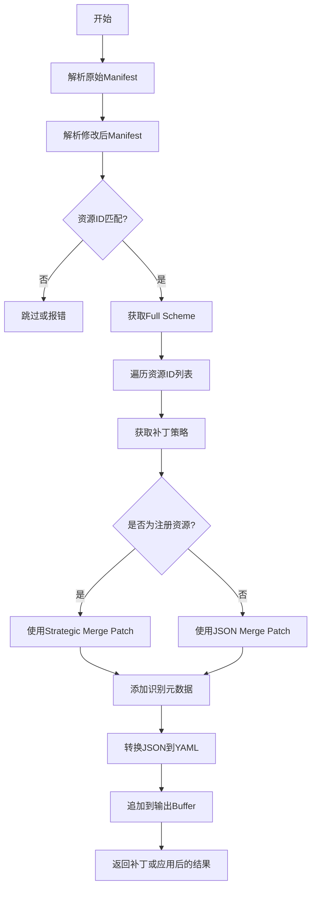
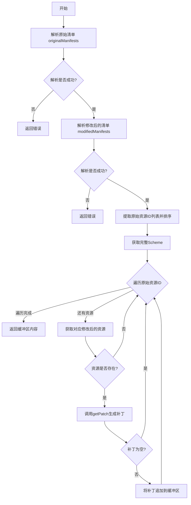
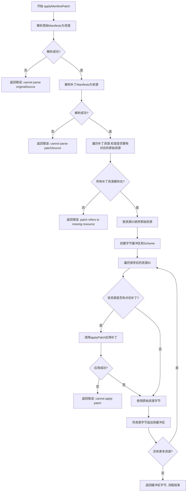
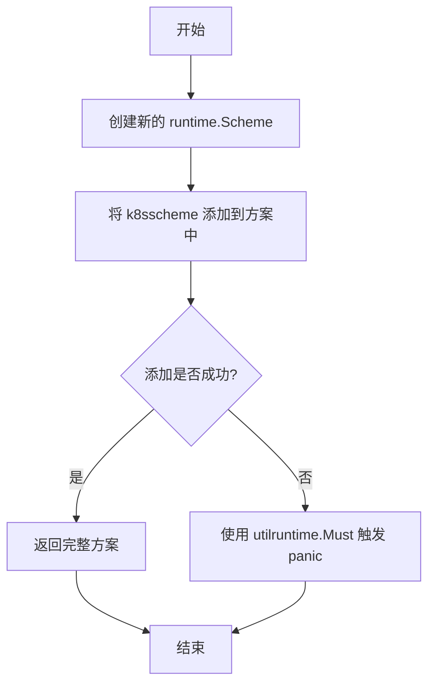
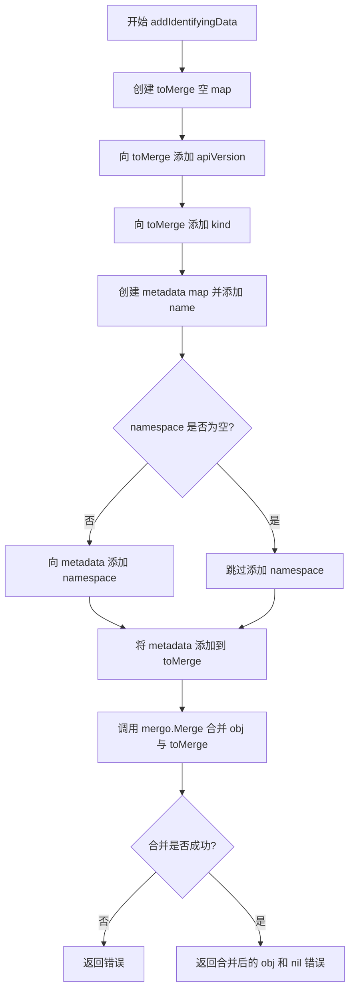
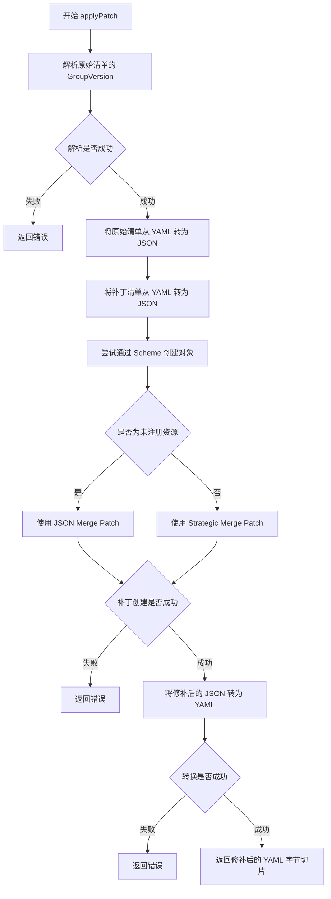
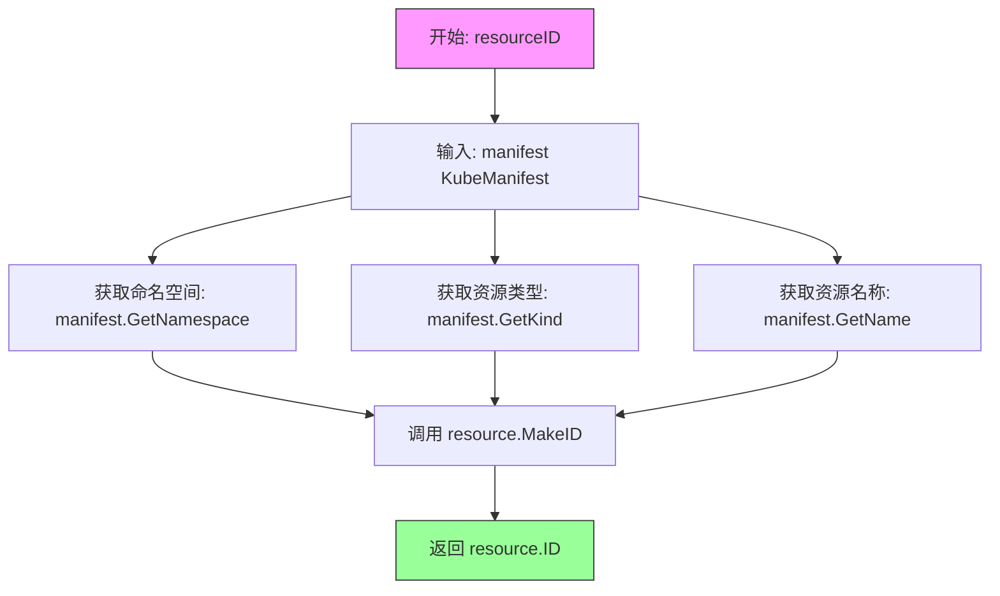
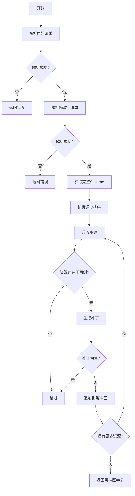
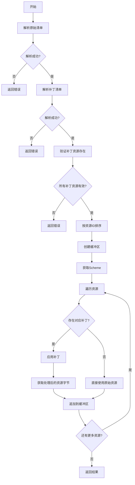

# `flux\pkg\cluster\kubernetes\patch.go` 详细设计文档

该代码是Fluxcd项目中的Kubernetes资源补丁处理模块，提供了创建和应用Kubernetes资源清单补丁的核心功能，支持JSON Merge Patch和Strategic Merge Patch两种策略，能够处理多文档YAML格式，并自动管理资源的版本和元数据。

## 整体流程



## 类结构

```
无类定义 (Go语言过程式编程)
├── 全局函数
│   ├── createManifestPatch
│   ├── applyManifestPatch
│   ├── getFullScheme
│   ├── getPatch
│   ├── addIdentifyingData
│   ├── applyPatch
│   └── resourceID
```

## 全局变量及字段


### `originalResources`
    
解析原始清单文件后得到的资源映射表

类型：`map[string]kresource.KubeManifest`
    


### `modifiedResources`
    
解析修改后清单文件后得到的资源映射表

类型：`map[string]kresource.KubeManifest`
    


### `patchResources`
    
解析补丁清单文件后得到的资源映射表

类型：`map[string]kresource.KubeManifest`
    


### `originalIDs`
    
用于排序输出的原始资源标识符列表

类型：`[]string`
    


### `originalManifests`
    
原始Kubernetes清单文件的字节内容

类型：`[]byte`
    


### `modifiedManifests`
    
修改后Kubernetes清单文件的字节内容

类型：`[]byte`
    


### `patchManifests`
    
补丁Kubernetes清单文件的字节内容

类型：`[]byte`
    


### `originalSource`
    
原始清单文件的来源标识（如文件名或路径）

类型：`string`
    


### `modifiedSource`
    
修改后清单文件的来源标识

类型：`string`
    


### `patchSource`
    
补丁清单文件的来源标识

类型：`string`
    


### `buf`
    
用于累积最终输出的字节缓冲区

类型：`*bytes.Buffer`
    


### `scheme`
    
Kubernetes资源序列化/反序列化方案

类型：`*runtime.Scheme`
    


### `originalResource`
    
从原始资源映射中获取的单个资源对象

类型：`kresource.KubeManifest`
    


### `modifiedResource`
    
从修改后资源映射中获取的单个资源对象

类型：`kresource.KubeManifest`
    


### `patchedResource`
    
补丁资源映射中对应的资源对象

类型：`kresource.KubeManifest`
    


### `patch`
    
计算得到的资源差异补丁字节数据

类型：`[]byte`
    


### `resourceBytes`
    
资源序列化后的字节内容

类型：`[]byte`
    


### `patched`
    
应用补丁后资源的YAML格式字节

类型：`[]byte`
    


### `groupVersion`
    
解析资源后得到的API组和版本信息

类型：`schema.GroupVersion`
    


### `manifest1JSON`
    
原始资源转换为JSON格式的字节数据

类型：`[]byte`
    


### `manifest2JSON`
    
修改后资源转换为JSON格式的字节数据

类型：`[]byte`
    


### `originalJSON`
    
原始清单转换为JSON格式的字节数据

类型：`[]byte`
    


### `patchJSON`
    
补丁内容转换为JSON格式的字节数据

类型：`[]byte`
    


### `patchedJSON`
    
应用补丁后资源JSON格式的字节数据

类型：`[]byte`
    


### `gvk`
    
包含API组、版本和资源类型的完整资源标识

类型：`schema.GroupVersionKind`
    


### `obj`
    
根据GVK创建的运行时资源对象

类型：`runtime.Object`
    


### `jsonObj`
    
用于解析和操作JSON补丁的通用对象容器

类型：`interface{}`
    


### `toMerge`
    
用于合并到补丁中的元数据映射

类型：`map[interface{}]interface{}`
    


### `metadata`
    
资源的名称和命名空间元数据

类型：`map[string]string`
    


    

## 全局函数及方法


### `createManifestPatch`

该函数是 Kubernetes 资源清单补丁创建的核心函数，用于比较原始和修改后的 Kubernetes 资源清单，生成两者之间的差异补丁（JSON Patch），并输出为 YAML 格式的多文档文件。

参数：
- `originalManifests`：`[]byte`，原始 Kubernetes 资源清单的字节数组
- `modifiedManifests`：`[]byte`，修改后的 Kubernetes 资源清单的字节数组
- `originalSource`：`string`，原始清单的来源标识（用于错误信息）
- `modifiedSource`：`string`，修改后清单的来源标识（用于错误信息）

返回值：`([]byte, error)`，返回生成的补丁字节数组（YAML 格式），如果发生错误则返回 error

#### 流程图



#### 带注释源码

```go
// createManifestPatch 比较原始和修改后的 Kubernetes 资源清单，生成差异补丁
// 参数：
//   - originalManifests: 原始 Kubernetes 资源清单（YAML 格式的多文档）
//   - modifiedManifests: 修改后的 Kubernetes 资源清单（YAML 格式的多文档）
//   - originalSource: 原始清单的来源标识（用于错误消息）
//   - modifiedSource: 修改后清单的来源标识（用于错误消息）
//
// 返回值：
//   - []byte: 生成的补丁（YAML 格式的多文档）
//   - error: 如果发生错误，返回错误信息
func createManifestPatch(originalManifests, modifiedManifests []byte, originalSource, modifiedSource string) ([]byte, error) {
	// 解析原始清单为多文档资源
	originalResources, err := kresource.ParseMultidoc(originalManifests, originalSource)
	if err != nil {
		// 注意：这里没有 return，但使用 fmt.Errorf 会丢失错误
		// 这是一个潜在 bug，应该改为 return nil, fmt.Errorf(...)
		fmt.Errorf("cannot parse %s: %s", originalSource, err)
	}

	// 解析修改后的清单为多文档资源
	modifiedResources, err := kresource.ParseMultidoc(modifiedManifests, modifiedSource)
	if err != nil {
		fmt.Errorf("cannot parse %s: %s", modifiedSource, err)
	}

	// 按资源标识符排序输出
	// 创建原始资源 ID 切片用于排序
	var originalIDs []string
	for id, _ := range originalResources {
		originalIDs = append(originalIDs, id)
	}
	sort.Strings(originalIDs)

	// 创建缓冲区存储输出
	buf := bytes.NewBuffer(nil)
	// 获取完整的 Kubernetes Scheme 用于类型处理
	scheme := getFullScheme()

	// 遍历排序后的资源 ID
	for _, id := range originalIDs {
		originalResource := originalResources[id]
		// 获取修改后的对应资源
		modifiedResource, ok := modifiedResources[id]
		if !ok {
			// 仅生成两个文件都存在的资源的补丁
			continue
		}

		// 获取该资源的补丁
		patch, err := getPatch(originalResource, modifiedResource, scheme)
		if err != nil {
			return nil, fmt.Errorf("cannot obtain patch for resource %s: %s", id, err)
		}

		// 避免输出空补丁（空 JSON 对象 {}）
		if bytes.Equal(patch, []byte("{}\n")) {
			continue
		}

		// 将补丁追加到缓冲区（YAML 格式）
		if err := appendYAMLToBuffer(patch, buf); err != nil {
			return nil, err
		}
	}

	// 返回缓冲区内容（可能为空字节切片）
	return buf.Bytes(), nil
}
```

#### 技术债务和潜在问题

1. **错误处理不完整**：函数中有多处 `fmt.Errorf` 但没有 `return`，导致错误被忽略。例如第 11 行和第 16 行，这会造成调用者无法感知解析失败。

2. **资源ID提取方式**：使用 `for id, _ := range` 风格，虽然 `_` 明确表示忽略第二个返回值，但更现代的做法是直接使用 `for id := range`。

3. **Helm Release 支持缺失**：代码注释中提到 HelmReleases 未添加到 scheme，因为 strategic merge patcher 无法处理 freeform 的 values 字段，这可能导致 Helm Release 类型的资源无法正确生成补丁。

4. **空返回值**：当没有资源或所有补丁都为空时，返回空字节切片而非 `nil`，可能与调用方预期不符。


### `applyManifestPatch`

该函数用于将补丁（patch）manifests 应用到原始 manifests 上，通过解析两种文档，验证补丁资源的有效性，然后遍历原始资源，对存在对应补丁的资源应用 JSON/strategic merge patch，最终返回合并后的 manifests 文档。

参数：

- `originalManifests`：`[]byte`，原始的 Kubernetes manifests 文档（多文档 YAML 格式）
- `patchManifests`：`[]byte`，补丁 manifests 文档，包含需要应用到原始资源上的变更
- `originalSource`：`string`，原始 manifests 的来源标识，用于错误信息中的定位
- `patchSource`：`string`，补丁 manifests 的来源标识，用于错误信息中的定位

返回值：`([]byte, error)`，成功时返回应用补丁后的 manifests 字节数组，失败时返回错误信息

#### 流程图



#### 带注释源码

```go
func applyManifestPatch(originalManifests, patchManifests []byte, originalSource, patchSource string) ([]byte, error) {
	// 第一步：解析原始 manifests 文档为资源映射
	// 使用 kresource.ParseMultidoc 解析多文档 YAML，返回 map[string]KubeManifest
	originalResources, err := kresource.ParseMultidoc(originalManifests, originalSource)
	if err != nil {
		// 解析失败时返回错误，包含原始源和具体错误信息
		return nil, fmt.Errorf("cannot parse %s: %s", originalSource, err)
	}

	// 第二步：解析补丁 manifests 文档为资源映射
	patchResources, err := kresource.ParseMultidoc(patchManifests, patchSource)
	if err != nil {
		// 解析失败时返回错误，包含补丁源和具体错误信息
		return nil, fmt.Errorf("cannot parse %s: %s", patchSource, err)
	}

	// 第三步：验证所有补丁资源都能在原始资源中找到对应项
	// 遍历补丁资源，确保每个补丁都有对应的原始资源
	for id, patchResource := range patchResources {
		if _, ok := originalResources[id]; !ok {
			// 如果补丁引用的资源不存在，返回错误
			return nil, fmt.Errorf("patch refers to missing resource (%s)", resourceID(patchResource))
		}
	}

	// 第四步：按资源标识符排序以保证输出顺序一致
	// 提取所有原始资源的 ID 并排序
	var originalIDs []string
	for id, _ := range originalResources {
		originalIDs = append(originalIDs, id)
	}
	sort.Strings(originalIDs)

	// 第五步：创建输出缓冲区和获取完整的 Kubernetes Scheme
	// Scheme 用于处理 Kubernetes 对象的序列化和版本转换
	buf := bytes.NewBuffer(nil)
	scheme := getFullScheme()

	// 第六步：遍历每个原始资源，应用对应的补丁（如果存在）
	for _, id := range originalIDs {
		// 获取原始资源字节
		originalResource := originalResources[id]
		resourceBytes := originalResource.Bytes()
		
		// 检查是否存在对应的补丁资源
		if patchedResource, ok := patchResources[id]; ok {
			// 存在补丁，调用 applyPatch 应用补丁
			patched, err := applyPatch(originalResource, patchedResource, scheme)
			if err != nil {
				// 应用补丁失败时返回错误
				return nil, fmt.Errorf("cannot apply patch for resource %s: %s", id, err)
			}
			// 使用补丁后的字节替换原始字节
			resourceBytes = patched
		}
		
		// 将资源字节追加到输出缓冲区（转换为 YAML 格式）
		if err := appendYAMLToBuffer(resourceBytes, buf); err != nil {
			return nil, err
		}
	}

	// 第七步：返回合并后的所有资源字节
	return buf.Bytes(), nil
}
```


### `getFullScheme`

该函数创建并返回一个包含标准 Kubernetes 类型方案的 runtime Scheme，但故意不包含 HelmReleases 资源类型，以避免 Kubernetes 战略合并补丁处理程序出现问题，并允许外部工具如 kustomize 使用正常的 jsonmerge 补丁。

参数： 无

返回值： `*runtime.Scheme`，返回一个配置好的 Kubernetes 资源方案指针，用于处理 Kubernetes 对象的创建和补丁操作

#### 流程图



#### 带注释源码

```go
// getFullScheme 创建一个包含标准 Kubernetes 资源类型的 Scheme
// 该 Scheme 用于处理 Kubernetes 对象的序列化和补丁操作
// 注意：HelmReleases 被故意排除在外，以避免战略合并补丁出现问题
func getFullScheme() *runtime.Scheme {
	// 创建新的空 Scheme 用于存储 Kubernetes 资源类型
	fullScheme := runtime.NewScheme()
	
	// 将 Kubernetes 标准资源类型添加到 Scheme 中
	// 这是必需的，因为需要能够识别和处理标准 Kubernetes 资源
	utilruntime.Must(k8sscheme.AddToScheme(fullScheme))
	
	// HelmReleases 被故意不添加到 Scheme 中，原因如下：
	// 1. Kubernetes 战略合并补丁器无法处理 values: 下的自由格式数据
	// 2. 外部工具如 kustomize 无法对自定义资源应用 SMP，
	//    因此我们使用普通的 jsonmerge 代替
	//
	// 如果需要添加 flux 的 scheme，取消下面注释：
	// utilruntime.Must(fluxscheme.AddToScheme(fullScheme))
	
	// 返回配置好的完整 Scheme，供补丁生成和应用使用
	return fullScheme
}
```


### `getPatch`

该函数是 Kubernetes 资源差异补丁生成的核心实现，负责计算两个 Kubernetes 资源清单（原始版本和修改版本）之间的差异，并生成可用于更新资源的补丁（patch）。它智能地判断资源类型是否已在 scheme 中注册，从而选择合适的补丁策略：对于已注册的资源类型使用 Kubernetes 战略合并补丁（Strategic Merge Patch），对于自定义资源（CRD）等未注册类型则使用标准的 JSON 合并补丁。最终输出格式为 YAML。

**参数：**

- `originalManifest`：`kresource.KubeManifest`，原始的 Kubernetes 资源清单，表示修改前的资源状态
- `modifiedManifest`：`kresource.KubeManifest`，修改后的 Kubernetes 资源清单，表示修改后的资源状态
- `scheme`：`*runtime.Scheme`，Kubernetes 运行时 Scheme，用于创建资源对象实例并判断资源类型是否已注册

**返回值：** `([]byte, error)`，返回生成的差异补丁（YAML 格式字节数组），如果生成失败则返回错误信息

#### 流程图

```mermaid
flowchart TD
    A[开始 getPatch] --> B[解析原始清单的 GroupVersion]
    B --> C{解析是否成功?}
    C -->|否| E[返回错误: cannot parse groupVersion]
    C -->|是| F[将原始清单转换为 JSON]
    F --> G[将修改后的清单转换为 JSON]
    G --> H[构建 GroupVersionKind]
    H --> I[尝试从 Scheme 创建资源对象]
    I --> J{错误类型判断}
    J -->|IsNotRegisteredError| K[使用 jsonpatch.CreateMergePatch]
    J -->|其他错误| L[返回错误: cannot obtain scheme]
    J -->|无错误| M[使用 strategicpatch.CreateTwoWayMergePatch]
    K --> N[补丁生成完成]
    M --> N
    N --> O[将补丁 JSON 解析为 interface{}]
    O --> P{解析是否成功?}
    P -->|否| Q[返回错误: cannot parse patch]
    P -->|是| R{补丁是否为空?}
    R -->|是| S[返回空补丁]
    R -->|否| T[添加识别元数据]
    T --> U[将补丁对象序列化为 YAML]
    U --> V[返回 YAML 补丁]
```

#### 带注释源码

```go
// getPatch 计算两个 Kubernetes 资源清单之间的差异并生成补丁
// 参数：
//   - originalManifest: 原始资源清单（修改前）
//   - modifiedManifest: 修改后的资源清单（修改后）
//   - scheme: Kubernetes 运行时 Scheme，用于处理资源类型
//
// 返回值：
//   - []byte: 生成的补丁（YAML 格式）
//   - error: 错误信息（如果生成失败）
func getPatch(originalManifest kresource.KubeManifest, modifiedManifest kresource.KubeManifest, scheme *runtime.Scheme) ([]byte, error) {
	// 步骤1: 解析原始清单的 GroupVersion，用于构建完整的 GVK
	groupVersion, err := schema.ParseGroupVersion(originalManifest.GroupVersion())
	if err != nil {
		return nil, fmt.Errorf("cannot parse groupVersion %q: %s", originalManifest.GroupVersion(), err)
	}

	// 步骤2: 将原始 YAML 清单转换为 JSON 格式，以便进行补丁计算
	manifest1JSON, err := jsonyaml.YAMLToJSON(originalManifest.Bytes())
	if err != nil {
		return nil, fmt.Errorf("cannot transform original resource (%s) to JSON: %s",
			resourceID(originalManifest), err)
	}

	// 步骤3: 将修改后的 YAML 清单转换为 JSON 格式
	manifest2JSON, err := jsonyaml.YAMLToJSON(modifiedManifest.Bytes())
	if err != nil {
		return nil, fmt.Errorf("cannot transform modified resource (%s) to JSON: %s",
			resourceID(modifiedManifest), err)
	}

	// 步骤4: 构建完整的 GroupVersionKind，用于 Scheme 中查找资源类型
	gvk := groupVersion.WithKind(originalManifest.GetKind())

	// 步骤5: 尝试从 Scheme 中创建资源对象，判断该类型是否已注册
	obj, err := scheme.New(gvk)

	var patchJSON []byte

	// 步骤6: 根据资源类型是否已注册，选择不同的补丁策略
	switch {
	case runtime.IsNotRegisteredError(err):
		// 如果资源类型未在 Scheme 中注册（如自定义资源 CRD），
		// 使用标准的 JSON Merge Patch（RFC 7396）
		patchJSON, err = jsonpatch.CreateMergePatch(manifest1JSON, manifest2JSON)

	case err != nil:
		// 其他错误（如权限问题、格式错误等）
		err = fmt.Errorf("cannot obtain scheme for GroupVersionKind %q: %s", gvk, err)

	default:
		// 如果资源类型已注册，使用 Kubernetes 战略合并补丁
		// 战略合并补丁能够理解 Kubernetes 资源结构的语义，
		// 正确处理如 annotations、labels、image 等字段的合并策略
		patchJSON, err = strategicpatch.CreateTwoWayMergePatch(manifest1JSON, manifest2JSON, obj)
	}

	// 检查补丁生成是否成功
	if err != nil {
		return nil, err
	}

	// 步骤7: 将补丁 JSON 解析为通用 interface{} 类型
	// 注意：这里使用 yaml.Unmarshal 而不是 json.Unmarshal，
	// 因为 Go 的 JSON 库在 unmarshal 到 interface{} 时不会自动选择正确的数值类型（int、float 等）
	var jsonObj interface{}
	err = yaml.Unmarshal(patchJSON, &jsonObj)
	if err != nil {
		return nil, fmt.Errorf("cannot parse patch (resource %s): %s",
			resourceID(originalManifest), err)
	}

	// 步骤8: 为非空补丁添加识别元数据，以便在多文档 YAML 上下文中进行匹配
	// 这确保了补丁可以正确关联到对应的资源
	if m, ok := jsonObj.(map[interface{}]interface{}); ok && len(m) > 0 {
		jsonObj, err = addIdentifyingData(originalManifest.GroupVersion(),
			originalManifest.GetKind(), originalManifest.GetName(), originalManifest.GetNamespace(), m)
	}

	// 检查元数据添加是否成功
	if err != nil {
		return nil, fmt.Errorf("cannot add metadata to patch (resource %s): %s", resourceID(originalManifest), err)
	}

	// 步骤9: 将补丁对象序列化为 YAML 格式返回
	patch, err := yaml.Marshal(jsonObj)
	if err != nil {
		return nil, fmt.Errorf("cannot transform updated patch (resource %s) to YAML: %s",
			resourceID(originalManifest), err)
	}

	return patch, nil
}
```


### `addIdentifyingData`

该函数用于在生成 Kubernetes 资源补丁时，向补丁对象中添加必要的标识数据（apiVersion、kind、metadata），以确保在多文档 YAML 上下文中能够正确匹配和识别资源。

参数：

- `apiVersion`：`string`，资源的 API 版本（如 `v1`、`apps/v1` 等）
- `kind`：`string`，资源类型（如 `Deployment`、`Service` 等）
- `name`：`string`，资源的名称
- `namespace`：`string`，资源的命名空间（可选，若为空则不添加）
- `obj`：`map[interface{}]interface{}`，需要添加标识数据的原始补丁对象

返回值：`map[interface{}]interface{}`，添加标识数据后的对象；`error`，合并过程中可能发生的错误

#### 流程图



#### 带注释源码

```go
// addIdentifyingData 用于在生成补丁时添加标识数据
// 参数说明：
//   - apiVersion: 资源的 API 版本
//   - kind: 资源类型
//   - name: 资源名称
//   - namespace: 资源命名空间（可为空）
//   - obj: 需要添加标识的原始对象
// 返回值：
//   - map[interface{}]interface{}: 添加标识后的对象
//   - error: 合并过程中的错误信息
func addIdentifyingData(apiVersion string, kind string, name string, namespace string,
	obj map[interface{}]interface{}) (map[interface{}]interface{}, error) {

	// 创建一个空的 map 用于存储待合并的标识数据
	toMerge := map[interface{}]interface{}{}
	
	// 添加 apiVersion 字段
	toMerge["apiVersion"] = apiVersion
	
	// 添加 kind 字段
	toMerge["kind"] = kind
	
	// 创建 metadata map，首先包含 name
	metadata := map[string]string{
		"name": name,
	}
	
	// 只有当 namespace 不为空时才添加 namespace 字段
	if len(namespace) > 0 {
		metadata["namespace"] = namespace
	}
	
	// 将 metadata 添加到待合并的 map 中
	toMerge["metadata"] = metadata
	
	// 使用 mergo 库将标识数据合并到原始对象中
	// mergo.Merge 会将 toMerge 中的字段合并到 obj 中
	err := mergo.Merge(&obj, toMerge)
	
	// 返回合并后的对象和可能的错误
	return obj, err
}
```


### `applyPatch`

该函数将补丁资源应用到原始资源清单，支持 Kubernetes 原生资源的策略性合并补丁和自定义资源的 JSON 合并补丁，并返回修补后的 YAML 格式资源。

参数：

- `originalManifest`：`kresource.KubeManifest`，原始 Kubernetes 资源清单
- `patchManifest`：`kresource.KubeManifest`，补丁资源清单
- `scheme`：`*runtime.Scheme`，Kubernetes 运行时 Scheme，用于创建对象实例和处理策略性合并补丁

返回值：`([]byte, error)`，返回修补后的 YAML 格式资源字节切片，或在发生错误时返回错误信息

#### 流程图



#### 带注释源码

```go
func applyPatch(originalManifest, patchManifest kresource.KubeManifest, scheme *runtime.Scheme) ([]byte, error) {
	// 解析原始资源的 GroupVersion，用于确定资源类型
	groupVersion, err := schema.ParseGroupVersion(originalManifest.GroupVersion())
	if err != nil {
		return nil, fmt.Errorf("cannot parse groupVersion %q: %s", originalManifest.GroupVersion(), err)
	}

	// 将原始资源从 YAML 格式转换为 JSON 格式，以便处理
	originalJSON, err := jsonyaml.YAMLToJSON(originalManifest.Bytes())
	if err != nil {
		return nil, fmt.Errorf("cannot transform original resource (%s) to JSON: %s",
			resourceID(originalManifest), err)
	}

	// 将补丁资源从 YAML 格式转换为 JSON 格式
	patchJSON, err := jsonyaml.YAMLToJSON(patchManifest.Bytes())
	if err != nil {
		return nil, fmt.Errorf("cannot transform patch resource (%s) to JSON: %s",
			resourceID(patchManifest), err)
	}

	// 尝试通过 Scheme 创建对象，用于策略性合并补丁
	obj, err := scheme.New(groupVersion.WithKind(originalManifest.GetKind()))
	var patchedJSON []byte
	switch {
	case runtime.IsNotRegisteredError(err):
		// 如果资源类型未在 Scheme 中注册（例如自定义资源），则使用普通的 JSON Merge Patch
		patchedJSON, err = jsonpatch.MergePatch(originalJSON, patchJSON)
	default:
		// 否则使用 Kubernetes 的策略性合并补丁，支持内置资源类型的合并策略
		patchedJSON, err = strategicpatch.StrategicMergePatch(originalJSON, patchJSON, obj)
	}
	if err != nil {
		return nil, fmt.Errorf("cannot patch resource %s: %s", resourceID(originalManifest), err)
	}

	// 将修补后的 JSON 转换回 YAML 格式
	patched, err := jsonyaml.JSONToYAML(patchedJSON)
	if err != nil {
		return nil, fmt.Errorf("cannot transform patched resource (%s) to YAML: %s", resourceID(originalManifest), err)
	}
	return patched, nil
}
```


### `resourceID`

该函数用于从 Kubernetes manifest 对象中提取资源标识符（resource.ID），其工作原理类似于 `Resource.ID()` 方法，但特别之处在于它会忽略可能不正确的 `<cluster>` 命名空间，确保生成的资源标识符更加准确可靠。

参数：

- `manifest`：`kresource.KubeManifest`，Kubernetes 资源清单对象，包含资源的元数据信息

返回值：`resource.ID`，资源标识符，由命名空间、资源类型和资源名称组合而成的唯一标识

#### 流程图



#### 带注释源码

```go
// resourceID works like Resource.ID() but avoids <cluster> namespaces,
// since they may be incorrect
// resourceID 函数用于生成资源的唯一标识符，其工作原理类似于 Resource.ID() 方法
// 但它会避免使用 <cluster> 命名空间，因为这些命名空间可能是错误的
func resourceID(manifest kresource.KubeManifest) resource.ID {
    // 调用 resource.MakeID 函数，传入命名空间、类型和名称三个参数
    // 生成并返回资源的唯一标识符
    return resource.MakeID(manifest.GetNamespace(), manifest.GetKind(), manifest.GetName())
}
```

## 关键组件


### createManifestPatch 函数

用于比较原始清单和修改后的清单，生成两者之间的差异补丁。按资源标识符排序输出，支持 Kubernetes 原生资源和使用 JSON Merge Patch 的自定义资源。

### applyManifestPatch 函数

将生成的补丁应用到原始清单上，验证补丁中引用的资源在原始清单中是否存在，然后按资源标识符顺序输出应用补丁后的结果。

### getPatch 函数

生成单个资源的补丁，根据资源是否在 Kubernetes Scheme 中注册来选择使用战略合并补丁（Strategic Merge Patch）还是 JSON Merge Patch，并为非空补丁添加元数据以便在多文档 YAML 中匹配。

### applyPatch 函数

将补丁应用到单个资源上，根据资源类型选择相应的合并策略：对于未注册的类型使用 JSON Merge Patch，对于已注册的类型使用 Strategic Merge Patch，最终将结果转换回 YAML 格式。

### getFullScheme 函数

创建完整的 Kubernetes Scheme 并注册内置资源类型，但故意不添加 HelmRelease 等自定义资源，以避免 Kubernetes 战略合并补丁处理器的兼容性问题。

### addIdentifyingData 函数

为补丁添加识别元数据，包括 apiVersion、kind、name 和 namespace，确保补丁能够与多文档 YAML 中的目标资源正确匹配。

### resourceID 函数

生成资源的唯一标识符，使用命名空间、类型和名称组合，避免使用可能不正确的集群命名空间。

### kresource.ParseMultidoc 函数

将多文档 YAML 解析为资源映射表，支持从字节数据中提取多个 Kubernetes 资源清单。


## 问题及建议


### 已知问题

- **错误处理不完整**：在`createManifestPatch`函数中，第15-17行使用`fmt.Errorf`但没有`return`语句，导致错误被忽略，函数会继续执行并可能产生空指针异常或后续错误。
- **代码重复**：解析多文档YAML和排序资源ID的逻辑在`createManifestPatch`和`applyManifestPatch`两个函数中完全重复，增加了维护成本。
- **类型安全问题**：`getPatch`函数中使用`map[interface{}]interface{}`进行类型断言，缺乏类型安全，应使用具体的结构体类型替代。
- **性能开销**：`getFullScheme()`每次调用都创建新的`runtime.Scheme`实例，而Kubernetes scheme可以缓存复用。
- **资源过滤策略不明确**：对于仅在原始清单中存在但在修改清单中不存在的资源，`createManifestPatch`使用`continue`静默跳过，没有明确的日志记录或警告，可能导致用户困惑。
- **Magic字符串**：`bytes.Equal(patch, []byte("{}\n"))`中使用硬编码的空JSON对象字符串，魔法值应提取为常量。
- **错误传播不一致**：部分错误使用`fmt.Errorf`包装，部分直接返回，错误处理风格不统一。

### 优化建议

- 修复`createManifestPatch`中的错误处理，添加`return nil,`前缀或使用`return fmt.Errorf(...)`。
- 将重复的解析和排序逻辑提取为独立的辅助函数，如`parseAndSortResources`。
- 定义具体的补丁结构体替代`map[interface{}]interface{}`，或在`addIdentifyingData`中使用`map[string]interface{}`以提高类型安全性。
- 将`getFullScheme`改为单例模式或全局缓存的scheme实例，减少重复初始化开销。
- 为缺失资源的处理添加日志记录或配置选项，使行为更透明。
- 将`"{}\n"`提取为常量`EmptyJSONObject = "{}"`或使用更可靠的空补丁检测方式。
- 统一错误处理风格，全部使用`fmt.Errorf`包装错误信息，包含更多上下文。

## 其它


### 一段话描述

该代码是Flux CD项目中的Kubernetes清单处理包，提供了创建和应用Kubernetes资源清单补丁（patch）的核心功能，支持多文档YAML格式的解析与处理，通过区分内置资源类型和自定义资源类型，分别采用战略性合并补丁（Strategic Merge Patch）和JSON合并补丁（JSON Merge Patch）两种策略生成和应用补丁。

### 文件的整体运行流程

该包主要处理两类场景：生成补丁（createManifestPatch）和应用补丁（applyManifestPatch）。

**生成补丁流程（createManifestPatch）：**
1. 解析原始清单文件，提取资源集合
2. 解析修改后的清单文件，提取资源集合
3. 按资源ID排序确保输出顺序一致
4. 遍历原始资源，对每个存在于两个清单中的资源生成补丁
5. 将生成的补丁转换为YAML格式并追加到缓冲区

**应用补丁流程（applyManifestPatch）：**
1. 解析原始清单文件和补丁清单文件
2. 验证所有补丁资源都有对应的原始资源
3. 按资源ID排序
4. 遍历原始资源，如果有对应补丁则应用补丁
5. 将处理后的资源输出为YAML格式

### 类详细信息

该文件为工具包文件（utils package），无类定义，主要包含全局函数。

### 全局变量

无显式全局变量。

### 全局函数

#### 1. createManifestPatch

- **参数名称**: originalManifests, modifiedManifests, originalSource, modifiedSource
- **参数类型**: []byte, []byte, string, string
- **参数描述**: 原始清单字节数组、修改后清单字节数组、原始清单来源标识、修改后清单来源标识
- **返回值类型**: []byte, error
- **返回值描述**: 生成的多文档YAML补丁字节数组，或错误信息

**mermaid流程图**:


**带注释源码**:
```go
func createManifestPatch(originalManifests, modifiedManifests []byte, originalSource, modifiedSource string) ([]byte, error) {
	// 解析原始清单文件为资源映射
	originalResources, err := kresource.ParseMultidoc(originalManifests, originalSource)
	if err != nil {
		fmt.Errorf("cannot parse %s: %s", originalSource, err)
	}

	// 解析修改后的清单文件为资源映射
	modifiedResources, err := kresource.ParseMultidoc(modifiedManifests, modifiedSource)
	if err != nil {
		fmt.Errorf("cannot parse %s: %s", modifiedSource, err)
	}
	// 按资源标识符排序输出
	var originalIDs []string
	for id, _ := range originalResources {
		originalIDs = append(originalIDs, id)
	}
	sort.Strings(originalIDs)

	// 创建缓冲区存储结果
	buf := bytes.NewBuffer(nil)
	// 获取完整的Kubernetes Scheme以支持所有内置资源类型
	scheme := getFullScheme()
	// 遍历每个原始资源ID
	for _, id := range originalIDs {
		originalResource := originalResources[id]
		// 检查修改后的资源中是否存在该资源
		modifiedResource, ok := modifiedResources[id]
		if !ok {
			// 仅对两侧都存在的资源生成补丁
			continue
		}
		// 获取该资源的补丁
		patch, err := getPatch(originalResource, modifiedResource, scheme)
		if err != nil {
			return nil, fmt.Errorf("cannot obtain patch for resource %s: %s", id, err)
		}
		// 避免输出空补丁
		if bytes.Equal(patch, []byte("{}\n")) {
			continue
		}
		// 将补丁YAML追加到缓冲区
		if err := appendYAMLToBuffer(patch, buf); err != nil {
			return nil, err
		}
	}
	return buf.Bytes(), nil
}
```

#### 2. applyManifestPatch

- **参数名称**: originalManifests, patchManifests, originalSource, patchSource
- **参数类型**: []byte, []byte, string, string
- **参数描述**: 原始清单字节数组、补丁清单字节数组、原始清单来源标识、补丁清单来源标识
- **返回值类型**: []byte, error
- **返回值描述**: 应用补丁后的多文档YAML字节数组，或错误信息

**mermaid流程图**:


**带注释源码**:
```go
func applyManifestPatch(originalManifests, patchManifests []byte, originalSource, patchSource string) ([]byte, error) {
	// 解析原始清单为资源映射
	originalResources, err := kresource.ParseMultidoc(originalManifests, originalSource)
	if err != nil {
		return nil, fmt.Errorf("cannot parse %s: %s", originalSource, err)
	}

	// 解析补丁清单为资源映射
	patchResources, err := kresource.ParseMultidoc(patchManifests, patchSource)
	if err != nil {
		return nil, fmt.Errorf("cannot parse %s: %s", patchSource, err)
	}

	// 确保所有补丁资源都有对应的原始资源
	for id, patchResource := range patchResources {
		if _, ok := originalResources[id]; !ok {
			return nil, fmt.Errorf("patch refers to missing resource (%s)", resourceID(patchResource))
		}
	}

	// 按资源标识符排序以保证输出顺序一致
	var originalIDs []string
	for id, _ := range originalResources {
		originalIDs = append(originalIDs, id)
	}
	sort.Strings(originalIDs)

	// 创建结果缓冲区
	buf := bytes.NewBuffer(nil)
	scheme := getFullScheme()
	// 遍历每个资源
	for _, id := range originalIDs {
		originalResource := originalResources[id]
		resourceBytes := originalResource.Bytes()
		// 检查是否存在对应的补丁
		if patchedResource, ok := patchResources[id]; ok {
			// 存在补丁，应用它
			patched, err := applyPatch(originalResource, patchedResource, scheme)
			if err != nil {
				return nil, fmt.Errorf("cannot apply patch for resource %s: %s", id, err)
			}
			resourceBytes = patched
		}
		// 将资源YAML追加到缓冲区
		if err := appendYAMLToBuffer(resourceBytes, buf); err != nil {
			return nil, err
		}
	}

	return buf.Bytes(), nil
}
```

#### 3. getFullScheme

- **参数名称**: 无
- **参数类型**: 无
- **参数描述**: 无
- **返回值类型**: *runtime.Scheme
- **返回值描述**: 包含所有Kubernetes内置资源类型的完整Scheme

**带注释源码**:
```go
func getFullScheme() *runtime.Scheme {
	// 创建新的空Scheme
	fullScheme := runtime.NewScheme()
	// 添加Kubernetes客户端scheme，包含所有内置资源类型
	utilruntime.Must(k8sscheme.AddToScheme(fullScheme))
	// HelmReleases故意不添加到scheme，原因如下：
	// 1. Kubernetes战略性合并补丁器无法处理values下的自由格式数据
	// 2. 外部工具如kustomize无法对自定义资源应用SMP，因此使用普通jsonmerge
	// utilruntime.Must(fluxscheme.AddToScheme(fullScheme))
	return fullScheme
}
```

#### 4. getPatch

- **参数名称**: originalManifest, modifiedManifest, scheme
- **参数类型**: kresource.KubeManifest, kresource.KubeManifest, *runtime.Scheme
- **参数描述**: 原始Kubernetes资源清单、修改后的资源清单、运行时Scheme
- **返回值类型**: []byte, error
- **返回值描述**: 生成的JSON补丁YAML格式字节数组，或错误信息

**带注释源码**:
```go
func getPatch(originalManifest kresource.KubeManifest, modifiedManifest kresource.KubeManifest, scheme *runtime.Scheme) ([]byte, error) {
	// 解析原始资源的GroupVersion
	groupVersion, err := schema.ParseGroupVersion(originalManifest.GroupVersion())
	if err != nil {
		return nil, fmt.Errorf("cannot parse groupVersion %q: %s", originalManifest.GroupVersion(), err)
	}
	// 将原始资源YAML转换为JSON
	manifest1JSON, err := jsonyaml.YAMLToJSON(originalManifest.Bytes())
	if err != nil {
		return nil, fmt.Errorf("cannot transform original resource (%s) to JSON: %s",
			resourceID(originalManifest), err)
	}
	// 将修改后的资源YAML转换为JSON
	manifest2JSON, err := jsonyaml.YAMLToJSON(modifiedManifest.Bytes())
	if err != nil {
		return nil, fmt.Errorf("cannot transform modified resource (%s) to JSON: %s",
			resourceID(modifiedManifest), err)
	}
	// 构建完整的GroupVersionKind
	gvk := groupVersion.WithKind(originalManifest.GetKind())
	// 尝试在scheme中创建对象
	obj, err := scheme.New(gvk)
	var patchJSON []byte
	switch {
	// 对于未注册的类型（自定义资源），使用普通JSON合并补丁
	case runtime.IsNotRegisteredError(err):
		patchJSON, err = jsonpatch.CreateMergePatch(manifest1JSON, manifest2JSON)
	// 其他错误
	case err != nil:
		err = fmt.Errorf("cannot obtain scheme for GroupVersionKind %q: %s", gvk, err)
	// 对于已注册的类型，使用战略性合并补丁
	default:
		patchJSON, err = strategicpatch.CreateTwoWayMergePatch(manifest1JSON, manifest2JSON, obj)
	}
	if err != nil {
		return nil, err
	}
	// 使用yaml.Unmarshal因为Go JSON库在解组到interface{}时不会选择正确的数字类型
	var jsonObj interface{}
	err = yaml.Unmarshal(patchJSON, &jsonObj)
	if err != nil {
		return nil, fmt.Errorf("cannot parse patch (resource %s): %s",
			resourceID(originalManifest), err)
	}
	// 确保非空补丁包含元数据，以便在多文档yaml上下文中匹配
	if m, ok := jsonObj.(map[interface{}]interface{}); ok && len(m) > 0 {
		jsonObj, err = addIdentifyingData(originalManifest.GroupVersion(),
			originalManifest.GetKind(), originalManifest.GetName(), originalManifest.GetNamespace(), m)
	}
	if err != nil {
		return nil, fmt.Errorf("cannot add metadata to patch (resource %s): %s", resourceID(originalManifest), err)
	}
	// 将补丁转换回YAML格式
	patch, err := yaml.Marshal(jsonObj)
	if err != nil {
		return nil, fmt.Errorf("cannot transform updated patch (resource %s) to YAML: %s",
			resourceID(originalManifest), err)
	}
	return patch, nil
}
```

#### 5. addIdentifyingData

- **参数名称**: apiVersion, kind, name, namespace, obj
- **参数类型**: string, string, string, string, map[interface{}]interface{}
- **参数描述**: API版本、资源类型、资源名称、命名空间、补丁对象映射
- **返回值类型**: map[interface{}]interface{}, error
- **返回值描述**: 添加了识别元数据的补丁映射，或错误信息

**带注释源码**:
```go
func addIdentifyingData(apiVersion string, kind string, name string, namespace string,
	obj map[interface{}]interface{}) (map[interface{}]interface{}, error) {

	// 创建要合并的元数据映射
	toMerge := map[interface{}]interface{}{}
	toMerge["apiVersion"] = apiVersion
	toMerge["kind"] = kind
	// 构建metadata子映射
	metadata := map[string]string{
		"name": name,
	}
	// 如果存在命名空间则添加
	if len(namespace) > 0 {
		metadata["namespace"] = namespace
	}
	toMerge["metadata"] = metadata
	// 使用mergo库合并元数据到原始对象
	err := mergo.Merge(&obj, toMerge)
	return obj, err
}
```

#### 6. applyPatch

- **参数名称**: originalManifest, patchManifest, scheme
- **参数类型**: kresource.KubeManifest, kresource.KubeManifest, *runtime.Scheme
- **参数描述**: 原始Kubernetes资源清单、补丁资源清单、运行时Scheme
- **返回值类型**: []byte, error
- **返回值描述**: 应用补丁后的资源YAML格式字节数组，或错误信息

**带注释源码**:
```go
func applyPatch(originalManifest, patchManifest kresource.KubeManifest, scheme *runtime.Scheme) ([]byte, error) {
	// 解析GroupVersion
	groupVersion, err := schema.ParseGroupVersion(originalManifest.GroupVersion())
	if err != nil {
		return nil, fmt.Errorf("cannot parse groupVersion %q: %s", originalManifest.GroupVersion(), err)
	}
	// 将原始资源转换为JSON
	originalJSON, err := jsonyaml.YAMLToJSON(originalManifest.Bytes())
	if err != nil {
		return nil, fmt.Errorf("cannot transform original resource (%s) to JSON: %s",
			resourceID(originalManifest), err)
	}
	// 将补丁资源转换为JSON
	patchJSON, err := jsonyaml.YAMLToJSON(patchManifest.Bytes())
	if err != nil {
		return nil, fmt.Errorf("cannot transform patch resource (%s) to JSON: %s",
			resourceID(patchManifest), err)
	}
	// 创建对象用于战略性合并
	obj, err := scheme.New(groupVersion.WithKind(originalManifest.GetKind()))
	var patchedJSON []byte
	switch {
	// 未注册类型使用普通JSON合并
	case runtime.IsNotRegisteredError(err):
		patchedJSON, err = jsonpatch.MergePatch(originalJSON, patchJSON)
	// 已注册类型使用战略性合并
	default:
		patchedJSON, err = strategicpatch.StrategicMergePatch(originalJSON, patchJSON, obj)
	}
	if err != nil {
		return nil, fmt.Errorf("cannot patch resource %s: %s", resourceID(originalManifest), err)
	}
	// 将结果转换回YAML
	patched, err := jsonyaml.JSONToYAML(patchedJSON)
	if err != nil {
		return nil, fmt.Errorf("cannot transform patched resource (%s) to YAML: %s", resourceID(originalManifest), err)
	}
	return patched, nil
}
```

#### 7. resourceID

- **参数名称**: manifest
- **参数类型**: kresource.KubeManifest
- **参数描述**: Kubernetes资源清单
- **返回值类型**: resource.ID
- **返回值描述**: 资源的唯一标识符

**带注释源码**:
```go
// resourceID功能类似Resource.ID()但避免<cluster>命名空间，
// 因为它们可能不正确
func resourceID(manifest kresource.KubeManifest) resource.ID {
	return resource.MakeID(manifest.GetNamespace(), manifest.GetKind(), manifest.GetName())
}
```

### 关键组件信息

#### 1. kresource.ParseMultidoc

- **描述**: 解析多文档YAML字节数组为Kubernetes资源映射

#### 2. jsonpatch.CreateMergePatch

- **描述**: 创建JSON合并补丁，用于自定义资源

#### 3. strategicpatch.CreateTwoWayMergePatch

- **描述**: 创建双向战略性合并补丁，用于内置Kubernetes资源

#### 4. strategicpatch.StrategicMergePatch

- **描述**: 应用战略性合并补丁到目标资源

#### 5. jsonpatch.MergePatch

- **描述**: 应用JSON合并补丁到目标资源

#### 6. getFullScheme

- **描述**: 创建包含所有Kubernetes内置资源类型的完整Scheme，但排除HelmReleases自定义资源

### 潜在的技术债务或优化空间

1. **错误处理不完整**: createManifestPatch函数中解析错误使用fmt.Errorf而非return语句，可能导致错误被忽略
2. **未使用的导入**: 代码中存在未使用的导入或潜在冗余
3. **命名空间处理**: resourceID函数注释提到"<cluster>"命名空间问题，但实现较为简单，可能需要更完善的处理逻辑
4. **性能优化**: 对于大型多文档YAML，可以考虑流式处理而非一次性加载所有资源到内存
5. **HelmReleases支持**: 当前故意不支持HelmReleases的战略性合并，可能需要更优雅的处理方式
6. **单元测试缺失**: 代码中缺少单元测试用例覆盖各种边界条件

### 设计目标与约束

#### 设计目标

1. 支持Kubernetes多文档YAML格式的解析和处理
2. 为内置Kubernetes资源类型提供战略性合并补丁支持
3. 为自定义资源（CRD）提供JSON合并补丁支持
4. 保持输出资源顺序的一致性（按资源ID排序）
5. 避免生成和应用空的补丁

#### 设计约束

1. HelmReleases自定义资源不参与战略性合并，因为values字段的自由格式数据会导致合并冲突
2. 自定义资源使用JSON合并补丁以兼容kustomize等外部工具
3. 所有补丁必须包含识别元数据（apiVersion、kind、metadata）以便在多文档上下文中匹配

### 错误处理与异常设计

1. **解析错误**: 返回格式化的错误信息，包含源文件和具体解析错误
2. **补丁生成错误**: 包含资源ID以便定位问题
3. **补丁应用错误**: 验证所有补丁资源都有对应的原始资源，防止应用到不存在的资源
4. **Scheme错误**: 区分资源是否已注册，选择合适的补丁策略
5. **YAML/JSON转换错误**: 包含资源ID和转换方向信息

### 数据流与状态机

**createManifestPatch数据流**:
```
原始YAML → ParseMultidoc → 资源映射 → 排序 → 遍历资源 → getPatch → YAML补丁 → 缓冲区 → 输出YAML
```

**applyManifestPatch数据流**:
```
原始YAML → ParseMultidoc → 资源映射
补丁YAML → ParseMultidoc → 资源映射 → 验证 → 遍历 → applyPatch → 处理后资源 → 缓冲区 → 输出YAML
```

**补丁策略选择状态机**:
```
检查资源是否在Scheme中注册
├── 已注册 → 使用战略性合并补丁(strategicpatch)
└── 未注册 → 使用JSON合并补丁(jsonpatch)
```

### 外部依赖与接口契约

#### 外部依赖

1. **github.com/evanphx/json-patch**: JSON补丁创建和应用
2. **github.com/ghodss/yaml**: YAML与JSON互转
3. **github.com/imdario/mergo**: 结构体合并工具
4. **gopkg.in/yaml.v2**: YAML解析和序列化
5. **k8s.io/apimachinery/pkg/runtime**: Kubernetes Scheme和对象处理
6. **k8s.io/apimachinery/pkg/runtime/schema**: GroupVersionKind处理
7. **k8s.io/apimachinery/pkg/util/strategicpatch**: 战略性合并补丁
8. **k8s.io/client-go/kubernetes/scheme**: Kubernetes客户端Scheme
9. **github.com/fluxcd/flux/pkg/cluster/kubernetes/resource**: Kubernetes资源类型
10. **github.com/fluxcd/flux/pkg/resource**: 资源ID处理

#### 接口契约

1. **kresource.KubeManifest接口**: 需要提供Bytes()、GroupVersion()、GetKind()、GetName()、GetNamespace()方法
2. **resource.ID类型**: 资源唯一标识符
3. **输入格式**: 多文档YAML格式
4. **输出格式**: 多文档YAML格式

### 其他项目

#### 并发安全性

该包中的函数均为纯函数设计，不涉及共享状态修改，在多goroutine环境下可以安全并发调用。但建议避免同时对同一资源文件进行读写操作。

#### 兼容性考虑

1. Kubernetes API版本兼容性依赖于k8s.io/apimachinery版本
2. 自定义资源补丁策略考虑了与kustomize等工具的兼容性
3. YAML输出格式保持了与kubectl和Helm的兼容性

#### 边界条件处理

1. 空补丁过滤：避免输出空对象补丁{}
2. 缺失资源处理：仅对两侧都存在的资源生成补丁
3. 资源不存在错误：应用补丁时验证所有补丁资源都有对应原始资源

    