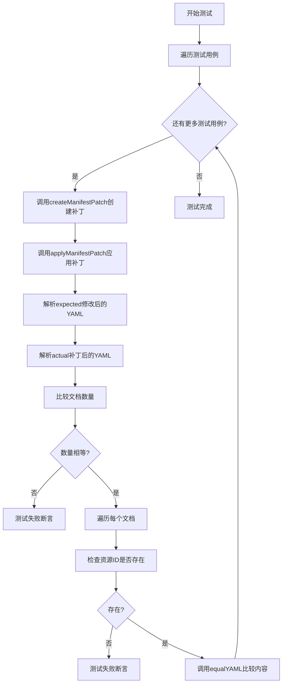
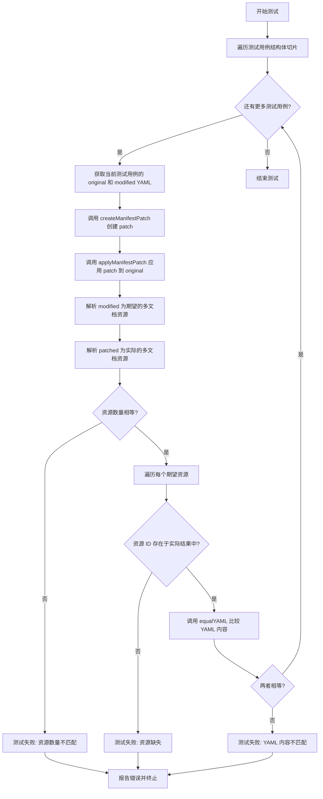

# `flux\pkg\cluster\kubernetes\patch_test.go` 详细设计文档

这是一个Kubernetes资源补丁测试文件，用于测试createManifestPatch和applyManifestPatch两个函数，验证对Kubernetes manifests（包括Deployment、HelmRelease、Namespace等资源）的创建和应用补丁功能是否正确，特别是处理多文档YAML、镜像标签更新、annotations变更等场景。

## 整体流程



## 类结构

```
测试文件 (无类结构)
├── TestPatchAndApply (主测试函数)
└── equalYAML (辅助测试函数)
```

## 全局变量及字段


    

## 全局函数及方法


### `TestPatchAndApply`

这是一个测试函数，用于验证 Kubernetes 资源清单的 Patch 创建和应用功能是否正确。测试通过比较原始清单经 patch 处理后的结果与期望的修改后清单，来确保 `createManifestPatch` 和 `applyManifestPatch` 函数能够正确生成和应用 JSON Patch。

参数：

- `t`：`*testing.T`，Go 测试框架的测试对象，用于报告测试失败和日志输出

返回值：无（`void`），Go 测试函数不返回值

#### 流程图



#### 带注释源码

```go
// TestPatchAndApply 测试 Kubernetes 资源清单的 Patch 创建和应用功能
// 该测试验证 createManifestPatch 和 applyManifestPatch 函数能够正确:
// 1. 比较两个 Kubernetes 资源清单并生成 JSON Patch
// 2. 将生成的 Patch 正确应用到原始清单
// 3. 处理多种 Kubernetes 资源类型（Namespace、Deployment、HelmRelease）
// 4. 处理多文档 YAML（使用 --- 分隔）
func TestPatchAndApply(t *testing.T) {
    // 遍历测试用例切片，每个用例包含原始 YAML 和期望修改后的 YAML
    for _, entry := range []struct {
        original string // 原始 Kubernetes 资源清单 YAML
        modified string // 修改后的 Kubernetes 资源清单 YAML
    }{
        // 测试用例1: 未修改的资源（相同）
        { // unmodified
            original: `apiVersion: v1
kind: Namespace
metadata:
  name: namespace
`,
            modified: `apiVersion: v1
kind: Namespace
metadata:
  name: namespace
`,
        },
        // 测试用例2: HelmRelease 镜像标签更新
        {
            original: `apiVersion: flux.weave.works/v1beta1
kind: HelmRelease
metadata:
  name: ghost
  namespace: demo
  annotations:
    flux.weave.works/automated: "false"
    flux.weave.works/tag.chart-image: glob:1.21.*
spec:
  values:
    image: bitnami/ghost
    tag: 1.21.5-r0
`,
            modified: `apiVersion: flux.weave.works/v1beta1
kind: HelmRelease
metadata:
  name: ghost
  namespace: demo
  annotations:
    flux.weave.works/automated: "false"
    flux.weave.works/tag.chart-image: glob:1.21.*
spec:
  values:
    image: bitnami/ghost
    tag: 1.21.6
`,
        },
        // 测试用例3: 嵌套对象中的镜像标签更新
        {
            original: `apiVersion: flux.weave.works/v1beta1
kind: HelmRelease
metadata:
  name: name
  namespace: namespace
  annotations:
   flux.weave.works/tag.container: glob:1.4.*
spec:
  values:
    container:
      image: 
        repository: stefanprodan/podinfo
        tag: 1.4.4
`,
            modified: `apiVersion: flux.weave.works/v1beta1
kind: HelmRelease
metadata:
  name: name
  namespace: namespace
  annotations:
   flux.weave.works/tag.container: glob:1.4.*
spec:
  values:
    container:
      image: 
        repository: stefanprodan/podinfo
        tag: 1.6
`,
        },
        // 测试用例4: Deployment 中容器镜像更新（普通容器和初始化容器）
        {
            original: `apiVersion: apps/v1
kind: Deployment
metadata:
  name: name
spec:
  template:
    spec:
      containers:
      - name: one
        image: one:one
      - name: two
        image: two:two
      initContainers:
      - name: one
        image: one:one
`,
            modified: `apiVersion: apps/v1
kind: Deployment
metadata:
  name: name
spec:
  template:
    spec:
      containers:
      - name: one
        image: oneplus:oneplus
      - name: two
        image: two:two
      initContainers:
      - name: one
        image: one:one
`,
        },
        // 测试用例5: 添加新的注解到 Deployment
        {
            original: `apiVersion: apps/v1
kind: Deployment
metadata:
  name: name
spec:
  template:
    spec:
      containers:
      - name: one
        image: one:one
`,
            modified: `apiVersion: apps/v1
kind: Deployment
metadata:
  name: name
  annotations:
    flux.weave.works/locked: "true"
spec:
  template:
    spec:
      containers:
      - name: one
        image: oneplus:oneplus
`,
        },
        // 测试用例6: 修改注解值
        {
            original: `apiVersion: flux.weave.works/v1beta1
kind: HelmRelease
metadata:
  name: ghost
  namespace: demo
  annotations:
    flux.weave.works/automated: "false"
    flux.weave.works/tag.chart-image: glob:1.21.*
spec:
  values:
    image: bitnami/ghost
    tag: 1.21.5-r0
`,
            modified: `apiVersion: flux.weave.works/v1beta1
kind: HelmRelease
metadata:
  name: ghost
  namespace: demo
  annotations:
    flux.weave.works/automated: "true"
spec:
  values:
    image: bitnami/ghost
    tag: 1.21.6
`,
        },
        // 测试用例7: 多文档 YAML（多个资源在同一个文件中）
        { // multiple documents
            original: `apiVersion: v1
kind: Namespace
metadata:
  name: namespace
---
apiVersion: apps/v1
kind: Deployment
metadata:
  name: name
spec:
  template:
    spec:
      containers:
      - name: one
        image: one:one
---
apiVersion: flux.weave.works/v1beta1
kind: HelmRelease
metadata:
  name: ghost
  namespace: demo
  annotations:
    flux.weave.works/automated: "false"
    flux.weave.works/tag.chart-image: glob:1.21.*
spec:
  values:
    image: bitnami/ghost
    tag: 1.21.5-r0
`,

            modified: `apiVersion: flux.weave.works/v1beta1
kind: HelmRelease
metadata:
  name: ghost
  namespace: demo
  annotations:
    flux.weave.works/automated: "true"
spec:
  values:
    image: bitnami/ghost
    tag: 1.21.6
---
apiVersion: v1
kind: Namespace
metadata:
  name: namespace
---
apiVersion: apps/v1
kind: Deployment
metadata:
  name: name
  annotations:
    flux.weave.works/locked: "true"
spec:
  template:
    spec:
      containers:
      - name: one
        image: oneplus:oneplus
`,
        },
    } {
        // 步骤1: 测试 createManifestPatch 函数能否正确创建 patch
        // 参数: 原始字节, 修改后字节, 原始源名称, 更新源名称
        patch, err := createManifestPatch([]byte(entry.original), []byte(entry.modified), "original", "updated")
        // 断言创建 patch 过程无错误，并输出原始和修改后的 YAML 用于调试
        assert.NoError(t, err, "original:\n%s\n\nupdated:\n%s", entry.original, entry.modified)

        // 步骤2: 测试 applyManifestPatch 函数能否正确应用 patch
        // 将生成的 patch 应用到原始清单，应该得到修改后的清单
        patched, err := applyManifestPatch([]byte(entry.original), patch, "original", "patch")
        assert.NoError(t, err)

        // 步骤3: 解析期望的修改后多文档资源
        expected, err := resource.ParseMultidoc([]byte(entry.modified), "updated")
        assert.NoError(t, err)

        // 步骤4: 解析实际应用 patch 后的多文档资源
        actual, err := resource.ParseMultidoc(patched, "patched")
        assert.NoError(t, err)

        // 步骤5: 比较资源数量是否一致
        assert.Equal(t, len(actual), len(expected), "updated:\n%s\n\npatched:\n%s", entry.modified, string(patched))

        // 步骤6: 遍历每个期望的资源，验证其在实际结果中存在且内容一致
        for id, expectedManifest := range expected {
            actualManifest, ok := actual[id]
            // 断言资源 ID 存在于实际结果中
            assert.True(t, ok, "resource %s missing in patched document stream", id)
            // 比较 YAML 内容是否完全一致
            equalYAML(t, string(expectedManifest.Bytes()), string(actualManifest.Bytes()))
        }
    }
}

// equalYAML 是一个测试辅助函数，用于深度比较两个 YAML 字符串是否语义等价
// 它将 YAML 解析为 interface{} 后进行比较，忽略键的顺序和格式差异
func equalYAML(t *testing.T, expected, actual string) {
    var obj1, obj2 interface{}
    // 解析期望的 YAML
    err := yaml.Unmarshal([]byte(expected), &obj1)
    assert.NoError(t, err)
    // 解析实际的 YAML
    err = yaml.Unmarshal([]byte(actual), &obj2)
    assert.NoError(t, err)
    // 深度比较两个对象
    assert.Equal(t, obj1, obj2, "expected:\n%s\n\nactual:\n%s", expected, actual)
}
```


### `equalYAML`

该函数是一个测试辅助函数，用于比较两个 YAML 字符串是否语义等价。它将两个 YAML 字符串解析为 Go 的通用对象（map/slice），然后使用深度相等比较来判断它们是否相同，从而避免因 YAML 格式差异（如注释、空格、键顺序）导致的误判。

参数：

- `t`：`*testing.T`，Go 测试框架的测试对象，用于报告断言失败
- `expected`：`string`，期望的 YAML 字符串内容
- `actual`：`string`，实际的 YAML 字符串内容

返回值：无（`void`），该函数通过 `t.Error` 或 `t.Fatal` 在断言失败时报告错误

#### 流程图

```mermaid
flowchart TD
    A[开始 equalYAML] --> B[声明 obj1, obj2 为 interface{}]
    B --> C[yaml.Unmarshal expected 到 obj1]
    C --> D{解析成功?}
    D -->|否| E[assert.NoError 报告错误]
    D -->|是| F[yaml.Unmarshal actual 到 obj2]
    F --> G{解析成功?}
    G -->|否| H[assert.NoError 报告错误]
    G -->|是| I[assert.Equal 比较 obj1 和 obj2]
    I --> J[结束]
    
    E --> J
    H --> J
    
    style E fill:#ffcccc
    style H fill:#ffcccc
    style I fill:#ccffcc
```

#### 带注释源码

```go
// equalYAML 比较两个 YAML 字符串是否语义等价
// 参数:
//   - t: 测试框架的 testing.T 对象，用于报告断言失败
//   - expected: 期望的 YAML 字符串
//   - actual: 实际的 YAML 字符串
func equalYAML(t *testing.T, expected, actual string) {
	// 声明两个通用接口类型用于存储解析后的 YAML 对象
	var obj1, obj2 interface{}
	
	// 将期望的 YAML 字符串解析为 Go 对象（map/slice/primitive）
	err := yaml.Unmarshal([]byte(expected), &obj1)
	// 断言解析成功，如果失败则报告错误并终止测试
	assert.NoError(t, err)
	
	// 将实际的 YAML 字符串解析为 Go 对象
	err = yaml.Unmarshal([]byte(actual), &obj2)
	// 断言解析成功
	assert.NoError(t, err)
	
	// 深度比较两个解析后的对象是否相等
	// 注意：yaml.Unmarshal 会将 YAML 转换为 Go 的 map[string]interface{} 和 []interface{}
	// 这种方式可以忽略键的顺序、空白符、注释等格式差异
	assert.Equal(t, obj1, obj2, "expected:\n%s\n\nactual:\n%s", expected, actual)
}
```

## 关键组件


### createManifestPatch 函数

用于根据原始清单和修改后的清单创建补丁（patch），支持Kubernetes资源的差异化更新

### applyManifestPatch 函数

用于将创建的补丁应用到原始清单上，生成修改后的清单内容

### resource.ParseMultidoc 函数

解析多文档YAML流，将多个Kubernetes资源文档分离并存储到映射中

### equalYAML 辅助函数

通过将YAML反序列化为Go对象进行比较，验证补丁应用后的结果与预期结果是否一致

### 多文档处理机制

支持在单个YAML流中包含多个Kubernetes资源文档（用---分隔），并在补丁创建和应用时保持文档顺序

### HelmRelease 资源处理

处理Flux自定义资源HelmRelease的特定字段更新，包括values中的image和tag字段，以及annotations中的自动化和镜像标签策略

### Deployment 资源处理

处理Kubernetes Deployment资源的container和initContainer镜像更新，同时支持metadata.annotations的修改

### 镜像标签更新策略

根据Flux的annotation注解（如glob:1.21.*）识别需要更新的镜像标签版本

### 注解驱动的工作流

通过flux.weave.works/automated、flux.weave.works/tag.*、flux.weave.works/locked等注解控制自动化更新和锁定行为


## 问题及建议


### 已知问题

- **测试未使用子测试（subtests）**：代码使用 for 循环遍历测试用例，但没有使用 `t.Run()` 创建子测试，导致单个测试用例失败时无法单独运行该用例，调试不便
- **YAML 解析存在冗余**：在 `equalYAML` 函数中再次使用 `yaml.Unmarshal` 将 YAML 解析为 `interface{}` 类型进行比较，而 `resource.ParseMultidoc` 已经解析过 YAML，造成重复解析的性能开销
- **类型信息丢失**：`equalYAML` 使用 `interface{}` 进行比较会丢失 YAML 的类型信息（如整数的 float64 vs int），可能导致某些合法的差异被忽略或误判
- **缺少错误场景测试**：仅测试了正常流程，没有测试无效 YAML、格式错误的 patch、边界条件（如空文档、nil 输入）等错误场景
- **魔法字符串未提取**：多处使用硬编码字符串如 `"original"`、`"updated"`、`"patched"`，应定义为常量以提高可维护性和避免拼写错误
- **测试数据与断言耦合**：测试数据（original/modified）与断言逻辑混合在同一个循环中，当测试用例数量增加时，代码可读性下降

### 优化建议

- **使用子测试重构**：将每个测试用例改为 `t.Run()` 形式，例如 `t.Run("unmodified", func(t *testing.T) { ... })`，便于单独运行和并行测试
- **优化 YAML 比较逻辑**：考虑使用专门的 YAML 深度比较库（如 `go-yaml/yaml` 的 `Equal` 方法或第三方库），避免重复解析并保留类型信息
- **添加错误场景测试用例**：增加对无效输入、异常情况的测试覆盖，提高代码健壮性
- **提取常量**：将 `"original"`、`"updated"`、`"patched"` 等字符串提取为包级常量
- **分离测试数据**：可将测试用例数据提取到单独的变量或文件中，使用结构化方式组织，减少主测试函数的复杂度

## 其它


### 设计目标与约束

本文档描述的代码是 Flux CD 项目中用于处理 Kubernetes 资源补丁的测试模块。其核心设计目标是验证 `createManifestPatch` 和 `applyManifestPatch` 函数能够正确地创建和应用 Kubernetes 资源的差异补丁。约束条件包括：测试覆盖多种 Kubernetes 资源类型（Namespace、Deployment、HelmRelease）、支持多文档 YAML、确保补丁应用后与预期结果一致。

### 错误处理与异常设计

代码中的错误处理主要通过 Go 语言的 `testing` 框架和 `github.com/stretchr/testify/assert` 断言库实现。每个测试用例都包含错误检查：创建补丁时的错误检查（`assert.NoError(t, err, ...)`）、应用补丁时的错误检查、以及解析多文档资源时的错误检查。异常情况包括：YAML 解析失败、补丁创建失败、补丁应用失败、以及资源 ID 不匹配等。

### 数据流与状态机

测试数据流如下：原始 Kubernetes 资源清单（original）→ `createManifestPatch` 函数生成补丁（patch）→ `applyManifestPatch` 函数应用补丁到原始清单→ 生成补丁后的清单（patched）→ 与预期修改后的清单（modified）进行比对验证。状态转换过程为：原始资源 → 补丁生成 → 补丁应用 → 验证结果。

### 外部依赖与接口契约

代码依赖以下外部包：`github.com/stretchr/testify/assert`（断言库）、`gopkg.in/yaml.v2`（YAML 解析库）、`github.com/fluxcd/flux/pkg/cluster/kubernetes/resource`（Flux 资源解析包）。接口契约包括：`createManifestPatch(original, modified []byte, origName, newName string) (patch []byte, err error)` 和 `applyManifestPatch(original, patch []byte, origName, patchName string) (result []byte, err error)`。

### 测试覆盖范围

测试覆盖了以下场景：未修改的资源、HelmRelease 资源镜像标签更新、嵌套字段更新（container.image.tag）、Deployment 容器镜像更新、添加 annotations（locked 状态）、修改 annotations 值（automated）、多文档 YAML 处理。测试验证了补丁创建和应用的一致性，以及多资源文档的正确排序和匹配。

### 资源类型支持

代码测试了以下 Kubernetes 资源类型：v1/Namespace（命名空间）、apps/v1/Deployment（部署）、flux.weave.works/v1beta1/HelmRelease（Helm 发布）。每种资源类型都验证了不同的字段更新场景，包括 metadata.annotations、spec.values、spec.template.spec.containers 等。

### 性能考量

测试代码本身不涉及性能测试，但被测函数 `createManifestPatch` 和 `applyManifestPatch` 需要处理大型 Kubernetes 资源清单。潜在的性能考量包括：YAML 解析效率、补丁生成算法复杂度、以及多文档处理的内存占用。建议在实际使用中监控这些函数的执行时间。

### 安全性考虑

代码处理的是 Kubernetes 资源清单，不涉及敏感数据直接处理，但需要确保补丁应用的安全性：防止未经授权的资源修改、验证补丁内容的合法性、避免恶意补丁导致集群配置错误。测试用例中包含了对 locked 状态的验证，表明系统考虑了资源的保护机制。

### 可维护性与扩展性

测试代码采用表格驱动测试模式（Table-Driven Tests），具有良好的可扩展性，易于添加新的测试用例。测试结构清晰，每个用例包含原始资源、修改后资源和详细注释。建议未来添加更多边界条件测试，如空资源、非法 YAML、超大资源等场景。

### 与其他模块的关系

该测试模块属于 Flux CD 的 cluster/kubernetes 包，与资源管理模块紧密相关。`createManifestPatch` 和 `applyManifestPatch` 函数可能被集群同步、自动化更新等核心功能调用。测试验证了这两个函数的正确性，确保整个 Flux CD 系统能够正确处理资源更新。


    