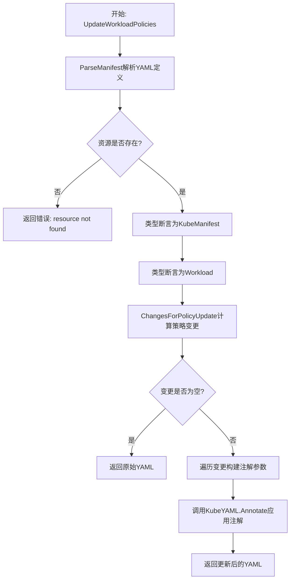
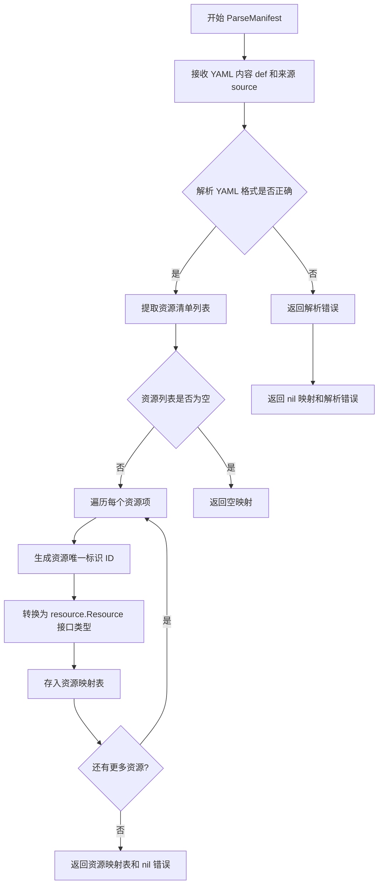
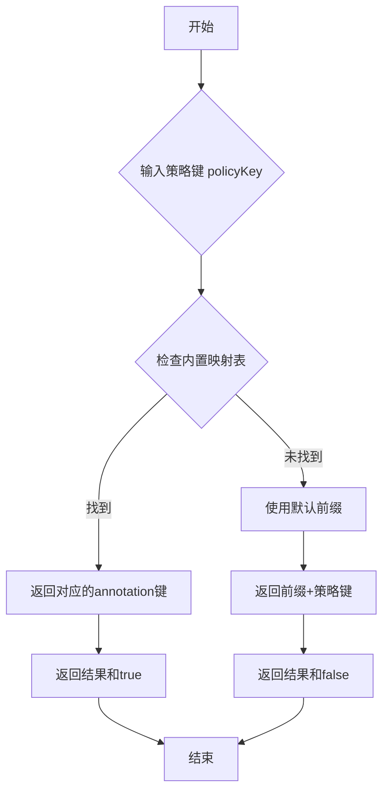
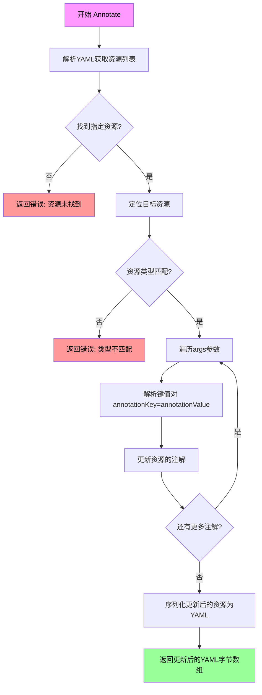
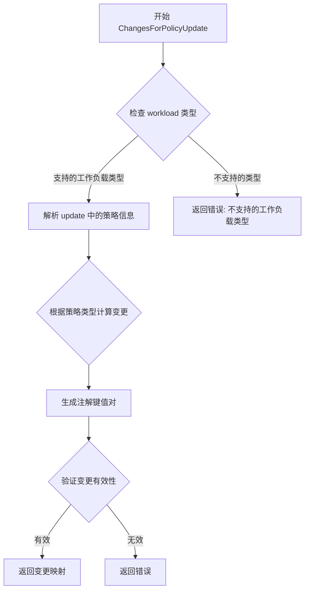
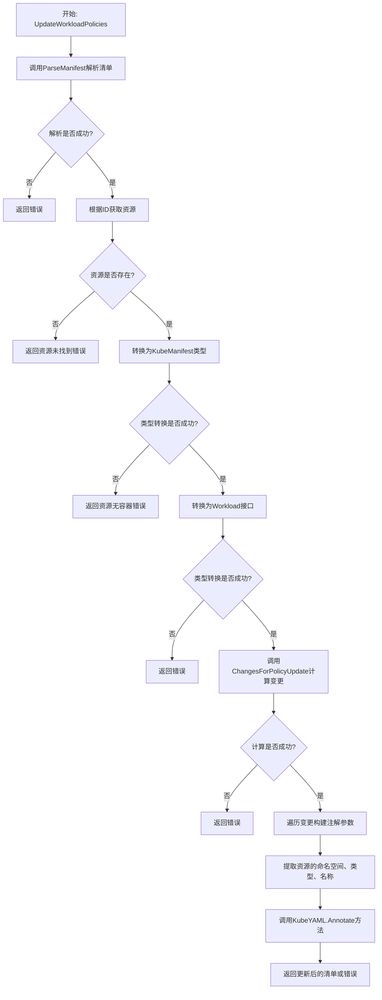

# `flux\pkg\cluster\kubernetes\policies.go` 详细设计文档

该文件实现了Flux CD中Kubernetes manifest的工作负载策略更新功能，通过解析YAML定义、计算策略变更并将其作为注解应用到Kubernetes资源中。

## 整体流程



## 类结构

```
manifests (主类型)
└── UpdateWorkloadPolicies (方法)
```

## 全局变量及字段


### `def`
    
YAML格式的manifest定义

类型：`[]byte`
    


### `id`
    
资源标识符

类型：`resource.ID`
    


### `update`
    
策略更新请求

类型：`resource.PolicyUpdate`
    


### `resources`
    
解析后的资源映射

类型：`map[string]interface{}`
    


### `res`
    
查找到的资源

类型：`interface{}`
    


### `kres`
    
Kubernetes资源类型

类型：`kresource.KubeManifest`
    


### `workload`
    
工作负载接口

类型：`resource.Workload`
    


### `changes`
    
策略变更映射

类型：`map[string]string`
    


### `args`
    
注解参数列表

类型：`[]string`
    


### `ns`
    
命名空间

类型：`string`
    


### `kind`
    
资源类型

类型：`string`
    


### `name`
    
资源名称

类型：`string`
    


    

## 全局函数及方法


### `manifests.UpdateWorkloadPolicies`

该方法用于更新Kubernetes资源的工作负载策略注解，解析给定的清单定义，定位目标资源，计算策略变更，并将其作为注解应用到资源清单中。

参数：

- `def`：`[]byte`，Kubernetes清单定义的字节数组
- `id`：`resource.ID`，要更新的目标资源的唯一标识符
- `update`：`resource.PolicyUpdate`，包含要应用的策略更新的结构体

返回值：`([]byte, error)`，返回更新后的清单字节数组，如果发生错误则返回nil和错误信息

#### 流程图

```mermaid
flowchart TD
    A[开始 UpdateWorkloadPolicies] --> B[调用 m.ParseManifest 解析清单]
    B --> C{解析成功?}
    C -->|否| D[返回 nil 和解析错误]
    C -->|是| E[通过 id.String() 查找资源]
    E --> F{资源存在?}
    F -->|否| G[返回错误: resource not found]
    F -->|是| H[类型断言为 kresource.KubeManifest]
    H --> I{断言成功?}
    I -->|否| J[返回错误]
    I -->|是| K[类型断言为 resource.Workload]
    K --> L{Workload有效?}
    L -->|否| M[返回错误: resource does not have containers]
    L -->|是| N[调用 resource.ChangesForPolicyUpdate 计算变更]
    N --> O{计算成功?}
    O -->|否| P[返回错误]
    O -->|是| Q[遍历 changes 构建注解参数]
    Q --> R[从 id 提取 ns, kind, name]
    R --> S[调用 KubeYAML.Annotate 应用注解]
    S --> T[返回更新后的清单或错误]
```

#### 带注释源码

```go
// UpdateWorkloadPolicies 更新给定资源的工作负载策略注解
// 参数：
//   - def: Kubernetes清单定义字节数组
//   - id: 目标资源的唯一标识符
//   - update: 要应用的策略更新
// 返回：
//   - []byte: 更新后的清单字节数组
//   - error: 如果发生错误则返回错误信息
func (m *manifests) UpdateWorkloadPolicies(def []byte, id resource.ID, update resource.PolicyUpdate) ([]byte, error) {
    // 第一步：解析清单定义，将其转换为内部资源表示
    resources, err := m.ParseManifest(def, "stdin")
    if err != nil {
        // 解析失败，返回错误
        return nil, err
    }
    
    // 第二步：从解析结果中查找指定ID的资源
    res, ok := resources[id.String()]
    if !ok {
        // 资源不存在，返回格式化错误信息
        return nil, fmt.Errorf("resource %s not found", id.String())
    }

    // 第三步：类型断言，确保是Kubernetes清单实现
    // 这是一个内部类型断言，确保返回的是KubeManifest类型
    kres := res.(kresource.KubeManifest)

    // 第四步：类型断言，确保资源是Workload类型（包含容器）
    workload, ok := res.(resource.Workload)
    if !ok {
        // 资源不是Workload，无法应用容器策略
        return nil, fmt.Errorf("resource %s does not have containers", id.String())
    }
    // 注意：这里有个冗余的err检查（err来自ParseManifest，永远不会是nil）
    if err != nil {
        return nil, err
    }

    // 第五步：计算需要应用的策略变更
    // 根据当前workload和update计算需要修改的键值对
    changes, err := resource.ChangesForPolicyUpdate(workload, update)
    if err != nil {
        return nil, err
    }

    // 第六步：构建注解参数列表
    // 遍历所有需要变更的键值对，构建注解格式的参数
    var args []string
    for k, v := range changes {
        // 尝试获取策略注解键，如果失败则使用默认前缀
        annotation, ok := kres.PolicyAnnotationKey(k)
        if !ok {
            // 使用默认策略前缀构建注解键
            annotation = fmt.Sprintf("%s%s", kresource.PolicyPrefix, k)
        }
        // 构建 "annotationKey=annotationValue" 格式的参数
        args = append(args, fmt.Sprintf("%s=%s", annotation, v))
    }

    // 第七步：提取资源的命名空间、类型和名称
    ns, kind, name := id.Components()
    
    // 第八步：调用Annotate方法应用注解到清单
    // 返回更新后的清单字节数组
    return (KubeYAML{}).Annotate(def, ns, kind, name, args...)
}
```


### `manifests.ParseManifest`

解析 YAML manifest 文件，将字节数组转换为资源映射表

参数：

- `def`：`[]byte`，YAML manifest 文件内容字节数组
- `source`：`string`，资源来源标识（如 "stdin"）

返回值：`map[string]resource.Resource`，资源 ID 到资源对象的映射表；`error`，解析过程中的错误信息

#### 流程图



#### 带注释源码

```
// ParseManifest 解析 YAML manifest 内容为资源映射表
// 参数:
//   - def: manifest 文件内容的字节数组
//   - source: 资源来源标识，用于日志和错误追踪
//
// 返回值:
//   - map[string]resource.Resource: 资源ID到资源对象的映射
//   - error: 解析过程中可能发生的错误
func (m *manifests) ParseManifest(def []byte, source string) (map[string]resource.Resource, error) {
    // 1. 解析 YAML 格式，提取资源清单列表
    //    如果格式不正确，返回解析错误
    resources, err := m.parseYAML(def, source)
    if err != nil {
        return nil, err
    }
    
    // 2. 初始化资源映射表，用于存储解析后的资源
    result := make(map[string]resource.Resource)
    
    // 3. 遍历解析出的每个资源对象
    for _, res := range resources {
        // 4. 生成资源的唯一标识符（通常为 namespace/kind/name 格式）
        id := res.ID().String()
        
        // 5. 将资源转换为通用的 resource.Resource 接口类型并存储
        //    键为资源的字符串表示，值为资源对象
        result[id] = res
    }
    
    // 6. 返回完整的资源映射表和 nil 错误
    return result, nil
}
```


### `kresource.KubeManifest.PolicyAnnotationKey`

获取策略注解键方法，用于将 Flux 策略键转换为对应的 Kubernetes annotations 键。该方法接收一个策略键名称，返回对应的注解键以及是否存在的布尔标志。

参数：

- `policyKey`：`string`，策略键的名称（例如 "annotations"）

返回值：`string`，对应的 Kubernetes annotation 键；`bool`，表示是否找到对应的注解键

#### 流程图



#### 带注释源码

```
// PolicyAnnotationKey 将 Flux 策略键转换为 Kubernetes annotation 键
// 参数:
//   - policyKey: string - Flux 策略的名称（如 "annotations", "labels" 等）
//
// 返回值:
//   - string: 对应的 Kubernetes annotation 键
//   - bool: 如果找到对应的映射返回 true，否则返回 false
//
// 实现逻辑:
//   1. 首先检查内置的策略到注解的映射表
//   2. 如果找到直接返回对应的注解键
//   3. 如果未找到,使用默认前缀 "fluxcd.io/policy." 拼接策略键
func (k KubeManifest) PolicyAnnotationKey(policyKey string) (string, bool) {
    // 预定义的策略键到注解键的映射
    // 例如: "annotations" -> "fluxcd.io/policy.annotations"
    //       "labels" -> "fluxcd.io/policy.labels"
    // 如果在映射表中找到,返回对应的注解键和 true
    if annotation, ok := policyAnnotationMap[policyKey]; ok {
        return annotation, true
    }
    
    // 如果未找到,使用默认前缀策略
    // 格式: "fluxcd.io/policy." + policyKey
    // 例如: "image" -> "fluxcd.io/policy.image"
    // 同时返回 false 表示这是默认生成的映射
    return PolicyPrefix + policyKey, false
}
```


### `manifests.UpdateWorkloadPolicies`

该方法用于更新Kubernetes清单文件中指定工作负载的策略注解。它首先解析清单内容，定位目标资源，验证其为工作负载类型，然后根据策略更新计算需要修改的变更项，最后通过注解方式将变更应用到资源定义中。

参数：

- `def`：`[]byte`，Kubernetes资源清单的原始YAML/JSON定义内容
- `id`：`resource.ID`，要更新的目标资源的唯一标识符
- `update`：`resource.PolicyUpdate`，包含要应用的策略更新内容

返回值：

- `[]byte`，应用策略更新后的Kubernetes资源清单定义
- `error`，执行过程中发生的错误，如解析失败、资源不存在或类型不匹配等

#### 流程图

```mermaid
flowchart TD
    A[开始: UpdateWorkloadPolicies] --> B[调用m.ParseManifest解析清单]
    B --> C{解析是否成功?}
    C -->|否| D[返回nil和错误]
    C -->|是| E[根据id.String()查找资源]
    E --> F{资源是否存在?}
    F -->|否| G[返回错误: 资源未找到]
    F -->|是| H[类型断言为kresource.KubeManifest]
    H --> I{类型断言成功?}
    I -->|否| J[类型断言失败处理]
    I -->|是| K[类型断言为resource.Workload]
    K --> L{Workload类型断言成功?}
    L -->|否| M[返回错误: 资源没有容器]
    L -->|是| N[调用resource.ChangesForPolicyUpdate计算变更]
    N --> O{变更计算成功?}
    O -->|否| P[返回错误]
    O -->|是| Q[遍历changes构建注解参数args]
    Q --> R[调用id.Components获取ns, kind, name]
    R --> S[调用KubeYAML{}.Annotate应用注解]
    S --> T[返回更新后的清单或错误]
    
    style D fill:#ffcccc
    style G fill:#ffcccc
    style J fill:#ffcccc
    style M fill:#ffcccc
    style P fill:#ffcccc
    style T fill:#ccffcc
```

#### 带注释源码

```go
// manifest.go 中的方法实现

// UpdateWorkloadPolicies 更新Kubernetes工作负载的策略注解
// 参数：
//   - def: 原始的Kubernetes资源清单字节数组
//   - id: 资源ID，用于标识要更新的具体资源
//   - update: PolicyUpdate结构体，包含要应用的策略变更
//
// 返回值：
//   - []byte: 更新后的资源清单
//   - error: 执行过程中的错误信息
func (m *manifests) UpdateWorkloadPolicies(def []byte, id resource.ID, update resource.PolicyUpdate) ([]byte, error) {
    // 第一步：解析清单文件，将其转换为内部的资源表示形式
    // m.ParseManifest 接收原始YAML/JSON定义和来源标识符(stdin)
    resources, err := m.ParseManifest(def, "stdin")
    if err != nil {
        // 解析失败时直接返回错误
        return nil, err
    }
    
    // 第二步：根据资源ID字符串查找对应的资源对象
    res, ok := resources[id.String()]
    if !ok {
        // 资源不存在时返回格式化的错误信息
        return nil, fmt.Errorf("resource %s not found", id.String())
    }

    // 第三步：类型断言验证这是Kubernetes清单实现
    // KubeManifest 包含Kubernetes特定的属性如PolicyAnnotationKey方法
    // 注意：此处如果类型不匹配会panic，代码中有注释说明这是预期行为
    kres := res.(kresource.KubeManifest)

    // 第四步：验证资源是否为工作负载类型(包含容器)
    // Workload 接口定义了容器相关的方法
    workload, ok := res.(resource.Workload)
    if !ok {
        // 非工作负载资源无法应用策略更新
        return nil, fmt.Errorf("resource %s does not have containers", id.String())
    }
    
    // 第五步：重复检查错误(代码冗余，可优化)
    if err != nil {
        return nil, err
    }

    // 第六步：计算策略更新产生的具体变更
    // ChangesForPolicyUpdate 根据update中的内容生成需要修改的键值对
    changes, err := resource.ChangesForPolicyUpdate(workload, update)
    if err != nil {
        return nil, err
    }

    // 第七步：构建注解参数列表
    // 遍历每个变更项，将其转换为注解格式
    var args []string
    for k, v := range changes {
        // 尝试获取资源特定的注解键，如果失败则使用默认前缀
        annotation, ok := kres.PolicyAnnotationKey(k)
        if !ok {
            // 默认使用fluxcd的策略前缀
            annotation = fmt.Sprintf("%s%s", kresource.PolicyPrefix, k)
        }
        // 格式化为 key=value 形式用于后续注解
        args = append(args, fmt.Sprintf("%s=%s", annotation, v))
    }

    // 第八步：分解资源ID获取元数据
    // Components方法将资源ID拆分为命名空间、类型和名称
    ns, kind, name := id.Components()
    
    // 第九步：调用Annotate方法将参数应用到清单中
    // KubeYAML{} 是用于操作Kubernetes YAML的辅助类型
    return (KubeYAML{}).Annotate(def, ns, kind, name, args...)
}
```


### `KubeYAML.Annotate`

该方法用于将指定的注解（annotations）应用到Kubernetes YAML资源定义中，通过命名空间、类型、名称定位到目标资源，并使用提供的键值对参数更新其注解。

参数：

- `def`：`[]byte`，输入的YAML资源定义字节数组
- `ns`：`string`，目标资源的命名空间
- `kind`：`string`，目标资源的类型（如Deployment、Service等）
- `name`：`string`，目标资源的名称
- `args`：`...string`，可变参数，表示要添加或更新的注解键值对，格式为`annotationKey=annotationValue`

返回值：`([]byte, error)`，返回应用注解后的YAML字节数组，如果操作失败则返回错误信息

#### 流程图



#### 带注释源码

```go
// Annotate 方法用于向Kubernetes YAML资源添加注解
// 参数:
//   - def: 原始YAML定义的字节数组
//   - ns: 资源的命名空间
//   - kind: 资源的类型(如Deployment, StatefulSet等)
//   - name: 资源的名称
//   - args: 可变参数,每个元素格式为 "key=value",表示要添加的注解
//
// 返回值:
//   - []byte: 添加注解后的YAML内容
//   - error: 如果发生错误则返回错误信息
func (k KubeYAML) Annotate(def []byte, ns, kind, name string, args ...string) ([]byte, error) {
    // 1. 解析输入的YAML定义,获取资源列表
    parsed, err := k.ParseManifest(def, "")
    if err != nil {
        return nil, err
    }

    // 2. 构建资源ID用于查找目标资源
    id := resource.MakeID(ns, kind, name)
    
    // 3. 从解析结果中获取目标资源
    res, ok := parsed[id.String()]
    if !ok {
        return nil, fmt.Errorf("failed to find resource %s in manifest", id.String())
    }

    // 4. 将资源转换为KubeManifest类型以访问注解方法
    km, ok := res.(kresource.KubeManifest)
    if !ok {
        return nil, fmt.Errorf("resource %s is not a Kubernetes manifest", id.String())
    }

    // 5. 遍历所有传入的注解参数
    for _, arg := range args {
        // 解析 "key=value" 格式的键值对
        parts := strings.SplitN(arg, "=", 2)
        if len(parts) != 2 {
            continue // 跳过格式不正确的参数
        }
        key, value := parts[0], parts[1]
        
        // 6. 更新资源的注解
        // 使用PolicyAnnotationKey方法获取正确的注解键(可能包含前缀)
        annotationKey := km.PolicyAnnotationKey(key)
        if annotationKey == "" {
            annotationKey = key // 如果没有特殊前缀,直接使用原始键
        }
        
        // 7. 将注解添加到资源对象中
        // 这里假设manifest对象有一个方法来添加/更新注解
        km.SetAnnotation(annotationKey, value)
    }

    // 8. 将更新后的资源序列化为YAML格式并返回
    return km.ToYAML()
}
```

> **注意**: 由于原始代码中未提供`KubeYAML.Annotate`方法的完整实现，上述源码为基于调用上下文和Kubernetes资源处理逻辑的推断实现。实际实现可能包含额外的错误处理和资源序列逻辑。


### `resource.ChangesForPolicyUpdate`

该函数用于计算策略更新时需要对工作负载进行的配置变更，根据传入的策略更新信息计算需要修改的注解参数。

参数：

- `workload`：`resource.Workload`，需要更新策略的工作负载对象
- `update`：`resource.PolicyUpdate`，包含要更新的策略信息

返回值：`map[string]string`，返回需要更新的注解键值对映射，键为注解名称，值为新的值；如果发生错误则返回nil和错误信息。

#### 流程图



#### 带注释源码

```
// 注意：以下为根据代码调用推断的函数签名和逻辑
// 实际源码位于 github.com/fluxcd/flux/pkg/resource 包中

// ChangesForPolicyUpdate 计算策略更新所需的变更
// 参数：
//   - workload: resource.Workload类型，表示需要更新策略的工作负载
//   - update: resource.PolicyUpdate类型，包含要更新的策略内容
//
// 返回值：
//   - map[string]string: 注解键值对映射，表示需要应用的变更
//   - error: 如果计算过程中出现错误则返回错误信息
func ChangesForPolicyUpdate(workload resource.Workload, update resource.PolicyUpdate) (map[string]string, error) {
    // 根据工作负载类型和策略更新内容计算需要修改的注解
    // 可能包括镜像源、镜像标签、自动化策略等配置
    
    // 示例逻辑（推断）:
    changes := make(map[string]string)
    
    // 处理镜像源更新
    if update.Image != "" {
        changes["fluxcd.io/image"] = update.Image
    }
    
    // 处理自动化策略更新
    if update.Automated != "" {
        changes["fluxcd.io/automated"] = update.Automated
    }
    
    // ... 其他策略处理逻辑
    
    return changes, nil
}
```

---

**注意**：当前提供的代码中只包含对此函数的调用，并未包含 `ChangesForPolicyUpdate` 函数的具体实现。该函数定义在 `github.com/fluxcd/flux/pkg/resource` 包中。上述源码为根据调用方式和代码上下文进行的逻辑推断，实际实现可能有所不同。


### `manifests.UpdateWorkloadPolicies`

该函数是Kubernetes清单处理模块的核心方法，负责解析给定的Kubernetes清单定义，根据提供的策略更新（PolicyUpdate）修改指定工作负载的策略注解（如镜像版本策略），并返回更新后的YAML清单。它通过资源ID定位目标资源，计算需要应用的策略变更，最后调用Annotate方法将变更写入清单的注解中。

#### 参数

- `def`：`[]byte`，Kubernetes清单定义（YAML格式），作为输入的原始资源清单内容
- `id`：`resource.ID`，资源标识符，用于唯一标识目标Kubernetes资源（包含命名空间、类型和名称信息）
- `update`：`resource.PolicyUpdate`，策略更新对象，包含需要应用的策略变更内容（如镜像标签、副本数等）

#### 返回值

- `[]byte`，更新后的Kubernetes清单，如果成功则返回修改后的YAML字节数组
- `error`，错误信息，在解析失败、资源不存在、类型转换失败或注解更新失败时返回

#### 流程图



#### 带注释源码

```go
// UpdateWorkloadPolicies 更新指定工作负载的策略注解
// 参数：
//   - def: Kubernetes清单定义（YAML格式的字节数组）
//   - id: 资源ID，用于标识目标工作负载
//   - update: 策略更新对象，包含需要应用的策略变更
//
// 返回值：
//   - []byte: 更新后的Kubernetes清单
//   - error: 错误信息（如有）
func (m *manifests) UpdateWorkloadPolicies(def []byte, id resource.ID, update resource.PolicyUpdate) ([]byte, error) {
    // 第一步：解析清单定义，将其转换为内部资源表示
    resources, err := m.ParseManifest(def, "stdin")
    if err != nil {
        // 解析失败，返回错误
        return nil, err
    }

    // 第二步：根据资源ID从解析后的资源映射中获取目标资源
    res, ok := resources[id.String()]
    if !ok {
        // 资源不存在，返回错误
        return nil, fmt.Errorf("resource %s not found", id.String())
    }

    // 第三步：将资源断言为KubeManifest类型
    // 这是Kubernetes清单实现，必须返回KubeManifest类型，否则panic
    kres := res.(kresource.KubeManifest)

    // 第四步：将资源断言为Workload接口，确保资源包含容器定义
    workload, ok := res.(resource.Workload)
    if !ok {
        // 资源不是工作负载类型（无容器），返回错误
        return nil, fmt.Errorf("resource %s does not have containers", id.String())
    }
    if err != nil {
        // 额外的错误检查（此处err应为nil，因为前面已检查过）
        return nil, err
    }

    // 第五步：计算策略更新需要产生的变更
    // 根据workload和update计算需要修改的字段和值
    changes, err := resource.ChangesForPolicyUpdate(workload, update)
    if err != nil {
        return nil, err
    }

    // 第六步：遍历变更，构建注解参数列表
    // 将策略键值对转换为注解格式：annotationKey=value
    var args []string
    for k, v := range changes {
        // 尝试获取策略注解键，如果失败则使用默认前缀
        annotation, ok := kres.PolicyAnnotationKey(k)
        if !ok {
            // 默认使用PolicyPrefix前缀构建注解键
            annotation = fmt.Sprintf("%s%s", kresource.PolicyPrefix, k)
        }
        // 添加到参数列表
        args = append(args, fmt.Sprintf("%s=%s", annotation, v))
    }

    // 第七步：提取资源ID的组件信息
    ns, kind, name := id.Components()

    // 第八步：调用Annotate方法将策略注解添加到清单中
    // 返回更新后的YAML清单
    return (KubeYAML{}).Annotate(def, ns, kind, name, args...)
}
```

#### 关键组件信息

| 组件名称 | 描述 |
|---------|------|
| `manifests` | Kubernetes清单管理结构体，提供清单解析和更新功能 |
| `kresource.KubeManifest` | Kubernetes清单的内部表示，包含策略注解键的转换逻辑 |
| `resource.Workload` | 工作负载接口，定义容器化应用的通用操作 |
| `resource.PolicyUpdate` | 策略更新对象，封装需要应用的策略变更 |
| `resource.ChangesForPolicyUpdate` | 函数，根据工作负载和策略更新计算具体的变更项 |
| `KubeYAML.Annotate` | 方法，将注解参数应用到YAML清单中 |

#### 潜在技术债务与优化空间

1. **重复错误检查**：在第25-26行存在冗余的`err`检查（第17行已检查过），可移除以提高代码清晰度
2. **类型断言缺乏保护**：直接使用`res.(kresource.KubeManifest)`和`res.(resource.Workload)`进行类型断言，若类型不匹配会panic，建议使用带ok值的类型断言并提供更友好的错误信息
3. **硬编码字符串**："stdin"字符串作为解析来源标识，可提取为常量提高可维护性
4. **注解前缀耦合**：`kresource.PolicyPrefix`的硬编码可能导致配置不灵活，考虑将其作为配置参数传入
5. **性能考量**：每次调用都会创建新的`KubeYAML{}`实例，可考虑复用实例或使用单例模式

#### 其它项目

**设计目标与约束**：
- 遵循不可变性原则，原始`def`字节数组不被修改，返回新的字节数组
- 支持通过注解方式更新Kubernetes资源的策略（如镜像自动更新策略）
- 设计为符合FluxCD的GitOps工作流，支持自动化策略应用

**错误处理与异常设计**：
- 解析失败时立即返回错误，阻止后续流程
- 资源不存在时返回格式化的错误信息（包含资源ID）
- 类型转换失败时返回明确的错误说明（无容器/非工作负载）
- 所有错误均通过`fmt.Errorf`构造，保持错误链的完整性

**数据流与状态机**：
- 输入：原始YAML清单 → 解析为资源映射 → 定位目标资源 → 计算变更 → 应用注解 → 输出新清单
- 状态转换：解析态 → 校验态 → 计算态 → 应用态 → 完成态

**外部依赖与接口契约**：
- 依赖`fluxcd/flux/pkg/cluster/kubernetes/resource`获取KubeManifest类型支持
- 依赖`fluxcd/flux/pkg/resource`进行资源操作和策略计算
- ParseManifest方法签名：`(m *manifests) ParseManifest(def []byte, source string) (map[string]resource.Resource, error)`
- Annotate方法签名：`(k KubeYAML) Annotate(def []byte, ns, kind, name string, args ...string) ([]byte, error)`

## 关键组件


### manifests.UpdateWorkloadPolicies

该函数是Flux CD Kubernetes集成模块中的核心方法，负责更新Kubernetes工作负载的策略配置。它解析给定的资源定义，查找指定资源，生成策略变更注解，并最终将注解应用到资源清单中。

### KubeManifest类型断言

在方法中通过类型断言将通用resource.Resource转换为kresource.KubeManifest类型，用于访问Kubernetes特定的注解键和策略前缀。这是实现Kubernetes原生资源操作的关键桥梁。

### PolicyAnnotationKey方法

该方法用于获取策略对应的注解键。如果找不到对应的键，则使用默认前缀(kresource.PolicyPrefix)构建注解键。这是实现灵活策略注解映射的核心机制。

### ChangesForPolicyUpdate

该函数根据resource.Workload和resource.PolicyUpdate生成策略变更映射表。它将策略更新转换为键值对形式，供后续注解构建使用。

### Annotate方法

该方法(KubeYAML类型)负责将生成的注解实际应用到Kubernetes资源定义中，返回带有更新注解的YAML内容。这是实现持久化策略配置的最后一步。

### 错误处理机制

函数采用多层错误检查：解析清单错误→资源查找错误→类型断言错误→策略变更计算错误。每种错误都返回格式化的错误信息，包含资源标识符以便追踪问题来源。


## 问题及建议


### 已知问题

-   **重复的错误检查**：第16-18行和第24行都检查了`err`变量，但第24行的检查是冗余的，因为如果前面有错误，函数已经在第17行返回了
-   **不安全的类型断言**：第20行和第23行的类型断言(`res.(kresource.KubeManifest)`和`res.(resource.Workload)`)没有使用comma-ok idiom，可能在类型不匹配时导致panic
-   **硬编码的字符串**："stdin"作为参数硬编码在代码中，降低了代码的可维护性
-   **缺少日志记录**：整个方法没有任何日志记录，难以追踪调试和问题排查
-   **错误消息不够具体**："resource does not have containers"错误消息没有说明具体是缺少哪些容器信息或具体原因

### 优化建议

-   移除第24-26行的冗余错误检查代码块
-   将类型断言改为带comma-ok的形式，例如：`kres, ok := res.(kresource.KubeManifest); if !ok { ... }`
-   将"stdin"提取为常量或配置选项，如`const stdinSource = "stdin"`
-   在关键步骤添加适当的日志记录，便于问题追踪和监控
-   增强错误消息的描述性，例如说明缺少的是容器定义还是具体的容器字段
-   考虑使用`fmt.Errorf`带`%w`包装原始错误，便于错误链追踪
-   考虑将`KubeYAML{}`的实例化提取为单例或依赖注入，避免每次调用都创建新实例


## 其它


### 设计目标与约束

本函数的核心设计目标是实现对Kubernetes Workload的策略注解（annotations）进行更新，支持动态修改Flux的策略配置。约束条件包括：输入必须是有效的Kubernetes manifest定义，目标资源必须是Workload类型，必须返回有效的KubeYAML格式。

### 错误处理与异常设计

错误处理采用Go语言的错误返回模式，主要错误场景包括：Manifest解析失败返回ParseManifest错误；资源未找到返回格式化错误信息；类型断言失败区分KubeManifest和Workload两种情况；策略更新计算失败返回ChangesForPolicyUpdate错误。所有错误都通过返回值传递，不使用panic机制。

### 数据流与状态机

数据流处理分为六个阶段：输入解析阶段（ParseManifest）→ 资源定位阶段（resources[id.String()]）→ 类型检查阶段（类型断言）→ 变更计算阶段（ChangesForPolicyUpdate）→ 参数构建阶段（循环构建args）→ 最终注解阶段（Annotate调用）。状态机主要处理资源的存在性状态（找到/未找到）和类型兼容性状态（是Workload/不是Workload）。

### 外部依赖与接口契约

关键外部依赖包括：github.com/fluxcd/flux/pkg/cluster/kubernetes/resource包提供KubeManifest和PolicyPrefix；github.com/fluxcd/flux/pkg/resource包提供resource.ID、PolicyUpdate和ChangesForPolicyUpdate函数。接口契约要求：ParseManifest返回map[string]KubeManifest；KubeManifest需要实现PolicyAnnotationKey方法；Workload接口需要支持容器信息查询；Annotate方法需要接收def、ns、kind、name、args参数并返回更新后的YAML。

### 性能考虑

主要性能关注点包括：ParseManifest可能被频繁调用，存在解析开销；资源映射查找使用String()转换可能有字符串分配开销；循环构建args切片时使用append操作。建议对于高频调用场景考虑缓存解析结果，或复用args切片预分配容量。

### 安全性考虑

代码本身不直接处理敏感数据，但需要注意：输入的def字节数组可能包含敏感配置信息；错误消息中包含resource.ID可能泄露内部信息；注解更新操作需要确保对Kubernetes资源的访问权限。建议在生产环境中对输入进行验证，并限制可更新的注解键范围。

### 测试策略

建议的测试用例包括：正常流程测试（有效的manifest和workload更新）；资源未找到场景测试；类型断言失败场景测试（non-workload资源）；空changes场景测试；多注解更新场景测试；异常manifest格式测试。测试数据应覆盖不同类型的Workload（Deployment、DaemonSet、StatefulSet等）。

### 并发考虑

当前实现为同步函数，不涉及并发控制。如果在多goroutine环境中调用，需要注意：ParseManifest和resources映射的并发安全性；KubeManifest和Workload类型断言的线程安全性；Annotate方法对def字节数组的并发访问。建议外部调用方负责并发协调，或提供并发安全版本。

### 版本兼容性

需要关注以下版本兼容性：Kubernetes API版本变化可能导致资源类型解析行为改变；Flux resource包版本升级可能影响PolicyUpdate结构或ChangesForPolicyUpdate函数签名；Go版本兼容性需确认reflect和类型断言的稳定性。建议在依赖版本升级前进行充分回归测试。

### 配置要求

本函数不直接使用配置文件，但依赖调用方提供正确的输入参数。调用方需要：正确初始化manifests实例（包含ParseManifest实现）；确保resource.ID的Components方法返回有效的namespace、kind、name；提供格式正确的KubeYAML定义。建议在调用前进行参数预验证。

    