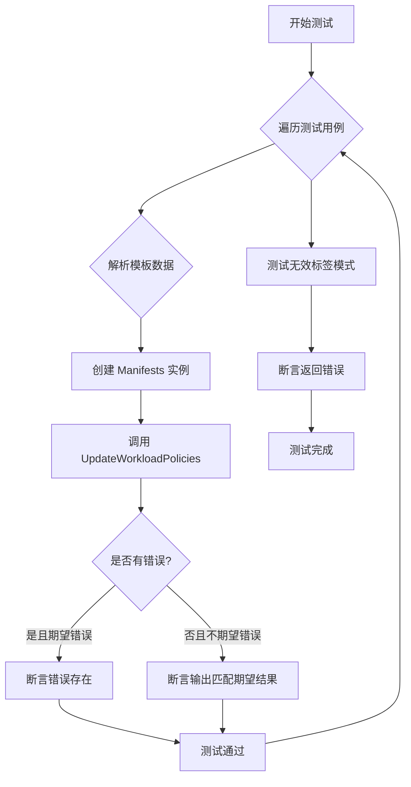
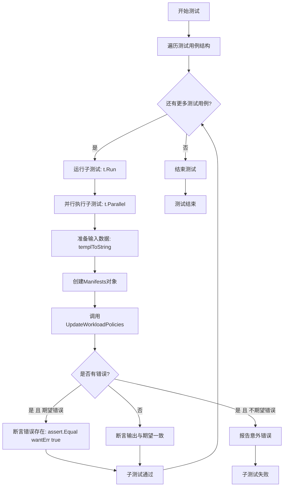
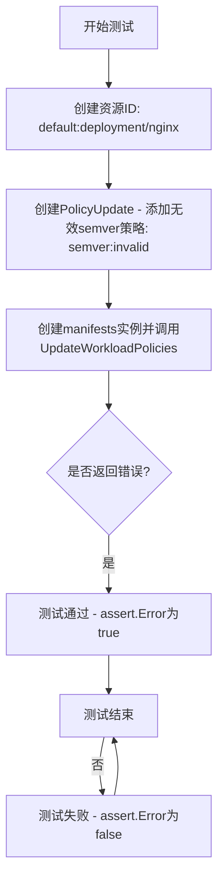

# `flux\pkg\cluster\kubernetes\policies_test.go` 详细设计文档

该文件是 Kubernetes 相关的单元测试文件，主要测试注解策略的更新功能，包括添加、删除和修改自动化、锁定、标签等策略，并验证多行注解、glob/semver/regexp 标签模式的处理逻辑。

## 整体流程



## 类结构

```
测试文件 (无类结构)
├── 测试函数
│   ├── TestUpdatePolicies (主测试)
│   ├── TestUpdatePolicies_invalidTagPattern (错误测试)
│   └── templToString (辅助函数)
└── 全局变量
    └── annotationsTemplate (YAML 模板)
```

## 全局变量及字段


### `annotationsTemplate`
    
用于测试的Kubernetes Deployment YAML模板，包含注解占位符以测试策略更新功能

类型：`*template.Template`
    


    

## 全局函数及方法


### TestUpdatePolicies

这是一个测试函数，用于验证Kubernetes资源的策略更新功能。函数通过多组测试用例验证在Kubernetes Manifest中添加、删除或修改注解（annotations）的逻辑，包括自动化标记、锁定标记、标签策略等多种策略场景。

参数：

- `t`：`*testing.T`，Go语言标准测试框架中的测试对象，用于报告测试结果和状态

返回值：无（`void`），Go测试函数通过`t`参数直接报告测试结果

#### 流程图



#### 带注释源码

```go
// TestUpdatePolicies 测试 Kubernetes 资源策略更新功能
// 测试场景包括添加注解、删除注解、保留已有前缀、多行注解处理等
func TestUpdatePolicies(t *testing.T) {
	// 定义测试用例结构，遍历所有测试场景
	for _, c := range []struct {
		name    string     // 测试用例名称
		in, out []string   // 输入和期望输出的注解键值对
		update  resource.PolicyUpdate // 策略更新操作
		wantErr bool       // 是否期望返回错误
	}{
		// 测试用例1: 添加新注解时保留已有注解
		{
			name: "adding annotation with others existing",
			in:   []string{"prometheus.io/scrape", "'false'"},
			out:  []string{"prometheus.io/scrape", "'false'", "fluxcd.io/automated", "'true'"},
			update: resource.PolicyUpdate{
				Add: policy.Set{policy.Automated: "true"},
			},
		},
		// 测试用例2: 已有旧前缀的自动化注解时不改变前缀
		{
			name: "adding annotation when already has annotation does not change prefix",
			in:   []string{"flux.weave.works/automated", "'true'"},
			out:  []string{"flux.weave.works/automated", "'true'"},
			update: resource.PolicyUpdate{
				Add: policy.Set{policy.Automated: "true"},
			},
		},
		// ... 更多测试用例 (省略部分)
	} {
		// 为每个测试用例创建子测试
		t.Run(c.name, func(t *testing.T) {
			// 避免并行测试与循环变量的竞态条件
			cLocal := c // Use copy to avoid races between the parallel tests and the loop
			
			// 标记为可并行测试
			t.Parallel()
			
			// 将输入的注解数据转换为YAML字符串模板
			caseIn := templToString(t, annotationsTemplate, cLocal.in)
			caseOut := templToString(t, annotationsTemplate, cLocal.out)
			
			// 解析资源ID
			resourceID := resource.MustParseID("default:deployment/nginx")
			
			// 创建Manifests对象，用于处理Kubernetes资源
			manifests := NewManifests(ConstNamespacer("default"), log.NewLogfmtLogger(os.Stdout))
			
			// 调用被测试的更新策略方法
			out, err := manifests.UpdateWorkloadPolicies([]byte(caseIn), resourceID, cLocal.update)
			
			// 断言错误值是否符合预期
			assert.Equal(t, cLocal.wantErr, err != nil, "unexpected error value: %s", err)
			
			// 如果不期望错误，则验证输出内容
			if !cLocal.wantErr {
				assert.Equal(t, string(out), caseOut)
			}
		})
	}
}
```

---

### 全局变量和辅助函数

#### 全局变量

| 名称 | 类型 | 描述 |
|------|------|------|
| `annotationsTemplate` | `*template.Template` | 用于生成测试用Kubernetes YAML清单的Go模板，包含Deployment资源结构 |

#### 辅助函数

| 名称 | 参数 | 返回值 | 描述 |
|------|------|--------|------|
| `templToString` | `t *testing.T`, `templ *template.Template`, `data []string` | `string` | 将键值对数组转换为格式化后的YAML字符串 |
| `TestUpdatePolicies_invalidTagPattern` | `t *testing.T` | 无 | 测试无效标签模式时的错误处理 |

---

### 关键组件信息

| 组件名称 | 描述 |
|----------|------|
| `manifests.UpdateWorkloadPolicies` | 核心方法，执行Kubernetes资源注解的实际更新逻辑 |
| `resource.PolicyUpdate` | 策略更新数据结构，包含Add和Remove两个policy.Set字段 |
| `policy.Set` | 策略集合类型，存储键值对形式的策略配置 |
| `NewManifests` | 构造函数，创建manifests实例用于处理Kubernetes清单 |

---

### 潜在技术债务和优化空间

1. **测试数据硬编码**：注解模板和资源ID在测试中硬编码，可考虑提取为测试配置
2. **循环变量捕获**：需要使用`cLocal := c`避免并行测试的竞态条件，可考虑使用Go 1.22+的循环变量改进
3. **错误消息格式**：部分测试用例期望相同输出但使用不同输入（如invalid semver/regexp），可通过更精确的错误类型断言改进测试
4. **模板重复解析**：`annotationsTemplate`使用`Must`和全局变量，可能导致panic风险

---

### 其它项目

#### 设计目标与约束

- 保持已有注解前缀不变（向前兼容flux.weave.works和新的fluxcd.io）
- 支持多行注解值处理
- 支持多种标签策略：glob、semver、regexp

#### 错误处理

- 对于无效的semver或regexp模式，期望返回错误
- 测试框架使用`assert`包进行断言

#### 外部依赖

- `github.com/fluxcd/flux/pkg/policy` - 策略定义
- `github.com/fluxcd/flux/pkg/resource` - 资源类型定义
- `github.com/go-kit/kit/log` - 日志记录
- `github.com/stretchr/testify/assert` - 测试断言


### `TestUpdatePolicies_invalidTagPattern`

该函数是用于测试当提供无效的 semver 标签策略模式时，`UpdateWorkloadPolicies` 方法是否正确返回错误。这是一种负向测试用例，验证错误处理逻辑。

参数：

- `t`：`testing.T`，Go 测试框架中的测试用例指针，用于报告测试状态和断言

返回值：无（`void`），该函数通过 `t` 参数进行断言而不通过返回值传递结果

#### 流程图



#### 带注释源码

```go
// TestUpdatePolicies_invalidTagPattern 测试当使用无效的semver标签模式时是否返回错误
func TestUpdatePolicies_invalidTagPattern(t *testing.T) {
	// 创建一个资源ID，表示默认命名空间下的nginx部署
	resourceID := resource.MustParseID("default:deployment/nginx")
	
	// 构造策略更新对象，尝试添加一个无效的semver标签策略
	// "semver:invalid" 不是有效的semver版本范围，会导致验证失败
	update := resource.PolicyUpdate{
		Add: policy.Set{policy.TagPrefix("nginx"): "semver:invalid"},
	}
	
	// 调用manifests的UpdateWorkloadPolicies方法，传入nil作为资源内容
	// 期望该方法检测到无效的semver模式并返回错误
	_, err := (&manifests{}).UpdateWorkloadPolicies(nil, resourceID, update)
	
	// 断言确实返回了错误，这是该测试用例的核心验证点
	assert.Error(t, err)
}
```


### `templToString`

该函数是一个测试辅助函数，用于将Go文本模板（text/template）与字符串键值对数据结合，生成包含这些数据的YAML文档字符串。主要用于测试场景中动态生成带有注解（annotations）的Kubernetes资源定义，以便验证更新策略的功能。

参数：

- `t`：`(*testing.T)`，Go测试框架的测试对象指针，用于在模板执行失败时调用`t.Fatal`终止测试
- `templ`：`(*template.Template)`，要执行的Go文本模板，包含带有`{{...}}`标记的模板定义
- `data`：`([]string)`，要插入模板的键值对数据数组，偶数索引位置为键（key），奇数索引位置为值（value）

返回值：`string`，返回执行模板后生成的完整YAML文档字符串内容

#### 流程图

```mermaid
flowchart TD
    A[开始] --> B[初始化空切片 pairs]
    B --> C{i < len(data)}
    C -->|是| D[pairs = append pairs, []string{data[i], data[i+1]}]
    D --> E[i = i + 2]
    E --> C
    C -->|否| F[创建 bytes.Buffer]
    F --> G[templ.Execute out, pairs]
    G --> H{err != nil}
    H -->|是| I[t.Fatal err]
    I --> J[终止测试]
    H -->|否| K[返回 out.String]
    K --> L[结束]
```

#### 带注释源码

```go
// templToString 将文本模板与字符串数据结合，生成包含这些数据的YAML文档
// 参数 t 用于测试失败时报告错误
// 参数 templ 是要执行的Go文本模板
// 参数 data 是键值对数组，格式为 [key1, value1, key2, value2, ...]
func templToString(t *testing.T, templ *template.Template, data []string) string {
	// 1. 将平铺的字符串数组转换为键值对切片
	//    data: ["key1", "value1", "key2", "value2"]
	//    pairs: [["key1", "value1"], ["key2", "value2"]]
	var pairs [][]string
	for i := 0; i < len(data); i += 2 {
		pairs = append(pairs, []string{data[i], data[i+1]})
	}
	
	// 2. 创建缓冲区用于存储模板执行结果
	out := &bytes.Buffer{}
	
	// 3. 执行模板，将数据注入模板
	//    模板中可以通过 . 访问 pairs 变量
	//    遍历方式：{{range .}}{{index . 0}}: {{index . 1}}{{end}}
	err := templ.Execute(out, pairs)
	
	// 4. 如果模板执行出错，终止测试并报告错误
	//    使用 t.Fatal 而非 t.Error，确保测试立即失败
	if err != nil {
		t.Fatal(err)
	}
	
	// 5. 返回生成的字符串结果
	return out.String()
}
```

## 关键组件


### UpdateWorkloadPolicies 函数

核心函数，负责更新Kubernetes资源（如Deployment）上的策略注解。支持添加、移除策略注解，并处理新旧前缀的兼容性。

### PolicyUpdate 结构体

来自 resource 包的数据结构，包含 Add（添加的策略）和 Remove（移除的策略）字段，用于描述策略的更新操作。

### policy.Set 类型

来自 policy 包的策略集合类型，本质是一个 map，用于存储多个策略键值对。

### annotationsTemplate 模板

Go text/template 模板，用于生成测试用的 Kubernetes YAML 资源定义。包含 Deployment 资源的基本结构，支持动态注入注解。

### templToString 辅助函数

将字符串数组转换为 YAML 格式的注解字符串。将输入的 key-value 对列表转换为模板可用的二维切片格式。

### NewManifests 构造函数

创建 Manifests 实例，接收命名空间提供者（ConstNamespacer）和日志记录器，返回用于操作 Kubernetes 清单的实例。

### ConstNamespacer 常量函数

返回固定命名空间的函数，这里返回 "default"，用于设置资源的默认命名空间。

### 注解前缀处理组件

处理从旧的 "flux.weave.works" 前缀到新的 "fluxcd.io" 前缀的迁移逻辑，确保向后兼容性。

### 多行注解解析组件

支持处理 Kubernetes 多行字符串注解（|-\n 开头），正确处理空行和缩进。

### 标签策略验证组件

支持验证三种标签策略模式：glob（通配符）、semver（语义版本）和 regexp（正则表达式），并对无效模式返回错误。


## 问题及建议


### 已知问题

- **硬编码的Kubernetes API版本**：模板使用`extensions/v1beta1`，该版本已在Kubernetes 1.16+被废弃，存在兼容性问题
- **测试参数校验缺失**：`templToString`函数未校验输入`data`长度是否为偶数，当`len(data)`为奇数时会引发数组越界panic
- **并行测试潜在竞态**：`cLocal := c`采用浅拷贝，若测试用例包含指针或引用类型字段，可能导致并行测试间数据竞争
- **未使用的日志实例**：创建了`log.NewLogfmtLogger(os.Stdout)`但从未使用，增加无谓开销
- **魔法字符串散落**：命名空间"default"、注解前缀"fluxcd.io/"等硬编码在代码中，降低可维护性
- **错误信息验证不足**：多数`wantErr: true`的测试用例未断言具体错误内容，无法区分不同错误类型

### 优化建议

- **更新API版本**：将`extensions/v1beta1`升级为`apps/v1`或`batch/v1`，确保与现代Kubernetes版本兼容
- **增强参数校验**：在`templToString`开头添加`if len(data)%2 != 0 { t.Fatal("invalid data length") }`
- **深度拷贝测试用例**：对复杂结构使用`deepcopy`或手动构造独立副本，避免并行测试干扰
- **移除或合理使用日志**：如无需日志输出，删除logger创建；否则用于调试失败场景
- **提取配置常量**：定义`const DefaultNamespace = "default"`和注解前缀常量集中管理
- **丰富错误断言**：使用`assert.Contains`或`assert.ErrorIs`验证具体错误信息，提升测试覆盖质量
- **补充边界测试**：添加空字符串、特殊字符、超长值等边界条件测试用例

## 其它


### 设计目标与约束

本测试模块验证Flux CD在Kubernetes资源中更新策略注解（annotations）的功能。核心目标包括：支持多种策略类型的添加/删除（如自动化、锁定、标签策略），保持现有注解前缀不变，处理多行注解，以及正确验证标签模式（semver、regexp、glob）。约束条件包括：必须兼容Kubernetes YAML格式、必须处理空值和边界情况、并行测试时需避免竞态条件。

### 错误处理与异常设计

测试覆盖了多种错误场景：无效的semver标签模式（如"semver:invalid"）、无效的regexp模式（如"regexp:*"）。期望的错误通过`wantErr`字段标识，当设置为`true`时，测试验证函数返回错误。当`wantErr`为false时，测试验证函数返回nil错误且输出与期望匹配。

### 数据流与状态机

测试数据流为：测试用例定义（name/in/out/update/wantErr）→ 模板渲染生成输入YAML → 调用`manifests.UpdateWorkloadPolicies()` → 验证输出或错误。状态转换包括：空注解→添加注解、存在注解→添加/删除注解、单一注解→全部删除。无显式状态机，状态变化由PolicyUpdate的Add和Remove字段控制。

### 外部依赖与接口契约

**依赖包**：
- `github.com/go-kit/kit/log` - 日志记录
- `github.com/stretchr/testify/assert` - 断言库
- `github.com/fluxcd/flux/pkg/policy` - 策略定义
- `github.com/fluxcd/flux/pkg/resource` - 资源ID解析

**接口契约**：
- `manifests.UpdateWorkloadPolicies(input []byte, resourceID resource.ID, update resource.PolicyUpdate) ([]byte, error)` - 输入为包含Kubernetes资源的YAML字节数组，resourceID标识目标资源，update指定策略变更，返回更新后的YAML或错误
- `ConstNamespacer(ns string)` - 返回函数将资源置于指定命名空间
- `templToString(*template.Template, []string) string` - 将字符串数组转换为键值对并执行模板

### 性能考虑

测试使用`t.Parallel()`实现并行执行以提高测试速度。每个测试用例通过`cLocal := c`复制循环变量以避免闭包捕获问题。模板在包级别预编译（`template.Must`）避免重复解析开销。

### 安全考虑

测试中使用`resource.MustParseID`在解析失败时会panic，但测试场景中使用的ID格式正确。日志输出到Stdout可能泄露测试数据，但在测试环境中可接受。

### 测试覆盖

覆盖场景包括：添加新注解、添加时保留现有注解、同时添加和删除、删除覆盖添加、删除特定注解、删除最后注解、空输入处理、多行注解处理、各种标签策略（glob/semver/regexp）、无效模式验证、前缀兼容性保持。

### 配置管理

测试配置通过结构体切片定义，每个用例包含：测试名称、输入注解数组、期望输出注解数组、PolicyUpdate对象、是否期望错误。注解模板使用Go text/template，支持条件渲染和循环遍历。

### 版本兼容性

模板使用`extensions/v1beta1` API版本，这是较旧的Kubernetes API版本。现代版本应使用`apps/v1`。测试未验证不同Kubernetes API版本的兼容性。

### 监控与可观测性

测试过程中通过`log.NewLogfmtLogger(os.Stdout)`输出日志，记录策略更新的详细信息。测试名称通过`t.Run()`嵌套支持细粒度的测试报告，便于定位失败场景。

### 关键组件信息

- **manifests** - 核心类型，提供UpdateWorkloadPolicies方法处理策略注解更新
- **annotationsTemplate** - 全局模板，定义测试用的Kubernetes Deployment YAML结构
- **templToString** - 辅助函数，将字符串数组转换为模板所需的键值对格式
- **PolicyUpdate** - 策略更新对象，包含Add和Remove字段表示要添加和删除的策略集合
- **ConstNamespacer** - 工厂函数，创建返回固定命名空间的函数

### 潜在技术债务与优化空间

1. **API版本过时**：模板使用`extensions/v1beta1`，应升级至`apps/v1`
2. **硬编码命名空间**：测试中硬编码"default"命名空间，缺乏灵活性
3. **测试数据重复**：in/out数组处理逻辑可提取为更通用的辅助函数
4. **错误消息测试不足**：未验证错误消息的具体内容，仅检查错误是否存在
5. **缺乏边界测试**：如超长注解值、特殊字符处理等场景未覆盖


    