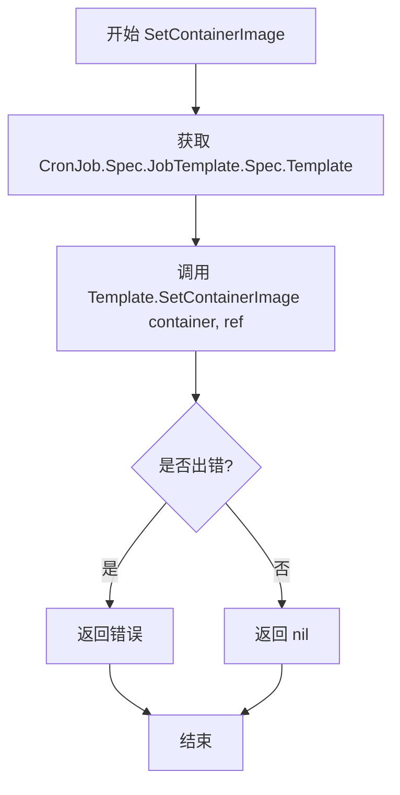
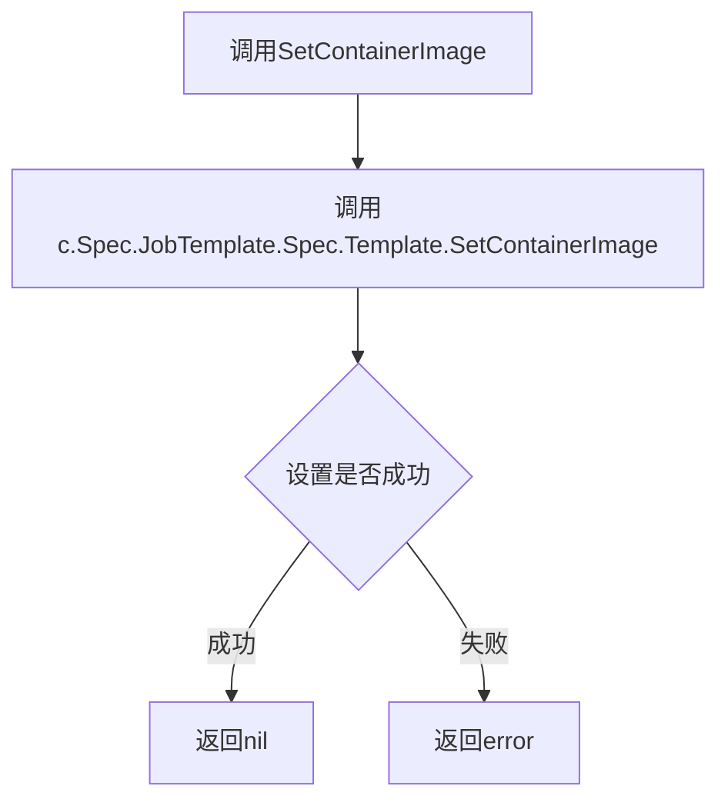

# `flux\pkg\cluster\kubernetes\resource\cronjob.go` 详细设计文档

该文件定义了Flux CD框架中的CronJob资源对象模型，通过嵌入baseObject实现基础对象功能，并实现了resource.Workload接口以支持容器管理和镜像更新操作

## 整体流程

```mermaid
graph TD
    A[开始] --> B[定义CronJob结构体]
    B --> C[定义CronJobSpec规格结构体]
    C --> D[实现Containers方法]
    D --> E[调用Template.Containers获取容器列表]
    E --> F[返回[]resource.Container]
    F --> G[实现SetContainerImage方法]
    G --> H[调用Template.SetContainerImage设置镜像]
    H --> I[返回error错误]
    I --> J[编译时接口检查确保实现Workload接口]
```

## 类结构

```
resource (包)
├── baseObject (嵌入的基础对象)
├── CronJob (实现Workload接口)
│   ├── Spec: CronJobSpec
│   ├── Containers() []resource.Container
│   └── SetContainerImage(string, image.Ref) error
└── CronJobSpec
    └── JobTemplate: struct
        └── Spec: struct
            └── Template: PodTemplate
```

## 全局变量及字段


### `var _ resource.Workload = CronJob{}`
    
编译时接口检查变量，确保CronJob实现了Workload接口

类型：`variable (compile-time interface check)`
    


### `CronJob.baseObject`
    
嵌入的基础对象，提供通用方法

类型：`baseObject (embedded)`
    


### `CronJob.Spec`
    
CronJobSpec类型，存储CronJob的规格定义

类型：`CronJobSpec`
    


### `CronJobSpec.JobTemplate`
    
匿名结构体，包含JobTemplateSpec，使用yaml标签

类型：`struct (anonymous)`
    
    

## 全局函数及方法


### `CronJob.Containers()`

返回 CronJob 中的所有容器列表。该方法通过嵌套结构访问 JobTemplate 中的 PodTemplate，并委托调用其 Containers 方法获取容器信息。

参数： 无

返回值：`[]resource.Container`，返回 CronJob 中的所有容器列表

#### 流程图

```mermaid
flowchart TD
    A[开始 CronJob.Containers 调用] --> B[访问 c.Spec.JobTemplate.Spec.Template]
    B --> C[调用 Template.Containers 方法]
    C --> D[返回 []resource.Container 容器列表]
    
    style A fill:#e1f5fe
    style D fill:#e8f5e8
```

#### 带注释源码

```go
// Containers 返回 CronJob 中的所有容器列表
// 实现 resource.Workload 接口的 Containers 方法
// 访问路径: CronJob -> Spec.JobTemplate.Spec.Template -> Containers
func (c CronJob) Containers() []resource.Container {
    // 通过嵌套结构体逐层访问到 PodTemplate，然后调用其 Containers 方法
    // c.Spec.JobTemplate.Spec.Template 是 PodTemplate 类型
    // 该方法返回底层的容器列表
    return c.Spec.JobTemplate.Spec.Template.Containers()
}
```

#### 补充说明

| 项目 | 说明 |
|------|------|
| **所属结构体** | `CronJob` |
| **接口实现** | `resource.Workload` 接口 |
| **访问路径** | `CronJob.Spec.JobTemplate.Spec.Template.Containers()` |
| **委托调用** | 该方法将请求委托给 `PodTemplate.Containers()` 执行 |
| **数据流** | 从 CronJobSpec -> JobTemplate -> Spec -> Template 最终获取容器列表 |


### `CronJob.SetContainerImage`

设置指定容器的镜像引用，通过委托给底层 PodTemplate 的 SetContainerImage 方法实现。

#### 参数

- `container`：`string`，目标容器的名称
- `ref`：`image.Ref`，要设置的镜像引用

#### 返回值

`error`，执行过程中可能发生的错误，如果成功则返回 nil

#### 流程图



#### 带注释源码

```go
// SetContainerImage 设置指定容器的镜像引用
// 参数:
//   - container: 目标容器名称
//   - ref: 镜像引用对象
//
// 返回值: 错误信息，如果成功则返回 nil
// 实现逻辑: 将调用委托给底层 PodTemplate 的 SetContainerImage 方法
func (c CronJob) SetContainerImage(container string, ref image.Ref) error {
    // 沿着 CronJob -> CronJobSpec -> JobTemplate -> Spec -> Template 的路径
    // 获取嵌套的 PodTemplate 对象，然后调用其 SetContainerImage 方法
    return c.Spec.JobTemplate.Spec.Template.SetContainerImage(container, ref)
}
```

## 关键组件


### 一段话描述

该代码定义了Kubernetes CronJob资源类型，实现了Fluxcd框架中的resource.Workload接口，通过嵌套的PodTemplate结构委托处理容器镜像的读取和设置操作。

### 文件整体运行流程

1. 定义CronJob和CronJobSpec结构体
2. CronJob通过嵌入baseObject获得基础资源对象能力
3. Containers()方法调用底层PodTemplate.Containers()获取容器列表
4. SetContainerImage()方法调用底层PodTemplate.SetContainerImage()设置镜像
5. 通过var _ resource.Workload = CronJob{}编译时验证实现Workload接口

### 类详细信息

#### CronJob结构体
- **字段**:
  - baseObject (隐式嵌入): 基础资源对象，提供元数据和通用能力
  - Spec (CronJobSpec): CronJob的规格定义

#### CronJobSpec结构体
- **字段**:
  - JobTemplate (struct): 作业模板结构
  - JobTemplate.Spec (struct): 作业规格
  - JobTemplate.Spec.Template (PodTemplate): Pod模板，嵌入在JobTemplate内

#### 方法: Containers()
- **名称**: Containers
- **参数**: 无
- **参数类型**: 无
- **参数描述**: 无
- **返回值类型**: []resource.Container
- **返回值描述**: 返回CronJob中所有容器的切片
- **mermaid流程图**: 
```mermaid
flowchart TD
    A[调用CronJob.Containers] --> B[调用c.Spec.JobTemplate.Spec.Template.Containers]
    B --> C[返回[]resource.Container]
```
- **带注释源码**:
```go
// Containers 返回CronJob中定义的所有容器
// 委托给底层PodTemplate处理实际的容器遍历逻辑
func (c CronJob) Containers() []resource.Container {
	return c.Spec.JobTemplate.Spec.Template.Containers()
}
```

#### 方法: SetContainerImage()
- **名称**: SetContainerImage
- **参数名称**: container, ref
- **参数类型**: string, image.Ref
- **参数描述**: container为目标容器名称，ref为镜像引用
- **返回值类型**: error
- **返回值描述**: 设置成功返回nil，失败返回错误
- **mermaid流程图**:

- **带注释源码**:
```go
// SetContainerImage 设置指定容器的镜像
// 参数container为目标容器名称，ref为新的镜像引用
// 底层通过PodTemplate.SetContainerImage完成实际设置
func (c CronJob) SetContainerImage(container string, ref image.Ref) error {
	return c.Spec.JobTemplate.Spec.Template.SetContainerImage(container, ref)
}
```

### 关键组件信息

- **CronJob主类型**: Kubernetes CronJob资源在Fluxcd中的表示，实现了Workload接口
- **CronJobSpec规格**: 封装CronJob的完整规格结构，通过嵌套结构访问JobTemplate
- **PodTemplate委托**: 通过深度嵌套的Template字段委托容器操作给PodTemplate实现
- **Workload接口实现**: 通过var _编译时断言确保CronJob实现了resource.Workload接口
- **baseObject嵌入**: 匿名嵌入baseObject以继承资源对象的基础能力

### 潜在的技术债务或优化空间

1. **深度嵌套访问**: 通过五层嵌套访问Template (Spec.JobTemplate.Spec.Template)，这种深层嵌套结构脆弱且难以维护
2. **重复代码模式**: 与其他Workload类型（Deployment、DaemonSet等）可能存在重复的委托模式，考虑抽象公共逻辑
3. **无直接字段访问**: CronJobSpec内部使用匿名struct而非命名类型，限制了直接扩展性
4. **接口验证位置**: 接口验证代码(var _ resource.Workload = CronJob{})放在文件末尾不够显眼，放在类型定义附近更佳
5. **缺少验证逻辑**: SetContainerImage和Containers方法缺少对Spec为空情况的nil检查

### 其它项目

#### 设计目标与约束
- 遵循Kubernetes API设计模式，通过嵌套结构映射K8s YAML配置
- 实现Fluxcd框架的resource.Workload接口以支持统一的镜像策略管理

#### 错误处理与异常设计
- 错误通过底层PodTemplate方法传播，自身不进行额外错误处理
- 依赖调用方提供有效的container名称和ref参数

#### 数据流与状态机
- 数据流: 外部调用 → CronJob方法 → PodTemplate方法 → 底层容器遍历/修改逻辑
- 状态变更通过镜像引用更新体现，依赖Kubernetes API Server最终生效

#### 外部依赖与接口契约
- 依赖github.com/fluxcd/flux/pkg/image包的image.Ref类型
- 依赖github.com/fluxcd/flux/pkg/resource包的Container接口和Workload接口
- 必须实现resource.Workload接口的Containers()和SetContainerImage()方法


## 问题及建议


### 已知问题

-   **深层嵌套的匿名结构体**：CronJobSpec 使用了多层匿名结构体（JobTemplate → Spec → Template），导致字段访问路径过长（如 `c.Spec.JobTemplate.Spec.Template.Containers()`），代码可读性和可维护性差
-   **缺少深层字段的 YAML 标签**：虽然 JobTemplate 有 yaml 标签，但其内部的 Spec 和 Template 字段缺少 yaml 标签，可能导致序列化/反序列化问题
-   **值类型实现接口**：使用 `var _ resource.Workload = CronJob{}` 声明的是值类型，如果 resource.Workload 接口方法需要指针接收者，可能存在潜在问题
-   **无容器存在性验证**：SetContainerImage 方法未验证指定的 container 名称是否实际存在于 PodTemplate 中，可能导致静默失败或返回错误不明确
-   **错误返回描述缺失**：方法有 error 返回类型，但代码中未说明何种情况会返回错误，调用者难以正确处理异常

### 优化建议

-   **定义显式结构体**：将匿名结构体提取为具名结构体（如 JobTemplateSpec、PodSpec 等），添加完整的 yaml 标签，提高可读性和可维护性
-   **考虑指针类型**：评估是否应使用 `*CronJob` 实现 resource.Workload 接口，确保接口实现的一致性
-   **添加容器验证逻辑**：在 SetContainerImage 中增加容器存在性检查，明确返回错误的原因（如容器不存在）
-   **添加方法文档**：为 Containers() 和 SetContainerImage() 方法添加注释，说明返回值和可能的错误场景
-   **提取公共逻辑**：如果多个资源类型有类似的 PodTemplate 委托逻辑，可考虑使用组合或嵌入模式减少重复

## 其它


### 设计目标与约束

本代码作为fluxcd/flux项目的一部分，旨在为Kubernetes CronJob资源提供统一的资源抽象，使其能够与flux的镜像更新机制集成。设计约束包括：必须实现resource.Workload接口以支持统一的容器镜像管理；需保持与Kubernetes CronJob API的兼容性；遵循Go语言的包结构规范。

### 错误处理与异常设计

代码中的错误处理主要体现在SetContainerImage方法中，该方法将错误向上传递给底层的PodTemplate处理。CronJob本身不直接处理错误，而是作为错误传播的通道。潜在的异常情况包括：无效的容器名称、镜像引用格式错误、YAML解析失败等。

### 数据流与状态机

CronJob的数据流遵循以下路径：外部调用 → CronJob.SetContainerImage() → PodTemplate.SetContainerImage() → 镜像引用更新。状态机方面，CronJob对象在内存中保持稳定的生命周期，其状态变更主要由flux的控制器通过镜像更新触发。

### 外部依赖与接口契约

主要外部依赖包括：github.com/fluxcd/flux/pkg/image（镜像引用类型）、github.com/fluxcd/flux/pkg/resource（资源接口定义）。接口契约要求所有实现resource.Workload的类型必须提供Containers()和SetContainerImage()方法。

### 版本兼容性

当前代码基于Kubernetes CronJob v1beta1版本的API结构（JobTemplate嵌套结构）。需要注意与Kubernetes API版本的兼容性，当前实现适配较旧的API版本，未来可能需要迁移到batch/v1 CronJob。

### 性能考虑

由于CronJob资源通常数量较少，性能不是主要瓶颈。Containers()方法每次调用都会遍历容器列表，如需优化可考虑缓存结果。SetContainerImage()的时间复杂度取决于容器查找效率。

### 安全性考虑

代码本身不直接处理敏感数据，但作为镜像更新系统的一部分，需要确保镜像引用的合法性验证。外部输入（container名称、image.Ref）应进行有效性校验，防止注入攻击。

### 测试策略

建议包含以下测试：CronJob结构体序列化/反序列化测试、Containers()方法返回正确容器列表测试、SetContainerImage()更新指定容器镜像测试、PodTemplate嵌套结构解析测试、与resource.Workload接口兼容性测试。

### 使用示例

```go
// 创建CronJob实例
cj := resource.CronJob{
    Spec: resource.CronJobSpec{
        // 初始化嵌套结构
    },
}

// 获取容器列表
containers := cj.Containers()

// 设置容器镜像
err := cj.SetContainerImage("my-container", image.Ref{
    Repository: "my-repo",
    Tag:        "v1.0.0",
})
```

    