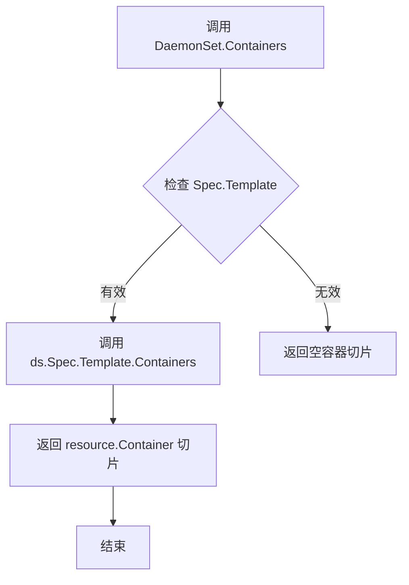
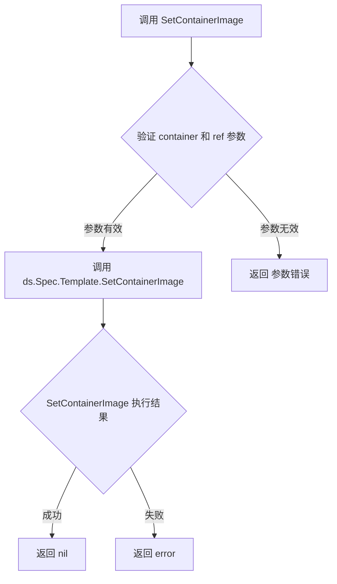

# `flux\pkg\cluster\kubernetes\resource\daemonset.go` 详细设计文档

这是一个Go语言实现的DaemonSet资源类型定义，封装了Kubernetes的DaemonSet资源操作，提供了容器列表获取和镜像设置功能，并确保实现了resource.Workload接口。

## 整体流程

```mermaid
graph TD
    A[开始] --> B[定义DaemonSet结构体]
B --> C[嵌入baseObject]
C --> D[定义Spec字段包含PodTemplate]
D --> E[实现Containers方法]
E --> F[调用PodTemplate.Containers]
F --> G[返回[]resource.Container]
D --> H[实现SetContainerImage方法]
H --> I[调用PodTemplate.SetContainerImage]
I --> J[返回error]
J --> K[验证实现resource.Workload接口]
```

## 类结构

```
resource (包)
└── DaemonSet
    ├── 嵌入: baseObject
    └── Spec
        └── Template: PodTemplate

实现的接口: resource.Workload
```

## 全局变量及字段


### `_`
    
空白标识符用于接口验证，确保DaemonSet实现了resource.Workload接口

类型：`resource.Workload`
    


### `DaemonSet.baseObject`
    
嵌入的基对象，提供通用的资源元数据和方法

类型：`baseObject`
    


### `DaemonSet.Spec`
    
包含PodTemplate的规格，定义DaemonSet的Pod模板和容器配置

类型：`struct { Template PodTemplate }`
    
    

## 全局函数及方法


### `DaemonSet.Containers()`

该方法返回 DaemonSet 资源中定义的容器列表，通过调用其内部 `Spec.Template` 的 `Containers()` 方法获取 Pod 模板中所有容器的信息。

参数：

- 该方法无参数

返回值：`[]resource.Container`，返回 DaemonSet 规范中 Pod 模板定义的所有容器数组

#### 流程图



#### 带注释源码

```go
// Containers 返回 DaemonSet 规范中定义的所有容器
// 方法签名：无参数，返回 []resource.Container 类型
// 内部实现委托给 PodTemplate 的 Containers 方法
func (ds DaemonSet) Containers() []resource.Container {
    // 调用内嵌的 PodTemplate 对象的 Containers 方法
    // 将 DaemonSet 的容器列表查询请求转发到 PodTemplate 层面
    return ds.Spec.Template.Containers()
}
```


### `DaemonSet.SetContainerImage`

设置 DaemonSet 中指定容器的镜像。

参数：

- `container`：`string`，要设置镜像的容器名称
- `ref`：`image.Ref`，镜像引用对象，包含镜像仓库、标签等信息

返回值：`error`，如果设置镜像失败则返回错误，否则返回 nil

#### 流程图



#### 带注释源码

```go
// SetContainerImage 设置 DaemonSet 中指定容器的镜像
// 参数:
//   - container: 容器名称，用于定位需要更新镜像的容器
//   - ref: 镜像引用对象，包含镜像的仓库地址、标签等信息
//
// 返回值:
//   - error: 如果设置成功返回 nil，如果失败返回具体错误信息
//
// 工作流程:
//   1. 接收容器名称和镜像引用作为参数
//   2. 将调用转发给内部嵌套的 PodTemplate 对象的 SetContainerImage 方法
//   3. 返回 PodTemplate.SetContainerImage 的执行结果
func (ds DaemonSet) SetContainerImage(container string, ref image.Ref) error {
    // 调用 Spec.Template 的 SetContainerImage 方法完成实际的镜像设置操作
    // Template 是 PodTemplate 类型，包含 Pod 的规格定义
    return ds.Spec.Template.SetContainerImage(container, ref)
}
```

## 关键组件


### DaemonSet 结构体

核心资源类型定义，表示 Kubernetes DaemonSet 资源，包含模板规范用于管理 Pod 的部署。

### Containers() 方法

获取 DaemonSet 中所有容器的列表，返回容器切片用于镜像管理和同步检查。

### SetContainerImage() 方法

根据指定的容器名称更新其镜像引用，返回错误信息以处理容器不存在等异常情况。

### PodTemplate 模板规范

定义 Pod 的模板结构，包含容器列表和镜像配置，是镜像更新的核心目标对象。

### image.Ref 镜像引用

封装镜像仓库地址和标签的引用类型，用于精确标识和更新容器镜像。

### resource.Workload 接口实现

DaemonSet 实现 Workload 接口，使其能够被 Flux CD 统一管理和同步。


## 问题及建议


### 已知问题

- **接口实现缺少错误处理**：使用 `var _ resource.Workload = DaemonSet{}` 方式进行编译时接口检查，若 `DaemonSet` 未实现接口会导致编译错误，但无明确的错误提示信息
- **结构体字段缺乏封装性**：`baseObject` 和 `Spec` 字段均为公开字段，直接暴露内部结构，外部代码可能直接修改导致状态不一致
- **缺少字段验证逻辑**：`SetContainerImage` 方法依赖 `PodTemplate` 的实现，但没有对容器名称存在性进行预验证，错误信息可能不够明确
- **缺少文档注释**：结构体和方法均缺少 Go 标准的文档注释（doc comment），影响代码可维护性和 API 清晰度
- **没有实现完整的接口方法**：仅实现了 `Containers()` 和 `SetContainerImage()`，可能缺少 `resource.Workload` 接口要求的其他方法（如 `GetMetadata()`、`GetNamespace()` 等）
- **PodTemplate 完全信任**：`DaemonSet` 自身没有对 `Spec.Template` 进行任何合法性校验，完全依赖 `PodTemplate` 内部逻辑

### 优化建议

- 为 `DaemonSet` 结构体及其方法添加完整的 Go 文档注释，说明其用途和行为
- 考虑将 `baseObject` 和 `Spec` 字段改为私有，通过 Getter/Setter 方法访问，增强封装性
- 在 `SetContainerImage` 方法中添加容器存在性预检查，提供更友好的错误信息
- 实现完整的 `resource.Workload` 接口方法，或明确文档说明仅支持部分方法
- 添加 `Validate()` 方法对 `DaemonSet` 的必填字段进行校验
- 考虑为结构体添加构造函数 `NewDaemonSet()`，统一初始化逻辑并设置默认值


## 其它


### 设计目标与约束

本代码的设计目标是实现Kubernetes DaemonSet资源的抽象表示，使其能够与Flux CD的镜像更新流程集成。设计约束包括：遵循Go语言编码规范、保持与fluxcd/flux/pkg/resource包中其他Workload类型的一致性、实现标准的Workload接口。

### 错误处理与异常设计

SetContainerImage方法返回error类型用于处理镜像设置失败的情况。当前实现依赖PodTemplate的SetContainerImage方法进行错误传播。潜在异常场景包括：容器名称不存在、镜像引用无效、PodTemplate未初始化等。建议增强错误信息，包含具体的容器名称和镜像引用以便调试。

### 外部依赖与接口契约

主要外部依赖包括github.com/fluxcd/flux/pkg/image和github.com/fluxcd/flux/pkg/resource两个包。必须实现的接口契约是resource.Workload接口，需要实现Containers()和SetContainerImage()两个方法。PodTemplate类型需要提供Containers()和SetContainerImage(container string, ref image.Ref) error方法。

### 性能考虑

当前实现为值类型传递，可能导致复制开销。建议在大型集群中考虑使用指针类型(*DaemonSet)以提高性能。Containers()和SetContainerImage方法调用链较短，性能开销主要在底层的PodTemplate实现中。

### 安全性考虑

代码本身不直接处理敏感数据，但作为镜像更新流程的一部分，需要确保image.Ref的验证和安全性。镜像引用应防止注入恶意内容，建议在底层image包中实现完整的引用验证。

### 可测试性

当前代码结构具有良好的可测试性。建议补充单元测试验证：Containers()方法返回正确的容器列表、SetContainerImage方法正确调用底层实现、错误情况的正确传播。可以使用mock方式模拟PodTemplate行为进行隔离测试。

### 配置管理

DaemonSet作为Kubernetes资源描述符，其配置通过结构体字段管理。当前代码不直接处理配置来源（可能是YAML、JSON或API），建议明确配置解析和序列化的责任边界。

### 版本兼容性

代码依赖于fluxcd/fluxpkg/resource和fluxcd/fluxpkg/image两个外部包，需要关注这些包的版本演进。建议在go.mod中明确依赖版本，并记录API兼容性保证。

### 部署考量

作为Flux CD控制器的一部分，此代码将部署在Kubernetes集群中。需要考虑：与Flux CD其他组件的版本匹配、Go编译产物的容器化、错误日志的收集和监控。

### 日志与可观测性

当前代码缺少日志记录语句。建议在关键操作点添加日志：Containers()方法调用时记录容器数量、SetContainerImage方法调用时记录容器名和镜像引用、操作失败时记录详细错误信息。

### 并发安全

由于DaemonSet可能同时被多个goroutine访问，需要评估并发安全性。如果在多线程环境中使用，建议添加适当的同步机制或使用指针类型确保共享状态的一致性。


    