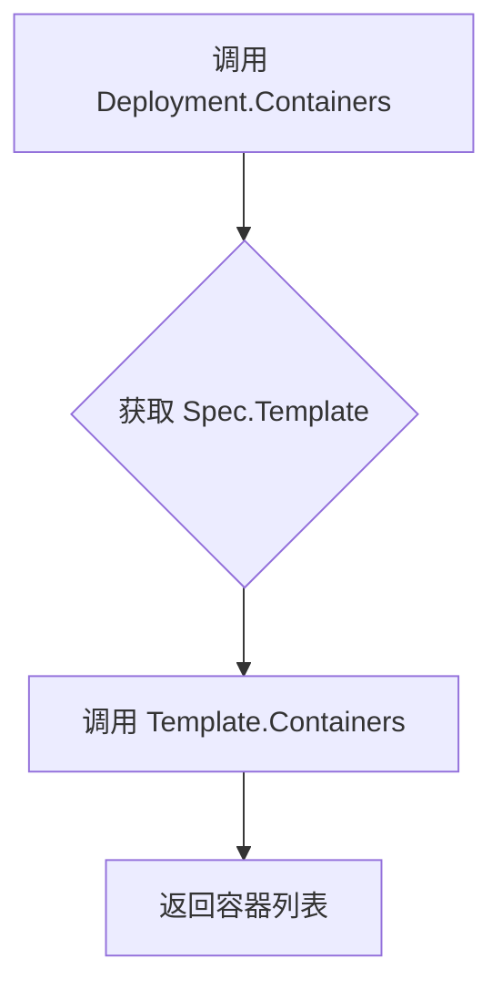
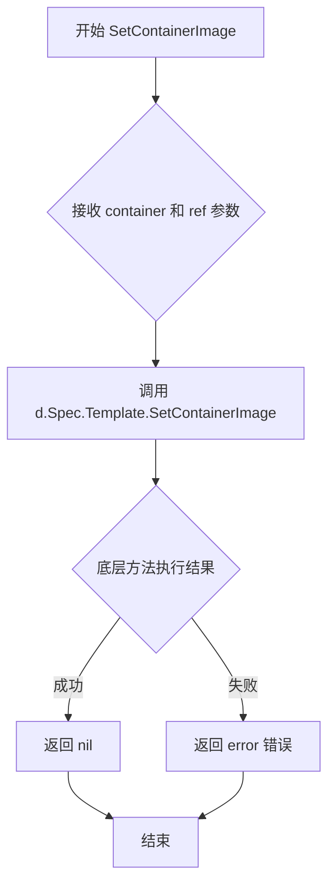

# `flux\pkg\cluster\kubernetes\resource\deployment.go` 详细设计文档

该文件定义了 Flux CD 中用于映射 Kubernetes Deployment 资源的结构体，包含了部署规范（副本数、Pod模板），并提供了获取容器列表和设置容器镜像的方法，实现了 resource.Workload 接口。

## 整体流程

```mermaid
graph TD
    A[Flux CD 同步资源] --> B[获取 Deployment 对象]
    B --> C{操作类型}
    C -- 获取容器信息 --> D[调用 Containers 方法]
    D --> E[返回 []resource.Container]
    C -- 设置镜像版本 --> F[调用 SetContainerImage 方法]
    F --> G[修改 Spec.Template 中的镜像引用]
    G --> H[返回 error 检查更新是否成功]
```

## 类结构

```
Deployment (资源结构体)
└── DeploymentSpec (规格定义)
    └── PodTemplate (Pod模板，包含在 Template 字段中)
```

## 全局变量及字段


### `interfaceCheck`
    
编译时接口实现断言，确保 Deployment 实现了 Workload 接口

类型：`resource.Workload`
    


### `Deployment.baseObject`
    
嵌入的基础对象，包含元数据

类型：`baseObject`
    


### `Deployment.Spec`
    
DeploymentSpec 类型，部署规范

类型：`DeploymentSpec`
    


### `DeploymentSpec.Replicas`
    
int 类型，副本数

类型：`int`
    


### `DeploymentSpec.Template`
    
PodTemplate 类型，Pod 模板定义

类型：`PodTemplate`
    
    

## 全局函数及方法


### `Deployment.Containers()`

获取 Deployment 中定义的容器列表。

参数：

- （无参数）

返回值：`[]resource.Container`，返回该 Deployment 定义的容器列表

#### 流程图



#### 带注释源码

```go
// Containers 返回该 Deployment 中定义的容器列表
// 方法接收 Deployment 的值拷贝作为接收者
// 内部委托给 Spec.Template.Containers() 实现具体逻辑
func (d Deployment) Containers() []resource.Container {
    // 访问嵌入的 Spec 字段中的 Template 对象
    // 并调用其 Containers 方法获取容器列表
    return d.Spec.Template.Containers()
}
```


### `Deployment.SetContainerImage`

该方法用于设置 Deployment 资源中指定容器的镜像，通过委托调用内部 `Spec.Template` 的 `SetContainerImage` 方法实现镜像更新功能。

参数：

- `container`：`string`，要设置镜像的目标容器名称
- `ref`：`image.Ref`，新的镜像引用（包含仓库、标签等信息）

返回值：`error`，如果设置成功返回 nil，如果容器不存在或底层调用失败则返回相应的错误信息

#### 流程图



#### 带注释源码

```go
// SetContainerImage 设置指定容器的镜像
// 参数：
//   - container: 目标容器的名称字符串
//   - ref: 镜像引用，包含镜像仓库和标签等信息
//
// 返回值：
//   - error: 操作过程中的错误信息，成功时返回 nil
func (d Deployment) SetContainerImage(container string, ref image.Ref) error {
    // 委托给 Spec.Template 的 SetContainerImage 方法执行实际的镜像设置逻辑
    // 这里采用了组合模式，将调用转发到内部的 PodTemplate 结构
    return d.Spec.Template.SetContainerImage(container, ref)
}
```

## 关键组件


### Deployment 结构体

核心资源类型，表示Kubernetes Deployment，封装了部署的元数据和规范，实现了resource.Workload接口。

### DeploymentSpec 结构体

部署规范定义，包含副本数和Pod模板信息，用于描述Deployment的具体配置。

### baseObject 嵌入字段

基础对象，提供了Deployment的通用元数据功能，如名称、命名空间等。

### Containers 方法

获取Deployment中所有容器的列表，返回[]resource.Container类型，用于镜像更新和同步操作。

### SetContainerImage 方法

设置指定容器的镜像引用，接收容器名称和镜像引用作为参数，实现GitOps中的镜像自动化更新功能。

### resource.Workload 接口实现

通过var _ resource.Workload = Deployment{}空赋值语句，确保Deployment实现了Workload接口定义的契约。


## 问题及建议


### 已知问题

-   **值接收者导致状态修改失效**：`Containers()` 和 `SetContainerImage()` 方法使用值接收者 `(d Deployment)` 而非指针接收者。当调用 `SetContainerImage()` 时，修改不会持久化到原始对象，因为修改的是对象的副本。
-   **接口验证可能不正确**：使用 `var _ resource.Workload = Deployment{}` 验证接口实现，但如果 `resource.Workload` 接口中的方法是指针接收者定义，这个静态验证可能无法捕获运行时错误。
-   **缺乏错误处理**：`SetContainerImage()` 方法返回 `error`，但内部调用 `d.Spec.Template.SetContainerImage()` 的错误没有被处理或记录，可能导致静默失败。
- **基本类型缺乏验证**：`DeploymentSpec.Replicas` 使用 `int` 类型，没有非负数验证，可能导致部署无效的副本数。
- **缺少文档注释**：所有类型和方法都缺少 Go 文档注释，降低了代码可维护性和可理解性。
- **未使用的导入检查**：虽然导入了 `image` 包，但仅用于参数类型定义，未体现实际使用逻辑。

### 优化建议

-   **改用指针接收者**：将方法改为指针接收者 `(d *Deployment)`，确保状态修改能正确持久化。
-   **完善接口验证**：使用 `var _ resource.Workload = (*Deployment)(nil)` 进行指针类型的接口验证。
-   **添加输入验证**：在 `SetContainerImage()` 或构造函数中验证 `Replicas` 是否为非负数。
-   **添加文档注释**：为类型、字段和方法添加标准的 Go 文档注释。
-   **错误传播处理**：考虑在方法中添加日志记录或更详细的错误信息返回。


## 其它


### 设计目标与约束

本代码作为FluxCD资源抽象层的一部分，旨在提供对Kubernetes Deployment资源的统一操作接口。设计约束包括：遵循Go语言编码规范，嵌入baseObject实现通用资源操作，实现resource.Workload接口以支持FluxCD的自动化部署流程。

### 错误处理与异常设计

SetContainerImage方法返回error类型用于处理镜像设置失败的情况。接口实现验证通过var _ resource.Workload = Deployment{}确保编译时检查。所有错误通过Go标准错误机制传播，由调用方处理。

### 外部依赖与接口契约

依赖github.com/fluxcd/flux/pkg/image包提供镜像引用类型，依赖github.com/fluxcd/flux/pkg/resource包获取Container接口和Workload接口定义。实现resource.Workload接口需提供Containers()和SetContainerImage()两个方法。

### 性能考虑

Containers()和SetContainerImage()方法直接访问结构体字段，无额外内存分配。PodTemplate容器的Clone或深拷贝操作由底层实现决定，调用方需注意值拷贝语义。

### 并发安全性

Deployment结构体本身不包含并发控制机制，作为值类型传递给方法时为拷贝操作。若在多协程场景使用，应由调用方保证竞态条件。

### 测试策略建议

建议编写单元测试验证：Deployment正确实现resource.Workload接口、Containers()返回正确的容器列表、SetContainerImage()正确修改镜像引用、接口验证编译通过。

### 版本兼容性

当前代码未标记版本API变更历史。作为FluxCD项目一部分，需遵循项目整体的API版本演进策略。


    