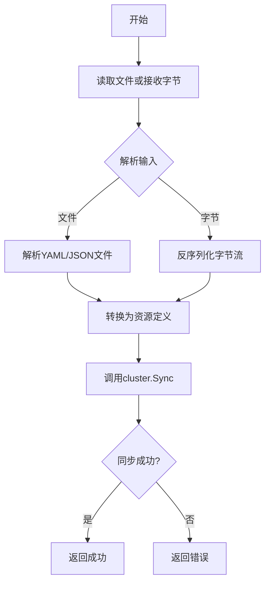

# `flux\pkg\cluster\kubernetes\resource\doc.go` 详细设计文档

该代码定义了用于将文件和导出的字节转换为Kubernetes资源对象的类型和过程，主要服务于cluster.Sync接口，简化了真实Kubernetes对象的复杂性。

## 整体流程



## 类结构

```
resource (包)
└── 类型定义 (基于注释推断)
    ├── Resource (资源基类)
    ├── PodResource
    ├── ServiceResource
    └── ... (其他Kubernetes资源类型)
```

## 全局变量及字段


    

## 全局函数及方法


## 关键组件


## 代码概述

该代码是一个Kubernetes资源对象的类型定义包，主要用于将文件和导出的字节数据转换为资源定义，以便发送给`cluster.Sync`进行同步处理。该包简化了真实Kubernetes对象的复杂性，专注于核心的资源表示功能。

---

## 文件整体运行流程

由于当前代码仅包含包声明和文档注释，无具体实现代码，因此无法提供详细的运行流程。该文件应为`resource`包的头部说明文件，后续应有具体的类型定义和函数实现。

---

## 类详细信息

**无类定义**

当前代码中未包含任何类（结构体）定义。基于文档注释，该包预期包含用于表示Kubernetes资源的类型定义。

---

## 类字段和全局变量

**无字段或全局变量定义**

当前代码中未包含任何字段或全局变量。

---

## 类方法和全局函数

**无方法或全局函数定义**

当前代码中未包含任何函数或方法定义。

---

## 关键组件信息

### Kubernetes资源类型

用于表示Kubernetes对象的类型定义，将文件和字节数据转换为资源定义。

### 资源转换逻辑

将输入的文件和导出的字节数据转换为可发送到`cluster.Sync`的统一资源格式。

---

## 潜在的技术债务或优化空间

1. **类型覆盖不完整**：当前仅有包声明注释，需要实现完整的Kubernetes资源类型定义
2. **功能边界模糊**：需要明确该包是否支持所有Kubernetes资源类型或仅支持部分核心类型
3. **错误处理机制缺失**：需要定义资源转换过程中的错误处理策略
4. **与真实K8s对象的映射关系**：文档提到"ignore much of the detail"，需明确哪些细节被忽略及原因

---

## 其它项目

### 设计目标与约束

- **核心目标**：简化Kubernetes资源表示，专注于与`cluster.Sync`的交互
- **约束**：忽略真实Kubernetes对象的许多细节，保持轻量级

### 外部依赖与接口契约

- 依赖`cluster.Sync`方法进行资源同步
- 输入：文件和导出的字节数据
- 输出：资源定义（Resource definitions）

### 后续实现建议

1. 定义具体的资源类型结构体（如Deployment、Service、Pod等）
2. 实现文件解析函数（如YAML/JSON解析）
3. 实现字节数据反序列化逻辑
4. 定义资源验证规则


## 问题及建议


### 已知问题

- 缺少实际的类型定义和函数实现代码，仅有包声明和注释，无法进行完整的代码分析
- 包文档提到该实现"ignore much of the detail in real Kubernetes objects"，表明存在功能简化可能导致的功能缺失问题
- 未定义与 cluster.Sync 的具体接口契约，调用方可能面临隐式依赖风险
- 未提供错误处理机制的文档说明，文件解析和字节转换过程中的异常处理不明确

### 优化建议

- 补充完整的 Kubernetes 资源类型定义，确保核心字段（metadata、spec、status 等）得到支持
- 明确文件格式支持范围（如 YAML、JSON）和解析失败时的错误返回策略
- 建立与 cluster.Sync 的明确接口契约，包括输入输出数据结构定义
- 添加验证逻辑以确保资源定义的完整性和合法性
- 完善包级文档，增加使用示例和边界场景说明


## 其它


### 设计目标与约束

本模块的设计目标是为Kubernetes资源对象提供类型定义和转换过程，使文件 和导出的字节流能够转换为资源定义，以便发送到cluster.Sync进行同步。该模块 故意简化了真实Kubernetes对象的细节，以降低复杂度并提高性能。设计约束 包括：仅支持资源序列化和反序列化，不处理完整的Kubernetes API语义；依赖 最小的外部包；保持与Kubernetes API对象的兼容性。

### 错误处理与异常设计

由于代码片段中未包含完整的实现，根据包文档注释推测，错误处理应包括： 文件读取错误（如文件不存在、权限不足）、JSON/YAML解析错误（格式不正确、 字段类型不匹配）、字节流解码错误（无效的资源定义）。异常设计建议：使用 Go的错误处理模式（返回error类型）；为常见错误定义专用错误变量或错误 类型；提供有意义的错误信息，包含上下文（如文件名、行号）；区分可恢复 错误和不可恢复错误。

### 数据流与状态机

数据流主要包括两个方向：输入流程（文件/字节流 → 解析 → 资源对象 → 验证） 和输出流程（资源对象 → 序列化 → 字节流/文件）。根据包说明，主要流程为： 读取配置文件或接收导出的字节流 → 解析为内部资源类型 → 转换为cluster.Sync 所需格式 → 发送到集群同步。由于是简单模块，不涉及复杂状态机，但资源 对象可能包含状态字段（如创建中、活跃、已删除）。

### 外部依赖与接口契约

外部依赖推断：cluster包（用于Sync方法调用）、Kubernetes API相关类型（ 用于兼容）、序列化库（如encoding/json、gopkg.in/yaml）。接口契约：提供 资源对象的构造函数或解析函数；提供序列化/反序列化方法；与cluster.Sync 的集成接口需要传入特定的资源定义格式；可能需要实现io.Reader或类似 接口以支持流式处理。

### 潜在的技术债务或优化空间

基于代码片段分析的技术债务和优化空间包括：缺乏具体的类型定义导致类型 安全性问题；缺少单元测试覆盖；缺乏资源验证逻辑；可能缺少对所有 Kubernetes资源类型的支持；错误处理可能不够详细；缺少并发安全的考虑（如果 涉及多线程访问）；缺乏日志记录机制；包文档可以更详细。

### 安全考虑

安全方面需要考虑：文件读取权限控制；敏感信息（如证书、密钥）的处理； 输入验证以防止注入攻击；资源定义的权限检查（如果实现RBAC）；序列化/ 反序列化过程中的边界情况处理；避免拒绝服务攻击（大量资源或嵌套过深）。

### 性能考虑

性能优化方向包括：使用对象池减少内存分配；延迟加载非必要字段；缓存 解析结果（如果资源未变化）；并行处理多个资源文件；流式处理大文件；避 免不必要的深拷贝；使用高效的序列化库（如msgp、protobuf）。

### 测试策略

建议的测试策略包括：单元测试覆盖所有公共函数和方法；解析器的边界条件 测试；序列化/反序列化 roundtrip 测试；与真实Kubernetes API对象的兼容 性测试；性能基准测试；错误场景测试；集成测试（与cluster.Sync的集成）。

### 配置与扩展性

扩展性设计考虑：支持自定义资源定义（CRD）；插件机制支持新的资源类型； 配置驱动的解析选项；支持不同的序列化格式（JSON、YAML、protobuf）；可 配置的验证规则；版本兼容性处理。

### 版本与兼容性

版本管理考虑：与Kubernetes API版本的对应关系；向后兼容性策略；版本间 的迁移路径；废弃API的处理；发布版本管理。


    