# `flux\pkg\cluster\kubernetes\resource\helmrelease.go` 详细设计文档

该代码是一个HelmRelease资源的容器镜像解析和管理模块，通过注解和values配置自动识别、映射和更新容器镜像，支持从多种格式（纯镜像字符串、嵌套对象、注解映射）解析镜像信息，并提供统一的接口获取和设置容器镜像。

## 整体流程

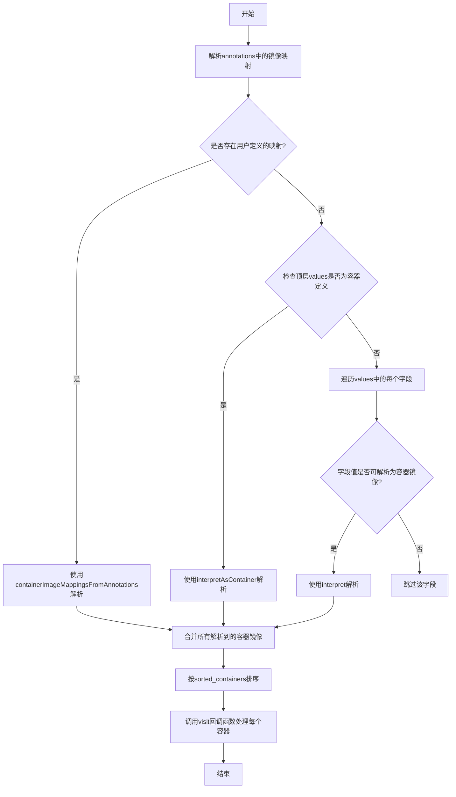

## 类结构

```
ContainerImageMap (容器镜像映射结构体)
├── 字段: BasePath, Registry, Repository, Tag
└── 方法: RepositoryOnly, RepositoryTag, RegistryRepository, AllDefined, GetRegistry, GetRepository, GetTag, MapImageRef

HelmRelease (HelmRelease资源结构体)
├── 嵌入: baseObject
├── 字段: Spec.Values
└── 方法: Containers, SetContainerImage, GetContainerImageMap

辅助类型
├── ImageSetter (函数类型)
├── imageAndSetter (内部结构体)
├── mapper (接口)
├── stringMap (类型别名)
└── anyMap (类型别名)

全局函数
├── sorted_containers
├── FindHelmReleaseContainers
├── interpret
├── interpretAsContainer
├── interpretAsImage
├── containerImageMappingsFromAnnotations
└── interpretMappedContainerImage
```

## 全局变量及字段


### `ReleaseContainerName`
    
顶层镜像的标准容器名称常量，用于标识从HelmRelease的values字段中自动解析的镜像

类型：`string`
    


### `ImageBasePath`
    
镜像路径映射的默认基础路径，默认为spec.values.

类型：`string`
    


### `ImageRegistryPrefix`
    
镜像仓库路径映射的注解前缀，用于从注解中提取容器镜像的仓库路径

类型：`string`
    


### `ImageRepositoryPrefix`
    
镜像仓库名称映射的注解前缀，用于从注解中提取容器镜像的仓库名称

类型：`string`
    


### `ImageTagPrefix`
    
镜像标签映射的注解前缀，用于从注解中提取容器镜像的标签

类型：`string`
    


### `ImageSetter`
    
函数类型，用于设置容器镜像的回调函数

类型：`func(image.Ref)`
    


### `ContainerImageMap.BasePath`
    
基础路径，用于构建完整的镜像路径

类型：`string`
    


### `ContainerImageMap.Registry`
    
镜像仓库路径，使用YAML点号表示法

类型：`string`
    


### `ContainerImageMap.Repository`
    
镜像仓库名称路径，使用YAML点号表示法

类型：`string`
    


### `ContainerImageMap.Tag`
    
镜像标签路径，使用YAML点号表示法

类型：`string`
    


### `HelmRelease.baseObject`
    
基础对象嵌入，提供元数据如Annotations等

类型：`嵌入的baseObject`
    


### `HelmRelease.Spec.Values`
    
Helm values配置，存储HelmRelease的自定义配置值

类型：`map[string]interface{}`
    


### `imageAndSetter.image`
    
镜像引用，包含镜像的域名、仓库和标签信息

类型：`image.Ref`
    


### `imageAndSetter.setter`
    
镜像设置函数，用于更新values中的镜像信息

类型：`ImageSetter`
    
    

## 全局函数及方法


### `sorted_containers`

该函数接收一个容器名称到镜像及其设置器的映射，按字母顺序返回容器名称数组，其中 `ReleaseContainerName`（"chart-image"）始终排在第一位，以确保输出的容器顺序稳定，避免 API 调用时的顺序不一致问题。

参数：

- `containers`：`map[string]imageAndSetter`，包含容器名称与对应镜像信息及设置器的映射

返回值：`[]string`，排序后的容器名称数组

#### 流程图

```mermaid
flowchart TD
    A[开始 sorted_containers] --> B[创建空切片 keys]
    B --> C[遍历 containers map]
    C --> D[将所有 key 加入 keys 切片]
    D --> E{对 keys 进行排序}
    E --> F{比较 keys[i] 是否为 ReleaseContainerName}
    F -->|是| G[返回 true, 优先排前]
    F -->|否| H{比较 keys[j] 是否为 ReleaseContainerName}
    H -->|是| I[返回 false, 排后面]
    H -->|否| J[按字母顺序比较 keys[i] < keys[j]]
    J --> K[返回排序后的 keys 切片]
    K --> L[结束]
    
    style F fill:#f9f,color:#000
    style H fill:#f9f,color:#000
    style G fill:#9f9,color:#000
    style I fill:#f99,color:#000
```

#### 带注释源码

```go
// sorted_containers 返回一个按字母顺序排列的容器名称数组，
// 除了 ReleaseContainerName，它始终排在第一位。
// 我们需要容器输出顺序稳定，否则在 API 调用中会出现顺序不一致
// 或验证失败的问题。
func sorted_containers(containers map[string]imageAndSetter) []string {
	// 创建一个空切片用于存储所有容器名称（key）
	var keys []string
	
	// 遍历 map，收集所有 key 到 keys 切片中
	// 注意：map 的迭代顺序是不确定的
	for k := range containers {
		keys = append(keys, k)
	}
	
	// 使用 sort.Slice 对 keys 进行自定义排序
	// 排序逻辑：
	// 1. 如果 keys[i] == ReleaseContainerName，始终返回 true，排在最前面
	// 2. 如果 keys[j] == ReleaseContainerName，始终返回 false，排在后面
	// 3. 其他情况按字母顺序升序排列
	sort.Slice(keys, func(i, j int) bool {
		// 如果当前元素是 ReleaseContainerName，优先排前
		if keys[i] == ReleaseContainerName {
			return true
		}
		// 如果比较的元素是 ReleaseContainerName，排后面
		if keys[j] == ReleaseContainerName {
			return false
		}
		// 否则按字母顺序比较
		return keys[i] < keys[j]
	})
	
	// 返回排序后的容器名称数组
	return keys
}
```


### `FindHelmReleaseContainers`

该函数是Fluxcd项目中用于从HelmRelease资源配置中提取容器镜像信息的核心函数。它通过解析values字段、注解和映射规则，找出所有定义的容器镜像，并以稳定顺序调用提供的访问回调函数。

参数：

- `annotations`：`map[string]string`，HelmRelease资源的注解映射，用于存储用户自定义的镜像路径映射规则
- `values`：`map[string]interface{}`，HelmRelease的spec.values字段，包含所有配置值
- `visit`：`func(string, image.Ref, ImageSetter) error`，回调函数，用于处理每个找到的容器镜像，参数分别为容器名称、镜像引用和镜像设置器

返回值：无返回值（函数通过回调函数返回结果）

#### 流程图

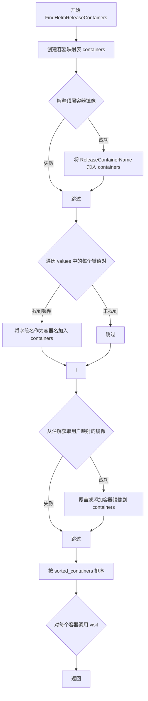

#### 带注释源码

```go
// FindHelmReleaseContainers examines the Values from a
// HelmRelease (manifest, or cluster resource, or otherwise) and
// calls visit with each container name and image it finds, as well as
// procedure for changing the image value.
func FindHelmReleaseContainers(annotations map[string]string, values map[string]interface{},
	visit func(string, image.Ref, ImageSetter) error) {

	// 创建一个容器映射表，键为容器名称，值为镜像和设置器
	containers := make(map[string]imageAndSetter)
	
	// 检查顶层是否有镜像定义，如果有则使用标准容器名 "chart-image"
	// interpretAsContainer 会解析 values 中的 image 字段
	if image, setter, ok := interpretAsContainer(stringMap(values)); ok {
		containers[ReleaseContainerName] = imageAndSetter{image, setter}
	}

	// 遍历 values 中的每个键值对，将字段名作为容器名
	// interpret 函数尝试将值解释为容器镜像
	for k, v := range values {
		if image, setter, ok := interpret(v); ok {
			containers[k] = imageAndSetter{image, setter}
		}
	}

	// 处理用户通过注解映射的镜像，这会自动覆盖自动解析的镜像
	// containerImageMappingsFromAnnotations 从注解中提取 ContainerImageMap
	for k, v := range containerImageMappingsFromAnnotations(annotations) {
		if image, setter, ok := interpretMappedContainerImage(values, v); ok {
			containers[k] = imageAndSetter{image, setter}
		}
	}

	// 对找到的容器按名称排序，ReleaseContainerName 始终排在最前面
	// 这样可以保证输出的稳定性，避免API调用时的随机顺序导致验证失败
	for _, k := range sorted_containers(containers) {
		visit(k, containers[k].image, containers[k].setter)
	}
}
```


### `interpret`

该函数是 HelmRelease 资源中用于解析容器镜像的核心解释器，通过类型断言将传入的 `values` 参数转换为内部映射类型，并委托给 `interpretAsContainer` 函数完成具体的镜像解析工作。

参数：

-  `values`：`interface{}`，待解析的值，可能是 `map[string]interface{}` 或 `map[interface{}]interface{}` 类型，包含镜像信息的映射结构

返回值：

-  `image.Ref`：解析后的镜像引用对象，包含镜像的域名、仓库名和标签等信息
-  `ImageSetter`：一个闭包函数，用于在原映射结构中更新镜像信息
-  `bool`：表示是否成功解析出镜像信息

#### 流程图

```mermaid
flowchart TD
    A[开始 interpret] --> B{values 类型检查}
    B -->|map[string]interface{}| C[转换为 stringMap]
    B -->|map[interface{}]interface{}| D[转换为 anyMap]
    C --> E[调用 interpretAsContainer]
    D --> E
    E --> F{是否能解析出镜像}
    F -->|是| G[返回 imageRef, ImageSetter, true]
    F -->|否| H[返回 空imageRef, nil, false]
    G --> I[结束]
    H --> I
```

#### 带注释源码

```go
// interpret gets a value which may contain a description of an image.
// interpret 接收一个可能包含镜像描述的值，并尝试解析为镜像引用
func interpret(values interface{}) (image.Ref, ImageSetter, bool) {
	// 使用类型断言 switch 检查 values 的具体类型
	// 支持两种 map 类型：map[string]interface{} (JSON来源) 和 map[interface{}]interface{} (YAML来源)
	switch m := values.(type) {
	case map[string]interface{}:
		// 当 values 是 map[string]interface{} 时，转换为 stringMap 并调用 interpretAsContainer
		// stringMap 是实现了 mapper 接口的类型
		return interpretAsContainer(stringMap(m))
	case map[interface{}]interface{}:
		// 当 values 是 map[interface{}]interface{} 时，转换为 anyMap 并调用 interpretAsContainer
		// anyMap 同样实现了 mapper 接口，用于处理 YAML 解析后的 map 类型
		return interpretAsContainer(anyMap(m))
	}
	// 如果 values 既不是 map[string]interface{} 也不是 map[interface{}]interface{}
	// 则无法解析，返回空引用、nil setter 和 false 表示解析失败
	return image.Ref{}, nil, false
}
```


### `interpretAsContainer`

该函数是 Flux 项目中用于解析 HelmRelease 的 `values` 字段中的容器镜像配置的核心函数。它尝试将 mapper（支持 `map[string]interface{}` 和 `map[interface{}]interface{}` 两种类型）解析为标准的 `image.Ref` 对象，并返回一个可用于后续修改镜像值的回调函数。

参数：

- `m`：`mapper`，一个接口类型，支持 `get(string)` 和 `set(string, interface{})` 方法，用于统一处理 YAML/JSON 解析后的两种 map 类型

返回值：

- `image.Ref`：解析后的镜像引用对象，包含 Domain、Image、Tag 等信息
- `ImageSetter`：函数类型 `func(image.Ref)`，用于在原 map 中更新镜像值
- `bool`：表示是否成功解析出镜像

#### 流程图

```mermaid
flowchart TD
    A[开始: interpretAsContainer] --> B{获取 'image' 字段}
    B -->|不存在| Z[返回 false]
    B -->|存在| C{imageValue 类型}
    
    C -->|string| D[构建完整镜像字符串]
    D --> E{获取 registry}
    E -->|存在| F[拼接 registry]
    E -->|不存在| G[继续]
    F --> G
    G --> H{获取 tag}
    H -->|存在| I[拼接 tag]
    H -->|不存在| J[解析镜像字符串]
    I --> J
    J --> K{ParseRef 成功?}
    K -->|失败| Z
    K -->|成功| L[返回 ImageSetter 闭包和 true]
    
    C -->|map[string]interface{}| M[调用 interpretAsImage]
    C -->|map[interface{}]interface{}| N[调用 interpretAsImage]
    M --> O{interpretAsImage 成功?}
    N --> O
    O -->|是| P[返回结果]
    O -->|否| Z
```

#### 带注释源码

```go
// interpretAsContainer takes a `mapper` value that may _contain_ an
// image, and attempts to interpret it.
// 参数: m mapper - 一个支持 get/set 方法的接口，用于统一处理两种 map 类型
// 返回值:
//   - image.Ref: 解析后的镜像引用
//   - ImageSetter: 用于更新镜像值的回调函数
//   - bool: 是否成功解析
func interpretAsContainer(m mapper) (image.Ref, ImageSetter, bool) {
	// 步骤1: 尝试从 mapper 中获取 "image" 字段
	// 这是容器镜像的默认字段名
	imageValue, ok := m.get("image")
	if !ok {
		// 如果没有 "image" 字段，直接返回 false
		// 表示该 mapper 不包含镜像信息
		return image.Ref{}, nil, false
	}

	// 步骤2: 根据 imageValue 的类型进行不同处理
	switch img := imageValue.(type) {
	case string:
		// 情况1: image 字段是字符串类型
		// 支持的格式:
		//   image: 'repo/image:tag'
		//   image: 'repo/image' (无 tag)
		fullImgStr := img

		var reggy bool
		// 尝试获取 registry 字段
		// 支持的格式:
		//   registry: registry.com
		//   image: repo/foo
		if registry, ok := m.get("registry"); ok {
			if registryStr, ok := registry.(string); ok {
				reggy = true
				// 拼接 registry 和 image
				fullImgStr = registryStr + "/" + fullImgStr
			}
		}

		var taggy bool
		// 尝试获取 tag 字段
		// 支持的格式:
		//   image: repo/foo
		//   tag: v1
		if tag, ok := m.get("tag"); ok {
			if tagStr, ok := tag.(string); ok {
				taggy = true
				// 拼接 image 和 tag
				// 例如: repo/foo:v1
				fullImgStr = fullImgStr + ":" + tagStr
			}
		}

		// 步骤3: 解析完整的镜像字符串为 image.Ref
		imageRef, err := image.ParseRef(fullImgStr)
		if err != nil {
			// 解析失败，返回 false
			return image.Ref{}, nil, false
		}

		// 步骤4: 返回镜像引用和一个闭包函数
		// 闭包函数用于后续更新镜像值
		// 根据 registry 和 tag 的存在情况，采用不同的更新策略
		return imageRef, func(ref image.Ref) {
			switch {
			// 同时存在 registry 和 tag: 分别设置三个字段
			case reggy && taggy:
				m.set("registry", ref.Domain)
				m.set("image", ref.Image)
				m.set("tag", ref.Tag)
				return
			// 只存在 registry: 合并 image 和 tag
			case reggy:
				m.set("registry", ref.Domain)
				m.set("image", ref.Name.Image+":"+ref.Tag)
			// 只存在 tag: 分别设置 image(不含tag) 和 tag
			case taggy:
				m.set("image", ref.Name.String())
				m.set("tag", ref.Tag)
			// 都不存在: 直接设置完整的镜像字符串
			default:
				m.set("image", ref.String())
			}
		}, true

	// 情况2: image 字段是一个嵌套的 map
	// 支持的格式:
	//   image:
	//     repository: repo/foo
	//     tag: v1
	//     registry: registry.com
	case map[string]interface{}:
		return interpretAsImage(stringMap(img))
	case map[interface{}]interface{}:
		return interpretAsImage(anyMap(img))
	}

	// 其他情况: 不支持的类型
	return image.Ref{}, nil, false
}
```

#### 关键组件信息

| 组件名称 | 一句话描述 |
|---------|-----------|
| `mapper` 接口 | 统一抽象层，用于处理 YAML (`map[interface{}]interface{}`) 和 JSON (`map[string]interface{}`) 两种 map 类型 |
| `image.Ref` | Flux 项目中镜像的标准表示结构，包含 Domain、Image、Tag 等字段 |
| `ImageSetter` | 函数类型别名 `type ImageSetter func(image.Ref)`，用于在原 values 中更新镜像值 |
| `interpretAsImage` | 辅助函数，用于解析嵌套的 image map 结构（包含 repository、registry、tag 字段的复杂结构） |

#### 潜在的技术债务或优化空间

1. **类型断言重复**：在 `interpretAsContainer` 和 `interpretAsImage` 中都有类似的 registry/tag 拼接逻辑，可以抽象出公共方法减少代码重复
2. **错误处理粒度**：当前解析失败时统一返回 `false`，缺少具体的错误信息，建议返回 error 或使用自定义错误类型
3. **性能考量**：每次调用都会创建新的闭包函数，如果需要频繁调用可考虑复用或优化
4. **类型安全**：`mapper` 接口使用 `interface{}` 进行动态类型处理，存在运行时 panic 风险，建议增加更严格的类型检查

#### 设计目标与约束

- **设计目标**：支持 HelmRelease values 中多种镜像声明格式的解析，包括简单字符串格式和嵌套 map 格式
- **约束**：必须兼容 Kubernetes API 返回的 JSON 格式 (`map[string]interface{}`) 和 YAML 文件解析的格式 (`map[interface{}]interface{}`)


### `interpretAsImage`

该函数用于将 `mapper` 值解析为容器镜像引用，并返回用于更新镜像的回调函数。它尝试从映射中提取 `repository`、`registry` 和 `tag` 字段，组合成完整的镜像字符串，解析为 `image.Ref`，同时返回一个 `ImageSetter` 闭包以便后续更新镜像值。

参数：

- `m`：`mapper`，代表一个键值对映射，支持 `get` 和 `set` 方法，用于从 YAML/JSON 结构中获取和设置镜像相关字段

返回值：

- `image.Ref`：解析后的镜像引用对象
- `ImageSetter`：用于更新镜像的回调函数
- `bool`：表示解析是否成功

#### 流程图

```mermaid
flowchart TD
    A[开始: interpretAsImage] --> B{获取repository字段}
    B -->|失败| C[返回失败: image.Ref{}, nil, false]
    B -->|成功| D{repository是否为字符串}
    D -->|否| C
    D -->|是| E[fullImgStr = imgStr]
    E --> F{获取registry字段}
    F -->|存在| G[reggy = true, fullImgStr = registry + / + fullImgStr]
    F -->|不存在| H[继续]
    G --> H
    H --> I{获取tag字段}
    I -->|存在| J[taggy = true, fullImgStr = fullImgStr + : + tag]
    I -->|不存在| K[继续]
    J --> K
    K --> L[ParseRef(fullImgStr)]
    L -->|解析失败| C
    L -->|解析成功| M[创建ImageSetter闭包]
    M --> N{根据reggy和taggy组合设置字段}
    N --> O1[reggy && taggy: set registry, repository, tag]
    N --> O2[reggy only: set registry, repository+tag]
    N --> O3[taggy only: set repository, tag]
    N --> O4[default: set repository]
    O1 --> P[返回: imageRef, ImageSetter, true]
    O2 --> P
    O3 --> P
    O4 --> P
```

#### 带注释源码

```go
// interpretAsImage takes a `mapper` value that may represent an
// image, and attempts to interpret it.
// interpretAsImage 接受一个 mapper 值，该值可能表示一个镜像，并尝试解析它
func interpretAsImage(m mapper) (image.Ref, ImageSetter, bool) {
	// 首先尝试从 mapper 中获取 repository 字段
	// 这是镜像解析所必需的字段
	var imgRepo interface{}
	var ok bool
	if imgRepo, ok = m.get("repository"); !ok {
		// 如果没有 repository 字段，则无法解析镜像，返回失败
		return image.Ref{}, nil, false
	}

	// image:
	//   repository: repo/foo
	// 检查 repository 是否为字符串类型
	if imgStr, ok := imgRepo.(string); ok {
		// 将 repository 作为基础镜像字符串
		fullImgStr := imgStr

		// 用于标记是否使用了 registry
		var reggy bool
		// image:
		//   registry: registry.com
		//   repository: repo/foo
		// 如果存在 registry 字段，则将其添加到镜像字符串前面
		if registry, ok := m.get("registry"); ok {
			if registryStr, ok := registry.(string); ok {
				reggy = ok
				fullImgStr = registryStr + "/" + fullImgStr
			}
		}

		// 用于标记是否使用了 tag
		var taggy bool
		// image:
		//   repository: repo/foo
		//   tag: v1
		// 如果存在 tag 字段，则将其添加到镜像字符串后面
		if tag, ok := m.get("tag"); ok {
			if tagStr, ok := tag.(string); ok {
				taggy = ok
				fullImgStr = fullImgStr + ":" + tagStr
			}
		}

		// 使用 image.ParseRef 解析完整的镜像字符串为 image.Ref
		imageRef, err := image.ParseRef(fullImgStr)
		if err != nil {
			// 解析失败，返回失败
			return image.Ref{}, nil, false
		}

		// 返回解析成功的镜像引用，以及一个 ImageSetter 闭包
		// 该闭包可以根据不同的字段组合更新 mapper 中的镜像值
		return imageRef, func(ref image.Ref) {
			switch {
			// 如果同时存在 registry 和 tag，需要分别设置三个字段
			case reggy && taggy:
				m.set("registry", ref.Domain)
				m.set("repository", ref.Image)
				m.set("tag", ref.Tag)
				return
			// 如果只有 registry，将镜像和 tag 合并到 repository 中
			case reggy:
				m.set("registry", ref.Domain)
				m.set("repository", ref.Name.Image+":"+ref.Tag)
			// 如果只有 tag，分离设置 repository 和 tag
			case taggy:
				m.set("repository", ref.Name.String())
				m.set("tag", ref.Tag)
			// 默认情况下，只设置 repository 为完整镜像字符串
			default:
				m.set("repository", ref.String())
			}
		}, true
	}

	// repository 不是字符串类型，解析失败
	return image.Ref{}, nil, false
}
```


### `containerImageMappingsFromAnnotations`

该函数从给定的注解（annotations）中收集容器镜像的 YAML 点号表示法路径映射，通过检查注解键的前缀（registry.fluxcd.io/、repository.fluxcd.io/、tag.fluxcd.io/）来提取容器名称及其对应的镜像路径信息，并返回容器名称到 ContainerImageMap 的映射关系。

参数：

- `annotations`：`map[string]string`，包含容器镜像路径映射信息的注解映射

返回值：`map[string]ContainerImageMap`，键为容器名称，值为包含镜像各组件（注册表、仓库、标签）YAML 路径的映射结构

#### 流程图

```mermaid
flowchart TD
    A[开始: annotations] --> B[创建空映射 cim]
    B --> C{遍历 annotations}
    C -->|k = registry.fluxcd.io/xxx| D[提取容器名 xxx]
    C -->|k = repository.fluxcd.io/xxx| E[提取容器名 xxx]
    C -->|k = tag.fluxcd.io/xxx| F[提取容器名 xxx]
    C -->|其他键| G[跳过]
    D --> H[更新 cim[xxx].Registry = v]
    E --> I[更新 cim[xxx].Repository = v]
    F --> J[更新 cim[xxx].Tag = v]
    H --> K{继续遍历}
    I --> K
    J --> K
    G --> K
    K -->|未遍历完| C
    K -->|遍历完成| L{遍历 cim}
    L --> M[设置 cim[xxx].BasePath = 'spec.values.']
    M --> N{继续遍历}
    N -->|未遍历完| L
    N -->遍历完成 --> O[返回 cim]
    O --> P[结束]
```

#### 带注释源码

```go
// containerImageMappingsFromAnnotations collects yaml dot notation
// mappings of container images from the given annotations.
func containerImageMappingsFromAnnotations(annotations map[string]string) map[string]ContainerImageMap {
	// 创建一个 ContainerImageMap 类型的映射，用于存储每个容器的镜像路径信息
	cim := make(map[string]ContainerImageMap)
	
	// 遍历传入的 annotations 映射，检查每个键是否匹配预定义的前缀
	for k, v := range annotations {
		switch {
		// 检查是否为注册表路径前缀 (registry.fluxcd.io/)
		case strings.HasPrefix(k, ImageRegistryPrefix):
			// 提取容器名称（去除前缀）
			container := strings.TrimPrefix(k, ImageRegistryPrefix)
			// 获取该容器现有的映射（如果存在）
			i, _ := cim[container]
			// 设置注册表路径值
			i.Registry = v
			// 更新映射
			cim[container] = i
		// 检查是否为仓库路径前缀 (repository.fluxcd.io/)
		case strings.HasPrefix(k, ImageRepositoryPrefix):
			// 提取容器名称（去除前缀）
			container := strings.TrimPrefix(k, ImageRepositoryPrefix)
			// 获取该容器现有的映射（如果存在）
			i, _ := cim[container]
			// 设置仓库路径值
			i.Repository = v
			// 更新映射
			cim[container] = i
		// 检查是否为标签路径前缀 (tag.fluxcd.io/)
		case strings.HasPrefix(k, ImageTagPrefix):
			// 提取容器名称（去除前缀）
			container := strings.TrimPrefix(k, ImageTagPrefix)
			// 获取该容器现有的映射（如果存在）
			i, _ := cim[container]
			// 设置标签路径值
			i.Tag = v
			// 更新映射
			cim[container] = i
		}
	}
	
	// 遍历所有已收集的容器映射，为每个容器设置默认的基础路径
	for k, _ := range cim {
		// 获取该容器现有的映射
		i, _ := cim[k]
		// 设置默认的基础路径 (spec.values.)
		i.BasePath = ImageBasePath
		// 更新映射
		cim[k] = i
	}
	
	// 返回包含所有容器镜像路径映射的映射
	return cim
}
```


### `interpretMappedContainerImage`

该函数尝试从给定的值映射中解析 `ContainerImageMap` 定义的路径，并将解析后的值转换为有效的 `image.Ref`。它返回一个可用于修改值映射中镜像的 `ImageSetter`，以及一个表示解析是否成功的布尔值。

参数：
- `values`：`map[string]interface{}`，HelmRelease 的 values 字段，包含配置值
- `cim`：`ContainerImageMap`，包含容器镜像的 YAML 点符号路径映射（注册表、仓库、标签路径）

返回值：
- `image.Ref`：解析后的镜像引用
- `ImageSetter`：用于修改 values 映射中镜像值的函数
- `bool`：表示解释是否成功

#### 流程图

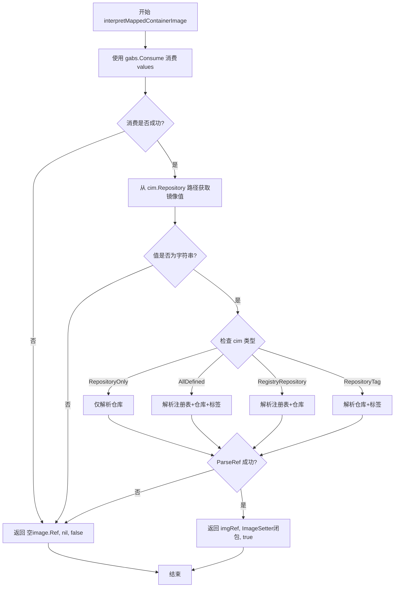

#### 带注释源码

```go
// interpretMappedContainerImage attempt to resolve the paths in the
// `ContainerImageMap` from the given values and tries to parse the
// resolved values into a valid `image.Ref`. It returns the
// `image.Ref`, an `ImageSetter` that is able to modify the image in
// the supplied values map, and a boolean that reflects if the
// interpretation was successful.
// interpretMappedContainerImage 尝试从给定的 values 中解析 ContainerImageMap
// 定义的路径，并将解析后的值转换为有效的 image.Ref。它返回 image.Ref、
// 一个能够修改 values 中镜像的 ImageSetter，以及一个表示解释是否成功的布尔值。
func interpretMappedContainerImage(values map[string]interface{}, cim ContainerImageMap) (image.Ref, ImageSetter, bool) {
	// 使用 gabs 库将 map[string]interface{} 转换为 gabs.Container，以便使用路径访问
	v, err := gabs.Consume(values)
	if err != nil {
		// 如果转换失败，返回空值和 false
		return image.Ref{}, nil, false
	}

	// 根据 cim.Repository 路径获取镜像值
	imageValue := v.Path(cim.Repository).Data()
	// 检查获取的值是否为字符串
	if img, ok := imageValue.(string); ok {
		// 根据 ContainerImageMap 的类型进行处理
		switch {
		// 仅定义了仓库的情况
		case cim.RepositoryOnly():
			// 尝试解析镜像引用
			if imgRef, err := image.ParseRef(img); err == nil {
				// 返回镜像引用和一个闭包，用于设置镜像值
				return imgRef, func(ref image.Ref) {
					v.SetP(ref.String(), cim.Repository)
				}, true
			}
		// 所有元素（注册表、仓库、标签）都定义的情况
		case cim.AllDefined():
			// 获取注册表值
			registryValue := v.Path(cim.Registry).Data()
			if reg, ok := registryValue.(string); ok {
				// 获取标签值
				tagValue := v.Path(cim.Tag).Data()
				if tag, ok := tagValue.(string); ok {
					// 组合完整镜像字符串并解析
					if imgRef, err := image.ParseRef(reg + "/" + img + ":" + tag); err == nil {
						// 返回镜像引用和设置所有字段的闭包
						return imgRef, func(ref image.Ref) {
							v.SetP(ref.Domain, cim.Registry)
							v.SetP(ref.Image, cim.Repository)
							v.SetP(ref.Tag, cim.Tag)
						}, true
					}
				}
			}
		// 定义了注册表和仓库，但没有标签的情况
		case cim.RegistryRepository():
			registryValue := v.Path(cim.Registry).Data()
			if reg, ok := registryValue.(string); ok {
				// 组合注册表+镜像并解析
				if imgRef, err := image.ParseRef(reg + "/" + img); err == nil {
					return imgRef, func(ref image.Ref) {
						v.SetP(ref.Domain, cim.Registry)
						v.SetP(ref.Name.Image+":"+ref.Tag, cim.Repository)
					}, true
				}
			}
		// 定义了仓库和标签，但没有注册表的情况
		case cim.RepositoryTag():
			tagValue := v.Path(cim.Tag).Data()
			if tag, ok := tagValue.(string); ok {
				// 组合镜像+标签并解析
				if imgRef, err := image.ParseRef(img + ":" + tag); err == nil {
					return imgRef, func(ref image.Ref) {
						v.SetP(ref.Name.String(), cim.Repository)
						v.SetP(ref.Tag, cim.Tag)
					}, true
				}
			}
		}
	}

	// 如果所有尝试都失败，返回空值和 false
	return image.Ref{}, nil, false
}
```


### stringMap.get

该方法是 `stringMap` 类型的成员方法，用于从 `map[string]interface{}` 类型的映射中获取指定键对应的值，并返回一个布尔值表示该键是否存在。

参数：

- `k`：`string`，要获取的键

返回值：`(interface{}, bool)`，返回键对应的值（如果存在）和一个布尔值表示键是否存在于映射中

#### 流程图

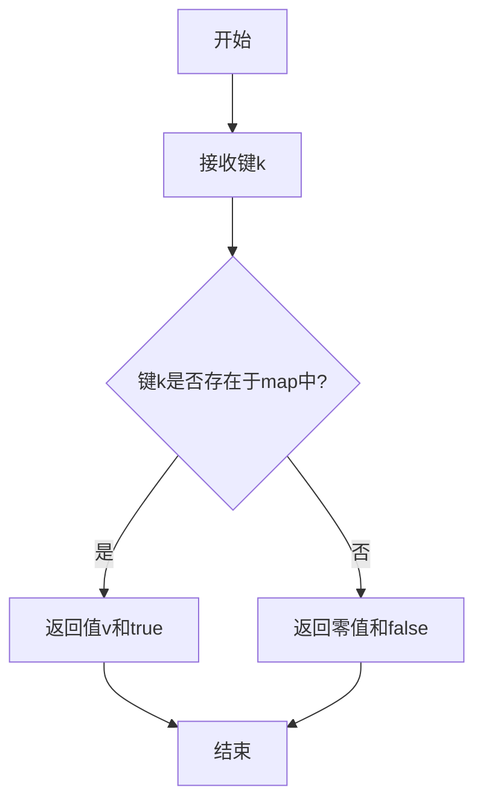

#### 带注释源码

```go
// stringMap 是 map[string]interface{} 的类型别名
type stringMap map[string]interface{}

// get 方法从 stringMap 中获取指定键对应的值
// 参数 k: 要查找的键，类型为 string
// 返回值: (interface{}, bool) - 第一个值为键对应的值，第二个值表示键是否存在
func (m stringMap) get(k string) (interface{}, bool) {
    v, ok := m[k]  // 从map中获取键k的值，ok表示键是否存在
    return v, ok   // 返回值和存在性标志
}
```


### `stringMap.set`

该方法是 `stringMap` 类型的成员方法，用于在 map 中设置键值对，接收一个字符串键和一个任意类型的值，并将其存储到底层的 `map[string]interface{}` 中。

参数：

- `k`：`string`，要设置的键名
- `v`：`interface{}`，要设置的值，可以是任意类型

返回值：无返回值（方法接收器为指针或值类型，直接修改底层 map）

#### 流程图

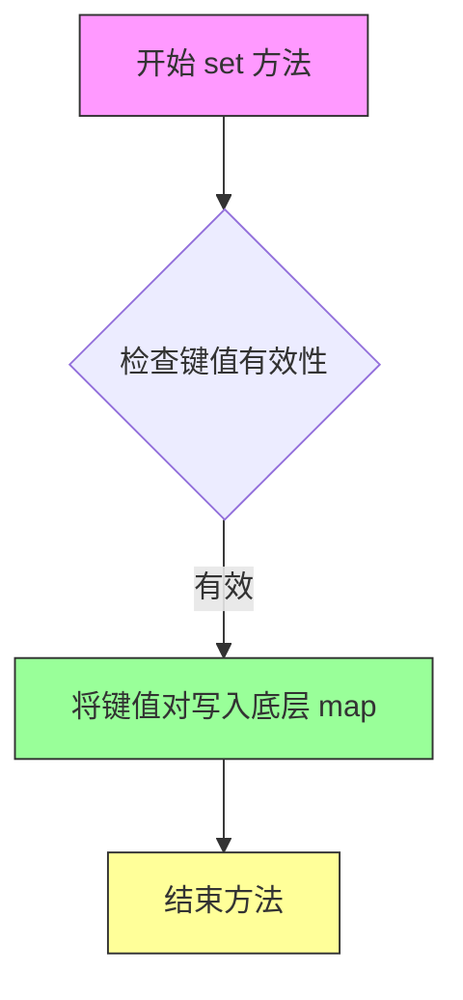

#### 带注释源码

```go
// stringMap 是 map[string]interface{} 的类型别名
type stringMap map[string]interface{}

// set 是 stringMap 类型的成员方法，用于在 map 中设置键值对
// 参数:
//   - k: string 类型，要设置的键名
//   - v: interface{} 类型，要设置的值，可以是任意类型
//
// 该方法直接修改底层 map，无返回值
func (m stringMap) set(k string, v interface{}) { m[k] = v }
```


### `anyMap.get`

获取 `anyMap`（类型为 `map[interface{}]interface{}`）中指定键对应的值，并返回一个布尔值表示该键是否存在。

参数：

- `k`：`string`，要获取的键

返回值：`interface{}, bool`，第一个是键对应的值（如果存在），第二个是布尔值，表示键是否存在于 map 中

#### 流程图

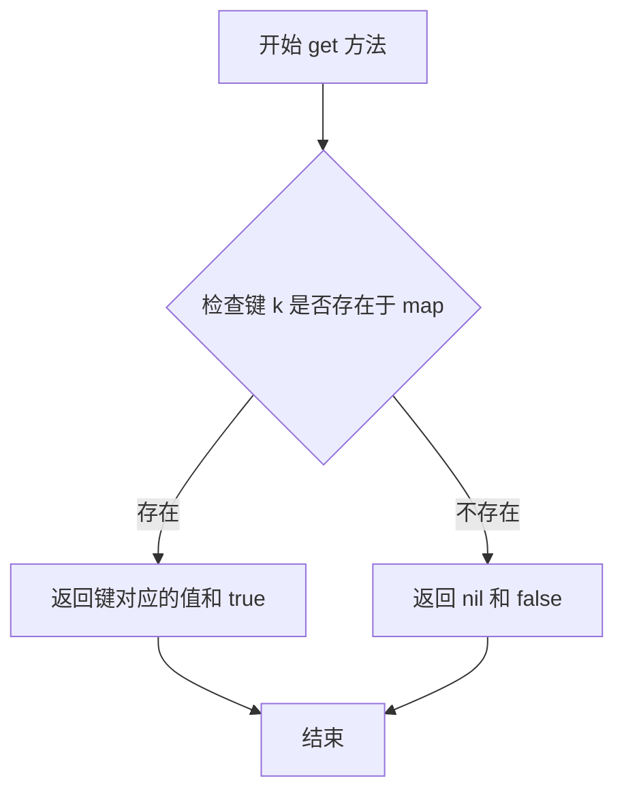

#### 带注释源码

```go
// anyMap 是 map[interface{}]interface{} 的类型别名
// 用于处理从 YAML 解析出来的 map（YAML 中可能包含 interface{} 类型的键）
type anyMap map[interface{}]interface{}

// get 方法从 anyMap 中获取指定键 k 对应的值
// 参数 k: string 类型，要查找的键
// 返回值: (interface{}, bool) - 第一个返回值是查找到的值（如果存在），第二个返回值表示键是否存在于 map 中
func (m anyMap) get(k string) (interface{}, bool) {
	// 从 map 中获取值，Go 会自动将 map[interface{}]interface{} 的查找结果与 (interface{}, bool) 匹配
	v, ok := m[k]
	// 返回值和表示键是否存在的布尔标志
	return v, ok
}
```


### `anyMap.set`

该方法用于在 `map[interface{}]interface{}` 类型的字典中设置指定键对应的值，实现了一个统一的双向映射接口，使得 YAML 和 JSON 格式的 map 都能以相同的方式进行操作。

参数：

- `k`：`string`，要设置的键（字符串类型）
- `v`：`interface{}`，要设置的值（任意类型）

返回值：无（Go 语言中没有返回值）

#### 流程图

```mermaid
flowchart TD
    A[开始] --> B[接收键 k 和值 v]
    B --> C{m[k] = v}
    C --> D[将键值对存入 anyMap]
    D --> E[结束]
```

#### 带注释源码

```go
// anyMap 是 map[interface{}]interface{} 的类型别名
// 用于处理来自 YAML 文件的 map 类型（YAML 中可能使用 interface{} 作为键）
type anyMap map[interface{}]interface{}

// set 方法实现了 mapper 接口
// 用于在 anyMap 中设置指定键 k 对应的值 v
// 参数：
//   - k: string 类型，要设置的键
//   - v: interface{} 类型，要设置的值，可以是任意类型
func (m anyMap) set(k string, v interface{}) { m[k] = v }
```


### ContainerImageMap.RepositoryOnly()

判断 ContainerImageMap 结构体实例是否仅定义了 Repository（仓库）字段，而未定义 Registry（镜像仓库）和 Tag（标签）字段。

参数： 无显式参数（使用接收者 `c ContainerImageMap`）

返回值： `bool`，如果仅定义了 Repository 字段且 Registry 和 Tag 字段为空则返回 true，否则返回 false

#### 流程图

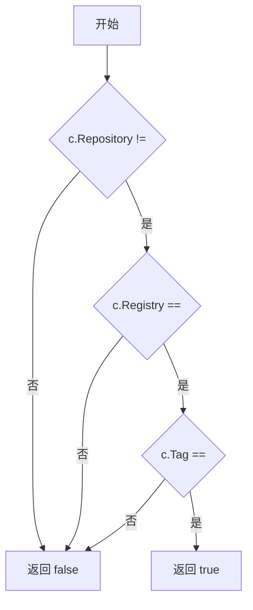

#### 带注释源码

```go
// RepositoryOnly returns if only the repository is defined.
// 判断是否仅定义了 Repository 字段
func (c ContainerImageMap) RepositoryOnly() bool {
	// 返回条件：
	// 1. Repository 字段不为空
	// 2. Registry 字段为空
	// 3. Tag 字段为空
	return c.Repository != "" && c.Registry == "" && c.Tag == ""
}
```


### `ContainerImageMap.RepositoryTag() bool`

该方法用于判断容器镜像映射是否仅定义了 Repository（镜像仓库）和 Tag（镜像标签），而未定义 Registry（镜像仓库地址）。当 Repository 和 Tag 都有值但 Registry 为空时返回 true，否则返回 false。

参数：无

返回值：`bool`，如果仅定义了 Repository 和 Tag（未定义 Registry）则返回 true，否则返回 false

#### 流程图

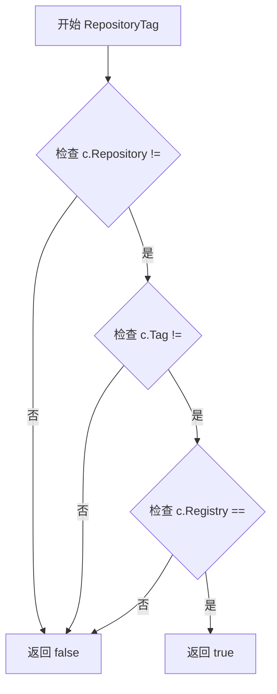

#### 带注释源码

```go
// RepositoryTag 返回是否仅定义了 repository 和 tag，
// 但未定义 registry（即仓库地址为空）。
// 当 c.Repository != "" 且 c.Tag != "" 且 c.Registry == "" 时返回 true。
func (c ContainerImageMap) RepositoryTag() bool {
	// 检查条件：Repository 不为空 且 Tag 不为空 且 Registry 为空
	return c.Repository != "" && c.Tag != "" && c.Registry == ""
}
```


### `ContainerImageMap.RegistryRepository`

这是一个布尔类型的成员方法，用于检查 ContainerImageMap 结构体实例是否仅定义了 Registry（镜像仓库域名）和 Repository（镜像仓库名称）字段，而未定义 Tag（镜像标签）字段。该方法常用于判断镜像路径映射的配置类型。

参数：无

返回值：`bool`，如果 Registry 和 Repository 都不为空且 Tag 为空则返回 true，否则返回 false

#### 流程图

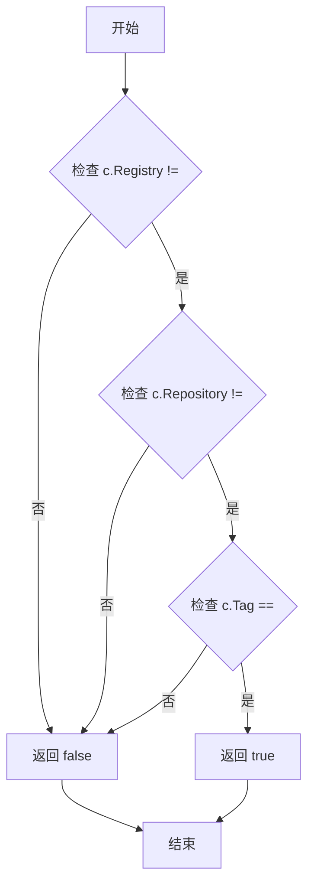

#### 带注释源码

```go
// RegistryRepository 返回是否仅定义了注册表和仓库，但未定义标签。
// 它是 ContainerImageMap 结构体的成员方法，用于判断当前的镜像路径映射
// 是否属于仅包含 Registry 和 Repository 而缺少 Tag 的配置类型。
// 这种情况在 HelmRelease 的注解映射中对应一种特定的镜像路径配置模式。
func (c ContainerImageMap) RegistryRepository() bool {
	// 检查三个条件：
	// 1. c.Registry 不为空 - 表示镜像的域名/注册中心已配置
	// 2. c.Repository 不为空 - 表示镜像的仓库名称已配置
	// 3. c.Tag 为空 - 表示镜像的标签未配置
	// 只有当条件1和2为真且条件3为真时，才返回true
	return c.Registry != "" && c.Repository != "" && c.Tag == ""
}
```


### `ContainerImageMap.AllDefined`

该方法用于检查 ContainerImageMap 结构中的所有图像元素（Registry、Repository、Tag）是否都已定义，只有当三者都不为空时返回 true。

参数： 无

返回值：`bool`，返回 true 表示所有图像元素都已定义（Registry、Repository、Tag 都不为空），否则返回 false。

#### 流程图


#### 带注释源码

```go
// AllDefined returns if all image elements are defined.
func (c ContainerImageMap) AllDefined() bool {
	// 检查 Registry、Repository、Tag 三个字段是否都不为空
	// 只有当三者都定义了才返回 true
	return c.Registry != "" && c.Repository != "" && c.Tag != ""
}
```


### `ContainerImageMap.GetRegistry`

该方法用于获取容器镜像的完整注册表路径，如果注册表路径存在则拼接基础路径后返回，否则返回空字符串。

参数：

- 该方法无显式参数（接收者 `c ContainerImageMap` 作为方法作用域）

返回值：`string`，返回完整的注册表路径（包含 BasePath 前缀），若 Registry 为空则返回空字符串。

#### 流程图

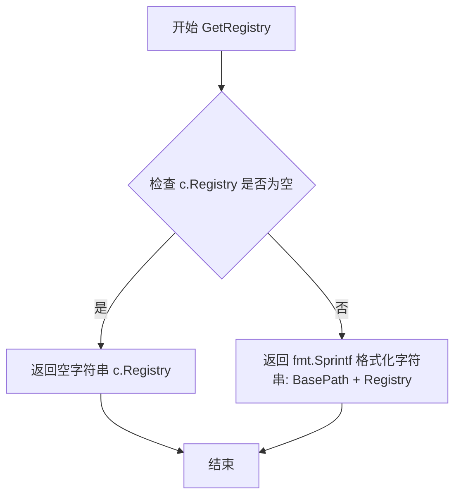

#### 带注释源码

```go
// GetRegistry returns the full registry path (with base path).
// 获取完整的注册表路径（包含基础路径）
// 如果 Registry 字段为空，则返回空字符串；
// 否则返回 BasePath 和 Registry 拼接后的完整路径。
func (c ContainerImageMap) GetRegistry() string {
	// 检查 Registry 字段是否为空
	// 如果为空，直接返回空字符串（无需拼接路径）
	if c.Registry == "" {
		return c.Registry
	}
	// 如果 Registry 不为空，则将 BasePath 和 Registry 拼接后返回
	// 使用 fmt.Sprintf 格式化字符串，格式为 "%s%s"
	return fmt.Sprintf("%s%s", c.BasePath, c.Registry)
}
```


### `ContainerImageMap.GetRepository`

获取容器镜像映射的完整仓库路径（包含基础路径）。该方法检查仓库路径是否存在，若存在则将其与基础路径拼接后返回，否则返回空字符串。

参数： 无

返回值： `string`，返回完整的仓库路径（包含 BasePath），如果 Repository 字段为空则返回空字符串

#### 流程图

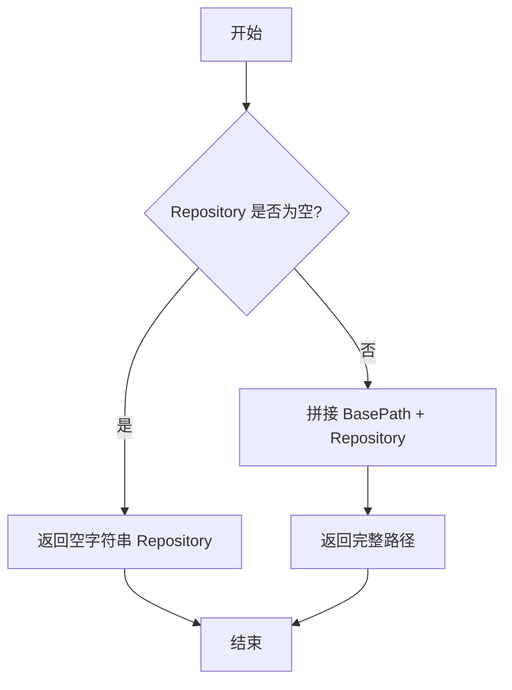

#### 带注释源码

```go
// GetRepository returns the full repository path (with base path).
// GetRepository 返回完整的仓库路径（包含基础路径）
func (c ContainerImageMap) GetRepository() string {
	// 如果 Repository 字段为空，直接返回空字符串
	// 这是为了避免返回类似 "spec.values." 的不完整路径
	if c.Repository == "" {
		return c.Repository
	}
	// 否则，使用 fmt.Sprintf 将 BasePath 和 Repository 拼接在一起
	// 例如：BasePath = "spec.values."，Repository = "image.repository"
	// 返回结果："spec.values.image.repository"
	return fmt.Sprintf("%s%s", c.BasePath, c.Repository)
}
```


### `ContainerImageMap.GetTag`

获取完整的镜像标签路径（包含基础路径）

参数：none（无参数）

返回值：`string`，返回完整的标签路径，如果 Tag 为空则返回空字符串

#### 流程图

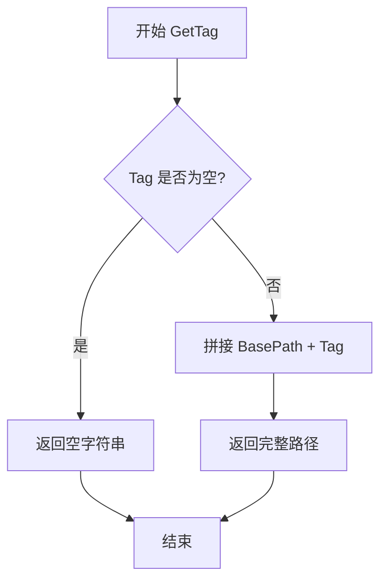

#### 带注释源码

```go
// GetTag returns the full tag path (with base path).
// GetTag 方法返回完整的标签路径，包含基础路径
// 参数: 无（使用接收器 c）
// 返回值: string - 完整的标签路径，如果 Tag 为空则返回空字符串
func (c ContainerImageMap) GetTag() string {
	// 如果 Tag 字段为空，直接返回空字符串
	if c.Tag == "" {
		return c.Tag
	}
	// 否则，返回 BasePath 和 Tag 的拼接结果
	// 例如: BasePath = "spec.values.", Tag = "image.tag"
	// 返回: "spec.values.image.tag"
	return fmt.Sprintf("%s%s", c.BasePath, c.Tag)
}
```


### `ContainerImageMap.MapImageRef`

该方法将给定的 `image.Ref` 映射到 `ContainerImageMap` 持有的点号路径（dot notation paths），根据 `ContainerImageMap` 中定义的字段（Registry、Repository、Tag）组合出完整的镜像信息映射表。

参数：

- `image`：`image.Ref`，待映射的镜像引用对象，包含镜像的域名（Domain）、镜像名（Image）、标签（Tag）等信息

返回值：`map[string]string, bool`，返回包含路径到镜像元素值的映射字典，以及一个布尔值表示映射是否成功。当 `ContainerImageMap` 至少定义了 Repository 时才能成功组合映射。

#### 流程图

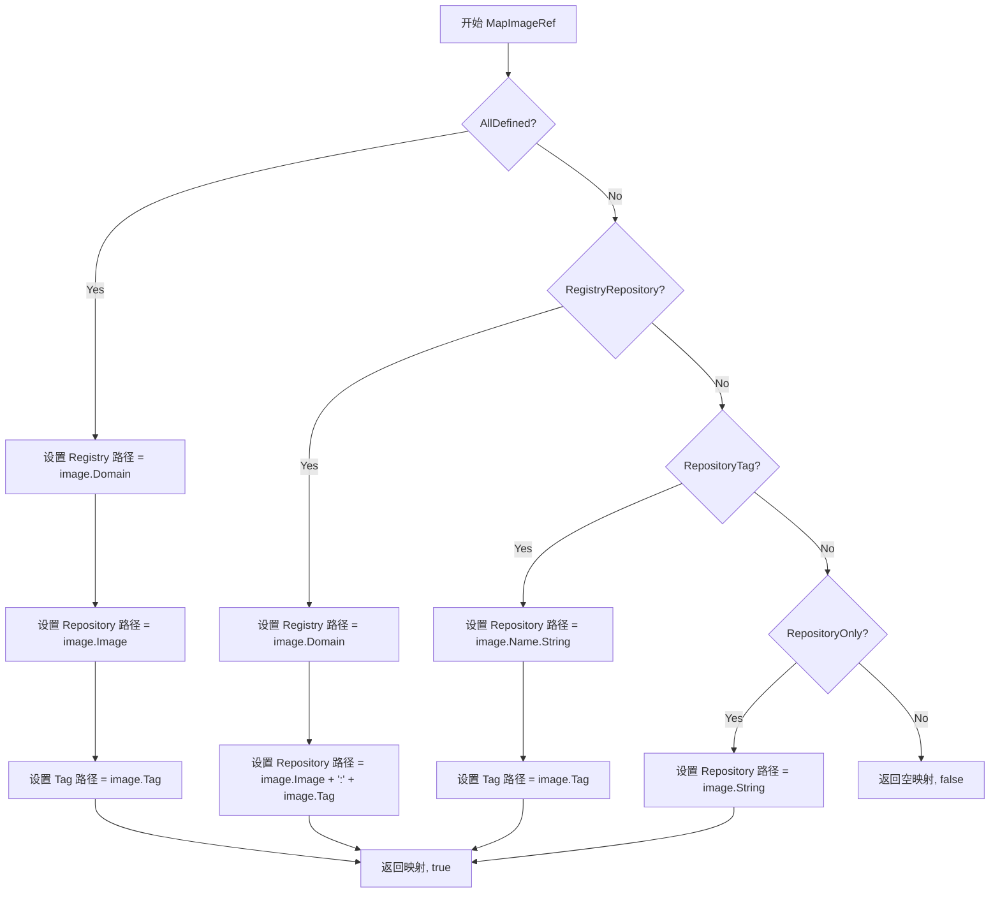

#### 带注释源码

```go
// MapImageRef maps the given imageRef to the dot notation paths
// ContainerImageMap holds. It needs at least an Repository to be able
// to compose the map, and takes the absence of the registry and/or tag
// paths into account to ensure all image elements (registry,
// repository, tag) are present in the returned map.
func (c ContainerImageMap) MapImageRef(image image.Ref) (map[string]string, bool) {
	// 创建一个新的映射字典，用于存储路径到镜像元素值的映射
	m := make(map[string]string)
	
	// 使用 switch 语句根据 ContainerImageMap 中定义的字段组合来确定映射方式
	switch {
	// 情况1：所有字段（Registry、Repository、Tag）都已定义
	// 分别将镜像的 Domain、Image、Tag 映射到对应的点号路径
	case c.AllDefined():
		m[c.GetRegistry()] = image.Domain
		m[c.GetRepository()] = image.Image
		m[c.GetTag()] = image.Tag
	
	// 情况2：只有 Registry 和 Repository 已定义，Tag 未定义
	// 将 Image 和 Tag 组合成 "image:tag" 格式存入 Repository 路径
	case c.RegistryRepository():
		m[c.GetRegistry()] = image.Domain
		m[c.GetRepository()] = image.Image + ":" + image.Tag
	
	// 情况3：只有 Repository 和 Tag 已定义，Registry 未定义
	// 使用镜像的完整名称（包括域名）存入 Repository，使用 Tag 存入 Tag 路径
	case c.RepositoryTag():
		m[c.GetRepository()] = image.Name.String()
		m[c.GetTag()] = image.Tag
	
	// 情况4：只有 Repository 已定义
	// 使用镜像的完整字符串表示（包括域名和标签）存入 Repository 路径
	case c.RepositoryOnly():
		m[c.GetRepository()] = image.String()
	
	// 默认情况：没有任何字段定义（不满足最小要求 Repository）
	// 返回空的映射和 false 表示映射失败
	default:
		return m, false
	}
	
	// 成功映射，返回映射字典和 true
	return m, true
}
```


### `HelmRelease.Containers`

该方法用于从 HelmRelease 资源中提取并返回所有定义的容器信息。它通过调用 `FindHelmReleaseContainers` 函数遍历 HelmRelease 的注解和值，收集容器名称和对应的镜像引用，最终返回一个包含所有容器的切片。

参数： 无

返回值：`[]resource.Container`，返回在 HelmRelease 中定义的所有容器列表，每个容器包含名称和镜像引用

#### 流程图

```mermaid
flowchart TD
    A[开始 Containers 方法] --> B[创建空容器切片 containers]
    B --> C[定义内部函数 addContainer]
    C --> D[调用 FindHelmReleaseContainers]
    D --> E{遍历 Values}
    E -->|顶层 Values 包含 image| F[添加 ReleaseContainerName 容器]
    E -->|Values 中字段包含 image| G[以字段名为容器名添加]
    E -->|注解中有映射| H[使用用户定义的映射添加]
    I[调用 addContainer 回调] --> J[将 container.Name 和 container.Image 添加到 containers]
    J --> K[返回 containers 切片]
    K --> L[结束]
```

#### 带注释源码

```go
// Containers 返回在 HelmRelease 中定义的容器
// 方法接收者：hr HelmRelease
// 返回值：[]resource.Container - 容器切片
func (hr HelmRelease) Containers() []resource.Container {
    // 1. 初始化一个空的容器切片用于存储结果
    var containers []resource.Container
    
    // 2. 定义一个匿名回调函数 addContainer
    // 参数：
    //   - container string: 容器名称
    //   - image image.Ref: 镜像引用
    //   - _ ImageSetter: 设置器（此处未使用，下划线表示忽略）
    // 返回值：error（始终返回 nil）
    addContainer := func(container string, image image.Ref, _ ImageSetter) error {
        // 3. 创建一个 resource.Container 并追加到切片中
        containers = append(containers, resource.Container{
            Name:  container,
            Image: image,
        })
        return nil
    }
    
    // 4. 调用 FindHelmReleaseContainers 函数
    // 参数：
    //   - hr.Meta.Annotations: HelmRelease 的注解（用于提取容器镜像映射）
    //   - hr.Spec.Values: HelmRelease 的 values（包含容器镜像定义）
    //   - addContainer: 回调函数，用于处理找到的每个容器
    FindHelmReleaseContainers(hr.Meta.Annotations, hr.Spec.Values, addContainer)
    
    // 5. 返回包含所有容器的切片
    return containers
}
```


### `HelmRelease.SetContainerImage`

该方法用于修改 HelmRelease 资源中的容器镜像，通过调用 `FindHelmReleaseContainers` 遍历所有已定义的容器，找到目标容器后使用其 `ImageSetter` 回调函数更新镜像值，如果未找到指定容器则返回错误。

参数：

- `container`：`string`，目标容器的名称，用于在 HelmRelease 的 values 中匹配对应的容器配置
- `ref`：`image.Ref`，新的镜像引用对象，包含镜像的域名、仓库和标签信息

返回值：`error`，如果成功找到并更新镜像则返回 nil，如果未找到指定容器则返回格式化的错误信息

#### 流程图

```mermaid
flowchart TD
    A[开始 SetContainerImage] --> B[初始化 found = false]
    B --> C[创建 imageSetter 回调函数]
    C --> D[调用 FindHelmReleaseContainers 遍历容器]
    D --> E{找到目标容器?}
    E -->|是| F[调用 setter 更新镜像]
    F --> G[设置 found = true]
    G --> H{found == true?}
    H -->|是| I[返回 nil]
    H -->|否| J[返回错误: 未找到容器]
    E -->|否| H
    I --> K[结束]
    J --> K
```

#### 带注释源码

```go
// SetContainerImage mutates this resource by setting the `image`
// field of `values`, or a subvalue therein, per one of the
// interpretations in `FindHelmReleaseContainers` above. NB we can
// get away with a value-typed receiver because we set a map entry.
func (hr HelmRelease) SetContainerImage(container string, ref image.Ref) error {
	// 标记是否找到目标容器
	found := false
	
	// 定义一个访问器回调函数，用于在 FindHelmReleaseContainers 遍历时
	// 检查每个容器的名称是否匹配目标容器
	imageSetter := func(name string, image image.Ref, setter ImageSetter) error {
		// 如果容器名称匹配目标容器名称
		if container == name {
			// 调用 setter 回调函数来实际修改 values 中的镜像值
			setter(ref)
			// 标记已找到并更新
			found = true
		}
		return nil
	}
	
	// 调用 FindHelmReleaseContainers 遍历 HelmRelease 中的所有容器定义，
	// 并使用上面定义的 imageSetter 作为访问回调
	FindHelmReleaseContainers(hr.Meta.Annotations, hr.Spec.Values, imageSetter)
	
	// 遍历完成后检查是否找到目标容器
	if !found {
		// 未找到目标容器，返回错误信息
		return fmt.Errorf("did not find container %s in HelmRelease", container)
	}
	
	// 成功找到并更新镜像，返回 nil
	return nil
}
```


### `HelmRelease.GetContainerImageMap`

该方法根据传入的容器名称，从 HelmRelease 资源的注解（Annotations）中获取对应的容器镜像映射路径信息，并验证该映射是否能在 values 中成功解析。若映射存在且可解析，则返回 `ContainerImageMap`；否则返回错误信息。

参数：

- `container`：`string`，目标容器的名称，用于从镜像映射字典中查找对应的路径配置

返回值：`ContainerImageMap`，包含镜像各组件（registry、repository、tag）在 Helm values 中的 YAML 点号路径；若查找或解析失败，则返回 error 类型的错误描述

#### 流程图

```mermaid
flowchart TD
    A[开始 GetContainerImageMap] --> B[调用 containerImageMappingsFromAnnotations 解析注解]
    B --> C{检查容器映射是否存在}
    C -->|不存在| D[返回空 ContainerImageMap 和错误]
    C -->|存在| E[调用 interpretMappedContainerImage 验证映射]
    E --> F{验证是否成功}
    F -->|失败| D
    F -->|成功| G[返回 ContainerImageMap 和 nil]
```

#### 带注释源码

```go
// GetContainerImageMap returns the ContainerImageMap for a container,
// or an error if we were unable to interpret the mapping, or no mapping
// was found.
// GetContainerImageMap 根据容器名称获取其在 HelmRelease 中配置的镜像映射路径。
// 它首先从注解中提取所有容器镜像映射，然后检查目标容器是否存在映射，
// 并进一步验证该映射是否能在 values 中正确解析。若任一步骤失败，则返回错误。
func (hr HelmRelease) GetContainerImageMap(container string) (ContainerImageMap, error) {
	// 从 HelmRelease 的元数据注解中提取所有容器镜像映射关系
	// 返回格式为 map[string]ContainerImageMap，key 为容器名，value 为路径映射结构
	cim := containerImageMappingsFromAnnotations(hr.Meta.Annotations)
	
	// 判断目标容器是否存在于映射中
	if c, ok := cim[container]; ok {
		// 尝试使用映射的路径从 values 中解析镜像信息
		// 若解析成功（返回 true），说明映射有效可用
		if _, _, ok = interpretMappedContainerImage(hr.Spec.Values, c); ok {
			// 映射存在且可解析，返回找到的 ContainerImageMap
			return c, nil
		}
	}
	
	// 未找到对应容器的映射，或映射无法解析
	// 返回空结构体和格式化错误信息，便于调用方定位问题
	return ContainerImageMap{}, fmt.Errorf("did not find image map for container %s in HelmRelease", container)
}
```


### `mapper.get`

该方法是 `mapper` 接口中定义的通用取值方法，用于从两种不同类型的 map（`stringMap` 和 `anyMap`）中安全地获取值，是实现 YAML/JSON 格式兼容处理的关键抽象层。

参数：

-  `k`：`string`，要获取的键名

返回值：

-  `interface{}`，键对应的值，如果键不存在则返回 `nil`
-  `bool`，表示键是否存在的标志，true 表示键存在，false 表示键不存在

#### 流程图

```mermaid
flowchart TD
    A[开始 get 方法] --> B{接收键名 k}
    B --> C{检查类型为 stringMap}
    C -->|是| D[stringMap.get 实现]
    C -->|否| E{检查类型为 anyMap}
    E --> F[anyMap.get 实现]
    D --> G{尝试获取 m[k]}
    F --> G
    G --> H{键是否存在}
    H -->|是| I[返回 value, true]
    H -->|否| J[返回 nil, false]
    I --> K[结束]
    J --> K
```

#### 带注释源码

```go
// mapper 接口定义了通用的键值存取操作
// 用于统一处理 map[string]interface{} 和 map[interface{}]interface{} 两种类型
type mapper interface {
	// get 方法根据给定的键名获取值
	// 参数 k: string 类型的键名
	// 返回值: interface{} 表示任意类型的值, bool 表示键是否成功获取
	get(string) (interface{}, bool)
	// set 方法用于设置键值对
	set(string, interface{})
}

// stringMap 是 map[string]interface{} 的类型别名
// 用于处理从 JSON 或 Kubernetes API 获取的 map 结构
type stringMap map[string]interface{}

// get 方法实现了 mapper 接口
// 从 stringMap 中获取指定键的值
// 参数 k: 要查询的键名
// 返回值: 键对应的值和键是否存在的布尔标志
func (m stringMap) get(k string) (interface{}, bool) {
	v, ok := m[k]  // 从 map 中查询键，ok 表示键是否存在
	return v, ok  // 返回值和存在标志
}

// anyMap 是 map[interface{}]interface{} 的类型别名
// 用于处理从 YAML 文件解析的 map 结构
type anyMap map[interface{}]interface{}

// get 方法同样实现了 mapper 接口
// 从 anyMap 中获取指定键的值
// 注意：Go 中 map[interface{}]interface{} 可以用 string 类型的键查询
func (m anyMap) get(k string) (interface{}, bool) {
	v, ok := m[k]  // 从 map 中查询键
	return v, ok  // 返回值和存在标志
}
```


### `mapper.set`

将给定的键值对设置到映射中，支持 `stringMap`（`map[string]interface{}`）和 `anyMap`（`map[interface{}]interface{}`）两种映射类型的值设置操作。

参数：

- `k`：`string`，要设置的键名
- `v`：`interface{}`，要设置的值

返回值：无（`void`），该方法直接修改映射本身

#### 流程图

```mermaid
flowchart TD
    A[开始 set 方法] --> B{判断映射类型}
    B -->|stringMap| C[stringMap.set]
    B -->|anyMap| D[anyMap.set]
    C --> E[m[k] = v]
    D --> E
    E --> F[结束]
```

#### 带注释源码

```go
// mapper 接口定义了 get 和 set 方法，用于抽象不同类型的 map 操作
type mapper interface {
	get(string) (interface{}, bool)
	set(string, interface{})
}

// stringMap 是 map[string]interface{} 的类型别名，用于处理 JSON 格式的映射
type stringMap map[string]interface{}

// set 方法将键值对设置到 stringMap 中
func (m stringMap) set(k string, v interface{}) { m[k] = v }

// anyMap 是 map[interface{}]interface{} 的类型别名，用于处理 YAML 格式的映射
type anyMap map[interface{}]interface{}

// set 方法将键值对设置到 anyMap 中
func (m anyMap) set(k string, v interface{}) { m[k] = v }
```

## 关键组件


### ContainerImageMap

结构体，存储容器镜像的YAML点号表示路径（BasePath、Registry、Repository、Tag），支持多种镜像路径映射场景

### HelmRelease

结构体，表示HelmRelease自定义资源定义，包含baseObject和Spec字段，Spec包含Values映射，用于处理HelmRelease的YAML序列化

### ImageSetter

函数类型定义，用于设置镜像引用（image.Ref）

### FindHelmReleaseContainers

函数，遍历HelmRelease的Values和注解，识别所有容器镜像并调用visit回调，支持自动解释和用户映射两种方式

### interpretAsContainer

函数，将mapper值解释为容器镜像，处理image字段的多种格式（字符串或嵌套map），返回image.Ref和ImageSetter

### interpretAsImage

函数，将mapper值解释为镜像对象，处理repository、registry、tag字段的组合，返回完整的image.Ref和对应的setter

### containerImageMappingsFromAnnotations

函数，从注解中收集容器镜像的YAML点号路径映射，支持ImageRegistryPrefix、ImageRepositoryPrefix、ImageTagPrefix三种前缀

### interpretMappedContainerImage

函数，根据ContainerImageMap中定义的路径从values中解析镜像值，尝试解析为有效image.Ref并返回可修改值的setter

### mapper接口

抽象接口，定义get和set方法，用于统一处理map[string]interface{}和map[interface{}]interface{}两种Go类型的映射操作

## 问题及建议


### 已知问题

- **常量注释错误与重复**：代码中 `ImageRepositoryPrefix` 的注释错误地描述为“tag path mappings”，而实际上应该是“repository path mappings”；此外 `ImageTagPrefix` 的注释不完整。
- **命名可读性差**：局部变量如 `reggy`、`taggy`、`imgStr` 等命名过于简短，降低了代码可读性。
- **重复代码模式**：`interpretAsContainer` 和 `interpretAsImage` 函数中设置镜像字段的逻辑高度重复，存在大量相似的 switch-case 分支。
- **缺少错误详情**：镜像解析失败时仅返回 `false`，未提供具体的错误原因，难以调试。
- **类型断言缺乏验证**：多处使用 `interface{}.(string)` 类型断言但未检查布尔值是否为 `true`（如 `reggy = ok` 应为 `reggy = ok && registryStr != ""`）。
- **魔法字符串**：多次使用字符串 `"image"`、`"registry"`、`"repository"`、`"tag"` 作为键，建议提取为常量。
- **注释不完整**：`HelmRelease` 结构体的 `baseObject` 和 `Spec` 字段缺乏文档说明。
- **边界情况处理**：对于空的或无效的 `values` map，函数行为未明确界定。
- **函数职责过重**：`FindHelmReleaseContainers` 函数承担了过多职责，包括解析、映射和遍历。

### 优化建议

- **修正注释**：修复常量 `ImageRepositoryPrefix` 和 `ImageTagPrefix` 的注释，确保描述准确。
- **提取公共函数**：将镜像字段设置的重复逻辑抽取为独立的辅助方法，如 `setImageFields(m mapper, ref image.Ref, hasRegistry, hasTag bool)`。
- **增强错误处理**：在镜像解析失败时返回具体错误信息，便于问题排查。
- **完善类型断言**：所有类型断言后显式检查布尔值，确保类型转换成功后再使用。
- **定义常量**：将字符串键 `"image"`、`"registry"`、`"repository"`、`"tag"` 提取为包级常量。
- **重构函数职责**：将 `FindHelmReleaseContainers` 拆分为更细粒度的函数，每个函数负责单一职责。
- **添加输入验证**：在函数入口处验证 `values` 和 `annotations` 参数的有效性。
- **优化注释**：为 `HelmRelease` 结构体及其字段添加完整的文档注释。

## 其它


### 设计目标与约束

该代码的核心设计目标是解析 HelmRelease 资源中的容器镜像配置，支持从 Helm values 中自动识别镜像，并通过注解实现用户自定义的镜像路径映射。主要约束包括：仅支持 map 类型的 values 结构；镜像路径必须符合 YAML 点记法；注解键必须使用预定义前缀（registry.fluxcd.io/、repository.fluxcd.io/、tag.fluxcd.io/）。

### 错误处理与异常设计

错误处理采用返回零值与布尔标识符的模式（类似 Go 的 ok idiom），避免抛出异常。所有可能失败的操作（如 image.ParseRef、gabs.Consume）都返回 error，调用方通过检查返回值判断成功与否。FindHelmReleaseContainers 使用 visit 回调模式传播错误，允许调用方决定如何处理错误。SetContainerImage 和 GetContainerImageMap 在未找到容器时返回格式化的错误信息。

### 数据流与状态机

数据流分为三个阶段：解析阶段 interpret/interpretAsContainer/interpretAsImage 从 values 中提取镜像信息；映射阶段 containerImageMappingsFromAnnotations 从注解构建路径映射；应用阶段 MapImageRef/interpretMappedContainerImage 将镜像写入 values。状态转换通过 ContainerImageMap 的四个方法（RepositoryOnly、RepositoryTag、RegistryRepository、AllDefined）体现不同字段组合状态。

### 外部依赖与接口契约

主要外部依赖包括：github.com/Jeffail/gabs 用于 JSON/JSONpath 操作；github.com/fluxcd/flux/pkg/image 提供镜像解析；github.com/fluxcd/flux/pkg/resource 定义 Container 结构。ImageSetter 函数类型作为核心接口契约，允许调用方自定义镜像设置逻辑。FindHelmReleaseContainers 的 visit 回调参数 (string, image.Ref, ImageSetter) error 构成遍历接口。

### 并发与线程安全性

代码本身不包含并发原语，HelmRelease 作为值类型在传递时自动复制。mapper 接口的实现（stringMap、anyMap）修改的是原始 map 的引用，需要调用方保证在并发场景下的访问安全。ImageSetter 闭包捕获外部 mapper，可能产生竞态条件，建议在单线程上下文中使用。

### 安全性考虑

代码不直接处理敏感数据，但镜像引用解析可能涉及用户输入。interpretAsContainer 和 interpretAsImage 对 registry、image、tag 字段进行字符串类型断言，防止类型混淆攻击。gabs 库的使用应验证输入非 nil，避免空指针解引用。

### 测试策略建议

应覆盖的场景包括：仅含 repository 字段、含 repository+tag、含 registry+repository、三者皆有的组合；YAML map 与 JSON map 两种格式；注解前缀不匹配、空注解、冲突映射；无效镜像字符串解析失败；SetContainerImage 查找不存在的容器；ContainerImageMap 四个状态判断方法的边界条件。
    