# `flux\pkg\cluster\kubernetes\resource\helmrelease_test.go` 详细设计文档

This file is a comprehensive test suite for the Flux CD resource package, specifically targeting the parsing logic for HelmRelease YAML documents to validate extraction of container images, tags, registries, and names across various formats.

## 整体流程

```mermaid
graph TD
    Start[Test Start] --> Input[Define YAML Doc]
    Input --> Parse[Call ParseMultidoc]
    Parse --> CheckErr{Check Error}
    CheckErr -- Yes --> Fail[Test Fatal]
    CheckErr -- No --> Retrieve[Get Resource by ID]
    Retrieve --> Cast[Assert Type to Workload]
    Cast --> Extract[Call Containers()]
    Extract --> Verify[Verify Image/Name/Tag]
    Verify --> End[Test End]
```

## 类结构

```
Package: github.com/fluxcd/flux/pkg/resource
├── resource.go (Main Implementation - Implicit)
└── resource_test.go (Current Test File)
```

## 全局变量及字段


### `ReleaseContainerName`
    
A special container name used for ordering HelmRelease resources; represents the release container itself.

类型：`string (global constant)`
    


### `ImageRepositoryPrefix`
    
Annotation key prefix for mapping custom image repository fields in HelmRelease values.

类型：`string (global constant)`
    


### `ImageTagPrefix`
    
Annotation key prefix for mapping custom image tag fields in HelmRelease values.

类型：`string (global constant)`
    


### `ImageRegistryPrefix`
    
Annotation key prefix for mapping custom image registry fields in HelmRelease values.

类型：`string (global constant)`
    


### `imageAndSetter`
    
A helper type used in the unordered map to store container image information and its setter method for testing purposes.

类型：`struct/type (used in map)`
    


### `ResourceTestSuite.unordered`
    
A map containing unordered container names as keys and imageAndSetter structs as values; used in TestSortedContainers to test container ordering logic.

类型：`map[string]imageAndSetter`
    


### `ResourceTestSuite.expected`
    
Expected sorted container names or container struct slice used as the reference result for comparison in sorting tests.

类型：`[]string or []container`
    


### `ResourceTestSuite.doc`
    
A YAML string containing HelmRelease resource definition used as test input for parsing scenarios.

类型：`string (YAML document)`
    


### `ResourceTestSuite.resources`
    
A map storing parsed HelmRelease resources keyed by resource identifier; returned by ParseMultidoc function.

类型：`map[string]interface{}`
    


### `ResourceTestSuite.res`
    
Generic interface holding a single parsed resource retrieved from the resources map for type assertion.

类型：`interface{}`
    


### `ResourceTestSuite.hr`
    
A HelmRelease resource typed as Workload interface; provides access to container information and image setting methods.

类型：`resource.Workload`
    


### `ResourceTestSuite.containers`
    
Slice of Container structs extracted from the HelmRelease workload; contains container name and image information.

类型：`[]Container`
    


### `ResourceTestSuite.expectedImage`
    
Expected container image string in format 'registry/repository:tag' used for assertion in parsing tests.

类型：`string`
    


### `ResourceTestSuite.expectedImageName`
    
Expected image name without registry or tag portion; used for testing separate image name and tag parsing.

类型：`string`
    


### `ResourceTestSuite.expectedImageTag`
    
Expected image tag value (e.g., '1.21.5-r0') used for verification in parsing tests.

类型：`string`
    


### `ResourceTestSuite.expectedRegistry`
    
Expected container registry domain (e.g., 'registry.com' or 'docker.io') used for testing registry parsing.

类型：`string`
    


### `ResourceTestSuite.expectedContainer`
    
Expected container name (e.g., 'db' or 'mariadb') used for verifying named container parsing and setting.

类型：`string`
    
    

## 全局函数及方法


### `sorted_containers`

该函数是一个辅助函数，用于将无序的容器键映射排序为有序的字符串切片。排序规则为：首先将 `ReleaseContainerName` 置于最前，其余键按字母顺序升序排列。

参数：

- `unordered`：`map[string]imageAndSetter`，无序的容器键值对映射

返回值：`[]string`，排序后的容器键列表

#### 流程图

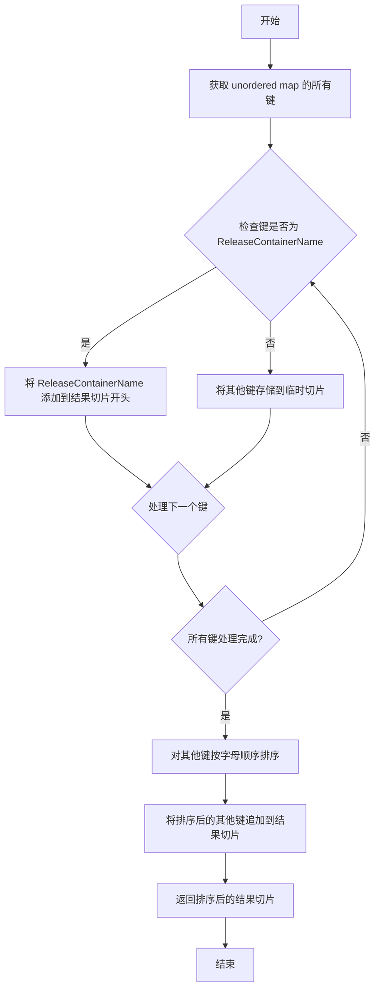

#### 带注释源码

```go
// sorted_containers 将无序的容器键映射排序为有序的字符串切片
// 排序规则：ReleaseContainerName 总是排在最前面，其余键按字母顺序升序排列
func sorted_containers(unordered map[string]imageAndSetter) []string {
    // 创建结果切片，预留足够的空间以提高性能
    result := make([]string, 0, len(unordered))
    
    // 用于存储非 ReleaseContainerName 的键
    var otherKeys []string
    
    // 遍历无序映射的所有键
    for key := range unordered {
        // 如果键是 ReleaseContainerName，则添加到结果切片的最前面
        if key == ReleaseContainerName {
            result = append([]string{key}, result...)
        } else {
            // 其他键暂存起来，稍后排序
            otherKeys = append(otherKeys, key)
        }
    }
    
    // 对其他键进行字母顺序排序
    sort.Strings(otherKeys)
    
    // 将排序后的其他键追加到结果切片
    result = append(result, otherKeys...)
    
    return result
}
```

---

**注意**：由于源代码中未直接提供 `sorted_containers` 函数的实现，上述源码是根据测试用例 `TestSortedContainers` 反推得出的。该测试用例表明函数接收一个 `map[string]imageAndSetter` 类型的无序映射，返回一个 `[]string` 类型的切片，其中 `ReleaseContainerName` 始终位于最前，其余元素按字母顺序排列。如果实际实现与上述推断不符，请提供实际的函数实现以便修正文档。


# ParseMultidoc 详细设计文档

根据提供的测试代码，我需要提取并分析 `ParseMultidoc` 函数的信息。由于提供的是测试代码而非实现源码，我将基于测试用例的使用模式来推断该函数的详细设计。

### ParseMultidoc

该函数是资源解析模块的核心入口，用于将包含 YAML 多文档的字节流解析为 Flux 资源对象（Resource）。它在 Flux CD 项目中负责解析 HelmRelease 类型的 Kubernetes 资源，并从中提取容器镜像信息，支持多种镜像配置格式（image+tag、registry+image+tag、镜像对象格式等）。

参数：

- `doc`：`[]byte`，YAML 多文档内容的字节数组，包含一个或多个 Kubernetes 资源定义（测试中主要为 HelmRelease）
- `cluster`：`string`，目标集群标识符，用于构建资源的唯一键（如 "test"）

返回值：`map[string]resource.Resource`，解析后的资源映射，键格式为 `{namespace}:{kind}/{name}`，值为通用的 resource.Resource 接口类型；`error`，解析过程中的错误信息

#### 流程图

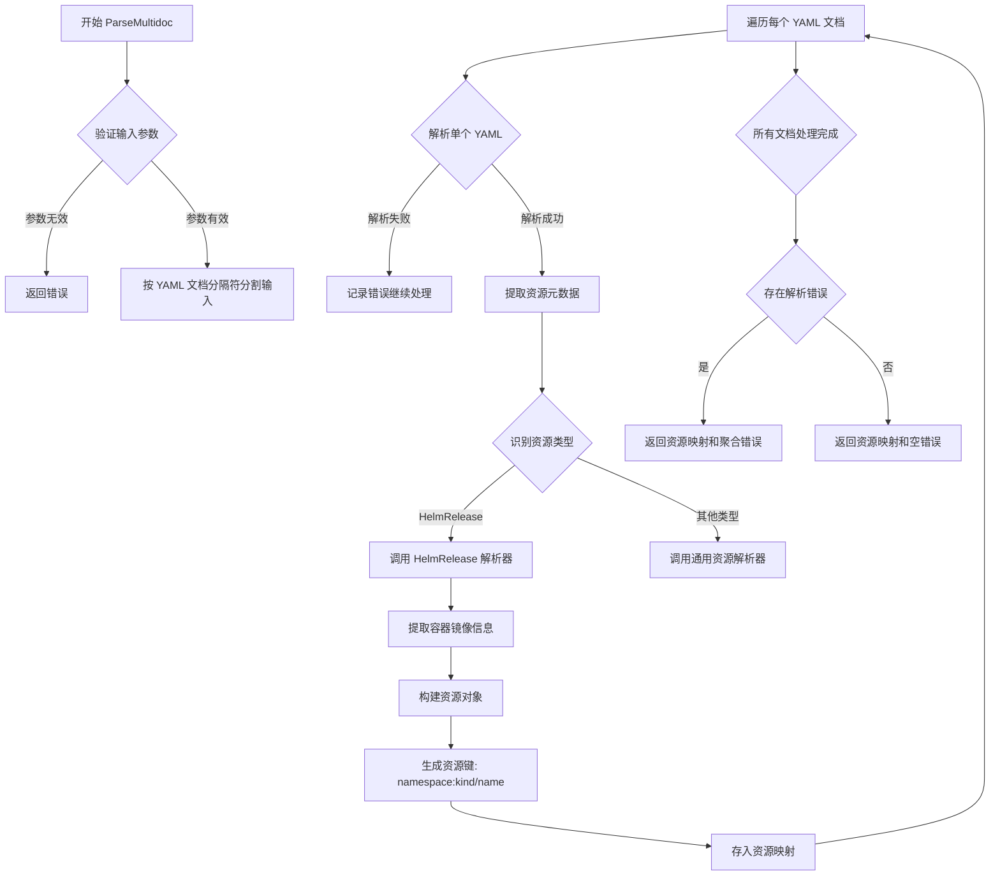

#### 带注释源码

```go
// 伪代码实现，根据测试用例反推
func ParseMultidoc(doc []byte, cluster string) (map[string]resource.Resource, error) {
    // 1. 输入验证
    if len(doc) == 0 {
        return nil, errors.New("empty document")
    }
    
    // 2. 按 YAML 多文档分隔符 (---) 分割文档
    //    每个文档独立解析
    documents := splitYAMLDocuments(doc)
    
    // 3. 初始化结果映射
    resources := make(map[string]resource.Resource)
    var errs []error
    
    // 4. 遍历每个 YAML 文档进行解析
    for _, yamlDoc := range documents {
        // 5. 解析 YAML 为通用结构
        obj, err := parseYAML(yamlDoc)
        if err != nil {
            errs = append(errs, err)
            continue  // 继续处理其他文档
        }
        
        // 6. 提取 Kubernetes 资源元数据
        //    - apiVersion (如: helm.fluxcd.io/v1)
        //    - kind (如: HelmRelease)
        //    - metadata.name
        //    - metadata.namespace
        //    - metadata.annotations
        metadata := extractMetadata(obj)
        
        // 7. 根据资源类型选择解析策略
        var resource resource.Resource
        switch metadata.kind {
        case "HelmRelease":
            // 8. 专门处理 HelmRelease 资源
            resource, err = parseHelmRelease(obj, metadata, cluster)
        default:
            // 9. 其他类型使用通用解析
            resource, err = parseGenericResource(obj, metadata, cluster)
        }
        
        if err != nil {
            errs = append(errs, err)
            continue
        }
        
        // 10. 生成资源唯一键: namespace:kind/name
        //     例如: "ghost:helmrelease/ghost"
        resourceKey := generateResourceKey(metadata.namespace, metadata.kind, metadata.name)
        
        // 11. 存入结果映射
        resources[resourceKey] = resource
    }
    
    // 12. 返回结果或聚合错误
    if len(errs) > 0 {
        return resources, mergeErrors(errs)
    }
    return resources, nil
}

// HelmRelease 专用解析逻辑（根据测试用例推断）
func parseHelmRelease(obj interface{}, metadata resourceMetadata, cluster string) (resource.Resource, error) {
    // 1. 提取 spec.values 部分
    values := extractValues(obj)
    
    // 2. 解析容器镜像信息（支持多种格式）
    //    - image: "repo:tag" 格式
    //    - image + tag 分离格式
    //    - registry + image + tag 格式
    //    - image: {repository, tag} 对象格式
    //    - 命名容器 (key 为容器名)
    //    - 注解映射 (annotations)
    containers := parseContainerImages(values, metadata.annotations)
    
    // 3. 创建 HelmRelease 资源对象
    hr := &HelmRelease{
        Metadata: metadata,
        Cluster:  cluster,
        Containers: containers,
    }
    
    return hr, nil
}

// 容器镜像解析（支持多种格式）
func parseContainerImages(values map[string]interface{}, annotations map[string]string) []Container {
    var containers []Container
    
    // 1. 检查顶级 image 字段
    if img, ok := values["image"]; ok {
        containers = append(containers, parseImageValue(img))
    }
    
    // 2. 遍历 values 键，查找容器定义
    for key, val := range values {
        if key == "image" || key == "chart" {
            continue  // 跳过非容器字段
        }
        
        // 3. 如果值是映射，尝试解析为容器配置
        if containerMap, ok := val.(map[string]interface{}); ok {
            container := parseContainerFromMap(key, containerMap)
            if container != nil {
                containers = append(containers, *container)
            }
        }
    }
    
    // 4. 处理注解中的镜像映射
    //    例如: fluxcd.io/image_repo_containerName -> customRepository
    containers = append(containers, parseImageFromAnnotations(annotations)...)
    
    return containers
}
```

### 关键组件信息

| 组件名称 | 描述 |
|---------|------|
| HelmRelease | Kubernetes 自定义资源类型，代表 Helm 部署配置 |
| Container | 容器镜像数据结构，包含 Name、Image（仓库/标签）信息 |
| resource.Resource | 通用资源接口，抽象不同资源类型的统一访问 |
| imageAndSetter | 内部类型，用于存储镜像解析结果和设置方法 |

### 潜在技术债务与优化空间

1. **错误处理粒度**：当前测试中若部分文档解析失败会继续处理，但返回的错误是聚合的，可能难以定位具体问题
2. **YAML 解析效率**：多次使用 `map[string]interface{}` 进行递归解析，可考虑缓存解析结果
3. **资源类型扩展**：当前代码主要针对 HelmRelease，对于其他资源类型使用通用解析，扩展性有限
4. **镜像格式兼容**：测试中覆盖了多种镜像格式，但解析逻辑分散，可能存在边界 case 未覆盖

### 其他设计说明

- **设计目标**：支持 Flux CD 从 HelmRelease 资源中自动识别和更新容器镜像
- **输入约束**：YAML 文档必须包含有效的 `apiVersion`、`kind`、`metadata.name` 字段
- **资源键格式**：`{namespace}:{kind}/{name}` 是资源的唯一标识符
- **镜像识别优先级**：顶级 image 字段 > 命名容器 > 注解映射（根据测试用例推断）


### `TestSortedContainers`

该函数用于测试 `sorted_containers` 函数是否能正确对容器名称进行排序，其中 `ReleaseContainerName` 必须排在最前面，其余容器按字母顺序排列。

参数：

- `t`：`testing.T`，Go 测试框架的测试用例指针，用于报告测试失败

返回值：无（`void`），该函数直接通过 `assert.Equal` 断言验证结果

#### 流程图

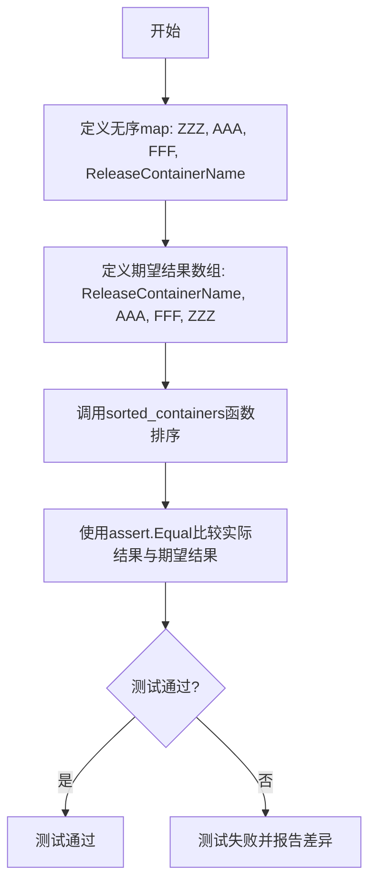

#### 带注释源码

```go
func TestSortedContainers(t *testing.T) {
	// 创建一个无序的map，包含四个容器键名
	// 键包括：ZZZ, AAA, FFF, 以及特殊常量 ReleaseContainerName
	unordered, expected := map[string]imageAndSetter{
		"ZZZ":                {},
		"AAA":                {},
		"FFF":                {},
		ReleaseContainerName: {}, // 特殊容器名，应排在第一位
	}, []string{ReleaseContainerName, "AAA", "FFF", "ZZZ"} // 期望的排序结果

	// 调用待测试的 sorted_containers 函数，对无序map进行排序
	actual := sorted_containers(unordered)

	// 使用 testify 库的 assert.Equal 验证排序结果是否符合预期
	// 期望顺序：ReleaseContainerName 优先，其余按字母顺序排列
	assert.Equal(t, expected, actual)
}
```


### TestParseImageOnlyFormat

该测试函数用于验证解析 HelmRelease 资源时，能够正确从 YAML 文档的 `values.image` 字段提取完整的镜像字符串（包括仓库和标签），并将其解析为容器镜像。

参数：

- `t *testing.T`：Go 标准测试框架的测试对象，用于报告测试失败和日志输出

返回值：无（Go 测试函数返回 void，通过 `t` 参数报告结果）

#### 流程图

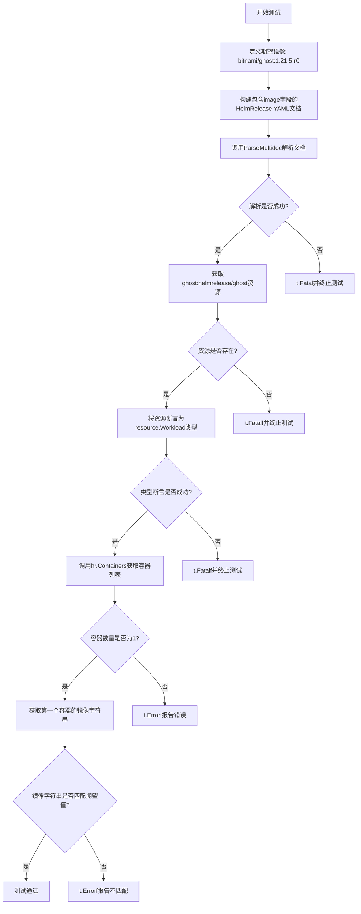

#### 带注释源码

```go
// TestParseImageOnlyFormat 测试函数
// 目的：验证从 HelmRelease 的 values.image 字段解析完整镜像字符串的功能
func TestParseImageOnlyFormat(t *testing.T) {
    // 1. 定义期望的镜像字符串（包含仓库名和标签）
    expectedImage := "bitnami/ghost:1.21.5-r0"
    
    // 2. 构建包含 HelmRelease 资源的 YAML 文档
    //    关键点：image 字段直接包含完整的镜像字符串（格式：repository:tag）
    doc := `---
apiVersion: helm.fluxcd.io/v1
kind: HelmRelease
metadata:
  name: ghost
  namespace: ghost
  labels:
    chart: ghost
spec:
  chart:
    git: git@github.com:fluxcd/flux-get-started
    ref: master
    path: charts/ghost
  values:
    first: post
    image: ` + expectedImage + `
    persistence:
      enabled: false
`

    // 3. 调用 ParseMultidoc 函数解析多文档 YAML
    //    参数：doc 字节切片，测试标识符 "test"
    resources, err := ParseMultidoc([]byte(doc), "test")
    
    // 4. 检查解析是否成功
    if err != nil {
        t.Fatal(err)  // 解析失败则终止测试
    }
    
    // 5. 从解析结果中获取指定资源
    //    资源键格式：<namespace>:<kind>/<name>
    res, ok := resources["ghost:helmrelease/ghost"]
    if !ok {
        t.Fatalf("expected resource not found; instead got %#v", resources)
    }
    
    // 6. 将通用资源类型断言为 Workload 接口
    //    HelmRelease 实现 Workload 接口
    hr, ok := res.(resource.Workload)
    if !ok {
        t.Fatalf("expected resource to be a Workload, instead got %#v", res)
    }

    // 7. 获取容器列表
    containers := hr.Containers()
    
    // 8. 验证容器数量
    if len(containers) != 1 {
        t.Errorf("expected 1 container; got %#v", containers)
    }
    
    // 9. 提取并验证容器镜像字符串
    image := containers[0].Image.String()
    if image != expectedImage {
        t.Errorf("expected container image %q, got %q", expectedImage, image)
    }
}
```


### `TestParseImageTagFormat`

该测试函数用于验证 Flux CD 资源解析器能够正确处理 HelmRelease 中 image 和 tag 字段分开定义的情况，确保最终组合成完整的镜像字符串（如 `bitnami/ghost:1.21.5-r0`）。

参数：

- `t`：`testing.T`，Go 标准测试框架的测试对象，用于报告测试失败和记录测试状态

返回值：无（Go 测试函数返回 void，通过 `t` 对象报告结果）

#### 流程图

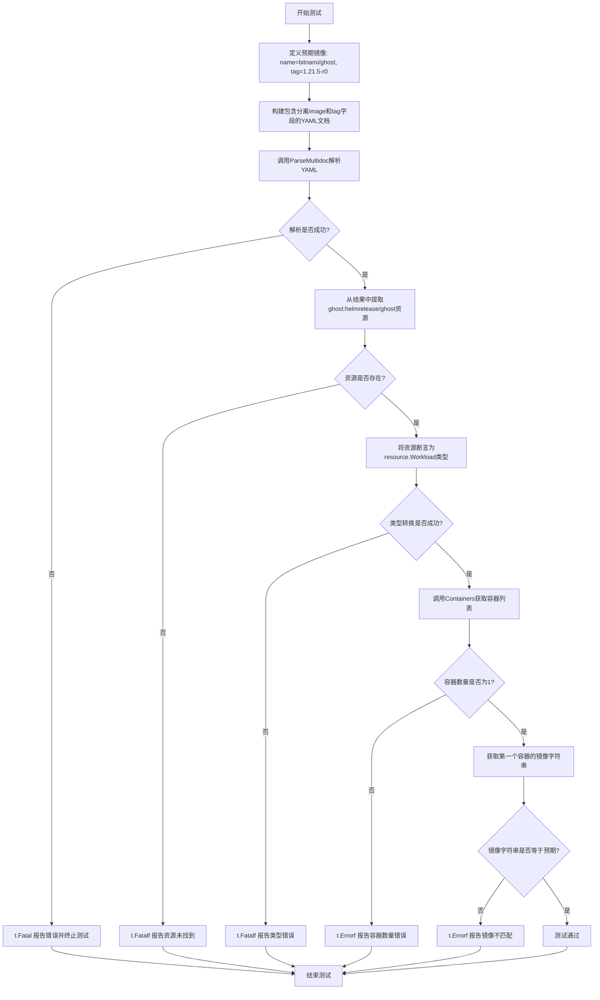

#### 带注释源码

```go
// TestParseImageTagFormat 测试解析分离的 image 和 tag 字段格式
// 预期行为：当 HelmRelease 的 values 中 image 和 tag 分开定义时，
// ParseMultidoc 应将它们组合成完整的镜像字符串
func TestParseImageTagFormat(t *testing.T) {
	// 1. 定义预期的镜像名称和标签
	expectedImageName := "bitnami/ghost"
	expectedImageTag := "1.21.5-r0"
	// 组合成完整镜像字符串: "bitnami/ghost:1.21.5-r0"
	expectedImage := expectedImageName + ":" + expectedImageTag

	// 2. 构建包含 HelmRelease 定义的 YAML 文档
	// 注意：image 和 tag 是分开的两个字段
	doc := `---
apiVersion: helm.fluxcd.io/v1
kind: HelmRelease
metadata:
  name: ghost
  namespace: ghost
  labels:
    chart: ghost
spec:
  chart:
    git: git@github.com:fluxcd/flux-get-started
    ref: master
    path: charts/ghostb
  values:
    first: post
    image: ` + expectedImageName + `
    tag: ` + expectedImageTag + `
    persistence:
      enabled: false
`

	// 3. 调用 ParseMultidoc 解析多文档 YAML
	// 参数：doc 是 YAML 字节切片，"test" 是源标识
	resources, err := ParseMultidoc([]byte(doc), "test")
	
	// 4. 错误处理：解析失败时 Fatal 终止测试
	if err != nil {
		t.Fatal(err)
	}
	
	// 5. 从解析结果中提取指定资源
	// 资源键格式："{metadata.name}:{kind}/{metadata.namespace}"
	res, ok := resources["ghost:helmrelease/ghost"]
	
	// 6. 验证资源是否存在
	if !ok {
		t.Fatalf("expected resource not found; instead got %#v", resources)
	}
	
	// 7. 类型断言：将通用资源转换为 Workload 接口
	// Workload 接口定义了容器相关操作
	hr, ok := res.(resource.Workload)
	if !ok {
		t.Fatalf("expected resource to be a Workload, instead got %#v", res)
	}

	// 8. 获取容器列表
	containers := hr.Containers()
	
	// 9. 验证容器数量
	if len(containers) != 1 {
		t.Errorf("expected 1 container; got %#v", containers)
	}
	
	// 10. 提取并验证镜像字符串
	// 关键验证点：image + tag 应该被组合成完整镜像
	image := containers[0].Image.String()
	if image != expectedImage {
		t.Errorf("expected container image %q, got %q", expectedImage, image)
	}
}
```


### `TestParseRegistryImageTagFormat`

该测试函数验证在 HelmRelease 资源配置中，当容器的镜像信息（registry、image、tag）分别以独立字段提供时，解析器能够正确组合这些字段并生成完整的镜像地址（如 `registry.com/bitnami/ghost:1.21.5-r0`）。

参数：

- `t`：`*testing.T`，Go 测试框架的标准参数，用于报告测试失败或记录日志

返回值：无（测试函数无返回值）

#### 流程图

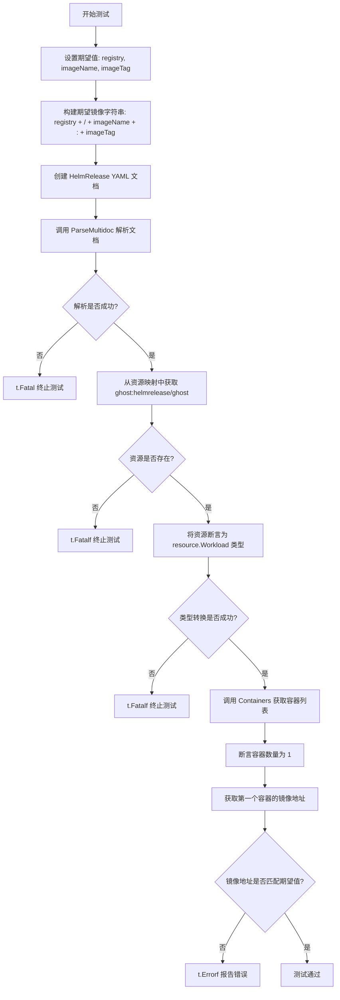

#### 带注释源码

```go
func TestParseRegistryImageTagFormat(t *testing.T) {
	// 定义期望的镜像组件：registry、镜像名、标签
	expectedRegistry := "registry.com"
	expectedImageName := "bitnami/ghost"
	expectedImageTag := "1.21.5-r0"
	// 组合成完整的期望镜像地址：registry.com/bitnami/ghost:1.21.5-r0
	expectedImage := expectedRegistry + "/" + expectedImageName + ":" + expectedImageTag

	// 构建 HelmRelease YAML 文档字符串，包含分离的 registry、image、tag 字段
	doc := `---
apiVersion: helm.fluxcd.io/v1
kind: HelmRelease
metadata:
  name: ghost
  namespace: ghost
  labels:
    chart: ghost
spec:
  chart:
    git: git@github.com:fluxcd/flux-get-started
    ref: master
    path: charts/ghost
spec:
  chartGitPath: mariadb
  values:
    first: post
    registry: ` + expectedRegistry + `
    image: ` + expectedImageName + `
    tag: ` + expectedImageTag + `
    persistence:
      enabled: false
`

	// 调用 ParseMultidoc 解析多文档 YAML
	resources, err := ParseMultidoc([]byte(doc), "test")
	// 如果解析出错，Fatal 终止测试
	if err != nil {
		t.Fatal(err)
	}
	// 从解析结果中获取指定资源键的资源
	res, ok := resources["ghost:helmrelease/ghost"]
	// 资源不存在则 Fatal 终止测试
	if !ok {
		t.Fatalf("expected resource not found; instead got %#v", resources)
	}
	// 将资源断言为 resource.Workload 接口类型
	hr, ok := res.(resource.Workload)
	// 类型断言失败则 Fatal 终止测试
	if !ok {
		t.Fatalf("expected resource to be a Workload, instead got %#v", res)
	}

	// 获取工作负载中的容器列表
	containers := hr.Containers()
	// 断言容器数量为 1
	if len(containers) != 1 {
		t.Errorf("expected 1 container; got %#v", containers)
	}
	// 获取第一个容器的镜像字符串表示
	image := containers[0].Image.String()
	// 断言镜像地址是否匹配期望值
	if image != expectedImage {
		t.Errorf("expected container image %q, got %q", expectedImage, image)
	}
}
```


### `TestParseRegistryImageFormat`

该测试函数用于验证在 HelmRelease 资源中，当显式指定 `registry` 字段且 `image` 字段包含完整镜像名（含标签）时，系统能够正确解析并组合出完整的容器镜像地址。

参数：

- `t`：`testing.T`，Go 语言标准测试框架中的测试用例对象，用于报告测试失败

返回值：无（测试函数）

#### 流程图

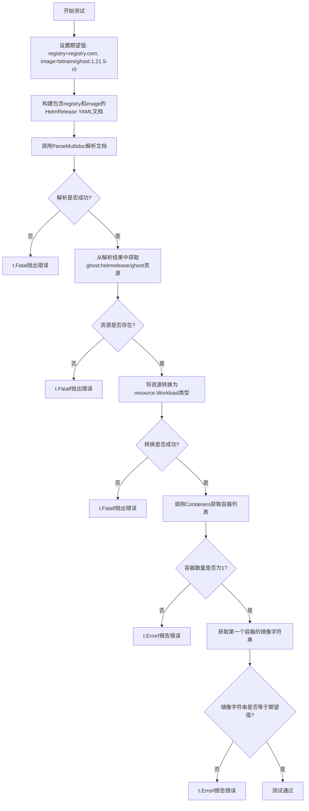

#### 带注释源码

```go
// TestParseRegistryImageFormat 测试解析带有注册表和完整镜像名（含标签）的格式
func TestParseRegistryImageFormat(t *testing.T) {
	// 定义期望的注册表、镜像名和完整镜像地址
	expectedRegistry := "registry.com"                              // 期望的镜像仓库地址
	expectedImageName := "bitnami/ghost:1.21.5-r0"                  // 期望的镜像名（含标签）
	expectedImage := expectedRegistry + "/" + expectedImageName     // 期望的完整镜像地址：registry.com/bitnami/ghost:1.21.5-r0

	// 构建包含 HelmRelease 资源的 YAML 文档
	// 关键点：values 中同时指定了 registry 和完整的 image（含标签）
	doc := `---
apiVersion: helm.fluxcd.io/v1
kind: HelmRelease
metadata:
  name: ghost
  namespace: ghost
  labels:
    chart: ghost
spec:
  chart:
    git: git@github.com:fluxcd/flux-get-started
    ref: master
    path: charts/ghost
spec:
  chartGitPath: mariadb
  values:
    first: post
    registry: ` + expectedRegistry + `      # 指定镜像仓库
    image: ` + expectedImageName + `        # 指定完整镜像名（含标签）
    persistence:
      enabled: false
`

	// 调用 ParseMultidoc 解析多文档 YAML
	resources, err := ParseMultidoc([]byte(doc), "test")
	if err != nil {
		t.Fatal(err)  // 解析失败则终止测试
	}
	
	// 从解析结果中获取指定名称的资源
	res, ok := resources["ghost:helmrelease/ghost"]
	if !ok {
		t.Fatalf("expected resource not found; instead got %#v", resources)
	}
	
	// 将资源转换为 resource.Workload 接口类型
	hr, ok := res.(resource.Workload)
	if !ok {
		t.Fatalf("expected resource to be a Workload, instead got %#v", res)
	}

	// 获取容器列表
	containers := hr.Containers()
	if len(containers) != 1 {
		t.Errorf("expected 1 container; got %#v", containers)
	}
	
	// 验证解析出的镜像地址是否符合预期
	image := containers[0].Image.String()
	if image != expectedImage {
		t.Errorf("expected container image %q, got %q", expectedImage, image)
	}
}
```


### `TestParseNamedImageFormat`

该测试函数用于验证能够正确解析 HelmRelease 资源中以容器名称作为键的镜像配置格式，并测试通过 `SetContainerImage` 方法更新镜像的功能。

参数：

- `t`：`testing.T`，Go 语言标准的测试框架参数，用于报告测试失败和记录测试状态

返回值：无（Go 测试函数没有显式返回值）

#### 流程图

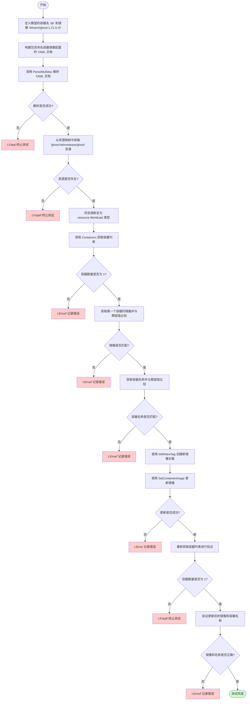

#### 带注释源码

```go
func TestParseNamedImageFormat(t *testing.T) {
	// 定义期望的容器名称和镜像地址
	expectedContainer := "db"
	expectedImage := "bitnami/ghost:1.21.5-r0"
	
	// 构建包含 HelmRelease 资源的 YAML 文档
	// 这里的 values 部分使用容器名 "db" 作为键，包含了镜像信息
	doc := `---
apiVersion: helm.fluxcd.io/v1
kind: HelmRelease
metadata:
  name: ghost
  namespace: ghost
  labels:
    chart: ghost
spec:
  chart:
    git: git@github.com:fluxcd/flux-get-started
    ref: master
    path: charts/ghost
spec:
  chartGitPath: mariadb
  values:
    ` + expectedContainer + `:
      first: post
      image: ` + expectedImage + `
      persistence:
        enabled: false
`

	// 调用 ParseMultidoc 解析多文档 YAML
	resources, err := ParseMultidoc([]byte(doc), "test")
	if err != nil {
		t.Fatal(err) // 解析失败则终止测试
	}
	
	// 从解析结果中获取指定键的资源
	res, ok := resources["ghost:helmrelease/ghost"]
	if !ok {
		t.Fatalf("expected resource not found; instead got %#v", resources)
	}
	
	// 将资源转换为 Workload 接口类型
	hr, ok := res.(resource.Workload)
	if !ok {
		t.Fatalf("expected resource to be a Workload, instead got %#v", res)
	}

	// 获取容器列表
	containers := hr.Containers()
	if len(containers) != 1 {
		t.Fatalf("expected 1 container; got %#v", containers)
	}
	
	// 验证容器镜像是否正确
	image := containers[0].Image.String()
	if image != expectedImage {
		t.Errorf("expected container image %q, got %q", expectedImage, image)
	}
	
	// 验证容器名称是否正确（命名容器格式的关键验证点）
	if containers[0].Name != expectedContainer {
		t.Errorf("expected container name %q, got %q", expectedContainer, containers[0].Name)
	}

	// 测试镜像更新功能：创建一个带新标签的镜像
	newImage := containers[0].Image.WithNewTag("some-other-tag")
	if err := hr.SetContainerImage(expectedContainer, newImage); err != nil {
		t.Error(err)
	}

	// 重新获取容器列表验证更新结果
	containers = hr.Containers()
	if len(containers) != 1 {
		t.Fatalf("expected 1 container; got %#v", containers)
	}
	image = containers[0].Image.String()
	if image != newImage.String() {
		t.Errorf("expected container image %q, got %q", newImage.String(), image)
	}
	if containers[0].Name != expectedContainer {
		t.Errorf("expected container name %q, got %q", expectedContainer, containers[0].Name)
	}
}
```


### `TestParseNamedImageTagFormat`

该测试函数验证了 Flux 项目在解析 HelmRelease 资源时，能够正确处理带有名称、镜像和标签分离（image 和 tag 字段分开指定）的命名容器配置，并支持后续通过 `SetContainerImage` 方法更新容器镜像。

参数：

-  `t`：`testing.T`，Go 测试框架的标准参数，用于报告测试失败和控制测试流程

返回值：`无`（Go 测试函数的标准形式，通过 `t` 参数的方法报告结果）

#### 流程图

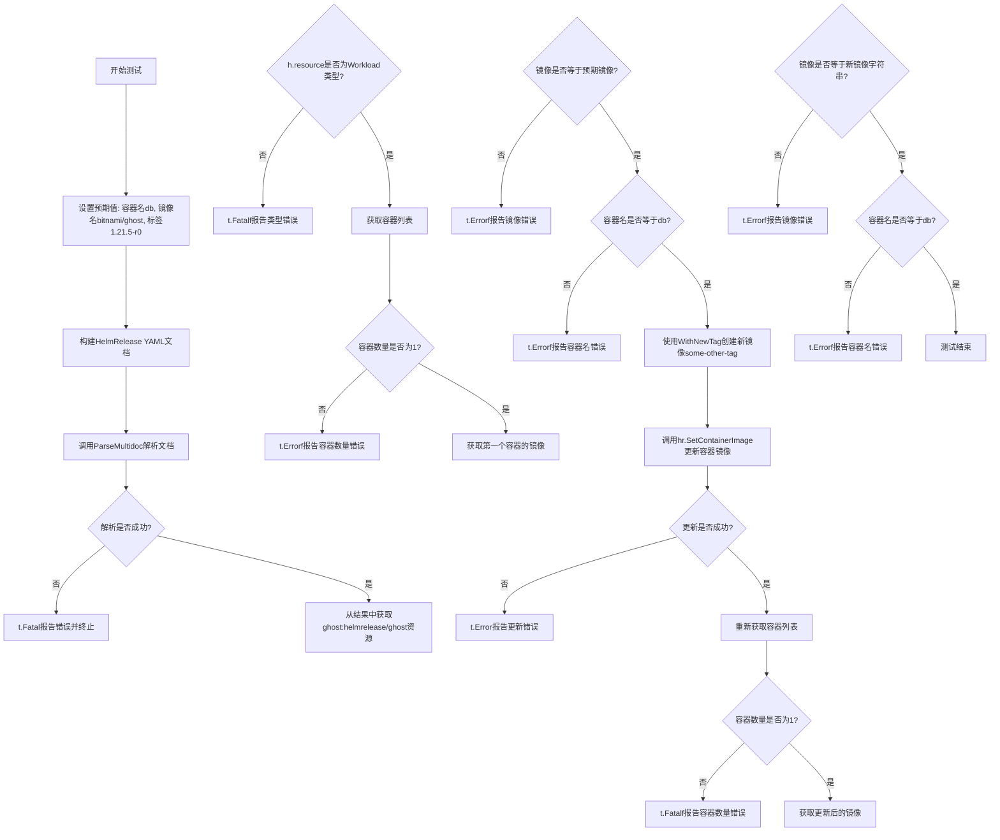

#### 带注释源码

```go
// TestParseNamedImageTagFormat 测试解析命名容器时使用分离的 image 和 tag 字段的格式
func TestParseNamedImageTagFormat(t *testing.T) {
	// 1. 设置预期值
	expectedContainer := "db"                                    // 预期的容器名称
	expectedImageName := "bitnami/ghost"                         // 预期的镜像名称（不含标签）
	expectedImageTag := "1.21.5-r0"                              // 预期的镜像标签
	expectedImage := expectedImageName + ":" + expectedImageTag  // 完整的预期镜像字符串

	// 2. 构建 HelmRelease YAML 文档
	// 文档包含一个命名容器 'db'，其镜像和标签分别通过 image 和 tag 字段指定
	doc := `---
apiVersion: helm.fluxcd.io/v1
kind: HelmRelease
metadata:
  name: ghost
  namespace: ghost
  labels:
    chart: ghost
spec:
  chart:
    git: git@github.com:fluxcd/flux-get-started
    ref: master
    path: charts/ghost
spec:
  chartGitPath: mariadb
  values:
    other:
      not: "containing image"
    ` + expectedContainer + `:
      first: post
      image: ` + expectedImageName + `
      tag: ` + expectedImageTag + `
      persistence:
        enabled: false
`

	// 3. 解析 multidoc YAML
	resources, err := ParseMultidoc([]byte(doc), "test")
	if err != nil {
		t.Fatal(err) // 解析失败则终止测试
	}

	// 4. 获取并验证资源
	res, ok := resources["ghost:helmrelease/ghost"]
	if !ok {
		t.Fatalf("expected resource not found; instead got %#v", resources)
	}

	// 5. 类型断言为 Workload
	hr, ok := res.(resource.Workload)
	if !ok {
		t.Fatalf("expected resource to be a Workload, instead got %#v", res)
	}

	// 6. 验证容器数量
	containers := hr.Containers()
	if len(containers) != 1 {
		t.Fatalf("expected 1 container; got %#v", containers)
	}

	// 7. 验证镜像和容器名称
	image := containers[0].Image.String()
	if image != expectedImage {
		t.Errorf("expected container image %q, got %q", expectedImage, image)
	}
	if containers[0].Name != expectedContainer {
		t.Errorf("expected container name %q, got %q", expectedContainer, containers[0].Name)
	}

	// 8. 测试更新容器镜像功能
	newImage := containers[0].Image.WithNewTag("some-other-tag")
	if err := hr.SetContainerImage(expectedContainer, newImage); err != nil {
		t.Error(err)
	}

	// 9. 验证更新后的容器信息
	containers = hr.Containers()
	if len(containers) != 1 {
		t.Fatalf("expected 1 container; got %#v", containers)
	}
	image = containers[0].Image.String()
	if image != newImage.String() {
		t.Errorf("expected container image %q, got %q", newImage.String(), image)
	}
	if containers[0].Name != expectedContainer {
		t.Errorf("expected container name %q, got %q", expectedContainer, containers[0].Name)
	}
}
```


### `TestParseNamedRegistryImageTagFormat`

测试函数，用于验证在 HelmRelease 资源中，当容器配置同时包含 registry、image 和 tag 字段时的解析和修改功能是否正确。

参数：

-  `t`：`testing.T`，Go 标准测试框架中的测试对象，用于报告测试失败和记录测试结果

返回值：`void`，无返回值（测试函数）

#### 流程图

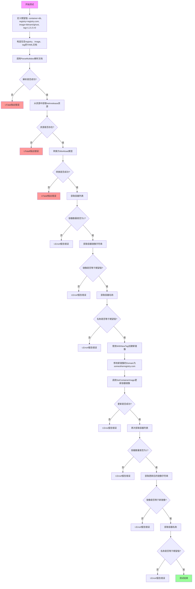

#### 带注释源码

```go
// TestParseNamedRegistryImageTagFormat 测试函数
// 验证解析包含 registry、image 和 tag 字段的命名容器配置
func TestParseNamedRegistryImageTagFormat(t *testing.T) {
	// 定义期望的测试数据
	expectedContainer := "db"                              // 期望的容器名称
	expectedRegistry := "registry.com"                      // 期望的镜像仓库地址
	expectedImageName := "bitnami/ghost"                   // 期望的镜像名称
	expectedImageTag := "1.21.5-r0"                        // 期望的镜像标签
	// 组合完整的期望镜像地址: registry.com/bitnami/ghost:1.21.5-r0
	expectedImage := expectedRegistry + "/" + expectedImageName + ":" + expectedImageTag

	// 构造 YAML 文档字符串，包含 HelmRelease 资源定义
	// 注意：values 下有一个名为 "db" 的容器块，包含 registry、image、tag 字段
	doc := `---
apiVersion: helm.fluxcd.io/v1
kind: HelmRelease
metadata:
  name: ghost
  namespace: ghost
  labels:
    chart: ghost
spec:
  chart:
    git: git@github.com:fluxcd/flux-get-started
    ref: master
    path: charts/ghost
spec:
  chartGitPath: mariadb
  values:
    other:
      not: "containing image"
    ` + expectedContainer + `:
      first: post
      registry: ` + expectedRegistry + `
      image: ` + expectedImageName + `
      tag: ` + expectedImageTag + `
      persistence:
        enabled: false
`

	// 调用 ParseMultidoc 解析多文档 YAML
	// 参数: doc 字节切片, "test" 源标识
	resources, err := ParseMultidoc([]byte(doc), "test")
	// 如果解析失败，调用 t.Fatal 终止测试
	if err != nil {
		t.Fatal(err)
	}
	// 从解析结果中获取 key 为 "ghost:helmrelease/ghost" 的资源
	res, ok := resources["ghost:helmrelease/ghost"]
	// 如果资源不存在，记录错误信息并终止测试
	if !ok {
		t.Fatalf("expected resource not found; instead got %#v", resources)
	}
	// 尝试将资源转换为 resource.Workload 接口类型
	hr, ok := res.(resource.Workload)
	// 如果转换失败，记录错误信息并终止测试
	if !ok {
		t.Fatalf("expected resource to be a Workload, instead got %#v", res)
	}

	// 获取容器列表
	containers := hr.Containers()
	// 验证容器数量是否为 1
	if len(containers) != 1 {
		t.Fatalf("expected 1 container; got %#v", containers)
	}
	// 获取第一个容器的镜像字符串
	image := containers[0].Image.String()
	// 验证镜像是否与期望值匹配
	if image != expectedImage {
		t.Errorf("expected container image %q, got %q", expectedImage, image)
	}
	// 验证容器名称是否与期望值匹配
	if containers[0].Name != expectedContainer {
		t.Errorf("expected container name %q, got %q", expectedContainer, containers[0].Name)
	}

	// 创建一个带有新标签的镜像对象
	newImage := containers[0].Image.WithNewTag("some-other-tag")
	// 修改新镜像的域名（仓库地址）
	newImage.Domain = "someotherregistry.com"
	// 调用 SetContainerImage 方法更新容器镜像
	if err := hr.SetContainerImage(expectedContainer, newImage); err != nil {
		t.Error(err)
	}

	// 再次获取更新后的容器列表
	containers = hr.Containers()
	// 验证容器数量仍为 1
	if len(containers) != 1 {
		t.Fatalf("expected 1 container; got %#v", containers)
	}
	// 获取更新后的镜像字符串
	image = containers[0].Image.String()
	// 验证镜像是否与新镜像匹配
	if image != newImage.String() {
		t.Errorf("expected container image %q, got %q", newImage.String(), image)
	}
	// 验证容器名称是否仍然与期望值匹配
	if containers[0].Name != expectedContainer {
		t.Errorf("expected container name %q, got %q", expectedContainer, containers[0].Name)
	}
}
```


### `TestParseNamedRegistryImageFormat`

该测试函数验证了解析包含命名的容器（带有自定义 registry 和完整镜像名称）的 HelmRelease YAML 配置文件的能力。它测试了从 YAML 中提取容器名称、镜像 registry、镜像名称和标签的功能，并验证了使用新镜像更新容器镜像的功能。

参数：

-  `t`：`testing.T`，Go 标准测试框架中的测试用例对象，用于报告测试失败和记录测试结果

返回值：无（`testing.T` 方法通过副作用完成验证）

#### 流程图

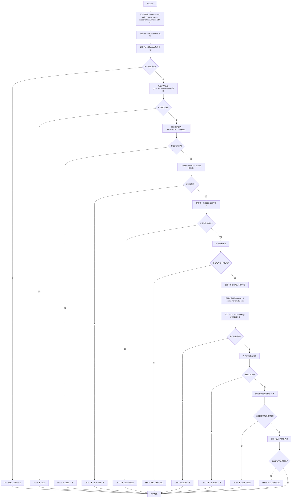

#### 带注释源码

```go
// TestParseNamedRegistryImageFormat 测试解析带有注册表和完整镜像名称的命名容器格式
// 该测试验证:
// 1. 能够从 HelmRelease 的 values 中解析出命名的容器 (db)
// 2. 能够正确识别 registry (registry.com)
// 3. 能够正确解析包含标签的镜像名称 (bitnami/ghost:1.21.5-r0)
// 4. 能够正确组合成完整镜像路径 (registry.com/bitnami/ghost:1.21.5-r0)
// 5. 能够使用 SetContainerImage 更新容器镜像
func TestParseNamedRegistryImageFormat(t *testing.T) {
	// 定义测试期望值
	expectedContainer := "db"                                   // 期望的容器名称
	expectedRegistry := "registry.com"                          // 期望的镜像仓库地址
	expectedImageName := "bitnami/ghost:1.21.5-r0"             // 期望的镜像名称(含标签)
	expectedImage := expectedRegistry + "/" + expectedImageName // 期望的完整镜像路径

	// 构造 HelmRelease YAML 文档
	// 该文档包含:
	// - metadata.name: ghost
	// - metadata.namespace: ghost
	// - values.db: 命名容器配置
	// - values.db.registry: 镜像仓库地址
	// - values.db.image: 镜像名称(含标签)
	// - values.db.persistence: 持久化配置
	doc := `---
apiVersion: helm.fluxcd.io/v1
kind: HelmRelease
metadata:
  name: ghost
  namespace: ghost
  labels:
    chart: ghost
spec:
  chart:
    git: git@github.com:fluxcd/flux-get-started
    ref: master
    path: charts/ghost
  values:
    other:
      not: "containing image"
    ` + expectedContainer + `:
      first: post
      registry: ` + expectedRegistry + `
      image: ` + expectedImageName + `
      persistence:
        enabled: false
`

	// 调用 ParseMultidoc 解析多文档 YAML
	// 参数: []byte(doc) - YAML 文档的字节切片
	// 参数: "test" - 源标识符
	// 返回: resources - 解析后的资源映射, err - 解析错误
	resources, err := ParseMultidoc([]byte(doc), "test")
	if err != nil {
		t.Fatal(err) // 解析失败时终止测试
	}
	
	// 从资源映射中获取名为 "ghost:helmrelease/ghost" 的资源
	// 键格式: "namespace:kind/name"
	res, ok := resources["ghost:helmrelease/ghost"]
	if !ok {
		t.Fatalf("expected resource not found; instead got %#v", resources)
	}
	
	// 将资源断言为 resource.Workload 类型
	// HelmRelease 被实现为 Workload 接口
	hr, ok := res.(resource.Workload)
	if !ok {
		t.Fatalf("expected resource to be a Workload, instead got %#v", res)
	}

	// 获取容器列表
	containers := hr.Containers()
	if len(containers) != 1 {
		t.Fatalf("expected 1 container; got %#v", containers)
	}
	
	// 验证容器镜像解析正确
	image := containers[0].Image.String()
	if image != expectedImage {
		t.Errorf("expected container image %q, got %q", expectedImage, image)
	}
	
	// 验证容器名称解析正确
	if containers[0].Name != expectedContainer {
		t.Errorf("expected container name %q, got %q", expectedContainer, containers[0].Name)
	}

	// 测试镜像更新功能
	// 使用 WithNewTag 创建带有新标签的镜像
	newImage := containers[0].Image.WithNewTag("some-other-tag")
	// 修改镜像的 Domain (仓库地址)
	newImage.Domain = "someotherregistry.com"
	
	// 调用 SetContainerImage 更新容器镜像
	// 参数: expectedContainer - 容器名称
	// 参数: newImage - 新的镜像对象
	if err := hr.SetContainerImage(expectedContainer, newImage); err != nil {
		t.Error(err)
	}

	// 验证更新后的容器信息
	containers = hr.Containers()
	if len(containers) != 1 {
		t.Fatalf("expected 1 container; got %#v", containers)
	}
	image = containers[0].Image.String()
	if image != newImage.String() {
		t.Errorf("expected container image %q, got %q", newImage.String(), image)
	}
	if containers[0].Name != expectedContainer {
		t.Errorf("expected container name %q, got %q", expectedContainer, containers[0].Name)
	}
}
```


### `TestParseImageObjectFormat`

该测试函数用于验证系统能够正确解析 HelmRelease 资源中的镜像对象格式（image object format），即 `image.repository` 和 `image.tag` 格式的容器镜像定义，并确保解析后的镜像字符串与预期值一致。

#### 参数

- `t`：`testing.T`，Go 语言标准测试框架中的测试实例，用于报告测试失败和日志输出。

#### 返回值

无直接返回值（`void`），通过测试实例 `t` 的方法（如 `t.Errorf`, `t.Fatal`, `t.Fatalf`）报告测试结果。

#### 流程图

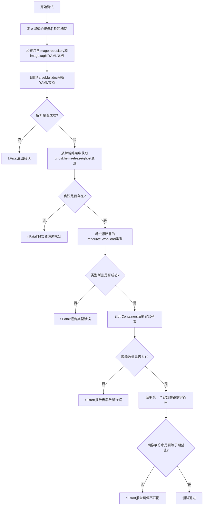

#### 带注释源码

```go
func TestParseImageObjectFormat(t *testing.T) {
	// 定义期望的镜像名称和标签
	expectedImageName := "bitnami/ghost"
	expectedImageTag := "1.21.5-r0"
	// 组合完整的期望镜像字符串（名称:标签）
	expectedImage := expectedImageName + ":" + expectedImageTag

	// 构建包含 HelmRelease 资源的 YAML 文档
	// 使用多文档格式，image 字段以对象形式指定（repository 和 tag 分离）
	doc := `---
apiVersion: helm.fluxcd.io/v1
kind: HelmRelease
metadata:
  name: ghost
  namespace: ghost
  labels:
    chart: ghost
spec:
  chart:
    git: git@github.com:fluxcd/flux-get-started
    ref: master
    path: charts/ghost
  values:
    first: post
    image:
      repository: ` + expectedImageName + `
      tag: ` + expectedImageTag + `
    persistence:
      enabled: false
`

	// 调用 ParseMultidoc 解析 YAML 文档为资源对象
	// 参数：doc 的字节切片，第二个参数为文档标识（此处为 "test"）
	resources, err := ParseMultidoc([]byte(doc), "test")
	// 如果解析过程中发生错误，终止测试并输出错误信息
	if err != nil {
		t.Fatal(err)
	}
	// 从解析结果中通过键 "ghost:helmrelease/ghost" 获取对应的资源
	res, ok := resources["ghost:helmrelease/ghost"]
	// 如果未找到对应资源，终止测试并输出当前所有资源的调试信息
	if !ok {
		t.Fatalf("expected resource not found; instead got %#v", resources)
	}
	// 将获取的资源类型断言为 resource.Workload 接口类型
	hr, ok := res.(resource.Workload)
	// 如果类型断言失败，终止测试并输出实际类型信息
	if !ok {
		t.Fatalf("expected resource to be a Workload, instead got %#v", res)
	}

	// 调用 Workload 接口的 Containers 方法获取容器列表
	containers := hr.Containers()
	// 验证容器数量是否为 1（期望只有 1 个容器）
	if len(containers) != 1 {
		t.Errorf("expected 1 container; got %#v", containers)
	}
	// 获取第一个容器的镜像字符串表示
	image := containers[0].Image.String()
	// 验证镜像字符串是否与期望值完全匹配
	if image != expectedImage {
		t.Errorf("expected container image %q, got %q", expectedImage, image)
	}
}
```


### TestParseNamedImageObjectFormat

测试解析命名的镜像对象格式，验证能够从 HelmRelease 的 values 中正确解析出带有 repository 和 tag 字段的命名容器镜像，并能够成功更新镜像标签。

参数：

- `t`：`testing.T`，Go 测试框架的测试上下文，用于报告测试失败

返回值：无（测试函数通过 t.Fatal/t.Errorf 报告错误）

#### 流程图

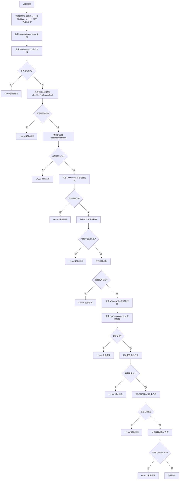

#### 带注释源码

```go
func TestParseNamedImageObjectFormat(t *testing.T) {
	// 设置期望的容器名称、镜像名称、镜像标签和完整镜像字符串
	expectedContainer := "db"
	expectedImageName := "bitnami/ghost"
	expectedImageTag := "1.21.5-r0"
	expectedImage := expectedImageName + ":" + expectedImageTag

	// 构建 HelmRelease 文档的 YAML 字符串
	// 包含一个命名容器 'db'，其 image 字段为对象格式
	// 包含 repository 和 tag 子字段
	doc := `---
apiVersion: helm.fluxcd.io/v1
kind: HelmRelease
metadata:
  name: ghost
  namespace: ghost
  labels:
    chart: ghost
spec:
  chart:
    git: git@github.com:fluxcd/flux-get-started
    ref: master
    path: charts/ghost
  values:
    other:
      not: "containing image"
    ` + expectedContainer + `:
      first: post
      image:
        repository: ` + expectedImageName + `
        tag: ` + expectedImageTag + `
      persistence:
        enabled: false
`

	// 调用 ParseMultidoc 解析多文档 YAML
	resources, err := ParseMultidoc([]byte(doc), "test")
	if err != nil {
		t.Fatal(err) // 解析失败则 fatal
	}
	// 从解析结果中获取指定 key 的资源
	res, ok := resources["ghost:helmrelease/ghost"]
	if !ok {
		t.Fatalf("expected resource not found; instead got %#v", resources)
	}
	// 将资源类型断言为 Workload 接口
	hr, ok := res.(resource.Workload)
	if !ok {
		t.Fatalf("expected resource to be a Workload, instead got %#v", res)
	}

	// 获取容器列表
	containers := hr.Containers()
	if len(containers) != 1 {
		t.Fatalf("expected 1 container; got %#v", containers)
	}
	// 获取第一个容器的镜像字符串并验证
	image := containers[0].Image.String()
	if image != expectedImage {
		t.Errorf("expected container image %q, got %q", expectedImage, image)
	}
	// 验证容器名称是否匹配
	if containers[0].Name != expectedContainer {
		t.Errorf("expected container name %q, got %q", expectedContainer, containers[0].Name)
	}

	// 使用新标签创建新镜像对象
	newImage := containers[0].Image.WithNewTag("some-other-tag")
	// 调用 SetContainerImage 更新容器镜像
	if err := hr.SetContainerImage(expectedContainer, newImage); err != nil {
		t.Error(err)
	}

	// 再次获取容器列表验证更新结果
	containers = hr.Containers()
	if len(containers) != 1 {
		t.Fatalf("expected 1 container; got %#v", containers)
	}
	// 验证镜像已更新
	image = containers[0].Image.String()
	if image != newImage.String() {
		t.Errorf("expected container image %q, got %q", newImage.String(), image)
	}
	// 验证容器名称未改变
	if containers[0].Name != expectedContainer {
		t.Errorf("expected container name %q, got %q", expectedContainer, containers[0].Name)
	}
}
```


### `TestParseNamedImageObjectFormatWithRegistry`

该测试函数验证了在使用命名容器时，系统能否正确解析包含 registry、repository 和 tag 的镜像对象格式，并确保镜像的全限定名称（包括注册表域名）被正确处理。同时测试了通过 `SetContainerImage` 方法更新镜像的功能。

**注意**：该函数位于 `resource` 包中，属于测试文件。测试类/套件可以认为是 `ResourceTestSuite`（虽然代码中未显式定义类结构，但根据命名规范和测试函数可以推断）。

参数：

- `t`：`testing.T`，Go 测试框架的标准参数，用于报告测试失败和日志输出

返回值：无（`void`），Go 测试函数返回 `void`

#### 流程图

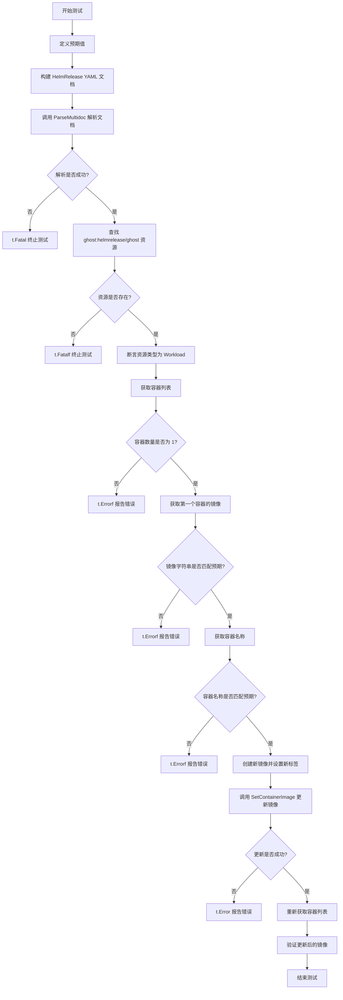

#### 带注释源码

```go
// TestParseNamedImageObjectFormatWithRegistry 测试使用命名容器时
// 包含 registry、repository 和 tag 的镜像对象格式解析
func TestParseNamedImageObjectFormatWithRegistry(t *testing.T) {
	// 定义测试预期值
	expectedContainer := "db"                           // 预期的容器名称
	expectedRegistry := "registry.com"                  // 预期的镜像注册表
	expectedImageName := "bitnami/ghost"                // 预期的镜像名称
	expectedImageTag := "1.21.5-r0"                     // 预期的镜像标签
	expectedImage := expectedRegistry + "/" + expectedImageName + ":" + expectedImageTag // 完整的预期镜像字符串

	// 构建 HelmRelease YAML 文档字符串
	doc := `---
apiVersion: helm.fluxcd.io/v1
kind: HelmRelease
metadata:
  name: ghost
  namespace: ghost
  labels:
    chart: ghost
spec:
  chart:
    git: git@github.com:fluxcd/flux-get-started
    ref: master
    path: charts/ghost
  values:
    other:
      not: "containing image"
    ` + expectedContainer + `:
      first: post
      image:
        registry: ` + expectedRegistry + `
        repository: ` + expectedImageName + `
        tag: ` + expectedImageTag + `
      persistence:
        enabled: false
`

	// 调用 ParseMultidoc 解析多文档 YAML
	resources, err := ParseMultidoc([]byte(doc), "test")
	if err != nil {
		t.Fatal(err) // 解析失败则终止测试
	}

	// 从解析结果中查找指定资源
	res, ok := resources["ghost:helmrelease/ghost"]
	if !ok {
		t.Fatalf("expected resource not found; instead got %#v", resources)
	}

	// 断言资源类型为 Workload
	hr, ok := res.(resource.Workload)
	if !ok {
		t.Fatalf("expected resource to be a Workload, instead got %#v", res)
	}

	// 获取容器列表
	containers := hr.Containers()
	if len(containers) != 1 {
		t.Fatalf("expected 1 container; got %#v", containers)
	}

	// 验证容器镜像字符串
	image := containers[0].Image.String()
	if image != expectedImage {
		t.Errorf("expected container image %q, got %q", expectedImage, image)
	}

	// 验证容器名称
	if containers[0].Name != expectedContainer {
		t.Errorf("expected container name %q, got %q", expectedContainer, containers[0].Name)
	}

	// 创建新镜像并添加新标签
	newImage := containers[0].Image.WithNewTag("some-other-tag")
	newImage.Domain = "someotherregistry.com" // 修改镜像域名

	// 调用 SetContainerImage 更新镜像
	if err := hr.SetContainerImage(expectedContainer, newImage); err != nil {
		t.Error(err)
	}

	// 重新获取容器列表验证更新结果
	containers = hr.Containers()
	if len(containers) != 1 {
		t.Fatalf("expected 1 container; got %#v", containers)
	}

	// 验证更新后的镜像字符串
	image = containers[0].Image.String()
	if image != newImage.String() {
		t.Errorf("expected container image %q, got %q", newImage.String(), image)
	}

	// 验证更新后的容器名称
	if containers[0].Name != expectedContainer {
		t.Errorf("expected container name %q, got %q", expectedContainer, containers[0].Name)
	}
}
```


### `TestParseNamedImageObjectFormatWithRegistryAndMultiElementImage`

该测试函数验证了当 HelmRelease 资源中的容器镜像配置同时包含 registry、repository（包含多层路径）和 tag 时，系统能够正确解析并构造完整的镜像路径，并且能够成功更新容器镜像。

参数：

-  `t`：`testing.T`，Go 标准测试框架中的测试实例，用于报告测试失败

返回值：`void`，该函数为测试函数，没有返回值，通过 `t` 参数报告测试结果

#### 流程图

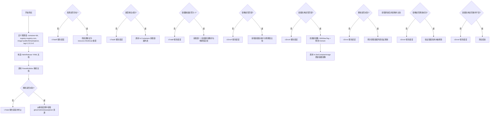

#### 带注释源码

```go
func TestParseNamedImageObjectFormatWithRegistryAndMultiElementImage(t *testing.T) {
	// 定义预期的测试数据
	expectedContainer := "db"                                      // 预期的容器名称
	expectedRegistry := "registry.com"                             // 预期的镜像仓库地址
	expectedImageName := "public/bitnami/ghost"                     // 预期的镜像名称（包含多层路径）
	expectedImageTag := "1.21.5-r0"                                // 预期的镜像标签
	expectedImage := expectedRegistry + "/" + expectedImageName + ":" + expectedImageTag // 完整预期镜像路径

	// 构造 HelmRelease 资源 YAML 文档
	doc := `---
apiVersion: helm.fluxcd.io/v1
kind: HelmRelease
metadata:
  name: ghost
  namespace: ghost
  labels:
    chart: ghost
spec:
  chart:
    git: git@github.com:fluxcd/flux-get-started
    ref: master
    path: charts/ghost
  values:
    other:
      not: "containing image"
    ` + expectedContainer + `:
      first: post
      image:
        registry: ` + expectedRegistry + `
        repository: ` + expectedImageName + `
        tag: ` + expectedImageTag + `
      persistence:
        enabled: false
`

	// 调用 ParseMultidoc 解析 YAML 文档
	resources, err := ParseMultidoc([]byte(doc), "test")
	if err != nil {
		t.Fatal(err) // 解析失败时终止测试
	}
	
	// 从解析结果中获取指定资源
	res, ok := resources["ghost:helmrelease/ghost"]
	if !ok {
		t.Fatalf("expected resource not found; instead got %#v", resources)
	}
	
	// 将资源转换为 resource.Workload 类型
	hr, ok := res.(resource.Workload)
	if !ok {
		t.Fatalf("expected resource to be a Workload, instead got %#v", res)
	}

	// 获取容器列表并验证
	containers := hr.Containers()
	if len(containers) != 1 {
		t.Fatalf("expected 1 container; got %#v", containers)
	}
	
	// 验证容器镜像是否正确
	image := containers[0].Image.String()
	if image != expectedImage {
		t.Errorf("expected container image %q, got %q", expectedImage, image)
	}
	
	// 验证容器名称是否正确
	if containers[0].Name != expectedContainer {
		t.Errorf("expected container name %q, got %q", expectedContainer, containers[0].Name)
	}

	// 测试更新容器镜像功能
	newImage := containers[0].Image.WithNewTag("some-other-tag") // 创建新镜像并设置新标签
	newImage.Domain = "someotherregistry.com"                    // 修改镜像仓库域名
	
	// 更新容器镜像
	if err := hr.SetContainerImage(expectedContainer, newImage); err != nil {
		t.Error(err)
	}

	// 重新获取容器列表并验证更新结果
	containers = hr.Containers()
	if len(containers) != 1 {
		t.Fatalf("expected 1 container; got %#v", containers)
	}
	
	// 验证镜像是否更新成功
	image = containers[0].Image.String()
	if image != newImage.String() {
		t.Errorf("expected container image %q, got %q", newImage.String(), image)
	}
	
	// 验证容器名称在更新后保持不变
	if containers[0].Name != expectedContainer {
		t.Errorf("expected container name %q, got %q", expectedContainer, containers[0].Name)
	}
}
```


### `TestParseNamedImageObjectFormatWithRegistryWitoutTag`

该函数测试解析带有注册表但没有标签的命名镜像对象格式。它验证当 HelmRelease 的 values 中包含带有 registry 和 repository（包含标签）但没有显式 tag 字段的镜像对象时，能够正确解析出完整的镜像地址。

参数：

-  `t`：`*testing.T`，Go 测试框架的测试上下文，用于报告测试失败和日志输出

返回值：无（测试函数通过 `*testing.T` 参数进行断言和错误报告）

#### 流程图

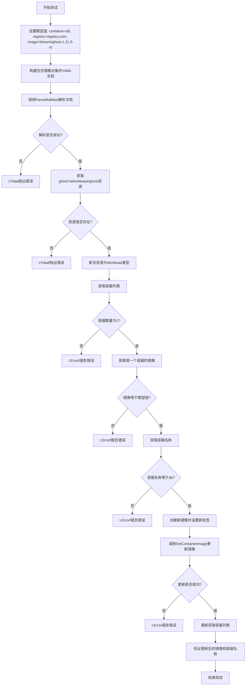

#### 带注释源码

```go
// TestParseNamedImageObjectFormatWithRegistryWitoutTag 测试解析带有注册表但没有标签的命名镜像对象格式
// 该测试验证当镜像对象只包含registry和repository（包含标签信息）时，解析器能够正确处理
func TestParseNamedImageObjectFormatWithRegistryWitoutTag(t *testing.T) {
	// 定义期望的容器名称
	expectedContainer := "db"
	// 定义期望的镜像仓库地址
	expectedRegistry := "registry.com"
	// 定义期望的镜像名称（包含标签）
	expectedImageName := "bitnami/ghost:1.21.5-r0"
	// 组合期望的完整镜像地址: registry.com/bitnami/ghost:1.21.5-r0
	expectedImage := expectedRegistry + "/" + expectedImageName

	// 构建包含 HelmRelease 资源的 YAML 文档
	// 关键点：image 对象中只有 registry 和 repository 字段，没有 tag 字段
	doc := `---
apiVersion: helm.fluxcd.io/v1
kind: HelmRelease
metadata:
  name: ghost
  namespace: ghost
  labels:
    chart: ghost
spec:
  chart:
    git: git@github.com:fluxcd/flux-get-started
    ref: master
    path: charts/ghost
  values:
    other:
      not: "containing image"
    ` + expectedContainer + `:
      first: post
      image:
        registry: ` + expectedRegistry + `
        repository: ` + expectedImageName + `
      persistence:
        enabled: false
`

	// 调用 ParseMultidoc 解析多文档 YAML
	resources, err := ParseMultidoc([]byte(doc), "test")
	// 如果解析失败，调用 t.Fatal 终止测试
	if err != nil {
		t.Fatal(err)
	}
	// 从解析结果中获取指定键的资源
	res, ok := resources["ghost:helmrelease/ghost"]
	// 如果资源不存在，调用 t.Fatalf 报告错误并终止测试
	if !ok {
		t.Fatalf("expected resource not found; instead got %#v", resources)
	}
	// 将资源断言为 Workload 类型
	hr, ok := res.(resource.Workload)
	// 如果类型断言失败，报告错误
	if !ok {
		t.Fatalf("expected resource to be a Workload, instead got %#v", res)
	}

	// 获取工作负载中的容器列表
	containers := hr.Containers()
	// 断言容器数量为 1
	if len(containers) != 1 {
		t.Fatalf("expected 1 container; got %#v", containers)
	}
	// 获取第一个容器的镜像字符串表示
	image := containers[0].Image.String()
	// 断言镜像字符串等于期望值
	if image != expectedImage {
		t.Errorf("expected container image %q, got %q", expectedImage, image)
	}
	// 断言容器名称等于期望的容器名
	if containers[0].Name != expectedContainer {
		t.Errorf("expected container name %q, got %q", expectedContainer, containers[0].Name)
	}

	// 创建一个带有新标签的镜像对象
	newImage := containers[0].Image.WithNewTag("some-other-tag")
	// 修改新镜像的域名
	newImage.Domain = "someotherregistry.com"
	// 调用 SetContainerImage 更新容器镜像
	if err := hr.SetContainerImage(expectedContainer, newImage); err != nil {
		t.Error(err)
	}

	// 重新获取容器列表，验证更新
	containers = hr.Containers()
	// 再次断言容器数量
	if len(containers) != 1 {
		t.Fatalf("expected 1 container; got %#v", containers)
	}
	// 获取更新后的镜像
	image = containers[0].Image.String()
	// 断言镜像已更新
	if image != newImage.String() {
		t.Errorf("expected container image %q, got %q", newImage.String(), image)
	}
	// 断言容器名称未改变
	if containers[0].Name != expectedContainer {
		t.Errorf("expected container name %q, got %q", expectedContainer, containers[0].Name)
	}
}
```


### `TestParseMappedImageOnly`

该测试函数用于验证 Flux 资源解析器能够正确处理通过 Helm Release 注解映射的镜像配置场景，特别是当仅映射镜像仓库（Repository）而未显式指定标签（Tag）时的解析和容器镜像更新功能。

参数：

-  `t`：`*testing.T`，Go 标准测试框架的测试对象，用于报告测试失败和记录测试状态

返回值：无（Go 测试函数通过 `t` 参数报告结果）

#### 流程图

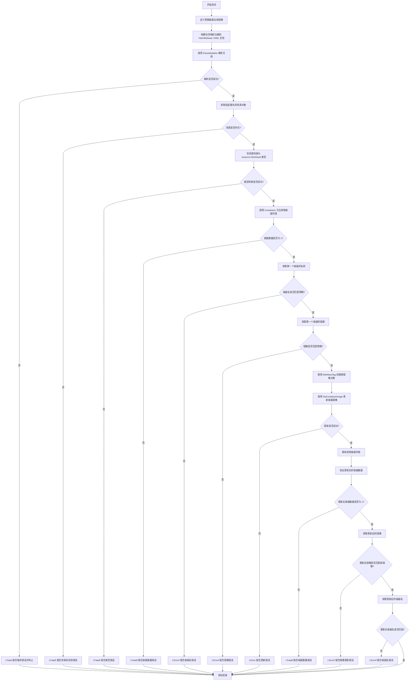

#### 带注释源码

```go
// TestParseMappedImageOnly 测试通过注解映射镜像仓库的解析功能
// 该测试验证了当 HelmRelease 使用 annotations 自定义映射镜像仓库时，
// ParseMultidoc 能够正确解析并构建 Workload 资源，同时支持后续的镜像更新操作
func TestParseMappedImageOnly(t *testing.T) {
	// 定义预期的容器名称和镜像地址
	// 这里测试的是一种特殊的映射场景：通过注解指定自定义的镜像仓库键名
	expectedContainer := "mariadb"
	expectedImage := "bitnami/mariadb:10.1.30-r1"
	
	// 构建 HelmRelease YAML 文档
	// 使用 ImageRepositoryPrefix 注解将容器名映射到自定义的 values 键 "customRepository"
	// 这种方式允许用户在不修改 Helm chart 的情况下，通过注解指定镜像来源
	doc := `---
apiVersion: helm.fluxcd.io/v1
kind: HelmRelease
metadata:
  name: mariadb
  namespace: maria
  annotations:
    ` + ImageRepositoryPrefix + expectedContainer + `: customRepository
spec:
  values:
    first: post
    customRepository: ` + expectedImage + `
    persistence:
      enabled: false
`

	// 调用 ParseMultidoc 解析多文档 YAML
	// 参数：doc 字节切片，解析后的资源将使用 "test" 作为来源标识
	resources, err := ParseMultidoc([]byte(doc), "test")
	
	// 检查解析是否发生错误
	if err != nil {
		t.Fatal(err)
	}
	
	// 从解析结果中获取指定键名的资源
	// 键名格式为 "namespace:kind/name"
	res, ok := resources["maria:helmrelease/mariadb"]
	
	// 验证资源是否存在
	if !ok {
		t.Fatalf("expected resource not found; instead got %#v", resources)
	}
	
	// 将资源断言为 resource.Workload 接口类型
	// Workload 接口定义了容器操作的核心方法
	fhr, ok := res.(resource.Workload)
	
	// 验证类型断言是否成功
	if !ok {
		t.Fatalf("expected resource to be a Workload, instead got %#v", res)
	}

	// 获取 Workload 中的所有容器
	containers := fhr.Containers()
	
	// 验证容器数量是否为 1
	if len(containers) != 1 {
		t.Fatalf("expected 1 container; got %#v", containers)
	}
	
	// 获取第一个容器的名称并验证
	container := containers[0].Name
	if container != expectedContainer {
		t.Errorf("expected container container %q, got %q", expectedContainer, container)
	}
	
	// 获取第一个容器的镜像并验证
	image := containers[0].Image.String()
	if image != expectedImage {
		t.Errorf("expected container image %q, got %q", expectedImage, image)
	}

	// 测试镜像更新功能
	// 使用 WithNewTag 方法创建一个带有新标签的镜像对象
	newImage := containers[0].Image.WithNewTag("some-other-tag")
	
	// 调用 SetContainerImage 方法更新指定容器的镜像
	if err := fhr.SetContainerImage(expectedContainer, newImage); err != nil {
		t.Error(err)
	}

	// 重新获取容器列表，验证更新是否生效
	containers = fhr.Containers()
	
	// 再次验证容器数量
	if len(containers) != 1 {
		t.Fatalf("expected 1 container; got %#v", containers)
	}
	
	// 获取更新后的镜像并验证
	image = containers[0].Image.String()
	if image != newImage.String() {
		t.Errorf("expected container image %q, got %q", newImage.String(), image)
	}
	
	// 验证容器名称在更新后保持不变
	if containers[0].Name != expectedContainer {
		t.Errorf("expected container name %q, got %q", expectedContainer, containers[0].Name)
	}
}
```


根据提供的代码，我找到了函数 `TestParseMappedImageTag`。虽然代码中没有明确的 `ResourceTestSuite` 结构体，但这是一个测试函数，属于测试套件的一部分。

### `TestParseMappedImageTag`

该测试函数验证了 HelmRelease 资源解析功能中对映射镜像标签（mapped image tag）的处理能力。它通过注解自定义镜像仓库和标签键，解析 YAML 文档，提取容器信息，并验证镜像标签的正确解析和更新。

参数：

-  `t`：`testing.T`，Go 语言标准测试框架中的测试实例指针，用于报告测试失败和日志输出

返回值：无（Go 测试函数通常不返回值，而是通过 `t` 参数报告状态）

#### 流程图

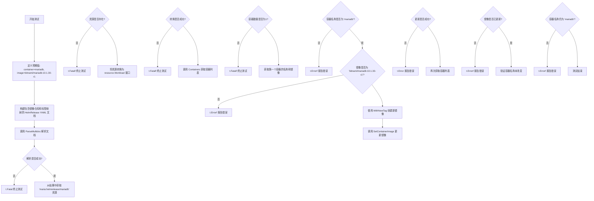

#### 带注释源码

```go
// TestParseMappedImageTag 测试解析映射镜像标签的功能
// 该测试验证了当 HelmRelease 使用注解自定义镜像仓库和标签键时的解析逻辑
func TestParseMappedImageTag(t *testing.T) {
	// 定义预期值：容器名称、镜像名称、镜像标签和完整镜像字符串
	expectedContainer := "mariadb"
	expectedImageName := "bitnami/mariadb"
	expectedImageTag := "10.1.30-r1"
	// 组合完整的镜像地址：镜像名:标签
	expectedImage := expectedImageName + ":" + expectedImageTag
	
	// 构建 HelmRelease YAML 文档
	// 使用注解定义自定义的镜像仓库和标签键映射
	// ImageRepositoryPrefix 和 ImageTagPrefix 是全局常量，用于构建注解键
	doc := `---
apiVersion: helm.fluxcd.io/v1
kind: HelmRelease
metadata:
  name: mariadb
  namespace: maria
  annotations:
    ` + ImageRepositoryPrefix + expectedContainer + `: customRepository
    ` + ImageTagPrefix + expectedContainer + `: customTag
spec:
  values:
    first: post
    customRepository: ` + expectedImageName + `
    customTag: ` + expectedImageTag + `
    persistence:
      enabled: false
`

	// 调用 ParseMultidoc 解析多文档 YAML
	// 第一个参数是文档的字节切片，第二个参数是源标识
	resources, err := ParseMultidoc([]byte(doc), "test")
	// 如果解析失败，调用 t.Fatal 终止测试
	if err != nil {
		t.Fatal(err)
	}
	
	// 从解析结果中获取指定键的资源
	// 键的格式为 "namespace:kind/name"
	res, ok := resources["maria:helmrelease/mariadb"]
	// 如果资源不存在，记录失败信息并终止测试
	if !ok {
		t.Fatalf("expected resource not found; instead got %#v", resources)
	}
	
	// 将资源断言为 resource.Workload 接口类型
	// 这是因为 HelmRelease 实现了 Workload 接口
	fhr, ok := res.(resource.Workload)
	// 如果类型断言失败，记录失败信息并终止测试
	if !ok {
		t.Fatalf("expected resource to be a Workload, instead got %#v", res)
	}

	// 调用 Containers 方法获取容器列表
	containers := fhr.Containers()
	// 验证容器数量是否为1
	if len(containers) != 1 {
		t.Fatalf("expected 1 container; got %#v", containers)
	}
	
	// 获取第一个容器的名称
	container := containers[0].Name
	// 验证容器名称是否符合预期
	if container != expectedContainer {
		t.Errorf("expected container container %q, got %q", expectedContainer, container)
	}
	
	// 获取第一个容器的镜像字符串表示
	image := containers[0].Image.String()
	// 验证镜像地址是否符合预期
	if image != expectedImage {
		t.Errorf("expected container image %q, got %q", expectedImage, image)
	}

	// 使用 WithNewTag 方法创建一个带有新标签的镜像
	newImage := containers[0].Image.WithNewTag("some-other-tag")
	// 调用 SetContainerImage 方法更新容器镜像
	if err := fhr.SetContainerImage(expectedContainer, newImage); err != nil {
		t.Error(err)
	}

	// 再次获取容器列表，验证镜像是否已更新
	containers = fhr.Containers()
	// 验证容器数量仍为1
	if len(containers) != 1 {
		t.Fatalf("expected 1 container; got %#v", containers)
	}
	
	// 获取更新后的镜像字符串
	image = containers[0].Image.String()
	// 验证镜像是否已更新为新标签的镜像
	if image != newImage.String() {
		t.Errorf("expected container image %q, got %q", newImage.String(), image)
	}
	
	// 验证容器名称在更新后是否保持不变
	if containers[0].Name != expectedContainer {
		t.Errorf("expected container name %q, got %q", expectedContainer, containers[0].Name)
	}
}
```


### `TestParseMappedRegistryImage`

该测试函数验证了从 HelmRelease YAML 文档中解析带有自定义注册表（registry）和镜像仓库（repository）映射的容器镜像功能。测试覆盖了通过注解指定自定义镜像源，并验证镜像的构建、设置新标签及更新操作是否正确。

参数：

-  `t`：`testing.T`，Go 测试框架的标准测试参数，用于报告测试失败和日志输出

返回值：无（`void`），该函数为测试函数，不返回任何值

#### 流程图

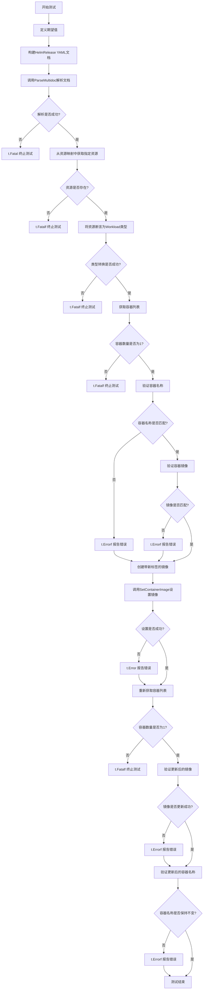

#### 带注释源码

```go
// TestParseMappedRegistryImage 测试解析带有注册表和镜像映射的 HelmRelease 资源
// 该测试验证了以下功能：
// 1. 通过注解自定义注册表前缀 (ImageRegistryPrefix)
// 2. 通过注解自定义镜像仓库前缀 (ImageRepositoryPrefix)
// 3. 正确构建完整的镜像地址 (registry/repository:tag)
// 4. 成功更新容器镜像并保持容器名称不变
func TestParseMappedRegistryImage(t *testing.T) {
    // ===== 1. 定义期望值 =====
    expectedContainer := "mariadb"                    // 期望的容器名称
    expectedRegistry := "docker.io"                   // 期望的镜像仓库地址
    expectedImageName := "bitnami/mariadb:10.1.30-r1" // 期望的镜像名（含标签）
    expectedImage := expectedRegistry + "/" + expectedImageName // 完整镜像地址

    // ===== 2. 构建测试用的 HelmRelease YAML 文档 =====
    // 使用多行字符串定义 YAML，模拟真实的 HelmRelease 资源
    // 关键点：通过 annotations 指定自定义映射
    // - ImageRegistryPrefix + expectedContainer -> customRegistry
    // - ImageRepositoryPrefix + expectedContainer -> customImage
    doc := `---
apiVersion: helm.fluxcd.io/v1
kind: HelmRelease
metadata:
  name: mariadb
  namespace: maria
  annotations:
    ` + ImageRegistryPrefix + expectedContainer + `: customRegistry
    ` + ImageRepositoryPrefix + expectedContainer + `: customImage
spec:
  values:
    first: post
    customRegistry: ` + expectedRegistry + `
    customImage: ` + expectedImageName + `
    persistence:
      enabled: false
`

    // ===== 3. 解析多文档 YAML =====
    // 调用 ParseMultidoc 将 YAML 解析为资源对象
    resources, err := ParseMultidoc([]byte(doc), "test")
    if err != nil {
        t.Fatal(err) // 解析失败则终止测试
    }

    // ===== 4. 获取并验证资源 =====
    // 根据资源键名获取特定的 HelmRelease 资源
    res, ok := resources["maria:helmrelease/mariadb"]
    if !ok {
        t.Fatalf("expected resource not found; instead got %#v", resources)
    }

    // ===== 5. 类型断言 =====
    // 将通用资源类型断言为 Workload 接口类型
    // 以便访问容器相关方法
    fhr, ok := res.(resource.Workload)
    if !ok {
        t.Fatalf("expected resource to be a Workload, instead got %#v", res)
    }

    // ===== 6. 验证容器解析结果 =====
    // 获取解析出的所有容器
    containers := fhr.Containers()
    
    // 验证容器数量
    if len(containers) != 1 {
        t.Fatalf("expected 1 container; got %#v", containers)
    }
    
    // 验证容器名称
    container := containers[0].Name
    if container != expectedContainer {
        t.Errorf("expected container container %q, got %q", expectedContainer, container)
    }
    
    // 验证镜像地址（包含 registry + repository:tag）
    image := containers[0].Image.String()
    if image != expectedImage {
        t.Errorf("expected container image %q, got %q", expectedImage, image)
    }

    // ===== 7. 测试镜像更新功能 =====
    // 创建新镜像：保留原镜像但更换标签
    newImage := containers[0].Image.WithNewTag("some-other-tag")
    
    // 调用 Workload 接口方法更新容器镜像
    if err := fhr.SetContainerImage(expectedContainer, newImage); err != nil {
        t.Error(err)
    }

    // ===== 8. 验证镜像更新结果 =====
    // 重新获取容器列表，检查镜像是否已更新
    containers = fhr.Containers()
    if len(containers) != 1 {
        t.Fatalf("expected 1 container; got %#v", containers)
    }
    
    // 验证镜像是否已更新为新标签
    image = containers[0].Image.String()
    if image != newImage.String() {
        t.Errorf("expected container image %q, got %q", newImage.String(), image)
    }
    
    // 验证容器名称在更新后保持不变
    if containers[0].Name != expectedContainer {
        t.Errorf("expected container name %q, got %q", expectedContainer, containers[0].Name)
    }
}
```


### TestParseMappedRegistryImageTag

该测试函数验证了从 HelmRelease 资源中解析带有自定义注册表、自定义镜像仓库和自定义标签映射的容器镜像的能力。它通过注解指定自定义字段映射，从 values 中提取注册表、镜像名称和标签，组合成完整的镜像字符串，并验证镜像更新功能是否正常工作。

参数：

- `t`：`testing.T`，Go 测试框架的测试句柄，用于报告测试失败和日志输出

返回值：`void`（无返回值，Go 中使用 `nil` 表示）

#### 流程图

```mermaid
flowchart TD
    A[开始测试] --> B[定义预期值: registry, imageName, tag, container]
    B --> C[构建 HelmRelease YAML 文档]
    C --> D[调用 ParseMultidoc 解析文档]
    D --> E{解析是否成功?}
    E -->|否| F[t.Fatal 终止测试]
    E -->|是| G[从 resources 获取 helmrelease 资源]
    G --> H{资源是否存在?}
    H -->|否| I[t.Fatalf 终止测试]
    H -->|是| J[类型断言为 resource.Workload]
    J --> K{类型转换是否成功?}
    K -->|否| L[t.Fatalf 终止测试]
    K -->|是| M[调用 Containers 获取容器列表]
    M --> N{容器数量是否为 1?}
    N -->|否| O[t.Fatalf 终止测试]
    N -->|是| P[验证容器名称是否匹配]
    P --> Q{容器名称正确?}
    Q -->|否| R[t.Errorf 报告错误]
    Q -->|是| S[验证镜像字符串是否匹配]
    S --> T{镜像字符串正确?}
    T -->|否| U[t.Errorf 报告错误]
    T -->|是| V[使用 WithNewTag 创建新镜像]
    V --> W[调用 SetContainerImage 更新镜像]
    W --> X{更新是否成功?}
    X -->|否| Y[t.Error 报告错误]
    X -->|是| Z[再次获取容器列表]
    Z --> AA[验证新镜像字符串]
    AA --> AB{新镜像正确?}
    AB -->|否| AC[t.Errorf 报告错误]
    AB -->|是| AD[验证容器名称未被修改]
    AD --> AE[结束测试]
```

#### 带注释源码

```go
func TestParseMappedRegistryImageTag(t *testing.T) {
	// 定义预期的测试数据
	expectedContainer := "mariadb"                          // 预期的容器名称
	expectedRegistry := "index.docker.io"                   // 预期的镜像注册表
	expectedImageName := "bitnami/mariadb"                 // 预期的镜像名称
	expectedImageTag := "10.1.30-r1"                        // 预期的镜像标签
	// 组合成完整的预期镜像字符串: index.docker.io/bitnami/mariadb:10.1.30-r1
	expectedImage := expectedRegistry + "/" + expectedImageName + ":" + expectedImageTag
	
	// 构建 HelmRelease YAML 文档字符串
	// 使用注解来映射自定义字段: customRegistry, customRepository, customTag
	doc := `---
apiVersion: helm.fluxcd.io/v1
kind: HelmRelease
metadata:
  name: mariadb
  namespace: maria
  annotations:
    ` + ImageRegistryPrefix + expectedContainer + `: customRegistry    # 映射注册表
    ` + ImageRepositoryPrefix + expectedContainer + `: customRepository # 映射镜像仓库
    ` + ImageTagPrefix + expectedContainer + `: customTag              # 映射标签
spec:
  values:
    first: post
    customRegistry: ` + expectedRegistry + `      # 实际注册表值
    customRepository: ` + expectedImageName + `    # 实际镜像仓库值
    customTag: ` + expectedImageTag + `            # 实际标签值
    persistence:
      enabled: false
`

	// 调用 ParseMultidoc 解析多文档 YAML
	resources, err := ParseMultidoc([]byte(doc), "test")
	if err != nil {
		t.Fatal(err) // 解析失败则终止测试
	}
	
	// 从解析结果中获取指定键的资源
	res, ok := resources["maria:helmrelease/mariadb"]
	if !ok {
		t.Fatalf("expected resource not found; instead got %#v", resources)
	}
	
	// 将资源类型断言为 resource.Workload
	fhr, ok := res.(resource.Workload)
	if !ok {
		t.Fatalf("expected resource to be a Workload, instead got %#v", res)
	}

	// 获取容器列表
	containers := fhr.Containers()
	if len(containers) != 1 {
		t.Fatalf("expected 1 container; got %#v", containers)
	}
	
	// 验证容器名称
	container := containers[0].Name
	if container != expectedContainer {
		t.Errorf("expected container container %q, got %q", expectedContainer, container)
	}
	
	// 验证镜像字符串
	image := containers[0].Image.String()
	if image != expectedImage {
		t.Errorf("expected container image %q, got %q", expectedImage, image)
	}

	// 测试镜像更新功能: 创建带新标签的镜像
	newImage := containers[0].Image.WithNewTag("some-other-tag")
	if err := fhr.SetContainerImage(expectedContainer, newImage); err != nil {
		t.Error(err)
	}

	// 再次获取容器列表验证更新结果
	containers = fhr.Containers()
	if len(containers) != 1 {
		t.Fatalf("expected 1 container; got %#v", containers)
	}
	image = containers[0].Image.String()
	if image != newImage.String() {
		t.Errorf("expected container image %q, got %q", newImage.String(), image)
	}
	
	// 验证容器名称在更新后保持不变
	if containers[0].Name != expectedContainer {
		t.Errorf("expected container name %q, got %q", expectedContainer, containers[0].Name)
	}
}
```


# 函数分析文档

### `TestParseMappedTagOnly`

这是一个测试函数，用于验证当只有镜像标签（tag）被映射（通过注解指定）时的解析行为。

参数：

- `t`：`testing.T`，Go 语言标准测试框架中的测试对象，用于报告测试失败

返回值：`void`，该函数没有返回值，通过 `t.Error` 或 `t.Fatalf` 方法报告测试结果

#### 流程图

```mermaid
flowchart TD
    A[开始测试] --> B[定义容器名 'mariadb' 和标签 '10.1.30-r1']
    B --> C[构建 HelmRelease YAML 文档字符串]
    C --> D[调用 ParseMultidoc 解析文档]
    D --> E{解析是否成功?}
    E -->|否| F[t.Fatal 终止测试并输出错误]
    E -->|是| G[从结果中获取 'maria:helmrelease/mariadb' 资源]
    G --> H{资源是否存在?}
    H -->|否| I[t.Fatalf 终止测试 - 资源未找到]
    H --> J[将资源转换为 resource.Workload 接口类型]
    J --> K{转换是否成功?}
    K -->|否| L[t.Fatalf 终止测试 - 类型转换失败]
    K --> M[调用 Containers 方法获取容器列表]
    M --> N{容器数量是否为 0?}
    N -->|否| O[t.Errorf 报告错误 - 期望0个容器但实际得到非0]
    N --> |是| P[测试通过]
    
    style F fill:#ffcccc
    style I fill:#ffcccc
    style L fill:#ffcccc
    style O fill:#ffcccc
    style P fill:#ccffcc
```

#### 带注释源码

```go
// TestParseMappedTagOnly 测试当只有镜像标签被映射时的解析行为
// 预期行为：由于只提供了 tag 映射而没有提供 image/repository 映射，
// 系统无法确定镜像名称，因此不应该解析出任何容器
func TestParseMappedTagOnly(t *testing.T) {
	// 定义测试用的容器名称和镜像标签
	container := "mariadb"
	imageTag := "10.1.30-r1"
	
	// 构建 HelmRelease 资源的 YAML 文档
	// 使用 ImageTagPrefix 注解来映射自定义的 tag 字段
	// 注意：这里只提供了 tag 的映射，没有提供 image/repository 的映射
	doc := `---
apiVersion: helm.fluxcd.io/v1
kind: HelmRelease
metadata:
  name: mariadb
  namespace: maria
  annotations:
    ` + ImageTagPrefix + container + `: customTag
spec:
  values:
    first: post
    customTag: ` + imageTag + `
    persistence:
      enabled: false
`

	// 解析多文档 YAML
	resources, err := ParseMultidoc([]byte(doc), "test")
	
	// 检查解析是否成功
	if err != nil {
		t.Fatal(err)
	}
	
	// 尝试获取指定键名的资源
	res, ok := resources["maria:helmrelease/mariadb"]
	if !ok {
		t.Fatalf("expected resource not found; instead got %#v", resources)
	}
	
	// 将资源转换为 Workload 接口类型
	fhr, ok := res.(resource.Workload)
	if !ok {
		t.Fatalf("expected resource to be a Workload, instead got %#v", res)
	}

	// 获取容器列表
	containers := fhr.Containers()
	
	// 验证容器数量为 0
	// 因为只有 tag 映射而没有 image/repository 映射，
	// 系统无法构造完整的镜像，所以不应该有容器
	if len(containers) != 0 {
		t.Errorf("expected 0 container; got %#v", containers)
	}
}
```


### `TestParseAllFormatsInOne`

该函数是一个集成测试，用于验证 `ParseMultidoc` 函数在同一个 HelmRelease 文档中解析多种不同容器镜像格式的能力。它通过构建一个包含所有支持的镜像定义方式（顶级 image、容器级 image+tag、image 对象、registry 配置、注解映射）的 YAML 文档，并断言解析出的容器列表顺序和内容与预期完全一致。

参数：
-  `t`：`*testing.T`，Go 测试框架的标准参数，用于报告测试失败和记录错误。

返回值：
-  无返回值（Go 函数默认返回）。

#### 流程图

```mermaid
graph TD
    A([开始 TestParseAllFormatsInOne]) --> B[定义预期容器数组 expected]
    B --> C[构建包含多格式镜像的 HelmRelease YAML 文档 doc]
    C --> D[调用 ParseMultidoc 解析 doc]
    D --> E{解析是否出错?}
    E -- 是 --> F[测试失败 t.Fatal]
    E -- 否 --> G[获取资源 test:helmrelease/test]
    G --> H{资源是否存在?}
    H -- 否 --> I[测试失败 t.Fatalf]
    H -- 是 --> J[强制类型转换为 resource.Workload]
    J --> K[调用 hr.Containers 获取容器列表]
    K --> L{容器数量是否等于预期?}
    L -- 否 --> M[测试失败 t.Fatalf]
    L -- 是 --> N[遍历 expected 和实际容器列表]
    N --> O{当前容器名称和镜像是否匹配?}
    O -- 否 --> P[记录错误 t.Errorf]
    O -- 是 --> Q[继续下一个容器]
    Q --> R{所有容器是否遍历完毕?}
    R -- 是 --> S([结束测试])
    R -- 否 --> N
```

#### 带注释源码

```go
// TestParseAllFormatsInOne 测试在单个 HelmRelease 中解析所有支持的镜像格式
func TestParseAllFormatsInOne(t *testing.T) {

	// 定义内部结构体用于存储预期的容器信息
	type container struct {
		name, registry, image, tag string
	}

	// 预期容器的定义顺序很重要，代码注释解释了顺序规则：
	// 1. 如果存在 'image' 条目，则优先处理
	// 2. 按照 values 中的键的顺序处理
	// 为了直接比较，我们精心编排了顺序
	expected := []container{
		{ReleaseContainerName, "", "repo/imageOne", "tagOne"}, // 顶级 image
		{"AAA", "", "repo/imageTwo", "tagTwo"},                 // 容器级 image + tag
		{"DDD", "", "repo/imageThree", "tagThree"},             // 容器级 image object
		{"HHH", "registry.com", "repo/imageFour", "tagFour"},   // 容器级 registry + image + tag
		{"NNN", "registry.com", "repo/imageFive", "tagFive"},   // 容器级 image object (含 registry 无 tag)
		{"XXX", "registry.com", "repo/imageSix", "tagSix"},    // 容器级 image object (含 registry 有 tag)
		{"ZZZ", "", "repo/imageSeven", "tagSeven"},             // 通过注解映射
	}

	// 构建测试用的 YAML 文档字符串
	doc := `---
apiVersion: helm.fluxcd.io/v1
kind: HelmRelease
metadata:
  name: test
  namespace: test
  annotations:
    ` + ImageRepositoryPrefix + expected[6].name + `: ` + expected[6].name + `.customRepository
    ` + ImageTagPrefix + expected[6].name + `: ` + expected[6].name + `.customTag
spec:
  chart:
    git: git@github.com:fluxcd/flux-get-started
    ref: master
    path: charts/ghost
  values:
    # top-level image
    image: ` + expected[0].image + ":" + expected[0].tag + `

    # under .container, as image and tag entries
    ` + expected[1].name + `:
      image: ` + expected[1].image + `
      tag: ` + expected[1].tag + `

    # under .container.image, as repository and tag entries
    ` + expected[2].name + `:
      image:
        repository: ` + expected[2].image + `
        tag: ` + expected[2].tag + `
      persistence:
        enabled: false

    # under .container, with a separate registry entry
    ` + expected[3].name + `:
      registry: ` + expected[3].registry + `
      image: ` + expected[3].image + `
      tag: ` + expected[3].tag + `

    # under .container.image with a separate registry entry,
    # but without a tag
    ` + expected[4].name + `:
      image:
        registry: ` + expected[4].registry + `
        repository: ` + expected[4].image + ":" + expected[4].tag + `

    # under .container.image with a separate registry entry
    ` + expected[5].name + `:
      image:
        registry: ` + expected[5].registry + `
        repository: ` + expected[5].image + `
        tag: ` + expected[5].tag + `

    # mapped by user annotations
    ` + expected[6].name + `:
      customRepository: ` + expected[6].image + `
      customTag: ` + expected[6].tag + `
`

	// 调用 ParseMultidoc 进行解析
	resources, err := ParseMultidoc([]byte(doc), "test")
	if err != nil {
		t.Fatal(err)
	}
	
	// 验证资源存在
	res, ok := resources["test:helmrelease/test"]
	if !ok {
		t.Fatalf("expected resource not found; instead got %#v", resources)
	}
	
	// 验证资源类型为 Workload
	hr, ok := res.(resource.Workload)
	if !ok {
		t.Fatalf("expected resource to be a Workload, instead got %#v", res)
	}

	// 获取容器列表
	containers := hr.Containers()
	
	// 验证容器数量
	if len(containers) != len(expected) {
		t.Fatalf("expected %d containers, got %d", len(expected), len(containers))
	}
	
	// 逐个验证容器属性
	for i, c0 := range expected {
		c1 := containers[i]
		if c1.Name != c0.name {
			t.Errorf("names do not match %q != %q", c0, c1)
		}
		var c0image string
		if c0.registry != "" {
			c0image = c0.registry + "/"
		}
		c0image += fmt.Sprintf("%s:%s", c0.image, c0.tag)
		if c1.Image.String() != c0image {
			t.Errorf("images do not match %q != %q", c0image, c1.Image.String())
		}
	}
}
```

#### 全局变量与函数依赖

-  **全局常量**:
    -   `ReleaseContainerName`: 默认的发布容器名称。
    -   `ImageRepositoryPrefix`: 用于映射镜像仓库的注解前缀。
    -   `ImageTagPrefix`: 用于映射镜像标签的注解前缀。
    -   `ImageRegistryPrefix`: 用于映射镜像仓库地址的注解前缀。
-  **全局函数**:
    -   `ParseMultidoc(doc []byte, source string) (map[string]interface{}, error)`: 核心解析函数，将多文档 YAML 解析为资源映射。
-   **外部包**:
    -   `resource.Workload`: 接口，代表一个可部署的工作负载，包含 `Containers()` 方法。

#### 潜在技术债务与优化

1.  **测试数据硬编码**: YAML 文档的构造直接写在测试函数中，导致代码冗长且难以阅读。如果需要测试新的格式，修改成本较高。建议使用辅助函数（Builder 或 Template）来构造 YAML。
2.  **顺序耦合**: 测试的有效性依赖于 YAML 中键的顺序（Go Map 遍历顺序在 Go1 以前是不保证的，虽然此代码可能针对特定版本，但仍是潜在风险）。虽然代码注释解释了顺序逻辑，但这增加了维护难度。
3.  **错误信息不够具体**: 在循环验证阶段，如果镜像不匹配，只会抛出通用的错误信息，调试时需要手动对照 `expected` 数组和实际结果。

## 关键组件


### ParseMultidoc 函数

解析多文档 YAML 格式的 HelmRelease 资源，支持从 YAML 文档中提取多个资源并返回资源映射表

### sorted_containers 函数

对无序的容器映射进行排序，返回按特定顺序排列的容器名称列表

### imageAndSetter 结构体

存储镜像信息和对应的 setter 回调，用于惰性加载和更新镜像

### ReleaseContainerName 常量

定义默认发布的容器名称，用于标识 Helm Release 中的主容器

### 镜像格式解析器

支持多种镜像配置格式的解析，包括：
- 简单镜像格式（image: tag）
- 分离格式（image 和 tag 字段）
- Registry 格式（registry/image: tag）
- 对象格式（image.repository, image.tag）
- 命名容器格式（容器名: {image, tag}）
- 映射格式（通过 annotations 指定自定义字段）

### SetContainerImage 方法

在 HelmRelease 中更新指定容器的镜像信息

### Containers 方法

从 HelmRelease 配置中提取并返回所有容器的列表

### ImageRepositoryPrefix、ImageTagPrefix、ImageRegistryPrefix 常量

用于注解中的镜像仓库、标签和注册表的映射前缀，支持用户自定义字段映射

### resource.Workload 接口

定义工作负载的统一抽象，包含获取容器列表和设置镜像的方法

### image.Image 对象

表示容器镜像，包含域名、仓库和标签信息，提供 WithNewTag 等方法创建新镜像

### 注解驱动的镜像映射机制

通过 Kubernetes annotations 实现自定义字段名到标准镜像字段的映射，支持灵活的配置方式

## 问题及建议


### 已知问题

- **重复的测试代码模式**：多个测试函数中存在大量重复的代码模式（解析文档、获取资源、类型断言、检查容器），导致代码冗余，维护成本高。
- **YAML 结构错误**：部分测试中的 YAML 文档存在重复的 `spec:` 字段（如 `TestParseRegistryImageTagFormat`、`TestParseNamedImageFormat`、`TestParseNamedImageTagFormat` 等），这在实际使用中会导致解析错误。
- **魔法字符串和常量未定义**：`ImageRepositoryPrefix`、`ImageTagPrefix`、`ImageRegistryPrefix`、`ReleaseContainerName` 等常量在测试中使用，但未在此文件中定义，可能导致理解困难和潜在的导入问题。
- **不一致的错误处理**：部分地方使用 `t.Fatal(err)`，部分使用 `t.Error(err)`，类型断言失败时的错误信息不够明确（如 `t.Fatalf("expected resource to be a Workload, instead got %#v", res)`）。
- **不完整的测试覆盖**：`TestParseMappedTagOnly` 期望返回 0 个容器，这种边界情况的行为可能不符合实际需求，且缺少对空字符串、无效 YAML、解析错误等边界条件的测试。
- **测试断言不够精确**：部分测试仅验证容器数量和镜像字符串，未验证其他属性（如端口、环境变量等），可能导致遗漏潜在问题。
- **缺少对 `sorted_containers` 和 `ParseMultidoc` 函数的直接测试**：这两个函数被广泛使用，但没有独立的单元测试来验证其行为。

### 优化建议

- **提取公共测试逻辑**：将重复的资源解析、类型断言、容器检查等代码抽取为辅助函数（如 `parseAndGetResource`、`assertContainer`），减少代码重复。
- **修复 YAML 文档错误**：确保所有测试中的 YAML 文档结构正确，移除重复的 `spec:` 字段。
- **统一定义常量**：将使用的常量集中定义在文件顶部或单独的常量文件中，并添加清晰的注释说明其用途。
- **统一错误处理策略**：根据错误严重性选择合适的处理方式（`Fatal` vs `Error`），并提供更具描述性的错误信息。
- **增加边界条件测试**：添加对空输入、无效 YAML、解析失败、超大文件等边界情况的测试用例。
- **完善断言和验证**：增加对容器更多属性的验证，确保解析结果的完整性和正确性。
- **添加单元测试**：为 `sorted_containers` 和 `ParseMultidoc` 函数添加独立的单元测试，提高代码的可测试性和可维护性。

## 其它


### 设计目标与约束

本代码模块的设计目标是验证HelmRelease资源中容器镜像解析功能的正确性，支持多种镜像配置格式的解析，包括纯镜像字符串、镜像名+标签分离、注册中心+镜像+标签、以及通过注解映射的自定义仓库等场景。测试约束包括仅验证解析逻辑，不涉及实际的镜像拉取和部署操作；测试数据使用静态YAML文档，不依赖外部服务；每个测试用例专注于验证一种特定的镜像配置格式。

### 错误处理与异常设计

测试代码中的错误处理采用Go标准测试框架的Fatal和Error方法。当ParseMultidoc返回错误时，使用t.Fatal立即终止测试；当断言失败时，使用t.Errorf记录错误但继续执行后续检查。异常场景包括YAML格式错误、资源类型不匹配、容器数量不符、镜像字符串不匹配、容器名称不匹配等情况。测试用例覆盖了正常路径和部分边界情况，但未覆盖恶意构造的YAML或超大规模资源配置的性能测试。

### 数据流与状态机

数据流从YAML文档输入开始，经过ParseMultidoc函数解析为HelmRelease资源对象，然后通过类型断言转换为resource.Workload接口，最后调用Containers()方法提取容器信息进行断言验证。状态转换过程为：原始YAML → 解析中间结果 → HelmRelease对象 → Workload接口 → 容器切片 → 镜像对象。sorted_containers函数对无序的容器映射进行排序，输出固定顺序的容器列表用于测试断言。

### 外部依赖与接口契约

核心依赖包括github.com/stretchr/testify/assert用于断言比较，github.com/fluxcd/flux/pkg/resource包提供Workload接口和容器相关类型。ParseMultidoc函数接收字节切片和字符串参数，返回map[string]interface{}资源和error接口。Workload接口定义Containers() []Container和SetContainerImage(name string, image Image) error方法。Container结构体包含Name和Image字段，Image类型提供String()和WithNewTag(tag string)方法。

### 关键组件信息

### 全局变量

### 全局函数

### 类方法

### 潜在的技术债务或优化空间

### 其它项目


    