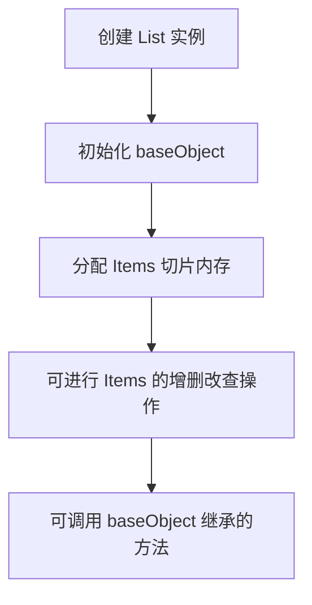

# `flux\pkg\cluster\kubernetes\resource\list.go` 详细设计文档

定义了一个 Kubernetes 资源列表容器结构体，用于存储和管理多个 Kubernetes 资源清单（KubeManifest），通过嵌入 baseObject 继承基础对象的能力。

## 整体流程



## 类结构

```
baseObject (嵌入的基类)
└── List (资源列表结构体)
```

## 全局变量及字段


### `List.baseObject`
    
嵌入的匿名字段，提供基础对象能力

类型：`baseObject`
    


### `List.Items`
    
Kubernetes 资源清单切片

类型：`[]KubeManifest`
    
    

## 全局函数及方法


## 关键组件


### List 结构体

List 是核心资源集合结构体，用于存储和管理多个 Kubernetes 资源清单。包含一个嵌入的 baseObject 以及 Items 字段用于存放 KubeManifest 资源列表。

### baseObject 嵌入字段

baseObject 是匿名嵌入的基础对象，可能包含元数据如名称、命名空间、标签等通用资源属性。通过嵌入方式实现面向对象继承机制。

### Items 字段

Items 是 []KubeManifest 类型的切片字段，用于存储具体的 Kubernetes 资源清单列表。该字段为核心数据容器，包含所有待处理或管理的资源对象。

### KubeManifest 类型

KubeManifest 是未在此代码片段中定义但被引用的类型，代表 Kubernetes 资源清单的内部数据结构，可能包含资源元数据（Kind、ApiVersion、Metadata）和 Spec/Status 等规范内容。


## 问题及建议


### 已知问题

-   **缺少类型文档注释** - `List`结构体没有godoc注释，不符合Go语言最佳实践
-   **依赖隐式引入** - 依赖`baseObject`和`KubeManifest`但未在当前文件中说明其来源和用途
-   **功能极度受限** - 结构体仅包含数据字段，缺少任何操作方法（如Items计数、判空、添加、删除等）
-   **无接口实现** - 未实现任何标准库或项目内的接口（如`fmt.Stringer`、`json.Marshaler`等）
-   **无错误处理机制** - 代码中未体现错误处理设计
-   **无线程安全保证** - 如果Items会被并发访问，存在数据竞争风险
-   **类型扩展性差** - 未使用Go泛型（Go 1.18+）实现通用资源列表

### 优化建议

-   为`List`类型添加完整的godoc注释，说明其用途和使用场景
-   考虑实现常用方法：`Len()`、`IsEmpty()`、`Append()`、`Get()`等
-   评估是否需要实现`json.Marshaler`/`Unmarshaler`接口以自定义序列化行为
-   如涉及并发场景，添加并发安全保护（sync.Mutex或sync.RWMutex）
-   考虑使用泛型重构为`List[T KubeManifest]`或类似形式以提升复用性
-   补充单元测试覆盖List类型的核心功能
-   明确`baseObject`嵌入的意图（继承或组合），确保API设计一致性


## 其它


### 设计目标与约束

本代码旨在提供一个资源列表的容器结构，用于存储和管理多个Kubernetes资源清单（KubeManifest）。设计约束包括：必须嵌入baseObject以继承基础对象的功能；Items字段必须是KubeManifest类型的切片；该结构体应作为Kubernetes资源集合的通用容器使用。

### 错误处理与异常设计

由于该结构体为简单的数据容器，不涉及复杂的业务逻辑，因此错误处理主要依赖于调用方对baseObject和KubeManifest的验证。建议在创建List实例时进行必要的初始化检查，确保baseObject有效且Items切片已正确分配。

### 数据流与状态机

数据流主要表现为：外部调用方创建List实例并填充Items，baseObject提供基础元数据和通用操作接口。List本身不维护状态机，其状态由所包含的KubeManifest和baseObject共同决定。

### 外部依赖与接口契约

主要依赖包括：baseObject类型（需在baseObject包中定义）和KubeManifest类型（需在KubeManifest包中定义）。接口契约要求：Items字段必须是可变的切片以支持动态添加资源；baseObject提供统一的资源元数据访问接口。

### 性能考虑

Items切片应预先分配合理容量以避免频繁扩容；如需频繁查询，可考虑添加索引机制；该结构体作为值类型传递时可能产生复制开销，大型场景下建议使用指针类型。

### 安全考虑

Items中的KubeManifest应验证来源和内容合法性；baseObject应包含资源版本和命名空间等安全相关元数据；避免序列化敏感信息到日志或外部输出。

### 兼容性设计

应保持与Kubernetes API对象的兼容性；考虑实现相应的序列化/反序列化方法（如JSON、YAML）；baseObject的变更应保持向后兼容。

### 并发控制

List结构体本身不包含并发控制机制；如在多协程场景下使用，需自行实现同步（如sync.Mutex或sync.RWMutex）；建议使用指针传递以避免不必要的复制。

### 资源管理

Items切片应支持动态增长和收缩；必要时提供Clear方法释放内存；baseObject应妥善管理关联的资源句柄或连接。

### 测试策略

应编写单元测试验证List的创建和初始化；测试Items的添加、删除和查询操作；验证与baseObject的集成功能；包含边界条件测试（如空Items、大容量场景）。


    