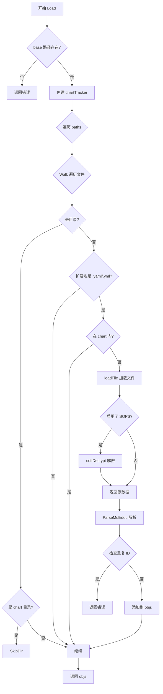
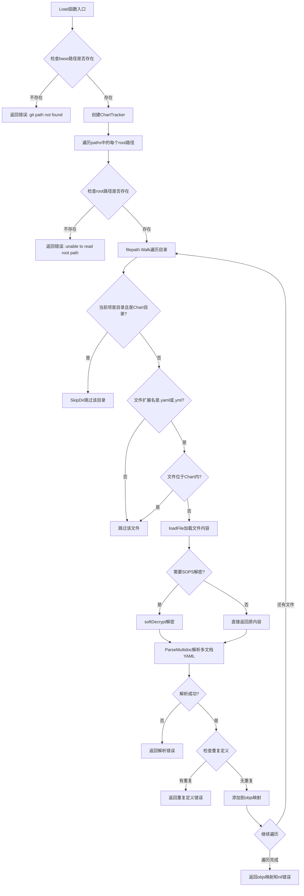
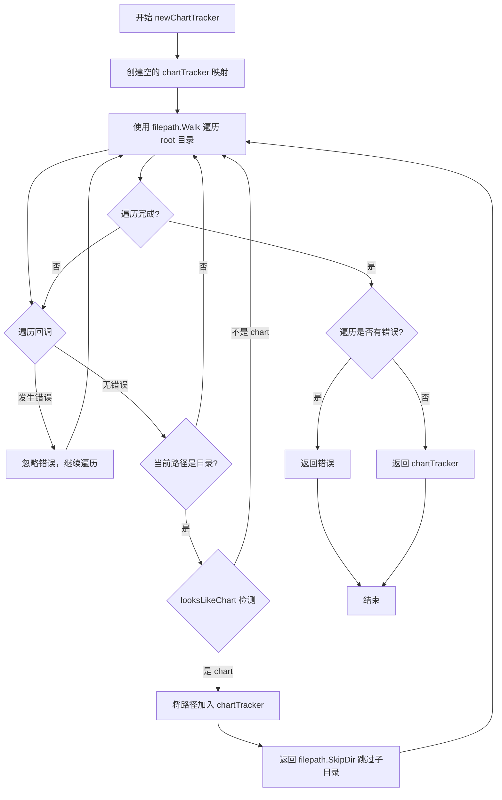
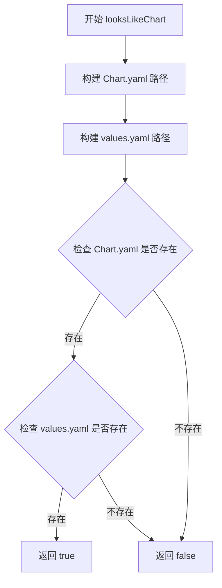
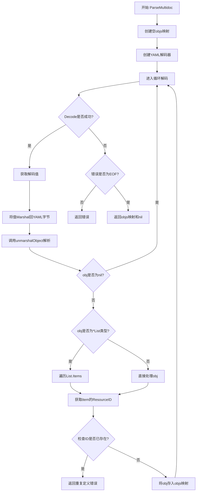
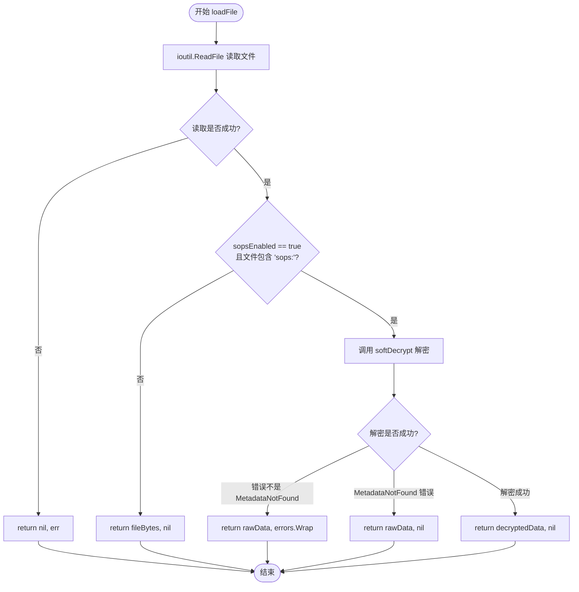
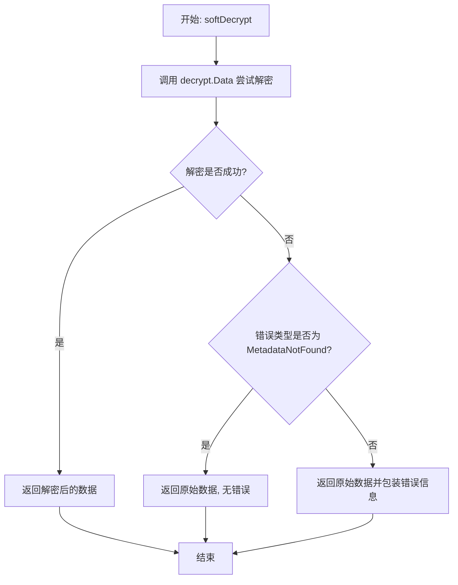
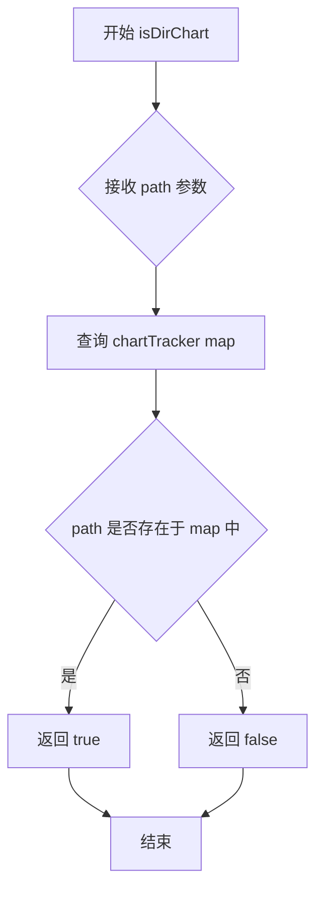

# `flux\pkg\cluster\kubernetes\resource\load.go` 详细设计文档

一个用于加载和解析 Kubernetes YAML manifest 文件的 Go 包，支持多文档 YAML、Helm chart 目录识别和 SOPS 加密文件解密，将文件内容转换为 KubeManifest 对象映射。

## 整体流程



## 类结构

```
chartTracker (map[string]bool)
└── 方法: isDirChart, isPathInChart
```

## 全局变量及字段


### `chartdirs`
    
一个 chartTracker 实例，用于存储包含 Helm chart 的目录路径，以路径字符串为键，布尔值为值来标记是否为 chart 目录

类型：`chartTracker`
    


    

## 全局函数及方法


### `Load`

该函数是资源加载的核心入口，接收基础路径、文件路径列表和SOPS解密开关，遍历指定路径下的所有YAML文件，自动跳过Helm Chart目录，解析多文档YAML并返回以资源ID为键的Kubernetes清单映射，同时支持对SOPS加密文件进行透明解密。

参数：

- `base`：`string`，基础路径，用于计算相对路径和创建Chart追踪器
- `paths`：`[]string`，需要扫描的文件或目录路径列表
- `sopsEnabled`：`bool`，是否启用SOPS解密功能

返回值：`map[string]KubeManifest, error`，成功时返回以资源ID为键的KubeManifest映射，失败时返回错误信息

#### 流程图



#### 带注释源码

```go
// Load takes paths to directories or files, and creates an object set
// based on the file(s) therein. Resources are named according to the
// file content, rather than the file name of directory structure. if
// sopsEnabled is set to true, sops-encrypted files will be decrypted.
func Load(base string, paths []string, sopsEnabled bool) (map[string]KubeManifest, error) {
	// 验证base路径是否存在，若不存在则返回错误
	if _, err := os.Stat(base); os.IsNotExist(err) {
		return nil, fmt.Errorf("git path %q not found", base)
	}
	
	// 初始化结果映射，存储所有解析后的KubeManifest对象
	objs := map[string]KubeManifest{}
	
	// 创建ChartTracker用于追踪哪些目录是Helm Chart目录
	charts, err := newChartTracker(base)
	if err != nil {
		return nil, errors.Wrapf(err, "walking %q for chartdirs", base)
	}
	
	// 遍历所有传入的路径（可能是文件或目录）
	for _, root := range paths {
		// 验证传入的root路径是否存在，若不存在则返回错误
		// 这里与Walk中的错误处理不同：显式指定的路径必须存在
		if _, err := os.Stat(root); err != nil {
			return nil, errors.Wrapf(err, "unable to read root path %q", root)
		}
		
		// 使用filepath.Walk递归遍历目录树
		err := filepath.Walk(root, func(path string, info os.FileInfo, err error) error {
			// 如果是目录，检查是否是Chart目录
			if err == nil && info.IsDir() {
				// 如果是Chart目录，跳过整个目录（不遍历其内容）
				if charts.isDirChart(path) {
					return filepath.SkipDir
				}
				return nil
			}

			// 只处理YAML文件，过滤其他文件类型
			if filepath.Ext(path) != ".yaml" && filepath.Ext(path) != ".yml" {
				return nil
			}
			
			// 如果文件位于Chart目录内，则跳过
			if charts.isPathInChart(path) {
				return nil
			}

			// 如果遍历过程中出现错误，则包装并返回
			if err != nil {
				return errors.Wrapf(err, "walking file %q for yaml docs", path)
			}

			// 加载文件内容，支持SOPS解密
			bytes, err := loadFile(path, sopsEnabled)
			if err != nil {
				return errors.Wrapf(err, "unable to read file at %q", path)
			}
			
			// 计算相对于base的路径作为source标识
			source, err := filepath.Rel(base, path)
			if err != nil {
				return errors.Wrapf(err, "path to scan %q is not under base %q", path, base)
			}
			
			// 解析多文档YAML
			docsInFile, err := ParseMultidoc(bytes, source)
			if err != nil {
				return err
			}
			
			// 检查重复定义并添加到结果映射
			for id, obj := range docsInFile {
				if alreadyDefined, ok := objs[id]; ok {
					return fmt.Errorf(`duplicate definition of '%s' (in %s and %s)`, id, alreadyDefined.Source(), source)
				}
				objs[id] = obj
			}
			return nil
		})
		
		// 如果Walk过程中发生错误，立即返回
		if err != nil {
			return objs, err
		}
	}

	return objs, nil
}
```

---

## 文件整体运行流程

该文件（`resource`包）是Kubernetes资源配置加载的核心模块，主要流程如下：

1. **入口函数`Load`**：接收基础路径和待扫描路径列表，初始化资源映射
2. **Chart追踪器初始化**：扫描基础目录，识别所有Helm Chart目录并记录
3. **目录遍历**：对每个传入路径进行深度优先遍历
4. **文件过滤**：跳过非YAML文件、Chart目录内的文件
5. **文件加载与解密**：读取YAML文件内容，如启用SOPS则解密
6. **多文档解析**：将多文档YAML拆分为单个资源对象
7. **资源去重检查**：确保资源ID唯一，防止重复定义
8. **结果返回**：返回以资源ID为键的KubeManifest映射

---

## 相关类型和函数详情

### `chartTracker`

类型：`map[string]bool`

描述：用于记录哪些目录是Helm Chart目录的映射类型

方法：

- `isDirChart(path string) bool`：判断指定路径是否是Chart目录
- `isPathInChart(path string) bool`：判断指定路径是否位于某个Chart目录内

### `newChartTracker(root string) (chartTracker, error)`

参数：
- `root`：`string`，要扫描的基础目录

返回值：`chartTracker, error`，返回Chart目录映射和可能的错误

### `looksLikeChart(dir string) bool`

参数：
- `dir`：`string`，目录路径

返回值：`bool`，如果目录包含`Chart.yaml`和`values.yaml`则返回true

### `ParseMultidoc(multidoc []byte, source string) (map[string]KubeManifest, error)`

参数：
- `multidoc`：`[]byte`，多文档YAML内容
- `source`：`string`，文件来源路径

返回值：`map[string]KubeManifest, error`，解析后的资源映射

### `loadFile(path string, sopsEnabled bool) ([]byte, error)`

参数：
- `path`：`string`，文件路径
- `sopsEnabled`：`bool`，是否启用SOPS解密

返回值：`[]byte, error`，文件内容或错误

### `softDecrypt(rawData []byte) ([]byte, error)`

参数：
- `rawData`：`[]byte`，原始文件数据

返回值：`[]byte, error`，解密后的数据（若未加密则返回原数据）

---

## 关键组件信息

| 组件名称 | 一句话描述 |
|---------|-----------|
| Load | 资源加载主入口，遍历路径解析YAML并返回资源映射 |
| chartTracker | Helm Chart目录追踪器，用于过滤Chart内容 |
| ParseMultidoc | 多文档YAML解析器，将多文档YAML拆分为独立资源 |
| loadFile | 文件加载器，支持SOPS透明解密 |
| softDecrypt | SOPS软解密器，处理加密和非加密文件 |

---

## 潜在的技术债务或优化空间

1. **错误处理粒度**：Walk回调中的错误处理逻辑较复杂，部分错误被吞掉（nil return），可能导致部分文件解析失败但无法感知
2. **性能优化**：每次调用Load都会重新扫描Chart目录，可考虑缓存机制
3. **YAML解析**：使用gopkg.in/yaml.v2而非v3，丢失了注释信息（代码注释中已提及）
4. **资源ID生成**：依赖ResourceID()方法，若该方法实现有误会导致去重逻辑失效
5. **文件编码假设**：假设文件为UTF-8编码，未处理其他编码情况
6. **Chart检测逻辑**：仅通过Chart.yaml和values.yaml两个文件判断是否为Chart，可能存在误判

---

## 其它项目

### 设计目标与约束
- **目标**：支持从指定路径加载Kubernetes资源清单，支持多文档YAML和SOPS加密文件
- **约束**：资源ID必须唯一，不允许重复定义；显式指定的路径必须存在

### 错误处理与异常设计
- 基础路径不存在时立即返回错误
- 显式指定的root路径不存在时返回错误
- 遍历中的非关键错误被忽略（无法读取的文件）
- 解析错误、重复定义错误会被传播

### 数据流与状态机
- 数据流：`paths` → `filepath.Walk` → `loadFile` → `ParseMultidoc` → `objs`
- 状态机：路径验证 → 目录遍历 → 文件过滤 → 内容加载 → YAML解析 → 资源注册

### 外部依赖与接口契约
- 依赖`go.mozilla.org/sops/v3/decrypt`：SOPS解密
- 依赖`gopkg.in/yaml.v2`：YAML解析
- 依赖`github.com/pkg/errors`：错误包装
- 返回`map[string]KubeManifest`，其中KubeManifest需实现`ResourceID()`和`Source()`方法


### `newChartTracker`

该函数用于扫描指定根目录下的所有 Helm chart 目录，通过检测每个目录是否同时包含 Chart.yaml 和 values.yaml 文件来判断是否为 Helm chart，并将识别出的 chart 目录路径存储到 chartTracker 映射中返回。

参数：

- `root`：`string`，需要扫描的根目录路径

返回值：`chartTracker`，返回一个 chartTracker 类型的映射，用于标识哪些目录是 Helm chart 目录；若扫描过程中发生错误，则返回错误信息。

#### 流程图



#### 带注释源码

```go
// newChartTracker 创建一个 chartTracker，用于跟踪包含 Helm chart 的目录
// 参数 root: 需要扫描的根目录路径
// 返回值: chartTracker - 包含所有已识别 chart 目录的映射, error - 遍历过程中的错误
func newChartTracker(root string) (chartTracker, error) {
	// 初始化空的 chartTracker，这是一个 map[string]bool 类型
	chartdirs := make(chartTracker)
	
	// 枚举包含 chart 的目录。由于回调函数会吞掉错误，
	// 所以这里永远不会返回错误。
	err := filepath.Walk(root, func(path string, info os.FileInfo, err error) error {
		// 如果遇到错误，假设该文件或目录现在无法遍历，
		// 那么在查找 yaml 文件时也无法访问它。
		// 如果确实需要访问，可以在那里重新抛出错误。
		if err != nil {
			return nil
		}

		// 如果是目录且看起来像 chart（包含 Chart.yaml 和 values.yaml）
		if info.IsDir() && looksLikeChart(path) {
			// 将该目录标记为 chart 目录
			chartdirs[path] = true
			// 跳过此目录，因为它是 chart，不需要继续遍历其内部文件
			return filepath.SkipDir
		}

		// 其他情况继续遍历
		return nil
	})
	
	// 如果遍历过程中出现错误，返回错误
	if err != nil {
		return nil, err
	}
	
	// 返回收集到的 chart 目录映射
	return chartdirs, nil
}
```


### `looksLikeChart`

该函数用于判断给定的目录路径是否看起来像一个 Helm chart 目录。它通过检查目录中是否存在 Helm chart 的两个必需文件（Chart.yaml 和 values.yaml）来确定。如果这两个文件都存在，则认为该目录是一个 Helm chart。

参数：

- `dir`：`string`，要检查的目录路径

返回值：`bool`，如果目录看起来像包含 Helm chart 则返回 true，否则返回 false

#### 流程图



#### 带注释源码

```
// looksLikeChart returns `true` if the path `dir` (assumed to be a
// directory) looks like it contains a Helm chart, rather than
// manifest files.
// looksLikeChart 检查给定目录是否包含 Helm chart 所需的必要文件
func looksLikeChart(dir string) bool {
	// These are the two mandatory parts of a chart. If they both
	// exist, chances are it's a chart. See
	// https://github.com/kubernetes/helm/blob/master/docs/charts.md#the-chart-file-structure
	// Chart.yaml 和 values.yaml 是 Helm chart 的两个必需文件
	// 如果两者都存在，则很可能是一个 chart
	chartpath := filepath.Join(dir, "Chart.yaml")
	valuespath := filepath.Join(dir, "values.yaml")
	
	// 检查 Chart.yaml 是否存在
	// 如果文件不存在（os.IsNotExist(err) 为 true），则返回 false
	if _, err := os.Stat(chartpath); err != nil && os.IsNotExist(err) {
		return false
	}
	
	// 检查 values.yaml 是否存在
	// 如果文件不存在（os.IsNotExist(err) 为 true），则返回 false
	if _, err := os.Stat(valuespath); err != nil && os.IsNotExist(err) {
		return false
	}
	
	// 两个必需文件都存在，返回 true
	return true
}
```


### `ParseMultidoc`

`ParseMultidoc`是一个全局函数，用于解析多文档YAML（multidoc YAML），将每个文档解析为`KubeManifest`对象并存储在以资源ID为键的映射中。该函数处理普通的KubeManifest对象和List类型的资源，特别处理List中包含的子资源。

参数：

- `multidoc`：`[]byte`，多文档YAML的字节数组，包含一个或多个YAML文档
- `source`：`string`，来源文件的路径，用于错误信息和标识文档出处

返回值：`map[string]KubeManifest, error`：返回以资源ID为键、KubeManifest对象为值的映射；如果解析过程中出现错误（如重复定义、YAML解析失败等），则返回错误信息

#### 流程图



#### 带注释源码

```go
// ParseMultidoc takes a dump of config (a multidoc YAML) and
// constructs an object set from the resources represented therein.
// ParseMultidoc接收一个多文档YAML配置，并从中构建对象集合
func ParseMultidoc(multidoc []byte, source string) (map[string]KubeManifest, error) {
	// 初始化结果映射，以资源ID为键存储所有解析出的KubeManifest对象
	objs := map[string]KubeManifest{}
	
	// 创建YAML解码器，用于流式解码多文档YAML
	decoder := yaml.NewDecoder(bytes.NewReader(multidoc))
	
	// 声明变量在循环中使用
	var obj KubeManifest
	var err error
	
	// 循环遍历多文档YAML中的每个文档
	for {
		// In order to use the decoder to extract raw documents
		// from the stream, we decode generically and encode again.
		// The result is the raw document from the stream
		// (pretty-printed and without comments)
		// NOTE: gopkg.in/yaml.v3 supports round tripping comments
		//       by using `gopkg.in/yaml.v3.Node`.
		// 为了从流中提取原始文档，我们先通用解码再重新编码
		// 结果是来自流的原始文档（格式化后且无注释）
		// 注意：gopkg.in/yaml.v3通过使用Node支持注释的往返
		var val interface{}
		// 尝试解码下一个文档
		if err = decoder.Decode(&val); err != nil {
			// 当遇到EOF时退出循环，这是正常情况
			break
		}
		
		// 将解码后的通用值重新序列化为YAML字节
		bytes, err := yaml.Marshal(val)
		if err != nil {
			return nil, errors.Wrapf(err, "parsing YAML doc from %q", source)
		}

		// 将YAML字节解析为KubeManifest对象
		if obj, err = unmarshalObject(source, bytes); err != nil {
			return nil, errors.Wrapf(err, "parsing YAML doc from %q", source)
		}
		
		// 如果对象为空则跳过继续处理下一个文档
		if obj == nil {
			continue
		}
		
		// Lists must be treated specially, since it's the
		// contained resources we are after.
		// List类型需要特殊处理，因为我们需要的是其中包含的资源
		if list, ok := obj.(*List); ok {
			// 遍历List中的每个资源项
			for _, item := range list.Items {
				// 获取资源的唯一标识ID
				id := item.ResourceID().String()
				// 检查是否存在重复定义
				if _, ok := objs[id]; ok {
					return nil, fmt.Errorf(`duplicate definition of '%s' (in %s)`, id, source)
				}
				// 将资源项添加到结果映射中
				objs[id] = item
			}
		} else {
			// 处理普通KubeManifest对象（非List类型）
			id := obj.ResourceID().String()
			// 检查是否存在重复定义
			if _, ok := objs[id]; ok {
				return nil, fmt.Errorf(`duplicate definition of '%s' (in %s)`, id, source)
			}
			// 将对象添加到结果映射中
			objs[id] = obj
		}
	}

	// 如果错误不是EOF，说明在解析过程中发生了真正的错误
	if err != io.EOF {
		return objs, errors.Wrapf(err, "scanning multidoc from %q", source)
	}
	
	// 解析成功，返回所有对象和nil错误
	return objs, nil
}
```


### `loadFile`

加载指定路径的文件。如果启用了 SOPS 加密，将尝试在返回数据之前解密文件。

参数：

- `path`：`string`，要加载的文件路径
- `sopsEnabled`：`bool`，是否启用 SOPS 解密

返回值：`[]byte`，文件内容的字节数组

#### 流程图



#### 带注释源码

```go
// loadFile attempts to load a file from the path supplied. If sopsEnabled is set,
// it will try to decrypt it before returning the data
func loadFile(path string, sopsEnabled bool) ([]byte, error) {
	// 步骤1: 使用 ioutil.ReadFile 读取指定路径的文件内容
	fileBytes, err := ioutil.ReadFile(path)
	
	// 步骤2: 如果读取文件失败，直接返回错误
	if err != nil {
		return nil, err
	}
	
	// 步骤3: 检查是否启用了 SOPS 解密且文件包含 "sops:" 标记
	if sopsEnabled && bytes.Contains(fileBytes, []byte("sops:")) {
		// 步骤4: 调用 softDecrypt 尝试解密文件
		return softDecrypt(fileBytes)
	}
	
	// 步骤5: 如果未启用 SOPS 或文件未加密，直接返回原始文件内容
	return fileBytes, nil
}
```


### `softDecrypt`

该函数尝试使用 sops 工具对输入的原始数据进行软解密，如果数据未使用 sops 加密（即解密时返回 `sops.MetadataNotFound` 错误），则直接返回原始数据；否则返回解密后的数据或解密失败时的错误。

参数：
- `rawData`：`[]byte`，需要解密的文件内容字节数组

返回值：
- `([]byte, error)`：成功解密时返回解密后的字节数组和 nil 错误；失败时返回原始数据和一个包含错误信息的 error 对象

#### 流程图



#### 带注释源码

```go
// softDecrypt takes data from a file and tries to decrypt it with sops,
// if the file has not been encrypted with sops, the original data will be returned
func softDecrypt(rawData []byte) ([]byte, error) {
	// 尝试使用 sops 的 decrypt.Data 方法解密数据，指定格式为 "yaml"
	decryptedData, err := decrypt.Data(rawData, "yaml")
	// 如果解密失败且错误类型为 MetadataNotFound，表示数据未加密，直接返回原始数据
	if err == sops.MetadataNotFound {
		return rawData, nil
	} else if err != nil {
		// 其他解密错误，返回原始数据并包装错误信息
		return rawData, errors.Wrap(err, "failed to decrypt file")
	}
	// 解密成功，返回解密后的数据
	return decryptedData, nil
}
```


### `chartTracker.isDirChart`

该方法用于判断指定路径是否为 Helm Chart 目录，通过查询 `chartTracker` 内部存储的 Chart 目录映射快速返回布尔结果。

参数：

- `path`：`string`，需要检查的目录路径

返回值：`bool`，如果该路径在 `chartTracker` 中被标记为 Chart 目录则返回 `true`，否则返回 `false`

#### 流程图



#### 带注释源码

```go
// isDirChart 判断给定的路径是否是一个已记录的 Helm Chart 目录
// 参数 path: 要检查的目录路径
// 返回值: bool - 如果 path 是 Chart 目录则返回 true，否则返回 false
func (c chartTracker) isDirChart(path string) bool {
    // 直接通过 map 的键查询实现快速查找
    // chartTracker 本质上是一个 map[string]bool
    // 其中 key 是 Chart 目录的绝对路径，value 始终为 true
    return c[path]
}
```


### `chartTracker.isPathInChart`

该方法用于判断给定的文件路径是否位于已识别的 Helm Chart 目录内。它通过从当前路径开始，逐层向上遍历父目录，检查每个目录是否存在于 `chartTracker` 映射（即已识别的 Chart 目录集合）中。如果找到匹配的 Chart 目录则返回 `true`，否则返回 `false`。

参数：

- `path`：`string`，需要检查的文件路径

返回值：`bool`，如果路径在图表目录中返回 true，否则返回 false

#### 流程图

```mermaid
flowchart TD
    A([开始 isPathInChart]) --> B[设置 p = path, root = 文件路径分隔符]
    B --> C{p != root?}
    C -->|是| D{c[p] 存在?}
    C -->|否| F[返回 false]
    D -->|是| E[返回 true]
    D -->|否| G[p = filepath.Dir(p)]
    G --> C
```

#### 带注释源码

```go
// isPathInChart 检查给定路径是否位于已识别的 Helm Chart 目录中
// 参数: path - 要检查的文件路径
// 返回值: bool - 如果路径在图表目录中返回 true，否则返回 false
func (c chartTracker) isPathInChart(path string) bool {
	p := path                     // p 用于遍历路径的当前目录
	root := fmt.Sprintf("%c", filepath.Separator) // root 为文件系统根目录分隔符
	// 从当前路径开始，逐层向上遍历父目录
	for p != root {
		// 如果当前目录 p 在 chartTracker 映射中（即是已识别的 Chart 目录）
		if c[p] {
			return true // 找到 Chart 目录，返回 true
		}
		// 获取当前目录的父目录
		p = filepath.Dir(p)
	}
	// 遍历到根目录仍未找到 Chart 目录，返回 false
	return false
}
```

## 关键组件


### 资源加载器 (Load 函数)

负责遍历指定目录和文件，递归加载Kubernetes YAML清单文件，过滤Helm chart目录，支持SOPS加密文件解密，并构建资源映射表。核心入口函数，协调整个加载流程。

### Helm Chart 追踪器 (chartTracker 类型)

内部数据类型，用于在文件遍历时识别和跳过Helm chart目录。通过预扫描构建chart目录集合，避免将chart内的文件误作为独立资源处理，确保只加载顶层manifest文件。

### 多文档解析器 (ParseMultidoc 函数)

解析多文档YAML格式，将每个文档反序列化为KubeManifest对象，处理List类型的特殊展开逻辑，检测并防止资源ID重复冲突，返回资源ID到对象的映射表。

### 文件加载器 (loadFile 函数)

封装文件系统读取操作，判断文件是否为SOPS加密格式（通过" sops:"标记），调用软解密函数处理加密文件，返回原始或解密后的字节数据。

### 软解密器 (softDecrypt 函数)

使用sops库尝试解密SOPS加密的YAML文件，若文件未加密（返回MetadataNotFound错误）则返回原始数据，实现优雅降级，避免非加密文件处理失败。

### Chart 目录识别器 (looksLikeChart 函数)

通过检查目录中是否存在Chart.yaml和values.yaml两个必需文件来判断该目录是否为Helm chart，是chart追踪器的辅助函数。

### 路径检查器 (isPathInChart 函数)

递归向上遍历路径，检查当前路径是否位于任何已识别的chart目录内，用于过滤掉chart子目录中的文件。


## 问题及建议


### 已知问题

-   **变量命名与内置包冲突**：`bytes` 被用作变量名（如 `bytes, err := loadFile(...)`），与标准库 `bytes` 包同名，容易造成混淆和维护困难。
-   **chartTracker 使用 map\[string\]bool 但 value 未被使用**：实际只需要 `map[string]struct{}` 即可，value 恒为 true 浪费内存且语义不明确。
- **性能问题 - isPathInChart 遍历开销大**：每次调用都从当前路径逐级向上遍历到根目录，对于深层嵌套的文件（如 `a/b/c/d/e/f/g.yaml`）会产生多次 map 查找操作。
- **looksLikeChart 重复 stat 调用**：每个目录都执行两次 `os.Stat` 检查 Chart.yaml 和 values.yaml，IO 密集且无缓存机制。
- **使用已废弃的 ioutil 包**：Go 1.16+ 推荐使用 `os.ReadFile` 替代 `ioutil.ReadFile`。
- **softDecrypt 错误处理逻辑混乱**：当解密失败时仍返回原始数据加上错误，调用者难以判断数据是否可用，且错误信息 "failed to decrypt file" 后仍返回解密后的数据可能导致安全隐患。
- **缺少文件 symlink 安全检查**：未验证文件是否为符号链接，可能存在路径遍历风险（如通过符号链接读取非预期目录）。
- **chartTracker 遍历逻辑重复**：在 `Load` 函数中已经遍历了一次 paths 进行 Walk，newChartTracker 又完整遍历 base 一次，两次完整目录扫描效率低下。
- **错误消息中的 git 术语**：错误信息中提到 "git path"，但实际代码与 git 无关，应为 "base path" 或 "root path"。
- **duplicate definition 错误信息不完整**：当检测到重复定义时，只显示第一个冲突的 source，未提供第二个 source 的完整信息。

### 优化建议

- 将 `bytes` 变量重命名为 `fileBytes` 或 `content` 等更具描述性的名称。
- 将 `chartTracker` 类型改为 `map[string]struct{}`，或考虑使用 `sets.New[string]()` (Go 1.21+)。
- **为 isPathInChart 添加缓存或使用前缀树**：可以缓存路径到最近祖先 chart 目录的映射，减少重复遍历。
- **优化 looksLikeChart**：在首次扫描时缓存 chart 目录结果，避免重复 stat 调用。
- 使用 `os.ReadFile` 替换 `ioutil.ReadFile`。
- **重构 softDecrypt**：明确区分解密成功、解密失败（返回错误）、未加密（返回原始数据）三种情况，避免混淆。
- **添加 symlink 检查**：在 Walk 回调中检查 `info.Mode()&os.ModeSymlink != 0`，或使用 `filepath.EvalSymlinks` 验证最终路径。
- **合并遍历逻辑**：考虑在一次 filepath.Walk 中同时完成 chart 目录识别和文件加载，避免二次遍历。
- 修正错误消息中的 "git path" 为 "base path"。
- 改进重复定义错误信息，包含两个冲突文件的完整路径。
- 考虑使用 Go 1.13+ 内置的 `fmt.Errorf("...: %w", err)` 替代 `github.com/pkg/errors` 包装，减少外部依赖。


## 其它


### 设计目标与约束

本模块的设计目标是提供一个可靠的Kubernetes资源文件加载和解析框架，支持多文档YAML解析、Helm chart目录自动识别和跳过、SOPS加密文件解密，以及资源重复定义检测。约束条件包括：仅支持.yaml和.yml文件格式，不处理非Kubernetes资源文件，加载路径必须存在于文件系统中，显式指定的根路径必须可读。

### 错误处理与异常设计

错误处理采用Go语言惯用的error返回模式，通过errors.Wrapf包装错误信息以保留调用栈上下文。Load函数在以下场景返回错误：基础路径不存在、显式指定的根路径无法读取、文件遍历过程中发生错误、YAML解析失败、资源ID重复定义。chartTracker的Walk回调中吞并非关键路径的错误以保证遍历继续进行。SOPS解密采用软解密策略，若文件未加密则返回原始数据而非错误。

### 数据流与状态机

数据流从Load函数开始，依次经过：路径验证 → chart目录识别 → 文件遍历 → YAML加载 → 多文档解析 → 资源对象构建 → 重复检测 → 结果映射。状态转换包括：初始状态 → 遍历中 → 处理单个文件 → 解析中 → 完成或错误。ParseMultidoc内部使用yaml.Decoder流式解码，每次迭代处理一个文档直到遇到io.EOF。

### 外部依赖与接口契约

本包依赖四个外部包：github.com/pkg/errors用于错误链包装；go.mozilla.org/sops/v3和go.mozilla.org/sops/v3/decrypt用于SOPS加密文件解密；gopkg.in/yaml.v2用于YAML解析。公开接口为Load函数，签名为func Load(base string, paths []string, sopsEnabled bool) (map[string]KubeManifest, error)，其中base为基准路径用于计算相对源路径，paths为待扫描的文件或目录列表，sopsEnabled控制是否尝试解密SOPS加密文件，返回值以资源ID为键的map。

### 性能考虑与优化空间

当前实现每次调用都会重新遍历目录结构识别chart目录，对于大型仓库存在性能瓶颈。可引入缓存机制或在初始化时预计算chart目录。filepath.Walk在深层目录结构中可能产生较多系统调用，当前未使用filepath.WalkDir（Go 1.16+）进行优化。重复定义的检测在文档级别进行，对于超大型多文档文件可以考虑增量处理或流式写入。

### 安全性考虑

loadFile函数读取完整文件内容到内存，对于超大文件可能导致内存压力，建议增加文件大小限制。SOPS解密使用softDecrypt策略，失败时返回原始数据而非错误，这可能带来安全隐患——加密文件被误当作明文处理。chartTracker仅通过Chart.yaml和values.yaml两个文件判断是否为chart目录，可能被恶意构造的目录欺骗。

### 并发处理与线程安全

当前实现完全是单线程的，不存在并发访问问题。但chartTracker在多次调用Load时会被重复创建，若需要多次加载应考虑将chartTracker作为缓存或参数传入。map[string]KubeManifest的写入操作在单次Load调用中串行执行，是线程安全的。

### 资源管理与内存使用

文件读取使用ioutil.ReadFile一次性加载整个文件内容，解析后由GC回收。yaml.Decoder采用流式处理多文档，适合处理大型多文档文件。返回的map保持对所有KubeManifest对象的引用，在调用方不再需要时应显式置空以加速GC。

### 测试策略建议

应覆盖以下测试场景：正常加载单个和多个YAML文件、多文档YAML解析、Helm chart目录正确跳过、重复资源ID检测、SOPS加密与未加密文件混合场景、文件权限错误处理、YAML语法错误处理、非yaml文件忽略、chart目录识别边界情况（仅有Chart.yaml或仅有values.yaml）。

### 配置与扩展性

当前设计通过sopsEnabled布尔参数控制是否启用解密，未来可扩展为支持多种加密后端或配置解密选项。chartTracker的识别逻辑hardcoded为检查Chart.yaml和values.yaml，可考虑提取为可配置策略。资源类型KubeManifest和List的定义在外部包中，本包仅负责解析和加载。

### 使用示例与调用模式

典型调用场景：objs, err := Load("/path/to/repo", []string{"manifests/", "overlays/"}, true)。调用方应检查返回的error并处理空map情况。返回的map键为资源ID（通常为metadata.name），调用方可通过objs[id]获取特定资源。加载结果通常用于Kubernetes资源差异化比对、验证或部署规划。


    