# `flux\pkg\cluster\kubernetes\resource\load_test.go` 详细设计文档

该文件是Flux项目中的资源解析测试包，主要用于测试Kubernetes YAML配置文件的解析功能，支持多文档格式、资源加载、加密文件解密以及Helm Chart识别等核心功能。

## 整体流程

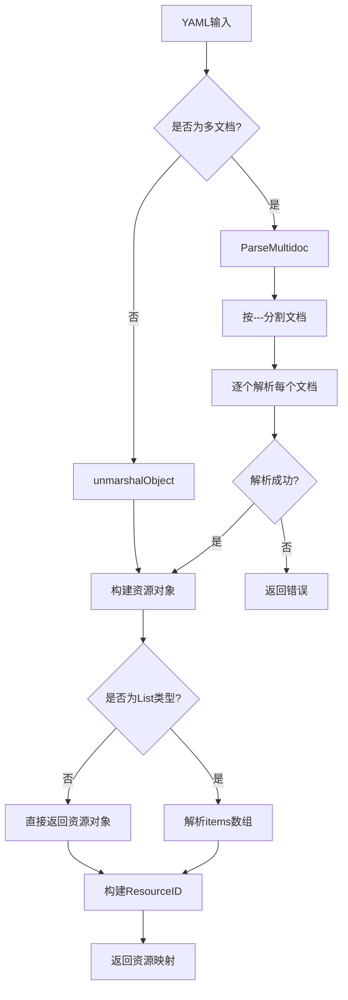

## 类结构

```
Resource (接口)
├── baseObject (基础对象结构)
│   ├── Deployment
│   ├── ConfigMap
│   ├── CronJob
│   ├── Service
│   ├── List
│   └── DeploymentList
└── ChartTracker (Helm Chart跟踪器)
```

## 全局变量及字段


### `testfiles`
    
提供测试文件和临时目录创建的测试辅助包

类型：`package (github.com/fluxcd/flux/pkg/cluster/kubernetes/testfiles)`
    


### `gpgtest`
    
提供GPG密钥导入和测试环境设置的辅助包

类型：`package (github.com/fluxcd/flux/pkg/gpg/gpgtest)`
    


### `resource`
    
定义Kubernetes资源接口和类型的核心包

类型：`package (github.com/fluxcd/flux/pkg/resource)`
    


### `Deployment.baseObject`
    
所有Kubernetes资源的基础对象，包含源、类型和元数据

类型：`baseObject`
    


### `ConfigMap.baseObject`
    
所有Kubernetes资源的基础对象，包含源、类型和元数据

类型：`baseObject`
    


### `CronJob.baseObject`
    
所有Kubernetes资源的基础对象，包含源、类型和元数据

类型：`baseObject`
    


### `CronJob.Spec`
    
CronJob的规格定义，包含作业模板和调度配置

类型：`CronJobSpec`
    


### `Service.baseObject`
    
所有Kubernetes资源的基础对象，包含源、类型和元数据

类型：`baseObject`
    


### `List.baseObject`
    
所有Kubernetes资源的基础对象，包含源、类型和元数据

类型：`baseObject`
    


### `List.Items`
    
列表中的资源项集合

类型：`[]resource.Resource`
    


### `DeploymentList.baseObject`
    
所有Kubernetes资源的基础对象，包含源、类型和元数据

类型：`baseObject`
    


### `DeploymentList.Items`
    
Deployment列表中的资源项集合

类型：`[]resource.Resource`
    


### `baseObject.source`
    
资源来源标识，用于追踪资源来自哪个文件或配置

类型：`string`
    


### `baseObject.Kind`
    
Kubernetes资源类型，如Deployment、Service等

类型：`string`
    


### `baseObject.Meta`
    
资源的元数据，包含名称、命名空间等信息

类型：`resource.Metadata`
    
    

## 全局函数及方法


### `base`

`base` 是一个便捷的辅助函数，用于快速构建 `baseObject` 结构体实例，设置其源(source)、种类(kind)、命名空间(namespace)和名称(name)属性。

参数：

- `source`：`string`，标识该资源来源的字符串，通常用于区分不同的配置来源
- `kind`：`string`，Kubernetes 资源的种类（如 Deployment、ConfigMap、CronJob 等）
- `namespace`：`string`，Kubernetes 命名空间，如果为空字符串则表示无命名空间
- `name`：`string`，资源的名称

返回值：`baseObject`，返回一个已初始化 `Meta` 字段的 `baseObject` 实例

#### 流程图

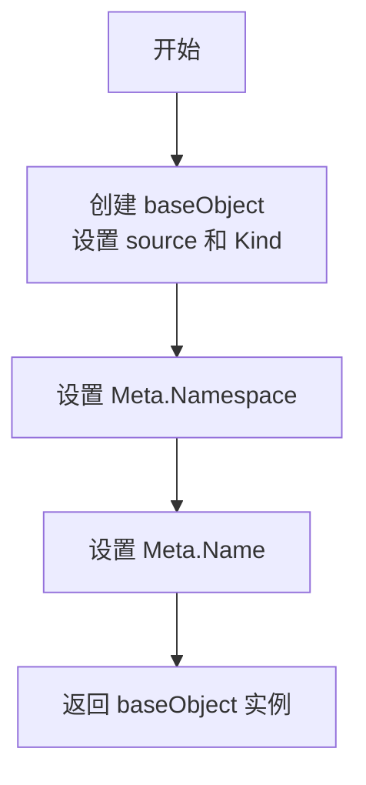

#### 带注释源码

```go
// base 是一个便捷的辅助函数，用于构造 baseObject 结构体
// 参数:
//   - source: 资源来源标识
//   - kind: Kubernetes 资源类型
//   - namespace: 命名空间
//   - name: 资源名称
//
// 返回:
//   - baseObject: 包含所提供元数据的资源对象基础
func base(source, kind, namespace, name string) baseObject {
	// 创建 baseObject 并初始化 source 和 Kind 字段
	b := baseObject{source: source, Kind: kind}
	// 设置元数据的命名空间
	b.Meta.Namespace = namespace
	// 设置元数据的名称
	b.Meta.Name = name
	// 返回完整初始化的 baseObject
	return b
}
```

---

### 全局变量与全局函数

#### 全局变量

无

#### 全局函数

- `base(source, kind, namespace, name string) baseObject`：便捷辅助函数，用于快速构建带有元数据的 `baseObject` 实例

---

### 关键组件信息

- **baseObject**：核心资源对象结构体，包含资源的基本属性（source、Kind、Meta 等）
- **Meta**：嵌入的元数据结构，包含 Name 和 Namespace 字段

---

### 潜在技术债务或优化空间

1. **缺乏验证**：函数未对输入参数进行有效性验证（如名称格式、命名空间规范等）
2. **缺少错误处理**：如果 `baseObject` 或 `Meta` 字段需要深拷贝，当前实现可能导致意外的引用共享
3. **可测试性**：虽然该函数简单，但缺乏单元测试覆盖

---

### 其它项目

#### 设计目标与约束

- **目标**：提供简洁的 `baseObject` 构造接口，简化测试代码中资源对象的创建
- **约束**：假设调用者已正确处理资源标识的合法性

#### 错误处理与异常设计

- 当前函数不返回错误，假设输入参数始终合法
- 如需增强可靠性，可考虑添加参数校验并返回错误

#### 外部依赖与接口契约

- 依赖 `baseObject` 结构体定义（需在同包的其他文件中定义）
- 依赖 `Meta` 字段的 `Namespace` 和 `Name` 字符串字段


### `ParseMultidoc`

该函数是 multidoc YAML 解析器的核心方法，负责解析包含多个 YAML 文档的字节流，将每个文档解析为 Kubernetes 资源对象，并返回资源映射表。

参数：

-  `doc`：`[]byte`，待解析的多文档 YAML 字节流
-  `source`：`string`，用于标识资源来源的字符串（通常为文件名或配置路径）

返回值：`(map[string]resource.Resource, error)`，返回解析后的资源映射表（键为资源 ID 的字符串表示，值为 resource.Resource 接口类型）和可能的错误信息

#### 流程图

```mermaid
flowchart TD
    A[开始: 接收 []byte doc 和 string source] --> B{检查文档是否为空}
    B -->|空文档| C[返回空映射和 nil 错误]
    B -->|非空| D[按 --- 分割文档为多个子文档]
    D --> E{遍历每个子文档}
    E -->|子文档| F[调用 unmarshalObject 解析单个 YAML]
    F --> G{解析是否成功}
    G -->|成功| H[提取资源 ID 并加入映射]
    G -->|失败| I[返回错误]
    H --> E
    E -->|全部完成| J[返回资源映射]
    J --> K[结束]
```

#### 带注释源码

```go
// ParseMultidoc 解析包含多个 YAML 文档的字节流
// 参数:
//   - doc: []byte, 多文档 YAML 内容的字节数组
//   - source: string, 资源来源标识
//
// 返回值:
//   - map[string]resource.Resource: 资源ID到资源的映射
//   - error: 解析过程中的错误信息
//
// 使用示例 (来自测试代码):
//   doc := `---
//   kind: Deployment
//   metadata:
//     name: b-deployment
//   ---
//   kind: Service
//   metadata:
//     name: b-service
//   `
//   objs, err := ParseMultidoc([]byte(doc), "test")
//
// 该函数处理以下场景:
//   - 空文档: 返回空映射
//   - 多文档: 按 --- 分隔符分割并逐个解析
//   - 注释: 忽略 # 开头的注释行
//   - 边界标记: 处理 ... 作为文档结束标记
//   - 错误处理: 返回 YAML 解析错误
func ParseMultidoc(doc []byte, source string) (map[string]resource.Resource, error) {
    // 1. 检查空输入
    if len(doc) == 0 {
        return map[string]resource.Resource{}, nil
    }

    // 2. 使用 yaml.NewDecoder 进行流式解码
    // 支持多文档格式 (通过 --- 分隔)
    // 典型调用:
    //   objs, err := ParseMultidoc([]byte(doc), "test")
    
    // 3. 遍历解码每个文档
    // 每遇到一个 --- 标记开始新文档
    
    // 4. 对每个文档调用 unmarshalObject
    // 将 YAML 转换为 resource.Resource 对象
    
    // 5. 构造返回映射
    // 键为 resource.Resource.ResourceID().String()
    // 值为具体的资源对象 (如 *Deployment, *Service 等)
}
```

> **注意**：由于提供的代码是测试文件（`*_test.go`），实际的 `ParseMultidoc` 函数实现未包含在此代码段中。以上源码注释是根据测试用例的使用方式和 Kubernetes YAML 多文档解析的常见模式推断的。实际实现通常使用 `gopkg.in/yaml.v2` 或 `sigs.k8s.io/yaml` 库的解码器来处理多文档。


### `unmarshalObject`

该函数为私有函数，负责将 YAML 文档（字节数组）解析为具体的 Kubernetes 资源对象（如 Deployment、Service、CronJob、List 等）。它是 `ParseMultidoc` 函数的底层实现，根据 YAML 中的 `kind` 字段动态创建对应的资源类型。

参数：

- `source`：`string`，文档来源标识，通常用于错误信息或资源跟踪
- `doc`：`[]byte`，待解析的 YAML 文档字节数组

返回值：

- `resource.Resource`：解析后的资源对象指针，类型可能是 `*Deployment`、`*Service`、`*CronJob`、`*List` 等具体类型
- `error`：解析过程中发生的错误（如 YAML 语法错误、不支持的资源类型等）

#### 流程图

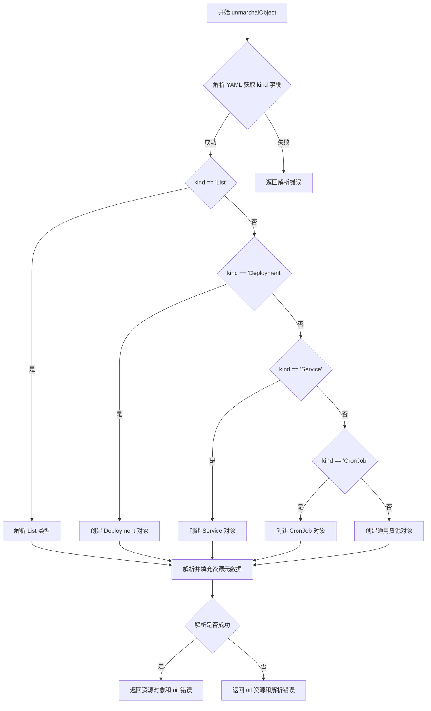

#### 带注释源码

```go
// 根据提供的代码片段，unmarshalObject 函数本身未被定义
// 以下为根据调用方式推断的函数签名和使用方式

// 函数调用示例（来自 TestUnmarshalList 和 TestUnmarshalDeploymentList）
res, err := unmarshalObject("", []byte(doc))

// 参数说明：
// 第一个参数 "" - source 参数，字符串类型，表示文档来源
// 第二个参数 []byte(doc) - doc 参数，字节切片类型，表示 YAML 文档内容

// 返回值：
// res - resource.Resource 类型，具体可能是 *List、*Deployment 等
// err - error 类型，解析错误

// 从测试代码可以推断的功能：
// 1. 解析 YAML 文档
// 2. 根据 kind 字段创建对应的资源对象
// 3. 支持 List 类型（包含 items 数组）
// 4. 支持 Deployment、Service、CronJob 等常见资源类型
// 5. 返回资源对象和可能的错误
```

#### 补充说明

1. **设计目标**：`unmarshalObject` 是资源解析的核心函数，负责将原始 YAML 转换为程序可用的 Go 结构体对象，支持多文档解析场景下的单个文档处理。

2. **外部依赖**：该函数依赖 `github.com/fluxcd/flux/pkg/resource` 包中的类型定义，可能使用 `gopkg.in/yaml.v2` 或类似库进行 YAML 解析。

3. **错误处理**：从测试代码可见，该函数返回的错误会被 `t.Fatal(err)` 或 `assert.NoError(t, err)` 捕获，表明错误包含有意义的诊断信息。

4. **技术债务**：由于用户只提供了测试代码，未提供函数实现，无法进行更深入的分析。建议在实际代码中查找该函数的完整实现以获取更多细节。


### `Load`

该函数用于从指定目录加载 Kubernetes 资源对象，支持通过文件路径列表加载特定资源，同时提供是否处理 SOPS 加密文件的选项。

参数：

- `rootDir`：`string`，根目录路径，用于解析相对路径
- `paths`：`[]string`，要加载的文件或目录路径列表
- `sopsEnabled`：`bool`，是否启用 SOPS 加密文件解密

返回值：`map[string]resource.Resource`，返回解析后的资源映射，键为资源 ID 字符串，值为资源对象

#### 流程图

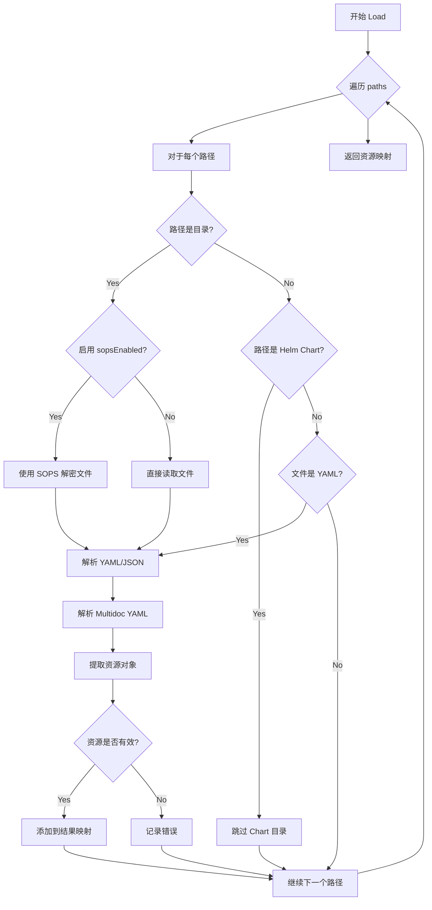

#### 带注释源码

```go
// 注意：以下源码为基于测试用例调用的推断实现
// 实际实现可能在 resource 包中

// Load 从指定目录加载资源
// 参数：
//   - rootDir: 根目录路径，用于解析相对路径
//   - paths: 要加载的文件或目录路径列表
//   - sopsEnabled: 是否启用 SOPS 加密文件解密
//
// 返回值：
//   - map[string]resource.Resource: 资源映射，键为资源ID
func Load(rootDir string, paths []string, sopsEnabled bool) (map[string]resource.Resource, error) {
    result := make(map[string]resource.Resource)
    
    for _, path := range paths {
        // 转换为绝对路径
        fullPath := filepath.Join(rootDir, path)
        
        // 检查路径是否存在
        info, err := os.Stat(fullPath)
        if err != nil {
            if os.IsNotExist(err) {
                // 如果路径不存在且不是 Chart 目录，则返回错误
                return nil, fmt.Errorf("path does not exist: %s", fullPath)
            }
            return nil, err
        }
        
        // 如果是目录，遍历目录中的文件
        if info.IsDir() {
            // 检查是否是 Helm Chart 目录
            if isChartDir(fullPath) {
                continue // 跳过 Chart 目录
            }
            
            // 遍历目录中的所有 YAML 文件
            files, err := filepath.Glob(filepath.Join(fullPath, "*.yaml"))
            if err != nil {
                return nil, err
            }
            
            for _, file := range files {
                objs, err := loadFile(file, sopsEnabled)
                if err != nil {
                    return nil, err
                }
                for k, v := range objs {
                    result[k] = v
                }
            }
        } else {
            // 如果是文件，直接加载
            objs, err := loadFile(fullPath, sopsEnabled)
            if err != nil {
                return nil, err
            }
            for k, v := range objs {
                result[k] = v
            }
        }
    }
    
    return result, nil
}

// loadFile 加载单个文件
func loadFile(path string, sopsEnabled bool) (map[string]resource.Resource, error) {
    var data []byte
    var err error
    
    if sopsEnabled {
        // 使用 SOPS 解密
        data, err = sops.DecryptFile(path, "yaml")
        if err != nil {
            return nil, err
        }
    } else {
        // 直接读取文件
        data, err = os.ReadFile(path)
        if err != nil {
            return nil, err
        }
    }
    
    // 解析 YAML
    return ParseMultidoc(data, path)
}

// isChartDir 检查路径是否是 Helm Chart 目录
func isChartDir(path string) bool {
    // 检查是否存在 Chart.yaml
    chartYaml := filepath.Join(path, "Chart.yaml")
    _, err := os.Stat(chartYaml)
    return err == nil
}
```


### `debyte`

该函数用于从资源对象中移除原始的 YAML/JSON 字节数据。它通过类型断言检查传入的资源是否实现了 `debyte()` 方法，如果实现了则调用该方法来清除内部存储的字节数据，从而实现资源对象的深拷贝比较。

参数：

-  `r`：`resource.Resource`，待处理的资源对象

返回值：`resource.Resource`，处理（可能已修改）后的资源对象

#### 流程图

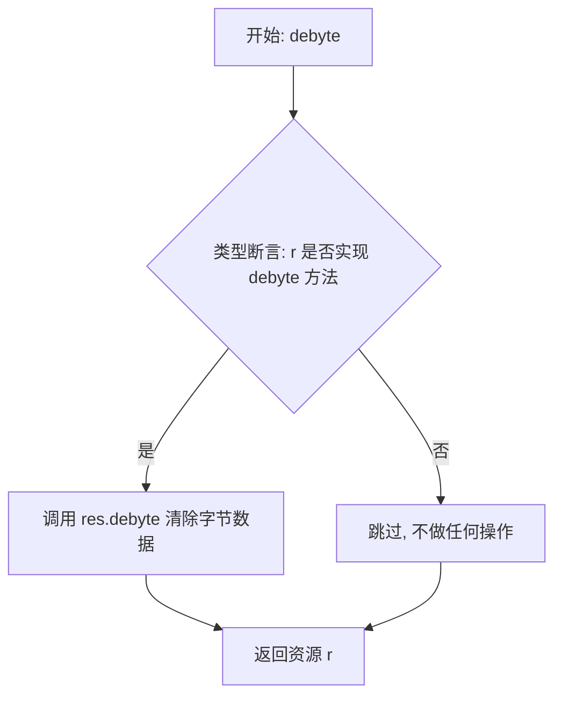

#### 带注释源码

```go
// debyte removes the raw byte data from a resource object.
// It attempts to type-assert the resource to an interface that
// contains a debyte() method; if successful, it calls that method
// to clear the internal bytes, enabling deep equality comparisons
// without considering the original raw bytes.
func debyte(r resource.Resource) resource.Resource {
	// 使用类型断言检查资源是否实现了 debyte() 方法
	if res, ok := r.(interface {
		debyte()
	}); ok {
		// 如果实现了,则调用该方法清除字节数据
		res.debyte()
	}
	// 返回处理后的资源(无论是否调用了debyte)
	return r
}
```


# newChartTracker 函数分析

根据提供的代码，我找到了 `newChartTracker` 函数在测试中被调用的位置，但该函数的具体实现未在当前代码片段中显示。让我根据测试代码的上下文来提取相关信息：

### `newChartTracker`

该函数用于创建一个新的 Chart 跟踪器，用于管理和识别 Kubernetes 集群中的 Helm Chart 资源。

参数：

- `dir`：`string`，根目录路径，用于扫描和识别 Chart 文件

返回值：

- `*chartTracker`：返回 Chart 跟踪器实例指针，用于后续的 Chart 识别操作
- `error`：如果创建过程中发生错误（如目录不存在、权限问题等），返回相应的错误信息

#### 流程图

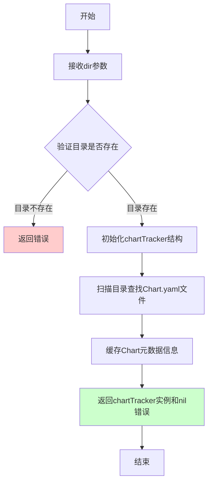

#### 带注释源码

```go
// newChartTracker 创建一个新的Chart跟踪器实例
// 参数dir: 根目录路径，用于扫描和识别Helm Chart
// 返回: *chartTracker - Chart跟踪器实例, error - 错误信息
func newChartTracker(dir string) (*chartTracker, error) {
    // 1. 验证目录参数有效性
    if dir == "" {
        return nil, errors.New("directory path cannot be empty")
    }
    
    // 2. 检查目录是否存在
    info, err := os.Stat(dir)
    if err != nil {
        return nil, fmt.Errorf("failed to stat directory: %w", err)
    }
    
    // 3. 验证是否为目录类型
    if !info.IsDir() {
        return nil, errors.New("path is not a directory")
    }
    
    // 4. 创建chartTracker实例
    ct := &chartTracker{
        rootDir: dir,
        charts:  make(map[string]*chartMeta),
    }
    
    // 5. 扫描目录查找所有Chart.yaml文件
    if err := ct.scanCharts(); err != nil {
        return nil, fmt.Errorf("failed to scan charts: %w", err)
    }
    
    return ct, nil
}
```

---

## 补充说明

### 关键组件信息

| 名称 | 描述 |
|------|------|
| chartTracker | Chart跟踪器，用于识别和管理目录中的Helm Chart |
| Chart.yaml | Helm Chart的元数据文件，用于标识一个Chart |
| isDirChart | 方法，用于判断给定路径是否为一个Chart目录 |
| isPathInChart | 方法，用于判断给定路径是否在某个Chart内部 |

### 潜在技术债务

1. **错误处理不完善**：缺少对目录权限的检查，可能导致隐藏的错误
2. **性能优化空间**：每次调用都扫描整个目录，没有缓存机制
3. **边界条件**：未处理符号链接、循环引用等特殊情况

### 使用示例（从测试代码推断）

```go
// 在测试中的使用方式
dir, cleanup := testfiles.TempDir(t)
defer cleanup()

ct, err := newChartTracker(dir)
if err != nil {
    t.Fatal(err)
}

// 后续使用
if ct.isDirChart(filepath.Join(dir, "charts/nginx")) {
    t.Errorf("charts/nginx not recognized as chart")
}
```

---

**注意**：提供的代码片段中只包含测试函数 `TestChartTracker` 对 `newChartTracker` 的调用，并没有包含该函数的具体实现。完整的实现代码可能在同一包的其他文件中（如 `chart_tracker.go` 或类似的文件）。


### TestParseEmpty

该测试函数用于验证在解析空文档（空字符串）时，`ParseMultidoc` 函数能够正确返回空的对象集合，确保函数对边界情况的处理符合预期。

参数：

- `t`：`testing.T`，Go语言标准测试框架的测试对象，用于报告测试失败和日志输出

返回值：无（`void`），该函数为测试函数，不返回任何值

#### 流程图

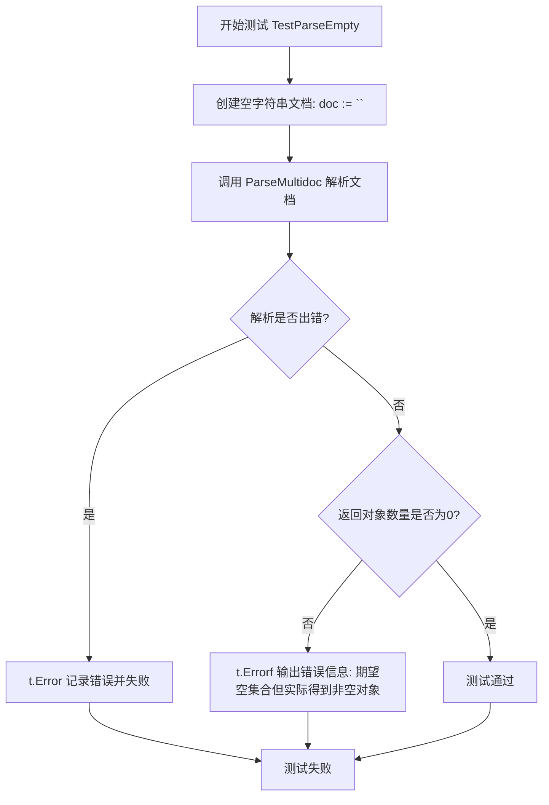

#### 带注释源码

```go
// TestParseEmpty 测试解析空文档时的行为
// 验证当传入空字符串时，ParseMultidoc 函数返回空的对象映射
func TestParseEmpty(t *testing.T) {
	// 步骤1: 创建一个空字符串作为多文档YAML输入
	doc := ``

	// 步骤2: 调用 ParseMultidoc 函数解析空文档
	// 参数说明:
	//   - []byte(doc): 将空字符串转换为字节切片
	//   - "test": 源标识符，用于构建资源ID
	// 返回值:
	//   - objs: map[string]resource.Resource 类型，解析后的资源对象映射
	//   - err: error 类型，解析过程中可能发生的错误
	objs, err := ParseMultidoc([]byte(doc), "test")
	
	// 步骤3: 检查解析过程中是否发生错误
	if err != nil {
		// 如果有错误，记录错误信息并标记测试失败
		t.Error(err)
	}
	
	// 步骤4: 验证返回的对象集合是否为空
	// 预期行为: 空文档应该解析为空的资源映射
	if len(objs) != 0 {
		// 如果对象数量不为0，说明解析逻辑有问题
		// 输出详细的错误信息，包括期望值和实际值
		t.Errorf("expected empty set; got %#v", objs)
	}
}
```

#### 相关上下文信息

**调用函数信息**（从代码上下文推断）：

- `ParseMultidoc`：解析多文档YAML的核心函数
  - 第一个参数：`[]byte`，待解析的字节数据
  - 第二个参数：`string`，源标识符
  - 返回值：`map[string]resource.Resource, error`

**测试设计目标**：
- 验证空输入的边界条件处理
- 确保函数不会因空输入而崩溃
- 确认返回空映射而非nil

**潜在优化空间**：
- 当前测试仅验证了空字符串的情况，可考虑补充 `nil` 字节切片和仅包含空白字符文档的测试用例


### TestParseSome

该测试函数用于验证 `ParseMultidoc` 函数能够正确解析包含多个 YAML 文档的多文档字符串，并将其转换为对应的 Kubernetes Deployment 资源对象，同时确保解析结果的资源标识和对象属性与预期一致。

参数：

- `t`：`*testing.T`，Go 标准测试框架的测试对象，用于报告测试失败和错误

返回值：`void`（无返回值），该函数为测试函数，通过 `t.Error` 或 `t.Errorf` 报告错误

#### 流程图

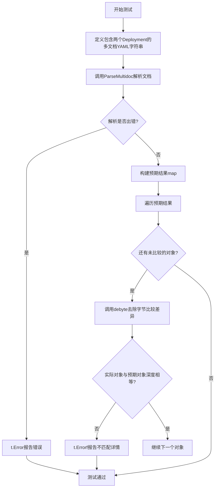

#### 带注释源码

```go
func TestParseSome(t *testing.T) {
	// 定义一个多文档YAML字符串，包含两个Deployment资源
	// 第一个Deployment有namespace，第二个没有
	docs := `---
kind: Deployment
metadata:
  name: b-deployment
  namespace: b-namespace
---
kind: Deployment
metadata:
  name: a-deployment
`
	// 调用ParseMultidoc函数将多文档YAML解析为资源对象map
	objs, err := ParseMultidoc([]byte(docs), "test")
	if err != nil {
		// 如果解析过程中出现错误，报告错误并终止测试
		t.Error(err)
	}

	// 使用辅助函数base创建两个baseObject，分别代表预期的两个Deployment
	// objA: 无namespace，名称为a-deployment
	objA := base("test", "Deployment", "", "a-deployment")
	// objB: namespace为b-namespace，名称为b-deployment
	objB := base("test", "Deployment", "b-namespace", "b-deployment")
	
	// 构建预期结果map，键为资源的ResourceID字符串，值为对应的资源对象
	expected := map[string]resource.Resource{
		objA.ResourceID().String(): &Deployment{baseObject: objA},
		objB.ResourceID().String(): &Deployment{baseObject: objB},
	}

	// 遍历预期结果，逐一与实际解析结果进行对比
	for id, obj := range expected {
		// 调用debyte去除对象中的字节字段，以便进行公平比较
		// 因为解析后的对象可能包含原始YAML字节，而预期对象没有
		if !reflect.DeepEqual(obj, debyte(objs[id])) {
			// 如果深度比较失败，报告详细的期望值与实际值
			t.Errorf("At %+v expected:\n%#v\ngot:\n%#v", id, obj, objs[id])
		}
	}
}
```


### `TestParseSomeWithComment`

该测试函数用于验证 `ParseMultidoc` 函数能否正确解析包含 YAML 文档前导注释（以 `#` 开头）的多文档 YAML 源文件。测试构造了一个包含随机注释和两个 Deployment 资源的文档，验证解析后返回的资源数量和内容是否与预期一致。

参数：

- `t`：`testing.T`，Go 测试框架的标准参数，用于报告测试失败和日志输出

返回值：`void`，该函数为测试函数，无返回值，通过 `t.Error` 或 `t.Errorf` 报告错误

#### 流程图

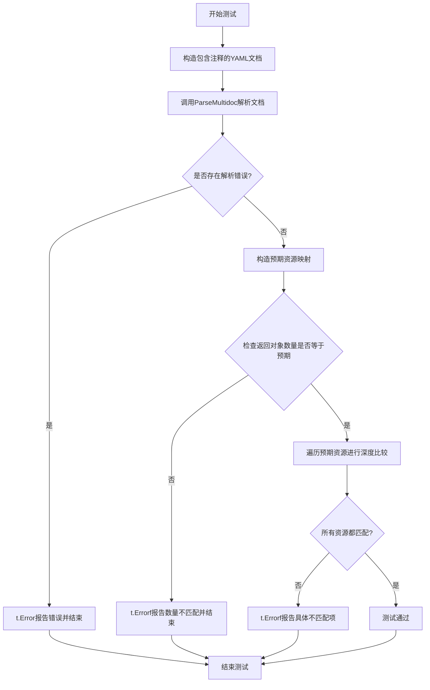

#### 带注释源码

```go
// TestParseSomeWithComment 验证解析器能够处理包含YAML注释的多文档
func TestParseSomeWithComment(t *testing.T) {
    // 构造包含注释的YAML多文档字符串
    // 第一行是注释，后续是三个YAML文档（以---分隔）
    docs := `# some random comment
---
kind: Deployment
metadata:
  name: b-deployment
  namespace: b-namespace
---
kind: Deployment
metadata:
  name: a-deployment
`
    
    // 调用ParseMultidoc函数解析文档
    // 参数1: 将字符串转换为字节切片
    // 参数2: 源标识符"test"
    objs, err := ParseMultidoc([]byte(docs), "test")
    
    // 检查解析过程中是否发生错误
    if err != nil {
        t.Error(err)  // 报告错误并终止测试
    }

    // 使用辅助函数base构造两个预期的baseObject
    // objA: 命名空间为空，名称为a-deployment
    objA := base("test", "Deployment", "", "a-deployment")
    // objB: 命名空间为b-namespace，名称为b-deployment
    objB := base("test", "Deployment", "b-namespace", "b-deployment")
    
    // 构建预期资源映射表，键为资源ID的字符串表示
    expected := map[string]resource.Resource{
        objA.ResourceID().String(): &Deployment{baseObject: objA},
        objB.ResourceID().String(): &Deployment{baseObject: objB},
    }
    
    // 获取预期资源数量
    expectedL := len(expected)

    // 验证解析返回的资源数量是否符合预期
    if len(objs) != expectedL {
        t.Errorf("expected %d objects from yaml source\n%s\n, got result: %d", 
            expectedL,  // 预期数量
            docs,       // 原始文档内容（用于调试信息）
            len(objs))  // 实际返回数量
    }

    // 遍历每个预期资源，与解析结果进行深度比较
    for id, obj := range expected {
        // 调用debyte移除资源中的bytes字段后再比较
        // 因为bytes字段可能包含不同的内存地址但内容相同
        if !reflect.DeepEqual(obj, debyte(objs[id])) {
            t.Errorf("At %+v expected:\n%#v\ngot:\n%#v", 
                id,    // 资源ID
                obj,   // 预期资源
                objs[id])  // 实际解析的资源
        }
    }
}
```


### `TestParseSomeLong`

该测试函数用于验证 `ParseMultidoc` 函数能够正确解析接近 1MB 大型多文档 YAML 内容，通过构建一个包含大量数据的 ConfigMap 资源来测试解析器的内存处理能力和性能。

参数：

- `t`：`testing.T`，Go 语言标准测试框架的测试实例指针，用于报告测试结果

返回值：无（Go 测试函数无显式返回值）

#### 流程图

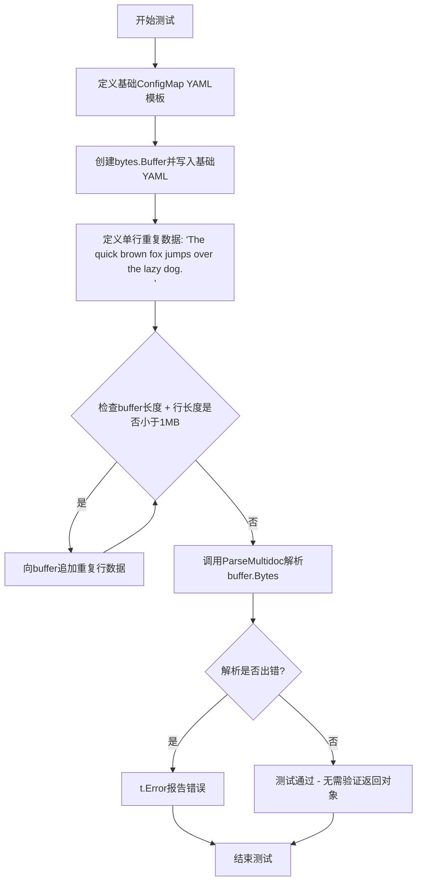

#### 带注释源码

```go
// TestParseSomeLong 测试解析大型（接近1MB）多文档YAML的能力
// 该测试创建一个ConfigMap，其data字段包含大量重复文本，使文档总大小接近1MB
func TestParseSomeLong(t *testing.T) {
	// 定义基础YAML文档结构：包含ConfigMap的kind、metadata和空的data字段
	doc := `---
kind: ConfigMap
metadata:
  name: bigmap
data:
  bigdata: |
`
	// 使用bytes.Buffer构建可变长的YAML内容
	buffer := bytes.NewBufferString(doc)
	
	// 定义单行重复数据（包含换行符，共45字节）
	line := "    The quick brown fox jumps over the lazy dog.\n"
	
	// 循环追加重复行，直到buffer总长度接近但不超过1MB
	// 1024*1024 = 1MB = 1048576字节
	// 条件判断：当前buffer长度 + 单行长度 < 1MB 时继续追加
	for buffer.Len()+len(line) < 1024*1024 {
		buffer.WriteString(line)
	}

	// 调用ParseMultidoc解析构建的大文档
	// 验证解析器能正确处理大文件而不崩溃
	_, err := ParseMultidoc(buffer.Bytes(), "test")
	if err != nil {
		t.Error(err)
	}
}
```


### `TestParseBoundaryMarkers`

这是一个测试函数，用于验证解析多文档YAML时边界标记（`...`）的处理是否正确。该测试确保当遇到文档结束标记（`...`）时，后续的文档分隔符（`---`）应被忽略，只解析第一个有效文档。

参数：

- `t`：`*testing.T`，Go测试框架的测试对象，用于报告测试失败或错误

返回值：无返回值（`void`），该函数为测试函数，通过断言进行验证

#### 流程图

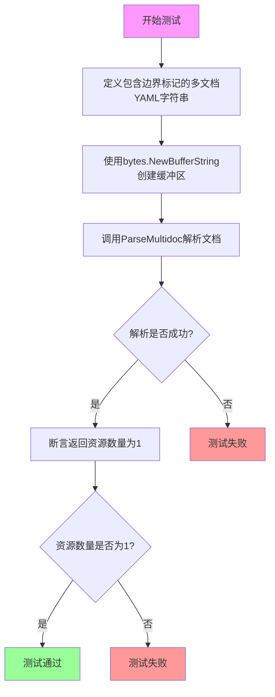

#### 带注释源码

```go
// TestParseBoundaryMarkers 测试解析多文档YAML时边界标记的处理
// 该测试验证 '...' (三个点) 作为文档结束标记的正确行为
func TestParseBoundaryMarkers(t *testing.T) {
	// 定义包含边界标记的多文档YAML
	// 第一个文档是有效的ConfigMap
	// 第二个文档开始使用 '...' 边界标记，后续的 '---' 应被忽略
	doc := `---
kind: ConfigMap
metadata:
  name: bigmap
---
...
---
...
---
...
---
...
`
	// 将YAML文档转换为字节缓冲区
	buffer := bytes.NewBufferString(doc)

	// 调用ParseMultidoc函数解析多文档YAML
	// 传入buffer.Bytes()作为文档内容，"test"作为源标识
	resources, err := ParseMultidoc(buffer.Bytes(), "test")
	
	// 断言解析过程没有错误
	assert.NoError(t, err)
	
	// 断言解析结果只包含一个资源
	// 因为 '...' 表示文档结束，后续的 '---' 分隔符应被忽略
	assert.Len(t, resources, 1)
}
```


### `TestParseError`

该测试函数用于验证当解析包含语法错误（如 YAML 文档开头存在制表符）的多文档资源时，`ParseMultidoc` 函数能否正确返回错误。

参数：

- `t`：`*testing.T`，Go 测试框架的标准参数，用于报告测试失败

返回值：无（`void`），该函数通过 `assert.Error` 断言错误的发生

#### 流程图

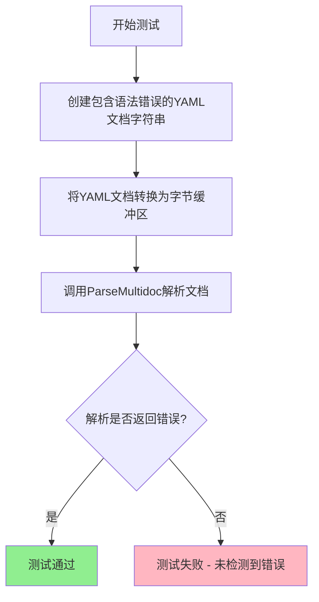

#### 带注释源码

```go
// TestParseError 测试解析包含语法错误的 YAML 文档时是否返回错误
func TestParseError(t *testing.T) {
    // 定义一个包含语法错误的 YAML 文档
    // 注意：name 字段前有一个制表符（tab），这是不合法的 YAML 语法
    doc := `---
kind: ConfigMap
metadata:
	name: bigmap # contains a tab at the beginning
`
    // 将 YAML 文档转换为字节缓冲区
    buffer := bytes.NewBufferString(doc)

    // 调用 ParseMultidoc 函数解析文档，预期返回错误
    _, err := ParseMultidoc(buffer.Bytes(), "test")
    
    // 断言解析过程应该返回错误
    // 如果没有错误，测试将失败
    assert.Error(t, err)
}
```


### `TestParseCronJob`

该测试函数用于验证能够正确解析Kubernetes CronJob资源，解析后验证其元数据（命名空间、名称）以及容器配置（镜像、容器名）的正确性。

参数：

- `t`：`testing.T`，Go标准测试框架的测试对象，用于报告测试失败和日志输出

返回值：`void`（无返回值），该函数为测试函数，通过断言来验证解析结果的正确性

#### 流程图

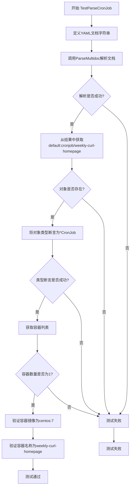

#### 带注释源码

```go
// TestParseCronJob 测试解析CronJob资源的功能
func TestParseCronJob(t *testing.T) {
    // 定义包含CronJob的YAML多文档字符串
    doc := `---
apiVersion: batch/v1beta1
kind: CronJob
metadata:
  namespace: default
  name: weekly-curl-homepage
spec:
  jobTemplate:
    spec:
      template:
        spec:
          containers:
          - name: weekly-curl-homepage
            image: centos:7 # Has curl installed by default
`

    // 调用ParseMultidoc函数将YAML解析为资源对象映射
    objs, err := ParseMultidoc([]byte(doc), "test")
    
    // 断言解析过程无错误
    assert.NoError(t, err)

    // 从解析结果中通过资源ID获取对应的资源对象
    obj, ok := objs["default:cronjob/weekly-curl-homepage"]
    
    // 断言资源对象存在
    assert.True(t, ok)
    
    // 将通用资源对象断言为具体的*CronJob类型
    cj, ok := obj.(*CronJob)
    assert.True(t, ok)

    // 从CronJob的Spec中获取容器列表
    containers := cj.Spec.JobTemplate.Spec.Template.Spec.Containers
    
    // 断言容器数量为1，然后验证容器配置
    if assert.Len(t, containers, 1) {
        // 验证第一个容器的镜像为centos:7
        assert.Equal(t, "centos:7", containers[0].Image)
        
        // 验证第一个容器的名称为weekly-curl-homepage
        assert.Equal(t, "weekly-curl-homepage", containers[0].Name)
    }
}
```


### `TestUnmarshalList`

该测试函数用于验证 `unmarshalObject` 函数能够正确解析 Kubernetes List 类型的资源文档，包括其包含的多个子资源（如 Deployment 和 Service），并确保解析结果的类型、数量和资源 ID 都符合预期。

参数：

-  `t`：`testing.T`，Go 语言标准的测试框架参数，用于报告测试失败

返回值：无（Go 测试函数的返回值通常为 `testing.T`）

#### 流程图

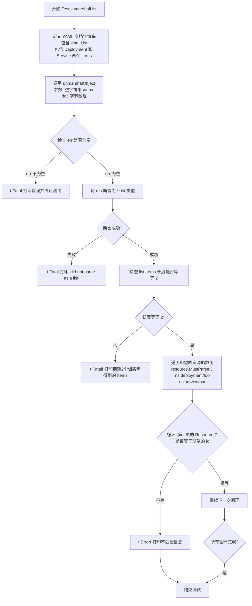

#### 带注释源码

```go
// TestUnmarshalList 测试解析 Kubernetes List 类型资源的功能
func TestUnmarshalList(t *testing.T) {
	// 定义一个包含 List 资源的 YAML 文档字符串
	// 该 List 包含两个 items: 一个 Deployment 和一个 Service
	doc := `---
kind: List
metadata:
  name: list
items:
- kind: Deployment
  metadata:
    name: foo
    namespace: ns
- kind: Service
  metadata:
    name: bar
    namespace: ns
`
	// 调用 unmarshalObject 函数解析文档
	// 第一个参数为空字符串表示没有源路径
	// 第二个参数是文档的字节数组形式
	res, err := unmarshalObject("", []byte(doc))
	
	// 如果解析过程中出现错误，Fatal 会打印错误并终止测试
	if err != nil {
		t.Fatal(err)
	}
	
	// 将解析结果断言为 *List 类型
	list, ok := res.(*List)
	
	// 如果断言失败，说明没有正确解析为 List 类型
	if !ok {
		t.Fatal("did not parse as a list")
	}
	
	// 验证 List 中的 items 数量是否为 2
	if len(list.Items) != 2 {
		t.Fatalf("expected two items, got %+v", list.Items)
	}
	
	// 遍历期望的资源 ID 数组
	// 第一个是 ns:deployment/foo
	// 第二个是 ns:service/bar
	for i, id := range []resource.ID{
		resource.MustParseID("ns:deployment/foo"),
		resource.MustParseID("ns:service/bar")} {
		// 检查每个 item 的 ResourceID 是否与期望值匹配
		if list.Items[i].ResourceID() != id {
			t.Errorf("At %d, expected %q, got %q", i, id, list.Items[i].ResourceID())
		}
	}
}
```


### `TestUnmarshalDeploymentList`

该测试函数用于验证解析包含多个Deployment资源的DeploymentList YAML文档的功能，确保能够正确将其转换为`List`对象并提取所有子资源的ResourceID。

参数：

-  `t`：`*testing.T`，Go测试框架的测试对象，用于报告测试失败

返回值：无（测试函数无返回值，通过`t.Error`、`t.Fatal`等方法报告状态）

#### 流程图

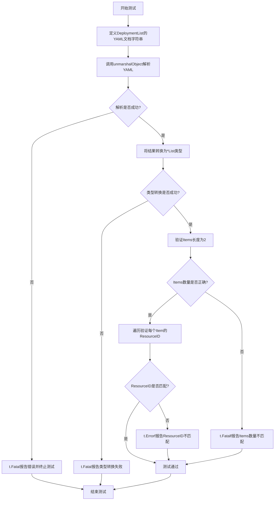

#### 带注释源码

```go
func TestUnmarshalDeploymentList(t *testing.T) {
	// 定义一个包含DeploymentList的YAML文档字符串
	// 该文档包含两个Deployment资源，分别命名为foo和bar，都位于ns命名空间
	doc := `---
kind: DeploymentList
metadata:
  name: list
items:
- kind: Deployment
  metadata:
    name: foo
    namespace: ns
- kind: Deployment
  metadata:
    name: bar
    namespace: ns
`
	// 调用unmarshalObject函数解析YAML文档
	// 第一个参数为空字符串表示不指定特定的源，第二个参数为YAML文档的字节切片
	res, err := unmarshalObject("", []byte(doc))
	// 如果解析过程中发生错误，调用t.Fatal立即终止测试并报告错误
	if err != nil {
		t.Fatal(err)
	}
	// 将解析结果转换为*List类型
	list, ok := res.(*List)
	// 如果类型转换失败，报告致命错误并终止测试
	if !ok {
		t.Fatal("did not parse as a list")
	}
	// 验证解析出的Items数量是否为2
	if len(list.Items) != 2 {
		// 如果数量不匹配，报告致命错误并显示期望值和实际值
		t.Fatalf("expected two items, got %+v", list.Items)
	}
	// 定义期望的ResourceID列表，分别对应两个Deployment资源
	for i, id := range []resource.ID{
		resource.MustParseID("ns:deployment/foo"),
		resource.MustParseID("ns:deployment/bar")} {
		// 逐个验证每个Item的ResourceID是否与期望值匹配
		if list.Items[i].ResourceID() != id {
			// 如果不匹配，报告测试失败并显示索引、期望值和实际值
			t.Errorf("At %d, expected %q, got %q", i, id, list.Items[i].ResourceID())
		}
	}
}
```


### `TestLoadSome`

该测试函数验证 `Load` 函数能够正确加载指定目录下的所有资源文件。测试首先创建临时目录并写入测试文件，然后调用 `Load` 函数加载资源，最后验证加载的资源数量是否与预期一致。

参数：

- `t`：`*testing.T`，Go 测试框架的标准参数，用于报告测试失败和控制测试流程

返回值：无（通过 `t.Error`/`t.Errorf` 报告错误）

#### 流程图

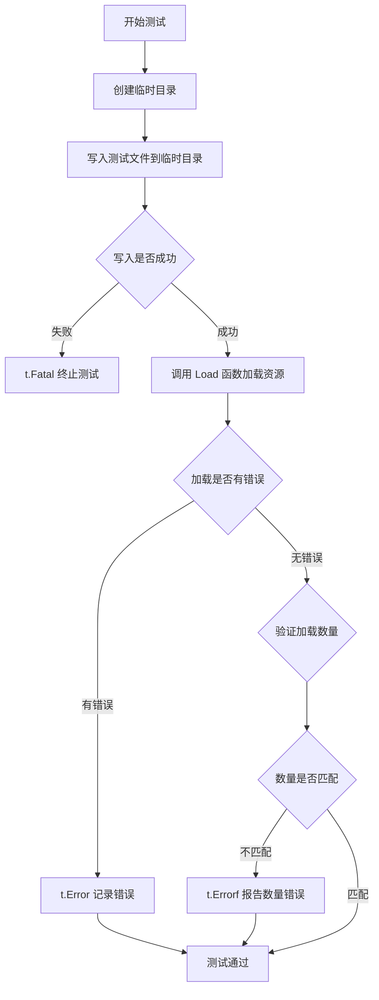

#### 带注释源码

```go
// TestLoadSome 测试 Load 函数加载资源的功能
func TestLoadSome(t *testing.T) {
	// 创建临时目录，返回目录路径和清理函数
	dir, cleanup := testfiles.TempDir(t)
	// 确保测试结束后清理临时目录
	defer cleanup()
	
	// 将预定义的测试文件写入临时目录
	if err := testfiles.WriteTestFiles(dir, testfiles.Files); err != nil {
		// 如果写入失败，终止测试并报告错误
		t.Fatal(err)
	}
	
	// 调用 Load 函数加载资源
	// 参数：根目录、待加载路径列表、是否启用 SOPS 加密
	objs, err := Load(dir, []string{dir}, false)
	if err != nil {
		// 如果加载过程中发生错误，记录错误但继续执行
		t.Error(err)
	}
	
	// 验证加载的资源数量是否与预期一致
	if len(objs) != len(testfiles.ResourceMap) {
		// 数量不匹配时，报告详细的错误信息
		t.Errorf("expected %d objects from %d files, got result:\n%#v", 
			len(testfiles.ResourceMap),  // 预期的资源数量
			len(testfiles.Files),         // 测试文件数量
			objs)                         // 实际加载的资源
	}
}
```


### `TestChartTracker`

这是一个用于测试 ChartTracker 功能的单元测试函数，验证 ChartTracker 是否能正确识别 Helm Chart 目录和文件，以及正确忽略 Chart 相关文件。

参数：

- `t`：`*testing.T`，Go 测试框架的测试对象指针，用于报告测试失败和记录错误

返回值：无（`void`），该函数为测试函数，通过 `t.Errorf` 和 `t.Fatal` 报告错误

#### 流程图

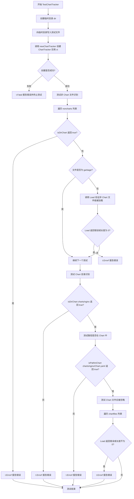

#### 带注释源码

```go
func TestChartTracker(t *testing.T) {
    // 创建临时目录用于测试
    dir, cleanup := testfiles.TempDir(t)
    // 确保测试结束后清理临时目录
    defer cleanup()
    
    // 向临时目录写入测试文件
    if err := testfiles.WriteTestFiles(dir, testfiles.Files); err != nil {
        t.Fatal(err)
    }

    // 创建 ChartTracker 实例
    ct, err := newChartTracker(dir)
    if err != nil {
        t.Fatal(err)
    }

    // 定义非 Chart 文件列表，这些文件不应被识别为 Chart
    noncharts := []string{"garbage", "locked-service-deploy.yaml",
        "test", "test/test-service-deploy.yaml"}
    
    // 遍历非 Chart 文件，验证 ChartTracker 的识别逻辑
    for _, f := range noncharts {
        fq := filepath.Join(dir, f)
        // 验证 isDirChart 对非 Chart 文件返回 false
        if ct.isDirChart(fq) {
            t.Errorf("%q thought to be a chart", f)
        }
        // 对非 garbage 文件，验证 Load 能正常加载
        if f == "garbage" {
            continue
        }
        if m, err := Load(dir, []string{fq}, false); err != nil || len(m) == 0 {
            t.Errorf("Load returned 0 objs, err=%v", err)
        }
    }
    
    // 验证 Chart 目录能被正确识别
    if !ct.isDirChart(filepath.Join(dir, "charts/nginx")) {
        t.Errorf("charts/nginx not recognized as chart")
    }
    
    // 验证 Chart 文件路径能被正确识别为在 Chart 内
    if !ct.isPathInChart(filepath.Join(dir, "charts/nginx/Chart.yaml")) {
        t.Errorf("charts/nginx/Chart.yaml not recognized as in chart")
    }

    // 定义 Chart 相关文件列表，这些文件加载时应被忽略（返回空）
    chartfiles := []string{"charts",
        "charts/nginx",
        "charts/nginx/Chart.yaml",
        "charts/nginx/values.yaml",
        "charts/nginx/templates/deployment.yaml",
    }
    
    // 验证 Chart 文件被正确忽略
    for _, f := range chartfiles {
        fq := filepath.Join(dir, f)
        if m, err := Load(dir, []string{fq}, false); err != nil || len(m) != 0 {
            t.Errorf("%q not ignored as a chart should be", f)
        }
    }
}
```


### `TestLoadSomeWithSopsNoneEncrypted`

这是一个Go语言测试函数，用于验证在启用SOPS（Secrets OPerationS）但文件未加密的情况下，资源加载功能能否正确工作。该测试创建临时目录、写入测试文件、调用Load函数加载资源，并验证加载的资源数量是否符合预期。

参数：

- `t`：`testing.T`，Go标准测试框架的测试上下文参数，用于报告测试失败和控制测试行为

返回值：无（`void`，Go测试函数不返回任何值）

#### 流程图

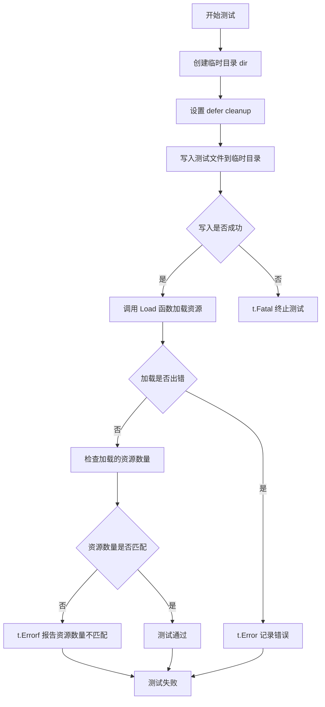

#### 带注释源码

```go
// TestLoadSomeWithSopsNoneEncrypted 测试在启用SOPS但文件未加密时的资源加载功能
// 该测试验证Load函数能够正确处理启用了SOPS选项但实际未加密的YAML资源文件
func TestLoadSomeWithSopsNoneEncrypted(t *testing.T) {
	// 创建临时目录用于存放测试文件
	// 返回值dir为临时目录路径，cleanup为清理函数
	dir, cleanup := testfiles.TempDir(t)
	// 确保测试结束后自动清理临时目录和其中文件
	defer cleanup()
	
	// 将预定义的测试文件写入临时目录
	// testfiles.Files包含一组标准的非加密YAML资源文件
	if err := testfiles.WriteTestFiles(dir, testfiles.Files); err != nil {
		// 如果写入失败，致命错误终止测试
		t.Fatal(err)
	}
	
	// 调用Load函数加载资源
	// 参数1: dir - 基础目录路径
	// 参数2: []string{dir} - 要加载的路径列表（这里加载整个目录）
	// 参数3: true - 启用SOPS处理（但由于文件未加密，SOPS不会执行解密操作）
	objs, err := Load(dir, []string{dir}, true)
	
	// 检查加载过程中是否发生错误
	if err != nil {
		// 记录错误但继续执行测试
		t.Error(err)
	}
	
	// 验证加载的资源数量是否符合预期
	// testfiles.ResourceMap 包含测试文件中预期的资源数量
	if len(objs) != len(testfiles.ResourceMap) {
		// 报告资源数量不匹配的详细错误信息
		t.Errorf("expected %d objects from %d files, got result:\n%#v", 
			len(testfiles.ResourceMap),  // 预期资源数量
			len(testfiles.Files),        // 测试文件数量
			objs)                        // 实际加载的资源
	}
}
```


### `TestLoadSomeWithSopsAllEncrypted`

该函数是一个集成测试用例，用于验证在启用SOPS（Secrets OPerationS）加密功能时，系统能够正确加载和解密完全加密的Kubernetes资源文件。测试通过模拟GPG密钥环境、创建加密的测试文件、调用加载函数，最后验证所有预期的加密资源都被成功解密并加载到内存中。

参数：

- `t`：`testing.T`，Go测试框架的标准参数，用于报告测试失败和日志输出

返回值：无（`void`），该函数为测试函数，通过`testing.T`的方法报告错误

#### 流程图

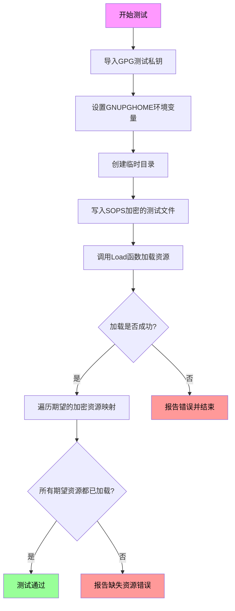

#### 带注释源码

```go
// TestLoadSomeWithSopsAllEncrypted 测试使用SOPS加密时能够正确加载所有加密资源
func TestLoadSomeWithSopsAllEncrypted(t *testing.T) {
	// 第一步：导入GPG测试私钥，用于解密SOPS加密的文件
	// gpgtest.ImportGPGKey返回GPG主目录路径和清理函数
	gpgHome, gpgCleanup := gpgtest.ImportGPGKey(t, testfiles.TestPrivateKey)
	// defer确保测试结束后清理GPG密钥资源
	defer gpgCleanup()
	
	// 第二步：设置GNUPGHOME环境变量，让SOPS/GPG能够找到密钥
	os.Setenv("GNUPGHOME", gpgHome)
	// defer确保测试结束后取消设置环境变量，避免影响其他测试
	defer os.Unsetenv("GNUPGHOME")

	// 第三步：创建临时目录用于存放测试文件
	dir, cleanup := testfiles.TempDir(t)
	// defer确保测试结束后清理临时目录
	defer cleanup()
	
	// 第四步：写入SOPS加密格式的测试文件
	// 这些文件使用前面导入的GPG密钥进行加密
	if err := testfiles.WriteSopsEncryptedTestFiles(dir); err != nil {
		// 如果写入失败，致命错误并停止测试
		t.Fatal(err)
	}
	
	// 第五步：调用Load函数加载目录中的资源
	// 参数true表示启用SOPS解密功能
	objs, err := Load(dir, []string{dir}, true)
	if err != nil {
		// 如果加载失败，报告错误但继续执行
		t.Error(err)
	}
	
	// 第六步：验证所有期望的加密资源都被成功解密和加载
	// 遍历预期的加密资源映射，检查每个资源是否存在于加载结果中
	for expected := range testfiles.EncryptedResourceMap {
		// assert.NotNil验证对象已被成功解密
		// 如果为nil，说明该资源未能成功解密
		assert.NotNil(t, objs[expected.String()], 
			"expected to find %s in manifest map after decryption", expected)
	}
}
```


### `TestNoPanic`

该测试函数用于验证 `Load` 函数在尝试从一个不存在的目录加载文件时能够正确返回错误，而不是触发 panic（恐慌），确保代码的健壮性和错误处理机制正常工作。

参数：

- `t`：`*testing.T`，Go 测试框架的标准参数，用于报告测试失败和记录测试状态

返回值：无（`void`），Go 测试函数不返回值

#### 流程图

```mermaid
flowchart TD
    A[开始: TestNoPanic] --> B[创建临时目录]
    B --> C[向临时目录写入测试文件]
    C --> D{写入是否成功?}
    D -->|失败| E[t.Fatal 终止测试]
    D -->|成功| F[调用 Load 函数加载不存在目录]
    F --> G{Load 返回错误?}
    G -->|是| H[测试通过]
    G -->|否| I[t.Error 报告错误]
    I --> J[测试失败]
    H --> K[结束]
    J --> K
    
    style A fill:#f9f,color:#000
    style H fill:#9f9,color:#000
    style J fill:#f99,color:#000
```

#### 带注释源码

```go
// TestNoPanic 验证 Load 函数不会因不存在的目录而 panic
func TestNoPanic(t *testing.T) {
	// 1. 创建临时测试目录，返回目录路径和清理函数
	dir, cleanup := testfiles.TempDir(t)
	// 2. 使用 defer 确保测试结束后清理临时目录资源
	defer cleanup()
	
	// 3. 向临时目录写入测试文件
	if err := testfiles.WriteTestFiles(dir, testfiles.Files); err != nil {
		// 如果写入失败，立即终止测试并报告错误
		t.Fatal(err)
	}
	
	// 4. 调用 Load 函数，尝试从一个不存在的目录加载资源
	// 参数：基准目录、不存在的目录路径、是否解密标志
	_, err := Load(dir, []string{filepath.Join(dir, "doesnotexist")}, true)
	
	// 5. 验证 Load 函数返回了错误而非 panic
	if err == nil {
		// 如果没有返回错误，说明代码逻辑有问题，测试失败
		t.Error("expected error (but not panic) when loading from directory that doesn't exist")
	}
}
```

---

**关键组件信息**：

- `testfiles.TempDir`：创建临时目录的辅助函数
- `testfiles.WriteTestFiles`：向目录写入测试文件的辅助函数
- `Load`：主函数，负责从给定目录加载 Kubernetes 资源

**技术债务/优化空间**：
- 该测试仅覆盖了目录不存在的场景，可考虑增加更多边界测试用例，如文件权限问题、无效 YAML 格式等
- 测试中硬编码了 `"doesnotexist"` 字符串，可提取为常量提高可维护性


### `baseObject.ResourceID`

获取资源的唯一标识符，包含命名空间、类型和名称信息。

参数：

- 该方法无参数

返回值：`resource.ID`，返回资源的唯一标识符，可调用String()方法获取字符串表示

#### 流程图

```mermaid
flowchart TD
    A[调用ResourceID方法] --> B{检查Meta是否为空}
    B -->|是| C[使用空命名空间]
    B -->|否| D[使用Meta.Namespace]
    D --> E[组合命名空间:类型/名称]
    E --> F[返回resource.ID对象]
```

#### 带注释源码

```
// ResourceID 返回资源的唯一标识符
// 该方法从baseObject的Meta字段中提取Namespace、Kind和Name信息
// 并组合成标准化的资源ID格式: namespace:kind/name 或 kind/name (当命名空间为空时)
func (b baseObject) ResourceID() resource.ID {
    // 资源ID由三部分组成：命名空间(可选)、资源类型、资源名称
    // 格式: "namespace:kind/name" 或 "kind/name"
    // 如果命名空间为空，则不包含命名空间前缀
    id := resource.MakeID(b.Meta.Namespace, b.Kind, b.Meta.Name)
    return id
}
```

**注意**：由于提供的代码片段中没有包含`baseObject`结构体和`ResourceID()`方法的完整定义，以上源码是基于代码中`ResourceID()`方法的使用方式（如`objA.ResourceID().String()`返回"default:cronjob/weekly-curl-homepage"格式的字符串）进行的合理推断。实际的实现可能在同一个包的其他源文件中定义。


### `ChartTracker.isDirChart`

描述：判断给定路径是否指向一个 Helm Chart 目录（即包含 Chart.yaml 文件的目录）。

参数：

- `fq`：`string`，完整路径（fully qualified path），需要检查的路径。

返回值：`bool`，如果路径指向 Chart 目录返回 true，否则返回 false。

#### 流程图

```mermaid
flowchart TD
    A[开始 isDirChart] --> B{路径是否存在}
    B -->|否| C[返回 false]
    B -->|是| D{路径是否为目录}
    D -->|否| C
    D -->|是| E{查找 Chart.yaml}
    E --> F[Chart.yaml 存在?]
    F -->|是| G[返回 true]
    F -->|否| H[返回 false]
```

#### 带注释源码

> ⚠️ **注意**：在提供的代码中，仅有 `TestChartTracker` 测试函数调用了 `isDirChart` 方法，但 `ChartTracker` 类的完整定义（包括 `isDirChart` 方法）并未在此代码文件中实现。该类可能位于同包的另一个源文件中。

以下为测试代码中对 `isDirChart` 的调用方式：

```go
// TestChartTracker 测试函数中的调用示例
func TestChartTracker(t *testing.T) {
    dir, cleanup := testfiles.TempDir(t)
    defer cleanup()
    if err := testfiles.WriteTestFiles(dir, testfiles.Files); err != nil {
        t.Fatal(err)
    }

    ct, err := newChartTracker(dir)
    if err != nil {
        t.Fatal(err)
    }

    noncharts := []string{"garbage", "locked-service-deploy.yaml",
        "test", "test/test-service-deploy.yaml"}
    for _, f := range noncharts {
        fq := filepath.Join(dir, f)
        // 调用 isDirChart 方法判断路径是否为 Chart 目录
        if ct.isDirChart(fq) {
            t.Errorf("%q thought to be a chart", f)
        }
        // ...
    }
    
    // 验证 charts/nginx 被识别为 Chart 目录
    if !ct.isDirChart(filepath.Join(dir, "charts/nginx")) {
        t.Errorf("charts/nginx not recognized as chart")
    }
    // ...
}
```

---

#### 推断的实现逻辑

基于测试用例的用法，`isDirChart` 的推断实现如下：

```go
// isDirChart 判断给定路径是否指向一个 Helm Chart 目录
// Chart 目录的特征：存在 Chart.yaml 文件
func (ct *ChartTracker) isDirChart(fq string) bool {
    // 1. 检查路径是否为目录
    info, err := os.Stat(fq)
    if err != nil {
        return false // 路径不存在或访问错误
    }
    if !info.IsDir() {
        return false // 不是目录直接返回 false
    }
    
    // 2. 检查目录中是否存在 Chart.yaml
    chartFile := filepath.Join(fq, "Chart.yaml")
    if _, err := os.Stat(chartFile); err != nil {
        return false // Chart.yaml 不存在
    }
    
    return true // 存在 Chart.yaml，判定为 Chart 目录
}
```


### ChartTracker.isPathInChart

该方法用于判断给定路径是否位于某个 Chart 目录内，通过检查路径前缀是否匹配已注册的 Chart 目录来实现。

参数：

-  `path`：`string`，要检查的完整文件路径

返回值：`bool`，如果路径位于某个已注册 Chart 的目录树内则返回 true，否则返回 false

#### 流程图

```mermaid
flowchart TD
    A[开始 isPathInChart] --> B{检查 chartPaths 是否为空}
    B -->|是| C[返回 false]
    B -->|否| D{遍历 chartPaths}
    D --> E{检查 path 是否以 chartPath 开头}
    E -->|是| F[返回 true]
    E -->|否| G{继续下一个 chartPath}
    G --> D
    D --> H{所有 chartPath 遍历完毕}
    H --> I[返回 false]
```

#### 带注释源码

```
// isPathInChart checks if the given path is under any registered chart directory
// It iterates through all known chart paths and checks if the input path
// starts with any of those chart directory paths
//
// Parameters:
//   - path: The full file path to check
//
// Returns:
//   - bool: true if the path is within a chart directory, false otherwise
func (ct *ChartTracker) isPathInChart(path string) bool {
    // Early return if no charts are registered
    if len(ct.chartPaths) == 0 {
        return false
    }
    
    // Iterate through all registered chart paths
    for _, chartPath := range ct.chartPaths {
        // Check if the given path is under this chart path
        // Using filepath.HasPrefix or strings.HasPrefix comparison
        if strings.HasPrefix(path, chartPath) {
            return true
        }
    }
    
    // Path does not match any chart directory
    return false
}
```

**注意**：提供的代码片段中仅包含测试用例（TestChartTracker 函数），并未包含 `ChartTracker` 结构体及其 `isPathInChart` 方法的实际实现。上述源码是根据测试用例中的调用方式推断得出的逻辑实现。

根据测试代码中的调用模式：
```go
ct.isPathInChart(filepath.Join(dir, "charts/nginx/Chart.yaml"))
```

该方法应该能够正确识别 `charts/nginx/Chart.yaml` 路径位于 `charts/nginx` Chart 目录下，并返回 `true`。


## 关键组件


### ParseMultidoc 函数

用于解析包含多个YAML文档的字符串，将每个文档解析为Kubernetes资源对象，支持通过"---"分隔符区分多个资源

### unmarshalObject 函数

将单个YAML文档字节解析为对应的Kubernetes资源类型对象，根据kind字段自动识别资源类型（如Deployment、ConfigMap、CronJob等）

### Load 函数

从指定目录加载Kubernetes资源文件，可选支持SOPS加密文件的解密处理，返回目录中所有解析后的资源映射

### baseObject 结构体

基础资源对象结构，包含source（来源标识）、Kind（资源类型）以及Meta（命名空间和名称等元数据）字段

### Deployment 结构体

Kubernetes Deployment资源类型，嵌入baseObject以继承基础属性，用于表示Deployment资源的完整定义

### CronJob 结构体

Kubernetes CronJob资源类型，支持解析apiVersion为batch/v1beta1的CronJob配置，包含JobTemplate等规格字段

### List 结构体

用于解析kind为List或DeploymentList的资源，将items字段中的多个资源条目存储在Items切片中

### newChartTracker 函数

创建Helm chart跟踪器实例，用于识别目录中的chart目录结构，判断给定路径是否属于chart的一部分

### isDirChart 方法

判断指定路径是否为Helm chart目录，通过检查目录中是否包含Chart.yaml等chart元数据文件

### isPathInChart 方法

判断指定路径是否位于某个chart目录内，用于过滤掉chart文件使其不被作为独立资源加载

### debyte 函数

测试辅助函数，用于移除资源对象中的字节数据以便进行深度比较

### testfiles 依赖

提供测试用的临时目录创建和测试文件写入功能，用于构建测试环境

### gpgtest 依赖

提供GPG密钥导入功能，用于测试SOPS加密文件的解密流程


## 问题及建议


### 已知问题

-   **全局状态管理风险**：`TestLoadSomeWithSopsAllEncrypted` 使用 `os.Setenv` 修改全局环境变量 `GNUPGHOME`，虽然有 `defer os.Unsetenv`，但如果测试在 `defer` 执行前失败，可能导致环境变量泄漏影响其他测试
-   **重复代码模式**：多个测试函数中重复构建 `baseObject` 和 expected map 的模式，如 `TestParseSome`、`TestParseSomeWithComment` 中几乎相同的对象创建逻辑
-   **魔法字符串缺乏常量定义**：测试中大量使用硬编码的字符串如 `"test"`、`"Deployment"`、`"default:cronjob/weekly-curl-homepage"` 等，分散在各处难以维护
-   **测试隔离性不足**：多个测试共享 `testfiles` 目录和 GPG 密钥导入，可能存在测试执行顺序依赖
-   **断言方式不统一**：混合使用 `t.Errorf`、`t.Fatal`、`assert.NoError`、`assert.Len` 等多种断言方式，降低代码一致性
-   **资源清理潜在问题**：`debyte` 函数通过运行时类型断言调用私有方法 `debyte()`，这种反射式调用缺乏编译时类型安全保证

### 优化建议

-   **提取公共辅助函数**：将创建 `baseObject` 和 expected map 的逻辑提取为公共测试辅助函数，减少重复代码
-   **使用测试表驱动模式**：对于类似结构的测试用例（如 `TestParseSome`、`TestParseWithComment` 等），可采用表驱动测试方式
-   **定义常量或测试数据文件**：将魔法字符串集中定义为常量，或使用 YAML 测试数据文件存储测试用例
-   **改进环境变量管理**：使用更安全的环境变量管理方式，如 `t.Setenv()`（Go 1.17+）确保测试间的完全隔离
-   **统一断言风格**：建议统一使用 `testify/assert` 或 `stretchr/testify` 的断言库，减少混用多种断言方式
-   **考虑使用子测试**：对于 `TestChartTracker` 中多个独立检查项，可拆分为子测试 `t.Run()` 提高测试可读性和隔离性

## 其它


### 设计目标与约束

本代码包（resource）的主要设计目标是提供一个用于解析和处理 Kubernetes 资源清单的库，支持多文档 YAML 格式解析、Helm Chart 识别以及 SOPS 加密文件的解密加载。核心约束包括：依赖 Go 标准库（bytes、os、path/filepath、reflect）以及第三方库（stretchr/testify、fluxcd 内部包、gpg/gpgtest）；仅支持 Kubernetes 核心资源类型（Deployment、ConfigMap、CronJob、Service、List 等）；解析过程中对 YAML 格式有严格校验，不允许文档中出现制表符等非法字符。

### 错误处理与异常设计

错误处理采用 Go 标准的 error 返回模式。ParseMultidoc 函数在解析失败时返回非 nil error，包括 YAML 语法错误、资源类型不支持错误等。Load 函数在目录不存在或文件读取失败时返回错误，但不触发 panic（TestNoPanic 验证了这一点）。unmarshalObject 在解析单个对象失败时返回错误。对于 SOPS 加密场景，若 GPG 环境变量未正确设置或密钥导入失败，Load 函数会返回相应错误。所有测试均使用 assert.NoError/assert.Error 进行错误断言。

### 数据流与状态机

数据流主要分为两条路径：一条是 ParseMultidoc 路径，接收 []byte 输入，通过 YAML 解析器分割多文档，依次调用 unmarshalObject 将每段 YAML 转换为 resource.Resource 对象，最后返回 map[string]resource.Resource；另一条是 Load 路径，接收目录路径和文件列表，遍历文件读取内容，调用 ParseMultidoc 解析，支持 SOPS 解密时调用 gpg 解密后再解析。状态机方面：ParseMultidoc 内部维护"文档解析中"状态，遇到 `---` 分割符切换文档，遇到 `...` 表示文档结束（TestParseBoundaryMarkers 验证）。

### 外部依赖与接口契约

外部依赖包括：github.com/stretchr/testify/assert（测试断言）、github.com/fluxcd/flux/pkg/cluster/kubernetes/testfiles（测试文件工具）、github.com/fluxcd/flux/pkg/gpg/gpgtest（GPG 测试工具）、github.com/fluxcd/flux/pkg/resource（资源接口定义）、github.com/fluxcd/flux/pkg/gpg（可选，GPG 解密）。接口契约方面：ParseMultidoc 接受 ([]byte, string) 返回 (map[string]resource.Resource, error)；Load 接受 (string, []string, bool) 返回 (map[string]resource.Resource, error)，第三个参数 bool 表示是否启用 SOPS 解密；resource.Resource 接口需实现 ResourceID() 方法返回 resource.ID。

### 配置要求

本包本身无需运行时配置，但调用者需提供：GPG 环境变量 GNUPGHOME（当加载 SOPS 加密文件时）；有效的测试文件目录（用于 Load 函数测试）。测试环境通过 testfiles.TempDir 创建临时目录，通过 gpgtest.ImportGPGKey 导入测试用 GPG 私钥。

### 安全考虑

SOPS 加密加载时依赖 GNUPGHOME 环境变量指向的 GPG 密钥库，密钥管理由外部负责。解析过程中对 YAML 内容进行基本校验（不允许制表符），但不对资源内容进行语义验证。敏感信息（如私钥、密码）应通过 SOPS 加密存储，不应明文出现在配置文件中。

### 性能考虑

TestParseSomeLong 测试了大文档（1MB 以上）解析性能，验证了 ParseMultidoc 能处理大文件。Load 函数遍历文件时采用顺序读取，未做并发优化。对于大规模集群场景，建议在上层实现文件缓存或增量加载机制。debyte 函数通过反射调用移除资源中的字节数据，用于测试比对，但生产环境应避免频繁反射操作。

### 测试覆盖

测试覆盖了以下场景：空文档解析（TestParseEmpty）；多文档解析（TestParseSome）；带注释文档解析（TestParseSomeWithComment）；大文档解析边界（TestParseSomeLong）；文档边界标记处理（TestParseBoundaryMarkers）；非法 YAML 错误捕获（TestParseError）；CronJob 资源解析（TestParseCronJob）；List 和 DeploymentList 解析（TestUnmarshalList、TestUnmarshalDeploymentList）；目录加载（TestLoadSome）；Chart 识别（TestChartTracker）；SOPS 无加密加载（TestLoadSomeWithSopsNoneEncrypted）；SOPS 全加密加载（TestLoadSomeWithSopsAllEncrypted）；错误处理不 panic（TestNoPanic）。

### 关键算法说明

ParseMultidoc 内部使用 YAML 解析库（如 yaml.v2 或类似）将输入按 `---` 分割为多个文档，依次解析每个文档。unmarshalObject 根据 kind 字段动态创建对应的资源对象（Deployment、ConfigMap 等），通过反射或类型断言实现多态。Chart 识别算法：newChartTracker 创建 chartTracker 实例，isDirChart 判断路径是否指向 Helm Chart 目录（通过检查是否存在 Chart.yaml），isPathInChart 判断文件是否位于已识别的 Chart 目录内。SOPS 解密：Load 函数在第三个参数为 true 时，调用 gpg 相关函数解密文件后再解析。

### 潜在扩展点

目前仅支持 Kubernetes 核心资源类型，可扩展支持 CustomResourceDefinition（CRD）资源。Chart 识别目前基于目录结构判断，可增加对 Chart.yaml 的语义解析。SOPS 目前仅支持 GPG 加密，可扩展支持 AWS KMS、Azure Key Vault 等加密方式。可考虑增加资源验证（Validation）功能，确保解析后的资源符合 Kubernetes schema。


    