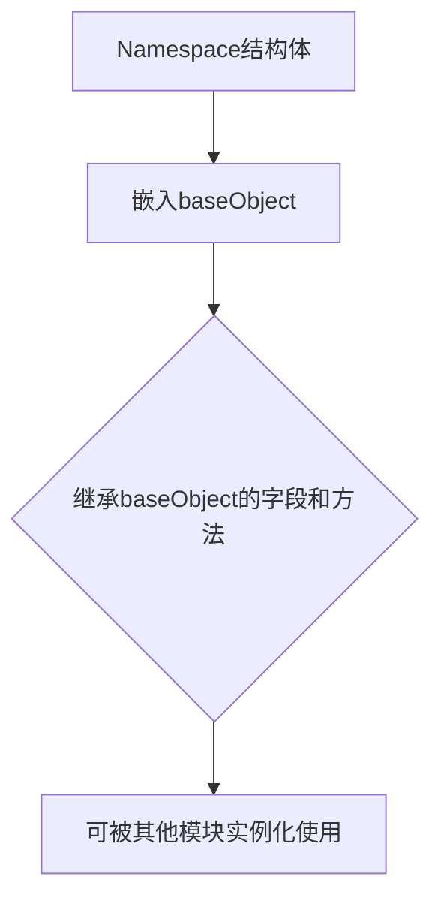

# `flux\pkg\cluster\kubernetes\resource\namespace.go` 详细设计文档

定义了一个Namespace结构体，通过嵌入baseObject来继承基础对象的功能，用于表示资源管理系统中的命名空间概念。

## 整体流程



## 类结构

```
Namespace (具体结构体)
└── baseObject (嵌入的基类结构体)
```

## 全局变量及字段


### `Namespace.baseObject`
    
嵌入的基类对象，提供基础属性和方法

类型：`baseObject`
    
    

## 全局函数及方法


## 关键组件


### Namespace 结构体

Namespace是resource包中的核心资源类型，用于表示资源命名空间，通过嵌入baseObject继承基础对象的能力，实现资源的基本属性和行为。

### baseObject 嵌入

baseObject作为嵌入类型，为Namespace提供基础对象功能，包括资源的通用字段和方法，是实现资源层次结构的关键组件。


## 问题及建议


### 已知问题

- **缺少字段定义**：Namespace 结构体仅嵌入 baseObject，缺少该资源类型的特有字段定义（如元数据、状态等）
- **缺少方法实现**：没有为 Namespace 类型定义任何方法，无法满足资源对象的操作需求（如 CRUD 操作）
- **缺少构造函数**：没有提供创建 Namespace 实例的构造函数，导致外部调用时无法正确初始化对象
- **baseObject 依赖不明确**：依赖 baseObject 但代码中未展示其定义，使用者无法了解其具体结构和功能
- **缺乏接口实现**：未实现任何接口（如 resource.Resource），无法与其他系统组件进行解耦交互
- **无验证逻辑**：缺少对 Namespace 数据有效性验证的逻辑
- **文档缺失**：没有为类型、字段或方法提供任何注释或文档说明

### 优化建议

- **定义核心字段**：根据 Kubernetes 或类似资源管理框架的规范，为 Namespace 添加必要字段，如 Name、Labels、Annotations、Status 等
- **实现基础方法**：添加 NewNamespace 构造函数，以及 GetName、SetLabels、GetStatus 等常用方法
- **接口抽象**：定义 NamespaceInterface 接口，实现依赖倒置，便于单元测试和模块替换
- **数据验证**：在构造函数或 Setter 方法中添加字段验证逻辑（如名称格式、标签键值规范等）
- **完善 baseObject**：明确 baseObject 的定义，或将其替换为更明确的基类/嵌入结构
- **添加文档注释**：为类型和重要方法添加 Go 文档注释，说明其用途和使用场景
- **考虑可扩展性**：预留字段扩展机制，支持自定义资源的扩展


## 其它


### 设计目标与约束

设计目标：定义资源管理的命名空间抽象，用于组织和管理相关资源，提供基础的对象结构支持。

约束：
- 该结构体嵌入baseObject，需与baseObject配合使用
- Go语言无继承特性，通过嵌入实现组合
- 命名空间通常作为资源标识的前缀使用

### 错误处理与异常设计

错误处理方式：
- 依赖baseObject的错误处理机制
- 建议在baseObject中定义统一的错误类型
- 资源创建失败时返回error类型

异常设计：
- Go语言无异常机制，采用错误返回值模式
- 建议定义包级别的错误变量，如ErrInvalidNamespace

### 数据流与状态机

数据流：
- Namespace作为资源容器，数据流主要涉及资源的创建、查询、删除操作
- 嵌入的baseObject提供基础的对象元数据

状态机：
- 简单结构，无复杂状态转换
- 资源状态由baseObject管理

### 外部依赖与接口契约

外部依赖：
- 依赖baseObject类型，需定义baseObject的具体结构
- 可能依赖resource包内的其他资源类型

接口契约：
- 建议实现资源接口（如Resource interface）
- 需定义命名空间的基本操作方法

### 安全性考虑

访问控制：
- 字段访问性默认为包私有
- 敏感字段需改为导出（首字母大写）

输入验证：
- 创建Namespace时需验证名称合法性
- 防止空指针或无效引用

### 性能要求

性能考量：
- 结构体简单，无明显性能瓶颈
- 嵌入方式可能增加内存开销，需评估

### 配置管理

配置项：
- 命名空间名称
- 命名空间描述
- 关联的baseObject配置

### 并发处理

并发安全：
- 当前为简单数据结构，无锁机制
- 如需并发安全，需在baseObject中实现sync.Mutex或atomic操作

### 测试策略

测试建议：
- 单元测试验证Namespace创建和基本方法
- 集成测试验证与baseObject的交互
- 边界条件测试：空名称、超长名称等

### 演进路线

短期：
- 明确定义baseObject结构
- 实现基本的CRUD操作

长期：
- 支持命名空间层级关系
- 添加资源配额管理
- 实现命名空间隔离策略


    