# `flux\pkg\cluster\kubernetes\resource\resource.go` 详细设计文档

这是一个用于处理Kubernetes资源清单的Go语言包，提供了将YAML/JSON格式的Kubernetes资源配置反序列化为结构化对象的功能，支持多种Kubernetes资源类型（如CronJob、DaemonSet、Deployment、StatefulSet等），并实现了策略注解解析、资源标识管理和命名空间处理等核心功能。

## 整体流程

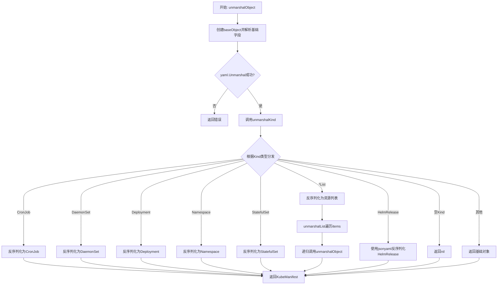

## 类结构

```
KubeManifest (接口)
└── baseObject (基础实现结构体)
    ├── CronJob
    ├── DaemonSet
    ├── Deployment
    ├── Namespace
    ├── StatefulSet
    ├── HelmRelease
    └── List

辅助类型:
└── rawList (用于原始列表反序列化)
```

## 全局变量及字段


### `PolicyPrefix`
    
Flux policy annotation prefix

类型：`const string`
    


### `FilterPolicyPrefix`
    
Filter policy annotation prefix

类型：`const string`
    


### `AlternatePolicyPrefix`
    
Backward-compatible policy annotation prefix

类型：`const string`
    


### `ClusterScope`
    
Cluster scope placeholder for resources without namespace

类型：`const string`
    


### `baseObject.baseObject.source`
    
Source identifier or file path of the manifest

类型：`string`
    


### `baseObject.baseObject.bytes`
    
Raw byte content of the YAML manifest

类型：`[]byte`
    


### `baseObject.baseObject.APIVersion`
    
Kubernetes API version string

类型：`string`
    


### `baseObject.baseObject.Kind`
    
Kubernetes resource kind

类型：`string`
    


### `baseObject.baseObject.Meta.Namespace`
    
Kubernetes namespace

类型：`string`
    


### `baseObject.baseObject.Meta.Name`
    
Kubernetes resource name

类型：`string`
    


### `baseObject.baseObject.Meta.Annotations`
    
Metadata annotations for policy and configuration

类型：`map[string]string`
    


### `rawList.rawList.Items`
    
Raw list items as generic maps

类型：`[]map[string]interface{}`
    


### `CronJob.CronJob.baseObject`
    
Embedded base object for CronJob

类型：`embedded baseObject`
    


### `DaemonSet.DaemonSet.baseObject`
    
Embedded base object for DaemonSet

类型：`embedded baseObject`
    


### `Deployment.Deployment.baseObject`
    
Embedded base object for Deployment

类型：`embedded baseObject`
    


### `Namespace.Namespace.baseObject`
    
Embedded base object for Namespace

类型：`embedded baseObject`
    


### `StatefulSet.StatefulSet.baseObject`
    
Embedded base object for StatefulSet

类型：`embedded baseObject`
    


### `HelmRelease.HelmRelease.baseObject`
    
Embedded base object for HelmRelease

类型：`embedded baseObject`
    


### `List.List.baseObject`
    
Embedded base object for List

类型：`embedded baseObject`
    


### `List.List.Items`
    
List of parsed Kubernetes manifests

类型：`[]KubeManifest`
    
    

## 全局函数及方法


### `PoliciesFromAnnotations`

该函数负责将 Kubernetes 资源的注解（annotations）转换为策略集合（policy.Set）。它遍历注解映射，识别以特定前缀（fluxcd.io/、flux.weave.works/、filter.fluxcd.io/）开头的键，并根据键名提取策略名称，根据注解值设置策略内容。

参数：

- `annotations`：`map[string]string`，包含资源注解的键值对映射

返回值：`policy.Set`，从注解中解析并构建的策略集合

#### 流程图

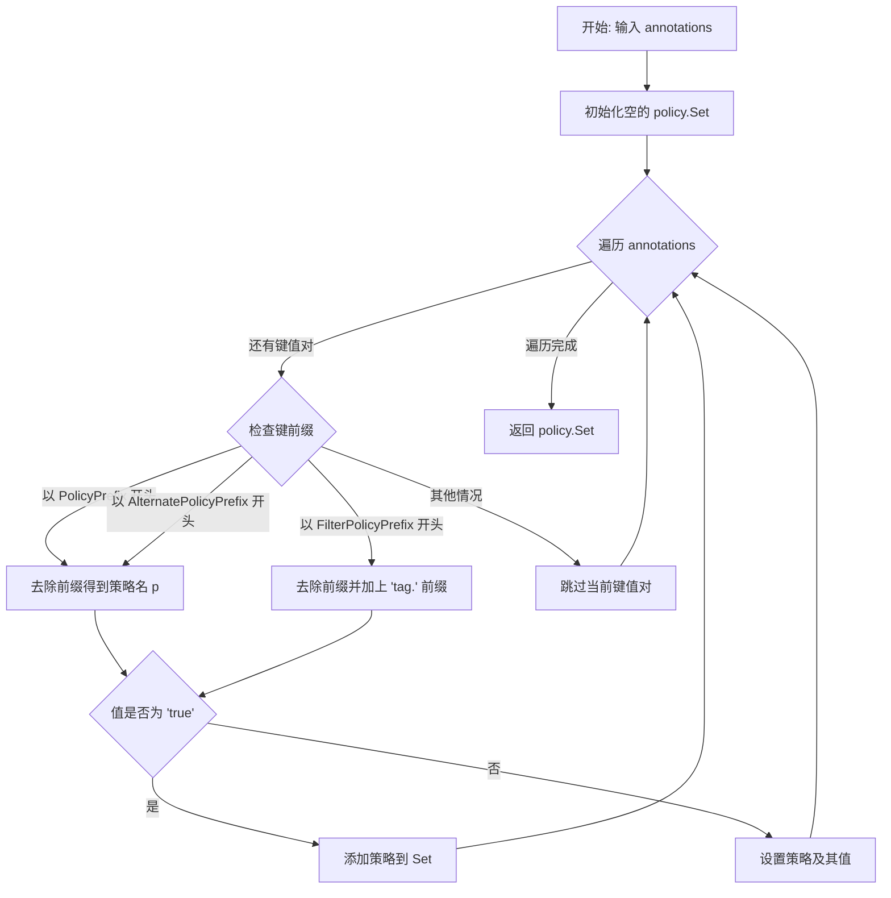

#### 带注释源码

```go
// PoliciesFromAnnotations 将注解映射转换为策略集合
// 它识别以特定前缀开头的注解键，并从中提取策略信息
func PoliciesFromAnnotations(annotations map[string]string) policy.Set {
	// 初始化空的策略集合
	set := policy.Set{}
	
	// 遍历所有注解键值对
	for k, v := range annotations {
		var p string  // 用于存储提取后的策略名
		
		// 根据注解键的前缀类型进行匹配处理
		switch {
		// 处理标准前缀: fluxcd.io/
		case strings.HasPrefix(k, PolicyPrefix):
			p = strings.TrimPrefix(k, PolicyPrefix)
		
		// 处理兼容旧版本的前缀: flux.weave.works/
		case strings.HasPrefix(k, AlternatePolicyPrefix):
			p = strings.TrimPrefix(k, AlternatePolicyPrefix)
		
		// 处理过滤策略前缀: filter.fluxcd.io/
		case strings.HasPrefix(k, FilterPolicyPrefix):
			// 为过滤策略添加 "tag." 前缀以区分类型
			p = "tag." + strings.TrimPrefix(k, FilterPolicyPrefix)
		
		// 不匹配任何已知前缀的注解被跳过
		default:
			continue
		}

		// 根据注解值决定如何添加策略
		if v == "true" {
			// 如果值为 "true"，则添加布尔型策略（存在即为真）
			set = set.Add(policy.Policy(p))
		} else {
			// 否则，设置策略及其具体值
			set = set.Set(policy.Policy(p), v)
		}
	}
	
	// 返回构建完成的策略集合
	return set
}
```


### `unmarshalObject`

将 YAML 字节数据反序列化为 Kubernetes 资源清单（KubeManifest），首先解析基础元数据，然后根据资源类型（Kind）委托给 `unmarshalKind` 函数进行具体资源类型的反序列化处理。

参数：

- `source`：`string`，表示资源来源标识，用于错误信息中定位问题
- `bytes`：`[]byte`，包含 YAML 格式的 Kubernetes 资源定义字节数据

返回值：`KubeManifest`，解析成功后返回具体的 Kubernetes 资源对象（实现了 KubeManifest 接口的各种类型）；`error`，解析过程中发生错误时返回

#### 流程图

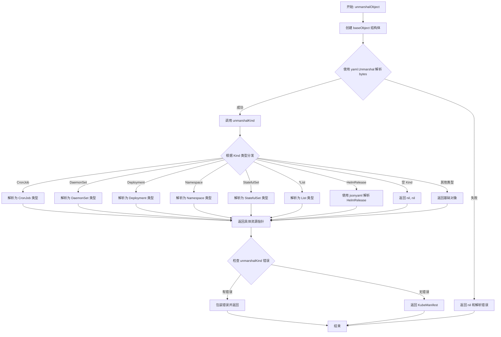

#### 带注释源码

```go
// unmarshalObject 将 YAML 字节数据反序列化为 KubeManifest 接口类型
// 参数 source 用于错误信息中标识来源，bytes 是 YAML 内容
// 返回解析后的 KubeManifest 对象或解析过程中的错误
func unmarshalObject(source string, bytes []byte) (KubeManifest, error) {
	// 1. 创建基础对象，包含 source 和 bytes 存储，以及用于 unmarshal 的基础字段
	var base = baseObject{source: source, bytes: bytes}
	
	// 2. 首次 unmarshal：仅解析基础元数据（apiVersion, kind, metadata）
	//    这里只填充 baseObject 中的字段，不解析具体的资源类型
	if err := yaml.Unmarshal(bytes, &base); err != nil {
		// 如果基础解析失败，直接返回错误
		return nil, err
	}
	
	// 3. 根据解析出的 Kind 类型，委托给 unmarshalKind 进行具体类型解析
	r, err := unmarshalKind(base, bytes)
	if err != nil {
		// 如果具体类型解析失败，包装错误信息并返回
		return nil, makeUnmarshalObjectErr(source, err)
	}
	
	// 4. 返回解析得到的 KubeManifest 对象
	return r, nil
}
```


### `unmarshalKind`

该函数是 Kubernetes 资源反序列化的核心分发器。它接收一个已初步解析出元数据（特别是 `Kind` 字段）的 `baseObject` 和原始字节流，然后根据 `Kind` 的值使用不同的策略（标准 YAML 库或 JSON 兼容库）将其反序列化为具体的资源结构体（如 Deployment、DaemonSet），或处理列表类型，最后返回一个实现了 `KubeManifest` 接口的对象。

参数：

- `base`：`baseObject`，包含了从原始字节中初步解析出的 Kubernetes 资源元数据（API Version, Kind, Metadata 等），特别是 `Kind` 字段用于判断后续的反序列化类型。
- `bytes`：`[]byte`， Kubernetes 资源的原始 YAML 格式字节数据。

返回值：
- `KubeManifest`：返回解析后的具体资源对象指针（实现了 `KubeManifest` 接口），如果是空类型则返回 `nil`。
- `error`：如果在反序列化过程中发生错误（如 YAML 解析失败），则返回错误信息。

#### 流程图

```mermaid
flowchart TD
    Start(输入: base, bytes) --> CheckKind{根据 base.Kind 判断}
    
    CheckKind -->|CronJob| UCron[实例化并反序列化 CronJob]
    CheckKind -->|DaemonSet| UDaemon[实例化并反序列化 DaemonSet]
    CheckKind -->|Deployment| UDeploy[实例化并反序列化 Deployment]
    CheckKind -->|Namespace| UNs[实例化并反序列化 Namespace]
    CheckKind -->|StatefulSet| USs[实例化并反序列化 StatefulSet]
    CheckKind -->|*List| UList[处理 List 类型资源]
    CheckKind -->|HelmRelease| UHelm[使用 jsonyaml 反序列化 HelmRelease]
    CheckKind -->|空字符串 ("")| UEmpty[返回 nil, nil]
    CheckKind -->|Default| UDefault[返回基础 baseObject]
    
    UCron --> Return(返回 KubeManifest)
    UDaemon --> Return
    UDeploy --> Return
    UNs --> Return
    USs --> Return
    UList --> Return
    UHelm --> Return
    UEmpty --> End(End)
    UDefault --> End
```

#### 带注释源码

```go
// unmarshalKind 根据传入的 baseObject 中定义的 Kind 类型，
// 将原始的字节数据反序列化为具体的 Kubernetes 资源对象。
// 它处理了常见的 K8s 资源类型以及特殊的 HelmRelease 和 List 类型。
func unmarshalKind(base baseObject, bytes []byte) (KubeManifest, error) {
	// 使用 switch 语句根据资源的 Kind 字段进行分发处理
	switch {
	// 处理 CronJob 类型
	case base.Kind == "CronJob":
		var cj = CronJob{baseObject: base} // 嵌入 baseObject
		if err := yaml.Unmarshal(bytes, &cj); err != nil {
			return nil, err // 解码失败，返回错误
		}
		return &cj, nil

	// 处理 DaemonSet 类型
	case base.Kind == "DaemonSet":
		var ds = DaemonSet{baseObject: base}
		if err := yaml.Unmarshal(bytes, &ds); err != nil {
			return nil, err
		}
		return &ds, nil

	// 处理 Deployment 类型
	case base.Kind == "Deployment":
		var dep = Deployment{baseObject: base}
		if err := yaml.Unmarshal(bytes, &dep); err != nil {
			return nil, err
		}
		return &dep, nil

	// 处理 Namespace 类型
	case base.Kind == "Namespace":
		var ns = Namespace{baseObject: base}
		if err := yaml.Unmarshal(bytes, &ns); err != nil {
			return nil, err
		}
		return &ns, nil

	// 处理 StatefulSet 类型
	case base.Kind == "StatefulSet":
		var ss = StatefulSet{baseObject: base}
		if err := yaml.Unmarshal(bytes, &ss); err != nil {
			return nil, err
		}
		return &ss, nil

	// 处理所有以 "List" 结尾的资源类型 (如 ConfigMapList, PodList)
	// 这是一个通用的列表处理逻辑，递归调用 unmarshalObject 解析列表中的每一项
	case strings.HasSuffix(base.Kind, "List"):
		var raw rawList
		if err := yaml.Unmarshal(bytes, &raw); err != nil {
			return nil, err
		}
		var list List
		unmarshalList(base, &raw, &list)
		return &list, nil

	// 处理 HelmRelease 类型，使用了特殊的库 (ghodss/yaml) 来处理其复杂的字段类型
	case base.Kind == "HelmRelease":
		var hr = HelmRelease{baseObject: base}
		// NB: 这是 go-yaml/yaml 的一个变通方案 (issue #139)
		// 使用 github.com/ghodss/yaml 可以确保 HelmRelease 的 Values 字段被正确解析为字符串而非 interface{}
		if err := jsonyaml.Unmarshal(bytes, &hr); err != nil {
			return nil, err
		}
		return &hr, nil

	// 处理空 Kind，通常是由于注释或空文件导致，返回 nil, nil
	case base.Kind == "":
		// 如果遇到空的资源 (例如由于注释引入)，我们返回资源的 nil 和错误的 nil
		// (这实际上不是一个错误)。我们假设无效的非资源 yaml 不太可能发生，暂不报错。
		return nil, nil

	// 默认情况：对于未知的资源类型，返回嵌入的 baseObject
	// 这些通常是 K8s 内置的我们没有专门定义结构体的资源，直接返回基础对象即可
	default:
		return &base, nil
	}
}
```


### `unmarshalList`

将原始 YAML 列表数据解析为 `List` 类型的 Kubernetes 资源列表，逐项反序列化为 `KubeManifest` 对象。

参数：

- `base`：`baseObject`，包含列表的基础元数据（源、API 版本、种类等）
- `raw`：`*rawList`，指向包含原始 YAML 列表数据的指针
- `list`：`*List`，指向目标列表对象的指针，用于存储反序列化结果

返回值：`error`，如果反序列化过程中发生错误则返回错误，否则返回 `nil`

#### 流程图

```mermaid
flowchart TD
    A[开始 unmarshalList] --> B[list.baseObject = base]
    B --> C[创建 list.Items 切片, 长度与 raw.Items 相同]
    C --> D{遍历 raw.Items}
    D -->|每个 item| E[yaml.Marshal(item) 序列化为字节]
    E --> F{检查错误}
    F -->|有错误| G[返回 error]
    F -->|无错误| H[unmarshalObject 反序列化字节]
    H --> I{检查错误}
    I -->|有错误| G
    I -->|无错误| J[list.Items[i] = res]
    J --> D
    D -->|遍历完成| K[返回 nil]
```

#### 带注释源码

```go
// unmarshalList 将原始列表数据反序列化为 List 对象
// 参数:
//   - base: 基础对象，包含源文件和元数据信息
//   - raw: 原始列表结构，包含未解析的 items
//   - list: 目标列表，用于存储解析后的 KubeManifest 对象
//
// 返回值: 错误信息，反序列化失败时返回错误
func unmarshalList(base baseObject, raw *rawList, list *List) error {
	// 1. 将基础对象赋值给列表
	list.baseObject = base

	// 2. 初始化列表切片，预分配内存
	list.Items = make([]KubeManifest, len(raw.Items), len(raw.Items))

	// 3. 遍历原始列表中的每个项目
	for i, item := range raw.Items {
		// 3.1 将每个 item 序列化为 YAML 字节数组
		bytes, err := yaml.Marshal(item)
		if err != nil {
			// 序列化失败，返回错误
			return err
		}

		// 3.2 反序列化为 KubeManifest 对象
		res, err := unmarshalObject(base.source, bytes)
		if err != nil {
			// 反序列化失败，返回错误
			return err
		}

		// 3.3 将解析结果存入列表
		list.Items[i] = res
	}

	// 4. 全部处理完成，返回 nil 表示成功
	return nil
}
```


### `makeUnmarshalObjectErr`

该函数是一个错误工厂函数，用于将对象反序列化过程中产生的底层错误包装成结构化的 fluxcd 错误类型，以便于向上层调用者提供更友好的错误信息，特别是告诉用户可能是 YAML 格式问题导致的解析失败。

参数：

- `source`：`string`，表示导致解析失败的 YAML 源内容，用于在错误信息中定位问题
- `err`：`error`，原始的解析错误，包含具体的错误细节

返回值：`*fluxerr.Error`，返回封装后的 fluxcd 错误对象，包含错误类型、原始错误和友好的帮助信息

#### 流程图

```mermaid
flowchart TD
    A[开始: makeUnmarshalObjectErr] --> B[接收 source 和 err 参数]
    B --> C[创建 fluxerr.Error 结构体]
    C --> D[设置 Error.Type = fluxerr.User]
    D --> E[设置 Error.Err = 传入的 err]
    E --> F[构建 Help 消息: 'Could not parse \"' + source + '\"...']
    F --> G[返回 *fluxerr.Error 指针]
    G --> H[结束]
```

#### 带注释源码

```go
// makeUnmarshalObjectErr 是一个错误工厂函数，用于将反序列化过程中的底层错误
// 包装成 fluxcd 统一的错误类型fluxerr.Error
// 参数:
//   - source: 解析失败的 YAML 源字符串，用于错误定位
//   - err:    原始的解析错误
//
// 返回值:
//   - *fluxerr.Error: 封装后的结构化错误，包含用户友好的错误提示
func makeUnmarshalObjectErr(source string, err error) *fluxerr.Error {
	// 创建一个fluxerr.Error结构体实例
	// Type设置为User表示这是用户操作导致的错误（如YAML格式不正确）
	// Err保存原始错误用于日志记录或调试
	// Help提供用户友好的错误说明
	return &fluxerr.Error{
		Type: fluxerr.User,   // 错误类型：用户错误
		Err:  err,            // 原始错误
		Help: `Could not parse "` + source + `".

This likely means it is malformed YAML.
`, // 帮助信息：提示用户可能是YAML格式错误
	}
}
```


### `baseObject.GroupVersion` / `KubeManifest.GroupVersion`

该方法实现了 `KubeManifest` 接口，返回 Kubernetes 资源的 API 版本标识（如 "v1"、"apps/v1" 等），用于标识资源所属的 API 组和版本信息。

参数：

- （无显式参数，接收者 `o baseObject` 为隐式参数）

返回值：`string`，返回资源的 API 版本字符串，格式为 "group/version"，其中 group 可为空（如 "v1" 表示 core API 组）。

#### 流程图

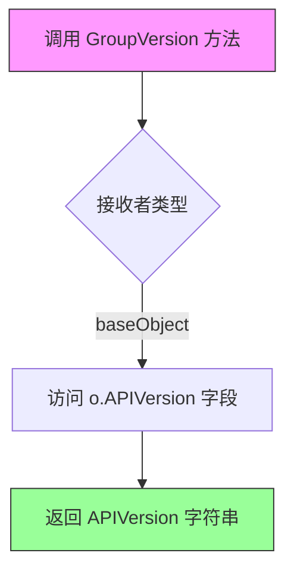

#### 带注释源码

```go
// GroupVersion implements KubeManifest.GroupVersion, so things with baseObject embedded are < KubeManifest
// GroupVersion 方法实现了 KubeManifest 接口的 GroupVersion 方法
// 任何嵌入 baseObject 的类型都自动满足 KubeManifest 接口
func (o baseObject) GroupVersion() string {
	return o.APIVersion
}
```


### `baseObject.GetKind`

该方法是`KubeManifest`接口的实现，用于从Kubernetes资源清单中提取并返回资源的类型（如Deployment、Service、Pod等），是Flux CD框架识别和处理不同Kubernetes资源类型的基础方法。

参数：
- （无参数）

返回值：`string`，返回资源的Kubernetes资源类型（Kind）字段值。

#### 流程图

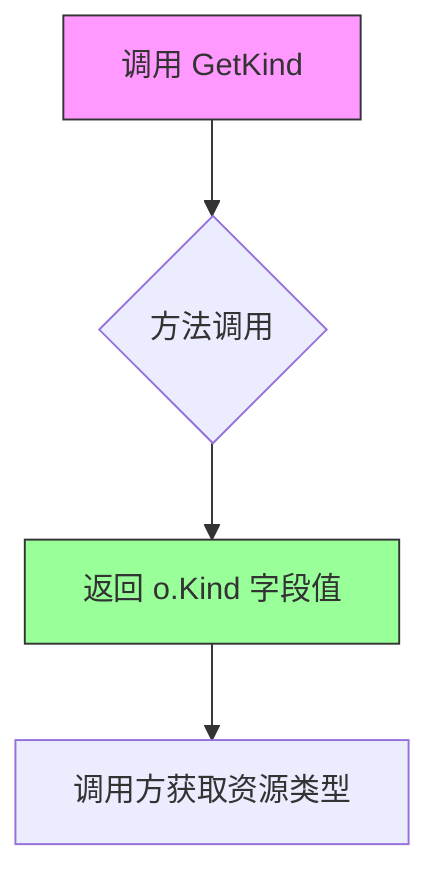

#### 带注释源码

```go
// GetKind 实现 KubeManifest.GetKind 方法
// 该方法返回Kubernetes资源的类型（Kind），例如 Deployment、Service、Pod 等
// 这是Flux CD识别和处理不同Kubernetes资源类型的关键方法
func (o baseObject) GetKind() string {
    // 直接返回结构体中存储的Kind字段值
    // 该字段在YAML解析时通过yaml标签自动填充
    return o.Kind
}
```

#### 关联信息

**所属类/结构体**：baseObject（嵌入结构体）

**类字段详情**：

- `Kind`：`string`，存储Kubernetes资源的类型标识，在YAML unmarshaling时通过`yaml:"kind"`标签自动填充

**接口实现**：

该方法实现了`KubeManifest`接口中的`GetKind() string`方法签名，是Flux CD资源抽象层的重要组成部分，允许上层代码通过统一接口获取任意Kubernetes资源的类型信息。

**设计目的**：

- 提供统一的资源类型查询接口
- 支持Flux CD根据资源类型执行不同的处理逻辑（如区分Workload、Service、ConfigMap等）
- 配合`unmarshalKind`函数实现不同资源类型的动态解析和实例化


### `KubeManifest.GetName`

该方法用于从 Kubernetes 资源对象中获取资源的名称，是 `KubeManifest` 接口的核心方法之一，通过返回元数据中的 `Name` 字段实现。

参数：

- 该方法为值 receiver 方法，无显式参数（隐式参数 `o` 为 `baseObject` 类型）

返回值：`string`，返回 Kubernetes 资源的元数据名称（`metadata.name`）

#### 流程图

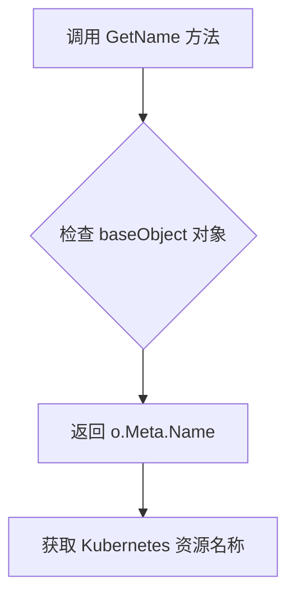

#### 带注释源码

```go
// GetName implements KubeManifest.GetName
// 该方法实现 KubeManifest 接口的 GetName 方法
// 用于获取 Kubernetes 资源的名称
func (o baseObject) GetName() string {
	// 返回元数据中的 Name 字段
	// 对应 Kubernetes 资源的 metadata.name 字段
	return o.Meta.Name
}
```


### `baseObject.GetNamespace`

该方法实现了 `KubeManifest` 接口定义的 `GetNamespace` 方法，从嵌入 `baseObject` 的 Kubernetes 资源对象中提取并返回元数据中存储的命名空间信息。

参数：

- （无参数）

返回值：`string`，返回 Kubernetes 资源的命名空间，如果未设置命名空间则返回空字符串。

#### 流程图

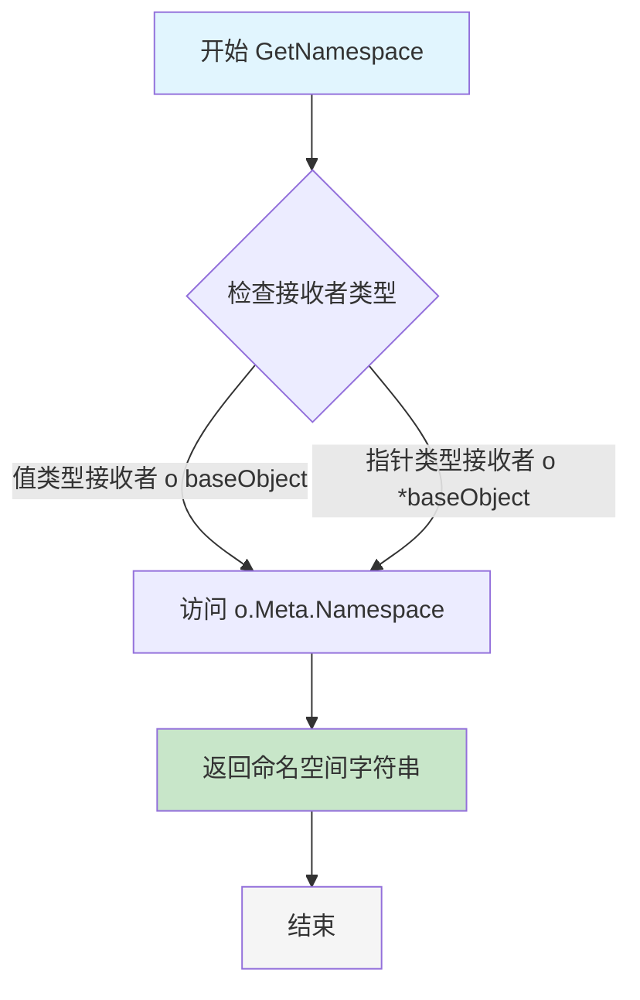

#### 带注释源码

```go
// GetNamespace implements KubeManifest.GetNamespace, so things embedding baseObject are < KubeManifest
// GetNamespace 实现了 KubeManifest 接口的 GetNamespace 方法
// 使得嵌入 baseObject 的类型满足 KubeManifest 接口
func (o baseObject) GetNamespace() string {
	// 返回存储在 Meta.Namespace 字段中的命名空间值
	// 如果 YAML/JSON 中未指定 namespace，该字段为空字符串
	// 对于集群级别的资源，namespace 为空，此时通常视为 ClusterScope
	return o.Meta.Namespace
}
```

---

**补充说明**：

| 项目 | 描述 |
|------|------|
| **所属接口** | `KubeManifest` |
| **实现类型** | 值类型接收者（value receiver） |
| **关联字段** | `o.Meta.Namespace`（类型：`string`） |
| **调用场景** | 在需要获取 Kubernetes 资源命名空间时调用，如构建资源 ID、过滤特定命名空间的资源等 |
| **空值处理** | 返回空字符串表示集群级别资源（Cluster Scope） |


### `KubeManifest.SetNamespace(string)` / `baseObject.SetNamespace`

该方法用于设置 Kubernetes 资源的命名空间，实现 `KubeManifest` 接口。方法接受一个字符串参数作为目标命名空间，并直接修改 `baseObject` 中 `Meta.Namespace` 字段的值。

参数：

- `ns`：`string`，要设置的命名空间字符串

返回值：`void`（无返回值），该方法直接修改对象状态，不返回任何值

#### 流程图

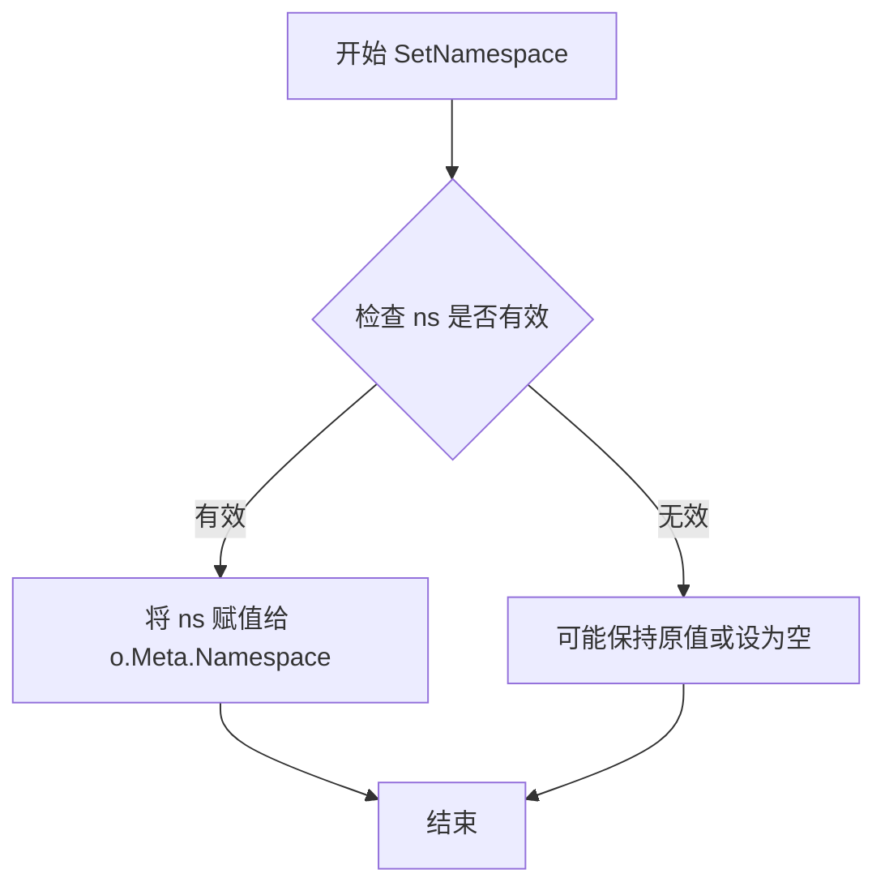

#### 带注释源码

```go
// SetNamespace implements KubeManifest.SetNamespace, so things with
// *baseObject embedded are < KubeManifest. NB pointer receiver.
// 注意：此方法使用指针接收器，以便能够修改原始对象的 Meta.Namespace 字段
func (o *baseObject) SetNamespace(ns string) {
    // 直接将传入的命名空间字符串赋值给对象的元数据中的命名空间字段
    o.Meta.Namespace = ns
}
```


### `baseObject.PolicyAnnotationKey`

该方法根据传入的策略名称，在资源的注解（annotations）中查找对应的键，支持多种策略前缀（fluxcd.io/、flux.weave.works/、filter.fluxcd.io/），返回实际存在的注解键及是否存在标志，用于兼容不同版本的策略注解写法。

参数：

- `p`：`string`，策略名称（不含前缀）

返回值：`(string, bool)`，返回实际存在于资源注解中的键（如 "fluxcd.io/automated"）和是否存在该注解的布尔值

#### 流程图

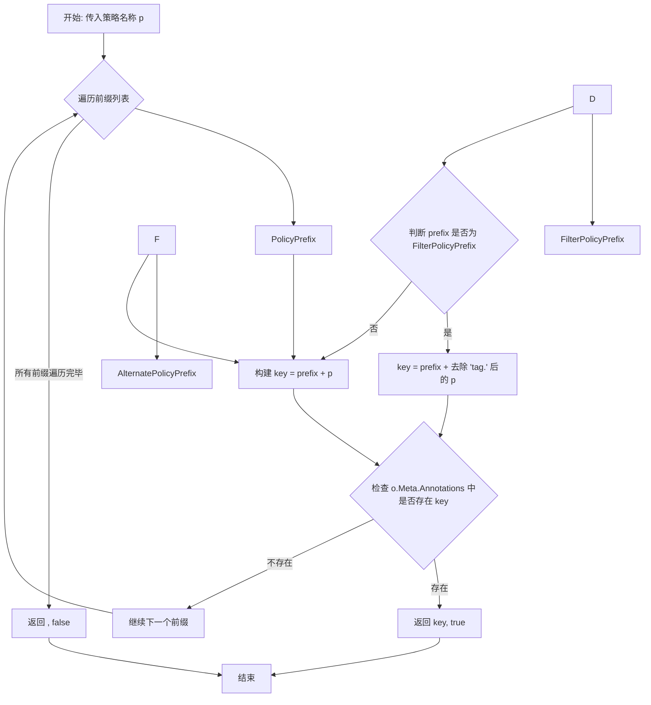

#### 带注释源码

```go
// PolicyAnnotationKey 返回用于在资源中指示特定策略的键；
// 这是为了支持多种方式使用注解来定义策略。如果策略不存在，
// 返回空字符串和 false。
// 参数 p: 策略名称（不含前缀，例如 "automated" 或 "tag."）
// 返回: 实际存在的注解键（如 "fluxcd.io/automated"），以及是否存在该注解
func (o baseObject) PolicyAnnotationKey(p string) (string, bool) {
	// 遍历所有支持的前缀：标准前缀、兼容旧版本的别名前缀、过滤策略前缀
	for _, prefix := range []string{PolicyPrefix, AlternatePolicyPrefix, FilterPolicyPrefix} {
		// 基础情况：直接拼接前缀和策略名
		key := prefix + p
		
		// 对于 FilterPolicyPrefix，需要特殊处理 "tag." 前缀
		// 如果策略名以 "tag." 开头，需要去除后再拼接
		// 例如：p = "tag.images" -> key = "filter.fluxcd.io/images"
		if prefix == FilterPolicyPrefix {
			key = prefix + strings.TrimPrefix(p, "tag.")
		}
		
		// 检查资源的注解映射中是否存在该键
		if _, ok := o.Meta.Annotations[key]; ok {
			// 找到匹配的注解键，返回键名和 true 表示存在
			return key, true
		}
	}
	// 遍历完所有前缀都未找到匹配的注解，返回空字符串和 false
	return "", false
}
```


### `baseObject.ResourceID`

该方法为 Kubernetes 资源生成唯一的标识符（ID），通过组合资源的命名空间、类型和名称来创建。如果命名空间为空，则使用集群范围的占位符。

参数：
- 无参数（方法接收者 `o baseObject` 不视为参数）

返回值：`resource.ID`，返回资源的唯一标识符，包含命名空间、种类和名称信息。

#### 流程图

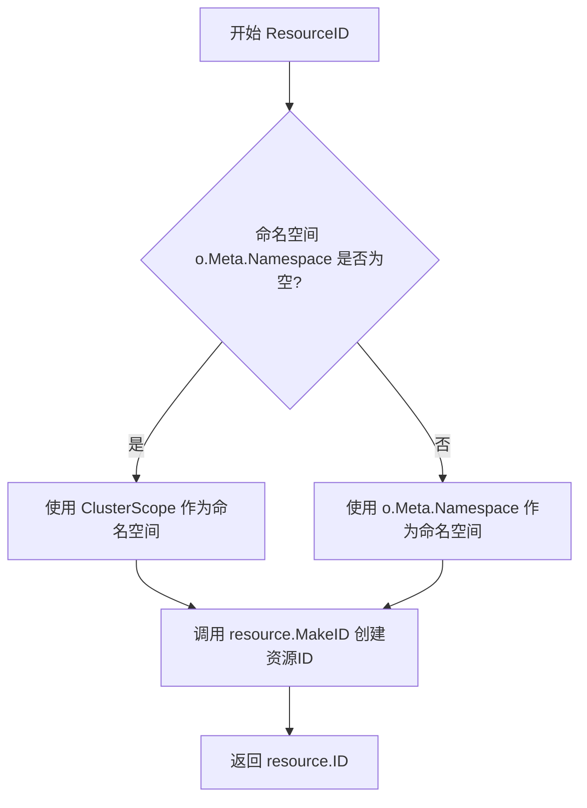

#### 带注释源码

```go
// ResourceID 为 Kubernetes 资源生成唯一的标识符
// 该方法实现了 resource.Resource 接口的要求
func (o baseObject) ResourceID() resource.ID {
	// 获取资源的命名空间
	ns := o.Meta.Namespace
	
	// 如果命名空间为空，则使用集群范围的占位符
	// 这样可以确保即使是无命名空间资源也能生成有效的ID
	if ns == "" {
		ns = ClusterScope
	}
	
	// 使用 resource.MakeID 创建包含 命名空间、类型、名称 的唯一标识符
	// 格式通常为: <namespace>/<kind>/<name> 或 <cluster>/<kind>/<name>
	return resource.MakeID(ns, o.Kind, o.Meta.Name)
}
```


### `baseObject.Policies()` / `KubeManifest.Policies()`

该方法从 Kubernetes 资源的注解（Annotations）中提取 Flux 策略信息，将注解键转换为策略集合（policy.Set），支持多种前缀兼容（fluxcd.io、flux.weave.works、filter.fluxcd.io）。

#### 参数

无显式参数（使用接收者 `o baseObject`）。

#### 返回值

- `policy.Set`：从注解中提取的 Flux 策略集合

#### 流程图

```mermaid
flowchart TD
    A[开始: Policies] --> B[获取 o.Meta.Annotations]
    B --> C{遍历 annotations}
    C -->|HasPrefix k, PolicyPrefix| D[去除前缀获得策略名]
    C -->|HasPrefix k, AlternatePolicyPrefix| E[去除前缀获得策略名]
    C -->|HasPrefix k, FilterPolicyPrefix| F[去除前缀, 添加 'tag.' 前缀]
    C -->|其他| G[continue 跳过]
    D --> H{值为 'true'?}
    E --> H
    F --> H
    H -->|是| I[set.Add(policy)]
    H -->|否| J[set.Set(policy, value)]
    I --> K{还有更多注解?}
    J --> K
    G --> K
    K -->|是| C
    K -->|否| L[返回 set]
```

#### 带注释源码

```go
// Policies 从资源的注解中提取 Flux 策略集合
// 实现了 KubeManifest 接口的 Policies 方法
// 接收者: o baseObject (值类型)
func (o baseObject) Policies() policy.Set {
	// 调用辅助函数 PoliciesFromAnnotations 处理注解映射
	// 将注解转换为 policy.Set 类型
	return PoliciesFromAnnotations(o.Meta.Annotations)
}

// PoliciesFromAnnotations 是独立的辅助函数
// 用于将 map[string]string 类型的注解转换为 policy.Set
func PoliciesFromAnnotations(annotations map[string]string) policy.Set {
	// 初始化空的策略集合
	set := policy.Set{}
	
	// 遍历所有注解键值对
	for k, v := range annotations {
		var p string
		switch {
		// 处理标准前缀: "fluxcd.io/"
		case strings.HasPrefix(k, PolicyPrefix):
			p = strings.TrimPrefix(k, PolicyPrefix)
		// 处理兼容前缀: "flux.weave.works/" (历史兼容)
		case strings.HasPrefix(k, AlternatePolicyPrefix):
			p = strings.TrimPrefix(k, AlternatePolicyPrefix)
		// 处理过滤前缀: "filter.fluxcd.io/"
		case strings.HasPrefix(k, FilterPolicyPrefix):
			// 过滤策略需要添加 "tag." 前缀
			p = "tag." + strings.TrimPrefix(k, FilterPolicyPrefix)
		// 不符合任何前缀的注解则跳过
		default:
			continue
		}

		// 根据注解值决定如何添加策略
		if v == "true" {
			// 值为 "true" 时，仅添加策略名称（布尔策略）
			set = set.Add(policy.Policy(p))
		} else {
			// 其他值时，设置策略为指定的值（带参数的策略）
			set = set.Set(policy.Policy(p), v)
		}
	}
	// 返回构建完成的策略集合
	return set
}
```


### `baseObject.Source`

返回存储在 Kubernetes 资源对象中的原始 YAML/JSON 源码字符串。

参数： 无

返回值： `string`，返回对象的原始源码字符串

#### 流程图

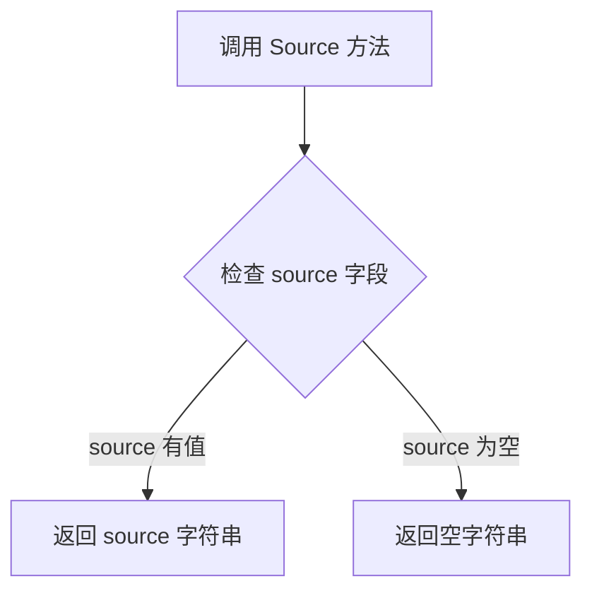

#### 带注释源码

```go
// Source 返回存储在 baseObject 中的原始源码字符串
// 该源码是最初用于 unmarshalObject 解析的原始 YAML/JSON 内容
func (o baseObject) Source() string {
	return o.source
}
```

---

### 补充说明

**所属类：** `baseObject`（结构体）

**接口关联：** 虽然 `KubeManifest` 接口未直接声明 `Source()` 方法，但 `baseObject` 作为 `KubeManifest` 接口的具体实现，提供了此方法用于：

- 获取资源的原始定义文本
- 调试和日志记录
- 资源对比和变更检测

**字段依赖：**
- `source string`：在 `unmarshalObject` 函数中通过参数传入并存储


### `baseObject.Bytes`

该方法用于返回存储在 `baseObject` 中的原始 Kubernetes 清单字节数据。它实现了 `resource.Resource` 接口的 `Bytes()` 方法，使得 Kubernetes 资源可以返回其原始 YAML/JSON 表示。

参数： 无

返回值：`[]byte`，返回 Kubernetes 清单的原始字节数据

#### 流程图

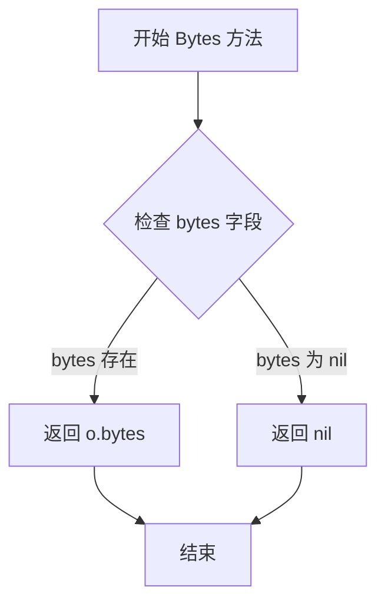

#### 带注释源码

```go
// Bytes 返回存储在 baseObject 中的原始清单字节
// 这是 resource.Resource 接口的实现方法
// 返回值是解析前的原始 YAML/JSON 数据，可用于重新序列化或比较
func (o baseObject) Bytes() []byte {
	return o.bytes
}
```


### `baseObject.GroupVersion`

该方法实现了 `KubeManifest` 接口的 `GroupVersion` 方法，返回 Kubernetes 资源的 API 版本信息（如 `apps/v1`、`v1` 等），用于标识资源所属的 API 组和版本。

参数： 无

返回值：`string`，返回资源的 `APIVersion` 字段值，即 Kubernetes 资源的组版本标识字符串。

#### 流程图

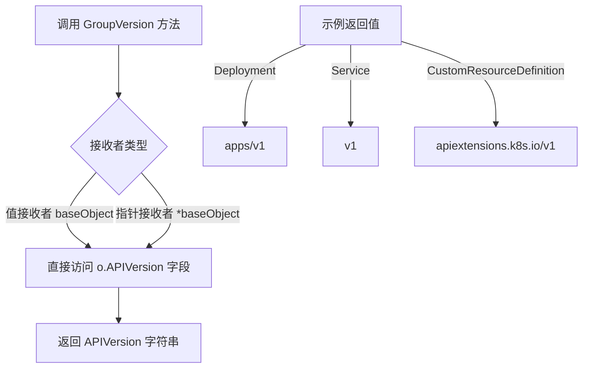

#### 带注释源码

```go
// GroupVersion 实现 KubeManifest 接口的 GroupVersion 方法。
// 任何嵌入 baseObject 的结构体都将满足 KubeManifest 接口。
// 使用值接收者 (o baseObject) 定义，意味着可以按值或指针方式调用。
func (o baseObject) GroupVersion() string {
	// 直接返回 baseObject 中存储的 APIVersion 字段
	// APIVersion 字段在 YAML/JSON 解码时由 yaml 标签 "apiVersion" 填充
	// 格式通常为 "group/version"，例如 "apps/v1"、"v1" 等
	return o.APIVersion
}
```


### `baseObject.GetNamespace`

该方法实现 `KubeManifest` 接口，返回 Kubernetes 资源的命名空间信息。当命名空间未设置时，返回空字符串，调用方需根据业务逻辑判断是否使用集群作用域。

参数：

- （无参数）

返回值：`string`，返回资源对象在 Kubernetes 元数据中定义的命名空间，若未设置则返回空字符串。

#### 流程图

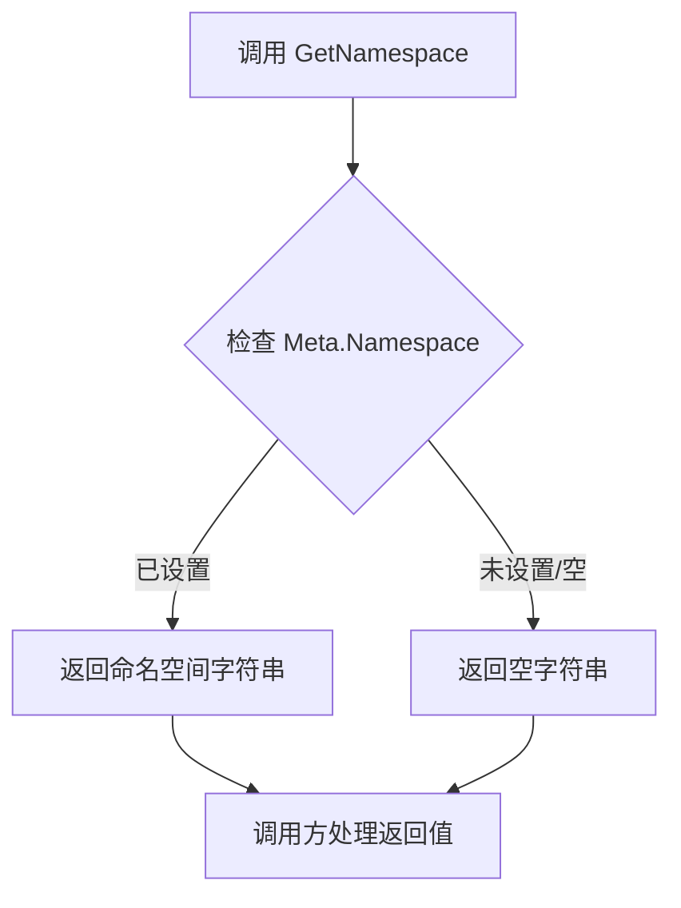

#### 带注释源码

```go
// GetNamespace implements KubeManifest.GetNamespace, so things embedding baseObject are < KubeManifest
// 该方法实现 KubeManifest 接口的 GetNamespace 方法，使嵌入 baseObject 的类型满足 KubeManifest 接口契约
func (o baseObject) GetNamespace() string {
	// 直接返回元数据中的 Namespace 字段
	// 若 YAML 中未定义 namespace 或定义为空，则返回空字符串
	return o.Meta.Namespace
}
```


### `baseObject.GetKind`

该方法实现 `KubeManifest` 接口，返回 Kubernetes 资源的类型（如 Deployment、Service、Pod 等），用于标识当前资源对象的具体种类。

参数： 无

返回值：`string`，返回资源的 `Kind` 字段值，表示 Kubernetes 资源的类型。

#### 流程图

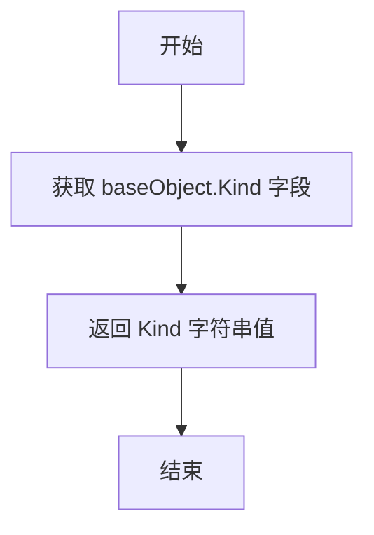

#### 带注释源码

```go
// GetKind implements KubeManifest.GetKind
// 该方法实现了 KubeManifest 接口定义的 GetKind 方法
// 返回存储在 baseObject.Kind 字段中的 Kubernetes 资源类型
func (o baseObject) GetKind() string {
    // 直接返回对象的 Kind 字段值
    // Kind 字段在 YAML 解析时通过 yaml:"kind" 标签填充
    // 例如: Deployment, Service, Pod, ConfigMap 等 Kubernetes 资源类型
	return o.Kind
}
```

---

### 补充说明

**所属类信息**

- **类名**: `baseObject`
- **类描述**: `baseObject` 是一个嵌入结构体，提供 Kubernetes 资源对象的基础实现，包含资源元数据（名称、命名空间、注解等）和通用的接口实现。其他具体资源类型（如 Deployment、Service 等）通过嵌入该结构体来获得基础功能。

**字段信息**

| 字段名 | 类型 | 描述 |
|--------|------|------|
| `Kind` | `string` | Kubernetes 资源类型，通过 YAML 的 `kind` 字段解析而来 |

**接口实现**

该方法是 `KubeManifest` 接口的一部分，确保所有嵌入 `baseObject` 的类型都能提供统一的资源类型查询能力。


### `baseObject.GetName`

获取 Kubernetes 资源的元数据中的名称（name），实现 `KubeManifest` 接口的 `GetName` 方法。

参数：

- （无参数，方法仅通过接收者 `o` 访问结构体字段）

返回值：`string`，返回资源的元数据名称（Name），对应 Kubernetes 资源清单中 `metadata.name` 字段的值。

#### 流程图

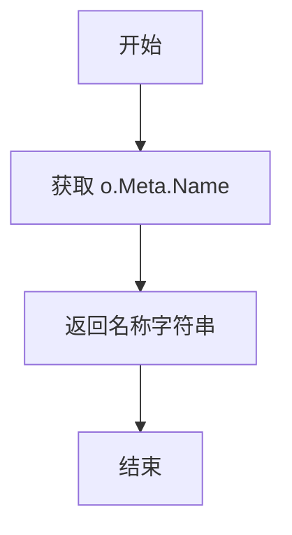

#### 带注释源码

```go
// GetName implements KubeManifest.GetName
// 实现 KubeManifest 接口的 GetName 方法
func (o baseObject) GetName() string {
	// 返回 baseObject 结构体中 Meta.Name 字段的值
	// 该值对应 Kubernetes 资源清单中的 metadata.name
	return o.Meta.Name
}
```


### `baseObject.ResourceID`

该方法用于获取 Kubernetes 资源的唯一标识符，通过组合资源的命名空间、资源类型和名称来构建完整的资源 ID。如果资源没有命名空间，则使用集群范围的占位符。

参数：

- （无参数）

返回值：`resource.ID`，返回资源的唯一标识符，由命名空间、资源类型和名称组成

#### 流程图

```mermaid
flowchart TD
    A[开始 ResourceID] --> B{获取命名空间 o.Meta.Namespace}
    B --> C{命名空间是否为空?}
    C -->|是| D[使用 ClusterScope 作为命名空间]
    C -->|否| E[使用原始命名空间]
    D --> F[调用 resource.MakeID]
    E --> F
    F --> G[返回 resource.ID]
    
    style A fill:#f9f,stroke:#333
    style G fill:#9f9,stroke:#333
```

#### 带注释源码

```go
// ResourceID 返回资源的唯一标识符
// 该方法实现了 resource.Resource 接口
func (o baseObject) ResourceID() resource.ID {
	// 获取资源的命名空间信息
	ns := o.Meta.Namespace
	
	// 如果命名空间为空，则使用集群范围的占位符
	// 这样确保即使是无命名空间资源也能生成有效的 ID
	if ns == "" {
		ns = ClusterScope
	}
	
	// 使用 resource.MakeID 构建完整的资源标识符
	// 格式为: <namespace>/<kind>/<name>
	return resource.MakeID(ns, o.Kind, o.Meta.Name)
}
```


### `baseObject.SetNamespace`

该方法是指针接收者方法，实现 `KubeManifest` 接口的 `SetNamespace` 方法，用于设置 Kubernetes 资源的命名空间。由于使用指针接收者，可以直接修改对象的 `Meta.Namespace` 字段，从而改变资源所属的命名空间。

参数：

- `ns`：`string`，要设置的命名空间字符串

返回值：`无`（void），该方法修改对象状态，没有返回值

#### 流程图

```mermaid
flowchart TD
    A[开始 SetNamespace] --> B[接收命名空间参数 ns]
    B --> C[将 ns 赋值给 o.Meta.Namespace]
    C --> D[结束]
```

#### 带注释源码

```go
// SetNamespace implements KubeManifest.SetNamespace, so things with
// *baseObject embedded are < KubeManifest. NB pointer receiver.
func (o *baseObject) SetNamespace(ns string) {
	o.Meta.Namespace = ns
}
```


### `baseObject.debyte`

该方法是一个工具方法，主要用于测试场景，通过将 `baseObject` 的 `bytes` 字段置为 `nil` 来移除字节记录，以便在测试中进行对象比较。

参数：
- 该方法无参数

返回值：`无`（Go 中为 `void` 或无返回值），该方法直接修改对象状态，不返回任何值

#### 流程图

```mermaid
graph TD
    A[开始 debyte 方法] --> B{检查接收者 o}
    B -->|o 为 nil| C[返回/空操作]
    B -->|o 有效| D[将 o.bytes 设为 nil]
    D --> E[方法结束]
    
    style A fill:#f9f,stroke:#333
    style E fill:#9f9,stroke:#333
    style C fill:#f99,stroke:#333
```

#### 带注释源码

```go
// It's useful for comparisons in tests to be able to remove the
// record of bytes
func (o *baseObject) debyte() {
    // 将 baseObject 的 bytes 字段设置为 nil
    // 这样做的主要目的是：
    // 1. 在单元测试中移除字节记录，以便进行对象比较
    // 2. 释放可能不需要的内存引用
    // 注意：这是一个指针接收者方法，会直接影响调用者的字段值
	o.bytes = nil
}
```


### `baseObject.Policies()`

该方法从 Kubernetes 资源的注解（annotations）中提取 Flux 策略信息，将带有特定前缀（fluxcd.io/、flux.weave.works/、filter.fluxcd.io/）的注解键转换为策略集合，支持自动过滤和策略值设置。

参数：此方法无显式参数（使用接收者 `o`）

返回值：`policy.Set`，返回从注解中解析出的策略集合

#### 流程图

```mermaid
flowchart TD
    A[开始: baseObject.Policies] --> B[获取 o.Meta.Annotations]
    B --> C[调用 PoliciesFromAnnotations]
    C --> D{遍历 annotations}
    D -->|键前缀为 PolicyPrefix| E[移除前缀获取策略名]
    D -->|键前缀为 AlternatePolicyPrefix| F[移除前缀获取策略名]
    D -->|键前缀为 FilterPolicyPrefix| G[添加 'tag.' 前缀并移除前缀]
    D -->|其他| H[跳过]
    E --> I{注解值是否为 'true'}
    F --> I
    G --> I
    I -->|是| J[set.Add 添加策略]
    I -->|否| K[set.Set 设置策略值]
    J --> L[返回策略集]
    K --> L
    H --> L
```

#### 带注释源码

```go
// Policies 返回从 baseObject 的元数据注解中提取的策略集合
// 该方法实现了 KubeManifest 接口，用于获取资源上附加的 Flux 策略
// 策略通过注解键的前缀来识别：fluxcd.io/, flux.weave.works/, filter.fluxcd.io/
func (o baseObject) Policies() policy.Set {
	// 调用辅助函数 PoliciesFromAnnotations，传入对象的注解映射
	// 将 Kubernetes 注解转换为 Flux 策略集合
	return PoliciesFromAnnotations(o.Meta.Annotations)
}
```

---

### `PoliciesFromAnnotations(annotations map[string]string)`

此函数为 `Policies()` 方法的底层实现，负责具体的注解到策略的转换逻辑，支持多种注解前缀的向后兼容处理。

参数：

- `annotations`：`map[string]string`，Kubernetes 资源的注解映射表

返回值：`policy.Set`，解析后的策略集合

#### 流程图

```mermaid
flowchart TD
    A[开始: PoliciesFromAnnotations] --> B[初始化空策略集 set]
    B --> C[遍历 annotations 键值对]
    C --> D{检查键前缀}
    D -->|PolicyPrefix| E[去除 PolicyPrefix 前缀]
    D -->|AlternatePolicyPrefix| F[去除 AlternatePolicyPrefix 前缀]
    D -->|FilterPolicyPrefix| G[添加 'tag.' 前缀并去除原前缀]
    D -->|其他| H[continue 跳过]
    E --> I
    F --> I
    G --> I
    I{注解值 == 'true'?}
    I -->|是| J[set.Add 添加布尔策略]
    I -->|否| K[set.Set 设置带值的策略]
    J --> L[遍历结束?]
    K --> L
    H --> C
    L -->|否| C
    L -->|是| M[返回策略集]
```

#### 带注释源码

```go
// PoliciesFromAnnotations 将 Kubernetes 注解映射转换为 Flux 策略集合
// 支持三种注解前缀:
//   - PolicyPrefix: fluxcd.io/ (当前推荐前缀)
//   - AlternatePolicyPrefix: flux.weave.works/ (历史兼容前缀)
//   - FilterPolicyPrefix: filter.fluxcd.io/ (过滤策略前缀，会自动添加 tag. 前缀)
//
// 注解值为 "true" 时表示布尔策略，否则表示带值的策略
func PoliciesFromAnnotations(annotations map[string]string) policy.Set {
	// 初始化空的策略集合
	set := policy.Set{}
	
	// 遍历所有注解键值对
	for k, v := range annotations {
		var p string
		switch {
		// 当前推荐的策略前缀
		case strings.HasPrefix(k, PolicyPrefix):
			p = strings.TrimPrefix(k, PolicyPrefix)
		// 向后兼容的历史前缀
		case strings.HasPrefix(k, AlternatePolicyPrefix):
			p = strings.TrimPrefix(k, AlternatePolicyPrefix)
		// 过滤策略前缀，需要特殊处理
		case strings.HasPrefix(k, FilterPolicyPrefix):
			// 过滤策略会自动添加 "tag." 前缀以区分类型
			p = "tag." + strings.TrimPrefix(k, FilterPolicyPrefix)
		// 不符合任何前缀的注解，跳过处理
		default:
			continue
		}

		// 根据注解值决定添加策略的方式
		if v == "true" {
			// 值为 "true" 时，添加布尔型策略（无具体值）
			set = set.Add(policy.Policy(p))
		} else {
			// 其他值时，设置带具体值的策略
			set = set.Set(policy.Policy(p), v)
		}
	}
	return set
}
```

---

### `baseObject.PolicyAnnotationKey(p string)`

该方法用于查找特定策略在资源注解中实际使用的键名，支持多种前缀的查找，返回第一个匹配的前缀对应的完整键名。

参数：

- `p`：`string`，策略名称（不含前缀）

返回值：`(string, bool)`，返回完整的注解键名和是否存在的标志

#### 流程图

```mermaid
flowchart TD
    A[开始: PolicyAnnotationKey] --> B[遍历三种前缀]
    B --> C{当前前缀}
    C --> D[构建完整键名]
    D --> E{是否为 FilterPolicyPrefix}
    E -->|是| F[去除 'tag.' 前缀后再拼接]
    E -->|否| G[直接拼接]
    F --> H
    G --> H
    H{注解中是否存在该键?}
    H -->|是| I[返回键名和 true]
    H -->|否| J[继续下一个前缀]
    J --> B
    B --> K[所有前缀都未匹配]
    K --> L[返回空字符串和 false]
```

#### 带注释源码

```go
// PolicyAnnotationKey 返回给定策略在资源注解中实际使用的键名
// 用于支持多种注解书写方式的兼容性查找
// 参数 p 为策略名称（不含前缀），如 "automated" 或 "tag.automated"
// 返回值为完整的注解键名（如 "fluxcd.io/automated"）和是否存在的布尔值
func (o baseObject) PolicyAnnotationKey(p string) (string, bool) {
	// 遍历所有可能的前缀，查找第一个存在的注解键
	for _, prefix := range []string{PolicyPrefix, AlternatePolicyPrefix, FilterPolicyPrefix} {
		// 基础键名为前缀加上策略名
		key := prefix + p
		
		// 特殊处理过滤策略前缀：需要还原原始键名格式
		if prefix == FilterPolicyPrefix {
			// 如果输入是 "tag.automated"，需要还原为 "filter.fluxcd.io/automated"
			key = prefix + strings.TrimPrefix(p, "tag.")
		}
		
		// 检查该键是否存在于注解中
		if _, ok := o.Meta.Annotations[key]; ok {
			return key, true
		}
	}
	// 所有前缀都未匹配，返回空键名和 false
	return "", false
}
```

---

### 关键组件信息

| 名称 | 一句话描述 |
|------|-----------|
| `policy.Set` | Flux 策略的集合类型，支持 Add/Set 等集合操作 |
| `policy.Policy` | Flux 策略的类型包装器，用于表示单个策略 |
| `PolicyPrefix` | 当前推荐的策略注解前缀常量 `"fluxcd.io/"` |
| `AlternatePolicyPrefix` | 历史兼容的策略注解前缀 `"flux.weave.works/"` |
| `FilterPolicyPrefix` | 过滤策略专用前缀 `"filter.fluxcd.io/"` |
| `ClusterScope` | 表示集群级别资源的命名空间常量 `"<cluster>"` |

---

### 技术债务与优化空间

1. **硬编码前缀列表**：`PolicyAnnotationKey` 方法中硬编码了三种前缀的遍历顺序，如需扩展新前缀需要修改多处代码

2. **重复前缀检测逻辑**：前缀匹配逻辑在 `PoliciesFromAnnotations` 和 `PolicyAnnotationKey` 中重复实现，可提取为共享函数

3. **字符串拼接开销**：使用 `strings.TrimPrefix` 和字符串拼接构建键名，在大量资源场景下可能存在性能优化空间

4. **向后兼容性负担**：保留三个前缀的支持增加了代码复杂度，后续可考虑逐步淘汰旧前缀

5. **缺少缓存机制**：每次调用 `Policies()` 都会重新解析注解，对于同一对象多次调用场景可考虑缓存结果


### `baseObject.PolicyAnnotationKey`

该方法根据传入的策略名称，在资源的注解（annotations）中查找对应的键（key），支持多种策略前缀兼容（PolicyPrefix、AlternatePolicyPrefix、FilterPolicyPrefix）。如果找到则返回完整的注解键和 true，否则返回空字符串和 false。

参数：

- `p`：`string`，要查找的策略名称（如 "automated" 或 "tag.image"）

返回值：`string`，找到的完整注解键；若未找到则为空字符串
`bool`，是否在注解中找到该策略

#### 流程图

```mermaid
flowchart TD
    A[开始 PolicyAnnotationKey] --> B[定义前缀列表: PolicyPrefix, AlternatePolicyPrefix, FilterPolicyPrefix]
    B --> C{遍历前缀列表}
    C -->|当前前缀| D[构建注解键: prefix + p]
    D --> E{当前前缀是否为 FilterPolicyPrefix?}
    E -->|是| F[处理 tag 前缀: prefix + strings.TrimPrefix&#40;p, 'tag.'&#41;]
    E -->|否| F
    F --> G{检查 o.Meta.Annotations 中是否存在该键?}
    G -->|存在| H[返回键, true]
    G -->|不存在| I{是否还有更多前缀?}
    I -->|是| C
    I -->|否| J[返回空字符串, false]
    H --> K[结束]
    J --> K
```

#### 带注释源码

```go
// PolicyAnnotationKey 返回用于在资源中表示特定策略的键；
// 这有助于支持多种使用注解来表示策略的方式。
// 如果策略不存在，则返回 "" 和 false。
//
// 参数 p: 策略名称，例如 "automated" 或 "tag.image"
// 返回: 找到的注解键（字符串），以及是否找到（布尔值）
func (o baseObject) PolicyAnnotationKey(p string) (string, bool) {
	// 遍历所有支持的前缀策略
	// PolicyPrefix: "fluxcd.io/"
	// AlternatePolicyPrefix: "flux.weave.works/" (向后兼容)
	// FilterPolicyPrefix: "filter.fluxcd.io/"
	for _, prefix := range []string{PolicyPrefix, AlternatePolicyPrefix, FilterPolicyPrefix} {
		// 基础键由前缀 + 策略名称组成
		key := prefix + p

		// 对于 FilterPolicyPrefix，需要特殊处理 tag 前缀
		// 如果策略名称以 "tag." 开头，需要去掉后再拼接
		if prefix == FilterPolicyPrefix {
			// 例如: p = "tag.image", 结果为 "filter.fluxcd.io/image"
			key = prefix + strings.TrimPrefix(p, "tag.")
		}

		// 检查资源的注解中是否存在该键
		if _, ok := o.Meta.Annotations[key]; ok {
			// 找到匹配的键，返回键名和 true 表示找到
			return key, true
		}
	}

	// 遍历完所有前缀都未找到，返回空字符串和 false
	return "", false
}
```


### `baseObject.Source`

返回存储在 baseObject 中的源字符串，用于记录 Kubernetes 资源配置的原始来源。

参数： 无

返回值：`string`，返回资源的原始 YAML/JSON 源字符串

#### 流程图

```mermaid
flowchart TD
    A[调用 Source 方法] --> B{获取 o.source}
    B --> C[返回 source 字符串]
```

#### 带注释源码

```go
// Source 返回资源的原始来源字符串
// 该字符串在 unmarshalObject 函数中设置，保存了配置的实际来源（如文件路径或配置内容）
func (o baseObject) Source() string {
	return o.source
}
```


### `baseObject.Bytes`

该方法返回 `baseObject` 中存储的原始 YAML/JSON 字节数组，用于获取 Kubernetes 资源清单的原始内容。

参数：

- `o`：`baseObject`，值类型接收者，表示当前的 baseObject 实例

返回值：`[]byte`，返回存储在 baseObject 中的原始字节数组（即创建时传入的 YAML/JSON 内容）

#### 流程图

```mermaid
flowchart TD
    A[调用 baseObject.Bytes 方法] --> B{接收者类型}
    B -->|值类型接收者| C[访问 o.bytes 字段]
    C --> D[返回字节数组切片]
    D --> E[方法结束]
```

#### 带注释源码

```go
// Bytes 返回存储在 baseObject 中的原始字节数组
// 此方法实现了 resource.Resource 接口的 Bytes 方法
// 用于获取 Kubernetes 资源清单的原始 YAML/JSON 内容
// 主要用途包括：
//   - 序列化资源到配置存储
//   - 资源比较和差异计算
//   - 资源变更审计
//
// 参数：
//   - o: baseObject 值类型接收者
//
// 返回值：
//   - []byte: 原始的字节数组，包含完整的 YAML/JSON 内容
func (o baseObject) Bytes() []byte {
	return o.bytes
}
```

## 关键组件


### KubeManifest 接口

Kubernetes清单的抽象接口，定义了Kubernetes资源的基本操作方法，包括获取GroupVersion、Kind、Name、Namespace以及设置Namespace和策略注解键的能力。该接口继承自resource.Resource，提供了统一的Kubernetes资源访问方式。

### baseObject 结构体

嵌入到各具体资源类型中的基础对象结构体，包含了Kubernetes资源的通用字段（APIVersion、Kind、Metadata）以及原始字节数据。实现了KubeManifest接口的大部分方法，包括GroupVersion()、GetKind()、GetName()、GetNamespace()、SetNamespace()、ResourceID()、Policies()等。

### unmarshalObject 函数

将原始YAML/JSON字节数据反序列化为KubeManifest对象的入口函数。首先使用yaml.Unmarshal将字节数据解析到baseObject结构体，然后调用unmarshalKind根据Kind类型进行具体资源类型的分发处理。

### unmarshalKind 函数

根据资源的Kind类型进行分发处理的_switch_函数，支持CronJob、DaemonSet、Deployment、Namespace、StatefulSet、HelmRelease等Kubernetes内置资源类型以及以"List"结尾的自定义列表类型。对于无法识别的类型，返回基础baseObject指针。

### PoliciesFromAnnotations 函数

从Kubernetes资源的annotations中提取Flux策略的核心函数。函数遍历annotations，根据前缀（PolicyPrefix、AlternatePolicyPrefix、FilterPolicyPrefix）匹配策略，并将其转换为policy.Set集合。对于值为"true"的注解添加为布尔策略，其他值则作为键值对策略存储。

### PolicyAnnotationKey 函数

根据给定的策略名称查找实际使用的注解键的辅助函数。由于支持多个前缀的兼容性，该函数遍历所有可能的前缀，找到资源中实际存在的注解键并返回。

### unmarshalList 函数

处理Kubernetes列表类型资源（如DeploymentList、ServiceList）的函数。遍历列表中的每个item，将其重新序列化为YAML字节后递归调用unmarshalObject进行解析，最终构建KubeManifest切片。

### rawList 结构体

用于临时存储列表类型资源原始数据的结构体，在反序列化过程中作为中间态，将items字段的每个元素解析为map[string]interface{}后再进一步处理。

### HelmRelease 特殊处理

代码中对HelmRelease类型使用了github.com/ghodss/yaml进行反序列化，而非gopkg.in/yaml.v2，这是为了解决go-yaml/yaml库将Values解析为interface{}类型的问题，确保HelmRelease的Values字段全部为字符串类型。

### List 资源类型

支持以"List"结尾的自定义资源列表类型，通过strings.HasSuffix(base.Kind, "List")判断。这是一种向后兼容的列表资源处理方式，适用于Kubernetes的标准列表资源以及部分CustomResourceDefinition。

### 常量定义

包含PolicyPrefix（"fluxcd.io/"）、FilterPolicyPrefix（"filter.fluxcd.io/"）、AlternatePolicyPrefix（"flux.weave.works/"）用于策略注解的前缀匹配，以及ClusterScope（"<cluster>"）用于表示集群级别的命名空间。这些常量确保了对历史版本和当前版本注解的兼容性支持。


## 问题及建议


### 已知问题

- **使用两个不同的YAML库导致依赖混乱**：代码同时使用了 `gopkg.in/yaml.v2` 和 `github.com/ghodss/yaml`，其中 HelmRelease 资源使用 jsonyaml 库处理，而其他资源使用标准 yaml 库，这种不一致性增加了维护成本。
- **unmarshalKind 函数违反开闭原则**：通过大型 switch 语句硬编码支持的资源类型，每次新增 Kubernetes 资源类型都需要修改此函数，不便于扩展。
- **List 资源解析效率低下**：先将原始 items 反序列化为 `map[string]interface{}`，然后重新序列化为字节再 unmarshal，这种往返转换过程造成不必要的性能开销和资源浪费。
- **空资源返回语义模糊**：当 `base.Kind` 为空时返回 `(nil, nil)`，调用方无法有效区分真正的空资源、注释导致的空 YAML 还是解析错误。
- **前缀匹配逻辑重复**：在 `PoliciesFromAnnotations` 和 `PolicyAnnotationKey` 函数中重复实现了相似的前缀检查逻辑，违反了 DRY 原则。
- **debyte 方法命名不清晰**：`debyte()` 方法名称语义不明确，且该方法仅用于测试目的但未使用编译标签隔离。
- **缺少对 CustomResourceDefinition 的完整支持**：代码注释承认无法正确处理自定义的 ListKind，需要依赖 API discovery 但当前未实现。

### 优化建议

- **统一 YAML 处理库**：评估是否可以使用单一库处理所有资源类型，或封装统一的 YAML 解析层以隐藏具体实现差异。
- **引入资源类型注册机制**：将支持的资源类型注册到映射表中，通过插件或配置方式扩展，减少对核心代码的修改。
- **优化 List 资源解析**：直接遍历原始 items 进行递归 unmarshal，避免中间的序列化和反序列化过程。
- **改进错误处理语义**：为不同类型的空资源或无效输入返回明确的错误或使用特定的哨兵错误值，便于调用方准确判断。
- **提取公共前缀匹配逻辑**：将前缀检查逻辑封装为独立函数或使用配置驱动的方式管理前缀列表。
- **添加编译标签**：将测试专用的 `debyte()` 方法用编译标签保护，避免进入生产代码。

## 其它


### 设计目标与约束

本代码库的核心设计目标是提供一个统一且可扩展的Kubernetes资源清单解析框架，支持多种内置Kubernetes资源类型（CronJob、DaemonSet、Deployment、Namespace、StatefulSet）以及自定义资源和资源列表的反序列化。设计约束包括：必须保持与Kubernetes API对象的兼容性，通过嵌入baseObject实现接口实现而非继承，优先使用gopkg.in/yaml.v2进行标准YAML解析，仅对HelmRelease使用github.com/ghodss/yaml作为临时解决方案以规避go-yaml的已知问题。

### 错误处理与异常设计

错误处理采用fluxcd/flux/pkg/errors包中的fluxerr.Error类型，区分用户错误（fluxerr.User）和内部错误。反序列化失败时通过makeUnmarshalObjectErr函数构建带有上下文的错误信息，包含源文件路径和“malformed YAML”的错误提示。对于空资源（空YAML或仅包含注释的情况），返回(nil, nil)而非错误，这是基于不会收到无效非资源YAML的假设。对于资源列表中每个项的解析错误，会立即返回而不继续处理后续项。

### 数据流与状态机

数据流从原始YAML字节输入开始，依次经过unmarshalObject（整体反序列化）-> unmarshalKind（根据Kind字段分发）-> 具体资源类型反序列化。对于List类型资源，会递归调用unmarshalObject处理每个Items元素。没有复杂的状态机设计，主要状态转换体现在unmarshalKind函数中根据base.Kind字符串进行switch-case分发。

### 外部依赖与接口契约

核心依赖包括：gopkg.in/yaml.v2用于标准YAML解析，github.com/ghodss/yaml用于HelmRelease的JSON/YAML混合解析，github.com/fluxcd/flux/pkg/errors提供错误类型定义，github.com/fluxcd/flux/pkg/resource定义资源ID和接口，github.com/fluxcd/flux/pkg/policy提供策略类型。接口契约方面，KubeManifest接口要求实现GroupVersion()、GetKind()、GetName()、GetNamespace()、SetNamespace()、PolicyAnnotationKey()方法以及继承自resource.Resource的所有方法。

### 性能考虑与优化空间

当前实现对每个List项都执行yaml.Marshal -> yaml.Unmarshal的完整往返过程，这在项数较多时效率较低。PoliciesFromAnnotations函数每次调用都会遍历所有注解键，可考虑缓存解析结果。HelmRelease使用jsonyaml而非标准yaml解析器增加了额外依赖和性能开销。unmarshalKind中的switch语句可以转换为map以提高查找效率。

### 安全性考虑

代码本身不直接处理敏感数据，但解析外部YAML输入时存在潜在风险：注解键的前缀检查使用了三个不同的前缀，恶意构造的注解键可能触发意外行为。没有对资源名称、命名空间等字段进行长度或格式验证，可能需要在上层调用处补充。

### 并发模型

代码中不涉及并发操作，所有函数都是无状态的纯函数，可以安全并发调用。baseObject作为值类型或指针类型使用都不涉及共享状态修改。

### 兼容性设计

提供了三个策略前缀以确保向后兼容性：当前使用的PolicyPrefix、历史遗留的AlternatePolicyPrefix、以及FilterPolicyPrefix。ClusterScope常量用于区分集群级资源和有命名空间的资源。资源Kind的大小写敏感性通过strings.HasSuffix进行部分匹配，但假设Kind字段不为空。

### 测试策略建议

应补充针对各类资源类型的反序列化单元测试，特别是边界情况如空资源、混合注解前缀、嵌套List等。PoliciesFromAnnotations需要覆盖所有三种前缀格式的测试用例。HelmRelease的jsonyaml特殊处理应作为回归测试重点关注。

### 配置管理与扩展性

当前通过硬编码常量定义前缀和特殊处理逻辑，新增资源类型需要在unmarshalKind中添加case分支。可以通过注册机制或配置驱动的方式改进扩展性，使新增资源类型无需修改核心解析逻辑。
    