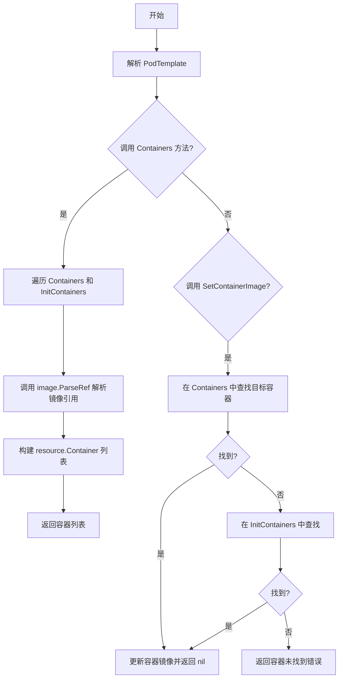
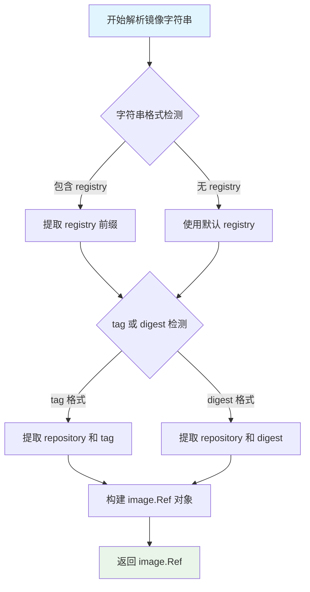
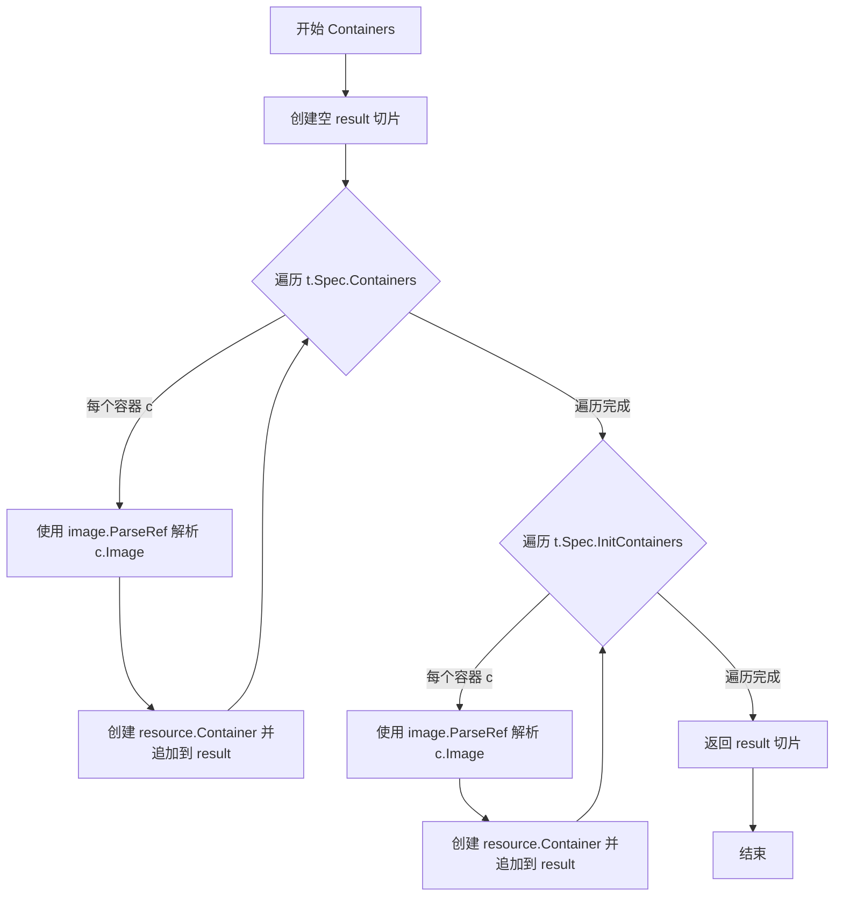
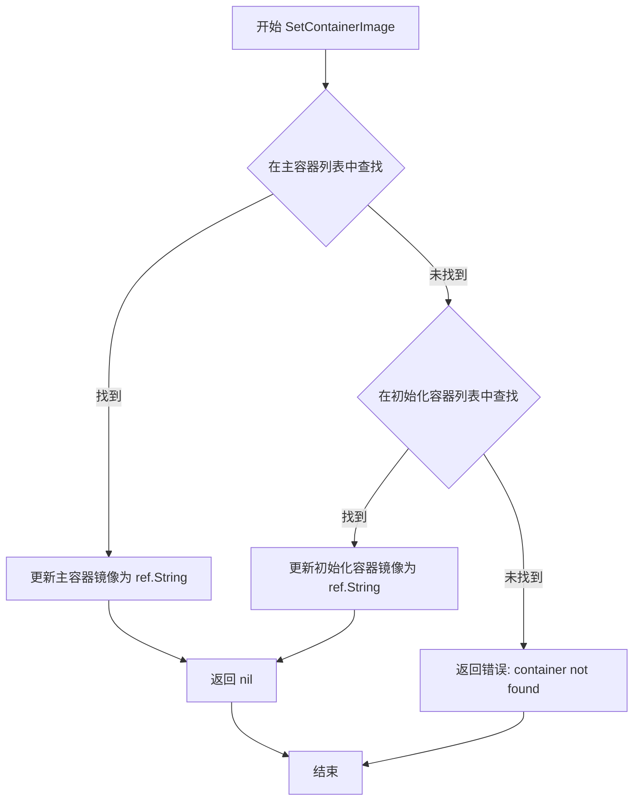
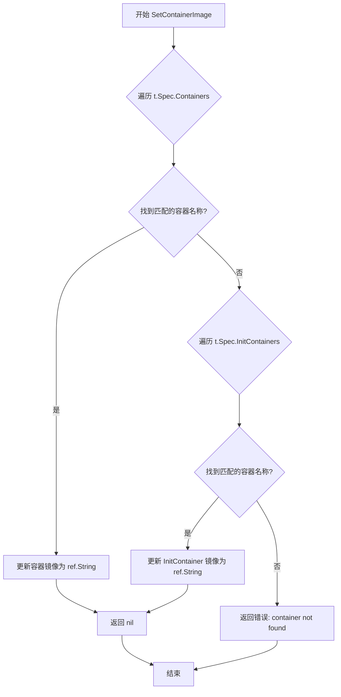

# `flux\pkg\cluster\kubernetes\resource\spec.go` 详细设计文档

该代码文件定义了 Kubernetes 资源对象的基础数据结构，包括 Pod 元数据、Pod 模板、容器规格、卷和环境变量等核心类型，并提供了容器镜像解析和更新的辅助方法，用于 fluxcd/flux 项目在 GitOps 工作流中处理 Kubernetes 资源配置。

## 整体流程



## 类结构

```
ObjectMeta (对象元数据)
├── Labels: map[string]string
└── Annotations: map[string]string

PodTemplate (Pod 模板)
├── Metadata: ObjectMeta
├── Spec: PodSpec
├── Containers() []resource.Container (方法)
└── SetContainerImage(container string, ref image.Ref) error (方法)

PodSpec (Pod 规格)
├── ImagePullSecrets: []struct{ Name string }
├── Volumes: []Volume
├── Containers: []ContainerSpec
└── InitContainers: []ContainerSpec

Volume (卷)
├── Name: string
└── Secret: struct{ SecretName string }

ContainerSpec (容器规格)
├── Name: string
├── Image: string
├── Args: Args ([]string)
├── Ports: []ContainerPort
└── Env: Env ([]EnvEntry)

ContainerPort (容器端口)
├── ContainerPort: int
└── Name: string

VolumeMount (卷挂载)
├── Name: string
├── MountPath: string
└── ReadOnly: bool

Env (环境变量列表)
└── []EnvEntry

EnvEntry (环境变量条目)
├── Name: string
└── Value: string
```

## 全局变量及字段


### `Containers`
    
获取 Pod 中的所有容器列表

类型：`func (PodTemplate) []resource.Container`
    


### `SetContainerImage`
    
设置指定容器的镜像

类型：`func (PodTemplate) SetContainerImage(string, image.Ref) error`
    


### `ObjectMeta.Labels`
    
标签键值对映射

类型：`map[string]string`
    


### `ObjectMeta.Annotations`
    
注解键值对映射

类型：`map[string]string`
    


### `PodTemplate.Metadata`
    
Pod 模板元数据

类型：`ObjectMeta`
    


### `PodTemplate.Spec`
    
Pod 模板规格定义

类型：`PodSpec`
    


### `PodSpec.ImagePullSecrets`
    
镜像拉取密钥列表

类型：`[]struct{ Name string }`
    


### `PodSpec.Volumes`
    
卷列表

类型：`[]Volume`
    


### `PodSpec.Containers`
    
容器规格列表

类型：`[]ContainerSpec`
    


### `PodSpec.InitContainers`
    
初始化容器规格列表

类型：`[]ContainerSpec`
    


### `Volume.Name`
    
卷名称

类型：`string`
    


### `Volume.Secret`
    
密钥卷配置

类型：`struct{ SecretName string }`
    


### `ContainerSpec.Name`
    
容器名称

类型：`string`
    


### `ContainerSpec.Image`
    
容器镜像

类型：`string`
    


### `ContainerSpec.Args`
    
容器启动参数

类型：`Args`
    


### `ContainerSpec.Ports`
    
容器端口列表

类型：`[]ContainerPort`
    


### `ContainerSpec.Env`
    
环境变量列表

类型：`Env`
    


### `ContainerPort.ContainerPort`
    
端口号

类型：`int`
    


### `ContainerPort.Name`
    
端口名称

类型：`string`
    


### `VolumeMount.Name`
    
卷名称

类型：`string`
    


### `VolumeMount.MountPath`
    
挂载路径

类型：`string`
    


### `VolumeMount.ReadOnly`
    
是否只读

类型：`bool`
    


### `EnvEntry.Name`
    
环境变量名称

类型：`string`
    


### `EnvEntry.Value`
    
环境变量值

类型：`string`
    
    

## 全局函数及方法


### `image.ParseRef`

解析容器镜像引用字符串，返回标准的 image.Ref 类型对象，用于统一处理不同格式的镜像引用（如带 registry 前缀、tag 或 digest 的镜像）。

参数：

- `imageString`：`string`，容器镜像的原始字符串表示（如 `"nginx:latest"`、`"myregistry.io/myapp:v1.2.3"`、`"image@sha256:abc123"` 等）

返回值：`image.Ref`，解析后的镜像引用对象，包含解析后的 registry、repository、tag/digest 等标准化信息

#### 流程图



#### 带注释源码

```go
// image.ParseRef 函数的调用方式（位于 PodTemplate.Containers 方法中）
// 注意：此源码来自调用方，非 image.ParseRef 本身的实现

// 遍历 PodSpec 中的所有容器
for _, c := range t.Spec.Containers {
    // 调用 image.ParseRef 解析容器镜像字符串
    // c.Image 是 string 类型，包含原始镜像引用字符串
    // 返回的 im 是 image.Ref 类型，表示解析后的标准化镜像引用
    im, _ := image.ParseRef(c.Image)
    
    // 将解析后的镜像引用与容器名称组合成 resource.Container
    // 并添加到结果切片中
    result = append(result, resource.Container{Name: c.Name, Image: im})
}

// 同样处理初始化容器
for _, c := range t.Spec.InitContainers {
    im, _ := image.ParseRef(c.Image)
    result = append(result, resource.Container{Name: c.Name, Image: im})
}
```

---

**备注**：由于 `image.ParseRef` 属于外部包 `github.com/fluxcd/flux/pkg/image`，其具体实现未在此代码库中展示。以上文档基于调用方式和使用上下文推断得出。在实际项目中，该函数通常负责：

1. 解析镜像字符串的各个组成部分（registry、repository、tag、digest）
2. 处理默认 registry（如 Docker Hub）
3. 验证镜像引用的合法性
4. 返回结构化的 `image.Ref` 对象供后续操作使用


### `PodTemplate.Containers()`

获取 PodTemplate 中的所有容器（包括 init containers），返回一个包含所有容器信息的切片。

参数：

- （无显式参数，接收者 `t` 为 `PodTemplate` 值类型）

返回值：`[]resource.Container`，返回 PodTemplate 中所有容器（包括普通容器和初始化容器）的列表，每个容器包含名称和解析后的镜像引用。

#### 流程图



#### 带注释源码

```go
// Containers 获取 PodTemplate 中的所有容器（包括 init containers）
// 返回一个包含所有容器信息的切片，每个容器包含名称和解析后的镜像引用
func (t PodTemplate) Containers() []resource.Container {
	// 初始化结果切片，用于存储所有容器
	var result []resource.Container
	
	// 遍历主容器列表
	// FIXME(https://github.com/fluxcd/flux/issues/1269): account for possible errors (x2)
	// 注释: 忽略 image.ParseRef 的错误返回值，可能导致静默失败
	for _, c := range t.Spec.Containers {
		// 解析容器镜像引用
		im, _ := image.ParseRef(c.Image)
		// 将容器名称和解析后的镜像添加到结果中
		result = append(result, resource.Container{Name: c.Name, Image: im})
	}
	
	// 遍历初始化容器列表
	// 同样忽略解析错误
	for _, c := range t.Spec.InitContainers {
		// 解析初始化容器镜像引用
		im, _ := image.ParseRef(c.Image)
		// 将初始化容器名称和解析后的镜像添加到结果中
		result = append(result, resource.Container{Name: c.Name, Image: im})
	}
	
	// 返回包含所有容器的切片
	return result
}
```

---

**备注**：该方法以值接收者 `(t PodTemplate)` 而非指针接收者实现，意味着方法内部对 `t` 的修改不会影响原始对象。此外，代码中存在潜在的技术债务：使用 `im, _ := image.ParseRef(c.Image)` 忽略了错误返回值（参见 FIXME 注释），当镜像引用格式不正确时，镜像字段将为空值但不报错，可能导致后续逻辑出现意外行为。


### `PodTemplate.SetContainerImage`

该方法用于更新 PodTemplate 中指定容器的镜像引用，首先在主容器列表中查找匹配名称的容器，如果找到则更新其镜像并返回 nil；若主容器中未找到，则在初始化容器列表中继续查找，查找成功则更新镜像，否则返回包含容器名称的错误信息。

参数：

- `container`：`string`，要更新镜像的容器名称
- `ref`：`image.Ref`，新的镜像引用对象

返回值：`error`，如果成功更新镜像则返回 nil，如果未找到指定容器则返回错误信息

#### 流程图



#### 带注释源码

```go
// SetContainerImage 更新 PodTemplate 中指定容器的镜像为新的镜像引用
// 参数 container: 要更新的目标容器名称
// 参数 ref: 新的镜像引用对象（image.Ref 类型）
// 返回值: 成功更新返回 nil，未找到容器返回错误信息
func (t PodTemplate) SetContainerImage(container string, ref image.Ref) error {
    // 遍历主容器列表（Containers）
    for i, c := range t.Spec.Containers {
        // 检查当前容器的名称是否与目标容器名称匹配
        if c.Name == container {
            // 找到目标容器，将镜像更新为 ref 的字符串表示形式
            t.Spec.Containers[i].Image = ref.String()
            // 更新成功，返回 nil 表示无错误
            return nil
        }
    }
    
    // 主容器列表中未找到目标容器，遍历初始化容器列表（InitContainers）
    for i, c := range t.Spec.InitContainers {
        // 检查初始化容器的名称是否与目标容器名称匹配
        if c.Name == container {
            // 找到目标初始化容器，将镜像更新为 ref 的字符串表示形式
            t.Spec.InitContainers[i].Image = ref.String()
            // 更新成功，返回 nil 表示无错误
            return nil
        }
    }
    
    // 两个容器列表中都未找到目标容器，返回格式化错误信息
    // 使用 fmt.Errorf 生成错误，%q 表示带引号的字符串格式化
    return fmt.Errorf("container %q not found in workload", container)
}
```


### PodTemplate.Containers()

该方法用于从PodTemplate中提取所有容器（包括主容器和初始化容器）的列表，将容器名称和解析后的镜像封装为resource.Container对象返回。

参数：
- 无参数（该方法是值接收者方法，使用隐式接收者 `t`）

返回值：`[]resource.Container`，返回Pod中所有容器的列表，包含主容器和初始化容器

#### 流程图

```mermaid
flowchart TD
    A[开始 Containers 方法] --> B[创建空的结果切片 result]
    B --> C{遍历 t.Spec.Containers}
    C -->|对于每个主容器| D[调用 image.ParseRef 解析镜像]
    D --> E[将 Container{Name, Image} 添加到 result]
    E --> C
    C -->|遍历完成| F{遍历 t.Spec.InitContainers}
    F -->|对于每个初始化容器| G[调用 image.ParseRef 解析镜像]
    G --> H[将 Container{Name, Image} 添加到 result]
    H --> F
    F -->|遍历完成| I[返回 result]
    I --> J[结束]
    
    style D fill:#ff9999
    style G fill:#ff9999
```

#### 带注释源码

```go
// Containers 返回 PodTemplate 中的所有容器列表
// 包括主容器 (Containers) 和初始化容器 (InitContainers)
func (t PodTemplate) Containers() []resource.Container {
    // 1. 初始化结果切片，用于存储所有容器
	var result []resource.Container
	
	// FIXME(https://github.com/fluxcd/flux/issues/1269): account for possible errors (x2)
	// 注意：此处存在技术债务 - image.ParseRef 可能返回错误，但当前使用 _ 忽略了错误处理
	
	// 2. 遍历主容器列表
	for _, c := range t.Spec.Containers {
		// 解析容器镜像引用
		im, _ := image.ParseRef(c.Image)
		// 将容器名称和解析后的镜像添加到结果中
		result = append(result, resource.Container{Name: c.Name, Image: im})
	}
	
	// 3. 遍历初始化容器列表
	for _, c := range t.Spec.InitContainers {
		// 解析初始化容器镜像引用
		im, _ := image.ParseRef(c.Image)
		// 将初始化容器名称和解析后的镜像添加到结果中
		result = append(result, resource.Container{Name: c.Name, Image: im})
	}
	
	// 4. 返回包含所有容器的切片
	return result
}
```

---

#### 补充信息

**技术债务/优化空间：**
- 代码中FIXME注释已指出问题：`image.ParseRef()` 返回的错误被直接忽略（使用 `_` ），这可能导致镜像解析失败时静默失败，应捕获并处理错误
- 建议修改为：`im, err := image.ParseRef(c.Image); if err != nil { return nil, err }` 或记录错误日志

**错误处理：**
- 当前实现：使用 `_` 忽略所有解析错误，可能导致不完整的容器列表
- 建议：添加错误返回或在解析失败时跳过该容器并记录警告


### `PodTemplate.SetContainerImage`

设置指定容器的镜像，通过在 PodTemplate 的 Containers 和 InitContainers 中查找匹配的容器名称来更新镜像。

参数：

- `container`：`string`，要设置的容器名称
- `ref`：`image.Ref`，镜像引用对象

返回值：`error`，如果找不到指定容器返回错误，否则返回 nil

#### 流程图



#### 带注释源码

```go
// SetContainerImage 设置指定容器的镜像
// 参数 container: 容器名称
// 参数 ref: 镜像引用
// 返回值: 找不到容器时返回错误
func (t PodTemplate) SetContainerImage(container string, ref image.Ref) error {
	// 遍历主容器列表
	for i, c := range t.Spec.Containers {
		// 查找名称匹配的容器
		if c.Name == container {
			// 更新镜像为 ref 的字符串表示
			t.Spec.Containers[i].Image = ref.String()
			// 成功设置，返回 nil
			return nil
		}
	}
	// 遍历初始化容器列表
	for i, c := range t.Spec.InitContainers {
		// 查找名称匹配的初始化容器
		if c.Name == container {
			// 更新镜像为 ref 的字符串表示
			t.Spec.InitContainers[i].Image = ref.String()
			// 成功设置，返回 nil
			return nil
		}
	}
	// 未找到指定容器，返回错误
	return fmt.Errorf("container %q not found in workload", container)
}
```

## 关键组件


### ObjectMeta

用于存储Kubernetes资源的元数据，包含Labels和Annotations两个map类型的字段，分别用于存放标签和注解信息。

### PodTemplate

Pod模板结构体，包含Metadata和Spec两部分，分别对应Pod的元数据和规格定义，是获取和设置容器信息的主要入口。

### PodSpec

Pod规格定义结构体，包含ImagePullSecrets、Volumes、Containers和InitContainers字段，用于描述Pod的完整配置信息。

### ContainerSpec

容器规格结构体，定义单个容器的属性，包括Name、Image、Args、Ports和Env字段。

### Volume

卷结构体，包含Name和Secret两个字段，用于定义Pod中使用的卷资源，特别是Secret类型的卷。

### PodTemplate.Containers()

获取Pod中所有容器（包括普通容器和初始化容器）的列表，返回resource.Container切片。该方法会解析容器镜像引用，可能存在错误被忽略的情况。

### PodTemplate.SetContainerImage()

根据容器名称设置对应容器的镜像引用，支持普通容器和初始化容器。如果找不到指定容器会返回错误。

### Env

环境变量列表类型，本质是一个EnvEntry切片，用于存储容器的环境变量配置。

### ContainerPort

容器端口结构体，定义容器的端口信息，包含ContainerPort和Name字段。

### VolumeMount

卷挂载结构体，用于描述卷在容器中的挂载路径和权限。


## 问题及建议


### 已知问题

-   **错误忽略（FIXME）**：在`Containers()`方法中，`image.ParseRef(c.Image)`返回的错误被直接忽略（使用`_`），这可能导致镜像解析失败时静默失败，无法向上层调用者报告问题。代码中已有FIXME注释指向issue #1269。
-   **值接收者导致修改无效**：`SetContainerImage`方法使用值接收者`(t PodTemplate)`而非指针接收者`(t *PodTemplate)`，这意味着对容器镜像的修改不会反映到原始对象上，这是一个潜在的逻辑bug。
-   **重复遍历逻辑**：`Containers()`和`SetContainerImage`两个方法都包含遍历`Containers`和`InitContainers`的重复代码模式，可提取为辅助方法以提高可维护性。
-   **Env类型设计低效**：`Env`定义为`[]EnvEntry`（slice），而非map，在查找特定环境变量时需要O(n)时间复杂度，当环境变量较多时性能不佳。
-   **匿名结构体降低可复用性**：`PodSpec.ImagePullSecrets`和`Volume.Secret`使用匿名结构体定义，缺少类型复用和清晰的接口定义，扩展性受限。
-   **Volume类型单一**：Volume结构体仅支持Secret类型，缺少对ConfigMap、emptyDir、persistentVolumeClaim等其他常见卷类型的支持。

### 优化建议

-   **修复方法接收者**：将`SetContainerImage`改为使用指针接收者`(t *PodTemplate)`，确保镜像修改能够持久化。
-   **改进错误处理**：在`Containers()`方法中记录或返回`image.ParseRef`的错误，而非忽略；考虑返回`(`[]resource.Container`, error)`以支持错误传播。
-   **提取公共逻辑**：创建辅助方法如`findContainerByName(containers []ContainerSpec, name string) (*ContainerSpec, int)`以减少重复遍历代码。
-   **优化Env查找效率**：考虑提供`Get(key string)`和`Set(key, value string)`方法，或在需要频繁查找的场景下提供map视图。
-   **完善Volume类型支持**：根据Kubernetes规范扩展Volume结构体以支持更多卷类型（ConfigMap、emptyDir、persistentVolumeClaim等）。
-   **添加序列化标签**：为结构体字段添加`json`、`yaml`标签以明确序列化行为，避免隐式依赖导致的潜在问题。

## 其它


### 设计目标与约束

本代码库的设计目标是定义 Kubernetes Pod 模板和相关资源的数据结构，为 Flux CD 自动化容器镜像更新提供数据模型支持。核心约束包括：遵循 Kubernetes API 对象结构定义，确保与 Flux 生态系统其他组件（如 image 和 resource 包）的数据兼容性；使用 Go 语言结构体标签（如 `yaml:"initContainers"`）支持 YAML 序列化；仅导出必要的类型以保持 API 简洁。

### 错误处理与异常设计

代码中的错误处理采用显式返回 error 的模式。`SetContainerImage` 方法在容器未找到时返回格式化的错误信息，使用 `fmt.Errorf` 创建包含容器名称的错误。`Containers()` 方法存在 FIXME 注释（#1269），指出需要处理 `image.ParseRef` 可能返回的错误，但当前实现使用空值忽略（`im, _ :=`），这可能导致部分容器信息丢失时静默失败。建议后续改进为记录错误或使用更安全的错误传播机制。

### 数据流与状态机

数据流主要包含两个方向：解析流程和更新流程。解析流程：`PodTemplate` → 提取 `Spec.Containers` 和 `Spec.InitContainers` → 解析镜像引用为 `image.Ref` → 转换为 `resource.Container` 列表。更新流程：接收目标容器名称和新的镜像引用 → 在 `Containers` 或 `InitContainers` 中查找匹配 → 更新镜像字符串。该过程不涉及复杂的状态机，因为对象是内存中的数据模型，不持有持久化状态。

### 外部依赖与接口契约

外部依赖包括两个 Flux 内部包：`github.com/fluxcd/flux/pkg/image` 包提供 `ParseRef` 函数用于解析容器镜像引用为结构化对象，`github.com/fluxcd/flux/pkg/resource` 包提供 `Container` 类型用于表示容器信息。接口契约方面：`PodTemplate.Containers()` 方法返回包含所有容器（常规容器和初始化容器）的切片；`PodTemplate.SetContainerImage(container string, ref image.Ref) error` 方法接受容器名称和新镜像引用，成功时返回 nil，失败时返回错误。

### 性能考虑

当前实现对容器列表进行线性扫描以查找特定容器，在 InitContainers 数量较多时可能导致性能下降。`Containers()` 方法在每次调用时都会创建新的切片并重新解析所有镜像引用，存在重复计算的可能性。优化方向包括：为常用容器添加索引缓存、延迟解析镜像引用、或使用指针接收者避免值拷贝。

### 安全性考虑

代码定义了 `Volume` 类型包含 `Secret` 字段，用于挂载 Kubernetes Secret。当前实现仅存储 `SecretName` 字符串，不直接处理 Secret 内容，符合最小暴露原则。`Env` 变量类型直接存储明文字符串，在日志或调试时可能泄露敏感信息，建议在后续版本中添加敏感数据标记或加密处理。镜像引用解析不涉及凭证管理，安全性由上层调用者负责。

### 测试策略

建议覆盖以下测试场景：`Containers()` 方法应测试同时包含常规容器和初始化容器的 PodTemplate，验证镜像解析的正确性，以及处理空容器列表的情况。`SetContainerImage` 方法应测试成功修改常规容器和初始化容器中的镜像，以及容器名称不存在时的错误返回。还需要测试 `ObjectMeta` 和 `PodSpec` 结构体的 YAML 序列化/反序列化能力，确保与 Kubernetes API 兼容。测试数据可参考真实的 Kubernetes Pod 定义。

### 版本兼容性

当前代码使用 `yaml` 标签表明支持 YAML 序列化，但未指定 Kubernetes API 版本。Flux CD 需要兼容多个 Kubernetes 版本，因此需明确支持的 K8s API 版本范围（如 v1.16+）。结构体字段（如 `InitContainers` 使用 `yaml:"initContainers"` 标签）应与目标 K8s 版本的字段名称保持一致。随着 Kubernetes API 演进，可能需要引入版本化结构体或使用 k8s.io/apimachinery 提供的类型。

### 故障排查指南

常见问题与解决方案：1. 容器未找到错误：当 `SetContainerImage` 返回 "container not found" 时，检查容器名称拼写，确保与 Pod 定义中的 `name` 字段完全匹配，注意大小写敏感。2. 镜像更新不生效：确认 `SetContainerImage` 调用后是否正确序列化回资源文件，Flux 可能需要同步周期才能检测到变更。3. 解析错误静默丢失：`Containers()` 方法中的 FIXME 表明部分容器可能因镜像解析失败而被忽略，检查上游镜像仓库可访问性。

### 附录：术语表

Flux CD：连续交付工具，用于自动化 Kubernetes 的容器镜像更新。PodTemplate：Kubernetes Pod 模板定义，包含容器规范。ContainerSpec：容器规范定义，包括镜像、参数、端口等。InitContainers：Pod 中的初始化容器，在主容器之前运行。ImageRef：容器镜像的引用，包含仓库、标签和 digest 信息。


    