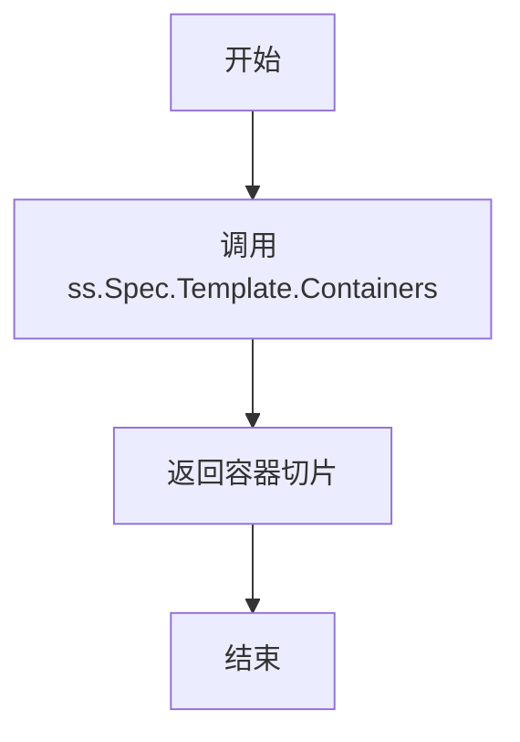
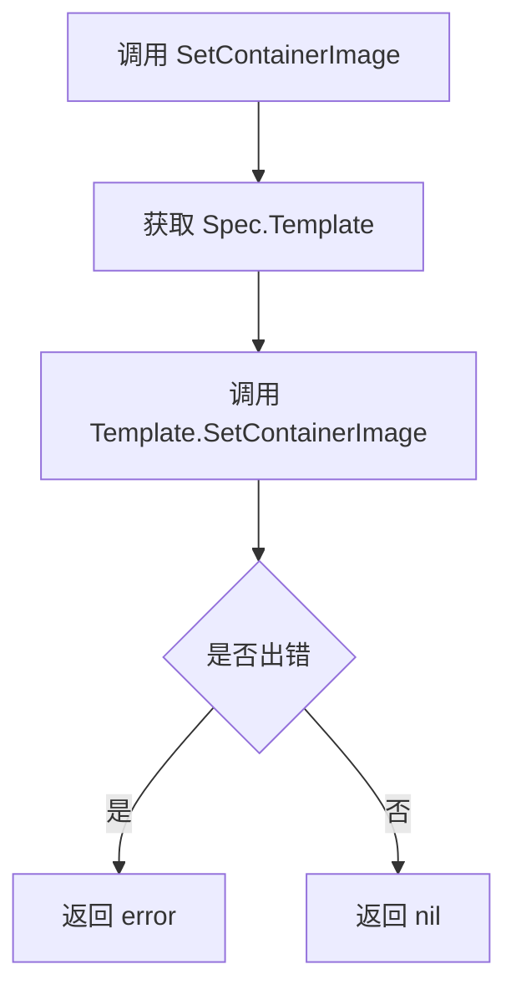
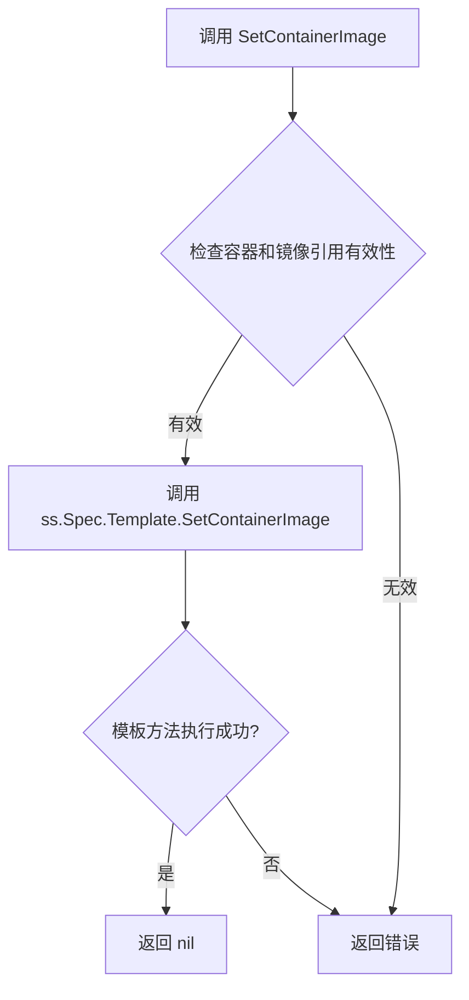

# `flux\pkg\cluster\kubernetes\resource\statefulset.go` 详细设计文档

该代码定义了Flux CD项目中的StatefulSet资源类型，封装了Kubernetes的StatefulSet API对象，提供了容器查询和镜像设置的功能，并确保实现了resource.Workload接口。

## 整体流程

```mermaid
graph TD
A[开始] --> B[定义StatefulSet结构体]
B --> C[定义StatefulSetSpec结构体]
C --> D[实现Containers方法]
D --> E[实现SetContainerImage方法]
E --> F[接口检查: var _ resource.Workload = StatefulSet{}]
```

## 类结构

```
baseObject (嵌入的基类)
└── StatefulSet (StatefulSet资源类型)
    └── StatefulSetSpec (规格定义)
        ├── Replicas (副本数)
        └── Template (Pod模板)
            └── PodTemplate (嵌入的模板类型)
```

## 全局变量及字段


### `_`
    
空标识符，用于在编译时检查StatefulSet是否实现了resource.Workload接口

类型：`resource.Workload`
    


### `StatefulSet.baseObject`
    
嵌入的基类对象，提供通用的资源元数据和行为

类型：`baseObject`
    


### `StatefulSet.Spec`
    
StatefulSet的规格定义，包含副本数和Pod模板

类型：`StatefulSetSpec`
    


### `StatefulSetSpec.Replicas`
    
副本数量

类型：`int`
    


### `StatefulSetSpec.Template`
    
Pod模板

类型：`PodTemplate`
    
    

## 全局函数及方法


### `StatefulSet.Containers`

返回StatefulSet中定义的所有容器列表。

参数：

- （无参数）

返回值：`[]resource.Container`，返回StatefulSet的容器列表

#### 流程图



#### 带注释源码

```go
// Containers 返回StatefulSet中定义的所有容器
// 接收者: ss StatefulSet类型实例
// 返回值: []resource.Container - 容器资源切片
func (ss StatefulSet) Containers() []resource.Container {
    // 调用底层PodTemplate的Containers方法获取容器列表
    return ss.Spec.Template.Containers()
}
```


### StatefulSet.SetContainerImage

设置StatefulSet资源中指定容器的镜像。

参数：

- `container`：`string`，要设置镜像的容器名称
- `ref`：`image.Ref`，新的镜像引用

返回值：`error`，如果设置镜像时发生错误则返回错误信息，否则返回nil

#### 流程图



#### 带注释源码

```go
// SetContainerImage 方法用于设置 StatefulSet 中指定容器的镜像
// 参数 container: 目标容器的名称
// 参数 ref: 新的镜像引用（包含镜像仓库和标签信息）
// 返回值: 操作过程中的错误信息，若成功则返回 nil
func (ss StatefulSet) SetContainerImage(container string, ref image.Ref) error {
    // 将镜像设置操作委托给底层的 PodTemplate 处理
    // StatefulSet 的镜像信息存储在 Spec.Template 中
    return ss.Spec.Template.SetContainerImage(container, ref)
}
```


### `StatefulSet.Containers()`

该方法用于获取 StatefulSet 资源中定义的所有容器列表，通过委托调用其内部 `Spec.Template` 的 `Containers()` 方法实现。

参数：

- （无参数）

返回值：`[]resource.Container`，返回 StatefulSet 的 Pod 模板中定义的所有容器数组

#### 流程图

```mermaid
flowchart TD
    A[调用 StatefulSet.Containers] --> B{检查 StatefulSet 对象}
    B -->|有效对象| C[访问 ss.Spec.Template]
    C --> D[调用 Template.Containers]
    D --> E[返回 []resource.Container 容器列表]
    B -->|无效对象| F[返回空容器列表或 panic]
```

#### 带注释源码

```go
// Containers 返回 StatefulSet 中定义的所有容器
// 该方法实现了 resource.Workload 接口
// 接收者：ss StatefulSet - StatefulSet 资源实例
// 返回值：[]resource.Container - 容器列表
func (ss StatefulSet) Containers() []resource.Container {
    // 委托给内部 Spec.Template 的 Containers 方法获取容器列表
    // Template 是 PodTemplate 类型，包含了 Pod 规范定义
    return ss.Spec.Template.Containers()
}
```

#### 关键依赖类型信息

| 类型/接口 | 描述 |
|-----------|------|
| `StatefulSet` | StatefulSet 资源结构体，包含 baseObject 和 Spec 字段 |
| `StatefulSetSpec` | StatefulSet 规范，包含 Replicas 和 Template 字段 |
| `PodTemplate` | Pod 模板定义，包含容器信息的结构体 |
| `resource.Container` | 容器资源类型，来自 flux/pkg/resource 包 |

#### 技术债务与优化空间

1. **缺少错误处理**：当前实现直接返回委托调用的结果，未进行任何错误校验或边界检查
2. **无缓存机制**：每次调用都会访问 `Spec.Template.Containers()`，若容器列表较大且调用频繁，可考虑缓存结果
3. **接口实现不完整**：仅实现了 `Containers()` 和 `SetContainerImage()` 方法，但未看到其他 `resource.Workload` 接口方法的完整实现
4. **空容器风险**：未对空容器列表进行防护，可能导致下游调用方出现空指针异常


### `StatefulSet.SetContainerImage`

该方法用于设置StatefulSet中指定容器的镜像，通过委托给其内部Template的SetContainerImage方法实现。

参数：

- `container`：`string`，要设置镜像的容器名称
- `ref`：`image.Ref`，新的镜像引用

返回值：`error`，如果设置镜像时发生错误则返回错误，否则返回nil

#### 流程图



#### 带注释源码

```go
// SetContainerImage 方法用于设置 StatefulSet 中指定容器的镜像
// 参数:
//   - container: 容器名称，标识要更新哪个容器的镜像
//   - ref: 镜像引用，包含镜像的仓库、标签等信息
//
// 返回值:
//   - error: 操作过程中的错误信息，如果成功则返回 nil
func (ss StatefulSet) SetContainerImage(container string, ref image.Ref) error {
    // 委托给内部模板对象处理实际的镜像设置逻辑
    // StatefulSet 的 Pod 模板规范存储在 Spec.Template 中
    return ss.Spec.Template.SetContainerImage(container, ref)
}
```


## 关键组件


### StatefulSet 结构体

表示Kubernetes StatefulSet资源类型，实现了resource.Workload接口，用于管理有状态应用的工作负载。

### StatefulSetSpec 结构体

定义StatefulSet的规范，包含副本数和Pod模板信息，是StatefulSet的核心配置结构。

### Containers() 方法

获取StatefulSet中所有容器的列表，返回container资源对象的切片，实现了Workload接口的容器查询功能。

### SetContainerImage() 方法

根据给定的容器名称和镜像引用更新容器镜像，返回错误信息以处理设置失败的情况。

### baseObject 嵌入

通过结构体嵌入方式继承基础资源对象的属性和方法，提供名称、命名空间、元数据等基础功能。

### resource.Workload 接口实现

通过var _ resource.Workload = StatefulSet{}编译时断言确保StatefulSet实现了Workload接口的所有方法。


## 问题及建议


### 已知问题

- **空实例接口检查不准确**：使用 `var _ resource.Workload = StatefulSet{}` 进行接口检查，但值类型实现接口可能与指针类型实现接口不一致，应使用 `var _ resource.Workload = &StatefulSet{}` 确保指针接收者方法正确实现接口。
- **方法接收者类型选择不当**：`Containers()` 和 `SetContainerImage()` 使用值接收者，可能导致不必要的结构体复制，且 `SetContainerImage` 需要修改状态，应使用指针接收者 `(ss *StatefulSet)` 以提高性能和正确性。
- **缺乏错误上下文**：`SetContainerImage` 方法直接返回模板的错误，没有添加额外上下文信息，不利于调用者定位问题。
- **字段缺少文档注释**：结构体字段（如 `Replicas`、`Template`）没有注释，降低代码可读性和可维护性。
- **接口实现不完整**：仅通过编译时检查验证接口，未显式声明实现 `resource.Workload` 接口的所有方法（如 `GetNamespace()`、`GetName()` 等），代码意图不明确。
- **类型灵活性不足**：`Template` 字段直接使用 `PodTemplate` 具体类型而非接口，限制了扩展性，若 `PodTemplate` 包含不必要字段会造成资源浪费。
- **无版本控制机制**：缺少 Kubernetes 资源常见的 `apiVersion` 和 `kind` 字段定义，不符合 Kubernetes 对象规范。

### 优化建议

- 将接口检查改为指针类型：`var _ resource.Workload = &StatefulSet{}`，并确保所有修改型方法使用指针接收者。
- 将方法接收者改为指针类型：`func (ss *StatefulSet) Containers()` 和 `func (ss *StatefulSet) SetContainerImage(container string, ref image.Ref) error`。
- 在错误返回中添加上下文：使用 `fmt.Errorf` 或自定义错误包装，为错误信息添加前缀以描述调用来源。
- 为所有导出的类型和字段添加文档注释，遵循 Go 文档规范。
- 显式声明接口实现：在类型定义后添加注释 `// Ensure StatefulSet implements resource.Workload.` 或定义别名类型明确关系。
- 考虑将 `Template` 字段类型改为接口（如 `interface{}` 或自定义接口），或使用更通用的类型以提高灵活性。
- 考虑添加 `APIVersion` 和 `Kind` 字段以符合 Kubernetes 标准，或在 `baseObject` 中定义这些字段。

## 其它


### 设计目标与约束

本代码的设计目标是为Flux CD系统提供对Kubernetes StatefulSet资源的支持，使其能够像其他Workload类型一样被Flux管理容器镜像更新。设计约束包括：必须实现resource.Workload接口以保持一致性；遵循Flux CD的resource包设计模式；与image包解耦以支持不同的镜像引用类型。

### 错误处理与异常设计

SetContainerImage方法返回error类型用于处理镜像设置失败的情况。可能的错误场景包括：容器名称不存在时返回错误、镜像引用格式无效时返回错误。当前实现中，错误传播自底层PodTemplate的SetContainerImage方法。Containers方法无错误返回，因为容器列表获取不会失败。

### 外部依赖与接口契约

主要依赖包括：github.com/fluxcd/flux/pkg/image包提供image.Ref类型用于镜像引用；github.com/fluxcd/flux/pkg/resource包提供Workload接口定义和Container结构。接口契约方面：实现了resource.Workload接口的Containers() ([]resource.Container, error)和SetContainerImage(string, image.Ref) error方法；StatefulSetSpec.Template字段需提供Containers()和SetContainerImage()方法。

### 数据流与状态机

数据流方向：外部调用SetContainerImage方法 → StatefulSet.Spec.Template.SetContainerImage → 更新PodTemplate中的容器镜像。状态转换：初始状态为当前镜像引用 → 调用SetContainerImage后转换为新镜像引用。Containers()方法提供只读数据流，将内部容器配置转换为resource.Container列表供外部使用。

### 性能考虑与优化空间

当前实现为值类型传递，可能导致复制开销。建议改为指针类型(*StatefulSet)以提高效率。Containers()方法每次调用都会遍历容器列表，如频繁调用可考虑缓存结果。SetContainerImage方法直接修改内部状态，无额外内存分配。

### 测试策略建议

应包含单元测试验证：Containers()正确返回Spec.Template中的容器列表；SetContainerImage成功更新指定容器镜像；SetContainerImage对不存在容器返回正确错误；实现Workload接口验证。

### 版本兼容性说明

代码依赖的image.Ref类型和resource.Workload接口来自Flux CD主仓库，需与对应版本保持兼容。StatefulSet资源版本支持需与Kubernetes API版本对应。


    