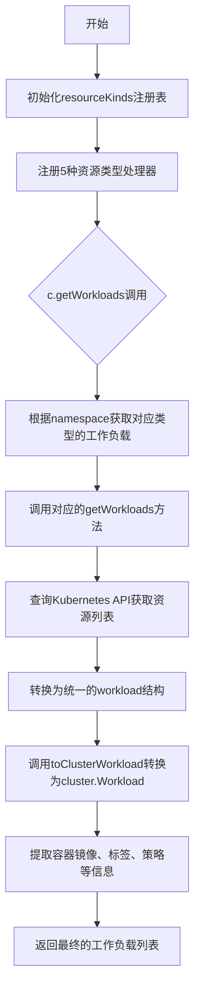
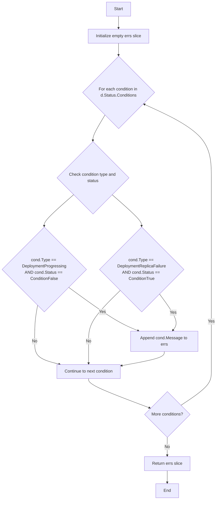
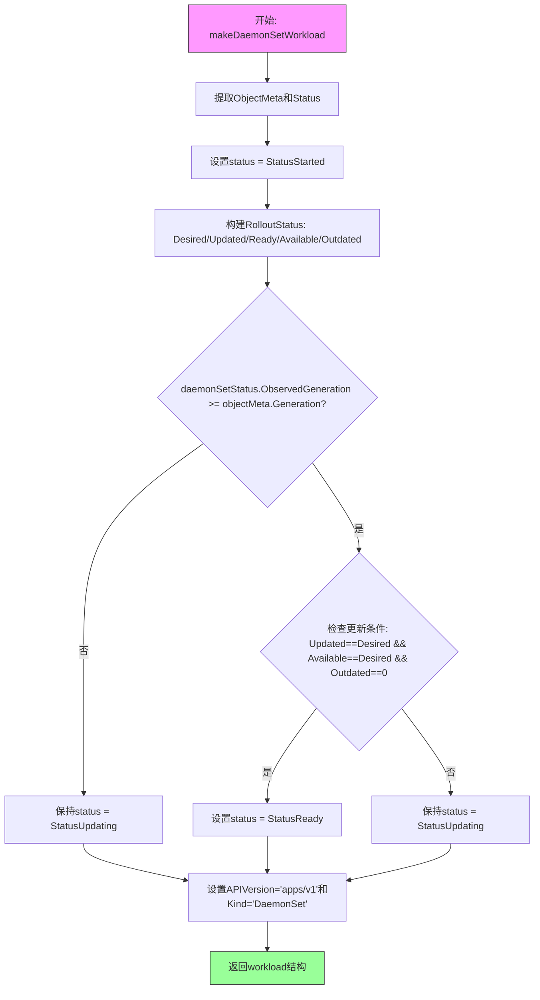
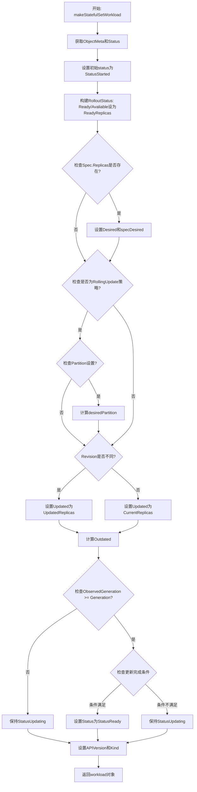
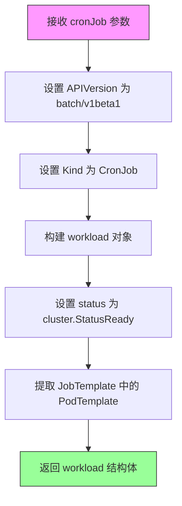
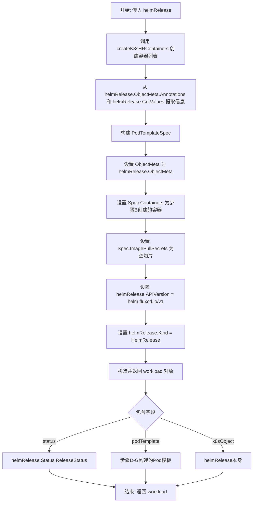
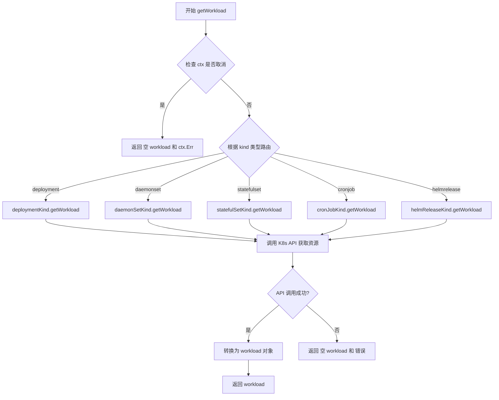
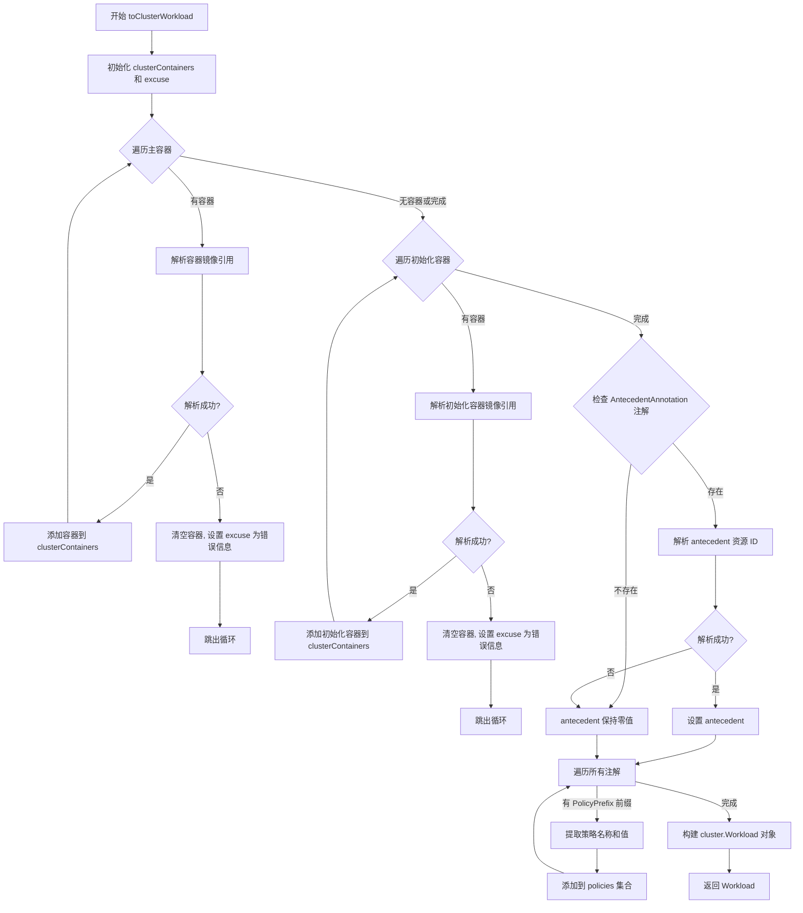
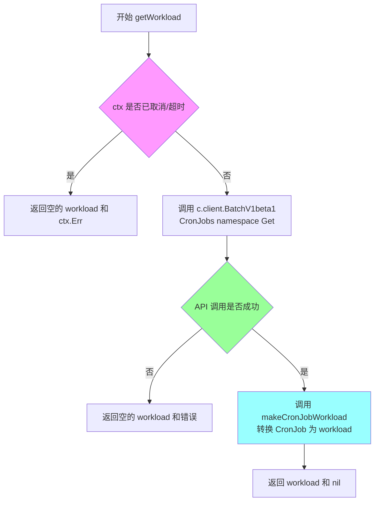

# `flux\pkg\cluster\kubernetes\resourcekinds.go` 详细设计文档

该代码是Flux CD项目中的Kubernetes集群抽象层，负责管理和转换各种Kubernetes工作负载（Deployment、DaemonSet、StatefulSet、CronJob、HelmRelease）为统一的集群工作负载对象，提供工作负载的查询、状态跟踪和容器信息提取功能。

## 整体流程



## 类结构

```
resourceKind (接口)
├── deploymentKind (Deployment处理器)
├── daemonSetKind (DaemonSet处理器)
├── statefulSetKind (StatefulSet处理器)
├── cronJobKind (CronJob处理器)
└── helmReleaseKind (HelmRelease处理器)

workload (核心数据结构)
└── toClusterWorkload (转换为集群工作负载)
```

## 全局变量及字段


### `AntecedentAnnotation`
    
先行注解名称，用于标识资源间接来源于HelmRelease

类型：`const string`
    


### `resourceKinds`
    
资源类型注册表map，用于存储不同Kubernetes资源类型的处理接口

类型：`map[string]resourceKind`
    


### `workload.k8sObject`
    
嵌入的Kubernetes对象，用于存储原始的k8s资源

类型：`k8sObject (嵌入的Kubernetes对象接口)`
    


### `workload.status`
    
工作负载状态，表示资源当前的状态（如Started/Updating/Ready/Error）

类型：`string`
    


### `workload.rollout`
    
部署状态，包含副本数、更新数、就绪数等部署相关信息

类型：`cluster.RolloutStatus`
    


### `workload.syncError`
    
同步错误，记录工作负载同步过程中的错误信息

类型：`error`
    


### `workload.podTemplate`
    
Pod模板规范，包含容器的镜像、名称等容器配置信息

类型：`apiv1.PodTemplateSpec`
    
    

## 全局函数及方法


### `deploymentErrors`

该函数用于检查 Kubernetes Deployment 的状态条件，识别部署卡住或失败的情况，并返回相关的错误信息。它通过遍历 Deployment 的状态条件，查找 `DeploymentProgressing` 状态为 False（部署未取得进展）或 `DeploymentReplicaFailure` 状态为 True（副本集失败）的条件，并收集这些条件中的错误消息。

参数：

- `d`：`*apiapps.Deployment`，Kubernetes Deployment 对象的指针，用于检查其状态条件中是否存在部署错误

返回值：`[]string`，返回从 Deployment 状态条件中收集到的错误消息列表，如果没有错误则返回空切片

#### 流程图



#### 带注释源码

```go
// Deployment may get stuck trying to deploy its newest ReplicaSet without ever completing.
// One way to detect this condition is to specify a deadline parameter in Deployment spec:
// .spec.progressDeadlineSeconds
// See https://kubernetes.io/docs/concepts/workloads/controllers/deployment/#failed-deployment
func deploymentErrors(d *apiapps.Deployment) []string {
	var errs []string
	// 遍历 Deployment 的所有状态条件
	for _, cond := range d.Status.Conditions {
		// 检查两种错误情况：
		// 1. DeploymentProgressing 条件为 False - 表示部署未取得进展（卡住）
		// 2. DeploymentReplicaFailure 条件为 True - 表示存在副本集失败
		if (cond.Type == apiapps.DeploymentProgressing && cond.Status == apiv1.ConditionFalse) ||
			(cond.Type == apiapps.DeploymentReplicaFailure && cond.Status == apiv1.ConditionTrue) {
			// 将错误条件的信息消息添加到错误列表中
			errs = append(errs, cond.Message)
		}
	}
	// 返回收集到的所有错误消息，如果没有错误则返回空切片
	return errs
}
```


### `makeDeploymentWorkload`

该函数将 Kubernetes Deployment 对象转换为内部 workload 结构，用于在 Flux 集群管理中表示和管理 Deployment 的状态、滚动更新进度以及错误信息。

参数：

- `deployment`：`*apiapps.Deployment`，Kubernetes Deployment 对象的指针，包含了 Deployment 的完整定义和当前状态信息

返回值：`workload`，转换后的内部 workload 结构，包含状态、滚动更新信息和 Pod 模板等

#### 流程图

```mermaid
flowchart TD
    A[开始: 传入 deployment] --> B[提取 ObjectMeta 和 DeploymentStatus]
    B --> C[设置初始状态为 cluster.StatusStarted]
    C --> D[构建 RolloutStatus 结构]
    D --> E{deploymentStatus.ObservedGeneration >= objectMeta.Generation?}
    E -->|是| F[更新状态为 cluster.StatusUpdating]
    F --> G{rollout.Updated == rollout.Desired<br/>&& rollout.Available == rollout.Desired<br/>&& rollout.Outdated == 0?}
    G -->|是| H[设置状态为 cluster.StatusReady]
    G -->|否| I{len(rollout.Messages) != 0?}
    I -->|是| J[设置状态为 cluster.StatusError]
    I -->|否| K[保持 cluster.StatusUpdating]
    E -->|否| L[保持 cluster.StatusStarted]
    H --> M[设置 APIVersion=apps/v1, Kind=Deployment]
    J --> M
    K --> M
    L --> M
    M --> N[返回 workload 结构]
```

#### 带注释源码

```go
// makeDeploymentWorkload 将 Kubernetes Deployment 对象转换为内部 workload 结构
// 参数: deployment - Kubernetes Deployment 对象的指针
// 返回: 包含状态、滚动更新信息和 Pod 模板的 workload 结构
func makeDeploymentWorkload(deployment *apiapps.Deployment) workload {
	var status string                                   // 工作负载的当前状态
	objectMeta, deploymentStatus := deployment.ObjectMeta, deployment.Status // 提取对象的元数据和状态信息

	// 初始状态设为 "已启动"
	status = cluster.StatusStarted
	
	// 构建滚动更新状态结构，包含副本相关计数和错误信息
	rollout := cluster.RolloutStatus{
		Desired:   *deployment.Spec.Replicas,                              // 期望的副本数
		Updated:   deploymentStatus.UpdatedReplicas,                       // 已更新的副本数
		Ready:     deploymentStatus.ReadyReplicas,                         // 就绪的副本数
		Available: deploymentStatus.AvailableReplicas,                      // 可用的副本数
		Outdated:  deploymentStatus.Replicas - deploymentStatus.UpdatedReplicas, // 过时的副本数
		Messages:  deploymentErrors(deployment),                            // 部署错误信息
	}

	// 检查是否已观察到最新一代的部署定义
	if deploymentStatus.ObservedGeneration >= objectMeta.Generation {
		// 定义已更新，检查副本状态
		status = cluster.StatusUpdating
		
		// 判断是否所有副本都已更新且可用
		if rollout.Updated == rollout.Desired && rollout.Available == rollout.Desired && rollout.Outdated == 0 {
			status = cluster.StatusReady // 所有副本都已就绪
		}
		
		// 如果存在错误信息，标记为错误状态
		if len(rollout.Messages) != 0 {
			status = cluster.StatusError
		}
	}
	
	// 必须设置 APIVersion 和 Kind，因为 TypeMeta 未被填充
	deployment.APIVersion = "apps/v1"
	deployment.Kind = "Deployment"
	
	// 返回包含完整信息的 workload 结构
	return workload{
		status:      status,                     // 当前状态
		rollout:     rollout,                    // 滚动更新状态
		podTemplate: deployment.Spec.Template,   // Pod 模板规范
		k8sObject:   deployment}                 // 原始 Kubernetes 对象
}
```


### `makeDaemonSetWorkload`

将 Kubernetes DaemonSet 对象转换为内部 workload 结构，用于在 Flux 集群管理中表示和管理 DaemonSet 资源的状态、滚动更新进度和 Pod 模板信息。

参数：

- `daemonSet`：`*apiapps.DaemonSet`，待转换的 Kubernetes DaemonSet 对象

返回值：`workload`，转换后的内部 workload 结构，包含状态、滚动更新信息和 Pod 模板

#### 流程图



#### 带注释源码

```go
// makeDaemonSetWorkload 将 Kubernetes DaemonSet 转换为内部 workload 表示
// 参数: daemonSet - Kubernetes DaemonSet 对象的指针
// 返回: 转换后的 workload 结构
func makeDaemonSetWorkload(daemonSet *apiapps.DaemonSet) workload {
	var status string                                          // 工作负载状态
	objectMeta, daemonSetStatus := daemonSet.ObjectMeta, daemonSet.Status // 提取元数据和状态

	// 初始状态为已启动
	status = cluster.StatusStarted
	
	// 构建滚动更新状态信息
	// Desired: 期望调度的 Pod 数量
	// Updated: 已更新的 Pod 数量
	// Ready: 已就绪的 Pod 数量
	// Available: 可用的 Pod 数量
	// Outdated: 过期 Pod 数量 = 当前调度的 Pod 数 - 已更新的 Pod 数
	rollout := cluster.RolloutStatus{
		Desired:   daemonSetStatus.DesiredNumberScheduled,
		Updated:   daemonSetStatus.UpdatedNumberScheduled,
		Ready:     daemonSetStatus.NumberReady,
		Available: daemonSetStatus.NumberAvailable,
		Outdated:  daemonSetStatus.CurrentNumberScheduled - daemonSetStatus.UpdatedNumberScheduled,
		// TODO: 在 Kubernetes 修复 DaemonSet 有效条件类型后添加 Messages
		// 参考: https://github.com/kubernetes/kubernetes/blob/f3e0750754ebeea4ea8e0d452cbaf55426751d12/pkg/apis/extensions/types.go#L434
	}

	// 检查是否已观察到最新版本的定义
	if daemonSetStatus.ObservedGeneration >= objectMeta.Generation {
		// 定义已更新，检查 Pod 副本状态
		status = cluster.StatusUpdating
		// 判断是否所有 Pod 都已更新且可用
		if rollout.Updated == rollout.Desired && rollout.Available == rollout.Desired && rollout.Outdated == 0 {
			status = cluster.StatusReady
		}
	}

	// 必须手动设置 APIVersion 和 Kind，因为 TypeMeta 未被填充
	daemonSet.APIVersion = "apps/v1"
	daemonSet.Kind = "DaemonSet"
	
	// 返回包含状态、滚动更新信息和 Pod 模板的 workload 结构
	return workload{
		status:      status,
		rollout:     rollout,
		podTemplate: daemonSet.Spec.Template, // Pod 模板规范
		k8sObject:   daemonSet}                // 原始 Kubernetes 对象
}
```


### `makeStatefulSetWorkload`

该函数负责将 Kubernetes StatefulSet 资源转换为内部 workload 对象，提取状态、副本信息、滚动更新策略等关键数据，用于集群工作负载的统一管理和展示。

参数：

- `statefulSet`：`*apiapps.StatefulSet`，待转换的 Kubernetes StatefulSet 资源对象

返回值：`workload`，转换后的内部工作负载表示，包含状态、滚动更新信息和 Pod 模板规范

#### 流程图



#### 带注释源码

```go
// makeStatefulSetWorkload 将 Kubernetes StatefulSet 转换为内部 workload 对象
// 参数: statefulSet - Kubernetes StatefulSet 资源指针
// 返回: 转换后的 workload 结构体
func makeStatefulSetWorkload(statefulSet *apiapps.StatefulSet) workload {
	// 定义状态字符串，用于表示工作负载的当前状态
	var status string
	// 提取 StatefulSet 的对象元数据和状态信息
	objectMeta, statefulSetStatus := statefulSet.ObjectMeta, statefulSet.Status

	// 初始化状态为"已启动"
	status = cluster.StatusStarted
	// 构建滚动更新状态结构体
	rollout := cluster.RolloutStatus{
		Ready: statefulSetStatus.ReadyReplicas,
		// StatefulSet 没有 Available 字段，因此使用 Ready 代替
		Available: statefulSetStatus.ReadyReplicas,
		// TODO: 当 Kubernetes 修复 StatefulSet 有效条件类型后添加 Messages
	}

	// 用于存储 Spec 中定义的期望副本数
	var specDesired int32
	// 检查是否指定了副本数
	if statefulSet.Spec.Replicas != nil {
		rollout.Desired = *statefulSet.Spec.Replicas
		specDesired = *statefulSet.Spec.Replicas
	}

	// 处理滚动更新策略
	// 检查是否启用了滚动更新且设置了分区
	if statefulSet.Spec.UpdateStrategy.Type == apiapps.RollingUpdateStatefulSetStrategyType &&
		statefulSet.Spec.UpdateStrategy.RollingUpdate != nil &&
		statefulSet.Spec.UpdateStrategy.RollingUpdate.Partition != nil {
		// 计算分区期望值：总期望副本数减去分区号
		// 分区机制允许只更新序号大于等于分区的 Pod
		desiredPartition := rollout.Desired - *statefulSet.Spec.UpdateStrategy.RollingUpdate.Partition
		if desiredPartition >= 0 {
			rollout.Desired = desiredPartition
		} else {
			rollout.Desired = 0
		}
	}

	// 检查当前版本与更新版本是否不同，以确定是否正在进行滚动更新
	if statefulSetStatus.CurrentRevision != statefulSetStatus.UpdateRevision {
		// 滚动更新进行中，使用已更新的副本数
		rollout.Updated = statefulSetStatus.UpdatedReplicas
	} else {
		// 滚动更新完成，使用当前副本数
		rollout.Updated = statefulSetStatus.CurrentReplicas
	}

	// 计算过期副本数（需要更新的副本数）
	rollout.Outdated = rollout.Desired - rollout.Updated

	// 检查是否已观察到最新一代的定义
	if statefulSetStatus.ObservedGeneration >= objectMeta.Generation {
		// 定义已更新，检查副本状态
		status = cluster.StatusUpdating
		// 注意：对于分区滚动更新，Ready 可能 >= Desired
		// 因为 Ready 表示所有就绪 Pod（包括已更新和过期的）
		// 而 Desired 只表示当前分区期望的 Pod 数量
		// 需要检查所有 Pod（已更新和过期的）是否都已就绪
		if rollout.Updated == rollout.Desired && rollout.Ready == specDesired && rollout.Outdated == 0 {
			status = cluster.StatusReady
		}
	}

	// 必须设置 apiVersion 和 kind，因为 TypeMeta 不会被自动填充
	statefulSet.APIVersion = "apps/v1"
	statefulSet.Kind = "StatefulSet"
	// 返回包含状态、滚动更新信息和 Pod 模板的 workload 对象
	return workload{
		status:      status,
		rollout:     rollout,
		podTemplate: statefulSet.Spec.Template,
		k8sObject:   statefulSet}
}
```


### `makeCronJobWorkload`

将 Kubernetes CronJob 资源对象转换为内部 workload 结构体，用于统一不同类型工作负载的表示方式。

参数：

- `cronJob`：`*apibatch.CronJob`，Kubernetes CronJob 资源对象指针，包含 CronJob 的完整定义和规格

返回值：`workload`，内部工作负载结构体，包含状态、Pod 模板和原始 Kubernetes 对象

#### 流程图



#### 带注释源码

```go
// makeCronJobWorkload 将 Kubernetes CronJob 资源转换为内部 workload 对象
// 参数 cronJob: Kubernetes CronJob 资源指针
// 返回: 包含工作负载状态、Pod 模板和原始 K8s 对象的 workload 结构体
func makeCronJobWorkload(cronJob *apibatch.CronJob) workload {
	// 设置 API 版本和资源类型，确保 TypeMeta 信息完整
	cronJob.APIVersion = "batch/v1beta1"
	cronJob.Kind = "CronJob"
	
	// 构建并返回 workload 对象
	return workload{
		status:      cluster.StatusReady,                              // CronJob 默认状态为就绪
		podTemplate: cronJob.Spec.JobTemplate.Spec.Template,           // 从 JobTemplate 中提取 Pod 模板规范
		k8sObject:   cronJob}                                          // 保留原始 Kubernetes 对象引用
}
```


### `makeHelmReleaseStableWorkload`

该函数负责将 HelmRelease 资源对象转换为通用的 workload 结构体，以便在 Flux 集群管理框架中统一处理不同类型的 Kubernetes 工作负载。它通过提取 HelmRelease 的元数据、注解和值来构建容器信息，并生成相应的 Pod 模板规范。

#### 参数

- `helmRelease`：`hr_v1.HelmRelease` 类型指针，表示要转换的 HelmRelease 资源对象，包含 Helm Release 的元数据、值和发布状态等信息

#### 返回值

- `workload` 类型，表示转换后的通用工作负载结构体，包含 Pod 模板规范、发布状态和底层的 Kubernetes 对象

#### 流程图



#### 带注释源码

```go
// makeHelmReleaseStableWorkload 将 HelmRelease 资源转换为通用的 workload 结构体
// 输入: helmRelease - HelmRelease 资源对象指针
// 输出: workload - 包含 Pod 模板和状态的通用工作负载对象
func makeHelmReleaseStableWorkload(helmRelease *hr_v1.HelmRelease) workload {
    // 第一步: 从 HelmRelease 的注解和值中提取容器信息
    // 使用 createK8sHRContainers 函数解析 HelmRelease 中定义的容器镜像
    containers := createK8sHRContainers(helmRelease.ObjectMeta.Annotations, helmRelease.GetValues())

    // 第二步: 构建 PodTemplateSpec
    // 这是 Kubernetes Pod 的模板规范，定义了 Pod 的元数据和规格
    podTemplate := apiv1.PodTemplateSpec{
        // 直接复用 HelmRelease 的 ObjectMeta，保留所有标签和注解
        ObjectMeta: helmRelease.ObjectMeta,
        // 定义 Pod 的规格，包括容器列表和镜像拉取策略
        Spec: apiv1.PodSpec{
            // 设置从 HelmRelease 解析出的容器列表
            Containers:       containers,
            // 初始化为空切片，因为 HelmRelease 不直接管理 ImagePullSecrets
            ImagePullSecrets: []apiv1.LocalObjectReference{},
        },
    }

    // 第三步: 设置 HelmRelease 的 API 版本和类型
    // 必须手动设置，因为 Kubernetes 的 TypeMeta 通常不会自动填充
    // 这是为了确保在处理时能够正确识别资源类型
    helmRelease.APIVersion = "helm.fluxcd.io/v1"
    helmRelease.Kind = "HelmRelease"

    // 第四步: 构造并返回 workload 对象
    // 将 HelmRelease 的发布状态和 Pod 模板封装到通用的 workload 结构中
    return workload{
        // 从 HelmRelease 的状态中获取发布状态字符串
        status:      helmRelease.Status.ReleaseStatus,
        // 包含前面构建的 Pod 模板规范
        podTemplate: podTemplate,
        // 保留对原始 Kubernetes 对象的引用
        k8sObject:   helmRelease,
    }
}
```

#### 关键组件信息

| 组件名称 | 描述 |
|---------|------|
| `createK8sHRContainers` | 辅助函数，从 HelmRelease 的注解和值中解析并创建 Kubernetes 容器列表 |
| `workload` | 通用的工作负载结构体，封装了不同 Kubernetes 资源（Deployment、HelmRelease 等）的统一表示 |
| `helmReleaseKind` | HelmRelease 资源的 kind 处理器，实现了 `getWorkload` 和 `getWorkloads` 方法 |

#### 技术债务与优化空间

1. **缺少错误处理**：函数直接使用 HelmRelease 的值而未进行空值检查，如果 `helmRelease.GetValues()` 返回 nil，可能导致后续处理失败
2. **硬编码的 API 版本**：HelmRelease 的 API 版本被硬编码为 `"helm.fluxcd.io/v1"`，如果版本升级需要手动修改
3. **缺失的字段映射**：HelmRelease 的许多状态信息（如Conditions、Helm 版本等）未被映射到 workload 中，可能导致监控和展示信息不完整
4. **未处理的依赖**：函数依赖于 `createK8sHRContainers` 的行为，但该函数的错误处理未在此处体现


### `createK8sHRContainers`

该函数是Kubernetes集群管理模块中的核心工具函数，负责解析HelmRelease资源的注解和值信息，从中提取容器定义并生成Kubernetes容器对象列表，为HelmRelease工作负载的创建提供容器配置支持。

参数：

- `annotations`：`map[string]string`，HelmRelease资源的注解映射，存储用于查找容器配置的键值对
- `values`：`map[string]interface{}`，HelmRelease的值映射，包含容器镜像等配置信息

返回值：`[]apiv1.Container`，返回Kubernetes容器对象列表，每个容器包含名称和镜像信息

#### 流程图

```mermaid
flowchart TD
    A[开始 createK8sHRContainers] --> B[初始化空容器切片: var containers []apiv1.Container]
    B --> C[调用 kresource.FindHelmReleaseContainers]
    C --> D{找到容器?}
    D -->|是| E[回调函数: 创建 apiv1.Container]
    E --> F[将容器添加到切片: containers = append(...)]
    F --> D
    D -->|否| G[返回容器切片]
    G --> H[结束]
```

#### 带注释源码

```go
// createK8sContainers creates a list of k8s containers by
// interpreting the HelmRelease resource.
// createK8sHRContainers 通过解析 HelmRelease 资源来创建 Kubernetes 容器列表
func createK8sHRContainers(annotations map[string]string, values map[string]interface{}) []apiv1.Container {
	// 初始化一个空的容器切片，用于存储解析出的所有容器
	var containers []apiv1.Container
	
	// 调用 FindHelmReleaseContainers 函数遍历 HelmRelease 中的容器配置
	// 该函数会通过注解和值查找容器定义，并对每个容器调用提供的回调函数
	kresource.FindHelmReleaseContainers(annotations, values, func(name string, image image.Ref, _ kresource.ImageSetter) error {
		// 在回调函数中，为每个找到的容器创建 Kubernetes Container 对象
		containers = append(containers, apiv1.Container{
			Name:  name,        // 容器名称
			Image: image.String(), // 容器镜像地址
		})
		// 返回 nil 表示继续处理下一个容器
		return nil
	})
	
	// 返回包含所有容器的切片
	return containers
}
```


### `resourceKind.getWorkload`

该方法是 `resourceKind` 接口的核心方法，用于根据资源类型（Deployment、DaemonSet、StatefulSet、CronJob、HelmRelease）从 Kubernetes 集群中获取指定命名空间下的单个工作负载资源，并将其转换为统一的 `workload` 结构返回。

参数：

- `ctx`：`context.Context`，上下文对象，用于控制请求的取消和超时
- `c`：`*Cluster`，Kubernetes 集群客户端，提供了访问 Kubernetes API 的能力
- `namespace`：`string`，目标资源所在的 Kubernetes 命名空间
- `name`：`string`，目标资源的名称

返回值：`workload, error`，返回转换后的统一工作负载对象；若发生错误（如资源不存在、权限不足、网络问题等），则返回 error

#### 流程图



#### 带注释源码

```go
// getWorkload 是 resourceKind 接口的方法定义
// 该接口定义了获取 Kubernetes 工作负载的抽象行为
type resourceKind interface {
    // getWorkload 获取指定命名空间和名称的工作负载
    // 参数:
    //   ctx: 上下文，用于控制超时和取消
    //   c: Kubernetes 集群客户端
    //   namespace: 资源所在的命名空间
    //   name: 资源的名称
    // 返回值:
    //   workload: 统一格式的工作负载对象
    //   error: 如果发生错误则返回错误信息
    getWorkload(ctx context.Context, c *Cluster, namespace, name string) (workload, error)
    
    // getWorkloads 获取指定命名空间下的所有工作负载
    getWorkloads(ctx context.Context, c *Cluster, namespace string) ([]workload, error)
}

// 各种资源类型的实现示例

// 1. Deployment 类型的实现
func (dk *deploymentKind) getWorkload(ctx context.Context, c *Cluster, namespace, name string) (workload, error) {
    // 检查上下文是否已取消或超时
    if err := ctx.Err(); err != nil {
        return workload{}, err
    }
    
    // 调用 Kubernetes AppsV1 API 获取 Deployment
    deployment, err := c.client.AppsV1().Deployments(namespace).Get(context.TODO(), name, meta_v1.GetOptions{})
    if err != nil {
        return workload{}, err
    }
    
    // 将 Deployment 转换为统一的 workload 对象
    return makeDeploymentWorkload(deployment), nil
}

// 2. DaemonSet 类型的实现
func (dk *daemonSetKind) getWorkload(ctx context.Context, c *Cluster, namespace, name string) (workload, error) {
    if err := ctx.Err(); err != nil {
        return workload{}, err
    }
    
    daemonSet, err := c.client.AppsV1().DaemonSets(namespace).Get(context.TODO(), name, meta_v1.GetOptions{})
    if err != nil {
        return workload{}, err
    }
    
    return makeDaemonSetWorkload(daemonSet), nil
}

// 3. StatefulSet 类型的实现
func (dk *statefulSetKind) getWorkload(ctx context.Context, c *Cluster, namespace, name string) (workload, error) {
    if err := ctx.Err(); err != nil {
        return workload{}, err
    }
    
    statefulSet, err := c.client.AppsV1().StatefulSets(namespace).Get(context.TODO(), name, meta_v1.GetOptions{})
    if err != nil {
        return workload{}, err
    }
    
    return makeStatefulSetWorkload(statefulSet), nil
}

// 4. CronJob 类型的实现
func (dk *cronJobKind) getWorkload(ctx context.Context, c *Cluster, namespace, name string) (workload, error) {
    if err := ctx.Err(); err != nil {
        return workload{}, err
    }
    
    cronJob, err := c.client.BatchV1beta1().CronJobs(namespace).Get(context.TODO(), name, meta_v1.GetOptions{})
    if err != nil {
        return workload{}, err
    }
    
    return makeCronJobWorkload(cronJob), nil
}

// 5. HelmRelease 类型的实现
func (hr *helmReleaseKind) getWorkload(ctx context.Context, c *Cluster, namespace, name string) (workload, error) {
    if err := ctx.Err(); err != nil {
        return workload{}, err
    }
    
    // HelmRelease 使用特殊的 HelmV1 客户端
    if helmRelease, err := c.client.HelmV1().HelmReleases(namespace).Get(name, meta_v1.GetOptions{}); err == nil {
        return makeHelmReleaseStableWorkload(helmRelease), err
    } else {
        return workload{}, err
    }
}
```


### `resourceKind.getWorkloads`

该方法是 `resourceKind` 接口的一个成员方法，用于获取指定命名空间下的所有工作负载（如 Deployment、DaemonSet、StatefulSet、CronJob、HelmRelease）。它通过调用 Kubernetes API 列出指定命名空间中的资源，并将每个资源转换为统一的 `workload` 结构返回。

参数：

-  `ctx`：`context.Context`，上下文对象，用于传递请求取消、截止时间等控制信息
-  `c`：`*Cluster`，Kubernetes 集群客户端，提供与集群交互的接口
-  `namespace`：`string`，目标命名空间，用于限定查询范围

返回值：`([]workload, error)`，返回工作负载列表和可能的错误信息

#### 流程图

```mermaid
flowchart TD
    A[开始 getWorkloads] --> B{检查 ctx 是否取消}
    B -->|是| C[返回 ctx.Err]
    B -->|否| D[调用 K8s API List 方法]
    D --> E{API 调用成功?}
    E -->|否| F[返回错误]
    E -->|是| G[初始化 workloads 切片]
    G --> H{遍历资源列表]
    H -->|仍有元素| I[调用 makeXxxWorkload 转换]
    I --> J[追加到 workloads]
    J --> H
    H -->|遍历完成| K[返回 workloads 和 nil]
```

#### 带注释源码

```go
// getWorkloads 是 resourceKind 接口的方法，获取指定命名空间下的所有工作负载
// 参数 ctx 用于控制请求超时或取消，c 是集群客户端，namespace 是目标命名空间
func (dk *deploymentKind) getWorkloads(ctx context.Context, c *Cluster, namespace string) ([]workload, error) {
	// 第一步：检查上下文是否已取消或超时
	if err := ctx.Err(); err != nil {
		return nil, err
	}
	
	// 第二步：调用 Kubernetes AppsV1 API 列出指定命名空间中的所有 Deployment
	deployments, err := c.client.AppsV1().Deployments(namespace).List(context.TODO(), meta_v1.ListOptions{})
	if err != nil {
		return nil, err
	}

	// 第三步：遍历所有 Deployment，转换为 workload 结构
	var workloads []workload
	for i := range deployments.Items {
		workloads = append(workloads, makeDeploymentWorkload(&deployments.Items[i]))
	}

	// 第四步：返回转换后的 workload 列表
	return workloads, nil
}
```


### `workload.toClusterWorkload`

该方法将 Kubernetes 的工作负载对象转换为 Flux 集群级别的 Workload 表示形式，提取容器镜像信息、处理 HelmRelease 前置注解、收集 Flux 策略，并构建包含状态、标签和容器的完整 Workload 对象返回给调用者。

参数：

- `resourceID`：`resource.ID`，目标工作负载的资源标识符，用于在集群级别唯一标识该工作负载

返回值：`cluster.Workload`，转换后的集群工作负载对象，包含资源标识、状态、滚动更新信息、同步错误、前置资源、标签、策略和容器信息

#### 流程图



#### 带注释源码

```go
// toClusterWorkload 将 kubernetes workload 转换为 cluster.Workload
// 参数 resourceID 表示目标工作负载的资源标识符
func (w workload) toClusterWorkload(resourceID resource.ID) cluster.Workload {
	// 初始化容器列表和错误说明
	var clusterContainers []resource.Container
	var excuse string

	// 遍历主容器列表，提取容器镜像信息
	for _, container := range w.podTemplate.Spec.Containers {
		// 解析容器镜像引用
		ref, err := image.ParseRef(container.Image)
		if err != nil {
			// 解析失败时清空容器列表并记录错误原因
			clusterContainers = nil
			excuse = err.Error()
			break
		}
		// 成功解析则添加到容器列表
		clusterContainers = append(clusterContainers, resource.Container{Name: container.Name, Image: ref})
	}

	// 遍历初始化容器列表，同样提取镜像信息
	for _, container := range w.podTemplate.Spec.InitContainers {
		ref, err := image.ParseRef(container.Image)
		if err != nil {
			clusterContainers = nil
			excuse = err.Error()
			break
		}
		clusterContainers = append(clusterContainers, resource.Container{Name: container.Name, Image: ref})
	}

	// 尝试从注解中获取前置资源（HelmRelease）的 ID
	var antecedent resource.ID
	if ante, ok := w.GetAnnotations()[AntecedentAnnotation]; ok {
		id, err := resource.ParseID(ante)
		if err == nil {
			antecedent = id
		}
	}

	// 从注解中提取 Flux 策略（如 wc.imagePolicy, wc.locked 等）
	var policies policy.Set
	for k, v := range w.GetAnnotations() {
		if strings.HasPrefix(k, kresource.PolicyPrefix) {
			p := strings.TrimPrefix(k, kresource.PolicyPrefix)
			if v == "true" {
				// 布尔类型策略
				policies = policies.Add(policy.Policy(p))
			} else {
				// 键值对类型策略
				policies = policies.Set(policy.Policy(p), v)
			}
		}
	}

	// 构建并返回 cluster.Workload 对象
	return cluster.Workload{
		ID:         resourceID,         // 工作负载资源 ID
		Status:     w.status,           // 工作负载状态
		Rollout:    w.rollout,          // 滚动更新状态信息
		SyncError:  w.syncError,        // 同步错误信息
		Antecedent: antecedent,         // 前置 HelmRelease 资源 ID
		Labels:     w.GetLabels(),      // 工作负载标签
		Policies:   policies,            // Flux 策略集合
		// 容器信息，包含容器列表或解析错误说明
		Containers: cluster.ContainersOrExcuse{Containers: clusterContainers, Excuse: excuse},
	}
}
```


### `deploymentKind.getWorkload`

获取指定命名空间和名称的Kubernetes Deployment资源，并将其转换为内部workload对象。

参数：
- `ctx`：`context.Context`，上下文，用于检查是否超时或取消
- `c`：`*Cluster`，Kubernetes集群客户端，提供API访问
- `namespace`：`string`，部署所在的命名空间
- `name`：`string`，部署的名称

返回值：`workload, error`，成功时返回转换后的workload对象，失败时返回error

#### 流程图

```mermaid
flowchart TD
    A[开始] --> B{ctx.Err() 是否存在}
    B -->|是| C[返回空workload和err]
    B -->|否| D[调用c.client.AppsV1获取Deployment]
    D --> E{err 是否为空}
    E -->|是| F[返回空workload和err]
    E -->|否| G[调用makeDeploymentWorkload转换]
    G --> H[返回workload和nil]
```

#### 带注释源码

```go
// getWorkload 获取指定命名空间和名称的Deployment，并将其转换为workload对象
// 参数：
//   - ctx: 上下文，用于超时控制和取消
//   - c: Kubernetes集群客户端
//   - namespace: 部署所在的命名空间
//   - name: 部署的名称
// 返回值：
//   - workload: 转换后的workload对象
//   - error: 获取或转换过程中的错误
func (dk *deploymentKind) getWorkload(ctx context.Context, c *Cluster, namespace, name string) (workload, error) {
	// 首先检查上下文是否已取消或超时
	if err := ctx.Err(); err != nil {
		return workload{}, err
	}
	
	// 使用Kubernetes API获取指定命名空间中的Deployment对象
	deployment, err := c.client.AppsV1().Deployments(namespace).Get(context.TODO(), name, meta_v1.GetOptions{})
	if err != nil {
		return workload{}, err
	}

	// 将Deployment对象转换为内部workload对象并返回
	return makeDeploymentWorkload(deployment), nil
}
```


### `deploymentKind.getWorkloads`

该方法是 `deploymentKind` 结构体实现的 `resourceKind` 接口方法，用于获取指定 Kubernetes 命名空间下的所有 Deployment 资源，并将其转换为内部 workload 结构表示，支持通过 context 进行超时控制和取消操作。

#### 参数

- `ctx`：`context.Context`，上下文对象，用于超时控制和请求取消
- `c`：`*Cluster`，Kubernetes 集群客户端封装，包含 client 等字段
- `namespace`：`string`，目标 Kubernetes 命名空间

#### 返回值

- `[]workload`：返回工作负载切片，包含该命名空间下的所有 Deployment 转换后的 workload
- `error`：如果上下文已取消、超时或 API 调用失败，返回相应错误

#### 流程图

```mermaid
flowchart TD
    A[开始 getWorkloads] --> B{ctx.Err() 是否存在?}
    B -->|是| C[返回 nil, err]
    B -->|否| D[调用 c.client.AppsV1<br/>.Deployments(namespace)<br/>.List 获取 Deployment 列表]
    D --> E{err 是否为空?}
    E -->|是| F[初始化空切片 workloads]
    E -->|否| G[返回 nil, err]
    F --> H{遍历 deployments.Items}
    H -->|还有元素| I[调用 makeDeploymentWorkload<br/>转换单个 Deployment]
    I --> J[append 到 workloads 切片]
    J --> H
    H -->|遍历完成| K[返回 workloads, nil]
```

#### 带注释源码

```go
// getWorkloads 获取指定命名空间下的所有 Deployment 工作负载
// 实现了 resourceKind 接口的 getWorkloads 方法
func (dk *deploymentKind) getWorkloads(ctx context.Context, c *Cluster, namespace string) ([]workload, error) {
	// 1. 检查上下文是否已取消或超时
	if err := ctx.Err(); err != nil {
		return nil, err
	}
	
	// 2. 调用 Kubernetes API 列出指定命名空间的所有 Deployment
	deployments, err := c.client.AppsV1().Deployments(namespace).List(context.TODO(), meta_v1.ListOptions{})
	
	// 3. 如果 API 调用失败，直接返回错误
	if err != nil {
		return nil, err
	}

	// 4. 初始化空的工作负载切片
	var workloads []workload
	
	// 5. 遍历所有 Deployment，转换为内部 workload 结构
	for i := range deployments.Items {
		// 使用 makeDeploymentWorkload 将每个 Deployment 转换为 workload
		workloads = append(workloads, makeDeploymentWorkload(&deployments.Items[i]))
	}

	// 6. 返回所有工作负载，错误为 nil
	return workloads, nil
}
```


### `daemonSetKind.getWorkload`

该方法属于 `daemonSetKind` 类型，用于从Kubernetes集群中获取指定命名空间和名称的DaemonSet资源，并将其转换为内部workload对象。

参数：

- `ctx`：`context.Context`，上下文对象，用于控制请求的超时和取消
- `c`：`*Cluster`，Kubernetes集群客户端，包含了与API服务器交互的客户端
- `namespace`：`string`，DaemonSet所在的Kubernetes命名空间
- `name`：`string`，要获取的DaemonSet资源名称

返回值：

- `workload`：转换后的DaemonSet工作负载对象，包含状态、rollout信息和Pod模板
- `error`：如果发生错误（如上下文取消、API调用失败等），返回相应的错误信息

#### 流程图

```mermaid
flowchart TD
    A[开始] --> B{ctx.Err() != nil?}
    B -->|是| C[返回空workload和ctx错误]
    B -->|否| D[调用c.client.AppsV1 DaemonSets获取]
    D --> E{err != nil?}
    E -->|是| F[返回空workload和err]
    E -->|否| G[调用makeDaemonSetWorkload]
    G --> H[返回workload和nil]
```

#### 带注释源码

```go
// getWorkload 获取指定命名空间和名称的DaemonSet，并将其转换为workload对象
func (dk *daemonSetKind) getWorkload(ctx context.Context, c *Cluster, namespace, name string) (workload, error) {
	// 检查上下文是否已取消或过期
	if err := ctx.Err(); err != nil {
		return workload{}, err
	}
	
	// 使用Kubernetes API获取DaemonSet资源
	daemonSet, err := c.client.AppsV1().DaemonSets(namespace).Get(context.TODO(), name, meta_v1.GetOptions{})
	if err != nil {
		return workload{}, err
	}

	// 将DaemonSet转换为workload并返回
	return makeDaemonSetWorkload(daemonSet), nil
}

// makeDaemonSetWorkload 辅助函数，将DaemonSet对象转换为内部workload结构
func makeDaemonSetWorkload(daemonSet *apiapps.DaemonSet) workload {
	var status string
	objectMeta, daemonSetStatus := daemonSet.ObjectMeta, daemonSet.Status

	// 初始状态为"已启动"
	status = cluster.StatusStarted
	
	// 构建rollout状态信息
	rollout := cluster.RolloutStatus{
		Desired:   daemonSetStatus.DesiredNumberScheduled,    // 期望调度的副本数
		Updated:   daemonSetStatus.UpdatedNumberScheduled,    // 已更新的副本数
		Ready:     daemonSetStatus.NumberReady,                // 已就绪的副本数
		Available: daemonSetStatus.NumberAvailable,            // 可用的副本数
		Outdated:  daemonSetStatus.CurrentNumberScheduled - daemonSetStatus.UpdatedNumberScheduled, // 过时的副本数
		// TODO Add Messages after "TODO: Add valid condition types of a DaemonSet" fixed in
		// https://github.com/kubernetes/kubernetes/blob/f3e0750754ebeea4ea8e0d452cbaf55426751d12/pkg/apis/extensions/types.go#L434
	}

	// 检查DaemonSet定义是否已更新，并检查副本状态
	if daemonSetStatus.ObservedGeneration >= objectMeta.Generation {
		// 定义已更新，检查副本状态
		status = cluster.StatusUpdating
		if rollout.Updated == rollout.Desired && rollout.Available == rollout.Desired && rollout.Outdated == 0 {
			status = cluster.StatusReady
		}
	}

	// 必须设置apiVersion和kind，因为TypeMeta不会自动填充
	daemonSet.APIVersion = "apps/v1"
	daemonSet.Kind = "DaemonSet"
	
	// 返回构建的workload对象
	return workload{
		status:      status,
		rollout:     rollout,
		podTemplate: daemonSet.Spec.Template,  // Pod模板规范
		k8sObject:   daemonSet}
}
```


### `daemonSetKind.getWorkloads`

该方法属于 `daemonSetKind` 类，用于获取指定命名空间下的所有 DaemonSet 资源，并将其转换为统一的工作负载表示形式。它首先检查上下文是否已取消，然后通过 Kubernetes API 列出指定命名空间中的所有 DaemonSet，最后遍历每个 DaemonSet 并调用 `makeDaemonSetWorkload` 函数将其转换为 workload 结构体返回。

参数：

- `ctx`：`context.Context`，用于控制请求的取消和超时
- `c`：`*Cluster`，Kubernetes 集群客户端封装，提供了访问 Kubernetes API 的能力
- `namespace`：`string`，目标命名空间，用于限定要查询的 DaemonSet 范围

返回值：`([]workload, error)`，返回转换后的工作负载切片以及可能的错误信息。如果成功，返回包含所有 DaemonSet 工作负载的切片；如果在查询或转换过程中发生错误，则返回错误。

#### 流程图

```mermaid
flowchart TD
    A[开始 getWorkloads] --> B{ctx 是否已取消?}
    B -->|是| C[返回 nil, ctx.Err()]
    B -->|否| D[调用 c.client.AppsV1 DaemonSets namespace List]
    E{API 调用是否成功?}
    E -->|否| F[返回 nil, err]
    E -->|是| G[初始化 workloads 切片]
    H[遍历 daemonSets.Items]
    H --> I{是否还有未处理的 DaemonSet?}
    I -->|是| J[调用 makeDaemonSetWorkload 转换当前 DaemonSet]
    J --> K[将转换后的 workload 添加到切片]
    K --> H
    I -->|否| L[返回 workloads, nil]
```

#### 带注释源码

```go
// getWorkloads 获取指定命名空间下的所有 DaemonSet 工作负载
func (dk *daemonSetKind) getWorkloads(ctx context.Context, c *Cluster, namespace string) ([]workload, error) {
	// 第一步：检查上下文是否已被取消或超时
	// 这是 Kubernetes Go 客户端库的标准做法，可以在长时间运行的操作中及时响应取消
	if err := ctx.Err(); err != nil {
		return nil, err
	}

	// 第二步：调用 Kubernetes API 列出指定命名空间下的所有 DaemonSet
	// 使用 AppsV1 版本的 API，ListOptions 默认值为空，表示不进行过滤
	daemonSets, err := c.client.AppsV1().DaemonSets(namespace).List(context.TODO(), meta_v1.ListOptions{})
	if err != nil {
		// 如果 API 调用失败，直接返回错误
		return nil, err
	}

	// 第三步：遍历所有获取到的 DaemonSet，将其转换为统一的工作负载表示
	// 初始化一个空的 workload 切片来存储结果
	var workloads []workload
	// 使用索引遍历，避免在循环中直接使用值拷贝导致的效率问题
	for i := range daemonSets.Items {
		// makeDaemonSetWorkload 函数负责将 k8s DaemonSet 对象转换为内部的 workload 结构体
		// 提取状态信息、rollout 状态以及 Pod 模板规范等
		workloads = append(workloads, makeDaemonSetWorkload(&daemonSets.Items[i]))
	}

	// 第四步：返回转换后的工作负载切片
	// 如果命名空间下没有任何 DaemonSet，workloads 将是一个空切片而非 nil
	return workloads, nil
}
```


### `statefulSetKind.getWorkload`

获取指定命名空间和名称的 StatefulSet 资源，并将其转换为内部 workload 对象返回。

参数：

- `ctx`：`context.Context`，上下文对象，用于处理请求的超时和取消
- `c`：`*Cluster`，Kubernetes 集群客户端，包含 API 客户端连接
- `namespace`：`string`，目标 StatefulSet 所在的 Kubernetes 命名空间
- `name`：`string`，目标 StatefulSet 的名称

返回值：`workload, error`，返回转换后的 workload 对象，若发生错误则返回错误信息

#### 流程图

```mermaid
flowchart TD
    A[开始 getWorkload] --> B{检查 ctx 是否取消}
    B -->|是| C[返回空 workload 和 ctx 错误]
    B -->|否| D[调用 c.client.AppsV1().StatefulSets.Get]
    D --> E{API 调用是否成功}
    E -->|否| F[返回空 workload 和 API 错误]
    E -->|是| G[调用 makeStatefulSetWorkload 转换]
    G --> H[返回转换后的 workload]
```

#### 带注释源码

```
// getWorkload 获取指定命名空间和名称的 StatefulSet 工作负载
// 参数：
//   ctx - 上下文，用于控制请求超时和取消
//   c   - Kubernetes 集群客户端
//   namespace - StatefulSet 所在的命名空间
//   name - StatefulSet 的名称
// 返回值：
//   workload - 转换后的工作负载对象
//   error - 获取或转换过程中的错误信息
func (dk *statefulSetKind) getWorkload(ctx context.Context, c *Cluster, namespace, name string) (workload, error) {
	// 步骤1：检查上下文是否已取消或超时
	if err := ctx.Err(); err != nil {
		return workload{}, err
	}
	
	// 步骤2：使用 Kubernetes API 获取 StatefulSet 对象
	// 通过 AppsV1 客户端在指定 namespace 中查找指定 name 的 StatefulSet
	statefulSet, err := c.client.AppsV1().StatefulSets(namespace).Get(context.TODO(), name, meta_v1.GetOptions{})
	if err != nil {
		// 获取失败时返回空 workload 和错误信息
		return workload{}, err
	}

	// 步骤3：将 StatefulSet 转换为内部 workload 对象并返回
	return makeStatefulSetWorkload(statefulSet), nil
}
```


### `statefulSetKind.getWorkloads`

该方法是 `statefulSetKind` 类别的成员方法，用于获取指定 Kubernetes 命名空间下的所有 StatefulSet 资源，并将其转换为内部 workload 结构体列表。

参数：

- `ctx`：`context.Context`，Go 语言的上下文对象，用于控制请求的超时和取消
- `c`：`*Cluster`，集群客户端，封装了与 Kubernetes API Server 交互的客户端实例
- `namespace`：`string`，目标 Kubernetes 命名空间，用于限定查询范围

返回值：`([]workload, error)`，返回转换后的 workload 切片和可能的错误信息

#### 流程图

```mermaid
flowchart TD
    A[开始 getWorkloads] --> B{ctx 是否已取消/超时?}
    B -->|是| C[返回 nil 和 ctx.Err]
    B -->|否| D[调用 c.client.AppsV1<br/>.StatefulSets(namespace).List]
    D --> E{API 调用是否成功?}
    E -->|否| F[返回 nil 和 err]
    E -->|是| G[初始化空 workloads 切片]
    G --> H{遍历 statefulSets.Items}
    H -->|还有更多| I[调用 makeStatefulSetWorkload<br/>转换单个 StatefulSet]
    I --> J[append 到 workloads 切片]
    J --> H
    H -->|遍历完成| K[返回 workloads 和 nil]
```

#### 带注释源码

```go
// getWorkloads 获取指定命名空间下的所有 StatefulSet 工作负载
// 参数 ctx 用于控制请求超时和取消
// 参数 c 是集群客户端，用于访问 Kubernetes API
// 参数 namespace 指定目标命名空间
// 返回 []workload 切片和 error 错误信息
func (dk *statefulSetKind) getWorkloads(ctx context.Context, c *Cluster, namespace string) ([]workload, error) {
	// 1. 检查上下文是否已取消或超时
	if err := ctx.Err(); err != nil {
		return nil, err
	}
	// 2. 调用 Kubernetes API 获取指定命名空间下的所有 StatefulSet 资源
	statefulSets, err := c.client.AppsV1().StatefulSets(namespace).List(context.TODO(), meta_v1.ListOptions{})
	if err != nil {
		return nil, err
	}

	// 3. 遍历所有 StatefulSet，将其转换为内部 workload 结构
	var workloads []workload
	for i := range statefulSets.Items {
		workloads = append(workloads, makeStatefulSetWorkload(&statefulSets.Items[i]))
	}

	// 4. 返回转换后的 workload 切片
	return workloads, nil
}
```


### `cronJobKind.getWorkload`

该方法实现 `resourceKind` 接口，从 Kubernetes 集群中获取指定命名空间和名称的 CronJob 资源，并将其转换为统一的工作负载对象返回。

参数：

- `ctx`：`context.Context`，用于控制请求的超时和取消
- `c`：`*Cluster`，Kubernetes 集群客户端，用于访问集群资源
- `namespace`：`string`，CronJob 所在的 Kubernetes 命名空间
- `name`：`string`，要获取的 CronJob 资源的名称

返回值：`workload, error`，返回转换后的工作负载对象；如果发生错误（如资源不存在或 API 调用失败），则返回 error

#### 流程图



#### 带注释源码

```go
// getWorkload 方法从 Kubernetes 集群中获取指定命名空间和名称的 CronJob，
// 并将其转换为统一的 workload 结构体返回
func (dk *cronJobKind) getWorkload(ctx context.Context, c *Cluster, namespace, name string) (workload, error) {
	// 第一步：检查上下文是否已取消或超时
	// 这是标准的 Go 惯用法，可以在长操作开始前快速失败
	if err := ctx.Err(); err != nil {
		return workload{}, err
	}
	
	// 第二步：调用 Kubernetes BatchV1beta1 API 获取 CronJob 资源
	// 使用传入的 context 实现请求超时控制
	// namespace 和 name 参数指定了要获取的具体资源
	cronJob, err := c.client.BatchV1beta1().CronJobs(namespace).Get(context.TODO(), name, meta_v1.GetOptions{})
	if err != nil {
		// 如果 API 调用失败（如资源不存在、权限不足等），直接返回错误
		return workload{}, err
	}

	// 第三步：将获取到的 CronJob 转换为统一的 workload 结构体
	// 这个转换过程在 makeCronJobWorkload 函数中完成
	return makeCronJobWorkload(cronJob), nil
}

// makeCronJobWorkload 辅助函数负责将 Kubernetes 的 CronJob 资源
// 转换为内部使用的 workload 结构体
func makeCronJobWorkload(cronJob *apibatch.CronJob) workload {
	// 设置正确的 API 版本和资源类型
	// 这是必要的，因为 Kubernetes API 返回的 TypeMeta 可能未填充
	cronJob.APIVersion = "batch/v1beta1"
	cronJob.Kind = "CronJob"
	
	// 构建并返回 workload 对象
	// CronJob 始终被标记为 StatusReady 状态（因为是周期性任务，运行时状态由 K8s 管理）
	// podTemplate 从 CronJob 的 JobTemplate 中提取
	return workload{
		status:      cluster.StatusReady,
		podTemplate: cronJob.Spec.JobTemplate.Spec.Template,
		k8sObject:   cronJob}
}
```


### `cronJobKind.getWorkloads`

该方法实现了 `resourceKind` 接口，用于从指定命名空间中获取所有 CronJob 资源，并将它们转换为内部 workload 表示形式。它首先检查上下文是否已取消，然后通过 Kubernetes API 列出命名空间中的所有 CronJob，最后逐个将 CronJob 转换为 workload 对象返回。

参数：

- `ctx`：`context.Context`，上下文对象，用于传递请求范围内的取消信号和截止时间
- `c`：`*Cluster`，Kubernetes 集群客户端，提供对集群资源的访问能力
- `namespace`：`string`，目标命名空间，指定从哪个命名空间获取 CronJob 资源

返回值：`([]workload, error)`

- `[]workload`：成功时返回转换后的 workload 切片，失败时返回 `nil`
- `error`：执行过程中遇到的错误，如上下文取消、API 调用失败等

#### 流程图

```mermaid
flowchart TD
    A[开始 getWorkloads] --> B{ctx.Err() != nil?}
    B -->|是| C[返回 nil, err]
    B -->|否| D[调用 c.client.BatchV1beta1<br/>.CronJobs(namespace).List]
    D --> E{err != nil?}
    E -->|是| F[返回 nil, err]
    E -->|否| G[初始化 workloads 切片]
    G --> H{遍历 cronJobs.Items}
    H -->|循环中| I[调用 makeCronJobWorkload<br/>转换单个 CronJob]
    I --> J[append 到 workloads]
    J --> H
    H -->|遍历完成| K[返回 workloads, nil]
```

#### 带注释源码

```go
// getWorkloads 获取指定命名空间下的所有 CronJob 工作负载
// 参数 ctx 用于控制请求的上下文，可以提前取消请求
// 参数 c 是集群客户端，用于访问 Kubernetes API
// 参数 namespace 指定目标命名空间
// 返回值 workloads 是转换后的工作负载列表，err 表示可能发生的错误
func (dk *cronJobKind) getWorkloads(ctx context.Context, c *Cluster, namespace string) ([]workload, error) {
	// 检查上下文是否已被取消或超时
	// 如果已取消则直接返回，避免不必要的 API 调用
	if err := ctx.Err(); err != nil {
		return nil, err
	}

	// 调用 Kubernetes BatchV1beta1 API 列出指定命名空间中的所有 CronJob
	// 使用 context.TODO() 而非传入的 ctx 是为了确保使用最新的 API 响应
	// 这里的实现可能存在上下文传递问题
	cronJobs, err := c.client.BatchV1beta1().CronJobs(namespace).List(context.TODO(), meta_v1.ListOptions{})

	// 如果 API 调用失败，直接返回错误
	if err != nil {
		return nil, err
	}

	// 初始化用于存储转换后工作负载的切片
	var workloads []workload

	// 遍历所有获取到的 CronJob 资源
	// 注意：这里使用了 for i, _ := range 的形式，_ 表示未使用的索引变量
	for i, _ := range cronJobs.Items {
		// 将每个 CronJob 转换为内部 workload 表示形式
		// makeCronJobWorkload 函数会设置状态为 StatusReady 并提取 Pod 模板规范
		workloads = append(workloads, makeCronJobWorkload(&cronJobs.Items[i]))
	}

	// 返回转换后的工作负载列表
	// 如果没有错误，返回的 error 为 nil
	return workloads, nil
}
```


### `helmReleaseKind.getWorkload`

获取指定命名空间和名称的 HelmRelease 资源，并将其转换为统一的工作负载格式返回。如果获取失败则返回错误。

参数：

- `ctx`：`context.Context`，用于控制请求的超时和取消
- `c`：`*Cluster`，Kubernetes 集群客户端，包含用于访问 API 的 client
- `namespace`：`string`，HelmRelease 所在的 Kubernetes 命名空间
- `name`：`string`，HelmRelease 资源的名称

返回值：`workload, error`，返回转换后的工作负载对象，如果发生错误则返回错误信息

#### 流程图

```mermaid
flowchart TD
    A[开始 getWorkload] --> B{ctx.Err() 是否存在?}
    B -->|是| C[返回空 workload 和 ctx.Err()]
    B -->|否| D[调用 c.client.HelmV1 HelmmReleases(namespace).Get 获取 HelmRelease]
    D --> E{获取是否成功?}
    E -->|是| F[调用 makeHelmReleaseStableWorkload 转换 HelmRelease]
    F --> G[返回转换后的 workload 和 nil 错误]
    E -->|否| H[返回空 workload 和获取错误]
```

#### 带注释源码

```go
// getWorkload 尝试解析一个 HelmRelease 资源
// 参数说明：
//   - ctx: 上下文，用于超时控制和取消
//   - c: Kubernetes 集群客户端
//   - namespace: HelmRelease 所在的命名空间
//   - name: HelmRelease 的名称
// 返回值：
//   - workload: 转换后的工作负载对象
//   - error: 如果获取或转换失败，返回错误信息
func (hr *helmReleaseKind) getWorkload(ctx context.Context, c *Cluster, namespace, name string) (workload, error) {
	// 首先检查上下文是否已取消或超时
	if err := ctx.Err(); err != nil {
		return workload{}, err
	}
	
	// 使用 HelmV1 API 获取指定命名空间和名称的 HelmRelease
	// 如果成功获取，则调用 makeHelmReleaseStableWorkload 转换为 workload
	// 如果获取失败，则返回空 workload 和错误信息
	if helmRelease, err := c.client.HelmV1().HelmReleases(namespace).Get(name, meta_v1.GetOptions{}); err == nil {
		return makeHelmReleaseStableWorkload(helmRelease), err
	} else {
		return workload{}, err
	}
}
```


### `helmReleaseKind.getWorkloads`

该方法用于从指定命名空间中获取所有 HelmRelease 类型的资源，并将它们转换为内部的 workload 表示形式。它通过 Kubernetes 客户端查询 HelmRelease 自定义资源，然后为每个 HelmRelease 调用 `makeHelmReleaseStableWorkload` 函数创建对应的 workload 对象，最后返回包含所有 workload 的切片。

参数：

- `ctx`：`context.Context`，上下文对象，用于控制请求的取消和超时
- `c`：`*Cluster`，Kubernetes 集群客户端，包含了与集群交互的各种方法
- `namespace`：`string`，目标命名空间，用于限定查询范围

返回值：`([]workload, error)`，返回 workload 切片和可能的错误。成功时返回所有 HelmRelease 对应的 workload 列表，失败时返回错误信息

#### 流程图

```mermaid
flowchart TD
    A[开始 getWorkloads] --> B{ctx 是否已取消/超时}
    B -->|是| C[返回 nil, ctx.Err()]
    B -->|否| D[调用 c.client.HelmV1 HelmReleases(namespace).List 获取 HelmRelease 列表]
    D --> E{获取是否成功}
    E -->|失败| F[返回 nil, err]
    E -->|成功| G[初始化 names map 和 workloads 切片]
    G --> H[遍历 HelmRelease 列表]
    H --> I[为每个 HelmRelease 调用 makeHelmReleaseStableWorkload]
    I --> J[将 workload 添加到切片]
    J --> K[将 workload 名称记录到 names map]
    K --> L{列表是否遍历完成}
    L -->|否| H
    L -->|是| M[返回 workloads, nil]
```

#### 带注释源码

```go
// getWorkloads collects v1 HelmRelease workloads
// getWorkloads 从指定命名空间中收集所有 HelmRelease 资源并转换为 workload 列表
func (hr *helmReleaseKind) getWorkloads(ctx context.Context, c *Cluster, namespace string) ([]workload, error) {
	// 检查上下文是否已取消或超时，这是 Go 语言中处理并发控制的最佳实践
	if err := ctx.Err(); err != nil {
		return nil, err
	}
	
	// 初始化一个 map 用于记录已处理的 workload 名称（虽然在此方法中未实际使用）
	names := make(map[string]bool, 0)
	
	// 初始化 workload 切片用于存储所有 HelmRelease 对应的 workload
	workloads := make([]workload, 0)
	
	// 调用 Kubernetes 客户端的 HelmV1 API 获取指定命名空间下的所有 HelmRelease 资源
	// HelmV1 是 Flux 项目自定义的 HelmRelease 资源客户端
	if helmReleases, err := c.client.HelmV1().HelmReleases(namespace).List(meta_v1.ListOptions{}); err == nil {
		// 遍历获取到的 HelmRelease 列表
		for i, _ := range helmReleases.Items {
			// 为每个 HelmRelease 调用 makeHelmReleaseStableWorkload 函数创建对应的 workload
			// 该函数会提取 HelmRelease 的容器信息、状态等转换为统一的 workload 结构
			workload := makeHelmReleaseStableWorkload(&helmReleases.Items[i])
			
			// 将转换后的 workload 添加到结果切片中
			workloads = append(workloads, workload)
			
			// 记录每个 workload 的名称到 map 中（此 map 在当前方法中未实际使用，可能是为后续扩展预留）
			names[workload.GetName()] = true
		}
	} else {
		// 如果获取 HelmRelease 列表失败，返回错误
		return nil, err
	}

	// 返回所有 workload 和 nil 错误
	return workloads, nil
}
```

## 关键组件


### 资源注册表（resourceKinds）

用于存储和管理不同 Kubernetes 资源类型的处理器映射，支持动态扩展新的资源类型。

### 工作负载抽象（workload 结构体）

统一表示所有 Kubernetes 工作负载的内部结构，包含状态、滚动更新信息、Pod 模板等核心字段。

### 资源类型处理器接口（resourceKind 接口）

定义获取单个和批量工作负载的统一抽象，允许为不同资源类型实现特定的处理逻辑。

### Deployment 处理器（deploymentKind）

负责从 Kubernetes API 获取 Deployment 资源并转换为统一的工作负载表示，包含部署状态计算和错误检测逻辑。

### DaemonSet 处理器（DaemonSetKind）

处理 DaemonSet 资源的获取和转换，计算其滚动更新状态和可用副本数。

### StatefulSet 处理器（statefulSetKind）

支持 StatefulSet 资源处理，特别处理分区滚动更新策略，计算更新进度和就绪状态。

### CronJob 处理器（cronJobKind）

处理 CronJob 资源，将其转换为工作负载表示，用于定期任务的管理和监控。

### HelmRelease 处理器（helmReleaseKind）

专门处理 HelmRelease 自定义资源，解析注解和 Values 创建容器配置，支持 Flux 的 Helm 集成。

### 容器转换逻辑（createK8sHRContainers）

从 HelmRelease 的注解和 Values 中提取容器信息，转换为 Kubernetes 容器规范。

### 状态机逻辑（cluster.Status*）

根据工作负载的实际状态（Desired、Updated、Ready、Available）计算资源当前所处的生命周期阶段。

### 策略解析逻辑

解析资源注解中的策略标签（带 PolicyPrefix 前缀），构建策略集合供 Flux 策略引擎使用。

### 前置注解支持（AntecedentAnnotation）

支持 HelmRelease 关联到源资源的追踪，通过注解建立间接资源与原始 HelmRelease 的关系。


## 问题及建议


### 已知问题

- **上下文传播不一致**：`getWorkload`和`getWorkloads`方法接收`ctx context.Context`参数，但在调用Kubernetes API时使用`context.TODO()`而非传入的ctx，导致无法正确传递取消信号，浪费资源。
- **HelmRelease获取逻辑错误**：`helmReleaseKind.getWorkload`方法中先检查`err == nil`后返回workload和err，逻辑混乱，当成功时返回的err为nil但语义不清。
- **全局变量并发安全**：`resourceKinds`全局map在init中注册，虽无写操作但设计存在并发访问风险。
- **未使用变量**：`makeStatefulSetWorkload`函数中声明了`specDesired`变量但未实际使用。
- **循环变量捕获**：`cronJobKind.getWorkloads`和`helmReleaseKind.getWorkloads`中使用`for i, _ := range`而非`for i := range`，多余的空白标识符造成代码冗余。
- **HelmRelease names map初始化**：`helmReleaseKind.getWorkloads`中使用`make(map[string]bool, 0)`初始化map，第二个参数无效且语义错误。

### 优化建议

- 统一使用传入的ctx调用Kubernetes API：`c.client.AppsV1().Deployments(namespace).Get(ctx, name, meta_v1.GetOptions{})`。
- 修正`helmReleaseKind.getWorkload`逻辑，明确区分成功和失败路径。
- 考虑为`resourceKinds`添加读写锁或使用`sync.Map`以提升并发安全性。
- 删除未使用的`specDesired`变量或补充其业务逻辑。
- 简化循环语法为`for i := range`。
- 修正map初始化为`make(map[string]bool)`。
- 考虑将重复的`getWorkload`/`getWorkloads`逻辑抽象到基类或使用组合模式减少代码冗余。

## 其它


### 设计目标与约束

本代码包的核心设计目标是提供一个统一的接口来管理和查询Kubernetes集群中的各种工作负载（Deployment、DaemonSet、StatefulSet、CronJob、HelmRelease），并将Kubernetes原生的资源表示转换为Flux系统内部的Workload表示。主要设计约束包括：1）通过resourceKind接口实现不同工作负载类型的可扩展注册机制；2）直接使用Kubernetes Client API进行操作，确保与Kubernetes集群的实时同步；3）遵循Kubernetes API版本约定（如apps/v1、batch/v1beta1、helm.fluxcd.io/v1）；4）支持通过Annotation机制实现 HelmRelease 的关联追踪。

### 错误处理与异常设计

错误处理采用以下策略：1）在每个getWorkload和getWorkloads方法开头进行context检查（ctx.Err()），确保操作可被取消；2）Kubernetes API调用错误直接向上层传播，调用者负责处理；3）image.ParseRef解析失败时会记录错误并生成excuse信息，而非中断整个流程；4）资源解析错误（如AntecedentAnnotation解析失败）会被捕获并忽略，仅影响antecedent字段而不影响整体工作负载返回。所有错误都通过Go的标准error机制返回，符合Go语言的惯用错误处理模式。

### 数据流与状态机

工作负载状态转换遵循以下逻辑：初始状态为StatusStarted；当观察到Deployment的Generation更新后，状态转为StatusUpdating；当初始化、就绪、过期副本数都匹配期望值时，状态转为StatusReady；当存在错误消息时，状态转为StatusError。对于StatefulSet，还需考虑Partition滚动更新策略，Desired值会根据分区数动态调整。CronJob和HelmRelease通常直接返回StatusReady状态。数据流从Kubernetes API获取原始资源对象，经过makeXXXWorkload函数转换为内部workload结构，再通过toClusterWorkload方法转换为cluster.Workload对外暴露。

### 外部依赖与接口契约

主要外部依赖包括：1）Kubernetes Client库（k8s.io/client-go）用于API调用；2）Flux其他包（cluster、resource、policy、image、kresource）用于类型转换和策略处理；3）Helm Operator的HelmRelease自定义资源定义（helm.fluxcd.io/v1）。接口契约方面：resourceKind接口定义getWorkload(ctx context.Context, c *Cluster, namespace, name string) (workload, error)和getWorkloads(ctx context.Context, c *Cluster, namespace string) ([]workload, error)两个方法；workload结构体实现cluster.Workload接口所需的toClusterWorkload方法；全局变量resourceKinds提供工作负载类型的注册表，支持通过字符串类型名动态查找处理器。

### 性能考虑

当前实现存在以下性能优化空间：1）getWorkloads方法在处理大量资源时逐个append到slice，建议预先分配合理容量的slice；2）所有Kubernetes API调用使用context.TODO()而非传入的ctx，建议统一使用传入的context以支持超时和取消；3）makeDeploymentWorkload等函数中多次访问deployment.Status字段，可考虑缓存状态值减少访问开销；4）CronJob和HelmRelease的getWorkloads方法在错误处理后直接返回nil而非空slice，可能导致调用方需要额外检查nil。

### 安全性考虑

代码中未显式处理认证和授权信息，这些功能由Kubernetes Client配置层负责。工作负载转换过程中会保留原始资源的Labels和Annotations，包括可能的敏感信息（如imagePullSecrets），需注意在日志记录或网络传输时的信息泄露风险。HelmRelease处理时会读取其Values字段，应确保只有授权用户可访问包含敏感配置的工作负载信息。

### 版本兼容性

代码明确指定了API版本：Deployment和DaemonSet使用apps/v1，StatefulSet使用apps/v1，CronJob使用batch/v1beta1，HelmRelease使用helm.fluxcd.io/v1。这些版本选择需与目标Kubernetes集群版本匹配：batch/v1beta1在Kubernetes 1.21+已废弃，apps/v1在1.16+稳定。代码中设置了APIVersion和Kind字段以补偿TypeMeta未自动填充的情况，这是与旧版API交互时的常见兼容处理方式。

### 并发与线程安全性

全局变量resourceKinds在init函数中初始化后只读，无并发安全问题。workload结构体本身为值类型，其方法不修改自身状态。Kubernetes Client（c.client）通常具备并发安全特性，但需确保Cluster实例在多goroutine间正确共享或复制。context参数的使用确保了操作的可取消性，支持在并发场景下优雅地终止长时间运行的查询操作。

### 测试建议

建议补充以下测试用例：1）针对每种工作负载类型的单元测试，验证makeXXXWorkload函数的状态计算逻辑；2）错误场景测试，包括Kubernetes API返回错误时的处理；3）context取消场景测试；4）边界条件测试，如replicas为nil的Deployment、partition值超出范围的StatefulSet等；5）集成测试使用fake client验证与真实Kubernetes API的交互。


    