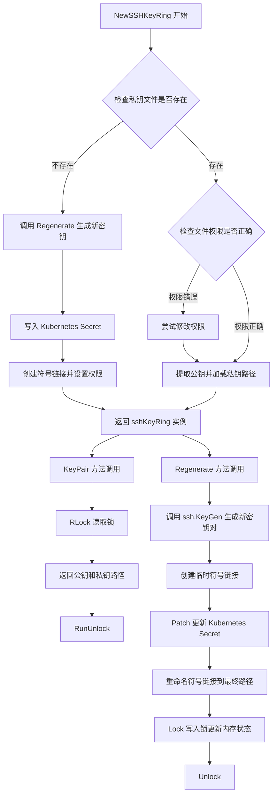
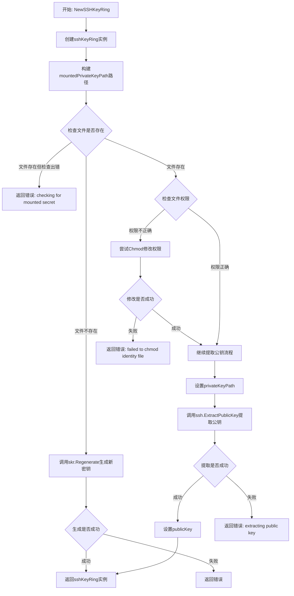
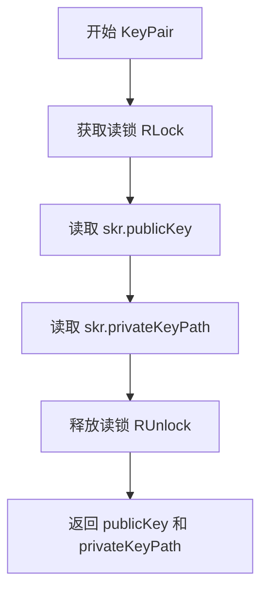
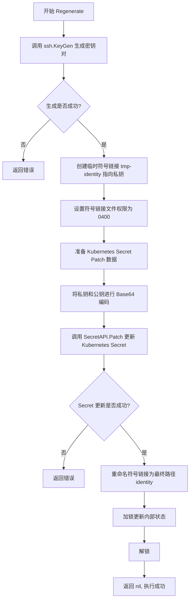
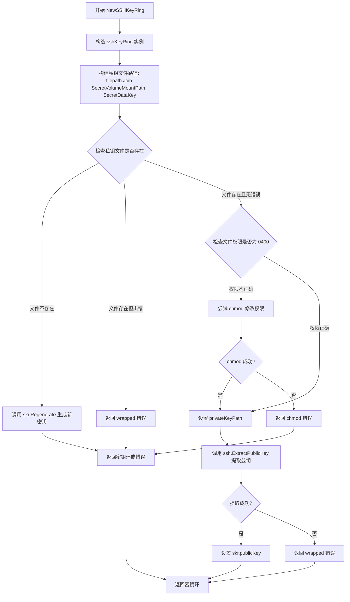
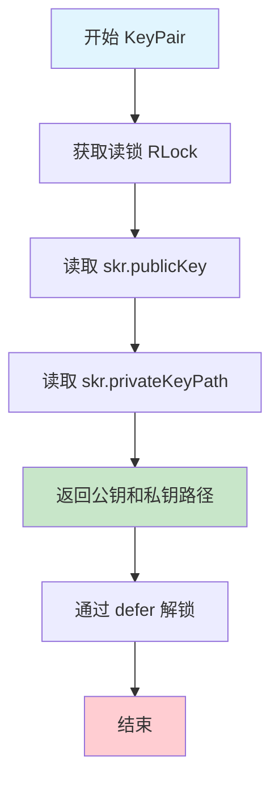
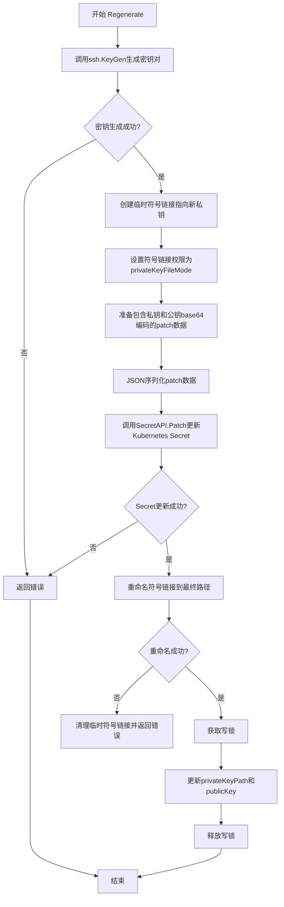

# `flux\pkg\cluster\kubernetes\sshkeyring.go` 详细设计文档

该代码实现了一个基于Kubernetes Secret的SSH密钥环管理系统，用于在Flux CD中管理SSH公私钥对，支持密钥的初始化加载、自动生成和动态重新生成，并确保私钥文件具有正确的文件系统权限(0400)。

## 整体流程



## 类结构

```
SSHKeyRingConfig (配置结构体)
└── sshKeyRing (实现结构体)
```

## 全局变量及字段


### `privateKeyFileMode`
    
私钥文件权限 (0400)

类型：`os.FileMode`
    


### `SSHKeyRingConfig.SecretAPI`
    
Kubernetes Secret API 客户端

类型：`v1.SecretInterface`
    


### `SSHKeyRingConfig.SecretName`
    
Kubernetes Secret 资源名称

类型：`string`
    


### `SSHKeyRingConfig.SecretVolumeMountPath`
    
Secret 挂载路径

类型：`string`
    


### `SSHKeyRingConfig.SecretDataKey`
    
Secret 中的数据键名

类型：`string`
    


### `SSHKeyRingConfig.KeyBits`
    
SSH 密钥位数配置

类型：`ssh.OptionalValue`
    


### `SSHKeyRingConfig.KeyType`
    
SSH 密钥类型配置

类型：`ssh.OptionalValue`
    


### `SSHKeyRingConfig.KeyFormat`
    
SSH 密钥格式配置

类型：`ssh.OptionalValue`
    


### `SSHKeyRingConfig.KeyGenDir`
    
密钥生成临时目录

类型：`string`
    


### `sshKeyRing.RWMutex`
    
读写锁，用于线程安全

类型：`sync.RWMutex`
    


### `sshKeyRing.SSHKeyRingConfig`
    
配置结构体嵌入

类型：`SSHKeyRingConfig (嵌入)`
    


### `sshKeyRing.publicKey`
    
当前公钥对象

类型：`ssh.PublicKey`
    


### `sshKeyRing.privateKeyPath`
    
私钥文件路径

类型：`string`
    
    

## 全局函数及方法


### `NewSSHKeyRing`

构造 SSHKeyRing 实例的工厂函数，用于创建由 Kubernetes Secret 资源支持的 SSH 密钥环。该函数会尝试加载之前存储在 Secret 中的密钥，如果不存在则生成新密钥。

参数：

- `config`：`SSHKeyRingConfig`，用于配置密钥环的密钥生成选项和 Kubernetes Secret 资源参数，包含 SecretAPI、SecretName、SecretVolumeMountPath、SecretDataKey、KeyBits、KeyType、KeyFormat 和 KeyGenDir 等字段

返回值：

- `*sshKeyRing`：返回构造的 SSH 密钥环实例指针
- `error`：如果发生错误（如检查文件系统失败、生成密钥失败、提取公钥失败等），返回错误信息

#### 流程图



#### 带注释源码

```go
// NewSSHKeyRing constructs an sshKeyRing backed by a kubernetes secret
// resource. The keyring is initialised with the key that was previously stored
// in the secret (either by regenerate() or an administrator), or a freshly
// generated key if none was found.
func NewSSHKeyRing(config SSHKeyRingConfig) (*sshKeyRing, error) {
	// 使用配置创建sshKeyRing实例
	skr := &sshKeyRing{SSHKeyRingConfig: config}
	// 构建已挂载私钥文件的完整路径（SecretVolumeMountPath + SecretDataKey）
	mountedPrivateKeyPath := filepath.Join(skr.SecretVolumeMountPath, skr.SecretDataKey)

	// 检查私钥文件是否存在
	fileInfo, err := os.Stat(mountedPrivateKeyPath)
	switch {
	case os.IsNotExist(err):
		// 密钥未从Secret挂载，因此生成新密钥
		if err := skr.Regenerate(); err != nil {
			return nil, err
		}
	case err != nil:
		// 文件系统存在其他问题
		return nil, errors.Wrap(err, "checking for mounted secret")
	case fileInfo.Mode() != privateKeyFileMode:
		// 密钥已挂载，但权限不正确；由于可能是只读的，可能无法修复
		// 但可以尝试修改权限
		if err := os.Chmod(mountedPrivateKeyPath, privateKeyFileMode); err != nil {
			return nil, errors.Wrap(err, "failed to chmod identity file")
		}
		fallthrough // 权限修改成功后，继续执行默认分支
	default:
		// 文件存在且权限正确，设置私钥路径
		skr.privateKeyPath = mountedPrivateKeyPath
		// 从私钥文件中提取公钥
		publicKey, err := ssh.ExtractPublicKey(skr.privateKeyPath)
		if err != nil {
			return nil, errors.Wrap(err, "extracting public key")
		}
		skr.publicKey = publicKey
	}

	return skr, nil
}
```


### `sshKeyRing.KeyPair`

获取当前密钥对的公钥和私钥文件路径。该方法返回存储在 KeyRing 中的当前公钥及其对应私钥文件的路径。由于 Regenerate() 方法可能会随时丢弃并重新生成密钥对，因此不建议长时间缓存返回的结果，建议在每次使用前立即请求密钥对。

参数：

- （无显式参数，隐式接收者为 `skr *sshKeyRing`）

返回值：

- `publicKey`：`ssh.PublicKey`，当前密钥对的公钥对象
- `privateKeyPath`：`string`，私钥文件的绝对路径

#### 流程图



#### 带注释源码

```go
// KeyPair 返回当前的公钥和对应的私钥文件路径。
// 私钥文件在进程生命周期内保证存在，但由于 Regenerate() 方法可以随时
// 丢弃并重新生成密钥对，因此不建议长时间缓存返回结果；
// 建议在每次使用前立即从 keyring 请求密钥对。
func (skr *sshKeyRing) KeyPair() (publicKey ssh.PublicKey, privateKeyPath string) {
	// 获取读锁，允许多个并发读取操作，防止在读取期间密钥被修改
	skr.RLock()
	// defer 确保函数返回前释放锁，即使发生 panic 也会释放
	defer skr.RUnlock()
	// 返回存储在结构体中的公钥和私钥路径
	return skr.publicKey, skr.privateKeyPath
}
```


### `sshKeyRing.Regenerate`

该方法用于重新生成 SSH 密钥对，在指定的 SecretVolumeMountPath 目录中创建新的私钥和公钥，并将更新后的私钥通过 Kubernetes Secret 的 Patch 方式持久化存储，以确保重启后密钥可用。操作成功后，新的密钥对将立即生效；如果失败，现有的密钥对保持不变。

参数：
- 该方法无参数

返回值：`error`，如果生成密钥、更新 Kubernetes Secret 或重命名文件失败，返回相应错误；成功执行时返回 nil

#### 流程图



#### 带注释源码

```go
// Regenerate creates a new keypair in the configured SecretVolumeMountPath and
// updates the kubernetes secret resource with the private key so that it will
// be available to the keyring after restart. If this operation is successful
// the keyPair() method will return the new pair; if it fails for any reason,
// keyPair() will continue to return the existing pair.
//
// BUG(awh) Updating the kubernetes secret should be done via an ephemeral
// external executable invoked with coredumps disabled and using
// syscall.Mlockall(MCL_FUTURE) in conjunction with an appropriate ulimit to
// ensure the private key isn't unintentionally written to persistent storage.
func (skr *sshKeyRing) Regenerate() error {
	// 步骤1: 使用配置的密钥参数（位数、类型、格式）和临时目录生成新的 SSH 密钥对
	// 返回临时私钥路径、私钥内容、公钥对象和可能的错误
	tmpPrivateKeyPath, privateKey, publicKey, err := ssh.KeyGen(skr.KeyBits, skr.KeyType, skr.KeyFormat, skr.KeyGenDir)
	if err != nil {
		return err
	}

	// 步骤2: 准备一个符号链接，指向新生成的私钥，稍后移动到最终位置
	tmpSymlinkPath := filepath.Join(filepath.Dir(tmpPrivateKeyPath), "tmp-identity")
	if err = os.Symlink(tmpPrivateKeyPath, tmpSymlinkPath); err != nil {
		return err
	}
	// 设置符号链接的文件权限为 0400（仅所有者可读），符合 SSH 对私钥文件的权限要求
	if err = os.Chmod(tmpSymlinkPath, privateKeyFileMode); err != nil {
		return err
	}

	// 步骤3: 构造 Kubernetes Secret 的 Patch 数据结构
	// 使用 StrategicMergePatchType 进行部分更新
	patch := map[string]map[string]string{
		"data": map[string]string{
			// 将私钥和公钥内容进行 Base64 编码后存入 Secret 的 data 字段
			"identity":     base64.StdEncoding.EncodeToString(privateKey),
			"identity.pub": base64.StdEncoding.EncodeToString([]byte(publicKey.Key)),
		},
	}

	// 步骤4: 将 patch 数据序列化为 JSON 格式
	jsonPatch, err := json.Marshal(patch)
	if err != nil {
		return err
	}

	// 步骤5: 调用 Kubernetes Secret API 以 Patch 方式更新 Secret 资源
	// 这会将新的私钥和公钥持久化到 Kubernetes 中
	_, err = skr.SecretAPI.Patch(context.TODO(), skr.SecretName, types.StrategicMergePatchType, jsonPatch, metav1.PatchOptions{})
	if err != nil {
		return err
	}

	// 步骤6: Secret 已更新，Kubernetes 会确保其被挂载
	// 在此期间，将符号链接重命名到最终路径，使其指向我们生成的私钥副本
	generatedPrivateKeyPath := filepath.Join(skr.KeyGenDir, skr.SecretDataKey)
	if err = os.Rename(tmpSymlinkPath, generatedPrivateKeyPath); err != nil {
		// 如果重命名失败，清理临时符号链接避免留下孤立的链接
		os.Remove(tmpSymlinkPath)
		return err
	}

	// 步骤7: 加锁以线程安全地更新 sshKeyRing 的内部状态
	skr.Lock()
	skr.privateKeyPath = generatedPrivateKeyPath  // 更新私钥路径
	skr.publicKey = publicKey                      // 更新公钥对象
	skr.Unlock()

	return nil
}
```


### `NewSSHKeyRing`

这是一个构造函数，用于初始化一个 SSH 密钥环（SSHKeyRing），该密钥环由 Kubernetes Secret 资源支持。函数首先检查指定路径下是否已存在私钥文件，若不存在则调用 Regenerate() 生成新密钥；若存在但权限不正确则尝试修正权限；最后从私钥文件中提取公钥并存储，供后续使用。

参数：

- `config`：`SSHKeyRingConfig`，包含密钥环的配置选项，如 Secret API 客户端、Secret 名称、挂载路径、密钥生成参数等

返回值：

- `*sshKeyRing`：返回初始化完成的 SSH 密钥环指针
- `error`：如果初始化过程中出现错误（如文件检查失败、密钥生成失败、公钥提取失败等），返回错误信息

#### 流程图



#### 带注释源码

```go
// NewSSHKeyRing constructs an sshKeyRing backed by a kubernetes secret
// resource. The keyring is initialised with the key that was previously stored
// in the secret (either by regenerate() or an administrator), or a freshly
// generated key if none was found.
func NewSSHKeyRing(config SSHKeyRingConfig) (*sshKeyRing, error) {
	// 1. 使用配置构造 sshKeyRing 实例
	skr := &sshKeyRing{SSHKeyRingConfig: config}
	
	// 2. 构建已挂载私钥文件的完整路径
	//    格式: {SecretVolumeMountPath}/{SecretDataKey}
	//    例如: "/etc/fluxd/ssh/identity"
	mountedPrivateKeyPath := filepath.Join(skr.SecretVolumeMountPath, skr.SecretDataKey)

	// 3. 检查私钥文件是否存在
	fileInfo, err := os.Stat(mountedPrivateKeyPath)
	switch {
	case os.IsNotExist(err):
		// 情况1: 私钥文件不存在
		// 需要生成新的密钥对
		if err := skr.Regenerate(); err != nil {
			return nil, err
		}
	case err != nil:
		// 情况2: 检查文件时发生其他错误
		// 返回带上下文包装的错误信息
		return nil, errors.Wrap(err, "checking for mounted secret")
	case fileInfo.Mode() != privateKeyFileMode:
		// 情况3: 私钥文件存在但权限不正确
		// SSH 要求私钥文件权限必须为 0400，否则拒绝使用
		// 尝试修正权限（可能是只挂载导致的）
		if err := os.Chmod(mountedPrivateKeyPath, privateKeyFileMode); err != nil {
			return nil, errors.Wrap(err, "failed to chmod identity file")
		}
		fallthrough // 权限修正后继续执行 default 分支
	default:
		// 情况4: 私钥文件存在且权限正确
		// 设置私钥路径
		skr.privateKeyPath = mountedPrivateKeyPath
		
		// 从私钥文件中提取对应的公钥
		publicKey, err := ssh.ExtractPublicKey(skr.privateKeyPath)
		if err != nil {
			return nil, errors.Wrap(err, "extracting public key")
		}
		skr.publicKey = publicKey
	}

	// 4. 返回初始化完成的密钥环
	return skr, nil
}
```


### `sshKeyRing.KeyPair`

获取当前存储在密钥环中的公钥及其对应私钥文件的路径。该方法返回公钥对象和私钥文件的路径，私钥文件在进程生命周期内保证存在，但由于`Regenerate()`方法可能会丢弃并重新生成密钥对，不建议长时间缓存返回结果，每次使用前应重新获取。

参数：

- （接收者）`skr *sshKeyRing`：sshKeyRing 类型的指针，表示密钥环实例本身

返回值：

- `publicKey ssh.PublicKey`，当前公钥对象
- `privateKeyPath string`，私钥文件的绝对路径

#### 流程图



#### 带注释源码

```go
// KeyPair returns the current public key and the path to its corresponding
// private key. The private key file is guaranteed to exist for the lifetime of
// the process, however as the returned pair can be discarded from the keyring
// at any time by use of the Regenerate() method it is inadvisable to cache the
// results for long periods; instead request the key pair from the ring
// immediately prior to each use.
func (skr *sshKeyRing) KeyPair() (publicKey ssh.PublicKey, privateKeyPath string) {
	// 获取读锁，允许多个并发读取操作，但阻止写入操作
	// 这是线程安全的关键，确保在读取期间公钥和私钥路径不会被修改
	skr.RLock()
	
	// 使用 defer 确保函数返回时自动释放锁，无论是否发生异常
	defer skr.RUnlock()
	
	// 返回当前存储在密钥环中的公钥和私钥路径
	// 注意：返回的是引用，如果需要持久化应在调用方进行深拷贝
	return skr.publicKey, skr.privateKeyPath
}
```


### `sshKeyRing.Regenerate`

重新生成SSH密钥对并更新Kubernetes Secret，同时更新KeyRing内部状态。如果操作失败，KeyRing将继续返回现有的密钥对。

参数： 无

返回值：`error`，如果密钥生成或Secret更新失败则返回错误；成功时返回nil

#### 流程图



#### 带注释源码

```go
// Regenerate creates a new keypair in the configured SecretVolumeMountPath and
// updates the kubernetes secret resource with the private key so that it will
// be available to the keyring after restart. If this operation is successful
// the keyPair() method will return the new pair; if it fails for any reason,
// keyPair() will continue to return the existing pair.
//
// BUG(awh) Updating the kubernetes secret should be done via an ephemeral
// external executable invoked with coredumps disabled and using
// syscall.Mlockall(MCL_FUTURE) in conjunction with an appropriate ulimit to
// ensure the private key isn't unintentionally written to persistent storage.
func (skr *sshKeyRing) Regenerate() error {
    // 步骤1: 生成新的SSH密钥对
    // 使用配置的KeyBits, KeyType, KeyFormat在KeyGenDir目录中生成密钥
    tmpPrivateKeyPath, privateKey, publicKey, err := ssh.KeyGen(skr.KeyBits, skr.KeyType, skr.KeyFormat, skr.KeyGenDir)
    if err != nil {
        return err
    }

    // 步骤2: 创建临时符号链接
    // 准备一个符号链接指向新生成的私钥，稍后移动到最终位置
    tmpSymlinkPath := filepath.Join(filepath.Dir(tmpPrivateKeyPath), "tmp-identity")
    if err = os.Symlink(tmpPrivateKeyPath, tmpSymlinkPath); err != nil {
        return err
    }
    // 步骤3: 设置符号链接权限为0400 (仅所有者可读)
    if err = os.Chmod(tmpSymlinkPath, privateKeyFileMode); err != nil {
        return err
    }

    // 步骤4: 准备Kubernetes Secret的patch数据
    // 使用base64编码私钥和公钥
    patch := map[string]map[string]string{
        "data": map[string]string{
            "identity":     base64.StdEncoding.EncodeToString(privateKey),
            "identity.pub": base64.StdEncoding.EncodeToString([]byte(publicKey.Key)),
        },
    }

    // 步骤5: JSON序列化patch数据
    jsonPatch, err := json.Marshal(patch)
    if err != nil {
        return err
    }

    // 步骤6: 调用Kubernetes API更新Secret
    // 使用StrategicMergePatchType进行部分更新
    _, err = skr.SecretAPI.Patch(context.TODO(), skr.SecretName, types.StrategicMergePatchType, jsonPatch, metav1.PatchOptions{})
    if err != nil {
        return err
    }

    // 步骤7: 处理符号链接
    // Secret已更新，Kubernetes会确保其被挂载
    // 同时将符号链接重命名到最终位置
    generatedPrivateKeyPath := filepath.Join(skr.KeyGenDir, skr.SecretDataKey)
    if err = os.Rename(tmpSymlinkPath, generatedPrivateKeyPath); err != nil {
        // 如果重命名失败，清理临时符号链接
        os.Remove(tmpSymlinkPath)
        return err
    }

    // 步骤8: 更新KeyRing内部状态
    // 获取写锁以保护并发访问
    skr.Lock()
    skr.privateKeyPath = generatedPrivateKeyPath
    skr.publicKey = publicKey
    skr.Unlock()

    return nil
}
```

#### 技术债务与优化空间

1. **缺少Secret更新验证**：代码未验证Kubernetes是否成功将Secret挂载到预期路径
2. **缺乏超时机制**：Kubernetes API调用使用默认超时，可能导致长时间阻塞
3. **临时文件安全风险**：新密钥写入KeyGenDir（tmpfs挂载），但存在被写入swap的风险（见代码中的BUG注释）
4. **无重试逻辑**：Secret更新失败后直接返回错误，缺乏重试机制
5. **错误处理不完整**：重命名失败时清理临时符号链接，但未处理其他可能的中间状态

## 关键组件


### SSHKeyRingConfig

用于配置SSH密钥环的结构体，包含Kubernetes Secret接口、密钥存储路径、密钥生成参数等配置信息。

### sshKeyRing

核心密钥环管理类，封装了SSH公私钥对的管理逻辑，通过读写锁保证并发安全，负责密钥的加载、存储和轮换。

### NewSSHKeyRing

密钥环构造函数，检查已挂载的SSH密钥文件，如不存在则调用Regenerate生成新密钥，如存在但权限不对则尝试修正权限。

### KeyPair

获取当前公私钥对的方法，通过读锁保证线程安全，返回当前有效的公钥和私钥文件路径。

### Regenerate

密钥轮换方法，生成新的SSH密钥对，更新Kubernetes Secret中的密钥数据，并更新内部状态。

### 密钥存储机制

使用Kubernetes Secret作为密钥持久化存储，通过文件系统挂载实现密钥的可用性，确保Pod重启后密钥可恢复。

### 并发安全设计

使用sync.RWMutex实现读写锁，支持多读单写的并发访问模式，保证密钥操作的数据一致性。


## 问题及建议


### 已知问题

- **并发安全问题**：`Regenerate()` 方法在执行密钥生成、Kubernetes Secret 更新等关键操作时未持有锁，仅在更新内存中的 `privateKeyPath` 和 `publicKey` 时加锁，多个协程同时调用可能导致竞态条件和状态不一致
- **错误处理不完善**：当 `os.Rename` 失败后调用 `os.Remove(tmpSymlinkPath)` 清理，如果 `Remove` 也失败则错误被静默忽略，可能导致临时文件残留
- **上下文使用不当**：使用 `context.TODO()` 而非从调用方传递的上下文，不利于链路追踪和超时控制
- **密钥不存在时的空值返回**：`KeyPair()` 方法在未初始化或密钥不存在时返回空字符串，无错误信息调用方难以诊断问题
- **文件权限检查后未立即使用**：检查文件权限后进入 `default` 分支，但在后续操作中文件可能被外部修改或删除

### 优化建议

- **重构锁的粒度**：将锁的范围扩大到整个 `Regenerate()` 方法或使用独立的 `regenerating` 标志位防止并发调用
- **改进错误清理**：使用 `defer` 确保临时文件清理，并记录清理失败的信息
- **传递上下文**：修改函数签名接受 `context.Context` 参数，替代 `context.TODO()`
- **返回错误而非空值**：`KeyPair()` 方法应返回错误或使用 `Option` 模式处理密钥不存在的情况
- **添加重试机制和幂等性**：对 Kubernetes Secret 的 Patch 操作添加重试逻辑，确保在网络抖动时的可靠性

## 其它


### 设计目标与约束

本代码的设计目标是实现一个与Kubernetes Secret集成的SSH密钥环管理系统，支持密钥的生成、存储、读取和重新生成。核心约束包括：1) 私钥文件权限必须为0400以符合SSH安全要求；2) 密钥必须存储在Kubernetes Secret中以实现持久化；3) 密钥挂载路径必须可读写以支持重新生成功能；4) 必须使用临时文件和符号链接来实现原子性的密钥更新操作。

### 错误处理与异常设计

代码采用Go语言的错误处理模式，通过errors.Wrap包装错误信息以提供上下文。错误处理策略包括：1) 文件不存在时自动生成新密钥；2) 文件权限不正确时尝试修复；3) Kubernetes API调用失败时返回错误并保持现有密钥有效；4) 临时文件操作失败时进行清理。关键原则是Regenerate方法失败时不影响现有密钥的可用性。

### 数据流与状态机

密钥环的初始化流程为：检查挂载路径是否存在密钥文件 → 不存在则生成新密钥 → 存在则验证权限并读取公钥。密钥重新生成的流程为：生成临时密钥对 → 创建临时符号链接 → 更新Kubernetes Secret → 原子性重命名符号链接 → 更新内存中的密钥引用。整个过程使用写锁保护共享状态，确保并发安全。

### 外部依赖与接口契约

主要外部依赖包括：1) Kubernetes Secret API (v1.SecretInterface)用于存储和更新密钥；2) ssh包(ssh.PublicKey, ssh.KeyGen, ssh.ExtractPublicKey)用于SSH密钥操作；3) Go标准库(filepath, os, json, base64, sync)。接口契约方面：SSHKeyRingConfig必须提供有效的SecretAPI、SecretName、SecretVolumeMountPath、SecretDataKey和KeyGenDir；私钥文件必须遵循SSH格式规范。

### 线程安全性考虑

sshKeyRing类型使用sync.RWMutex实现线程安全：1) KeyPair方法使用读锁，允许并发读取；2) Regenerate方法使用写锁，确保密钥更新的原子性；3) 公共字段SSHKeyRingConfig本身不需要锁保护，因为初始化后不再修改。所有状态访问都通过锁保护，符合Go并发最佳实践。

### 资源清理与生命周期管理

代码本身不直接管理文件描述符或网络连接等资源，但遵循以下生命周期模式：1) 临时文件操作失败时调用os.Remove清理；2) 密钥文件路径在进程生命周期内保持有效；3) 不提供显式的Close或清理方法，依赖GC和进程终止时的资源回收。需要注意Regenerate方法中的临时符号链接需要正确处理失败场景。

### 性能考虑

性能优化点包括：1) 使用读锁支持KeyPair的并发调用；2) 密钥文件路径被缓存避免重复查找；3) 使用StrategicMergePatchType更新Secret减少数据传输。潜在性能瓶颈：1) Kubernetes API调用涉及网络延迟；2) 密钥生成是CPU密集型操作；3) 文件系统操作可能受IO限制。建议在高并发场景下对KeyPair调用进行适当缓存。

### 安全考虑

安全措施：1) 私钥文件权限强制设置为0400；2) 使用base64编码存储密钥数据；3) BUG注释指出私钥可能意外写入持久存储的风险。安全建议：1) 应使用临时目录(tmpfs)存储生成的密钥；2) 建议使用syscall.Mlockall防止密钥交换到swap；3) 应禁用core dump避免密钥内存被写入磁盘；4) 当前实现未实现这些安全措施，存在技术债务。


    