# `flux\pkg\cluster\kubernetes\sync.go` 详细设计文档

This code is the core synchronization engine for a GitOps Kubernetes controller (Flux CD). It handles applying desired resource definitions from Git to a cluster and performing garbage collection on resources that no longer exist in Git, using checksums and labels for tracking.

## 整体流程

```mermaid
graph TD
    A[Start: Sync(syncSet)] --> B[Get Cluster Resources]
    B --> C{Loop syncSet.Resources}
    C -->|Resource Allowed?| D{Yes}
    D --> E{Has Ignore Policy?}
    E -- Yes --> F[Skip Resource]
    E -- No --> G[Calc Checksum & Apply Metadata]
    G --> H[Stage Apply in ChangeSet]
    C --> I[Apply Changes via Applier]
    H --> I
    I --> J{GC Enabled?}
    J -- No --> K[End]
    J -- Yes --> L[collectGarbage]
    L --> M[Get GC Marked Resources]
    M --> N{Loop Cluster Resources}
    N --> O{Exists in SyncSet?}
    O -- No --> P{Ignore Policy?}
    P -- Yes --> Q[Skip Delete]
    P -- No --> R[Stage Delete]
    O -- Yes --> S{Checksum Match?}
    S -- No --> T[Skip Update]
    S -- Yes --> Q
    R --> U[Apply Deletes]
    U --> K
```

## 类结构

```
Cluster (Main Controller)
├── Applier (Interface)
│   └── Kubectl (Implementation)
├── kuberesource (Resource Wrapper)
├── changeSet (Change Set Management)
│   └── applyObject (Atomic Action)
└── applyOrder (Sorting Logic)
```

## 全局变量及字段


### `gcMarkLabel`
    
Label key for marking resources during garbage collection; used to identify resources managed by Flux sync.

类型：`string`
    


### `checksumAnnotation`
    
Annotation key for storing SHA1 checksum of Git manifest to verify resource consistency during garbage collection.

类型：`string`
    


### `Cluster.Cluster.logger`
    
Logger instance for recording operational logs, debug information, and method execution context.

类型：`log.Logger`
    


### `Cluster.Cluster.client`
    
Kubernetes client providing access to discovery and dynamic clients for API interactions.

类型：`Client`
    


### `Cluster.Cluster.applier`
    
Interface for applying changeset operations (apply/delete) to the Kubernetes cluster.

类型：`Applier`
    


### `Cluster.Cluster.resourceExcludeList`
    
List of glob patterns used to exclude specific Kubernetes resources from sync operations.

类型：`[]string`
    


### `Cluster.Cluster.syncErrors`
    
Map storing synchronization errors keyed by resource ID for error tracking and reporting.

类型：`map[resource.ID]error`
    


### `Cluster.Cluster.GC`
    
Flag enabling garbage collection to remove orphaned cluster resources not present in Git manifests.

类型：`bool`
    


### `Cluster.Cluster.DryGC`
    
Flag for dry-run mode of garbage collection; logs actions without actually deleting resources.

类型：`bool`
    


### `Cluster.Cluster.mu`
    
Read-write mutex for protecting concurrent access to cluster state during synchronization.

类型：`sync.RWMutex`
    


### `Cluster.Cluster.muSyncErrors`
    
Read-write mutex for thread-safe access to syncErrors map during apply operations.

类型：`sync.RWMutex`
    


### `kuberesource.kuberesource.obj`
    
Pointer to unstructured Kubernetes object representing the raw resource from the cluster.

类型：`*unstructured.Unstructured`
    


### `kuberesource.kuberesource.namespaced`
    
Boolean indicating whether the Kubernetes resource is namespace-scoped or cluster-scoped.

类型：`bool`
    


### `changeSet.changeSet.objs`
    
Map storing apply objects grouped by command type (apply/delete) for batch operations.

类型：`map[string][]applyObject`
    


### `applyObject.applyObject.ResourceID`
    
Unique identifier of the Kubernetes resource (namespace/kind/name).

类型：`resource.ID`
    


### `applyObject.applyObject.Source`
    
Source location (file path or identifier) of the resource definition in Git.

类型：`string`
    


### `applyObject.applyObject.Payload`
    
YAML byte representation of the Kubernetes resource manifest for apply/delete operations.

类型：`[]byte`
    


### `Kubectl.Kubectl.exe`
    
Path to kubectl executable for running Kubernetes CLI commands.

类型：`string`
    


### `Kubectl.Kubectl.config`
    
REST client configuration containing cluster connection details (host, auth, TLS settings).

类型：`*rest.Config`
    
    

## 全局函数及方法


### `applyMetadata`

该函数用于在同步资源到Kubernetes集群之前，为资源应用元数据（labels、annotations和namespace）。它解析资源的YAML定义，添加垃圾回收标记、校验和注解以及命名空间信息，然后重新序列化为YAML格式。

参数：

- `res`：`resource.Resource`，要应用元数据的资源对象
- `syncSetName`：`string`，同步集的名称，用于生成GC标记
- `checksum`：`string`，资源的SHA1校验和，用于垃圾回收时的验证

返回值：`([]byte, error)`，返回修改后的YAML字节数组，或在解析/序列化失败时返回错误

#### 流程图

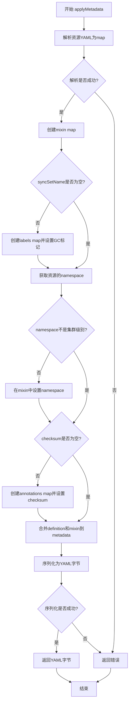

#### 带注释源码

```go
// applyMetadata 为资源对象添加元数据（labels、annotations、namespace）
// 这些元数据用于垃圾回收和状态跟踪
func applyMetadata(res resource.Resource, syncSetName, checksum string) ([]byte, error) {
	// 1. 将资源的YAML内容解析为map[interface{}]interface{}
	// 使用interface{}类型以支持任意YAML结构
	definition := map[interface{}]interface{}{}
	if err := yaml.Unmarshal(res.Bytes(), &definition); err != nil {
		// 解析失败时返回错误，包含失败的资源来源信息
		return nil, errors.Wrap(err, fmt.Sprintf("failed to parse yaml from %s", res.Source()))
	}

	// 2. 创建mixin map用于存储要添加到metadata的键值对
	mixin := map[string]interface{}{}

	// 3. 如果提供了syncSetName，则添加GC标记label
	// GC标记用于标识该资源属于哪个同步集，用于后续的垃圾回收
	if syncSetName != "" {
		mixinLabels := map[string]string{}
		// 生成包含syncSetName和资源ID的哈希标记
		mixinLabels[gcMarkLabel] = makeGCMark(syncSetName, res.ResourceID().String())
		mixin["labels"] = mixinLabels
	}

	// 4. 获取资源的namespace
	// 注意：加载manifest后namespace可能会改变（例如应用了默认namespace）
	// ResourceID会提供最新的值（参见KubeManifest.SetNamespace）
	namespace, _, _ := res.ResourceID().Components()
	// 5. 如果不是集群级别的资源，则添加namespace到mixin
	if namespace != kresource.ClusterScope {
		mixin["namespace"] = namespace
	}

	// 6. 如果提供了checksum，则添加checksum annotation
	// checksum用于验证集群中的资源与Git中的定义是否一致
	if checksum != "" {
		mixinAnnotations := map[string]string{}
		mixinAnnotations[checksumAnnotation] = checksum
		mixin["annotations"] = mixinAnnotations
	}

	// 7. 使用mergo库将mixin合并到definition的metadata字段
	// mergo.Merge会深度合并map，保留definition中已有的值
	mergo.Merge(&definition, map[interface{}]interface{}{
		"metadata": mixin,
	})

	// 8. 将修改后的definition重新序列化为YAML字节
	bytes, err := yaml.Marshal(definition)
	if err != nil {
		return nil, errors.Wrap(err, "failed to serialize yaml after applying metadata")
	}
	// 9. 返回修改后的YAML字节，用于后续应用到集群
	return bytes, nil
}
```


### `makeGCMark`

该函数用于生成垃圾回收（GC）标记，通过对同步集名称和资源ID进行SHA256哈希运算，生成一个唯一的标识符，用于标识Kubernetes资源是否属于某个特定的同步集，以便在垃圾回收阶段判断资源是否应被删除。

参数：

- `syncSetName`：`string`，同步集的名称，用于生成哈希的一部分
- `resourceID`：`string`，资源的唯一标识符，用于生成对象特定的标记

返回值：`string`，返回带有"sha256."前缀的Base64编码哈希值，作为Kubernetes标签值

#### 流程图

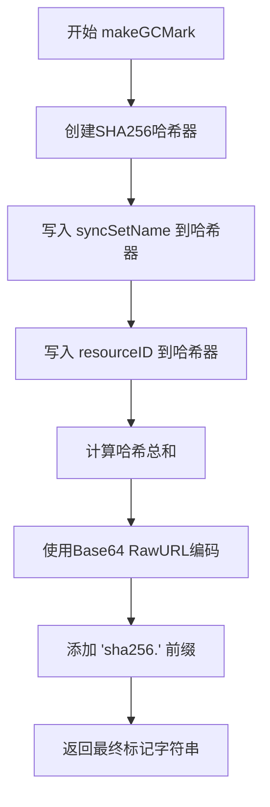

#### 带注释源码

```go
// makeGCMark 生成一个唯一的GC标记，用于标识资源是否属于特定同步集
// 参数:
//   - syncSetName: 同步集的名称
//   - resourceID: 资源的唯一标识符
//
// 返回值:
//   - string: 格式为 "sha256.<base64编码>" 的标记字符串
func makeGCMark(syncSetName, resourceID string) string {
	// 创建SHA256哈希器实例
	hasher := sha256.New()
	
	// 将同步集名称写入哈希器
	// 这是为了确保不同同步集的资源有不同的标记
	hasher.Write([]byte(syncSetName))
	
	// To prevent deleting objects with copied labels
	// an object-specific mark is created (by including its identifier).
	// 将资源ID写入哈希器，创建对象特定的标记
	// 防止通过复制标签误删除对象
	hasher.Write([]byte(resourceID))
	
	// The prefix is to make sure it's a valid (Kubernetes) label value.
	// 添加 "sha256." 前缀确保是有效的Kubernetes标签值
	// Kubernetes标签值必须以字母或数字开头，可包含字母、数字、连字符、下划线和点
	return "sha256." + base64.RawURLEncoding.EncodeToString(hasher.Sum(nil))
}
```


### `makeChangeSet`

该函数是 Flux CD Kubernetes 集群同步模块中的一个工具函数，用于创建一个空的 `changeSet` 对象，以便后续存储需要应用到集群的资源变更（包含待应用或待删除的资源）。

参数：无需参数

返回值：`changeSet`，返回一个空的变更集对象，其中包含一个用于存储资源的 `map[string][]applyObject` 类型的内部映射，用于按操作类型（"apply" 或 "delete"）组织待处理的资源对象。

#### 流程图

```mermaid
flowchart TD
    A[开始 makeChangeSet] --> B{创建空 changeSet}
    B --> C[初始化 objs 字段]
    C --> D[创建 map[string][]applyObject]
    D --> E[返回新 changeSet 实例]
    E --> F[结束]
    
    style A fill:#f9f,color:#000
    style F fill:#9f9,color:#000
```

#### 带注释源码

```go
// makeChangeSet 创建一个空的 changeSet 结构体实例
// changeSet 用于存储待应用到集群的资源对象
// 它维护一个 map，键为操作类型（"apply" 或 "delete"），值为对应的资源对象列表
func makeChangeSet() changeSet {
	// 返回一个初始化好的 changeSet，其 objs 字段为一个空的 map
	// 该 map 用于按操作类型分组存储 applyObject 类型的资源对象
	return changeSet{objs: make(map[string][]applyObject)}
}
```

---

### 关联类型信息

#### `changeSet` 结构体

```go
// changeSet 表示一个资源变更集，用于封装待应用的资源对象
// objs 字段是一个 map，键为操作类型（字符串），值为该类型对应的资源对象切片
type changeSet struct {
	objs map[string][]applyObject
}
```

#### `applyObject` 结构体

```go
// applyObject 表示一个具体的资源对象，包含其唯一标识、来源和负载数据
type applyObject struct {
	ResourceID resource.ID  // 资源的唯一标识 ID
	Source     string       // 资源来源（如 Git 路径）
	Payload    []byte       // 资源的 YAML/JSON 字节数据
}
```

#### `stage` 方法

```go
// stage 将一个资源对象添加到变更集中
// 参数 cmd 表示操作类型（如 "apply" 或 "delete"）
// 参数 id 是资源的唯一标识
// 参数 source 是资源来源
// 参数 bytes 是资源的序列化数据
func (c *changeSet) stage(cmd string, id resource.ID, source string, bytes []byte) {
	// 将 applyObject 添加到对应操作类型的切片中
	c.objs[cmd] = append(c.objs[cmd], applyObject{id, source, bytes})
}
```


### `makeMultidoc`

该函数接收一组 Kubernetes 资源对象（applyObject 切片），将每个对象的 YAML 格式 payload 依次追加到同一个字节缓冲区中，最终返回一个包含多个 YAML 文档的缓冲区，用于通过 kubectl 的多文档模式（-f -）一次性应用多个资源。

参数：

- `objs`：`[]applyObject`，待合并的 Kubernetes 资源对象切片，每个对象包含 ResourceID、Source 和 Payload（YAML 格式的字节数组）

返回值：`*bytes.Buffer`，包含多个 YAML 文档的字节缓冲区，可直接传递给 kubectl 命令的标准输入

#### 流程图

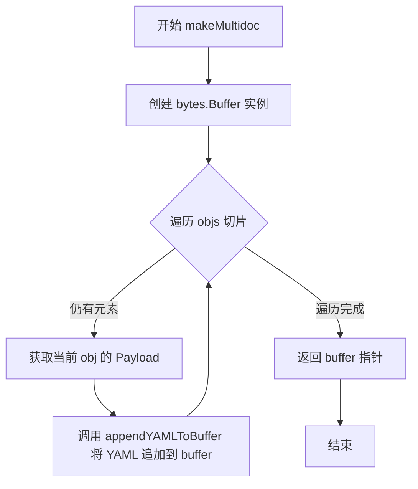

#### 带注释源码

```go
// makeMultidoc 将多个 applyObject 的 YAML 内容合并为一个多文档 YAML
// 输入: objs - 包含多个 Kubernetes 资源对象的切片
// 输出: *bytes.Buffer - 合并后的多文档 YAML 缓冲区
func makeMultidoc(objs []applyObject) *bytes.Buffer {
	// 创建一个新的字节缓冲区用于存储合并后的 YAML 文档
	buf := &bytes.Buffer{}
	// 遍历每个需要合并的 applyObject
	for _, obj := range objs {
		// 将当前对象的 YAML payload 追加到缓冲区
		// appendYAMLToBuffer 是一个外部定义的辅助函数，负责在文档之间添加分隔符
		appendYAMLToBuffer(obj.Payload, buf)
	}
	// 返回包含所有 YAML 文档的缓冲区
	return buf
}
```


### `rankOfKind`

该函数用于确定Kubernetes资源类型在应用顺序中的优先级位置，基于资源之间的依赖关系（由人工推导），返回值越小表示越底层资源越优先创建。

参数：

- `kind`：`string`，Kubernetes资源的种类（Kind），如 "Namespace"、"Deployment" 等

返回值：`int`，表示资源在依赖顺序中的位置，0 表示最底层（如 Namespace），4 表示默认层（未被特殊处理的其他资源）

#### 流程图

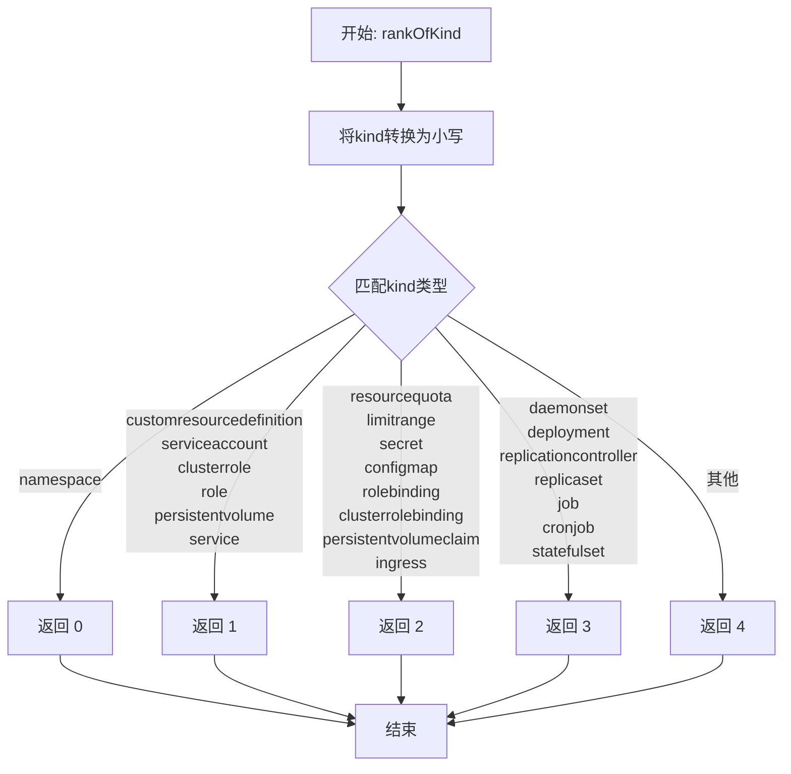

#### 带注释源码

```go
// rankOfKind returns an int denoting the position of the given kind
// in the partial ordering of Kubernetes resources, according to which
// kinds depend on which (derived by hand).
func rankOfKind(kind string) int {
	switch strings.ToLower(kind) {
	// Namespaces answer to NOONE
	// 命名空间是最高层级的资源，不依赖任何其他资源
	case "namespace":
		return 0
	// These don't go in namespaces; or do, but don't depend on anything else
	// 这些资源不依赖于其他资源，或者即使在命名空间内也不依赖其他资源
	case "customresourcedefinition", "serviceaccount", "clusterrole", "role", "persistentvolume", "service":
		return 1
	// These depend on something above, but not each other
	// 这些资源依赖于上述第一层资源，但彼此之间没有依赖关系
	case "resourcequota", "limitrange", "secret", "configmap", "rolebinding", "clusterrolebinding", "persistentvolumeclaim", "ingress":
		return 2
	// Same deal, next layer
	// 下一层依赖关系，如工作负载类资源依赖 ConfigMap、Secret 等
	case "daemonset", "deployment", "replicationcontroller", "replicaset", "job", "cronjob", "statefulset":
		return 3
	// Assumption: anything not mentioned isn't depended _upon_, so
	// can come last.
	// 默认返回值，任何未明确列出的资源类型都返回 4，表示最后处理
	default:
		return 4
	}
}
```


### `Cluster.Sync`

该方法接收一个 SyncSet 定义，尝试使 Kubernetes 集群状态与 SyncSet 中定义的资源保持一致。它会遍历 SyncSet 中的资源，计算校验和，检查是否应该忽略某个资源，然后通过 applier 应用变更。如果启用了垃圾回收（GC），则会比较集群中的资源与 Git 清单中的资源，删除不再需要的资源。返回的错误可能表示部分资源同步失败。

参数：

- `syncSet`：`cluster.SyncSet`，包含需要在集群中同步的资源集合及其名称

返回值：`error`，如果返回非 nil，表示有资源同步失败（但部分资源可能已成功同步）

#### 流程图

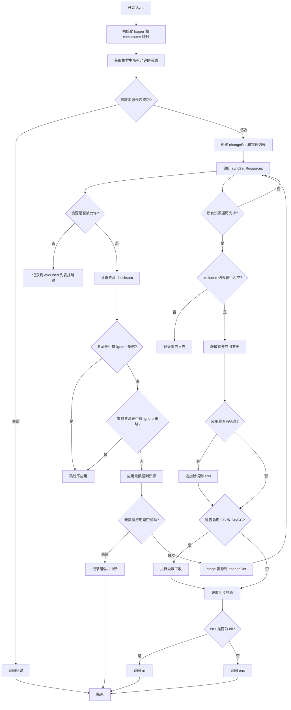

#### 带注释源码

```go
// Sync takes a definition of what should be running in the cluster,
// and attempts to make the cluster conform. An error return does not
// necessarily indicate complete failure; some resources may succeed
// in being synced, and some may fail (for example, they may be
// malformed).
func (c *Cluster) Sync(syncSet cluster.SyncSet) error {
	logger := log.With(c.logger, "method", "Sync")

	// Keep track of the checksum of each resource, so we can compare
	// them during garbage collection.
	checksums := map[string]string{}

	// NB we get all resources, since we care about leaving unsynced,
	// _ignored_ resources alone.
	clusterResources, err := c.getAllowedResourcesBySelector("")
	if err != nil {
		return errors.Wrap(err, "collating resources in cluster for sync")
	}

	cs := makeChangeSet()
	var errs cluster.SyncError
	var excluded []string
	// 遍历 SyncSet 中的每个资源
	for _, res := range syncSet.Resources {
		resID := res.ResourceID()
		id := resID.String()
		// 检查资源是否被允许（根据命名空间约束）
		if !c.IsAllowedResource(resID) {
			excluded = append(excluded, id)
			continue
		}
		// 记录 checksum，用于后续垃圾回收时比较
		csum := sha1.Sum(res.Bytes())
		checkHex := hex.EncodeToString(csum[:])
		checksums[id] = checkHex
		// 检查资源是否有 ignore 策略（在 Git 清单中）
		if res.Policies().Has(policy.Ignore) {
			logger.Log("info", "not applying resource; ignore annotation in file", "resource", res.ResourceID(), "source", res.Source())
			continue
		}
		// 检查集群中的资源是否有 ignore 策略（通过 kubectl annotate 直接添加）
		if cres, ok := clusterResources[id]; ok && cres.Policies().Has(policy.Ignore) {
			logger.Log("info", "not applying resource; ignore annotation in cluster resource", "resource", cres.ResourceID())
			continue
		}
		// 应用元数据（GC mark label 和 checksum annotation）
		resBytes, err := applyMetadata(res, syncSet.Name, checkHex)
		if err == nil {
			cs.stage("apply", res.ResourceID(), res.Source(), resBytes)
		} else {
			errs = append(errs, cluster.ResourceError{ResourceID: res.ResourceID(), Source: res.Source(), Error: err})
			break
		}
	}

	// 记录被排除的资源警告
	if len(excluded) > 0 {
		logger.Log("warning", "not applying resources; excluded by namespace constraints", "resources", strings.Join(excluded, ","))
	}

	// 加锁以保护 syncErrors 的读写
	c.mu.Lock()
	defer c.mu.Unlock()
	// 应用变更（创建或更新资源）
	c.muSyncErrors.RLock()
	if applyErrs := c.applier.apply(logger, cs, c.syncErrors); len(applyErrs) > 0 {
		errs = append(errs, applyErrs...)
	}
	c.muSyncErrors.RUnlock()

	// 如果启用了 GC 或 DryGC，执行垃圾回收
	if c.GC || c.DryGC {
		deleteErrs, gcFailure := c.collectGarbage(syncSet, checksums, logger, c.DryGC)
		if gcFailure != nil {
			return gcFailure
		}
		errs = append(errs, deleteErrs...)
	}

	// 记录同步错误，以便后续查询
	c.setSyncErrors(errs)

	// If `nil`, errs is a cluster.SyncError(nil) rather than error(nil), so it cannot be returned directly.
	if errs == nil {
		return nil
	}

	return errs
}
```


### `Cluster.collectGarbage`

该方法实现 Kubernetes 集群的垃圾回收功能，采用标记-清除（Mark-and-Sweep）算法。它通过比较集群中带有 GC 标记的资源与 Git 清单中记录的资源，识别并删除那些已不再存在于清单中的孤立资源（orphaned resources），从而保持集群状态与 Git 声明式配置的一致性。

参数：

- `syncSet`：`cluster.SyncSet`，包含要同步的资源集合定义
- `checksums`：`map[string]string`，资源 ID 到校验和的映射，用于验证资源是否已更新
- `logger`：`log.Logger`，用于记录垃圾回收过程中的日志信息
- `dryRun`：`bool`，如果为 true，则模拟执行垃圾回收而不实际删除资源

返回值：`cluster.SyncError, error`，第一个返回值表示垃圾回收过程中发生的同步错误，第二个返回值表示方法执行过程中的错误（如获取集群资源失败）

#### 流程图

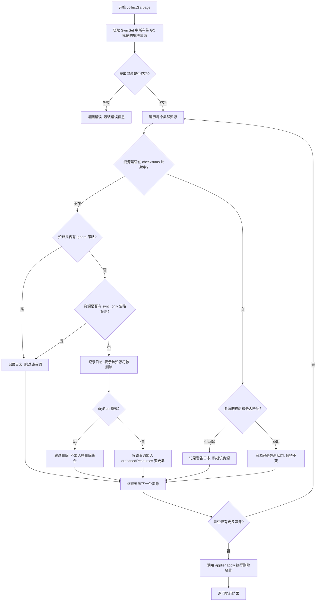

#### 带注释源码

```go
// collectGarbage 执行集群垃圾回收，识别并删除孤立资源
// 采用标记-清除算法：通过比较带 GC 标记的集群资源与 Git 清单中的资源
// 参数：
//   - syncSet: 同步集合，包含期望在集群中运行的资源定义
//   - checksums: 资源 ID 到 SHA1 校验和的映射，用于验证资源是否已更新
//   - logger: 日志记录器
//   - dryRun: 干运行模式，为 true 时只记录操作但不实际执行删除
// 返回值：
//   - cluster.SyncError: 垃圾回收过程中的同步错误列表
//   - error: 方法执行过程中的错误
func (c *Cluster) collectGarbage(
	syncSet cluster.SyncSet,    // 同步集合参数，包含要同步的资源
	checksums map[string]string, // 资源校验和映射，用于比对
	logger log.Logger,          // 日志记录器
	dryRun bool) (cluster.SyncError, error) {

	// 创建用于存储孤立资源的变更集
	orphanedResources := makeChangeSet()

	// 获取当前 SyncSet 中所有带 GC 标记的集群资源
	// GC 标记用于标识该资源是由 Flux 管理且需要被跟踪的
	clusterResources, err := c.getAllowedGCMarkedResourcesInSyncSet(syncSet.Name)
	if err != nil {
		// 如果获取资源失败，返回包装后的错误
		return nil, errors.Wrap(err, "collating resources in cluster for calculating garbage collection")
	}

	// 遍历所有带 GC 标记的集群资源
	for resourceID, res := range clusterResources {
		// 获取资源当前的校验和（从集群资源的注解中获取）
		actual := res.GetChecksum()
		// 获取期望的校验和（从 syncSet 参数中获取）
		expected, ok := checksums[resourceID]

		switch {
		case !ok: 
			// 场景1：资源不在 syncSet 中，即没有被记录为需要同步的资源
			// 检查资源是否有 ignore 策略
			if res.Policies().Has(policy.Ignore) {
				c.logger.Log("info", "skipping GC of cluster resource; resource has ignore policy true", "dry-run", dryRun, "resource", resourceID)
				continue
			}

			// 检查资源是否有 sync_only 忽略策略
			v, ok := res.Policies().Get(policy.Ignore)
			if ok && v == policy.IgnoreSyncOnly {
				c.logger.Log("info", "skipping GC of cluster resource; resource has ignore policy sync_only ", "dry-run", dryRun, "resource", resourceID)
				continue
			}

			// 记录日志，表示该资源将被删除（孤立资源）
			c.logger.Log("info", "cluster resource not in resources to be synced; deleting", "dry-run", dryRun, "resource", resourceID)
			// 如果不是干运行模式，将该资源加入待删除变更集
			if !dryRun {
				orphanedResources.stage("delete", res.ResourceID(), "<cluster>", res.IdentifyingBytes())
			}
		case actual != expected:
			// 场景2：资源在 syncSet 中，但校验和不匹配
			// 说明该资源虽然被标记要同步，但尚未被更新到最新版本
			c.logger.Log("warning", "resource to be synced has not been updated; skipping", "dry-run", dryRun, "resource", resourceID)
			continue
		default:
			// 场景3：校验和匹配，说明该资源已经是最新状态
			// 保持不变，不做任何操作
		}
	}

	// 调用 applier 执行实际的删除操作
	// 返回可能的删除错误
	return c.applier.apply(logger, orphanedResources, nil), nil
}
```


### `Cluster.filterResources`

该方法用于过滤Kubernetes API资源列表，根据集群配置的资源排除列表（resourceExcludeList）移除需要排除的资源。它通过glob模式匹配来判断资源是否应该被排除。

参数：

- `resources`：`*meta_v1.APIResourceList`，包含待过滤的Kubernetes API资源列表

返回值：`*meta_v1.APIResourceList`，返回过滤后的API资源列表，仅保留未被排除的资源

#### 流程图

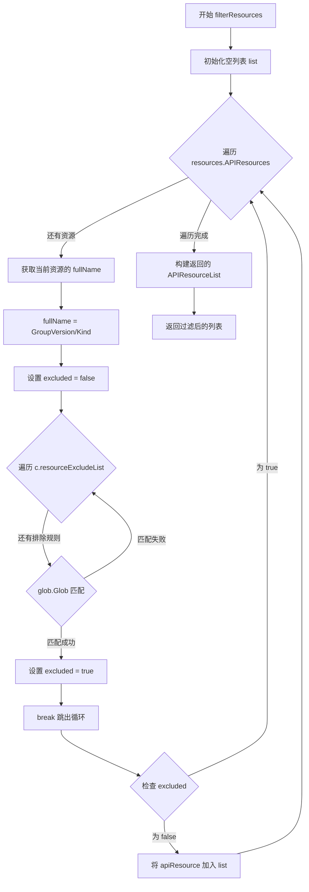

#### 带注释源码

```go
// filterResources 根据资源排除列表过滤API资源
// 参数: resources - 包含待过滤资源的APIResourceList指针
// 返回: 过滤后的APIResourceList指针
func (c *Cluster) filterResources(resources *meta_v1.APIResourceList) *meta_v1.APIResourceList {
	// 初始化一个空切片用于存储过滤后的资源
	list := []meta_v1.APIResource{}
	
	// 遍历输入资源列表中的每个APIResource
	for _, apiResource := range resources.APIResources {
		// 构造完整资源名称: GroupVersion/Kind (如: "v1/Pod")
		fullName := fmt.Sprintf("%s/%s", resources.GroupVersion, apiResource.Kind)
		
		// 默认设置为不排除
		excluded := false
		
		// 遍历集群配置的资源排除列表
		for _, exp := range c.resourceExcludeList {
			// 使用glob模式匹配检查是否应该排除该资源
			if glob.Glob(exp, fullName) {
				excluded = true
				break // 找到匹配规则后立即退出循环
			}
		}
		
		// 如果不在排除列表中，则添加到结果列表
		if !excluded {
			list = append(list, apiResource)
		}
	}

	// 构建并返回过滤后的APIResourceList，保留原始的TypeMeta和GroupVersion
	return &meta_v1.APIResourceList{
		TypeMeta:     resources.TypeMeta,
		GroupVersion: resources.GroupVersion,
		APIResources: list,
	}
}
```


### `Cluster.getAllowedResourcesBySelector`

该函数通过 Kubernetes Discovery API 获取集群中所有可用的 API 资源，并根据标签选择器过滤资源，最终返回符合条件的所有资源映射。它在同步操作开始时被调用，用于获取集群中当前存在的资源状态，以便与 Git 仓库中的期望状态进行对比和同步。

参数：

-  `selector`：`string`，用于过滤资源的标签选择器。如果为空字符串，则返回所有资源。

返回值：`map[string]*kuberesource, error`，返回键为资源 ID 字符串、值为 `kuberesource` 指针的映射，以及可能的错误信息。

#### 流程图

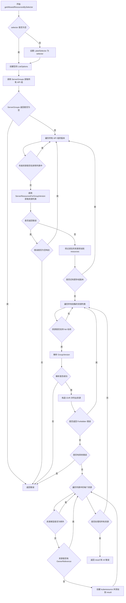

#### 带注释源码

```go
// getAllowedResourcesBySelector 根据标签选择器获取集群中允许访问的资源
// 参数 selector: 标签选择器字符串，用于过滤资源
// 返回值: 资源ID到kuberesource的映射，以及可能的错误
func (c *Cluster) getAllowedResourcesBySelector(selector string) (map[string]*kuberesource, error) {
	// 初始化 ListOptions 结构体
	listOptions := meta_v1.ListOptions{}
	// 如果提供了选择器，则设置标签选择器
	if selector != "" {
		listOptions.LabelSelector = selector
	}

	// 通过 discovery client 获取集群中所有可用的 API 组
	sgs, err := c.client.discoveryClient.ServerGroups()
	// 如果返回的组为空（nil），则返回错误
	if sgs == nil {
		return nil, err
	}

	// 用于存储所有 API 资源列表
	var resources []*meta_v1.APIResourceList
	// 遍历所有 API 组
	for i := range sgs.Groups {
		// 遍历每个组的版本
		for _, v := range sgs.Groups[i].Versions {
			gv := v.GroupVersion
			// 检查该组版本是否在排除列表中
			excluded := false
			for _, exp := range c.resourceExcludeList {
				// 使用 glob 模式匹配来判断是否应该排除
				if glob.Glob(exp, fmt.Sprintf("%s/", gv)) {
					excluded = true
					break
				}
			}

			// 如果不在排除列表中，获取该组版本下的资源
			if !excluded {
				if r, err := c.client.discoveryClient.ServerResourcesForGroupVersion(gv); err == nil {
					if r != nil {
						// 对资源进行过滤后添加到列表
						resources = append(resources, c.filterResources(r))
					}
				} else {
					// 忽略空响应组的错误，避免因为某些资源无法获取而导致整个同步失败
					if err.Error() != fmt.Sprintf("Got empty response for: %v", gv) {
						return nil, err
					}
				}
			}
		}
	}

	// 初始化结果映射
	result := map[string]*kuberesource{}

	// 辅助函数：检查切片中是否包含指定字符串
	contains := func(a []string, x string) bool {
		for _, n := range a {
			if x == n {
				return true
			}
		}
		return false
	}

	// 遍历所有收集到的资源
	for _, resource := range resources {
		// 遍历每个 API 资源
		for _, apiResource := range resource.APIResources {
			verbs := apiResource.Verbs
			// 只处理支持 list 动词的资源
			if !contains(verbs, "list") {
				continue
			}
			// 解析 GroupVersion
			groupVersion, err := schema.ParseGroupVersion(resource.GroupVersion)
			if err != nil {
				return nil, err
			}
			// 构造 GroupVersionResource
			gvr := groupVersion.WithResource(apiResource.Name)
			// 获取该资源的所有实例
			list, err := c.listAllowedResources(apiResource.Namespaced, gvr, listOptions)
			if err != nil {
				// 如果是权限不足错误，跳过该资源但继续处理其他资源
				if apierrors.IsForbidden(err) {
					// we are not allowed to list this resource but
					// shouldn't prevent us from listing the rest
					continue
				}
				return nil, err
			}

			// 遍历获取到的资源实例
			for i, item := range list {
				apiVersion := item.GetAPIVersion()
				kind := item.GetKind()

				itemDesc := fmt.Sprintf("%s:%s", apiVersion, kind)
				// 排除 ComponentStatus 和 Endpoints，这些资源通常不需要同步
				// https://github.com/kontena/k8s-client/blob/6e9a7ba1f03c255bd6f06e8724a1c7286b22e60f/lib/k8s/stack.rb#L17-L22
				if itemDesc == "v1:ComponentStatus" || itemDesc == "v1:Endpoints" {
					continue
				}

				// 排除任何有 OwnerReference 的资源，这些资源由其所有者管理
				owners := item.GetOwnerReferences()
				if owners != nil && len(owners) > 0 {
					continue
				}

				// 创建 kuberesource 对象并添加到结果映射
				res := &kuberesource{obj: &list[i], namespaced: apiResource.Namespaced}
				result[res.ResourceID().String()] = res
			}
		}
	}

	return result, nil
}
```


### `Cluster.listAllowedResources`

该方法根据传入的资源类型和命名空间信息，从 Kubernetes 集群中检索符合条件的所有资源。对于非命名空间范围的资源，直接列出所有资源；对于命名空间范围的资源，仅从允许的命名空间中列出资源。

参数：

- `namespaced`：`bool`，指示目标资源是否为命名空间范围的资源
- `gvr`：`schema.GroupVersionResource`，Kubernetes 资源组版本资源标识符，用于定位具体的 API 资源类型
- `options`：`meta_v1.ListOptions`，列表查询选项，包含标签选择器、字段选择器等过滤条件

返回值：

- `[]unstructured.Unstructured`：返回非结构化的 Kubernetes 资源列表
- `error`：执行过程中可能出现的错误，如 API 调用失败或命名空间获取失败

#### 流程图

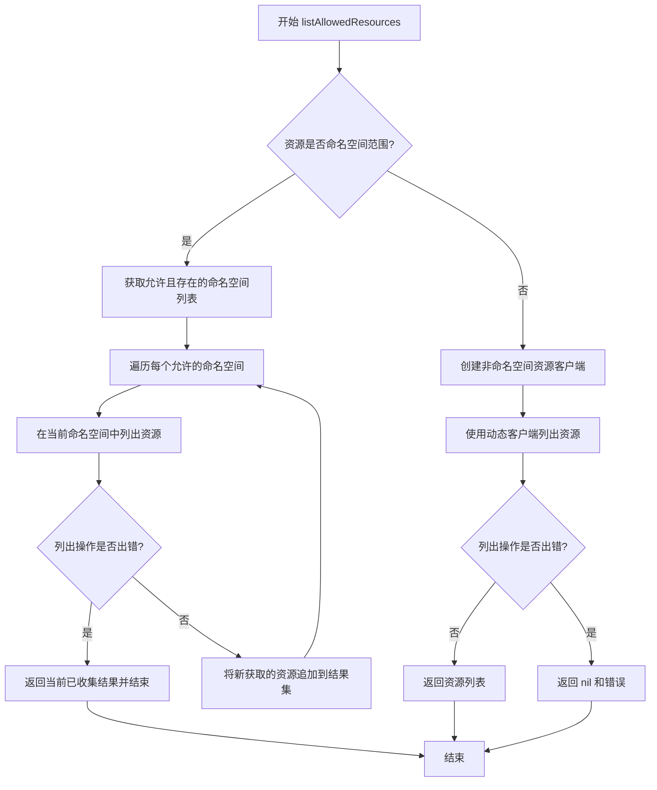

#### 带注释源码

```
// listAllowedResources 根据资源类型和命名空间信息从集群中检索资源
// 参数：
//   - namespaced: bool, 指示资源是否需要命名空间
//   - gvr: schema.GroupVersionResource, 资源组版本资源标识
//   - options: meta_v1.ListOptions, 列表查询选项
// 返回值：
//   - []unstructured.Unstructured: 非结构化资源列表
//   - error: 可能出现的错误
func (c *Cluster) listAllowedResources(
	namespaced bool, gvr schema.GroupVersionResource, options meta_v1.ListOptions) ([]unstructured.Unstructured, error) {
	// 如果资源不是命名空间范围的，直接列出所有资源
	if !namespaced {
		// 创建资源客户端并列出非命名空间资源
		resourceClient := c.client.dynamicClient.Resource(gvr)
		data, err := resourceClient.List(context.TODO(), options)
		if err != nil {
			return nil, err
		}
		return data.Items, nil
	}

	// 对于命名空间范围的资源，仅从允许的命名空间列出
	// 首先获取当前集群中允许且实际存在的命名空间列表
	namespaces, err := c.getAllowedAndExistingNamespaces(context.Background())
	if err != nil {
		return nil, err
	}
	
	// 遍历每个允许的命名空间，收集资源
	var result []unstructured.Unstructured
	for _, ns := range namespaces {
		// 对每个命名空间执行列表操作
		data, err := c.client.dynamicClient.Resource(gvr).Namespace(ns).List(context.TODO(), options)
		if err != nil {
			// 如果某个命名空间列出失败，返回已收集的部分结果
			return result, err
		}
		// 将当前命名空间的资源追加到结果中
		result = append(result, data.Items...)
	}
	return result, nil
}
```


### `Cluster.getAllowedGCMarkedResourcesInSyncSet`

该方法用于获取在指定SyncSet中标记为垃圾回收（GC）的集群资源。它首先获取所有带有GC标记的资源，然后过滤出属于给定SyncSet的资源，排除那些GC标记与资源ID不匹配的资源。

参数：

- `syncSetName`：`string`，SyncSet的名称，用于生成和匹配GC标记

返回值：`map[string]*kuberesource, error`，返回符合GC标记要求的资源映射，键为资源ID字符串，值为kuberesource指针；如果发生错误则返回error

#### 流程图

```mermaid
flowchart TD
    A[开始] --> B[调用getAllowedResourcesBySelector获取所有GC标记资源]
    B --> C{是否有错误}
    C -->|是| D[返回错误]
    C -->|否| E[初始化空映射allowedSyncSetGCMarkedResources]
    E --> F[遍历allGCMarkedResources]
    F --> G{资源的GC标记是否等于makeGCMark(syncSetName, resID)}
    G -->|是| H[将该资源添加到allowedSyncSetGCMarkedResources]
    G -->|否| I[跳过该资源]
    H --> J[继续下一资源]
    I --> J
    J --> K{是否还有更多资源}
    K -->|是| F
    K -->|否| L[返回allowedSyncSetGCMarkedResources和nil]
    D --> M[结束]
    L --> M
```

#### 带注释源码

```go
// getAllowedGCMarkedResourcesInSyncSet 获取在指定SyncSet中标记为垃圾回收的允许资源
// 参数 syncSetName: SyncSet的名称，用于生成和匹配GC标记
// 返回值: 符合GC标记要求的资源映射和可能发生的错误
func (c *Cluster) getAllowedGCMarkedResourcesInSyncSet(syncSetName string) (map[string]*kuberesource, error) {
	// 调用getAllowedResourcesBySelector获取所有带有GC标记(gcMarkLabel)的资源
	// gcMarkLabel是一个标签键，当资源存在此标签时表示该资源被标记为需要垃圾回收
	allGCMarkedResources, err := c.getAllowedResourcesBySelector(gcMarkLabel) // means "gcMarkLabel exists"
	if err != nil {
		return nil, err
	}
	
	// 初始化用于存储符合SyncSet要求的GC标记资源的映射
	allowedSyncSetGCMarkedResources := map[string]*kuberesource{}
	
	// 遍历所有带有GC标记的资源
	for resID, kres := range allGCMarkedResources {
		// 丢弃GC标记与资源ID不匹配的资源
		// makeGCMark函数根据syncSetName和resourceID生成期望的GC标记值
		// 只有当资源的实际GC标记与期望值完全相等时，才认为该资源属于当前SyncSet
		if kres.GetGCMark() != makeGCMark(syncSetName, resID) {
			continue
		}
		// 将匹配的资源添加到结果映射中
		allowedSyncSetGCMarkedResources[resID] = kres
	}
	
	// 返回过滤后的资源映射和nil错误
	return allowedSyncSetGCMarkedResources, nil
}
```


### `kuberesource.ResourceID`

该方法从 Kubernetes 集群中加载的资源对象提取并返回其唯一标识符（ID），该 ID 由命名空间、资源类型（Kind）和资源名称组成。对于非命名空间范围的资源（如 ClusterRole、CustomResourceDefinition 等），它使用集群作用域。

参数：

- 无（接收者为 `*kuberesource`）

返回值：`resource.ID`，返回资源的唯一标识符，包含命名空间、Kind 和名称信息。

#### 流程图

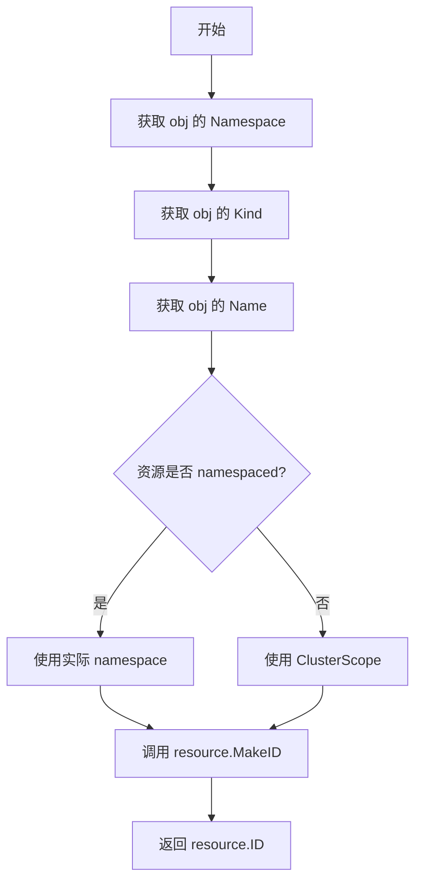

#### 带注释源码

```go
// ResourceID 返回从集群加载的此资源的 ID。
// 它从底层 unstructured 对象中提取 namespace、kind 和 name，
// 并将它们组合成一个唯一的 resource.ID。
// 对于非命名空间资源（如 CustomResourceDefinition、ClusterRole 等），
// 会使用 ClusterScope 作为命名空间。
func (r *kuberesource) ResourceID() resource.ID {
	// 从 unstructured 对象获取基础信息
	ns, kind, name := r.obj.GetNamespace(), r.obj.GetKind(), r.obj.GetName()
	
	// 检查资源是否为命名空间范围的资源
	// 如果不是命名空间范围的资源（如集群级别的资源），
	// 则使用 kresource.ClusterScope 作为命名空间
	if !r.namespaced {
		ns = kresource.ClusterScope
	}
	
	// 使用提取的信息构造唯一的资源标识符
	return resource.MakeID(ns, kind, name)
}
```


### `kuberesource.IdentifyingBytes`

该方法返回足以识别 Kubernetes 资源的字节切片，包含资源的 apiVersion、kind、namespace 和 name 信息，用于在垃圾回收过程中标识集群中的资源。

参数：
- （无额外参数，仅有接收者 `r *kuberesource`）

返回值：`[]byte`，返回包含资源基本标识信息（apiVersion、kind、namespace、name）的 YAML 格式字节切片

#### 流程图

```mermaid
flowchart TD
    A[开始 IdentifyingBytes] --> B[获取资源对象]
    B --> C[调用 r.obj.GetAPIVersion]
    B --> D[调用 r.obj.GetKind]
    B --> E[调用 r.obj.GetNamespace]
    B --> F[调用 r.obj.GetName]
    C --> G[fmt.Sprintf 格式化字符串]
    D --> G
    E --> G
    F --> G
    G --> H[转换为字节切片]
    H --> I[返回 []byte]
```

#### 带注释源码

```go
// Bytes returns a byte slice description, including enough info to
// identify the resource (but not momre)
// IdentifyingBytes 返回一个字节切片描述，包含足够的信息来
// 识别资源（但不多余）
func (r *kuberesource) IdentifyingBytes() []byte {
	// 使用 fmt.Sprintf 格式化生成包含关键元数据的 YAML 片段
	// 包含 apiVersion、kind、namespace 和 name 四个核心字段
	return []byte(fmt.Sprintf(`
apiVersion: %s
kind: %s
metadata:
  namespace: %q
  name: %q
`, r.obj.GetAPIVersion(), r.obj.GetKind(), r.obj.GetNamespace(), r.obj.GetName()))
}
```


### `kuberesource.Policies`

该方法用于从 Kubernetes 资源的注解（annotations）中提取并返回 Flux 策略集合（policy.Set），使得可以对资源进行策略检查，例如判断是否应忽略同步、是否仅在同步时忽略等。

参数：
- （无参数，是方法而非函数）

返回值：`policy.Set`，返回从资源的注解中提取的 Flux 策略集合，用于后续的策略检查和垃圾回收决策。

#### 流程图

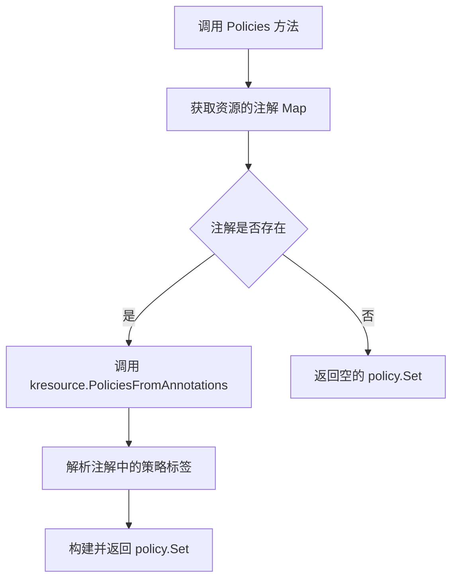

#### 带注释源码

```go
// Policies 返回与该 Kubernetes 资源关联的策略集合
// 这些策略是从资源的注解（annotations）中提取的
// 策略可以包括：忽略策略（Ignore）、仅同步时忽略（IgnoreSyncOnly）等
// 用于在同步和垃圾回收过程中决定如何处理该资源
func (r *kuberesource) Policies() policy.Set {
	// 调用 kresource.PoliciesFromAnnotations 函数
	// 传递资源的注解 map[string]string
	// 该函数会解析以 kresource.PolicyPrefix 为前缀的注解键
	// 并将其转换为 policy.Set 类型返回
	return kresource.PoliciesFromAnnotations(r.obj.GetAnnotations())
}
```


### `kuberesource.GetChecksum`

获取 Kubernetes 资源对象中存储的同步校验和，用于在垃圾回收时验证该资源是否已从 Git 同步到集群。

参数：

- 无（仅包含接收者参数 `r *kuberesource`）

返回值：`string`，返回存储在资源注解中的校验和字符串，如果注解不存在则返回空字符串。

#### 流程图

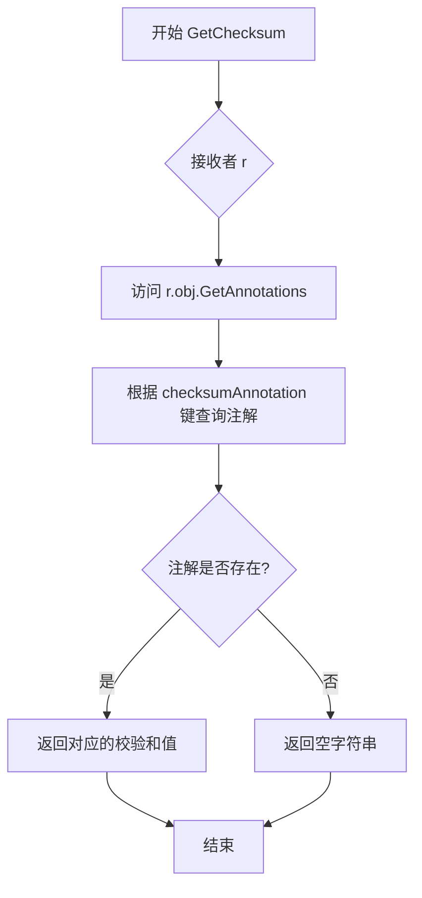

#### 带注释源码

```go
// GetChecksum 返回存储在 Kubernetes 资源注解中的校验和
// 该校验和在 Sync 过程中计算并附加到资源上，用于垃圾回收时的比对
// 返回值：校验和字符串，若注解不存在则返回空字符串
func (r *kuberesource) GetChecksum() string {
	// checksumAnnotation 是预先定义的常量键，格式为 "flux.io/sync-checksum"
	// 通过 Unstructured 对象的 GetAnnotations 方法获取所有注解
	// 然后使用键索引获取对应的校验和值
	return r.obj.GetAnnotations()[checksumAnnotation]
}
```


### `kuberesource.GetGCMark`

获取 Kubernetes 资源对象上的 GC 标记标签值，用于垃圾回收识别。

参数：无

返回值：`string`，返回 GC 标记标签的值，如果标签不存在则返回空字符串

#### 流程图

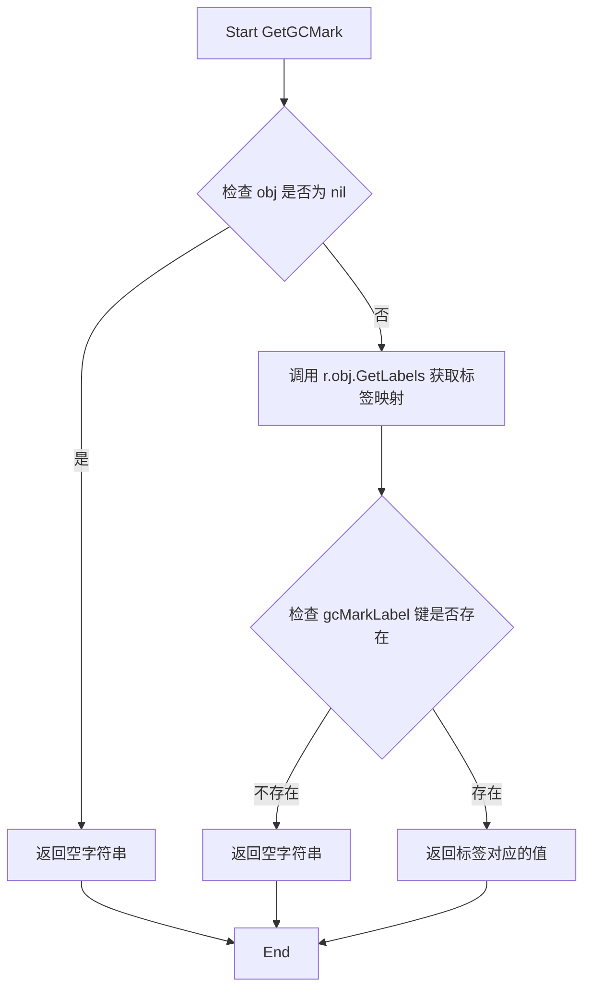

#### 带注释源码

```go
// GetGCMark 返回 Kubernetes 资源对象上的 GC 标记标签值
// 该标签用于标识资源是否需要进行垃圾回收
// 参数：无
// 返回值：string - GC标记标签的值，如果标签不存在则返回空字符串
func (r *kuberesource) GetGCMark() string {
	// 从底层 unstructured 对象获取标签映射
	// gcMarkLabel 是预先定义的常量，值为 kresource.PolicyPrefix + "sync-gc-mark"
	// 用于在垃圾回收阶段识别哪些资源应该被回收
	return r.obj.GetLabels()[gcMarkLabel]
}
```

---

### 关联上下文信息

#### 1. 核心功能概述

该函数属于 `kuberesource` 类型，是 Flux CD  Kubernetes 集群同步系统的垃圾回收（GC）机制的一部分。通过读取资源对象上的 `sync-gc-mark` 标签来判断资源是否属于当前同步集，从而决定是否应该被删除。

#### 2. 关键组件信息

| 名称 | 描述 |
|------|------|
| `kuberesource` | 封装 Kubernetes 非结构化资源的类型 |
| `gcMarkLabel` | GC 标记标签常量，用于标识需要进行垃圾回收的资源 |
| `checksumAnnotation` | 检查和注解，用于验证资源是否已同步 |

#### 3. 全局变量信息

| 名称 | 类型 | 描述 |
|------|------|------|
| `gcMarkLabel` | string | GC 标记标签的完整名称常量 |
| `checksumAnnotation` | string | 检查和注解的完整名称常量 |

#### 4. 类字段信息（kuberesource）

| 名称 | 类型 | 描述 |
|------|------|------|
| `obj` | `*unstructured.Unstructured` | Kubernetes 非结构化资源对象 |
| `namespaced` | bool | 标识资源是否属于命名空间范围 |

#### 5. 潜在技术债务与优化空间

- **缺少空值检查**：当前实现直接访问 `r.obj.GetLabels()`，未检查 `r.obj` 是否为 nil，可能导致运行时 panic
- **返回值语义不明确**：当标签不存在时返回空字符串，调用方无法区分"标签不存在"和"标签值为空"两种情况
- **标签查询效率**：每次调用都会获取完整的标签映射，可考虑缓存或优化查询方式

#### 6. 错误处理与异常设计

- 当前方法不返回错误，而是返回空字符串表示标签不存在
- 调用方（如 `getAllowedGCMarkedResourcesInSyncSet`）需要自行处理空字符串的情况


### `changeSet.stage`

该方法用于将资源对象添加到变更集中，根据操作类型（apply/delete）将资源存储到对应的列表，以便后续批量应用到 Kubernetes 集群或从集群中删除。

参数：

- `cmd`：`string`，操作命令类型，值为 "apply"（应用资源）或 "delete"（删除资源）
- `id`：`resource.ID`，资源的唯一标识符，包含命名空间、类型和名称信息
- `source`：`string`，资源的来源路径，用于错误追踪和日志记录
- `bytes`：`[]byte`，资源的 YAML 格式字节数据，即将被序列化为 Kubernetes 资源清单

返回值：无（`void`），该方法直接修改 `changeSet` 接收者的内部状态，不返回任何值

#### 流程图

```mermaid
flowchart TD
    A[开始 stage 方法] --> B{检查 cmd 是否存在}
    B -->|cmd 存在| C[创建 applyObject 结构体]
    B -->|cmd 不存在| D[创建新的 cmd 键值对]
    C --> E[将 applyObject 追加到 objs[cmd] 切片]
    D --> E
    E --> F[结束方法]
```

#### 带注释源码

```go
// stage 将一个资源对象添加到变更集中
// cmd: 操作类型，"apply" 表示应用资源，"delete" 表示删除资源
// id: 资源的唯一标识符
// source: 资源来源路径，用于日志和错误追踪
// bytes: 资源的完整 YAML 字节内容
func (c *changeSet) stage(cmd string, id resource.ID, source string, bytes []byte) {
    // 将 applyObject 对象追加到对应 cmd 类型的切片中
    // objs 是一个 map[string][]applyObject，key 为操作命令类型
    c.objs[cmd] = append(c.objs[cmd], applyObject{id, source, bytes})
}
```


### NewKubectl

该函数是 `Kubectl` 类的构造函数，用于创建并初始化一个 `Kubectl` 实例，封装了 kubectl 命令行工具的执行所需的可执行文件路径和 Kubernetes REST 配置。

参数：

- `exe`：`string`，kubectl 可执行文件的路径
- `config`：`*rest.Config`，Kubernetes API 服务器的连接配置

返回值：`*Kubectl`，返回新创建的 Kubectl 实例指针

#### 流程图

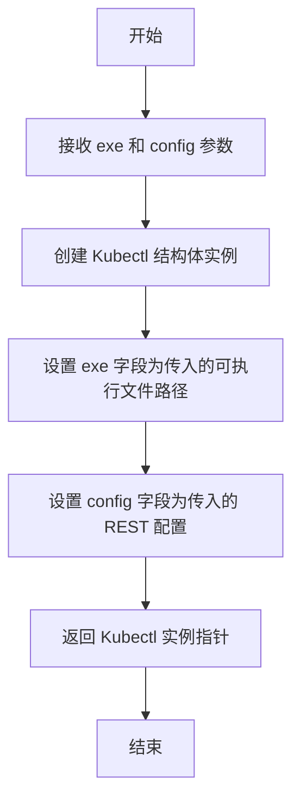

#### 带注释源码

```go
// NewKubectl 创建一个新的 Kubectl 实例
// 参数:
//   - exe: kubectl 可执行文件的路径
//   - config: Kubernetes REST 配置,包含服务器地址、认证信息等
//
// 返回值:
//   - *Kubectl: 返回新创建的 Kubectl 实例指针
func NewKubectl(exe string, config *rest.Config) *Kubectl {
	return &Kubectl{
		exe:    exe,    // 保存 kubectl 可执行文件路径
		config: config, // 保存 Kubernetes REST 配置
	}
}
```


### `Kubectl.connectArgs`

该方法根据 `Kubectl` 结构体中存储的 `rest.Config` 配置信息，动态构建并返回用于 kubectl 命令行工具的连接参数数组，包括服务器地址、认证凭证（用户名、密码、Bearer Token）以及 TLS 客户端配置（客户端证书、CA 证书、客户端密钥）等。

参数：此方法为结构体方法，无显式参数。参数由接收者 `c`（`*Kubectl` 类型）提供。

返回值：`[]string`（字符串切片），返回构建好的 kubectl 命令行参数列表，用于与 Kubernetes 集群建立连接。

#### 流程图

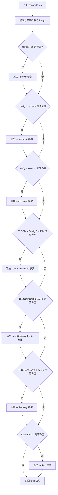

#### 带注释源码

```go
// connectArgs 根据配置构建 kubectl 命令行连接参数
// 接收者: c *Kubectl - 包含执行路径和 REST 配置的 kubectl 客户端实例
// 返回值: []string - kubectl 命令行参数列表
func (c *Kubectl) connectArgs() []string {
    // 初始化用于存储参数的空切片
    var args []string
    
    // 检查并添加 API Server 地址参数
    if c.config.Host != "" {
        args = append(args, fmt.Sprintf("--server=%s", c.config.Host))
    }
    
    // 检查并添加用户名认证参数
    if c.config.Username != "" {
        args = append(args, fmt.Sprintf("--username=%s", c.config.Username))
    }
    
    // 检查并添加密码认证参数
    if c.config.Password != "" {
        args = append(args, fmt.Sprintf("--password=%s", c.config.Password))
    }
    
    // 检查并添加客户端证书参数 (用于 mTLS)
    if c.config.TLSClientConfig.CertFile != "" {
        args = append(args, fmt.Sprintf("--client-certificate=%s", c.config.TLSClientConfig.CertFile))
    }
    
    // 检查并添加 CA 证书参数 (用于验证服务端证书)
    if c.config.TLSClientConfig.CAFile != "" {
        args = append(args, fmt.Sprintf("--certificate-authority=%s", c.config.TLSClientConfig.CAFile))
    }
    
    // 检查并添加客户端私钥参数 (用于 mTLS)
    if c.config.TLSClientConfig.KeyFile != "" {
        args = append(args, fmt.Sprintf("--client-key=%s", c.config.TLSClientConfig.KeyFile))
    }
    
    // 检查并添加 Bearer Token 认证参数
    if c.config.BearerToken != "" {
        args = append(args, fmt.Sprintf("--token=%s", c.config.BearerToken))
    }
    
    // 返回构建好的参数列表
    return args
}
```


### Kubectl.apply

该方法是Fluxcd Kubernetes集群同步系统的核心组件，负责将变更集合（changeSet）应用到Kubernetes集群。它通过kubectl命令执行资源的apply和delete操作，支持多文档批量处理和错误资源单独重试，同时根据Kubernetes资源类型的依赖关系进行排序以确保正确的部署顺序。

参数：

- `logger`：`log.Logger`，日志记录器，用于记录方法执行过程中的日志信息
- `cs`：`changeSet`，变更集合，包含待应用（apply）或待删除（delete）的资源对象
- `errored`：`map[resource.ID]error`，之前同步失败的资源映射，用于标识需要单独重试的资源

返回值：`cluster.SyncError`，同步错误集合，包含所有在应用过程中失败的资源错误信息

#### 流程图

```mermaid
flowchart TD
    A[开始 apply 方法] --> B{检查错误映射 errored}
    B -->|为空| C[所有对象批量处理]
    B -->|有错误| D{遍历每个对象}
    D -->|对象在 errored 中| E[标记为单次处理]
    D -->|对象不在 errored 中| F[标记为批量处理]
    C --> G[调用 makeMultidoc 合并多文档]
    G --> H{执行命令}
    H -->|失败| I[将失败对象加入单次处理]
    H -->|成功| J[继续处理下一个]
    D --> K[单次处理每个对象]
    K --> L[执行单个对象 apply/delete]
    L -->|成功| M[继续下一个]
    L -->|失败| N[记录错误到 errs]
    K --> O[返回 SyncError]
    J --> O
    O --> P[结束]
    
    style A fill:#f9f,color:#000
    style O fill:#9f9,color:#000
    style N fill:#f99,color:#000
```

#### 带注释源码

```go
// apply 方法执行变更集合到Kubernetes集群的核心逻辑
// 参数 logger: 日志记录器
// 参数 cs: 变更集合，包含待应用和待删除的资源
// 参数 errored: 之前同步失败的资源映射，用于单独重试
// 返回值: 同步过程中产生的错误集合
func (c *Kubectl) apply(logger log.Logger, cs changeSet, errored map[resource.ID]error) (errs cluster.SyncError) {
	// f 是一个内部函数，用于处理一组 applyObject
	// objs: 要处理的对象列表
	// cmd: 命令类型 ("apply" 或 "delete")
	// args: 额外的命令行参数
	f := func(objs []applyObject, cmd string, args ...string) {
		// 空对象列表直接返回，避免无效操作
		if len(objs) == 0 {
			return
		}
		// 记录即将执行的命令信息
		logger.Log("cmd", cmd, "args", strings.Join(args, " "), "count", len(objs))
		// 将命令追加到参数列表
		args = append(args, cmd)

		var multi, single []applyObject
		// 根据是否存在错误将对象分为两组：
		// multi: 可以批量处理的对象
		// single: 需要单独处理的对象（之前失败或批量失败）
		if len(errored) == 0 {
			// 没有错误，全部批量处理
			multi = objs
		} else {
			for _, obj := range objs {
				if _, ok := errored[obj.ResourceID]; ok {
					// 之前失败的资源需要单独应用
					single = append(single, obj)
				} else {
					// 其他资源尝试批量多文档应用
					multi = append(multi, obj)
				}
			}
		}

		// 尝试批量处理多文档
		if len(multi) > 0 {
			// 将多个YAML文档合并为多文档格式
			if err := c.doCommand(logger, makeMultidoc(multi), args...); err != nil {
				// 批量失败后将所有对象转为单独处理
				single = append(single, multi...)
			}
		}
		// 单独处理每个失败的对象
		for _, obj := range single {
			r := bytes.NewReader(obj.Payload)
			if err := c.doCommand(logger, r, args...); err != nil {
				// 收集每个失败资源的错误信息
				errs = append(errs, cluster.ResourceError{
					ResourceID: obj.ResourceID,
					Source:     obj.Source,
					Error:      err,
				})
			}
		}
	}

	// 处理删除操作：反向排序以避免依赖问题
	// 删除时需要从依赖链顶端开始，避免删除被依赖的资源
	objs := cs.objs["delete"]
	sort.Sort(sort.Reverse(applyOrder(objs)))  // 反向排序（依赖度低的先删）
	f(objs, "delete")

	// 处理应用操作：正向排序确保依赖先创建
	// 应用时需要从依赖链底端开始，确保被依赖的资源先创建
	objs = cs.objs["apply"]
	sort.Sort(applyOrder(objs))  // 正向排序（依赖度低的先创）
	f(objs, "apply")
	
	// 返回所有同步错误，如果没有错误则为nil
	return errs
}
```


### `Kubectl.doCommand`

该方法用于执行 kubectl 命令，将输入的 YAML/JSON 内容通过标准输入传递给 kubectl，并返回执行结果。

参数：

- `logger`：`log.Logger`，用于记录命令执行的日志信息
- `r`：`io.Reader`，包含要传递给 kubectl 的资源定义内容（通常是多文档 YAML）
- `args`：`...string`，可变参数，表示要执行的 kubectl 子命令及额外参数

返回值：`error`，执行成功返回 nil，否则返回包含错误信息的 error

#### 流程图

```mermaid
flowchart TD
    A[开始 doCommand] --> B[追加 '-f', '-' 参数]
    B --> C[构建 kubectl 命令]
    C --> D[设置标准输入为 r]
    D --> E[创建 stderr 和 stdout 缓冲区]
    E --> F[记录开始时间]
    F --> G[执行 cmd.Run]
    G --> H{执行是否有错误?}
    H -->|是| I[包装错误信息包含 stderr]
    H -->|否| J[保持原错误为 nil]
    I --> K[记录日志包含命令、时间、错误、输出]
    J --> K
    K --> L[返回错误]
```

#### 带注释源码

```go
// doCommand 执行 kubectl 命令
// 参数 logger 用于日志记录，r 是要传递给 kubectl 的资源数据，args 是 kubectl 子命令及参数
func (c *Kubectl) doCommand(logger log.Logger, r io.Reader, args ...string) error {
    // 在参数列表末尾追加 "-f -" 表示从标准输入读取资源定义
    args = append(args, "-f", "-")
    
    // 使用 kubectlCommand 构建完整的命令对象，包含连接参数
    cmd := c.kubectlCommand(args...)
    
    // 将资源内容绑定到标准输入
    cmd.Stdin = r
    
    // 创建 stderr 缓冲区捕获错误输出
    stderr := &bytes.Buffer{}
    cmd.Stderr = stderr
    
    // 创建 stdout 缓冲区捕获标准输出
    stdout := &bytes.Buffer{}
    cmd.Stdout = stdout

    // 记录命令开始执行的时间
    begin := time.Now()
    
    // 执行命令
    err := cmd.Run()
    
    // 如果执行出错，将 stderr 内容包含在错误信息中
    if err != nil {
        err = fmt.Errorf("running kubectl: %w, stderr: %s", err, strings.TrimSpace(stderr.String()))
    }

    // 记录命令执行的详细信息：命令内容、耗时、错误、输出
    logger.Log("cmd", "kubectl "+strings.Join(args, " "), "took", time.Since(begin), "err", err, "output", strings.TrimSpace(stdout.String()))
    
    // 返回执行结果（成功时为 nil）
    return err
}
```


### `Kubectl.kubectlCommand`

该方法用于构建并返回 kubectl 命令执行对象，通过合并连接参数（如服务器地址、认证信息等）与传入的操作参数，生成完整的 kubectl 命令。

参数：

- `args`：`...string`（可变参数），传递给 kubectl 的额外命令行参数，如 "apply", "-f", "-" 等

返回值：`*exec.Cmd`，返回构造好的 `exec.Cmd` 对象，可用于后续执行命令

#### 流程图

```mermaid
flowchart TD
    A[开始 kubectlCommand] --> B[调用 c.connectArgs 获取连接参数]
    B --> C[将 args 追加到连接参数后面]
    C --> D[执行 exec.Command]
    D --> E[返回 *exec.Cmd 对象]
    
    subgraph "connectArgs 内部逻辑"
    F[检查 config.Host] --> G[添加 --server 参数]
    H[检查 config.Username] --> I[添加 --username 参数]
    J[检查 config.Password] --> K[添加 --password 参数]
    L[检查 TLSClientConfig] --> M[添加证书相关参数]
    N[检查 BearerToken] --> O[添加 --token 参数]
    end
```

#### 带注释源码

```go
// kubectlCommand 构建并返回 kubectl 命令对象
// 参数 args: 可变参数，用于传递 kubectl 子命令和选项（如 "apply", "-f", "-"）
// 返回值: *exec.Cmd 执行命令对象
func (c *Kubectl) kubectlCommand(args ...string) *exec.Cmd {
	// 1. 首先调用 connectArgs() 获取认证和连接相关的参数
	// 2. 将用户传入的 args 追加到连接参数后面
	// 3. 使用 exec.Command 执行 c.exe（即 kubectl 可执行文件）
	// 4. 返回构造好的命令对象，供调用者执行（如设置 stdin/stdout）
	return exec.Command(c.exe, append(c.connectArgs(), args...)...)
}
```


### `Kubectl.apply`

该方法实现了 `Applier` 接口，负责将变更集（changeSet）中的资源对象应用到 Kubernetes 集群或从集群中删除。它根据资源的依赖关系对对象进行排序，优先处理无依赖的资源（如 Namespace、CustomResourceDefinition），然后处理依赖它们的资源（如 Deployment、Service 等）。该方法支持批量应用和单独重试机制，能够处理部分失败的情况。

参数：

- `logger`：`log.Logger`，用于记录方法执行过程中的日志信息
- `cs`：`changeSet`，包含待应用或待删除的资源对象集合，按操作类型（apply/delete）分组
- `errored`：`map[resource.ID]error`，记录之前同步失败的资源及其错误信息，用于重试处理

返回值：`cluster.SyncError`，返回应用过程中产生的错误集合，如果所有资源都成功应用则返回 nil

#### 流程图

```mermaid
flowchart TD
    A[开始 apply] --> B{检查变更集是否为空}
    B -->|是| Z[返回 nil]
    B -->|否| C[定义内部函数 f]
    C --> D[处理 delete 操作]
    D --> E[反转 delete 对象顺序]
    E --> F[调用 f 执行删除]
    F --> G[处理 apply 操作]
    G --> H[正序排列 apply 对象]
    H --> I[调用 f 执行应用]
    I --> J{检查错误}
    J -->|有错误| K[返回错误集合]
    J -->|无错误| Z
    
    subgraph 内部函数 f
        L[记录日志] --> M{检查 errored 映射}
        M -->|为空| N[所有对象批量处理]
        M -->|非空| O[区分单次和批量对象]
        N --> P{执行批量命令}
        O --> P
        P -->|成功| Q[继续处理单个对象]
        P -->|失败| R[将失败对象加入单个处理队列]
        R --> Q
        Q --> S[遍历单个对象]
        S --> T{执行单个命令}
        T -->|成功| U[继续下一个]
        T -->|失败| V[记录错误]
        V --> U
    end
```

#### 带注释源码

```go
// apply 将变更集应用到集群或从集群删除资源
// 参数：
//   - logger: 日志记录器
//   - cs: 变更集，包含待应用/删除的资源
//   - errored: 之前失败的资源映射，用于重试
// 返回：
//   - cluster.SyncError: 应用过程中的错误集合
func (c *Kubectl) apply(logger log.Logger, cs changeSet, errored map[resource.ID]error) (errs cluster.SyncError) {
	// f 是一个内部函数，用于处理一组 applyObject
	// cmd 参数指定操作类型：apply 或 delete
	f := func(objs []applyObject, cmd string, args ...string) {
		// 空对象集合直接返回，无需处理
		if len(objs) == 0 {
			return
		}
		// 记录即将执行的命令信息
		logger.Log("cmd", cmd, "args", strings.Join(args, " "), "count", len(objs))
		// 将操作命令追加到参数列表
		args = append(args, cmd)

		var multi, single []applyObject
		// 如果没有之前失败的资源，所有对象尝试批量处理
		if len(errored) == 0 {
			multi = objs
		} else {
			// 区分之前失败的对象和可以批量处理的对象
			for _, obj := range objs {
				if _, ok := errored[obj.ResourceID]; ok {
					// 之前失败的对象需要单独处理
					single = append(single, obj)
				} else {
					// 其他对象尝试批量处理
					multi = append(multi, obj)
				}
			}
		}

		// 优先尝试批量处理
		if len(multi) > 0 {
			// 将多个 YAML 文档合并为 multidoc 格式
			if err := c.doCommand(logger, makeMultidoc(multi), args...); err != nil {
				// 批量处理失败，将所有对象转为单独处理
				single = append(single, multi...)
			}
		}
		// 逐个处理需要单独执行的对象
		for _, obj := range single {
			r := bytes.NewReader(obj.Payload)
			if err := c.doCommand(logger, r, args...); err != nil {
				// 记录每个失败资源的错误信息
				errs = append(errs, cluster.ResourceError{
					ResourceID: obj.ResourceID,
					Source:     obj.Source,
					Error:      err,
				})
			}
		}
	}

	// 删除操作：反向排序以避免删除依赖资源
	// 当删除命名空间时，Kubernetes GC 会自动清理其中的资源
	// 反向排序可以确保先删除依赖资源，再删除被依赖的资源
	objs := cs.objs["delete"]
	sort.Sort(sort.Reverse(applyOrder(objs)))
	f(objs, "delete")

	// 应用操作：正向排序以确保先创建被依赖的资源
	// 例如：先创建 Namespace，再创建 Deployment
	objs = cs.objs["apply"]
	sort.Sort(applyOrder(objs))
	f(objs, "apply")
	
	// 返回累积的错误集合
	return errs
}
```


### `applyOrder.Len`

该方法是 `applyOrder` 类型的成员方法，实现了 Go 语言 `sort.Interface` 接口的 `Len()` 方法，用于返回待排序对象切片的长度，以便排序算法能够确定需要排序的元素数量。

参数： 无

返回值：`int`，返回待排序对象的数量，即 `applyOrder` 切片的长度。

#### 流程图

```mermaid
flowchart TD
    A[开始] --> B[获取 applyOrder 切片的长度]
    B --> C[返回长度值]
    C --> D[结束]
```

#### 带注释源码

```go
// Len 是 sort.Interface 接口的实现方法
// 返回 applyOrder 切片中元素的数量
// 用于排序算法确定需要处理的元素个数
func (objs applyOrder) Len() int {
	return len(objs)  // 返回切片长度
}
```


### `applyOrder.Swap`

该方法实现了 Go 语言 `sort.Interface` 接口中的 `Swap` 方法，用于在排序过程中交换切片中两个指定位置的元素。它是 `applyOrder` 类型（`[]applyObject` 的别名）的成员方法，配合 `Len()` 和 `Less()` 方法使该切片支持 Go 标准库 `sort` 包的排序功能。

参数：

- `i`：`int`，要交换的第一个元素的索引位置
- `j`：`int`，要交换的第二个元素的索引位置

返回值：无（`void`），该方法直接修改调用者的内部状态，不返回任何值

#### 流程图

```mermaid
flowchart TD
    A[开始 Swap 方法] --> B{验证索引有效性}
    B -->|索引有效| C[保存 objs[i] 的值]
    C --> D[将 objs[j] 赋值给 objs[i]]
    D --> E[将保存的 objs[i] 原值赋值给 objs[j]]
    E --> F[结束方法]
    
    B -->|索引无效| F
```

#### 带注释源码

```go
// Swap 方法实现了 sort.Interface 接口
// 用于在排序算法中交换两个元素的位置
func (objs applyOrder) Swap(i, j int) {
	// 交换索引 i 和 j 处的元素
	// Go 语言的多重赋值特性使得这种交换无需临时变量
	objs[i], objs[j] = objs[j], objs[i]
}
```


### `applyOrder.Less`

该方法是 `applyOrder` 类型的成员，实现了 `sort.Interface` 接口的 `Less` 方法，用于确定 Kubernetes 资源对象的应用顺序。它根据资源的 kind 排名（rankOfKind）和命名空间名称进行排序，确保依赖关系正确的资源（如 Namespace -> CustomResourceDefinition -> ServiceAccount -> Deployment）按正确顺序应用。

参数：

- `i`：`int`，第一个对象的索引
- `j`：`int`，第二个对象的索引

返回值：`bool`，如果第一个对象应排在第二个对象之前则返回 true

#### 流程图

```mermaid
flowchart TD
    A[开始比较 applyObject[i] 和 applyObject[j]] --> B[获取 objs[i].ResourceID 的组件: namespace_i, kind_i, name_i]
    B --> C[获取 objs[j].ResourceID 的组件: namespace_j, kind_j, name_j]
    C --> D[计算 kind_i 的排名 ranki = rankOfKind(kind_i)]
    D --> E[计算 kind_j 的排名 rankj = rankOfKind(kind_j)]
    E --> F{ranki == rankj?}
    F -->|是| G[返回 name_i < name_j]
    F -->|否| H[返回 ranki < rankj]
    G --> I[结束]
    H --> I
```

#### 带注释源码

```go
// Less 方法实现了 sort.Interface 接口，用于排序 applyObject 切片
// i: 第一个对象的索引
// j: 第二个对象的索引
// 返回值: 如果 objs[i] 应该排在 objs[j] 之前则返回 true
func (objs applyOrder) Less(i, j int) bool {
	// 获取第一个对象的资源ID组件：命名空间、类型和名称
	_, ki, ni := objs[i].ResourceID.Components()
	// 获取第二个对象的资源ID组件：命名空间、类型和名称
	_, kj, nj := objs[j].ResourceID.Components()
	
	// 计算两个资源类型的排名
	// 排名反映了 Kubernetes 资源之间的依赖关系
	// 排名越低，表示越底层（如 Namespace 排名为 0）
	// 排名越高，表示越上层（如 Deployment 排名为 3）
	ranki, rankj := rankOfKind(ki), rankOfKind(kj)
	
	// 如果两个资源的排名相同，则按名称排序（确保顺序确定性）
	if ranki == rankj {
		return ni < nj
	}
	
	// 排名低的资源排在前面（先创建依赖资源，再创建被依赖资源）
	return ranki < rankj
}
```

#### 关键组件信息

- **applyOrder**: 实际上是 `[]applyObject` 类型的别名，用于表示待应用的 Kubernetes 对象集合
- **rankOfKind**: 内部函数，根据 Kubernetes 资源的类型返回其在依赖顺序中的排名
- **ResourceID**: 资源标识符类型，包含命名空间、类型和名称信息

#### 技术债务与优化空间

1. **硬编码的依赖顺序**: `rankOfKind` 函数中的依赖关系是手动维护的，随着 Kubernetes 版本更新，可能需要手动更新
2. **缺乏对自定义资源的支持**: 排名逻辑只覆盖了内置的 Kubernetes 资源类型，对于 CRD 可能会排在最后，可能导致问题
3. **名称排序的局限性**: 当 rank 相同时仅按名称排序，可能不是最优顺序，应该考虑其他因素如创建时间或字母顺序外的依赖关系

## 关键组件


### Sync方法
负责将Git仓库中定义的资源同步到Kubernetes集群，包含资源校验、元数据应用、执行同步和垃圾回收的完整流程。

### collectGarbage方法
通过比对集群中已标记资源的校验和与Git清单中的校验和，识别并删除孤立资源（不在同步集中且未被忽略的资源）。

### kuberesource结构体
封装Kubernetes原生Unstructured对象，提供资源ID获取、策略解析、校验和获取和GC标记获取等操作接口。

### changeSet结构体
内部数据结构，按操作类型（apply/delete）组织待执行的资源对象变更，支持暂存(stage)和批量处理。

### Applier接口与Kubectl实现
定义资源应用契约，Kubectl实现通过kubectl命令行工具执行apply和delete操作，支持多文档批量应用和错误资源单独重试。

### applyMetadata函数
将同步集名称、GC标记和校验和注入到资源清单的标签和注解中，同时处理命名空间和元数据合并。

### makeGCMark函数
基于同步集名称和资源ID生成SHA256哈希的GC标记，采用base64原始URL编码并添加"sha256."前缀以符合Kubernetes标签值规范。

### getAllowedResourcesBySelector方法
获取集群中所有被允许访问的资源，支持按标签选择器过滤，排除具有所有者引用的资源，并过滤掉特定系统组件。

### listAllowedResources方法
列出指定资源类型的实例，非命名空间级资源直接列出，命名空间级资源仅从允许的命名空间中列出。

### filterResources方法
根据排除规则过滤API资源列表，支持通配符匹配，排除特定资源类型。

### rankOfKind函数
返回Kubernetes资源类型的依赖排序权重，确保按正确顺序创建资源（命名空间->集群级资源->角色绑定->工作负载）。

### applyOrder类型
实现sort.Interface接口，支持对资源对象按依赖顺序排序，确保有依赖关系的资源按正确顺序应用。

## 问题及建议


### 已知问题

-   **不安全的哈希算法**：使用`sha1`计算资源校验和，虽然仅用于标识目的，但技术上已不推荐使用
-   **Context使用不当**：多处使用`context.TODO()`而非从函数参数传递的context，导致无法正确取消或超时控制
-   **过时的Kubernetes API**：使用已废弃的`ServerGroups()`和`ServerResourcesForGroupVersion()`方法，应使用`Discovery()`接口
-   **锁粒度过粗**：混合使用`mu.Lock()`和`muSyncErrors.RLock()`，存在潜在的竞态条件和死锁风险
-   **错误处理不一致**：`getAllowedResourcesBySelector`中忽略特定错误但未明确记录原因，降低了代码可维护性
-   **硬编码资源过滤**：跳过`ComponentStatus`和`Endpoints`资源类型硬编码在循环中，缺乏配置灵活性

### 优化建议

-   将`context.TODO()`替换为从函数参数传递的context，并在关键操作中添加超时控制
-   考虑使用`sha256`替代`sha1`，或使用更高效的哈希方式
-   重构锁的使用逻辑，考虑使用`sync.RWMutex`或更细粒度的并发控制
-   将硬编码的跳过资源列表提取为配置项或常量
-   使用现代Kubernetes客户端的`DiscoveryClient`替代废弃方法，并实现API缓存机制
-   统一错误处理策略，明确记录忽略特定错误的原因
-   考虑添加重试机制处理临时性API错误

## 其它


### 设计目标与约束

本模块是Fluxcdubernetes同步引擎的核心组件，主要设计目标包括：
1. **声明式同步**：将Git仓库中定义的资源状态与Kubernetes集群实际状态保持一致
2. **垃圾回收**：通过mark-and-sweep机制清理集群中已不存在于Git manifests中的资源（孤儿资源）
3. **安全约束**：仅同步被允许的资源，支持命名空间级别的访问控制
4. **幂等性**：通过checksum机制确保资源只在内容变化时才重新应用

约束条件：
- 必须与flux cluster.SyncSet接口兼容
- 依赖kubectl命令行工具执行资源操作
- 仅支持Kubernetes API可发现的资源类型

### 错误处理与异常设计

错误处理策略采用分层设计：

1. **资源级别错误**：通过cluster.ResourceError记录单个资源处理失败，不中断整体流程
2. **同步集合级别错误**：使用cluster.SyncError聚合多个资源错误，支持链式append
3. **API访问错误**：对于Forbidden错误跳过特定资源继续处理，避免因权限不足导致完全失败
4. **YAML解析错误**：applyMetadata函数中捕获并包装yaml.Unmarshal错误
5. **网络错误**：listAllowedResources中对不同命名空间分别捕获错误，允许部分命名空间成功

关键模式：
- 使用errors.Wrap添加上下文信息
- 区分可恢复错误（如权限不足）与不可恢复错误（如配置错误）
- DryRun模式（DryGC）允许预演垃圾回收而不实际删除资源

### 数据流与状态机

核心数据流：

```
SyncSet输入 → 获取集群资源 → 计算checksum → 过滤排除资源 
    → stage变更到changeSet → 应用变更 → 垃圾回收 → 记录同步错误
```

状态转换：
1. **资源发现阶段**：getAllowedResourcesBySelector获取所有符合条件的集群资源
2. **变更准备阶段**：对每个SyncSet资源计算SHA1 checksum，stage到apply或skip
3. **变更执行阶段**：Kubectl.apply执行实际集群操作，按资源依赖顺序排序
4. **垃圾回收阶段**：collectGarbage比对checksum，识别并删除孤儿资源

changeSet作为中间数据结构，存储待执行的apply和delete操作，支持批量处理。

### 外部依赖与接口契约

外部依赖包：
- **k8s.io/apimachinery**：API元数据操作、错误处理、unstructured资源
- **k8s.io/client-go**：动态客户端、REST配置
- **github.com/fluxcd/flux/pkg/cluster**：SyncSet、SyncError接口
- **github.com/fluxcd/flux/pkg/resource**：资源ID、策略接口
- **github.com/fluxcd/flux/pkg/policy**：策略集合（Ignore、IgnoreSyncOnly）
- **github.com/ryanuber/go-glob**：通配符模式匹配
- **github.com/imdario/mergo**：YAML结构合并
- **gopkg.in/yaml.v2**：YAML序列化/反序列化
- **github.com/go-kit/kit/log**：日志接口

接口契约：
- **Applier接口**：apply(log.Logger, changeSet, map[resource.ID]error) cluster.SyncError
- **Kubectl**：实现了Applier接口，通过exec.Command调用kubectl子进程
- **kuberesource**：实现了resource.Resource接口（ResourceID、Policies、GetChecksum等）

### 性能考虑与优化

性能相关设计：

1. **批量操作**：使用multidoc YAML一次性apply多个资源，减少kubectl进程启动开销
2. **资源排序**：rankOfKind按Kubernetes资源依赖关系排序，确保创建顺序正确（Namespace → ServiceAccount → ConfigMap → Deployment）
3. **并行考虑**：目前为串行处理，但结构支持未来扩展
4. **增量同步**：仅处理SyncSet中的资源，不扫描全量集群资源
5. **缓存checksums**：在内存中维护checksum映射，避免重复计算

潜在优化点：
- 对大规模集群可考虑分页获取资源
- 删除操作可并行化（当前串行）
- 可添加资源变更检测跳过无变更资源

### 并发与同步机制

并发控制：

1. **互斥锁c.mu**：保护Cluster结构体的并发访问
2. **读写锁c.muSyncErrors**：允许并发读取syncErrors，写入时加锁
3. **goroutine安全**：getAllowedResourcesBySelector等方法无锁设计，依赖调用方同步

注意事项：
- Sync方法内部先获取checksums（无锁），再获取锁执行apply
- collectGarbage在锁内调用applier.apply，需防止死锁
- DryGC模式下不执行实际删除操作

### 安全相关

安全考量：

1. **权限控制**：通过getAllowedAndExistingNamespaces限制可操作的命名空间范围
2. **资源过滤**：resourceExcludeList支持按APIVersion/Kind排除特定资源类型
3. **认证信息**：通过rest.Config传递Bearer Token、Client Certificate等认证信息
4. **敏感数据**：checksumAnnotation存储在资源注解中，理论上可见

风险点：
- 使用exec.Command直接调用kubectl，存在命令注入风险（但exe路径受控）
- 未对Payload内容进行安全校验

### 可观测性

日志设计：

1. **方法级别日志**：log.With(c.logger, "method", "Sync")添加方法上下文
2. **操作日志**：记录apply/delete操作的资源数量
3. **性能日志**：记录kubectl执行耗时
4. **警告日志**：记录checksum不匹配、跳过GC等异常情况
5. **调试日志**：dry-run参数、ignore策略决策过程

日志格式：包含操作类型、目标资源、来源、时间耗时等字段

### 配置与参数

主要配置项：

1. **syncSet.Name**：同步集合名称，用于生成GC mark
2. **c.GC**：是否启用垃圾回收
3. **c.DryGC**：干运行模式，不实际删除资源
4. **c.resourceExcludeList**：资源排除模式列表
5. **c.logger**：日志实例
6. **Kubectl.exe**：kubectl可执行文件路径
7. **rest.Config**：Kubernetes API服务器配置

### 测试考虑

测试建议：

1. **单元测试**：applyMetadata的YAML混合逻辑、rankOfKind排序逻辑
2. **集成测试**：与mock Kubernetes API server集成测试同步流程
3. **GC测试**：验证各种ignore策略下的GC行为
4. **错误注入**：网络超时、权限拒绝、YAML解析失败等场景

### 兼容性说明

兼容性考量：

1. **Kubernetes API版本**：动态发现ServerGroups和ServerResources，支持多版本API
2. **资源类型发现**：通过discoveryClient获取集群支持的资源列表
3. **废弃API**：忽略空GroupVersion的资源错误

限制：
- 仅支持kubectl可执行的资源操作
- 依赖Kubernetes API的list/delete权限

    