# `flux\pkg\cluster\kubernetes\sync_test.go` 详细设计文档

该文件是Flux CD项目的Kubernetes集群同步功能的测试套件，通过fake clients模拟Kubernetes API，测试资源同步、垃圾回收(GC)、命名空间管理、忽略注解等核心功能。

## 整体流程

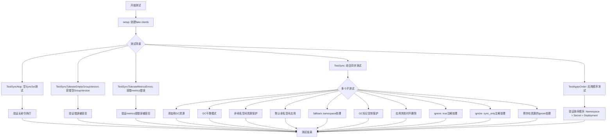

## 类结构

```
测试模块 (sync_test.go)
├── fakeClients() - 创建测试所需的fake clients
├── fakeApplier - 实现了Applier接口的fake实现
│   └── apply() - 应用changeset到dynamic client
├── groupVersionResource() - 工具函数: 获取资源的GVR
├── findAPIResource() - 工具函数: 查找API资源
├── setup() - 初始化测试环境
├── failingDiscoveryClient - 用于测试的错误discovery客户端
└── 测试用例集
    ├── TestSyncNop
    ├── TestSyncTolerateEmptyGroupVersion
    ├── TestSyncTolerateMetricsErrors
    ├── TestSync (多子测试)
    └── TestApplyOrder
```

## 全局变量及字段


### `defaultTestNamespace`
    
测试用默认命名空间常量

类型：`string`
    


### `debug`
    
调试标志常量(未启用)

类型：`bool`
    


### `fakeApplier.dynamicClient`
    
用于动态资源操作的客户端

类型：`dynamic.Interface`
    


### `fakeApplier.coreClient`
    
Kubernetes核心客户端

类型：`k8sclient.Interface`
    


### `fakeApplier.defaultNS`
    
默认命名空间

类型：`string`
    


### `fakeApplier.commandRun`
    
标记是否有命令执行

类型：`bool`
    


### `failingDiscoveryClient.DiscoveryInterface`
    
嵌入的discovery接口

类型：`discovery.DiscoveryInterface`
    


### `ExtendedClient.coreClient`
    
Core客户端

类型：`corev1.Clientset`
    


### `ExtendedClient.helmOperatorClient`
    
Helm操作客户端

类型：`helmop.Clientset`
    


### `ExtendedClient.dynamicClient`
    
动态客户端

类型：`dynamic.Interface`
    


### `ExtendedClient.discoveryClient`
    
发现客户端

类型：`discovery.CachedDiscoveryInterface`
    
    

## 全局函数及方法


### `fakeClients`

该函数用于在测试环境中创建并返回一组模拟的 Kubernetes 客户端（包含 Core、Helm Operator、Dynamic、CRD 和 Discovery 客户端），同时返回一个清理函数用于关闭 Discovery 客户端的缓存通道。

参数：

- 该函数无参数

返回值：

- `ExtendedClient`：包含所有模拟客户端的结构体
- `func()`：清理函数，用于关闭 shutdown channel

#### 流程图

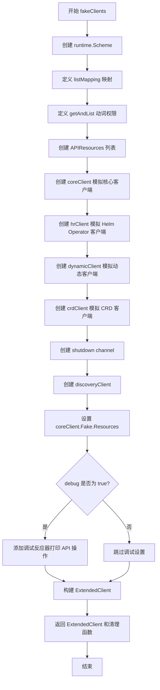

#### 带注释源码

```go
func fakeClients() (ExtendedClient, func()) {
	// 创建一个新的 runtime scheme，用于动态客户端的自定义资源类型管理
	scheme := runtime.NewScheme()
	
	// 定义 GroupVersionResource 到 List 类型的映射
	// 这里配置了 namespaces 和 deployments 两种资源的列表操作
	listMapping := map[schema.GroupVersionResource]string{
		{Group: "", Version: "v1", Resource: "namespaces"}:      "List",
		{Group: "apps", Version: "v1", Resource: "deployments"}: "List",
	}

	// 调试标志：设置为 true 将在测试运行时输出 API 操作的追踪信息
	const debug = false

	// 定义 API 资源的动词权限（get 和 list）
	getAndList := metav1.Verbs([]string{"get", "list"})
	
	// 配置 API 资源列表，使 fake 动态客户端能够发现和管理相关资源
	apiResources := []*metav1.APIResourceList{
		{
			GroupVersion: "apps/v1",
			APIResources: []metav1.APIResource{
				// 配置 deployments 资源：单数名为 deployment，属于命名空间资源，类型为 Deployment
				{Name: "deployments", SingularName: "deployment", Namespaced: true, Kind: "Deployment", Verbs: getAndList},
			},
		},
		{
			GroupVersion: "v1",
			APIResources: []metav1.APIResource{
				// 配置 namespaces 资源：单数名为 namespace，非命名空间资源，类型为 Namespace
				{Name: "namespaces", SingularName: "namespace", Namespaced: false, Kind: "Namespace", Verbs: getAndList},
			},
		},
	}

	// 创建 Core Client 模拟集，包含一个默认的测试命名空间
	coreClient := corefake.NewSimpleClientset(&corev1.Namespace{ObjectMeta: metav1.ObjectMeta{Name: defaultTestNamespace}})
	
	// 创建 Helm Operator Client 模拟集
	hrClient := helmopfake.NewSimpleClientset()
	
	// 创建 Dynamic Client 模拟集，使用自定义的 List 类型映射
	dynamicClient := dynamicfake.NewSimpleDynamicClientWithCustomListKinds(scheme, listMapping)
	
	// 创建 CRD Client 模拟集
	crdClient := crdfake.NewSimpleClientset()
	
	// 创建用于关闭的 channel
	shutdown := make(chan struct{})
	
	// 创建缓存的 Discovery Client
	discoveryClient := MakeCachedDiscovery(coreClient.Discovery(), crdClient, shutdown)

	// 将 API 资源列表赋值给 coreClient.Fake.Resources
	// 这一步至关重要，因为 discovery 客户端会使用它来枚举命名空间
	// 同时也被 getResourcesInStack 使用来获取命名空间信息
	coreClient.Fake.Resources = apiResources

	// 如果启用调试模式，为每个 fake 客户端添加反应器
	// 用于打印所有 API 操作的详细信息
	if debug {
		for _, fake := range []*k8s_testing.Fake{&coreClient.Fake, &hrClient.Fake, &dynamicClient.Fake} {
			fake.PrependReactor("*", "*", func(action k8s_testing.Action) (bool, runtime.Object, error) {
				gvr := action.GetResource()
				fmt.Printf("[DEBUG] action: %s ns:%s %s/%s %s\n", action.GetVerb(), action.GetNamespace(), gvr.Group, gvr.Version, gvr.Resource)
				return false, nil, nil
			})
		}
	}

	// 构建 ExtendedClient 结构体，包含所有模拟客户端
	ec := ExtendedClient{
		coreClient:         coreClient,
		helmOperatorClient: hrClient,
		dynamicClient:      dynamicClient,
		discoveryClient:    discoveryClient,
	}

	// 返回 ExtendedClient 和清理函数
	// 清理函数用于关闭 shutdown channel
	return ec, func() { close(shutdown) }
}
```


### `groupVersionResource`

该函数是一个工具函数，用于将 Kubernetes 的 Unstructured 对象转换为 GroupVersionResource（群组版本资源），通过提取对象的 Group、Version 并将 Kind 转换为小写复数形式来构建资源标识符。这是实现动态客户端操作资源的关键辅助函数，常用于在测试环境中模拟 Kubernetes API 调用的场景。

参数：

- `res`：`*unstructured.Unstructured`，待转换的 Kubernetes Unstructured 对象，包含原始的 JSON 格式资源定义

返回值：`schema.GroupVersionResource`，返回转换后的群组版本资源对象，包含资源的 Group、Version 和 Resource（复数形式的资源名）

#### 流程图

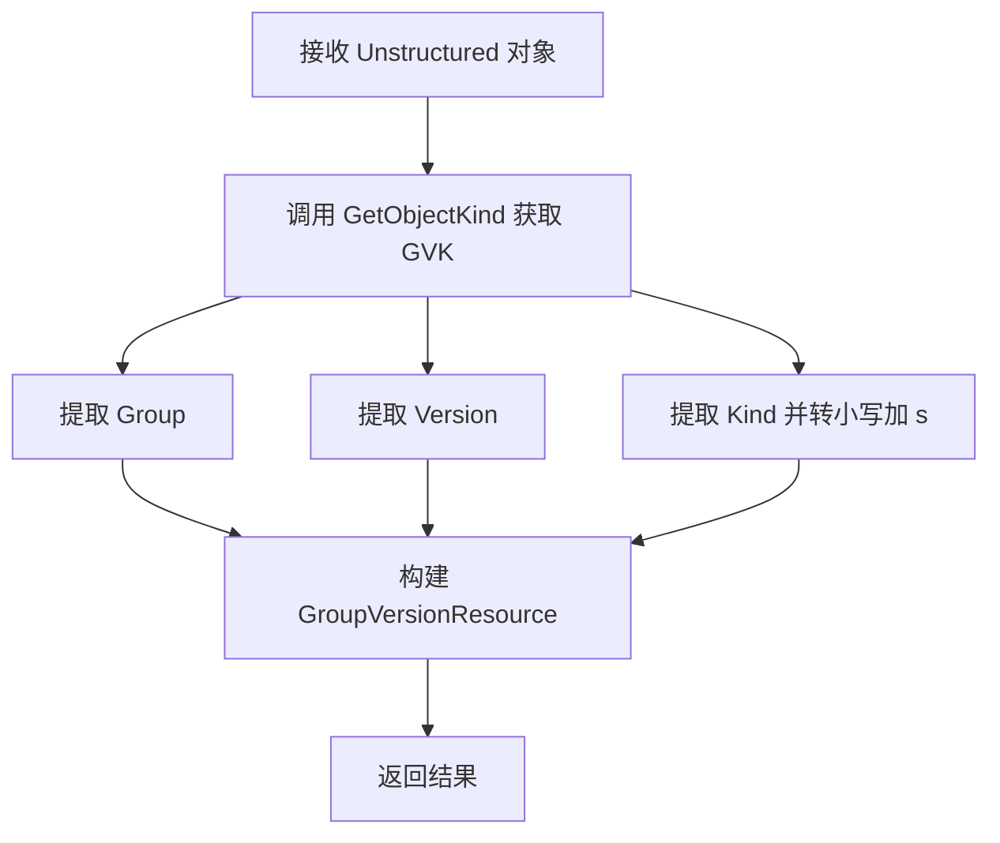

#### 带注释源码

```go
// groupVersionResource 将 unstructured 对象转换为 schema.GroupVersionResource
// 这是为了从资源对象中提取 API 的群组、版本和资源名称，以便通过动态客户端进行操作
func groupVersionResource(res *unstructured.Unstructured) schema.GroupVersionResource {
	// 获取对象的 GroupVersionKind (GVK)，这是 Kubernetes 资源的元数据标识
	gvk := res.GetObjectKind().GroupVersionKind()
	
	// 构建并返回 GroupVersionResource
	// Resource 字段通过对 Kind 进行小写处理并添加 "s" 后缀来生成复数形式
	// 例如: "Deployment" -> "deployments", "Namespace" -> "namespaces"
	return schema.GroupVersionResource{
		Group:    gvk.Group,     // API 群组，如 "apps"、"batch" 等，空字符串表示核心 API
		Version:  gvk.Version,   // API 版本，如 "v1"、"v1beta1" 等
		Resource: strings.ToLower(gvk.Kind) + "s", // 资源名的复数形式
	}
}
```

#### 关键组件信息

| 组件名称 | 一句话描述 |
|---------|-----------|
| `unstructured.Unstructured` | Kubernetes 动态客户端使用的通用资源对象，可处理任意 JSON 格式的 K8s 资源 |
| `schema.GroupVersionResource` | Kubernetes API 的资源标识结构，包含 Group、Version、Resource 三个维度 |
| `fakeApplier` | 测试用的资源应用器实现，模拟 Kubernetes 动态客户端的行为 |

#### 潜在的技术债务或优化空间

1. **Resource 命名规则硬编码**：当前通过简单的 `strings.ToLower(kind) + "s"` 规则生成资源名，这种命名约定并不总是准确。部分 Kubernetes 资源的复数形式不规则（如 `Deployment` -> `deployments` 正确，但 `Service` -> `services` 正确），但代码未考虑不规则复数情况。

2. **缺乏错误处理**：函数未对 `res` 为 nil 或 `gvk` 为空的情况进行校验，可能导致 panic。

3. **测试覆盖不足**：该函数在多个测试用例中被调用（如 `TestSync` 中），但没有针对其本身独立功能的单元测试。

#### 其它项目

- **设计目标**：该函数的目的是在测试环境中，为动态客户端提供正确的 GVR 以执行资源的 CRUD 操作，是连接资源定义与 API 客户端的桥梁。

- **约束条件**：依赖于 Kubernetes 的资源命名约定（Kind 的小写复数形式），不适用于所有资源类型。

- **错误处理**：当前实现不返回错误，调用方需自行确保传入的 Unstructured 对象具有有效的 GVK 信息。

- **外部依赖**：
  - `k8s.io/apimachinery/pkg/apis/meta/v1/unstructured`：提供 Unstructured 对象定义
  - `k8s.io/apimachinery/pkg/runtime/schema`：提供 GVR 数据结构


### `fakeApplier.apply`

该方法实现了 `Applier` 接口，负责将资源变更集（包含待应用和待删除的资源）同步到 Kubernetes 集群。对于应用操作，它会检查资源是否已存在并决定创建或更新；对于删除操作则直接删除资源。同时处理了 Namespace 资源的特殊同步需求（因为动态客户端和核心客户端不共享资源），并支持通过注解模拟失败场景。

参数：

- `_ log.Logger`：日志记录器（当前未使用）
- `cs changeSet`：变更集，包含按操作类型分组的目标资源对象
- `errored map[resource.ID]error`：记录已在前序步骤中失败的资源 ID 到错误的映射

返回值：`cluster.SyncError`，即 `[]cluster.ResourceError`，返回在同步过程中发生的所有错误，若无错误则返回 `nil`

#### 流程图

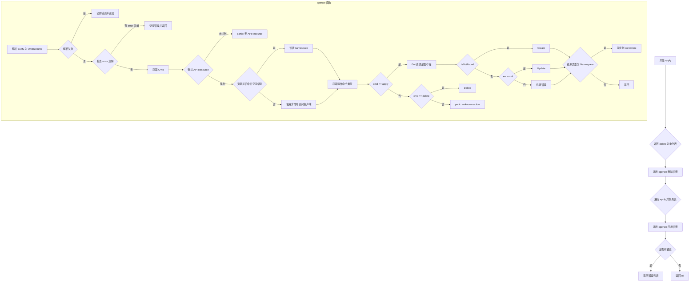

#### 带注释源码

```go
// apply 是 fakeApplier 实现了 Applier 接口的核心方法
// 参数说明：
//   - _ log.Logger: 日志记录器参数，当前实现中未使用
//   - cs changeSet: 变更集，包含 "delete" 和 "apply" 两个键，每个键对应一个 applyObject 切片
//   - errored map[resource.ID]error: 记录已在之前步骤中失败的资源错误映射
// 返回值：
//   - cluster.SyncError: []cluster.ResourceError 类型的别名，包含所有同步失败的资源错误
func (a fakeApplier) apply(_ log.Logger, cs changeSet, errored map[resource.ID]error) cluster.SyncError {
	var errs []cluster.ResourceError

	// operate 是一个内部函数，负责单个资源的应用或删除操作
	// 参数说明：
	//   - obj applyObject: 包含资源 ID、源和 YAML payload 的结构体
	//   - cmd string: 操作命令，"apply" 或 "delete"
	operate := func(obj applyObject, cmd string) {
		// 标记已执行过命令，用于测试验证
		a.commandRun = true
		
		// 将 YAML payload 反序列化为 map[string]interface{}
		var unstruct map[string]interface{}
		if err := yaml.Unmarshal(obj.Payload, &unstruct); err != nil {
			errs = append(errs, cluster.ResourceError{obj.ResourceID, obj.Source, err})
			return
		}
		// 创建 Unstructured 对象
		res := &unstructured.Unstructured{Object: unstruct}

		// 这是一个特殊的测试用 "后门"，用于测试资源应用失败的情况
		// 通过资源的 annotations["error"] 注解可以模拟任意错误
		if errStr := res.GetAnnotations()["error"]; errStr != "" {
			errs = append(errs, cluster.ResourceError{obj.ResourceID, obj.Source, fmt.Errorf(errStr)})
			return
		}

		// 从 Unstructured 对象获取 GroupVersionKind 并转换为 GroupVersionResource
		gvr := groupVersionResource(res)
		// 获取该 GVR 对应的动态客户端资源接口
		c := a.dynamicClient.Resource(gvr)
		
		// 这是对 kubectl 行为的近似模拟：处理 fallback namespace（来自配置）
		// 对于非命名空间级别的实体，此设置会被 fake client 忽略（需确认）
		// 查找 API Resource 以确定是否需要命名空间
		apiRes := findAPIResource(gvr, a.coreClient.Discovery())
		if apiRes == nil {
			panic("no APIResource found for " + gvr.String())
		}

		var dc dynamic.ResourceInterface = c
		ns := res.GetNamespace()
		// 如果是命名空间级别的资源且未指定命名空间，使用默认命名空间
		if apiRes.Namespaced {
			if ns == "" {
				ns = a.defaultNS
				res.SetNamespace(ns)
			}
			dc = c.Namespace(ns)
		}
		name := res.GetName()

		// ========== 处理 apply 操作 ==========
		if cmd == "apply" {
			// 先尝试获取资源，检查是否已存在
			_, err := dc.Get(context.TODO(), name, metav1.GetOptions{})
			switch {
			case errors.IsNotFound(err):
				// 资源不存在，执行创建
				_, err = dc.Create(context.TODO(), res, metav1.CreateOptions{})
			case err == nil:
				// 资源已存在，执行更新
				_, err = dc.Update(context.TODO(), res, metav1.UpdateOptions{})
			}
			if err != nil {
				errs = append(errs, cluster.ResourceError{obj.ResourceID, obj.Source, err})
				return
			}
			
			// 特殊处理：Namespace 类型资源还需要同步到 core client
			// 因为 dynamic client 和 core client 之间不共享资源
			if res.GetKind() == "Namespace" {
				var ns corev1.Namespace
				if err := runtime.DefaultUnstructuredConverter.FromUnstructured(unstruct, &ns); err != nil {
					errs = append(errs, cluster.ResourceError{obj.ResourceID, obj.Source, err})
					return
				}
				_, err := a.coreClient.CoreV1().Namespaces().Get(context.TODO(), ns.Name, metav1.GetOptions{})
				switch {
				case errors.IsNotFound(err):
					_, err = a.coreClient.CoreV1().Namespaces().Create(context.TODO(), &ns, metav1.CreateOptions{})
				case err == nil:
					_, err = a.coreClient.CoreV1().Namespaces().Update(context.TODO(), &ns, metav1.UpdateOptions{})
				}
				if err != nil {
					errs = append(errs, cluster.ResourceError{obj.ResourceID, obj.Source, err})
					return
				}
			}

		// ========== 处理 delete 操作 ==========
		} else if cmd == "delete" {
			if err := dc.Delete(context.TODO(), name, metav1.DeleteOptions{}); err != nil {
				errs = append(errs, cluster.ResourceError{obj.ResourceID, obj.Source, err})
				return
			}
			// 同样需要同步删除 core client 中的 Namespace 资源
			if res.GetKind() == "Namespace" {
				if err := a.coreClient.CoreV1().Namespaces().Delete(context.TODO(), res.GetName(), metav1.DeleteOptions{}); err != nil {
					errs = append(errs, cluster.ResourceError{obj.ResourceID, obj.Source, err})
					return
				}
			}
		} else {
			// 未知操作命令，触发 panic
			panic("unknown action: " + cmd)
		}
	}

	// 先处理删除操作，再处理应用操作
	for _, obj := range cs.objs["delete"] {
		operate(obj, "delete")
	}
	for _, obj := range cs.objs["apply"] {
		operate(obj, "apply")
	}
	
	// 如果没有错误返回 nil，否则返回错误列表
	if len(errs) == 0 {
		return nil
	}
	return errs
}
```


### `findAPIResource`

从 Kubernetes Discovery 服务中查找指定 API 资源的详细信息，用于判断资源是否为命名空间级别以及获取其他元数据。

参数：

- `gvr`：`schema.GroupVersionResource`，Kubernetes 资源的目标组版本资源标识，包含了 Group、Version 和 Resource 三个维度信息
- `disco`：`discovery.DiscoveryInterface`，Kubernetes Discovery 客户端接口，用于查询 API 服务器支持的资源列表

返回值：`*metav1.APIResource`，返回匹配的 API 资源对象指针，包含资源的名称、是否命名空间级别、动词等信息；若未找到或发生错误则返回 `nil`

#### 流程图

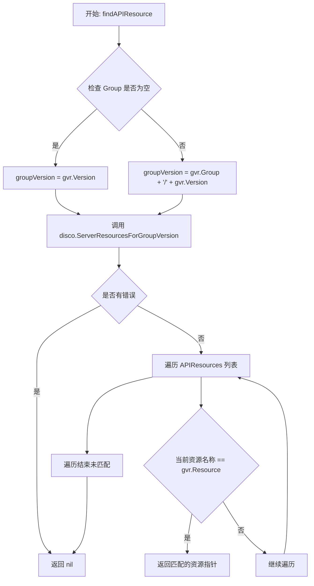

#### 带注释源码

```go
// findAPIResource 通过 Discovery 接口查找指定 GVR 对应的 API 资源信息
// 参数 gvr: 目标资源的 GroupVersionResource 标识
// 参数 disco: Kubernetes Discovery 客户端，用于查询服务器端支持的 API 资源
// 返回值: 找到的 APIResource 指针，未找到或出错时返回 nil
func findAPIResource(gvr schema.GroupVersionResource, disco discovery.DiscoveryInterface) *metav1.APIResource {
	// 初始化 groupVersion，先设置为 Version
	groupVersion := gvr.Version
	// 如果存在 Group，则拼接为 "group/version" 格式（如 "apps/v1"）
	if gvr.Group != "" {
		groupVersion = gvr.Group + "/" + groupVersion
	}
	
	// 调用 Discovery 接口获取指定组版本下的所有 API 资源列表
	reses, err := disco.ServerResourcesForGroupVersion(groupVersion)
	// 如果获取失败（如 API 组不存在），直接返回 nil
	if err != nil {
		return nil
	}
	
	// 遍历返回的 APIResources 列表，查找名称匹配的资源
	for _, res := range reses.APIResources {
		// 比较资源名称是否与请求的 Resource 一致
		if res.Name == gvr.Resource {
			// 找到后返回该 APIResource 的指针
			return &res
		}
	}
	
	// 遍历完成未找到匹配资源，返回 nil
	return nil
}
```


### `setup`

该函数用于初始化测试环境，创建一个用于测试 Kubernetes 集群同步功能的 Cluster 实例和 fakeApplier。

参数：

- `t`：`testing.T`，Go 测试框架中的测试对象指针，用于报告测试失败

返回值：

- `*Cluster`：配置好的 Cluster 实例，用于执行同步操作
- `*fakeApplier`：模拟的 Applier，用于验证同步操作的结果
- `func()`：清理函数，用于关闭测试环境资源

#### 流程图

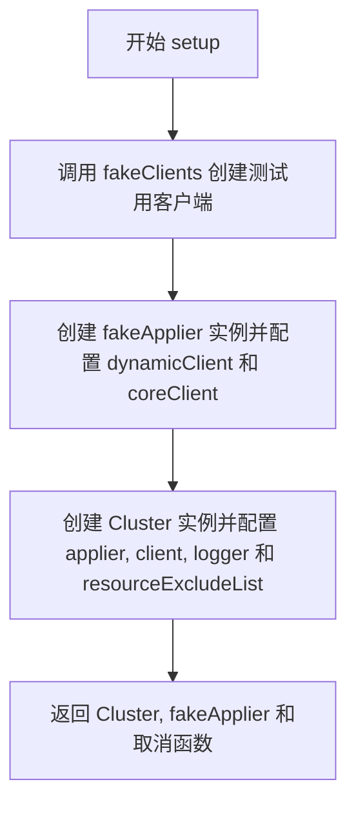

#### 带注释源码

```go
// setup 初始化测试环境，创建 Cluster 和 fakeApplier 用于测试
// 参数 t: testing.T 测试框架对象
// 返回: Cluster实例、fakeApplier实例、清理函数
func setup(t *testing.T) (*Cluster, *fakeApplier, func()) {
	// 调用 fakeClients 获取一组模拟的 Kubernetes 客户端
	clients, cancel := fakeClients()
	
	// 创建 fakeApplier，使用动态客户端和核心客户端
	// fakeApplier 不会真正执行复杂的 patch 逻辑，仅用于验证同步操作是否成功
	applier := &fakeApplier{
		dynamicClient: clients.dynamicClient,
		coreClient:    clients.coreClient,
		defaultNS:     defaultTestNamespace,
	}
	
	// 初始化 Cluster 实例，配置资源排除列表
	// 排除 metrics 和 webhook certmanager 相关的资源
	kube := &Cluster{
		applier:             applier,
		client:              clients,
		logger:              log.NewLogfmtLogger(os.Stdout),
		resourceExcludeList: []string{"*metrics.k8s.io/*", "webhook.certmanager.k8s.io/v1beta1/*"},
	}
	
	// 返回创建的实例和清理函数
	return kube, applier, cancel
}
```


### `TestSyncNop`

该函数是Flux集群同步模块的单元测试，用于验证当传入空的SyncSet时，集群不同步任何资源，且不执行任何命令。

参数：

- `t`：`*testing.T`，Go语言testing框架的测试用例指针，用于报告测试失败

返回值：无（`void`），该函数为测试函数，通过`testing.T`的方法报告错误

#### 流程图

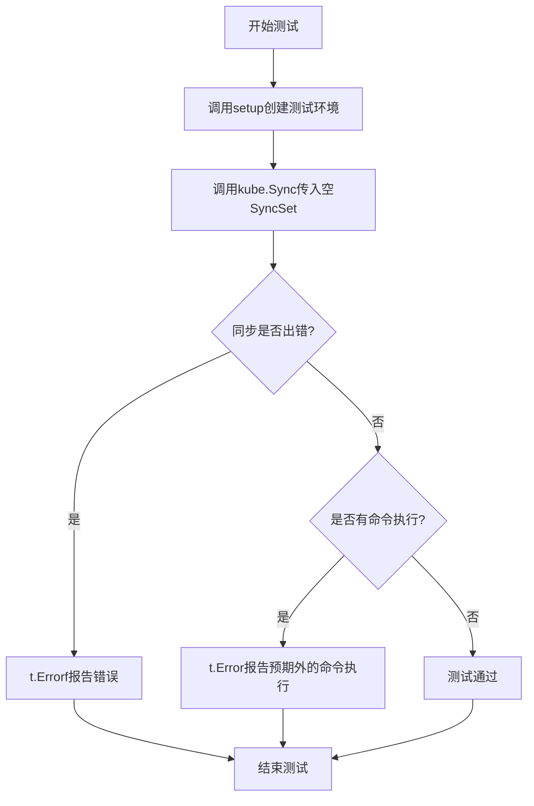

#### 带注释源码

```go
// TestSyncNop 测试空SyncSet不同步任何资源
// 验证当SyncSet为空时，Sync方法不应执行任何创建、更新或删除操作
func TestSyncNop(t *testing.T) {
	// 1. 设置测试环境，获取Cluster实例、fakeApplier模拟对象和取消函数
	kube, mock, cancel := setup(t)
	
	// 2. 确保测试结束后清理资源
	defer cancel()
	
	// 3. 调用Sync方法，传入空的SyncSet{}
	// 预期行为：不执行任何同步操作
	if err := kube.Sync(cluster.SyncSet{}); err != nil {
		// 如果同步返回错误，报告测试失败
		t.Errorf("%#v", err)
	}
	
	// 4. 验证fakeApplier没有执行任何命令
	// commandRun标志应在空SyncSet情况下保持为false
	if mock.commandRun {
		t.Error("expected no commands run")
	}
}
```


### `TestSyncTolerateEmptyGroupVersion`

该测试函数用于验证系统能够容错处理空GroupVersion（没有API资源的GroupVersion）的情况。当Kubernetes集群中存在一个没有定义任何API资源的GroupVersion时，Sync操作应该能够正常完成而不报错。

参数：

- `t`：`testing.T`，Go语言的测试框架参数，用于报告测试状态和失败信息

返回值：无返回值（`void`），该函数为测试函数，使用`t`参数和`assert`包来验证行为

#### 流程图

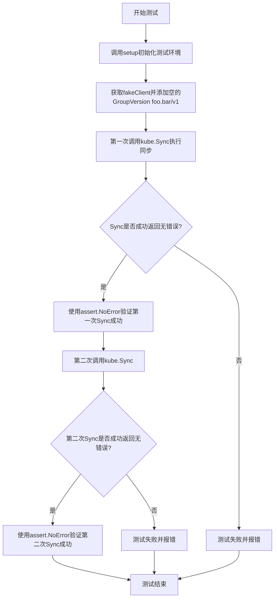

#### 带注释源码

```go
// TestSyncTolerateEmptyGroupVersion 测试在空GroupVersion情况下的容错能力
// 该测试验证当Discovery缓存遇到没有API资源的GroupVersion时不会崩溃
func TestSyncTolerateEmptyGroupVersion(t *testing.T) {
	// 1. 初始化测试环境,获取Cluster实例和清理函数
	kube, _, cancel := setup(t)
	// 2. 使用defer确保测试结束后清理资源
	defer cancel()

	// 3. 获取fake客户端并添加一个没有API资源的GroupVersion
	// 这模拟了Kubernetes API中存在一个GroupVersion但没有任何资源定义的情况
	fakeClient := kube.client.coreClient.(*corefake.Clientset)
	// 4. 向fakeClient添加空的GroupVersion "foo.bar/v1"
	// 该GroupVersion没有任何API资源定义
	fakeClient.Resources = append(fakeClient.Resources, &metav1.APIResourceList{GroupVersion: "foo.bar/v1"})

	// 5. 第一次调用Sync,测试系统是否能容忍空GroupVersion导致的错误
	// 期望: 由于缓存容错机制,Sync应该成功返回而不报错
	err := kube.Sync(cluster.SyncSet{})
	assert.NoError(t, err)

	// 6. 第二次调用Sync,确保重复执行同步时也不会出错
	// 这验证了缓存不会因为之前的空GroupVersion而产生副作用
	err = kube.Sync(cluster.SyncSet{})
	assert.NoError(t, err)
}
```

#### 背景说明

该测试主要验证以下场景：
- 当Kubernetes API Server中存在一个GroupVersion（如`foo.bar/v1`），但该GroupVersion下没有任何API资源定义时
- 系统的Discovery缓存机制能够正确处理这种情况，不会因为找不到资源而抛出错误
- 第一次和后续的Sync操作都能正常工作，不受空GroupVersion的影响

这种容错能力对于处理不断变化的Kubernetes API和第三方自定义资源（CRD）非常重要，因为集群中可能存在临时性的或部分配置的API Group。


### `TestSyncTolerateMetricsErrors`

该测试函数用于验证 Flux 在同步 Kubernetes 资源时，能够容错处理 metrics 相关 API 组的错误。当发现非 metrics 组的资源获取失败时，同步应返回错误；但对于 metrics.k8s.io 和 certmanager.k8s.io 这类特定的 API 组，即使 discovery 失败也应被容错处理。

参数：

- `t`：`testing.T`，Go 标准测试框架中的测试实例指针，用于报告测试失败和状态

返回值：无（`void`），该函数直接通过 `testing.T` 的断言方法验证行为

#### 流程图

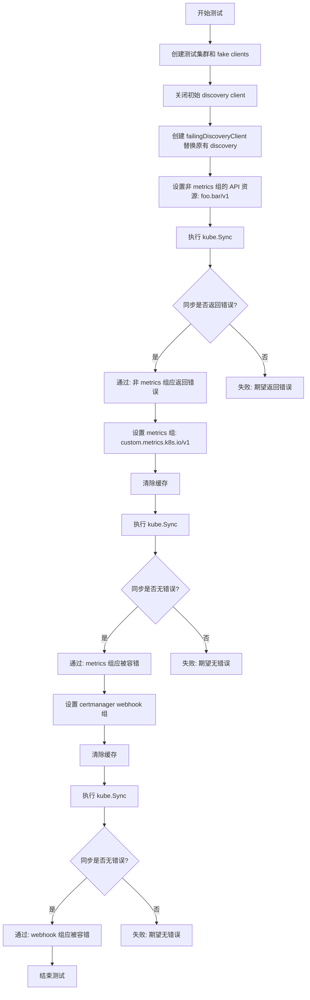

#### 带注释源码

```go
// TestSyncTolerateMetricsErrors 测试 Flux 是否能容错处理 metrics 相关的 discovery 错误
// 该测试验证了 Sync 方法对特定 API 组的容错能力：
// 1. 非 metrics 组失败时应返回错误
// 2. metrics.k8s.io 组失败时应被容错
// 3. certmanager webhook 组失败时应被容错
func TestSyncTolerateMetricsErrors(t *testing.T) {
	// 1. 初始化测试环境：创建 Cluster 和 fake clients
	kube, _, cancel := setup(t)

	// 2. 替换 discovery client 为一个总是返回错误的客户端
	//    这样可以模拟 discover API 不可用的情况
	cancel()
	crdClient := crdfake.NewSimpleClientset()
	shutdown := make(chan struct{})
	defer close(shutdown)
	// failingDiscoveryClient 会始终返回 ServiceUnavailable 错误
	newDiscoveryClient := &failingDiscoveryClient{kube.client.coreClient.Discovery()}
	kube.client.discoveryClient = MakeCachedDiscovery(newDiscoveryClient, crdClient, shutdown)

	// 3. 测试场景一：非 metrics 组的资源应该导致同步失败
	//    设置一个任意的非 metrics API 组
	fakeClient := kube.client.coreClient.(*corefake.Clientset)
	fakeClient.Resources = []*metav1.APIResourceList{{GroupVersion: "foo.bar/v1"}}
	err := kube.Sync(cluster.SyncSet{})
	// 验证同步返回错误（因为这不是 metrics 相关的组）
	assert.Error(t, err)

	// 4. 测试场景二：metrics 组的资源应该被容错处理
	//    清除 discovery 缓存，强制重新发现资源
	kube.client.discoveryClient.(*cachedDiscovery).CachedDiscoveryInterface.Invalidate()
	// 设置为 metrics.k8s.io 组
	fakeClient.Resources = []*metav1.APIResourceList{{GroupVersion: "custom.metrics.k8s.io/v1"}}
	err = kube.Sync(cluster.SyncSet{})
	// 验证同步成功（metrics 组应被容错）
	assert.NoError(t, err)

	// 5. 测试场景三：certmanager webhook 组也应该被容错处理
	kube.client.discoveryClient.(*cachedDiscovery).CachedDiscoveryInterface.Invalidate()
	fakeClient.Resources = []*metav1.APIResourceList{{GroupVersion: "webhook.certmanager.k8s.io/v1beta1"}}
	err = kube.Sync(cluster.SyncSet{})
	// 验证同步成功（certmanager webhook 组应被容错）
	assert.NoError(t, err)
}
```


### `TestSync`

综合同步功能测试，包含12个子测试用例，涵盖资源同步、垃圾回收（GC）、默认命名空间应用、资源删除保护、忽略注解处理等多种场景的测试验证。

参数：

- `t`：`*testing.T`，Go标准测试框架的测试上下文对象，用于报告测试状态和失败信息

返回值：无（`void`），该函数为测试函数，通过`testing.T`报告测试结果

#### 流程图

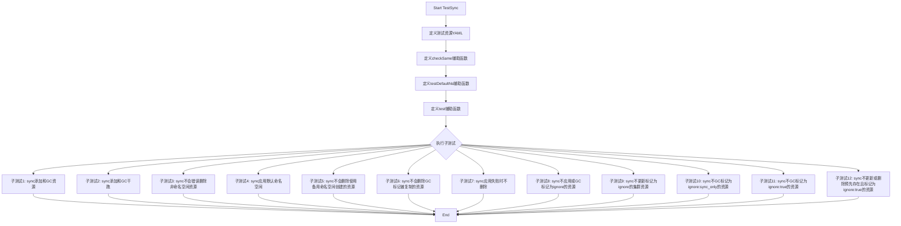

#### 带注释源码

```go
// TestSync 综合同步功能测试，包含12个子测试用例
// 测试涵盖：资源同步、垃圾回收、干跑模式、命名空间处理、删除保护、忽略注解等场景
func TestSync(t *testing.T) {
	// 定义测试用的Namespace资源YAML（foobarsecret命名空间）
	const ns1 = `---
apiVersion: v1
kind: Namespace
metadata:
  name: foobar
`

	// 定义测试用的Deployment资源YAML（位于foobar命名空间，名称dep1）
	const defs1 = `---
apiVersion: apps/v1
kind: Deployment
metadata:
  name: dep1
  namespace: foobar
`

	// 定义测试用的第二个Deployment资源YAML（位于foobar命名空间，名称dep2）
	const defs2 = `---
apiVersion: apps/v1
kind: Deployment
metadata:
  name: dep2
  namespace: foobar
`

	// 定义另一个测试用的Namespace资源YAML（other命名空间）
	const ns3 = `---
apiVersion: v1
kind: Namespace
metadata:
  name: other
`

	// 定义测试用的Deployment资源YAML（位于other命名空间，名称dep3）
	const defs3 = `---
apiVersion: v1
kind: Deployment
metadata:
  name: dep3
  namespace: other
`

	// checkSame是一个辅助函数，用于验证集群返回的资源与预期资源是否相同
	// 同步过程可能会修改labels和annotations，这里通过比较spec字段来判断资源是否等价
	checkSame := func(t *testing.T, expected []byte, actual *unstructured.Unstructured) {
		var expectedSpec struct{ Spec map[string]interface{} }
		if err := yaml.Unmarshal(expected, &expectedSpec); err != nil {
			t.Error(err)
			return
		}
		if expectedSpec.Spec != nil {
			assert.Equal(t, expectedSpec.Spec, actual.Object["spec"])
		}
	}

	// testDefaultNs是带默认命名空间配置的测试辅助函数
	// 参数包括：测试实例、Kube资源定义、期望的同步后状态、是否期望错误、默认命名空间
	testDefaultNs := func(t *testing.T, kube *Cluster, defs, expectedAfterSync string, expectErrors bool, defaultNamespace string) {
		// 保存原始的getKubeconfigDefaultNamespace函数指针
		saved := getKubeconfigDefaultNamespace
		// 临时替换为返回测试默认命名空间的函数
		getKubeconfigDefaultNamespace = func() (string, error) { return defaultTestNamespace, nil }
		defer func() { getKubeconfigDefaultNamespace = saved }()
		
		// 创建Namespacer用于处理命名空间
		namespacer, err := NewNamespacer(kube.client.coreClient.Discovery(), defaultNamespace)
		if err != nil {
			t.Fatal(err)
		}
		// 创建Manifests实例用于解析和管理资源清单
		manifests := NewManifests(namespacer, log.NewLogfmtLogger(os.Stdout))

		// 解析多文档YAML为KubeManifest资源列表
		resources0, err := kresource.ParseMultidoc([]byte(defs), "before")
		if err != nil {
			t.Fatal(err)
		}

		// 将KubeManifest转换为resource.Resource并设置有效的命名空间
		resources, err := manifests.setEffectiveNamespaces(resources0)
		if err != nil {
			t.Fatal(err)
		}
		
		// 将资源列表转换为以资源ID为键的map
		resourcesByID := map[string]resource.Resource{}
		for _, r := range resources {
			resourcesByID[r.ResourceID().String()] = r
		}
		
		// 执行同步操作，将资源同步到集群
		err = sync.Sync("testset", resourcesByID, kube)
		if !expectErrors && err != nil {
			t.Error(err)
		}
		
		// 解析期望的同步后资源状态
		expected, err := kresource.ParseMultidoc([]byte(expectedAfterSync), "after")
		if err != nil {
			panic(err)
		}

		// 获取同步集中的允许GC标记的资源
		actual, err := kube.getAllowedGCMarkedResourcesInSyncSet("testset")
		if err != nil {
			t.Fatal(err)
		}

		// 遍历实际存在的资源，检查是否都在预期中
		for id := range actual {
			if _, ok := expected[id]; !ok {
				t.Errorf("resource present after sync but not in resources applied: %q (present: %v)", id, actual)
				if j, err := yaml.Marshal(actual[id].obj); err == nil {
					println(string(j))
				}
				continue
			}
			// 比较spec字段验证资源是否一致
			checkSame(t, expected[id].Bytes(), actual[id].obj)
		}
		// 遍历预期资源，检查是否都成功同步
		for id := range expected {
			if _, ok := actual[id]; !ok {
				t.Errorf("resource supposed to be synced but not present: %q (present: %v)", id, actual)
			}
		}
	}
	
	// test是简化的测试辅助函数，使用空默认命名空间
	test := func(t *testing.T, kube *Cluster, defs, expectedAfterSync string, expectErrors bool) {
		testDefaultNs(t, kube, defs, expectedAfterSync, expectErrors, "")
	}

	// 子测试1：测试同步添加资源和垃圾回收功能
	t.Run("sync adds and GCs resources", func(t *testing.T) {
		kube, _, cancel := setup(t)
		defer cancel()

		// 关闭GC时，资源不会因未包含在后续同步中而被删除
		test(t, kube, "", "", false)
		test(t, kube, ns1+defs1, ns1+defs1, false)
		test(t, kube, ns1+defs1+defs2, ns1+defs1+defs2, false)
		test(t, kube, ns3+defs3, ns1+defs1+defs2+ns3+defs3, false)

		// 开启GC后，不包含在同步中的资源将被删除
		kube.GC = true
		test(t, kube, ns1+defs2+ns3+defs3, ns1+defs2+ns3+defs3, false)
		test(t, kube, ns1+defs1+defs2, ns1+defs1+defs2, false)
		test(t, kube, "", "", false)
	})

	// 子测试2：测试同步添加资源和GC干跑模式（只记录不实际删除）
	t.Run("sync adds and GCs dry run", func(t *testing.T) {
		kube, _, cancel := setup(t)
		defer cancel()

		// 关闭GC时，资源持久化
		test(t, kube, "", "", false)
		test(t, kube, ns1+defs1, ns1+defs1, false)
		test(t, kube, ns1+defs1+defs2, ns1+defs1+defs2, false)
		test(t, kube, ns3+defs3, ns1+defs1+defs2+ns3+defs3, false)

		// 开启DryGC后，垃圾回收程序运行但只记录日志不实际删除资源
		kube.DryGC = true
		test(t, kube, ns1+defs2+ns3+defs3, ns1+defs1+defs2+ns3+defs3, false)
		test(t, kube, ns1+defs1+defs2, ns1+defs1+defs2+ns3+defs3, false)
		test(t, kube, "", ns1+defs1+defs2+ns3+defs3, false)
	})

	// 子测试3：测试同步不会错误删除非命名空间资源（如Namespace）
	t.Run("sync won't incorrectly delete non-namespaced resources", func(t *testing.T) {
		kube, _, cancel := setup(t)
		defer cancel()
		kube.GC = true

		const nsDef = `
apiVersion: v1
kind: Namespace
metadata:
  name: bar-ns
`
		test(t, kube, nsDef, nsDef, false)
	})

	// 子测试4：测试同步应用默认命名空间
	t.Run("sync applies default namespace", func(t *testing.T) {
		kube, _, cancel := setup(t)
		defer cancel()
		kube.GC = true

		// 未指定命名空间的Deployment定义
		const depDef = `
apiVersion: apps/v1
kind: Deployment
metadata:
  name: bar
`
		// 期望同步后自动添加命名空间
		const depDefNamespaced = `
apiVersion: apps/v1
kind: Deployment
metadata:
  name: bar
  namespace: system
`
		// 已有命名空间的Deployment定义（不应被覆盖）
		const depDefAlreadyNamespaced = `
apiVersion: apps/v1
kind: Deployment
metadata:
  name: bar
  namespace: other
`
		// Namespace定义
		const ns1 = `---
apiVersion: v1
kind: Namespace
metadata:
  name: foobar
`
		defaultNs := "system"
		// 测试无命名空间的资源会被应用默认命名空间
		testDefaultNs(t, kube, depDef, depDefNamespaced, false, defaultNs)
		// 测试已有命名空间的资源保持原命名空间
		testDefaultNs(t, kube, depDefAlreadyNamespaced, depDefAlreadyNamespaced, false, defaultNs)
		// 测试Namespace资源不受默认命名空间影响
		testDefaultNs(t, kube, ns1, ns1, false, defaultNs)
	})

	// 子测试5：测试同步不会删除使用备用命名空间创建的资源
	t.Run("sync won't delete resources that got the fallback namespace when created", func(t *testing.T) {
		// 此测试也部分验证fake客户端实现
		// 依赖fake客户端反映kubectl行为：为需要命名空间的资源提供备用命名空间
		kube, _, cancel := setup(t)
		defer cancel()
		kube.GC = true
		
		// 未指定命名空间的Deployment
		const withoutNS = `
apiVersion: apps/v1
kind: Deployment
metadata:
  name: depFallbackNS
`
		// 期望同步后使用默认测试命名空间
		const withNS = `
apiVersion: apps/v1
kind: Deployment
metadata:
  name: depFallbackNS
  namespace: ` + defaultTestNamespace + `
`
		test(t, kube, withoutNS, withNS, false)
	})

	// 子测试6：测试同步不会删除GC标记被复制到其他资源的原资源
	t.Run("sync won't delete resources whose garbage collection mark was copied to", func(t *testing.T) {
		kube, _, cancel := setup(t)
		defer cancel()
		kube.GC = true

		depName := "dep"
		depNS := "foobar"
		// 定义Deployment资源
		dep := fmt.Sprintf(`---
apiVersion: apps/v1
kind: Deployment
metadata:
  name: %s
  namespace: %s
`, depName, depNS)

		// 第一次同步创建dep
		test(t, kube, ns1+dep, ns1+dep, false)

		// 手动创建dep的副本（包括GC标记标签）
		gvr := schema.GroupVersionResource{
			Group:    "apps",
			Version:  "v1",
			Resource: "deployments",
		}
		client := kube.client.dynamicClient.Resource(gvr).Namespace(depNS)
		depActual, err := client.Get(context.TODO(), depName, metav1.GetOptions{})
		assert.NoError(t, err)
		depCopy := depActual.DeepCopy()
		depCopyName := depName + "copy"
		depCopy.SetName(depCopyName)
		depCopyActual, err := client.Create(context.TODO(), depCopy, metav1.CreateOptions{})
		assert.NoError(t, err)

		// 验证原资源和副本都有相同的GC标记标签
		assert.Equal(t, depActual.GetName()+"copy", depCopyActual.GetName())
		assert.NotEmpty(t, depActual.GetLabels()[gcMarkLabel])
		assert.Equal(t, depActual.GetLabels()[gcMarkLabel], depCopyActual.GetLabels()[gcMarkLabel])

		// 第二次同步不包含任何资源（应触发GC）
		test(t, kube, "", "", false)

		// 验证原dep被删除但副本保留（因名称不同）
		_, err = client.Get(context.TODO(), depName, metav1.GetOptions{})
		assert.Error(t, err)
		_, err = client.Get(context.TODO(), depCopyName, metav1.GetOptions{})
		assert.NoError(t, err)
	})

	// 子测试7：测试同步在应用失败时不删除资源
	t.Run("sync won't delete if apply failed", func(t *testing.T) {
		kube, _, cancel := setup(t)
		defer cancel()
		kube.GC = true

		// 带有error注解的无效Deployment定义
		const defs1invalid = `---
apiVersion: apps/v1
kind: Deployment
metadata:
  namespace: foobar
  name: dep1
  annotations:
    error: fail to apply this
`
		// 第一次同步创建有效资源
		test(t, kube, ns1+defs1, ns1+defs1, false)
		// 第二次同步尝试创建无效资源，应返回错误但保留原资源
		test(t, kube, ns1+defs1invalid, ns1+defs1invalid, true)
	})

	// 子测试8：测试同步不应用或GC标记为ignore:'true'的清单
	t.Run("sync doesn't apply or GC manifests marked with ignore: 'true'", func(t *testing.T) {
		kube, _, cancel := setup(t)
		defer cancel()
		kube.GC = true

		// 正常Deployment
		const dep1 = `---
apiVersion: apps/v1
kind: Deployment
metadata:
  namespace: foobar
  name: dep1
spec:
  metadata:
    labels: {app: foo}
`

		// 带有ignore注解的Deployment
		const dep2 = `---
apiVersion: apps/v1
kind: Deployment
metadata:
  namespace: foobar
  name: dep2
  annotations: {flux.weave.works/ignore: "true"}
`

		// dep1被创建，dep2被忽略
		test(t, kube, ns1+dep1+dep2, ns1+dep1, false)

		// 将dep1标记为ignore
		const dep1ignored = `---
apiVersion: apps/v1
kind: Deployment
metadata:
  namespace: foobar
  name: dep1
  annotations:
    flux.weave.works/ignore: "true"
spec:
  metadata:
    labels: {app: bar}
`
		// dep1既不更新也不被删除
		test(t, kube, ns1+dep1ignored+dep2, ns1+dep1, false)
	})

	// 子测试9：测试同步不更新集群中已标记为ignore:'true'的资源
	t.Run("sync doesn't update a cluster resource marked with ignore: 'true'", func(t *testing.T) {
		const dep1 = `---
apiVersion: apps/v1
kind: Deployment
metadata:
  namespace: foobar
  name: dep1
spec:
  metadata:
    labels:
      app: original
`
		kube, _, cancel := setup(t)
		defer cancel()
		// 验证初始状态：dep1存在于集群
		test(t, kube, ns1+dep1, ns1+dep1, false)

		// 在集群中手动标记dep1为ignore（模拟kubectl annotate）
		dc := kube.client.dynamicClient
		rc := dc.Resource(schema.GroupVersionResource{
			Group:    "apps",
			Version:  "v1",
			Resource: "deployments",
		})
		res, err := rc.Namespace("foobar").Get(context.TODO(), "dep1", metav1.GetOptions{})
		if err != nil {
			t.Fatal(err)
		}
		annots := res.GetAnnotations()
		annots["flux.weave.works/ignore"] = "true"
		res.SetAnnotations(annots)
		if _, err = rc.Namespace("foobar").Update(context.TODO(), res, metav1.UpdateOptions{}); err != nil {
			t.Fatal(err)
		}

		// 尝试更新dep1的清单
		const mod1 = `---
apiVersion: apps/v1
kind: Deployment
metadata:
  namespace: foobar
  name: dep1
spec:
  metadata:
    labels:
      app: modified
`
		// 验证标记为ignore的dep1既不更新也不删除
		test(t, kube, ns1+mod1, ns1+dep1, false)
	})

	// 子测试10：测试同步不GC标记为ignore:'sync_only'的资源
	t.Run("sync doesn't GC resources annotated with ignore: 'sync_only'", func(t *testing.T) {
		kube, _, cancel := setup(t)
		defer cancel()
		kube.GC = true

		// 带有sync_only注解的Deployment
		const dep1 = `---
apiVersion: apps/v1
kind: Deployment
metadata:
  name: dep1
  namespace: foobar
  annotations: {flux.weave.works/ignore: "sync_only"}
`

		// 同步namespace和deployment
		test(t, kube, ns1+dep1, ns1+dep1, false)

		// 仅同步namespace但期望deployment不被GC
		test(t, kube, ns1, ns1+dep1, false)
	})

	// 子测试11：测试同步不GC标记为ignore:'true'的资源
	t.Run("sync doesn't GC resources annotated with ignore: 'true'", func(t *testing.T) {
		kube, _, cancel := setup(t)
		defer cancel()
		kube.GC = true

		// 正常Deployment
		const dep1 = `---
apiVersion: apps/v1
kind: Deployment
metadata:
  name: dep1
  namespace: foobar
`
		// 带有false注解的Deployment（用于测试）
		const dep2 = `---
apiVersion: apps/v1
kind: Deployment
metadata:
  name: dep2
  namespace: foobar
  annotations: {flux.weave.works/ignore: "false"}
`

		// 创建dep1和dep2
		test(t, kube, ns1+dep1+dep2, ns1+dep1+dep2, false)

		// 在同步循环外手动添加ignore:'true'注解
		dc := kube.client.dynamicClient
		rc := dc.Resource(schema.GroupVersionResource{
			Group:    "apps",
			Version:  "v1",
			Resource: "deployments",
		})
		res, err := rc.Namespace("foobar").Get(context.TODO(), "dep1", metav1.GetOptions{})
		if err != nil {
			t.Fatal(err)
		}
		annots := res.GetAnnotations()
		annots["flux.weave.works/ignore"] = "true"
		res.SetAnnotations(annots)
		if _, err = rc.Namespace("foobar").Update(context.TODO(), res, metav1.UpdateOptions{}); err != nil {
			t.Fatal(err)
		}

		// 仅同步ns1但期望dep1不被GC
		test(t, kube, ns1, ns1+dep1, false)
	})

	// 子测试12：测试同步不更新或删除预先存在且标记为ignore:'true'的资源
	t.Run("sync doesn't update or delete a pre-existing resource marked with ignore: 'true'", func(t *testing.T) {
		kube, _, cancel := setup(t)
		defer cancel()

		// 预先存在的Deployment（带有ignore注解）
		const existing = `---
apiVersion: apps/v1
kind: Deployment
metadata:
  namespace: foobar
  name: dep1
  annotations: {flux.weave.works/ignore: "true"}
spec:
  metadata:
    labels: {foo: original}
`
		var dep1obj map[string]interface{}
		err := yaml.Unmarshal([]byte(existing), &dep1obj)
		assert.NoError(t, err)
		dep1res := &unstructured.Unstructured{Object: dep1obj}
		gvr := groupVersionResource(dep1res)
		var ns1obj corev1.Namespace
		err = yaml.Unmarshal([]byte(ns1), &ns1obj)
		assert.NoError(t, err)
		// 在集群中创建预存在的资源
		_, err = kube.client.coreClient.CoreV1().Namespaces().Create(context.TODO(), &ns1obj, metav1.CreateOptions{})
		assert.NoError(t, err)
		dc := kube.client.dynamicClient.Resource(gvr).Namespace(dep1res.GetNamespace())
		_, err = dc.Create(context.TODO(), dep1res, metav1.CreateOptions{})
		assert.NoError(t, err)

		// 验证资源获取也能看到预存在的资源
		resources, err := kube.getAllowedResourcesBySelector("")
		assert.NoError(t, err)
		assert.Contains(t, resources, "foobar:deployment/dep1")

		// 验证前置条件：没有任何资源被同步
		test(t, kube, "", "", false)

		// 预存在的资源仍然存在
		r, err := dc.Get(context.TODO(), dep1res.GetName(), metav1.GetOptions{})
		assert.NoError(t, err)
		assert.NotNil(t, r)

		// 尝试更新该资源
		const update = `---
apiVersion: apps/v1
kind: Deployment
metadata:
  namespace: foobar
  name: dep1
spec:
  metadata:
    labels: {foo: modified}
`

		// 验证该资源未被同步（未包含在同步资源中）
		test(t, kube, update, "", false)

		// 验证它仍然以原始状态存在
		r, err = dc.Get(context.TODO(), dep1res.GetName(), metav1.GetOptions{})
		assert.NoError(t, err)
		assert.NotNil(t, r)
		checkSame(t, []byte(existing), r)
	})
}
```


### `TestApplyOrder`

该函数用于测试资源应用顺序排序功能，验证 applyOrder 排序逻辑是否能够按照预期的顺序（Namespace -> Secret -> Deployment）对资源进行正确排序。

参数：

- `t`：`testing.T`，Go 测试框架的标准参数，用于报告测试失败

返回值：无（`void`），该函数为测试函数，不返回值

#### 流程图

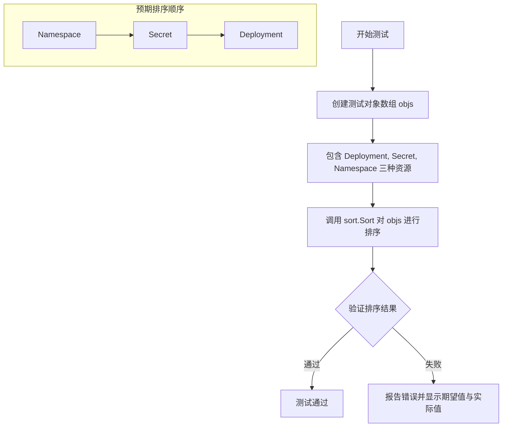

#### 带注释源码

```go
// TestApplyOrder checks that applyOrder works as expected.
// 该测试函数验证 applyOrder 排序功能是否按预期工作
func TestApplyOrder(t *testing.T) {
	// 创建包含三种不同类型资源的测试对象数组
	objs := []applyObject{
		// 创建一个 Deployment 资源对象
		{ResourceID: resource.MakeID("test", "Deployment", "deploy")},
		// 创建一个 Secret 资源对象
		{ResourceID: resource.MakeID("test", "Secret", "secret")},
		// 创建一个 Namespace 资源对象
		{ResourceID: resource.MakeID("", "Namespace", "namespace")},
	}
	
	// 使用 sort.Sort 调用 applyOrder 排序接口对对象数组进行排序
	sort.Sort(applyOrder(objs))
	
	// 遍历预期排序结果，验证每个位置的资源名称是否正确
	// 预期顺序为: namespace (Namespace资源) -> secret (Secret资源) -> deploy (Deployment资源)
	for i, name := range []string{"namespace", "secret", "deploy"} {
		// 从资源ID中提取组、版本和名称组件
		_, _, objName := objs[i].ResourceID.Components()
		// 比较实际名称与预期名称是否匹配
		if objName != name {
			// 如果不匹配，报告测试错误并显示期望值和实际值
			t.Errorf("Expected %q at position %d, got %q", name, i, objName)
		}
	}
}
```


### `fakeApplier.apply`

该方法实现了 `Applier` 接口，用于在测试环境中模拟 Kubernetes 资源的 apply（创建/更新）和 delete 操作。它接收一个变更集（changeSet），解析 YAML 格式的资源定义，根据操作类型（apply 或 delete）调用动态客户端执行相应的 API 请求，并将执行过程中的错误收集返回。

参数：

- `logger`：`log.Logger`，日志记录器（代码中未使用，使用下划线 `_` 表示）
- `cs`：`changeSet`，变更集，包含待应用的资源对象集合，按操作类型（apply/delete）分组
- `errored`：`map[resource.ID]error`，错误映射，用于记录已在前置步骤中发生错误的资源 ID 及其错误信息

返回值：`cluster.SyncError`，同步错误。如果所有资源操作成功则返回 `nil`；否则返回包含所有资源错误信息的切片。

#### 流程图

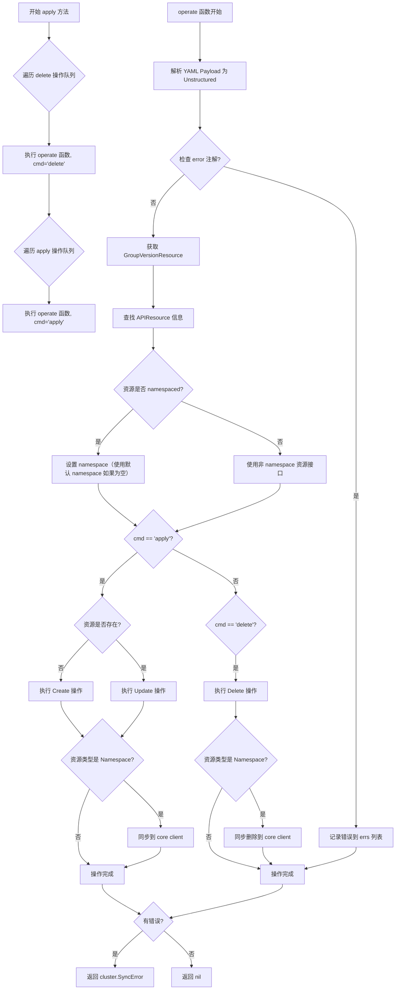

#### 带注释源码

```go
// apply 方法实现了 Applier 接口，执行资源的 apply 或 delete 操作
// 参数 logger 用于日志记录（本实现中未使用）
// 参数 cs 是变更集，包含待执行的资源对象
// 参数 errored 是已在前置步骤中出错的资源映射
// 返回 cluster.SyncError，包含所有执行过程中的错误信息
func (a fakeApplier) apply(_ log.Logger, cs changeSet, errored map[resource.ID]error) cluster.SyncError {
	// 错误列表，用于收集所有资源操作失败的信息
	var errs []cluster.ResourceError

	// operate 是内部函数，负责单个资源的具体操作
	// obj 是待操作的资源对象
	// cmd 是操作命令，可选值为 "apply" 或 "delete"
	operate := func(obj applyObject, cmd string) {
		// 标记命令已执行，用于测试验证
		a.commandRun = true
		
		// 声明用于存储反序列化后的资源对象
		var unstruct map[string]interface{}
		
		// 将 YAML 格式的 Payload 反序列化为 map[string]interface{}
		if err := yaml.Unmarshal(obj.Payload, &unstruct); err != nil {
			// 反序列化失败，记录错误并返回
			errs = append(errs, cluster.ResourceError{obj.ResourceID, obj.Source, err})
			return
		}
		
		// 创建 Unstructured 对象，用于与动态客户端交互
		res := &unstructured.Unstructured{Object: unstruct}

		// 这是一个特殊的测试用例入口：检查资源是否有 "error" 注解
		// 如果有，模拟应用失败，用于测试错误处理流程
		if errStr := res.GetAnnotations()["error"]; errStr != "" {
			errs = append(errs, cluster.ResourceError{obj.ResourceID, obj.Source, fmt.Errorf(errStr)})
			return
		}

		// 从资源对象中提取 GroupVersionKind 并转换为 GroupVersionResource
		gvr := groupVersionResource(res)
		
		// 获取该 GVR 对应的动态资源客户端
		c := a.dynamicClient.Resource(gvr)
		
		// 通过 discovery client 查找 APIResource 信息
		// 用于确定资源是否为 namespaced，以及获取正确的资源名称
		apiRes := findAPIResource(gvr, a.coreClient.Discovery())
		if apiRes == nil {
			// 找不到 APIResource 信息时 panic（测试环境可接受）
			panic("no APIResource found for " + gvr.String())
		}

		// 根据资源是否为 namespaced 选择合适的客户端接口
		var dc dynamic.ResourceInterface = c
		ns := res.GetNamespace()
		if apiRes.Namespaced {
			// 如果资源是 namespaced 但未指定 namespace
			// 使用默认 namespace（模拟 kubectl 的 fallback 行为）
			if ns == "" {
				ns = a.defaultNS
				res.SetNamespace(ns)
			}
			// 为 namespaced 资源创建带 namespace 的客户端
			dc = c.Namespace(ns)
		}
		name := res.GetName()

		// ========== apply 操作分支 ==========
		if cmd == "apply" {
			// 先尝试获取资源，检查是否已存在
			_, err := dc.Get(context.TODO(), name, metav1.GetOptions{})
			switch {
			case errors.IsNotFound(err):
				// 资源不存在，执行创建操作
				_, err = dc.Create(context.TODO(), res, metav1.CreateOptions{})
			case err == nil:
				// 资源已存在，执行更新操作
				_, err = dc.Update(context.TODO(), res, metav1.UpdateOptions{})
			}
			
			// 如果 apply 操作失败，记录错误
			if err != nil {
				errs = append(errs, cluster.ResourceError{obj.ResourceID, obj.Source, err})
				return
			}
			
			// 特殊处理：Namespace 类型资源
			// 因为动态客户端和 core 客户端不共享资源，需要同步创建到 core client
			if res.GetKind() == "Namespace" {
				var ns corev1.Namespace
				// 将 Unstructured 转换为具体的 Namespace 类型
				if err := runtime.DefaultUnstructuredConverter.FromUnstructured(unstruct, &ns); err != nil {
					errs = append(errs, cluster.ResourceError{obj.ResourceID, obj.Source, err})
					return
				}
				// 同样先检查是否存在，再决定创建或更新
				_, err := a.coreClient.CoreV1().Namespaces().Get(context.TODO(), ns.Name, metav1.GetOptions{})
				switch {
				case errors.IsNotFound(err):
					_, err = a.coreClient.CoreV1().Namespaces().Create(context.TODO(), &ns, metav1.CreateOptions{})
				case err == nil:
					_, err = a.coreClient.CoreV1().Namespaces().Update(context.TODO(), &ns, metav1.UpdateOptions{})
				}
				if err != nil {
					errs = append(errs, cluster.ResourceError{obj.ResourceID, obj.Source, err})
					return
				}
			}

		// ========== delete 操作分支 ==========
		} else if cmd == "delete" {
			// 执行删除操作
			if err := dc.Delete(context.TODO(), name, metav1.DeleteOptions{}); err != nil {
				errs = append(errs, cluster.ResourceError{obj.ResourceID, obj.Source, err})
				return
			}
			
			// 同样需要同步删除 Namespace 到 core client
			if res.GetKind() == "Namespace" {
				if err := a.coreClient.CoreV1().Namespaces().Delete(context.TODO(), res.GetName(), metav1.DeleteOptions{}); err != nil {
					errs = append(errs, cluster.ResourceError{obj.ResourceID, obj.Source, err})
					return
				}
			}
		} else {
			// 未知命令，触发 panic（测试环境用于发现编程错误）
			panic("unknown action: " + cmd)
		}
	}

	// 首先处理所有 delete 操作的资源
	for _, obj := range cs.objs["delete"] {
		operate(obj, "delete")
	}
	
	// 然后处理所有 apply 操作的资源
	for _, obj := range cs.objs["apply"] {
		operate(obj, "apply")
	}
	
	// 如果没有错误，返回 nil；否则返回包含所有错误的 SyncError
	if len(errs) == 0 {
		return nil
	}
	return errs
}
```


### `failingDiscoveryClient.ServerResourcesForGroupVersion`

该方法是一个用于测试的模拟 Discovery 客户端实现，它实现了 `discovery.DiscoveryInterface` 接口的 `ServerResourcesForGroupVersion` 方法。该方法总是返回服务不可用错误，用于测试在 Kubernetes 资源同步过程中，当 Discovery 服务返回错误时系统的容错能力，特别是针对 metrics 相关的资源组。

参数：

- `groupVersion`：`string`，要查询的 Kubernetes API 组版本（如 "custom.metrics.k8s.io/v1"）

返回值：`*metav1.APIResourceList`，总是返回 `nil`

- `error`，总是返回 `errors.NewServiceUnavailable("")` 服务不可用错误

#### 流程图

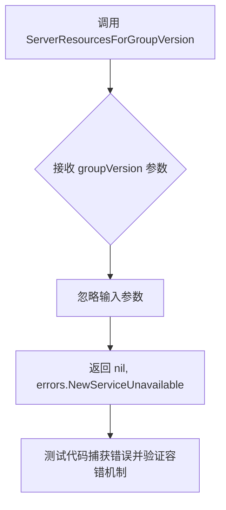

#### 带注释源码

```go
// failingDiscoveryClient 是一个实现了 discovery.DiscoveryInterface 的结构体
// 用于在测试中模拟 Discovery 客户端的失败场景
type failingDiscoveryClient struct {
	discovery.DiscoveryInterface
}

// ServerResourcesForGroupVersion 总是返回一个服务不可用的错误
// 参数 groupVersion: 要查询的 Kubernetes API 组版本字符串
// 返回值:
//   - *metav1.APIResourceList: 总是返回 nil（因为总是返回错误）
//   - error: 总是返回 errors.NewServiceUnavailable("")
func (d *failingDiscoveryClient) ServerResourcesForGroupVersion(groupVersion string) (*metav1.APIResourceList, error) {
	// 无论传入什么 groupVersion，都返回服务不可用错误
	// 这用于测试系统在 Discovery 服务不可用时的容错能力
	return nil, errors.NewServiceUnavailable("")
}
```

## 关键组件


### ExtendedClient

扩展的Kubernetes客户端，封装了core、helm-operator、dynamic和discovery客户端，用于统一访问Kubernetes集群资源。

### fakeApplier

模拟的Applier实现，用于测试环境。通过fake动态客户端和core客户端执行资源的apply（创建/更新）和delete操作，不进行真实的资源patch处理。

### cachedDiscovery

缓存的Discovery客户端实现，通过包装真实的DiscoveryInterface并添加缓存层，提高API资源发现的性能，同时处理错误和资源列表管理。

### fakeClients

创建完整的fake Kubernetes客户端集成的工厂函数，包括core clientset、helm-operator clientset、dynamic clientset和cached discovery client，用于单元测试场景。

### findAPIResource

根据GroupVersionResource查找对应的APIResource信息，用于确定资源是否namespaced以及获取正确的资源接口。

### groupVersionResource

辅助函数，从Unstructured对象中提取GroupVersionKind并转换为标准的GroupVersionResource格式。

### Cluster

Kubernetes集群管理的核心结构体，负责资源的同步(Sync)、垃圾回收(GC)、namespace管理和资源过滤等操作。

### Manifests

Kubernetes资源配置的解析和管理组件，负责将YAML格式的资源文档解析为内部资源表示，并处理namespace和标签注解。

### applyObject

资源应用操作的基本单元，包含ResourceID、Source和Payload等字段，用于描述待应用或删除的Kubernetes资源。

### changeSet

资源变更集合的结构化表示，包含按操作类型（apply/delete）分类的资源对象列表，用于批量处理资源同步。

### fakeClients

工厂函数，创建测试所需的完整fake Kubernetes客户端环境，包括API资源定义、namespace初始化和discovery缓存。

### TestSyncNop

测试空SyncSet场景，验证没有资源时不应产生任何API调用。

### TestSyncTolerateEmptyGroupVersion

测试处理空的GroupVersion场景，验证系统能容忍Discovery返回空的API资源列表。

### TestSyncTolerateMetricsErrors

测试对metrics和webhook等特殊API组的错误容忍处理，验证系统能正确处理这些组的Discovery失败。

### TestSync

综合测试函数，包含多个测试用例：资源添加与GC、namespace处理、默认namespace应用、ignore注解处理、垃圾回收标记等核心功能。

### TestApplyOrder

测试资源的应用顺序，验证Namespace > Secret > Deployment的优先级排序逻辑。

### resourceExcludeList

资源排除列表配置，用于过滤不需要同步的资源，如metrics和webhook相关资源。

### gcMarkLabel

垃圾回收标记标签，用于标识需要GC管理的资源，支持同步策略控制。

### getKubeconfigDefaultNamespace

函数变量，用于获取kubeconfig中的默认namespace，模拟Kubernetes配置行为。

## 问题及建议


### 已知问题

- **fakeApplier.apply 方法职责过重**：该方法超过200行，同时处理apply和delete操作，且包含重复的Namespace处理逻辑，应该拆分为更小的函数。
- **硬编码的魔法值和字符串**：annotation键如"error"、"flux.weave.works/ignore"等散落在代码各处，应提取为常量提高可维护性。
- **使用 panic 处理未知命令**：在fakeApplier.apply中使用panic处理未知操作，不是良好的错误处理实践。
- **未使用的调试常量**：`const debug = false` 定义但未实际使用，应删除或完善调试功能。
- **Monkey patching 全局变量**：`getKubeconfigDefaultNamespace` 通过直接赋值全局变量模拟，这种测试方式不够清晰且存在状态污染风险。
- **context.TODO() 的不规范使用**：多处使用context.TODO()而非具体的context，表明对并发控制缺乏明确设计。
- **API 资源映射硬编码**：listMapping 和 apiResources 在 fakeClients 中硬编码，缺乏灵活性和可扩展性。
- **测试函数嵌套层级过深**：testDefaultNs 和 test 函数嵌套多层回调，增加了代码理解的复杂度。

### 优化建议

- 将 fakeApplier.apply 方法拆分为 applyResource 和 deleteResource 私有方法，每个方法专注于单一职责。
- 创建专门的常量包或文件，集中管理所有 annotation 键和特殊标记。
- 用 error 返回替代 panic，统一错误处理模式。
- 删除未使用的 debug 常量或实现完整的调试日志功能。
- 使用依赖注入替代全局变量 monkey patching，提高测试的可读性和隔离性。
- 将 context 作为参数传递，明确并发控制边界。
- 将资源映射配置化，支持从配置文件或环境变量加载。
- 重构测试函数，使用表格驱动测试或更扁平的结构减少嵌套层级。

## 其它


### 设计目标与约束

本模块的核心设计目标是实现Flux与Kubernetes集群之间的资源同步功能，支持资源的创建、更新、删除以及垃圾回收（GC）机制。设计约束包括：必须兼容Kubernetes 1.16+版本，支持Namespaced和Non-Namespaced资源处理，通过annotation（flux.weave.works/ignore）实现资源的忽略策略，支持SyncSet和HelmRelease的同步能力。测试模块需要能够在无真实Kubernetes集群环境下运行，因此采用fake clients模拟API交互。

### 错误处理与异常设计

错误处理采用分层策略：apply方法内部通过errs切片收集所有资源操作错误，最终返回cluster.SyncError类型错误。测试中通过特定annotation（error: fail to apply this）模拟应用失败场景。DiscoveryClient错误被特别处理，对于metrics.k8s.io和certmanager.k8s.io等特定组版本的错误采用容忍策略，不中断同步流程。failingDiscoveryClient结构体用于测试Discovery失败时的系统行为。

### 数据流与状态机

同步流程状态机包含以下状态：解析Manifest资源 → 设置有效命名空间 → 构建资源映射 → 执行Sync操作 → 应用变更集（apply/delete） → 可选的GC流程。数据流向：KubeManifest → resource.Resource → cluster.SyncSet → changeSet → 最终应用到Kubernetes集群。GC流程依赖gcMarkLabel（flux-image-meta）标签进行资源标记和清理判断。

### 外部依赖与接口契约

主要依赖包括：k8s.io/client-go（Kubernetes客户端）、k8s.io/apimachinery（API元数据处理）、github.com/fluxcd/flux/pkg/cluster（集群抽象接口）、github.com/fluxcd/flux/pkg/sync（同步逻辑）、github.com/fluxcd/flux/pkg/resource（资源抽象）、helm-operator客户端（Helm资源处理）。接口契约：Cluster.Sync(cluster.SyncSet) error方法负责同步，Applier接口定义apply(logger, changeSet, erroredMap) cluster.SyncError方法执行实际资源操作。

### 性能考虑

fakeApplier采用直接覆盖而非patch策略以简化测试逻辑。动态客户端Resource(gvr).Namespace(ns)调用存在重复创建开销，可考虑缓存ResourceInterface。GC流程遍历所有同步集资源并与集群实际资源对比，时间复杂度O(n*m)，大规模场景下需优化。测试中debug模式可开启API调用追踪但生产环境应禁用。

### 安全考虑

资源同步涉及对集群的写操作，需确保APIServer访问凭证安全。fakeApplier在测试环境中绕过真实认证，但生产代码应使用正规ServiceAccount或Kubeconfig。ignore annotation机制允许绕过同步，需注意flux.weave.works/ignore和flux.weave.works/ignore: "sync_only"的安全影响，避免敏感资源被意外忽略。GC功能默认关闭，需显式启用以防止误删。

### 配置管理

defaultTestNamespace = "unusual-default"定义测试用默认命名空间。resourceExcludeList配置需排除的资源组：["*metrics.k8s.io/*", "webhook.certmanager.k8s.io/v1beta1/*"]。GC和DryGC通过Cluster结构体布尔字段控制。getKubeconfigDefaultNamespace函数提供运行时命名空间配置能力。

### 版本兼容性

fakeClients中apiResources定义了测试支持的API组版本：apps/v1（Deployments）和v1（Namespaces）。动态客户端采用Unstructured格式处理任意Kubernetes资源对象。findAPIResource通过Discovery接口动态发现API资源以适应不同集群版本。测试覆盖GroupVersion为空或无APIResources的异常场景。

### 测试策略

采用fake clients实现无外部依赖的单元测试。testDefaultNs和test函数封装通用测试逻辑。checkSame函数通过比较spec字段验证资源等价性（忽略metadata变化）。TestSync包含12个子测试用例覆盖：基础同步、GC、DryGC、默认命名空间、ignore注解、错误处理等场景。TestApplyOrder验证资源应用顺序（Namespace > Secret > Deployment）。

### 部署注意事项

本代码为测试模块，不直接部署。真实环境使用Cluster结构体而非fakeApplier。MakeCachedDiscovery需正确传递shutdown channel以管理缓存生命周期。生产部署时需配置真实的Kubernetes客户端（通过Kubeconfig或InCluster配置）。

### 监控与日志

日志采用github.com/go-kit/kit/log接口，setup函数创建log.NewLogfmtLogger(os.Stdout)输出到标准输出。fakeApplier.apply方法记录commandRun布尔标志表示是否有命令执行。debug模式可追踪所有API action调用。同步错误通过cluster.SyncError和cluster.ResourceError结构体返回。

### 命名规范与代码风格

采用Go语言标准命名规范：驼峰命名法，缩写词保持一致大小写。测试函数以Test开头，表格驱动测试使用t.Run。常量defaultTestNamespace明确标识测试用途。fakeClients/fakeApplier等fake实现以"fake"前缀区分。

### 未来扩展性设计

支持更多资源类型：已在fakeClients中预留apiResources扩展能力。GC优化：可引入缓存层减少Discovery调用。Sync策略：可扩展支持增量同步而非全量同步。多集群支持：ExtendedClient结构体已预留多集群接入能力。Helm集成：已集成helm-operator客户端支持HelmRelease同步。
    