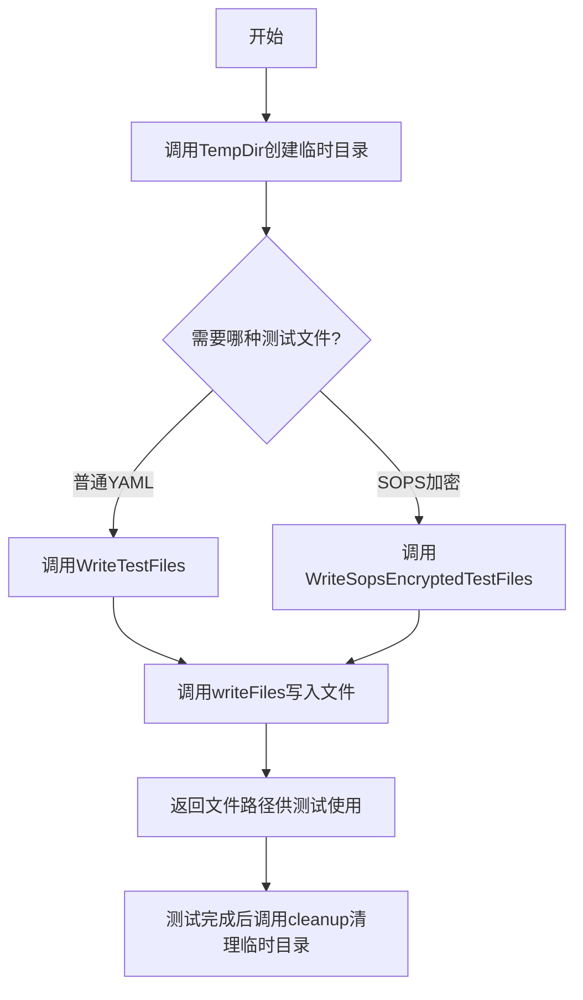
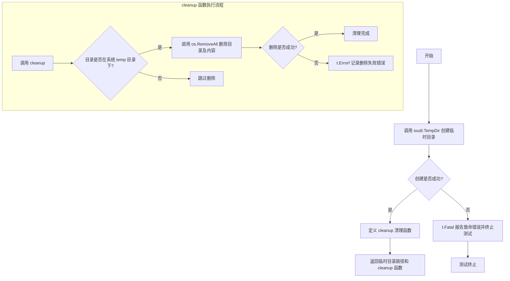
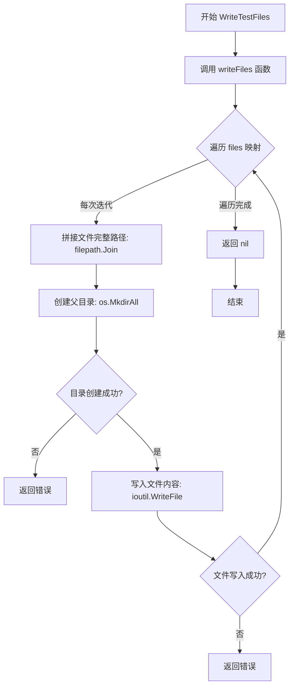
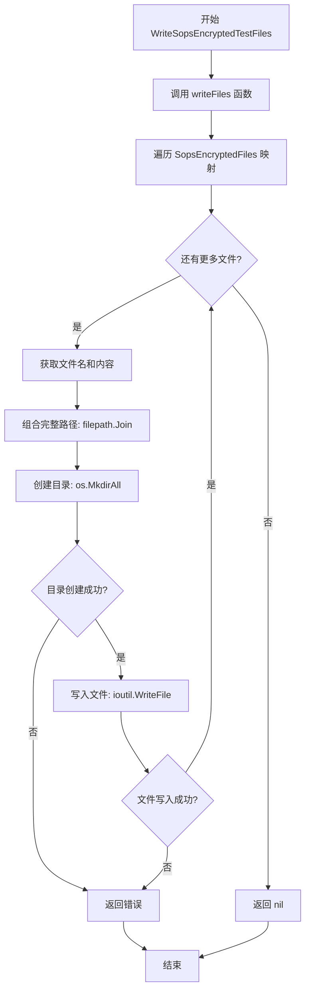

# `flux\pkg\cluster\kubernetes\testfiles\data.go` 详细设计文档

这是一个Flux项目的测试辅助包，提供测试用的Kubernetes资源文件创建功能，包括普通YAML、Kustomize配置和SOPS加密文件的生成与清理，支持Deployment、Service、DaemonSet等多种资源类型的测试数据管理。

## 整体流程



## 类结构

```
无类定义（纯函数和数据结构）
Package: testfiles
├── 全局函数
│   ├── TempDir
│   ├── WriteTestFiles
│   ├── WriteSopsEncryptedTestFiles
│   ├── writeFiles
│   └── WorkloadMap
└── 全局变量/常量
    ├── ResourceMap
    ├── Files
    ├── FilesUpdated
    ├── FilesForKustomize
    ├── FilesMultidoc
    ├── SopsEncryptedFiles
    ├── EncryptedResourceMap
    └── TestPrivateKey
```

## 全局变量及字段


### `ResourceMap`
    
Maps resource IDs to relative file paths for test fixtures.

类型：`map[resource.ID]string`
    


### `Files`
    
Contains test data for various Kubernetes manifests (Deployments, Services, etc.) used in tests.

类型：`map[string]string`
    


### `FilesUpdated`
    
Contains updated test data for manifests with changed image tags.

类型：`map[string]string`
    


### `FilesForKustomize`
    
Test data representing a Kustomize overlay structure for testing Kustomize builds.

类型：`map[string]string`
    


### `FilesMultidoc`
    
Test data for a multi-document YAML file containing multiple Namespace resources.

类型：`map[string]string`
    


### `SopsEncryptedFiles`
    
Test data for files encrypted with Mozilla SOPS using TestPrivateKey.

类型：`map[string]string`
    


### `EncryptedResourceMap`
    
Maps resource IDs to relative file paths for encrypted test fixtures.

类型：`map[resource.ID]string`
    


### `TestPrivateKey`
    
PGP private key used for testing decryption of SOPS-encrypted files.

类型：`string`
    


    

## 全局函数及方法


### `TempDir`

该函数用于在测试环境中创建临时目录，并返回一个清理函数以便在测试结束后自动删除该临时目录。主要用于测试用例中需要操作文件系统的场景，确保测试环境的隔离性和资源清理。

参数：

- `t`：`testing.T`，Go 标准库中的测试框架参数，用于报告测试失败和错误

返回值：`(string, func())`，返回两个值：
- 第一个为 `string` 类型，表示创建的临时目录的绝对路径
- 第二个为 `func()` 类型，表示一个无参数的清理函数，用于在测试结束后删除创建的临时目录

#### 流程图



#### 带注释源码

```go
// TempDir 创建一个临时目录并返回其路径以及对应的清理函数
// 参数 t 是 testing.T 类型，用于测试框架的错误报告
// 返回值：
//   - string: 创建的临时目录的绝对路径
//   - func(): 清理函数，用于删除创建的临时目录
func TempDir(t *testing.T) (string, func()) {
	// 使用 ioutil.TempDir 在系统临时目录中创建一个以 "flux-test" 为前缀的临时目录
	// os.TempDir() 返回系统默认的临时目录路径（Linux 通常为 /tmp）
	newDir, err := ioutil.TempDir(os.TempDir(), "flux-test")
	
	// 如果创建临时目录失败，调用 t.Fatal 报告致命错误并终止测试
	if err != nil {
		t.Fatal("failed to create temp directory")
	}

	// 定义清理函数，用于在测试结束后删除临时目录
	cleanup := func() {
		// 安全检查：确保要删除的目录确实位于系统临时目录下
		// 防止误删重要目录，增强安全性
		if strings.HasPrefix(newDir, os.TempDir()) {
			// 使用 os.RemoveAll 删除目录及其所有内容
			if err := os.RemoveAll(newDir); err != nil {
				// 如果删除失败，记录错误但不让测试失败
				t.Errorf("Failed to delete %s: %v", newDir, err)
			}
		}
	}
	
	// 返回临时目录路径和清理函数
	return newDir, cleanup
}
```


### `WriteTestFiles`

该函数用于在指定的目录中根据预定义的文件内容映射创建多个文件。它是内部 `writeFiles` 函数的公共封装，主要供测试代码使用，以便快速构建测试用的文件系统环境。

#### 参数

- `dir`：`string`，目标目录路径，函数将在此目录下创建文件
- `files`：`map[string]string`，文件名（键）到文件内容（值）的映射

#### 流程图



#### 带注释源码

```go
// WriteTestFiles ... given a directory, create files in it, based on predetermined file content
// WriteTestFiles 根据预定义的文件内容映射，在指定目录中创建文件
// 参数：
//   - dir: string, 目标目录路径
//   - files: map[string]string, 文件名到内容的映射
// 返回值：
//   - error: 如果创建过程中发生错误则返回错误，否则返回 nil
func WriteTestFiles(dir string, files map[string]string) error {
    // 直接调用内部 writeFiles 函数实现具体逻辑
    // WriteTestFiles 是一个公共封装，供外部测试代码调用
	return writeFiles(dir, files)
}
```


### `WriteSopsEncryptedTestFiles`

该函数用于在指定目录中创建预定义的 SOPS 加密测试文件，这些文件使用 TestPrivateKey 进行加密。

参数：

- `dir`：`string`，目标目录路径，用于写入加密的测试文件

返回值：`error`，如果创建文件过程中出现错误则返回错误，否则返回 nil

#### 流程图



#### 带注释源码

```go
// WriteSopsEncryptedTestFiles ... given a directory, create files in it, based on predetermined file content.
// These files are encrypted with sops using TestPrivateKey
func WriteSopsEncryptedTestFiles(dir string) error {
  // 调用内部 writeFiles 函数，传入目标目录和预定义的 SOPS 加密文件映射
  return writeFiles(dir, SopsEncryptedFiles)
}

// writeFiles 是一个内部辅助函数，用于将文件映射内容写入指定目录
func writeFiles(dir string, files map[string]string) error {
  // 遍历文件映射，name 为文件名，content 为文件内容
  for name, content := range files {
    // 使用 filepath.Join 组合目录和文件名，形成完整的文件路径
    path := filepath.Join(dir, name)
    
    // 创建文件所在的目录结构，使用 0777 权限
    if err := os.MkdirAll(filepath.Dir(path), 0777); err != nil {
      // 如果目录创建失败，立即返回错误
      return err
    }
    
    // 将文件内容写入文件，使用 0666 权限
    if err := ioutil.WriteFile(path, []byte(content), 0666); err != nil {
      // 如果文件写入失败，立即返回错误
      return err
    }
  }
  // 所有文件写入成功，返回 nil
  return nil
}
```


### `writeFiles`

该函数是测试文件生成的核心实现，负责将预定义的文件内容写入指定目录。它遍历文件映射，创建必要的目录结构，并以指定的权限将文件内容写入磁盘。

参数：

- `dir`：`string`，目标目录路径，指定文件写入的基础目录
- `files`：`map[string]string`，文件名到文件内容的映射表，其中键为相对路径，值为文件内容

返回值：`error`，如果写入过程中出现任何错误（目录创建失败或文件写入失败），则返回具体错误信息；否则返回 nil

#### 流程图

```mermaid
flowchart TD
    A[开始 writeFiles] --> B{遍历 files map}
    B -->|遍历每个 name, content| C[拼接完整路径 path = filepath.Join(dir, name)]
    C --> D[创建目录 os.MkdirAll filepath.Dir(path)]
    D --> E{目录创建成功?}
    E -->|否| F[返回错误]
    E -->|是| G[写入文件 ioutil.WriteFile]
    G --> H{文件写入成功?}
    H -->|否| I[返回错误]
    H -->|是| J{是否还有更多文件?}
    J -->|是| B
    J -->|否| K[返回 nil]
    F --> L[结束]
    I --> L
    K --> L
```

#### 带注释源码

```go
// writeFiles 将文件写入指定目录
// 参数：
//   - dir: 目标目录路径
//   - files: 文件名（相对路径）到文件内容的映射
// 返回值：
//   - error: 操作过程中的错误，如目录创建失败或文件写入失败
func writeFiles(dir string, files map[string]string) error {
	// 遍历文件映射，处理每个文件
	for name, content := range files {
		// 拼接完整的文件路径：基础目录 + 文件名
		path := filepath.Join(dir, name)
		
		// 创建文件所在目录（如果父目录不存在则递归创建）
		// 使用 0777 权限，允许读、写、执行
		if err := os.MkdirAll(filepath.Dir(path), 0777); err != nil {
			// 目录创建失败，立即返回错误
			return err
		}
		
		// 将文件内容写入磁盘
		// 使用 0666 权限（所有者、组和其他用户可读写）
		if err := ioutil.WriteFile(path, []byte(content), 0666); err != nil {
			// 文件写入失败，立即返回错误
			return err
		}
	}
	// 所有文件成功写入，返回 nil 表示无错误
	return nil
}
```


### `WorkloadMap`

该函数接收一个目录路径作为参数，基于测试数据构建一个资源 ID 到文件路径的映射表，用于测试场景下模拟工作负载的 YAML 文件路径。

参数：

- `dir`：`string`，基准目录路径，用于拼接完整的 YAML 文件路径

返回值：`map[resource.ID][]string`，资源 ID 到文件路径列表的映射，其中键为 `resource.ID` 类型（来自 `github.com/fluxcd/flux/pkg/resource` 包），值为文件路径的字符串切片

#### 流程图

```mermaid
flowchart TD
    A[Start: WorkloadMap] --> B[Input: dir string]
    B --> C[构建资源映射表]
    C --> D[default:deployment/helloworld → filepath.Join(dir, 'helloworld-deploy.yaml')]
    C --> E[default:deployment/locked-service → filepath.Join(dir, 'locked-service-deploy.yaml')]
    C --> F[default:deployment/test-service → filepath.Join(dir, 'test/test-service-deploy.yaml')]
    C --> G[default:deployment/multi-deploy → filepath.Join(dir, 'multi.yaml')]
    C --> H[default:deployment/list-deploy → filepath.Join(dir, 'list.yaml')]
    C --> I[default:deployment/semver → filepath.Join(dir, 'semver-deploy.yaml')]
    C --> J[default:daemonset/init → filepath.Join(dir, 'init.yaml')]
    D --> K[Return: map[resource.ID][]string]
    E --> K
    F --> K
    G --> K
    H --> K
    I --> K
    J --> K
```

#### 带注释源码

```go
// WorkloadMap ... given a base path, construct the map representing
// the services given in the test data. Must be kept in sync with
// `Files` below. TODO(michael): derive from ResourceMap, or similar.
func WorkloadMap(dir string) map[resource.ID][]string {
    // 返回一个 map，键为 resource.ID（资源标识符），值为文件路径切片
    // 使用 filepath.Join 将基准目录 dir 与各 YAML 文件名拼接成完整路径
    return map[resource.ID][]string{
        // Deployment 类型资源映射
        resource.MustParseID("default:deployment/helloworld"):     []string{filepath.Join(dir, "helloworld-deploy.yaml")},
        resource.MustParseID("default:deployment/locked-service"): []string{filepath.Join(dir, "locked-service-deploy.yaml")},
        resource.MustParseID("default:deployment/test-service"):   []string{filepath.Join(dir, "test/test-service-deploy.yaml")},
        resource.MustParseID("default:deployment/multi-deploy"):   []string{filepath.Join(dir, "multi.yaml")},
        resource.MustParseID("default:deployment/list-deploy"):    []string{filepath.Join(dir, "list.yaml")},
        resource.MustParseID("default:deployment/semver"):         []string{filepath.Join(dir, "semver-deploy.yaml")},
        
        // DaemonSet 类型资源映射
        resource.MustParseID("default:daemonset/init"):            []string{filepath.Join(dir, "init.yaml")},
    }
}
```

## 关键组件


### 临时目录管理

用于在测试中创建临时目录，并提供自动清理功能。确保测试环境的隔离性和资源清理。

### 测试文件写入

将预定义的YAML文件内容写入指定目录，支持普通文件和SOPS加密文件的创建。是测试数据准备的核心组件。

### 资源映射定义

定义资源ID（如deployment、service）到相对文件路径的映射关系。用于测试中验证资源解析和加载功能。

### 工作负载映射

根据基础路径构建工作负载（workload）到完整文件路径的映射。需与Files变量保持同步，存在潜在的维护成本。

### YAML测试数据集合

包含多种Kubernetes资源定义的YAML内容，如Deployment、Service、DaemonSet、List等。支持多文档、Helm Chart目录结构等复杂场景。

### Kustomize测试数据

包含Kustomize配置文件（kustomization.yaml）和基础/分层配置。用于测试Kustomize构建和补丁生成功能。

### SOPS加密测试文件

使用AES256-GCM加密的YAML文件内容，配合TestPrivateKey用于测试加密资源的解析和处理能力。

### 测试私钥

用于解密SOPS加密文件的PGP私钥。确保测试可以验证加密资源的完整处理流程。


## 问题及建议


### 已知问题

- **硬编码文件权限不安全**：代码中使用`0777`和`0666`权限创建目录和文件，未遵循最小权限原则（文件应为0644，目录0755），在不同系统上可能有安全风险
- **重复的数据定义**：`ResourceMap`、`WorkloadMap`和`Files`之间存在数据重复，需要手动同步维护，代码中已有TODO注释指出此问题但未解决
- **测试数据维护困难**：大量YAML内容硬编码在代码中，`SopsEncryptedFiles`包含大量加密后的字符串，可读性和可维护性差
- **资源映射不一致**：`EncryptedResourceMap`使用`<cluster>`前缀，而`ResourceMap`使用`default`前缀，两者格式不统一可能导致测试覆盖不完整
- **临时目录清理逻辑脆弱**：依赖`strings.HasPrefix(newDir, os.TempDir())`判断是否安全删除，若临时目录创建在`os.TempDir()`的子目录外可能导致清理失败或误删
- **过时的API版本**：测试数据中使用`extensions/v1beta1`和`apps/v1beta1`等已废弃的Kubernetes API版本，这些版本在较新版本中已移除

### 优化建议

- 将文件权限改为更安全的默认值（目录0755，文件0644），或使用系统默认掩码
- 设计统一的数据源，通过代码自动生成`WorkloadMap`，消除重复定义
- 考虑将测试YAML文件移至独立的测试数据文件或使用模板生成，减少代码中的硬编码字符串
- 统一资源ID格式，使用常量或配置定义集群前缀
- 改进临时目录清理逻辑，直接验证目录是否为新创建，或使用`os.UserCacheDir`等更安全的方式
- 更新测试数据中的Kubernetes API版本至`apps/v1`和`v1`等稳定版本
- 考虑将`TempDir`函数迁移至测试辅助包或使用Go 1.15+的`t.TempDir()`方法

## 其它


### 设计目标与约束

本代码库旨在为Fluxcd项目提供测试数据和文件操作辅助功能，支持Kubernetes资源配置的自动化测试。设计约束包括：1) 仅用于测试环境，不包含生产逻辑；2) 依赖Go标准库和flux/pkg/resource包；3) 文件操作使用临时目录机制确保测试隔离；4) 支持YAML、多文档、Helm Chart等多种Kubernetes配置文件格式。

### 错误处理与异常设计

代码采用以下错误处理策略：
- **目录创建失败**：TempDir函数在创建临时目录失败时调用t.Fatal终止测试
- **文件写入失败**：writeFiles函数逐个创建文件，任一文件写入失败立即返回错误
- **目录创建失败**：使用os.MkdirAll确保父目录存在，失败时返回错误
- **临时文件清理**：cleanup函数检查目录前缀后删除，删除失败时记录日志而非panic
- **加密文件错误**：WriteSopsEncryptedTestFiles直接透传底层错误

### 数据流与状态机

数据流主要分为三类：
1. **文件写入流程**：输入map[string]string → 遍历键值对 → 创建目录结构 → 写入文件内容 → 返回nil/error
2. **资源映射流程**：ResourceMap定义资源ID到文件路径的映射 → WorkloadMap根据base path构建完整路径
3. **加密文件流程**：SopsEncryptedFiles → writeFiles → 生成加密的测试文件

状态机转换：TempDir创建 → WriteTestFiles/WriteSopsEncryptedTestFiles写入 → 测试执行 → cleanup清理

### 外部依赖与接口契约

关键外部依赖：
- **github.com/fluxcd/flux/pkg/resource**：提供resource.ID类型和MustParseID函数，用于解析Kubernetes资源标识
- **io/ioutil**：提供TempDir和WriteFile函数
- **os**：提供TempDir、RemoveAll等文件操作
- **path/filepath**：提供Join和Dir路径操作
- **strings**：提供HasPrefix字符串检查
- **testing**：提供testing.T接口用于测试上下文

接口契约说明：
- TempDir返回(string, func())，调用方必须在测试结束时执行返回的cleanup函数
- WriteTestFiles和WriteSopsEncryptedTestFiles接收dir参数，必须是已存在的目录路径
- writeFiles内部函数接收的files参数不能为nil，需预先初始化
- ResourceMap和WorkloadMap必须保持同步，手动维护容易引入不一致风险

### 安全考虑

代码包含以下安全相关元素：
- **PGP私钥**：TestPrivateKey变量包含用于测试的PGP私钥，仅用于测试目的
- **SOPS加密文件**：SopsEncryptedFiles使用AES256_GCM加密，包含示例工作负载配置
- **文件权限**：创建文件使用0666权限，创建目录使用0777权限
- **路径遍历防护**：使用filepath.Join防止路径注入

### 性能特征

性能考量点：
- **临时目录创建**：每次调用TempDir都创建新的临时目录，可能产生I/O开销
- **文件写入**：writeFiles顺序写入，无并发优化
- **资源映射**：WorkloadMap每次调用都重新构建map，可考虑缓存
- **大文件处理**：Files和FilesUpdated包含完整YAML内容，需注意内存占用

### 测试覆盖范围

代码支持的测试场景：
- Kubernetes Deployment资源配置解析
- Service资源配置解析
- 多文档YAML（multi.yaml）解析
- List资源类型解析
- DaemonSet资源及initContainers支持
- Helm Chart目录结构识别
- Kustomize配置构建
- SOPS加密文件处理
- 自动化部署标记（flux.weave.works/automated）
- 锁定部署标记（flux.weave.works/locked）
- Semver标签匹配（flux.weave.works/tag.xxx）

### 配置与常量

关键配置常量：
- os.TempDir()：系统临时目录基础路径
- "flux-test"：临时目录名前缀
- 0666/0777：文件/目录创建权限
- "garbage"：用于测试的无效YAML文件键名
- "ENC[AES256_GCM"：SOPS加密内容标识前缀

### 使用示例与调用方

典型使用模式：
```go
// 创建临时目录和清理函数
dir, cleanup := TempDir(t)
defer cleanup()

// 写入测试文件
err := WriteTestFiles(dir, testfiles.Files)

// 使用资源映射
resources := testfiles.ResourceMap
workloads := testfiles.WorkloadMap(dir)
```

### 版本与兼容性

兼容性说明：
- Kubernetes API版本：使用v1beta1、v1beta1、apps/v1beta1等旧版API（2019年时代）
- Go版本：标准库函数，无特殊版本要求
- Flux版本：基于flux/pkg/resource包的时代背景
- SOPS版本：3.5.0

### 已知限制

- ResourceMap和WorkloadMap需要手动同步维护
- WorkloadMap未包含service资源类型
- 未支持ConfigMap、Secret等其他Kubernetes资源类型
- 加密测试依赖特定PGP密钥，无密钥轮换机制
- Helm Chart仅支持基本模板，未覆盖所有Chart语法

    