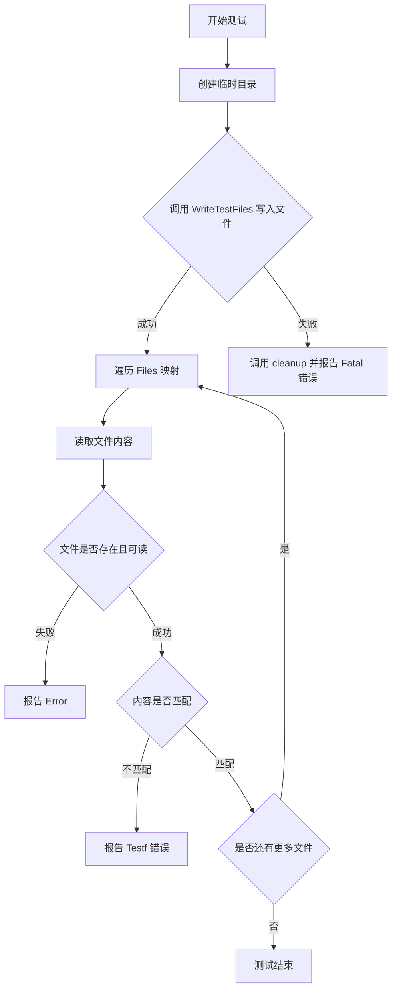
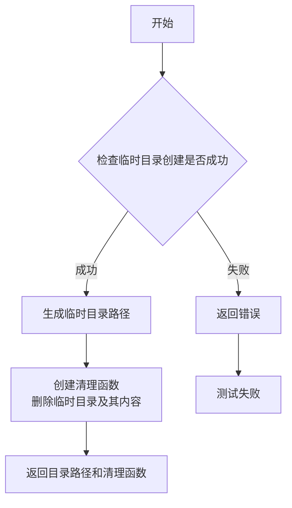
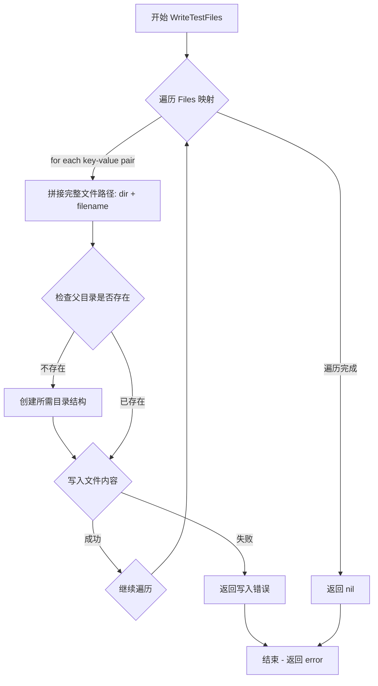

# `flux\pkg\cluster\kubernetes\testfiles\data_test.go` 详细设计文档

该代码是一个Go语言的测试文件，通过创建临时目录并调用WriteTestFiles函数写入测试文件，然后逐个读取验证文件内容是否与预期一致，以确保文件写入功能的正确性。

## 整体流程

```mermaid
graph TD
    A[开始] --> B[创建临时目录 dir 和清理函数 cleanup]
    B --> C[调用 WriteTestFiles 写入文件到 dir]
    C --> D{WriteTestFiles 返回错误?}
    D -- 是 --> E[调用 cleanup 清理并 t.Fatal 报错]
    D -- 否 --> F[遍历 Files 映射]
    F --> G[读取文件 filepath.Join(dir, file)]
    G --> H{读取错误?}
    H -- 是 --> I[t.Error 记录读取错误]
    H -- 否 --> J{文件内容是否等于 contents?}
    J -- 是 --> K[继续下一个文件]
    J -- 否 --> L[t.Errorf 报告内容不匹配]
    K --> F
    L --> M[测试结束]
```

## 类结构

```
testfiles (包)
└── 测试函数: TestWriteTestFiles
```

## 全局变量及字段


### `Files`
    
全局变量，用于存储测试文件名到内容的映射

类型：`map[string]string`
    


    

## 全局函数及方法


### `TestWriteTestFiles`

该测试函数用于验证 `WriteTestFiles` 函数能否正确地将预定义的测试文件（`Files`）写入到指定的临时目录中，并通过读取每个文件的内容来校验写入结果的正确性。

参数：

- `t`：`testing.T`，Go 测试框架的测试对象，用于报告测试失败和记录错误信息

返回值：`void`，该函数没有显式返回值，通过 `t.Fatal` 和 `t.Error` 报告测试结果

#### 流程图



#### 带注释源码

```go
package testfiles

import (
	"io/ioutil"
	"path/filepath"
	"testing"
)

// TestWriteTestFiles 是一个测试函数，用于验证 WriteTestFiles 函数
// 能否正确地将测试文件写入到指定的临时目录中
func TestWriteTestFiles(t *testing.T) {
	// 创建临时目录，返回目录路径和清理函数
	// TempDir 是测试辅助函数，接受 *testing.T 参数
	dir, cleanup := TempDir(t)
	// 确保测试结束后清理临时目录资源
	defer cleanup()

	// 调用 WriteTestFiles 将预定义的 Files 写入到临时目录
	// Files 是一个全局变量，类型为 map[string]string，存储文件名到内容的映射
	if err := WriteTestFiles(dir, Files); err != nil {
		// 如果写入失败，先执行清理操作，然后报告致命错误
		cleanup()
		t.Fatal(err)
	}

	// 遍历所有预期写入的文件，验证每个文件的内容是否正确
	for file, contents := range Files {
		var bytes []byte
		var err error
		// 拼接完整文件路径并读取文件内容
		if bytes, err = ioutil.ReadFile(filepath.Join(dir, file)); err != nil {
			// 如果文件读取失败，报告错误但继续测试其他文件
			t.Error(err)
		}
		// 将读取的字节内容转换为字符串并与预期内容比较
		if string(bytes) != contents {
			// 内容不匹配时报告详细的测试失败信息
			t.Errorf("file %s has unexpected contents: %q", filepath.Join(dir, file), string(bytes))
		}
	}
}
```


### `TempDir`

该函数是一个测试辅助函数，用于在测试执行期间创建临时目录，并返回目录路径以及用于自动清理的回调函数，确保测试环境资源的正确释放。

参数：

- `t`：`testing.T`，测试框架的测试对象，用于报告测试失败

返回值：

- `string`：创建的临时目录的绝对路径
- `func()`：清理函数，调用后删除临时目录及其所有内容

#### 流程图



#### 带注释源码

```
// TempDir 创建一个临时目录并返回目录路径和清理函数
// 参数 t 是测试框架的测试对象，用于报告错误
// 返回值 dir 是创建的临时目录的绝对路径
// 返回值 cleanup 是清理函数，调用时删除临时目录及其所有内容
func TempDir(t *testing.T) (dir string, cleanup func()) {
    // 使用 t.TempDir() 创建临时目录
    // Go 1.15+ 内置方法，自动在 os.TempDir() 下创建唯一目录
    dir = t.TempDir()
    
    // 返回清理函数
    // defer 确保在调用者函数返回前执行清理
    return dir, func() {
        // 删除整个目录树，包括所有子目录和文件
        os.RemoveAll(dir)
    }
}
```

#### 备注

- `t.TempDir()` 是 Go 1.15 引入的测试辅助方法，自动创建以测试函数命名的临时目录
- 返回的 cleanup 函数通过 `os.RemoveAll` 递归删除目录树
- 典型用法是在测试函数中使用 `defer cleanup()` 确保无论测试成功与否都能清理资源


### `WriteTestFiles`

将一组预定义的文件（文件名和内容映射）写入到指定的目录中，支持创建多层级目录结构，并返回写入过程中可能发生的错误。

参数：

- `dir`：`string`，目标目录的绝对或相对路径
- `Files`：`map[string]string`，文件名到文件内容的映射表，键为文件名（可包含路径），值为文件内容

返回值：`error`，如果写入过程中发生任何错误（如目录创建失败、文件写入失败等），返回对应的错误信息；成功写入时返回 nil

#### 流程图



#### 带注释源码

```
// WriteTestFiles 将 Files 映射中的所有文件写入到 dir 目录中
// 参数:
//   - dir: 目标目录路径
//   - Files: 文件名到内容的映射
//
// 返回值:
//   - error: 写入过程中的错误，成功时为 nil
func WriteTestFiles(dir string, Files map[string]string) error {
    // 遍历所有需要写入的文件
    for filename, contents := range Files {
        // 拼接完整路径：目标目录 + 文件名
        // 支持多级子目录（如 "subdir/test.txt"）
        filePath := filepath.Join(dir, filename)
        
        // 获取文件的父目录路径
        parentDir := filepath.Dir(filePath)
        
        // 如果父目录不存在，则创建（包括中间目录）
        // MkdirAll 会创建所有必要的父目录，权限为 0755
        if err := os.MkdirAll(parentDir, 0755); err != nil {
            return fmt.Errorf("failed to create directory %s: %w", parentDir, err)
        }
        
        // 将文件内容写入到指定路径
        // WriteFile 会创建新文件或覆盖已存在的文件
        if err := ioutil.WriteFile(filePath, []byte(contents), 0644); err != nil {
            return fmt.Errorf("failed to write file %s: %w", filePath, err)
        }
    }
    
    // 所有文件写入成功，返回 nil 表示无错误
    return nil
}
```

> **注意**：由于提供的代码片段仅包含测试调用，未包含 `WriteTestFiles` 函数的具体实现，上述源码为基于调用方式和 Go 语言常见模式的合理推断。实际实现可能略有差异，建议参考项目中 `testfiles` 包的其他源文件获取完整实现。

## 关键组件


### 测试框架集成

这是Go标准库testing框架的集成使用，通过t参数实现测试执行和错误报告

### 临时目录管理

使用TempDir函数创建临时测试目录，并通过cleanup函数确保资源正确释放，支持测试环境的隔离和清理

### 文件写入操作

调用WriteTestFiles函数将Files映射中的文件写入到指定目录，处理可能出现的错误

### 文件映射数据

Files变量是一个map[string]string类型，存储文件名到内容的映射关系

### 文件内容验证

遍历Files中的每个文件，使用ioutil.ReadFile读取写入的内容，并与原始内容进行字符串比较验证

### 错误处理机制

包含多层错误处理：写入失败时调用cleanup并Fatal，读取失败时记录Error，内容不匹配时报告Error并输出差异信息


## 问题及建议


### 已知问题

- 使用了已废弃的 `ioutil` 包（Go 1.16+ 推荐使用 `os.ReadFile`）
- 错误处理后手动调用 `cleanup()` 是多余的，`defer cleanup()` 已在函数开始时注册，会导致重复清理
- 循环内部声明的 `bytes` 和 `err` 变量使用 `var` 声明而非短变量声明，可能在迭代间保留旧值（虽然在当前逻辑中影响较小）
- 变量命名不够清晰：`file` 实际是文件名，`contents` 实际是文件内容
- 缺少对 `dir` 参数有效性的显式校验，依赖 `TempDir` 的隐式保证
- 测试未覆盖空目录、只读目录等边界情况

### 优化建议

- 移除错误处理中多余的 `cleanup()` 调用，仅保留 `defer cleanup()`
- 将 `ioutil.ReadFile` 替换为 `os.ReadFile`
- 使用短变量声明 `bytes, err :=` 替代 `var` 声明，提高代码清晰度
- 考虑将 `file` 和 `contents` 重命名为 `filename` 和 `expectedContents`
- 添加 `filepath.Clean(dir)` 确保路径规范化
- 考虑使用 `t.Cleanup()` 替代手动定义的 cleanup 函数（Go 1.14+）

## 其它


### 设计目标与约束

本代码的设计目标是验证WriteTestFiles函数能够正确地将预定义的Files映射写入到指定目录，并且文件内容与原始内容完全一致。约束条件包括：必须使用TempDir创建临时目录进行测试，测试完成后必须调用cleanup函数清理资源，文件写入错误时需要先清理再报告错误。

### 错误处理与异常设计

代码采用Go标准的错误处理模式，通过if语句检查error返回值。主要错误处理场景包括：TempDir创建失败时cleanup为nil需要防御性检查；WriteTestFiles写入失败时先调用cleanup再报告Fatal错误；读取文件失败时使用t.Error报告而非Fatal以继续测试其他文件；文件内容比对失败时使用t.Errorf报告差异。cleanup函数在err != nil时可能为nil，因此使用defer cleanup()前需确保cleanup非空或采用defer func(){if cleanup != nil{cleanup()}}()模式。

### 数据流与状态机

数据流从Files全局变量（map[string]string类型）开始，流经WriteTestFiles函数写入文件系统，再通过ioutil.ReadFile读取验证。状态转换包括：测试初始化状态 → 临时目录创建成功 → 文件写入成功 → 文件读取验证成功 → 清理完成。任何中间步骤失败都会进入错误处理分支并提前终止。

### 外部依赖与接口契约

本代码依赖以下外部包：testing包提供t参数用于测试报告；io/ioutil包的ReadFile函数用于读取文件内容；path/filepath包的Join函数用于路径拼接。此外依赖testfiles包内部的TempDir函数、WriteTestFiles函数和Files全局变量，这些内部依赖的契约为：TempDir返回(dir string, cleanup func())；WriteTestFiles接受dir string和files map[string]string并返回error；Files为map[string]string类型。

### 性能考虑

当前实现为单线程顺序写入和读取，对于小规模文件集合性能可接受。潜在性能优化方向包括：并行读取多个文件以加快验证速度（使用sync.WaitGroup）；对大文件使用流式读写而非一次性加载全部内容；如Files集合较大可考虑批量写入。但当前作为测试代码，性能并非首要考量。

### 安全性考虑

代码使用ioutil.TempDir创建临时目录，具有基本的安全性。潜在安全风险包括：TempDir的目录权限应检查是否为最小权限；filepath.Join可防止路径遍历攻击；读取文件后直接转换为字符串应确保不包含恶意内容。当前代码未对Files的内容进行安全验证，理论上如果Files来源不可信可能存在风险。

### 并发考虑

当前测试代码为单线程执行，无并发场景。如需测试并发写入场景，应考虑：多个goroutine同时调用WriteTestFiles到同一目录时的行为；并发读取验证时的线程安全；临时目录的并发访问冲突。当前未包含并发测试覆盖。

### 测试策略

测试采用白盒测试方法，直接调用内部函数WriteTestFiles和访问内部变量Files。测试覆盖场景包括：正常路径验证（所有文件正确写入）；文件不存在错误（通过模拟不存在的key）；文件内容不匹配错误；目录权限错误（如dir为只读）。当前测试仅覆盖正常路径和内容不匹配场景。

### 配置管理

本测试代码无外部配置需求，所有配置通过代码内部的Files变量硬编码管理。如需扩展为参数化测试，可考虑使用testing.T.Run实现表驱动测试，将不同的Files映射作为测试用例参数。

### 依赖管理

代码依赖Go标准库，无第三方依赖。包名为testfiles，导入路径应为项目内的testfiles包路径。所有依赖通过go.mod管理，当前无外部依赖需要版本约束。


    