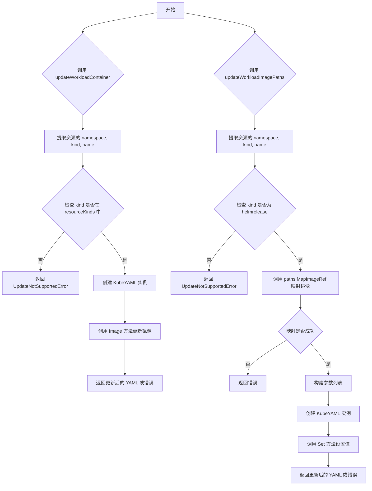
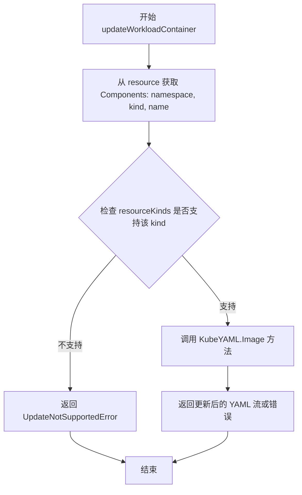
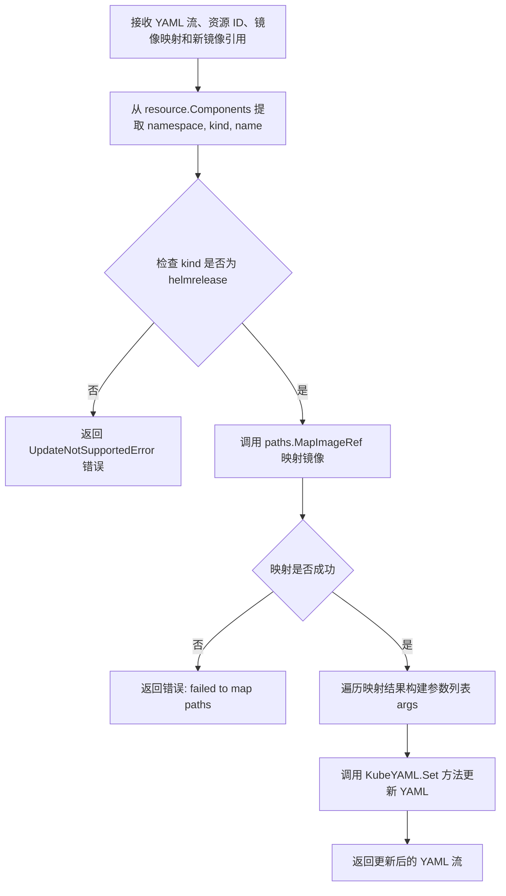

# `flux\pkg\cluster\kubernetes\update.go` 详细设计文档

该文件是 Flux CD 项目中的 Kubernetes 包，负责更新 Kubernetes 资源中的容器镜像。它提供了两个核心函数：一个用于更新指定工作负载容器的镜像，另一个用于更新 HelmRelease 资源的镜像路径。两个函数都接收 YAML 文档流、资源 ID、容器/路径信息和新的镜像引用，返回处理后的 YAML 流或错误。

## 整体流程



## 类结构

```
kubernetes 包 (主包)
├── updateWorkloadContainer (全局函数)
└── updateWorkloadImagePaths (全局函数)
依赖包
├── flux/cluster/kubernetes/resource (kresource)
├── flux/pkg/image (image)
└── flux/pkg/resource (resource)
```

## 全局变量及字段


### `resourceKinds`
    
支持的 Kubernetes 资源种类映射，用于验证资源类型是否支持更新

类型：`map[string]bool`
    


    

## 全局函数及方法


### `updateWorkloadContainer`

更新指定工作负载容器的镜像，接收 YAML 流、资源 ID、容器名和新镜像引用，返回更新后的 YAML 流或错误。

参数：

- `in`：`[]byte`，YAML 文档流（一个或多个 YAML 文档的字节数组）
- `resource`：`resource.ID`，引用控制器的资源 ID
- `container`：`string`，容器名称
- `newImageID`：`image.Ref`，应该用于容器的新镜像引用

返回值：

- `([]byte, error)`，返回更新后的 YAML 流和可能出现的错误

#### 流程图



#### 带注释源码

```go
// updateWorkloadContainer takes a YAML document stream (one or more
// YAML docs, as bytes), a resource ID referring to a controller, a
// container name, and the name of the new image that should be used
// for the container. It returns a new YAML stream where the image for
// the container has been replaced with the imageRef supplied.
// updateWorkloadContainer 更新指定工作负载容器的镜像
// 参数：
//   - in: YAML 文档流（一个或多个 YAML 文档的字节数组）
//   - resource: 引用控制器的资源 ID
//   - container: 容器名称
//   - newImageID: 应该用于容器的新镜像引用
// 返回值：
//   - 更新后的 YAML 流
//   - 错误信息
func updateWorkloadContainer(in []byte, resource resource.ID, container string, newImageID image.Ref) ([]byte, error) {
    // 从 resource 中提取命名空间、资源类型和名称
    namespace, kind, name := resource.Components()
    
    // 检查资源类型是否在支持列表中（不区分大小写）
    // 如果不支持，返回 UpdateNotSupportedError 错误
    if _, ok := resourceKinds[strings.ToLower(kind)]; !ok {
        return nil, UpdateNotSupportedError(kind)
    }
    
    // 调用 KubeYAML 的 Image 方法执行实际的镜像更新操作
    // 传入：YAML 流、命名空间、资源类型、名称、容器名、新镜像字符串
    return (KubeYAML{}).Image(in, namespace, kind, name, container, newImageID.String())
}
```


### `updateWorkloadImagePaths`

更新 HelmRelease 资源的镜像路径，接收 YAML 流、资源ID、容器镜像映射和新镜像引用，返回更新后的 YAML 流或错误。

参数：

- `in`：`[]byte`，YAML 文档流（一个或多个 YAML 文档，作为字节数组）
- `resource`：`resource.ID`，引用 HelmRelease 资源的 ID
- `paths`：`kresource.ContainerImageMap`，容器镜像映射
- `newImageID`：`image.Ref`，应该应用的新镜像引用

返回值：

- `[]byte`：更新后的 YAML 流
- `error`：错误信息

#### 流程图



#### 带注释源码

```go
// updateWorkloadImagePaths takes a YAML document stream (one or more
// YAML docs, as bytes), a resource ID referring to a HelmRelease,
// a ContainerImageMap, and the name of the new image that should be
// applied to the mapped paths. It returns a new YAML stream where
// the values of the paths have been replaced with the imageRef
// supplied.
func updateWorkloadImagePaths(in []byte,
	resource resource.ID, paths kresource.ContainerImageMap, newImageID image.Ref) ([]byte, error) {
	// 从资源 ID 中提取 namespace、kind 和 name 三个组件
	namespace, kind, name := resource.Components()
	
	// 检查资源类型是否为 HelmRelease，目前仅支持 HelmRelease 资源
	if kind != "helmrelease" {
		// 如果不是 HelmRelease，返回不支持该资源类型的错误
		return nil, UpdateNotSupportedError(kind)
	}
	
	// 使用容器镜像映射将新镜像 ID 映射为路径和值的映射表
	if m, ok := paths.MapImageRef(newImageID); ok {
		// 映射成功，初始化 args 切片用于存储参数
		var args []string
		// 遍历映射结果，构建格式为 "key=value" 的参数列表
		for k, v := range m {
			args = append(args, fmt.Sprintf("%s=%s", k, v))
		}
		// 调用 KubeYAML 的 Set 方法，使用构建的参数更新 YAML 文档
		return (KubeYAML{}).Set(in, namespace, kind, name, args...)
	}
	
	// 映射失败，返回详细的错误信息，包含路径映射、资源 ID 和目标镜像
	return nil, fmt.Errorf("failed to map paths %#v to %q for %q", paths, newImageID.String(), resource.String())
}
```

## 关键组件


### updateWorkloadContainer

更新Kubernetes工作负载容器镜像的函数，接收YAML文档流、资源ID、容器名称和新镜像引用，验证资源类型支持后调用KubeYAML的Image方法替换镜像

### updateWorkloadImagePaths

更新HelmRelease资源镜像路径的函数，接收YAML文档流、资源ID、容器镜像映射表和新镜像引用，专用处理helmrelease类型资源并将映射的路径键值对转换为参数后调用KubeYAML的Set方法批量更新

### resourceKinds验证

用于验证目标资源类型是否被支持的资源类型映射表，通过strings.ToLower(kind)进行大小写不敏感匹配，若不在支持的资源类型中则返回UpdateNotSupportedError错误

### KubeYAML镜像操作

隐含的YAML处理类，提供Image方法用于替换指定命名空间、种类、名称和容器下的镜像引用为新镜像字符串

### KubeYAML路径设置

隐含的YAML处理类，提供Set方法用于在指定命名空间、种类、名称下设置多个键值对参数，实现批量更新YAML中的路径值

### 错误处理机制

通过UpdateNotSupportedError函数返回不支持的资源类型错误，以及标准的fmt.Errorf处理映射失败情况


## 问题及建议


### 已知问题

- **硬编码字符串问题**：在 `updateWorkloadImagePaths` 函数中，"helmrelease" 被硬编码为字符串字面量，缺乏常量定义，容易产生拼写错误且不利于后续维护
- **重复代码**：两个函数都重复调用 `resource.Components()` 获取 namespace、kind、name，且都包含资源类型检查逻辑，可抽取公共方法
- **字符串大小写转换开销**：每次调用 `updateWorkloadContainer` 都会执行 `strings.ToLower(kind)`，如果 `resourceKinds` map 的键已经是小写，可考虑在 map 初始化时进行标准化
- **重复方法调用**：`newImageID.String()` 在两处被多次调用，可缓存结果以减少不必要的字符串转换开销
- **空值处理不足**：未对输入参数 `in`、`container`、`resource` 进行空值校验，可能导致运行时 panic
- **循环中字符串拼接**：使用 `fmt.Sprintf` 在循环中拼接字符串，效率不如 `strings.Builder`
- **错误信息缺乏上下文**：返回的错误未使用 wrap 方式保留调用栈信息，不利于生产环境问题排查

### 优化建议

- 提取 "helmrelease" 为包级常量，如 `const HelmReleaseKind = "helmrelease"`
- 将资源类型检查和组件提取逻辑抽取为私有辅助方法，避免重复代码
- 考虑在函数入口处添加参数校验，提前返回明确的错误信息
- 使用 `strings.Builder` 替代循环中的 `fmt.Sprintf` 调用
- 引入 `fmt.Errorf` 的 `%w` 动词包装错误，保留错误链路
- 评估 `KubeYAML` 类型是否为无状态工具类，若是可考虑改为纯函数或单例模式
- 添加日志或监控埋点，记录镜像更新的成功/失败次数和耗时


## 其它


### 设计目标与约束

本代码模块的设计目标是为Flux CD持续交付工具提供Kubernetes资源镜像自动化更新能力。主要约束包括：仅支持Kubernetes原声资源（通过resourceKinds白名单验证）和HelmRelease资源；不支持自定义资源定义（CRD）的镜像更新；YAML文档流必须符合Kubernetes资源规范；镜像引用格式必须符合image.Ref接口规范。

### 错误处理与异常设计

本模块采用显式错误返回机制，主要错误类型包括：UpdateNotSupportedError（不支持的资源类型错误）和标准fmt.Errorf生成的参数错误。updateWorkloadContainer函数在资源类型不在resourceKinds白名单中时返回UpdateNotSupportedError；updateWorkloadImagePaths函数仅支持helmrelease类型，非此类型返回UpdateNotSupportedError；路径映射失败时返回格式化的错误信息。所有错误均通过返回值传播，调用方负责错误处理和日志记录。

### 数据流与状态机

数据输入流程：调用方传入YAML字节数组 → 解析resource.ID获取namespace/kind/name → 验证资源类型支持状态 → 根据资源类型选择更新策略 → 调用KubeYAML实例方法执行实际更新 → 返回更新后的YAML字节数组或错误。状态转换：输入验证状态 → 资源类型检查状态 → 镜像更新执行状态 → 结果返回状态。不存在复杂的状态机，主要为线性处理流程。

### 外部依赖与接口契约

核心依赖包括：github.com/fluxcd/flux/pkg/cluster/kubernetes/resource（提供ContainerImageMap类型和镜像映射能力）；github.com/fluxcd/flux/pkg/image（提供image.Ref镜像引用接口）；github.com/fluxcd/flux/pkg/resource（提供resource.ID资源标识接口）。接口契约要求：resource.ID必须实现Components()方法返回(namespace, kind, name)三元组；image.Ref必须实现String()方法返回镜像引用字符串；KubeYAML类型必须提供Image()和Set()方法处理YAML文档。

### 性能考虑

当前实现每次调用都创建新的KubeYAML{}实例，存在对象创建开销；YAML解析和序列化在大文件场景下可能存在性能瓶颈；镜像路径映射使用for循环遍历map，O(n)复杂度。建议优化方向：可考虑缓存KubeYAML实例以减少对象创建开销；对于大型YAML文档可考虑流式处理或分片处理；可预编译镜像映射规则以提高映射效率。

### 安全性考虑

代码本身不直接涉及敏感数据处理，但存在以下安全考量：资源类型验证依赖resourceKinds白名单，需确保白名单配置安全；镜像引用直接用于YAML更新，需防止注入攻击；错误信息可能暴露内部路径结构，建议生产环境脱敏处理。输入验证：container参数和newImageID需进行格式校验；paths参数需验证映射路径的合法性。

### 测试策略

建议测试覆盖包括：单元测试针对各类资源类型验证错误处理逻辑；集成测试验证与KubeYAML类的交互；边界测试包括空YAML、非法YAML格式、资源不存在场景；性能测试验证大文件处理能力。测试用例应覆盖：支持的资源类型更新成功场景；不支持资源类型返回正确错误；HelmRelease镜像路径映射成功和失败场景；镜像引用格式异常处理。

### 配置说明

本模块无显式配置项，行为受外部依赖控制：resourceKinds定义了支持的Kubernetes资源类型列表（在kubernetes包的其它位置定义）；KubeYAML类负责实际的YAML解析和修改逻辑；ContainerImageMap定义了镜像到路径的映射规则。配置变更可能影响：增加新的支持资源类型需修改resourceKinds；镜像映射规则由调用方通过kresource.ContainerImageMap提供。

### 使用示例

典型使用场景一（更新Deployment容器镜像）：
```go
yamlBytes := []byte("apiVersion: apps/v1\nkind: Deployment\n...")
resourceID := "default:deployment:myapp"
container := "main"
newImage, _ := image.ParseRef("myregistry.io/myapp:v1.1.0")
result, err := updateWorkloadContainer(yamlBytes, resourceID, container, newImage)
```
典型使用场景二（更新HelmRelease镜像）：
```go
yamlBytes := []byte("apiVersion: flux.weave.works/v1beta1\nkind: HelmRelease...")
resourceID := "default:helmrelease:myrelease"
paths := kresource.ContainerImageMap{"image": "spec.values.image"}
newImage, _ := image.ParseRef("myregistry.io/myapp:v1.1.0")
result, err := updateWorkloadImagePaths(yamlBytes, resourceID, paths, newImage)
```

### 版本兼容性

当前代码适用于Flux CD v1版本生态；依赖的image.Ref和resource.ID接口需保持向后兼容；KubeYAML类的接口变更可能影响本模块功能；HelmRelease资源版本需与Flux版本匹配的Kubernetes API版本兼容。

### 日志和监控

当前实现不包含日志记录功能，建议添加：资源类型验证失败时记录警告日志；镜像更新成功时记录调试或信息日志；错误发生时可记录资源标识和错误详情用于问题排查。监控指标建议：镜像更新成功率统计；各资源类型的更新请求计数；更新操作耗时统计。

### 并发和线程安全

本模块为无状态函数设计，函数内部不共享可变状态，每次调用独立创建KubeYAML实例，因此本模块本身是线程安全的。但需注意：调用方传入的YAML字节数组需确保在操作期间不被并发修改；resourceKinds全局变量如被修改需考虑并发安全。

### 边界情况处理

需特殊处理的边界情况包括：YAML文档为空时返回空结果或适当错误；resource.Components()返回空值时的处理；container参数为空字符串时的行为定义；newImageID为nil时的错误处理；paths参数为空map时的处理；YAML中不存在指定容器或路径时的错误返回。


    