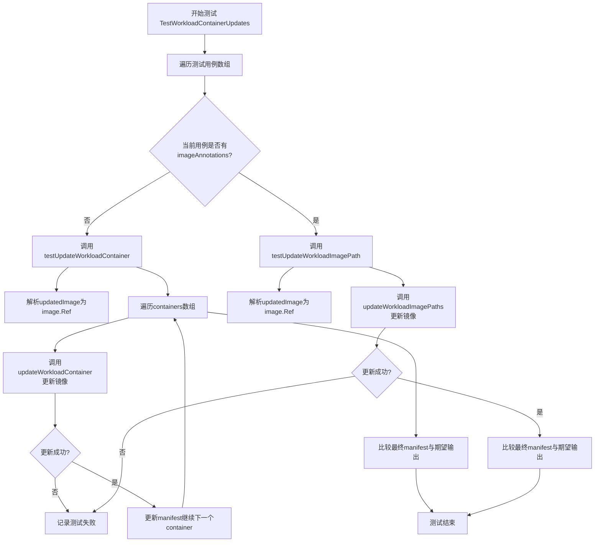
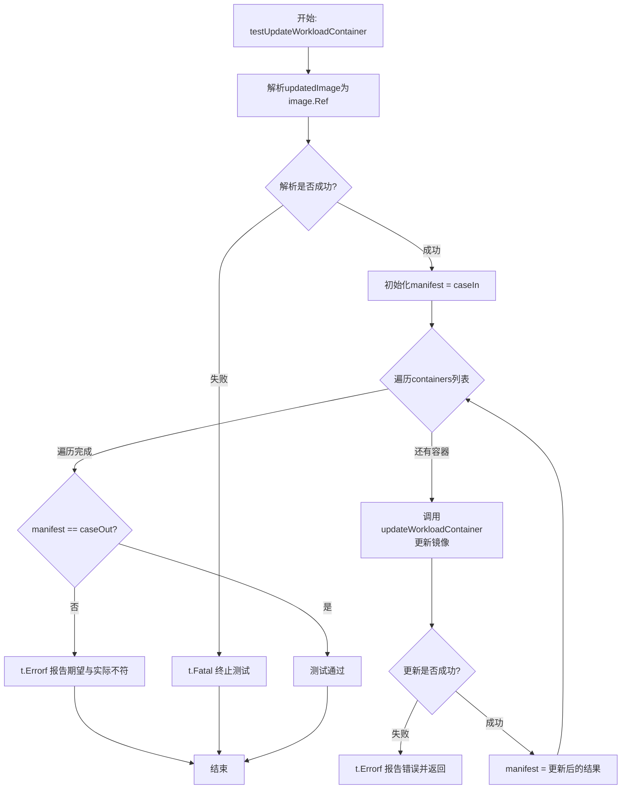
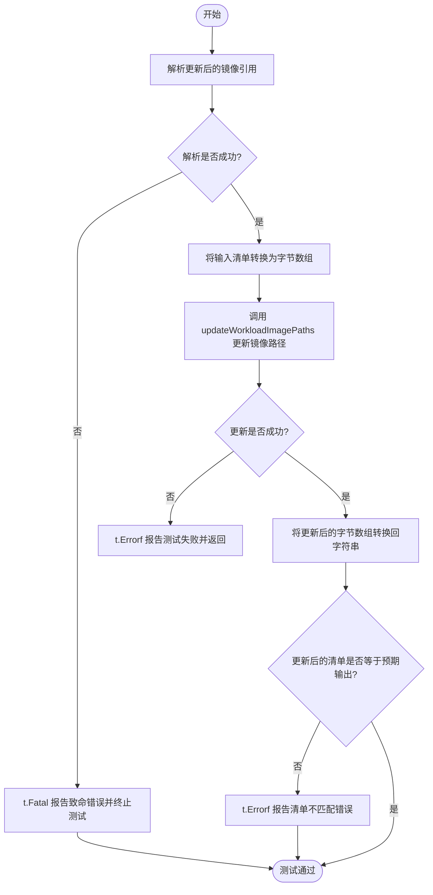
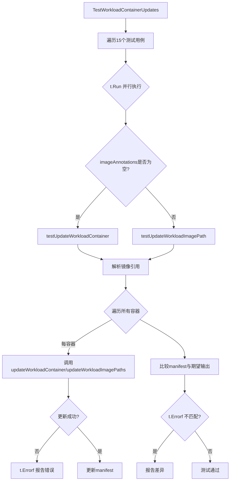

# `flux\pkg\cluster\kubernetes\update_test.go` 详细设计文档

这是一个Go语言测试文件，用于测试Kubernetes工作负载（Deployment）中容器镜像的自动更新功能，支持多种场景包括普通Deployment、多文档YAML、HelmRelease、initContainer等，并验证镜像标签更新的正确性。

## 整体流程



## 类结构

```
测试文件 (update_test.go)
├── update 结构体 (测试用例定义)
├── testUpdateWorkloadContainer 函数
├── testUpdateWorkloadImagePath 函数
├── TestWorkloadContainerUpdates 函数
└── 测试数据 (case1-case15等)
```

## 全局变量及字段


### `emptyContainerImageMap`
    
空的镜像映射，用于普通Deployment测试

类型：`kresource.ContainerImageMap`
    


### `case1`
    
基础测试用例1的输入YAML manifest

类型：`string`
    


### `case1resource`
    
基础测试用例1的Kubernetes资源ID

类型：`string`
    


### `case1image`
    
基础测试用例1的新镜像引用

类型：`string`
    


### `case1container`
    
基础测试用例1需要更新的容器名称列表

类型：`[]string`
    


### `case1out`
    
基础测试用例1的期望输出YAML manifest

类型：`string`
    


### `case2`
    
版本号格式测试的输入YAML manifest

类型：`string`
    


### `case2resource`
    
版本号格式测试的Kubernetes资源ID

类型：`string`
    


### `case2image`
    
版本号格式测试的新镜像引用

类型：`string`
    


### `case2container`
    
版本号格式测试需要更新的容器名称列表

类型：`[]string`
    


### `case2out`
    
版本号格式测试的期望输出YAML manifest

类型：`string`
    


### `case2reverseImage`
    
版本号格式测试的反向镜像引用

类型：`string`
    


### `case3`
    
标签顺序测试的输入YAML manifest

类型：`string`
    


### `case3resource`
    
标签顺序测试的Kubernetes资源ID

类型：`string`
    


### `case3image`
    
标签顺序测试的新镜像引用

类型：`string`
    


### `case3container`
    
标签顺序测试需要更新的容器名称列表

类型：`[]string`
    


### `case3out`
    
标签顺序测试的期望输出YAML manifest

类型：`string`
    


### `case4`
    
带点号版本标签测试的输入YAML manifest

类型：`string`
    


### `case4resource`
    
带点号版本标签测试的Kubernetes资源ID

类型：`string`
    


### `case4image`
    
带点号版本标签测试的新镜像引用

类型：`string`
    


### `case4container`
    
带点号版本标签测试需要更新的容器名称列表

类型：`[]string`
    


### `case4out`
    
带点号版本标签测试的期望输出YAML manifest

类型：`string`
    


### `case5`
    
最小DockerHub镜像名测试的输入YAML manifest

类型：`string`
    


### `case5resource`
    
最小DockerHub镜像名测试的Kubernetes资源ID

类型：`string`
    


### `case5image`
    
最小DockerHub镜像名测试的新镜像引用

类型：`string`
    


### `case5container`
    
最小DockerHub镜像名测试需要更新的容器名称列表

类型：`[]string`
    


### `case5out`
    
最小DockerHub镜像名测试的期望输出YAML manifest

类型：`string`
    


### `case6`
    
键顺序重排测试的输入YAML manifest

类型：`string`
    


### `case6resource`
    
键顺序重排测试的Kubernetes资源ID

类型：`string`
    


### `case6image`
    
键顺序重排测试的新镜像引用

类型：`string`
    


### `case6containers`
    
键顺序重排测试需要更新的容器名称列表

类型：`[]string`
    


### `case6out`
    
键顺序重排测试的期望输出YAML manifest

类型：`string`
    


### `case7`
    
生产环境用例测试的输入YAML manifest

类型：`string`
    


### `case7resource`
    
生产环境用例测试的Kubernetes资源ID

类型：`string`
    


### `case7image`
    
生产环境用例测试的新镜像引用

类型：`string`
    


### `case7containers`
    
生产环境用例测试需要更新的容器名称列表

类型：`[]string`
    


### `case7out`
    
生产环境用例测试的期望输出YAML manifest

类型：`string`
    


### `case8`
    
单引号测试的输入YAML manifest

类型：`string`
    


### `case8resource`
    
单引号测试的Kubernetes资源ID

类型：`string`
    


### `case8image`
    
单引号测试的新镜像引用

类型：`string`
    


### `case8containers`
    
单引号测试需要更新的容器名称列表

类型：`[]string`
    


### `case8out`
    
单引号测试的期望输出YAML manifest

类型：`string`
    


### `case9`
    
多文档YAML测试的输入YAML manifest

类型：`string`
    


### `case9resource`
    
多文档YAML测试的Kubernetes资源ID

类型：`string`
    


### `case9image`
    
多文档YAML测试的新镜像引用

类型：`string`
    


### `case9containers`
    
多文档YAML测试需要更新的容器名称列表

类型：`[]string`
    


### `case9out`
    
多文档YAML测试的期望输出YAML manifest

类型：`string`
    


### `case10`
    
Kubernetes List资源测试的输入YAML manifest

类型：`string`
    


### `case10resource`
    
Kubernetes List资源测试的Kubernetes资源ID

类型：`string`
    


### `case10image`
    
Kubernetes List资源测试的新镜像引用

类型：`string`
    


### `case10containers`
    
Kubernetes List资源测试需要更新的容器名称列表

类型：`[]string`
    


### `case10out`
    
Kubernetes List资源测试的期望输出YAML manifest

类型：`string`
    


### `case14`
    
HelmRelease测试的输入YAML manifest

类型：`string`
    


### `case14resource`
    
HelmRelease测试的Kubernetes资源ID

类型：`string`
    


### `case14ImageMap`
    
HelmRelease测试的镜像路径映射配置

类型：`kresource.ContainerImageMap`
    


### `case14image`
    
HelmRelease测试的新镜像引用

类型：`string`
    


### `case14out`
    
HelmRelease测试的期望输出YAML manifest

类型：`string`
    


### `case15`
    
initContainer测试的输入YAML manifest

类型：`string`
    


### `case15resource`
    
initContainer测试的Kubernetes资源ID

类型：`string`
    


### `case15image`
    
initContainer测试的新镜像引用

类型：`string`
    


### `case15containers`
    
initContainer测试需要更新的容器名称列表

类型：`[]string`
    


### `case15out`
    
initContainer测试的期望输出YAML manifest

类型：`string`
    


### `update.name`
    
测试用例名称

类型：`string`
    


### `update.resourceID`
    
Kubernetes资源ID，格式为 namespace:kind/name

类型：`string`
    


### `update.containers`
    
需要更新的容器名称列表

类型：`[]string`
    


### `update.updatedImage`
    
新的镜像引用

类型：`string`
    


### `update.caseIn`
    
输入的YAML manifest

类型：`string`
    


### `update.caseOut`
    
期望输出的YAML manifest

类型：`string`
    


### `update.imageAnnotations`
    
镜像路径映射配置

类型：`kresource.ContainerImageMap`
    
    

## 全局函数及方法


### testUpdateWorkloadContainer

这是一个辅助测试函数，用于测试在Kubernetes manifest中更新单个容器镜像的功能。它接收包含测试用例数据的update结构体，解析新的镜像引用，然后遍历指定的容器名称列表调用updateWorkloadContainer函数来更新manifest中的镜像，最后验证更新后的结果是否符合预期。

参数：

- `t`：`testing.T`，Go测试框架的测试对象指针，用于报告测试失败
- `u`：`update`，包含测试用例数据的结构体，包含测试名称、资源ID、容器列表、输入输出manifest等信息

返回值：无（Go语言中函数没有返回值）

#### 流程图



#### 带注释源码

```go
// testUpdateWorkloadContainer 是一个辅助测试函数，用于测试单个容器镜像更新
// 参数:
//   - t: *testing.T - Go测试框架的测试对象
//   - u: update - 包含测试用例数据的结构体
//
// 测试流程:
//  1. 解析updatedImage为image.Ref
//  2. 遍历containers列表，逐个更新容器镜像
//  3. 验证更新后的manifest与期望结果是否一致
func testUpdateWorkloadContainer(t *testing.T, u update) {
	// 步骤1: 解析更新的镜像引用
	id, err := image.ParseRef(u.updatedImage)
	if err != nil {
		// 如果解析失败，Fatal会终止当前测试
		t.Fatal(err)
	}

	// 初始化manifest为输入的caseIn
	manifest := u.caseIn
	// 步骤2: 遍历要更新的容器列表
	for _, container := range u.containers {
		var out []byte
		var err error
		// 调用updateWorkloadContainer更新单个容器的镜像
		if out, err = updateWorkloadContainer([]byte(manifest), resource.MustParseID(u.resourceID), container, id); err != nil {
			// 如果更新失败，记录错误信息并返回
			t.Errorf("Failed: %s", err.Error())
			return
		}
		// 将更新后的结果转换为字符串，继续用于下一次迭代或最终验证
		manifest = string(out)
	}
	// 步骤3: 验证最终结果是否符合预期
	if manifest != u.caseOut {
		t.Errorf("id not get expected result:\n\n%s\n\nInstead got:\n\n%s", u.caseOut, manifest)
	}
}
```


### `testUpdateWorkloadImagePath`

辅助测试函数，用于测试带镜像路径映射的更新工作负载功能。该函数接收一个测试用例结构体，解析目标镜像引用，调用 `updateWorkloadImagePaths` 更新 Kubernetes 清单中的镜像路径，并验证更新结果是否符合预期。

参数：

- `t`：`*testing.T`，Go 语言标准测试框架的测试对象，用于报告测试失败和错误信息
- `u`：`update`，测试用例结构体，包含资源 ID、容器名称、更新后的镜像、输入/输出清单以及镜像注解映射等信息

返回值：`void`（无显式返回值），测试结果通过 `*testing.T` 对象报告

#### 流程图



#### 带注释源码

```go
// testUpdateWorkloadImagePath 是一个辅助测试函数，用于测试带镜像路径映射的更新功能
// 参数 t 是 Go 测试框架的测试对象，u 是包含测试用例数据的 update 结构体
func testUpdateWorkloadImagePath(t *testing.T, u update) {
	// 步骤1: 解析更新后的镜像引用
	// 使用 image.ParseRef 解析字符串形式的镜像引用为 image.Ref 类型
	id, err := image.ParseRef(u.updatedImage)
	// 如果解析失败，调用 t.Fatal 报告致命错误并终止测试
	if err != nil {
		t.Fatal(err)
	}

	// 步骤2: 初始化清单内容
	// 将输入的 YAML 清单字符串赋值给 manifest 变量
	manifest := u.caseIn
	
	// 步骤3: 调用 updateWorkloadImagePaths 更新镜像路径
	// 参数说明:
	//   - []byte(manifest): 将清单字符串转换为字节数组
	//   - resource.MustParseID(u.resourceID): 解析资源 ID（如 "default:deployment/nginx"）
	//   - u.imageAnnotations: 镜像注解映射，用于 HelmRelease 等自定义资源
	//   - id: 解析后的镜像引用
	var out []byte
	if out, err = updateWorkloadImagePaths([]byte(manifest), resource.MustParseID(u.resourceID), u.imageAnnotations, id); err != nil {
		// 如果更新失败，调用 t.Errorf 报告错误并提前返回
		t.Errorf("Failed: %s", err.Error())
		return
	}
	
	// 步骤4: 将更新后的字节数组转换回字符串
	manifest = string(out)
	
	// 步骤5: 验证更新结果
	// 比较更新后的清单与预期的输出清单
	if manifest != u.caseOut {
		// 如果不匹配，报告详细的错误信息，显示预期输出和实际输出
		t.Errorf("it did not get expected result:\n\n%s\n\nInstead got:\n\n%s", u.caseOut, manifest)
	}
}
```


### TestWorkloadContainerUpdates

这是 Kubernetes 包中的主测试函数，用于测试容器镜像更新功能。它遍历 15 个不同的测试用例（包括普通场景、版本号格式、多文档、HelmRelease、initContainer 等），并行执行测试以验证镜像更新逻辑的正确性。

#### 全局变量和常量

| 名称 | 类型 | 描述 |
|------|------|------|
| `emptyContainerImageMap` | `kresource.ContainerImageMap` | 空的容器镜像映射，用于普通测试场景 |
| `case1` ~ `case15` | `const string` | 各测试用例的输入 YAML 配置 |
| `case1out` ~ `case15out` | `const string` | 各测试用例的期望输出 YAML 配置 |
| `case1resource` ~ `case15resource` | `const string` | 各测试用例的资源 ID（如 "extra:deployment/pr-assigner"） |
| `case1image` ~ `case15image` | `const string` | 各测试用例的更新后镜像引用 |
| `case1container` ~ `case15containers` | `[]string` | 各测试用例需要更新的容器名称列表 |
| `case14ImageMap` | `kresource.ContainerImageMap` | HelmRelease 测试用例的镜像映射配置 |

#### 辅助测试函数

##### testUpdateWorkloadContainer

参数：
- `t`：`*testing.T`，Go 测试框架的测试对象
- `u`：`update`，包含测试用例数据的结构体

返回值：`void`，通过 `t.Error` 或 `t.Fatal` 报告测试结果

功能：解析镜像引用，遍历指定容器调用 `updateWorkloadContainer` 更新镜像，比较实际输出与期望输出。

##### testUpdateWorkloadImagePath

参数：
- `t`：`*testing.T`，Go 测试框架的测试对象
- `u`：`update`，包含测试用例数据的结构体

返回值：`void`，通过 `t.Error` 或 `t.Fatal` 报告测试结果

功能：解析镜像引用，调用 `updateWorkloadImagePaths` 使用镜像映射路径更新镜像，比较实际输出与期望输出。

#### 流程图



#### 带注释源码

```go
// TestWorkloadContainerUpdates 是主测试函数，遍历所有测试用例并行执行
func TestWorkloadContainerUpdates(t *testing.T) {
    // 遍历测试用例切片，每个元素是一个 update 结构体
    for _, c := range []update{
        // 15个测试用例，包括：
        // 1. 普通场景 - 基础Deployment镜像更新
        // 2. 数字版本号 - 类似master-a000001格式
        // 3. 旧版本号 - 反向更新测试
        // 4. 标签乱序 - name label位置不同
        // 5. 带点版本号 - v_0.2.0格式
        // 6. 最小Docker镜像 - nginx无版本
        // 7. 键重排 - YAML键顺序不同
        // 8. 生产环境 - 来自真实场景
        // 9. 单引号 - 镜像名用单引号
        // 10. 多文档 - YAML多文档格式
        // 11. Kubernetes List - List资源类型
        // 12. HelmRelease - Helm Release资源+镜像映射
        // 13. initContainer - 初始化容器更新
        {"common case", case1resource, case1container, case1image, case1, case1out, emptyContainerImageMap},
        {"new version like number", case2resource, case2container, case2image, case2, case2out, emptyContainerImageMap},
        {"old version like number", case2resource, case2container, case2reverseImage, case2out, case2, emptyContainerImageMap},
        {"name label out of order", case3resource, case3container, case3image, case3, case3out, emptyContainerImageMap},
        {"version (tag) with dots", case4resource, case4container, case4image, case4, case4out, emptyContainerImageMap},
        {"minimal dockerhub image name", case5resource, case5container, case5image, case5, case5out, emptyContainerImageMap},
        {"reordered keys", case6resource, case6containers, case6image, case6, case6out, emptyContainerImageMap},
        {"from prod", case7resource, case7containers, case7image, case7, case7out, emptyContainerImageMap},
        {"single quotes", case8resource, case8containers, case8image, case8, case8out, emptyContainerImageMap},
        {"in multidoc", case9resource, case9containers, case9image, case9, case9out, emptyContainerImageMap},
        {"in kubernetes List resource", case10resource, case10containers, case10image, case10, case10out, emptyContainerImageMap},
        {"HelmRelease (v1; with image map)", case14resource, make([]string, 0), case14image, case14, case14out, case14ImageMap},
        {"initContainer", case15resource, case15containers, case15image, case15, case15out, emptyContainerImageMap},
    } {
        // 使用t.Run为每个用例创建子测试，子测试名称为c.name
        t.Run(c.name, func(t *testing.T) {
            // 复制c到localC，避免并行测试与循环变量的竞态条件
            localC := c // Use copy to avoid races between the parallel tests and the loop
            // 开启并行测试，提高测试执行效率
            t.Parallel()
            // 根据imageAnnotations判断使用哪个辅助函数
            switch localC.imageAnnotations {
            case emptyContainerImageMap:
                // 标准镜像更新测试
                testUpdateWorkloadContainer(t, localC)
            default:
                // 使用镜像映射路径的更新测试（HelmRelease场景）
                testUpdateWorkloadImagePath(t, localC)
            }
        })
    }
}
```

#### 关键组件信息

| 组件名称 | 描述 |
|---------|------|
| `update` 结构体 | 测试用例数据结构，包含名称、资源ID、容器列表、镜像、输入输出YAML、镜像映射 |
| `updateWorkloadContainer` | 被测函数（未在代码中定义），执行容器镜像更新 |
| `updateWorkloadImagePath` | 被测函数（未在代码中定义），使用镜像映射路径更新 |
| `kresource.ContainerImageMap` | 镜像映射类型，用于HelmRelease的自定义镜像字段 |

#### 潜在技术债务与优化空间

1. **测试数据耦合**：大量硬编码的 YAML 常量与测试逻辑混合，建议分离到独立测试数据文件
2. **重复断言模式**：两个辅助函数有重复的断言逻辑，可抽象通用比较函数
3. **并行测试安全**：虽然使用了 `localC := c` 避免竞态，但某些复杂场景下仍需注意
4. **缺少边界测试**：如空容器列表、无效镜像格式、资源不存在等场景未覆盖

#### 其它项目

- **设计目标**：验证 Kubernetes Deployment/HelmRelease 等资源的容器镜像更新功能正确处理各种 YAML 格式、注释、多文档等场景
- **约束条件**：测试仅覆盖 YAML 格式，不包含 JSON 格式的 Kubernetes 资源
- **错误处理**：通过 `t.Errorf` 报告差异，通过 `t.Fatal` 处理致命错误（如镜像解析失败）
- **外部依赖**：依赖 `fluxcd/flux` 包的 `image`、`resource`、`kubernetes/resource` 模块

## 关键组件


### update 结构体

用于定义单个测试用例的数据结构，包含测试名称、资源ID、容器列表、更新后的镜像、输入输出 YAML 以及镜像注解映射。

### updateWorkloadContainer 函数

更新 Kubernetes Deployment 或其他工作负载中指定容器的镜像标签，解析镜像引用并替换 YAML 中的镜像字段。

### updateWorkloadImagePaths 函数

根据镜像注解映射（用于 HelmRelease）更新资源中的镜像引用，支持通过自定义注解路径更新镜像仓库和标签。

### ContainerImageMap 结构体

定义容器镜像的映射关系，包含基础路径、仓库和标签字段，用于 HelmRelease 等支持自定义镜像注解的场景。

### HelmRelease 支持

通过镜像注解方式（repository.fluxcd.io/xxx 和 tag.fluxcd.io/xxx）支持 HelmRelease 资源的镜像更新，将注解值映射到 YAML 的 values 字段。

### 多文档 YAML 支持

支持处理 Kubernetes 多文档 YAML（用 --- 分隔），能够在一个 YAML 文件中处理多个资源（Namespace、Deployment、Service 等）。

### Kubernetes List 资源支持

支持处理 kind: List 类型的资源，能够遍历并更新其中的多个子资源。

### initContainer 支持

支持更新 Deployment 中的 initContainers 字段的镜像，与普通容器使用相同的更新逻辑。

### 并行测试框架

使用 Go 的 t.Parallel() 实现测试并行执行，每个测试用例通过 localC 副本避免竞态条件。

### 错误处理机制

测试函数使用 t.Errorf 报告错误并提前返回，确保单个测试用例失败不影响其他用例执行。


## 问题及建议


### 已知问题

- **废弃的Kubernetes API版本**：测试数据中大量使用 `extensions/v1beta1`，这是Kubernetes 1.16+已废弃的API，应升级到 `apps/v1`
- **硬编码的测试数据冗长**：大量YAML字符串作为测试数据嵌入代码中，降低了代码可读性和可维护性
- **测试函数重复代码**：`testUpdateWorkloadContainer` 和 `testUpdateWorkloadImagePath` 函数结构高度相似，解析镜像引用的逻辑重复
- **变量声明不一致**：部分使用 `const`，部分使用 `var`（如 `case1container`），缺乏统一风格
- **缺少错误场景测试**：仅测试正常路径，缺少对无效输入、异常镜像格式、解析失败等边界情况的覆盖
- **并行测试利用率不足**：虽然启用了 `t.Parallel()`，但由于测试数据量大且包含YAML解析，实际并行效果可能有限

### 优化建议

- **提取测试数据到单独文件**：将大型YAML测试数据移至外部文件或使用表格驱动测试的外部数据源
- **重构测试辅助函数**：将 `testUpdateWorkloadContainer` 和 `testUpdateWorkloadImagePath` 的公共逻辑提取为独立函数，减少重复
- **统一变量声明风格**：根据数据特性统一使用 `const` 或 `var`
- **增加边界测试用例**：添加无效镜像格式、资源ID错误、YAML语法错误等异常场景测试
- **升级Kubernetes API版本**：将测试数据中的 `extensions/v1beta1` 升级为 `apps/v1` 或 `batch/v1`

## 其它


### 设计目标与约束

本模块的核心设计目标是实现对Kubernetes资源（如Deployment、HelmRelease等）中容器镜像标签的自动化更新功能。设计约束包括：1）仅支持YAML格式的Kubernetes清单文件；2）支持的资源类型包括Deployment、StatefulSet、DaemonSet、Job、CronJob以及HelmRelease；3）需要保持原始YAML的格式和注释；4）支持多文档（multi-document）YAML文件处理；5）需要兼容Kubernetes不同API版本（v1、v1beta1等）。

### 错误处理与异常设计

代码中的错误处理主要通过以下方式实现：1）使用`image.ParseRef`解析镜像引用，解析失败时调用`t.Fatal(err)`立即终止测试；2）`updateWorkloadContainer`和`updateWorkloadImagePaths`函数返回错误时，使用`t.Errorf`记录错误并提前返回，避免后续断言执行；3）错误信息包含详细的上下文（资源ID、容器名称等），便于问题定位。潜在改进：可以增加更细粒度的错误分类（如解析错误、序列化错误、资源不存在错误），并为每种错误提供具体的恢复建议。

### 数据流与状态机

数据流主要分为三个阶段：1）输入阶段：接收YAML格式的manifest字符串、资源ID、容器名称列表（或镜像注解映射）以及新的镜像引用；2）处理阶段：调用底层更新函数修改YAML中的镜像字段，支持迭代更新多个容器；3）输出阶段：返回更新后的YAML字符串并进行断言验证。状态机方面，主要涉及YAML解析状态（单文档/多文档）、资源类型识别状态（Deployment/HelmRelease等）、容器匹配状态（查找目标容器）以及镜像更新状态。

### 外部依赖与接口契约

本模块依赖以下外部包：1）`github.com/fluxcd/flux/pkg/cluster/kubernetes/resource`——提供`ContainerImageMap`类型和镜像映射配置；2）`github.com/fluxcd/flux/pkg/image`——提供镜像引用解析功能；3）`github.com/fluxcd/flux/pkg/resource`——提供资源ID解析功能。接口契约方面，`updateWorkloadContainer`函数接收字节数组形式的manifest、资源ID、容器名称和新镜像ID，返回更新后的字节数组和可能发生的错误；`updateWorkloadImagePaths`函数类似但使用镜像注解映射进行路径更新。

### 性能考虑

当前实现采用逐个容器迭代更新的方式，对于包含大量容器的Deployment可能存在性能瓶颈。测试用例采用` t.Parallel()`实现并行执行，提升测试效率。潜在优化方向：1）考虑使用流式处理减少内存复制；2）对于多容器场景，可以批量处理而非逐个迭代；3）缓存已解析的YAML结构以避免重复解析。

### 安全性考虑

代码主要处理YAML字符串操作，安全性风险较低。但需要注意：1）镜像引用解析应验证输入格式，防止注入攻击；2）YAML处理过程中不应执行任何远程操作；3）测试用例中的镜像标签应避免使用真实生产环境标签，防止误操作。

### 版本兼容性

测试用例覆盖了多种Kubernetes API版本（v1、v1beta1、extensions/v1beta1、helm.fluxcd.io/v1），体现了版本兼容性考量。但代码中使用的`extensions/v1beta1`API在较新版本的Kubernetes中已被废弃，建议：1）增加对`apps/v1`API版本的支持；2）提供版本迁移路径说明；3）考虑在未来版本中弃用对废弃API版本的支持。

### 测试策略

当前测试采用表格驱动测试（Table-Driven Tests）模式，覆盖了13种不同场景：1）基本Deployment更新；2）数字形式版本号；3）版本号反转；4）无序标签；5）带点号的版本标签；6）简化Docker Hub镜像名；7）键值重排；8）生产环境案例；9）单引号；10）多文档；11）Kubernetes List资源；12）HelmRelease带镜像映射；13）initContainer更新。测试覆盖了正向和反向场景，建议增加：边界条件测试（如空manifest、格式错误的YAML）、大批量容器场景测试、以及资源不存在场景的异常测试。

### 监控与可观测性

当前代码为测试文件，未包含生产级别的监控指标。如需在生产环境中使用，建议：1）添加更新操作的日志记录，包括资源类型、名称空间、更新前后镜像信息；2）暴露更新成功/失败计数器指标；3）记录处理时长用于性能监控；4）集成到Flux CD的现有监控体系。

### 部署注意事项

由于本代码为测试文件，部署时需要注意：1）实际功能实现位于依赖包中，需确保依赖版本兼容性；2）该模块主要供Flux CD内部使用，不建议单独部署；3）在Kubernetes集群中使用时，应确保有足够的权限读取和更新目标资源。

### 依赖版本管理

测试文件直接依赖三个外部包，建议在项目中锁定以下版本：1）fluxcd/flux相关包应使用兼容版本；2）Kubernetes资源包版本需与目标集群版本匹配；3）注意`kresource.ContainerImageMap`的结构在不同版本可能存在差异。


    