# `flux\pkg\cluster\mock\mock.go` 详细设计文档

这是一个Mock实现包，通过函数类型的字段模拟Flux CD项目中cluster.Cluster和manifests.Manifests两个核心接口的所有功能，实现依赖注入式的测试替身，支持对集群操作、清单解析、工作负载管理等功能的完全可配置化模拟。

## 整体流程

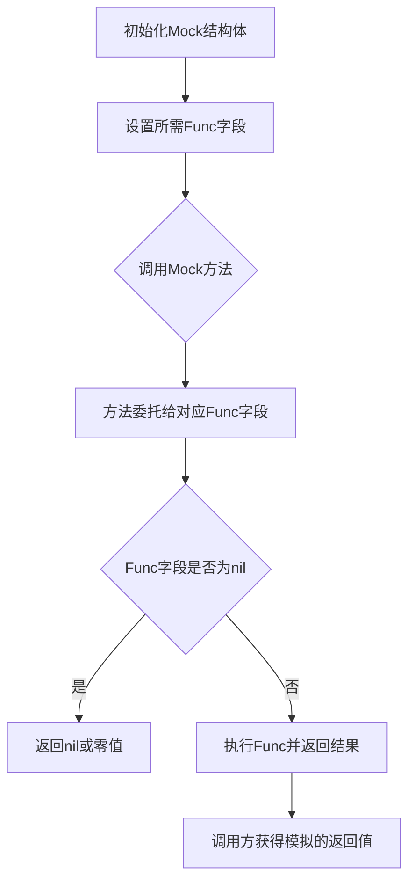

## 类结构

```
Mock (实现双接口的模拟结构体)
├── 实现: cluster.Cluster 接口
│   ├── AllWorkloads
│   ├── SomeWorkloads
│   ├── IsAllowedResource
│   ├── Ping
│   ├── Export
│   ├── Sync
│   └── PublicSSHKey
└── 实现: manifests.Manifests 接口
    ├── SetWorkloadContainerImage
    ├── LoadManifests
    ├── ParseManifest
    ├── UpdateWorkloadPolicies
    ├── CreateManifestPatch
    ├── ApplyManifestPatch
    └── AppendManifestToBuffer
```

## 全局变量及字段


### `_`
    
Compile-time check that Mock implements the cluster.Cluster interface.

类型：`cluster.Cluster`
    


### `_`
    
Compile-time check that Mock implements the manifests.Manifests interface.

类型：`manifests.Manifests`
    


### `Mock.AllWorkloadsFunc`
    
Mock implementation of cluster.Cluster.AllWorkloads, retrieves all workloads for a given namespace.

类型：`func(ctx context.Context, maybeNamespace string) ([]cluster.Workload, error)`
    


### `Mock.SomeWorkloadsFunc`
    
Mock implementation of cluster.Cluster.SomeWorkloads, retrieves specific workloads by their IDs.

类型：`func(ctx context.Context, ids []resource.ID) ([]cluster.Workload, error)`
    


### `Mock.IsAllowedResourceFunc`
    
Mock implementation of cluster.Cluster.IsAllowedResource, checks if a resource ID is allowed.

类型：`func(resource.ID) bool`
    


### `Mock.PingFunc`
    
Mock implementation of cluster.Cluster.Ping, checks cluster connectivity.

类型：`func() error`
    


### `Mock.ExportFunc`
    
Mock implementation of cluster.Cluster.Export, exports cluster state as bytes.

类型：`func(ctx context.Context) ([]byte, error)`
    


### `Mock.SyncFunc`
    
Mock implementation of cluster.Cluster.Sync, applies a sync set to the cluster.

类型：`func(cluster.SyncSet) error`
    


### `Mock.PublicSSHKeyFunc`
    
Mock implementation of cluster.Cluster.PublicSSHKey, returns the public SSH key for GitOps.

类型：`func(regenerate bool) (ssh.PublicKey, error)`
    


### `Mock.SetWorkloadContainerImageFunc`
    
Mock implementation of cluster.Cluster.SetWorkloadContainerImage, updates a container image in a workload definition.

类型：`func(def []byte, id resource.ID, container string, newImageID image.Ref) ([]byte, error)`
    


### `Mock.LoadManifestsFunc`
    
Mock implementation of manifests.Manifests.LoadManifests, loads manifest files from a base directory.

类型：`func(base string, paths []string) (map[string]resource.Resource, error)`
    


### `Mock.ParseManifestFunc`
    
Mock implementation of manifests.Manifests.ParseManifest, parses a manifest definition into resources.

类型：`func(def []byte, source string) (map[string]resource.Resource, error)`
    


### `Mock.UpdateWorkloadPoliciesFunc`
    
Mock implementation of manifests.Manifests.UpdateWorkloadPolicies, updates policies for a workload.

类型：`func([]byte, resource.ID, resource.PolicyUpdate) ([]byte, error)`
    


### `Mock.CreateManifestPatchFunc`
    
Mock implementation of manifests.Manifests.CreateManifestPatch, creates a diff patch between original and modified manifests.

类型：`func(originalManifests, modifiedManifests []byte, originalSource, modifiedSource string) ([]byte, error)`
    


### `Mock.ApplyManifestPatchFunc`
    
Mock implementation of manifests.Manifests.ApplyManifestPatch, applies a patch to original manifests.

类型：`func(originalManifests, patch []byte, originalSource, patchSource string) ([]byte, error)`
    


### `Mock.AppendManifestToBufferFunc`
    
Mock implementation of manifests.Manifests.AppendManifestToBuffer, appends a manifest to a buffer.

类型：`func([]byte, *bytes.Buffer) error`
    
    

## 全局函数及方法


### `Mock.AllWorkloads`

该方法是 `Mock` 结构体的代理方法，用于获取集群中所有工作负载（Workloads）。它将对 `AllWorkloadsFunc` 字段的调用进行委托，支持可选的命名空间过滤，返回工作负载列表或错误信息。

**参数：**

- `ctx`：`context.Context`，上下文对象，用于传递请求范围内的取消信号和截止时间
- `maybeNamespace`：`string`，可选的命名空间参数，用于过滤特定命名空间下的工作负载；若为空字符串，则表示获取所有命名空间的工作负载

**返回值：** `([]cluster.Workload, error)`

- `[]cluster.Workload`：返回符合条件的工作负载切片，可能为空切片
- `error`：执行过程中出现的错误，如无法连接集群、权限不足等

#### 流程图

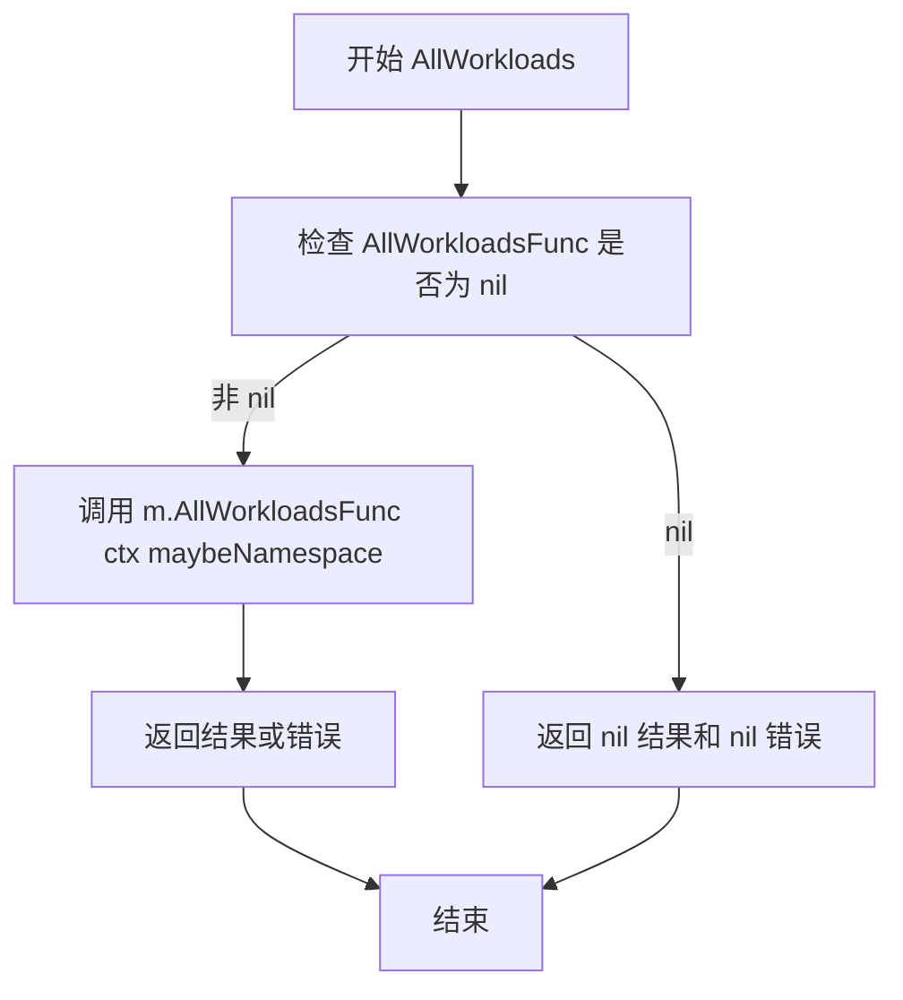

#### 带注释源码

```go
// AllWorkloads 实现 cluster.Cluster 接口的 AllWorkloads 方法
// 该方法是对 AllWorkloadsFunc 字段的代理调用，用于获取集群中所有工作负载
// 参数 ctx 用于控制请求的生命周期，maybeNamespace 用于过滤特定命名空间
func (m *Mock) AllWorkloads(ctx context.Context, maybeNamespace string) ([]cluster.Workload, error) {
	// 委托给 AllWorkloadsFunc 字段执行实际的业务逻辑
	// 这种模式允许在测试或 mock 场景下自定义该方法的行为
	return m.AllWorkloadsFunc(ctx, maybeNamespace)
}
```


### `Mock.SomeWorkloads`

该方法是一个模拟（Mock）实现，用于测试目的。它将调用委托给 `Mock` 结构体中的 `SomeWorkloadsFunc` 字段，该字段是一个函数类型的值，用于返回指定资源 ID 列表对应的工作负载。

参数：

- `ctx`：`context.Context`，上下文对象，用于传递请求范围内的取消信号、截止时间和其他请求范围的值
- `ids`：`[]resource.ID`，资源 ID 切片，用于指定要查询的工作负载

返回值：`([]cluster.Workload, error)`，返回与给定 IDs 匹配的工作负载切片，以及可能的错误信息

#### 流程图

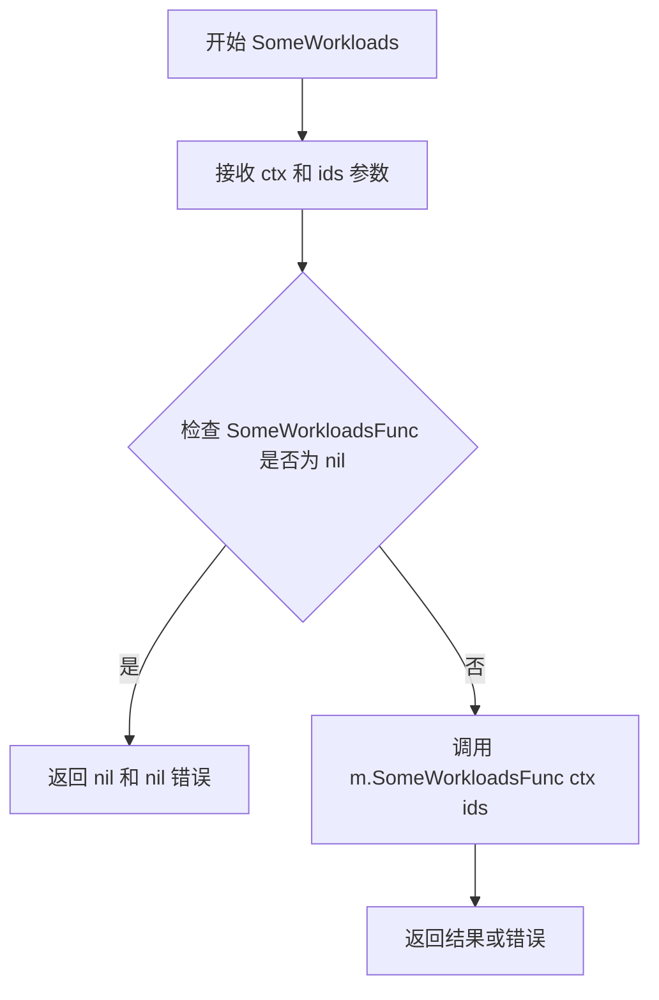

#### 带注释源码

```go
// SomeWorkloads 实现 cluster.Cluster 接口
// 用于获取指定资源 ID 列表对应的工作负载
// 参数 ctx 用于控制请求生命周期，ids 指定要查询的资源 ID
func (m *Mock) SomeWorkloads(ctx context.Context, ids []resource.ID) ([]cluster.Workload, error) {
    // 委托给 Mock 结构体中存储的函数类型字段执行实际逻辑
    // 这种模式允许在测试时注入自定义的模拟行为
    return m.SomeWorkloadsFunc(ctx, ids)
}
```


### `Mock.IsAllowedResource`

该方法用于检查指定的资源 ID 是否被允许。它是一个模拟实现，实际的检查逻辑通过委托给在初始化 `Mock` 实例时注入的 `IsAllowedResourceFunc` 函数来实现。

参数：

-  `id`：`resource.ID`，需要检查权限的资源标识符。

返回值：`bool`，如果资源 ID 被允许则返回 true，否则返回 false。

#### 流程图

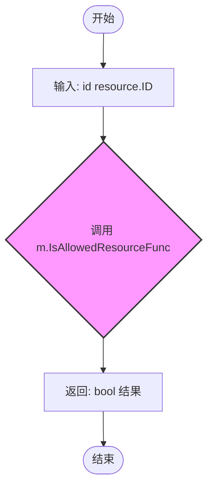

#### 带注释源码

```go
// IsAllowedResource 检查给定的资源 ID 是否为允许的资源。
// 它委托调用用户定义的 IsAllowedResourceFunc 闭包或函数。
// 参数: id resource.ID - 要检查的资源标识符。
// 返回值: bool - 表示该资源是否被允许。
func (m *Mock) IsAllowedResource(id resource.ID) bool {
	// 调用 Mock 结构体中存储的函数变量来执行实际的检查逻辑
	return m.IsAllowedResourceFunc(id)
}
```


### `Mock.Ping`

该方法用于模拟对集群连接的检查，通过调用 Mock 结构体中存储的 PingFunc 函数指针来执行实际的 ping 操作，返回可能的错误信息。

参数： 无

返回值：`error`，返回 Ping 操作过程中可能产生的错误，若成功则返回 nil

#### 流程图

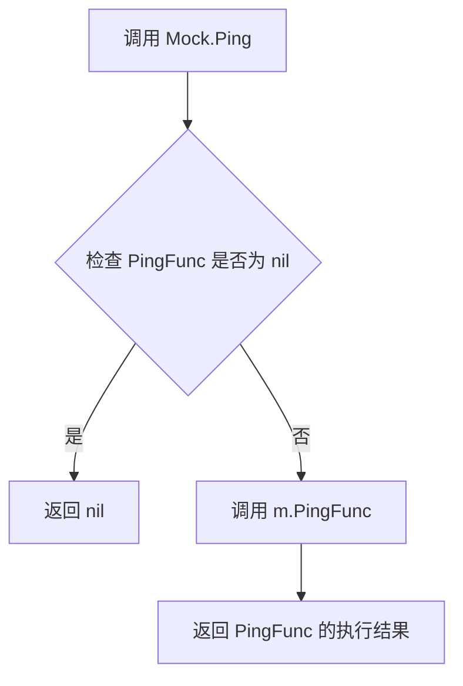

#### 带注释源码

```go
// Ping 方法用于模拟集群连接的 ping 检查
// 该方法实现了 cluster.Cluster 接口的 Ping 方法
// 它将调用委托给 Mock 结构体中存储的 PingFunc 函数指针
func (m *Mock) Ping() error {
    // 直接返回 PingFunc 的执行结果
    // 如果 PingFunc 未被设置（为 nil），则会导致 panic
    // 因此调用方需要确保在使用前已正确设置 PingFunc
    return m.PingFunc()
}
```


### `Mock.Export`

该函数是Mock类型的导出方法，用于模拟集群配置的导出功能。它委托给Mock结构体中存储的ExportFunc函数字段执行实际导出逻辑，返回导出配置后的字节数组和可能的错误。

#### 参数

- `ctx`：`context.Context`，上下文对象，用于传递请求作用域的截止日期、取消信号和其他请求范围的值

#### 返回值

- `([]byte, error)`：返回导出的配置字节数组，如果发生错误则返回错误信息

#### 流程图

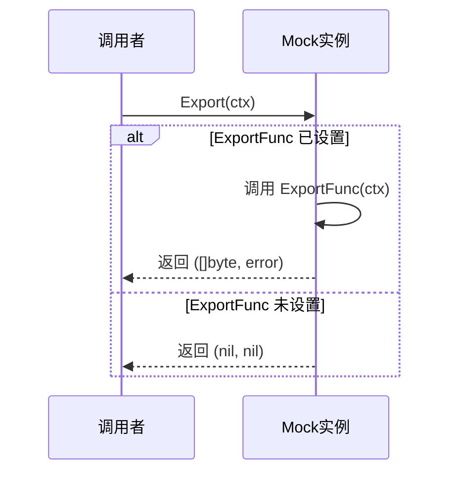

#### 带注释源码

```go
// Export 是Mock类型的导出方法，用于模拟集群配置的导出
// 它将调用委托给Mock结构体中存储的ExportFunc函数字段
// 参数ctx用于传递上下文信息，如超时、取消信号等
func (m *Mock) Export(ctx context.Context) ([]byte, error) {
	// 调用存储在Mock结构体中的ExportFunc字段执行实际导出逻辑
	// 如果ExportFunc未设置（为nil），此处会panic，因此调用前需确保已设置
	return m.ExportFunc(ctx)
}
```


### `Mock.Sync`

该方法是 `Mock` 结构体实现的 `cluster.Cluster` 接口的 `Sync` 方法，用于模拟集群同步操作，将给定的 SyncSet 同步到目标集群。

参数：

- `c`：`cluster.SyncSet`，需要同步的 SyncSet 对象，包含同步所需的目标和资源信息

返回值：`error`，同步操作返回的错误，如果为 nil 表示同步成功

#### 流程图

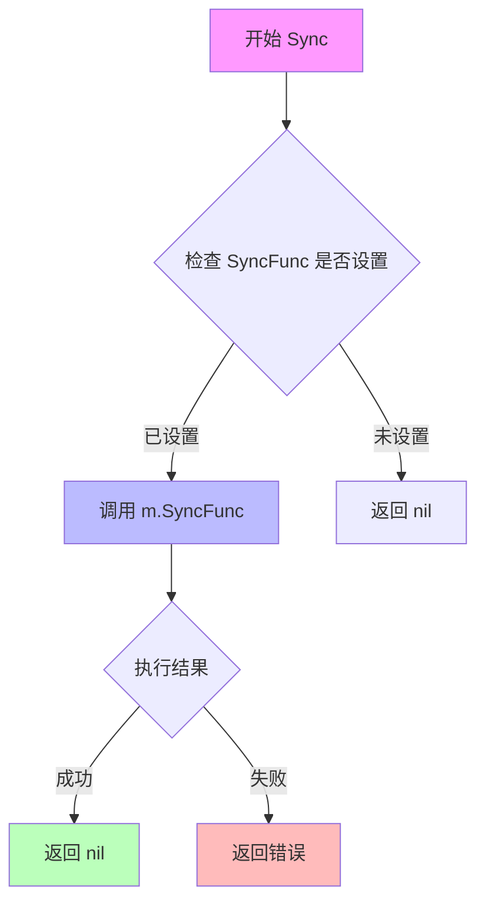

#### 带注释源码

```go
// Sync 实现 cluster.Cluster 接口的 Sync 方法
// 用于模拟集群同步操作，将 SyncSet 同步到目标集群
func (m *Mock) Sync(c cluster.SyncSet) error {
    // 委托给 Mock 结构体中预设的 SyncFunc 函数执行实际的同步逻辑
    // 如果 SyncFunc 未设置（为 nil），此处会触发 panic，因此使用时需确保已设置
    return m.SyncFunc(c)
}
```


### `Mock.PublicSSHKey`

**描述**：这是对集群（Cluster）或清单（Manifests）接口中 `PublicSSHKey` 方法的模拟（Mock）实现。它采用委托模式，将具体的公钥生成逻辑转发给 `Mock` 结构体中注入的函数变量 `PublicSSHKeyFunc` 执行，从而解耦了测试逻辑与具体实现。

**参数**：

- `regenerate`：`bool`，表示是否强制重新生成新的 SSH 密钥对。如果为 `true`，实现通常会忽略缓存并重新计算；为 `false` 时可能直接返回已缓存的公钥。

**返回值**：

- `ssh.PublicKey`：成功生成的 SSH 公钥对象。
- `error`：操作过程中发生的错误，如果成功则返回 `nil`。

#### 流程图

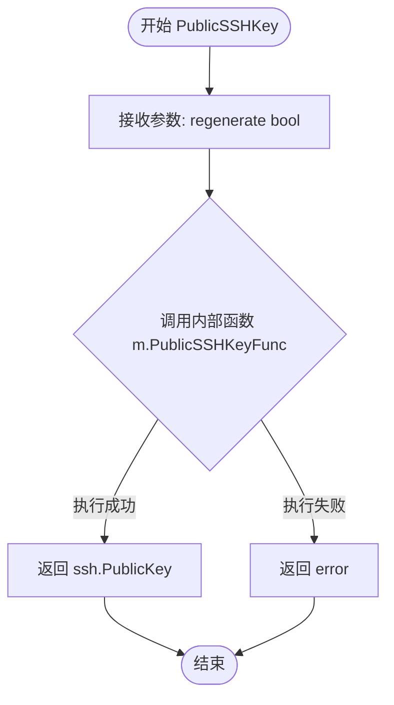

#### 带注释源码

```go
// PublicSSHKeyFunc 是定义在 Mock 结构体中的函数变量，用于注入具体的公钥生成逻辑
// 签名: func(regenerate bool) (ssh.PublicKey, error)

// PublicSSHKey 是集群/清单接口的实现方法
// 职责：将获取 SSH 公钥的请求委托给内部函数 PublicSSHKeyFunc
func (m *Mock) PublicSSHKey(regenerate bool) (ssh.PublicKey, error) {
	// 调用 Mock 对象中存储的函数变量，传入 regenerate 参数
	// 如果该函数未被赋值（nil），此处调用会抛出 panic，因此 Mock 对象必须在使用时确保该字段已被赋值
	return m.PublicSSHKeyFunc(regenerate)
}
```


### `Mock.SetWorkloadContainerImage`

该方法是 `Mock` 类型的成员方法，用于在测试场景中模拟更新 Kubernetes 工作负载容器镜像的操作。它通过委托模式将实际执行逻辑转发给预定义的 `SetWorkloadContainerImageFunc` 函数成员，从而实现行为可配置化，支持灵活的单元测试和集成测试场景。

#### 参数

- `def`：`[]byte`，原始的 Kubernetes 资源清单定义（YAML/JSON 格式的字节数组）
- `id`：`resource.ID`，要更新镜像的工作负载资源标识符
- `container`：`string`，目标容器的名称
- `newImageID`：`image.Ref`，新的容器镜像引用（包含镜像仓库、标签等信息）

#### 流程图

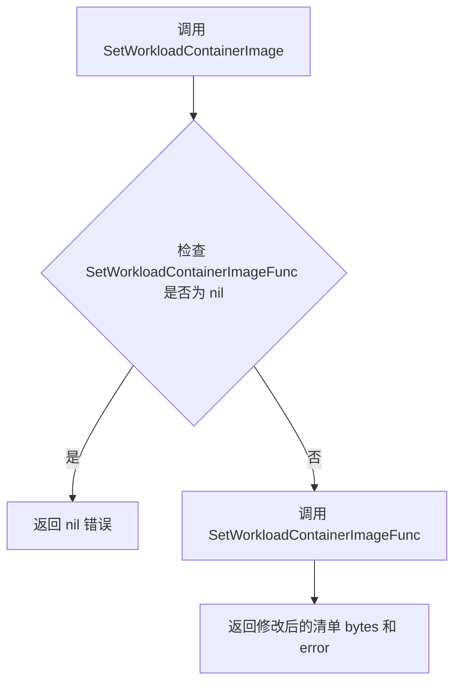

#### 带注释源码

```go
// SetWorkloadContainerImage 是 Mock 结构体的一个方法，
// 用于模拟更新工作负载容器镜像的功能。
// 它采用委托模式，将实际处理逻辑转发给预定义的 SetWorkloadContainerImageFunc 函数类型成员。
// 参数:
//   - def: 原始的 Kubernetes 资源清单定义字节数组
//   - id: 资源标识符，用于定位具体的工作负载
//   - container: 目标容器的名称
//   - newImageID: 新的镜像引用
//
// 返回值:
//   - []byte: 修改后的资源清单定义
//   - error: 执行过程中的错误信息
func (m *Mock) SetWorkloadContainerImage(def []byte, id resource.ID, container string, newImageID image.Ref) ([]byte, error) {
    // 将调用委托给 Mock 结构体中存储的函数类型成员
    // 这种设计允许在测试时注入自定义的行为实现
    return m.SetWorkloadContainerImageFunc(def, id, container, newImageID)
}
```


### `Mock.LoadManifests`

该函数是 Mock 类型的成员方法，作为 `manifests.Manifests` 接口的实现，采用委托模式将实际的清单加载逻辑转发给内部持有的 `LoadManifestsFunc` 函数指针，从而为单元测试提供可配置的模拟实现。

参数：

- `baseDir`：`string`，基础目录路径，指定从哪个目录开始加载清单文件
- `paths`：`[]string`，文件路径列表，指定要加载的清单文件路径集合

返回值：`map[string]resource.Resource, error`，返回资源名称到资源对象的映射字典，以及可能出现的加载错误

#### 流程图

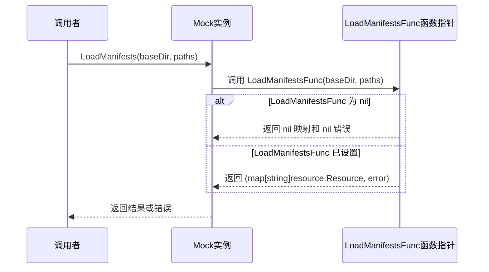

#### 带注释源码

```go
// LoadManifests 实现 manifests.Manifests 接口的 LoadManifests 方法
// 参数 baseDir 指定基础目录，paths 指定要加载的文件路径列表
// 返回资源映射和可能的错误
func (m *Mock) LoadManifests(baseDir string, paths []string) (map[string]resource.Resource, error) {
    // 委托给 Mock 结构体中存储的函数指针执行实际逻辑
    // 这种设计允许在测试时注入自定义的加载行为，实现测试替身功能
    return m.LoadManifestsFunc(baseDir, paths)
}
```


### `Mock.ParseManifest`

该方法是 `Mock` 结构体实现 `manifests.Manifests` 接口的核心方法之一。它采用了委托模式（Delegate Pattern），本身不包含具体的解析逻辑，而是将请求转发给 `Mock` 实例初始化时注入的 `ParseManifestFunc` 函数属性。这种设计使得该 Mock 对象能够灵活地模拟各种 Manifest 解析行为，用于单元测试或集成测试环境中。

参数：

- `def`：`[]byte`，Manifest 定义的原始字节内容（通常为 YAML 或 JSON 格式）
- `source`：`string`，Manifest 的来源标识（例如文件名、路径或配置源），用于日志记录或生成资源 ID

返回值：

- `map[string]resource.Resource`：解析后的资源映射表，键为资源的唯一标识（通常是 `namespace/name`），值为 `resource.Resource` 对象
- `error`：解析过程中发生的错误，如果解析成功则返回 `nil`

#### 流程图

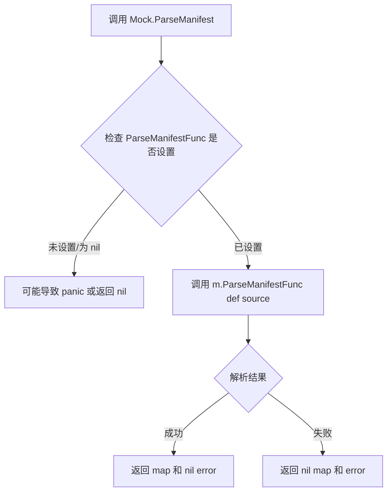

#### 带注释源码

```go
// ParseManifest 实现了 manifests.Manifests 接口的 ParseManifest 方法。
// 它将解析请求委托给 Mock 结构体中存储的函数类型的字段 ParseManifestFunc。
// 这种模式允许在测试时注入自定义的解析逻辑，而无需修改 Mock 类的结构。
func (m *Mock) ParseManifest(def []byte, source string) (map[string]resource.Resource, error) {
	// 调用存储在 Mock 实例中的函数变量，执行实际的解析逻辑
	return m.ParseManifestFunc(def, source)
}
```


### `Mock.UpdateWorkloadPolicies`

该方法是Mock类型的成员方法，作为代理层将策略更新请求委托给预先注入的`UpdateWorkloadPoliciesFunc`函数实现，用于在测试场景中模拟集群或清单系统的策略更新操作。

#### 参数

- `def`：`[]byte`，原始的Kubernetes manifest定义字节数组，包含需要更新策略的资源清单
- `id`：`resource.ID`，目标资源的唯一标识符，指定需要更新策略的具体资源
- `p`：`resource.PolicyUpdate`，策略更新对象，包含需要应用的策略变更内容（如标签、注解等）

#### 返回值

- `[]byte`，更新后的manifest字节数组，返回应用策略更新后的资源定义
- `error`，执行过程中的错误信息，如果更新失败则返回具体的错误描述

#### 流程图

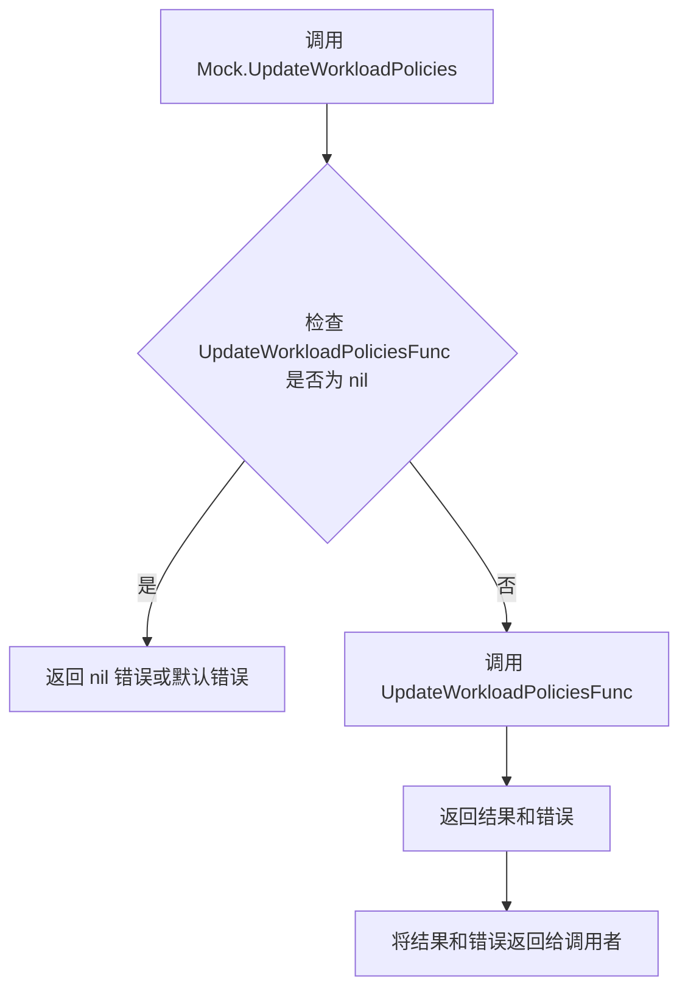

#### 带注释源码

```go
// UpdateWorkloadPolicies 是Mock类型的方法，用于更新工作负载的策略
// 参数def为原始manifest定义，id为目标资源ID，p为策略更新内容
// 该方法内部委托给UpdateWorkloadPoliciesFunc函数字段执行实际逻辑
func (m *Mock) UpdateWorkloadPolicies(def []byte, id resource.ID, p resource.PolicyUpdate) ([]byte, error) {
    // 代理模式：将调用委托给预先注入的函数实现
    return m.UpdateWorkloadPoliciesFunc(def, id, p)
}
```

---

### 补充信息

#### 关键组件

- **`Mock` 结构体**：模拟实现体，同时实现`cluster.Cluster`和`cluster.Manifests`两个接口
- **`UpdateWorkloadPoliciesFunc` 字段**：函数类型的字段，用于存储实际的策略更新逻辑实现

#### 潜在技术债务与优化空间

1. **空指针风险**：当`UpdateWorkloadPoliciesFunc`为nil时，直接调用会导致panic，应添加防御性检查
2. **缺乏默认值实现**：与其他方法不同，该方法没有提供默认的nil-safe行为
3. **测试覆盖盲区**：由于是代理方法，单元测试需确保正确验证传入参数和返回值传递

#### 设计目标与约束

- **设计模式**：代理模式（Proxy Pattern），通过Mock对象在测试中替代真实实现
- **接口契约**：实现`manifests.Manifests`接口的`UpdateWorkloadPolicies`方法
- **约束**：依赖方必须提供`UpdateWorkloadPoliciesFunc`的实现，否则无法正常使用


### `Mock.CreateManifestPatch`

该方法是一个代理方法，用于在模拟（Mock）对象中创建清单补丁，它将调用委托给 `Mock` 结构体中存储的 `CreateManifestPatchFunc` 函数指针，实现了对 `cluster.Manifests` 接口中 `CreateManifestPatch` 方法的模拟，以支持在测试场景中自定义补丁创建行为。

参数：

- `originalManifests`：`[]byte`，原始清单的字节内容，表示未修改的 Kubernetes 资源定义
- `modifiedManifests`：`[]byte`，修改后清单的字节内容，表示已更新的 Kubernetes 资源定义
- `originalSource`：`string`，原始清单的来源标识，通常为文件路径或配置源
- `modifiedSource`：`string`，修改后清单的来源标识，通常为文件路径或配置源

返回值：`([]byte, error)`，返回生成的补丁字节内容（`[]byte`）以及可能的错误（`error`），用于描述如何将原始清单转换为修改后的清单

#### 流程图

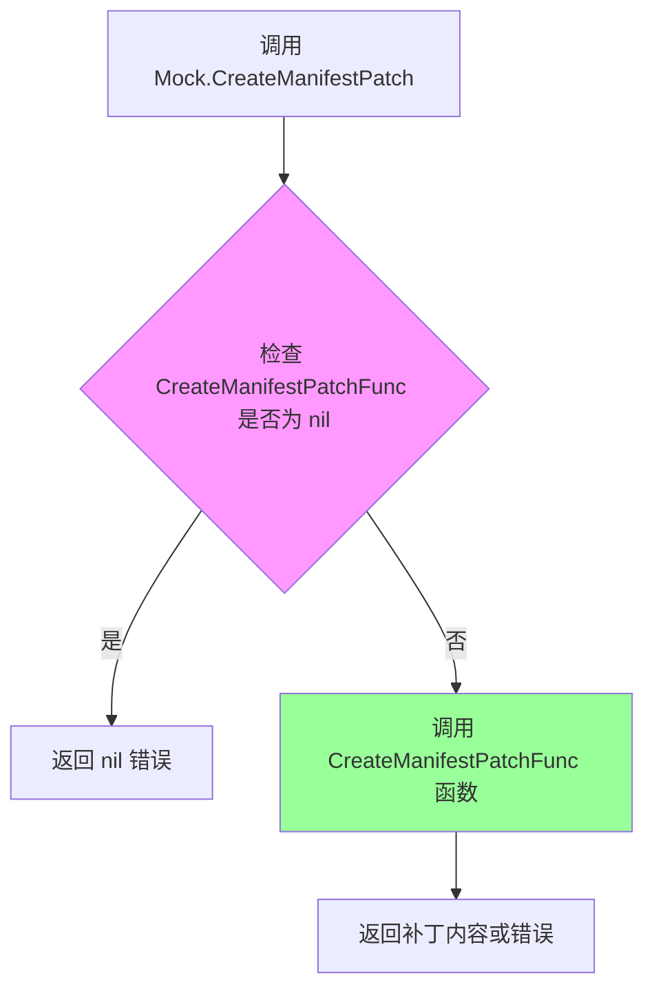

#### 带注释源码

```go
// CreateManifestPatch 创建清单补丁的方法
// 这是一个代理方法，将调用委托给 Mock 结构体中存储的函数指针
// 参数：
//   - originalManifests: 原始清单的字节内容
//   - modifiedManifests: 修改后清单的字节内容
//   - originalSource: 原始清单的来源
//   - modifiedSource: 修改后清单的来源
// 返回值：
//   - []byte: 生成的补丁内容
//   - error: 如果发生错误则返回错误信息
func (m *Mock) CreateManifestPatch(originalManifests, modifiedManifests []byte, originalSource, modifiedSource string) ([]byte, error) {
    // 委托给 Mock 结构体中存储的 CreateManifestPatchFunc 函数指针执行实际逻辑
    // 这种设计允许在测试时注入自定义的补丁创建行为
    return m.CreateManifestPatchFunc(originalManifests, modifiedManifests, originalSource, modifiedSource)
}
```

### 类的详细信息

#### Mock 结构体

Mock 结构体是一个模拟实现类，同时实现了 `cluster.Cluster` 和 `cluster.Manifests` 接口，用于在测试环境中替代真实的集群和清单操作。

类字段：

- `AllWorkloadsFunc`：获取所有工作负载的函数指针
- `SomeWorkloadsFunc`：获取部分工作负载的函数指针
- `IsAllowedResourceFunc`：检查资源是否允许的函数指针
- `PingFunc`：检查集群连接的函数指针
- `ExportFunc`：导出集群配置的函数指针
- `SyncFunc`：同步配置的函数指针
- `PublicSSHKeyFunc`：获取公钥的函数指针
- `SetWorkloadContainerImageFunc`：设置工作负载容器镜像的函数指针
- `LoadManifestsFunc`：加载清单的函数指针
- `ParseManifestFunc`：解析清单的函数指针
- `UpdateWorkloadPoliciesFunc`：更新工作负载策略的函数指针
- `CreateManifestPatchFunc`：创建清单补丁的函数指针
- `ApplyManifestPatchFunc`：应用清单补丁的函数指针
- `AppendManifestToBufferFunc`：追加清单到缓冲区的函数指针

### 关键组件信息

- **Mock 结构体**：模拟实现类，用于测试环境中替代真实的集群和清单操作
- **函数指针字段**：通过在 Mock 结构体中定义函数指针字段，允许在测试时注入自定义行为
- **接口实现**：Mock 同时实现了 `cluster.Cluster` 和 `manifests.Manifests` 接口，确保在测试中可以完全替代真实实现

### 潜在的技术债务或优化空间

1. **空指针风险**：当前实现没有对 `CreateManifestPatchFunc` 为 `nil` 的情况进行默认处理，直接调用会导致空指针异常。建议添加默认行为或显式的nil检查。
2. **缺少文档注释**：函数指针字段缺少详细的文档说明，使用者可能不清楚每个字段的预期行为。
3. **接口一致性**：虽然使用了函数指针模式，但与 Go 社区中更常见的 `go-playground/mock` 或 `stretchr/testify` 等测试框架相比，缺乏标准化和社区约定俗成的实践。

### 其它项目

#### 设计目标与约束

- **设计目标**：提供一种灵活的方式在测试中模拟集群和清单操作，支持自定义每个方法的行为
- **约束**：所有方法都依赖于函数指针，必须在使用前初始化相应的函数，否则可能导致 panic

#### 错误处理与异常设计

- 当函数指针未设置时，调用会直接触发 nil 指针异常
- 错误传播通过返回的 error 类型传递，调用者需要检查错误值

#### 数据流与状态机

- 数据流：调用者 → Mock.CreateManifestPatch → CreateManifestPatchFunc → 返回结果
- 状态机：不涉及复杂状态管理，所有状态存储在函数指针中

#### 外部依赖与接口契约

- 依赖 `github.com/fluxcd/flux/pkg/cluster` 中的 `cluster.Cluster` 接口
- 依赖 `github.com/fluxcd/flux/pkg/manifests` 中的 `manifests.Manifests` 接口
- 依赖 `github.com/fluxcd/flux/pkg/resource` 中的资源类型定义
- 接口契约：必须实现 `Ping`、`AllWorkloads`、`SomeWorkloads`、`Export`、`Sync` 等方法


### `Mock.ApplyManifestPatch`

该方法是一个模拟实现，用于在测试场景中模拟 `manifests.Manifests` 接口的 `ApplyManifestPatch` 功能。它将给定的补丁（patch）应用到原始清单（originalManifests）上，通过委托给 `Mock` 结构体中的 `ApplyManifestPatchFunc` 字段来执行实际逻辑，从而实现对清单补丁应用功能的无副作用测试支持。

参数：

- `originalManifests`：`[]byte`，原始的 Kubernetes 清单内容（YAML/JSON 格式）
- `patch`：`[]byte`，要应用的补丁内容（包含对原始清单的修改）
- `originalSource`：`string`，原始清单的来源标识（如文件路径或配置源名称）
- `patchSource`：`string`，补丁的来源标识（用于日志或错误信息中标识补丁来源）

返回值：`[]byte, error`，成功时返回应用补丁后的清单内容，失败时返回错误信息

#### 流程图

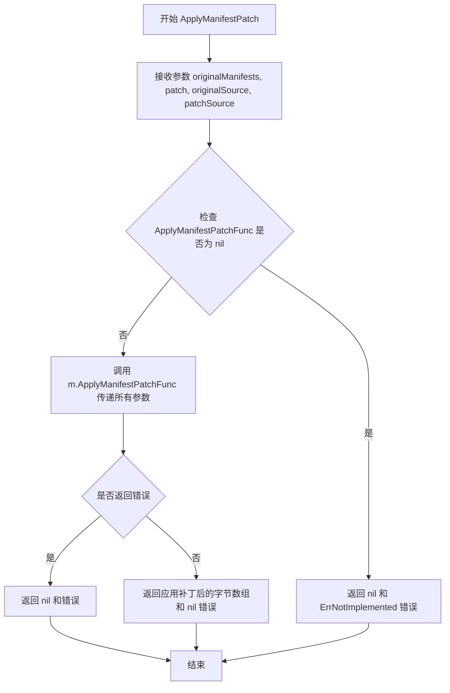

#### 带注释源码

```go
// ApplyManifestPatch 将补丁应用到原始清单上
// 参数：
//   - originalManifests: 原始的 Kubernetes 清单内容（YAML/JSON 格式）
//   - patch: 要应用的补丁内容（包含对原始清单的修改）
//   - originalSource: 原始清单的来源标识
//   - patchSource: 补丁的来源标识
//
// 返回值：
//   - []byte: 应用补丁后的清单内容
//   - error: 执行过程中的错误信息
func (m *Mock) ApplyManifestPatch(originalManifests, patch []byte, originalSource, patchSource string) ([]byte, error) {
    // 委托给 Mock 结构体中存储的函数指针执行实际逻辑
    // 这种设计允许在测试时注入自定义的模拟行为
    return m.ApplyManifestPatchFunc(originalManifests, patch, originalSource, patchSource)
}
```


### `Mock.AppendManifestToBuffer`

该函数是一个委托方法，将manifest追加操作转发到Mock结构体中存储的函数类型字段 `AppendManifestToBufferFunc` 执行，用于模拟 `manifests.Manifests` 接口的 `AppendManifestToBuffer` 行为。

参数：

- `b`：`[]byte`，要追加到缓冲区的manifest字节数据
- `buf`：`*bytes.Buffer`，目标字节缓冲区，用于存放追加的manifest内容

返回值：`error`，如果执行过程中发生错误则返回错误信息，否则返回nil

#### 流程图

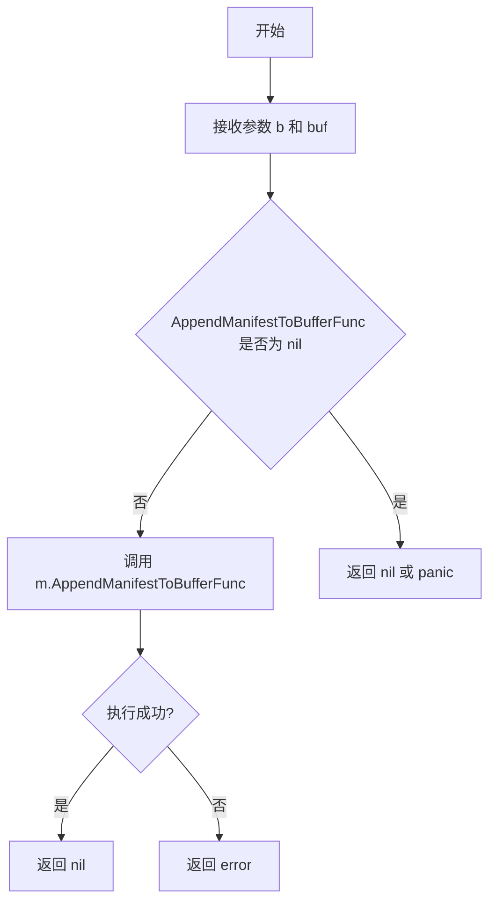

#### 带注释源码

```go
// AppendManifestToBuffer 将manifest内容追加到缓冲区
// 这是一个委托方法，将实际处理逻辑转发到 Mock 结构体中存储的函数类型字段
// 参数 b: 要追加的字节切片（manifest内容）
// 参数 buf: 目标缓冲区
// 返回值: 错误信息
func (m *Mock) AppendManifestToBuffer(b []byte, buf *bytes.Buffer) error {
	// 委托给 Mock 结构体中存储的函数类型字段执行
	// 如果 AppendManifestToBufferFunc 未被设置，则返回 nil
	return m.AppendManifestToBufferFunc(b, buf)
}
```

## 关键组件


### Mock 结构体

核心测试模拟对象，同时实现了 cluster.Cluster 和 manifests.Manifests 接口，用于 Flux CD 项目的单元测试，通过函数字段模拟各种集群和清单操作。

### AllWorkloadsFunc 字段

模拟获取所有工作负载的功能，支持按命名空间过滤，返回集群工作负载列表及可能发生的错误。

### SomeWorkloadsFunc 字段

模拟根据资源 ID 列表获取特定工作负载的功能，用于测试选择性查询场景。

### IsAllowedResourceFunc 字段

模拟资源权限检查功能，验证指定资源 ID 是否在允许范围内。

### PingFunc 字段

模拟集群连接健康检查功能，用于验证集群连通性状态。

### ExportFunc 字段

模拟集群配置导出功能，将当前集群状态序列化为字节数组。

### SyncFunc 字段

模拟集群同步功能，将 SyncSet 配置应用到目标集群。

### PublicSSHKeyFunc 字段

模拟 SSH 公钥获取功能，支持密钥重新生成选项。

### SetWorkloadContainerImageFunc 字段

模拟更新工作负载容器镜像功能，接受定义、资源 ID、容器名和新镜像引用，返回修改后的定义。

### LoadManifestsFunc 字段

模拟从文件系统加载清单功能，支持指定基础目录和清单路径列表。

### ParseManifestFunc 字段

模拟清单解析功能，将字节定义解析为资源映射，支持源码关联。

### UpdateWorkloadPoliciesFunc 字段

模拟工作负载策略更新功能，应用策略更新到指定资源。

### CreateManifestPatchFunc 字段

模拟清单补丁创建功能，比较原始和修改后的清单生成差异补丁。

### ApplyManifestPatchFunc 字段

模拟清单补丁应用功能，将补丁应用到原始清单生成结果清单。

### AppendManifestToBufferFunc 字段

模拟清单追加到缓冲区的功能，用于构建最终的清单输出。

## 问题及建议


### 已知问题

- **空指针解引用风险**：所有方法直接调用对应的 Func 字段，如果调用方未预先设置函数实现，会导致 nil pointer dereference  panic，缺乏防御性检查和默认值处理
- **缺乏默认值实现**：未为任何函数字段提供默认的空实现（如返回空切片、空错误或成功默认值），导致 Mock 难以直接实例化使用
- **功能字段数量过多**：Mock 结构体包含 14 个函数字段，表明实现的接口过大（cluster.Cluster + manifests.Manifests），违反接口隔离原则，导致维护困难
- **无输入验证**：所有方法直接透传参数，未对输入参数做任何校验或边界检查
- **缺乏错误处理策略**：未定义 Mock 特定的错误类型，无法区分"功能未设置"与"功能返回错误"两种情况
- **无文档注释**：结构体、字段和方法均无任何文档注释，增加理解和使用成本

### 优化建议

- 为关键函数字段提供默认值实现或构造工厂方法，在未设置时返回合理的空结果（如 AllWorkloads 返回空切片、Ping 返回 nil）
- 考虑将大接口拆分为多个小接口（如 ClusterMock、ManifestsMock），提高可测试性和复用性
- 添加防御性 nil 检查，返回明确的错误而非 panic，例如：`if m.AllWorkloadsFunc == nil { return nil, errors.New("AllWorkloadsFunc not set") }`
- 使用嵌入接口方式减少方法代理代码，如 `type Mock struct { cluster.Cluster; manifests.Manifests }` 并仅实现需要定制的部分
- 为常用场景提供预设的 Mock 配置构造器，如 `NewPingableMock()`、`NewWorkingMock()` 等
- 添加方法验证 Mock 是否完整配置的接口（如 `Ready() bool`），在测试初始化时快速发现配置遗漏

## 其它


### 设计目标与约束

本代码的设计目标是提供一个通用的Mock实现，用于在测试环境中模拟cluster.Cluster和manifests.Manifests两个接口的行为。约束包括：1) 必须实现fluxcd/flux/pkg/cluster包中的Cluster接口和fluxcd/flux/pkg/manifests包中的Manifests接口；2) 所有方法通过函数类型字段实现依赖注入，调用时直接转发到对应的函数字段；3) 适用于单元测试和集成测试场景，不应出现在生产代码中。

### 错误处理与异常设计

Mock层的错误处理采用"信任调用方"的设计模式，即所有错误都由注入的函数返回值决定。当函数字段未初始化时（为nil），直接调用会引发panic，因此调用方必须确保在使用前正确初始化所有需要的函数字段。这种设计符合Go语言的惯用模式，将错误传播的职责完全交给业务逻辑层。panic场景仅在开发者未正确配置Mock实例时触发，属于编程错误而非运行时异常。

### 外部依赖与接口契约

本代码依赖以下外部包：1) github.com/fluxcd/flux/pkg/cluster - 提供Cluster接口定义，包含AllWorkloads、SomeWorkloads、IsAllowedResource、Ping、Export、Sync、PublicSSHKey等方法；2) github.com/fluxcd/flux/pkg/manifests - 提供Manifests接口定义，包含LoadManifests、ParseManifest、UpdateWorkloadPolicies、CreateManifestPatch、ApplyManifestPatch、AppendManifestToBuffer等方法；3) github.com/fluxcd/flux/pkg/image - 提供image.Ref类型用于镜像引用；4) github.com/fluxcd/flux/pkg/resource - 提供resource.ID和resource.Resource等类型；5) github.com/fluxcd/flux/pkg/ssh - 提供ssh.PublicKey类型；6) 标准库bytes和context包。接口契约要求：Mock结构体必须实现cluster.Cluster和manifests.Manifests两个接口的所有方法，否则无法通过编译时的接口检查（var _ cluster.Cluster = &Mock{}和var _ manifests.Manifests = &Mock{}）。

### 使用示例与测试策略

使用示例：创建Mock实例时，需要为需要的函数字段赋值闭包或真实函数。例如：```go
mock := &Mock{
    PingFunc: func() error { return nil },
    AllWorkloadsFunc: func(ctx context.Context, namespace string) ([]cluster.Workload, error) {
        return []cluster.Workload{}, nil
    },
}
```测试策略：该Mock用于避免在测试中依赖真实的Kubernetes集群，通过注入期望的行为和返回值来验证业务逻辑的正确性。建议为每个测试用例创建独立的Mock实例，以确保测试之间的隔离性。

### 并发考虑

该Mock实现本身不包含并发控制机制，其线程安全性完全取决于注入的函数实现。如果在多goroutine环境中使用，注入的函数应该是线程安全的。由于Mock方法都是直接转发调用到函数字段，因此不存在内部状态竞争问题，但调用方需要确保并发访问Mock实例时的安全性。

### 性能考虑与优化空间

性能开销主要来自函数调用的间接跳转开销，对于大多数测试场景可以忽略不计。优化空间：1) 可以考虑使用sync.Once初始化默认的no-op函数，避免nil检查；2) 可以在结构体中添加选项模式（Functional Options Pattern），提供更友好的配置方式；3) 可以添加断言函数来验证Mock被调用的次数和参数，增强测试的可验证性。

### 安全考虑

该代码为测试代码，不涉及生产环境的敏感操作。安全考量主要集中在：1) 注入的函数可能包含敏感逻辑，需要确保测试代码的安全性；2) 如果Mock用于集成测试，应注意不要在测试中硬编码生产环境的凭据或密钥。

### 版本兼容性

代码适用于fluxcd/flux的特定版本（v0.x系列），与Go 1.11+的模块系统兼容。由于fluxcd项目已迁移至flux2（source-controller等），该mock可能仅适用于遗留代码或迁移过渡期。接口定义可能随fluxcd/flux包版本升级而变化，需要同步更新Mock实现。


    