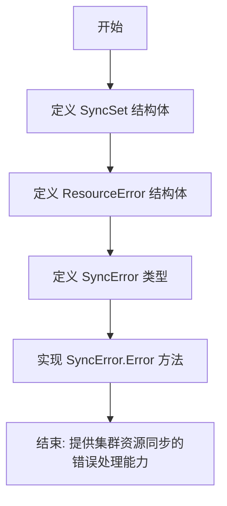
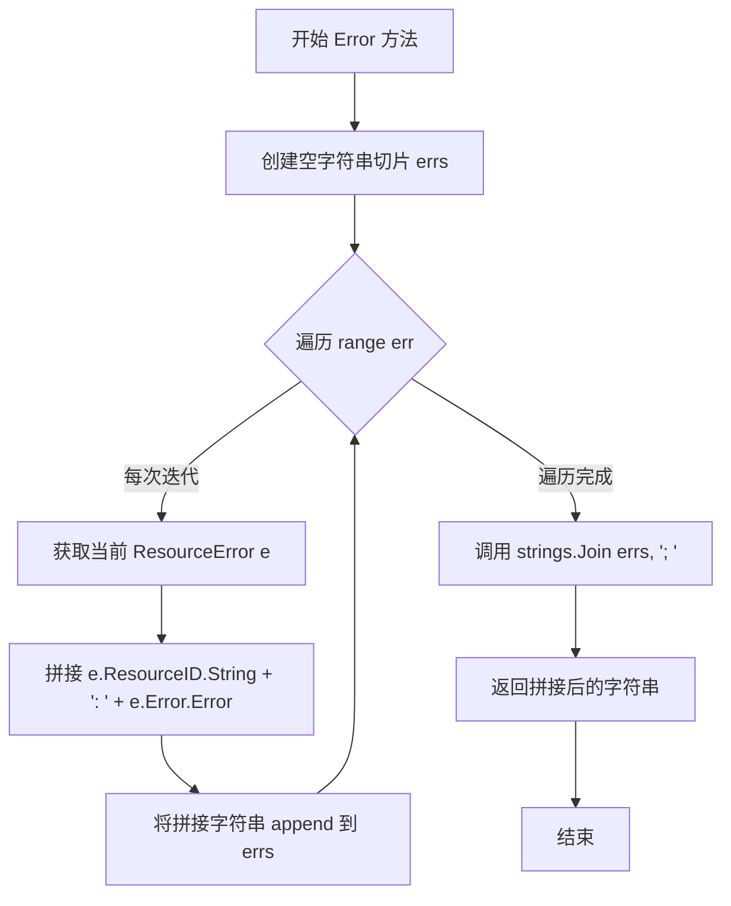
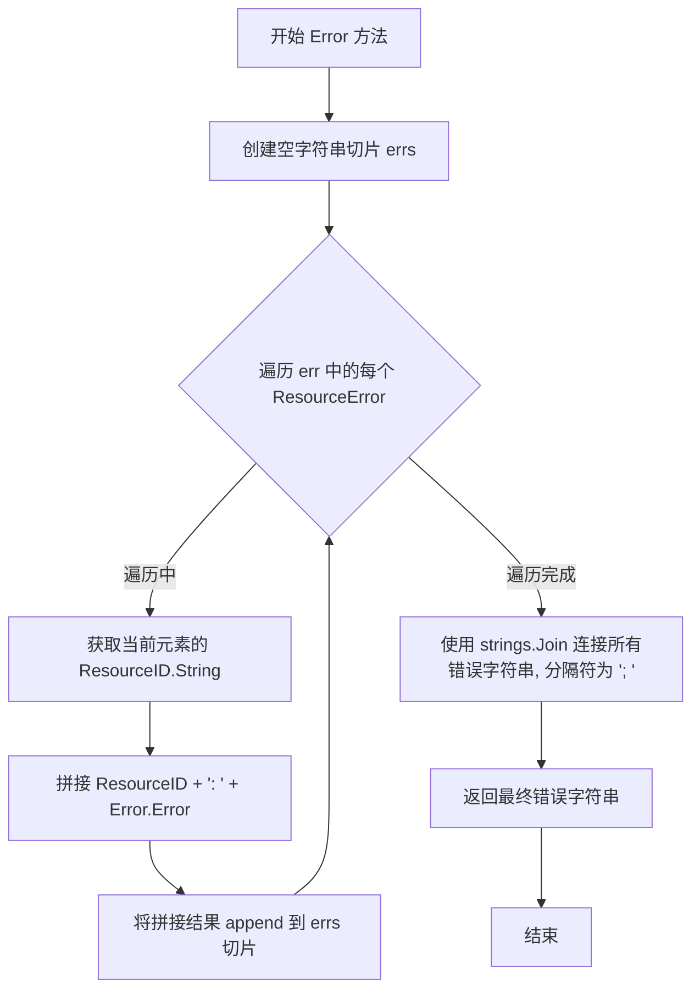
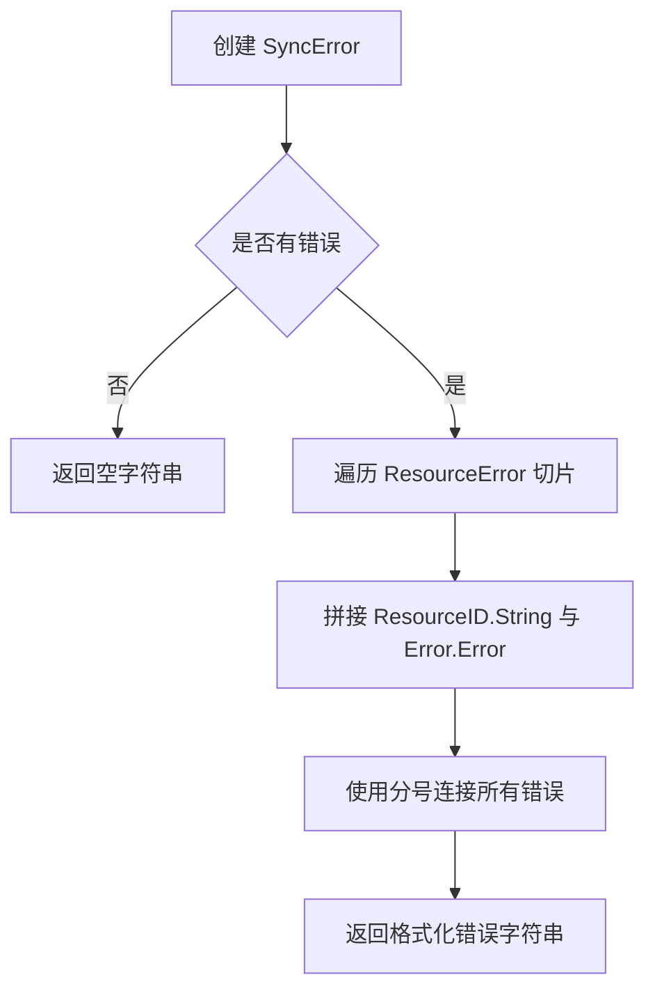

# `flux\pkg\cluster\sync.go` 详细设计文档

该代码定义了 Flux CD 集群同步相关的核心数据结构，包括用于表示资源集合的 SyncSet、自定义错误类型 ResourceError 和 SyncError，用于将集群资源与 Git 仓库保持同步，并支持垃圾回收机制。

## 整体流程



## 类结构

```
SyncSet (同步集合结构体)
├── Name: string
└── Resources: []resource.Resource
ResourceError (资源错误结构体)
├── ResourceID: resource.ID
├── Source: string
└── Error: error
SyncError (同步错误类型)
└── []ResourceError (资源错误切片)
    └── SyncError.Error() string (错误接口实现方法)
```

## 全局变量及字段


### `SyncSet.SyncSet.Name`
    
同步集合的名称，用于区分不同资源集

类型：`string`
    


### `SyncSet.SyncSet.Resources`
    
要更新/同步的资源列表

类型：`[]resource.Resource`
    


### `ResourceError.ResourceError.ResourceID`
    
出错的资源标识符

类型：`resource.ID`
    


### `ResourceError.ResourceError.Source`
    
错误来源/上下文信息

类型：`string`
    


### `ResourceError.ResourceError.Error`
    
具体的错误对象

类型：`error`
    


### `SyncError.SyncError`
    
资源错误切片，底层存储多个 ResourceError

类型：`[]ResourceError`
    
    

## 全局函数及方法


### `SyncError.Error()`

该方法为 `SyncError` 类型实现 `error` 接口的 `Error()` 方法，接收 `SyncError` 类型实例（本质是一个 `ResourceError` 切片），遍历其中的每个错误项，将资源 ID 和错误信息拼接为格式如 `"resourceID: error message"` 的字符串，最后使用分号和空格连接所有错误并返回。

参数：

- （无参数，该方法为值接收者方法）

返回值：`string`，返回拼接后的错误字符串，格式为 `"resourceID1: error1; resourceID2: error2; ..."`，如果错误切片为空则返回空字符串。

#### 流程图



#### 带注释源码

```go
// Error 方法为 SyncError 类型实现 error 接口
// 接收者：err SyncError（值传递）
// 功能：遍历 SyncError 中的所有 ResourceError，拼接成格式化的错误字符串
func (err SyncError) Error() string {
    // 1. 初始化一个空字符串切片用于存储每个资源的错误信息
    var errs []string
    
    // 2. 遍历 SyncError 切片中的每一个 ResourceError
    for _, e := range err {
        // 3. 获取资源的 ID 字符串表示，拼接错误信息
        // 格式：resourceID: error message
        // 4. 将拼接结果添加到 errs 切片中
        errs = append(errs, e.ResourceID.String()+": "+e.Error.Error())
    }
    
    // 5. 使用 "; " 作为分隔符，将所有错误连接成一个字符串
    // 6. 返回最终拼接的错误信息
    return strings.Join(errs, "; ")
}
```


### `SyncError.Error`

该方法实现了 Go 语言的 error 接口，将 SyncError（ResourceError 切片）中的每个错误格式化为 "资源ID: 错误信息" 的形式，并用分号和空格连接所有错误，返回一个完整的错误描述字符串。

参数：

- （无显式参数，但方法接收一个隐式的 SyncError 类型的接收器参数）

返回值：`string`，返回格式化的错误字符串，如果没有任何错误则返回空字符串。

#### 流程图



#### 带注释源码

```go
// Error 实现 error 接口，返回格式化的错误字符串
func (err SyncError) Error() string {
	// 创建一个空字符串切片用于存储各个错误信息
	var errs []string
	// 遍历 SyncError 中的每个 ResourceError
	for _, e := range err {
		// 将每个错误格式化为 "ResourceID: ErrorMessage" 的形式
		// e.ResourceID.String() 获取资源的标识符
		// e.Error.Error() 获取底层错误的字符串表示
		errs = append(errs, e.ResourceID.String()+": "+e.Error.Error())
	}
	// 使用 "; " 作为分隔符，将所有错误信息连接成一个字符串
	// 如果 errs 为空，返回空字符串
	return strings.Join(errs, "; ")
}
```

## 关键组件


## 一段话描述

该代码是 Flux CD 集群同步包的核心定义模块，提供了 `SyncSet` 结构体用于表示需要与 Git 仓库同步的资源集合，以及 `ResourceError` 和 `SyncError` 用于处理同步过程中的错误，支持垃圾回收机制来识别并删除不在同步集中的集群资源。

## 文件的整体运行流程

该文件定义了数据结构和错误类型，不包含直接的可执行流程。作为基础定义模块，它被其他包导入使用：其他组件首先创建 `SyncSet` 实例并填充 `Resources` 列表，然后在同步过程中如果发生错误，将错误收集到 `SyncError` 切片中，最后通过 `Error()` 方法将多个资源错误格式化为可读的错误字符串输出。

## 类的详细信息

### SyncSet 结构体

**字段：**

| 名称 | 类型 | 描述 |
|------|------|------|
| Name | string | 同步集的唯一标识名称，用于区分不同来源的资源集 |
| Resources | []resource.Resource | 要同步的资源列表，包含完整的资源定义 |

**方法：**

该结构体无自定义方法，作为纯数据结构使用。

### ResourceError 结构体

**字段：**

| 名称 | 类型 | 描述 |
|------|------|------|
| ResourceID | resource.ID | 发生错误的资源标识符 |
| Source | string | 错误来源或发生位置 |
| Error | error | 具体错误信息 |

**方法：**

该结构体无自定义方法，作为错误承载数据结构使用。

### SyncError 类型

**类型：** []ResourceError

**方法：**

| 名称 | 参数 | 参数类型 | 参数描述 | 返回值类型 | 返回值描述 |
|------|------|----------|----------|------------|------------|
| Error | 无 | - | - | string | 返回所有资源错误的拼接字符串，格式为 "资源ID: 错误信息; 资源ID: 错误信息; ..." |

**mermaid 流程图：**



**带注释源码：**

```go
// Error 方法将 SyncError 切片转换为可读的字符串格式
// 每个错误格式为 "资源ID: 错误信息"，多个错误用分号分隔
func (err SyncError) Error() string {
    // 初始化错误字符串切片
    var errs []string
    // 遍历所有资源错误
    for _, e := range err {
        // 拼接资源ID和错误信息，格式：资源ID: 错误内容
        errs = append(errs, e.ResourceID.String()+": "+e.Error.Error())
    }
    // 使用分号和空格连接所有错误并返回
    return strings.Join(errs, "; ")
}
```

## 关键组件信息

### SyncSet - 资源同步集

用于表示需要与 Git 仓库同步的完整资源集合，是集群同步的核心数据结构，Name 字段用于垃圾回收时区分不同来源的资源。

### ResourceError - 资源错误

承载单个资源同步错误的数据结构，包含错误的资源标识、错误来源位置和具体错误内容。

### SyncError - 同步错误集合

通过 []ResourceError 实现的错误集合类型，提供 Error() 方法将多个资源错误格式化为统一的可读字符串。

## 潜在的技术债务或优化空间

1. **缺乏并发安全**：SyncError 作为切片直接追加元素，在并发场景下可能存在竞态条件。
2. **错误信息格式固定**：Error() 方法返回格式不可定制，调用方无法控制输出格式。
3. **缺少错误包装**：直接使用 error 接口而非自定义错误类型，调用方难以进行错误类型断言和精细化处理。
4. **资源列表无限制**：SyncSet.Resources 为裸切片，无最大长度限制，可能导致内存问题。

## 其它项目

### 设计目标与约束

- **设计目标**：提供轻量级的资源同步数据结构定义，支持垃圾回收机制
- **约束**：依赖外部的 resource 包定义资源类型，本包仅负责结构定义和基础错误处理

### 错误处理与异常设计

- 采用 Go 惯用的 error 接口处理错误
- SyncError 实现 error 接口，可直接用于错误返回和日志记录
- 错误信息格式：每个资源错误独立记录，用分号分隔，便于定位具体失败的资源和原因

### 数据流与状态机

- 数据流为单向：外部调用方创建 SyncSet → 填充 Resources → 执行同步 → 收集错误到 SyncError → 输出错误信息
- 无状态机设计，SyncSet 和 SyncError 均为无状态数据结构

### 外部依赖与接口契约

- 依赖 `github.com/fluxcd/flux/pkg/resource` 包中的 `Resource` 和 `ID` 类型
- SyncSet.Resources 接受任何实现 resource.Resource 接口的类型
- SyncError.Error() 方法遵循 Go 标准 error 接口约定


## 问题及建议


### 已知问题

- **nil指针解引用风险**：在`SyncError.Error()`方法中，遍历`err`时未检查`e.Error`是否为nil，如果存在nil的error成员，调用`e.Error.Error()`会导致panic
- **缺乏输入验证**：SyncSet结构体缺少对Name和Resources的验证，Name可能为空，Resources可能为nil，可能导致后续处理中的空指针异常
- **错误包装不足**：ResourceError和SyncError未实现`Unwrap()`方法，无法支持errors.Is()或errors.As()的错误链查找功能
- **资源泄漏风险**：SyncSet的Resources字段使用切片但未导出（虽然首字母大写是导出的），缺少容量预分配和初始化逻辑

### 优化建议

- 在`SyncError.Error()`方法中添加nil检查：`if e.Error != nil { errs = append(errs, ...) }`
- 实现`Unwrap() error`方法以支持错误链：`func (err SyncError) Unwrap() error { return ... }`
- 为SyncSet添加构造函数或验证方法，检查Name非空和Resources非nil
- 使用`strings.Builder`代替`strings.Join`以提高大量错误时的性能
- 为ResourceError和SyncError添加适当的构造函数或工厂方法


## 其它


### 设计目标与约束

该代码的设计目标是为Flux CD提供集群同步能力，将Git仓库中的资源定义与集群实际状态进行同步，并支持垃圾回收机制（缺失资源将被删除）。核心约束包括：SyncSet必须表示完整的资源集（否则垃圾回收会误删未包含的资源），资源类型必须为resource.Resource，且名称用于区分不同SyncSet以避免误删集群资源。

### 错误处理与异常设计

代码采用了分层错误处理机制：ResourceError结构体记录单个资源的错误信息，包含资源ID、错误来源和具体错误；SyncError作为ResourceError切片实现了error接口，将多个资源的错误聚合为单个错误字符串返回。Error()方法使用strings.Join拼接错误，格式为"资源ID: 错误信息"，多错误以分号分隔。这种设计便于批量操作时报告所有失败资源，但存在潜在问题：当Error字段为nil时调用e.Error.Error()会panic。

### 数据流与状态机

该代码本身不包含复杂的状态机，主要作为数据模型存在。数据流向为：外部调用方构建SyncSet对象（包含资源集名称和资源列表），随后触发同步流程。在同步过程中，若资源操作失败，则生成ResourceError并追加到SyncError切片中，最终通过Error()方法汇总报告。关键数据契约是SyncSet.Resources必须包含目标状态的完整资源列表，否则垃圾回收功能会错误地删除未包含的资源。

### 外部依赖与接口契约

代码依赖外部包"github.com/fluxcd/flux/pkg/resource"，该包提供了Resource接口和ID类型。具体接口契约包括：resource.Resource接口（代码中直接使用，未定义具体方法签名）、resource.ID接口（ResourceError.ResourceID字段类型，需实现String()方法）。SyncSet.Name字段为string类型，用于唯一标识同步集。SyncError实现了标准error接口的Error() string方法，可直接用于错误返回值。

### 关键组件信息

SyncSet：核心数据结构，表示需要同步到集群的资源集合，包含名称标识和资源列表。ResourceError：单个资源错误记录结构，包含资源标识、错误来源和错误对象。SyncError：资源错误集合类型，实现了error接口，用于批量报告同步过程中的错误。

### 潜在技术债务与优化空间

代码存在多项可优化点：缺乏包级和导出类型的文档注释，影响代码可维护性；Error()方法中对e.Error的nil检查缺失，可能导致panic；ResourceError的Source字段使用string类型而非具体类型，削弱了类型安全性；SyncError未提供访问底层错误切片的方法，限制了错误处理的灵活性。此外，代码未包含任何测试用例，且strings.Join在错误数量极大时可能存在性能考量。


    