# `flux\pkg\daemon\daemon.go` 详细设计文档

这是 Flux CD 项目的核心守护进程模块，实现了一个 GitOps 自动化引擎。它通过持续协调 Kubernetes 集群状态与 Git 仓库中的声明式配置文件来实现自动化部署，支持镜像自动更新、策略管理和集群同步等功能。Daemon 实现了 api.Server 接口，提供了服务列表、镜像列表、任务状态查询等核心 API，并管理着与集群、Git 仓库和镜像仓库的交互。

## 整体流程

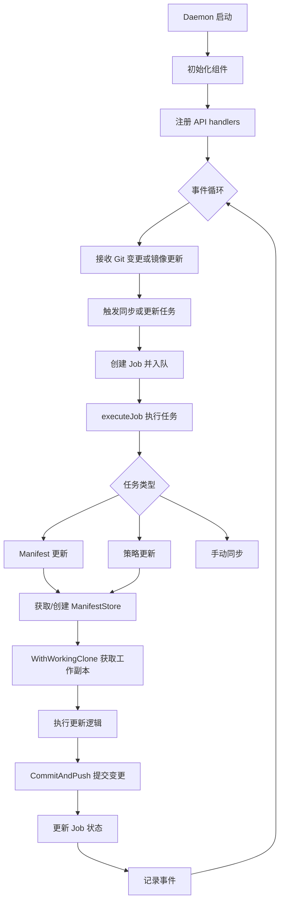

## 类结构

```
Daemon (核心结构体, 实现 api.Server 接口)
├── 字段: V, Cluster, Manifests, Registry, ImageRefresh, Repo, GitConfig, Jobs, JobStatusCache, EventWriter, Logger, ManifestGenerationEnabled, GitSecretEnabled, LoopVars
├── 内部类型: jobFunc (任务函数类型), updateFunc (更新函数类型)
└── 辅助类型: clusterContainers, sortedImageRepo
```

## 全局变量及字段


### `queueDuration`
    
任务排队时长指标

类型：`prometheus.Observer`
    


### `queueLength`
    
队列长度指标

类型：`prometheus.Gauge`
    


### `Daemon.V`
    
版本号

类型：`string`
    


### `Daemon.Cluster`
    
集群接口

类型：`cluster.Cluster`
    


### `Daemon.Manifests`
    
清单接口

类型：`manifests.Manifests`
    


### `Daemon.Registry`
    
镜像仓库接口

类型：`registry.Registry`
    


### `Daemon.ImageRefresh`
    
镜像刷新通道

类型：`chan image.Name`
    


### `Daemon.Repo`
    
Git 仓库指针

类型：`*git.Repo`
    


### `Daemon.GitConfig`
    
Git 配置

类型：`git.Config`
    


### `Daemon.Jobs`
    
任务队列

类型：`*job.Queue`
    


### `Daemon.JobStatusCache`
    
任务状态缓存

类型：`*job.StatusCache`
    


### `Daemon.EventWriter`
    
事件写入器

类型：`event.EventWriter`
    


### `Daemon.Logger`
    
日志记录器

类型：`log.Logger`
    


### `Daemon.ManifestGenerationEnabled`
    
是否启用清单生成

类型：`bool`
    


### `Daemon.GitSecretEnabled`
    
是否启用 Git 密钥

类型：`bool`
    


### `Daemon.LoopVars`
    
循环变量嵌入结构

类型：`*LoopVars`
    


### `sortedImageRepo.images`
    
镜像列表

类型：`[]image.Info`
    


### `sortedImageRepo.imagesByTag`
    
按标签索引的镜像

类型：`map[string]image.Info`
    


### `sortedImageRepo.imagesSortedByCreated`
    
按创建时间排序的镜像

类型：`update.SortedImageInfos`
    
    

## 全局函数及方法


### `containers2containers`

该函数是Flux CD Daemon中的容器类型转换工具函数，负责将内部使用的`resource.Container`类型转换为API层输出的`v6.Container`类型，主要用于将集群工作负载的容器信息适配为符合API规范的格式。

参数：

-  `cs`：`[]resource.Container`，输入的容器列表，来自集群工作负载的容器信息

返回值：`[]v6.Container`，转换后的API容器列表，用于向客户端暴露容器状态信息

#### 流程图

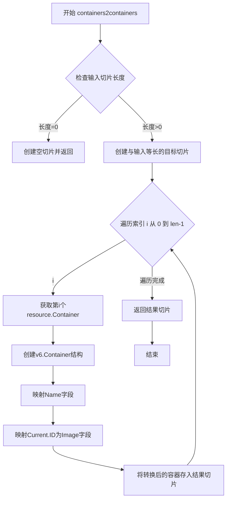

#### 带注释源码

```go
// containers2containers 将 resource.Container 类型的切片转换为 v6.Container 类型
// 输入: cs []resource.Container - 来自集群的容器信息切片
// 输出: []v6.Container - 转换后用于API响应的容器切片
func containers2containers(cs []resource.Container) []v6.Container {
	// 创建一个与输入切片长度相同的目标切片，预分配内存以提高性能
	res := make([]v6.Container, len(cs))
	
	// 遍历输入切片中的每个容器，进行类型转换
	for i, c := range cs {
		// 将 resource.Container 的字段映射到 v6.Container
		// 注意：这里只映射了 Name 和 Current(ID) 字段，其他字段被省略
		res[i] = v6.Container{
			Name: c.Name,  // 直接复制容器名称
			Current: image.Info{  // 嵌套结构体，需要创建新的 image.Info
				ID: c.Image,  // 将镜像信息赋值给 ID 字段
			},
		}
	}
	
	// 返回转换后的切片
	return res
}
```

---

#### 关键组件信息

- **resource.Container**：集群原生的容器表示，包含容器名称和镜像信息
- **v6.Container**：API版本6的容器表示，用于向客户端暴露容器状态
- **image.Info**：镜像信息结构体，用于存储容器镜像的详细信息

#### 潜在的技术债务或优化空间

1. **字段映射不完整**：当前仅映射了`Name`和`Current(ID)`字段，可能导致其他容器状态信息（如镜像标签、容器端口等）丢失，建议根据API需求补全字段映射
2. **无错误处理**：函数未对空切片或nil值进行特殊处理，虽然Go语言切片可以直接处理nil，但显式检查可提高代码清晰度
3. **缺乏单元测试**：该转换函数缺少对应的单元测试用例，无法保证转换逻辑的正确性
4. **魔法字符串/结构**：v6.Container的字段映射逻辑硬编码在函数中，如需扩展其他字段映射，考虑使用映射配置或策略模式


### `getWorkloadContainers`

获取工作负载容器，根据传入的工作负载、镜像仓库和资源信息，提取容器及其镜像信息，并返回格式化的容器列表。

参数：

- `workload`：`cluster.Workload`，工作负载对象，包含容器列表和相关信息
- `imageRepos`：`update.ImageRepos`，镜像仓库集合，用于获取镜像元数据
- `resource`：`resource.Resource`，资源对象，包含容器策略信息
- `fields`：`[]string`，需要额外返回的容器字段列表

返回值：`([]v6.Container, error)`，返回容器列表或错误信息

#### 流程图

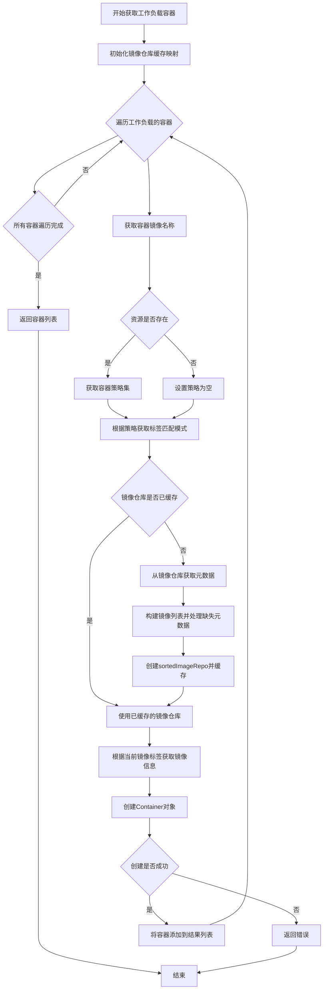

#### 带注释源码

```go
// getWorkloadContainers retrieves the containers for a given workload, along with their
// image information from the provided image repositories.
// Parameters:
//   - workload: The cluster workload containing container information
//   - imageRepos: Repository of images for lookups
//   - resource: Resource object containing policies for containers
//   - fields: Additional fields to include in the container response
//
// Returns:
//   - []v6.Container: List of containers with image information
//   - error: Any error encountered during processing
func getWorkloadContainers(workload cluster.Workload, imageRepos update.ImageRepos, resource resource.Resource, fields []string) (res []v6.Container, err error) {
	// repos maps image names to their sorted repository data for caching
	repos := map[image.Name]*sortedImageRepo{}

	// Iterate through each container in the workload
	for _, c := range workload.ContainersOrNil() {
		// Get the container's image name
		imageName := c.Image.Name
		
		// Initialize policy set - may be nil if resource is nil
		var policies policy.Set
		if resource != nil {
			policies = resource.Policies()
		}
		
		// Get the tag pattern based on container policies (e.g., semver, regex)
		tagPattern := policy.GetTagPattern(policies, c.Name)

		// Check if this image repository is already cached
		imageRepo, ok := repos[imageName]
		if !ok {
			// Fetch repository metadata from image repos
			repoMetadata := imageRepos.GetRepositoryMetadata(imageName)
			
			// Initialize images slice
			var images []image.Info
			
			// Build images list, tolerating tags with missing metadata
			// If metadata is missing for a tag, create a placeholder
			for _, tag := range repoMetadata.Tags {
				info, ok := repoMetadata.Images[tag]
				if !ok {
					// Create minimal info when metadata is missing
					info = image.Info{
						ID: image.Ref{Tag: tag},
					}
				}
				images = append(images, info)
			}
			
			// Create sorted image repo and cache it
			imageRepo = &sortedImageRepo{images: images, imagesByTag: repoMetadata.Images}
			repos[imageName] = imageRepo
		}

		// Look up the current image by its tag
		currentImage := imageRepo.ImageByTag(c.Image.Tag)

		// Create new container with all required information
		container, err := v6.NewContainer(c.Name, imageRepo, currentImage, tagPattern, fields)
		if err != nil {
			// Return immediately on error
			return res, err
		}
		
		// Append container to result slice
		res = append(res, container)
	}

	// Return all processed containers
	return res, nil
}
```


### `policyCommitMessage`

该函数用于根据策略更新和更新原因生成人类可读的 Git 提交消息，支持自定义消息、批量更新摘要以及按事件类型组织的策略变更列表。

参数：

- `us`：`resource.PolicyUpdates`，策略更新的映射，键为资源 ID，值为策略变更内容
- `cause`：`update.Cause`，触发更新的原因信息，包含用户、消息等元数据

返回值：`string`，生成的 Git 提交消息字符串

#### 流程图

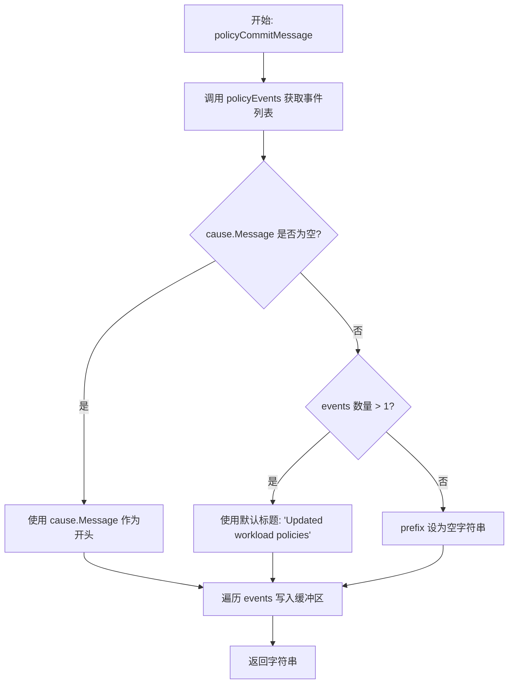

#### 带注释源码

```go
// policyCommitMessage 根据策略更新和更新原因生成 Git 提交消息
// 参数:
//   - us: resource.PolicyUpdates 类型，表示需要应用的策略更新映射
//   - cause: update.Cause 类型，包含更新原因的元数据（如用户、消息等）
//
// 返回值: string 类型，格式化的提交消息
func policyCommitMessage(us resource.PolicyUpdates, cause update.Cause) string {
	// 为了获取大致相同的信息，先获取策略事件列表
	// policyEvents 将策略更新转换为事件映射，按事件类型聚合
	events := policyEvents(us, time.Now())
	
	// 使用 bytes.Buffer 高效构建字符串
	commitMsg := &bytes.Buffer{}
	
	// 默认前缀，用于多行事件列表
	prefix := "- "
	
	// 根据原因消息和事件数量决定提交消息格式
	switch {
	// 优先使用用户自定义消息
	case cause.Message != "":
		fmt.Fprintf(commitMsg, "%s\n\n", cause.Message)
	// 如果有多个事件，使用默认标题
	case len(events) > 1:
		fmt.Fprintf(commitMsg, "Updated workload policies\n\n")
	// 单事件情况下不使用前缀
	default:
		prefix = ""
	}

	// 遍历所有事件并格式化写入缓冲区
	for _, event := range events {
		fmt.Fprintf(commitMsg, "%s%v\n", prefix, event)
	}
	
	// 返回最终生成的提交消息字符串
	return commitMsg.String()
}
```


### `policyEvents`

该函数是 `daemon` 包中的核心辅助函数，负责将离散的策略更新（PolicyUpdates）转换为结构化的事件映射。它遍历所有工作负载的策略变更，识别变更类型（如自动化、锁定），并将相同类型变更的工作负载 ID 聚合到同一个事件中，以便后续统一记录日志或生成 Git Commit 信息。

参数：

- `us`：`resource.PolicyUpdates`，表示待处理的策略更新映射。其中 Key 为 `resource.ID`（工作负载标识），Value 为 `resource.PolicyUpdate`（包含策略的增删集合）。
- `now`：`time.Time`，表示事件发生的当前时间戳，用于初始化事件结构体的时间字段。

返回值：`map[string]event.Event`，返回一个以事件类型字符串（例如 `event.EventAutomate`）为键（Key），以 `event.Event` 结构体为值（Value）的映射。结构体中包含 `ServiceIDs`（所有受影响的工作负载 ID 列表）、`Type`（事件类型）、`StartedAt`（开始时间）、`EndedAt`（结束时间）及 `LogLevel`（日志级别）。

#### 流程图

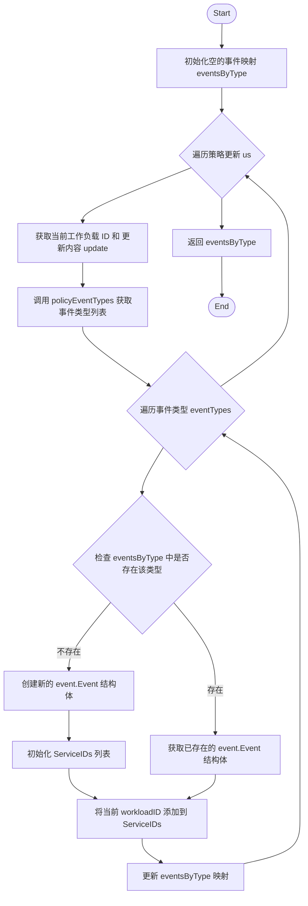

#### 带注释源码

```go
// policyEvents 根据传入的策略更新集合构建事件映射。
// 它将针对不同工作负载的同类策略变更（例如多个服务被设置为 Automated）聚合到
// 一个统一的事件结构中，便于后续进行批量日志记录或事件通知。
//
// 参数 us: 包含所有工作负载策略更新的映射。
// 参数 now: 事件发生的当前时间。
//
// 返回值: 一个 map，键为事件类型字符串，值为聚合后的事件对象。
func policyEvents(us resource.PolicyUpdates, now time.Time) map[string]event.Event {
	// 初始化一个空 map 用于按事件类型分类存储事件
	eventsByType := map[string]event.Event{}

	// 遍历每一个工作负载的策略更新
	for workloadID, update := range us {
		// 获取该更新所涉及的所有事件类型（如 "automate", "lock", "update policy"）
		for _, eventType := range policyEventTypes(update) {
			// 查询当前事件类型是否已有对应的事件对象
			e, ok := eventsByType[eventType]
			if !ok {
				// 如果没有，则初始化一个新的事件对象
				e = event.Event{
					ServiceIDs: []resource.ID{}, // 初始化空列表用于存放受影响的资源ID
					Type:       eventType,
					StartedAt:  now,
					EndedAt:    now,
					LogLevel:   event.LogLevelInfo,
				}
			}
			// 将当前工作负载的 ID 添加到该事件的服务列表中
			e.ServiceIDs = append(e.ServiceIDs, workloadID)
			// 将更新后的事件对象写回 map
			eventsByType[eventType] = e
		}
	}
	// 返回聚合完毕的事件映射
	return eventsByType
}
```


### `policyEventTypes`

获取策略事件类型列表，该函数接受一个策略更新对象，提取并去重其中的所有事件类型，返回排序后的事件类型字符串列表。

参数：

-  `u`：`resource.PolicyUpdate`，策略更新对象，包含 Add（新增策略）和 Remove（移除策略）两个 policy.Set 类型的字段

返回值：`[]string`，去重并按字母排序的事件类型列表

#### 流程图

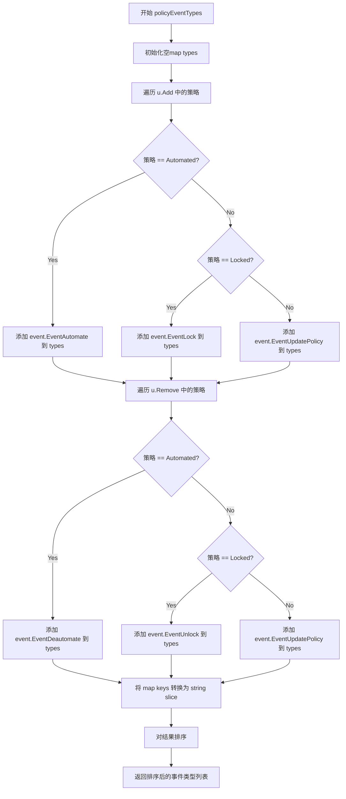

#### 带注释源码

```go
// policyEventTypes is a deduped list of all event types this update contains
// policyEventTypes 获取策略更新中包含的所有事件类型的去重列表
func policyEventTypes(u resource.PolicyUpdate) []string {
	// 使用 map 作为集合来自动去重，键为事件类型字符串，值为空结构体
	types := map[string]struct{}{}
	
	// 遍历新增策略集合，将策略类型映射为对应的事件类型
	for p := range u.Add {
		switch {
		case p == policy.Automated:
			// 自动化策略映射到自动化事件
			types[event.EventAutomate] = struct{}{}
		case p == policy.Locked:
			// 锁定策略映射到锁定事件
			types[event.EventLock] = struct{}{}
		default:
			// 其他策略（如忽略策略）映射到策略更新事件
			types[event.EventUpdatePolicy] = struct{}{}
		}
	}

	// 遍历移除策略集合，将策略类型映射为对应的事件类型
	for p := range u.Remove {
		switch {
		case p == policy.Automated:
			// 移除自动化策略映射到取消自动化事件
			types[event.EventDeautomate] = struct{}{}
		case p == policy.Locked:
			// 移除锁定策略映射到解锁事件
			types[event.EventUnlock] = struct{}{}
		default:
			// 其他策略映射到策略更新事件
			types[event.EventUpdatePolicy] = struct{}{}
		}
	}
	
	// 将 map 的键（事件类型）转换为字符串切片
	var result []string
	for t := range types {
		result = append(result, t)
	}
	
	// 按字母顺序排序，使输出结果确定且可预测
	sort.Strings(result)
	return result
}
```


### `latestValidRevision`

获取最新有效版本。该函数验证 Git 提交签名，返回 HEAD 的修订版本号（如果签名有效），或返回最后一个有效提交的 SHA 及其之后的无效提交。

参数：

- `ctx`：`context.Context`，上下文对象，用于控制请求的取消和超时
- `repo`：`*git.Repo`，Git 仓库实例，用于获取分支头和提交信息
- `syncState`：`sync.State`，同步状态，用于获取同步标签指向的修订版本
- `gitVerifySignaturesMode`：`sync.VerifySignaturesMode`，Git 签名验证模式，决定验证规则（如 FirstParent 模式）

返回值：

- `string`，最新有效版本的修订版本号（SHA）
- `git.Commit`，无效提交对象（如果存在无效签名则返回该无效提交，否则返回空提交）
- `error`，执行过程中的错误信息

#### 流程图

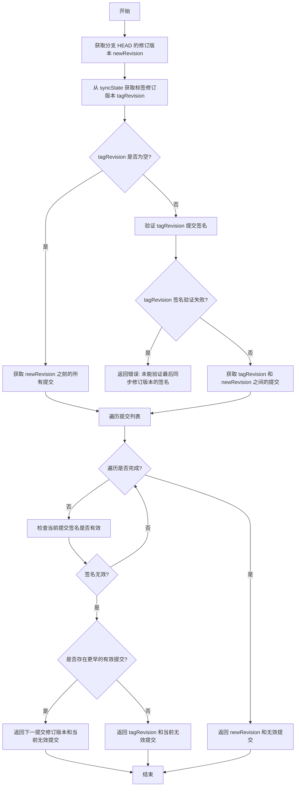

#### 带注释源码

```go
// latestValidRevision 返回已配置分支的 HEAD（如果具有有效签名），
// 或者找到的最新有效提交的 SHA 及其之后的无效提交。
//
// 签名验证针对同步标签修订版本与 HEAD 之间的提交执行，
// 因为当标签来源于未知来源时，分支不可信。
//
// 如果无法验证标签的签名，或无法获取其指向的修订版本的提交范围，
// 则返回错误。
func latestValidRevision(ctx context.Context, repo *git.Repo, syncState sync.State, gitVerifySignaturesMode sync.VerifySignaturesMode) (string, git.Commit, error) {
	var invalidCommit = git.Commit{} // 初始化无效提交对象

	// 1. 获取分支 HEAD 的修订版本号
	newRevision, err := repo.BranchHead(ctx)
	if err != nil {
		return "", invalidCommit, err
	}

	// 2. 从同步状态获取标签指向的修订版本（同步标签的 SHA）
	tagRevision, err := syncState.GetRevision(ctx)
	if err != nil {
		return "", invalidCommit, err
	}

	// 3. 根据验证模式确定是否只检查第一个父提交
	var gitFirstParent = gitVerifySignaturesMode == sync.VerifySignaturesModeFirstParent

	var commits []git.Commit
	if tagRevision == "" {
		// 如果没有同步标签，获取 HEAD 之前的所有提交
		commits, err = repo.CommitsBefore(ctx, newRevision, gitFirstParent)
	} else {
		// 确保高水位标记处的提交是已签名且有效的
		if err = repo.VerifyCommit(ctx, tagRevision); err != nil {
			return "", invalidCommit, errors.Wrap(err, "failed to verify signature of last sync'ed revision")
		}
		// 获取同步标签与 HEAD 之间的提交列表
		commits, err = repo.CommitsBetween(ctx, tagRevision, newRevision, gitFirstParent)
	}

	// 4. 处理获取提交列表时的错误
	if err != nil {
		return tagRevision, invalidCommit, err
	}

	// 5. 按升序遍历提交，验证每个提交的签名
	// 遇到无效签名时，返回该提交之前的有效提交修订版本
	for i := len(commits) - 1; i >= 0; i-- {
		// 检查当前提交签名是否有效
		if !commits[i].Signature.Valid() {
			if i+1 < len(commits) {
				// 存在更早的有效提交，返回其修订版本和当前无效提交
				return commits[i+1].Revision, commits[i], nil
			}
			// 没有更早的有效提交，返回标签修订版本和当前无效提交
			return tagRevision, commits[i], nil
		}
	}

	// 6. 所有提交签名均有效，返回 HEAD 修订版本
	return newRevision, invalidCommit, nil
}
```


### `verifyWorkingRepo`

该函数用于验证工作仓库（working clone）的 HEAD 修订版是否为已验证的安全提交，确保写操作使用的是经过签名验证的代码，防止未验证的提交被用于同步到集群。

参数：

- `ctx`：`context.Context`，上下文对象，用于控制超时和取消
- `repo`：`*git.Repo`，Git 仓库实例，用于获取分支信息和验证签名
- `working`：`*git.Checkout`，工作目录的 checkout 对象，用于获取当前 HEAD 修订版
- `syncState`：`sync.State`，同步状态管理器，用于获取同步标记指向的修订版
- `gitVerifySignaturesMode`：`sync.VerifySignaturesMode`，Git 签名验证模式（_none、_all、_first-parent 等）

返回值：`error`，如果验证失败返回相应错误（如验证失败、修订版不匹配），验证成功返回 `nil`

#### 流程图

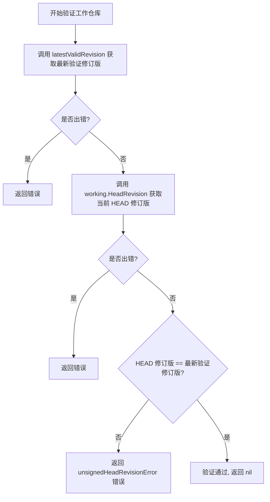

#### 带注释源码

```go
// verifyWorkingRepo checks that a working clone is safe to be used for a write operation
// verifyWorkingRepo 函数用于验证工作副本是否可以安全用于写操作
func verifyWorkingRepo(ctx context.Context, repo *git.Repo, working *git.Checkout, syncState sync.State, gitVerifySignaturesMode sync.VerifySignaturesMode) error {
	// 调用 latestValidRevision 获取分支 HEAD 中最新经过签名验证的提交修订版
	// 如果验证模式不是 none，则会验证从 sync tag 到 HEAD 之间所有提交的签名
	if latestVerifiedRev, _, err := latestValidRevision(ctx, repo, syncState, gitVerifySignaturesMode); err != nil {
		return err // 如果验证过程中出错，直接返回错误
	} else if headRev, err := working.HeadRevision(ctx); err != nil {
		return err // 获取工作副本 HEAD 修订版失败，返回错误
	} else if headRev != latestVerifiedRev {
		// 比较工作副本的 HEAD 修订版与最新验证修订版
		// 如果不一致，说明工作副本包含未验证的提交，返回错误
		return unsignedHeadRevisionError(latestVerifiedRev, headRev)
	}
	// 所有检查通过，工作副本是安全的，可以用于写操作
	return nil
}
```


### `Daemon.Version`

获取 Daemon 进程的版本号，直接返回 Daemon 结构体中存储的版本字符串。

参数：

- `ctx`：`context.Context`，用于请求的上下文信息

返回值：`string, error`，返回版本号字符串，错误始终为 nil

#### 流程图

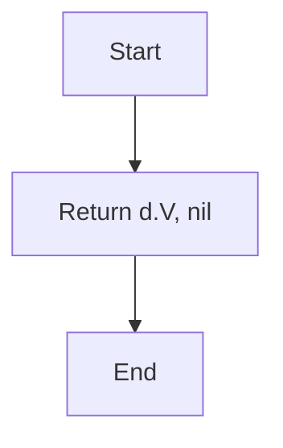

#### 带注释源码

```go
// Version 返回 Daemon 的版本号
// 参数 ctx: context.Context - 用于请求的上下文信息
// 返回值: (string, error) - 版本号字符串，错误始终为 nil
func (d *Daemon) Version(ctx context.Context) (string, error) {
	return d.V, nil
}
```


### `Daemon.Ping`

健康检查方法，用于验证 Daemon 与集群的连接是否正常。

参数：

- `ctx`：`context.Context`，上下文对象，用于控制请求的超时和取消

返回值：`error`，如果集群连接正常返回 nil，否则返回错误信息

#### 流程图

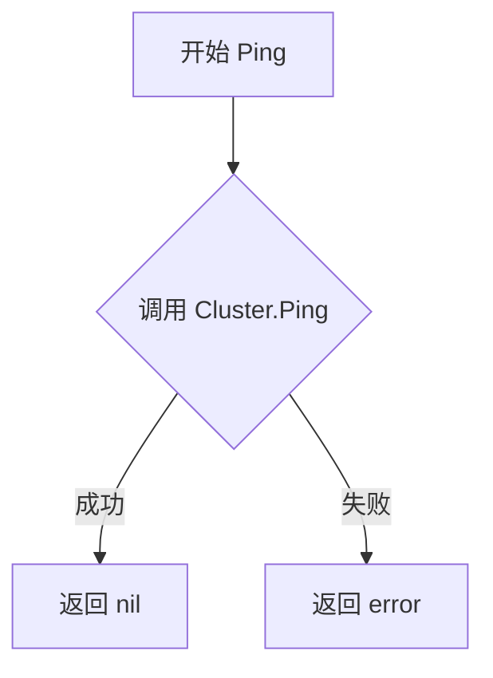

#### 带注释源码

```go
// Ping 是 Daemon 实现的 api.Server 接口的健康检查方法
// 用于检查与集群的连接是否正常
func (d *Daemon) Ping(ctx context.Context) error {
	// 直接调用 Cluster 的 Ping 方法进行健康检查
	// Cluster 是 cluster.Cluster 接口，封装了与 Kubernetes 集群的交互
	return d.Cluster.Ping()
}
```


### `Daemon.Export`

该方法实现了 `api.Server` 接口，用于将当前连接的集群资源配置（通常为 Kubernetes 资源定义）导出为字节流（通常是 YAML 或 JSON 格式）。它充当了一个简单的代理模式，将请求委托给内部 `Cluster` 组件的具体实现，而自身不执行业务逻辑。

参数：

- `ctx`：`context.Context`，请求上下文，用于控制超时和取消操作。

返回值：

- `[]byte`：导出的集群配置数据。
- `error`：如果集群无法连接或导出过程中发生错误，则返回相应的错误。

#### 流程图

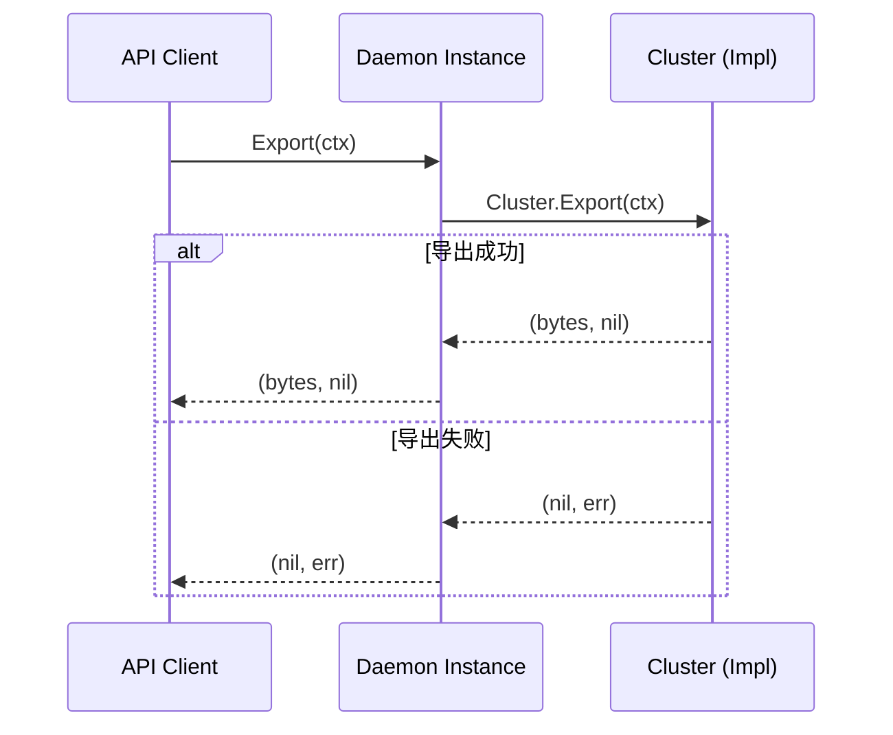

#### 带注释源码

```go
// Export 实现 api.Server 接口的 Export 方法。
// 它获取集群的当前状态并将其序列化为字节切片（通常是 YAML）。
func (d *Daemon) Export(ctx context.Context) ([]byte, error) {
	// 直接委托给成员变量 Cluster。
	// d.Cluster 是 cluster.Cluster 接口的具体实现（如 Kubernetes 集群客户端）。
	return d.Cluster.Export(ctx)
}
```


### `Daemon.getManifestStore`

获取清单存储（Manifest Store），用于从 Git 仓库中读取和管理 Kubernetes 清单资源。根据 `ManifestGenerationEnabled` 标志位决定使用配置感知的存储还是原始文件存储。

参数：

- `r`：`repo`，一个接口类型，提供 `Dir() string` 方法，用于获取 Git 仓库目录路径

返回值：

- `manifests.Store`：清单存储接口，用于获取和管理 Kubernetes 资源
- `error`：如果创建存储失败则返回错误

#### 流程图

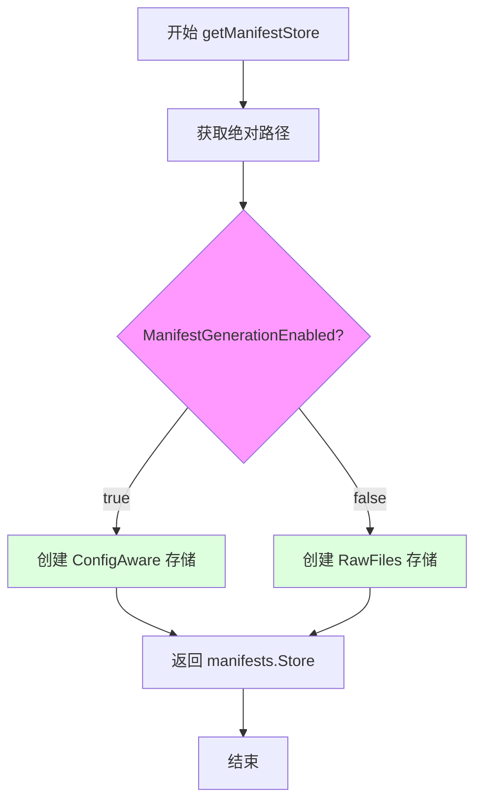

#### 带注释源码

```go
// getManifestStore 返回适合当前配置的清单存储实现
// 参数 r: repo 接口，提供仓库目录信息
// 返回: manifests.Store 接口实例和可能的错误
func (d *Daemon) getManifestStore(r repo) (manifests.Store, error) {
	// 使用 GitConfig.Paths 将相对路径转换为绝对路径
	absPaths := git.MakeAbsolutePaths(r, d.GitConfig.Paths)
	
	// 根据配置决定使用哪种存储实现
	if d.ManifestGenerationEnabled {
		// 启用配置感知模式：支持 Kustomize、Helm 等配置生成工具
		// 传入目录、路径、manifests 接口和超时时间
		return manifests.NewConfigAware(r.Dir(), absPaths, d.Manifests, d.SyncTimeout)
	}
	
	// 禁用配置生成：直接使用原始 YAML/JSON 文件
	// 适用于纯 YAML 方式管理的仓库
	return manifests.NewRawFiles(r.Dir(), absPaths, d.Manifests), nil
}
```

---

**相关类型说明**

| 类型 | 描述 |
|------|------|
| `repo` | 接口，仅定义 `Dir() string` 方法，用于获取仓库目录路径 |
| `manifests.Store` | 清单存储接口，提供 `GetAllResourcesByID` 等方法读取资源 |
| `git.MakeAbsolutePaths` | 工具函数，将相对路径转换为绝对路径 |
| `manifests.NewConfigAware` | 创建支持配置生成的存储实现（如 Kustomize） |
| `manifests.NewRawFiles` | 创建直接读取原始文件的存储实现 |


### `Daemon.getResources`

该方法用于获取当前 Git 仓库中的所有资源列表。它通过只读克隆 Git 仓库，读取其中的清单文件（manifests），并返回资源映射表。同时，该方法会根据 Git 仓库的状态（如未就绪、无配置等）返回相应的只读原因（ReadOnlyReason），用于指示资源列表可能不完整的原因。

参数：

- `ctx`：`context.Context`，用于控制请求的取消、超时等上下文信息

返回值：

- `map[string]resource.Resource`：资源 ID 到资源对象的映射表
- `v6.ReadOnlyReason`：只读原因，表示资源列表处于只读状态的具体原因（如未就绪、无仓库、缺失等）
- `error`：执行过程中的错误信息（如果有）

#### 流程图

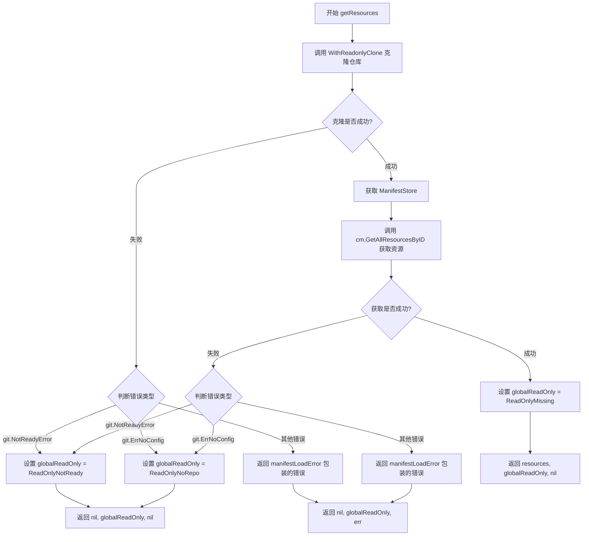

#### 带注释源码

```go
// getResources 获取当前 Git 仓库中的所有资源列表
// 返回值包含：资源映射表、只读原因（用于标识资源列表的状态）、以及可能的错误
func (d *Daemon) getResources(ctx context.Context) (map[string]resource.Resource, v6.ReadOnlyReason, error) {
	// 初始化返回值变量
	var resources map[string]resource.Resource
	var globalReadOnly v6.ReadOnlyReason

	// 使用只读克隆访问 Git 仓库中的清单文件
	// WithReadonlyClone 会创建一个只读的 git export 会话
	err := d.WithReadonlyClone(ctx, func(checkout *git.Export) error {
		// 根据配置获取对应的 ManifestStore
		// 如果启用了 ManifestGenerationEnabled，则使用 ConfigAware 方式
		// 否则使用 RawFiles 方式读取原始 YAML/JSON 文件
		cm, err := d.getManifestStore(checkout)
		if err != nil {
			return err
		}

		// 从 ManifestStore 中获取所有资源，按 ID 索引
		// 返回的 map 键为 resource.ID 的字符串形式，值为 resource.Resource 对象
		resources, err = cm.GetAllResourcesByID(ctx)
		return err
	})

	// 根据 Git 仓库的状态确定只读原因
	// 不同状态对应不同的 ReadOnlyReason，用于上游调用者判断资源列表的完整性
	_, notReady := err.(git.NotReadyError)
	switch {
	// Git 仓库尚未就绪（如正在初始化或同步中）
	case notReady:
		globalReadOnly = v6.ReadOnlyNotReady

	// Git 仓库中没有配置文件（尚未初始化或未配置路径）
	case err == git.ErrNoConfig:
		globalReadOnly = v6.ReadOnlyNoRepo

	// 其他错误，包装后返回
	case err != nil:
		return nil, globalReadOnly, manifestLoadError(err)

	// 成功但资源可能缺失（正常情况下的默认只读原因）
	default:
		globalReadOnly = v6.ReadOnlyMissing
	}

	// 返回资源映射表、只读原因以及可能的错误
	return resources, globalReadOnly, nil
}
```


### `Daemon.ListServices`

该函数是 Flux 守护进程的 API 方法，用于列出指定命名空间下的所有服务（工作负载）。它首先从集群获取工作负载信息，然后从 Git 仓库获取资源定义，最后根据集群状态和仓库策略综合计算每个服务的只读状态、自动化策略、同步状态等详细信息，并返回 `ControllerStatus` 列表。

参数：

- `ctx`：`context.Context`，请求上下文，用于控制超时和取消
- `namespace`：`string`，要列出的服务所属的 Kubernetes 命名空间

返回值：`([]v6.ControllerStatus, error)`，返回包含服务状态信息的切片，第二个值为错误信息

#### 流程图

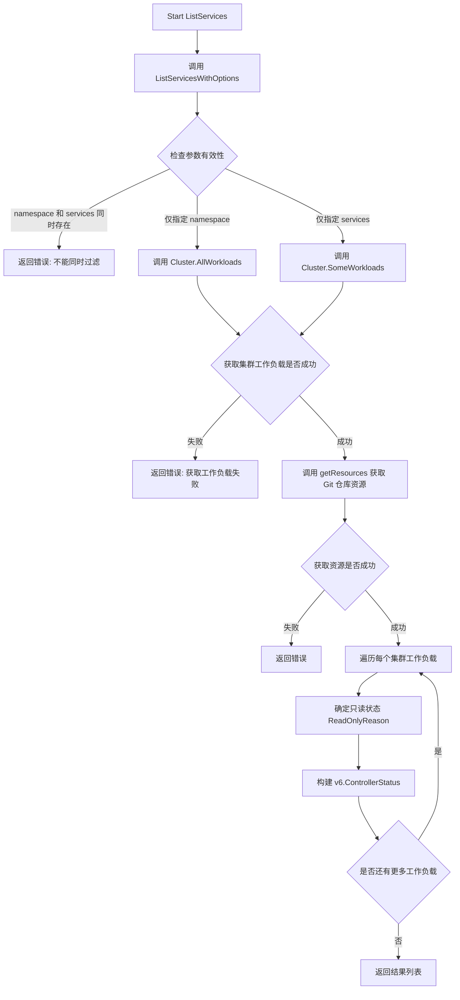

#### 带注释源码

```go
// ListServices 返回指定命名空间下的所有服务（工作负载）及其状态信息
// 参数：
//   - ctx: context.Context - 请求上下文
//   - namespace: string - Kubernetes 命名空间
//
// 返回值：
//   - []v6.ControllerStatus: 服务状态列表
//   - error: 错误信息
func (d *Daemon) ListServices(ctx context.Context, namespace string) ([]v6.ControllerStatus, error) {
	// 这是一个便捷方法，内部调用 ListServicesWithOptions
	// 将简单的 namespace 参数包装为 v11.ListServicesOptions 结构
	return d.ListServicesWithOptions(ctx, v11.ListServicesOptions{Namespace: namespace})
}
```


### `Daemon.ListServicesWithOptions`

该方法用于根据提供的选项列出集群中的服务（工作负载），并返回每个工作负载的详细状态信息，包括容器、策略、同步状态等。

参数：

- `ctx`：`context.Context`，请求上下文，用于超时控制和取消操作
- `opts`：`v11.ListServicesOptions`，列出服务的选项，包含命名空间和具体服务ID的过滤条件

返回值：`([]v6.ControllerStatus, error)`，返回工作负载状态列表，或在出现错误时返回错误信息

#### 流程图

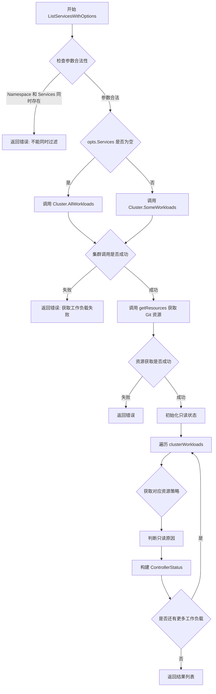

#### 带注释源码

```go
// ListServicesWithOptions 根据选项列出服务
// 参数：
//   - ctx: 上下文对象
//   - opts: 列出服务的选项，包含 Namespace 和 Services 两个过滤条件
//
// 返回值：
//   - []v6.ControllerStatus: 工作负载状态列表
//   - error: 错误信息
func (d *Daemon) ListServicesWithOptions(ctx context.Context, opts v11.ListServicesOptions) ([]v6.ControllerStatus, error) {
    // 检查参数合法性：不能同时指定 namespace 和 services
    if opts.Namespace != "" && len(opts.Services) > 0 {
        return nil, errors.New("cannot filter by 'namespace' and 'workloads' at the same time")
    }

    var clusterWorkloads []cluster.Workload
    var err error
    // 根据选项决定调用集群接口的方式
    if len(opts.Services) > 0 {
        // 如果指定了具体服务ID，调用 SomeWorkloads 获取指定工作负载
        clusterWorkloads, err = d.Cluster.SomeWorkloads(ctx, opts.Services)
    } else {
        // 否则获取指定命名空间下的所有工作负载
        clusterWorkloads, err = d.Cluster.AllWorkloads(ctx, opts.Namespace)
    }
    if err != nil {
        return nil, errors.Wrap(err, "getting workloads from cluster")
    }

    // 从 Git 仓库获取资源配置信息
    resources, missingReason, err := d.getResources(ctx)
    if err != nil {
        return nil, err
    }

    // 遍历每个工作负载，构建状态信息
    var res []v6.ControllerStatus
    for _, workload := range clusterWorkloads {
        // 初始化只读状态为正常
        readOnly := v6.ReadOnlyOK
        // 检查 Git 仓库是否处于只读模式
        repoIsReadonly := d.Repo.Readonly()

        var policies policy.Set
        // 从资源映射中获取对应工作负载的策略
        if resource, ok := resources[workload.ID.String()]; ok {
            policies = resource.Policies()
        }
        
        // 根据不同情况设置只读原因
        switch {
        case policies == nil:
            // 如果没有策略，说明资源缺失
            readOnly = missingReason
        case repoIsReadonly:
            // Git 仓库处于只读模式
            readOnly = v6.ReadOnlyROMode
        case workload.IsSystem:
            // 系统工作负载
            readOnly = v6.ReadOnlySystem
        }
        
        // 处理同步错误
        var syncError string
        if workload.SyncError != nil {
            syncError = workload.SyncError.Error()
        }
        
        // 构建并追加工作负载状态
        res = append(res, v6.ControllerStatus{
            ID:         workload.ID,
            Containers: containers2containers(workload.ContainersOrNil()),
            ReadOnly:   readOnly,
            Status:     workload.Status,
            Rollout:    workload.Rollout,
            SyncError:  syncError,
            Antecedent: workload.Antecedent,
            Labels:     workload.Labels,
            Automated:  policies.Has(policy.Automated),
            Locked:     policies.Has(policy.Locked),
            Ignore:     policies.Has(policy.Ignore),
            Policies:   policies.ToStringMap(),
        })
    }

    return res, nil
}
```


### `Daemon.ListImages`

列出指定工作负载的镜像信息（已废弃，建议使用 ListImagesWithOptions）

参数：

- `ctx`：`context.Context`，请求上下文，用于控制超时和取消
- `spec`：`update.ResourceSpec`，资源规范，指定要查询的工作负载（支持所有工作负载或特定工作负载）

返回值：`([]v6.ImageStatus, error)`，返回镜像状态列表，error 表示执行过程中的错误信息

#### 流程图

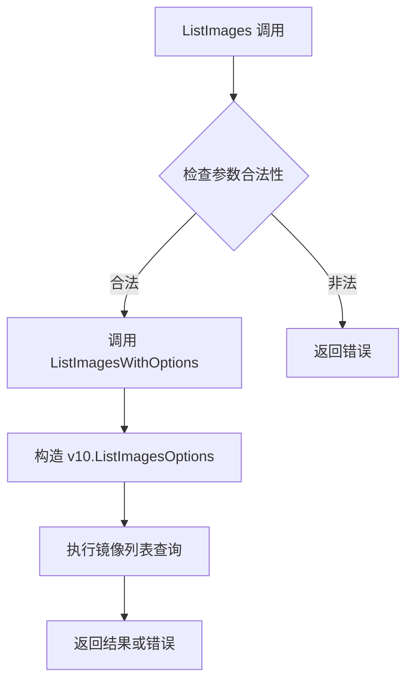

#### 带注释源码

```go
// ListImages - deprecated from v10, lists the images available for set of workloads
// 说明：该方法已在 v10 版本废弃，建议使用 ListImagesWithOptions 方法
// 参数：
//   - ctx: 上下文对象，用于控制请求生命周期
//   - spec: 资源规范，指定要列出镜像的工作负载，支持 update.ResourceSpecAll 表示所有工作负载
//
// 返回值：
//   - []v6.ImageStatus: 镜像状态列表，包含每个工作负载的容器镜像信息
//   - error: 执行过程中的错误信息
func (d *Daemon) ListImages(ctx context.Context, spec update.ResourceSpec) ([]v6.ImageStatus, error) {
	// 将 spec 封装为 ListImagesOptions 并调用 ListImagesWithOptions
	// 这是一个兼容层，实际逻辑在 ListImagesWithOptions 中实现
	return d.ListImagesWithOptions(ctx, v10.ListImagesOptions{Spec: spec})
}
```


### `Daemon.ListImagesWithOptions`

该方法是 Flux CD Daemon 的核心 API 方法之一，用于根据指定选项列出集群中工作负载的容器镜像信息。它首先从 Kubernetes 集群获取工作负载，然后从 Git 仓库获取资源配置，最后从镜像注册表获取镜像元数据，组装成统一的镜像状态返回给客户端。

参数：

- `ctx`：`context.Context`，用于控制请求生命周期和传递上下文信息
- `opts`：`v10.ListImagesOptions`，包含过滤和定制选项（如命名空间、工作负载规格、容器字段覆盖等）

返回值：`([]v6.ImageStatus, error)`，返回镜像状态切片，包含每个工作负载的容器及其镜像信息；若发生错误则返回 error

#### 流程图

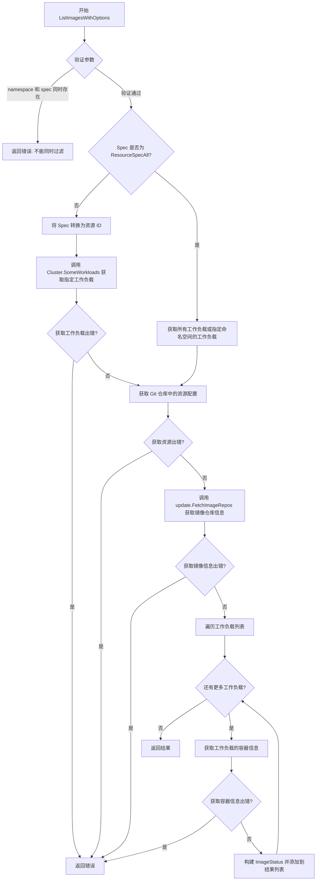

#### 带注释源码

```go
// ListImagesWithOptions lists the images available for set of workloads
// 根据选项列出工作负载的可用镜像
func (d *Daemon) ListImagesWithOptions(ctx context.Context, opts v10.ListImagesOptions) ([]v6.ImageStatus, error) {
    // 参数校验：不能同时通过 namespace 和具体 workload 进行过滤
    // 这是为了避免歧义，因为两者都是过滤方式
    if opts.Namespace != "" && opts.Spec != update.ResourceSpecAll {
        return nil, errors.New("cannot filter by 'namespace' and 'workload' at the same time")
    }

    var workloads []cluster.Workload  // 工作负载列表
    var err error

    // 根据 Spec 类型决定获取工作负载的方式
    if opts.Spec != update.ResourceSpecAll {
        // 如果不是获取所有工作负载，则将 Spec 转换为资源 ID
        id, err := opts.Spec.AsID()
        if err != nil {
            return nil, errors.Wrap(err, "treating workload spec as ID")
        }
        // 从集群获取指定的工作负载
        workloads, err = d.Cluster.SomeWorkloads(ctx, []resource.ID{id})
        if err != nil {
            return nil, errors.Wrap(err, "getting some workloads")
        }
    } else {
        // 获取所有工作负载，或指定命名空间下的所有工作负载
        workloads, err = d.Cluster.AllWorkloads(ctx, opts.Namespace)
        if err != nil {
            return nil, errors.Wrap(err, "getting all workloads")
        }
    }

    // 从 Git 仓库获取资源配置信息（用于获取自动化策略等）
    resources, _, err := d.getResources(ctx)
    if err != nil {
        return nil, err
    }

    // 从镜像注册表获取所有相关镜像仓库信息
    // 这里会并发请求多个镜像仓库的元数据和标签信息
    imageRepos, err := update.FetchImageRepos(d.Registry, clusterContainers(workloads), d.Logger)
    if err != nil {
        return nil, errors.Wrap(err, "getting images for workloads")
    }

    var res []v6.ImageStatus  // 最终结果列表

    // 遍历每个工作负载，构建其镜像状态
    for _, workload := range workloads {
        // 获取工作负载的容器及其镜像信息
        // 包含当前镜像、可用镜像列表、策略匹配等
        workloadContainers, err := getWorkloadContainers(
            workload, 
            imageRepos, 
            resources[workload.ID.String()], 
            opts.OverrideContainerFields,  // 可选的容器字段覆盖
        )
        if err != nil {
            return nil, err
        }
        
        // 构建镜像状态并添加到结果列表
        res = append(res, v6.ImageStatus{
            ID:         workload.ID,
            Containers: workloadContainers,
        })
    }

    return res, nil  // 返回镜像状态列表
}
```


### `Daemon.makeJobFromUpdate`

将 `updateFunc`（操作 git checkout 的过程）转换为 `jobFunc`（守护进程将在作业中执行的程序），该函数会使用新的克隆运行更新，并将结果记录为事件。

参数：

- `update`：`updateFunc`，一个在 git checkout 上运行的过程函数，用于在作业中执行，其类型为 `func(ctx context.Context, jobID job.ID, working *git.Checkout, logger log.Logger) (job.Result, error)`

返回值：`jobFunc`，一个守护进程将在作业中执行的程序，类型为 `func(ctx context.Context, jobID job.ID, logger log.Logger) (job.Result, error)`

#### 流程图

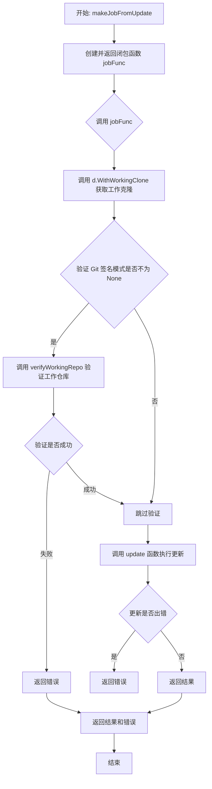

#### 带注释源码

```go
// makeJobFromUpdate 将 updateFunc 转换为 jobFunc
// updateFunc: 操作 git checkout 的函数，用于在作业中执行
// 返回: jobFunc - 守护进程将在作业中执行的函数
func (d *Daemon) makeJobFromUpdate(update updateFunc) jobFunc {
    // 返回一个闭包函数，实现 jobFunc 接口
    return func(ctx context.Context, jobID job.ID, logger log.Logger) (job.Result, error) {
        var result job.Result
        
        // 使用工作克隆执行任务
        // WithWorkingClone 会获取一个新鲜的、可写的 git 仓库克隆
        err := d.WithWorkingClone(ctx, func(working *git.Checkout) error {
            var err error
            
            // 如果启用了 Git 签名验证，则验证工作仓库
            if err = verifyWorkingRepo(ctx, d.Repo, working, d.SyncState, d.GitVerifySignaturesMode); d.GitVerifySignaturesMode != sync.VerifySignaturesModeNone && err != nil {
                return err
            }
            
            // 调用传入的 update 函数执行实际的更新操作
            result, err = update(ctx, jobID, working, logger)
            if err != nil {
                return err
            }
            return nil
        })
        
        // 如果在获取克隆或执行更新时发生错误，返回错误
        if err != nil {
            return result, err
        }
        
        // 返回执行结果
        return result, nil
    }
}
```


### `Daemon.executeJob`

该方法负责执行具体的任务函数，并维护任务状态缓存，以便守护进程可以随时查询任务执行结果。它通过上下文超时机制控制任务执行时间，并根据任务成功或失败更新对应的状态。

参数：

- `id`：`job.ID`，任务的唯一标识符
- `do`：`jobFunc`，要执行的任务函数，类型为 `func(ctx context.Context, jobID job.ID, logger log.Logger) (job.Result, error)`
- `logger`：`log.Logger`，用于记录任务执行过程中的日志信息

返回值：`(job.Result, error)`，返回任务执行结果和可能的错误信息

#### 流程图

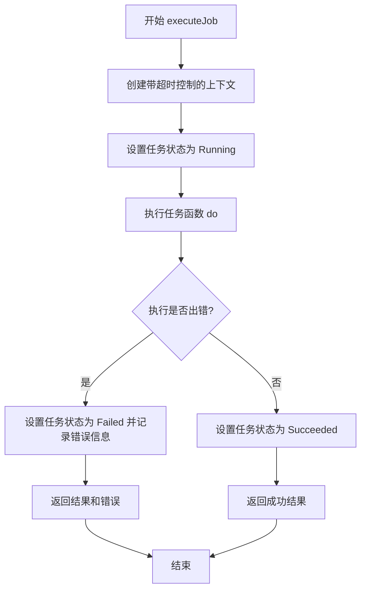

#### 带注释源码

```go
// executeJob runs a job func and keeps track of its status, so the
// daemon can report it when asked.
func (d *Daemon) executeJob(id job.ID, do jobFunc, logger log.Logger) (job.Result, error) {
	// 创建带有超时控制的上下文，超时时长由 daemon 的 SyncTimeout 配置决定
	// 这样可以防止任务无限期运行
	ctx, cancel := context.WithTimeout(context.Background(), d.SyncTimeout)
	defer cancel()
	
	// 首先将任务状态设置为 Running，表示任务已开始执行
	d.JobStatusCache.SetStatus(id, job.Status{StatusString: job.StatusRunning})
	
	// 调用实际的任务执行函数
	result, err := do(ctx, id, logger)
	
	// 如果任务执行过程中发生错误
	if err != nil {
		// 更新任务状态为 Failed，并记录错误信息和部分结果
		d.JobStatusCache.SetStatus(id, job.Status{
			StatusString: job.StatusFailed,
			Err:          err.Error(),
			Result:       result,
		})
		return result, err
	}
	
	// 任务执行成功，更新任务状态为 Succeeded 并保存结果
	d.JobStatusCache.SetStatus(id, job.Status{
		StatusString: job.StatusSucceeded,
		Result:       result,
	})
	return result, nil
}
```

### 关键组件信息

- **JobStatusCache**：任务状态缓存管理器，负责存储和查询任务的不同状态（Queued、Running、Failed、Succeeded）
- **jobFunc**：任务函数类型定义，封装了需要在守护进程中执行的业务逻辑
- **job.Result**：任务执行结果的结构体，包含修订版本、规范和详细结果信息

### 技术债务与优化空间

1. **缺乏任务取消传播**：虽然创建了带有超时的上下文，但当外部调用取消时，任务函数内部并未显式检查 `ctx.Done()` 通道来响应取消信号
2. **状态更新时机**：在任务执行前就设置状态为 Running，如果任务函数从未被执行（例如上下文立即超时），状态会保持为 Running 而非 Failed
3. **错误信息冗余**：将错误转换为字符串存储，可能丢失更丰富的错误上下文信息

### 错误处理与异常设计

- **超时错误**：通过 `context.WithTimeout` 实现，确保任务不会无限期运行
- **任务失败处理**：错误发生后立即更新状态缓存并返回，允许调用方感知失败
- **资源清理**：使用 `defer cancel()` 确保上下文资源被释放

### 外部依赖与接口契约

- 依赖 `d.SyncTimeout` 配置来决定任务超时时间
- 依赖 `d.JobStatusCache.SetStatus` 来持久化任务状态
- 调用方通过 `job.ID` 追踪任务，后续可通过 `JobStatus` 方法查询状态


### `Daemon.makeLoggingJobFunc`

创建一个带日志记录功能的 jobFunc 包装器，用于在任务执行完成后记录提交事件，包括 revision、执行结果和工作负载 ID 信息。

参数：

- `f`：`jobFunc`，待包装的任务函数

返回值：`jobFunc`，返回包装后的带日志功能的函数

#### 流程图

```mermaid
flowchart TD
    A[开始: 接收 jobFunc f] --> B[记录任务开始时间 started = time.Now().UTC]
    B --> C[执行原始任务函数 f]
    C --> D{执行是否有错误?}
    D -->|是| E[直接返回 result 和 err]
    D -->|否| F[记录 revision 到日志]
    F --> G{Revision 是否为空?}
    G -->|是| H[直接返回 result]
    G -->|否| I[遍历 result.Result 收集成功的 workloadIDs]
    I --> J[构建 CommitEventMetadata]
    J --> K[构造 Event 结构体]
    K --> L[调用 d.LogEvent 记录事件]
    L --> M[返回 result 和 LogEvent 错误]
```

#### 带注释源码

```
// makeLoggingFunc takes a jobFunc and returns a jobFunc that will log
// a commit event with the result.
func (d *Daemon) makeLoggingJobFunc(f jobFunc) jobFunc {
    // 返回一个闭包函数，实现日志包装功能
    return func(ctx context.Context, id job.ID, logger log.Logger) (job.Result, error) {
        // 1. 记录任务开始时间（UTC 时间）
        started := time.Now().UTC()
        
        // 2. 执行原始的任务函数 f
        result, err := f(ctx, id, logger)
        
        // 3. 如果执行出错，直接返回错误和结果
        if err != nil {
            return result, err
        }
        
        // 4. 记录 revision 到日志
        logger.Log("revision", result.Revision)
        
        // 5. 只有当 revision 不为空时才记录事件
        if result.Revision != "" {
            // 6. 遍历结果，收集所有成功状态的 workload IDs
            var workloadIDs []resource.ID
            for id, result := range result.Result {
                if result.Status == update.ReleaseStatusSuccess {
                    workloadIDs = append(workloadIDs, id)
                }
            }

            // 7. 构建提交事件的元数据
            metadata := &event.CommitEventMetadata{
                Revision: result.Revision,  // 提交 revision
                Spec:     result.Spec,      // 更新规范
                Result:   result.Result,    // 更新结果
            }

            // 8. 构造事件并调用 LogEvent 记录
            return result, d.LogEvent(event.Event{
                ServiceIDs: workloadIDs,    // 涉及的 workload ID 列表
                Type:       event.EventCommit,  // 事件类型为提交
                StartedAt:  started,        // 开始时间
                EndedAt:    started,        // 结束时间（与开始时间相同，表示瞬时完成）
                LogLevel:   event.LogLevelInfo, // 日志级别为信息
                Metadata:   metadata,       // 事件元数据
            })
        }
        
        // 9. 如果 revision 为空，直接返回结果
        return result, nil
    }
}
```


### `Daemon.queueJob`

将指定的 job 函数加入执行队列，返回该任务的唯一标识 ID。

参数：

-  `do`：`jobFunc`，需要执行的 job 函数，类型定义为 `func(ctx context.Context, jobID job.ID, logger log.Logger) (job.Result, error)`

返回值：`job.ID`，返回已入队 job 的唯一标识符，用于后续查询 job 状态

#### 流程图

```mermaid
flowchart TD
    A[开始 queueJob] --> B[生成新 job.ID]
    B --> C[记录入队时间 enqueuedAt]
    C --> D[创建 job.Job 结构体]
    D --> E[设置 job.Do 闭包函数]
    E --> F[调用 d.Jobs.Enqueue 添加到队列]
    F --> G[更新 queueLength 指标]
    G --> H[设置 job 状态为 StatusQueued]
    H --> I[返回 job.ID]
```

#### 带注释源码

```go
// queueJob queues a job func to be executed.
func (d *Daemon) queueJob(do jobFunc) job.ID {
	// 使用 guid 生成全局唯一标识符作为 job ID
	id := job.ID(guid.New())
	// 记录当前时间用于后续计算队列等待时长
	enqueuedAt := time.Now()
	// 将 job 加入到任务队列中
	d.Jobs.Enqueue(&job.Job{
		ID: id,
		// 定义实际执行逻辑的闭包函数
		Do: func(logger log.Logger) error {
			// 观察任务在队列中的等待时间
			queueDuration.Observe(time.Since(enqueuedAt).Seconds())
			// 执行实际的 job 函数
			_, err := d.executeJob(id, do, logger)
			if err != nil {
				return err
			}
			return nil
		},
	})
	// 更新队列长度指标用于监控
	queueLength.Set(float64(d.Jobs.Len()))
	// 初始设置 job 状态为已入队
	d.JobStatusCache.SetStatus(id, job.Status{StatusString: job.StatusQueued})
	// 返回 job ID 供调用方追踪
	return id
}
```


### `Daemon.UpdateManifests`

该方法根据传入的更新规范（update.Spec）将期望的更改应用到配置文件中。它通过检查更新类型的不同情况（发布更改、策略更新或手动同步），分别调用相应的处理函数并将其作为作业加入队列或直接执行，最后返回作业ID。

参数：

- `ctx`：`context.Context`，上下文对象，用于传递请求的截止日期、取消信号以及其他请求范围内的值
- `spec`：`update.Spec`，包含要应用的更新规范的说明，指定了更新的类型和具体内容

返回值：`job.ID`，返回已排队或已执行的作业的唯一标识符；`error`，如果发生错误（如更新类型为空或未知），则返回相应的错误信息

#### 流程图

```mermaid
flowchart TD
    A[开始 UpdateManifests] --> B{检查 spec.Type 是否为空}
    B -->|是| C[返回错误: no type in update spec]
    B -->|否| D{switch spec.Spec 类型}
    D -->|release.Changes| E{检查 ReleaseKind}
    E -->|update.ReleaseKindPlan| F[创建新 job.ID]
    F --> G[executeJob 执行发布计划]
    G --> H[返回 job.ID 和 error]
    E -->|其他| I[makeJobFromUpdate 创建更新任务]
    I --> J[makeLoggingJobFunc 添加日志]
    J --> K[queueJob 加入作业队列]
    K --> L[返回 job.ID, nil]
    D -->|resource.PolicyUpdates| M[makeJobFromUpdate 创建策略更新任务]
    M --> N[makeLoggingJobFunc 添加日志]
    N --> O[queueJob 加入作业队列]
    O --> L
    D -->|update.ManualSync| P[创建 sync 任务]
    P --> Q[queueJob 加入作业队列]
    Q --> L
    D -->|default| R[返回错误: unknown update type]
    R --> S[返回 id, error]
```

#### 带注释源码

```go
// Apply the desired changes to the config files
func (d *Daemon) UpdateManifests(ctx context.Context, spec update.Spec) (job.ID, error) {
	var id job.ID
    
    // 检查更新规范类型是否为空，如果为空则返回错误
	if spec.Type == "" {
		return id, errors.New("no type in update spec")
	}
    
    // 根据 spec.Spec 的具体类型进行不同的处理
	switch s := spec.Spec.(type) {
    // 处理发布更改的情况
	case release.Changes:
        // 检查发布类型，如果是计划类型则直接执行
		if s.ReleaseKind() == update.ReleaseKindPlan {
			id := job.ID(guid.New())
            // 执行发布计划任务并返回
			_, err := d.executeJob(id, d.makeJobFromUpdate(d.release(spec, s)), d.Logger)
			return id, err
		}
        // 对于非计划类型，将发布任务加入作业队列并记录日志
		return d.queueJob(d.makeLoggingJobFunc(d.makeJobFromUpdate(d.release(spec, s)))), nil
    
    // 处理策略更新的情况
	case resource.PolicyUpdates:
        // 将策略更新任务加入作业队列并记录日志
		return d.queueJob(d.makeLoggingJobFunc(d.makeJobFromUpdate(d.updatePolicies(spec, s)))), nil
    
    // 处理手动同步的情况
	case update.ManualSync:
        // 将同步任务加入作业队列
		return d.queueJob(d.sync()), nil
    
    // 处理未知类型的情况
	default:
		return id, fmt.Errorf(`unknown update type "%s"`, spec.Type)
	}
}
```


### `Daemon.sync()` - 返回的 jobFunc

该函数是 Daemon 类型的 sync 方法返回的匿名函数（jobFunc 类型），用于同步集群与 Git 仓库中的清单位置。它刷新 Git 仓库，获取当前分支头，如果启用 GPG 签名验证则验证 HEAD 是否为有效的已验证提交，最后返回同步结果。

参数：

- `ctx`：`context.Context`，上下文对象，用于控制超时和请求取消
- `jobID`：`job.ID`，任务的唯一标识符
- `logger`：`log.Logger`，用于记录日志

返回值：`job.Result`，包含同步结果（主要是 Revision），以及可能的错误信息

#### 流程图

```mermaid
flowchart TD
    A[开始: jobFunc] --> B[创建空的 job.Result]
    B --> C[设置上下文超时: d.SyncTimeout]
    C --> D[调用 d.Repo.Refresh 刷新 Git 仓库]
    D --> E{刷新是否成功?}
    E -->|是| F[调用 d.Repo.BranchHead 获取当前分支 HEAD]
    E -->|否| Z[返回错误]
    F --> G{获取 HEAD 是否成功?}
    G -->|否| Z
    G -->|是| H{是否启用签名验证?}
    H -->|否| M[设置 result.Revision = head]
    H -->|是| I[调用 latestValidRevision 获取最新有效提交]
    I --> J{验证是否成功?}
    J -->|否| Z
    J --> K{HEAD == latestValidRev?}
    K -->|是| M
    K -->|否| L[设置 result.Revision = latestValidRev]
    L --> N[返回错误: HEAD 未验证]
    M --> O[返回 result 和 nil]
    Z --> O
```

#### 带注释源码

```go
func (d *Daemon) sync() jobFunc {
	// sync 方法返回一个 jobFunc 类型的匿名函数
	// 该函数用于将集群与 Git 仓库中的清单位置进行同步
	return func(ctx context.Context, jobID job.ID, logger log.Logger) (job.Result, error) {
		// 初始化空的 result 对象，用于存储同步结果
		var result job.Result
		
		// 为上下文设置超时，防止操作无限期阻塞
		ctx, cancel := context.WithTimeout(ctx, d.SyncTimeout)
		defer cancel() // 确保函数返回时取消超时控制
		
		// 刷新 Git 仓库，从远程获取最新更改
		err := d.Repo.Refresh(ctx)
		if err != nil {
			// 如果刷新失败，返回错误
			return result, err
		}
		
		// 获取当前分支的头部提交（HEAD）的引用
		head, err := d.Repo.BranchHead(ctx)
		if err != nil {
			// 如果获取失败，返回错误
			return result, err
		}
		
		// 如果启用了 GPG 签名验证模式
		if d.GitVerifySignaturesMode != sync.VerifySignaturesModeNone {
			var latestValidRev string
			// 获取仓库中最后一个有效的已验证提交
			if latestValidRev, _, err = latestValidRevision(ctx, d.Repo, d.SyncState, d.GitVerifySignaturesMode); err != nil {
				return result, err
			} else if head != latestValidRev {
				// 如果当前 HEAD 不是已验证的提交，设置结果为最后一个已验证提交
				result.Revision = latestValidRev
				// 返回错误，说明 HEAD 未验证且无法同步到未验证的提交
				return result, fmt.Errorf(
					"The branch HEAD in the git repo is not verified, and fluxd is unable to sync to it. The last verified commit was %.8s. HEAD is %.8s.",
					latestValidRev,
					head,
				)
			}
		}
		
		// 设置同步结果中的提交版本为当前 HEAD
		result.Revision = head
		// 返回结果和 nil 错误（表示同步成功）
		return result, err
	}
}
```


### `Daemon.updatePolicies`

该函数是 Flux Daemon 中的策略更新处理函数，接收更新规范和策略更新映射，遍历每个工作负载的策略变更，通过 Manifest Store 更新 Git 仓库中的策略文件，提交并推送变更，最后返回包含修订版本的结果。

参数：

- `spec`：`update.Spec`，更新操作规范，包含更新类型和原因信息
- `updates`：`resource.PolicyUpdates`，工作负载策略更新映射，键为资源 ID，值为策略更新内容

返回值：`updateFunc`，返回一个新的 `updateFunc` 类型函数，用于在 Git 工作副本上执行实际的策略更新操作

#### 流程图

```mermaid
flowchart TD
    A[开始 updatePolicies] --> B[初始化结果和workloadIDs列表]
    B --> C[设置anythingAutomated标志为false]
    C --> D{遍历updates中的每个workloadID和更新}
    D --> E{检查资源是否被允许}
    E -->|是| F[设置状态为ReleaseStatusSkipped]
    E -->|否| G{检查是否包含Automated策略}
    G -->|是| H[设置anythingAutomated为true]
    G -->|否| I[获取Manifest Store]
    I --> J{UpdateWorkloadPolicies调用}
    J -->|失败| K{错误类型是否为StoreError}
    K -->|是| L[记录失败状态继续]
    K -->|否| M[返回错误]
    L --> N{updated是否为false}
    N -->|是| O[设置状态为ReleaseStatusSkipped]
    N -->|否| P[添加workloadID到列表并设置成功状态]
    O --> Q{是否还有更多更新}
    P --> Q
    Q -->|是| D
    Q -->|否| R{workloadIDs是否为空}
    R -->|是| S[返回空结果]
    R -->|否| T[构建提交信息]
    T --> U{是否设置提交者}
    U -->|是| V[使用spec.Cause.User作为提交者]
    U -->|否| W[提交者为空]
    V --> X[创建CommitAction]
    W --> X
    X --> Y{CommitAndPush是否成功}
    Y -->|失败| Z[请求同步并返回错误]
    Y -->|成功| AA{anythingAutomated是否为true}
    AA -->|是| AB[请求自动化工作负载镜像更新]
    AA -->|否| AC[获取HeadRevision]
    AB --> AC
    AC --> AD[返回最终结果]
    S --> AD
```

#### 带注释源码

```go
// updatePolicies 处理策略更新，返回一个 updateFunc 函数用于在 git checkout 上执行策略更新
func (d *Daemon) updatePolicies(spec update.Spec, updates resource.PolicyUpdates) updateFunc {
    // 返回一个闭包函数，该函数会在 git 工作副本上执行实际的更新操作
    return func(ctx context.Context, jobID job.ID, working *git.Checkout, logger log.Logger) (job.Result, error) {
        // 用于存储成功更新的工作负载 ID 列表
        var workloadIDs []resource.ID
        
        // 初始化结果对象，包含规范和空的结果映射
        result := job.Result{
            Spec:   &spec,
            Result: update.Result{},
        }

        // 快捷方式：如果任何策略被设置为自动化，则请求立即运行自动化更新
        // 以提高响应性
        var anythingAutomated bool

        // 遍历每个工作负载的策略更新
        for workloadID, u := range updates {
            // 检查该资源是否被允许在集群中操作
            if d.Cluster.IsAllowedResource(workloadID) {
                result.Result[workloadID] = update.WorkloadResult{
                    Status: update.ReleaseStatusSkipped,
                }
            }
            
            // 检查更新中是否添加了自动化策略
            if u.Add.Has(policy.Automated) {
                anythingAutomated = true
            }
            
            // 获取当前工作副本的 manifest 存储
            cm, err := d.getManifestStore(working)
            if err != nil {
                return result, err
            }
            
            // 更新工作负载的策略
            updated, err := cm.UpdateWorkloadPolicies(ctx, workloadID, u)
            if err != nil {
                // 设置失败状态
                result.Result[workloadID] = update.WorkloadResult{
                    Status: update.ReleaseStatusFailed,
                    Error:  err.Error(),
                }
                // 根据错误类型处理
                switch err := err.(type) {
                case manifests.StoreError:
                    // 存储错误，记录失败但继续处理其他更新
                    result.Result[workloadID] = update.WorkloadResult{
                        Status: update.ReleaseStatusFailed,
                        Error:  err.Error(),
                    }
                default:
                    // 其他错误直接返回
                    return result, err
                }
            }
            
            // 根据更新结果设置状态
            if !updated {
                // 没有实际更新，跳过
                result.Result[workloadID] = update.WorkloadResult{
                    Status: update.ReleaseStatusSkipped,
                }
            } else {
                // 更新成功，添加到成功列表
                workloadIDs = append(workloadIDs, workloadID)
                result.Result[workloadID] = update.WorkloadResult{
                    Status: update.ReleaseStatusSuccess,
                }
            }
        }
        
        // 如果没有成功更新的工作负载，直接返回
        if len(workloadIDs) == 0 {
            return result, nil
        }

        // 确定提交者名称
        commitAuthor := ""
        if d.GitConfig.SetAuthor {
            // 如果配置要求设置作者，使用更新原因中的用户名
            commitAuthor = spec.Cause.User
        }
        
        // 创建提交操作
        commitAction := git.CommitAction{
            Author:  commitAuthor,
            Message: policyCommitMessage(updates, spec.Cause),
        }
        
        // 提交并推送更改到 git 仓库
        if err := working.CommitAndPush(ctx, commitAction, &note{JobID: jobID, Spec: spec}, d.ManifestGenerationEnabled); err != nil {
            // 如果推送失败（可能是由于无法快速前进），请求同步
            // 以便下次尝试更可能成功
            d.AskForSync()
            return result, err
        }
        
        // 如果有任何自动化策略被设置，请求自动化工作负载镜像更新
        if anythingAutomated {
            d.AskForAutomatedWorkloadImageUpdates()
        }

        // 获取推送后的最新修订版本
        var err error
        result.Revision, err = working.HeadRevision(ctx)
        if err != nil {
            return result, err
        }
        
        // 返回最终结果
        return result, nil
    }
}
```


### `Daemon.release`

该函数是 Flux Daemon 中的发布函数，负责将给定的发布变更（release.Changes）应用到 Git 仓库中的清单文件。它首先获取清单存储，创建发布上下文，然后执行实际的发布逻辑。如果发布类型为 Execute，还会将变更提交并推送到 Git 仓库。

**参数：**

- `spec`：`update.Spec`，更新规范，包含更新的元数据（如原因、消息等）
- `c`：`release.Changes`，发布变更内容，包含需要发布的容器镜像、环境变量等配置信息

**返回值：**`updateFunc`，返回一个闭包函数，该闭包接受上下文、作业 ID、Git 检出工作区 和日志记录器，返回作业结果或错误

#### 流程图

```mermaid
flowchart TD
    A[开始 release] --> B[获取 Manifest Store]
    B --> C{获取是否成功?}
    C -->|失败| D[返回零值结果和错误]
    C -->|成功| E[创建 ReleaseContext]
    E --> F[执行 release.Release]
    F --> G{执行是否成功?}
    G -->|失败| D
    G --> H{检查 ReleaseKind}
    H -->|Execute| I[构建提交信息]
    H -->|Plan| L[返回结果]
    I --> J[提交并推送变更]
    J --> K{推送是否成功?}
    K -->|失败| M[通知仓库获取上游]
    K -->|成功| N[获取 HEAD 修订版本]
    N --> L[返回结果包含 Revision]
```

#### 带注释源码

```go
// release 是 Daemon 类型的成员方法，用于处理发布更新
// 参数 spec: update.Spec 类型，包含更新的规范信息（如用户、原因等）
// 参数 c: release.Changes 类型，包含发布的具体变更内容
func (d *Daemon) release(spec update.Spec, c release.Changes) updateFunc {
    // 返回一个闭包函数，实现了 updateFunc 类型
    return func(ctx context.Context, jobID job.ID, working *git.Checkout, logger log.Logger) (job.Result, error) {
        var zero job.Result  // 定义零值结果，用于错误返回
        
        // 1. 从 Git 检出工作区获取清单存储
        rs, err := d.getManifestStore(working)
        if err != nil {
            return zero, err  // 获取失败则返回错误
        }
        
        // 2. 创建发布上下文，包含集群、清单存储和注册表
        rc := release.NewReleaseContext(d.Cluster, rs, d.Registry)
        
        // 3. 执行实际的发布逻辑
        result, err := release.Release(ctx, rc, c, logger)
        if err != nil {
            return zero, err  // 发布失败则返回错误
        }

        var revision string  // 定义修订版本变量

        // 4. 如果发布类型为 Execute，则提交并推送变更
        if c.ReleaseKind() == update.ReleaseKindExecute {
            // 获取提交消息，优先使用 spec 中的消息，否则从结果生成
            commitMsg := spec.Cause.Message
            if commitMsg == "" {
                commitMsg = c.CommitMessage(result)
            }
            
            // 处理提交作者信息
            commitAuthor := ""
            if d.GitConfig.SetAuthor {
                commitAuthor = spec.Cause.User
            }
            
            // 构建提交动作
            commitAction := git.CommitAction{
                Author:  commitAuthor,
                Message: commitMsg,
            }
            
            // 5. 提交变更到 Git 并推送
            // 附加作业 ID、规范和结果到提交备注中
            if err := working.CommitAndPush(ctx, commitAction, &note{JobID: jobID, Spec: spec, Result: result}, d.ManifestGenerationEnabled); err != nil {
                // 如果推送失败（可能是无法快进），通知仓库从上游获取
                // 以提高下次尝试成功的可能性
                d.Repo.Notify()
                return zero, err
            }
            
            // 6. 获取推送后的 HEAD 修订版本
            revision, err = working.HeadRevision(ctx)
            if err != nil {
                return zero, err
            }
        }
        
        // 7. 返回作业结果，包含修订版本、规范和发布结果
        return job.Result{
            Revision: revision,
            Spec:     &spec,
            Result:   result,
        }, nil
    }
}
```


### `Daemon.NotifyChange`

通知守护进程关于集群或仓库中的变更，以便同步状态。

参数：
- `ctx`：`context.Context`，用于控制请求的截止时间和取消
- `change`：`v9.Change`，包含变更类型和源数据的变更对象

返回值：`error`，始终返回 nil（ bookkeeping 类型的操作）

#### 流程图

```mermaid
flowchart TD
    A[开始 NotifyChange] --> B{change.Kind}
    B -->|GitChange| C[类型断言为 v9.GitUpdate]
    B -->|ImageChange| E[类型断言为 v9.ImageUpdate]
    
    C --> D{URL相同且Branch不同?}
    D -->|是| F[记录日志 'notified about unrelated change']
    D -->|否| G[调用 d.Repo.Notify]
    F --> H[返回 nil]
    G --> H
    
    E --> I[发送 imageUpdate.Name 到 d.ImageRefresh 通道]
    I --> H
```

#### 带注释源码

```go
// Tell the daemon to synchronise the cluster with the manifests in
// the git repo. This has an error return value because upstream there
// may be comms difficulties or other sources of problems; here, we
// always succeed because it's just bookkeeping.
// 告诉守护进程将集群与 git 仓库中的清单同步。
// 这里有一个错误返回值，因为上游可能存在通信困难或其他问题来源;
// 在这里，我们总是成功的，因为它只是 bookkeeping（记账）。
func (d *Daemon) NotifyChange(ctx context.Context, change v9.Change) error {
	switch change.Kind {
	case v9.GitChange:
		// 处理 Git 变更（仓库/分支变更）
		gitUpdate := change.Source.(v9.GitUpdate)
		// 检查通知的仓库 URL 是否与配置的相同，但分支不同
		if d.Repo.Origin().Equivalent(gitUpdate.URL) && gitUpdate.Branch != d.GitConfig.Branch {
			// 严格来说，通知一个不是我们的仓库/分支对并不是错误，
			// 但值得记录下来以便调试。
			d.Logger.Log("msg", "notified about unrelated change",
				"url", gitUpdate.URL,
				"branch", gitUpdate.Branch)
			break
		}
		// 通知仓库有变更，需要同步
		d.Repo.Notify()
	case v9.ImageChange:
		// 处理镜像变更（镜像标签更新）
		imageUpdate := change.Source.(v9.ImageUpdate)
		// 将镜像名称发送到刷新通道，触发镜像信息更新
		d.ImageRefresh <- imageUpdate.Name
	}
	return nil
}
```


### `Daemon.JobStatus`

获取任务的执行状态，包括任务是否排队中、运行中或已完成。如果任务已完成，返回对应的提交引用（commit ref）。

参数：

- `ctx`：`context.Context`，请求的上下文，用于控制超时和取消操作
- `jobID`：`job.ID`，待查询状态的任务ID

返回值：`job.Status`，任务状态对象，包含状态字符串、执行结果等信息；`error`，查询过程中的错误信息，如果查询成功则返回nil

#### 流程图

```mermaid
flowchart TD
    A[开始查询JobStatus] --> B{检查JobStatusCache}
    B -->|缓存命中| C[返回缓存中的状态]
    B -->|缓存未命中| D[获取Git提交笔记列表]
    D --> E[获取HEAD之前的提交列表]
    E --> F{遍历提交}
    F -->|找到匹配的笔记| G[构建成功状态]
    F -->|未找到匹配笔记| H[返回未知任务错误]
    G --> I[返回状态]
    H --> I
```

#### 带注释源码

```go
// JobStatus - Ask the daemon how far it's got committing things; in particular, is the job
// queued? running? committed? If it is done, the commit ref is returned.
// JobStatus函数用于查询守护进程的作业提交进度，特别是查询作业是否在队列中、运行中或已提交。
// 如果作业已完成，则返回提交引用。
func (d *Daemon) JobStatus(ctx context.Context, jobID job.ID) (job.Status, error) {
	// Is the job queued, running, or recently finished?
	// 首先检查任务状态缓存，看作业是否在队列中、运行中或刚刚完成
	status, ok := d.JobStatusCache.Status(jobID)
	if ok {
		// 缓存命中，直接返回缓存的状态信息
		return status, nil
	}

	// Look through the commits for a note referencing this job.  This
	// means that even if fluxd restarts, we will at least remember
	// jobs which have pushed a commit.
	// 缓存未命中，需要在Git提交历史中查找关联的笔记（note）。
	// 这确保了即使fluxd守护进程重启，也能记住已推送提交的作业。
	// 获取Git仓库中所有与任务笔记相关的提交修订版本列表
	notes, err := d.Repo.NoteRevList(ctx, d.GitConfig.NotesRef)
	if err != nil {
		// 获取笔记列表失败时，返回错误信息
		return status, errors.Wrap(err, "enumerating commit notes")
	}
	// 获取HEAD之前的所有提交，用于搜索关联的任务
	commits, err := d.Repo.CommitsBefore(ctx, "HEAD", false, d.GitConfig.Paths...)
	if err != nil {
		// 获取提交列表失败时，返回错误信息
		return status, errors.Wrap(err, "checking revisions for status")
	}

	// 遍历所有提交，查找包含任务笔记的提交
	for _, commit := range commits {
		// 检查当前提交的修订版本是否在笔记映射中
		if _, ok := notes[commit.Revision]; ok {
			// 获取与该提交关联的笔记内容
			var n note
			ok, err := d.Repo.GetNote(ctx, commit.Revision, d.GitConfig.NotesRef, &n)
			// 如果成功获取笔记且作业ID匹配
			if ok && err == nil && n.JobID == jobID {
				// 构建成功状态，包含提交修订版本和规范信息
				status = job.Status{
					StatusString: job.StatusSucceeded,
					Result: job.Result{
						Revision: commit.Revision,
						Spec:     &n.Spec,
						Result:   n.Result,
					},
				}
				// 返回作业成功完成的状态
				return status, nil
			}
		}
	}
	// 遍历完所有提交仍未找到匹配的作业，返回未知作业错误
	return status, unknownJobError(jobID)
}
```


### `Daemon.SyncStatus`

获取当前同步进度，返回从同步标记（sync tag）到指定提交之间的提交列表，用于判断还有多少提交尚未应用到集群。

参数：

- `ctx`：`context.Context`，请求上下文，用于控制超时和取消
- `commitRef`：`string`，目标提交引用（如 HEAD 或具体提交哈希）

返回值：`([]string, error)`，返回待同步的提交哈希列表（从旧到新），如果已同步到该提交则返回空列表；错误表示获取同步状态失败

#### 流程图

```mermaid
flowchart TD
    A[开始 SyncStatus] --> B[获取同步标记 revision]
    B --> C{获取 syncMarkerRevision 失败?}
    C -->|是| D[返回 error]
    C -->|否| E[调用 Repo.CommitsBetween 获取提交列表]
    E --> F{获取 commits 失败?}
    F -->|是| G[返回 error]
    F -->|否| H[遍历 commits 提取 Revision]
    H --> I[构建 revs 字符串数组]
    I --> J[返回 revs 和 nil]
```

#### 带注释源码

```go
// Ask the daemon how far it's got applying things; in particular, is it
// past the given commit? Return the list of commits between where
// we have applied (the sync tag) and the ref given, inclusive. E.g., if you send HEAD,
// you'll get all the commits yet to be applied. If you send a hash
// and it's applied at or _past_ it, you'll get an empty list.
func (d *Daemon) SyncStatus(ctx context.Context, commitRef string) ([]string, error) {
	// 从 SyncState 获取当前同步标记的 revision（即上次同步到的提交）
	syncMarkerRevision, err := d.SyncState.GetRevision(ctx)
	if err != nil {
		return nil, err
	}

	// 获取从 syncMarkerRevision 到 commitRef 之间的所有提交
	// 参数 false 表示不只获取第一个父提交，d.GitConfig.Paths 用于过滤指定路径的提交
	commits, err := d.Repo.CommitsBetween(ctx, syncMarkerRevision, commitRef, false, d.GitConfig.Paths...)
	if err != nil {
		return nil, err
	}
	// NB we could use the messages too if we decide to change the
	// signature of the API to include it.
	// 创建与提交数量相同的字符串数组
	revs := make([]string, len(commits))
	// 遍历提交，提取每个提交的 Revision（哈希值）
	for i, commit := range commits {
		revs[i] = commit.Revision
	}
	// 返回提交哈希列表，顺序为从旧到新
	return revs, nil
}
```


### `Daemon.GitRepoConfig`

获取 Git 仓库配置信息，包括远程仓库信息、SSH 公钥和仓库状态。

参数：

- `ctx`：`context.Context`，Go 语言的上下文对象，用于控制请求的生命周期和超时
- `regenerate`：`bool`，是否重新生成 SSH 密钥

返回值：`v6.GitConfig`，包含 Git 仓库的完整配置信息；`error`，操作过程中的错误信息

#### 流程图

```mermaid
flowchart TD
    A[开始 GitRepoConfig] --> B{调用 Cluster.PublicSSHKey}
    B -->|成功| C[获取 Repo.Origin]
    B -->|失败| Z[返回空 GitConfig 和错误]
    C --> D[调用 origin.SafeURL]
    D --> E[调用 Repo.Status]
    E --> F{检查错误}
    F -->|有错误| G[设置 gitConfigError]
    F -->|无错误| H[设置空字符串]
    G --> I[构建路径字符串]
    H --> I
    I --> J[组装 v6.GitConfig]
    J --> K[返回配置和 nil 错误]
    Z --> K
```

#### 带注释源码

```go
// GitRepoConfig 获取 Git 仓库配置
// 参数 ctx 为上下文对象，regenerate 表示是否重新生成 SSH 密钥
// 返回 v6.GitConfig 类型的配置信息和可能的错误
func (d *Daemon) GitRepoConfig(ctx context.Context, regenerate bool) (v6.GitConfig, error) {
	// 从集群获取公钥，regenerate 参数决定是否重新生成
	publicSSHKey, err := d.Cluster.PublicSSHKey(regenerate)
	if err != nil {
		// 如果获取失败，返回空的 GitConfig 和错误
		return v6.GitConfig{}, err
	}

	// 获取仓库的远程源头信息
	origin := d.Repo.Origin()
	// 在返回给客户端之前，对 URL 进行安全化处理（移除敏感信息）
	origin.URL = origin.SafeURL()
	
	// 获取仓库当前状态
	status, err := d.Repo.Status()
	
	// 初始化错误字符串
	gitConfigError := ""
	if err != nil {
		// 如果获取状态失败，将错误转换为字符串保存
		gitConfigError = err.Error()
	}

	// 处理配置的路径，多个路径用逗号连接
	path := ""
	if len(d.GitConfig.Paths) > 0 {
		path = strings.Join(d.GitConfig.Paths, ",")
	}
	
	// 组装并返回完整的 Git 配置信息
	return v6.GitConfig{
		Remote: v6.GitRemoteConfig{
			Remote: origin,       // 远程仓库信息
			Branch: d.GitConfig.Branch,  // 分支名称
			Path:   path,         // 清单文件路径
		},
		PublicSSHKey: publicSSHKey,  // SSH 公钥
		Status:       status,       // 仓库状态
		Error:        gitConfigError, // 错误信息
	}, nil
}
```


### `Daemon.WithWorkingClone`

该方法用于在 Git 仓库的工作克隆（可写副本）上执行指定的函数。它首先克隆仓库得到一个可写的 `*git.Checkout` 对象，然后在执行用户提供的函数后自动清理克隆资源。如果启用了 Git 密钥密封功能，还会在执行函数前解封密钥。此方法是 Daemon 执行写操作（如更新策略、发布等）的核心基础设施。

参数：

- `ctx`：`context.Context`，用于控制请求的生命周期和超时
- `fn`：`func(*git.Checkout) error`，需要在可写克隆上执行的函数，接受一个 `*git.Checkout` 对象并返回错误

返回值：`error`，执行过程中的错误信息，如果成功执行则返回 nil

#### 流程图

```mermaid
flowchart TD
    A[开始 WithWorkingClone] --> B{克隆仓库是否成功}
    B -->|是| C[获取克隆对象 co]
    B -->|否| D[返回克隆错误]
    D --> Z[结束]
    C --> E[注册 defer 清理函数]
    E --> F{GitSecretEnabled 是否启用}
    F -->|是| G[执行 SecretUnseal 解封密钥]
    F -->|否| H[跳过密钥解封]
    G --> H
    H --> I[执行用户函数 fn co]
    I --> J{用户函数是否出错}
    J -->|是| K[返回用户函数错误]
    J -->|否| L[返回 nil]
    K --> Z
    L --> Z
    Z --> M[defer 自动清理克隆]
```

#### 带注释源码

```go
// WithWorkingClone applies the given func to a fresh, writable clone
// of the git repo, and cleans it up afterwards. This may return an
// error in the case that the repo is read-only; use
// `WithReadonlyClone` if you only need to read the files in the git
// repo.
func (d *Daemon) WithWorkingClone(ctx context.Context, fn func(*git.Checkout) error) error {
	// 步骤1: 使用配置的 GitConfig 克隆仓库，得到一个可写的 Checkout 对象
	co, err := d.Repo.Clone(ctx, d.GitConfig)
	if err != nil {
		// 如果克隆失败，直接返回错误
		return err
	}
	
	// 步骤2: 使用 defer 确保在函数返回前清理克隆资源
	defer func() {
		if err := co.Clean(); err != nil {
			// 记录清理失败日志，但不影响主流程返回
			d.Logger.Log("error", fmt.Sprintf("cannot clean working clone: %s", err))
		}
	}()
	
	// 步骤3: 如果启用了 Git 密钥密封功能，解封密钥以便后续操作
	if d.GitSecretEnabled {
		if err := co.SecretUnseal(ctx); err != nil {
			return err
		}
	}
	
	// 步骤4: 执行用户提供的函数，传入可写的克隆对象
	return fn(co)
}
```


### `Daemon.WithReadonlyClone`

该方法创建一个当前修订版的只读导出（export），然后将导出对象传递给指定的函数使用。该方法主要用于只需要读取 Git 仓库文件的场景，避免了创建完整工作克隆的开销。

参数：

- `ctx`：`context.Context`，用于控制请求的取消和超时等
- `fn`：`func(*git.Export) error`，只读操作回调函数，接收一个只读导出对象并在完成后返回错误

返回值：`error`，如果在执行过程中发生错误则返回该错误，否则返回回调函数执行的结果

#### 流程图

```mermaid
flowchart TD
    A[开始] --> B[获取分支头 Head]
    B --> C{获取是否成功?}
    C -->|是| D[导出只读克隆]
    C -->|否| E[返回错误]
    D --> F{导出是否成功?}
    F -->|是| G[延迟清理资源]
    F -->|否| H[返回错误]
    G --> I{GitSecretEnabled?}
    I -->|是| J[解密封]
    I -->|否| K[执行回调函数 fn]
    J --> L{解密封是否成功?}
    L -->|是| K
    L -->|否| M[返回错误]
    K --> N[返回回调函数执行结果]
    E --> O[结束]
    H --> O
    M --> O
    N --> O
```

#### 带注释源码

```go
// WithReadonlyClone applies the given func to an export of the
// current revision of the git repo. Use this if you just need to
// consult the files.
func (d *Daemon) WithReadonlyClone(ctx context.Context, fn func(*git.Export) error) error {
	// 1. 获取当前分支的头部引用（最新的提交哈希）
	head, err := d.Repo.BranchHead(ctx)
	if err != nil {
		return err
	}
	// 2. 使用头部引用创建只读导出对象
	co, err := d.Repo.Export(ctx, head)
	if err != nil {
		return err
	}
	// 3. 延迟清理：确保函数返回后释放只读导出资源
	defer func() {
		if err := co.Clean(); err != nil {
			d.Logger.Log("error", fmt.Sprintf("cannot read-only clone: %s", err))
		}
	}()
	// 4. 如果启用了 Git secrets 功能，解密封装在 Git 中的密钥
	if d.GitSecretEnabled {
		if err := co.SecretUnseal(ctx); err != nil {
			return err
		}
	}
	// 5. 执行只读操作回调函数，传入只读导出对象
	return fn(co)
}
```


### `Daemon.LogEvent`

该方法是 Fluxcd Daemon 的事件记录功能，用于将事件写入事件日志系统。如果未配置 EventWriter，则仅记录日志而不写入外部系统。

参数：
- `ev`：`event.Event`，要记录的事件对象，包含事件类型、服务ID、时间戳、日志级别和元数据等信息

返回值：`error`，如果 EventWriter 存在且写入事件时发生错误则返回错误，否则返回 nil

#### 流程图

```mermaid
flowchart TD
    A[开始 LogEvent] --> B{EventWriter == nil?}
    B -->|是| C[记录日志 logupstream=false]
    C --> D[返回 nil]
    B -->|否| E[记录日志 logupstream=true]
    E --> F[调用 EventWriter.LogEvent]
    F --> G{写入成功?}
    G -->|是| H[返回 nil]
    G -->|否| I[返回 error]
```

#### 带注释源码

```go
// LogEvent 记录事件到事件日志系统
// 参数 ev: event.Event 类型的事件对象，包含事件的完整信息
// 返回值: error 类型，如果写入失败则返回错误，否则返回 nil
func (d *Daemon) LogEvent(ev event.Event) error {
	// 检查 EventWriter 是否已配置
	// EventWriter 是事件写入器，负责将事件持久化到存储系统
	if d.EventWriter == nil {
		// 如果未配置 EventWriter，只记录日志但不写入外部系统
		// logupstream=false 表示不向上游发送事件
		d.Logger.Log("event", ev, "logupstream", "false")
		return nil
	}
	// EventWriter 已配置，记录日志并写入事件
	d.Logger.Log("event", ev, "logupstream", "true")
	// 调用 EventWriter 的 LogEvent 方法写入事件
	return d.EventWriter.LogEvent(ev)
}
```


### `clusterContainers.Len`

该方法是 `clusterContainers` 类型的成员方法，用于返回容器集群切片的长度，实现了 `sort.Interface` 的 `Len()` 接口方法，以便对容器集群进行排序操作。

**参数：**  
无

**返回值：** `int`，返回集群容器切片的长度

#### 流程图

```mermaid
flowchart TD
    A[开始 Len] --> B{调用 len(cs)}
    B --> C[返回长度值]
    C --> D[结束]
```

#### 带注释源码

```go
// Len 是 clusterContainers 类型的成员方法，实现了 sort.Interface 接口的 Len 方法
// 用于返回集群容器切片的长度，以便进行排序操作
// 参数：无
// 返回值：int - 返回 clusterContainers 切片的长度
func (cs clusterContainers) Len() int {
	return len(cs) // 返回底层切片的长度
}
```


### `clusterContainers.Containers`

获取给定索引位置的容器列表

参数：

- `i`：`int`，要获取容器的索引位置

返回值：`[]resource.Container`，返回指定索引的 workload 所包含的容器列表

#### 流程图

```mermaid
flowchart TD
    A[Start Containers] --> B{检查索引 i 是否有效}
    B -->|有效| C[调用 cs[i].ContainersOrNil]
    B -->|无效| D[返回空或触发panic]
    C --> E[返回 []resource.Container]
    E --> F[End]
```

#### 带注释源码

```go
// Containers 返回指定索引位置的容器列表
// 参数 i: 容器数组的索引位置
// 返回值: 该索引位置对应的 workload 中的所有容器
func (cs clusterContainers) Containers(i int) []resource.Container {
	// clusterContainers 是 []cluster.Workload 的别名
	// 通过调用 Workload 的 ContainersOrNil 方法获取容器列表
	return cs[i].ContainersOrNil()
}
```

#### 补充说明

此方法是 `clusterContainers` 类型的实现，该类型是 `[]cluster.Workload` 的别名。此方法实现了 `update.ImageRepos` 接口所需的 `Containers` 方法，用于在获取镜像信息时按索引访问容器。`ContainersOrNil()` 是 `cluster.Workload` 接口的方法，返回该 workload 中所有容器的列表。


### `sortedImageRepo.SortedImages`

根据传入的策略模式对镜像进行排序返回，若策略需要时间戳排序且已有缓存则直接返回缓存结果，否则进行排序操作。

参数：

- `p`：`policy.Pattern`，镜像的策略模式，用于决定排序方式（如按标签、按创建时间等）

返回值：`update.SortedImageInfos`，排序后的镜像信息列表

#### 流程图

```mermaid
flowchart TD
    A[开始 SortedImages] --> B{策略 p 是否需要时间戳?}
    B -->|是| C{缓存 imagesSortedByCreated 是否为空?}
    C -->|是| D[调用 update.SortImages 对 images 排序]
    D --> E[将排序结果存入缓存 imagesSortedByCreated]
    E --> F[返回 imagesSortedByCreated]
    C -->|否| F
    B -->|否| G[调用 update.SortImages 对 images 排序]
    G --> H[直接返回排序结果]
```

#### 带注释源码

```go
// SortedImages returns the images sorted according to the given pattern.
// If the pattern requires timestamps (i.e., ordering by creation time),
// it will use a cached result if available to avoid redundant sorting.
func (r *sortedImageRepo) SortedImages(p policy.Pattern) update.SortedImageInfos {
	// RequiresTimestamp means "ordered by timestamp" (it's required
	// because no comparison to see which image is newer can be made
	// if a timestamp is missing)
	// 检查策略是否需要按时间戳排序
	if p.RequiresTimestamp() {
		// 如果缓存为空，则进行排序并缓存结果
		if r.imagesSortedByCreated == nil {
			r.imagesSortedByCreated = update.SortImages(r.images, p)
		}
		// 返回缓存的排序结果
		return r.imagesSortedByCreated
	}
	// 不需要时间戳排序，直接排序并返回
	return update.SortImages(r.images, p)
}
```

---

#### 相关类字段信息（sortedImageRepo）

| 字段名 | 类型 | 描述 |
|--------|------|------|
| `images` | `[]image.Info` | 原始镜像列表 |
| `imagesByTag` | `map[string]image.Info` | 按标签索引的镜像映射 |
| `imagesSortedByCreated` | `update.SortedImageInfos` | 按创建时间排序的镜像缓存 |


### `sortedImageRepo.Images`

获取镜像列表，返回存储的所有镜像信息。

参数：此方法无显式参数（仅包含接收者 `r *sortedImageRepo`）

返回值：`[]image.Info`，返回镜像列表

#### 流程图

```mermaid
flowchart TD
    A[调用 Images 方法] --> B{检查接收者}
    B --> C[直接返回 r.images 字段]
    C --> D[返回 []image.Info 类型]
```

#### 带注释源码

```go
// Images 返回 sortedImageRepo 中存储的所有镜像列表
// 这是一个简单的 getter 方法，直接返回内部的 images 字段
// 无需任何参数处理或业务逻辑
func (r *sortedImageRepo) Images() []image.Info {
	return r.images
}
```


### `sortedImageRepo.ImageByTag`

根据给定的标签从镜像仓库中获取对应的镜像信息。

参数：

- `tag`：`string`，要查询的镜像标签名称

返回值：`image.Info`，返回指定标签对应的镜像信息，如果标签不存在则返回零值

#### 流程图

```mermaid
flowchart TD
    A[开始 ImageByTag] --> B[输入: tag string]
    B --> C{tag 是否存在于 imagesByTag map 中?}
    C -->|是| D[返回 imagesByTag[tag]]
    C -->|否| E[返回 image.Info 零值]
    D --> F[结束]
    E --> F
```

#### 带注释源码

```go
// sortedImageRepo 结构体用于存储镜像仓库的缓存数据
// 包含原始镜像列表、按标签索引的map、以及按创建时间排序的镜像列表
type sortedImageRepo struct {
	images                []image.Info           // 所有镜像的列表
	imagesByTag           map[string]image.Info  // 标签到镜像信息的映射
	imagesSortedByCreated update.SortedImageInfos // 按创建时间排序的镜像
}

// ImageByTag 根据给定的标签返回对应的镜像信息
// 参数 tag: string 类型，表示要查询的镜像标签
// 返回值: image.Info 类型，表示该标签对应的镜像信息
//         如果标签不存在，返回 image.Info 的零值（即空结构体）
func (r *sortedImageRepo) ImageByTag(tag string) image.Info {
	return r.imagesByTag[tag]
}
```

## 关键组件


### Daemon 结构体

核心结构体，代表Flux CD守护进程的全部功能状态，整合了集群管理、Git仓库操作、镜像注册表和任务队列等核心组件。

### getManifestStore 函数

根据配置获取清单存储（manifests store），支持配置感知模式（ConfigAware）或原始文件模式（RawFiles），用于读取和管理Kubernetes资源定义。

### getResources 函数

从Git仓库中检索所有资源，返回资源映射表和只读原因。处理Git仓库未就绪、无配置等不同状态的错误情况。

### ListServicesWithOptions 函数

列出集群中的工作负载服务，结合集群中的工作负载和Git仓库中的策略信息，返回包括自动化、锁定、忽略等策略状态的完整服务列表。

### ListImagesWithOptions 函数

列出工作负载可用的镜像，通过镜像仓库获取镜像信息，并根据策略模式（如 semver、glob、regex）筛选和排序镜像。

### UpdateManifests 函数

处理资源更新的入口函数，根据更新规范类型（release.Changes、resource.PolicyUpdates、update.ManualSync）分发到不同的处理流程。

### release 函数

执行发布更新的核心函数，创建发布上下文并执行发布操作，支持计划（plan）和执行（execute）两种模式，处理Git提交和推送。

### updatePolicies 函数

处理工作负载策略更新的函数，批量更新多个工作负载的策略（自动化、锁定、忽略），并生成对应的Git提交。

### sync 函数

同步函数，将Git仓库的HEAD状态记录为同步标记，支持Git签名验证模式，确保同步到经过验证的提交。

### NotifyChange 函数

变更通知处理函数，处理Git变更和镜像变更事件，触发相应的同步或镜像刷新操作。

### JobStatus 函数

查询任务状态的函数，通过任务ID查找任务的执行状态，支持从内存缓存或Git提交注释中获取任务结果。

### SyncStatus 函数

查询同步状态的函数，返回自上次同步以来尚未应用的提交列表，用于追踪同步进度。

### WithWorkingClone 函数

创建可写Git工作克隆的函数，用于执行需要修改仓库的操作（如提交），操作完成后自动清理。

### WithReadonlyClone 函数

创建只读Git导出的函数，用于只读访问仓库内容（如读取资源定义），操作完成后自动清理。

### sortedImageRepo 结构体

镜像仓库的排序包装器，缓存按时间排序的镜像结果，避免重复排序开销，提高镜像查询性能。

### getWorkloadContainers 函数

为工作负载获取容器信息的函数，整合镜像仓库、当前镜像和标签策略，为每个容器生成完整的容器状态信息。

### latestValidRevision 函数

获取最新有效修订版本的函数，验证Git提交签名，从同步标记到HEAD之间找到最后一个有效提交，用于安全同步。

### verifyWorkingRepo 函数

验证工作克隆安全性的函数，确保工作克隆的HEAD与已验证的最新提交一致，防止在未验证的提交上进行操作。

### makeJobFromUpdate 函数

将更新函数转换为任务函数的工厂方法，封装了获取工作克隆、验证仓库、执行更新、返回结果的完整流程。

### executeJob 函数

执行任务的核心函数，设置任务超时、记录任务状态（运行中、成功、失败）、执行实际工作并记录结果。

### queueJob 函数

任务入队函数，将任务添加到任务队列，记录队列长度指标，返回生成的任务ID供后续查询使用。

### makeLoggingJobFunc 函数

任务日志装饰器，为任务执行结果生成提交事件日志，记录修订版本和发布结果到事件系统。


## 问题及建议


### 已知问题

- **错误处理重复代码**: `updatePolicies` 函数中存在重复的错误处理逻辑，第299-308行和第310-315行都设置了相同的 `result.Result[workloadID]`
- **上下文取消未充分检查**: 长时间运行的Git操作（如 `CommitsBetween`、`CommitsBefore`）没有在循环中定期检查 `ctx.Done()`，可能导致不必要的资源消耗
- **潜在的竞态条件**: `JobStatusCache.SetStatus` 和 `Jobs.Enqueue` 的并发访问没有看到显式的锁保护，虽然 `job.Queue` 可能是线程安全的，但调用方的并发安全性不明确
- **接口使用不当**: `repo` 接口（第58行）定义过于简单，仅包含 `Dir() string` 方法，且在 `getManifestStore` 中使用时存在类型断言的风险
- **Git克隆资源泄漏风险**: `WithWorkingClone` 和 `WithReadonlyClone` 中的 `defer co.Clean()` 在某些早期返回路径中可能无法完全保证执行

### 优化建议

- **重构错误处理逻辑**: 将 `updatePolicies` 中的重复错误处理提取为独立的辅助函数，减少代码冗余
- **添加上下文取消检查**: 在处理多个工作负载或遍历提交历史时，定期检查 `select { case <-ctx.Done(): return ... default: }` 以提高响应性
- **改进接口设计**: 考虑将 `repo` 接口替换为更具体的 `manifests.StoreGetter` 接口，或直接使用具体的 `git.Repo` 类型以提高类型安全性
- **增加重试机制**: `NotifyChange` 中的Git仓库通知和镜像更新处理可以添加重试逻辑，以应对临时性故障
- **优化图像获取并行性**: `ListImagesWithOptions` 中的 `update.FetchImageRepos` 调用可以接受更多并发控制参数，提高大规模集群的性能
- **移除废弃代码**: `ListImages` 函数已标记为废弃（deprecated），考虑在未来版本中完全移除以减少维护负担
- **添加指标和监控**: 当前仅有 `queueDuration` 和 `queueLength` 两个Prometheus指标，建议为关键操作（如Git推送、镜像同步）添加更多可观测性

## 其它


### 设计目标与约束

该Daemon的核心设计目标是实现GitOps工作流自动化，具体包括：1）将Git仓库中的清单文件与Kubernetes集群状态保持同步；2）自动化容器镜像更新流程；3）支持策略驱动的部署控制（自动化、锁定、忽略等）；4）提供可靠的作业执行和状态追踪机制。约束方面，系统要求Git仓库必须可访问且可推送，Kubernetes集群必须可达，镜像仓库必须可查询。同步操作具有超时限制（SyncTimeout），且支持只读模式以防止在不稳定状态下进行写操作。

### 错误处理与异常设计

代码采用分层错误处理策略。在API层面，错误通过`errors.Wrap`包装后返回调用者，提供上下文信息。关键操作如`getResources`、`ListServicesWithOptions`等均包含错误分支处理，根据错误类型设置不同的只读原因（ReadOnlyNotReady、ReadOnlyNoRepo、ReadOnlyMissing）。对于Git操作，使用`git.NotReadyError`区分仓库未就绪状态。对于作业执行，`executeJob`方法捕获执行过程中的错误并更新作业状态为Failed，同时记录错误信息。`latestValidRevision`函数处理签名验证失败的情况，返回无效提交及其之前的有效提交。推流失败时触发`AskForSync`或`Repo.Notify`以触发后续同步尝试。

### 数据流与状态机

Daemon的数据流主要分为三类：读取流程、作业执行流程和变更通知流程。读取流程通过`WithReadonlyClone`获取Git仓库的只读导出，然后使用`getManifestStore`获取清单存储（支持ConfigAware或RawFiles模式），最后调用`GetAllResourcesByID`获取资源。作业执行通过Job Queue管理，状态转换遵循：Queued → Running → Succeeded/Failed。`JobStatusCache`维护内存中的作业状态，同时通过Git Notes持久化已完成作业的元数据，实现重启后的状态恢复。变更通知通过`NotifyChange`接收外部变更事件，支持Git变更和镜像变更两种类型，镜像变更会触发`ImageRefresh`通道。

### 外部依赖与接口契约

主要外部依赖包括：1）`cluster.Cluster`接口：用于与Kubernetes集群交互，提供 workloads、镜像、SSH密钥等操作；2）`git.Repo`接口：封装Git仓库操作，包括克隆、导出、提交、推送、Note管理等；3）`manifests.Manifests`和`manifests.Store`接口：抽象清单的读取和修改；4）`registry.Registry`接口：提供镜像仓库查询功能；5）`job.Queue`和`job.StatusCache`：作业队列和状态缓存；6）`event.EventWriter`：事件日志输出。API层面实现了`api.Server`接口，确保与Flux API层的兼容性。

### 并发模型与同步机制

Daemon使用Go并发原语处理并发请求。作业执行通过带缓冲的Job Queue实现，队列长度通过`queueLength`指标监控。镜像刷新使用无缓冲通道`ImageRefresh`，阻塞式传递镜像名称更新。上下文`ctx`贯穿所有异步操作，支持超时控制和取消。`WithWorkingClone`和`WithReadonlyClone`方法确保Git仓库操作的线程安全，每个操作拥有独立的Checkout实例。Job Status Cache使用并发安全的Map存储作业状态。

### 配置与可观测性

Daemon通过结构体字段暴露大量配置项：GitConfig（仓库路径、分支、Notes引用、作者设置）、SyncTimeout（同步超时）、ManifestGenerationEnabled（清单生成开关）、GitSecretEnabled（Git密钥解密）、GitVerifySignaturesMode（提交签名验证模式）。日志使用`go-kit/log`接口，支持结构化日志输出。指标收集包括`queueDuration`（作业排队时间）和`queueLength`（队列长度）。事件系统通过`LogEvent`记录操作事件，支持上游日志记录。

### 安全性考量

代码包含多项安全特性：Git提交签名验证（`VerifySignaturesMode`）确保提交来源可信；`GitSecretEnabled`支持对Git仓库中的密钥进行解密；只读模式（`Repo.Readonly()`）防止在不稳定状态下进行写操作；`IsAllowedResource`检查资源是否允许被操作。Public SSH Key通过`PublicSSHKey`接口生成并暴露给客户端，用于配置集群访问权限。

### 版本兼容性与API演进

代码实现了多个API版本（v6、v9、v10、v11）的兼容层，通过内部转换函数（如`containers2containers`）在不同版本间映射数据结构。`ListServices`委托给`ListServicesWithOptions`，`ListImages`委托给`ListImagesWithOptions`，这种模式便于后续版本扩展而无需修改核心逻辑。`LoopVars`作为嵌入类型，可能包含版本特定的循环变量。

    