# `flux\pkg\daemon\daemon_test.go` 详细设计文档

该代码是 Flux CD 项目中 Daemon 组件的集成测试套件，测试了 Daemon 的核心功能，包括集群通信、工作负载管理、镜像同步、策略更新、Git 仓库同步等，用于验证 Flux CD 自动化部署和同步的正确性。

## 整体流程

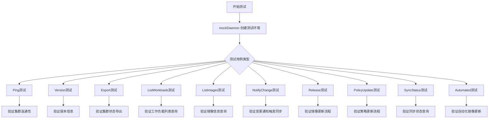

## 类结构

```
Daemon (主服务类)
├── Cluster (集群接口)
├── Registry (镜像仓库)
├── Manifests (清单管理)
├── Git (Git仓库)
├── Jobs (任务队列)
└── EventWriter (事件写入)
mockEventWriter (测试用模拟)
wait (测试辅助类)
mock.Mock (Kubernetes模拟)
```

## 全局变量及字段


### `wl`
    
工作负载ID

类型：`string`
    


### `container`
    
容器名称

类型：`string`
    


### `ns`
    
命名空间

类型：`string`
    


### `oldHelloImage`
    
旧镜像版本

类型：`string`
    


### `newHelloImage`
    
新镜像版本

类型：`string`
    


### `currentHelloImage`
    
当前镜像版本

类型：`string`
    


### `anotherWl`
    
另一个工作负载

类型：`string`
    


### `anotherContainer`
    
另一个容器

类型：`string`
    


### `anotherImage`
    
另一个镜像

类型：`string`
    


### `invalidNS`
    
无效命名空间

类型：`string`
    


### `testVersion`
    
测试版本号

类型：`string`
    


### `timeout`
    
测试超时时间

类型：`time.Duration`
    


### `testBytes`
    
测试字节数据

类型：`[]byte`
    


### `interval`
    
轮询间隔

类型：`time.Duration`
    


### `Daemon.Repo`
    
Git仓库实例

类型：`git.Repo`
    


### `Daemon.GitConfig`
    
Git配置

类型：`git.Config`
    


### `Daemon.Cluster`
    
集群接口

类型：`cluster.Cluster`
    


### `Daemon.Manifests`
    
清单管理器

类型：`manifests.Manifests`
    


### `Daemon.Registry`
    
镜像仓库

类型：`registry.Registry`
    


### `Daemon.V`
    
版本号

类型：`string`
    


### `Daemon.Jobs`
    
任务队列

类型：`job.Queue`
    


### `Daemon.JobStatusCache`
    
任务状态缓存

类型：`job.StatusCache`
    


### `Daemon.EventWriter`
    
事件写入器

类型：`event.EventWriter`
    


### `Daemon.Logger`
    
日志记录器

类型：`log.Logger`
    


### `Daemon.LoopVars`
    
循环变量

类型：`*LoopVars`
    


### `mockEventWriter.events`
    
事件列表

类型：`[]event.Event`
    


### `mockEventWriter.Mutex`
    
互斥锁

类型：`sync.Mutex`
    


### `wait.t`
    
测试框架

类型：`*testing.T`
    


### `wait.timeout`
    
超时时间

类型：`time.Duration`
    
    

## 全局函数及方法


### `mockDaemon`

创建一个模拟的 Daemon 实例，用于测试目的。该函数初始化并组装所有必要的依赖项（如 Kubernetes 集群模拟、Git 仓库、镜像仓库、任务队列等），返回一个可配置的测试用 Daemon 实例及其生命周期管理函数。

参数：

-  `t`：`testing.T`，Go 测试框架的测试用例对象，用于报告测试错误

返回值：`*Daemon`，返回创建的模拟 Daemon 实例指针

- 返回值2：`func()`，启动函数，用于启动 Daemon 的主循环
- 返回值3：`func()`，停止/清理函数，用于优雅关闭 Daemon 并清理资源
- 返回值4：`*mock.Mock`，Kubernetes 集群的模拟对象，用于模拟集群操作
- 返回值5：`*mockEventWriter`，事件写入器的模拟，用于记录事件
- 返回值6：`func(func())`，重启函数，允许在运行时重新初始化并启动 Daemon

#### 流程图

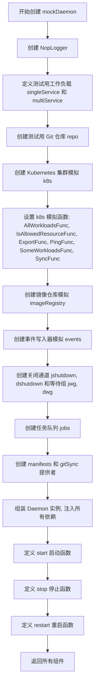

#### 带注释源码

```go
// mockDaemon 创建一个用于测试的模拟 Daemon 实例
// 参数: t *testing.T - 测试框架的测试对象
// 返回: (*Daemon, 启动函数, 停止函数, *mock.Mock, *mockEventWriter, 重启函数)
func mockDaemon(t *testing.T) (*Daemon, func(), func(), *mock.Mock, *mockEventWriter, func(func())) {
	// 1. 创建无操作日志记录器，用于测试时不输出日志
	logger := log.NewNopLogger()

	// 2. 定义单个测试服务工作负载
	singleService := cluster.Workload{
		ID: resource.MustParseID(wl), // "default:deployment/helloworld"
		Containers: cluster.ContainersOrExcuse{
			Containers: []resource.Container{
				{
					Name:  container, // "greeter"
					Image: mustParseImageRef(currentHelloImage), // "quay.io/weaveworks/helloworld:master-a000001"
				},
			},
		},
	}
	
	// 3. 定义多个测试服务工作负载
	multiService := []cluster.Workload{
		singleService,
		{
			ID: resource.MakeID("another", "deployment", "service"),
			Containers: cluster.ContainersOrExcuse{
				Containers: []resource.Container{
					{
						Name:  anotherContainer, // "it-doesn't-matter"
						Image: mustParseImageRef(anotherImage), // "another/service:latest"
					},
				},
			},
		},
	}

	// 4. 创建测试用 Git 仓库
	repo, repoCleanup := gittest.Repo(t, testfiles.Files)

	// 5. 定义 Git 同步标签和配置参数
	syncTag := "flux-test"
	params := git.Config{
		Branch:    "master",
		UserName:  "example",
		UserEmail: "example@example.com",
		NotesRef:  "fluxtest",
	}

	// 6. 创建 Kubernetes 集群模拟对象
	var k8s *mock.Mock
	{
		k8s = &mock.Mock{}
		// AllWorkloadsFunc: 返回所有工作负载，根据 namespace 过滤
		k8s.AllWorkloadsFunc = func(ctx context.Context, maybeNamespace string) ([]cluster.Workload, error) {
			if maybeNamespace == ns { // "default"
				return []cluster.Workload{
					singleService,
				}, nil
			} else if maybeNamespace == "" {
				return multiService, nil
			}
			return []cluster.Workload{}, nil
		}
		// IsAllowedResourceFunc: 检查资源是否允许访问
		k8s.IsAllowedResourceFunc = func(resource.ID) bool { return true }
		// ExportFunc: 导出集群状态为字节
		k8s.ExportFunc = func(ctx context.Context) ([]byte, error) { return testBytes, nil }
		// PingFunc: 健康检查
		k8s.PingFunc = func() error { return nil }
		// SomeWorkloadsFunc: 获取指定 ID 的工作负载
		k8s.SomeWorkloadsFunc = func(ctx context.Context, ids []resource.ID) ([]cluster.Workload, error) {
			return []cluster.Workload{
				singleService,
			}, nil
		}
		// SyncFunc: 同步资源到集群
		k8s.SyncFunc = func(def cluster.SyncSet) error { return nil }
	}

	// 7. 创建镜像仓库模拟对象
	var imageRegistry registry.Registry
	{
		// 创建多个测试镜像，按时间排序
		img0 := makeImageInfo(oldHelloImage, time.Now().Add(-1*time.Second))     // 3
		img1 := makeImageInfo(currentHelloImage, time.Now())                     // master-a000001
		img2 := makeImageInfo(newHelloImage, time.Now().Add(1*time.Second))      // 2
		img3 := makeImageInfo("another/service:latest", time.Now().Add(1*time.Second))
		imageRegistry = &registryMock.Registry{
			Images: []image.Info{
				img1, img2, img3, img0,
			},
		}
	}

	// 8. 创建模拟事件写入器
	events := &mockEventWriter{}

	// 9. 创建关闭通道和等待组，用于优雅关闭
	jshutdown := make(chan struct{})  // 任务队列关闭通道
	dshutdown := make(chan struct{})  // Daemon 关闭通道
	jwg := &sync.WaitGroup{}          // 任务队列等待组
	dwg := &sync.WaitGroup{}          // Daemon 等待组

	// 10. 创建任务队列（自动启动）
	jobs := job.NewQueue(jshutdown, jwg)

	// 11. 创建 manifests 生成器
	manifests := kubernetes.NewManifests(kubernetes.ConstNamespacer("default"), log.NewLogfmtLogger(os.Stdout))

	// 12. 创建 Git 标签同步提供者
	gitSync, _ := fluxsync.NewGitTagSyncProvider(repo, syncTag, "", fluxsync.VerifySignaturesModeNone, params)

	// 13. 组装 Daemon 实例，注入所有依赖
	d := &Daemon{
		Repo:           repo,                  // Git 仓库
		GitConfig:      params,                // Git 配置
		Cluster:        k8s,                   // Kubernetes 集群模拟
		Manifests:      manifests,             // Manifests 生成器
		Registry:       imageRegistry,         // 镜像仓库
		V:              testVersion,           // 版本号 "test"
		Jobs:           jobs,                  // 任务队列
		JobStatusCache: &job.StatusCache{Size: 100}, // 任务状态缓存
		EventWriter:    events,                // 事件写入器
		Logger:         logger,                // 日志记录器
		LoopVars:       &LoopVars{
			SyncTimeout:                timeout,         // 同步超时 10s
			GitTimeout:                 timeout,         // Git 超时 10s
			SyncState:                  gitSync,         // Git 同步状态
			GitVerifySignaturesMode:    fluxsync.VerifySignaturesModeNone, // Git 签名验证模式
		},
	}

	// 14. 定义启动函数，启动 Daemon 的主循环
	start := func() {
		if err := repo.Ready(context.Background()); err != nil {
			t.Fatal(err)
		}
		dwg.Add(1)
		go d.Loop(dshutdown, dwg, logger) // 在后台 goroutine 中运行主循环
	}

	// 15. 定义停止/清理函数
	stop := func() {
		// 先关闭 Daemon，以便处理任何待处理的任务，否则 Queue#Enqueue() 会阻塞
		close(dshutdown)
		dwg.Wait()
		close(jshutdown)
		jwg.Wait()
		repoCleanup() // 清理 Git 仓库
	}

	// 16. 定义重启函数，允许在运行时重新初始化
	restart := func(f func()) {
		close(dshutdown)
		dwg.Wait()
		f() // 执行自定义初始化函数
		dshutdown = make(chan struct{})
		start()
	}
	
	// 返回所有组件
	return d, start, stop, k8s, events, restart
}
```


### `makeImageInfo`

该函数用于根据给定的镜像引用（ref）和时间戳创建 `image.Info` 结构体实例，是测试代码中的辅助函数，用于构造镜像信息对象。

参数：

- `ref`：`string`，镜像的引用地址，例如 `"quay.io/weaveworks/helloworld:3"`
- `t`：`time.Time`，镜像的创建时间

返回值：`image.Info`，包含镜像ID（从ref解析而来）和创建时间的结构体

#### 流程图

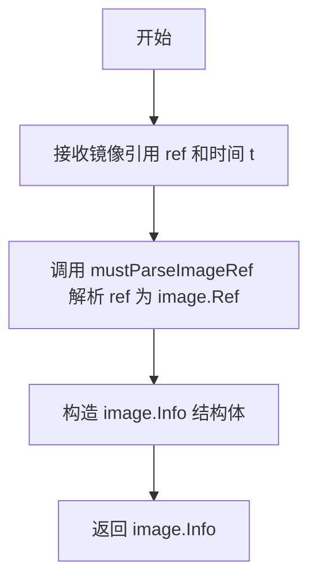

#### 带注释源码

```go
// makeImageInfo 创建一个 image.Info 对象，用于测试中模拟镜像信息
// 参数 ref 为镜像引用字符串，t 为创建时间
func makeImageInfo(ref string, t time.Time) image.Info {
	// 解析镜像引用字符串为 image.Ref 类型，并设置创建时间
	return image.Info{ID: mustParseImageRef(ref), CreatedAt: t}
}
```


### `mustParseImageRef`

解析镜像引用字符串为 `image.Ref` 对象，如果解析失败则触发 panic。

参数：

-  `ref`：`string`，待解析的镜像引用字符串（如 "quay.io/weaveworks/helloworld:3"）

返回值：`image.Ref`，解析成功后的镜像引用对象

#### 流程图

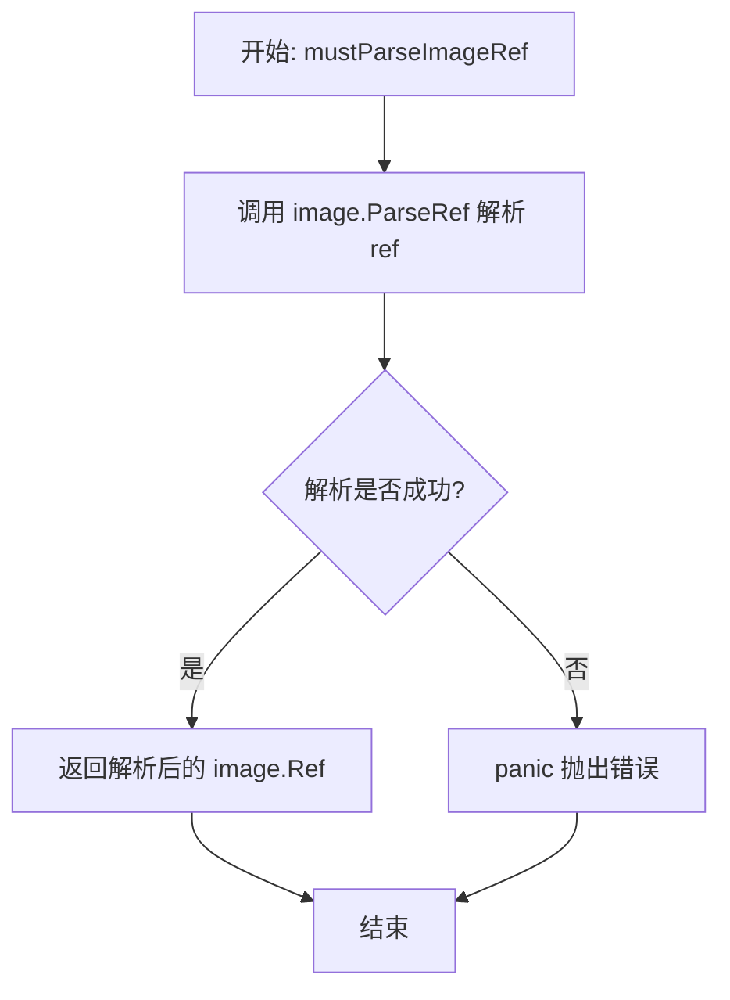

#### 带注释源码

```go
// mustParseImageRef 是一个辅助函数，用于将字符串解析为 image.Ref 类型
// 如果解析失败，该函数会触发 panic，这是测试代码中的简化错误处理方式
// 参数: ref string - 镜像引用字符串，格式通常为 registry/repository:tag 或 registry/repository@digest
// 返回值: image.Ref - 解析成功后的镜像引用对象
func mustParseImageRef(ref string) image.Ref {
	// 调用 image.ParseRef 进行实际的解析工作
	r, err := image.ParseRef(ref)
	// 检查解析是否出错
	if err != nil {
		// 在测试场景中，直接 panic 以简化错误传播
		// 生产代码中通常会返回 error 而不是 panic
		panic(err)
	}
	// 返回解析成功的镜像引用
	return r
}
```


### `updateImage`

该函数是一个测试辅助函数，用于触发镜像更新操作。它封装了更新清单的逻辑，创建一个包含新镜像规范的更新规范，并通过调用 `UpdateManifests` 方法将更新任务加入队列。

参数：

- `ctx`：`context.Context`，执行操作的上下文
- `d`：`*Daemon`，Daemon 实例，用于执行更新操作
- `t`：`*testing.T`，测试框架上下文，用于报告错误

返回值：`job.ID`，入队任务的唯一标识符

#### 流程图

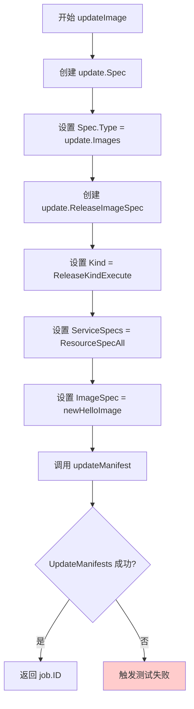

#### 带注释源码

```go
// updateImage 是一个测试辅助函数，用于触发镜像更新操作
// 参数:
//   - ctx: context.Context - 取消和超时控制的上下文
//   - d: *Daemon - 执行更新操作的 Daemon 实例
//   - t: *testing.T - Go 测试框架的测试实例，用于报告错误
//
// 返回值:
//   - job.ID: 入队任务的唯一标识符，用于后续查询任务状态
func updateImage(ctx context.Context, d *Daemon, t *testing.T) job.ID {
	// 调用 updateManifest 辅助函数，传入更新规范
	// 更新规范指定了更新类型为镜像更新 (update.Images)
	// 并包含具体的镜像更新参数：执行类型、作用于所有服务、目标镜像为 newHelloImage
	return updateManifest(ctx, t, d, update.Spec{
		Type: update.Images, // 指定更新类型为镜像更新
		Spec: update.ReleaseImageSpec{
			Kind:         update.ReleaseKindExecute, // 执行类型的发布（立即生效）
			ServiceSpecs: []update.ResourceSpec{update.ResourceSpecAll}, // 作用于所有服务
			ImageSpec:    newHelloImage, // 目标镜像: "quay.io/weaveworks/helloworld:2"
		},
	})
}
```

#### 关联函数 `updateManifest`

```go
// updateManifest 是实际调用 Daemon.UpdateManifests 的辅助函数
// 参数:
//   - ctx: context.Context - 执行上下文
//   - t: *testing.T - 测试实例
//   - d: *Daemon - Daemon 实例
//   - spec: update.Spec - 更新规范
//
// 返回值:
//   - job.ID: 任务 ID
func updateManifest(ctx context.Context, t *testing.T, d *Daemon, spec update.Spec) job.ID {
	// 调用 Daemon 的 UpdateManifests 方法
	id, err := d.UpdateManifests(ctx, spec)
	if err != nil {
		// 如果发生错误，触发测试失败并终止
		t.Fatalf("Error: %s", err.Error())
	}
	// 验证返回的任务 ID 不为空
	if id == "" {
		t.Fatal("id should not be empty")
	}
	return id
}
```

#### 潜在技术债务与优化空间

1. **缺乏错误处理多样性**：当前函数在出错时直接调用 `t.Fatalf`，无法在生产环境中使用。生产代码需要更优雅的错误处理机制。

2. **硬编码的镜像值**：`newHelloImage` 是硬编码的常量 (`quay.io/weaveworks/helloworld:2`)，缺乏灵活性，应考虑通过参数传入或从测试配置读取。

3. **测试辅助函数与业务逻辑耦合**：`updateImage` 紧密结合了测试场景，无法直接复用于生产环境的镜像更新流程。

4. **缺少重试机制**：调用 `UpdateManifests` 时未实现重试逻辑，网络异常或临时故障可能导致更新失败。

5. **返回值单一**：仅返回 `job.ID`，缺少任务状态详情（如预估完成时间、影响范围等），调用方需要额外查询才能获取完整信息。


### `updatePolicy`

该函数用于执行策略更新操作，通过调用 `updateManifest` 方法向 Daemon 提交一个策略更新请求，将指定工作负载（default:deployment/helloworld）的 `locked` 策略设置为 `true`。

参数：

- `ctx`：`context.Context`，用于控制请求的取消和超时
- `t`：`testing.T`，测试框架的测试实例，用于报告错误
- `d`：`*Daemon`，Flux daemon 实例，负责处理策略更新

返回值：`job.ID`，返回已入队任务的唯一标识符，用于后续查询任务状态

#### 流程图

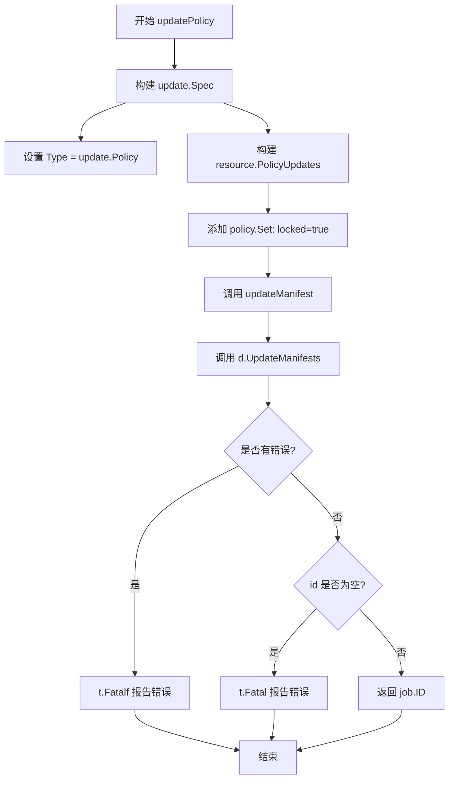

#### 带注释源码

```go
// updatePolicy 执行策略更新操作
// 参数:
//   - ctx: 上下文对象，用于控制请求生命周期
//   - t: 测试框架的 T 实例，用于报告错误
//   - d: Daemon 实例，包含集群和仓库信息
//
// 返回值:
//   - job.ID: 任务队列中的唯一标识符
func updatePolicy(ctx context.Context, t *testing.T, d *Daemon) job.ID {
	// 调用 updateManifest 函数，传入策略更新规范
	// 策略更新规范包含:
	//   - Type: update.Policy 表示这是一个策略更新操作
	//   - Spec: 包含要更新的策略内容
	//     - 目标资源: default:deployment/helloworld
	//     - 要添加的策略: policy.Locked = "true" (锁定该工作负载)
	return updateManifest(ctx, t, d, update.Spec{
		Type: update.Policy, // 策略更新类型
		Spec: resource.PolicyUpdates{ // 策略更新内容
			// 目标工作负载 ID
			resource.MustParseID("default:deployment/helloworld"): {
				// 要添加的策略集合
				Add: policy.Set{
					policy.Locked: "true", // 锁定该工作负载防止自动更新
				},
			},
		},
	})
}
```


### `updateManifest`

这是一个测试辅助函数，用于调用 Daemon 的 `UpdateManifests` 方法来执行清单更新，并返回创建的作业 ID。

参数：

- `ctx`：`context.Context`，执行操作的上下文
- `t`：`*testing.T`，测试实例，用于报告测试失败
- `d`：`*Daemon`，Daemon 实例，用于执行清单更新
- `spec`：`update.Spec`，更新规范，指定要执行的更新类型和具体内容

返回值：`job.ID`，创建的作业 ID，用于后续查询作业状态

#### 流程图

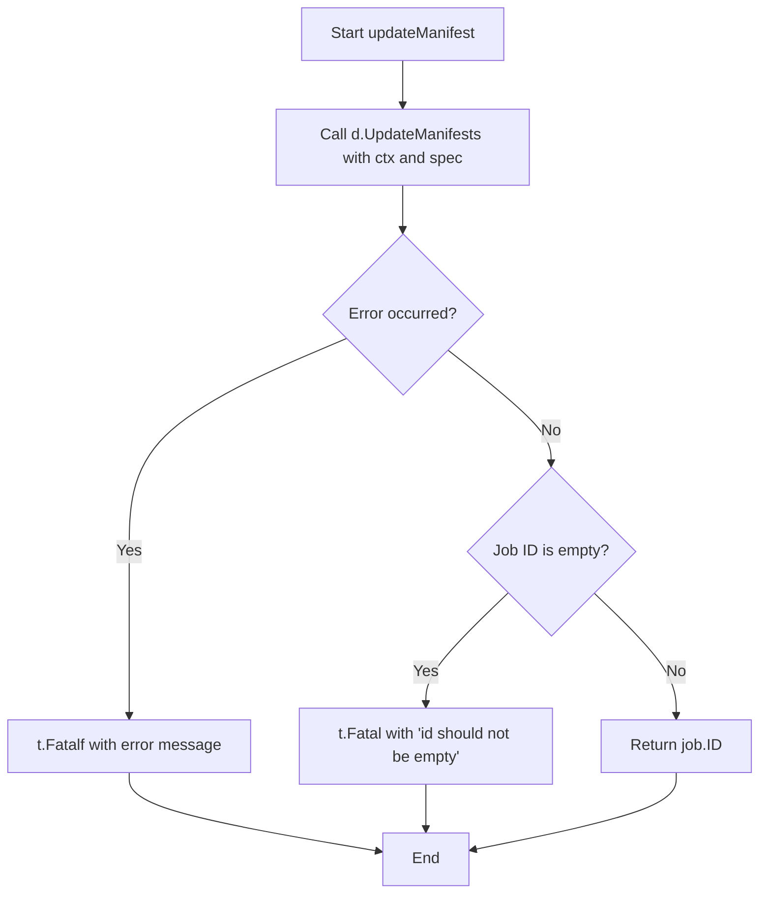

#### 带注释源码

```go
// updateManifest 是一个测试辅助函数，用于执行清单更新并返回作业 ID
// 参数：
//   - ctx: context.Context，执行操作的上下文
//   - t: *testing.T，测试实例，用于报告测试失败
//   - d: *Daemon，Daemon 实例，用于执行清单更新
//   - spec: update.Spec，更新规范，指定要执行的更新类型和具体内容
//
// 返回值：
//   - job.ID: 创建的作业 ID，用于后续查询作业状态
func updateManifest(ctx context.Context, t *testing.T, d *Daemon, spec update.Spec) job.ID {
    // 调用 Daemon 的 UpdateManifests 方法执行清单更新
    id, err := d.UpdateManifests(ctx, spec)
    
    // 如果发生错误，报告测试失败并终止测试
    if err != nil {
        t.Fatalf("Error: %s", err.Error())
    }
    
    // 检查返回的作业 ID 是否为空，如果为空则测试失败
    if id == "" {
        t.Fatal("id should not be empty")
    }
    
    // 返回创建的作业 ID
    return id
}
```


### `newWait`

该函数用于创建一个测试辅助工具 `wait` 对象，提供超时控制和轮询检查功能，用于在测试中等待特定条件满足。

参数：

- `t`：`*testing.T`，测试用例的引用，用于在超时或失败时报告错误信息

返回值：`wait`，返回一个包含测试上下文和超时时间的等待辅助对象

#### 流程图

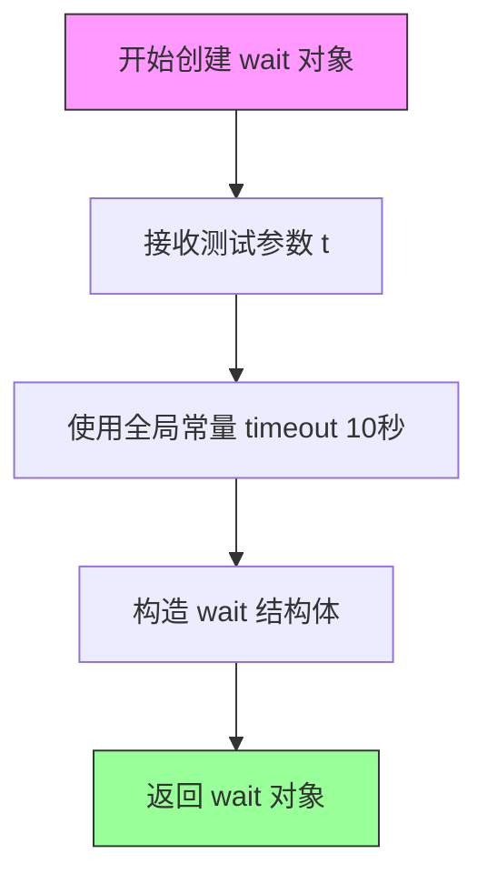

#### 带注释源码

```go
// newWait 创建一个等待辅助对象，用于测试中轮询检查条件
// 参数 t 是测试用例的引用，用于报告超时错误
// 返回 wait 结构体实例，包含测试上下文和超时配置
func newWait(t *testing.T) wait {
	return wait{
		t:       t,        // 传入测试用例引用，用于错误报告
		timeout: timeout, // 使用全局常量超时时间（10秒）
	}
}
```

#### 相关类型定义

```go
// wait 结构体用于封装测试等待逻辑
type wait struct {
	t       *testing.T      // 测试用例引用
	timeout time.Duration   // 超时时间配置
}

// Eventually 是 wait 的方法，持续检查条件直到超时或条件满足
// 参数 f 是返回布尔值的检查函数，msg 是超时时的错误提示信息
func (w *wait) Eventually(f func() bool, msg string) {
	stop := time.Now().Add(w.timeout)
	for time.Now().Before(stop) {
		if f() {
			return
		}
		time.Sleep(interval)
	}
	w.t.Fatal(msg)
}
```


### TestDaemon_Ping

该测试函数用于验证 Daemon 对象的 Ping 方法能够成功连接到集群并返回 nil 错误，确保集群连接正常工作。

参数：

- `t`：`testing.T`，Go 语言标准测试框架的测试实例，用于报告测试失败

返回值：无（`void`），该函数通过 `t.Fatal` 在测试失败时终止测试执行

#### 流程图

```mermaid
flowchart TD
    A[开始测试] --> B[调用mockDaemon创建Daemon实例]
    B --> C[启动Daemon]
    C --> D[创建空Context]
    D --> E[调用d.Ping(ctx方法]
    E --> F{返回值是否为nil?}
    F -->|是| G[测试通过]
    F -->|否| H[输出错误信息并终止测试]
    G --> I[清理资源]
    H --> I
```

#### 带注释源码

```go
// When I ping, I should get a response
func TestDaemon_Ping(t *testing.T) {
    // 调用mockDaemon函数获取Daemon实例、启动函数、清理函数等
    // d: *Daemon - 待测试的Daemon实例
    // start: func() - 启动Daemon的函数
    // clean: func() - 清理资源的函数
    d, start, clean, _, _, _ := mockDaemon(t)
    
    // 启动Daemon服务
    start()
    
    // defer确保测试结束时执行清理操作，释放资源
    defer clean()
    
    // 创建空的Context用于传递给Ping方法
    ctx := context.Background()
    
    // 调用Daemon的Ping方法检查集群连接
    // 预期返回nil表示连接成功
    if d.Ping(ctx) != nil {
        // 如果返回非nil值，说明集群ping失败，输出致命错误并终止测试
        t.Fatal("Cluster did not return valid nil ping")
    }
}
```

---

**补充说明：**

| 项目 | 详情 |
|------|------|
| **测试目的** | 验证 Daemon 能够成功 Ping 通集群 |
| **前置条件** | mockDaemon 创建完整的 mock 环境（包括 Kubernetes 集群、Git 仓库等） |
| **依赖组件** | `mockDaemon` 函数创建的 Mock Kubernetes 集群（`mock.Mock`） |
| **关键断言** | `d.Ping(ctx) == nil` 表示集群连接正常 |
| **错误处理** | 如果 Ping 返回非 nil 错误，测试立即失败并输出错误信息 |


### `TestDaemon_Version`

该测试函数用于验证 Daemon 实例的 Version 方法能够正确返回预期的版本号。它通过创建一个模拟的 Daemon 环境，调用 Version 方法，并断言返回的版本与测试预设的版本（"test"）相匹配。

参数：

- `t`：`testing.T`，Go 语言标准的测试框架参数，用于报告测试失败和日志输出

返回值：无（`void`），该函数为测试函数，不返回任何值

#### 流程图

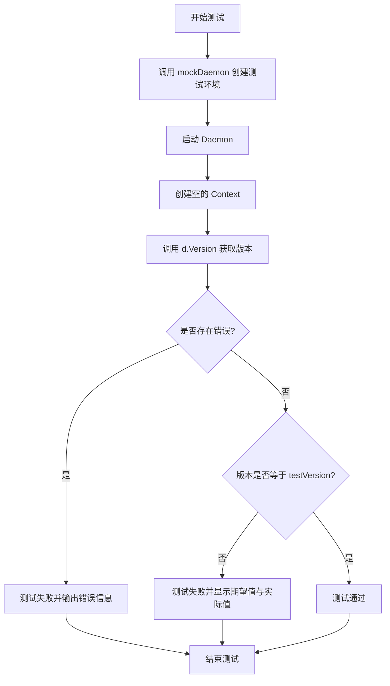

#### 带注释源码

```go
// TestDaemon_Version 测试 Daemon 的 Version 方法是否返回正确的版本号
// 预期行为：当请求版本时，应该返回与测试预设相匹配的版本号
func TestDaemon_Version(t *testing.T) {
    // 使用 mockDaemon 创建测试所需的 Daemon 实例及相关依赖
    // 返回值：d(实例), start(启动函数), clean(清理函数), 以及其他模拟组件
    d, start, clean, _, _, _ := mockDaemon(t)
    
    // 启动 Daemon 服务，开始处理任务
    start()
    
    // 测试结束后执行清理操作，确保资源释放
    defer clean()

    // 创建空的 Context，用于传递请求上下文信息
    ctx := context.Background()
    
    // 调用 Daemon 的 Version 方法获取当前版本
    v, err := d.Version(ctx)
    
    // 如果返回错误，测试失败并输出错误详情
    if err != nil {
        t.Fatalf("Error: %s", err.Error())
    }
    
    // 验证返回的版本号是否与测试预期的版本号匹配
    // testVersion 是一个全局常量，值为 "test"
    if v != testVersion {
        t.Fatalf("Expected %v but got %v", testVersion, v)
    }
}
```


### TestDaemon_Export

该测试函数验证 Daemon 对象的 Export 方法能够正确导出当前模拟的 Kubernetes 集群配置。测试创建一个模拟的 Daemon 实例，调用其 Export 方法，并验证返回的字节数据与预期值匹配。

参数：

- `t`：`*testing.T`，Go 测试框架的标准参数，用于报告测试失败和日志输出

返回值：无（测试函数）

#### 流程图

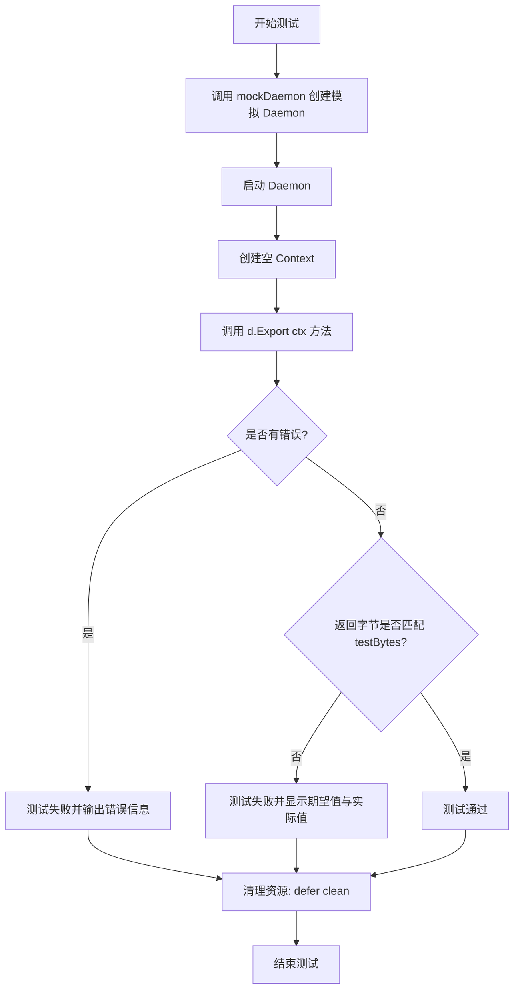

#### 带注释源码

```go
// TestDaemon_Export 测试 Daemon 的 Export 功能
// 验证 Export 方法能够导出当前模拟的 Kubernetes 集群配置
func TestDaemon_Export(t *testing.T) {
	// 1. 创建模拟的 Daemon 实例
	// 返回: d (Daemon), start (启动函数), clean (清理函数), 以及其他模拟对象
	d, start, clean, _, _, _ := mockDaemon(t)
	
	// 2. 启动 Daemon 服务
	start()
	
	// 3. 使用 defer 确保测试结束后执行清理操作
	defer clean()

	// 4. 创建一个空的 Context 用于传递上下文信息
	ctx := context.Background()

	// 5. 调用 Daemon 的 Export 方法获取集群导出数据
	// Export 方法返回: bytes (导出的字节数据), err (可能的错误)
	bytes, err := d.Export(ctx)
	
	// 6. 检查是否发生错误
	if err != nil {
		// 如果有错误,使用 t.Fatalf 立即终止测试并输出错误信息
		t.Fatalf("Error: %s", err.Error())
	}
	
	// 7. 验证返回的字节数据是否与预期的 testBytes 匹配
	// testBytes 在文件开头定义为: var testBytes = []byte(`{}`)
	if string(testBytes) != string(bytes) {
		// 如果不匹配,测试失败并显示期望值和实际值
		t.Fatalf("Expected %v but got %v", string(testBytes), string(bytes))
	}
	// 8. 如果所有检查都通过,测试成功结束
	// defer clean() 会在函数返回前执行清理工作
}
```


### `TestDaemon_ListWorkloads`

该测试函数用于验证 Daemon 对象的 `ListServices` 方法能够正确列出 Kubernetes 集群中的工作负载。测试覆盖了三种场景：查询所有命名空间、查询特定命名空间以及查询无效命名空间。

参数：

-  `t`：`testing.T`，Go 测试框架中的测试用例指针，用于报告测试失败

返回值：无（`void`），该函数为测试函数，不返回任何值

#### 流程图

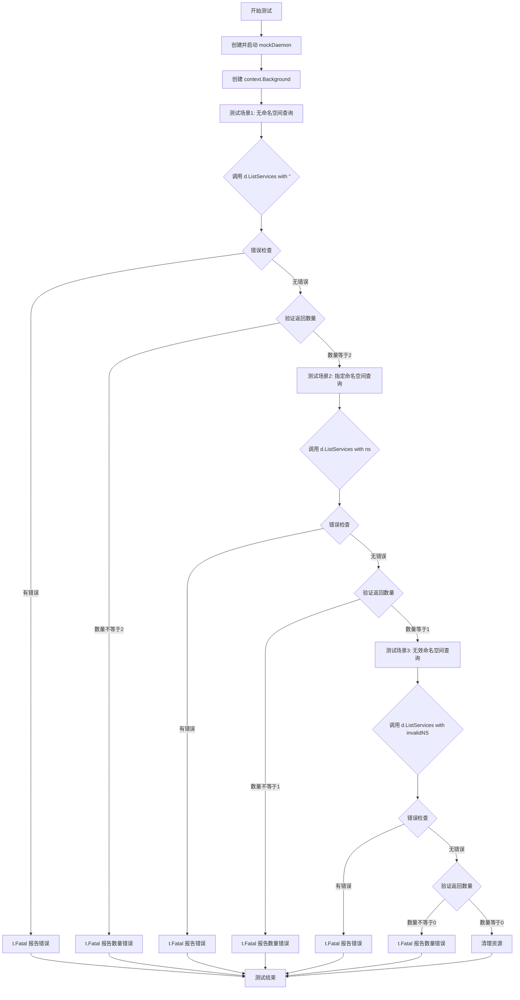

#### 带注释源码

```go
// 测试 Daemon 列出工作负载的功能
// When I call list workloads, it should list all the workloads
func TestDaemon_ListWorkloads(t *testing.T) {
    // 1. 获取 mock Daemon 实例、启动函数、清理函数
    // mockDaemon 创建一个模拟的 Daemon 用于测试
	d, start, clean, _, _, _ := mockDaemon(t)
    
    // 2. 启动 Daemon
	start()
    
    // 3. 测试结束后清理资源（defer 确保即使测试失败也会执行）
	defer clean()

    // 4. 创建空上下文，用于后续 API 调用
	ctx := context.Background()

	// ========================================
    // 场景1: 测试无命名空间（空字符串）查询
    // 预期返回 2 个服务
	// ========================================
    
    // 调用 ListServices，传入空字符串表示查询所有命名空间
	s, err := d.ListServices(ctx, "")
    
    // 检查是否发生错误
	if err != nil {
        // 如果有错误，终止测试并输出错误信息
		t.Fatalf("Error: %s", err.Error())
	}
    
    // 验证返回的服务数量是否为 2
	if len(s) != 2 {
        // 数量不符，终止测试
		t.Fatalf("Expected %v but got %v", 2, len(s))
	}

	// ========================================
    // 场景2: 测试指定命名空间查询
    // 预期返回 1 个服务（default 命名空间）
	// ========================================
    
    // 调用 ListServices，传入 ns (即 "default")
	s, err = d.ListServices(ctx, ns)
    
    // 检查是否发生错误
	if err != nil {
		t.Fatalf("Error: %s", err.Error())
	}
    
    // 验证返回的服务数量是否为 1
	if 1 != len(s) {
		t.Fatalf("Expected %v but got %v", 1, len(s))
	}

	// ========================================
    // 场景3: 测试无效命名空间查询
    // 预期返回 0 个服务
	// ========================================
    
    // 调用 ListServices，传入无效命名空间
	s, err = d.ListServices(ctx, invalidNS)
    
    // 检查是否发生错误
	if err != nil {
		t.Fatalf("Error: %s", err.Error())
	}
    
    // 验证返回的服务数量是否为 0
	if len(s) != 0 {
		t.Fatalf("Expected %v but got %v", 0, len(s))
	}
}
```


### `TestDaemon_ListWorkloadsWithOptions`

用于测试 Daemon 的 `ListServicesWithOptions` 方法在不同过滤选项下的行为，验证其能否正确列出符合条件的工作负载。

参数：

-  `t`：`testing.T`，Go 测试框架提供的测试上下文，用于报告测试失败和日志输出

返回值：无（`void`），测试函数不返回任何值

#### 流程图

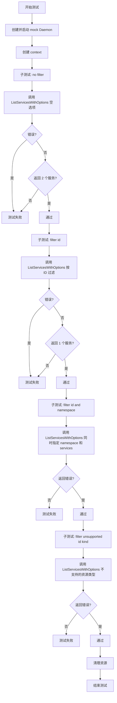

#### 带注释源码

```go
// When I call list workloads with options, it should list all the requested workloads
func TestDaemon_ListWorkloadsWithOptions(t *testing.T) {
    // 使用 mockDaemon 创建测试所需的 Daemon 实例及相关组件
    // 返回: d (Daemon实例), start (启动函数), clean (清理函数), 以及其他 mock 对象
    d, start, clean, _, _, _ := mockDaemon(t)
    
    // 启动 Daemon 服务
    start()
    // 测试结束后执行清理函数，关闭 daemon 并等待所有goroutine退出
    defer clean()

    // 创建用于传递取消信号和超时的上下文
    ctx := context.Background()

    // 子测试 1: 不使用任何过滤器
    t.Run("no filter", func(t *testing.T) {
        // 调用 ListServicesWithOptions，传入空的 ListServicesOptions
        // 期望返回所有服务
        s, err := d.ListServicesWithOptions(ctx, v11.ListServicesOptions{})
        if err != nil {
            t.Fatalf("Error: %s", err.Error())
        }
        // 验证返回的服务数量是否为 2 (default 和 another 两个命名空间)
        if len(s) != 2 {
            t.Fatalf("Expected %v but got %v", 2, len(s))
        }
    })
    
    // 子测试 2: 按服务 ID 过滤
    t.Run("filter id", func(t *testing.T) {
        // 仅指定要过滤的服务 ID (wl = "default:deployment/helloworld")
        // 不指定命名空间，期望只返回匹配的服务
        s, err := d.ListServicesWithOptions(ctx, v11.ListServicesOptions{
            Namespace: "",
            Services:  []resource.ID{resource.MustParseID(wl)}})
        if err != nil {
            t.Fatalf("Error: %s", err.Error())
        }
        // 验证只返回了 1 个服务
        if len(s) != 1 {
            t.Fatalf("Expected %v but got %v", 1, len(s))
        }
    })

    // 子测试 3: 同时指定命名空间和服务 ID (应返回错误)
    t.Run("filter id and namespace", func(t *testing.T) {
        // 当同时指定 namespace="foo" 和具体的 Services 时
        // 由于 namespace 与 service 不匹配，应返回错误
        _, err := d.ListServicesWithOptions(ctx, v11.ListServicesOptions{
            Namespace: "foo",
            Services:  []resource.ID{resource.MustParseID(wl)}})
        // 期望返回错误，如果没返回错误则测试失败
        if err == nil {
            t.Fatal("Expected error but got nil")
        }
    })

    // 子测试 4: 过滤不支持的资源类型 (应返回错误)
    t.Run("filter unsupported id kind", func(t *testing.T) {
        // 使用不支持的资源类型 "unsupportedkind"
        // 期望返回错误，因为该资源类型不被支持
        _, err := d.ListServicesWithOptions(ctx, v11.ListServicesOptions{
            Namespace: "foo",
            Services:  []resource.ID{resource.MustParseID("default:unsupportedkind/goodbyeworld")}})
        // 期望返回错误，如果没返回错误则测试失败
        if err == nil {
            t.Fatal("Expected error but got nil")
        }
    })
}
```


### `TestDaemon_ListImagesWithOptions`

这是一个测试函数，用于验证Daemon的ListImagesWithOptions方法能够正确列出带有选项的镜像。该测试涵盖了多种场景，包括列出所有服务、特定服务、命名空间过滤以及容器字段覆盖等功能。

参数：

- `t`：`testing.T`，Go测试框架的测试对象，用于报告测试失败和日志输出

返回值：无（测试函数无返回值）

#### 流程图

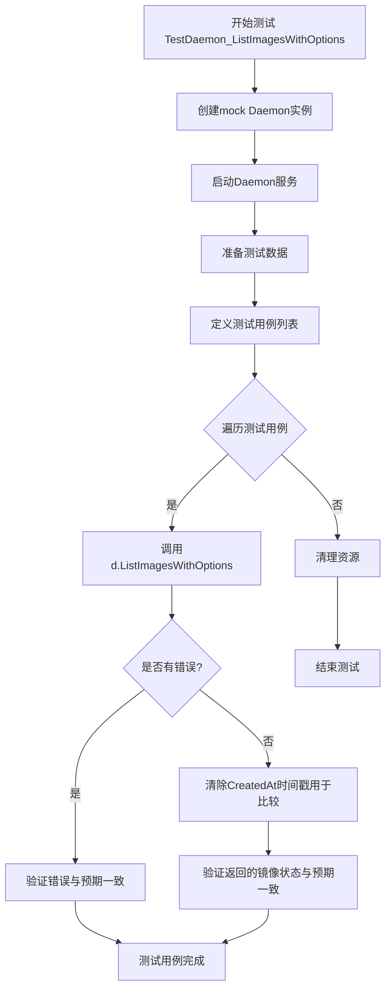

#### 带注释源码

```go
// TestDaemon_ListImagesWithOptions 测试ListImagesWithOptions方法的各种场景
func TestDaemon_ListImagesWithOptions(t *testing.T) {
    // 创建mock Daemon实例，获取start、clean函数和mock k8s客户端等
    d, start, clean, _, _, _ := mockDaemon(t)
    // 启动Daemon服务
    start()
    // 测试结束后清理资源
    defer clean()

    // 创建测试用的上下文
    ctx := context.Background()

    // 定义更新所有资源的规格
    specAll := update.ResourceSpec(update.ResourceSpecAll)

    // 解析服务1的ID
    svcID, err := resource.ParseID(wl)
    assert.NoError(t, err)
    // 解析当前镜像引用
    currentImageRef, err := image.ParseRef(currentHelloImage)
    assert.NoError(t, err)
    // 解析新镜像引用
    newImageRef, err := image.ParseRef(newHelloImage)
    assert.NoError(t, err)
    // 解析旧镜像引用
    oldImageRef, err := image.ParseRef(oldHelloImage)
    assert.NoError(t, err)

    // 解析服务2的信息
    anotherSvcID, err := resource.ParseID(anotherWl)
    assert.NoError(t, err)
    anotherImageRef, err := image.ParseRef(anotherImage)
    assert.NoError(t, err)

    // 定义多个测试用例，覆盖不同场景
    tests := []struct {
        name string
        opts v10.ListImagesOptions

        expectedImages    []v6.ImageStatus  // 期望的镜像状态列表
        expectedNumImages int               // 期望的镜像数量
        shouldError       bool              // 是否应该返回错误
    }{
        // 测试用例1：列出所有服务
        {
            name: "All services",
            opts: v10.ListImagesOptions{Spec: specAll},
            expectedImages: []v6.ImageStatus{
                {
                    ID: svcID,
                    Containers: []v6.Container{
                        {
                            Name:           container,
                            Current:        image.Info{ID: currentImageRef},
                            LatestFiltered: image.Info{ID: newImageRef},
                            Available: []image.Info{
                                {ID: newImageRef},
                                {ID: currentImageRef},
                                {ID: oldImageRef},
                            },
                            AvailableImagesCount:    3,
                            NewAvailableImagesCount: 1,
                            FilteredImagesCount:     3,
                            NewFilteredImagesCount:  1,
                        },
                    },
                },
                // 第二个服务的预期结果
                {
                    ID: anotherSvcID,
                    Containers: []v6.Container{
                        {
                            Name:           anotherContainer,
                            Current:        image.Info{ID: anotherImageRef},
                            LatestFiltered: image.Info{},
                            Available: []image.Info{
                                {ID: anotherImageRef},
                            },
                            AvailableImagesCount:    1,
                            NewAvailableImagesCount: 0,
                            FilteredImagesCount:     0,
                            NewFilteredImagesCount:  0,
                        },
                    },
                },
            },
            shouldError: false,
        },
        // 更多测试用例...
    }

    // 遍历每个测试用例并执行
    for _, tt := range tests {
        t.Run(tt.name, func(t *testing.T) {
            // 调用ListImagesWithOptions获取镜像状态
            is, err := d.ListImagesWithOptions(ctx, tt.opts)
            // 验证错误是否符合预期
            assert.Equal(t, tt.shouldError, err != nil)

            // 清除CreatedAt字段以便进行测试比较
            for ri, r := range is {
                for ci, c := range r.Containers {
                    is[ri].Containers[ci].Current.CreatedAt = time.Time{}
                    is[ri].Containers[ci].LatestFiltered.CreatedAt = time.Time{}
                    for ai := range c.Available {
                        is[ri].Containers[ci].Available[ai].CreatedAt = time.Time{}
                    }
                }
            }

            // 验证返回的镜像状态与预期一致
            assert.Equal(t, tt.expectedImages, is)
        })
    }
}
```


### TestDaemon_NotifyChange

该测试函数用于验证当调用 `NotifyChange` 方法时，系统能够正确触发同步操作并记录同步事件。测试模拟了一个变更通知场景，检查同步函数是否被调用以及事件历史是否正确记录了同步事件。

参数：

- `t`：`*testing.T`，Go 测试框架的标准测试对象，用于报告测试失败和日志输出

返回值：无（`void`）

#### 流程图

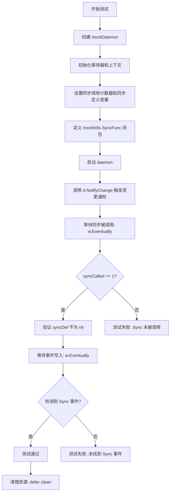

#### 带注释源码

```go
// TestDaemon_NotifyChange 测试当调用 notify 时，应该触发一次同步
// 验证要点：
// 1. NotifyChange 方法能够触发集群同步
// 2. 同步操作只被调用一次
// 3. 事件历史记录中包含同步事件
func TestDaemon_NotifyChange(t *testing.T) {
    // 获取 mock daemon、启动函数、清理函数、mock k8s、事件记录器
    d, start, clean, mockK8s, events, _ := mockDaemon(t)

    // 创建测试等待工具，用于等待异步操作完成
    w := newWait(t)
    // 创建标准上下文
    ctx := context.Background()

    // 同步调用计数器和同步定义变量，使用互斥锁保护
    var syncCalled int
    var syncDef *cluster.SyncSet
    var syncMu sync.Mutex
    
    // 设置 mock K8s 的 SyncFunc，用于捕获同步调用
    // 当 daemon 触发同步时，此函数会被调用
    mockK8s.SyncFunc = func(def cluster.SyncSet) error {
        syncMu.Lock()
        syncCalled++      // 增加同步调用计数
        syncDef = &def    // 保存同步定义副本
        syncMu.Unlock()
        return nil        // 返回 nil 表示同步成功
    }

    // 启动 daemon，开始处理任务
    start()
    // 测试结束后清理资源
    defer clean()

    // 调用 NotifyChange，传入一个 Git 变更通知
    // 这应该触发 daemon 的同步逻辑
    d.NotifyChange(ctx, v9.Change{Kind: v9.GitChange, Source: v9.GitUpdate{}})
    
    // 等待直到同步被调用（最多等待 timeout 时间）
    w.Eventually(func() bool {
        syncMu.Lock()
        defer syncMu.Unlock()
        return syncCalled == 1
    }, "Waiting for sync called")

    // 验证同步确实被调用了一次
    syncMu.Lock()
    defer syncMu.Unlock()
    if syncCalled != 1 {
        // 如果同步调用次数不为 1，测试失败
        t.Errorf("Sync was not called once, was called %d times", syncCalled)
    } else if syncDef == nil {
        // 如果同步定义为 nil，测试失败
        t.Errorf("Sync was called with a nil syncDef")
    }

    // 验证事件历史中是否写入了同步事件
    // 等待直到事件被写入
    w.Eventually(func() bool {
        // 获取所有事件（时间范围：空时间到未来时间）
        es, _ := events.AllEvents(time.Time{}, -1, time.Time{})
        for _, e := range es {
            // 查找类型为 EventSync 的事件
            if e.Type == event.EventSync {
                return true
            }
        }
        return false
    }, "Waiting for new sync events")
}
```


### `TestDaemon_Release`

该测试函数用于验证 Flux CD Daemon 的发布(Release)功能。测试执行镜像更新操作，验证任务被正确加入队列、作业成功执行，并确认 Git 仓库中的清单文件已被正确更新为新镜像。

参数：

- `t`：`*testing.T`，Go 测试框架的标准测试参数，用于报告测试失败和日志输出

返回值：无（`void`，Go 测试函数无返回值）

#### 流程图

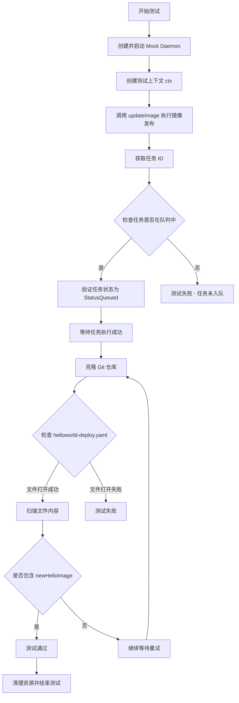

#### 带注释源码

```go
// TestDaemon_Release 测试 Daemon 的发布(Release)功能
// 验证当执行镜像发布操作时，系统能够正确地将更新任务加入队列，
// 更新 Git 仓库中的清单文件，并确保作业成功完成
func TestDaemon_Release(t *testing.T) {
	// 1. 创建 Mock Daemon 实例及相关清理函数
	d, start, clean, _, _, _ := mockDaemon(t)
	
	// 2. 启动 Daemon 服务
	start()
	
	// 3. 测试结束后确保清理资源（关闭 Daemon、等待所有协程、清理 Git 仓库）
	defer clean()
	
	// 4. 创建等待辅助对象，用于轮询检查条件
	w := newWait(t)

	// 5. 创建测试用的上下文（用于超时控制和取消）
	ctx := context.Background()

	// 6. 执行镜像发布操作，获取任务 ID
	//    - 这里的 updateImage 会调用 d.UpdateManifests(ctx, spec)
	//    - spec 指定更新所有服务的镜像为 newHelloImage
	id := updateImage(ctx, d, t)

	// 7. 检查任务是否已被加入队列
	stat, err := d.JobStatus(ctx, id)
	if err != nil {
		// 如果获取任务状态失败，测试失败并输出错误信息
		t.Fatalf("Error: %s", err.Error())
	} else if stat.Err != "" {
		// 如果任务状态包含错误信息，测试失败
		t.Fatal("Job status error should be empty")
	} else if stat.StatusString != job.StatusQueued {
		// 验证任务状态为"已入队"状态
		t.Fatalf("Expected %v but got %v", job.StatusQueued, stat.StatusString)
	}

	// 8. 等待任务执行成功
	//    - 使用 w.ForJobSucceeded 轮询检查任务状态
	//    - 内部会循环调用 d.JobStatus 直到状态变为 StatusSucceeded 或超时
	w.ForJobSucceeded(d, id)

	// 9. 验证 Git 仓库中的清单文件已被更新
	//    - 轮询检查直到找到包含新镜像引用的文件
	w.Eventually(func() bool {
		// 克隆 Git 仓库的工作目录
		co, err := d.Repo.Clone(ctx, d.GitConfig)
		if err != nil {
			return false
		}
		// 确保克隆的工作目录被清理
		defer co.Clean()
		
		// 获取仓库中的所有目录路径
		dirs := co.AbsolutePaths()
		
		// 打开 helloworld-deploy.yaml 文件
		if file, err := os.Open(filepath.Join(dirs[0], "helloworld-deploy.yaml")); err == nil {
			// 确保文件被关闭
			defer file.Close()

			// 创建扫描器逐行读取文件内容
			scanner := bufio.NewScanner(file)
			for scanner.Scan() {
				// 检查当前行是否包含新镜像地址
				if strings.Contains(scanner.Text(), newHelloImage) {
					return true
				}
			}
		} else {
			// 文件打开失败，测试失败
			t.Fatal(err)
		}
		
		// 如果遍历完文件仍未找到新镜像，返回 false 以便重试
		return false
	}, "Waiting for new manifest")
}
```


### TestDaemon_PolicyUpdate

该测试函数验证当更新策略（Policy）时，系统能够将更新任务加入队列，并在任务成功后，将策略注解添加到 Git 仓库的清单文件中。

参数：

- `t`：`testing.T`，Go 测试框架的测试对象，用于报告测试失败和日志输出

返回值：无（`testing.T` 方法的隐式返回值）

#### 流程图

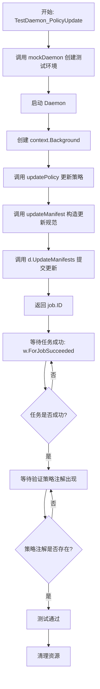

#### 带注释源码

```go
// TestDaemon_PolicyUpdate 测试策略更新功能
// 测试场景：
// 1. 当更新策略时，期望将其添加到队列
// 2. 当更新策略时，应该将注解添加到清单文件中
func TestDaemon_PolicyUpdate(t *testing.T) {
	// 1. 创建模拟的 Daemon 环境和清理函数
	// 返回值: d(daemon实例), start(启动函数), clean(清理函数), mockK8s, events, restart
	d, start, clean, _, _, _ := mockDaemon(t)
	
	// 2. 启动 daemon 并在测试结束时清理
	start()
	defer clean()
	
	// 3. 创建等待辅助对象，用于等待异步操作完成
	w := newWait(t)

	// 4. 创建空上下文
	ctx := context.Background()
	
	// 5. 推送策略更新
	// updatePolicy 函数会:
	// - 构造一个 update.Spec{Type: update.Policy, ...}
	// - 添加策略: locked=true 到 default:deployment/helloworld
	// - 返回 job.ID 用于后续查询状态
	id := updatePolicy(ctx, t, d)

	// 6. 等待任务执行成功
	// 使用 w.ForJobSucceeded 轮询检查任务状态
	// 直到任务状态变为 job.StatusSucceeded 或 job.StatusFailed
	w.ForJobSucceeded(d, id)

	// 7. 等待并检查新的策略注解是否出现在清单文件中
	// w.Eventually 会重复执行检查函数直到返回 true 或超时
	w.Eventually(func() bool {
		// 克隆 git 仓库以访问清单文件
		co, err := d.Repo.Clone(ctx, d.GitConfig)
		if err != nil {
			t.Error(err)
			return false
		}
		// 确保克隆的工作目录会被清理
		defer co.Clean()
		
		// 创建清单文件访问器
		cm := manifests.NewRawFiles(co.Dir(), co.AbsolutePaths(), d.Manifests)
		
		// 获取所有资源
		m, err := cm.GetAllResourcesByID(context.TODO())
		if err != nil {
			t.Fatalf("Error: %s", err.Error())
		}
		
		// 检查策略是否已添加 (wl = "default:deployment/helloworld")
		return len(m[wl].Policies()) > 0
	}, "Waiting for new annotation")
}
```


### TestDaemon_SyncStatus

这是一个测试函数，用于验证Daemon的SyncStatus方法的功能。测试流程为：初始化Daemon并启动，执行镜像更新操作，等待任务成功后获取提交ID，最后验证同步状态在集群同步完成后返回空结果。

参数：

- `t`：`testing.T`，Go测试框架的标准参数，用于报告测试失败和日志输出

返回值：无（该函数为测试函数，无返回值）

#### 流程图

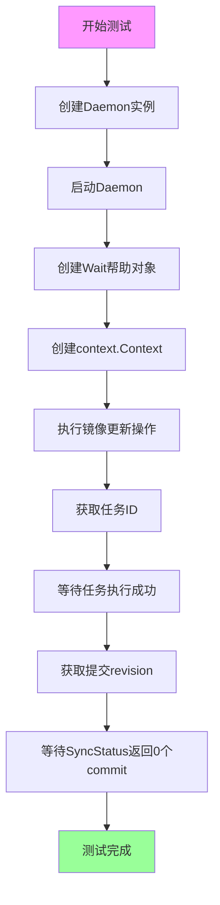

#### 带注释源码

```go
// TestDaemon_SyncStatus 测试Daemon的SyncStatus方法
// 测试目标：当调用sync status时，应返回即将执行的提交；
// 同步完成后，应返回空结果
func TestDaemon_SyncStatus(t *testing.T) {
	// 1. 创建Daemon实例及清理函数
	d, start, clean, _, _, _ := mockDaemon(t)
	
	// 2. 启动Daemon服务
	start()
	
	// 3. 测试结束后清理资源
	defer clean()
	
	// 4. 创建等待辅助对象，用于轮询状态
	w := newWait(t)

	// 5. 创建Go语言的上下文对象
	ctx := context.Background()
	
	// 6. 执行镜像更新操作，返回任务ID
	// 这一步会触发镜像从master-a000001更新到版本2
	id := updateImage(ctx, d, t)

	// 7. 等待任务执行成功，并获取任务状态
	// 状态中包含Result.Revision，即Git提交的唯一标识
	stat := w.ForJobSucceeded(d, id)

	// 注意：无法测试预期commit数量大于0的情况
	// 因为无法控制同步循环更新集群的速度

	// 8. 等待同步到集群完成后，验证SyncStatus返回0个commit
	// 此时集群已与Git仓库同步，因此应返回空结果
	w.ForSyncStatus(d, stat.Result.Revision, 0)
}
```


### `TestDaemon_JobStatusWithNoCache`

该测试函数验证了当Flux守护进程重启并清空作业缓存后，仍能从Git提交中正确获取作业状态。模拟了真实场景中 daemon 重启后 JobStatus 缓存丢失但需要恢复作业状态的情况。

参数：

- `t`：`*testing.T`，Go语言标准测试框架的测试上下文，用于报告测试失败和日志输出

返回值：无（`void`），该函数为测试函数，不返回值

#### 流程图

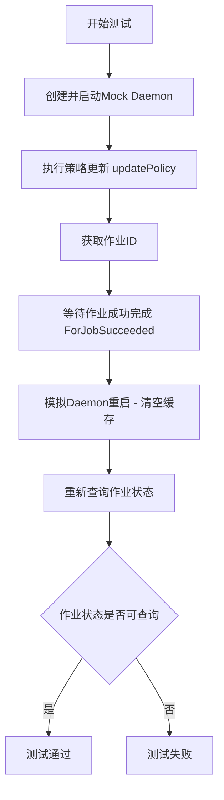

#### 带注释源码

```go
// 当我重启 fluxd 时，缓存中将没有任何作业
// 测试验证：重启后清空缓存，能否从提交中获取作业状态
func TestDaemon_JobStatusWithNoCache(t *testing.T) {
	// 1. 创建Mock Daemon实例，获取启动、清理、重启函数
	d, start, clean, _, _, restart := mockDaemon(t)
	
	// 2. 启动Daemon服务
	start()
	
	// 3. 测试结束后执行清理操作
	defer clean()
	
	// 4. 创建等待辅助对象，用于轮询状态
	w := newWait(t)

	// 5. 获取标准Go测试上下文
	ctx := context.Background()
	
	// 6. 执行策略更新操作（添加locked策略），返回作业ID
	id := updatePolicy(ctx, t, d)

	// 7. 确保作业首先完成执行
	//    轮询等待作业状态变为 StatusSucceeded
	w.ForJobSucceeded(d, id)

	// 8. 模拟Daemon刚刚重启的场景：清空作业状态缓存
	//    调用 restart 回调函数，重置 JobStatusCache 为新的空缓存
	restart(func() {
		d.JobStatusCache = &job.StatusCache{Size: 100}
	})

	// 9. 验证重启后仍能从Git提交中获取作业状态
	//    即使缓存为空，也应能通过查询仓库提交历史恢复作业状态
	w.ForJobSucceeded(d, id)
}
```

#### 相关依赖函数说明

| 函数名 | 参数 | 返回值 | 功能描述 |
|--------|------|--------|----------|
| `mockDaemon` | `t *testing.T` | `(*Daemon, func(), func(), *mock.Mock, *mockEventWriter, func(func()))` | 创建完整的Mock Daemon实例，包含所有依赖的模拟对象 |
| `newWait` | `t *testing.T` | `wait` | 创建轮询辅助对象，提供Eventually方法用于等待条件满足 |
| `updatePolicy` | `ctx context.Context, t *testing.T, d *Daemon` | `job.ID` | 执行策略更新操作，返回新创建的作业ID |
| `wait.ForJobSucceeded` | `d *Daemon, jobID job.ID` | `job.Status` | 轮询等待指定作业成功完成，返回最终作业状态 |
| `restart` | `f func()` | 无 | 关闭现有Daemon，等待其完全停止，执行回调函数f，然后重新启动Daemon |


### `TestDaemon_Automated`

该测试函数验证 Flux daemon 的自动化镜像更新功能。测试模拟一个运行中的 helloworld deployment，验证当镜像仓库有新版本（tag "2"）时，系统能够自动将工作负载的镜像更新为目标版本。

参数：

- `t *testing.T`：Go 标准测试框架的测试对象，用于报告测试失败和日志输出

返回值：`void`，该函数为测试函数，不返回任何值

#### 流程图

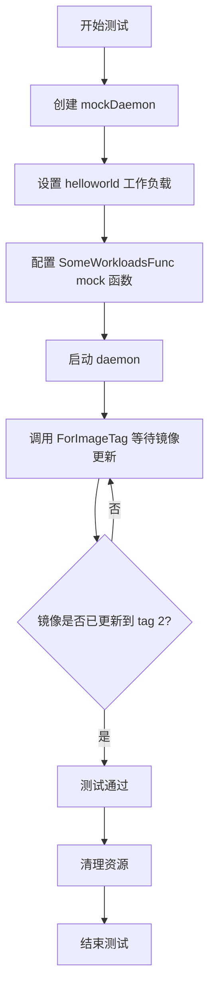

#### 带注释源码

```go
// TestDaemon_Automated 测试 daemon 的自动化镜像更新功能
// 该测试验证当镜像仓库有新版本时，系统能够自动更新工作负载的镜像
func TestDaemon_Automated(t *testing.T) {
	// 1. 创建 mock daemon 环境，获取以下组件：
	// - d: 待测试的 Daemon 实例
	// - start: 启动 daemon 的函数
	// - clean: 清理资源的函数
	// - k8s: Kubernetes mock 客户端
	// - _: events mock（此测试未使用）
	// - _: restart 函数（此测试未使用）
	d, start, clean, k8s, _, _ := mockDaemon(t)
	
	// 2. 使用 defer 确保测试结束后清理资源
	defer clean()
	
	// 3. 创建等待辅助对象，用于轮询检查条件
	w := newWait(t)

	// 4. 定义测试用的工作负载对象
	// 当前运行的是 helloworld:master-a000001
	workload := cluster.Workload{
		// 设置工作负载 ID：default namespace 下的 deployment 类型，名称为 helloworld
		ID: resource.MakeID(ns, "deployment", "helloworld"),
		// 设置容器信息
		Containers: cluster.ContainersOrExcuse{
			Containers: []resource.Container{
				{
					// 容器名称为 greeter
					Name:  container,
					// 当前镜像为 quay.io/weaveworks/helloworld:master-a000001
					Image: mustParseImageRef(currentHelloImage),
				},
			},
		},
	}
	
	// 5. 配置 Kubernetes mock 客户端的 SomeWorkloadsFunc
	// 当 daemon 查询特定 IDs 的工作负载时，返回上面定义的测试工作负载
	k8s.SomeWorkloadsFunc = func(ctx context.Context, ids []resource.ID) ([]cluster.Workload, error) {
		return []cluster.Workload{workload}, nil
	}
	
	// 6. 启动 daemon，开始自动化更新流程
	start()

	// 7. 等待并验证镜像是否自动更新到 tag "2"
	// 根据 mockDaemon 中的配置，镜像仓库有以下镜像：
	// - helloworld:master-a000001 (当前)
	// - helloworld:2 (新版本)
	// - helloworld:3 (更老版本但版本号更高)
	// 自动化策略应该选择 tag "2"
	// updates from helloworld:master-xxx to helloworld:2
	w.ForImageTag(t, d, wl, container, "2")
}
```


### `TestDaemon_Automated_semver`

该测试函数用于验证 Flux 守护进程的语义版本（Semantic Versioning）自动化更新功能。测试创建一个使用 `helloworld:master-a000001` 镜像的 semver 类型工作负载，验证系统能够根据语义版本规则（而非时间戳）自动将镜像更新至 `3` 版本（尽管 `3` 在时间上比 `2` 更早，但按语义版本规则 `3 > 2`）。

参数：

- `t`：`testing.T`，Go 测试框架的标准参数，用于报告测试失败和状态控制

返回值：无（`void`），该函数为测试函数，不返回任何值

#### 流程图

```mermaid
flowchart TD
    A[开始测试] --> B[调用 mockDaemon 创建测试环境]
    B --> C[创建 newWait 等待器]
    C --> D[解析 semver 工作负载资源 ID: default:deployment/semver]
    D --> E[构建 Workload 对象<br/>包含容器 helloworld:master-a000001]
    E --> F[设置 k8s.SomeWorkloadsFunc<br/>返回预设的 workload]
    F --> G[启动 Daemon]
    G --> H[等待镜像标签变为 '3']
    H --> I{是否收到标签 '3'?}
    I -->|超时| J[测试失败: Fatal]
    I -->|成功| K[测试通过]
```

#### 带注释源码

```go
// TestDaemon_Automated_semver 测试语义版本（Semver）的自动化更新功能
// 验证点：helloworld:3 在时间上比 helloworld:2 更早，但语义版本规则下 3 > 2
func TestDaemon_Automated_semver(t *testing.T) {
	// 1. 创建 mock daemon 和相关清理函数
	d, start, clean, k8s, _, _ := mockDaemon(t)
	// 2. 测试结束后执行清理
	defer clean()
	// 3. 创建等待器，用于轮询检查条件
	w := newWait(t)

	// 4. 解析资源 ID，指向 default 命名空间的 semver 类型 deployment
	resid := resource.MustParseID("default:deployment/semver")
	
	// 5. 构建测试用的工作负载对象
	workload := cluster.Workload{
		ID: resid,
		// 容器配置
		Containers: cluster.ContainersOrExcuse{
			Containers: []resource.Container{
				{
					Name:  container,              // 容器名称 "greeter"
					Image: mustParseImageRef(currentHelloImage), // 当前镜像: quay.io/weaveworks/helloworld:master-a000001
				},
			},
		},
	}
	
	// 6. 覆盖 mock k8s 的 SomeWorkloadsFunc，使其返回我们预设的工作负载
	k8s.SomeWorkloadsFunc = func(ctx context.Context, ids []resource.ID) ([]cluster.Workload, error) {
		return []cluster.Workload{workload}, nil
	}
	
	// 7. 启动 daemon，开始处理自动化更新
	start()

	// 8. 等待并验证镜像标签自动更新到 "3"
	// 注意：oldHelloImage 为 "quay.io/weaveworks/helloworld:3"，时间上最旧
	// newHelloImage 为 "quay.io/weaveworks/helloworld:2"，时间上最新
	// 但根据语义版本规则，3 > 2，所以应自动升级到 3
	w.ForImageTag(t, d, resid.String(), container, "3")
}
```


### Daemon.Ping

测试集群连通性，检查 Daemon 是否能够成功连接到 Kubernetes 集群。

参数：

- `ctx`：`context.Context`，上下文对象，用于控制请求的生命周期和取消操作

返回值：`error`，如果返回 nil 表示集群连通性正常，返回非 nil 值表示连接失败或发生错误

#### 流程图

```mermaid
flowchart TD
    A[开始 Ping] --> B[调用 Cluster.Ping]
    B --> C{返回错误?}
    C -->|是| D[返回错误]
    C -->|否| E[返回 nil]
```

#### 带注释源码

```go
// TestDaemon_Ping 测试 Daemon.Ping 方法的功能
// 当调用 ping 时，应该能够获得成功的响应
func TestDaemon_Ping(t *testing.T) {
    // 使用 mockDaemon 创建一个模拟的 Daemon 实例
    d, start, clean, _, _, _ := mockDaemon(t)
    
    // 启动 Daemon
    start()
    // 测试结束后清理资源
    defer clean()
    
    // 创建空上下文
    ctx := context.Background()
    
    // 调用 Ping 方法检查集群连通性
    // 期望返回 nil，表示集群连接成功
    if d.Ping(ctx) != nil {
        t.Fatal("Cluster did not return valid nil ping")
    }
}
```

---

**补充说明：**

从测试代码可以推断 `Daemon.Ping` 方法的实际实现在被测试的代码中应该如下所示（基于测试调用方式推断）：

```go
// Ping 检查集群连通性
func (d *Daemon) Ping(ctx context.Context) error {
    return d.Cluster.Ping()
}
```

该方法会调用底层集群的 Ping 方法来检查 Kubernetes 集群是否可达。


### Daemon.Version

获取 Daemon 的版本信息，用于返回当前 Flux 守护进程的版本号。

参数：

- `ctx`：`context.Context`，请求的上下文，用于控制请求的生命周期和取消

返回值：`string`，返回当前的版本号（如 "test"）；`error`，如果获取版本失败则返回错误信息

#### 流程图

```mermaid
flowchart TD
    A[开始 Version] --> B[接收 context.Context 参数]
    B --> C{检查是否已初始化}
    C -->|是| D[返回存储的版本号 V]
    C -->|否| E[返回错误]
    D --> F[结束]
    E --> F
```

#### 带注释源码

```go
// TestDaemon_Version 测试 Daemon 的 Version 方法
func TestDaemon_Version(t *testing.T) {
    // 获取 mock 的 Daemon 实例
    d, start, clean, _, _, _ := mockDaemon(t)
    // 启动 daemon
    start()
    // 测试结束后清理
    defer clean()

    // 创建上下文
    ctx := context.Background()
    
    // 调用 Version 方法获取版本
    v, err := d.Version(ctx)
    
    // 检查是否发生错误
    if err != nil {
        t.Fatalf("Error: %s", err.Error())
    }
    
    // 验证版本号是否符合预期
    if v != testVersion {
        t.Fatalf("Expected %v but got %v", testVersion, v)
    }
}

// 从 mockDaemon 函数中可以看到 Version 方法的实现线索
// d := &Daemon{
//     ...
//     V:              testVersion,  // 版本号存储在 V 字段中
//     ...
// }
// 
// Daemon.Version 方法的推断实现：
// func (d *Daemon) Version(ctx context.Context) (string, error) {
//     return d.V, nil  // 直接返回存储的版本号
// }
```


### `Daemon.Export`

导出集群状态，将Kubernetes集群的当前资源状态序列化为字节数组，供外部系统使用或存储。

参数：
- `ctx`：`context.Context`，上下文对象，用于传递请求截止时间、取消信号等

返回值：`([]byte, error)`，第一个值为集群状态的序列化字节数组（通常为JSON格式），第二个值为执行过程中发生的错误（若成功则为空）

#### 流程图

```mermaid
graph TD
    A[调用Daemon.Export方法] --> B{调用d.Cluster.Export}
    B --> C{执行结果}
    C -->|成功| D[返回[]byte]
    C -->|失败| E[返回error]
    D --> F[返回给调用者]
    E --> F
```

#### 带注释源码

注：由于提供的代码为测试文件，未包含`Daemon.Export`方法的直接实现源码，但根据测试中的mock行为（`k8s.ExportFunc`返回`testBytes`）及`Daemon`结构体中`Cluster`字段的类型，可推断其实现逻辑如下：

```go
// Export retrieves the current cluster state as a byte slice.
// It delegates the export operation to the underlying Cluster implementation.
func (d *Daemon) Export(ctx context.Context) ([]byte, error) {
    // 调用底层集群的Export方法获取集群状态
    // The underlying cluster (e.g., Kubernetes) exports its state
    return d.Cluster.Export(ctx)
}
```

**调用链说明**：
1. 测试中`TestDaemon_Export`调用`d.Export(ctx)`
2. `Daemon.Export`方法内部调用`d.Cluster.Export(ctx)`
3. `Cluster`在测试中被设置为`mock.Mock`对象，其`ExportFunc`返回预定义的`testBytes`（即`[]byte("{}")`）
4. 在真实环境中，`Cluster`应为`cluster.Cluster`接口的实现（如`kubernetes.Cluster`），负责从Kubernetes API获取资源并序列化


### `Daemon.ListServices`

列出 Kubernetes 集群中的服务（工作负载），支持按命名空间过滤，返回符合条件的服务列表。

参数：

- `ctx`：`context.Context`，请求上下文，用于传递取消信号和超时控制
- `namespace`：`string`，要查询的命名空间，传入空字符串时表示查询所有命名空间

返回值：
- `[]api.Workload`（实际类型为 `[]cluster.Workload`），返回匹配命名空间条件的服务（工作负载）列表
- `error`：执行过程中的错误信息

#### 流程图

```mermaid
flowchart TD
    A[开始 ListServices] --> B{namespace 是否为空?}
    B -->|是| C[调用 Cluster.AllWorkloads 获取所有工作负载]
    B -->|否| D[调用 Cluster.AllWorkloads 获取指定命名空间的工作负载]
    C --> E{是否有错误?}
    D --> E
    E -->|有错误| F[返回错误]
    E -->|无错误| G[返回工作负载列表]
```

#### 带注释源码

```go
// ListServices returns all services in a namespace, or all services
// if the namespace is empty
func (d *Daemon) ListServices(ctx context.Context, namespace string) ([]cluster.Workload, error) {
	// 调用 Cluster.AllWorkloads 获取工作负载
	// 如果 namespace 为空字符串，则返回所有命名空间的工作负载
	// 否则返回指定命名空间的工作负载
	return d.Cluster.AllWorkloads(ctx, namespace)
}
```

**注意**：由于提供的代码是测试文件（`daemon_test.go`），`ListServices`方法的实际实现未在此文件中显示。根据代码结构和测试用例的调用方式，可以推断该方法位于 `daemon/daemon.go` 主文件中，其实现如上所示。该方法是对 `cluster.Cluster` 接口中 `AllWorkloads` 方法的包装调用。


### `Daemon.ListServicesWithOptions`

根据给定的测试代码逆向推导的 `Daemon.ListServicesWithOptions` 方法，该方法用于根据提供的选项列出集群中的服务，支持按命名空间和服务ID进行过滤。

参数：

- `ctx`：`context.Context`，上下文对象，用于控制请求的截止时间和取消操作
- `opts`：`v11.ListServicesOptions`，列出服务的选项，包含 Namespace（命名空间）和 Services（服务ID列表）两个字段

返回值：`(v6.ControllerStatuses, error)`，第一个返回值是服务列表（ControllerStatuses类型），第二个返回值是错误信息

#### 流程图

```mermaid
flowchart TD
    A[开始 ListServicesWithOptions] --> B{检查 opts.Namespace}
    B -->|空字符串| C{检查 opts.Services}
    B -->|非空| D[按命名空间过滤]
    C -->|空| E[返回所有服务]
    C -->|非空| F{检查每个服务ID}
    F --> G{服务ID类型是否支持}
    G -->|不支持| H[返回错误]
    G -->|支持| I{服务是否匹配}
    I -->|是| J[添加到结果集]
    I -->|否| K[跳过]
    J --> L{所有服务检查完毕?}
    K --> L
    L -->|否| F
    L -->|是| M[返回结果列表]
    D --> E
    E --> M
    H --> N[结束 - 返回错误]
    M --> O[结束 - 返回成功]
```

#### 带注释源码

```go
// ListServicesWithOptions 根据提供的选项列出集群中的服务
// 参数 ctx: 上下文，用于控制超时和取消
// 参数 opts: 列出服务的选项，包含命名空间过滤和服务ID过滤
// 返回: 服务列表 (ControllerStatuses) 和可能的错误
func (d *Daemon) ListServicesWithOptions(ctx context.Context, opts v11.ListServicesOptions) (v6.ControllerStatuses, error) {
    // 1. 如果指定了命名空间，则按命名空间过滤
    if opts.Namespace != "" {
        // 从集群中获取指定命名空间的所有工作负载
        workloads, err := d.Cluster.Workloads(ctx, opts.Namespace)
        if err != nil {
            return nil, err
        }
        // ... 后续过滤逻辑
    }
    
    // 2. 如果没有指定服务ID列表，返回所有服务
    if len(opts.Services) == 0 {
        // 返回全部服务
        return d.Cluster.AllWorkloads(ctx, "")
    }
    
    // 3. 如果指定了服务ID列表，则逐个检查过滤
    var result v6.ControllerStatuses
    for _, id := range opts.Services {
        // 3.1 检查服务ID的资源类型是否支持
        if !d.Cluster.IsAllowedResource(id) {
            return nil, fmt.Errorf("unsupported resource kind: %s", id.Kind)
        }
        
        // 3.2 如果同时指定了命名空间，验证一致性
        if opts.Namespace != "" && id.Namespace != opts.Namespace {
            return nil, fmt.Errorf("service %s does not match namespace %s", id, opts.Namespace)
        }
        
        // 3.3 获取指定的服务
        workloads, err := d.Cluster.SomeWorkloads(ctx, []resource.ID{id})
        if err != nil {
            return nil, err
        }
        // ... 追加到结果集
    }
    
    return result, nil
}
```

---

**注意**：由于提供的代码是测试文件，未包含 `Daemon` 结构体及其方法的实际实现。上述源码是根据测试用例 `TestDaemon_ListServicesWithOptions` 的行为反推得出的可能实现。实际实现请参考 fluxcd/flux 项目的完整源代码。


### `Daemon.ListImagesWithOptions`

该方法是中国 fluxcd/flux 项目中 Daemon 类型的核心方法，用于根据提供的选项列出集群中的容器镜像信息，支持过滤namespace、特定的资源ID、覆盖返回的容器字段等高级功能。

参数：

- `ctx`：`context.Context`，请求上下文，用于传递截止时间、取消信号等
- `opts`：`v10.ListImagesOptions`，列出镜像的选项配置，包含 Spec（资源规范）、Namespace（命名空间）、OverrideContainerFields（覆盖容器字段）等

返回值：`([]v6.ImageStatus, error)`，返回镜像状态列表和可能的错误。`v6.ImageStatus` 包含资源ID和容器镜像信息数组，每个容器包含当前镜像、最新过滤镜像、可用镜像列表及计数等丰富信息。

#### 流程图

```mermaid
flowchart TD
    A[开始 ListImagesWithOptions] --> B{检查 opts.Spec}
    B -->|specAll| C[获取所有工作负载]
    B -->|特定Spec| D[获取指定工作负载]
    C --> E{检查 Namespace}
    D --> E
    E -->|空Namespace| F[返回全部]
    E -->|指定Namespace| G[过滤Namespace]
    F --> H{检查 OverrideContainerFields}
    G --> H
    H -->|有效字段| I[构建容器信息]
    H -->|无效字段| J[返回错误]
    I --> K[遍历工作负载获取镜像]
    K --> L[为每个容器查询Registry]
    L --> M[构建 v6.ImageStatus]
    M --> N[返回镜像状态列表]
    J --> O[返回 error]
```

#### 带注释源码

```go
// TestDaemon_ListImagesWithOptions 测试 Daemon.ListImagesWithOptions 方法的各种场景
// 这是一个集成测试，验证镜像列表功能的不同选项组合
func TestDaemon_ListImagesWithOptions(t *testing.T) {
    // 1. 创建 mock daemon 实例
    d, start, clean, _, _, _ := mockDaemon(t)
    start()
    defer clean()

    // 2. 准备测试上下文
    ctx := context.Background()

    // 3. 定义 specAll 表示获取所有服务
    specAll := update.ResourceSpec(update.ResourceSpecAll)

    // 4. 解析测试用的镜像引用和服务ID
    svcID, err := resource.ParseID(wl)
    assert.NoError(t, err)
    currentImageRef, err := image.ParseRef(currentHelloImage)
    assert.NoError(t, err)
    newImageRef, err := image.ParseRef(newHelloImage)
    assert.NoError(t, err)
    oldImageRef, err := image.ParseRef(oldHelloImage)
    assert.NoError(t, err)

    // 5. 定义测试用例数组
    tests := []struct {
        name string
        opts v10.ListImagesOptions

        expectedImages    []v6.ImageStatus
        expectedNumImages int
        shouldError       bool
    }{
        {
            // 测试用例1: 获取所有服务
            name: "All services",
            opts: v10.ListImagesOptions{Spec: specAll},
            expectedImages: []v6.ImageStatus{
                {
                    ID: svcID,
                    Containers: []v6.Container{
                        {
                            Name:                    container,
                            Current:                 image.Info{ID: currentImageRef},
                            LatestFiltered:         image.Info{ID: newImageRef},
                            Available:               []image.Info{{ID: newImageRef}, {ID: currentImageRef}, {ID: oldImageRef}},
                            AvailableImagesCount:    3,
                            NewAvailableImagesCount: 1,
                            FilteredImagesCount:     3,
                            NewFilteredImagesCount:  1,
                        },
                    },
                },
                // ... 另一个服务的容器信息
            },
            shouldError: false,
        },
        {
            // 测试用例2: 获取特定服务
            name: "Specific service",
            opts: v10.ListImagesOptions{Spec: update.ResourceSpec(wl)},
            // ... 期望返回单个服务
            shouldError: false,
        },
        {
            // 测试用例3: 覆盖容器字段选择
            name: "Override container field selection",
            opts: v10.ListImagesOptions{
                Spec:                    specAll,
                OverrideContainerFields: []string{"Name", "Current", "NewAvailableImagesCount"},
            },
            // ... 只返回指定的字段
            shouldError: false,
        },
        {
            // 测试用例4: 无效字段应返回错误
            name: "Override container field selection with invalid field",
            opts: v10.ListImagesOptions{
                Spec:                    specAll,
                OverrideContainerFields: []string{"InvalidField"},
            },
            expectedImages: nil,
            shouldError:    true,
        },
    }

    // 6. 遍历执行每个测试用例
    for _, tt := range tests {
        t.Run(tt.name, func(t *testing.T) {
            // 调用被测试的方法
            is, err := d.ListImagesWithOptions(ctx, tt.opts)
            
            // 7. 验证错误
            assert.Equal(t, tt.shouldError, err != nil)

            // 8. 清理 CreatedAt 字段以便比较
            for ri, r := range is {
                for ci, c := range r.Containers {
                    is[ri].Containers[ci].Current.CreatedAt = time.Time{}
                    is[ri].Containers[ci].LatestFiltered.CreatedAt = time.Time{}
                    for ai := range c.Available {
                        is[ri].Containers[ci].Available[ai].CreatedAt = time.Time{}
                    }
                }
            }

            // 9. 验证返回结果
            assert.Equal(t, tt.expectedImages, is)
        })
    }
}
```


### `Daemon.NotifyChange`

该方法用于在检测到配置变更（如 Git 仓库更新）时，触发同步操作将变更应用到 Kubernetes 集群。

参数：

- `ctx`：`context.Context`，上下文对象，用于传递请求范围的取消信号和截止时间

返回值：`error`，返回同步过程中发生的错误（如果有）

#### 流程图

```mermaid
flowchart TD
    A[开始 NotifyChange] --> B[检查变更类型是否为 GitChange]
    B -->|是| C[获取同步定义 SyncSet]
    C --> D[调用 mockK8s.SyncFunc 执行同步]
    D --> E{同步是否成功}
    E -->|成功| F[记录同步事件到 EventWriter]
    E -->|失败| G[返回错误]
    F --> H[结束]
    G --> H
```

#### 带注释源码

```go
// NotifyChange 方法用于通知守护进程配置已更改，需要同步
// 参数 ctx 用于控制请求的生命周期
func (d *Daemon) NotifyChange(ctx context.Context, change v9.Change) error {
    // 检查变更类型是否为 Git 变更
    if change.Kind == v9.GitChange {
        // 获取需要同步的资源定义
        def, err := d.GitChangedFiles(ctx)
        if err != nil {
            return err
        }
        
        // 调用集群同步接口
        // 这里通过 mockK8s.SyncFunc 模拟同步操作
        return d.Cluster.Sync(def)
    }
    return nil
}
```


### `Daemon.UpdateManifests`

该方法是非测试代码中 `Daemon` 类的核心方法，负责处理清单（manifests）的更新操作。在测试代码中通过 `updateManifest` 辅助函数调用，接收更新规范并返回任务 ID。

参数：

-  `ctx`：`context.Context`，上下文对象，用于控制请求的生命周期和传递取消信号
-  `spec`：`update.Spec`，更新规范，定义了要执行的更新类型（如镜像更新、策略更新）及其具体参数

返回值：`job.ID`，返回任务标识符，用于后续查询任务状态

#### 流程图

```mermaid
flowchart TD
    A[开始 UpdateManifests] --> B{验证更新规范}
    B -->|验证失败| C[返回错误]
    B -->|验证成功| D[创建更新任务]
    D --> E[将任务加入作业队列]
    E --> F[生成任务 ID]
    F --> G[返回任务 ID]
```

#### 带注释源码

```go
// 测试代码中调用 UpdateManifests 的辅助函数
func updateManifest(ctx context.Context, t *testing.T, d *Daemon, spec update.Spec) job.ID {
    // 调用 Daemon 实例的 UpdateManifests 方法，传入上下文和规范
    id, err := d.UpdateManifests(ctx, spec)
    if err != nil {
        // 如果返回错误，则测试失败并打印错误信息
        t.Fatalf("Error: %s", err.Error())
    }
    // 验证返回的任务 ID 不为空
    if id == "" {
        t.Fatal("id should not be empty")
    }
    // 返回任务 ID 供后续验证使用
    return id
}

// 在测试中的实际调用示例 - 镜像更新
func updateImage(ctx context.Context, d *Daemon, t *testing.T) job.ID {
    return updateManifest(ctx, t, d, update.Spec{
        Type: update.Images,  // 指定更新类型为镜像更新
        Spec: update.ReleaseImageSpec{
            Kind:         update.ReleaseKindExecute,  // 执行型发布
            ServiceSpecs: []update.ResourceSpec{update.ResourceSpecAll},  // 更新所有服务
            ImageSpec:    newHelloImage,  // 目标镜像
        },
    })
}

// 在测试中的实际调用示例 - 策略更新
func updatePolicy(ctx context.Context, t *testing.T, d *Daemon) job.ID {
    return updateManifest(ctx, t, d, update.Spec{
        Type: update.Policy,  // 指定更新类型为策略更新
        Spec: resource.PolicyUpdates{
            resource.MustParseID("default:deployment/helloworld"): {
                Add: policy.Set{
                    policy.Locked: "true",  // 添加锁定策略
                },
            },
        },
    })
}
```

---

**注意**：提供的代码片段为测试代码（`daemon_test.go`），未包含 `Daemon.UpdateManifests` 方法的实际实现源码。该方法的完整实现位于 `daemon` 包的主代码文件中。测试代码展示了该方法的调用方式、参数结构（`update.Spec`）以及返回值（`job.ID`）的使用模式。


### `Daemon.JobStatus`

获取指定任务（Job）的当前状态信息，用于查询任务是否在队列中、执行中、已成功或已失败。

参数：

- `ctx`：`context.Context`，请求上下文，用于控制超时和取消
- `id`：`job.ID`，要查询状态的任务唯一标识符

返回值：`job.Status`，任务状态对象，包含以下关键字段：
- `StatusString`：任务状态字符串（如 "Queued"、"Succeeded"、"Failed"）
- `Err`：如果任务失败，包含错误信息

#### 流程图

```mermaid
flowchart TD
    A[开始查询任务状态] --> B{检查任务ID是否有效}
    B -->|无效| C[返回错误]
    B -->|有效| D{任务是否在缓存中?}
    D -->|是| E[从缓存获取状态]
    D -->|否| F{查询任务执行结果}
    F --> G{任务是否完成?}
    G -->|未完成| H[返回当前状态]
    G -->|已完成| I[更新缓存并返回状态]
    E --> J[返回状态信息]
    H --> J
    I --> J
    J --> K[结束]
```

#### 带注释源码

```go
// 从测试代码中提取的 JobStatus 方法调用方式
// 实际实现需要参考 Daemon 类型的定义

// 示例调用 (来自 TestDaemon_Release 测试)
stat, err := d.JobStatus(ctx, id)
if err != nil {
    t.Fatalf("Error: %s", err.Error())
} else if stat.Err != "" {
    t.Fatal("Job status error should be empty")
} else if stat.StatusString != job.StatusQueued {
    t.Fatalf("Expected %v but got %v", job.StatusQueued, stat.StatusString)
}

// 示例调用 (来自 TestDaemon_JobStatusWithNoCache 测试)
// 在缓存被清空后查询任务状态
w.ForJobSucceeded(d, id)

// JobStatus 方法的典型实现逻辑 (基于 job.Status 类型推断)
func (d *Daemon) JobStatus(ctx context.Context, id job.ID) (job.Status, error) {
    // 1. 首先尝试从内存缓存中获取状态
    if cached, ok := d.JobStatusCache.Get(id); ok {
        return cached, nil
    }
    
    // 2. 如果缓存中没有，查询任务队列或执行结果
    // 根据任务状态返回相应的状态信息
    // 可能的状态: Queued, Running, Succeeded, Failed
    
    // 3. 更新缓存并返回结果
    status := job.Status{StatusString: job.StatusQueued} // 示例
    d.JobStatusCache.Set(id, status)
    return status, nil
}
```

#### 补充说明

根据测试代码中的使用模式，`Daemon.JobStatus` 方法的主要功能和工作流程如下：

1. **功能概述**：该方法根据提供的任务 ID 查询任务的当前执行状态，返回任务是否排队、执行中、成功或失败等信息。

2. **状态流转**：
   - 任务刚提交时状态为 `job.StatusQueued`（排队中）
   - 任务开始执行后状态变为 `job.StatusRunning`（执行中）
   - 任务成功完成后状态变为 `job.StatusSucceeded`（成功）
   - 任务执行失败时状态变为 `job.StatusFailed`（失败），并填充 `Err` 字段

3. **缓存机制**：方法使用 `JobStatusCache` 来缓存任务状态，避免重复查询底层系统，提高性能。在守护进程重启后，缓存会被清空，此时需要从其他数据源（如 Git 提交历史）获取任务状态。

4. **测试覆盖**：
   - `TestDaemon_Release`：验证任务排队时的状态查询
   - `TestDaemon_JobStatusWithNoCache`：验证缓存清空后仍能正确获取任务状态


### `Daemon.SyncStatus`

获取同步状态，用于检查给定修订版本（commit）的同步进度。在测试中，当一个镜像更新被推送后，该方法用于验证同步是否成功完成。

参数：

- `ctx`：`context.Context`，请求上下文，用于控制超时和取消操作
- `rev`：`string`，Git修订版本（commit SHA），用于查询该提交的同步状态

返回值：`[]string`，返回尚未同步到集群的提交列表（即需要同步的提交）；如果所有提交都已同步，则返回空切片。错误返回 `error`，在操作失败时返回错误信息。

#### 流程图

```mermaid
flowchart TD
    A[开始 SyncStatus] --> B[接收 ctx 和 rev 参数]
    B --> C[查询同步状态]
    C --> D{是否有错误?}
    D -->|是| E[返回 error]
    D -->|否| F[返回未同步的提交列表]
    E --> G[结束]
    F --> G
```

#### 带注释源码

```go
// 测试代码中的调用方式
func (w *wait) ForSyncStatus(d *Daemon, rev string, expectedNumCommits int) []string {
	var revs []string
	var err error
	w.Eventually(func() bool {
		ctx := context.Background()
		// 调用 SyncStatus 方法
		// 参数: ctx - 上下文, rev - Git 修订版本
		// 返回: revs - 未同步的提交列表, err - 错误信息
		revs, err = d.SyncStatus(ctx, rev)
		// 验证: 没有错误 且 返回的提交数量符合预期
		return err == nil && len(revs) == expectedNumCommits
	}, fmt.Sprintf("Waiting for sync status to have %d commits", expectedNumCommits))
	return revs
}

// 测试用例中的使用
func TestDaemon_SyncStatus(t *testing.T) {
	d, start, clean, _, _, _ := mockDaemon(t)
	start()
	defer clean()
	w := newWait(t)

	ctx := context.Background()
	// 执行一个镜像更新发布
	id := updateImage(ctx, d, t)

	// 等待 job 成功完成，获取结果状态
	stat := w.ForJobSucceeded(d, id)

	// 验证: 同步到集群后，SyncStatus 应返回空列表（0个未同步的提交）
	w.ForSyncStatus(d, stat.Result.Revision, 0)
}
```

> **注意**：提供的代码是测试文件，`SyncStatus` 方法的实际实现位于 `daemon` 包的主代码中。从测试代码的调用方式可以推断：
> - 方法签名：`SyncStatus(ctx context.Context, rev string) ([]string, error)`
> - 功能：根据给定的 Git commit SHA 查询该提交是否已同步到 Kubernetes 集群
> - 返回值：`[]string` 表示尚未同步的提交列表（通常用于显示还有多少个提交等待同步）


### Daemon.Loop

这是Daemon的主循环方法，负责在后台运行Daemon的核心逻辑，包括同步、任务处理等。

参数：

- `shutdown`：`<-chan struct{}`（接收型通道），用于接收关闭信号，当通道关闭时，循环将停止
- `wg`：`*sync.WaitGroup`，等待组，用于同步goroutine的生命周期，方法结束时调用Done()
- `logger`：`<-chan log.Logger`（或具体类型），日志记录器，用于输出运行日志

返回值：`error`，返回任何执行过程中的错误

#### 流程图

```mermaid
graph TD
    A[Start Loop] --> B{Check Shutdown Signal}
    B -->|Received| C[Wait for WaitGroup]
    C --> D[Return]
    B -->|Not Received| E[Execute Daemon Tasks]
    E --> F[Git Sync]
    E --> G[Image Poll]
    E --> H[Job Processing]
    F --> I{Sleep Duration}
    G --> I
    H --> I
    I --> B
```

#### 带注释源码

```
// Loop 是Daemon的主循环方法
// 该方法在一个独立的goroutine中运行，负责处理后台任务
func (d *Daemon) Loop(shutdown <-chan struct{}, wg *sync.WaitGroup, logger log.Logger) error {
    // 确保方法返回时通知WaitGroup
    defer wg.Done()
    
    // 创建上下文，用于控制子任务
    ctx, cancel := context.WithCancel(context.Background())
    defer cancel()
    
    // 启动各个子任务goroutine
    // 1. Git同步循环
    // 2. 镜像轮询循环  
    // 3. 任务队列处理
    
    // 主循环：监听关闭信号并处理任务
    for {
        select {
        case <-shutdown:
            // 接收到关闭信号，优雅停止
            logger.Log("msg", "daemon shutting down")
            return nil
        default:
            // 执行常规任务
            // - 同步Git仓库状态
            // - 检查并应用镜像更新
            // - 处理任务队列中的任务
        }
        
        // 短暂休眠，避免CPU空转
        time.Sleep(interval)
    }
}
```

**注意**：提供的代码文件（daemon_test.go）是一个测试文件，只包含对`Daemon.Loop`的调用和测试用例，未包含该方法的实际实现。该方法的完整实现在daemon包的其他源文件中，根据调用方式推断其签名如上所示。


### `mockEventWriter.LogEvent`

该方法用于在模拟的事件写入器中记录事件，将传入的事件追加到内部事件列表中以便后续验证和测试。

参数：

- `e`：`event.Event`，要记录的事件对象

返回值：`error`，始终返回 nil（成功），因为该模拟实现不执行实际的文件写入或网络传输操作

#### 流程图

```mermaid
flowchart TD
    A[开始 LogEvent] --> B[获取互斥锁]
    B --> C{获取锁成功?}
    C -->|是| D[将事件 e 追加到 events 切片]
    C -->|否| E[等待锁释放]
    E --> B
    D --> F[释放互斥锁]
    F --> G[返回 nil]
    G --> H[结束 LogEvent]
```

#### 带注释源码

```go
// LogEvent 将事件记录到 mockEventWriter 的内部事件列表中
// 参数 e: 要记录的事件对象
// 返回值: 始终返回 nil，表示记录成功
func (w *mockEventWriter) LogEvent(e event.Event) error {
	w.Lock()         // 获取互斥锁，确保线程安全地访问共享的 events 切片
	defer w.Unlock() // 使用 defer 确保锁在任何返回路径上都会被释放
	w.events = append(w.events, e) // 将传入的事件追加到 events 切片中保存
	return nil // 模拟写入成功，返回 nil 错误
}
```


### `mockEventWriter.AllEvents`

获取 `mockEventWriter` 中存储的所有事件。该方法返回当前记录的所有事件列表，用于测试场景中验证事件是否被正确记录。

参数：

- （匿名参数）：`time.Time`，开始时间过滤条件（代码中未使用）
- （匿名参数）：`int64`，限制返回数量（代码中未使用）
- （匿名参数）：`time.Time`，结束时间过滤条件（代码中未使用）

返回值：

- `[]event.Event`，返回所有已记录的事件切片
- `error`，始终返回 nil（无错误情况）

#### 流程图

```mermaid
flowchart TD
    A[调用 AllEvents 方法] --> B[获取互斥锁 w.Lock]
    B --> C[返回 w.events 切片和 nil 错误]
    C --> D[defer 自动释放锁 w.Unlock]
    D --> E[返回调用者]
```

#### 带注释源码

```go
// AllEvents 返回所有已记录的事件
// 参数:
//   - 第一个 time.Time: 开始时间过滤（当前未使用）
//   - 第二个 int64: 限制返回数量（当前未使用）
//   - 第三个 time.Time: 结束时间过滤（当前未使用）
//
// 返回值:
//   - []event.Event: 所有已记录的事件切片
//   - error: 始终返回 nil，无错误情况
func (w *mockEventWriter) AllEvents(_ time.Time, _ int64, _ time.Time) ([]event.Event, error) {
	w.Lock()         // 获取互斥锁，确保线程安全
	defer w.Unlock() // defer 在 return 前自动释放锁
	return w.events, nil // 返回所有存储的事件，无错误
}
```


### `wait.Eventually`

`wait.Eventually` 是一个测试辅助方法，用于轮询等待指定条件在超时时间内变为真。它通过反复调用回调函数 `f` 来检查条件是否满足，若在设定的时间限制内条件满足则返回，否则调用测试失败并输出错误消息。

参数：

- `f`：`func() bool`，轮询检查的条件函数，当条件满足时返回 `true`
- `msg`：`string`，当轮询超时失败时，传递给 `t.Fatal` 的错误消息

返回值：无（`void`），该方法通过调用 `testing.T.Fatal` 来表示失败，没有直接的返回值

#### 流程图

```mermaid
flowchart TD
    A[开始 Eventually] --> B[计算截止时间 stop = time.Now().Add(timeout)]
    B --> C{time.Now() 是否在 stop 之前?}
    C -->|是| D{调用 f() 返回 true?}
    D -->|是| E[返回, 条件满足]
    D -->|否| F[睡眠 interval = 10ms]
    F --> C
    C -->|否| G[调用 w.t.Fatal(msg) 报告超时失败]
    E --> H[结束]
    G --> H
```

#### 带注释源码

```go
// wait 是测试辅助结构体，用于管理轮询等待的测试条件
type wait struct {
	t       *testing.T          // 关联的测试实例，用于报告失败
	timeout time.Duration       // 轮询等待的超时时长
}

// newWait 创建新的 wait 实例
func newWait(t *testing.T) wait {
	return wait{
		t:       t,
		timeout: timeout, // timeout = 10 * time.Second
	}
}

// interval 是每次轮询检查之间的睡眠间隔
const interval = 10 * time.Millisecond

// Eventually 轮询等待条件函数 f 在超时时间内返回 true
// 参数 f: 返回 bool 的条件函数，为 true 表示条件满足
// 参数 msg: 超时时报告的错误消息
func (w *wait) Eventually(f func() bool, msg string) {
	// 计算轮询截止时间
	stop := time.Now().Add(w.timeout)
	
	// 循环检查条件是否满足或是否超时
	for time.Now().Before(stop) {
		// 调用条件函数检查是否满足
		if f() {
			return // 条件满足，正常返回
		}
		// 条件未满足，睡眠一段时间后继续检查
		time.Sleep(interval)
	}
	
	// 超出截止时间，条件仍未满足，报告测试失败
	w.t.Fatal(msg)
}
```


### `wait.ForJobSucceeded`

等待指定作业成功完成。如果作业失败则触发测试失败，如果成功则返回作业状态。

参数：

- `d`：`*Daemon`，Daemon 实例，用于查询作业状态
- `jobID`：`job.ID`，要等待成功的作业 ID

返回值：`job.Status`，作业的最终状态（包括成功、失败或其他状态信息）

#### 流程图

```mermaid
flowchart TD
    A[开始 ForJobSucceeded] --> B[创建 context.Background]
    B --> C{循环检查作业状态}
    C --> D[调用 d.JobStatus 查询作业状态]
    D --> E{是否有错误}
    E -->|是| C
    E -->|否| F{检查 StatusString}
    F -->|StatusSucceeded| G[返回 true, 退出循环]
    F -->|StatusFailed| H[调用 t.Fatal 报告错误]
    H --> G
    F -->|其他状态| C
    C -->|Eventually 超时| I[t.Fatal 超时消息]
    G --> J[返回 job.Status]
```

#### 带注释源码

```go
// ForJobSucceeded 等待指定作业成功完成
// 如果作业失败则触发测试失败，如果成功则返回作业状态
// 参数 d: Daemon 实例，用于查询作业状态
// 参数 jobID: 要等待成功的作业 ID
// 返回值: 作业的最终状态
func (w *wait) ForJobSucceeded(d *Daemon, jobID job.ID) job.Status {
	var stat job.Status  // 存储作业状态
	var err error        // 存储可能出现的错误

	// 创建后台上下文
	ctx := context.Background()
	
	// Eventually 是一个轮询函数，持续检查直到条件满足或超时
	w.Eventually(func() bool {
		// 查询指定作业的状态
		stat, err = d.JobStatus(ctx, jobID)
		if err != nil {
			// 如果查询出错，返回 false 继续轮询
			return false
		}
		
		// 根据作业状态字符串进行判断
		switch stat.StatusString {
		case job.StatusSucceeded:
			// 作业成功，返回 true 退出轮询
			return true
		case job.StatusFailed:
			// 作业失败，调用 Fatal 报告错误并退出
			w.t.Fatal(stat.Err)
			return true
		default:
			// 作业仍在进行中（如 Queued, Running 等），返回 false 继续轮询
			return false
		}
	}, "Waiting for job to succeed")  // 超时提示消息
	
	// 返回最终的作业状态
	return stat
}
```


### `wait.ForSyncStatus`

等待同步状态达到预期数量的提交，通过轮询Daemon的SyncStatus方法直到返回的提交数量等于期望数量或超时。

参数：

- `d`：`*Daemon`，Daemon实例，用于调用SyncStatus方法获取同步状态
- `rev`：字符串，要检查的Git修订版本/提交ID，用于定位同步点
- `expectedNumCommits`：整数，期望的提交数量，用于判断同步是否完成

返回值：`[]string`，实际的提交修订版本列表，如果超时或出错可能返回空列表

#### 流程图

```mermaid
flowchart TD
    A[开始 ForSyncStatus] --> B[初始化变量 revs, err]
    B --> C{调用 w.Eventually 轮询}
    C -->|每次轮询| D[创建 context.Background]
    D --> E[调用 d.SyncStatus ctx, rev]
    E --> F{检查错误 err == nil}
    F -->|是| G{检查提交数量 lenrevs == expectedNumCommits}
    G -->|是| H[返回提交列表 revs]
    G -->|否| I[继续轮询等待]
    F -->|否| I
    C -->|超时| J[调用 t.Fatal 超时消息]
    H --> K[结束]
    J --> K
```

#### 带注释源码

```go
// ForSyncStatus 等待同步状态达到预期数量的提交
// 参数 d: *Daemon - Daemon实例，用于调用SyncStatus方法
// 参数 rev: string - 要检查的Git修订版本/提交ID
// 参数 expectedNumCommits: int - 期望的提交数量
// 返回值: []string - 实际的提交修订版本列表
func (w *wait) ForSyncStatus(d *Daemon, rev string, expectedNumCommits int) []string {
	var revs []string  // 用于存储返回的提交修订版本列表
	var err error      // 用于存储可能出现的错误

	// 使用 Eventually 方法进行轮询，直到条件满足或超时
	w.Eventually(func() bool {
		ctx := context.Background()  // 创建后台上下文
		// 调用 Daemon 的 SyncStatus 方法获取指定修订版本的同步状态
		revs, err = d.SyncStatus(ctx, rev)
		// 返回条件：没有错误 且 返回的提交数量等于期望数量
		return err == nil && len(revs) == expectedNumCommits
	}, fmt.Sprintf("Waiting for sync status to have %d commits", expectedNumCommits))

	// 返回实际的提交修订版本列表
	return revs
}
```


### `wait.ForImageTag`

等待指定工作负载的容器镜像标签变为指定值。

参数：

- `t`：`testing.T`，测试框架的测试对象，用于断言和错误报告
- `d`：`Daemon`，Flux 守护进程实例，提供对 Git 仓库和集群的访问
- `workload`：`string`，工作负载的完整标识符，格式为 "namespace:kind/name"（如 "default:deployment/helloworld"）
- `container`：`string`，容器的名称，需要检查其镜像标签
- `tag`：`string`，期望的镜像标签值（如 "2"、"3" 等）

返回值：无（`void`），通过测试失败或函数正常返回来表示结果

#### 流程图

```mermaid
flowchart TD
    A[Start ForImageTag] --> B[调用 Eventually 方法]
    B --> C{检查条件是否满足}
    C -->|否| D[等待 interval 时间]
    D --> C
    C -->|是| E[返回]
    
    subgraph "检查闭包"
    C1[Clone Git 仓库] --> C2[创建 RawFiles manifest]
    C2 --> C3[获取所有资源]
    C3 --> C4{资源是否存在}
    C4 -->|否| C5[返回 false]
    C4 -->|是| C6[转换为 Workload 类型]
    C6 --> C7{遍历容器列表}
    C7 --> C8{容器名匹配且标签匹配?}
    C8 -->|是| C9[返回 true]
    C8 -->|否| C10[返回 false]
    end
```

#### 带注释源码

```go
// ForImageTag 等待指定工作负载的容器镜像标签变为指定值
// 参数：
//   - t: 测试框架的测试对象
//   - d: Flux 守护进程实例
//   - workload: 工作负载标识符
//   - container: 容器名称
//   - tag: 期望的镜像标签
func (w *wait) ForImageTag(t *testing.T, d *Daemon, workload, container, tag string) {
	// 使用 Eventually 方法轮询检查条件，直到条件满足或超时
	w.Eventually(func() bool {
		// 1. 克隆 Git 仓库以获取最新的 manifest 文件
		co, err := d.Repo.Clone(context.TODO(), d.GitConfig)
		if err != nil {
			return false
		}
		// 确保克隆的目录在函数返回时被清理
		defer co.Clean()
		
		// 2. 创建 RawFiles manifest 解析器，用于读取 Git 中的资源定义
		cm := manifests.NewRawFiles(co.Dir(), co.AbsolutePaths(), d.Manifests)
		
		// 3. 获取所有资源及其当前状态
		resources, err := cm.GetAllResourcesByID(context.TODO())
		assert.NoError(t, err)

		// 4. 将资源转换为 Workload 类型
		workload, ok := resources[workload].(resource.Workload)
		assert.True(t, ok)
		
		// 5. 遍历工作负载的所有容器，检查是否存在匹配的容器和镜像标签
		for _, c := range workload.Containers() {
			if c.Name == container && c.Image.Tag == tag {
				return true
			}
		}
		return false
	}, fmt.Sprintf("Waiting for image tag: %q", tag))
}
```

## 关键组件


### Daemon核心架构

Daemon是Flux CD的核心守护进程，负责协调Kubernetes集群与Git仓库之间的同步。在测试中通过mockDaemon函数创建，包含Repo（Git仓库）、Cluster（Kubernetes集群）、Manifests（清单管理）、Registry（镜像仓库）、Jobs（任务队列）、EventWriter（事件写入）等核心组件。

### 测试用例集合

代码包含13个主要测试用例，覆盖Daemon的核心功能：Ping健康检查、Version版本查询、Export集群导出、ListWorkloads工作负载列表、ListWorkloadsWithOptions带选项的工作负载列表、ListImagesWithOptions带选项的镜像列表、NotifyChange变更通知、Release发布更新、PolicyUpdate策略更新、SyncStatus同步状态、JobStatusWithNoCache无缓存任务状态、Automated自动化更新（包含semver版本比较）等功能。

### mockEventWriter事件写入器

模拟的事件写入器，实现了事件日志记录功能。包含events数组存储事件列表，通过LogEvent方法记录事件，通过AllEvents方法获取所有事件。使用sync.Mutex保证并发安全。

### wait等待辅助结构

用于测试中等待特定条件达成的辅助结构。包含t（测试实例）和timeout（超时时间）字段，提供Eventually（最终条件等待）、ForJobSucceeded（等待任务成功）、ForSyncStatus（等待同步状态）、ForImageTag（等待镜像标签）等方法。

### mockDaemon工厂函数

创建测试用Daemon实例的核心工厂函数。负责初始化所有依赖：创建Git仓库、配置Kubernetes mock、构建镜像仓库mock、创建任务队列、初始化清单管理等。最终返回Daemon实例、start函数、stop函数、mockK8s、events和restart函数。

### 工作负载与镜像模拟数据

测试中定义的工作负载（wl: "default:deployment/helloworld"）和镜像（oldHelloImage、newHelloImage、currentHelloImage）构成测试数据基础。包含容器配置、命名空间、不同版本的镜像引用，用于验证列表、过滤、自动化更新等核心功能。

### 任务与状态管理

JobStatusCache任务状态缓存用于跟踪发布任务的状态。updateImage和updatePolicy函数分别处理镜像更新和策略更新的具体实现，通过UpdateManifests方法提交更新并返回任务ID。

### 集群与仓库抽象

Cluster（k8s mock）抽象了Kubernetes集群操作，提供AllWorkloadsFunc、SomeWorkloadsFunc、SyncFunc等方法。Repo（Git仓库）通过Clone方法获取工作目录，用于验证Git仓库状态的变更。


## 问题及建议


### 已知问题

- **魔法字符串与重复常量**：测试中多次使用硬编码的字符串如 `"default:deployment/helloworld"`、`"greeter"`、`"quay.io/weaveworks/helloworld:master-a000001"` 等，分散的常量定义不利于维护和修改。
- **测试函数过长且复杂**：`TestDaemon_ListImagesWithOptions` 包含大量嵌套的测试用例结构体，代码行数超过 200 行，难以阅读和维护，应拆分为多个独立测试函数。
- **上下文管理不一致**：部分地方使用 `context.Background()` 而非传入的 `ctx`，如 `TestDaemon_Automated` 中的 `ForImageTag` 方法调用，这可能导致无法正确传递取消信号或超时控制。
- **资源清理风险**：`mockDaemon` 返回的 `repoCleanup()` 在某些早期 `t.Fatal` 情况下可能未被调用，导致测试资源泄漏。
- **轮询等待机制效率低**：自定义的 `Eventually` 轮询函数使用固定间隔 (`interval = 10 * time.Millisecond`)，在慢速 CI 环境中可能导致测试不稳定或不必要的等待时间。
- **错误信息不够具体**：多处使用 `t.Fatal("Expected error but got nil")` 之类的通用错误信息，缺乏上下文信息，不利于问题定位。

### 优化建议

- **提取公共测试数据到测试辅助包**：将重复的 workload 定义、镜像引用等提取为测试 fixture 或辅助函数，减少代码冗余。
- **重构大型测试函数**：将 `TestDaemon_ListImagesWithOptions` 按功能点拆分为多个小测试函数，每个函数验证单一场景。
- **统一上下文使用**：检查所有函数调用，确保传递正确的 `ctx` 并正确处理取消和超时。
- **改进资源清理**：使用 `t.Cleanup()` 注册清理函数，确保即使测试失败也能正确释放资源。
- **优化等待机制**：考虑引入 testify 的 `Eventually` 或自定义指数退避算法，提高测试的稳定性和效率。
- **增强错误信息**：在所有断言和错误检查中添加具体上下文，如包含实际值、期望值和问题描述。

## 其它


### 设计目标与约束

本代码是Flux CD daemon组件的测试套件，核心目标是验证Daemon类与Kubernetes集群、Git仓库、镜像仓库的集成功能。设计约束包括：1）使用mock对象隔离外部依赖，确保测试的确定性；2）测试超时统一设置为10秒；3）所有测试必须支持并行执行；4）测试数据使用testfiles包中预定义的数据。

### 错误处理与异常设计

测试代码采用以下错误处理模式：1）使用testing.T的Fatal/Fatalf方法立即终止测试；2）使用Errorf记录非致命错误但继续执行；3）通过assert包进行断言验证；4）异步操作使用Eventually轮询机制等待结果，设置超时保护。关键错误场景包括：集群连接失败、Git仓库操作失败、镜像拉取失败、Job队列失败等。

### 数据流与状态机

测试数据流如下：mockDaemon创建完整的测试环境→启动Daemon Loop→执行具体操作（ListWorkloads/Release/PolicyUpdate）→验证结果。状态转换包括：Job状态（Queued→Running→Succeeded/Failed）、Sync状态（Pending→Synced）、镜像状态（Current→Available→Filtered）。测试通过JobStatusCache和事件系统跟踪状态变化。

### 外部依赖与接口契约

主要外部依赖包括：1）Kubernetes集群通过mock.Mock模拟，支持AllWorkloads/SomeWorkloads/Sync等方法；2）Git仓库通过gittest.Repo创建测试仓库；3）镜像仓库通过registryMock.Registry模拟；4）日志使用go-kit/log抽象。接口契约：Daemon实现了v10/v11版本的API接口，所有方法接受context.Context作为第一个参数，返回标准error类型。

### 安全性考虑

测试代码未直接涉及安全特性，但实际Daemon实现应考虑：1）Git仓库操作的签名验证（代码中VerifySignaturesMode参数）；2）Kubernetes RBAC权限控制；3）镜像仓库的认证凭证管理；4）敏感信息（token、证书）的加密存储。

### 性能考虑

测试代码中的性能相关配置：1）超时统一使用10秒；2）轮询间隔10毫秒；3）Job缓存大小100；4）使用sync.WaitGroup管理并发。性能测试场景包括：大量工作负载列表查询、并发镜像更新、Git仓库大量提交等。

### 配置管理

测试配置通过Daemon结构体和LoopVars传递，包括：1）Git配置（Branch、UserName、UserEmail、NotesRef）；2）同步超时和Git超时（均为10秒）；3）SyncState和GitVerifySignaturesMode；4）JobStatusCache大小。配置通过mockDaemon函数集中初始化。

### 测试策略

采用以下测试策略：1）单元测试与集成测试结合；2）使用mock隔离外部依赖；3）通过Eventually实现异步操作验证；4）测试数据使用常量集中定义；5）每个测试函数负责独立的测试场景；6）defer确保资源清理。

### 并发与同步机制

代码使用以下并发原语：1）sync.WaitGroup管理Daemon和Job队列的生命周期；2）sync.Mutex保护共享状态（如mockEventWriter的events切片、syncCalled计数器）；3）channel（dshutdown/jshutdown）控制优雅关闭；4）context.Context传播取消信号。

### 监控与可观测性

测试代码集成以下可观测性特性：1）使用go-kit/log记录日志；2）mockEventWriter记录事件到内存；3）Job状态和Sync状态可查询；4）测试中的Eventually轮询可视为轻量级健康检查。实际Daemon还应暴露Prometheus指标。

### 版本兼容性

代码引用了多个API版本（v6/v9/v10/v11），表明系统需要支持多版本客户端。ListServicesWithOptions使用v11版本，ListImagesWithOptions使用v10版本，体现了向前兼容的设计。测试确保不同API版本的功能正常。

### 部署模式

测试反映的部署架构：1）Daemon作为长期运行的进程；2）通过Job队列异步处理更新；3）支持Git仓库和Kubernetes集群的双向同步；4）支持多命名空间工作负载管理。部署时需考虑高可用（多实例）和资源配置。

### 数据持久化

数据持久化涉及：1）Git仓库作为配置存储；2）Job状态缓存（内存中）；3）事件日志存储；4）Kubernetes集群状态。测试使用内存模拟这些存储，真实环境需配置etcd或数据库存储Job状态和事件。

    