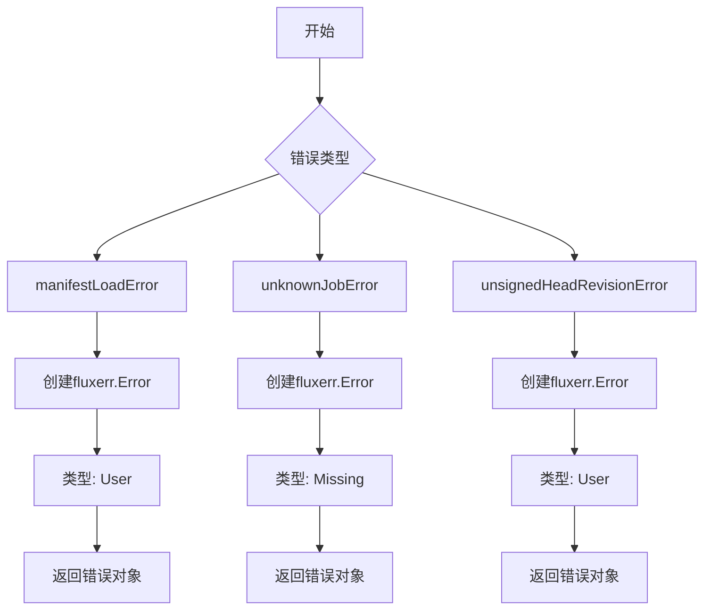
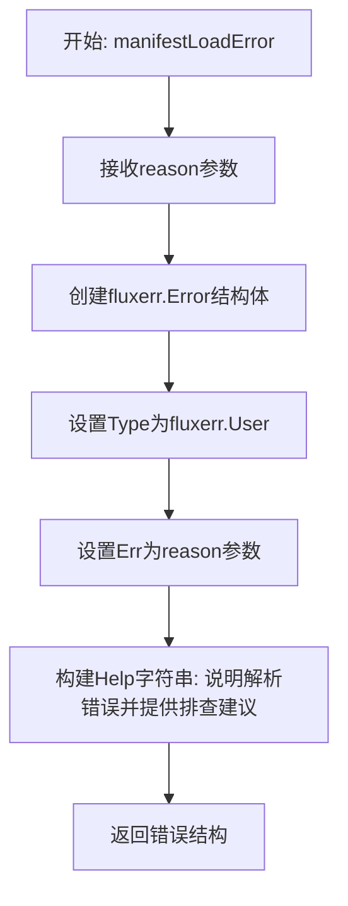
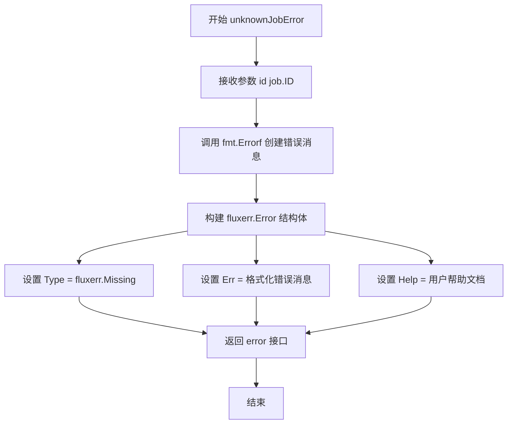
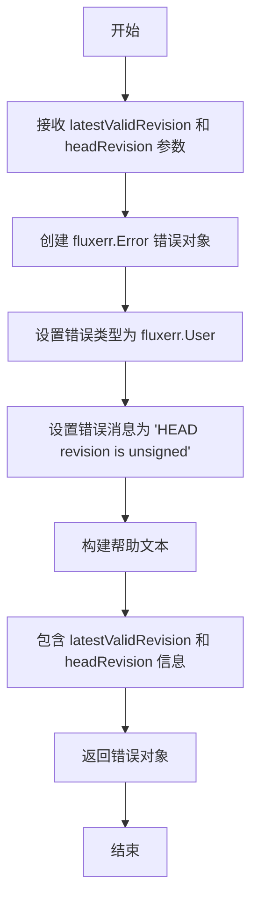

# `flux\pkg\daemon\errors.go` 详细设计文档

这是一个Flux CD守护进程的错误处理模块，定义了同步错误结构体以及用于创建用户友好错误信息的辅助函数，包括清单加载错误、未知作业错误和未签名HEAD修订版错误。

## 整体流程



## 类结构

```
SyncErrors (错误收集结构体)
```

## 全局变量及字段


### `SyncErrors.errs`
    
用于存储同步过程中每个资源ID对应的错误信息的映射

类型：`map[resource.ID]error`
    


### `SyncErrors.mu`
    
用于同步访问errs映射的互斥锁，确保并发安全

类型：`sync.Mutex`
    
    

## 全局函数及方法


### `manifestLoadError`

该函数用于将Manifest文件加载失败的原因包装成一个用户友好的Flux错误结构，帮助用户诊断和解决配置文件解析问题。

参数：

- `reason`：`error`，导致Manifest加载失败的根本错误

返回值：`error`，返回一个包含用户友好帮助信息的`fluxerr.Error`结构

#### 流程图



#### 带注释源码

```go
// manifestLoadError 创建一个用户友好的错误，用于表示Manifest文件解析失败
// 参数: reason - 导致解析失败的具体错误
// 返回: 封装后的fluxerr.Error错误结构
func manifestLoadError(reason error) error {
    // 返回一个包含详细帮助信息的错误对象
    // Type: 标记为用户错误(User)，表示问题可能由用户操作引起
    // Err:  存储原始错误原因，便于日志记录和调试
    // Help: 提供详细的排查指南，包括常见原因和文档链接
    return &fluxerr.Error{
        Type: fluxerr.User,  // 错误类型为用户错误
        Err:  reason,        // 原始错误信息
        Help: `Unable to parse files as manifests

Flux was unable to parse the files in the git repo as manifests,
giving this error:

    ` + reason.Error() + `

Check that any files mentioned are well-formed, and resources are not
defined more than once. It's also worth reviewing

    https://fluxcd.io/legacy/flux/requirements/

to make sure you're not running into any corner cases.

If you think your files are all OK and you are still getting this
message, please log an issue at

    https://github.com/fluxcd/flux/issues

and include the problematic file, if possible.
`, // 帮助文档，包含错误说明、排查步骤和问题反馈链接
    }
}
```


### `unknownJobError`

该函数用于创建一个表示"任务未找到"的错误对象，通常在查询某个特定任务ID但该任务不存在于系统中时调用，常用于处理Flux守护进程中无效的任务引用场景。

参数：

- `id`：`job.ID`，待查询的任务唯一标识符

返回值：`error`，返回填充了错误类型（Missing）、错误信息（包含任务ID的格式化字符串）以及帮助文档的fluxerr.Error结构体实例

#### 流程图



#### 带注释源码

```go
// unknownJobError 创建一个表示任务未找到错误的错误对象
// 参数 id: 未能找到的任务的唯一标识符
// 返回: 包含错误详情的 fluxerr.Error 结构体，实现了 error 接口
func unknownJobError(id job.ID) error {
    // 返回一个带有详细错误信息的 fluxerr.Error 指针
    return &fluxerr.Error{
        // 设置错误类型为 Missing，表示请求的资源不存在
        Type: fluxerr.Missing,
        // 格式化错误消息，包含具体的目标任务ID
        Err:  fmt.Errorf("unknown job %q", string(id)),
        // Help 字段提供用户友好的错误说明和可能的解决方案
        Help: `Job not found

This is often because the job did not result in committing changes,
and therefore had no lasting effect. A release dry-run is an example
of a job that does not result in a commit.

If you were expecting changes to be committed, this may mean that the
job failed, but its status was lost.

In both of the above cases it is OK to retry the operation that
resulted in this error.

If you get this error repeatedly, it's probably a bug. Please log an
issue describing what you were attempting, and posting logs from the
daemon if possible:

    https://github.com/fluxcd/flux/issues

`,
    }
}
```


### `unsignedHeadRevisionError`

该函数是一个错误工厂函数，用于创建关于 Git HEAD 提交未签名的用户友好错误信息，帮助用户理解 Flux 无法在未验证的提交上工作的原因。

参数：

- `latestValidRevision`：`string`，最新的有效（已验证）提交版本号
- `headRevision`：`string`，当前 HEAD 的提交版本号

返回值：`error`，返回一个包含用户错误信息的 `fluxerr.Error` 结构，包含错误类型、错误原因和详细的帮助文本

#### 流程图



#### 带注释源码

```go
// unsignedHeadRevisionError 创建一个用户友好的错误，表示 Git HEAD 提交未签名
// 参数:
//   - latestValidRevision: 最新的有效（已验证）提交版本
//   - headRevision: 当前 HEAD 的提交版本
//
// 返回值:
//   - error: 包含详细错误信息的 fluxerr.Error 对象
func unsignedHeadRevisionError(latestValidRevision, headRevision string) error {
    // 使用 fluxerr.Error 结构创建错误，包含错误类型、错误原因和帮助信息
    return &fluxerr.Error{
        // 设置错误类型为用户错误，表示这是由于用户操作导致的可修复问题
        Type: fluxerr.User,
        // 设置具体错误原因
        Err:  fmt.Errorf("HEAD revision is unsigned"),
        // 提供详细的帮助文本，指导用户如何解决问题
        Help: `HEAD is not a verified commit.

The branch HEAD in the git repo is not verified, and fluxd is unable to
make a change on top of it. The last verified commit was

    ` + latestValidRevision + `

HEAD is 

    ` + headRevision + `.
`,
    }
}
```

## 关键组件


### SyncErrors 结构体

用于存储同步过程中资源ID对应的错误信息，支持并发安全的错误映射操作。

### manifestLoadError 函数

生成无法将文件解析为manifest的错误，包含用户友好的帮助信息和文档链接。

### unknownJobError 函数

生成作业未找到的错误，通常由于作业未导致提交变更或状态丢失。

### unsignedHeadRevisionError 函数

生成HEAD提交未验证的错误，表明无法在未签名的提交上创建新变更。

### fluxerr.Error 类型

Flux标准错误类型，包含错误类型、原因和帮助信息，用于提供一致的用户错误反馈。


## 问题及建议


### 已知问题

- **未使用的互斥锁**：`SyncErrors` 结构体定义了 `mu sync.Mutex` 字段，但在代码中没有任何 Lock/Unlock 操作，导致该字段完全未使用。
- **不完整的结构体定义**：`SyncErrors` 结构体仅定义了字段，但没有提供任何方法（如 `Add`、`Get`、`Error` 等），使其功能不完整。
- **硬编码的错误消息**：所有错误消息和 Help 文本都是硬编码的字符串，无法支持国际化（i18n）或运行时配置。
- **错误类型使用方式可能不当**：`fluxerr.Error` 结构体直接作为错误返回，但 `Error()` 方法的实现方式未知，可能不符合标准 `error` 接口约定。

### 优化建议

- 如果 `SyncErrors` 需要线程安全的功能，实现相应的方法（如 `Add`、`Error` 等）来使用 `mu` 字段；否则移除未使用的 mutex 以简化代码。
- 为 `SyncErrors` 实现完整的方法集，使其真正可用，例如添加 `Add`、`Get`、`Error` 方法。
- 将错误消息提取到独立的配置或资源文件中，支持多语言和可配置的错误提示。
- 确保 `fluxerr.Error` 实现了 `error` 接口的 `Error() string` 方法，或考虑使用标准库的 `fmt.Errorf` 包装错误。

## 其它


### 设计目标与约束

本文档描述的代码是Fluxcd Flux守护进程（daemon）包中的错误处理模块，主要目标是提供标准化的错误创建和格式化机制，用于处理Git仓库操作中的常见失败场景。设计约束包括：1）错误必须遵循fluxerr包定义的错误类型系统；2）错误信息需包含用户可操作的帮助文档链接；3）SyncErrors结构体需保证并发安全。

### 错误处理与异常设计

代码采用结构化错误设计模式，主要错误类型包括：1）manifestLoadError - 用户错误（Type: fluxerr.User），当无法解析Git仓库中的文件为Manifest时触发；2）unknownJobError - 缺失错误（Type: fluxerr.Missing），当请求的Job不存在时触发；3）unsignedHeadRevisionError - 用户错误（Type: fluxerr.User），当Git HEAD提交未经过验证时触发。SyncErrors类提供线程安全的错误存储机制，通过sync.Mutex保证并发访问时的数据一致性。

### 外部依赖与接口契约

代码依赖三个外部包：1）fluxerr包（github.com/fluxcd/flux/pkg/errors）提供Error结构体和错误类型常量；2）job包（github.com/fluxcd/flux/pkg/job）提供Job.ID类型；3）resource包（github.com/fluxcd/flux/pkg/resource）提供resource.ID类型。接口契约方面，SyncErrors作为内部结构体不暴露公开接口，三个错误创建函数均返回error接口类型，遵循Go语言的错误处理惯例。

### 性能考虑

SyncErrors使用sync.Mutex进行同步，在高频并发场景下可能存在轻微性能开销，建议在未来的优化中考虑sync.RWMutex以支持更多的读操作。若错误映射操作非常频繁，可考虑使用atomic.Value或分段锁来减少锁竞争。

### 安全性考虑

错误信息中包含Git提交哈希和仓库状态信息，这些信息在日志记录时需注意不要暴露敏感的内部系统细节。unsignedHeadRevisionError中直接拼接latestValidRevision和headRevision，需确保这些值已经过适当的清理或验证，防止潜在的日志注入风险。

### 配置文件说明

本代码块不涉及运行时配置文件，所有错误信息以硬编码字符串形式嵌入在Help字段中，便于用户排查问题。这种设计确保了错误信息的自包含性，但需要注意多语言支持的扩展性需求。

### 测试策略建议

建议为每个错误创建函数编写单元测试，验证：1）返回的错误类型是否为fluxerr.Error；2）错误Type字段值是否正确；3）错误Help字段是否包含预期的帮助文本；4）SyncErrors的并发访问安全性。测试应覆盖边界情况，如空字符串参数、特殊字符转义等。

### 版本兼容性

代码使用Go语言标准库的sync和fmt包，以及Fluxcd生态系统的内部包。需注意fluxerr包的版本演进可能影响Error结构体的字段定义，建议在依赖管理中锁定兼容版本。

### 日志与监控建议

错误发生时应记录到系统日志，建议包含：1）错误类型和错误码；2）相关的资源ID或Job ID；3）触发错误的上下文操作。可通过监控error类型的分布来追踪系统健康状况，特别是unknownJobError的频繁出现可能指示系统存在潜在问题。


    