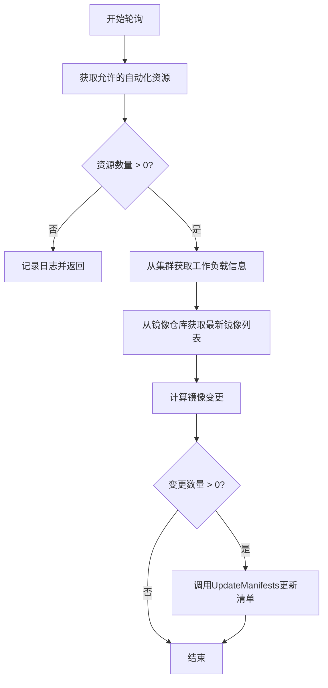
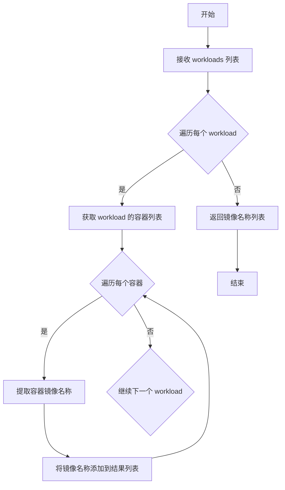
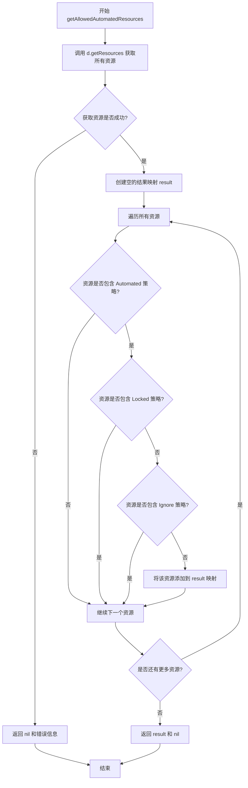
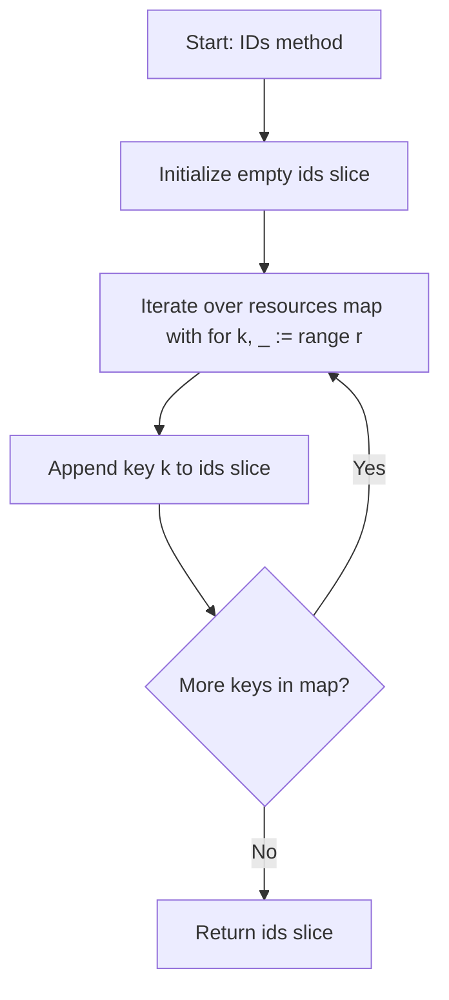

# `flux\pkg\daemon\images.go` 详细设计文档

这是一个Flux CD守护进程模块，负责轮询并检测自动化工作负载的新镜像版本，通过比对当前镜像与可用镜像仓库，自动计算需要更新的镜像变更，并在满足策略条件时触发清单更新。

## 整体流程



## 类结构

```
Daemon (主服务类)
└── pollForNewAutomatedWorkloadImages (轮询方法)
resources (资源映射类型)
└── IDs (获取ID列表方法)
calculateChanges (变更计算函数)
```

## 全局变量及字段


### `candidateWorkloads`
    
自动化且未锁定的候选工作负载资源映射

类型：`resources (map[resource.ID]resource.Resource)`
    


### `workloads`
    
从集群获取的工作负载列表

类型：`[]cluster.Workload`
    


### `imageRepos`
    
镜像仓库的镜像元数据信息

类型：`update.ImageRepos`
    


### `changes`
    
自动化更新变更集合

类型：`*update.Automated`
    


### `result`
    
过滤后的自动化资源结果映射

类型：`map[resource.ID]resource.Resource`
    


### `ids`
    
资源ID列表

类型：`[]resource.ID`
    


    

## 全局函数及方法


### `calculateChanges`

该函数是 Flux 自动化更新引擎的核心计算单元，负责比对候选工作负载的当前镜像与可用镜像仓库，筛选出需要升级的容器镜像，并生成包含目标镜像标签的自动化更新变更集。

参数：

- `logger`：`log.Logger`，用于记录函数执行过程中的日志信息，包括工作负载、容器、仓库、模式、当前镜像等上下文
- `candidateWorkloads`：`resources`，表示已通过自动化策略筛选的候选工作负载映射，用于获取每个工作负载的策略集
- `workloads`：`[]cluster.Workload`，从集群获取的完整工作负载列表，包含实际的容器配置信息
- `imageRepos`：`update.ImageRepos`，镜像仓库的元数据存储，提供了各镜像仓库的可用版本信息

返回值：`*update.Automated`，返回自动化更新变更结构体的指针，包含需要应用的所有镜像更新操作

#### 流程图

```mermaid
flowchart TD
    A[开始 calculateChanges] --> B[初始化 changes := &update.Automated{}]
    B --> C[遍历 workloads 列表]
    C --> D{当前工作负载是否在 candidateWorkloads 中?}
    D -->|是| E[获取资源策略集 p]
    D -->|否| E
    E --> F[遍历 workload 的所有容器]
    F --> G[提取容器当前镜像 currentImageID]
    G --> H[根据策略获取容器标签模式 pattern]
    H --> I[获取镜像仓库元数据 repoMetadata]
    I --> J[调用 FilterAndSortRepositoryMetadata 过滤排序]
    J --> K{过滤是否出错?}
    K -->|是| L[记录警告, 跳过该容器]
    K -->|否| M{images.Latest() 是否成功且不等于当前镜像?}
    M -->|否| F
    M -->|是| N{最新镜像是否无标签?}
    N -->|是| L
    N -->|否| O{pattern.RequiresTimestamp() 且时间戳为零?}
    O -->|是| L
    O -->|否| P[构造新镜像 newImage]
    P --> Q[调用 changes.Add 添加更新]
    Q --> R[记录更新日志]
    L --> F
    R --> F
    C --> S{工作负载遍历完成?}
    S -->|否| C
    S -->|是| T[返回 changes]
```

#### 带注释源码

```go
// calculateChanges 是自动化镜像更新的核心计算函数
// 参数说明：
//   - logger: 日志记录器，用于输出调试和信息日志
//   - candidateWorkloads: 已授权的自动化工作负载映射
//   - workloads: 集群中实际运行的工作负载列表
//   - imageRepos: 镜像仓库的元数据信息
// 返回值：包含所有需要更新的自动化变更集合
func calculateChanges(logger log.Logger, candidateWorkloads resources, workloads []cluster.Workload, imageRepos update.ImageRepos) *update.Automated {
	// 初始化空的自动化更新结构体
	changes := &update.Automated{}

	// 遍历集群中的每个工作负载
	for _, workload := range workloads {
		var p policy.Set
		// 尝试从候选工作负载中获取该工作负载的策略集
		if resource, ok := candidateWorkloads[workload.ID]; ok {
			p = resource.Policies()
		}
		// 使用容器标签来标记外层循环，以便在内部跳过
	containers:
		// 遍历当前工作负载的每个容器
		for _, container := range workload.ContainersOrNil() {
			// 获取容器当前使用的镜像ID
			currentImageID := container.Image
			// 根据策略集获取该容器的镜像标签匹配模式
			pattern := policy.GetTagPattern(p, container.Name)
			// 提取镜像仓库名称
			repo := currentImageID.Name
			// 构建带上下文的日志记录器
			logger := log.With(logger, "workload", workload.ID, "container", container.Name, "repo", repo, "pattern", pattern, "current", currentImageID)
			// 从镜像仓库元数据中获取当前仓库的元信息
			repoMetadata := imageRepos.GetRepositoryMetadata(repo)
			// 根据标签模式过滤并排序可用镜像
			images, err := update.FilterAndSortRepositoryMetadata(repoMetadata, pattern)
			if err != nil {
				// 如果过滤过程出现不一致错误，记录警告并跳过该容器
				logger.Log("warning", fmt.Sprintf("inconsistent repository metadata: %s", err), "action", "skip container")
				continue containers
			}

			// 获取最新镜像并检查是否需要更新
			if latest, ok := images.Latest(); ok && latest.ID != currentImageID {
				// 检查最新镜像是否有有效标签，无标签则跳过
				if latest.ID.Tag == "" {
					logger.Log("warning", "untagged image in available images", "action", "skip container")
					continue containers
				}
				// 查找当前镜像在元数据中的记录
				current := repoMetadata.FindImageWithRef(currentImageID)
				// 如果模式需要时间戳且任一镜像时间戳为零，跳过
				if pattern.RequiresTimestamp() && (current.CreatedAt.IsZero() || latest.CreatedAt.IsZero()) {
					logger.Log("warning", "image with zero created timestamp", "current", fmt.Sprintf("%s (%s)", current.ID, current.CreatedAt), "latest", fmt.Sprintf("%s (%s)", latest.ID, latest.CreatedAt), "action", "skip container")
					continue containers
				}
				// 构造新镜像：新镜像ID + 最新标签
				newImage := currentImageID.WithNewTag(latest.ID.Tag)
				// 将此更新添加到变更集合中
				changes.Add(workload.ID, container, newImage)
				// 记录更新成功日志
				logger.Log("info", "added update to automation run", "new", newImage, "reason", fmt.Sprintf("latest %s (%s) > current %s (%s)", latest.ID.Tag, latest.CreatedAt, currentImageID.Tag, current.CreatedAt))
			}
		}
	}

	return changes
}
```


### `clusterContainers`

将集群工作负载转换为镜像仓库服务所需的容器信息列表，以便获取可用的镜像更新。

参数：

- `workloads`：`[]cluster.Workload`，待处理的集群工作负载列表

返回值：`[]string`，返回工作负载中所有容器的镜像仓库名称列表

#### 流程图



#### 带注释源码

```
// clusterContainers 是一个全局工具函数，用于从 cluster.Workload 切片中提取所有容器的镜像仓库名称
// 参数 workloads: 来自集群的 Workload 列表，每个 Workload 包含一个或多个容器
// 返回值: 字符串切片，包含所有容器的完整镜像名称（如 "nginx:latest"）
// 此函数的主要作用是将工作负载结构转换为 update.FetchImageRepos 所需的参数格式
func clusterContainers(workloads []cluster.Workload) []string {
    // 初始化结果切片，预分配合理容量以提高性能
    var containers []string
    
    // 遍历所有工作负载
    for _, workload := range workloads {
        // 获取工作负载中的所有容器
        // 每个 Workload 可能包含多个容器（如 Sidecar 模式）
        for _, container := range workload.ContainersOrNil() {
            // 提取容器的完整镜像名称
            // 格式通常为 registry/repository:tag
            containers = append(containers, container.Image.Name)
        }
    }
    
    return containers
}
```

---

**注意**：在提供的代码片段中，`clusterContainers` 函数是一个被调用但未完整定义的全剧函数。根据函数签名和调用上下文推断，其功能是从 `[]cluster.Workload` 中提取所有容器的镜像名称，以便后续调用 `update.FetchImageRepos` 获取镜像仓库的可用版本信息。该函数是连接工作负载信息与镜像更新检查流程的关键桥梁。


### `Daemon.pollForNewAutomatedWorkloadImages`

该方法作为Daemon的核心自动化轮询机制，定期检查集群中所有自动化工作负载的镜像更新情况，通过比对当前镜像与仓库中最新可用镜像来识别可更新的资源，并在存在可用更新时触发清单更新流程。

参数：

- `logger`：`log.Logger`，用于记录轮询过程中的日志信息，包括开始轮询、错误信息和变更详情等

返回值：`无`（`void`），该方法通过副作用（调用 `UpdateManifests`）完成工作，不返回任何值

#### 流程图

```mermaid
flowchart TD
    A([开始轮询]) --> B[记录日志: "polling for new images for automated workloads"]
    B --> C[创建context.Background]
    C --> D[调用getAllowedAutomatedResources获取自动化资源]
    D --> E{获取是否出错?}
    E -->|是| F[记录错误日志并返回]
    E -->|否| G{candidateWorkloads长度是否为0?}
    G -->|是| H[记录日志: "no automated workloads" 并返回]
    G -->|否| I[调用Cluster.SomeWorkloads获取工作负载详情]
    I --> J{获取是否出错?}
    J -->|是| K[记录错误日志并返回]
    J -->|否| L[调用update.FetchImageRepos获取镜像仓库信息]
    L --> M{获取是否出错?}
    M -->|是| N[记录错误日志并返回]
    M -->|否| O[调用calculateChanges计算变更]
    O --> P{Changes是否大于0?}
    P -->|否| Q([结束])
    P -->|是| R[调用UpdateManifests执行自动更新]
    R --> Q
```

#### 带注释源码

```go
// pollForNewAutomatedWorkloadImages 轮询检查自动化工作负载的新镜像
// 该方法是Daemon的核心自动化更新入口点，定期检查并更新自动化工作负载的镜像
func (d *Daemon) pollForNewAutomatedWorkloadImages(logger log.Logger) {
	// 记录轮询开始日志，用于监控和调试
	logger.Log("msg", "polling for new images for automated workloads")

	// 创建空上下文，用于整个轮询流程的上下文传递
	ctx := context.Background()

	// 获取所有未被锁定且未设置忽略策略的自动化资源
	// 这些资源是可以自动更新的候选工作负载
	candidateWorkloads, err := d.getAllowedAutomatedResources(ctx)
	if err != nil {
		// 如果获取失败，记录错误并终止轮询
		logger.Log("error", errors.Wrap(err, "getting unlocked automated resources"))
		return
	}

	// 如果没有自动化工作负载，记录信息并直接返回，避免不必要的集群查询
	if len(candidateWorkloads) == 0 {
		logger.Log("msg", "no automated workloads")
		return
	}

	// 从集群获取候选工作负载的完整信息（包括容器配置等）
	// 这里只查询ID在candidateWorkloads中的工作负载，优化查询范围
	workloads, err := d.Cluster.SomeWorkloads(ctx, candidateWorkloads.IDs())
	if err != nil {
		logger.Log("error", errors.Wrap(err, "checking workloads for new images"))
		return
	}

	// 从镜像注册表获取所有相关镜像仓库的最新镜像信息
	// 这是耗时的网络操作，需要处理可能的错误
	imageRepos, err := update.FetchImageRepos(d.Registry, clusterContainers(workloads), logger)
	if err != nil {
		logger.Log("error", errors.Wrap(err, "fetching image updates"))
		return
	}

	// 计算哪些工作负载需要更新镜像
	// 会根据策略模式匹配最新的适用镜像
	changes := calculateChanges(logger, candidateWorkloads, workloads, imageRepos)

	// 如果存在需要更新的变更，触发清单更新流程
	// update.Spec指定了自动更新类型和具体的变更内容
	if len(changes.Changes) > 0 {
		d.UpdateManifests(ctx, update.Spec{Type: update.Auto, Spec: changes})
	}
}
```


### `Daemon.getAllowedAutomatedResources`

该方法是 Daemon 类型的成员方法，用于获取所有已启用自动化更新但未设置锁定（Locked）或忽略（Ignore）策略的资源。它通过遍历所有资源并过滤出符合自动化条件的资源来实现这一功能。

参数：

- `ctx`：`context.Context`，用于传递上下文信息和取消信号

返回值：

- `resources`：返回 `resources` 类型（实际上是 `map[resource.ID]resource.Resource]`），表示允许自动化的资源映射
- `error`：如果获取资源过程中出现错误，则返回相应的错误信息

#### 流程图



#### 带注释源码

```go
// getAllowedAutomatedResources 返回所有启用了自动化更新
// 但没有设置锁定或忽略策略约束的资源。
// 参数 ctx 用于传递上下文信息
// 返回值 resources 是允许自动化的资源映射，error 表示可能的错误
func (d *Daemon) getAllowedAutomatedResources(ctx context.Context) (resources, error) {
	// 调用 getResources 方法获取所有的资源
	// 返回的资源映射包含所有已管理的资源
	resources, _, err := d.getResources(ctx)
	if err != nil {
		// 如果获取资源失败，直接返回错误
		return nil, err
	}

	// 创建结果映射，用于存储符合条件的自动化资源
	result := map[resource.ID]resource.Resource{}
	
	// 遍历所有资源，筛选出符合条件的自动化资源
	for _, resource := range resources {
		// 获取当前资源的所有策略
		policies := resource.Policies()
		
		// 检查资源是否满足以下条件：
		// 1. 包含 Automated 自动化策略
		// 2. 不包含 Locked 锁定策略（锁定后不自动更新）
		// 3. 不包含 Ignore 忽略策略（忽略自动化）
		if policies.Has(policy.Automated) && !policies.Has(policy.Locked) && !policies.Has(policy.Ignore) {
			// 将符合条件的资源添加到结果映射中
			result[resource.ResourceID()] = resource
		}
	}
	
	// 返回过滤后的自动化资源列表
	return result, nil
}
```


### `resources.IDs`

该方法将 `resources` map 中的所有键（resource.ID）提取出来并返回一个包含这些 ID 的切片。

参数：

- 该方法无显式参数（接收者 `r resources` 作为隐式参数）

返回值：`[]resource.ID`，返回包含所有资源 ID 的切片

#### 流程图



#### 带注释源码

```go
// IDs returns all resource IDs from the resources map
// 参数：无
// 返回值：[]resource.ID - 包含所有资源ID的切片
func (r resources) IDs() (ids []resource.ID) {
	// 遍历 resources map 的所有键值对
	for k, _ := range r {
		// 将每个键（resource.ID）追加到 ids 切片中
		ids = append(ids, k)
	}
	// 返回包含所有资源ID的切片
	return ids
}
```

## 关键组件


### 自动化工作负载镜像轮询组件

负责定期检查自动化工作负载是否有可用的新镜像版本，并通过比较当前镜像与最新可用镜像来确定是否需要更新。

### 资源映射与筛选组件

提供资源到资源ID的映射结构，并包含ID提取方法，用于管理和筛选符合自动化策略的资源。

### 自动化资源获取组件

从集群中获取所有具有自动化策略但未被锁定或忽略的资源，作为候选工作负载进行镜像更新检查。

### 变更计算与镜像比较组件

核心逻辑组件，遍历所有工作负载及其容器，根据策略标签模式过滤镜像仓库，获取最新镜像，并与当前镜像进行比较以确定是否需要生成更新。

### 策略模式匹配组件

根据资源策略获取容器的标签模式（如 semver、regex、glob 等），用于从镜像仓库中筛选符合条件的镜像版本。

### 时间戳验证组件

在需要时间戳比较的场景下（如 semver 模式），验证镜像的创建时间是否有效，确保基于时间的版本比较是可靠的。

### 镜像更新生成组件

当检测到新镜像可用时，生成包含新镜像标签的更新对象，并记录详细的日志信息用于追踪和调试。


## 问题及建议


### 已知问题

-   **错误处理不完善**：错误仅通过日志记录，缺乏重试机制或错误上报，可能导致问题被隐藏
-   **上下文超时缺失**：`ctx := context.Background()` 未设置超时，可能导致goroutine泄漏或长时间阻塞
-   **循环嵌套性能问题**：`calculateChanges`函数中三层嵌套循环（workloads -> containers -> images），且每次都进行`imageRepos.GetRepositoryMetadata`调用，无缓存机制
-   **不必要的内存分配**：`resources.IDs()`方法中使用`for k, _ := range r`，下划线变量多余；`changes.Add`操作未预分配容量，可能导致多次切片扩容
-   **代码冗余**：`calculateChanges`中对`candidateWorkloads[workload.ID]`的检查在循环内每次都执行，应在循环外预处理
-   **缺乏测试覆盖**：代码中无任何单元测试或集成测试，存在较高回归风险
-   **日志硬编码**：日志消息使用字符串字面量，缺乏常量统一管理，不利于国际化或后续修改

### 优化建议

-   为`context.Background()`添加超时控制，例如`ctx, cancel := context.WithTimeout(context.Background(), 5*time.Minute)`
-   考虑将`imageRepos`查询结果缓存或预加载，避免在循环中重复调用
-   将`calculateChanges`参数封装为结构体，提高代码可读性和可维护性
-   在`resources.IDs()`方法中使用`for k := range r`消除冗余变量声明
-   预先分配`changes.Changes`切片容量，通过预估`len(workloads)`进行`make`初始化
-   将日志消息提取为常量或配置项，便于统一管理和维护
-   添加单元测试覆盖核心逻辑，特别是`calculateChanges`函数的边界条件处理

## 其它


### 设计目标与约束

本文档描述的代码是Flux CD持续交付工具的核心组件，负责自动化检测和更新Kubernetes集群中标记为自动化(automated)的Workload镜像。设计目标包括：1）定期轮询自动化Workload的镜像仓库以获取最新版本；2）根据预定义的策略（如Tag模式）筛选合适的镜像；3）仅对未被锁定(locked)或忽略(ignore)的资源进行更新；4）支持基于时间戳的版本比较以确保按正确顺序升级。约束条件包括：仅处理具有自动化策略的资源、需要访问集群API和镜像仓库注册表、依赖于Flux的其他组件如cluster、policy、resource和update包。

### 错误处理与异常设计

代码采用日志记录而非异常抛出的Go惯例处理错误。错误处理遵循以下模式：1）使用errors.Wrap包装错误信息添加上下文；2）错误发生时记录日志并提前返回，避免后续无效操作；3）针对不同错误类型有差异化处理，如镜像仓库元数据不一致时记录warning并跳过当前容器而非整个workload。关键错误场景包括：获取自动化资源失败、查询集群 workloads 失败、获取镜像仓库信息失败、元数据筛选错误、零时间戳检测等。

### 数据流与状态机

数据流遵循以下路径：1）pollForNewAutomatedWorkloadImages 作为入口点触发轮询；2）getAllowedAutomatedResources 获取符合自动化策略的资源列表；3）Cluster.SomeWorkloads 查询这些资源的详细工作负载信息；4）update.FetchImageRepos 获取所有相关镜像仓库的最新镜像；5）calculateChanges 对比当前镜像与最新可用镜像，根据策略筛选并生成更新计划；6）UpdateManifests 执行manifest更新。状态机方面，资源经历"候选资源→已获取→已检查→变更计算→待更新"的状态转换过程，变更计算过程中每个容器可能处于"已检查→符合条件→已添加变更"或"已检查→不符合条件→跳过"状态。

### 外部依赖与接口契约

核心依赖包括：1）github.com/go-kit/kit/log 提供日志接口；2）github.com/pkg/errors 用于错误包装；3）github.com/fluxcd/flux/pkg/cluster 包提供集群操作接口包括 SomeWorkloads 方法；4）github.com/fluxcd/flux/pkg/policy 提供策略检查包括 Automated、Locked、Ignore 标志和 GetTagPattern 函数；5）github.com/fluxcd/flux/pkg/resource 提供资源ID和资源对象抽象；6）github.com/fluxcd/flux/pkg/update 提供镜像仓库获取和筛选功能包括 FetchImageRepos、FilterAndSortRepositoryMetadata、ImageRepos 等。接口契约方面：Cluster.SomeWorkloads 接受 context 和资源ID列表返回 workloads 切片；Registry.FetchImageRepos 返回 ImageRepos；UpdateManifests 接受 update.Spec 参数执行更新。

### 性能考虑与资源占用

代码在性能方面需要关注：1）批量获取 workloads 使用 SomeWorkloads 而非逐个查询减少API调用；2）镜像仓库获取采用批量方式一次获取所有相关仓库；3）资源筛选在 getAllowedAutomatedResources 中完成，过滤逻辑在 calculateChanges 中逐容器处理。潜在性能瓶颈包括：大集群中 candidateWorkloads 数量可能很大导致镜像仓库查询量大；每次轮询都重新获取所有镜像仓库信息可能造成网络开销；calculateChanges 中对每个容器进行镜像比较和策略检查的复杂度为 O(n*m)。

### 并发与线程安全

代码运行在 Daemon 的单一实例上下文中，主要流程为串行执行无需额外并发控制。但需要注意：1）d.Cluster 和 d.Registry 作为 Daemon 的成员字段可能被其他goroutine并发访问；2）getAllowedAutomatedResources 内部创建的 result map 和返回的 resources map 不涉及并发写入；3）calculateChanges 中创建的 changes 对象为局部变量线程安全。如需提高吞吐量可考虑：1）对不同镜像仓库的获取并行化；2）对多 workload 的变更计算并行化；3）但需注意对 Cluster 和 Registry 的并发调用可能需要额外同步。

### 测试策略建议

针对该代码模块建议的测试策略：1）单元测试 calculateChanges 函数，模拟输入验证变更计算逻辑正确性；2）集成测试 pollForNewAutomatedWorkloadImages 完整流程使用mock Cluster和Registry；3）边界条件测试包括空候选资源列表、无新镜像可用、镜像仓库元数据异常、时间戳为零等场景；4）策略测试覆盖 Automated、Locked、Ignore 各种组合以及不同Tag模式；5）使用 table-driven 测试方式便于覆盖多种场景。

### 监控与可观测性

当前代码仅依赖日志进行可观测性，建议增强：1）添加metrics如轮询周期、处理的workload数量、触发的更新数量、错误率等；2）添加tracing支持追踪完整的数据流；3）日志中已包含关键信息如workload ID、container name、repo、pattern、current image、latest image等便于问题排查；4）可考虑添加慢查询日志记录哪些镜像仓库查询耗时较长；5）建议监控 calculateChanges 函数的执行时间以便发现性能问题。

    