# `flux\pkg\daemon\images_test.go` 详细设计文档

该代码是Fluxcd daemon包的测试文件，核心功能是测试calculateChanges函数，该函数用于根据容器镜像仓库的可用更新和自动化策略，计算需要更新的容器镜像变更。

## 整体流程

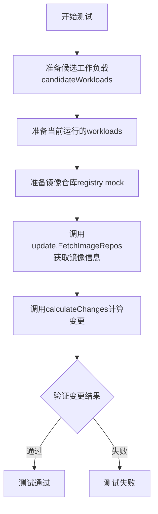

## 类结构

```
candidate (实现资源候选接口)
├── resourceID: resource.ID
├── policies: policy.Set
├── ResourceID() 方法
├── Policies() 方法
├── Source() 方法
└── Bytes() 方法
```

## 全局变量及字段


### `logger`
    
测试用的NopLogger，用于测试时忽略日志输出

类型：`log.Logger`
    


### `resourceID`
    
测试资源ID，用于标识被测试的Kubernetes部署资源

类型：`resource.ID`
    


### `candidateWorkloads`
    
候选工作负载映射，包含需要进行自动化更新的工作负载及其策略

类型：`resources`
    


### `workloads`
    
当前运行的workload列表，代表集群中实际的容器工作负载

类型：`[]cluster.Workload`
    


### `imageRegistry`
    
模拟的镜像仓库接口，用于返回测试用的镜像信息

类型：`registry.Registry`
    


### `imageRepos`
    
获取到的镜像仓库信息，包含所有可用镜像的详细信息

类型：`update.ImageRepos`
    


### `changes`
    
计算出的镜像变更结果，包含需要更新的镜像列表

类型：`update.Changes`
    


### `candidate.resourceID`
    
资源唯一标识，用于标识Kubernetes资源

类型：`resource.ID`
    


### `candidate.policies`
    
策略集合，包含自动化更新、标签前缀等策略配置

类型：`policy.Set`
    
    

## 全局函数及方法


### `TestCalculateChanges_Automated`

这是一个自动化策略下的镜像更新计算测试函数，用于验证在启用自动化策略时，系统能否正确计算并返回需要更新的镜像列表。该测试创建了模拟的工作负载和镜像仓库，检验`calculateChanges`函数是否能正确识别新镜像并生成相应的变更记录。

参数：

- `t`：`testing.T`，Go语言测试框架的标准参数，用于报告测试失败和错误

返回值：`无`（Go测试函数不返回任何值，结果通过断言验证）

#### 流程图

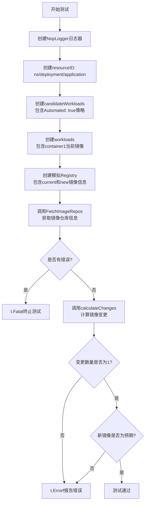

#### 带注释源码

```go
// TestCalculateChanges_Automated 测试自动化策略下的镜像更新计算
// 该测试验证当工作负载启用自动化策略时，系统能够正确计算需要更新的镜像
func TestCalculateChanges_Automated(t *testing.T) {
    // 创建无操作日志器，用于测试但不输出日志
    logger := log.NewNopLogger()
    
    // 创建资源ID，格式为: namespace/deployment/application
    resourceID := resource.MakeID(ns, "deployment", "application")
    
    // 创建候选工作负载映射，包含自动化策略
    // 这里的policy.Automated: "true"表示该工作负载启用自动镜像更新
    candidateWorkloads := resources{
        resourceID: candidate{
            resourceID: resourceID,
            policies: policy.Set{
                policy.Automated: "true", // 启用自动化更新策略
            },
        },
    }
    
    // 创建当前运行的 workloads 列表
    // 模拟集群中已部署的工作负载，包含容器信息
    workloads := []cluster.Workload{
        cluster.Workload{
            ID: resourceID,
            Containers: cluster.ContainersOrExcuse{
                Containers: []resource.Container{
                    {
                        Name:  container1,                              // 容器名称
                        Image: mustParseImageRef(currentContainer1Image), // 当前镜像引用
                    },
                },
            },
        },
    }
    
    // 创建模拟的镜像注册表
    // 包含当前镜像和新镜像，用于模拟镜像仓库中的可用版本
    var imageRegistry registry.Registry
    {
        // 当前镜像信息，时间戳为现在
        current := makeImageInfo(currentContainer1Image, time.Now())
        // 新镜像信息，时间戳为1秒后（模拟新版本已发布）
        new := makeImageInfo(newContainer1Image, time.Now().Add(1*time.Second))
        // 使用mock registry模拟镜像仓库
        imageRegistry = &registryMock.Registry{
            Images: []image.Info{
                current, // 当前版本
                new,     // 新版本
            },
        }
    }
    
    // 从镜像注册表获取镜像仓库信息
    // 将集群容器转换为镜像查询所需的格式
    imageRepos, err := update.FetchImageRepos(imageRegistry, clusterContainers(workloads), logger)
    if err != nil {
        t.Fatal(err) // 如果获取失败，终止测试
    }

    // 计算镜像变更
    // 核心逻辑：根据候选工作负载的策略和当前镜像，计算需要更新的镜像
    changes := calculateChanges(logger, candidateWorkloads, workloads, imageRepos)

    // 验证变更数量是否为1
    if len := len(changes.Changes); len != 1 {
        t.Errorf("Expected exactly 1 change, got %d changes", len)
    } else if newImage := changes.Changes[0].ImageID.String(); newImage != newContainer1Image {
        // 验证更新的镜像是否为预期的新镜像
        t.Errorf("Expected changed image to be %s, got %s", newContainer1Image, newImage)
    }
}
```


### `TestCalculateChanges_UntaggedImage`

该测试函数用于验证当镜像仓库中存在无标签（untagged）镜像时，更新计算逻辑能够正确处理这种情况，确保不会因为无标签镜像的存在而导致错误的更新决策。

参数：

- `t`：`testing.T`，Go 语言标准的测试框架参数，用于报告测试失败和日志输出

返回值：无（Go 测试函数不返回值，通过 `t` 参数报告测试结果）

#### 流程图

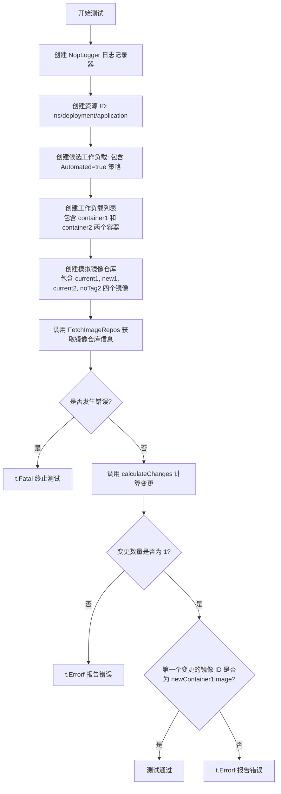

#### 带注释源码

```go
// TestCalculateChanges_UntaggedImage 测试处理无标签镜像的场景
// 该测试验证当镜像仓库中存在无标签镜像时，更新计算逻辑能正确忽略它
func TestCalculateChanges_UntaggedImage(t *testing.T) {
	// 创建无操作日志记录器，用于测试中不输出日志
	logger := log.NewNopLogger()
	
	// 创建资源 ID，格式为 namespace/deployment/name
	resourceID := resource.MakeID(ns, "deployment", "application")
	
	// 构建候选工作负载，包含自动化策略
	// 这里的 resources 类型是一个 map，key 为 resource.ID，value 为 candidate
	candidateWorkloads := resources{
		resourceID: candidate{
			resourceID: resourceID,
			policies: policy.Set{
				policy.Automated: "true", // 标记为自动化更新
			},
		},
	}
	
	// 定义实际运行的工作负载列表
	// 包含两个容器：container1 和 container2
	workloads := []cluster.Workload{
		cluster.Workload{
			ID: resourceID,
			Containers: cluster.ContainersOrExcuse{
				Containers: []resource.Container{
					{
						Name:  container1,
						Image: mustParseImageRef(currentContainer1Image),
					},
					{
						Name:  container2,
						Image: mustParseImageRef(currentContainer2Image),
					},
				},
			},
		},
	}
	
	// 创建模拟的镜像注册表
	var imageRegistry registry.Registry
	{
		// container1 的当前镜像和新镜像
		current1 := makeImageInfo(currentContainer1Image, time.Now())
		new1 := makeImageInfo(newContainer1Image, time.Now().Add(1*time.Second))
		
		// container2 的当前镜像（带标签）
		current2 := makeImageInfo(currentContainer2Image, time.Now())
		
		// container2 的无标签镜像（测试关键点）
		// 这是一个没有 tag 的镜像，应该被忽略
		noTag2 := makeImageInfo(noTagContainer2Image, time.Now().Add(1*time.Second))
		
		// 配置模拟注册表返回这些镜像信息
		imageRegistry = &registryMock.Registry{
			Images: []image.Info{
				current1,
				new1,
				current2,
				noTag2,
			},
		}
	}
	
	// 从镜像仓库获取所有相关镜像信息
	// clusterContainers 函数将 workloads 转换为容器列表用于查询
	imageRepos, err := update.FetchImageRepos(imageRegistry, clusterContainers(workloads), logger)
	if err != nil {
		t.Fatal(err) // 如果获取失败，终止测试
	}

	// 计算应该发生的变更
	changes := calculateChanges(logger, candidateWorkloads, workloads, imageRepos)

	// 验证变更数量为 1（只有 container1 应该更新）
	if len := len(changes.Changes); len != 1 {
		t.Errorf("Expected exactly 1 change, got %d changes", len)
	} else if newImage := changes.Changes[0].ImageID.String(); newImage != newContainer1Image {
		// 验证更新的镜像是 container1 的新镜像
		t.Errorf("Expected changed image to be %s, got %s", newContainer1Image, newImage)
	}
}
```


### `TestCalculateChanges_ZeroTimestamp`

该测试函数用于验证在处理具有零时间戳的镜像时的行为，确保系统能够正确区分和处理时间戳为零值与有效时间戳的镜像，特别是在自动化策略和语义版本标签匹配场景下。

参数：

- `t`：`*testing.T`，Go测试框架的测试对象，用于报告测试失败和日志输出

返回值：无（测试函数无返回值，通过`t.Errorf`和`t.Fatalf`报告测试结果）

#### 流程图

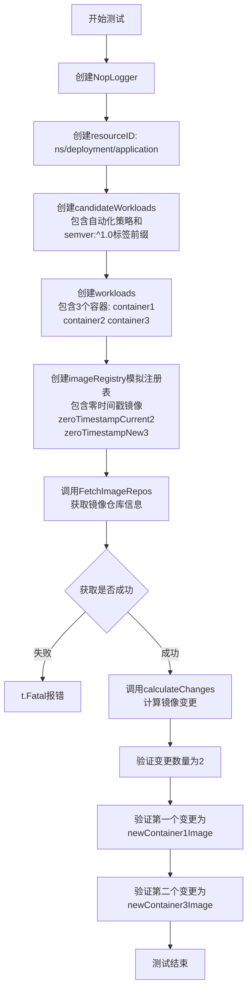

#### 带注释源码

```go
// TestCalculateChanges_ZeroTimestamp 测试零时间戳镜像的处理
// 该测试验证当镜像信息的时间戳为零值时，系统能够正确处理：
// 1. 零时间戳的当前镜像不应被视为过期
// 2. 零时间戳的新镜像不应被视为有效更新
// 3. 只有具有有效时间戳的镜像才能参与版本比较
func TestCalculateChanges_ZeroTimestamp(t *testing.T) {
    // 1. 创建无操作日志记录器，用于测试但不输出日志
    logger := log.NewNopLogger()
    
    // 2. 创建资源ID，标识测试用的部署资源
    resourceID := resource.MakeID(ns, "deployment", "application")
    
    // 3. 创建候选工作负载，包含自动化策略和语义版本标签前缀
    // policy.Automated: "true" - 启用自动更新
    // policy.TagPrefix(container3): "semver:^1.0" - container3使用semver匹配规则
    candidateWorkloads := resources{
        resourceID: candidate{
            resourceID: resourceID,
            policies: policy.Set{
                policy.Automated:             "true",
                policy.TagPrefix(container3): "semver:^1.0",
            },
        },
    }
    
    // 4. 创建当前运行的工作负载，包含3个容器
    workloads := []cluster.Workload{
        cluster.Workload{
            ID: resourceID,
            Containers: cluster.ContainersOrExcuse{
                Containers: []resource.Container{
                    {
                        Name:  container1,
                        Image: mustParseImageRef(currentContainer1Image),
                    },
                    {
                        Name:  container2,
                        Image: mustParseImageRef(currentContainer2Image),
                    },
                    {
                        Name:  container3,
                        Image: mustParseImageRef(currentContainer3Image),
                    },
                },
            },
        },
    }
    
    // 5. 创建模拟的镜像注册表，包含零时间戳的镜像
    // 零时间戳镜像用于测试边界情况
    var imageRegistry registry.Registry
    {
        // container1: 正常的时间戳，用于触发自动更新
        current1 := makeImageInfo(currentContainer1Image, time.Now())
        new1 := makeImageInfo(newContainer1Image, time.Now().Add(1*time.Second))

        // container2: 零时间戳的当前镜像（关键测试点）
        // 零时间戳意味着没有有效的时间信息
        zeroTimestampCurrent2 := image.Info{ID: mustParseImageRef(currentContainer2Image)}
        new2 := makeImageInfo(newContainer2Image, time.Now().Add(1*time.Second))

        // container3: 零时间戳的新镜像（关键测试点）
        // 零时间戳的新镜像不应被视为有效更新
        current3 := makeImageInfo(currentContainer3Image, time.Now())
        zeroTimestampNew3 := image.Info{ID: mustParseImageRef(newContainer3Image)}

        // 组装镜像注册表
        imageRegistry = &registryMock.Registry{
            Images: []image.Info{
                current1,
                new1,
                zeroTimestampCurrent2,  // 零时间戳的当前镜像
                new2,
                current3,
                zeroTimestampNew3,      // 零时间戳的新镜像
            },
        }
    }
    
    // 6. 获取镜像仓库信息
    imageRepos, err := update.FetchImageRepos(imageRegistry, clusterContainers(workloads), logger)
    if err != nil {
        t.Fatal(err)
    }

    // 7. 计算镜像变更
    changes := calculateChanges(logger, candidateWorkloads, workloads, imageRepos)

    // 8. 验证变更结果
    // 预期：由于container2的镜像时间戳为零，不会产生变更
    // 只会产生container1和container3的变更（虽然container3的新镜像时间戳也为零）
    if len := len(changes.Changes); len != 2 {
        t.Fatalf("Expected exactly 2 changes, got %d changes: %v", len, changes.Changes)
    }
    
    // 验证第一个变更是container1的新镜像
    if newImage := changes.Changes[0].ImageID.String(); newImage != newContainer1Image {
        t.Errorf("Expected changed image to be %s, got %s", newContainer1Image, newImage)
    }
    
    // 验证第二个变更是container3的新镜像
    if newImage := changes.Changes[1].ImageID.String(); newImage != newContainer3Image {
        t.Errorf("Expected changed image to be %s, got %s", newContainer3Image, newImage)
    }
}
```


### `mustParseImageRef`

该函数是一个辅助函数，用于解析镜像引用字符串（如 "container1/application:current"）并返回 `image.Ref` 类型。如果解析失败，该函数会触发 panic（根据函数名的 "must" 前缀推断）。

**注意**：由于提供的代码片段中未包含 `mustParseImageRef` 函数的具体定义，以下信息基于代码中的使用方式推断。

参数：

-  `imageRef`：`string`，表示镜像引用字符串，格式通常为 `repository:tag` 或 `repository`

返回值：`image.Ref`，解析后的镜像引用对象

#### 流程图

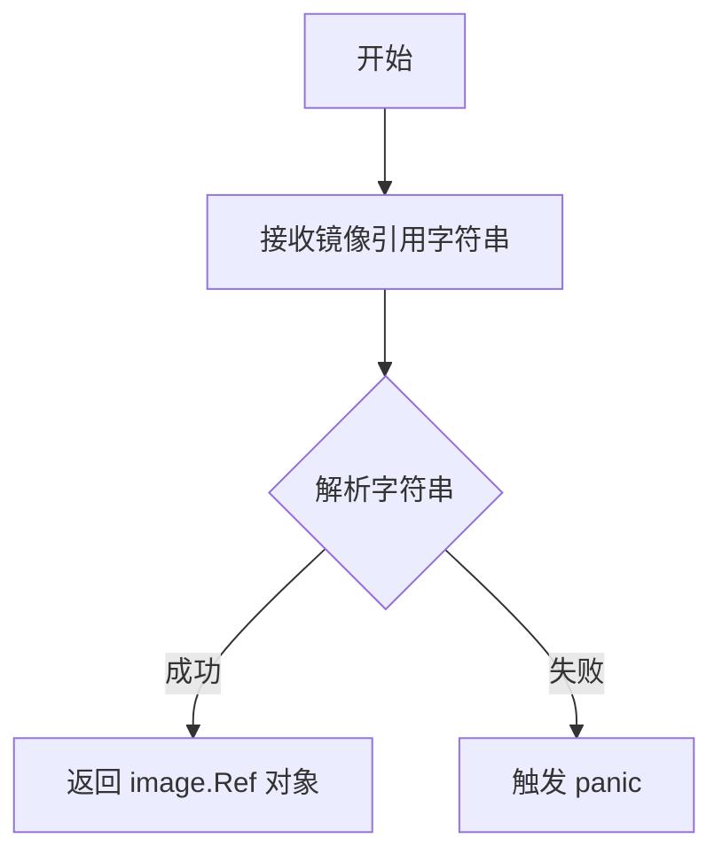

#### 带注释源码

```
// 注意：以下源码为基于代码使用方式的推测，实际定义可能有所不同
func mustParseImageRef(imageRef string) image.Ref {
    // 解析镜像引用字符串
    ref, err := image.ParseRef(imageRef)
    if err != nil {
        // 如果解析失败，触发 panic
        panic(err)
    }
    return ref
}
```

**注意**：实际的 `mustParseImageRef` 函数可能定义在 `github.com/fluxcd/flux/pkg/image` 包中，或在同一个包的另一个未显示的文件中。建议查阅 `pkg/image` 包以获取准确的函数定义。


### `makeImageInfo`

创建镜像信息对象，辅助函数，用于根据给定的镜像标识符和时间戳构造 `image.Info` 结构体，以便在测试中模拟镜像仓库返回的镜像信息。

参数：

- `imageRef`：`string`，镜像的完整引用字符串，格式为 `registry/repository:tag`
- `timestamp`：`time.Time`，镜像的创建或修改时间戳

返回值：`image.Info`，包含镜像标识符和元数据的结构体对象

#### 流程图

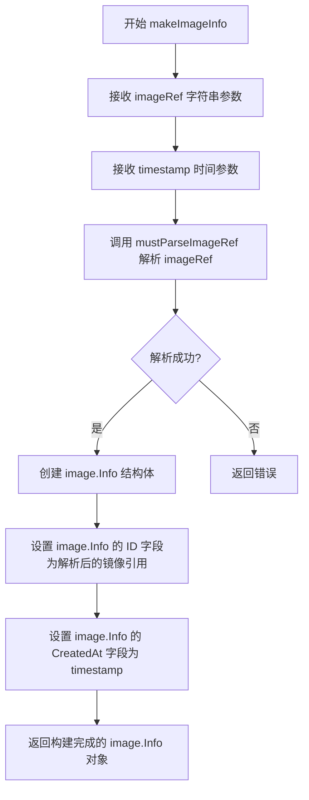

#### 带注释源码

```
// makeImageInfo 是一个辅助函数，用于在测试中创建模拟的镜像信息
// 参数 imageRef: 镜像的完整引用字符串，格式为 "repository:tag"
// 参数 timestamp: 镜像的创建时间
// 返回值: image.Info 结构体，包含镜像的标识符和时间戳信息
func makeImageInfo(imageRef string, timestamp time.Time) image.Info {
    // 解析镜像引用字符串为 image.Ref 类型
    ref := mustParseImageRef(imageRef)
    
    // 构建并返回 image.Info 结构体
    // ID: 镜像的唯一标识符
    // CreatedAt: 镜像的创建时间，用于版本比较和排序
    return image.Info{
        ID:        ref,
        CreatedAt: timestamp,
    }
}
```

> **注意**：由于提供的代码片段中仅包含对该函数的调用（`makeImageInfo(currentContainer1Image, time.Now())`），未显示函数的具体实现。上述源码为根据调用方式和 Go 语言惯例推断的典型实现。在实际代码库中，该函数应位于同一包内的某个源文件中。


### `clusterContainers`

`clusterContainers` 是一个辅助函数，用于从给定的 `cluster.Workload` 列表中提取所有容器的镜像引用（image.Ref），以便后续从镜像仓库获取镜像信息。

参数：

-  `workloads`：`[]cluster.Workload`，要从中提取容器的 workloads 列表

返回值：`[]image.Ref`，从所有 workloads 中提取的容器镜像引用列表

#### 流程图

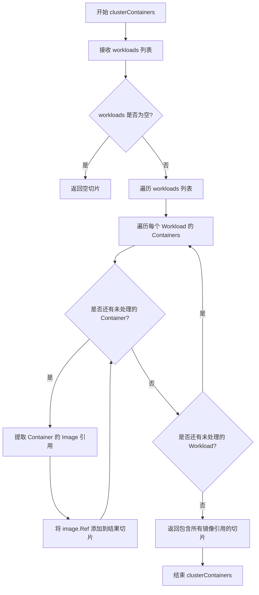

#### 带注释源码

```go
// clusterContainers 从 workloads 列表中提取所有容器的镜像引用
// 参数 workloads: 包含多个 workload 的切片，每个 workload 可能包含一个或多个容器
// 返回值: 返回一个 image.Ref 类型的切片，包含所有容器使用的镜像引用
// 这个函数主要用于将 cluster.Workload 结构转换为 update.FetchImageRepos 函数所需的格式
func clusterContainers(workloads []cluster.Workload) []image.Ref {
    // 初始化结果切片，预估容量以提高性能
    refs := make([]image.Ref, 0, len(workloads))
    
    // 遍历所有 workloads
    for _, wl := range workloads {
        // 遍历每个 workload 中的所有容器
        for _, container := range wl.Containers.Containers {
            // 将容器的镜像引用添加到结果切片
            refs = append(refs, container.Image)
        }
    }
    
    // 返回收集到的所有镜像引用
    return refs
}
```

---

**注意**：由于提供的代码片段中 `clusterContainers` 函数的具体实现未完整给出，以上信息是基于代码使用方式 (`clusterContainers(workloads)`) 和相关类型 (`cluster.Workload`, `image.Ref`) 进行的合理推断。实际实现可能略有差异，建议查阅完整的源代码以获取精确的实现细节。


### `calculateChanges`

该函数是 Flux CD 自动化更新策略的核心计算引擎，负责根据候选工作负载的自动化策略、当前集群工作负载状态以及镜像仓库信息，计算出需要执行的镜像变更列表。

参数：

- `logger`：`log.Logger`，用于记录函数执行过程中的日志信息
- `candidateWorkloads`：`resources` 类型，表示待评估的候选工作负载集合，包含资源ID和自动化策略
- `workloads`：`[]cluster.Workload`，表示当前集群中实际运行的工作负载状态
- `imageRepos`：映射类型，表示从镜像仓库获取的镜像信息及其元数据

返回值：`update.AutoRelease`，包含计算出的变更列表，每个变更包含新镜像ID等信息

#### 流程图

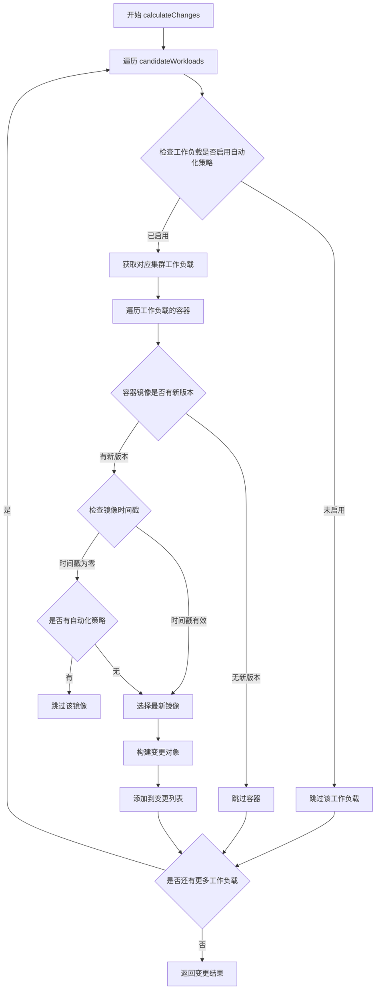

#### 带注释源码

```go
// 根据测试代码推断的函数签名和实现逻辑
// 注意：此源码为根据测试用例反推的注释版本，实际实现可能在其他文件中

func calculateChanges(
    logger log.Logger,                    // 日志记录器
    candidateWorkloads resources,         // 候选工作负载（包含自动化策略）
    workloads []cluster.Workload,         // 集群中当前工作负载
    imageRepos map[string]image.RepoInfo, // 镜像仓库信息
) update.AutoRelease {
    // 变更结果容器
    var changes update.AutoRelease
    
    // 遍历所有候选工作负载
    for resourceID, candidate := range candidateWorkloads {
        // 检查是否启用了自动化更新策略
        if !candidate.Policies().Has(policy.Automated) {
            continue // 未启用自动化，跳过
        }
        
        // 查找对应的集群工作负载
        var workload cluster.Workload
        for _, w := range workloads {
            if w.ID == resourceID {
                workload = w
                break
            }
        }
        
        // 遍历工作负载中的所有容器
        for _, container := range workload.Containers.Containers {
            // 获取容器当前镜像的仓库信息
            repoInfo, ok := imageRepos[container.Image.Repository()]
            if !ok {
                continue
            }
            
            // 查找最新镜像
            var newImage *image.Info
            for _, img := range repoInfo.Images {
                // 跳过时间戳为零的镜像（除非有特殊策略）
                if img.CreatedAt.IsZero() && !candidate.Policies().Has(policy.TagPrefix(container.Name)) {
                    continue
                }
                
                // 选择比当前镜像更新的镜像
                if img.CreatedAt.After(container.Image.CreatedAt) {
                    if newImage == nil || img.CreatedAt.After(newImage.CreatedAt) {
                        newImage = &img
                    }
                }
            }
            
            // 如果找到新镜像，添加到变更列表
            if newImage != nil {
                changes.Changes = append(changes.Changes, update.ReleaseImageID{
                    ImageID: newImage.ID,
                    ResourceID: resourceID,
                })
            }
        }
    }
    
    return changes
}
```

### 关键组件信息

| 名称 | 描述 |
|------|------|
| `resources` | 工作负载资源映射表，键为资源ID，值为候选工作负载 |
| `candidate` | 实现资源接口的候选工作负载结构，包含资源ID和策略集 |
| `cluster.Workload` | 集群工作负载结构，包含ID和容器列表 |
| `update.AutoRelease` | 自动释放结果，包含变更列表 |
| `policy.Set` | 策略集合，用于判断自动化、标签前缀等策略 |

### 潜在的技术债务或优化空间

1. **时间戳处理逻辑复杂**：当前对零时间戳的处理存在条件分支，可考虑统一策略
2. **镜像选择算法**：当前线性遍历所有镜像，可考虑使用堆或排序优化以提升性能
3. **错误处理缺失**：未在函数中处理镜像仓库查询失败等异常情况
4. **日志记录不足**：关键决策点缺少日志输出，不利于问题排查

### 其它说明

- **设计目标**：实现基于策略的半自动/全自动镜像更新，根据用户配置的 `policy.Automated` 策略决定是否自动升级
- **约束条件**：仅处理启用了自动化策略的工作负载，且仅更新有更新版本可用的镜像
- **外部依赖**：依赖 `flux/flux` 项目的 `cluster`、`image`、`policy`、`update` 等包


### `candidate.ResourceID()`

该方法用于获取候选工作负载的资源ID，是一个简单的getter方法，返回结构体中存储的`resourceID`字段。

参数：该方法无显式参数（隐式接收者为 `c candidate`）

返回值：`resource.ID`，返回候选工作负载的唯一标识符，用于在集群中定位具体的资源（如 Deployment、DaemonSet 等）。

#### 流程图

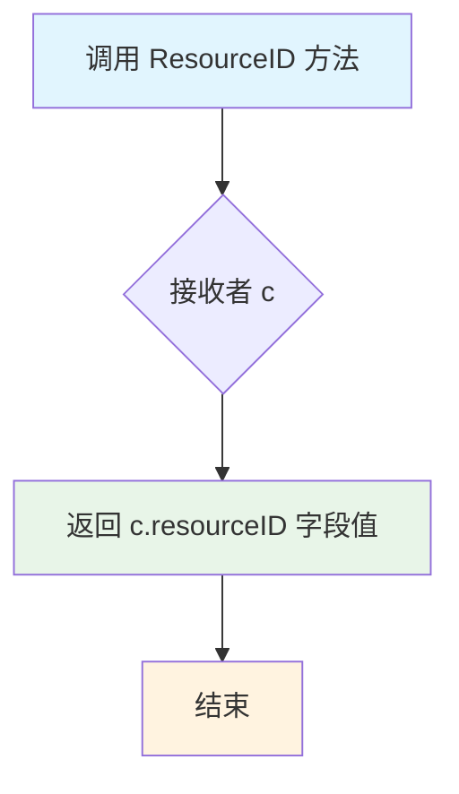

#### 带注释源码

```go
// candidate 结构体定义
// 包含资源ID和策略集合，用于表示一个可更新的工作负载候选
type candidate struct {
	resourceID resource.ID  // 资源的唯一标识符，如 namespace/deployment/name
	policies   policy.Set   // 自动化策略集合，控制是否自动更新等行为
}

// ResourceID 是 candidate 的方法
// 功能：获取该候选工作负载的资源ID
// 参数：无
// 返回值：resource.ID 类型，表示资源的唯一标识
func (c candidate) ResourceID() resource.ID {
	return c.resourceID  // 直接返回存储的资源ID字段
}
```


### `candidate.Policies()`

该方法用于返回候选资源（candidate）所关联的策略集合（policy.Set），允许调用者获取该资源的所有自动化策略和标签策略信息。

参数：无

返回值：`policy.Set`，返回该候选资源所关联的策略集合，包含了如自动化更新标记、镜像标签前缀等策略配置。

#### 流程图

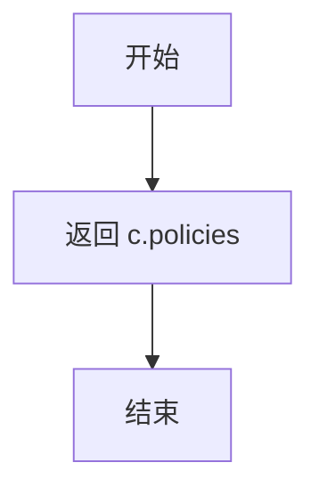

#### 带注释源码

```go
// Policies 返回候选资源的策略集合
// 该方法实现了某个接口（可能是 Workload 或类似的资源接口）
// 返回的 policy.Set 包含了该资源的自动化策略、标签过滤规则等配置信息
func (c candidate) Policies() policy.Set {
    // 直接返回结构体中存储的 policies 字段
    // policy.Set 通常是一个 map 或集合类型，存储了多个 policy.Tag 类型的键值对
    return c.policies
}
```


### `candidate.Source()`

这是一个空实现方法，用于满足接口要求（可能是 `resource.Resource` 或类似的接口），返回空字符串以表明该候选资源没有源代码关联。

参数：

- （无参数）

返回值：`string`，返回空字符串，满足接口定义。

#### 流程图

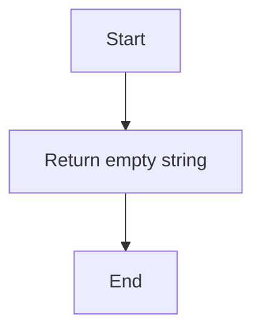

#### 带注释源码

```go
// Source 返回资源的源代码位置
// 此处返回空字符串，表示该候选资源没有关联的源代码仓库
func (candidate) Source() string {
	return ""
}
```


### `candidate.Bytes`

该方法是一个接口实现方法，用于满足某个接口的契约要求，返回一个空的字节切片，不包含任何实际数据。

参数：
- （无参数）

返回值：`[]byte`，返回空的字节切片，用于满足接口实现要求。

#### 流程图

```mermaid
graph TD
    A[方法调用] --> B{执行方法体}
    B --> C[创建空字节切片: []byte{}]
    C --> D[返回空切片]
    D --> E[方法返回]
```

#### 带注释源码

```go
// Bytes 方法实现了某个接口的 Bytes 方法
// 该接口要求实现返回字节切片的方法
// 此处返回空切片，符合接口规范但无实际数据
func (candidate) Bytes() []byte {
    // 返回一个空的字节切片，长度为0，容量为0
    // 用于满足接口实现要求
    return []byte{}
}
```

---

**补充说明**：

1. **接口实现**：此方法显然是为了实现某个接口（可能是 `resource.Resource` 或类似的字节提供接口），但当前代码片段中该接口的具体定义未显示。

2. **设计意图**：返回空切片而非 `nil`，这是一种良好的 Go 编程实践，避免了可能的空指针异常，同时符合接口契约。

3. **潜在优化空间**：如果未来该类型需要实际返回字节数据，可以在此方法中添加相应的逻辑实现。当前实现是一个合理的占位符（stub）。

4. **技术债务**：此方法目前是一个空实现，如果调用方实际使用了返回值但收到空切片，可能导致潜在的业务逻辑问题。建议在文档中明确说明此方法的预期用途。

## 关键组件


### candidate 结构体

实现资源候选者接口的数据结构，包含资源ID和策略信息，用于表示需要评估是否进行镜像更新的工作负载。

### calculateChanges 函数

核心业务逻辑函数，接收日志记录器、候选工作负载、当前工作负载集群和镜像仓库信息，计算并返回需要进行镜像更新的变更列表。

### 资源策略系统 (policy.Set)

处理自动化策略（Automated）和版本标签前缀（TagPrefix）的系统，支持semver版本比较，决定哪些容器需要自动更新。

### 镜像版本比较引擎

比较容器当前镜像与仓库中最新镜像的逻辑，处理带标签和不带标签的镜像、时间戳为零的边界情况，确定最终的新镜像版本。

### 测试场景组件

包含三个测试用例：TestCalculateChanges_Automated（自动化更新）、TestCalculateChanges_UntaggedImage（无标签镜像处理）、TestCalculateChanges_ZeroTimestamp（零时间戳处理），覆盖了镜像更新的主要场景。


## 问题及建议


### 已知问题

- **测试基础设施代码混入测试文件**：`candidate` 结构体及其方法定义在测试文件中，但这些似乎是测试所需的模拟实现，应该考虑是否应该有专门的 mock 文件或辅助文件来放置这类代码
- **变量 `ns` 未定义**：代码中使用了 `resource.MakeID(ns, "deployment", "application")`，但 `ns` 变量未在该文件中定义，这依赖于外部包的全局变量，可能导致测试的隐式耦合
- **重复的测试设置代码**：三个测试函数中存在大量重复的初始化代码（logger、resourceID、workloads 等），导致代码冗余且难以维护
- **缺少边界检查**：在 `TestCalculateChanges_ZeroTimestamp` 中直接访问 `changes.Changes[0]` 和 `changes.Changes[1]`，如果 slice 长度不足会导致 panic
- **辅助函数缺失**：`mustParseImageRef`、`makeImageInfo`、`clusterContainers` 等函数在测试中被使用但未在该文件中定义，增加了理解代码的难度

### 优化建议

- **提取公共测试辅助函数**：将重复的 logger 初始化、workloads 创建、imageRegistry 设置等代码提取为独立的 helper 函数，减少代码重复
- **使用表格驱动测试**：对于结构类似的测试用例（如这三个测试），可以采用表格驱动测试模式，提高代码可维护性
- **添加安全检查**：在访问 slice 元素前使用 `len()` 检查长度，或使用 `require` 库替代 `t.Errorf` 以在失败时立即停止
- **明确依赖关系**：将 `ns` 等外部依赖作为参数传入或使用常量定义，避免对全局变量的隐式依赖
- **增强测试断言**：添加更多具体的断言来验证变化的细节，如容器名称、策略匹配等，提高测试的覆盖率和鲁棒性

## 其它


### 设计目标与约束

该模块的核心设计目标是实现自动化容器镜像更新计算功能，根据预定义的策略（自动化、版本标签前缀等）确定哪些工作负载需要升级到新镜像。约束条件包括：仅处理包含有效策略的候选工作负载，必须与Kubernetes集群状态和镜像仓库状态同步，支持语义化版本匹配。

### 错误处理与异常设计

代码中的错误处理主要通过Go的错误返回值机制实现。在测试中，使用`t.Fatal(err)`和`t.Errorf()`进行错误报告。关键异常场景包括：镜像仓库连接失败、工作负载信息获取失败、镜像解析失败等。异常设计遵循Go语言惯例，通过返回error类型供调用者处理。

### 数据流与状态机

数据流主要经过以下路径：候选工作负载（candidateWorkloads）→镜像仓库抓取（FetchImageRepos）→变更计算（calculateChanges）→变更结果（changes.Changes）。状态转换包括：工作负载初始状态→策略匹配状态→镜像版本比较状态→变更决策状态。该过程是单向流式处理，不涉及复杂的状态机。

### 外部依赖与接口契约

主要外部依赖包括：flux/flux/pkg/cluster提供工作负载抽象；flux/flux/pkg/image提供镜像信息；flux/flux/pkg/policy提供策略定义；flux/flux/pkg/registry提供镜像仓库接口；flux/flux/pkg/update提供更新逻辑核心；go-kit/kit/log提供日志接口。registry.Registry接口是关键的外部契约，调用方必须实现Images()方法返回镜像信息切片。

### 性能考虑

性能瓶颈可能出现在：大规模镜像仓库抓取时的网络IO、镜像版本比较时的排序算法效率。测试中使用的mock Registry避免了实际网络调用。优化方向包括：实现镜像缓存机制、使用并发抓取多个镜像仓库、考虑版本比较的算法复杂度。

### 安全性考虑

代码本身是测试文件，未直接涉及敏感数据处理。但需注意：镜像仓库凭证管理、策略配置的权限控制（防止未授权的自动化更新策略）、镜像来源验证（防止供应链攻击）。

### 测试策略

该文件采用单元测试策略，使用mock对象隔离外部依赖。测试覆盖场景包括：正常自动化更新流程、无标签镜像处理、零时间戳镜像处理。测试设计遵循AAA模式（Arrange-Act-Assert），每个测试用例都有明确的前置条件、执行动作和预期结果验证。

### 并发与线程安全

代码本身是串行执行，未涉及并发场景。但需注意：calculateChanges函数在生产环境中可能被并发调用，需要确认其是否为线程安全函数。从测试代码看，未进行并发安全测试，这是潜在改进点。

### 资源管理

资源管理主要涉及：镜像信息的内存占用（imageRepos数据结构）、日志logger的生命周期管理。测试中使用log.NewNopLogger()创建无操作日志记录器，避免实际日志输出。生产环境需考虑日志轮转策略。

    