# `flux\pkg\daemon\loop.go` 详细设计文档

该代码是Flux CD项目的守护进程核心循环模块，负责定期同步Git仓库与集群状态、自动化轮询镜像更新、处理作业队列，并通过GPG签名验证确保Git提交的安全性，同时维护内存中的同步状态以检测外部变更。

## 整体流程

```mermaid
graph TD
    A[启动Daemon Loop] --> B[初始化定时器: SyncInterval & AutomationInterval]
B --> C[检查仓库只读状态和镜像扫描是否禁用]
C --> D[请求初始同步和自动化镜像更新]
D --> E{主事件循环}
E --> F[stop信号]
E --> G[自动化工作负载通道]
E --> H[自动化定时器到期]
E --> I[同步请求通道]
E --> J[同步定时器到期]
E --> K[Git仓库通知]
E --> L[作业队列就绪]
F --> M[记录停止日志并返回]
G --> N{仓库只读或镜像扫描禁用?}
N -- 是 --> O[continue跳过]
N -- 否 --> P[轮询新镜像并重置定时器]
H --> Q[请求自动化镜像更新]
I --> R{执行同步]
R --> S[调用d.Sync方法]
S --> T{同步成功?}
T -- 是 --> U[记录成功指标]
T -- 否 --> V[记录失败指标和错误]
U --> W[重置同步定时器]
V --> W
J --> X[请求同步]
K --> Y{验证签名模式非空?]
Y -- 是 --> Z[获取最新有效提交]
Y -- 否 --> AA[获取分支头]
Z --> AB{有无效提交?}
AA --> AB
AB -- 是 --> AC[记录无效签名警告]
AB -- 否 --> AD{HEAD变化?]
AD -- 是 --> AE[更新syncHead并请求同步]
AD -- 否 --> E
L --> AF{执行作业]
AF --> AG[调用job.Do]
AG -> AH{作业成功?}
AH -- 是 --> AI[刷新仓库并重置syncSoon]
AH -- 否 --> AJ[记录失败并重置syncSoon]
AI --> E
AJ --> E
```

## 类结构

```
LoopVars (主配置与控制结构体)
├── 字段: SyncInterval, SyncTimeout, AutomationInterval, GitTimeout
├── 字段: GitVerifySignaturesMode, SyncState, ImageScanDisabled
├── 字段: initOnce, syncSoon, automatedWorkloadsSoon
└── 方法: ensureInit, AskForSync, AskForAutomatedWorkloadImageUpdates
lastKnownSyncState (内部状态跟踪结构体)
├── 字段: logger, state, revision, resources, warnedAboutChange
└── 方法: CurrentRevision, CurrentResources, Update
```

## 全局变量及字段


### `LoopVars.SyncInterval`
    
同步间隔配置

类型：`time.Duration`
    


### `LoopVars.SyncTimeout`
    
同步超时配置

类型：`time.Duration`
    


### `LoopVars.AutomationInterval`
    
自动化轮询间隔

类型：`time.Duration`
    


### `LoopVars.GitTimeout`
    
Git操作超时

类型：`time.Duration`
    


### `LoopVars.GitVerifySignaturesMode`
    
GPG签名验证模式

类型：`fluxsync.VerifySignaturesMode`
    


### `LoopVars.SyncState`
    
同步状态持久化接口

类型：`fluxsync.State`
    


### `LoopVars.ImageScanDisabled`
    
是否禁用镜像扫描

类型：`bool`
    


### `LoopVars.initOnce`
    
确保初始化执行一次

类型：`sync.Once`
    


### `LoopVars.syncSoon`
    
同步请求通道(带缓冲)

类型：`chan struct{}`
    


### `LoopVars.automatedWorkloadsSoon`
    
自动化工作负载通道(带缓冲)

类型：`chan struct{}`
    


### `lastKnownSyncState.logger`
    
日志记录器

类型：`log.Logger`
    


### `lastKnownSyncState.state`
    
同步状态接口

类型：`fluxsync.State`
    


### `lastKnownSyncState.revision`
    
当前已知修订版本

类型：`string`
    


### `lastKnownSyncState.resources`
    
当前同步的资源映射

类型：`map[string]resource.Resource`
    


### `lastKnownSyncState.warnedAboutChange`
    
是否已警告过外部变更

类型：`bool`
    
    

## 全局函数及方法


### `latestValidRevision`

获取 Git 仓库中已验证（如果启用了 GPG 签名验证）的最新有效提交。该函数是外部依赖，未在此代码文件中实现，其实现位于 `github.com/fluxcd/flux/pkg/git` 包中。

参数：

- `ctx`：`context.Context`，用于控制请求的截止时间和取消
- `repo`：`git.Repo`，Git 仓库客户端接口，提供访问仓库的方法
- `syncState`：`fluxsync.State`，同步状态，用于记录已处理的提交
- `verifyMode`：`fluxsync.VerifySignaturesMode`，GPG 签名验证模式（可选值：None、Required、All）

返回值：

- `newSyncHead`：`string`，最新有效提交的 SHA 哈希
- `invalidCommit`：`git.Commit`，包含无效签名的提交信息（如果存在）
- `err`：`error`，操作过程中的错误信息

#### 流程图

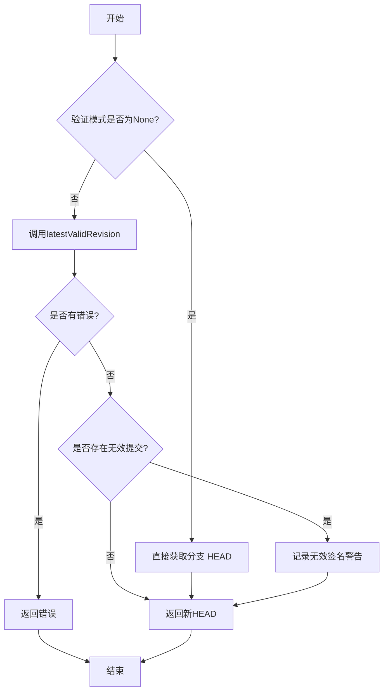

#### 带注释源码

```go
// 以下为调用方代码，该函数的实现位于外部包中
// 这是从 daemon.Loop 函数中提取的相关调用逻辑

// 创建带超时的上下文
ctx, cancel := context.WithTimeout(context.Background(), d.GitTimeout)

// 根据验证模式决定获取 HEAD 的方式
if d.GitVerifySignaturesMode != fluxsync.VerifySignaturesModeNone {
    // 模式非 None 时，调用 latestValidRevision 获取已验证的最新提交
    // 该函数会：
    // 1. 获取仓库的分支头
    // 2. 验证提交的 GPG 签名（如果模式为 Required 或 All）
    // 3. 返回有效提交和任何无效提交的信息
    newSyncHead, invalidCommit, err = latestValidRevision(
        ctx,           // 上下文，用于超时控制
        d.Repo,        // Git 仓库客户端
        d.SyncState,   // 同步状态，记录已处理提交
        d.GitVerifySignaturesMode // 签名验证模式
    )
} else {
    // 模式为 None 时，直接获取分支 HEAD，无需验证签名
    newSyncHead, err = d.Repo.BranchHead(ctx)
}

// 取消上下文，释放资源
cancel()

// 错误处理
if err != nil {
    logger.Log("url", d.Repo.Origin().SafeURL(), "err", err)
    continue // 跳过后续处理
}

// 如果存在无效签名的提交，记录警告日志
if invalidCommit.Revision != "" {
    logger.Log("err", "found invalid GPG signature for commit", 
        "revision", invalidCommit.Revision, 
        "key", invalidCommit.Signature.Key)
}

// 比较新旧 HEAD，如有变化则请求同步
logger.Log("event", "refreshed", "url", d.Repo.Origin().SafeURL(), 
    "branch", d.GitConfig.Branch, "HEAD", newSyncHead)
if newSyncHead != syncHead {
    syncHead = newSyncHead
    d.AskForSync() // 触发同步操作
}
```

#### 外部依赖说明

`latestValidRevision` 函数签名（推断自调用方式）：

```go
// 位于 github.com/fluxcd/flux/pkg/git 包中
func latestValidRevision(
    ctx context.Context,
    repo Repo,
    syncState fluxsync.State,
    verifyMode fluxsync.VerifySignaturesMode,
) (newSyncHead string, invalidCommit git.Commit, err error)
```

**相关类型参考：**

- `git.Commit`：包含 `Revision`（提交哈希）和 `Signature`（GPG 签名信息）字段
- `fluxsync.VerifySignaturesMode`：枚举类型，值为 `None`、`Required` 或 `All`
- `fluxsync.State`：同步状态接口，用于记录和管理已同步的提交


### `syncDuration`（Prometheus 指标观察）

这是对同步操作耗时的 Prometheus 指标观察，用于监控 Flux 守护进程的同步性能。

参数：

- 无（该方法是链式调用的一部分，通过 `.With()` 和 `.Observe()` 方法传递参数）

返回值：`无`（Prometheus 的 `Observe` 方法返回空）

#### 流程图

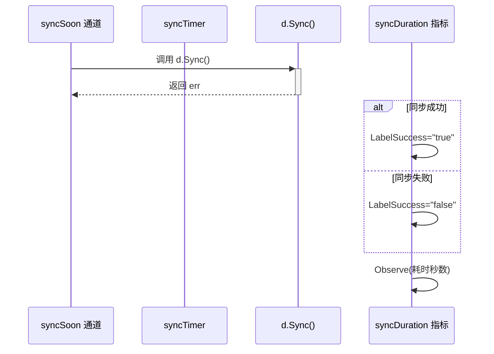

#### 带注释源码

```go
// syncDuration 是一个 Prometheus Histogram 指标，用于记录同步操作的耗时
// 该变量来自外部依赖 fluxmetrics 包
syncDuration.With(
    // fluxmetrics.LabelSuccess 是一个字符串标签键，用于标记同步是否成功
    fluxmetrics.LabelSuccess, 
    // 将错误是否为 nil 转换为字符串 "true" 或 "false"
    fmt.Sprint(err == nil),
// 使用 Observe 方法记录从同步开始到当前所经过的时间（秒）
).Observe(time.Since(started).Seconds())
```

#### 上下文源码（完整调用位置）

```go
case <-d.syncSoon:
    // 停止同步定时器，如果定时器已触发则清空其通道
    if !syncTimer.Stop() {
        select {
        case <-syncTimer.C:
        default:
        }
    }
    // 记录同步开始时间（UTC 时间）
    started := time.Now().UTC()
    // 执行同步操作，传入上下文、同步时间戳、当前 HEAD 指针和状态记录器
    err := d.Sync(context.Background(), started, syncHead, ratchet)
    
    // --- syncDuration 指标观察开始 ---
    // 使用 Prometheus 的 Histogram 指标观察同步操作的耗时
    // 参数1: LabelSuccess 标签键，值为 "true" 或 "false" 表示同步是否成功
    // 参数2: 观察值，即从开始到现在的耗时（秒）
    syncDuration.With(
        fluxmetrics.LabelSuccess, fmt.Sprint(err == nil),
    ).Observe(time.Since(started).Seconds())
    // --- syncDuration 指标观察结束 ---
    
    // 如果同步出错，记录错误日志
    if err != nil {
        logger.Log("err", err)
    }
    // 重置同步定时器，设置下一次同步的时间间隔
    syncTimer.Reset(d.SyncInterval)
```

#### 关键信息

| 项目 | 描述 |
|------|------|
| **类型** | Prometheus Histogram 指标 |
| **包** | `github.com/fluxcd/flux/pkg/metrics`（外部依赖） |
| **用途** | 监控 Flux Daemon 同步操作的耗时和成功率 |
| **标签** | `success`（"true" 或 "false"） |
| **观察值** | `time.Since(started).Seconds()` - 同步耗时（秒） |


### `jobDuration` (Prometheus 指标)

用于观察作业（Job）执行耗时的 Prometheus 指标，属于外部依赖 `fluxmetrics` 包。该指标通过 Histogram 类型记录作业运行的持续时间，并以作业成功与否作为标签维度进行区分。

#### 参数

该函数/方法不是传统意义上的函数调用，而是 Prometheus 指标的链式调用：

- `fluxmetrics.LabelSuccess`：标签键（string 类型），用于标识作业是否成功的标签名
- `fmt.Sprint(err == nil)`：标签值（string 类型），当 err 为 nil 时为 "true"，否则为 "false"

#### 返回值

- 无返回值（`Observe` 方法无返回值，用于记录观察值）

#### 流程图

```mermaid
flowchart TD
    A[开始轮询Job队列] --> B[获取Job]
    B --> C[记录开始时间 start = time.Now]
    D[执行 job.Do] --> E{执行是否成功}
    E -->|成功| F[err == nil: LabelValue = "true"]
    E -->|失败| G[err != nil: LabelValue = "false"]
    F --> H[jobDuration.With LabelSuccess='true'.Observe]
    G --> I[jobDuration.With LabelSuccess='false'.Observe]
    H --> J[结束]
    I --> J
```

#### 带注释源码

```go
// 作业耗时指标观察
// 这是一个 Prometheus Histogram 指标，用于记录作业执行的持续时间
// 通过 With() 方法添加标签，Observe() 方法记录观察值（秒）
start := time.Now()
err := job.Do(jobLogger)
jobDuration.With(
    fluxmetrics.LabelSuccess, fmt.Sprint(err == nil),  // LabelSuccess 标签，成功为 "true"，失败为 "false"
).Observe(time.Since(start).Seconds())                 // 记录从开始到当前的耗时（秒）
```


### `queueLength`

这是一个全局 Prometheus Gauge 指标，用于记录 Flux Daemon 中待处理任务队列的长度。该指标在每次从作业队列中取出作业时更新，以反映当前等待处理的作业数量。

#### 参数

无参数（全局变量）

#### 返回值

无返回值（全局变量）

#### 流程图

```mermaid
flow TD
    A[Daemon Loop 开始] --> B{select 检查多个 channel}
    B --> C{从 d.Jobs.Ready channel 收到作业?}
    C -->|是| D[获取队列长度: d.Jobs.Len]
    C -->|否| E[处理其他 case]
    D --> F[设置 queueLength 指标: queueLength.Set]
    F --> G[执行作业: job.Do]
    E --> H[继续循环]
    G --> H
```

#### 带注释源码

```go
// queueLength 是一个 Prometheus Gauge 类型的全局变量
// 用于跟踪任务队列中待处理作业的数量
// 该指标在 daemon/daemon.go 或 pkg/metrics 包中定义
var queueLength = fluxmetrics.GaugePrometheus(
    "fluxd_job_queue_length",  // 指标名称：fluxd_job_queue_length
    "Length of the job queue", // 指标描述：作业队列的长度
)

// 在 Loop 方法中的使用位置：
case job := <-d.Jobs.Ready():      // 从作业队列中取出准备好的作业
    queueLength.Set(float64(d.Jobs.Len()))  // 更新队列长度指标为当前队列中的作业数量
    jobLogger := log.With(logger, "jobID", job.ID)
    jobLogger.Log("state", "in-progress")
    // ... 执行作业
```

#### 相关上下文信息

| 项目 | 说明 |
|------|------|
| **定义位置** | `github.com/fluxcd/flux/pkg/metrics` 包 |
| **指标类型** | Prometheus Gauge |
| **指标名称** | `fluxd_job_queue_length` |
| **更新时机** | 当有作业从队列中被取出准备执行时 |
| **数据来源** | `d.Jobs.Len()` - Jobs 队列的当前长度 |
| **使用位置** | `Daemon.Loop` 方法的 select 语句中 |


# d.Sync 方法提取结果

### `Daemon.Sync`

该方法是 Daemon 类型的核心同步方法，负责执行实际的环境同步操作，包括获取 Git 仓库最新状态、同步资源到集群等。

**注意**：提供的代码中仅包含对该方法的调用，未包含方法的具体实现。以下信息基于代码中对 `d.Sync` 的调用上下文推断得出。

参数：

- `ctx`：`context.Context`，同步操作的上下文，用于超时控制和取消
- `started`：`time.Time`，同步开始的时间戳，用于记录和指标计算
- `syncHead`：`string`，当前已知的 Git 仓库 HEAD 提交哈希
- `ratchet`：`*lastKnownSyncState`，指向内部同步状态追踪器的指针，用于记录和验证同步状态

返回值：

- `error`：同步过程中发生的错误，如果没有错误则为 `nil`

#### 流程图

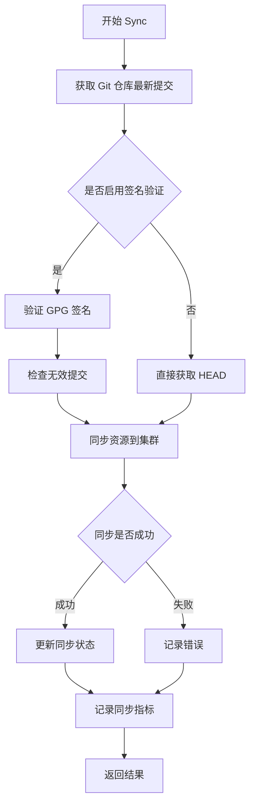

#### 带注释源码

```go
// 基于代码调用上下文推断的 Sync 方法签名
func (d *Daemon) Sync(ctx context.Context, started time.Time, syncHead string, ratchet *lastKnownSyncState) error {
    // 从 Loop 方法中的调用：
    // err := d.Sync(context.Background(), started, syncHead, ratchet)
    
    // 可能的实现逻辑（源码中未提供，此处为推断）：
    
    // 1. 获取 Git 仓库最新提交
    // 2. 验证提交签名（如启用）
    // 3. 比对当前状态与新状态
    // 4. 执行资源同步
    // 5. 更新同步状态标记
    // 6. 记录同步指标
}
```

---

## 补充说明

### 技术债务/缺失信息

1. **方法实现缺失**：源代码中仅包含 `d.Sync` 的调用，未提供该方法的完整实现
2. **类型定义缺失**：代码中引用了 `Daemon` 类型，但其完整定义未在当前代码片段中显示

### 建议

如需获取完整的 `Sync` 方法设计文档，建议提供：
- `Daemon` 类型的完整定义
- `Sync` 方法的实际实现代码
- 相关的 `fluxsync` 包接口定义

### 数据流说明

```
Git Repository → Sync Head → compare with ratchet → Sync to Cluster → Update State
```


### `Daemon.Repo`

描述：`Daemon` 结构体的 `Repo` 字段是一个 Git 仓库接口，负责与 Git 仓库进行交互，包括检查只读状态、监听仓库变更、获取分支头、刷新仓库状态等操作。

参数：无（这是一个字段访问，而非方法调用）

返回值：`git.Repo`（接口类型），代表 Git 仓库的接口抽象

#### 流程图

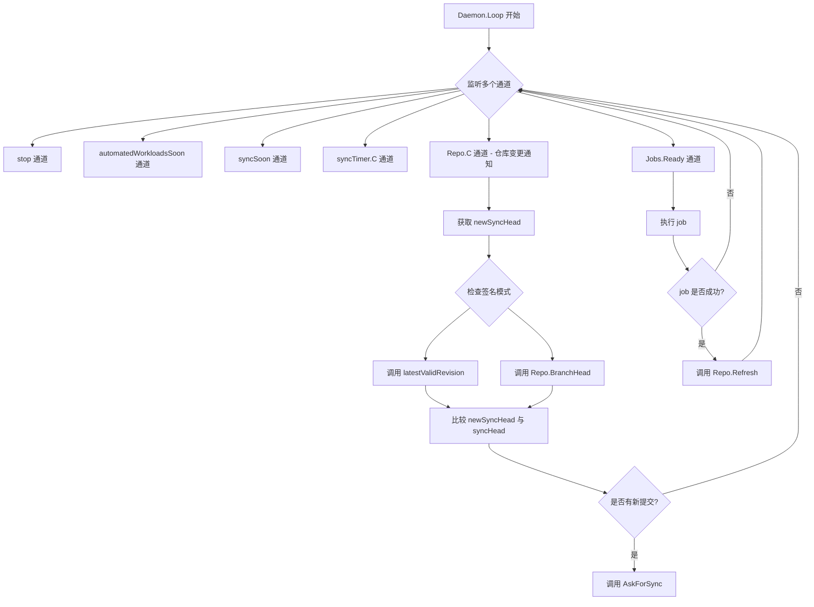

#### 带注释源码

```go
// d.Repo 的使用场景在 Daemon.Loop 方法中
// 以下是相关的代码片段和注释

// 1. 检查仓库是否为只读
// 如果 git 仓库是只读的，镜像更新将失败；
// 为了避免日志中重复失败，这里记录一次并跳过
if d.Repo.Readonly() {
    logger.Log("info", "Repo is read-only; no image updates will be attempted")
}

// 2. 监听仓库变更通知
// 通过 d.Repo.C 通道接收仓库变更信号
case <-d.Repo.C:
    var newSyncHead string
    var invalidCommit git.Commit
    var err error

    ctx, cancel := context.WithTimeout(context.Background(), d.GitTimeout)
    // 如果启用了签名验证，调用 latestValidRevision 获取有效的最新提交
    if d.GitVerifySignaturesMode != fluxsync.VerifySignaturesModeNone {
        newSyncHead, invalidCommit, err = latestValidRevision(ctx, d.Repo, d.SyncState, d.GitVerifySignaturesMode)
    } else {
        // 否则直接获取分支头
        newSyncHead, err = d.Repo.BranchHead(ctx)
    }
    cancel()

    if err != nil {
        logger.Log("url", d.Repo.Origin().SafeURL(), "err", err)
        continue
    }
    // 记录无效签名错误
    if invalidCommit.Revision != "" {
        logger.Log("err", "found invalid GPG signature for commit", "revision", invalidCommit.Revision, "key", invalidCommit.Signature.Key)
    }

    // 记录仓库刷新事件
    logger.Log("event", "refreshed", "url", d.Repo.Origin().SafeURL(), "branch", d.GitConfig.Branch, "HEAD", newSyncHead)
    // 如果有新的 HEAD，请求同步
    if newSyncHead != syncHead {
        syncHead = newSyncHead
        d.AskForSync()
    }

// 3. 在 job 成功后刷新仓库
// 成功的 job 会推送提交到上游仓库，因此需要从上游仓库拉取并同步集群
err := job.Do(jobLogger)
// ...
if err != nil {
    jobLogger.Log("state", "done", "success", "false", "err", err)
} else {
    jobLogger.Log("state", "done", "success", "true")
    // 刷新仓库以获取最新提交
    ctx, cancel := context.WithTimeout(context.Background(), d.GitTimeout)
    err := d.Repo.Refresh(ctx)
    if err != nil {
        logger.Log("err", err)
    }
    cancel()
}
```

#### 接口方法详情

根据代码使用情况，`d.Repo` 实现的接口应包含以下方法：

| 方法名 | 参数 | 返回值 | 描述 |
|--------|------|--------|------|
| `Readonly()` | 无 | `bool` | 检查仓库是否为只读 |
| `C` | - | `<-chan struct{}` | 仓库变更通知通道 |
| `Origin()` | 无 | `git.BareRepo` | 获取仓库原点信息 |
| `BranchHead(ctx context.Context)` | `ctx context.Context` | `(string, error)` | 获取指定分支的最新提交 |
| `Refresh(ctx context.Context)` | `ctx context.Context` | `error` | 刷新本地镜像以获取远程最新状态 |


### `Daemon.Jobs` (Daemon类型字段) 作业队列

该字段是Daemon结构体中的一个作业队列管理器，负责存储和管理待执行的同步任务。它提供了就绪作业的通道和队列长度查询功能，用于在Daemon的主循环中获取并执行作业。

参数：此字段无函数参数，作为结构体字段直接访问。

返回值：作为字段本身，返回其类型（即作业队列的类型），但在实际使用中通过其方法如`Ready()`返回可执行的作业。

#### 流程图

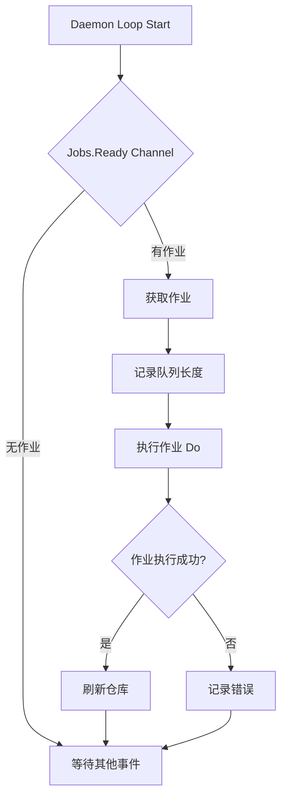

#### 带注释源码

```go
// 在Daemon.Loop方法中，Jobs队列的使用示例
case job := <-d.Jobs.Ready(): // 从作业队列的Ready通道获取可执行的作业
    queueLength.Set(float64(d.Jobs.Len())) // 记录当前队列长度到监控指标
    jobLogger := log.With(logger, "jobID", job.ID) // 为该作业创建带有jobID的日志记录器
    jobLogger.Log("state", "in-progress") // 记录作业状态为进行中
    
    // 记录作业开始执行的时间
    start := time.Now()
    // 执行作业的实际工作
    err := job.Do(jobLogger)
    // 记录作业执行时长到监控指标
    jobDuration.With(
        fluxmetrics.LabelSuccess, fmt.Sprint(err == nil),
    ).Observe(time.Since(start).Seconds())
    
    if err != nil {
        // 作业执行失败，记录失败状态和错误信息
        jobLogger.Log("state", "done", "success", "false", "err", err)
    } else {
        // 作业执行成功
        jobLogger.Log("state", "done", "success", "true")
        // 刷新远程仓库以获取最新更改
        ctx, cancel := context.WithTimeout(context.Background(), d.GitTimeout)
        err := d.Repo.Refresh(ctx)
        if err != nil {
            logger.Log("err", err)
        }
        cancel() // 取消上下文以释放资源
    }
```


### `Daemon.GitConfig`

这是 `Daemon` 结构体的一个字段，用于存储 Git 仓库的配置信息，包含分支名称等。在 `Loop` 方法中用于获取当前配置的分支名称并记录日志。

参数：无（这是一个字段访问，不是方法）

返回值：无（字段访问）

#### 流程图

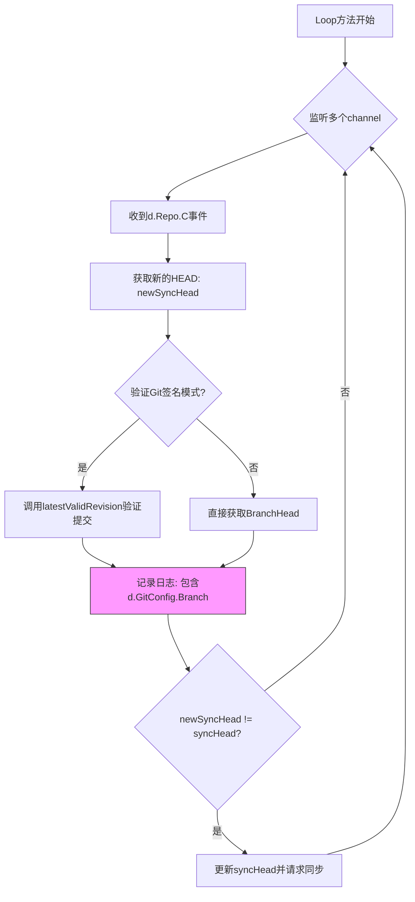

#### 带注释源码

```go
// GitConfig 是 Daemon 结构体的字段，用于存储 Git 仓库配置
// 在 Loop 方法中使用，用于获取分支信息
// 访问方式：d.GitConfig.Branch

// 在 Loop 方法中的使用示例：
case <-d.Repo.C:
    var newSyncHead string
    var invalidCommit git.Commit
    var err error

    ctx, cancel := context.WithTimeout(context.Background(), d.GitTimeout)
    if d.GitVerifySignaturesMode != fluxsync.VerifySignaturesModeNone {
        newSyncHead, invalidCommit, err = latestValidRevision(ctx, d.Repo, d.SyncState, d.GitVerifySignaturesMode)
    } else {
        newSyncHead, err = d.Repo.BranchHead(ctx)
    }
    cancel()

    if err != nil {
        logger.Log("url", d.Repo.Origin().SafeURL(), "err", err)
        continue
    }
    if invalidCommit.Revision != "" {
        logger.Log("err", "found invalid GPG signature for commit", "revision", invalidCommit.Revision, "key", invalidCommit.Signature.Key)
    }

    // 访问 GitConfig 字段获取分支名称并记录日志
    logger.Log("event", "refreshed", "url", d.Repo.Origin().SafeURL(), "branch", d.GitConfig.Branch, "HEAD", newSyncHead)
    if newSyncHead != syncHead {
        syncHead = newSyncHead
        d.AskForSync()
    }
```

#### 字段信息

- **名称**：`GitConfig`
- **类型**：应该是 `git.Config` 或类似的 Git 配置结构（从代码上下文推断，包含 `Branch` 字段）
- **描述**：存储 Git 仓库的配置信息，主要包含分支名称（Branch）等 Git 仓库相关的配置项。在日志记录和 Git 操作时使用此配置来确定目标分支。


### `Daemon.pollForNewAutomatedWorkloadImages`

该方法用于轮询并检查自动化工作负载是否有新的镜像可用，是 Flux CD 守护进程自动化同步流程中的关键组成部分，负责定期从容器仓库获取最新镜像信息以更新集群中的工作负载。

参数：

- `logger`：`log.Logger`，来自 go-kit/log 包，用于记录方法执行过程中的日志信息

返回值：`void`（无返回值），该方法通过副作用更新系统状态，不返回任何值

#### 流程图

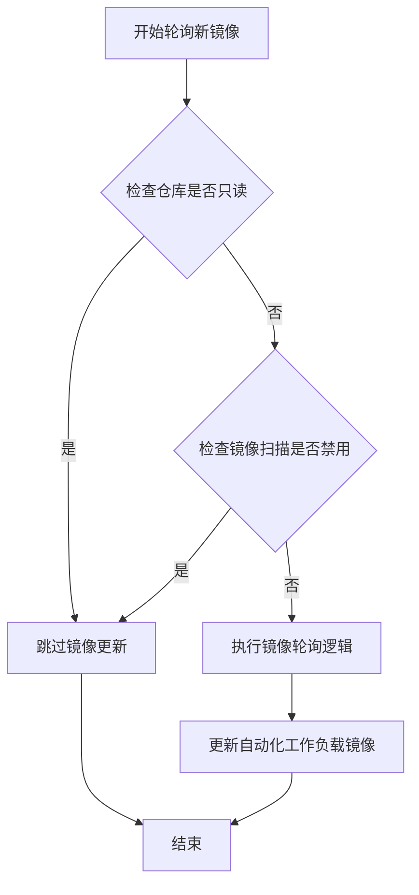

#### 带注释源码

```go
// pollForNewAutomatedWorkloadImages 轮询并检查自动化工作负载的新镜像
// 注意：该方法的完整实现在代码片段中未显示，此处基于调用点进行分析
func (d *Daemon) pollForNewAutomatedWorkloadImages(logger log.Logger) {
    // 从代码中的调用位置可以看出：
    // 1. 在调用前会检查 d.Repo.Readonly() 和 d.ImageScanDisabled
    // 2. 如果仓库为只读或镜像扫描被禁用，则不会执行此方法
    // 3. 该方法接收一个 logger 参数用于日志记录
    // 4. 该方法无返回值，通过内部逻辑直接更新自动化工作负载的镜像状态
    
    // 调用点位于 Loop 方法中：
    // case <-d.automatedWorkloadsSoon:
    //     if d.Repo.Readonly() || d.ImageScanDisabled {
    //         continue
    //     }
    //     d.pollForNewAutomatedWorkloadImages(logger)
    //     automatedWorkloadTimer.Reset(d.AutomationInterval)
}
```


### `LoopVars.Loop`（或 `Daemon.Loop`）

这是 Flux Daemon 的主事件循环方法，负责处理同步、Git 仓库镜像轮询、自动化工作负载镜像扫描以及作业执行。该方法通过 `select` 语句多路复用多个通道（停止信号、定时器、Git 仓库变更、作业队列），实现对不同事件的响应和处理。

#### 参数

- `stop`：`chan struct{}`，用于接收停止信号的通道，当关闭时表示需要停止循环。
- `wg`：`*sync.WaitGroup`，用于等待组，方法结束时调用 `wg.Done()` 以通知调用者已完成。
- `logger`：`log.Logger`，Go Kit 的日志接口，用于记录方法运行过程中的信息、警告和错误。

#### 返回值

- 无（`void`），该方法没有返回值。

#### 流程图

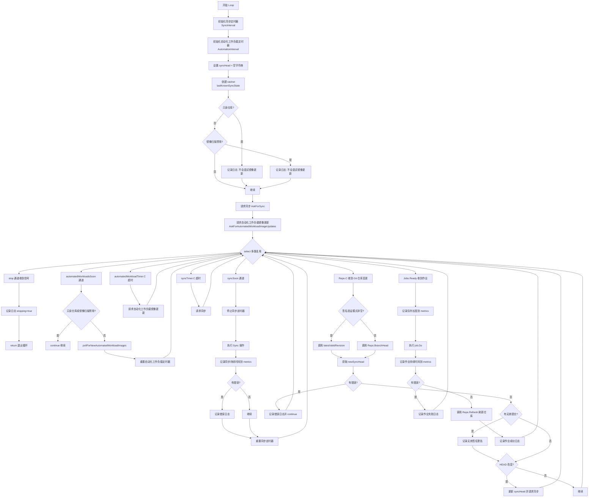

#### 带注释源码

```go
// Loop 是 Flux Daemon 的主事件循环，处理同步、镜像轮询、作业执行
// 参数：
//   - stop: 停止信号通道
//   - wg: WaitGroup，用于等待循环结束
//   - logger: 日志记录器
func (d *Daemon) Loop(stop chan struct{}, wg *sync.WaitGroup, logger log.Logger) {
	// 方法结束时通知 WaitGroup
	defer wg.Done()

	// 创建同步定时器，至少每 SyncInterval 时间触发一次同步
	// 作业完成或被触发时可能会提前触发
	syncTimer := time.NewTimer(d.SyncInterval)
	
	// 创建自动化工作负载定时器，用于定期检查控制器是否有新镜像可用
	automatedWorkloadTimer := time.NewTimer(d.AutomationInterval)

	// 记录当前已验证的 HEAD，用于判断仓库是否发生变化
	// 这样可以在镜像通知时判断是否需要同步，避免每次镜像刷新都同步
	syncHead := ""

	// 内存中的同步标签状态追踪器，用于记录上次同步的修订版本和资源
	ratchet := &lastKnownSyncState{logger: logger, state: d.SyncState}

	// 如果 Git 仓库是只读的，镜像更新会失败
	// 为了避免日志中重复出现失败记录，这里先记录一次警告
	if d.Repo.Readonly() {
		logger.Log("info", "Repo is read-only; no image updates will be attempted")
	}

	// 同理，如果注册表扫描被禁用，也不会尝试镜像更新
	if d.ImageScanDisabled {
		logger.Log("info", "Registry scanning is disabled; no image updates will be attempted")
	}

	// 启动时请求一次同步和自动化工作负载检查
	d.AskForSync()
	d.AskForAutomatedWorkloadImageUpdates()

	// 主事件循环，使用 select 多路复用多个通道
	for {
		select {
		// 1. 停止信号
		case <-stop:
			logger.Log("stopping", "true")
			return
		
		// 2. 收到自动化工作负载检查请求（可能是作业完成后触发）
		case <-d.automatedWorkloadsSoon:
			// 停止定时器，如果定时器已触发则清空其通道
			if !automatedWorkloadTimer.Stop() {
				select {
				case <-automatedWorkloadTimer.C:
				default:
				}
			}
			// 如果仓库只读或镜像扫描禁用，则跳过
			if d.Repo.Readonly() || d.ImageScanDisabled {
				continue
			}
			// 轮询新的自动化工作负载镜像
			d.pollForNewAutomatedWorkloadImages(logger)
			// 重置定时器
			automatedWorkloadTimer.Reset(d.AutomationInterval)
		
		// 3. 自动化工作负载定时器到期
		case <-automatedWorkloadTimer.C:
			d.AskForAutomatedWorkloadImageUpdates()
		
		// 4. 收到同步请求（可能是手动触发或作业完成后触发）
		case <-d.syncSoon:
			// 停止同步定时器
			if !syncTimer.Stop() {
				select {
				case <-syncTimer.C:
				default:
				}
			}
			// 执行同步
			started := time.Now().UTC()
			err := d.Sync(context.Background(), started, syncHead, ratchet)
			// 记录同步持续时间到 Prometheus metrics
			syncDuration.With(
				fluxmetrics.LabelSuccess, fmt.Sprint(err == nil),
			).Observe(time.Since(started).Seconds())
			if err != nil {
				logger.Log("err", err)
			}
			// 重置定时器
			syncTimer.Reset(d.SyncInterval)
		
		// 5. 同步定时器到期，自动触发同步
		case <-syncTimer.C:
			d.AskForSync()
		
		// 6. Git 仓库有新的变更（镜像轮询）
		case <-d.Repo.C:
			var newSyncHead string
			var invalidCommit git.Commit
			var err error

			// 创建带超时的上下文
			ctx, cancel := context.WithTimeout(context.Background(), d.GitTimeout)
			// 如果启用签名验证，获取最新有效修订版本
			if d.GitVerifySignaturesMode != fluxsync.VerifySignaturesModeNone {
				newSyncHead, invalidCommit, err = latestValidRevision(ctx, d.Repo, d.SyncState, d.GitVerifySignaturesMode)
			} else {
				newSyncHead, err = d.Repo.BranchHead(ctx)
			}
			cancel()

			if err != nil {
				logger.Log("url", d.Repo.Origin().SafeURL(), "err", err)
				continue
			}
			// 如果有无效提交，记录警告
			if invalidCommit.Revision != "" {
				logger.Log("err", "found invalid GPG signature for commit", "revision", invalidCommit.Revision, "key", invalidCommit.Signature.Key)
			}

			logger.Log("event", "refreshed", "url", d.Repo.Origin().SafeURL(), "branch", d.GitConfig.Branch, "HEAD", newSyncHead)
			// 如果 HEAD 发生变化，请求同步
			if newSyncHead != syncHead {
				syncHead = newSyncHead
				d.AskForSync()
			}
		
		// 7. 作业队列中有准备好的作业
		case job := <-d.Jobs.Ready():
			// 记录队列长度到 Prometheus metrics
			queueLength.Set(float64(d.Jobs.Len()))
			jobLogger := log.With(logger, "jobID", job.ID)
			jobLogger.Log("state", "in-progress")
			
			// 执行作业
			// 注意：成功的作业会推送提交到上游仓库，因此需要从上游拉取并同步集群
			start := time.Now()
			err := job.Do(jobLogger)
			// 记录作业持续时间到 Prometheus metrics
			jobDuration.With(
				fluxmetrics.LabelSuccess, fmt.Sprint(err == nil),
			).Observe(time.Since(start).Seconds())
			if err != nil {
				jobLogger.Log("state", "done", "success", "false", "err", err)
			} else {
				jobLogger.Log("state", "done", "success", "true")
				// 作业成功后刷新仓库
				ctx, cancel := context.WithTimeout(context.Background(), d.GitTimeout)
				err := d.Repo.Refresh(ctx)
				if err != nil {
					logger.Log("err", err)
				}
				cancel()
			}
		}
	}
}
```


### `LoopVars.ensureInit()`

初始化 LoopVars 实例的通道资源，利用 `sync.Once` 确保通道创建逻辑仅执行一次，防止重复初始化导致的资源浪费或潜在错误。

参数：
- 无

返回值：
- 无

#### 流程图

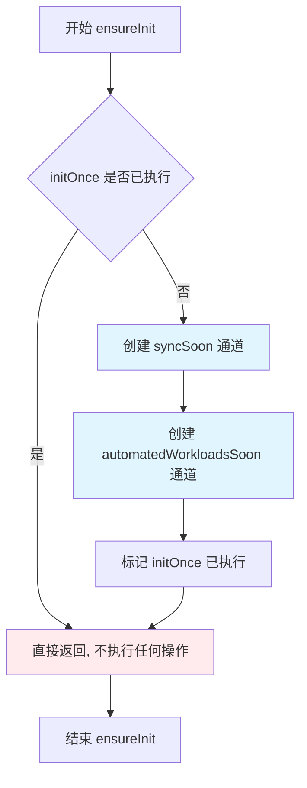

#### 带注释源码

```go
// ensureInit 使用 sync.Once 确保通道初始化仅执行一次
// 这是线程安全的初始化模式,适用于只需要初始化一次的资源
func (loop *LoopVars) ensureInit() {
	// initOnce 是 sync.Once 类型,保证以下函数仅被执行一次
	loop.initOnce.Do(func() {
		// 创建带缓冲的通道,缓冲大小为1
		// 这样可以容纳一个待处理的信号而不会阻塞发送者
		loop.syncSoon = make(chan struct{}, 1)
		
		// 另一个通道用于触发自动化工作负载的图像更新检查
		loop.automatedWorkloadsSoon = make(chan struct{}, 1)
	})
}
```


### `LoopVars.AskForSync`

请求同步操作。如果 `syncSoon` channel 中已有待处理的同步请求（channel 已满），则跳过此次请求；否则向 channel 发送一个空结构体以触发同步。

参数：无

返回值：无

#### 流程图

```mermaid
flowchart TD
    A[开始 AskForSync] --> B[调用 ensureInit 确保初始化]
    B --> C{尝试向 syncSoon 发送信号}
    C -->|发送成功 channel 未满| D[发送 struct{}{} 到 channel]
    C -->|channel 已满 有待处理请求| E[执行 default 分支 跳过]
    D --> F[结束]
    E --> F
```

#### 带注释源码

```go
// AskForSync 请求一次同步。
// 如果已经有一个同步请求在等待处理（即 syncSoon channel 已满），
// 则该方法不会做任何事情，避免重复触发同步。
// 否则，它会向 syncSoon channel 发送一个空结构体来触发同步。
func (d *LoopVars) AskForSync() {
	// 1. 确保 LoopVars 的 channel 已初始化（只执行一次）
	d.ensureInit()
	
	// 2. 尝试非阻塞地向 syncSoon channel 发送信号
	select {
	case d.syncSoon <- struct{}{}:
		// 发送成功：channel 之前为空，此时已有一个待处理的同步请求
	default:
		// default 分支：如果 channel 已满（有待处理的同步请求），则跳过
		// 这样可以防止在同步正在进行时堆积额外的同步请求
	}
}
```


### `LoopVars.AskForAutomatedWorkloadImageUpdates`

请求自动化工作负载镜像更新，如果通道中已有待处理的请求则跳过，避免重复触发。

参数：无

返回值：无返回值

#### 流程图

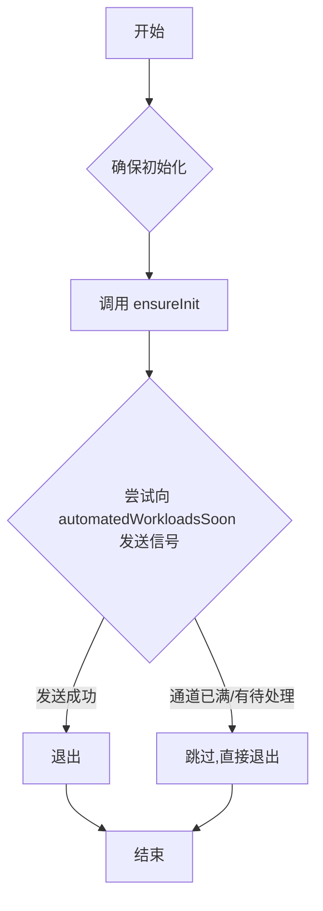

#### 带注释源码

```go
// AskForAnAutomatedWorkloadImageUpdates 请求自动化工作负载镜像更新
// 如果通道中已有待处理的请求（即非阻塞发送失败），则直接跳过
// 这确保了不会堆积多个重复的更新请求
func (d *LoopVars) AskForAutomatedWorkloadImageUpdates() {
    // 确保通道已初始化（sync.Once 保证只执行一次）
	d.ensureInit()
    
    // 尝试非阻塞地向通道发送信号
    // 如果通道有缓冲空间且无接收者等待，发送成功
    // 否则（default分支）直接跳过，不阻塞当前流程
	select {
	case d.automatedWorkloadsSoon <- struct{}{}:
	default:
	}
}
```


### `lastKnownSyncState.CurrentRevision`

获取当前持久化的修订版本（Revision）。该方法封装了对底层同步状态（fluxsync.State）的查询操作，返回当前已记录的 Git 提交哈希值，用于判断是否需要执行同步操作。

参数：

- `ctx`：`context.Context`，上下文对象，用于控制请求的截止时间和取消操作

返回值：`string, error`：
- `string`：当前持久化的修订版本号（Git commit SHA）
- `error`：获取修订版本时发生的错误（如底层状态存储不可用或查询失败）

#### 流程图

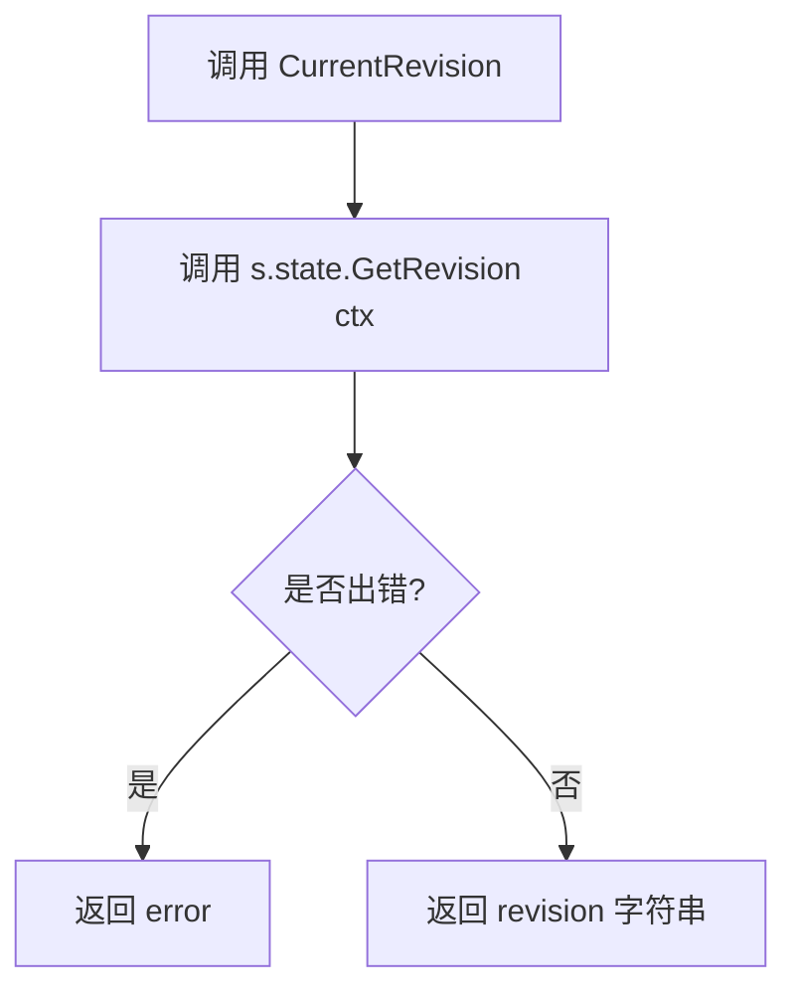

#### 带注释源码

```go
// CurrentRevision returns the revision from the state
// CurrentRevision 返回当前状态中存储的修订版本
func (s *lastKnownSyncState) CurrentRevision(ctx context.Context) (string, error) {
    // 委托给底层 fluxsync.State 接口的 GetRevision 方法
    // s.state 是 fluxsync.State 类型，封装了持久化存储的同步状态
    return s.state.GetRevision(ctx)
}
```

---

#### 补充说明

**所属类信息**：

- **类名**：`lastKnownSyncState`
- **类定义位置**：代码文件中的 `// -- internals to keep track of sync tag and resources state` 注释下方
- **类字段**：
  - `logger log.Logger`：日志记录器
  - `state fluxsync.State`：持久化同步状态接口
  - `revision string`：内存中缓存的当前修订版本
  - `resources map[string]resource.Resource`：当前已同步的资源映射
  - `warnedAboutChange bool`：标记是否已警告过外部变更

**方法关系**：

- `CurrentRevision` 方法被 `Loop` 函数中的 `latestValidRevision` 调用，用于获取本地记录的同步状态
- 与 `Update` 方法配合使用：`Update` 负责更新持久化状态，而 `CurrentRevision` 用于查询当前状态


### `lastKnownSyncState.CurrentResources`

该方法用于获取当前同步的资源映射。如果状态尚未初始化（即 `Update()` 方法尚未被调用），则返回 `nil`。

参数： 无

返回值：`map[string]resource.Resource`，获取当前同步的资源，如果未初始化则返回 `nil`

#### 流程图

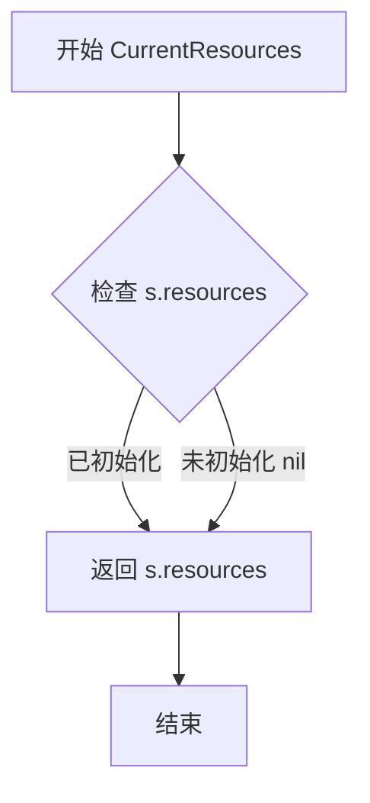

#### 带注释源码

```go
// CurrentResources returns the synced resources from the state.
// If the state is not initialized (i.e. `Update()` has not been called yet), the returned value
// will be `nil`.
// CurrentResources 返回当前同步的资源。
// 如果状态未初始化（即尚未调用 Update()），则返回值为 nil。
func (s *lastKnownSyncState) CurrentResources() map[string]resource.Resource {
	return s.resources
}
```


### `lastKnownSyncState.Update`

该方法用于更新同步状态记录，检查是否存在外部变更（如其他 Flux 实例修改了同步标签），并在状态实际发生变化时返回 true。如果新旧版本号相同或更新持久化存储失败，则返回相应的结果。

参数：

- `ctx`：`context.Context`，用于控制请求的截止时间和取消操作
- `oldRev`：`string`，调用方记录的旧修订版本号，用于检测并发冲突
- `newRev`：`string`，新的修订版本号，即本次同步到的 Git commit SHA
- `resources`：`map[string]resource.Resource`，当前同步的资源清单，以资源名称为键

返回值：`bool, error`，第一个 bool 值表示同步状态是否实际发生变化（即 newRev 与之前记录的版本不一致），第二个 error 值表示更新持久化状态时可能出现的错误。

#### 流程图

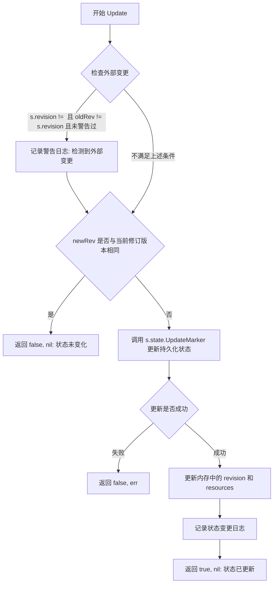

#### 带注释源码

```go
// Update records the synced revision in persistent storage (the
// sync.State). In addition, it checks that the old revision matches
// the last sync revision before making the update; mismatches suggest
// multiple Flux daemons are using the same state, so we log these.
func (s *lastKnownSyncState) Update(ctx context.Context, oldRev, newRev string, resources map[string]resource.Resource) (bool, error) {
	// 检查是否有其他 Flux 实例（非当前实例）修改了同步标签。
	// 这通常是因为多个实例共享同一个同步标签导致的。
	// 多个实例竞争同一标签可能导致 Flux 遗漏清单变更。
	if s.revision != "" && oldRev != s.revision && !s.warnedAboutChange {
		s.logger.Log("warning",
			"detected external change in sync state; the sync state should not be shared by fluxd instances",
			"state", s.state.String())
		s.warnedAboutChange = true
	}

	// 判断同步状态是否真的发生了变化
	// 如果新修订版本号与当前记录的版本号相同，则无需更新
	if s.revision == newRev {
		return false, nil
	}

	// 尝试在持久化存储中更新同步标签
	if err := s.state.UpdateMarker(ctx, newRev); err != nil {
		return false, err
	}

	// 更新内存中的修订版本号和资源清单
	s.revision = newRev
	s.resources = resources

	// 记录状态变更日志，便于调试和审计
	s.logger.Log("state", s.state.String(), "old", oldRev, "new", newRev)
	return true, nil
}
```

## 关键组件


### 一段话描述

该代码是Flux CD守护进程的核心循环模块，负责协调Git仓库同步、自动化镜像更新和集群状态同步，通过事件驱动的select多路复用机制实现定时同步、手动触发、Git仓库变更检测和任务队列处理等功能。

### 文件的整体运行流程

1. **初始化阶段**：创建LoopVars实例，初始化同步计时器和自动化工作负载计时器
2. **事件监听阶段**：主循环通过select监听6种事件：停止信号、自动化工作负载触发、自动化计时器到期、同步触发、同步计时器到期、Git仓库变更通知
3. **处理分支**：
   - 收到停止信号则退出循环
   - 自动化工作负载事件：轮询新镜像并重置计时器
   - 同步事件：执行Sync操作并记录指标
   - Git仓库变更：获取最新HEAD并判断是否需要触发同步
   - 任务队列事件：执行任务并在成功后刷新仓库

### 类的详细信息

#### LoopVars 结构体

**字段**：

| 名称 | 类型 | 描述 |
|------|------|------|
| SyncInterval | time.Duration | 同步操作的最大间隔时间 |
| SyncTimeout | time.Duration | 同步操作的超时时间 |
| AutomationInterval | time.Duration | 自动化工作负载镜像检查间隔 |
| GitTimeout | time.Duration | Git操作的超时时间 |
| GitVerifySignaturesMode | fluxsync.VerifySignaturesMode | Git提交签名验证模式 |
| SyncState | fluxsync.State | 同步状态持久化存储 |
| ImageScanDisabled | bool | 是否禁用镜像扫描 |
| initOnce | sync.Once | 确保初始化只执行一次 |
| syncSoon | chan struct{} | 同步请求通道 |
| automatedWorkloadsSoon | chan struct{} | 自动化工作负载更新通道 |

**方法**：

##### ensureInit

```go
func (loop *LoopVars) ensureInit()
```

| 项目 | 详情 |
|------|------|
| 参数 | 无 |
| 返回值 | 无 |
| 描述 | 延迟初始化通道，确保线程安全的一次性初始化 |
| 流程图 | ```mermaid\nflowchart TD\n    A[ensureInit] --> B{initOnce已完成?}\n    B -->|否| C[创建syncSoon通道]\n    B -->|是| D[不做任何操作]\n    C --> E[创建automatedWorkloadsSoon通道]\n``` |

##### AskForSync

```go
func (d *LoopVars) AskForSync()
```

| 项目 | 详情 |
|------|------|
| 参数 | 无 |
| 返回值 | 无 |
| 描述 | 请求同步操作，非阻塞发送信号到syncSoon通道 |
| 流程图 | ```mermaid\nflowchart TD\n    A[AskForSync] --> B[ensureInit]\n    B --> C{通道已满?}\n    C -->|否| D[发送空结构体到syncSoon]\n    C -->|是| E[忽略]\n``` |

##### AskForAutomatedWorkloadImageUpdates

```go
func (d *LoopVars) AskForAutomatedWorkloadImageUpdates()
```

| 项目 | 详情 |
|------|------|
| 参数 | 无 |
| 返回值 | 无 |
| 描述 | 请求自动化工作负载镜像更新，非阻塞发送信号 |

---

#### Daemon 结构体

（代码中引用但未完整定义，主要使用其字段）

**字段**：

| 名称 | 类型 | 描述 |
|------|------|------|
| Repo | git.Repo | Git仓库接口 |
| Jobs | JobQueue | 任务队列 |
| SyncInterval | time.Duration | 同步间隔 |
| AutomationInterval | time.Duration | 自动化间隔 |
| GitTimeout | time.Duration | Git超时 |
| GitVerifySignaturesMode | fluxsync.VerifySignaturesMode | 签名验证模式 |
| SyncState | fluxsync.State | 同步状态 |
| ImageScanDisabled | bool | 镜像扫描禁用标志 |

---

#### lastKnownSyncState 结构体

**字段**：

| 名称 | 类型 | 描述 |
|------|------|------|
| logger | log.Logger | 日志记录器 |
| state | fluxsync.State | 持久化同步状态 |
| revision | string | 当前已知的同步修订版本 |
| resources | map[string]resource.Resource | 当前同步的资源映射 |
| warnedAboutChange | bool | 是否已警告外部变更标志 |

**方法**：

##### CurrentRevision

```go
func (s *lastKnownSyncState) CurrentRevision(ctx context.Context) (string, error)
```

| 项目 | 详情 |
|------|------|
| 参数 | ctx: context.Context - 上下文 |
| 返回值 | string, error - 当前修订版本和错误 |
| 描述 | 从持久化状态中获取当前同步的修订版本 |

##### CurrentResources

```go
func (s *lastKnownSyncState) CurrentResources() map[string]resource.Resource
```

| 项目 | 详情 |
|------|------|
| 参数 | 无 |
| 返回值 | map[string]resource.Resource - 资源映射，可能为nil |
| 描述 | 返回内存中当前同步的资源，如果未初始化则返回nil |

##### Update

```go
func (s *lastKnownSyncState) Update(ctx context.Context, oldRev, newRev string, resources map[string]resource.Resource) (bool, error)
```

| 项目 | 详情 |
|------|------|
| 参数 | ctx: context.Context - 上下文<br>oldRev: string - 旧修订版本<br>newRev: string - 新修订版本<br>resources: map[string]resource.Resource - 资源映射 |
| 返回值 | bool - 是否实际发生更新<br>error - 操作错误 |
| 描述 | 记录同步修订版本到持久化存储，检查旧版本是否匹配以检测多实例冲突 |
| 流程图 | ```mermaid\nflowchart TD\n    A[Update] --> B{外部变更检测}\n    B -->|s.revision非空且oldRev不匹配| C[记录警告日志]\n    B -->|否则| D{newRev等于s.revision?}\n    D -->|是| E[返回false, nil]\n    D -->|否| F[调用state.UpdateMarker]\n    F --> G{更新成功?}\n    G -->|否| H[返回false, 错误]\n    G -->|是| I[更新内存状态]\n    I --> J[返回true, nil]\n``` |

---

#### Loop 方法

```go
func (d *Daemon) Loop(stop chan struct{}, wg *sync.WaitGroup, logger log.Logger)
```

| 项目 | 详情 |
|------|------|
| 参数 | stop: chan struct{} - 停止信号通道<br>wg: *sync.WaitGroup - 等待组<br>logger: log.Logger - 日志记录器 |
| 返回值 | 无 |
| 描述 | 主事件循环，监听多种事件源并协调同步与镜像更新操作 |
| 流程图 | ```mermaid\nflowchart TD\n    A[Loop启动] --> B[初始化计时器]\n    B --> C[初始化ratchet状态]\n    C --> D[检查只读仓库和镜像扫描]\n    D --> E[触发初始同步请求]\n    E --> F{select多路复用}\n    F -->|stop| G[退出循环]\n    F -->|automatedWorkloadsSoon| H[处理自动化工作负载]\n    F -->|automatedWorkloadTimer| I[请求镜像更新]\n    F -->|syncSoon| J[执行同步]\n    F -->|syncTimer| K[请求同步]\n    F -->|Repo.C| L[处理Git仓库变更]\n    F -->|Jobs.Ready| M[执行任务]\n``` |

---

### 关键组件信息

### Loop 主事件循环

协调所有同步操作的核心组件，通过select语句实现多路事件监听，包括手动触发、定时触发、Git仓库推送通知和任务队列处理。

### LoopVars 循环变量容器

封装同步配置参数和事件通道的结构体，提供线程安全的延迟初始化和请求触发方法。

### lastKnownSyncState 同步状态跟踪器

维护内存中的同步修订版本和资源状态，检测外部变更并防止多实例冲突，同时提供与持久化状态交互的接口。

### AskForSync/AskForAutomatedWorkloadImageUpdates 请求触发器

非阻塞式请求机制，使用带缓冲通道和select实现"取清"模式，避免重复触发。

### syncHead 与 ratchet 状态管理

syncHead跟踪已验证的Git HEAD，ratchet维护同步状态机，用于判断是否需要执行同步操作。

---

### 潜在的技术债务或优化空间

1. **计时器资源泄漏风险**：代码中多次使用`timer.Stop()`后需要处理C通道的潜在泄漏，在`automatedWorkloadTimer`和`syncTimer`的处理中需要额外消费C通道，尽管使用了select处理但逻辑可以封装

2. **错误处理不统一**：部分错误仅记录日志后`continue`，可能导致关键错误被忽略，建议增加重试机制或告警

3. **上下文超时重复创建**：在Git仓库变更处理中创建新的context和cancel，建议提取为方法级复用

4. **指标标签设计**：使用`fmt.Sprint(err == nil)`字符串化布尔值不够规范，应使用fluxmetrics提供的常量

5. **缺少健康检查接口**：Loop方法没有暴露健康状态或就绪状态的外部检查点

6. **日志冗余**：部分日志如"Repo is read-only"只在启动时输出一次，如果状态动态变化可能不会感知

---

### 其它项目

#### 设计目标与约束

- **最小同步间隔保障**：通过`syncTimer`确保定期同步，避免依赖外部事件
- **只读仓库兼容**：明确处理只读仓库场景，避免无效的镜像更新尝试
- **多实例冲突检测**：通过ratchet机制检测其他Flux实例对同一状态的修改
- **非阻塞触发**：使用通道缓冲机制确保请求不会被阻塞

#### 错误处理与异常设计

- Git操作超时使用context.WithTimeout控制
- 签名验证失败仅记录警告，不阻止同步流程
- 任务执行失败记录错误但继续处理其他任务
- 外部状态变更检测到后记录警告但不阻塞更新

#### 数据流与状态机

- **状态流**：Git Repo → syncHead验证 → Sync调用 → ratchet.Update → 持久化State
- **镜像更新流**：Timer/手动触发 → pollForNewImages → 更新Git仓库 → 触发Sync
- **任务流**：Job队列 → 执行 → 成功则Refresh仓库 → 触发Sync

#### 外部依赖与接口契约

- **git.Repo**：提供BranchHead、Refresh、C事件通道等Git操作接口
- **fluxsync.State**：同步状态持久化接口，包含GetRevision、UpdateMarker方法
- **fluxsync.VerifySignaturesMode**：签名验证模式枚举
- **fluxmetrics**：Prometheus指标暴露
- **resource.Resource**：Kubernetes资源抽象

#### 并发安全考虑

- sync.Once保证通道只初始化一次
- 通道带缓冲(1)实现非阻塞"取清"语义
- 计时器停止需要额外处理C通道防止泄漏


## 问题及建议


### 已知问题

- **上下文超时后未保证取消**：在处理 `d.Repo.C` 事件时，使用 `cancel()` 函数但未使用 `defer cancel()`，如果中间发生 panic，cancel 不会被调用，可能导致资源泄漏
- **计时器资源未显式清理**：`syncTimer` 和 `automatedWorkloadTimer` 使用 `time.NewTimer()` 创建，当 Loop 函数提前退出时（除正常 return 外），计时器资源可能未被释放
- **非阻塞通道发送无反馈**：`AskForSync()` 和 `AskForAutomatedWorkloadImageUpdates()` 中使用非阻塞发送（`select` + `default`），当通道已满时消息被静默丢弃，无日志记录可能导致调试困难
- **上下文传播不一致**：部分地方使用 `context.Background()` 创建新上下文，而非从传入的 `ctx` 派生，破坏了调用链的上下文传递
- **计时器 Stop 后未处理 C 通道**：在调用 `syncTimer.Stop()` 和 `automatedWorkloadTimer.Stop()` 后，虽然消费了 `C` 通道以避免泄漏，但这种模式在多个地方重复，代码复用性差
- **错误处理策略不统一**：部分错误仅记录日志后 `continue`，部分错误记录后有额外操作（如刷新仓库），缺乏一致性的错误恢复策略
- **指标标签值非标准**：`fmt.Sprint(err == nil)` 生成的是 "true"/"false" 字符串，但 metrics 标签通常期望小写或特定格式，可能导致聚合问题
- **潜在竞态条件**：`lastKnownSyncState.Update()` 方法中先检查 `oldRev != s.revision`，然后调用 `s.state.UpdateMarker()`，这两步之间没有锁保护，可能被其他 goroutine 干扰
- **硬编码字符串**：日志中多处使用硬编码字符串（如 "stopping", "true", "state" 等），应提取为常量以提高可维护性
- **缺失的作业重试机制**：`job.Do()` 执行失败后仅记录错误，没有重试逻辑或死信队列处理，可能导致任务永久丢失

### 优化建议

- 在所有超时上下文创建处使用 `defer cancel()`，确保资源释放
- 考虑使用 `sync.Once` 包装计时器的创建和清理，或改用 `time.NewTicker` 并在退出时调用 `Stop()`
- 在非阻塞发送失败时添加日志或指标，记录丢弃的请求
- 统一使用 `context.WithTimeout(ctx, ...)` 派生超时上下文，保持上下文链路
- 提取日志键值和状态字符串为常量包，避免魔法字符串
- 考虑为 `lastKnownSyncState` 添加互斥锁或使用原子操作保护共享状态
- 对关键作业实现重试机制或失败队列，并添加超时控制
- 统一错误处理策略，定义错误严重级别并相应处理（如区分可重试和不可重试错误）

## 其它


### 设计目标与约束

本代码是Flux CD项目中Flux守护进程的核心循环实现，负责协调Git仓库与Kubernetes集群之间的同步。设计目标包括：1）定期同步Git仓库中的清单到集群；2）检测并应用自动化工作负载的镜像更新；3）处理Git仓库变更通知；4）管理同步状态并防止并发冲突。约束条件包括：只读仓库不执行镜像更新、镜像扫描可被禁用、Git签名验证模式可配置、同步状态不支持多实例共享。

### 错误处理与异常设计

错误处理策略采用分层设计：1）循环内的select语句使用continue跳过本次循环继续处理下一个事件，避免单个错误阻塞整个循环；2）Sync方法和Job执行返回的错误会被记录但不影响主循环继续；3）Git操作使用context.WithTimeout设置超时，超时后context取消操作；4）lastKnownSyncState的Update方法检测外部状态变更并记录警告；5）Timer处理使用Stop和drain机制防止goroutine泄漏。

### 数据流与状态机

主循环是一个基于select的多路复用状态机，包含6个主要状态分支：1）stop通道-退出循环；2）automatedWorkloadsSoon通道-触发自动化工作负载镜像轮询；3）automatedWorkloadTimer定时器-周期请求镜像更新；4）syncSoon通道-执行同步操作；5）syncTimer定时器-周期请求同步；6）Repo.C通道-处理Git仓库变更事件；7）Jobs.Ready通道-处理就绪的同步作业。状态转换通过ratchet（lastKnownSyncState）记录当前同步的revision和resources，实现同步状态的持久化和内存缓存。

### 外部依赖与接口契约

主要外部依赖包括：1）github.com/go-kit/kit/log - 日志记录接口；2）github.com/fluxcd/flux/pkg/git - Git仓库操作接口，包括BranchHead、Refresh方法；3）github.com/fluxcd/flux/pkg/metrics - Prometheus指标暴露；4）github.com/fluxcd/flux/pkg/resource - Kubernetes资源抽象；5）github.com/fluxcd/flux/pkg/sync - 同步状态管理接口。关键接口契约：Daemon结构体需包含SyncInterval、AutomationInterval、GitTimeout、GitVerifySignaturesMode、SyncState、ImageScanDisabled、Repo、Jobs、GitConfig等字段；Loop方法接收stop通道和WaitGroup用于生命周期管理。

### 并发模型与线程安全

并发设计要点：1）LoopVars使用sync.Once确保syncSoon和automatedWorkloadsSoon通道只初始化一次；2）AskForSync和AskForAutomatedWorkloadImageUpdates使用非阻塞发送（select+default）实现"请求合并"功能，避免重复触发；3）lastKnownSyncState的revision和resources字段无锁保护，假定只从主循环goroutine访问；4）Timer使用Stop方法尝试停止，如果失败则drain通道避免泄漏；5）WaitGroup用于协调主goroutine退出。

### 配置与可观测性

配置通过LoopVars结构体注入：SyncInterval（同步间隔）、SyncTimeout（同步超时）、AutomationInterval（自动化检查间隔）、GitTimeout（Git操作超时）、GitVerifySignaturesMode（GPG签名验证模式）、SyncState（持久化同步状态）、ImageScanDisabled（禁用镜像扫描）。可观测性包括：1）syncDuration和jobDuration两个Histogram指标记录操作耗时；2）queueLengthGauge指标记录作业队列长度；3）日志记录关键事件包括start、stop、refresh、job state变更、错误信息。

### 资源管理与生命周期

资源管理策略：1）time.Timer在循环开始时创建，函数退出时自动销毁；2）context.WithTimeout在每次Git操作时创建，超时或操作完成后调用cancel释放；3）sync.Once保证通道只创建一次；4）defer wg.Done()确保WaitGroup计数正确递减。生命周期：Loop方法在stop通道关闭或return时结束，函数退出前会执行defer的wg.Done()通知WaitGroup。

    