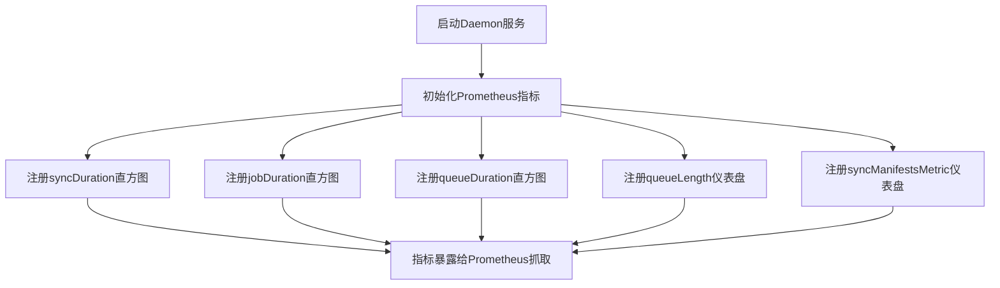

# `flux\pkg\daemon\metrics.go` 详细设计文档

该文件定义了Flux CD守护进程的Prometheus监控指标，用于追踪Git到集群同步、作业执行和队列等待的性能指标，包括同步持续时间、作业持续时间、队列等待时间和队列长度等关键运维指标。

## 整体流程



## 类结构

```
Go Package: daemon (无类定义)
└── 全局变量声明区
    ├── syncDuration (Histogram)
    ├── jobDuration (Histogram)
    ├── queueDuration (Histogram)
    ├── queueLength (Gauge)
    └── syncManifestsMetric (Gauge)
```

## 全局变量及字段


### `syncDuration`
    
Histogram metric measuring the duration of git-to-cluster synchronization in seconds, with buckets for various sync times.

类型：`prometheus.Histogram`
    


### `jobDuration`
    
Histogram metric measuring the duration of job execution in seconds, with buckets for various job execution times.

类型：`prometheus.Histogram`
    


### `queueDuration`
    
Histogram metric measuring the duration of time jobs spend waiting in the queue before execution, in seconds.

类型：`prometheus.Histogram`
    


### `queueLength`
    
Gauge metric representing the count of jobs currently waiting in the queue to be processed.

类型：`prometheus.Gauge`
    


### `syncManifestsMetric`
    
Gauge metric tracking the number of manifests that have been synchronized.

类型：`prometheus.Gauge`
    


    

## 全局函数及方法


## 关键组件


### syncDuration (同步持续时间指标)

用于记录Git到集群同步操作的持续时间，以秒为单位。采用直方图类型，包含多个bucket用于统计不同时间范围的同步操作。

### jobDuration (作业执行持续时间指标)

用于记录作业执行的持续时间，以秒为单位。采用直方图类型，用于监控Flux daemon中作业的处理性能。

### queueDuration (排队等待时间指标)

用于记录作业在队列中等待执行的时间，以秒为单位。采用直方图类型，帮助识别作业调度瓶颈。

### queueLength (队列长度指标)

用于记录当前等待执行的作业数量。采用Gauge类型，提供实时队列负载监控。

### syncManifestsMetric (清单同步指标)

用于记录已同步的清单数量。采用Gauge类型，支持按成功/失败标签区分，用于监控同步操作的成功率。


## 问题及建议


### 已知问题

-   **指标命名不一致**：`queueDuration`和`queueLength`使用了空标签切片`[]string{}`，而其他指标使用了`[]string{fluxmetrics.LabelSuccess}`标签，破坏了标签使用的一致性
-   **重复的Bucket定义**：`jobDuration`和`queueDuration`使用了完全相同的bucket数组`[]float64{0.1, 0.5, 1, 2, 5, 10, 15, 20, 30, 45, 60, 120}`，造成代码重复
-   **硬编码的指标配置**：所有bucket值、命名空间"flux"、子系统"daemon"都是硬编码的，缺乏配置化机制，修改时需要改动源码
-   **缺少错误处理指标**：没有定义错误率、失败次数等相关指标，无法监控同步或任务执行失败的情况
-   **Magic Numbers**：Bucket中的具体数值（如0.5, 5, 120等）缺乏注释说明，难以理解设计依据
-   **包级全局变量风险**：所有指标都定义为包级变量，没有提供初始化验证和清理机制，可能导致未预期的副作用

### 优化建议

-   **提取公共常量和配置**：将命名空间、子系统、重复的bucket数组提取为包级常量，提高可维护性
-   **统一标签策略**：为所有指标添加一致的标签集合，或明确定义哪些指标不需要标签的原因
-   **增强指标覆盖**：添加错误计数指标（如`syncErrors`、`jobErrors`）、重试次数指标、队列溢出指标等
-   **配置化改造**：考虑通过参数或配置文件方式传入指标配置，支持运行时调整
-   **添加指标初始化验证**：在包初始化函数中验证指标注册是否成功，记录警告日志
-   **完善文档注释**：为每个bucket值添加注释说明其选择依据，增强代码可读性


## 其它


### 设计目标与约束

本代码模块的设计目标是为FluxCD daemon提供完整的性能监控指标体系，用于实时追踪同步操作、作业执行和队列处理的性能表现。设计约束包括：指标命名遵循Prometheus最佳实践，采用`flux_daemon_`前缀；Histogram buckets根据实际业务场景（100个资源的同步操作通常需要30秒到1分钟）精心设计；所有指标必须与FluxCD现有的metrics框架兼容。

### 错误处理与异常设计

由于本模块仅定义指标变量，不涉及实际的业务逻辑处理，因此错误处理主要体现在指标初始化阶段。当Prometheus指标创建失败时（如配置错误或注册冲突），Go程序启动时会产生panic。设计建议：应在package初始化时添加recover机制以捕获潜在风险；指标标签值必须严格遵守LabelSuccess定义，避免出现nil或空字符串导致指标数据无效。

### 数据流与状态机

本模块定义的是只读指标数据源，不涉及复杂的状态机转换。数据流路径为：业务逻辑触发指标观察点 → 调用对应指标对象的Observe/Inc/Dec方法 → Prometheus客户端库采集 → HTTP端点暴露。queueLength指标存在隐式状态依赖：当daemon重启时队列长度归零，但实际集群状态可能存在未同步的变更，设计时需考虑状态一致性。

### 外部依赖与接口契约

主要依赖包括：github.com/go-kit/kit/metrics/prometheus（指标封装）、github.com/prometheus/client_golang/prometheus（Prometheus原语）、github.com/fluxcd/flux/pkg/metrics（Flux标准标签定义）。接口契约方面：所有Histogram指标接受float64类型的观察值；Gauge指标接受float64类型的增减量；LabelSuccess标签必须使用fluxmetrics包定义的常量值。

### 性能考虑与优化空间

当前设计采用全局变量初始化，在package加载时即完成所有指标注册。优化建议：对于syncDuration和jobDuration，可以考虑添加更多业务维度标签（如repository名称、cluster名称）以提供更细粒度的监控能力；queueLength可以增加时间序列注解，记录队列长度变化的精确时间戳；可添加总结性指标（Summary）用于计算P99延迟。

### 安全考虑

当前代码不涉及敏感数据处理，但指标数据可能泄露系统运行状态。安全建议：确保Prometheus端点访问控制；敏感操作的指标应避免记录具体资源标识；考虑添加指标数据脱敏机制。

### 配置说明

本模块无显式配置接口，指标参数（buckets、labels、namespace）在代码中硬编码。建议将关键参数抽取至配置文件：Bucket边界值应根据实际负载特征调整；subsystem名称支持多实例区分；LabelSuccess的布尔值含义需在文档中明确（true表示成功，false表示失败）。

### 测试策略

测试重点应包括：指标注册完整性测试（验证所有指标正确注册到default registry）；Label值合规性测试；Buckets配置正确性验证；多实例场景下的指标冲突测试。建议编写单元测试模拟指标观察调用，验证数据收集正确性。

### 部署与运维指南

部署时需确保Prometheus服务可访问`/metrics`端点；建议配置抓取间隔为15-60秒以平衡精度和开销；运维关注点：queue_length持续增长可能表示daemon处理能力不足；sync_duration的P99值超过120秒需告警；job_duration异常增长可能表示Git操作受阻。


    