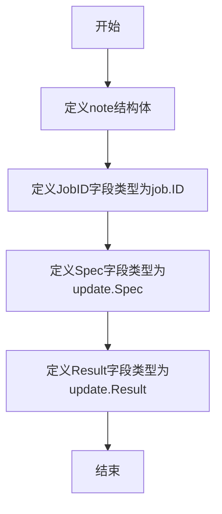

# `flux\pkg\daemon\note.go` 详细设计文档

这是一个FluxCD daemon包中的数据结构定义文件，定义了一个名为note的结构体，用于封装任务执行的相关信息，包括任务ID(update.JobID)、更新规范(update.Spec)和更新结果(update.Result)，通常用于在daemon进程中记录或传递任务的状态和结果数据。

## 整体流程



## 类结构

```
daemon package
└── note (结构体/数据模型)
```

## 全局变量及字段


### `note`
    
任务数据结构，包含任务ID、更新规范和更新结果，用于在守护进程中传递任务信息

类型：`struct`
    


### `note.JobID`
    
任务唯一标识符，用于跟踪和识别具体的任务

类型：`job.ID`
    


### `note.Spec`
    
更新规范，定义了该任务的具体更新操作内容

类型：`update.Spec`
    


### `note.Result`
    
更新结果，包含任务执行后的返回数据和状态

类型：`update.Result`
    
    

## 全局函数及方法


## 关键组件


### note 结构体

一个用于封装任务执行结果的数据结构，包含任务ID、更新规范和更新结果三个核心字段，用于在daemon进程间传递任务状态信息。

### JobID 字段

任务唯一标识符，类型为job.ID，用于追踪和关联特定的任务执行实例。

### Spec 字段

更新规范，类型为update.Spec，定义了需要执行的更新操作的具体内容和参数。

### Result 字段

更新结果，类型为update.Result，存储任务执行后的返回数据和状态信息。


## 问题及建议


### 已知问题

- 缺少结构体和字段的文档注释，降低了代码可读性和可维护性
- 结构体为未导出（小写开头），限制了包外的使用灵活性
- 字段缺乏验证逻辑，JobID、Spec、Result 可能为空值或无效值
- 缺少构造函数，无法确保对象创建时的有效状态
- 结构体直接依赖外部具体类型（job.ID、update.Spec、update.Result），导致紧耦合
- 缺少时间戳字段（如创建时间、更新时间），无法追踪任务状态变更历史
- 缺少错误状态字段，无法记录和传播错误信息
- 缺少元数据字段，扩展性受限

### 优化建议

- 添加结构体和字段的文档注释
- 考虑根据使用场景决定是否导出结构体（首字母大写）
- 实现构造函数 NewNote 并在内部进行字段验证
- 考虑引入接口以解耦对外部类型的直接依赖
- 添加时间相关字段（如 CreatedAt、UpdatedAt）
- 添加 Status 或 Error 字段以支持错误处理
- 添加 Metadata 字段以支持扩展性

## 其它


### 设计目标与约束

note结构体的设计目标是作为daemon内部的任务记录载体，用于封装作业的唯一标识、执行规范和执行结果。其约束包括：JobID必须全局唯一，Spec和Result必须可序列化（JSON格式），且该结构体为值类型而非指针类型，适合直接传递和存储。

### 错误处理与异常设计

由于note结构体本身为纯数据容器，不包含业务逻辑，因此错误处理不在结构体层面体现。调用方在构造note实例时需确保JobID有效、Spec和Result不为nil（若为nil则序列化时可能产生空值）。建议在创建note前对update.Spec和update.Result进行空值检查，避免运行时panic。

### 数据流与状态机

note结构体在数据流中处于"结果记录"节点：daemon接收外部更新请求 → 创建job.ID → 生成update.Spec → 执行更新操作 → 产出update.Result → 组装为note结构体 → 可能写入存储或发送给订阅者。该结构体本身不涉及状态机逻辑，仅作为数据传递的载体。

### 外部依赖与接口契约

note结构体直接依赖两个外部包：github.com/fluxcd/flux/pkg/job（提供job.ID类型）和github.com/fluxcd/flux/pkg/update（提供update.Spec和update.Result类型）。这两个依赖的类型需满足JSON序列化能力（通过struct tag `json:"..."`实现）。调用方需确保传入的Spec和Result实现了json.Marshaler接口或为标准可序列化类型。

### 并发安全性

note结构体本身为值类型，非指针，在Go中值类型的传递和赋值默认是线程安全的（因为是值拷贝）。但若多个goroutine共享同一个note实例的引用（如指针），则需自行保证并发安全。daemon层面应避免在note创建后对其进行并发修改。

### 序列化与反序列化

note结构体通过JSON tags定义了序列化字段：jobID序列化为"jobID"，Spec序列化为"spec"，Result序列化为"result"。序列化时使用标准encoding/json包，无需实现自定义MarshalJSON。调用方可通过json.Unmarshal将JSON数据反序列化为note实例，反序列化时job.ID、update.Spec、update.Result需在对应包中实现UnmarshalJSON或支持默认JSON解析。

### 使用场景与示例

note结构体典型使用场景包括：daemon执行完自动同步或手动更新操作后，将作业ID、规范和结果记录下来，用于后续查询或日志输出。示例：创建一个note实例 `n := note{JobID: "abc123", Spec: spec, Result: result}`，然后序列化为JSON存储或发送。

### 测试策略

由于note结构体极其简单，单元测试重点关注JSON序列化/反序列化正确性、字段tag映射是否正确、空值处理是否合理。建议编写测试用例验证：正常数据序列化、空Spec或空Result的序列化、与job.ID/update包类型集成时的兼容性。

    