# `flux\pkg\daemon\sync.go` 详细设计文档

Flux CD守护进程的核心同步模块，负责将Git仓库中的配置变更同步到Kubernetes集群，包含资源比较、git notes事件收集、同步状态追踪等功能

## 整体流程

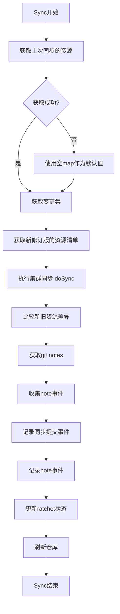

## 类结构

```
ratchet (接口)
├── CurrentRevision()
├── CurrentResources()
└── Update()

eventLogger (接口)
└── LogEvent()

changeSet (结构体)
├── commits
├── oldTagRev
├── newTagRev
└── initialSync
```

## 全局变量及字段


### `syncManifestsMetric`
    
Prometheus指标，用于记录同步成功的资源数量

类型：`prometheus.GaugeVec`
    


### `changeSet.commits`
    
需要同步的git提交列表

类型：`[]git.Commit`
    


### `changeSet.oldTagRev`
    
上次同步的git修订版本标识

类型：`string`
    


### `changeSet.newTagRev`
    
本次同步的git修订版本标识

类型：`string`
    


### `changeSet.initialSync`
    
标识是否为首次同步的布尔值

类型：`bool`
    
    

## 全局函数及方法


### `doSync`

该函数负责将 Git 仓库中的资源清单同步到 Kubernetes 集群。它从清单存储中获取所有资源，然后调用 fluxsync 将这些资源同步到集群中，并收集同步过程中的错误信息。

参数：

- `ctx`：`context.Context`，用于控制请求的取消和超时
- `manifestsStore`：`manifests.Store`，提供从 Git 仓库加载资源清单的接口
- `clus`：`cluster.Cluster`，代表 Kubernetes 集群的接口，用于执行资源同步操作
- `syncSetName`：`string`，同步集的名称标识，用于追踪和记录同步状态
- `logger`：`log.Logger`，用于记录同步过程中的日志信息

返回值：

- `map[string]resource.Resource`：返回所有已同步的资源的映射，键为资源 ID
- `[]event.ResourceError`：返回同步过程中遇到的资源级别错误列表
- `error`：返回函数执行过程中的错误，如果成功则返回 nil

#### 流程图

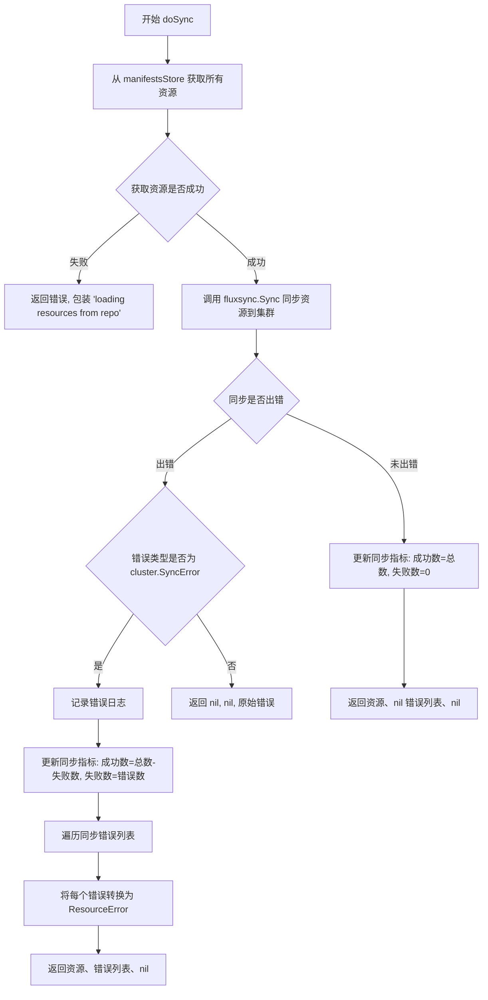

#### 带注释源码

```go
// doSync runs the actual sync of workloads on the cluster. It returns
// a map with all resources it applied and sync errors it encountered.
func doSync(ctx context.Context, manifestsStore manifests.Store, clus cluster.Cluster, syncSetName string,
	logger log.Logger) (map[string]resource.Resource, []event.ResourceError, error) {
	
	// Step 1: 从清单存储中获取所有资源
	resources, err := manifestsStore.GetAllResourcesByID(ctx)
	if err != nil {
		// 如果获取资源失败，返回错误
		return nil, nil, errors.Wrap(err, "loading resources from repo")
	}

	// 用于存储同步过程中的资源级别错误
	var resourceErrors []event.ResourceError
	
	// Step 2: 执行实际的集群同步
	if err := fluxsync.Sync(syncSetName, resources, clus); err != nil {
		// 同步出错，根据错误类型进行处理
		switch syncerr := err.(type) {
		case cluster.SyncError:
			// 记录同步错误日志
			logger.Log("err", err)
			// 更新同步指标：成功的资源数 = 总数 - 失败数，失败数 = 错误数
			updateSyncManifestsMetric(len(resources)-len(syncerr), len(syncerr))
			// 遍历所有同步错误，转换为资源错误结构
			for _, e := range syncerr {
				resourceErrors = append(resourceErrors, event.ResourceError{
					ID:    e.ResourceID,   // 资源 ID
					Path:  e.Source,        // 资源来源路径
					Error: e.Error.Error(), // 错误信息
				})
			}
		default:
			// 其他类型的错误直接返回
			return nil, nil, err
		}
	} else {
		// 同步成功，更新指标：成功数 = 资源总数，失败数 = 0
		updateSyncManifestsMetric(len(resources), 0)
	}
	
	// Step 3: 返回同步后的资源、错误列表和可能的错误
	return resources, resourceErrors, nil
}
```


### `updateSyncManifestsMetric`

该函数用于更新同步清单的Prometheus指标，记录成功和失败的同步资源数量，以便监控同步操作的健康状况。

参数：

- `success`：`int`，成功同步的资源数量
- `failure`：`int`，失败同步的资源数量

返回值：`无`（空），该函数没有返回值，仅更新全局指标

#### 流程图

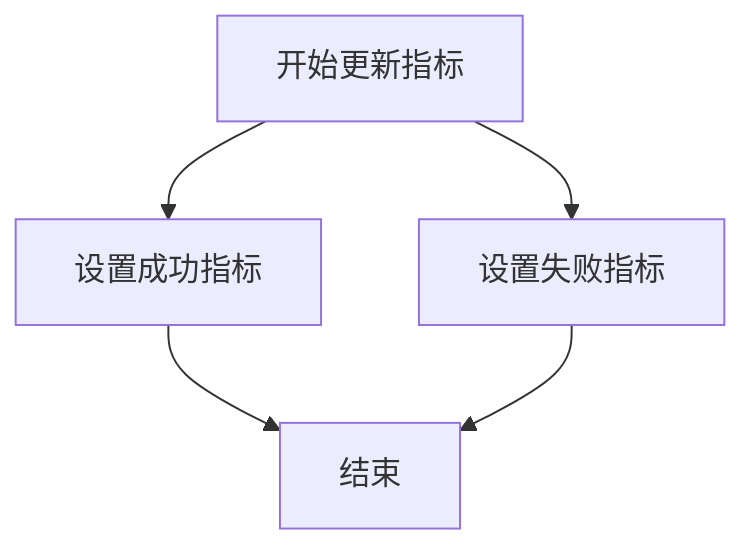

#### 带注释源码

```go
// updateSyncManifestsMetric 更新同步清单的Prometheus指标
// 参数:
//   - success: 成功同步的资源数量
//   - failure: 失败同步的资源数量
//
// 该函数通过metrics库更新两个指标:
// 1. syncManifestsMetric with LabelSuccess="true" 表示成功数量
// 2. syncManifestsMetric with LabelSuccess="false" 表示失败数量
func updateSyncManifestsMetric(success, failure int) {
	// 使用metrics库更新成功同步的清单数量指标
	// LabelSuccess="true" 表示这是成功的计数
	syncManifestsMetric.With(metrics.LabelSuccess, "true").Set(float64(success))
	
	// 使用metrics库更新失败同步的清单数量指标
	// LabelSuccess="false" 表示这是失败的计数
	syncManifestsMetric.With(metrics.LabelSuccess, "false").Set(float64(failure))
}
```

---

### 关键组件信息

- **syncManifestsMetric**：全局Prometheus指标对象，用于记录同步清单的成功/失败状态（类型：prometheus.GaugeVec 或类似指标类型）
- **metrics.LabelSuccess**：指标标签键，用于区分成功和失败（类型：string 常量）

### 潜在技术债务或优化空间

1. **缺乏错误处理**：如果`syncManifestsMetric.With()`调用失败（如指标未初始化），函数没有错误返回机制，可能导致静默失败
2. **指标初始化依赖**：该函数假设`syncManifestsMetric`已在其他地方正确初始化，否则会引发panic
3. **可观测性不足**：可以考虑添加日志记录，以便在指标更新失败时进行调试


### `compareResources`

该函数用于比较新旧两个资源集合，通过比对资源的字节内容识别出发生变更的资源，并返回更新资源ID集合和已删除资源ID集合。

参数：

- `old`：`map[string]resource.Resource`，旧版本的资源映射表，键为资源ID，值为资源对象
- `new`：`map[string]resource.Resource`，新版本的资源映射表，键为资源ID，返回值：
- `updated`：`resource.IDSet`，在new集合中存在但与old中对应资源内容不同的资源ID集合
- `deleted`：`resource.IDSet`，在old集合中存在但在new集合中不存在的资源ID集合

#### 流程图

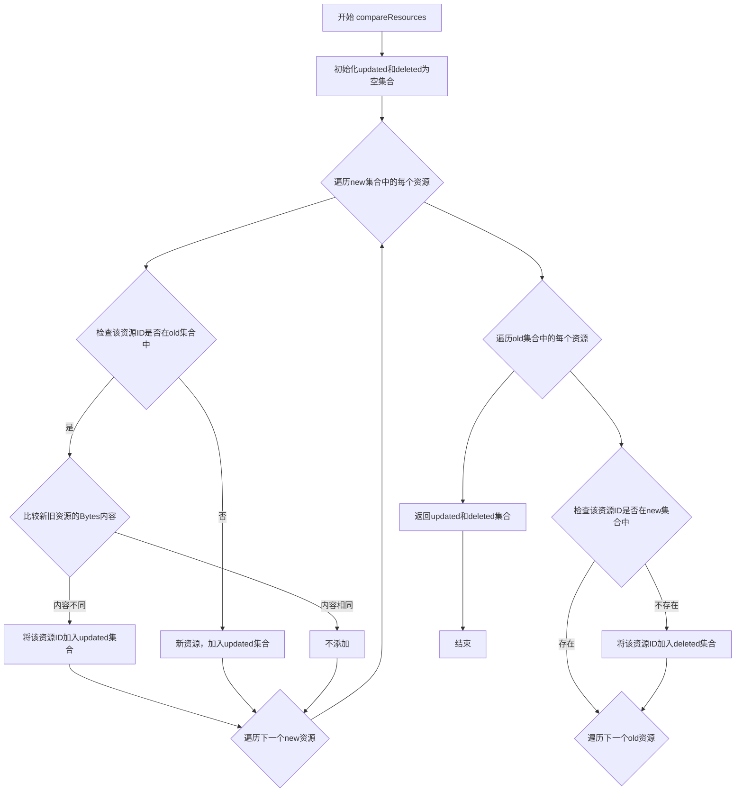

#### 带注释源码

```go
// compareResources 比较新旧两个资源集合，识别出更新和删除的资源
// 参数：
//   - old: 旧版本的资源映射表
//   - new: 新版本的资源映射表
// 返回值：
//   - updated: 资源内容发生变化的资源ID集合
//   - deleted: 在旧集合中存在但在新集合中不存在的资源ID集合
func compareResources(old, new map[string]resource.Resource) (updated, deleted resource.IDSet) {
	// 初始化两个空的结果集合
	updated, deleted = resource.IDSet{}, resource.IDSet{}
	
	// 辅助函数：将单个资源转换为资源ID切片
	toIDs := func(r resource.Resource) []resource.ID { return []resource.ID{r.ResourceID()} }

	// 第一轮遍历：找出更新的资源（新增或内容发生变化）
	for newID, newResource := range new {
		// 检查该资源ID是否在旧集合中存在
		if oldResource, ok := old[newID]; ok {
			// 存在则比较资源内容的字节表示
			if !bytes.Equal(oldResource.Bytes(), newResource.Bytes()) {
				// 内容发生变化，加入更新集合
				updated.Add(toIDs(newResource))
			}
		} else {
			// 不存在则是新增资源，加入更新集合
			updated.Add(toIDs(newResource))
		}
	}

	// 第二轮遍历：找出已删除的资源
	for oldID, oldResource := range old {
		// 检查该资源ID是否在新集合中不存在
		if _, ok := new[oldID]; !ok {
			// 新集合中不存在，说明资源已被删除
			deleted.Add(toIDs(oldResource))
		}
	}

	// 返回结果
	return updated, deleted
}
```


### `logCommitEvent`

该函数用于将所有已同步的提交记录报告给上游系统，生成同步事件并通过事件日志记录器记录，包含提交信息、初始同步标记、事件类型覆盖以及资源错误详情。

参数：

- `el`：`eventLogger` 接口，事件日志记录器，用于将事件写入上游或存储系统
- `c`：`changeSet` 类型，变更集，包含本次同步的提交列表、旧标签修订版本、新标签修订版本及是否为初始同步
- `serviceIDs`：`resource.IDSet` 类型，受本次同步影响的资源ID集合
- `started`：`time.Time` 类型，同步操作的开始时间，用于事件的时间戳记录
- `includesEvents`：`map[string]bool` 类型，标记本次同步包含的事件类型（如发布、自动发布、策略更新等）
- `resourceErrors`：`[]event.ResourceError` 类型，同步过程中遇到的资源错误列表
- `logger`：`log.Logger` 类型，用于记录函数内部的错误日志

返回值：`error`，如果事件记录过程中发生错误则返回错误，否则返回 nil

#### 流程图

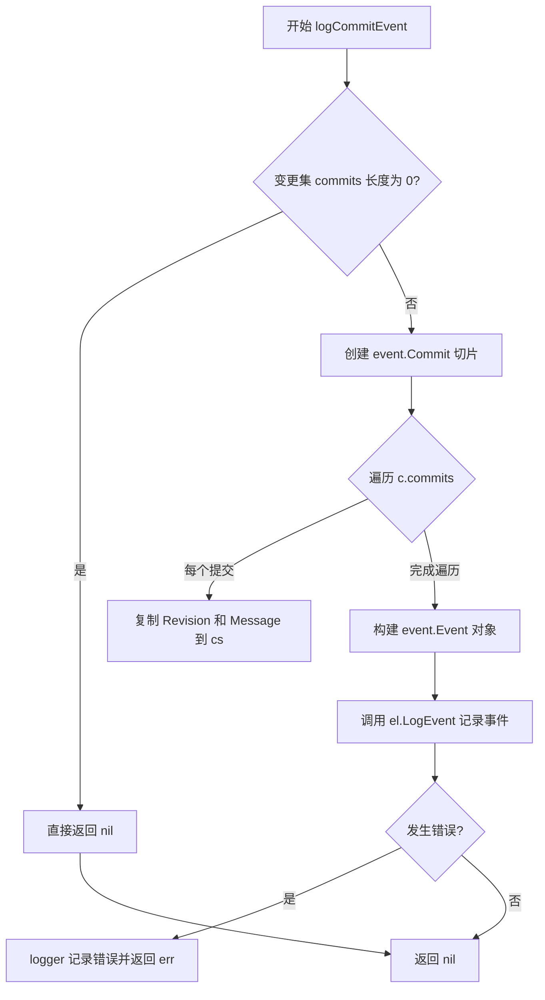

#### 带注释源码

```go
// logCommitEvent reports all synced commits to the upstream.
func logCommitEvent(el eventLogger, c changeSet, serviceIDs resource.IDSet, started time.Time,
	includesEvents map[string]bool, resourceErrors []event.ResourceError, logger log.Logger) error {
	
	// 如果没有待同步的提交，则直接返回空，避免生成无意义的同步事件
	if len(c.commits) == 0 {
		return nil
	}
	
	// 将 git.Commit 列表转换为 event.Commit 列表，仅提取修订版本和提交信息
	cs := make([]event.Commit, len(c.commits))
	for i, ci := range c.commits {
		cs[i].Revision = ci.Revision
		cs[i].Message = ci.Message
	}
	
	// 构建同步事件并通过事件日志记录器提交到上游系统
	if err := el.LogEvent(event.Event{
		ServiceIDs: serviceIDs.ToSlice(),        // 受影响的资源列表
		Type:       event.EventSync,            // 事件类型为同步事件
		StartedAt:  started,                     // 同步开始时间
		EndedAt:    started,                     // 结束时间设为开始时间表示瞬时完成
		LogLevel:   event.LogLevelInfo,         // 日志级别为信息
		Metadata: &event.SyncEventMetadata{      // 同步事件元数据
			Commits:     cs,                     // 本次同步包含的提交列表
			InitialSync: c.initialSync,          // 是否为首次同步
			Includes:    includesEvents,         // 包含的其他事件类型标记
			Errors:      resourceErrors,         // 资源同步错误列表
		},
	}); err != nil {
		// 事件记录失败时记录错误日志并返回错误，供调用方处理
		logger.Log("err", err)
		return err
	}
	return nil
}
```


### `refresh`

刷新仓库，通知守护进程有新的同步头。

参数：

- `ctx`：`context.Context`，上下文，用于控制超时和取消操作
- `timeout`：`time.Duration`，超时时间，用于设置 Git 操作的截止时间
- `repo`：`*git.Repo`，Git 仓库实例，需要被刷新以获取最新状态

返回值：`error`，刷新仓库操作过程中可能发生的错误

#### 流程图

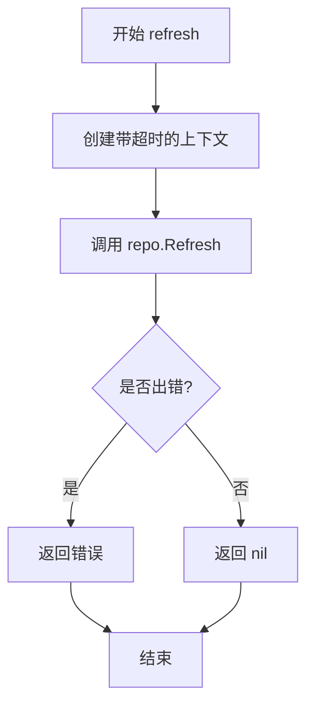

#### 带注释源码

```go
// refresh refreshes the repository, notifying the daemon we have a new
// sync head.
func refresh(ctx context.Context, timeout time.Duration, repo *git.Repo) error {
	// 创建一个带有超时限制的上下文，用于控制 Git 操作的时间
	ctxGitOp, cancel := context.WithTimeout(ctx, timeout)
	
	// 调用仓库的 Refresh 方法来更新仓库状态
	err := repo.Refresh(ctxGitOp)
	
	// 取消上下文以释放资源
	cancel()
	
	// 返回可能发生的错误，如果成功则返回 nil
	return err
}
```


### `makeGitConfigHash`

该函数通过组合Git远程仓库URL、分支名称和路径列表，使用SHA256哈希算法生成一个唯一的base64编码字符串，用于标识特定的Git配置组合，常用于同步任务的命名或状态追踪。

参数：

- `remote`：`git.Remote`，Git远程仓库引用，用于获取安全的仓库URL
- `conf`：`git.Config`，Git配置对象，包含分支名称（Branch）和路径列表（Paths）

返回值：`string`，基于Git配置生成的唯一哈希标识符（使用Base64原始URL编码）

#### 流程图

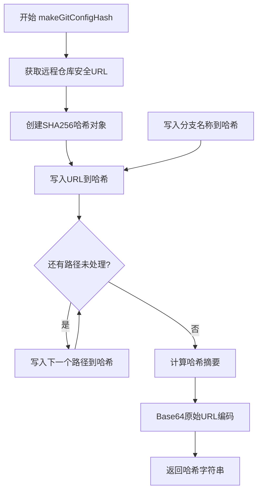

#### 带注释源码

```go
// makeGitConfigHash 根据Git远程仓库和配置生成唯一的哈希标识符
// 用于确保每次同步操作具有唯一的标识
func makeGitConfigHash(remote git.Remote, conf git.Config) string {
    // 获取远程仓库的安全URL（隐藏凭证）
    urlbit := remote.SafeURL()
    
    // 创建SHA256哈希计算器
    pathshash := sha256.New()
    
    // 将URL写入哈希计算器
    pathshash.Write([]byte(urlbit))
    
    // 将分支名称写入哈希计算器
    pathshash.Write([]byte(conf.Branch))
    
    // 遍历所有自定义路径，依次写入哈希计算器
    // 这样不同路径组合会产生不同的哈希值
    for _, path := range conf.Paths {
        pathshash.Write([]byte(path))
    }
    
    // 计算最终的哈希值并转换为Base64原始URL编码格式
    // 避免在文件名中出现特殊字符
    return base64.RawURLEncoding.EncodeToString(pathshash.Sum(nil))
}
```

---

#### 关键组件信息

| 组件名称 | 一句话描述 |
|---------|-----------|
| `git.Remote` | Git远程仓库抽象，提供安全URL获取方法 |
| `git.Config` | Git配置结构，包含Branch和Paths字段 |
| `sha256.New()` | SHA256哈希算法计算器 |
| `base64.RawURLEncoding` | Base64编码器，使用URL安全字符集 |

#### 潜在的技术债务或优化空间

1. **缺少输入验证**：函数未对`remote`和`conf`进行空值检查，可能导致运行时panic
2. **哈希碰撞风险**：虽然SHA256理论上足够安全，但在极端情况下（如超长URL）应考虑添加长度限制
3. **缺少缓存机制**：如果频繁调用相同配置生成哈希，可考虑添加缓存以提升性能

#### 其它项目

- **设计目标**：为Git同步操作生成唯一标识符，确保不同配置组合产生不同结果
- **约束**：依赖`git.Remote`和`git.Config`的具体实现，输出格式必须符合Base64 URL安全标准
- **错误处理**：当前无错误返回，任何输入问题会导致运行时错误，建议添加参数校验


### `ratchet.CurrentRevision`

获取当前存储的修订版本号，用于跟踪 Git 仓库与集群同步的状态。

参数：

-  `ctx`：`context.Context`，请求上下文，用于控制超时和取消操作

返回值：`string`，当前修订版本号（SHA 或 tag）
`error`，获取过程中的错误信息

#### 流程图

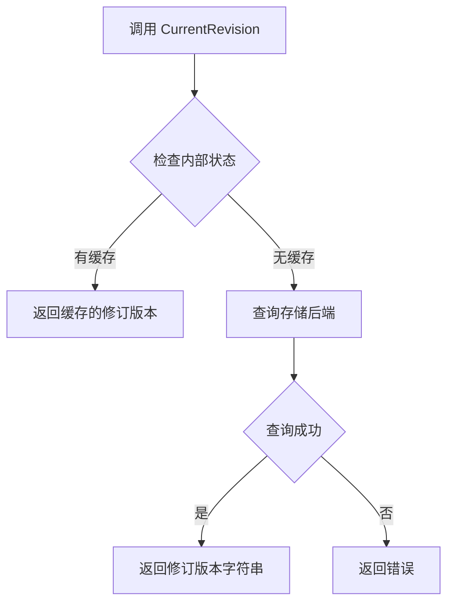

#### 带注释源码

```go
// ratchet 接口定义在 daemon 包中，用于跟踪 Git 仓库修订版本与集群状态之间的转换
type ratchet interface {
	// CurrentRevision 获取当前存储的修订版本号
	// 参数 ctx 用于控制请求超时和取消
	// 返回值：
	//   - string: 当前修订版本号（通常为 Git commit SHA 或 tag）
	//   - error: 获取失败时的错误信息
	CurrentRevision(ctx context.Context) (string, error)
	
	// CurrentResources 返回当前同步的资源映射
	CurrentResources() map[string]resource.Resource

	// Update 更新存储的修订版本和资源状态
	// 参数：
	//   - oldRev: 旧修订版本
	//   - newRev: 新修订版本
	//   - resources: 资源映射
	// 返回值：
	//   - bool: 更新是否成功
	//   - error: 更新过程中的错误
	Update(ctx context.Context, oldRev, newRev string, resources map[string]resource.Resource) (bool, error)
}
```

---

**注意**：提供的代码片段仅包含 `ratchet` 接口的定义，该接口的具体实现（包括 `CurrentRevision` 方法的具体逻辑）位于其他文件中。这是典型的依赖倒置设计，daemon 包通过接口抽象来解耦具体的修订版本存储实现。


### `ratchet.CurrentResources`

获取当前同步的资源映射，用于追踪集群的实际状态。

参数：此方法没有参数。

返回值：`map[string]resource.Resource`，返回从上一次同步记录中获取的资源映射，键为资源 ID，值为资源对象。如果返回 nil，则表示需要从仓库重新加载资源。

#### 流程图

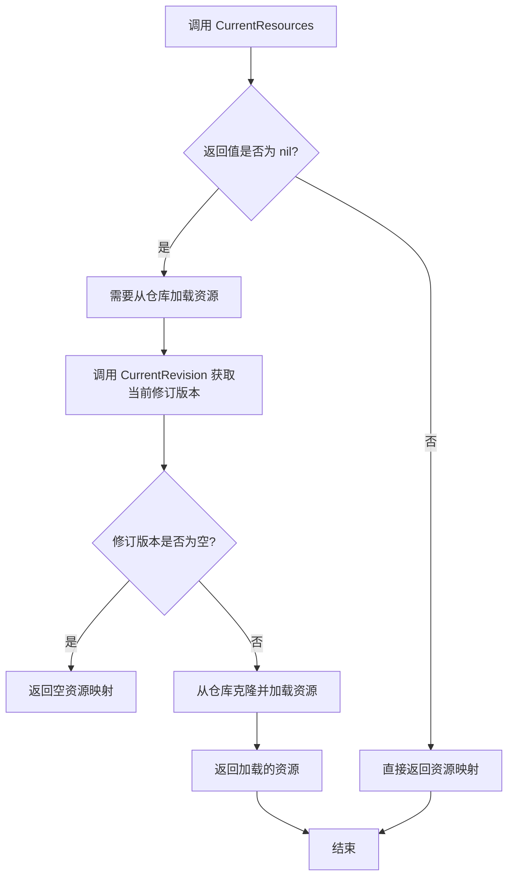

#### 带注释源码

```go
// ratchet 是用于跟踪修订版本之间转换的接口
// 这比仅仅设置状态要复杂一点，因为我们希望注意到意外的转换
// （例如，当当前状态不是我们记录的状态时）
type ratchet interface {
    // CurrentRevision 返回当前修订版本
    CurrentRevision(ctx context.Context) (string, error)
    
    // CurrentResources 返回当前资源的映射
    // 这用于获取上次同步时记录的资源状态
    // 如果返回 nil，则表示需要从仓库重新加载资源
    CurrentResources() map[string]resource.Resource
    
    // Update 更新修订版本和资源映射
    Update(ctx context.Context, oldRev, newRev string, resources map[string]resource.Resource) (bool, error)
}

// getLastResources 加载上次同步的资源
func (d *Daemon) getLastResources(ctx context.Context, rat ratchet) (map[string]resource.Resource, error) {
    // 直接从 ratchet 获取当前资源映射
    lastResources := rat.CurrentResources()
    
    // 如果已经有资源，直接返回
    if lastResources != nil {
        return lastResources, nil
    }
    
    // 获取当前修订版本
    currentRevision, err := rat.CurrentRevision(ctx)
    if err != nil {
        return nil, err
    }
    
    // 仓库从未克隆过，返回空映射
    if currentRevision == "" {
        return make(map[string]resource.Resource), nil
    }
    
    // 首次同步 - 从 currentRevision 的克隆加载资源
    lastResourcestore, cleanup, err := d.getManifestStoreByRevision(ctx, currentRevision)
    if err != nil {
        return nil, errors.Wrap(err, "reading the repository checkout")
    }
    defer cleanup()
    
    lastResources, err = lastResourcestore.GetAllResourcesByID(ctx)
    if err != nil {
        return nil, errors.Wrap(err, "loading resources from repo")
    }
    
    return lastResources, nil
}
```


### `ratchet.Update`

该方法用于更新同步状态记录器（ratchet）中的修订版本和资源映射。它接受旧修订版本、新修订版本和资源映射作为参数，如果更新成功则返回 true，否则返回 false 或错误。

参数：

- `ctx`：`context.Context`，上下文对象，用于控制超时和取消操作
- `oldRev`：`string`，旧的修订版本号，表示上一次同步到的 Git 提交哈希
- `newRev`：`string`，新的修订版本号，表示本次需要同步到的 Git 提交哈希
- `resources`：`map[string]resource.Resource`，资源映射表，键为资源 ID，值为资源对象

返回值：

- `bool`：表示是否成功更新了状态，如果返回 false 则表示无需继续后续操作
- `error`：如果更新过程中发生错误，则返回错误信息

#### 流程图

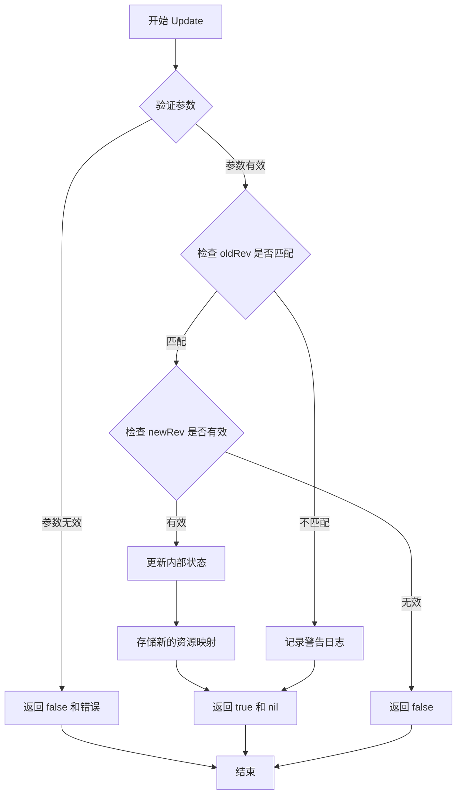

#### 带注释源码

```go
// ratchet 接口定义
type ratchet interface {
    // CurrentRevision 获取当前记录的修订版本
    CurrentRevision(ctx context.Context) (string, error)
    // CurrentResources 获取当前存储的资源映射
    CurrentResources() map[string]resource.Resource
    // Update 更新修订版本和资源映射
    // 参数:
    //   ctx: 上下文对象
    //   oldRev: 期望的旧修订版本
    //   newRev: 新的修订版本
    //   resources: 资源映射表
    // 返回值:
    //   bool: 更新是否成功
    //   error: 错误信息
    Update(ctx context.Context, oldRev, newRev string, resources map[string]resource.Resource) (bool, error)
}

// 调用示例（在 Daemon.Sync 方法中）
if ok, err := rat.Update(ctx, changeSet.oldTagRev, changeSet.newTagRev, resources); err != nil {
    return err
} else if !ok {
    return nil
}
```


### `eventLogger.LogEvent`

该接口方法用于将 Flux 系统中的事件（如同步事件、发布事件等）记录到日志系统中，以便后续审计、监控和调试使用。

参数：

- `e`：`event.Event`，要记录的事件对象，包含事件类型、服务 ID、时间戳、元数据等信息

返回值：`error`，如果记录事件时发生错误则返回错误信息，否则返回 nil

#### 流程图

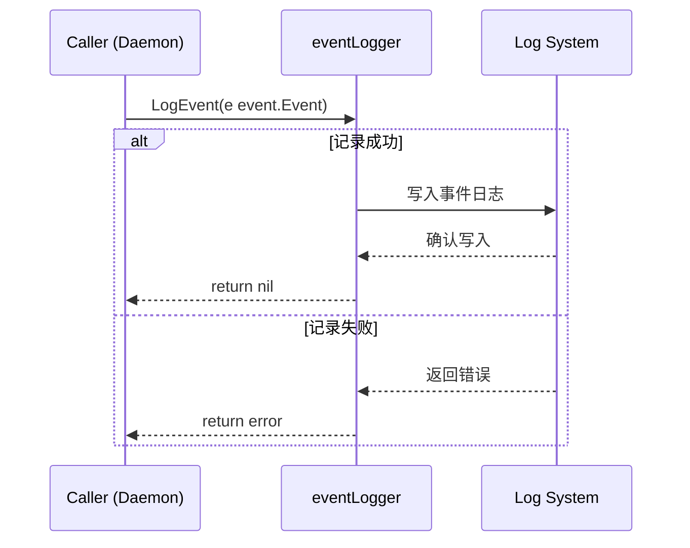

#### 带注释源码

```go
// eventLogger 接口定义了记录事件的方法
// 用于将 Flux 系统中的各类事件记录到日志或外部系统
type eventLogger interface {
	// LogEvent 记录给定的事件到日志系统
	// 参数 e: event.Event 类型的事件对象，包含事件的完整信息
	// 返回值: 成功时返回 nil，发生错误时返回具体的错误信息
	LogEvent(e event.Event) error
}
```

#### 实际调用示例源码

```go
// 在 Daemon.Sync 方法中调用 LogEvent 的示例
// 遍历所有从 git notes 收集的事件并记录
for _, event := range noteEvents {
    // 调用 LogEvent 方法记录每个事件
    if err = d.LogEvent(event); err != nil {
        // 记录错误日志
        d.Logger.Log("err", err)
        // 提前终止以确保事件至少被传递一次（at-least-once delivery）
        return err
    }
}

// 另一个调用示例：记录同步提交事件
if err := logCommitEvent(d, changeSet, updatedIDs, started, includesEvents, resourceErrors, d.Logger); err != nil {
    return err
}

// logCommitEvent 函数内部实现
func logCommitEvent(el eventLogger, c changeSet, serviceIDs resource.IDSet, started time.Time,
	includesEvents map[string]bool, resourceErrors []event.ResourceError, logger log.Logger) error {
	if len(c.commits) == 0 {
		return nil
	}
	cs := make([]event.Commit, len(c.commits))
	for i, ci := range c.commits {
		cs[i].Revision = ci.Revision
		cs[i].Message = ci.Message
	}
	// 实际调用 eventLogger 接口的 LogEvent 方法
	if err := el.LogEvent(event.Event{
		ServiceIDs: serviceIDs.ToSlice(),
		Type:       event.EventSync,
		StartedAt:  started,
		EndedAt:    started,
		LogLevel:   event.LogLevelInfo,
		Metadata: &event.SyncEventMetadata{
			Commits:     cs,
			InitialSync: c.initialSync,
			Includes:    includesEvents,
			Errors:      resourceErrors,
		},
	}); err != nil {
		logger.Log("err", err)
		return err
	}
	return nil
}
```

## 关键组件


### ratchet 接口

用于跟踪修订版之间转换的接口，支持获取当前修订版和资源状态，以及更新同步状态

### eventLogger 接口

用于记录事件的接口，定义了 LogEvent 方法将事件发送到上游系统

### changeSet 结构体

存储同步所需的变更信息，包括提交列表、旧标签修订版、新标签修订版以及是否为初始同步的标志

### Sync 方法

主同步方法，协调 Git 仓库与集群之间的同步流程，包括加载资源、获取变更集、执行同步、收集事件并更新同步状态

### getLastResources 方法

加载上次同步的资源，用于与新资源进行对比以确定变更情况，处理首次同步场景

### getManifestStoreByRevision 方法

根据指定修订版从 Git 克隆中加载清单资源，封装了仓库克隆和清理逻辑

### cloneRepo 方法

为指定修订版创建只读的 Git 仓库克隆，并在启用 Git 密钥时解密封装

### getChangeSet 方法

获取需要同步的提交变更集，确定旧修订版和新修订版，以及是否为初始同步

### doSync 函数

执行实际的工作负载同步，将资源应用到集群并返回同步后的资源映射和错误信息

### compareResources 函数

比较旧资源和新资源状态，返回更新的资源 ID 集合和已删除的资源 ID 集合

### getNotes 方法

从 Git 仓库工作副本中检索 Git notes，用于获取附加在提交上的元数据

### collectNoteEvents 方法

从已同步提交的 Git notes 中收集事件，将特定的 note 规范解释为要发送的上游事件

### logCommitEvent 函数

将所有已同步的提交报告给上游系统，包含提交信息、初始同步标志和相关事件类型

### refresh 方法

刷新仓库以通知守护进程有新的同步头，检查远程仓库是否有新变更

## 问题及建议


### 已知问题

-   **未使用的变量**：`deletedIDs`变量被声明但在第75行被`_ = deletedIDs`忽略，TODO注释表明需要将删除的资源包含在同步事件中，目前功能不完整。
-   **资源清理路径风险**：`cloneRepo`函数在成功返回clone和cleanup函数后，如果后续`getManifestStore`失败，cleanup会在`getManifestStoreByRevision`的defer中调用。但如果`cloneRepo`本身失败返回nil，后续代码仍需正确处理nil值。
-   **上下文超时重复创建**：在`cloneRepo`函数中（第117-124行），在已有`ctxGitOp`的情况下又创建了新的超时上下文，导致代码冗余且可能混淆上下文生命周期。
-   **错误日志不一致**：部分地方使用`d.Logger.Log`记录错误，部分地方使用传入的`logger`参数，错误处理风格不统一。
-   **TODO遗留问题**：第72行的TODO注释表明删除资源的同步事件报告功能尚未实现。
- **类型断言缺乏安全性**：`doSync`函数中使用`syncerr := err.(type)`进行类型断言后直接使用，没有使用comma-ok idiom进行安全检查。

### 优化建议

-   **实现删除资源事件报告**：完成TODO，将`deletedIDs`用于同步事件报告，实现完整的状态变更追踪。
-   **统一错误处理和日志记录**：建立统一的错误处理和日志记录规范，明确何时使用daemon的logger何时使用传入的logger参数。
-   **重构上下文管理**：统一超时的上下文创建方式，考虑创建工具函数减少代码重复。
-   **添加类型断言安全检查**：将类型断言改为安全形式`if syncerr, ok := err.(cluster.SyncError); ok { ... }`。
-   **考虑性能优化**：`makeGitConfigHash`在每次`sync`时都会被调用，如果`syncSetName`未变化可考虑缓存；资源比较使用`bytes.Equal`对大资源可能有性能影响，可考虑先比较metadata或使用其他策略。
-   **提取重复代码**：`collectNoteEvents`中构建事件对象的逻辑有重复，可提取为辅助函数减少代码冗余。

## 其它


### 设计目标与约束

本文档描述的代码是Flux CD daemon包中的同步核心模块，负责将Git仓库中的资源配置同步到Kubernetes集群。核心设计目标包括：实现GitOps工作流，确保集群状态与Git声明式配置一致；支持增量同步，仅处理修订版本间的变更资源；提供事件追踪能力，记录同步过程和结果；支持首次同步和后续增量同步两种模式。技术约束方面，同步操作受限于`SyncTimeout`和`GitTimeout`两个超时配置，默认为较长时间以适应大型仓库场景；资源同步采用乐观锁机制，通过ratchet接口记录当前修订版本以检测并发冲突。

### 错误处理与异常设计

代码采用分层错误处理策略。在Sync方法中，主要错误场景包括：加载历史资源失败时使用空map继续同步；获取变更集失败直接返回错误；加载新修订版本资源失败时包装错误信息后返回；同步执行失败根据错误类型分别处理——cluster.SyncError类型记录部分成功状态，其他类型直接返回。资源级别的错误通过ResourceError结构体收集，包含资源ID、源路径和错误描述。事件记录错误会中止同步流程以确保至少一次交付语义。关键辅助函数如getLastResources、getManifestStoreByRevision、cloneRepo均返回明确错误，调用方负责合理处理。错误包装使用github.com/pkg/errors包提供堆栈信息。

### 数据流与状态机

同步流程呈现清晰的状态转换。首先是初始化阶段：加载上一轮同步的资源快照（可能来自ratchet状态或克隆仓库）；获取需要同步的变更集（包含提交列表、旧新标记修订版本和是否首次同步标识）。其次是执行阶段：按新修订版本克隆仓库；通过fluxsync.Sync将资源配置应用到集群；比较新旧资源集合计算更新和删除的资源ID集合。接着是事件收集阶段：从git notes中提取同步期间的事件信息；区分首次同步场景下不应处理notes。最后是状态更新阶段：更新ratchet记录的当前修订版本；刷新仓库引用。整个流程支持幂等执行，重复同步同一修订版本不会产生副作用。

### 外部依赖与接口契约

代码依赖多个关键外部包。Git操作依赖github.com/fluxcd/flux/pkg/git包，提供仓库克隆、提交查询、note操作等能力。集群操作依赖github.com/fluxcd/flux/pkg/cluster包，提供资源同步和错误类型定义。资源解析依赖github.com/fluxcd/flux/pkg/manifests包，提供Store接口获取资源配置。同步执行依赖github.com/fluxcd/flux/pkg/sync包，提供Sync函数执行实际同步。事件系统依赖github.com/fluxcd/flux/pkg/event包，定义事件结构和类型。指标导出依赖github.com/fluxcd/flux/pkg/metrics包。日志使用github.com/go-kit/log接口。ratchet接口是内部核心抽象，需要实现方提供CurrentRevision、CurrentResources和Update三个方法。eventLogger接口负责事件持久化。

### 性能考虑

代码设计考虑了多个性能要点。克隆操作使用只读模式减少权限开销。资源比较通过字节内容比对而非深度遍历提高效率。Git操作均设置超时防止长时间阻塞。变更集获取时根据ManifestGenerationEnabled标志优化路径查询。同步指标更新区分成功和失败数量便于监控告警。资源映射使用map实现O(1)查找。对于首次同步场景有特殊处理避免不必要的note查询。清理函数defer确保资源释放。上下文传播实现逐层超时控制。

### 安全性考虑

安全特性体现在多个层面。克隆操作声明为只读模式。Git secret unseal操作在启用时使用独立超时控制。makeGitConfigHash函数使用SHA256生成同步集合名称时包含远程URL、分支和路径信息确保唯一性。敏感信息处理通过SafeURL方法避免日志泄露认证信息。超时的合理设置防止资源耗尽。错误消息在日志输出时经过检查避免注入攻击。配置哈希仅包含必要信息不包含凭据。

### 配置说明

代码使用Daemon结构体中的多个配置字段。SyncTimeout控制整个同步操作的超时时间。GitTimeout控制Git仓库相关操作的超时时间。GitConfig包含仓库路径、分支、notes引用等配置。GitSecretEnabled标志控制是否执行secret unseal操作。ManifestGenerationEnabled标志控制是否覆盖配置路径为空数组。Repo字段提供Git仓库操作接口。Cluster字段提供集群操作接口。Logger字段提供日志能力。这些配置在Daemon初始化时注入，支持灵活定制同步行为。

### 监控和可观测性

代码集成了Prometheus指标系统。syncManifestsMetric指标跟踪同步资源数量，按success标签区分成功和失败数量，在doSync函数中根据执行结果更新。日志系统记录关键操作步骤和错误信息，包括：加载历史资源失败警告、尝试同步的提示、git clone错误、无法清理克隆的错误、同步过程中的错误等。事件系统记录同步事件到上游，包括同步开始结束时间、受影响的资源ID、包含的事件类型、发生的错误等。started时间参数贯穿整个流程用于计算耗时和事件时间戳。

### 并发和线程安全

代码通过context.Context传递实现请求级隔离。同步操作设计为单次执行流程，不支持并发调用同一Daemon实例的Sync方法。ratchet接口的Update方法返回bool表示更新是否成功，调用方据此决定是否继续。资源比较在单线程中完成，不存在竞态条件。事件记录循环中遇到错误会立即返回，避免并发写入冲突。超时控制通过独立的context实现，支持取消正在进行的操作。

### 资源管理

资源清理通过defer机制确保执行。getManifestStoreByRevision返回cleanupClone函数由调用方负责defer执行。cloneRepo函数返回cleanup函数用于释放克隆资源。context超时自动取消相关操作。Git操作完成后关闭相关context。资源映射在函数结束时自动回收。错误路径中cleanup函数仍会被调用确保资源不泄漏。compareResources函数返回的资源IDSet为值拷贝避免引用问题。

### 关键数据结构

changeSet结构体封装同步变更信息，包含commits数组存储待同步的提交对象、oldTagRev和newTagRev记录版本边界、initialSync标志指示是否为首次同步。resource.IDSet用于高效存储和比较资源ID集合。event.ResourceError记录单个资源的同步错误。git.Commit结构体包含Revision和Message字段。note结构体解析git note内容转换为事件。event.Event系列结构体定义同步、发布、自动发布等事件类型及其元数据。

### 测试策略建议

代码测试应覆盖以下场景：首次同步和增量同步两种模式的正确性；资源新增、更新、删除的检测和同步；各种Git操作超时的处理；ratchet接口模拟测试；事件收集的完整性和准确性；指标更新的正确性；错误路径的异常处理；并发安全性的验证。建议使用mock框架模拟Git仓库和集群行为，结合集成测试验证真实场景。


    