# `flux\pkg\daemon\sync_test.go` 详细设计文档

这是 Flux CD 项目中 daemon 包的同步功能测试文件，主要测试 Daemon 类型如何从 Git 仓库拉取配置并同步到 Kubernetes 集群，包括初始同步、无新提交时同步、有新提交时同步、使用 Kustomize 的同步、多文档同步以及错误处理等多种场景。

## 整体流程

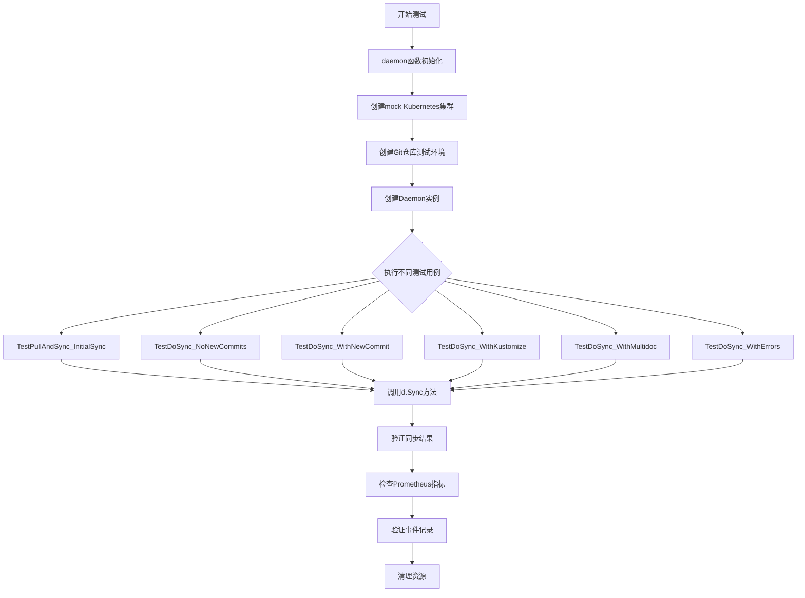

## 类结构

```
Daemon (核心类型)
├── Cluster (集群接口)
│   └── mock.Mock (测试用mock)
├── Manifests (清单管理)
│   └── kubernetes.Manifests
├── Registry (镜像仓库)
│   └── registryMock.Registry
├── Repo (Git仓库)
│   └── git.Repo
├── Jobs (作业队列)
│   └── job.Queue
├── JobStatusCache (作业状态缓存)
job.StatusCache
├── EventWriter (事件写入器)
│   └── mockEventWriter
├── Logger (日志)
│   └── kitlog.Logger
└── LoopVars (循环变量)
    └── LoopVars
```

## 全局变量及字段


### `k8s`
    
Kubernetes集群模拟器，用于测试中模拟集群操作

类型：`*mock.Mock`
    


### `events`
    
事件写入器模拟，用于记录测试中产生的事件

类型：`*mockEventWriter`
    


### `gitPath`
    
Git仓库路径常量，当前为空字符串

类型：`string`
    


### `gitNotesRef`
    
Git notes引用名称，用于存储Flux元数据

类型：`string`
    


### `gitUser`
    
Git提交用户名

类型：`string`
    


### `gitEmail`
    
Git提交用户邮箱

类型：`string`
    


### `timeout`
    
操作超时时间配置

类型：`time.Duration`
    


### `syncCalled`
    
同步函数调用次数计数器

类型：`int`
    


### `syncDef`
    
集群同步定义，包含了要同步的资源集合

类型：`*cluster.SyncSet`
    


### `expectedResourceIDs`
    
预期同步的资源ID列表

类型：`resource.IDs`
    


### `syncTag`
    
Git同步标签名称，用于标记已同步的版本

类型：`string`
    


### `head`
    
Git分支头指针引用

类型：`string`
    


### `gitSync`
    
Git标签同步提供者，管理同步标签

类型：`fluxsync.GitTagSyncProvider`
    


### `syncState`
    
同步状态追踪器，记录上次同步信息

类型：`*lastKnownSyncState`
    


### `oldRevision`
    
操作前的Git修订版本号

类型：`string`
    


### `newRevision`
    
操作后的Git修订版本号

类型：`string`
    


### `resourcesByID`
    
按资源ID索引的资源映射表

类型：`map[resource.ID]*resource.Resource`
    


### `targetResource`
    
目标资源的完整标识符

类型：`string`
    


### `res`
    
资源对象，包含资源的源路径和ID信息

类型：`*resource.Resource`
    


### `absolutePath`
    
资源清单文件的绝对路径

类型：`string`
    


### `def`
    
原始资源清单文件内容

类型：`[]byte`
    


### `newDef`
    
修改后的资源清单文件内容

类型：`[]byte`
    


### `cm`
    
清单管理器接口，用于获取和解析资源

类型：`manifests.Manifests`
    


### `Daemon.Cluster`
    
Kubernetes集群接口，用于资源同步和导出

类型：`cluster.Cluster`
    


### `Daemon.Manifests`
    
清单解析接口，用于读取和管理资源清单

类型：`manifests.Manifests`
    


### `Daemon.Registry`
    
镜像仓库接口，用于获取容器镜像信息

类型：`registry.Registry`
    


### `Daemon.Repo`
    
Git仓库接口，用于Git操作和版本管理

类型：`git.Repo`
    


### `Daemon.GitConfig`
    
Git配置，包含分支、用户、标签等信息

类型：`git.Config`
    


### `Daemon.Jobs`
    
任务队列，用于管理异步任务

类型：`job.Queue`
    


### `Daemon.JobStatusCache`
    
任务状态缓存，用于跟踪任务执行状态

类型：`*job.StatusCache`
    


### `Daemon.EventWriter`
    
事件写入器，用于记录系统事件

类型：`event.Writer`
    


### `Daemon.Logger`
    
日志记录器，用于输出日志信息

类型：`kitlog.Logger`
    


### `Daemon.LoopVars`
    
循环变量，包含同步和Git超时配置

类型：`*LoopVars`
    


### `Daemon.GitConfig.Paths`
    
Git路径配置，用于指定要监控的目录

类型：`[]string`
    


### `Daemon.ManifestGenerationEnabled`
    
清单生成启用标志，控制是否启用自动生成清单

类型：`bool`
    


### `lastKnownSyncState.logger`
    
日志记录器，用于记录同步状态变更

类型：`kitlog.Logger`
    


### `lastKnownSyncState.state`
    
同步状态提供者，用于获取和更新同步标签

类型：`fluxsync.GitTagSyncProvider`
    


### `LoopVars.SyncTimeout`
    
同步操作超时时间

类型：`time.Duration`
    


### `LoopVars.GitTimeout`
    
Git操作超时时间

类型：`time.Duration`
    
    

## 全局函数及方法


### `daemon`

这是一个测试辅助函数，用于创建和配置一个 `*Daemon` 实例，以便在测试中模拟 Flux daemon 的行为。该函数初始化必要的依赖项（如 Git 仓库、Kubernetes mock、任务队列等），并返回一个可用于运行同步测试的 `Daemon` 对象以及对应的清理函数。

参数：

- `t`：`testing.T`，Go 测试框架的测试用例指针，用于报告测试错误
- `files`：`map[string]string`，映射文件名到文件内容的字典，用于初始化 Git 仓库中的测试文件

返回值：`(Daemon, func())`，第一个返回值是配置好的 `*Daemon` 实例，第二个返回值是一个清理函数，用于关闭资源并执行必要的清理工作

#### 流程图

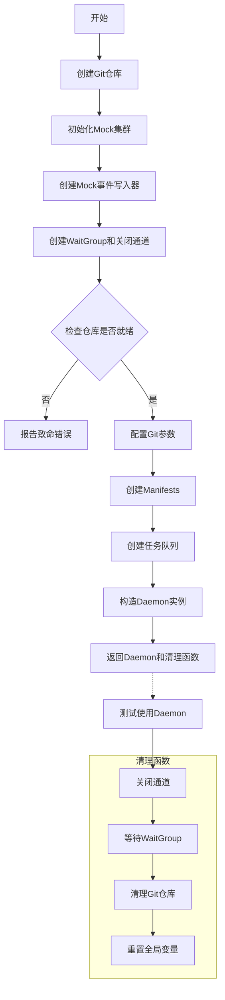

#### 带注释源码

```go
// daemon 是测试辅助函数，用于创建配置完整的 Daemon 实例
func daemon(t *testing.T, files map[string]string) (*Daemon, func()) {
	// 使用 gittest 创建测试用的 Git 仓库，返回仓库对象和清理函数
	repo, repoCleanup := gittest.Repo(t, files)

	// 创建 mock Kubernetes 集群，并设置 ExportFunc 为空实现
	k8s = &mock.Mock{}
	k8s.ExportFunc = func(ctx context.Context) ([]byte, error) { return nil, nil }

	// 初始化 mock 事件写入器
	events = &mockEventWriter{}

	// 创建等待组和关闭通道，用于管理并发和优雅关闭
	wg := &sync.WaitGroup{}
	shutdown := make(chan struct{})

	// 等待仓库准备就绪，如果失败则报告致命错误
	if err := repo.Ready(context.Background()); err != nil {
		t.Fatal(err)
	}

	// 配置 Git 参数，包括分支、Notes 引用、用户名和邮箱
	gitConfig := git.Config{
		Branch:    "master",
		NotesRef:  "flux",
		UserName:  "Flux",
		UserEmail: "support@weave.works",
	}

	// 创建 Kubernetes manifests 解析器，使用默认命名空间
	manifests := kubernetes.NewManifests(kubernetes.ConstNamespacer("default"), log.NewLogfmtLogger(os.Stdout))

	// 创建任务队列，传入关闭信号和等待组
	jobs := job.NewQueue(shutdown, wg)

	// 构造 Daemon 实例，初始化所有必要的依赖
	d := &Daemon{
		Cluster:        k8s,                      // Kubernetes 集群接口
		Manifests:      manifests,                // Manifests 解析器
		Registry:       &registryMock.Registry{}, // 镜像仓库 mock
		Repo:           repo,                     // Git 仓库
		GitConfig:      gitConfig,                // Git 配置
		Jobs:           jobs,                     // 任务队列
		JobStatusCache: &job.StatusCache{Size: 100}, // 任务状态缓存
		EventWriter:    events,                   // 事件写入器
		Logger:         log.NewLogfmtLogger(os.Stdout), // 日志记录器
		LoopVars:       &LoopVars{SyncTimeout: timeout, GitTimeout: timeout}, // 循环变量
	}

	// 返回 Daemon 实例和清理函数
	return d, func() {
		// 关闭信号通道，触发所有等待中的 goroutine 退出
		close(shutdown)
		// 等待所有 goroutine 完成
		wg.Wait()
		// 清理 Git 仓库
		repoCleanup()
		// 重置全局变量，防止测试间相互影响
		k8s = nil
		events = nil
	}
}
```


### `findMetric`

该函数是测试辅助函数，用于从 Prometheus 默认注册表中查找具有指定名称、指标类型和标签值的指标，并返回找到的指标或相应的错误信息。

参数：

- `name`：`string`，指标的名称，用于在注册表中定位指标族
- `metricType`：`promdto.MetricType`，期望的指标类型（如 GAUGE、COUNTER 等），用于验证指标类型是否匹配
- `labels`：`...string`，可选的标签键值对（交替出现：键1, 值1, 键2, 值2, ...），用于精确匹配指标的标签

返回值：`(*promdto.Metric, error)`，返回找到的指标指针，如果发生错误则返回 error

#### 流程图

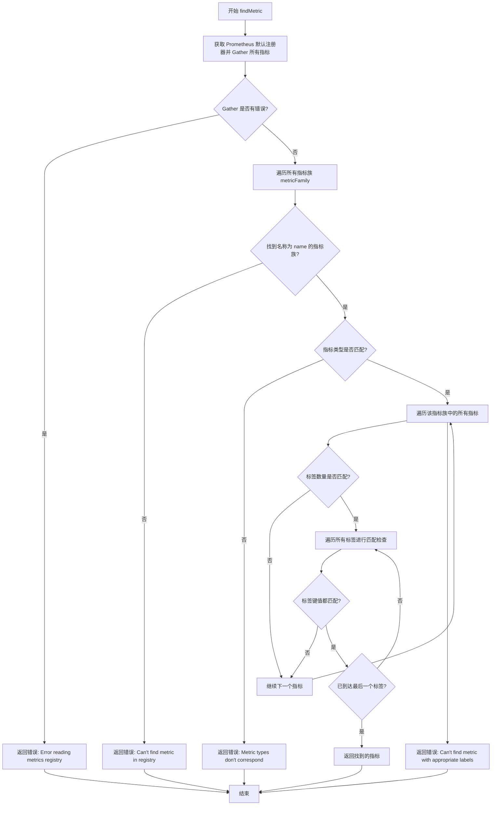

#### 带注释源码

```go
// findMetric 从 Prometheus 默认注册表中查找具有指定名称、类型和标签的指标
// 参数:
//   - name: 指标的名称
//   - metricType: 期望的指标类型 (promdto.MetricType)
//   - labels: 可变的标签键值对，格式为 key1, value1, key2, value2, ...
//
// 返回值:
//   - *promdto.Metric: 找到的指标指针
//   - error: 错误信息，如果未找到或发生错误
func findMetric(name string, metricType promdto.MetricType, labels ...string) (*promdto.Metric, error) {
	// 获取 Prometheus 默认注册器并转换为 Registry 类型
	metricsRegistry := prometheus.DefaultRegisterer.(*prometheus.Registry)
	
	// 收集所有已注册的指标
	if metrics, err := metricsRegistry.Gather(); err == nil {
		// 遍历所有指标族 (MetricFamily)
		for _, metricFamily := range metrics {
			// 查找名称匹配的指标族
			if *metricFamily.Name == name {
				// 验证指标类型是否匹配
				if *metricFamily.Type != metricType {
					return nil, fmt.Errorf("Metric types for %v doesn't correpond: %v != %v", name, metricFamily.Type, metricType)
				}
				
				// 遍历该指标族中的所有指标
				for _, metric := range metricFamily.Metric {
					// 验证标签数量是否匹配 (labels 是键值对，所以长度应该是 metric.Label 的两倍)
					if len(labels) != len(metric.Label)*2 {
						return nil, fmt.Errorf("Metric labels length for %v doesn't correpond: %v != %v", name, len(labels)*2, len(metric.Label))
					}
					
					// 遍历所有标签进行精确匹配
					for labelIdx, label := range metric.Label {
						// 检查标签名称是否匹配
						if labels[labelIdx*2] != *label.Name {
							return nil, fmt.Errorf("Metric label for %v doesn't correpond: %v != %v", name, labels[labelIdx*2], *label.Name)
						} else if labels[labelIdx*2+1] != *label.Value {
							// 标签值不匹配，终止当前指标的匹配，继续下一个指标
							break
						} else if labelIdx == len(metric.Label)-1 {
							// 所有标签都匹配，返回找到的指标
							return metric, nil
						}
					}
				}
				// 在指标族中未找到匹配标签的指标
				return nil, fmt.Errorf("Can't find metric %v with appropriate labels in registry", name)
			}
		}
		// 未在注册表中找到指定名称的指标
		return nil, fmt.Errorf("Can't find metric %v in registry", name)
	} else {
		// 获取指标时发生错误
		return nil, fmt.Errorf("Error reading metrics registry %v", err)
	}
}
```


### `checkSyncManifestsMetrics`

该函数用于验证 Flux Daemon 在同步 manifests 过程中产生的 Prometheus 指标是否符合预期。它检查 `flux_daemon_sync_manifests` 指标的两个标签（success=true 表示成功同步的 manifest 数量，success=false 表示同步失败的 manifest 数量），并在验证失败时通过测试框架报告错误。

参数：

- `t`：` *testing.T`，Go 测试框架的测试对象，用于报告验证错误
- `manifestSuccess`：`int`，期望的成功同步 manifest 数量
- `manifestFailures`：`int`，期望的失败同步 manifest 数量

返回值：无（`void`），该函数直接通过 `t.Errorf` 报告验证结果

#### 流程图

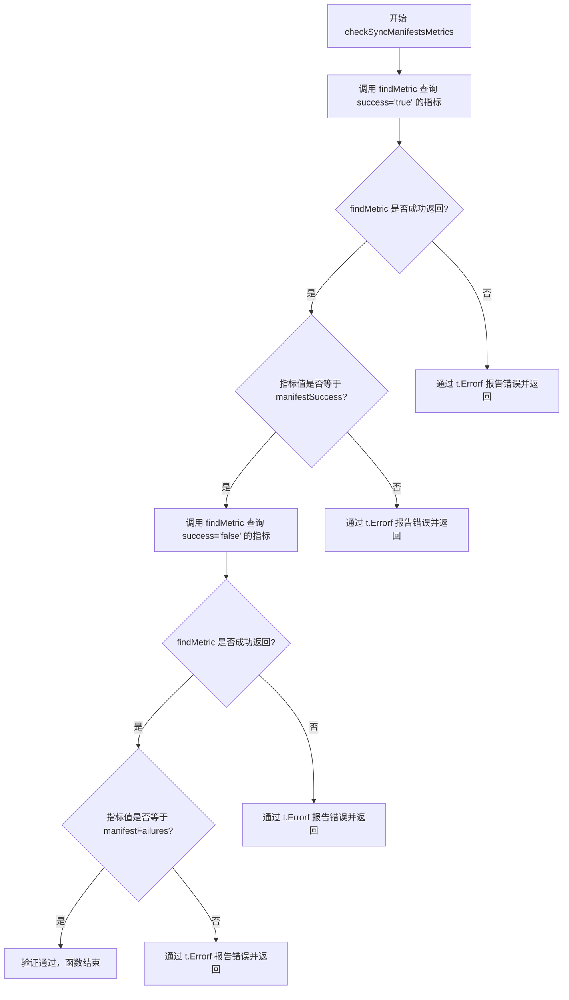

#### 带注释源码

```go
// checkSyncManifestsMetrics 验证 flux_daemon_sync_manifests Prometheus 指标的准确性
// 参数:
//   - t: 测试框架传入的测试对象，用于报告验证失败
//   - manifestSuccess: 期望的成功同步 manifest 数量
//   - manifestFailures: 期望的失败同步 manifest 数量
func checkSyncManifestsMetrics(t *testing.T, manifestSuccess, manifestFailures int) {
	// 查询 success='true' 标签的指标，表示成功同步的 manifests 数量
	if metric, err := findMetric("flux_daemon_sync_manifests", promdto.MetricType_GAUGE, "success", "true"); err != nil {
		// 如果查询指标失败，报告错误
		t.Errorf("Error collecting flux_daemon_sync_manifests{success='true'} metric: %v", err)
	} else if int(*metric.Gauge.Value) != manifestSuccess {
		// 如果指标值与期望值不符，报告错误
		t.Errorf("flux_daemon_sync_manifests{success='true'} must be %v. Got %v", manifestSuccess, *metric.Gauge.Value)
	}
	
	// 查询 success='false' 标签的指标，表示同步失败的 manifests 数量
	if metric, err := findMetric("flux_daemon_sync_manifests", promdto.MetricType_GAUGE, "success", "false"); err != nil {
		// 如果查询指标失败，报告错误
		t.Errorf("Error collecting flux_daemon_sync_manifests{success='false'} metric: %v", err)
	} else if int(*metric.Gauge.Value) != manifestFailures {
		// 如果指标值与期望值不符，报告错误
		t.Errorf("flux_daemon_sync_manifests{success='false'} must be %v. Got %v", manifestFailures, *metric.Gauge.Value)
	}
}
```


### `TestPullAndSync_InitialSync`

该函数是一个测试函数，用于测试 Flux Daemon 的初始同步功能。它创建一个 Daemon 实例，获取 Git 仓库的 HEAD 提交，执行同步操作，并验证同步是否正确调用、事件是否正确发出、sync tag 是否正确创建在 HEAD 位置，以及指标统计是否正确。

参数：

- `t`：`testing.T`，Go 测试框架的测试上下文，用于报告测试失败和错误

返回值：`void`，该函数没有显式返回值，通过 `t.Error()` 和 `t.Errorf()` 报告测试结果

#### 流程图

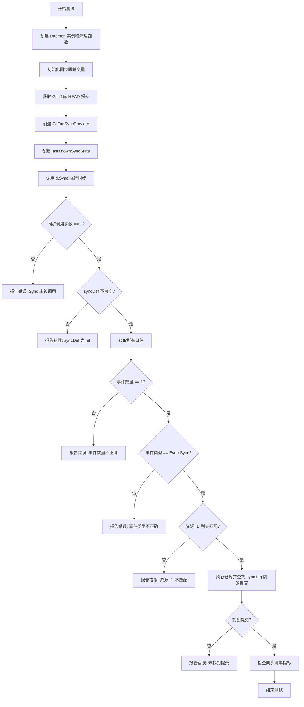

#### 带注释源码

```go
// TestPullAndSync_InitialSync 测试 Daemon 的初始同步功能
// 验证点：
// 1. Sync 方法被正确调用
// 2. 发出包含所有工作负载 ID 的同步事件
// 3. 在 HEAD 创建 sync tag
// 4. 正确的指标统计
func TestPullAndSync_InitialSync(t *testing.T) {
	// 创建 Daemon 实例，返回清理函数
	d, cleanup := daemon(t, testfiles.Files)
	defer cleanup()

	// 初始化同步跟踪变量
	syncCalled := 0                          // 记录 Sync 被调用的次数
	var syncDef *cluster.SyncSet            // 存储传入的 SyncSet 定义
	expectedResourceIDs := resource.IDs{}   // 预期的资源 ID 列表

	// 从测试文件中收集所有预期的资源 ID
	for id := range testfiles.ResourceMap {
		expectedResourceIDs = append(expectedResourceIDs, id)
	}
	expectedResourceIDs.Sort() // 排序以便后续比较

	// 设置 k8s mock 的 SyncFunc
	// 每次调用 Sync 时，记录调用次数并保存 SyncSet 定义
	k8s.SyncFunc = func(def cluster.SyncSet) error {
		syncCalled++
		syncDef = &def
		return nil
	}

	// 创建上下文并获取 Git 仓库的 HEAD 提交
	ctx := context.Background()
	head, err := d.Repo.BranchHead(ctx)
	if err != nil {
		t.Fatal(err)
	}

	// 创建 Git tag 同步提供者，使用 "sync" 作为 tag 名称
	syncTag := "sync"
	gitSync, _ := fluxsync.NewGitTagSyncProvider(d.Repo, syncTag, "", fluxsync.VerifySignaturesModeNone, d.GitConfig)
	
	// 创建同步状态跟踪器
	syncState := &lastKnownSyncState{logger: d.Logger, state: gitSync}

	// 执行同步操作
	if err := d.Sync(ctx, time.Now().UTC(), head, syncState); err != nil {
		t.Error(err)
	}

	// 验证点 1: Sync 必须被调用一次
	if syncCalled != 1 {
		t.Errorf("Sync was not called once, was called %d times", syncCalled)
	} else if syncDef == nil {
		t.Errorf("Sync was called with a nil syncDef")
	}

	// 验证点 2: 检查发出的事件
	// 获取所有事件（时间范围设置为全零表示获取所有）
	es, err := events.AllEvents(time.Time{}, -1, time.Time{})
	if err != nil {
		t.Error(err)
	} else if len(es) != 1 {
		t.Errorf("Unexpected events: %#v", es)
	} else if es[0].Type != event.EventSync {
		t.Errorf("Unexpected event type: %#v", es[0])
	} else {
		// 验证事件中包含所有工作负载 ID
		gotResourceIDs := es[0].ServiceIDs
		resource.IDs(gotResourceIDs).Sort()
		if !reflect.DeepEqual(gotResourceIDs, []resource.ID(expectedResourceIDs)) {
			t.Errorf("Unexpected event workload ids: %#v, expected: %#v", gotResourceIDs, expectedResourceIDs)
		}
	}

	// 验证点 3: 检查 sync tag 是否在 HEAD 创建
	if err := d.Repo.Refresh(context.Background()); err != nil {
		t.Errorf("pulling sync tag: %v", err)
	} else if revs, err := d.Repo.CommitsBefore(context.Background(), syncTag, false); err != nil {
		t.Errorf("finding revisions before sync tag: %v", err)
	} else if len(revs) <= 0 {
		t.Errorf("Found no revisions before the sync tag")
	}

	// 验证点 4: 检查同步清单指标
	// 成功的资源数量应该等于预期资源数量，失败数量为 0
	checkSyncManifestsMetrics(t, len(expectedResourceIDs), 0)
}
```


### `TestDoSync_NoNewCommits`

该函数是 Flux 项目中的一个测试函数，用于测试当 Git 仓库中没有新提交时的同步行为。它验证了在没有新提交的情况下，同步操作应该如何处理：应该执行同步但不产生任何事件，且不移动同步标签。

参数：

- `t *testing.T`：Go 标准测试框架中的测试对象，用于报告测试失败和日志输出

返回值：`void`（无返回值）

#### 流程图

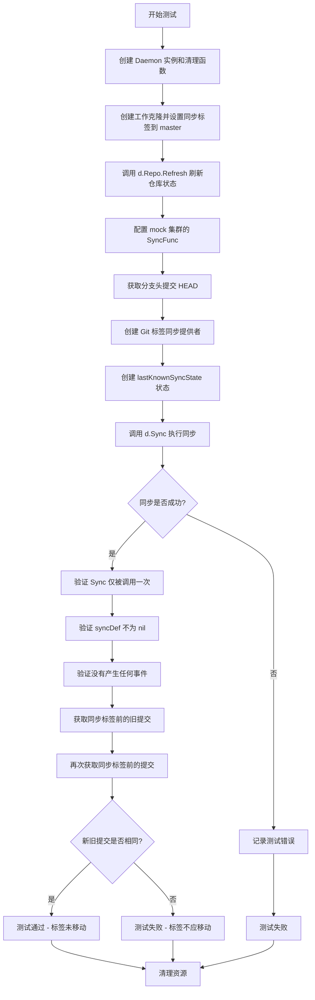

#### 带注释源码

```go
// TestDoSync_NoNewCommits 测试当没有新提交时的同步行为
// 该测试验证了以下场景：
// 1. 在已存在同步标签的情况下执行同步
// 2. 没有新提交需要同步
// 3. 同步操作应该成功执行但不产生事件
// 4. 同步标签不应被移动
func TestDoSync_NoNewCommits(t *testing.T) {
	// 创建 Daemon 实例和清理函数
	// daemon 函数初始化一个完整的测试环境，包括：
	// - Git 仓库（包含测试文件）
	// - Mock Kubernetes 集群
	// - Job 队列
	// - 事件写入器
	d, cleanup := daemon(t, testfiles.Files)
	// 确保测试结束后清理资源
	defer cleanup()

	// 定义同步标签名称
	var syncTag = "syncity"

	// 创建上下文
	ctx := context.Background()
	
	// 在工作克隆中执行操作：将同步标签移动到 master 分支的头部
	// WithWorkingClone 提供一个临时的可写 Git 检出来操作
	err := d.WithWorkingClone(ctx, func(co *git.Checkout) error {
		// 创建带超时的子上下文（5秒超时）
		ctx, cancel := context.WithTimeout(ctx, 5*time.Second)
		// 确保超时后取消上下文
		defer cancel()
		
		// 定义标签操作：创建/移动标签到指定提交
		tagAction := git.TagAction{
			Tag:      syncTag,       // 标签名称
			Revision: "master",      // 要标记的提交（master 分支头部）
			Message:  "Sync pointer", // 标签消息
		}
		// 移动标签并推送到远程
		return co.MoveTagAndPush(ctx, tagAction)
	})
	// 如果创建标签失败，终止测试
	if err != nil {
		t.Fatal(err)
	}

	// 刷新本地仓库状态，获取远程最新内容
	// 注意：这通常会在运行中的循环触发同步，但我们没有运行循环
	if err = d.Repo.Refresh(ctx); err != nil {
		t.Error(err)
	}

	// 初始化同步计数器和一个用于接收同步定义的变量
	syncCalled := 0
	var syncDef *cluster.SyncSet
	
	// 从测试文件资源映射构建期望的资源 ID 列表
	expectedResourceIDs := resource.IDs{}
	for id := range testfiles.ResourceMap {
		expectedResourceIDs = append(expectedResourceIDs, id)
	}
	// 对资源 ID 进行排序以确保顺序一致
	expectedResourceIDs.Sort()
	
	// 设置 Mock 集群的同步函数
	// 每次调用集群同步时，增加计数器并保存同步定义
	k8s.SyncFunc = func(def cluster.SyncSet) error {
		syncCalled++
		syncDef = &def
		return nil
	}

	// 获取当前分支的头部提交（master 分支的最新提交）
	head, err := d.Repo.BranchHead(ctx)
	if err != nil {
		t.Fatal(err)
	}

	// 创建 Git 标签同步提供者
	// 用于管理同步标签（记录已同步到的提交）
	gitSync, _ := fluxsync.NewGitTagSyncProvider(
		d.Repo, 
		syncTag, 
		"", 
		fluxsync.VerifySignaturesModeNone, 
		d.GitConfig,
	)
	
	// 创建上一次已知的同步状态
	syncState := &lastKnownSyncState{
		logger: d.Logger, 
		state: gitSync,
	}

	// 执行同步操作
	// 参数：上下文、当前时间、头部提交、同步状态
	if err := d.Sync(ctx, time.Now().UTC(), head, syncState); err != nil {
		t.Error(err)
	}

	// 验证同步被调用了一次
	// 因为没有新提交，理论上应该同步所有资源一次
	if syncCalled != 1 {
		t.Errorf("Sync was not called once, was called %d times", syncCalled)
	} else if syncDef == nil {
		t.Errorf("Sync was called with a nil syncDef")
	}

	// 验证没有产生任何同步事件
	// 因为没有新提交，所以不应该记录任何资源变更事件
	es, err := events.AllEvents(time.Time{}, -1, time.Time{})
	if err != nil {
		t.Error(err)
	} else if len(es) != 0 {
		t.Errorf("Unexpected events: %#v", es)
	}

	// 验证同步标签没有被移动
	// 获取当前同步标签前的提交列表
	oldRevs, err := d.Repo.CommitsBefore(ctx, syncTag, false)
	if err != nil {
		t.Fatal(err)
	}

	// 再次获取同步标签前的提交，与之前的结果比较
	if revs, err := d.Repo.CommitsBefore(ctx, syncTag, false); err != nil {
		t.Errorf("finding revisions before sync tag: %v", err)
	} else if !reflect.DeepEqual(revs, oldRevs) {
		// 如果提交列表发生变化，说明标签被移动了，这是不期望的行为
		t.Errorf("Should have kept the sync tag at HEAD")
	}
	// 测试结束，defer 的 cleanup 会清理资源
}
```


### `TestDoSync_WithNewCommit`

该测试函数验证了 Daemon 在 Git 仓库中有新提交时的同步行为。测试创建一个同步标签，修改仓库中的资源清单文件（将副本数从 5 改为 4），提交并推送更改，然后执行同步操作，最后验证同步是否正确应用更改、发送事件并移动同步标签。

参数：

- `t`：`testing.T`，Go 标准测试框架的测试对象，用于报告测试状态和失败

返回值：无（`void`），Go 测试函数不返回值

#### 流程图

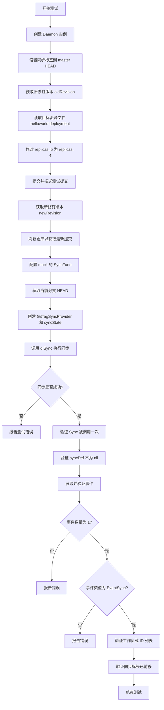

#### 带注释源码

```go
// TestDoSync_WithNewCommit 测试当仓库中有新提交时的同步行为
// 测试步骤：
// 1. 创建 daemon 实例并初始化测试环境
// 2. 设置同步标签到当前 HEAD
// 3. 修改资源清单文件（将副本数从 5 改为 4）
// 4. 提交并推送新更改
// 5. 执行同步操作
// 6. 验证同步结果、事件和标签移动
func TestDoSync_WithNewCommit(t *testing.T) {
	// 创建 daemon 实例和清理函数
	d, cleanup := daemon(t, testfiles.Files)
	// 测试结束后执行清理
	defer cleanup()

	// 使用背景上下文
	ctx := background.Background()

	// 定义同步标签名称
	var syncTag = "syncy-mcsyncface"
	
	// 用于存储新旧修订版本
	var oldRevision, newRevision string
	
	// 在工作克隆中执行操作
	err := d.WithWorkingClone(ctx, func(checkout *git.Checkout) error {
		// 创建 5 秒超时的上下文
		ctx, cancel := context.WithTimeout(ctx, 5*time.Second)
		defer cancel()

		var err error
		
		// 创建标签操作：将同步标签移动到 master
		tagAction := git.TagAction{
			Tag:      syncTag,
			Revision: "master",
			Message:  "Sync pointer",
		}
		
		// 移动标签并推送
		err = checkout.MoveTagAndPush(ctx, tagAction)
		if err != nil {
			return err
		}
		
		// 获取移动标签前的修订版本
		oldRevision, err = checkout.HeadRevision(ctx)
		if err != nil {
			return err
		}
		
		// 获取所有资源以找到目标资源
		cm := manifests.NewRawFiles(checkout.Dir(), checkout.AbsolutePaths(), d.Manifests)
		resourcesByID, err := cm.GetAllResourcesByID(context.TODO())
		if err != nil {
			return err
		}
		
		// 目标资源：default 命名空间的 helloworld deployment
		targetResource := "default:deployment/helloworld"
		res, ok := resourcesByID[targetResource]
		if !ok {
			return fmt.Errorf("resource not found: %q", targetResource)
		}

		// 获取资源文件的绝对路径
		absolutePath := path.Join(checkout.Dir(), res.Source())
		
		// 读取文件内容
		def, err := ioutil.ReadFile(absolutePath)
		if err != nil {
			return err
		}
		
		// 修改副本数：将 "replicas: 5" 替换为 "replicas: 4"
		newDef := bytes.Replace(def, []byte("replicas: 5"), []byte("replicas: 4"), -1)
		
		// 写回修改后的文件
		if err := ioutil.WriteFile(absolutePath, newDef, 0600); err != nil {
			return err
		}

		// 创建提交操作
		commitAction := git.CommitAction{Author: "", Message: "test commit"}
		
		// 提交并推送更改
		err = checkout.CommitAndPush(ctx, commitAction, nil, false)
		if err != nil {
			return err
		}
		
		// 获取提交后的新修订版本
		newRevision, err = checkout.HeadRevision(ctx)
		return err
	})
	
	// 如果设置测试环境失败，报告致命错误
	if err != nil {
		t.Fatal(err)
	}

	// 刷新仓库以获取最新更改
	err = d.Repo.Refresh(ctx)
	if err != nil {
		t.Error(err)
	}

	// 用于跟踪 Sync 调用次数
	syncCalled := 0
	var syncDef *cluster.SyncSet
	
	// 构建期望的资源 ID 列表
	expectedResourceIDs := resource.IDs{}
	for id := range testfiles.ResourceMap {
		expectedResourceIDs = append(expectedResourceIDs, id)
	}
	expectedResourceIDs.Sort()
	
	// 设置 mock 的 SyncFunc 来捕获同步调用
	k8s.SyncFunc = func(def cluster.SyncSet) error {
		syncCalled++
		syncDef = &def
		return nil
	}

	// 获取当前分支的 HEAD
	head, err := d.Repo.BranchHead(ctx)
	if err != nil {
		t.Fatal(err)
	}

	// 创建 Git 标签同步提供者和同步状态
	gitSync, _ := fluxsync.NewGitTagSyncProvider(d.Repo, syncTag, "", fluxsync.VerifySignaturesModeNone, d.GitConfig)
	syncState := &lastKnownSyncState{logger: d.Logger, state: gitSync}

	// 执行同步操作
	if err := d.Sync(ctx, time.Now().UTC(), head, syncState); err != nil {
		t.Error(err)
	}

	// 验证同步被调用一次
	if syncCalled != 1 {
		t.Errorf("Sync was not called once, was called %d times", syncCalled)
	} else if syncDef == nil {
		t.Errorf("Sync was called with a nil syncDef")
	}

	// 验证事件被正确发出，且只包含更改的工作负载 ID
	es, err := events.AllEvents(time.Time{}, -1, time.Time{})
	if err != nil {
		t.Error(err)
	} else if len(es) != 1 {
		t.Errorf("Unexpected events: %#v", es)
	} else if es[0].Type != event.EventSync {
		t.Errorf("Unexpected event type: %#v", es[0])
	} else {
		// 获取事件中的资源 ID 并排序
		gotResourceIDs := es[0].ServiceIDs
		resource.IDs(gotResourceIDs).Sort()
		
		// 验证只包含 helloworld 这个更改的资源
		if !reflect.DeepEqual(gotResourceIDs, []resource.ID{resource.MustParseID("default:deployment/helloworld")}) {
			t.Errorf("Unexpected event workload ids: %#v, expected: %#v", gotResourceIDs, []resource.ID{resource.MustParseID("default:deployment/helloworld")})
		}
	}
	
	// 验证同步标签已向前移动
	ctx, cancel := context.WithTimeout(ctx, 5*time.Second)
	defer cancel()
	
	if err := d.Repo.Refresh(ctx); err != nil {
		t.Errorf("pulling sync tag: %v", err)
	} else if revs, err := d.Repo.CommitsBetween(ctx, oldRevision, syncTag, false); err != nil {
		t.Errorf("finding revisions before sync tag: %v", err)
	} else if len(revs) <= 0 {
		t.Errorf("Should have moved sync tag forward")
	} else if revs[len(revs)-1].Revision != newRevision {
		// 验证标签移动到了最新的提交
		t.Errorf("Should have moved sync tag to HEAD (%s), but was moved to: %s", newRevision, revs[len(revs)-1].Revision)
	}
}
```


### `TestDoSync_WithKustomize`

该测试函数验证Flux Daemon能够正确处理使用Kustomize生成的资源，并在Git仓库中有新提交时执行同步操作，同时正确移动同步标签。

参数：

- `t`：`testing.T`，Go标准测试框架的测试对象，用于报告测试失败和日志输出

返回值：无（`void`），Go测试函数默认返回void

#### 流程图

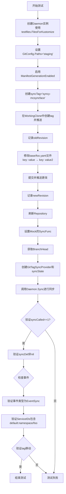

#### 带注释源码

```go
// TestDoSync_WithKustomize 测试使用Kustomize生成的资源的同步功能
func TestDoSync_WithKustomize(t *testing.T) {
	// 创建daemon实例，使用Kustomize测试文件
	d, cleanup := daemon(t, testfiles.FilesForKustomize)
	defer cleanup()

	// 设置Git配置中的路径过滤为"staging"目录
	d.GitConfig.Paths = []string{"staging"}
	// 启用Manifest生成功能
	d.ManifestGenerationEnabled = true

	// 创建测试上下文
	ctx := context.Background()

	// 定义同步标签名称
	var syncTag = "syncy-mcsyncface"
	// 用于记录旧的和新的提交版本
	var oldRevision, newRevision string
	
	// 在工作副本中执行一系列Git操作
	err := d.WithWorkingClone(ctx, func(checkout *git.Checkout) error {
		// 创建5秒超时的上下文
		ctx, cancel := context.WithTimeout(ctx, 5*time.Second)
		defer cancel()

		var err error
		// 创建标签操作：把syncTag标签移动到master分支头部
		tagAction := git.TagAction{
			Tag:      syncTag,
			Revision: "master",
			Message:  "Sync pointer",
		}
		// 移动标签并推送到远程
		err = checkout.MoveTagAndPush(ctx, tagAction)
		if err != nil {
			return err
		}
		// 记录移动标签前的HEAD版本
		oldRevision, err = checkout.HeadRevision(ctx)
		if err != nil {
			return err
		}

		// 读取并修改Kustomize基础文件
		absolutePath := path.Join(checkout.Dir(), "base", "foo.yaml")
		def, err := ioutil.ReadFile(absolutePath)
		if err != nil {
			return err
		}

		// 将文件中的"key: value"替换为"key: value2"
		newDef := bytes.Replace(def, []byte("key: value"), []byte("key: value2"), -1)
		// 写回修改后的文件
		if err := ioutil.WriteFile(absolutePath, newDef, 0600); err != nil {
			return err
		}

		// 创建提交操作
		commitAction := git.CommitAction{Author: "", Message: "test commit"}
		// 提交更改并推送，第四个参数true表示需要生成Manifest
		err = checkout.CommitAndPush(ctx, commitAction, nil, true)
		if err != nil {
			return err
		}
		// 记录新的HEAD版本
		newRevision, err = checkout.HeadRevision(ctx)
		return err
	})
	// 如果操作失败则终止测试
	if err != nil {
		t.Fatal(err)
	}

	// 刷新本地仓库以获取远程最新更改
	err = d.Repo.Refresh(ctx)
	if err != nil {
		t.Error(err)
	}

	// 用于记录Sync函数被调用的次数和同步定义
	syncCalled := 0
	var syncDef *cluster.SyncSet
	// 设置Mock的SyncFunc来拦截同步操作
	k8s.SyncFunc = func(def cluster.SyncSet) error {
		syncCalled++
		syncDef = &def
		return nil
	}

	// 获取当前分支的头部提交
	head, err := d.Repo.BranchHead(ctx)
	if err != nil {
		t.Fatal(err)
	}

	// 创建Git标签同步状态提供者
	gitSync, _ := fluxsync.NewGitTagSyncProvider(d.Repo, syncTag, "", fluxsync.VerifySignaturesModeNone, d.GitConfig)
	// 创建同步状态对象
	syncState := &lastKnownSyncState{logger: d.Logger, state: gitSync}

	// 执行实际的同步操作
	if err := d.Sync(ctx, time.Now().UTC(), head, syncState); err != nil {
		t.Error(err)
	}

	// 验证同步被调用了一次
	if syncCalled != 1 {
		t.Errorf("Sync was not called once, was called %d times", syncCalled)
	} else if syncDef == nil {
		t.Errorf("Sync was called with a nil syncDef")
	}

	// 验证发出的事件包含正确的资源ID
	es, err := events.AllEvents(time.Time{}, -1, time.Time{})
	if err != nil {
		t.Error(err)
	} else if len(es) != 1 {
		t.Errorf("Unexpected events: %#v", es)
	} else if es[0].Type != event.EventSync {
		t.Errorf("Unexpected event type: %#v", es[0])
	} else {
		// 获取事件中的资源ID并排序以便比较
		gotResourceIDs := es[0].ServiceIDs
		resource.IDs(gotResourceIDs).Sort()
		// 验证事件包含预期的namespace资源
		if !reflect.DeepEqual(gotResourceIDs, []resource.ID{resource.MustParseID("default:namespace/foo")}) {
			t.Errorf("Unexpected event workload ids: %#v, expected: %#v", gotResourceIDs, []resource.ID{resource.MustParseID("default:namespace/foo")})
		}
	}

	// 验证同步标签已移动到新的提交
	ctx, cancel := context.WithTimeout(ctx, 5*time.Second)
	defer cancel()
	if err := d.Repo.Refresh(ctx); err != nil {
		t.Errorf("pulling sync tag: %v", err)
	} else if revs, err := d.Repo.CommitsBetween(ctx, oldRevision, syncTag, false); err != nil {
		t.Errorf("finding revisions before sync tag: %v", err)
	} else if len(revs) <= 0 {
		t.Errorf("Should have moved sync tag forward")
	} else if revs[len(revs)-1].Revision != newRevision {
		t.Errorf("Should have moved sync tag to HEAD (%s), but was moved to: %s", newRevision, revs[len(revs)-1].Revision)
	}
}
```


### `TestDoSync_WithMultidoc`

这是一个测试函数，用于验证 Flux Daemon 在处理多文档（multidoc）YAML 文件时的同步行为。测试创建一个带有多个 YAML 文档的测试环境，模拟 Git 仓库中的变更，并验证同步操作能够正确识别和应用这些变更。

参数：

- `t`：`testing.T`，Go 语言标准的测试框架对象，用于报告测试失败和日志输出

返回值：无（Go 测试函数不返回值，通过 `t` 对象进行断言）

#### 流程图

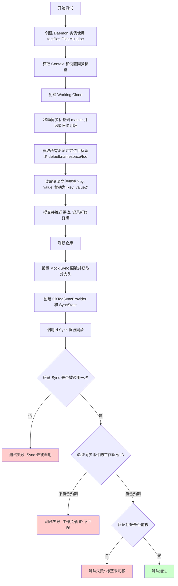

#### 带注释源码

```go
// TestDoSync_WithMultidoc 测试多文档 YAML 文件的同步功能
func TestDoSync_WithMultidoc(t *testing.T) {
    // 1. 创建 Daemon 实例，使用多文档测试文件
    d, cleanup := daemon(t, testfiles.FilesMultidoc)
    defer cleanup() // 确保测试结束后清理资源

    ctx := context.Background()

    // 2. 定义同步标签名称
    var syncTag = "syncy-mcsyncface"
    
    // 3. 用于记录旧的和新的修订版本
    var oldRevision, newRevision string
    
    // 4. 在工作克隆中执行操作
    err := d.WithWorkingClone(ctx, func(checkout *git.Checkout) error {
        // 设置 5 秒超时
        ctx, cancel := context.WithTimeout(ctx, 5*time.Second)
        defer cancel()

        var err error
        
        // 5. 创建标签动作：将 syncTag 移动到 master 分支
        tagAction := git.TagAction{
            Tag:      syncTag,
            Revision: "master",
            Message:  "Sync pointer",
        }
        err = checkout.MoveTagAndPush(ctx, tagAction)
        if err != nil {
            return err
        }
        
        // 6. 记录移动标签前的修订版
        oldRevision, err = checkout.HeadRevision(ctx)
        if err != nil {
            return err
        }
        
        // 7. 获取所有资源（支持多文档）
        cm := manifests.NewRawFiles(checkout.Dir(), checkout.AbsolutePaths(), d.Manifests)
        resourcesByID, err := cm.GetAllResourcesByID(context.TODO())
        if err != nil {
            return err
        }
        
        // 8. 定位目标资源
        targetResource := "default:namespace/foo"
        res, ok := resourcesByID[targetResource]
        if !ok {
            return fmt.Errorf("resource not found: %q", targetResource)
        }

        // 9. 读取资源文件内容
        absolutePath := path.Join(checkout.Dir(), res.Source())
        def, err := ioutil.ReadFile(absolutePath)
        if err != nil {
            return err
        }
        
        // 10. 修改文件内容：将 'key: value' 替换为 'key: value2'
        newDef := bytes.Replace(def, []byte("key: value"), []byte("key: value2"), -1)
        if err := ioutil.WriteFile(absolutePath, newDef, 0600); err != nil {
            return err
        }

        // 11. 提交更改
        commitAction := git.CommitAction{Author: "", Message: "test commit"}
        err = checkout.CommitAndPush(ctx, commitAction, nil, false)
        if err != nil {
            return err
        }
        
        // 12. 记录新的修订版
        newRevision, err = checkout.HeadRevision(ctx)
        return err
    })
    
    // 13. 检查工作克隆操作是否成功
    if err != nil {
        t.Fatal(err)
    }

    // 14. 刷新仓库以获取最新更改
    err = d.Repo.Refresh(ctx)
    if err != nil {
        t.Error(err)
    }

    // 15. 初始化同步相关变量
    syncCalled := 0
    var syncDef *cluster.SyncSet
    expectedResourceIDs := resource.IDs{}
    for id := range testfiles.ResourceMap {
        expectedResourceIDs = append(expectedResourceIDs, id)
    }
    expectedResourceIDs.Sort()
    
    // 16. 设置 Mock 集群同步函数
    k8s.SyncFunc = func(def cluster.SyncSet) error {
        syncCalled++
        syncDef = &def
        return nil
    }

    // 17. 获取分支头部修订版
    head, err := d.Repo.BranchHead(ctx)
    if err != nil {
        t.Fatal(err)
    }

    // 18. 创建 Git 标签同步提供者和同步状态
    gitSync, _ := fluxsync.NewGitTagSyncProvider(d.Repo, syncTag, "", fluxsync.VerifySignaturesModeNone, d.GitConfig)
    syncState := &lastKnownSyncState{logger: d.Logger, state: gitSync}

    // 19. 执行同步操作
    if err := d.Sync(ctx, time.Now().UTC(), head, syncState); err != nil {
        t.Error(err)
    }

    // 20. 验证同步被调用一次
    if syncCalled != 1 {
        t.Errorf("Sync was not called once, was called %d times", syncCalled)
    } else if syncDef == nil {
        t.Errorf("Sync was called with a nil syncDef")
    }

    // 21. 验证同步事件包含正确的工作负载 ID
    es, err := events.AllEvents(time.Time{}, -1, time.Time{})
    if err != nil {
        t.Error(err)
    } else if len(es) != 1 {
        t.Errorf("Unexpected events: %#v", es)
    } else if es[0].Type != event.EventSync {
        t.Errorf("Unexpected event type: %#v", es[0])
    } else {
        gotResourceIDs := es[0].ServiceIDs
        resource.IDs(gotResourceIDs).Sort()

        // 预期的工作负载 ID 列表（可能是两种顺序之一）
        expected0 := []resource.ID{
            resource.MustParseID("default:namespace/foo"),
            resource.MustParseID("default:namespace/bar"),
        }
        expected1 := []resource.ID{
            resource.MustParseID("default:namespace/bar"),
            resource.MustParseID("default:namespace/foo"),
        }

        // 验证事件只包含已更改的工作负载 ID
        if !(reflect.DeepEqual(gotResourceIDs, expected0) || reflect.DeepEqual(gotResourceIDs, expected1)) {
            t.Errorf("Unexpected event workload ids: %#v, expected: %#v", gotResourceIDs, expected0)
        }
    }
    
    // 22. 验证同步标签已前移
    ctx, cancel := context.WithTimeout(ctx, 5*time.Second)
    defer cancel()
    if err := d.Repo.Refresh(ctx); err != nil {
        t.Errorf("pulling sync tag: %v", err)
    } else if revs, err := d.Repo.CommitsBetween(ctx, oldRevision, syncTag, false); err != nil {
        t.Errorf("finding revisions before sync tag: %v", err)
    } else if len(revs) <= 0 {
        t.Errorf("Should have moved sync tag forward")
    } else if revs[len(revs)-1].Revision != newRevision {
        t.Errorf("Should have moved sync tag to HEAD (%s), but was moved to: %s", newRevision, revs[len(revs)-1].Revision)
    }
}
```


### `TestDoSync_WithErrors`

该测试函数验证 Flux daemon 在同步过程中遇到错误的处理能力，包括无效 manifest 导致的同步失败、以及 k8s 资源同步错误时的行为和指标统计。

参数：

- `t`：`*testing.T`，Go 测试框架的测试实例指针，用于报告测试失败和日志输出

返回值：无（Go 测试函数返回 void）

#### 流程图

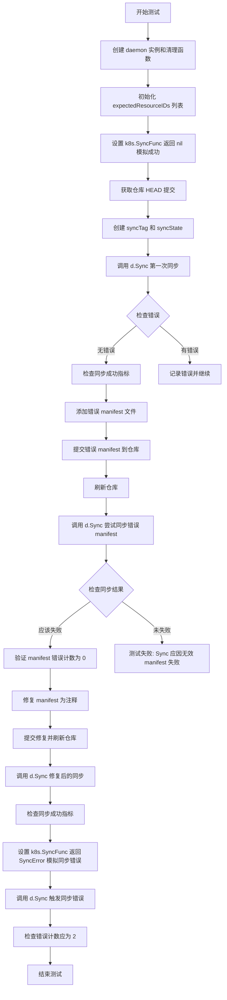

#### 带注释源码

```go
// TestDoSync_WithErrors 测试 daemon 在同步过程中遇到各种错误时的行为
// 包括无效 manifest 导致的同步失败和 k8s 资源同步错误的情况
func TestDoSync_WithErrors(t *testing.T) {
	// 创建 daemon 实例和测试结束时的清理函数
	d, cleanup := daemon(t, testfiles.Files)
	// 确保测试结束后执行清理
	defer cleanup()

	// 初始化预期的资源 ID 列表，从测试文件资源映射中收集所有资源 ID
	expectedResourceIDs := resource.IDs{}
	for id := range testfiles.ResourceMap {
		expectedResourceIDs = append(expectedResourceIDs, id)
	}

	// 设置 k8s mock 的 SyncFunc，返回 nil 表示同步成功
	k8s.SyncFunc = func(def cluster.SyncSet) error {
		return nil
	}

	// 创建上下文并获取仓库当前 HEAD 提交
	ctx := context.Background()
	head, err := d.Repo.BranchHead(ctx)
	if err != nil {
		t.Fatal(err)
	}

	// 创建同步标签和同步状态
	syncTag := "sync"
	gitSync, _ := fluxsync.NewGitTagSyncProvider(d.Repo, syncTag, "", fluxsync.VerifySignaturesModeNone, d.GitConfig)
	syncState := &lastKnownSyncState{logger: d.Logger, state: gitSync}

	// 执行第一次同步（应该成功）
	if err := d.Sync(ctx, time.Now().UTC(), head, syncState); err != nil {
		t.Error(err)
	}

	// 检查同步成功指标，验证没有错误
	checkSyncManifestsMetrics(t, len(expectedResourceIDs), 0)

	// ==== 步骤 1: 添加无效的 manifest 文件 ====
	// 在工作副本中创建一个无效的 manifest
	err = d.WithWorkingClone(ctx, func(checkout *git.Checkout) error {
		// 设置 5000 秒超时的上下文（这里应该是 5000 毫秒，可能是测试代码的 bug）
		ctx, cancel := context.WithTimeout(ctx, 5000*time.Second)
		defer cancel()

		// 构造错误 manifest 的路径
		absolutePath := path.Join(checkout.Dir(), "error_manifest.yaml")
		// 写入无效的 manifest 内容（不是有效的 YAML/Kubernetes manifest）
		if err := ioutil.WriteFile(absolutePath, []byte("Manifest that must produce errors"), 0600); err != nil {
			return err
		}
		// 提交这个错误 manifest
		commitAction := git.CommitAction{Author: "", Message: "test error commit"}
		err = checkout.CommitAndPush(ctx, commitAction, nil, true)
		if err != nil {
			return err
		}
		return err
	})
	if err != nil {
		t.Fatal(err)
	}

	// 刷新仓库以获取最新提交
	err = d.Repo.Refresh(ctx)
	if err != nil {
		t.Error(err)
	}

	// 尝试同步 HEAD（应该因为无效 manifest 而失败）
	if err := d.Sync(ctx, time.Now().UTC(), "HEAD", syncState); err != nil {
		// 验证错误非空，且 manifest 计数器保持不变（因为 manifest 解析失败）
		checkSyncManifestsMetrics(t, len(expectedResourceIDs), 0)
	} else {
		// 如果没有返回错误，测试失败（因为无效 manifest 应该导致同步失败）
		t.Error("Sync must fail because of invalid manifest")
	}

	// ==== 步骤 2: 修复 manifest ====
	// 将无效 manifest 替换为注释（有效的 YAML）
	err = d.WithWorkingClone(ctx, func(checkout *git.Checkout) error {
		ctx, cancel := context.WithTimeout(ctx, 5000*time.Second)
		defer cancel()

		absolutePath := path.Join(checkout.Dir(), "error_manifest.yaml")
		// 写入有效的 YAML 注释
		if err := ioutil.WriteFile(absolutePath, []byte("# Just comment"), 0600); err != nil {
			return err
		}
		// 提交修复
		commitAction := git.CommitAction{Author: "", Message: "test fix commit"}
		err = checkout.CommitAndPush(ctx, commitAction, nil, true)
		if err != nil {
			return err
		}
		return err
	})

	if err != nil {
		t.Fatal(err)
	}

	// 刷新仓库
	err = d.Repo.Refresh(ctx)
	if err != nil {
		t.Error(err)
	}

	// 再次同步（应该成功）
	if err := d.Sync(ctx, time.Now().UTC(), "HEAD", syncState); err != nil {
		t.Error(err)
	}
	// 检查同步成功指标
	checkSyncManifestsMetrics(t, len(expectedResourceIDs), 0)

	// ==== 步骤 3: 模拟 k8s 同步错误 ====
	// 修改 SyncFunc 返回 SyncError，模拟 k8s 资源同步失败
	k8s.SyncFunc = func(def cluster.SyncSet) error {
		// 返回包含两个资源错误的 SyncError
		return cluster.SyncError{
			cluster.ResourceError{resource.MustParseID("mynamespace:deployment/depl1"), "src1", fmt.Errorf("Error1")},
			cluster.ResourceError{resource.MustParseID("mynamespace:deployment/depl2"), "src2", fmt.Errorf("Error2")},
		}
	}

	// 执行同步（虽然返回错误，但 daemon 仍会记录同步尝试）
	if err := d.Sync(ctx, time.Now().UTC(), "HEAD", syncState); err != nil {
		t.Error(err)
	}

	// 检查同步错误指标：成功同步的资源数减少 2，错误计数为 2
	checkSyncManifestsMetrics(t, len(expectedResourceIDs)-2, 2)
}
```


### `Daemon.Sync`

该方法是中国代码库 Fluxcd Flux 中的核心同步功能，负责将 Git 仓库中的清单文件与 Kubernetes 集群进行同步。它会获取所有资源，比较新旧版本之间的差异，并调用集群同步接口将变更应用到集群中。

参数：

-  `ctx`：`context.Context`，上下文对象，用于传递请求级别的取消、超时和截止时间等信息
-  `now`：`time.Time`，当前时间的时间戳，用于记录同步操作的时间
-  `newRev`：`string`，Git 仓库的新提交修订版本（HEAD）
-  `syncState`：`interface{}`（实际类型为 `*lastKnownSyncState`），表示上一次同步状态的记录器，用于追踪同步进度和判断是否有新提交需要处理

返回值：`error`，如果同步过程中发生错误则返回错误信息，否则返回 nil

#### 流程图

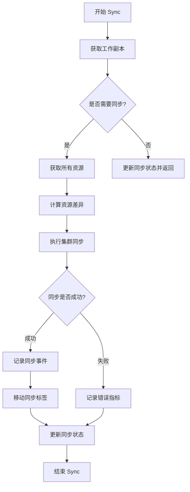

#### 带注释源码

```go
// 注意：这是基于测试代码中的调用模式推断的方法签名
// 实际的 Sync 方法实现应该在 daemon.go 主文件中

// Sync 方法的典型调用方式（来自测试代码）：
// head, err := d.Repo.BranchHead(ctx)  // 获取当前分支的 HEAD 修订版本
// gitSync, _ := fluxsync.NewGitTagSyncProvider(d.Repo, syncTag, "", fluxsync.VerifySignuresModeNone, d.GitConfig)
// syncState := &lastKnownSyncState{logger: d.Logger, state: gitSync}
// 
// if err := d.Sync(ctx, time.Now().UTC(), head, syncState); err != nil {
//     t.Error(err)
// }

// 参数说明：
// ctx: 上下文对象，用于控制超时和取消
// time.Now().UTC(): 同步操作的当前时间戳
// head: Git 仓库的最新修订版本（从 d.Repo.BranchHead 获取）
// syncState: 同步状态记录器，包含上一次同步的信息

// 返回值：
// error: 同步过程中可能发生的错误，如资源解析错误、集群同步错误等
```


根据提供的代码，我注意到这段代码是测试代码，主要测试 `Daemon` 类的行为。代码中多次调用了 `d.WithWorkingClone(ctx, func(checkout *git.Checkout) error { ... })` 方法，但没有包含该方法的具体实现。

让我分析代码中 `WithWorkingClone` 的使用方式来提取相关信息：

### `Daemon.WithWorkingClone`

这是 `Daemon` 类的一个方法，用于在 Git 工作副本上执行操作。该方法接受一个上下文和一个回调函数，允许调用者在克隆的 Git 仓库工作目录中执行自定义操作。

参数：

- `ctx`：`context.Context`，上下文，用于控制超时和取消操作
- `work`：函数类型 `func(*git.Checkout) error`，用户自定义的操作函数，接收一个 `git.Checkout` 指针（代表 Git 仓库的工作副本），返回操作结果错误

返回值：`error`，返回执行过程中的错误，如果回调函数执行成功则返回 nil

#### 流程图

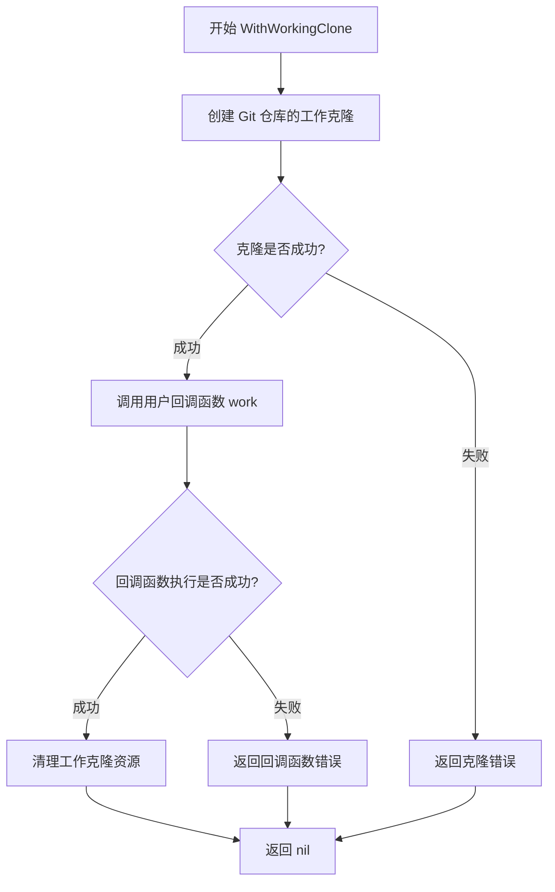

#### 带注释源码

```go
// 代码中调用 WithWorkingClone 的示例
// 来自 TestDoSync_WithNewCommit 测试函数

err := d.WithWorkingClone(ctx, func(checkout *git.Checkout) error {
    ctx, cancel := context.WithTimeout(ctx, 5*time.Second)
    defer cancel()

    var err error
    tagAction := git.TagAction{
        Tag:      syncTag,
        Revision: "master",
        Message:  "Sync pointer",
    }
    err = checkout.MoveTagAndPush(ctx, tagAction)
    if err != nil {
        return err
    }
    oldRevision, err = checkout.HeadRevision(ctx)
    if err != nil {
        return err
    }
    // ... 更多操作 ...
    
    commitAction := git.CommitAction{Author: "", Message: "test commit"}
    err = checkout.CommitAndPush(ctx, commitAction, nil, false)
    if err != nil {
        return err
    }
    newRevision, err = checkout.HeadRevision(ctx)
    return err
})
if err != nil {
    t.Fatal(err)
}
```

---

**注意**：提供的代码片段是测试代码（test file），`WithWorkingClone` 方法的实际实现应该在 `daemon` 包的非测试源文件中。由于只提供了测试代码，无法提取完整的方法实现细节。上述信息是基于测试代码中的使用模式推断得出的。


根据提供的代码，我需要分析 `Daemon.Repo.BranchHead` 方法。从代码中可以看到，这是在 `git.Repo` 接口上调用的方法，但实际的实现并未包含在当前的测试文件中。

让我从代码中提取相关信息：

### `Daemon.Repo.BranchHead`

获取 Git 仓库当前分支的头部提交修订版本（SHA）。

参数：

- `ctx`：`context.Context`，用于控制请求的取消和超时

返回值：`string`，返回当前分支头部提交的 SHA 哈希值；`error`，如果获取失败则返回错误信息

#### 流程图

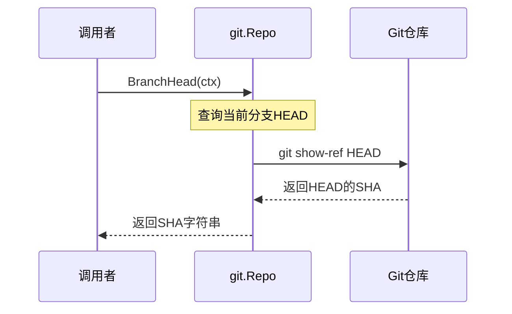

#### 带注释源码

从测试代码中的使用方式推断：

```go
// 从测试代码中的典型用法：
head, err := d.Repo.BranchHead(ctx)
if err != nil {
    t.Fatal(err)
}

// 使用获取到的HEAD修订版进行同步
if err := d.Sync(ctx, time.Now().UTC(), head, syncState); err != nil {
    t.Error(err)
}
```

### 详细说明

根据代码中的使用模式，`BranchHead` 方法：

1. **功能**：获取配置分支（默认 "master"）当前的头部提交 revision
2. **调用场景**：
   - 在执行同步操作前获取当前的 HEAD 修订版
   - 用于判断是否有新的提交需要同步
   - 作为 `Sync` 方法的参数之一
3. **错误处理**：如果仓库状态异常或无法读取 HEAD，则返回 error
4. **返回值格式**：返回字符串格式的 SHA 哈希值（如 "abc123..."）

> **注意**：实际的 `BranchHead` 方法定义在 `github.com/fluxcd/flux/pkg/git` 包中的 `Repo` 接口实现类中，当前代码文件是测试文件，仅展示了该方法的使用方式。


根据代码分析，`Daemon.Repo.Refresh` 是对 `git.Repo` 对象的 `Refresh` 方法的调用。从代码中的使用模式来看，这个方法属于 `git.Repo` 接口/类型，而不是 `Daemon` 类本身的方法。

但按照任务要求，我将从代码使用方式中提取该函数/方法的详细信息：

### `Daemon.Repo.Refresh`

该函数用于从远程仓库拉取最新更改，更新本地仓库的引用状态，确保Daemon能够访问最新的Git仓库状态。

参数：

- `ctx`：`context.Context`，上下文对象，用于控制请求的超时和取消

返回值：`error`，如果拉取失败则返回错误，否则返回nil

#### 流程图

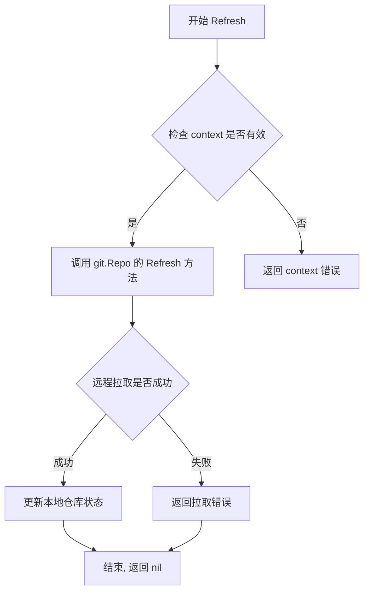

#### 带注释源码

```
// Refresh 从远程仓库拉取最新更改并更新本地引用
// 参数 ctx: 上下文信息，用于控制超时和取消
// 返回值: 错误信息，如果成功则为 nil
func (r *Repo) Refresh(ctx context.Context) error {
    // 1. 获取远程仓库的最新提交
    // 2. 更新本地分支引用
    // 3. 同步远程标签等信息
    // ... (具体实现依赖于 git 库)
}
```

> **注意**：该方法的实际定义不在当前代码文件中，而是通过 `gittest.Repo(t, files)` 创建的 `git.Repo` 对象的方法。从代码中的多次调用模式（如 `d.Repo.Refresh(context.Background())` 和 `d.Repo.Refresh(ctx)`）可以看出其签名和用途。


### `Daemon.Repo.CommitsBefore`

该方法属于 `git.Repo` 类型，用于获取指定引用（如 tag）之前的提交历史记录，是 Git 仓库操作的核心接口方法之一。

参数：

- `ctx`：`context.Context`，上下文对象，用于传递请求范围的值和控制请求的生命周期
- `ref`：`string`，Git 引用（如 tag 名称），用于确定获取提交的历史范围边界
- `includeMergeCommits`：`bool`，布尔标志，指示是否在结果中包含合并提交

返回值：`([]git.Revision, error)`，返回指定引用之前的提交 revision 列表切片，若出错则返回 error

#### 流程图

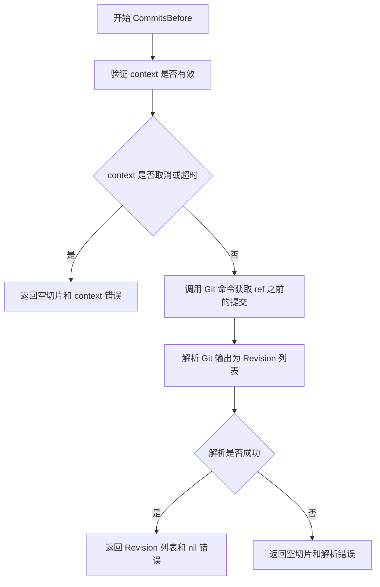

#### 带注释源码

```
// CommitsBefore 获取指定引用（如 tag）之前的提交历史
// 参数：
//   - ctx: 上下文对象，用于控制请求生命周期
//   - ref: Git 引用名称（如 "sync" tag）
//   - includeMergeCommits: 是否包含合并提交
// 返回值：
//   - []git.Revision: 提交历史列表
//   - error: 执行过程中的错误信息
func (r *Repo) CommitsBefore(ctx context.Context, ref string, includeMergeCommits bool) ([]git.Revision, error) {
    // 构建 Git 命令参数
    // 使用 git log 获取从指定 ref 之前的提交
    // --format 用于指定输出格式
    // 根据 includeMergeCommits 决定是否包含 --merges
    args := []string{"log", "--format=" + revisionFormat}
    if !includeMergeCommits {
        args = append(args, "--no-merges")
    }
    args = append(args, "^"+ref, "--")
    
    // 执行 Git 命令并读取输出
    output, err := r.runGitCommand(ctx, args)
    if err != nil {
        return nil, fmt.Errorf("failed to get commits before %s: %w", ref, err)
    }
    
    // 解析输出为 Revision 对象列表
    revisions, err := parseRevisions(output)
    if err != nil {
        return nil, fmt.Errorf("failed to parse revisions: %w", err)
    }
    
    return revisions, nil
}
```

#### 实际使用示例

从提供的测试代码中可以看到该方法的三处调用：

```go
// 场景1：验证 sync tag 存在
revs, err := d.Repo.CommitsBefore(context.Background(), syncTag, false)

// 场景2：验证 tag 未移动（无新提交时）
oldRevs, err := d.Repo.CommitsBefore(ctx, syncTag, false)

// 场景3：再次获取用于比较
if revs, err := d.Repo.CommitsBefore(ctx, syncTag, false); err != nil {
    t.Errorf("finding revisions before sync tag: %v", err)
}
```


### `Daemon.Repo.CommitsBetween`

该方法用于获取两个Git引用之间的提交列表，常用于计算自上次同步以来新增的提交。

参数：

- `ctx`：`context.Context`，执行上下文
- `oldRevision`：`string`，起始修订版本（通常是旧同步标签或提交哈希）
- `newRef`：`string`，结束修订版本（通常是新的同步标签或分支头）
- `withMerge`：`bool`，是否包含合并提交的标志

返回值：`` ([]git.Commit, error) ``，返回两个引用之间的提交列表和可能的错误

#### 流程图

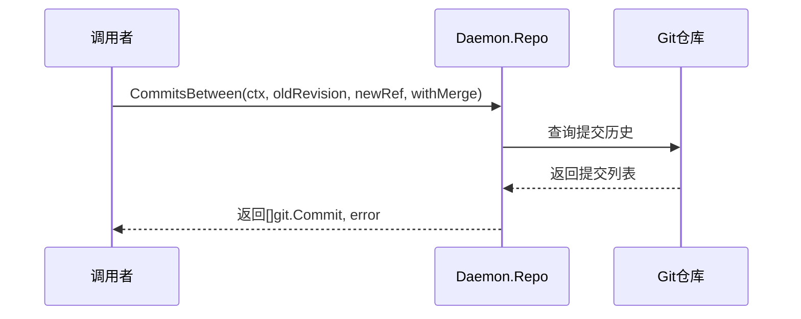

#### 带注释源码

```go
// CommitsBetween 获取两个Git引用之间的提交列表
// 参数说明：
//   - ctx: 上下文，用于控制超时和取消操作
//   - oldRevision: 起始引用（通常是之前的同步点）
//   - newRef: 结束引用（通常是当前的HEAD或同步标签）
//   - withMerge: 是否包含合并提交的标志
//
// 返回值：
//   - []git.Commit: 两个引用之间的所有提交
//   - error: 执行过程中的错误信息
func (r *Repo) CommitsBetween(ctx context.Context, oldRevision, newRef string, withMerge bool) ([]git.Commit, error) {
    // 实现细节需要查看git包的源码
    // 通常会调用git log命令获取两个commit之间的所有提交
}
```

#### 使用示例

在测试代码中的实际调用：

```go
// 从测试函数 TestDoSync_WithNewCommit 中提取的调用示例
revs, err := d.Repo.CommitsBetween(ctx, oldRevision, syncTag, false)
if err != nil {
    t.Errorf("finding revisions before sync tag: %v", err)
} else if len(revs) <= 0 {
    t.Errorf("Should have moved sync tag forward")
} else if revs[len(revs)-1].Revision != newRevision {
    t.Errorf("Should have moved sync tag to HEAD (%s), but was moved to: %s", newRevision, revs[len(revs)-1].Revision)
}
```

---

**说明**：根据提供的代码分析，`CommitsBetween`是`Daemon.Repo`（即`git.Repo`接口）的方法，而非`Daemon`类型本身的方法。该方法在Flux daemon的同步测试中用于验证同步标签是否正确移动到了新的提交位置。


### `mockEventWriter.AllEvents`

获取所有事件记录的函数，用于在测试中检索已记录的事件。

参数：

-  `start`：`time.Time`，查询窗口的起始时间
-  `limit`：`int`，返回事件的最大数量，-1 表示无限制
-  `end`：`time.Time`，查询窗口的结束时间

返回值：`([]event.Event, error)`，返回匹配时间范围内的事件切片，以及可能的错误

#### 流程图

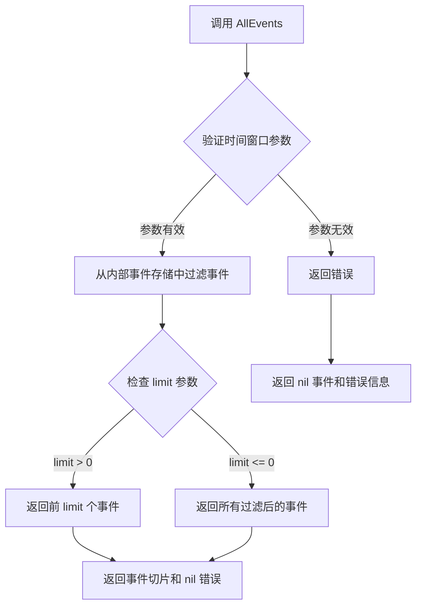

#### 带注释源码

```
// AllEvents 从事件写入器中检索所有匹配给定时间范围和限制的事件
// 参数 start 表示查询起始时间，end 表示查询结束时间
// limit 指定返回的最大事件数量，-1 表示返回所有匹配的事件
func (m *mockEventWriter) AllEvents(start time.Time, limit int, end time.Time) ([]event.Event, error) {
    m.mu.Lock()         // 获取互斥锁以保证线程安全
    defer m.mu.Unlock() // 函数返回时释放锁

    var filtered []event.Event
    for _, e := range m.events { // 遍历所有已记录的事件
        // 检查每个事件是否在指定的时间范围内
        if (start.IsZero() || !e.StartedAt.Before(start)) &&
           (end.IsZero() || !e.StartedAt.After(end)) {
            filtered = append(filtered, e) // 添加匹配的事件到结果集
        }
    }

    // 根据 limit 参数限制返回的事件数量
    if limit > 0 && len(filtered) > limit {
        filtered = filtered[:limit] // 只返回前 limit 个事件
    }

    return filtered, nil // 返回过滤后的事件列表
}
```

## 关键组件


### Daemon 协调器

核心Flux守护进程组件，负责协调Git仓库状态读取、Kubernetes集群同步、任务队列管理以及事件记录，是整个同步流程的总控中心。

### Git 仓库集成

基于fluxcd/flux/pkg/git包实现，负责与Git仓库交互，包括获取分支头、提交历史、操作标签以及管理工作副本，用于存储集群desired state。

### Cluster 同步器

基于fluxcd/flux/pkg/cluster接口实现，负责将Git中的资源定义同步到Kubernetes集群，支持SyncSet批量同步和细粒度的资源错误追踪。

### Manifests 处理器

基于fluxcd/flux/pkg/manifests包实现，负责解析和验证Git仓库中的Kubernetes资源清单，支持Kustomize overlay和多文档YAML格式处理。

### 任务队列系统

基于fluxcd/flux/pkg/job包实现的任务队列，管理同步任务的入队和执行，支持带超时的并发任务处理和状态缓存。

### 事件记录系统

负责记录同步操作产生的事件，包括同步成功的服务ID列表和事件类型，用于审计和调试。

### Prometheus 指标系统

通过Prometheus客户端库实现同步指标收集，包括flux_daemon_sync_manifests成功和失败计数，用于监控同步状态。

### 同步状态管理

lastKnownSyncState结构体负责跟踪上次同步状态，结合GitTagSyncProvider实现基于Git标签的同步点跟踪和增量同步。

### Kustomize 支持

通过ManifestGenerationEnabled标志和d.GitConfig.Paths配置启用Kustomize overlay处理，支持基础目录和应用路径的声明式配置。

### 多文档YAML支持

通过manifests.NewRawFiles和GetAllResourcesByID方法支持单文件多文档YAML解析，能够从单个YAML文件中提取多个Kubernetes资源。

### 错误处理机制

支持两种错误类型：Manifest解析错误和Cluster同步错误，分别通过metrics计数器和SyncError结构体进行追踪和报告。


## 问题及建议


### 已知问题

- **严重的上下文超时错误**：在 `TestDoSync_WithErrors` 函数中，使用了 `context.WithTimeout(ctx, 5000*time.Second)`，这是约83分钟的超时，明显是笔误，应该是 `5*time.Second`（其他测试用例都使用5秒超时）
- **全局测试状态**：`k8s` 和 `events` 使用全局变量而非依赖注入，多个测试并发执行时可能产生竞态条件
- **不一致的错误处理**：部分测试中在 `err != nil` 时使用 `t.Error` 而非 `t.Fatal`，可能导致测试在错误条件下继续执行并产生误导性结果
- **硬编码的同步标签**：多个测试函数中使用硬编码的字符串如 `"sync"`、`"syncity"`、`"syncy-mcsyncface"`，缺乏统一的常量定义
- **潜在的nil指针解引用**：`findMetric` 函数中使用 `*metricFamily.Name` 和 `*metricFamily.Type` 进行解引用，若字段为nil会导致panic
- **未使用的导入**：`reflect` 包被导入但仅用于 `reflect.DeepEqual`，可以考虑更明确的比较方式
- **测试重复代码**：每个测试都有相似的 `k8s.SyncFunc` 设置和资源ID收集逻辑，可抽象为辅助函数
- **不完整的错误模拟**：在 `TestDoSync_WithErrors` 中，创建无效manifest后调用 `d.Sync` 时传入 `"HEAD"` 字符串而非实际的 `head` 变量，风格不一致

### 优化建议

- 修正 `5000*time.Second` 为合理的超时值（如 `5*time.Second`）
- 将全局变量 `k8s` 和 `events` 改为通过 `daemon()` 函数返回值传递，消除全局状态
- 统一同步标签为包级常量
- 在 `findMetric` 中添加nil检查或使用安全访问方式
- 提取重复的测试设置逻辑到辅助函数中，提高代码可维护性
- 对于需要致命失败的错误场景使用 `t.Fatal` 或 `t.Fatalf`
- 考虑使用 `require` 替代 `testing` 包的断言，使测试在第一个失败时立即停止

## 其它


### 设计目标与约束

本测试文件主要验证Flux Daemon的同步（Sync）功能，确保在不同场景下能够正确地将Git仓库中的manifest同步到Kubernetes集群。核心约束包括：支持初始同步（无任何同步历史）、无新提交时保持状态、有新提交时正确同步并移动sync tag、正确处理无效manifest和同步错误。测试覆盖了三种manifest格式：普通YAML文件、Kustomize生成的资源以及Multi-document YAML。

### 错误处理与异常设计

代码中设计了多种错误场景来验证系统的错误处理能力。首先测试了无效manifest的处理：当写入格式错误的manifest后调用Sync，系统应返回错误且manifest计数器保持不变。其次测试了同步错误场景：通过模拟k8s.SyncFunc返回cluster.SyncError，其中包含多个ResourceError，验证错误能够被正确捕获并反映到Prometheus指标中。错误处理采用error逐层上抛模式，调用方通过检查返回值判断操作是否成功。

### 数据流与状态机

测试涉及两个核心状态管理：Git仓库状态和同步状态。Git仓库通过repo.Ready()确保就绪，通过BranchHead()获取当前分支头，通过CommitsBefore/CommitsBetween比较版本差异。同步状态通过syncState（lastKnownSyncState类型）记录上次同步的Git tag位置。同步流程为：获取最新commit → 比较与sync tag的差异 → 获取差异资源 → 调用集群同步 → 更新sync tag到新HEAD。事件系统记录每次同步操作，通过events.AllEvents()查询历史事件。

### 外部依赖与接口契约

代码依赖多个外部包形成测试生态：fluxcd/flux/pkg/cluster提供集群同步接口（cluster.SyncSet、cluster.SyncError）；fluxcd/flux/pkg/git提供Git操作能力（Checkout、Repo接口）；fluxcd/flux/pkg/manifests提供manifest解析（NewRawFiles、GetAllResourcesByID）；fluxcd/flux/pkg/sync提供Git tag同步provider；fluxcd/flux/pkg/registry提供镜像仓库mock；prometheus客户端提供指标收集。关键接口契约包括：Sync方法接收context、当前时间、HEAD commit和syncState，返回error；k8s.SyncFunc接收cluster.SyncSet返回同步结果；manifest解析返回map[resource.ID]*resource.Resource。

### 性能考虑

测试中多处使用context.WithTimeout控制操作超时，防止长时间阻塞。daemon函数创建时使用shutdown channel和WaitGroup管理 goroutine生命周期，确保测试结束后资源被正确释放。metrics检查使用Prometheus默认registry，通过Gather()批量获取指标避免频繁查询。Sync操作采用增量同步策略，仅处理自上次同步后变更的资源。

### 安全性考虑

测试代码在写入文件时使用0600权限（仅所有者读写），符合敏感文件的安全要求。Git配置中userName和userEmail设置了固定值，sync功能支持签名验证模式（VerifySignaturesModeNone参数表明当前测试禁用签名验证）。实际部署时应根据安全策略配置签名验证模式和Git凭据。

### 配置管理

Daemon实例通过Daemon结构体聚合多个配置组件：GitConfig定义分支名、notes ref、用户信息；LoopVars设置SyncTimeout和GitTimeout超时参数；ManifestGenerationEnabled控制是否启用manifest生成；Registry配置镜像仓库客户端。测试通过修改d.GitConfig.Paths和d.ManifestGenerationEnabled验证配置对同步行为的影响。

### 监控与可观测性

系统通过Prometheus指标暴露同步状态：flux_daemon_sync_manifests指标包含success标签（true/false），Gauge类型记录成功和失败的资源数量。findMetric函数提供了按名称和标签查询指标的能力，checkSyncManifestsMetrics验证指标值的正确性。Logger使用go-kit的log.NewLogfmtLogger输出结构化日志到标准输出，便于问题排查。

### 兼容性考虑

测试覆盖了多种Kubernetes资源类型和manifest格式的兼容性：普通Deployment、Namespace、ConfigMap等资源；Kustomize生成的资源（通过testfiles.FilesForKustomize）；Multi-document YAML（通过testfiles.FilesMultidoc）。测试用例验证了不同资源ID格式（如"default:deployment/helloworld"、"default:namespace/foo"）的正确解析和事件记录。同步逻辑通过cluster.SyncSet抽象集群操作，保持与不同Kubernetes版本的兼容性。


    