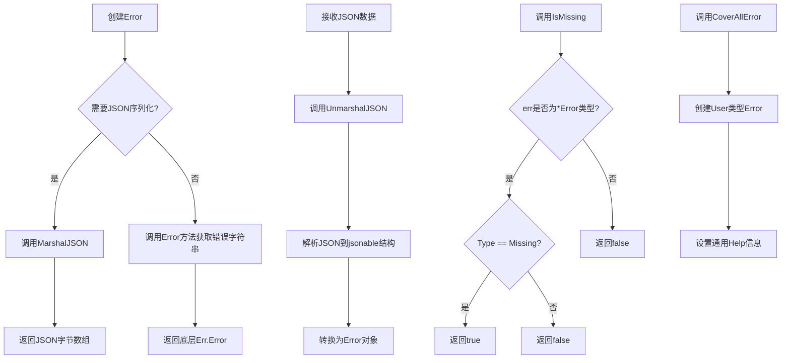
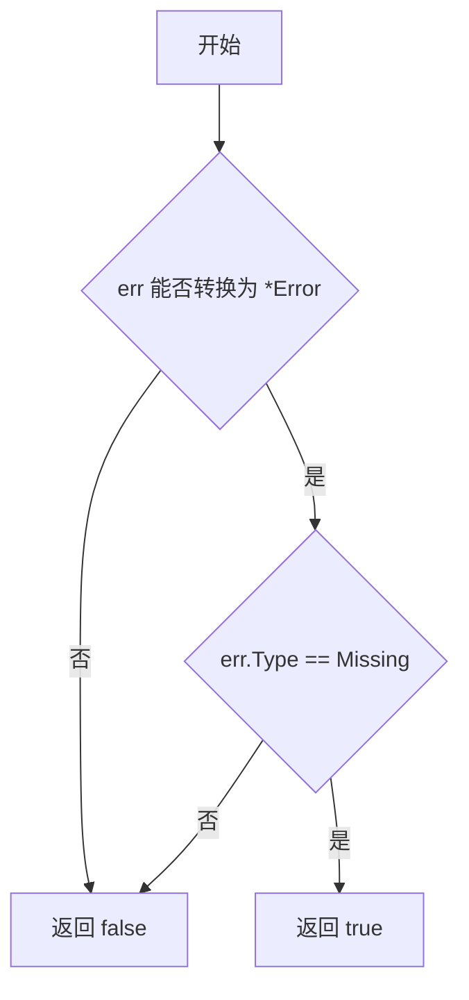
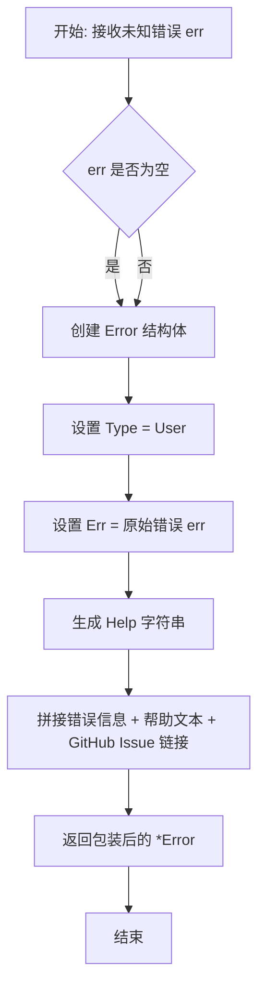
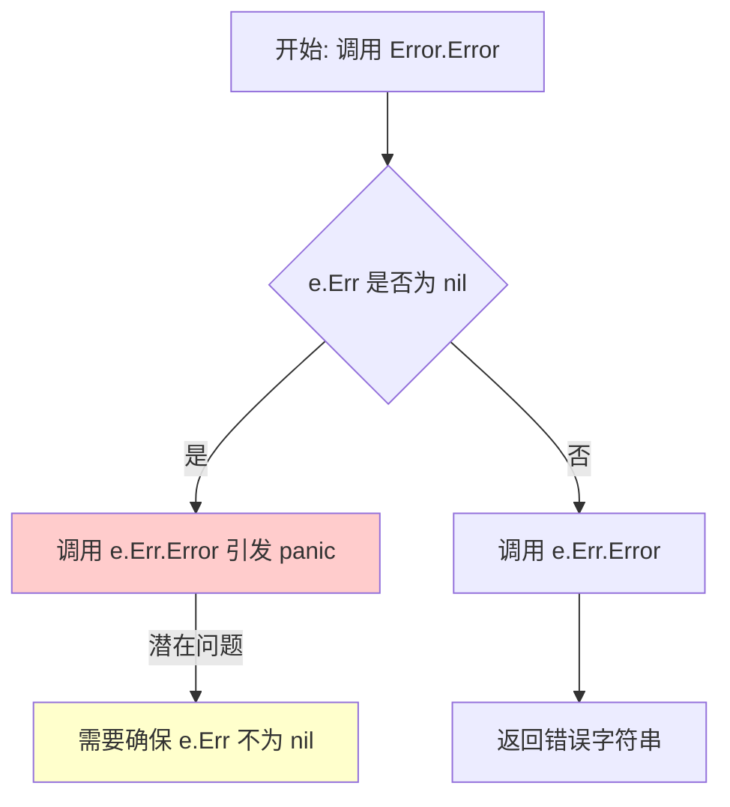
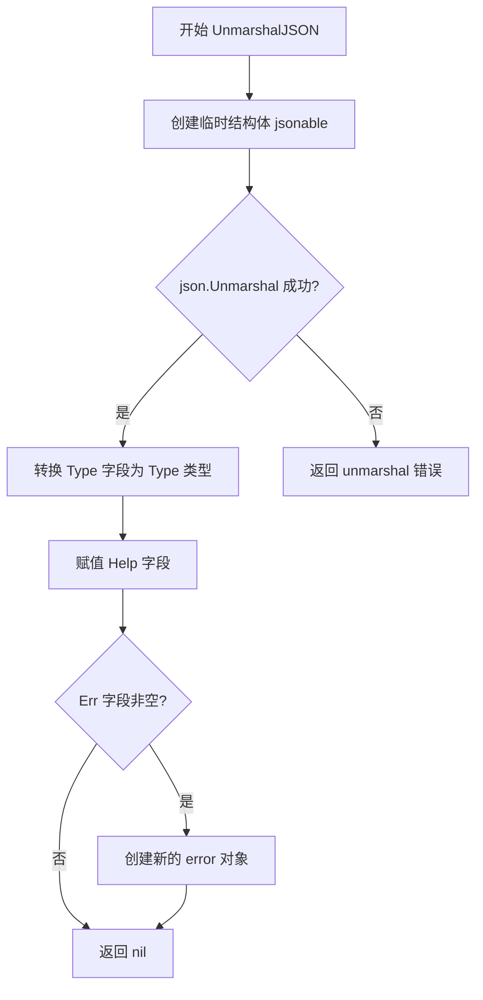

# `flux\pkg\errors\errors.go` 详细设计文档

这是一个Go语言错误处理包，定义了API错误的领域模型，将错误分为服务器错误(Server)、缺失错误(Missing)和用户错误(User)三类，支持JSON序列化/反序列化，并提供辅助函数进行错误类型判断和错误包装。

## 整体流程



## 类结构

```
Error (错误类型)
├── 字段: Type (错误类型)
├── 字段: Help (用户友好的帮助信息)
└── 字段: Err (底层错误)

Type (错误类型字符串)
├── Server (服务器错误)
├── Missing (缺失错误)
└── User (用户错误)
```

## 全局变量及字段


### `Server`
    
服务器错误标识

类型：`Type`
    


### `Missing`
    
资源缺失错误标识

类型：`Type`
    


### `User`
    
用户操作错误标识

类型：`Type`
    


### `Error.Type`
    
错误分类标识

类型：`Type`
    


### `Error.Help`
    
用户友好的帮助信息JSON标签help

类型：`string`
    


### `Error.Err`
    
底层原始错误

类型：`error`
    
    

## 全局函数及方法


### `IsMissing`

判断传入的错误是否为缺失类型（Missing），如果是则返回 true，否则返回 false。

参数：

- `err`：`error`，需要检查的错误对象

返回值：`bool`，如果错误是缺失类型返回 true，否则返回 false

#### 流程图



#### 带注释源码

```go
// IsMissing 判断错误是否为缺失类型
// 参数 err: 需要检查的错误
// 返回值: 如果错误类型为 Missing 返回 true，否则返回 false
func IsMissing(err error) bool {
	// 使用类型断言检查 err 是否为 *Error 类型
	if err, ok := err.(*Error); ok && err.Type == Missing {
		// 如果类型匹配且错误类型为 Missing，返回 true
		return true
	}
	// 否则返回 false
	return false
}
```


### `CoverAllError`

将任意未知错误包装为通用的用户错误类型（User Type），并提供友好的帮助信息，引导用户通过 GitHub 报告问题。

参数：

- `err`：`error`，需要被包装的原始未知错误

返回值：`*Error`，包装后的错误结构体指针，包含 User 类型和通用帮助信息

#### 流程图



#### 带注释源码

```go
// CoverAllError 将未知错误包装为通用的用户错误类型
// 参数: err - 任意需要包装的原始错误
// 返回: *Error - 包装后的错误结构体，包含用户友好的帮助信息
func CoverAllError(err error) *Error {
    // 创建一个新的 Error 结构体，设置以下属性：
    // 1. Type = User: 表示这是用户侧的错误（而非服务端错误）
    // 2. Err = err: 保存原始错误用于日志记录
    // 3. Help: 包含通用帮助信息，引导用户报告问题
    return &Error{
        Type: User,
        Err:  err,
        // 生成用户友好的帮助信息，包括：
        // - 原始错误消息
        // - 通用提示（无特定帮助信息）
        // - GitHub Issue 链接供用户反馈
        Help: `Error: ` + err.Error() + `

We don't have a specific help message for the error above.

It would help us remedy this if you log an issue at

    https://github.com/fluxcd/flux/issues

saying what you were doing when you saw this, and quoting the message
at the top.
`,
    }
}
```


### `Error.Error()`

该方法实现了 Go 语言的 `error` 接口，返回底层错误的字符串表示，是将自定义错误类型与标准错误接口桥接的关键方法。

参数：无（方法接收者 `*Error` 为隐式参数）

返回值：`string`，返回底层 `Err` 字段的错误字符串

#### 流程图



#### 带注释源码

```go
// Error 实现 error 接口的 Error 方法
// 返回底层错误的字符串表示
// 注意：如果 e.Err 为 nil，此方法会引发 panic
func (e *Error) Error() string {
    // 直接调用底层错误的 Error 方法并返回其字符串表示
    return e.Err.Error()
}
```

#### 潜在问题说明

1. **空指针风险**：如果 `Error` 结构体的 `Err` 字段为 `nil`，调用此方法会触发 panic（空指针异常）。建议在使用前进行 nil 检查或确保 `Err` 字段始终被正确初始化。

2. **信息丢失**：当前实现仅返回底层错误的字符串，丢失了 `Error` 结构体中的 `Type` 和 `Help` 字段信息，可能导致调用者无法获取更丰富的错误上下文。


### `Error.MarshalJSON()`

将 `Error` 结构体自定义序列化为 JSON 格式，包含错误类型、帮助信息和底层错误消息。

参数：

- `(e *Error)`：接收者，指向 Error 结构体的指针，表示要进行 JSON 序列化的错误对象

返回值：`([]byte, error)`，返回序列化后的 JSON 字节数组，如果序列化过程中出现错误则返回错误信息

#### 流程图

```mermaid
flowchart TD
    A[开始 MarshalJSON] --> B{检查 e.Err 是否为 nil}
    B -->|是| C[errMsg 保持空字符串]
    B -->|否| D[调用 e.Err.Error 获取错误消息]
    D --> C
    C --> E[创建 jsonable 匿名结构体]
    E --> F[赋值 Type 字段: string(e.Type)]
    F --> G[赋值 Help 字段: e.Help]
    G --> H[赋值 Err 字段: errMsg]
    H --> I[调用 json.Marshal 序列化]
    I --> J[返回序列化结果和可能的错误]
```

#### 带注释源码

```go
// MarshalJSON 实现 json.Marshaler 接口，将 Error 结构体序列化为 JSON 格式
func (e *Error) MarshalJSON() ([]byte, error) {
	// 用于存储底层错误的字符串表示
	var errMsg string
	
	// 检查底层错误是否存在，如果存在则获取其错误消息
	if e.Err != nil {
		errMsg = e.Err.Error()
	}
	
	// 定义一个临时结构体用于 JSON 序列化
	// 使用匿名结构体包含三个字段：type, help, error
	jsonable := &struct {
		Type string `json:"type"`   // 错误类型
		Help string `json:"help"`   // 用户可见的帮助信息
		Err  string `json:"error,omitempty"` // 底层错误，使用 omitempty 忽略空值
	}{
		Type: string(e.Type), // 将 Type 转换为字符串
		Help: e.Help,         // 直接赋值帮助信息
		Err:  errMsg,         // 赋值底层错误消息
	}
	
	// 调用标准库的 json.Marshal 进行序列化
	// 返回序列化后的字节切片和可能的错误
	return json.Marshal(jsonable)
}
```


### `Error.UnmarshalJSON`

该方法实现了 `json.Unmarshaler` 接口，用于将 JSON 格式的数据反序列化为 `Error` 结构体实例。它接收一段 JSON 字节数据，解析其中的 `type`、`help` 和 `error` 字段，并将其映射到 `Error` 结构体的对应字段中。

参数：

- `data`：`[]byte`，要反序列化的 JSON 数据字节切片

返回值：`error`，如果 JSON 解析失败或数据格式不正确则返回错误，否则返回 `nil`

#### 流程图



#### 带注释源码

```go
// UnmarshalJSON 实现了 json.Unmarshaler 接口
// 将 JSON 数据反序列化为 Error 结构体
func (e *Error) UnmarshalJSON(data []byte) error {
	// 定义一个临时结构体用于接收 JSON 数据
	// 使用 json 标签映射字段名
	jsonable := &struct {
		Type string `json:"type"`
		Help string `json:"help"`
		Err  string `json:"error,omitempty"`
	}{}
	
	// 尝试解析 JSON 数据到临时结构体
	if err := json.Unmarshal(data, &jsonable); err != nil {
		// 如果解析失败，直接返回解析错误
		return err
	}
	
	// 将解析出的 Type 字符串转换为 Type 类型并赋值
	e.Type = Type(jsonable.Type)
	
	// 赋值 Help 字段
	e.Help = jsonable.Help
	
	// 如果 error 字段存在且非空，则创建新的 error 对象
	if jsonable.Err != "" {
		e.Err = errors.New(jsonable.Err)
	}
	
	// 反序列化成功，返回 nil
	return nil
}
```

## 关键组件


### Error 结构体

核心的错误表示结构体，包含错误类型、用户友好的帮助信息和底层错误。用于在API中表示不同类别的错误。

### Type 类型

错误分类枚举类型，用于区分错误的责任方。包含Server（服务端错误）、Missing（资源不存在）和User（用户错误）三种类型。

### IsMissing 函数

判断给定错误是否为"资源不存在"类型的工具函数，用于错误类型检查和流程控制。

### MarshalJSON 方法

Error结构体的JSON序列化方法，将内部错误对象转换为API可用的JSON格式，包含type、help和error字段。

### UnmarshalJSON 方法

Error结构体的JSON反序列化方法，从JSON数据恢复Error对象，将error字符串重新构造为底层error对象。

### CoverAllError 函数

通用的错误包装函数，创建一个用户类型的错误并附带标准的帮助信息，引导用户向项目提交问题报告。


## 问题及建议


### 已知问题

-   **变量遮蔽（Shadowing）**：在`UnmarshalJSON`方法中，局部变量`err`遮蔽了方法参数`err error`。当`json.Unmarshal`成功后，如果后续处理（如`Type`赋值）发生错误，函数会返回`nil`而非错误，导致静默失败。
-   **潜在的nil指针panic**：`Error()`方法直接调用`e.Err.Error()`，当`e.Err`为`nil`时会触发panic。
-   **类型安全缺失**：`UnmarshalJSON`未验证`Type`字段是否为有效值（如"server"、"missing"、"user"），可能导致无效的`Type`值被持久化。
-   **未验证的Type字段**：反序列化时没有校验Type是否为合法的Type枚举值，可能导致不一致的状态。
-   **CoverAllError函数设计**：固定返回`User`类型错误不够灵活，且错误消息拼接方式（使用`+`连接字符串）不如`fmt.Errorf`或`strings.Builder`优雅。
-   **导入未使用的包**：`encoding/json`导入了但实际被使用，而`errors`包在代码中通过`errors.New`被使用，但标准库的`errors`包在Go 1.13+后通常配合`fmt.Errorf`使用更佳。

### 优化建议

-   **修复变量遮蔽**：将`UnmarshalJSON`中的`err := json.Unmarshal(...)`改为`if err := json.Unmarshal(...); err != nil { return err }`并使用不同的变量名，或重构代码结构。
-   **添加nil检查**：在`Error()`方法中添加`if e.Err == nil { return "" }`检查。
-   **添加Type验证**：在`UnmarshalJSON`中添加Type值的验证逻辑，确保其为有效的Type枚举。
-   **改进CoverAllError**：使用`fmt.Errorf`或提供参数以支持不同的错误类型，或提取帮助信息为常量/模板。
-   **添加错误类型验证方法**：可以添加`IsValidType() bool`或使用自定义类型方法进行验证。
-   **添加文档注释**：为公共方法如`IsMissing`、`CoverAllError`、`MarshalJSON`、`UnmarshalJSON`添加Godoc注释。

## 其它


### 设计目标与约束

本代码的设计目标是提供一个结构化的错误类型系统，用于API错误表示。核心约束包括：1）错误类型分为三种（Server、Missing、User），分别代表服务端错误、资源不存在、用户配置错误；2）错误信息分为用户友好的Help字段和开发者友好的底层Err字段；3）支持JSON序列化/反序列化以便API交互；4）遵循Go语言的error接口约定。

### 错误处理与异常设计

本包采用显式错误类型设计而非异常机制。错误类型通过Type字段区分，强制调用者根据错误类型采取不同处理策略。IsMissing函数提供便捷的错误类型检查。CoverAllError函数作为兜底错误包装器，将未知错误转换为用户友好的错误信息，引导用户反馈。JSON序列化时底层error被转换为字符串存储，反序列化时使用errors.New重建，无法保留原始错误类型信息。

### 外部依赖与接口契约

本包依赖Go标准库：encoding/json用于JSON序列化、errors包用于创建基础错误。外部接口契约：1）Error类型实现error接口的Error()方法；2）支持json.Marshaler和json.Unmarshaler接口；3）IsMissing函数接受error参数并返回布尔值；4）CoverAllError接受error参数并返回*Error指针。所有函数均返回明确错误值，无隐藏副作用。

### 安全性考虑

本代码不涉及敏感数据处理，安全性考虑较少。唯一需注意的是Error结构体的Err字段可能包含敏感信息，在JSON序列化时会暴露error字段（尽管是可选的）。建议在生产环境中对敏感错误信息进行过滤后再返回给客户端。

### 性能考虑

性能瓶颈主要在JSON序列化/反序列化过程。MarshalJSON和UnmarshalJSON每次调用都会分配临时结构体，建议对高频场景进行性能测试。Error()方法调用底层err.Error()可能涉及字符串拼接开销。CoverAllError每次调用都会拼接较长的帮助文本，可考虑缓存静态文本部分。

### 测试策略建议

建议补充的测试包括：1）三种错误类型的JSON往返序列化测试；2）IsMissing函数对不同错误类型的判断测试；3）Error()方法返回值与底层错误的一致性测试；4）CoverAllError生成的错误格式验证；5）空指针和空错误值的边界情况测试。

### 使用示例

```go
// 创建用户错误
err := &errors.Error{
    Type: errors.User,
    Help: "Please provide valid configuration",
    Err:  errors.New("missing required field"),
}

// JSON序列化
jsonBytes, _ := json.Marshal(err)

// 检查错误类型
if errors.IsMissing(err) {
    // 处理资源不存在的情况
}
```

### 版本兼容性

当前版本为初始设计。建议在后续版本中考虑：1）增加更多错误类型以支持更细粒度的错误分类；2）保留原始error类型信息而不仅是字符串；3）考虑引入错误码（code）字段便于客户端程序化处理；4）保持API稳定性，避免破坏性变更。

    