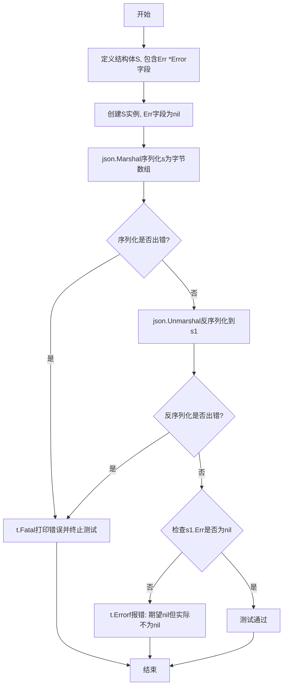
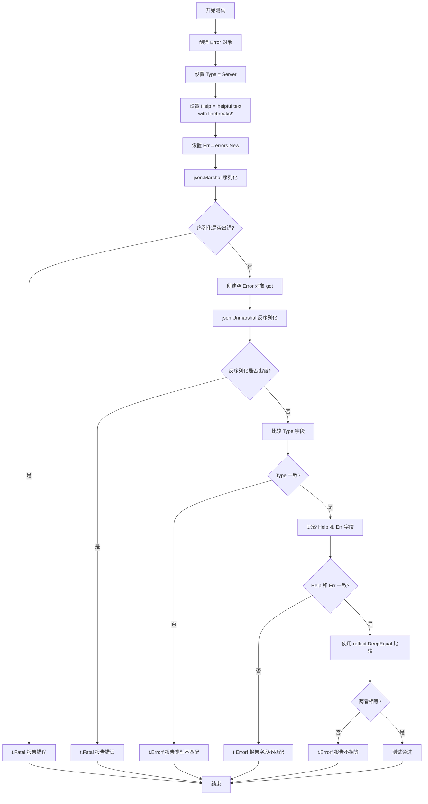
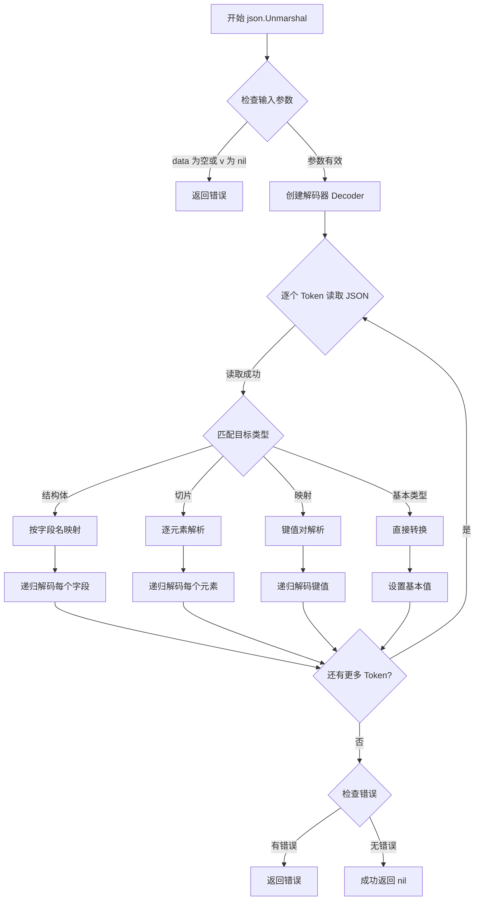
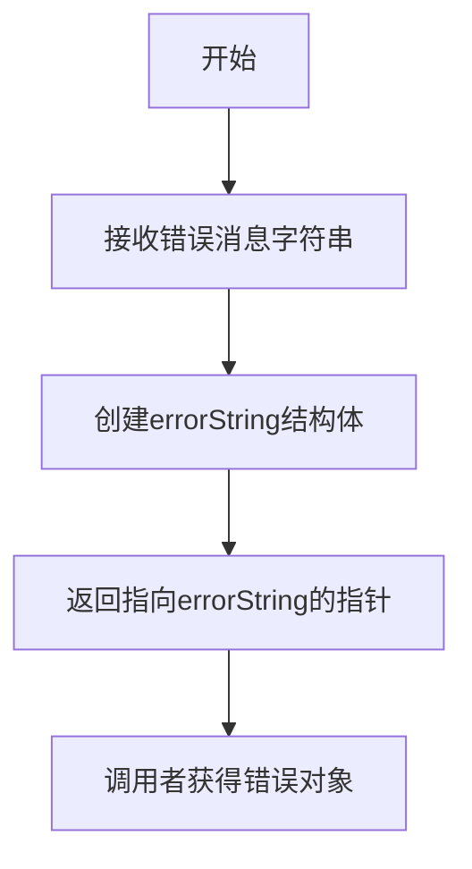
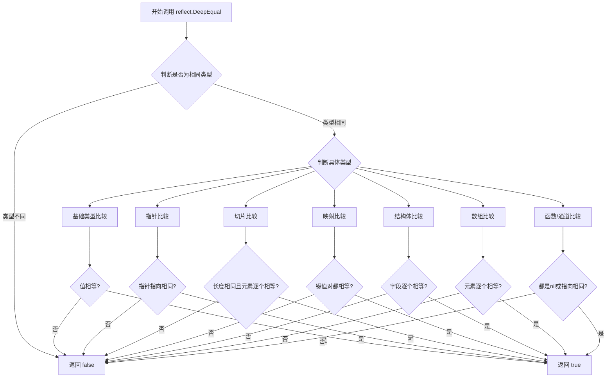

# `flux\pkg\errors\errors_test.go` 详细设计文档

这是一个Go语言测试文件，测试自定义Error类型的JSON序列化与反序列化功能，验证错误对象在JSON格式转换过程中能够正确保留Type、Help和Err字段的信息，包括空值处理和深比较验证。

## 整体流程

```mermaid
graph TD
    A[开始测试] --> B[创建测试结构体 S{Err *Error}]
B --> C[json.Marshal 序列化为 JSON 字节]
C --> D{序列化是否成功?}
D -- 否 --> E[t.Fatal 打印错误并终止]
D -- 是 --> F[json.Unmarshal 反序列化回 S1]
F --> G{反序列化是否成功?}
G -- 否 --> H[t.Fatal 打印错误并终止]
G -- 是 --> I{判断测试用例类型}
I -- TestZeroErrorEncoding --> J[验证 s1.Err == nil]
I -- TestErrorEncoding --> K[创建预期 Error 对象]
K --> L[比较 got.Type == errVal.Type]
L --> M[比较 got.Help 和 got.Err]
M --> N[reflect.DeepEqual 深度比较]
N --> O[测试结束]
J --> O
```

## 类结构

```
errors (包)
└── Error 类型 (定义在同包其他文件中，未在此文件中)
    ├── Type 字段
    ├── Help 字段
    └── Err 字段
```

## 全局变量及字段


### `Server`
    
错误类型常量，表示服务器端错误

类型：`ErrorType`
    


### `S.S.Err`
    
指向Error结构体的指针字段，用于存储错误对象

类型：`*Error`
    


### `Error.Error.Type`
    
错误类型字段，表示错误的分类

类型：`ErrorType`
    


### `Error.Error.Help`
    
错误帮助文本字段，提供错误的人类可读描述信息

类型：`string`
    


### `Error.Error.Err`
    
底层错误字段，存储原始的底层错误对象

类型：`error`
    
    

## 全局函数及方法


### `TestZeroErrorEncoding`

该测试函数用于验证当结构体中的 `*Error` 指针字段为零值（nil）时，JSON 序列化与反序列化过程能否正确处理 nil 指针，确保反序列化后仍保持 nil 状态而非被错误转换为非空对象。

参数：

- `t`：`*testing.T`，Go 测试框架的测试对象，用于报告测试失败和日志输出

返回值：无（`void`，Go 测试函数无显式返回值）

#### 流程图



#### 带注释源码

```go
func TestZeroErrorEncoding(t *testing.T) {
	// 定义测试用结构体S，包含一个*Error类型的指针字段Err
	type S struct {
		Err *Error
	}
	
	// 创建结构体S的实例s，Err字段默认为nil（零值）
	var s S
	
	// 使用JSON序列化s到字节数组
	bytes, err := json.Marshal(s)
	if err != nil {
		// 序列化失败时致命错误，终止测试
		t.Fatal(err)
	}
	
	// 创建新的结构体实例s1用于接收反序列化结果
	var s1 S
	
	// 将序列化后的字节数组反序列化到s1
	err = json.Unmarshal(bytes, &s1)
	if err != nil {
		// 反序列化失败时致命错误，终止测试
		t.Fatal(err)
	}
	
	// 验证反序列化后Err字段仍为nil（未被错误转换）
	if s1.Err != nil {
		t.Errorf("expected nil in field, but got %+v", s1.Err)
	}
}
```

---

#### 补充信息

**关键组件信息：**

- `errors.Error`（类型）：自定义错误类型，包含 `Type`（错误类型）、`Help`（帮助文本）、`Err`（底层错误）字段
- `json.Marshal`：标准库 JSON 序列化函数
- `json.Unmarshal`：标准库 JSON 反序列化函数

**潜在技术债务/优化空间：**

- 该测试仅覆盖了 nil 指针的序列化场景，可考虑增加边界情况测试（如空字符串、零值结构体等）
- 缺少对 JSON 编解码自定义逻辑（如 `Marshaler`/`Unmarshaler` 接口）的验证测试

**外部依赖：**

- `encoding/json`：Go 标准库，用于 JSON 数据格式的序列化与反序列化
- `testing`：Go 标准库，提供测试框架支持


### `TestErrorEncoding`

该测试函数用于验证自定义 Error 类型的 JSON 序列化和反序列化功能是否正确工作，包括 Type、Help 和 Err 字段的数据完整性。

参数：

- `t`：`testing.T`，Go 测试框架的测试对象，用于报告测试失败

返回值：`void`，该函数无返回值，通过 `t` 参数报告测试结果

#### 流程图



#### 带注释源码

```go
func TestErrorEncoding(t *testing.T) {
	// 第一步：创建待测试的 Error 对象
	// 设置 Type 字段为 Server 类型
	// 设置 Help 字段为包含换行符的帮助文本
	// 设置 Err 字段为底层错误
	errVal := &Error{
		Type: Server,
		Help: "helpful text\nwith linebreaks!",
		Err:  errors.New("underlying error"),
	}
	
	// 第二步：将 Error 对象序列化为 JSON 字节切片
	bytes, err := json.Marshal(errVal)
	
	// 检查序列化过程是否发生错误
	if err != nil {
		t.Fatal(err) // 如果出错，终止测试并报告错误
	}
	
	// 第三步：创建空的 Error 对象用于接收反序列化结果
	var got Error
	
	// 第四步：将 JSON 数据反序列化为 Error 对象
	err = json.Unmarshal(bytes, &got)
	
	// 检查反序列化过程是否发生错误
	if err != nil {
		t.Fatal(err) // 如果出错，终止测试并报告错误
	}
	
	// 第五步：验证反序列化后的 Type 字段是否与原始值一致
	if got.Type != errVal.Type {
		println(string(bytes)) // 打印实际 JSON 便于调试
		t.Errorf("error type: expected %q, got %q", errVal.Type, got.Type)
	}
	
	// 第六步：验证 Help 和 Err 字段是否正确恢复
	if got.Help != errVal.Help || got.Err.Error() != errVal.Err.Error() {
		t.Errorf("expected %+v\ngot %+v", errVal, got)
	}
	
	// 第七步：使用深度相等比较确保整个对象完全一致
	if !reflect.DeepEqual(errVal, &got) {
		t.Errorf("not deepEqual\nexpected %#v\ngot %#v", errVal, &got)
	}
}
```


### `json.Marshal`

`json.Marshal` 是 Go 标准库 `encoding/json` 包提供的函数，用于将 Go 对象序列化为 JSON 格式的字节切片。该函数接收任意类型的值作为输入，并返回对应的 JSON 数据和可能的错误信息。

参数：

-  `v`：任意类型（`interface{}` 或 `any`），待序列化的 Go 对象，可以是结构体、切片、映射、基本类型等

返回值：

-  `[]byte`：JSON 格式的字节切片，如果序列化成功则包含 JSON 数据
-  `error`：错误信息，如果序列化过程中出现问题（如循环引用、不支持的类型等）则返回错误

#### 流程图

```mermaid
flowchart TD
    A[开始 json.Marshal] --> B{检查输入值 v 的类型}
    B --> C[使用反射获取类型信息]
    C --> D{类型是否支持序列化}
    D -->|支持| E[递归遍历对象结构]
    D -->|不支持| F[返回 UnsupportedTypeError]
    E --> G{构建 JSON 字符串}
    G --> H[返回 []byte 和 nil]
    F --> I[返回 nil 和 error]
    H --> J[结束]
    I --> J
```

#### 带注释源码

```go
// json.Marshal 是 encoding/json 包的核心函数，用于将 Go 数据结构序列化为 JSON
// 函数签名: func Marshal(v interface{}) ([]byte, error)

// 在测试代码中的调用示例：

// 场景1: 序列化包含 Error 指针的结构体
type S struct {
    Err *Error  // 自定义错误类型指针
}
var s S
bytes, err := json.Marshal(s)  // 尝试将 s 序列化为 JSON
// - 输入: s (S 类型，值为零值)
// - 输出: bytes ([]byte，JSON 格式)
// - 错误: err (如果序列化失败)

// 场景2: 序列化 Error 指针类型
errVal := &Error{
    Type: Server,                      // 错误类型
    Help: "helpful text\nwith linebreaks!", // 帮助文本
    Err:  errors.New("underlying error"),  // 底层错误
}
bytes, err := json.Marshal(errVal)
// - 输入: errVal (*Error 指针)
// - 输出: bytes ([]byte，包含 Type、Help、Err 字段的 JSON)
// - 错误: err (如果序列化失败)

// json.Marshal 的内部处理流程：
// 1. 创建一个 jsonEncoder 对象
// 2. 使用 reflect 获取值的类型信息
// 3. 根据类型选择合适的编码策略
// 4. 递归编码各个字段/元素
// 5. 返回编码后的字节切片或错误
```


### `json.Unmarshal`

`json.Unmarshal` 是 Go 语言 `encoding/json` 包中的核心函数，用于将 JSON 格式的字节切片解析并填充到指定的 Go 值（通常是指针）中，支持复杂类型如结构体、切片、映射等的自动映射。

参数：

- `data`：`[]byte`，要解析的 JSON 数据的字节切片
- `v`：`interface{}`，目标值指针，用于接收解析后的数据，通常传入结构体指针、切片指针或映射指针

返回值：`error`，如果解析成功返回 nil，否则返回描述性错误信息（如 JSON 语法错误、类型不匹配等）

#### 流程图



#### 带注释源码

```go
// Unmarshal 解析 JSON 编码的数据并将结果存储到 v 指向的值中
// 
// 参数说明：
//   - data: 包含 JSON 数据的字节切片
//   - v: 目标值指针，用于接收解析结果
//
// 返回值：
//   - error: 解析过程中的错误信息，如成功则为 nil
//
// 实现原理：
// 1. 创建一个基于 data 的 Decoder
// 2. 调用 Decoder 的 Decode 方法将数据解码到 v
// 3. 处理可能的错误并返回
func Unmarshal(data []byte, v interface{}) error {
    // 参数校验：确保数据不为空
    if len(data) == 0 {
        // 空数据视为有效（解析为空值），不返回错误
        return nil
    }
    
    // 创建解码器，传入字节切片
    dec := NewDecoder(bytes.NewReader(data))
    
    // 调用 Decode 方法进行实际解析
    // v 需要是指针类型，以便函数可以修改其值
    return dec.Decode(v)
}
```

#### 实际使用示例（基于提供代码）

```go
// 代码中 TestErrorEncoding 函数的实际调用方式
var got Error                              // 目标接收变量
err = json.Unmarshal(bytes, &got)         // bytes 是 JSON 数据，&got 传入指针
if err != nil {
    t.Fatal(err)                          // 处理解析错误
}
```


### `errors.New`

这是 Go 标准库 `errors` 包中的函数，用于创建一个新的错误对象。

参数：

- `msg`：`string`，用于描述错误的文本消息

返回值：`*errorString`，返回一个指向错误对象的指针

#### 流程图



#### 带注释源码

```go
// errors.New 返回一个匹配给定文本的错误
// 在代码中用于创建底层错误对象
func New(text string) error {
    // errorString 是一个满足 error 接口的简单类型
    // 它仅包含一个字符串字段来存储错误消息
    return &errorString{text}
}

// errorString 是实现了 error 接口的底层类型
type errorString struct {
    s string
}

// Error 方法实现了 error 接口
// 返回存储的错误消息字符串
func (e *errorString) Error() string {
    return e.s
}
```

**在测试代码中的使用：**

```go
// 在 TestErrorEncoding 中创建底层错误
Err: errors.New("underlying error"),
```

这行代码创建了一个错误对象，作为自定义 Error 结构体的底层错误字段使用。


# 详细设计文档

## 1. 一段话描述

本代码文件为 Go 语言编写的测试文件，主要用于测试自定义错误类型的 JSON 编解码功能，并在测试用例中使用了 `reflect.DeepEqual` 函数来深度比较错误值是否相等，以验证反序列化后的对象与原始对象在结构上完全一致。

## 2. 文件的整体运行流程

该测试文件包含两个测试函数：

1. **TestZeroErrorEncoding**：测试当结构体字段为 nil 指针时的 JSON 序列化与反序列化行为
2. **TestErrorEncoding**：测试包含完整错误信息的 JSON 编解码，并使用 `reflect.DeepEqual` 验证序列化-反序列化后的结果与原始值是否完全相等

整体流程：定义错误结构 → 序列化（Marshal）→ 反序列化（Unmarshal）→ 验证结果（包括使用 reflect.DeepEqual 进行深度比较）

## 3. 类的详细信息

本文件为测试文件，不包含自定义类，仅包含测试函数。

### 3.1 全局函数

#### TestZeroErrorEncoding

- **名称**：TestZeroErrorEncoding
- **参数**：t *testing.T，测试框架传入的测试指针
- **返回值**：无
- **描述**：测试当 Error 指针为 nil 时的 JSON 编解码行为

#### TestErrorEncoding

- **名称**：TestErrorEncoding
- **参数**：t *testing.T，测试框架传入的测试指针
- **返回值**：无
- **描述**：测试完整错误信息的 JSON 编解码，并使用 reflect.DeepEqual 验证结果的正确性

## 4. 关键组件信息

### reflect.DeepEqual

- **名称**：reflect.DeepEqual
- **描述**：Go 标准库 reflect 包提供的深度比较函数，用于判断两个任意类型值是否相等

## 5. 潜在的技术债务或优化空间

1. **测试覆盖不足**：仅有两个测试函数，未覆盖边界情况（如循环引用、指针环等）
2. **缺少性能测试**：未对 JSON 编解码性能进行基准测试
3. **错误类型依赖**：测试依赖于外部 Error 类型的定义，未在此文件中展示

## 6. 其它项目

### 设计目标与约束

- 使用标准库 `encoding/json` 进行序列化
- 使用 `reflect.DeepEqual` 进行深度比较，确保完全相等

### 错误处理与异常设计

- 使用 `t.Fatal` 处理致命错误（序列化/反序列化失败）
- 使用 `t.Errorf` 报告断言失败

---

### `reflect.DeepEqual`

Go 标准库 reflect 包中的深度比较函数，用于比较两个任意类型值是否相等（不仅比较值，还递归比较其包含的元素）。

参数：

- `x`：`interface{}`，第一个要比较的值
- `y`：`interface{}`，第二个要比较的值

返回值：`bool`，如果两个值深度相等返回 true，否则返回 false

#### 流程图



#### 带注释源码

```go
// reflect.DeepEqual 函数的典型使用方式（在测试代码中）
if !reflect.DeepEqual(errVal, &got) {
    // 如果 errVal（原始错误值）和 got（反序列化后的错误值）不相等
    // 则报告测试失败，并显示详细的调试信息
    t.Errorf("not deepEqual\nexpected %#v\ngot %#v", errVal, &got)
}

// 源码实现思路（来自 Go 标准库 reflect）：
// func DeepEqual(a, b interface{}) bool {
//     if a == nil || b == nil {
//         return a == b
//     }
//     vA := reflect.ValueOf(a)
//     vB := reflect.ValueOf(b)
//     return deepValueEqual(vA, vB)
// }

// deepValueEqual 递归比较两个值：
// 1. 如果类型不同，直接返回 false
// 2. 如果类型相同，根据类型分别处理：
//    - 基础类型：直接比较值
//    - 指针：递归比较指针指向的值
//    - 切片/数组：比较长度和每个元素
//    - 映射：比较键值对
//    - 结构体：比较每个字段
//    - 函数/通道：比较是否为同一个引用
```

## 关键组件


### JSON 序列化/反序列化

该代码测试自定义 Error 类型的 JSON 编码和解码功能，验证零值和完整 Error 结构在 JSON 转换后的数据完整性。

### 反射深度比较

使用 reflect.DeepEqual 进行结构体深度相等性比较，验证序列化前后数据的一致性。

### Go 错误类型封装

定义包含 Type、Help、Err 字段的自定义错误类型，支持层次化错误信息结构。

### 测试覆盖

包含两个测试用例分别验证零值和完整错误结构的序列化/反序列化行为。


## 问题及建议


### 已知问题

- **测试覆盖不足**：仅有两个测试用例，未覆盖边界情况如空字符串、特殊字符、nil Err 字段等
- **断言不精确**：`reflect.DeepEqual` 用于比较包含 error 接口类型的结构体时可能失效，因为 error 接口的比较依赖于具体实现
- **测试逻辑随意**：在 `TestErrorEncoding` 中先打印 JSON 再检查 Type，且打印语句使用 `println` 而非 t.Logf
- **类型信息丢失风险**：测试仅验证了 `Err.Error()` 的字符串内容，未验证底层错误类型是否在序列化后保留
- **缺少 Error 类型定义**：代码依赖未在此文件中定义的 `Error` 类型和 `Server` 常量，无法确认其完整实现
- **无错误类型验证**：未测试 Type 字段是否作为字符串正确序列化/反序列化

### 优化建议

- 增加边界测试用例：空字符串 Help、nil Err 字段、空结构体、嵌套 Error 等
- 使用专门的 error 比较方法而非 reflect.DeepEqual，或实现专门的比较逻辑
- 移除调试性质的 `println` 语句，统一使用测试框架的日志方法
- 添加对 Error 类型完整实现的单元测试，包括自定义 MarshalJSON/UnmarshalJSON 方法
- 考虑在 Error 结构体中添加 JSON 标签以确保字段顺序一致性
- 为关键测试用例添加注释说明测试意图和预期行为

## 其它


### 设计目标与约束

本包旨在提供一种可序列化的自定义错误类型，支持 JSON 编码和解码，以便错误信息可以在网络传输、日志存储或配置文件中持久化。设计约束包括：必须实现 Go 标准库的 error 接口，保持与标准错误处理的兼容性；序列化和反序列化过程需保证错误信息的完整性，尤其是底层错误（Err 字段）需要正确处理。

### 错误处理与异常设计

Error 类型为核心结构，包含 Type（错误类型，如 Server）、Help（帮助文本）和 Err（底层错误）字段。通过实现 error 接口的 Error() 方法返回错误描述。创建 Error 实例时，需传入错误类型和帮助文本，底层错误可选。错误类型常量（如 Server）用于区分不同类别的错误，便于分类处理。

### 数据流与状态机

序列化流程：将 Error 实例转换为 JSON 对象，各字段对应 JSON 字段；若底层错误（Err 字段）不为 nil，则调用其 Error() 方法生成字符串存入 Err 字段；零值 Error 序列化时，所有字段为 null。反序列化流程：从 JSON 读取数据，若字段为 null 则对应字段保持为 nil；底层错误（Err 字段）反序列化时，若存在则转换为 error 类型（通常为 error 字符串）。

### 外部依赖与接口契约

依赖的外部包包括：encoding/json（用于 JSON 序列化和反序列化）、errors（用于创建底层错误）、reflect（用于测试中的深度比较）、testing（用于单元测试）。接口契约要求：Error 类型必须实现 error 接口，即拥有 Error() string 方法；序列化后的 JSON 格式需保持兼容性。

### 性能考虑

JSON 序列化性能可能受错误信息大小和嵌套层数影响。对于高频错误处理场景，建议评估实际性能需求。目前实现使用标准库 json 包，性能可满足一般错误日志和传输场景，但若需优化可考虑使用更快的 JSON 库或缓存序列化结果。

### 安全性

反序列化时未对输入数据进行严格验证，可能存在潜在风险。例如，JSON 中包含恶意构造的数据可能触发异常。建议添加字段类型和范围验证，确保 Type 和 Help 字段为合理值，Err 字段符合预期格式。

### 测试策略

当前提供两个单元测试：TestZeroErrorEncoding 验证零值 Error 的序列化行为，TestErrorEncoding 验证非零 Error 的完整序列化流程。建议补充边界条件测试，如空字符串 Help、嵌套 Error、极大错误信息等；增加集成测试验证在实际系统（如 HTTP 服务）中的错误传递。

    