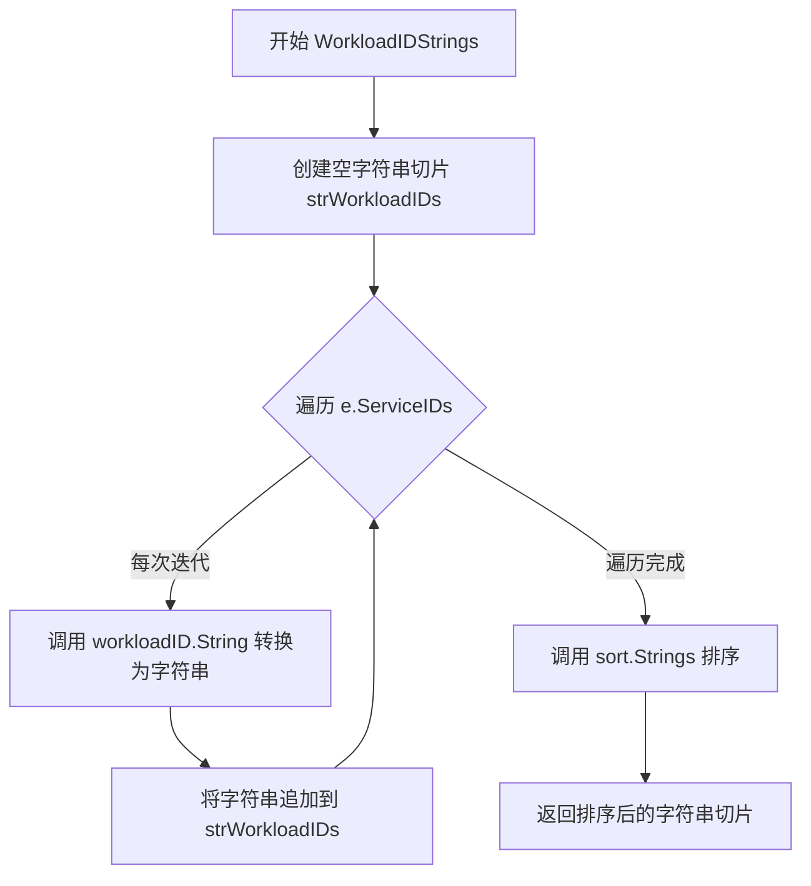
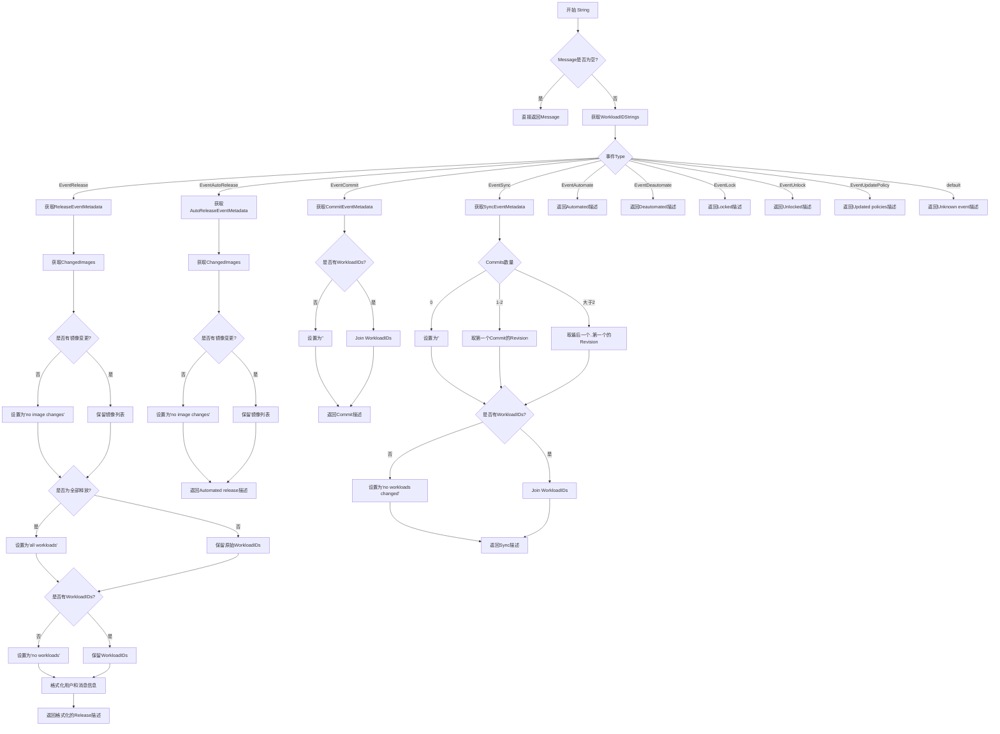
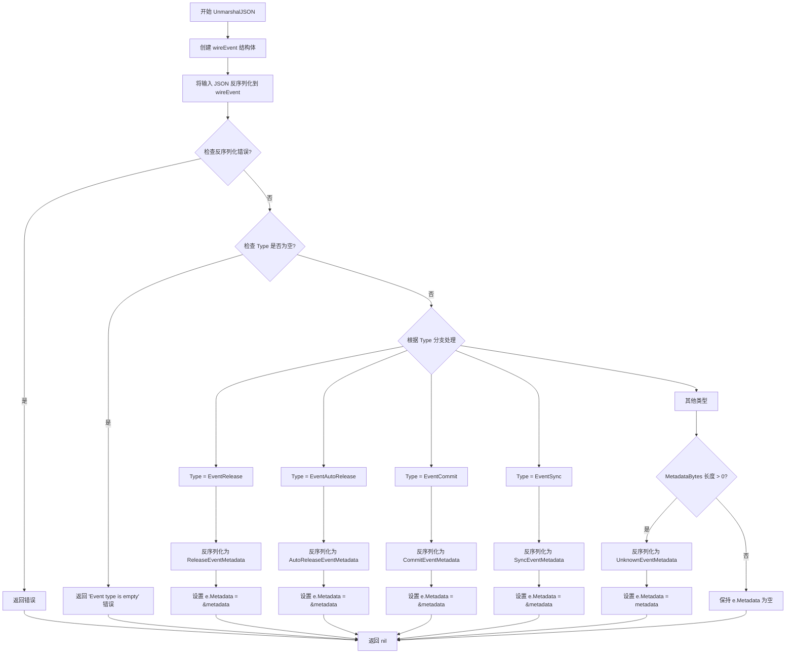
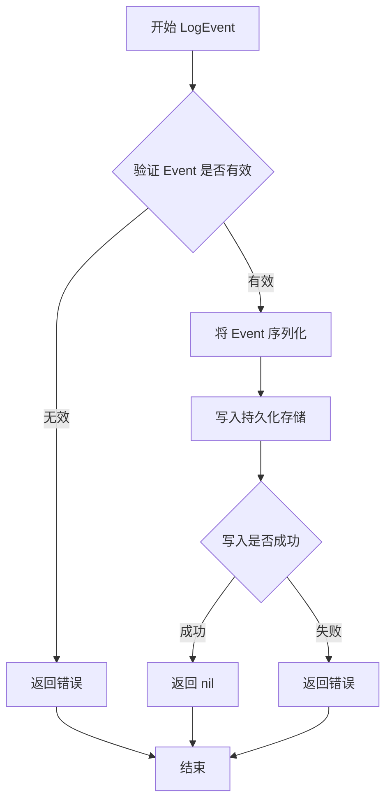
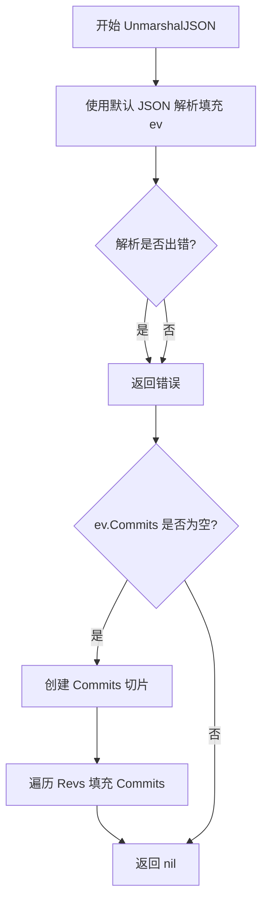
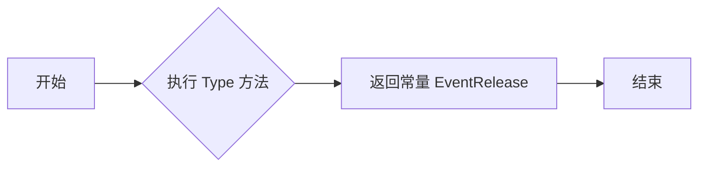
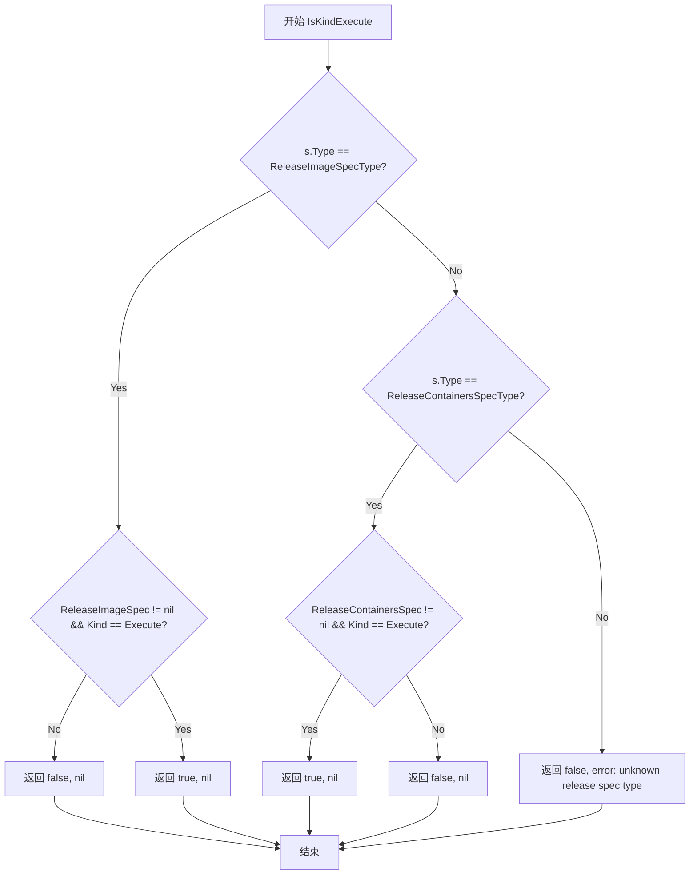
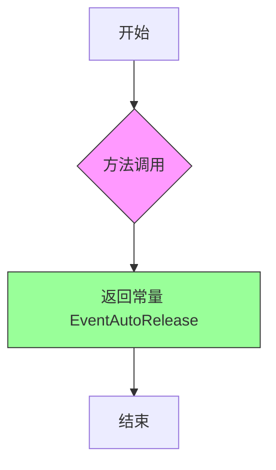

# `flux\pkg\event\event.go` 详细设计文档

这是FluxCD GitOps工具链中的事件管理模块，定义了GitOps工作流中各种事件类型（如发布、同步、提交、自动化等）的数据结构、元数据和序列化逻辑，用于追踪和记录集群状态变更历史。

## 整体流程

```mermaid
graph TD
    A[开始] --> B[JSON输入]
B --> C{解析Event类型}
C -->|EventRelease| D[解析ReleaseEventMetadata]
C -->|EventAutoRelease| E[解析AutoReleaseEventMetadata]
C -->|EventCommit| F[解析CommitEventMetadata]
C -->|EventSync| G[解析SyncEventMetadata]
C -->|其他| H[解析UnknownEventMetadata]
D --> I[返回Event对象]
E --> I
F --> I
G --> I
H --> I
I --> J{调用String()方法?}
J -->|是| K[根据EventType生成描述字符串]
K --> L[结束]
J -->|否| L
```

## 类结构

```
Event (核心事件结构体)
├── EventWriter (接口)
├── EventMetadata (接口 - 类型安全约束)
├── CommitEventMetadata (提交事件元数据)
├── SyncEventMetadata (同步事件元数据)
├── ReleaseEventMetadata (发布事件元数据)
│   └── ReleaseEventCommon (发布事件通用部分)
├── ReleaseSpec (发布规格)
├── AutoReleaseEventMetadata (自动发布元数据)
├── UnknownEventMetadata (未知事件元数据)
├── Commit (提交信息)
└── ResourceError (资源错误)
```

## 全局变量及字段


### `EventCommit`
    
提交事件类型常量

类型：`string`
    


### `EventSync`
    
同步事件类型常量

类型：`string`
    


### `EventRelease`
    
发布事件类型常量

类型：`string`
    


### `EventAutoRelease`
    
自动发布事件类型常量

类型：`string`
    


### `EventAutomate`
    
自动化事件类型常量

类型：`string`
    


### `EventDeautomate`
    
取消自动化事件类型常量

类型：`string`
    


### `EventLock`
    
锁定事件类型常量

类型：`string`
    


### `EventUnlock`
    
解锁事件类型常量

类型：`string`
    


### `EventUpdatePolicy`
    
更新策略事件类型常量

类型：`string`
    


### `NoneOfTheAbove`
    
其他事件类型标识

类型：`string`
    


### `LogLevelDebug`
    
调试日志级别

类型：`string`
    


### `LogLevelInfo`
    
信息日志级别

类型：`string`
    


### `LogLevelWarn`
    
警告日志级别

类型：`string`
    


### `LogLevelError`
    
错误日志级别

类型：`string`
    


### `ReleaseImageSpecType`
    
镜像发布规格类型

类型：`string`
    


### `ReleaseContainersSpecType`
    
容器发布规格类型

类型：`string`
    


### `Event.ID`
    
事件唯一标识符

类型：`EventID`
    


### `Event.ServiceIDs`
    
受影响的工作负载标识符列表

类型：`[]resource.ID`
    


### `Event.Type`
    
事件类型

类型：`string`
    


### `Event.StartedAt`
    
事件开始时间

类型：`time.Time`
    


### `Event.EndedAt`
    
事件结束时间

类型：`time.Time`
    


### `Event.LogLevel`
    
日志级别

类型：`string`
    


### `Event.Message`
    
预格式化的消息字符串

类型：`string`
    


### `Event.Metadata`
    
事件类型的特定元数据

类型：`EventMetadata`
    


### `CommitEventMetadata.Revision`
    
Git提交哈希

类型：`string`
    


### `CommitEventMetadata.Spec`
    
更新规格

类型：`*update.Spec`
    


### `CommitEventMetadata.Result`
    
更新结果

类型：`update.Result`
    


### `SyncEventMetadata.Revs`
    
旧版本兼容的修订列表

类型：`[]string`
    


### `SyncEventMetadata.Commits`
    
提交列表

类型：`[]Commit`
    


### `SyncEventMetadata.Includes`
    
包含的提交类型

类型：`map[string]bool`
    


### `SyncEventMetadata.Errors`
    
资源错误列表

类型：`[]ResourceError`
    


### `SyncEventMetadata.InitialSync`
    
是否为首次同步

类型：`bool`
    


### `ReleaseEventCommon.Revision`
    
发布所基于的修订版本

类型：`string`
    


### `ReleaseEventCommon.Result`
    
发布结果

类型：`update.Result`
    


### `ReleaseEventCommon.Error`
    
错误信息

类型：`string`
    


### `ReleaseSpec.Type`
    
发布类型标识

类型：`string`
    


### `ReleaseSpec.ReleaseImageSpec`
    
镜像发布规格

类型：`*update.ReleaseImageSpec`
    


### `ReleaseSpec.ReleaseContainersSpec`
    
容器发布规格

类型：`*update.ReleaseContainersSpec`
    


### `ReleaseEventMetadata.Spec`
    
发布规格

类型：`ReleaseSpec`
    


### `ReleaseEventMetadata.Cause`
    
触发原因

类型：`update.Cause`
    


### `AutoReleaseEventMetadata.Spec`
    
自动化规格

类型：`update.Automated`
    


### `Commit.Revision`
    
Git提交哈希

类型：`string`
    


### `Commit.Message`
    
提交消息

类型：`string`
    


### `ResourceError.ID`
    
资源标识符

类型：`resource.ID`
    


### `ResourceError.Path`
    
资源路径

类型：`string`
    


### `ResourceError.Error`
    
错误信息

类型：`string`
    
    

## 全局函数及方法


### `shortRevision`

该函数是一个全局工具函数，用于将完整的Git提交哈希值截取为前7位短哈希格式，常用于日志展示和事件记录中，以保持输出的简洁性和可读性。

参数：

- `rev`：`string`，完整的Git提交哈希值（Revision）

返回值：`string`，截取后的前7位哈希值（若原哈希长度小于等于7位，则返回原值）

#### 流程图

```mermaid
flowchart TD
    A[开始 shortRevision] --> B[输入参数 rev]
    B --> C{lenrev <= 7?}
    C -->|是| D[返回完整 rev]
    C -->|否| E[返回 rev[:7] 截取前7位]
    D --> F[结束]
    E --> F
```

#### 带注释源码

```go
// shortRevision 将Git提交哈希截取为前7位短哈希
// 参数 rev: 完整的Git提交哈希值
// 返回值: 若哈希长度小于等于7位则返回原值，否则返回前7位
func shortRevision(rev string) string {
	// 如果哈希长度小于等于7位，直接返回完整哈希
	if len(rev) <= 7 {
		return rev
	}
	// 否则截取前7位字符（Git短哈希通常为7位）
	return rev[:7]
}
```


### `Event.WorkloadIDStrings`

获取排序后的工作负载ID字符串列表。该方法遍历事件的服务ID列表，将每个工作负载ID转换为字符串形式，然后对结果进行排序并返回。

参数：

- 该方法无显式参数，通过接收者 `e Event` 访问结构体实例

返回值：`[]string`，返回按字母顺序排序的工作负载ID字符串列表

#### 流程图



#### 带注释源码

```go
// WorkloadIDStrings 获取排序后的工作负载ID字符串列表
// 该方法将Event结构体中的ServiceIDs转换为排序后的字符串数组
func (e Event) WorkloadIDStrings() []string {
	// 创建一个空字符串切片用于存储转换后的工作负载ID
	var strWorkloadIDs []string
	
	// 遍历Event中的ServiceIDs字段（类型为[]resource.ID）
	for _, workloadID := range e.ServiceIDs {
		// 将每个resource.ID类型转换为字符串表示
		// 这里调用了resource.ID类型的String()方法
		strWorkloadIDs = append(strWorkloadIDs, workloadID.String())
	}
	
	// 使用Go标准库的sort.Strings对字符串切片进行原地排序
	// 排序规则为字母顺序升序
	sort.Strings(strWorkloadIDs)
	
	// 返回排序后的工作负载ID字符串列表
	return strWorkloadIDs
}
```


### `Event.String`

生成事件的字符串描述，根据事件类型（Release、AutoRelease、Commit、Sync等）和元数据返回格式化的可读字符串。如果没有设置Message字段，则根据Type和Metadata生成描述。

参数：

- （无显式参数，接收者为 `e Event`）

返回值：`string`，返回事件的字符串描述

#### 流程图



#### 带注释源码

```go
// String 方法：生成事件的字符串描述
// 如果事件设置了Message字段，直接返回该预格式化消息
// 否则，根据事件类型(EventRelease/EventAutoRelease/EventCommit等)和元数据生成描述
func (e Event) String() string {
	// 1. 优先返回预格式化的消息（向后兼容）
	if e.Message != "" {
		return e.Message
	}

	// 2. 获取工作负载ID列表（已排序）
	strWorkloadIDs := e.WorkloadIDStrings()

	// 3. 根据事件类型分支处理
	switch e.Type {
	case EventRelease:
		// 释放事件：显示镜像变更和工作负载
		metadata := e.Metadata.(*ReleaseEventMetadata)
		
		// 获取变更的镜像列表
		strImageIDs := metadata.Result.ChangedImages()
		if len(strImageIDs) == 0 {
			strImageIDs = []string{"no image changes"}
		}
		
		// 检查是否释放所有工作负载
		if metadata.Spec.Type == "" || metadata.Spec.Type == ReleaseImageSpecType {
			for _, spec := range metadata.Spec.ReleaseImageSpec.ServiceSpecs {
				if spec == update.ResourceSpecAll {
					strWorkloadIDs = []string{"all workloads"}
					break
				}
			}
		}
		
		// 确保有工作负载信息
		if len(strWorkloadIDs) == 0 {
			strWorkloadIDs = []string{"no workloads"}
		}
		
		// 格式化用户信息
		var user string
		if metadata.Cause.User != "" {
			user = fmt.Sprintf(", by %s", metadata.Cause.User)
		}
		
		// 格式化消息信息
		var msg string
		if metadata.Cause.Message != "" {
			msg = fmt.Sprintf(", with message %q", metadata.Cause.Message)
		}
		
		// 返回格式化的释放描述
		return fmt.Sprintf(
			"Released: %s to %s%s%s",
			strings.Join(strImageIDs, ", "),
			strings.Join(strWorkloadIDs, ", "),
			user,
			msg,
		)

	case EventAutoRelease:
		// 自动释放事件：显示自动释放的镜像
		metadata := e.Metadata.(*AutoReleaseEventMetadata)
		strImageIDs := metadata.Result.ChangedImages()
		if len(strImageIDs) == 0 {
			strImageIDs = []string{"no image changes"}
		}
		return fmt.Sprintf(
			"Automated release of %s",
			strings.Join(strImageIDs, ", "),
		)

	case EventCommit:
		// 提交事件：显示修订版本和工作负载
		metadata := e.Metadata.(*CommitEventMetadata)
		svcStr := "<no changes>"
		if len(strWorkloadIDs) > 0 {
			svcStr = strings.Join(strWorkloadIDs, ", ")
		}
		return fmt.Sprintf("Commit: %s, %s", shortRevision(metadata.Revision), svcStr)

	case EventSync:
		// 同步事件：显示修订版本范围和工作负载
		metadata := e.Metadata.(*SyncEventMetadata)
		revStr := "<no revision>"
		
		// 根据提交数量确定版本字符串
		if 0 < len(metadata.Commits) && len(metadata.Commits) <= 2 {
			revStr = shortRevision(metadata.Commits[0].Revision)
		} else if len(metadata.Commits) > 2 {
			// 显示范围：最旧..最新
			revStr = fmt.Sprintf(
				"%s..%s",
				shortRevision(metadata.Commits[len(metadata.Commits)-1].Revision),
				shortRevision(metadata.Commits[0].Revision),
			)
		}
		
		svcStr := "no workloads changed"
		if len(strWorkloadIDs) > 0 {
			svcStr = strings.Join(strWorkloadIDs, ", ")
		}
		return fmt.Sprintf("Sync: %s, %s", revStr, svcStr)

	case EventAutomate:
		// 自动化事件：显示工作负载
		return fmt.Sprintf("Automated: %s", strings.Join(strWorkloadIDs, ", "))

	case EventDeautomate:
		// 取消自动化事件：显示工作负载
		return fmt.Sprintf("Deautomated: %s", strings.Join(strWorkloadIDs, ", "))

	case EventLock:
		// 锁定事件：显示工作负载
		return fmt.Sprintf("Locked: %s", strings.Join(strWorkloadIDs, ", "))

	case EventUnlock:
		// 解锁事件：显示工作负载
		return fmt.Sprintf("Unlocked: %s", strings.Join(strWorkloadIDs, ", "))

	case EventUpdatePolicy:
		// 策略更新事件：显示工作负载
		return fmt.Sprintf("Updated policies: %s", strings.Join(strWorkloadIDs, ", "))

	default:
		// 未知事件类型
		return fmt.Sprintf("Unknown event: %s", e.Type)
	}
}
```


### `Event.UnmarshalJSON`

实现Event结构体的自定义JSON反序列化，根据Event类型动态解析不同的Metadata结构体。

参数：

- `in`：`[]byte`，输入的JSON字节数组，包含待反序列化的Event数据

返回值：`error`，如果反序列化过程中发生错误则返回错误信息，否者返回nil

#### 流程图



#### 带注释源码

```go
// UnmarshalJSON 实现 Event 结构体的自定义 JSON 反序列化
// 根据 Event.Type 字段动态解析不同的 Metadata 结构体
func (e *Event) UnmarshalJSON(in []byte) error {
	// 使用 type alias 避免递归调用 UnmarshalJSON
	type alias Event
	
	// wireEvent 是用于解析 JSON 的中间结构体
	// 将 Metadata 字段声明为 json.RawMessage 以便延迟反序列化
	var wireEvent struct {
		*alias                      // 嵌入 alias，继承 Event 的所有字段
		MetadataBytes json.RawMessage `json:"metadata,omitempty"` // 原始 metadata JSON 数据
	}
	
	// 将指向 Event 的指针转换为 alias 指针并赋值给 wireEvent.alias
	// 这样 wireEvent.alias 就能共享 e 的内存空间
	wireEvent.alias = (*alias)(e)

	// 首先将输入 JSON 反序列化到 wireEvent
	// 此时 Metadata 字段会被反序列化为 MetadataBytes (json.RawMessage)
	if err := json.Unmarshal(in, &wireEvent); err != nil {
		return err  // 返回 JSON 解析错误
	}
	
	// 验证 Event 类型的有效性
	if wireEvent.Type == "" {
		return errors.New("Event type is empty")
	}

	// 根据 Event 类型分支处理不同的 Metadata 结构
	// 这些类型对应我们关心的不同事件种类，用于通知等场景
	switch wireEvent.Type {
	case EventRelease:
		// 处理发布事件元数据
		var metadata ReleaseEventMetadata
		if err := json.Unmarshal(wireEvent.MetadataBytes, &metadata); err != nil {
			return err
		}
		e.Metadata = &metadata  // 设置事件元数据为具体类型指针
		
	case EventAutoRelease:
		// 处理自动发布事件元数据
		var metadata AutoReleaseEventMetadata
		if err := json.Unmarshal(wireEvent.MetadataBytes, &metadata); err != nil {
			return err
		}
		e.Metadata = &metadata
		
	case EventCommit:
		// 处理提交事件元数据
		var metadata CommitEventMetadata
		if err := json.Unmarshal(wireEvent.MetadataBytes, &metadata); err != nil {
			return err
		}
		e.Metadata = &metadata
		
	case EventSync:
		// 处理同步事件元数据
		var metadata SyncEventMetadata
		if err := json.Unmarshal(wireEvent.MetadataBytes, &metadata); err != nil {
			return err
		}
		e.Metadata = &metadata
		
	default:
		// 对于未知事件类型，如果存在 metadata 则反序列化为通用 map
		if len(wireEvent.MetadataBytes) > 0 {
			var metadata UnknownEventMetadata
			if err := json.Unmarshal(wireEvent.MetadataBytes, &metadata); err != nil {
				return err
			}
			e.Metadata = metadata  // 注意：这里是值类型而非指针
		}
	}

	// 默认情况下，保留 Event 的 Metadata 为空或原始值
	// 对于没有 metadata 的事件，Metadata 将保持为 nil
	return nil
}
```


### `EventWriter.LogEvent`

记录事件到历史记录中，用于追踪和审计系统中的各种操作和行为。

参数：

- `event`：`Event`，需要记录的事件对象，包含事件ID、服务IDs、事件类型、时间戳、日志级别、消息和元数据等信息。

返回值：`error`，如果记录事件时发生错误则返回错误信息，否则返回 nil。

#### 流程图



#### 带注释源码

```go
// EventWriter 接口定义了记录事件的能力
// 具体实现可以是文件存储、数据库存储或远程服务
type EventWriter interface {
    // LogEvent 记录一个事件到历史记录
    // 参数 event: 要记录的事件，包含事件的完整信息
    // 返回值: 记录失败时返回错误，成功时返回 nil
    LogEvent(Event) error
}

// Event 结构体定义了一个完整的事件
// 包含事件的唯一标识、关联的工作负载、类型、时间信息、日志级别和元数据
type Event struct {
    ID EventID // 事件的唯一标识符，保存时自动生成
    ServiceIDs []resource.ID // 受此事件影响的工作负载标识符列表
    Type string // 事件类型，如 "release"、"sync"、"commit" 等
    StartedAt time.Time // 事件开始时间
    EndedAt time.Time // 事件结束时间，对于瞬时事件与 StartedAt 相同
    LogLevel string // 日志级别，用于指示事件的重要性，可选值为 debug|info|warn|error
    Message string // 预格式化的错误或其他信息字符串，为保持向后兼容而保留
    Metadata EventMetadata // 事件类型特定的元数据，如果没有元数据则为 nil
}
```

#### 备注

- `EventWriter` 是一个接口，具体实现（如文件日志写入器、数据库写入器等）需要实现 `LogEvent` 方法
- 事件记录是 Flux CD 系统中重要的审计和追踪机制，用于记录所有对工作负载的变更操作
- 事件可以包含不同类型的元数据（如 `ReleaseEventMetadata`、`SyncEventMetadata` 等），具体取决于事件类型
- 错误处理确保了事件记录的可靠性，调用方需要检查返回值以确认事件是否成功记录


### EventMetadata.Type()

返回事件类型字符串，用于类型安全约束，确保 Metadata 字段始终为指针类型，调用方可以安全地进行类型断言。

参数：
- 该方法为无参数方法

返回值：`string`，返回事件类型的字符串标识符（如 "commit"、"sync"、"release"、"autorelease" 或 "unknown"）

#### 流程图

```mermaid
flowchart TD
    A[开始] --> B{调用 Type 方法}
    B --> C{判断实现类型}
    C -->|CommitEventMetadata| D[返回 EventCommit = "commit"]
    C -->|SyncEventMetadata| E[返回 EventSync = "sync"]
    C -->|ReleaseEventMetadata| F[返回 EventRelease = "release"]
    C -->|AutoReleaseEventMetadata| G[返回 EventAutoRelease = "autorelease"]
    C -->|UnknownEventMetadata| H[返回 "unknown"]
    D --> I[结束]
    E --> I
    F --> I
    G --> I
    H --> I
```

#### 带注释源码

```go
// EventMetadata 是类型安全约束接口，仅用于确保 Metadata 字段为指针类型
// 实际方法实现由具体的事件元数据类型完成
type EventMetadata interface {
	Type() string
}

// CommitEventMetadata 的 Type 方法返回事件类型为 "commit"
// 用于标识 git 提交相关的事件
func (cem *CommitEventMetadata) Type() string {
	return EventCommit
}

// SyncEventMetadata 的 Type 方法返回事件类型为 "sync"
// 用于标识集群同步相关的事件
func (cem *SyncEventMetadata) Type() string {
	return EventSync
}

// ReleaseEventMetadata 的 Type 方法返回事件类型为 "release"
// 用于标识手动发布/更新相关的事件
func (rem *ReleaseEventMetadata) Type() string {
	return EventRelease
}

// AutoReleaseEventMetadata 的 Type 方法返回事件类型为 "autorelease"
// 用于标识自动发布（镜像自动更新）相关的事件
func (rem *AutoReleaseEventMetadata) Type() string {
	return EventAutoRelease
}

// UnknownEventMetadata 的 Type 方法返回 "unknown"
// 这是一个特殊例外，因为 UnknownEventMetadata 是 map 的类型别名，无法使用指针接收者
// 用于标识未知或自定义类型的事件元数据
func (uem UnknownEventMetadata) Type() string {
	return "unknown"
}
```

---

### 潜在技术债务与优化空间

1. **类型断言安全性**：虽然 `Type()` 方法提供了类型安全约束，但在实际使用 `Event.Metadata` 时仍需进行类型断言，建议增加运行时类型检查保护。

2. **UnknownEventMetadata 的特殊性**：由于是 map 类型别名，无法使用指针接收者，这与接口设计的一致性存在差异，可考虑重构为结构体类型。

3. **文档注释完善**：接口 `EventMetadata` 的注释仅说明了设计意图，未说明具体使用场景，建议补充更详细的使用说明。

---

### 关键组件信息

| 组件名称 | 一句话描述 |
|---------|-----------|
| EventMetadata | 类型安全约束接口，确保事件元数据为指针类型 |
| CommitEventMetadata | git 提交事件的元数据结构 |
| SyncEventMetadata | 集群同步事件的元数据结构 |
| ReleaseEventMetadata | 手动发布事件的元数据结构 |
| AutoReleaseEventMetadata | 自动发布事件的元数据结构 |
| UnknownEventMetadata | 未知类型事件的元数据映射 |


### `CommitEventMetadata.ShortRevision`

返回 `CommitEventMetadata` 结构体中存储的提交哈希值的前7个字符，用于在日志和事件展示中提供简洁的版本标识。

参数： 无

返回值：`string`，返回缩短后的提交哈希字符串（最多7个字符）

#### 流程图

```mermaid
flowchart TD
    A[开始 ShortRevision] --> B{检查 Revision 长度}
    B -->|长度 <= 7| C[直接返回完整 Revision]
    B -->|长度 > 7| D[返回 Revision[:7] 前7个字符]
    C --> E[结束]
    D --> E
```

#### 带注释源码

```go
// ShortRevision 返回缩短的提交哈希
// 如果 Revision 长度不超过7个字符，则返回完整 Revision
// 否则返回前7个字符，用于日志和展示场景
func (c CommitEventMetadata) ShortRevision() string {
    // 调用包级函数 shortRevision 进行实际的截断操作
    return shortRevision(c.Revision)
}
```


### `CommitEventMetadata.Type()`

该方法是一个简单的类型获取器，用于返回 `CommitEventMetadata` 实例所对应的事件类型字符串 "commit"。

参数：  
（无参数）

返回值：`string`，返回事件类型常量 `EventCommit` 的值（字符串 "commit"），用于标识该元数据属于 Git 提交事件。

#### 流程图

```mermaid
flowchart TD
    A[调用 Type 方法] --> B{方法执行}
    B --> C[返回常量 EventCommit]
    C --> D[值为 "commit"]
```

#### 带注释源码

```go
// Type 是 CommitEventMetadata 实现的 EventMetadata 接口方法
// 该方法返回与 CommitEventMetadata 类型相关联的事件类型字符串
// 参数: 无
// 返回值: string 类型，返回常量 EventCommit 的值 "commit"
func (cem *CommitEventMetadata) Type() string {
    // 返回预定义的常量事件类型 "commit"
    // 此常量定义在 event 包的常量声明区域
    return EventCommit
}
```


### `SyncEventMetadata.UnmarshalJSON`

处理旧版本事件格式的JSON反序列化，将已弃用的 `revisions` 字段自动转换为新的 `commits` 字段，以保持向后兼容性。

参数：

- `b`：`[]byte`，要反序列化的 JSON 格式字节数组

返回值：`error`，如果反序列化过程中发生错误则返回错误信息，否则返回 `nil`

#### 流程图



#### 带注释源码

```go
// Account for old events, which used the revisions field rather than commits
// 处理旧版本事件格式：将旧的 revisions 字段转换为新的 commits 字段
func (ev *SyncEventMetadata) UnmarshalJSON(b []byte) error {
    // 定义别名类型，避免递归调用自身的 UnmarshalJSON
    type data SyncEventMetadata
    
    // 先使用默认的 JSON 解析方式将数据填充到 ev 中
    // 这会解析新版本的 commits 字段（如果存在）
    err := json.Unmarshal(b, (*data)(ev))
    if err != nil {
        return err
    }
    
    // 如果 Commits 为 nil，说明数据来自旧版本（只有 Revs 字段）
    // 需要将旧格式的 Revs 转换为新格式的 Commits
    if ev.Commits == nil {
        ev.Commits = make([]Commit, len(ev.Revs))
        for i, rev := range ev.Revs {
            ev.Commits[i].Revision = rev
        }
    }
    return nil
}
```


### `SyncEventMetadata.Type`

该方法是 `SyncEventMetadata` 类型的成员方法，实现了 `EventMetadata` 接口，用于返回事件类型对应的字符串标识。

参数：此方法没有显式参数（接收者为指针 receiver）

返回值：`string`，返回事件类型字符串 `"sync"`

#### 流程图

```mermaid
flowchart TD
    A[Start Type method] --> B{Receiver is nil?}
    B -- Yes --> C[Return "sync"]
    B -- No --> C
    C --> D[End Type method]
```

#### 带注释源码

```go
// Type 是 SyncEventMetadata 实现 EventMetadata 接口的方法
// 返回该元数据对应的事件类型字符串 "sync"
func (sem *SyncEventMetadata) Type() string {
	return EventSync // 常量定义：EventSync = "sync"
}
```

---

**补充说明：**

- **设计目标**：该方法遵循了 Go 语言的接口实现模式，`SyncEventMetadata` 实现了 `EventMetadata` 接口的 `Type() string` 方法，使得不同事件类型的元数据可以通过统一的方式获取其类型标识。
- **约束**：由于方法返回的是常量 `EventSync`（值为 `"sync"`），因此该方法是无副作用的纯函数，不依赖外部状态。
- **调用场景**：在 `Event.String()` 方法中，当 `e.Type == EventSync` 时，会将 `e.Metadata` 断言为 `*SyncEventMetadata` 并访问其字段生成描述字符串。


### `ReleaseEventMetadata.Type`

该方法是 `ReleaseEventMetadata` 类型的类型方法，用于返回事件类型标识，以便在运行时动态判断事件的具体类型。

参数：

- （无参数）

返回值：`string`，返回事件类型常量 `EventRelease`，值为字符串 "release"

#### 流程图



#### 带注释源码

```go
// Type 方法是 EventMetadata 接口的实现
// 返回该事件元数据的类型标识，用于类型断言和事件分发
// Parameters: 无
// Return: string - 返回事件类型常量 "release"
func (rem *ReleaseEventMetadata) Type() string {
	return EventRelease
}
```


### ReleaseSpec.IsKindExecute

判断发布规格（ReleaseSpec）的类型是否为执行（Execute）类型。如果规格类型未知，则返回错误。

参数：

- （无显式参数，使用接收者 `s`）

返回值：

- `bool`，如果是执行类型则返回 `true`，否则返回 `false`
- `error`，当 ReleaseSpec 的 Type 字段为未知类型时返回错误信息

#### 流程图



#### 带注释源码

```go
// IsKindExecute 判断发布规格 s 是否为 ReleaseImageSpec 或 ReleaseContainersSpec 且 Kind 为 execute 类型
// 如果 s 的 Type 无效则返回错误
func (s ReleaseSpec) IsKindExecute() (bool, error) {
    // 根据 ReleaseSpec 的 Type 字段进行类型分支判断
    switch s.Type {
    // 类型为镜像发布规格
    case ReleaseImageSpecType:
        // 检查 ReleaseImageSpec 是否存在且 Kind 是否为执行类型
        if s.ReleaseImageSpec != nil && s.ReleaseImageSpec.Kind == update.ReleaseKindExecute {
            return true, nil // 是执行类型，返回 true
        }
    // 类型为容器发布规格
    case ReleaseContainersSpecType:
        // 检查 ReleaseContainersSpec 是否存在且 Kind 是否为执行类型
        if s.ReleaseContainersSpec != nil && s.ReleaseContainersSpec.Kind == update.ReleaseKindExecute {
            return true, nil // 是执行类型，返回 true
        }

    // 默认情况：Type 为未知类型
    default:
        // 返回 false 和格式化错误信息
        return false, errors.Errorf("unknown release spec type %s", s.Type)
    }
    // 既不是镜像发布也不是容器发布的执行类型，返回 false
    return false, nil
}
```


### `ReleaseSpec.UnmarshalJSON`

处理旧版本兼容的JSON格式，当JSON数据中`Type`字段为空时，自动将其解析为`ReleaseImageSpec`类型，并设置`Type`为`ReleaseImageSpecType`，以兼容没有`Type`字段的旧版本事件数据。

参数：

- `b`：`[]byte`，要解析的JSON字节切片

返回值：`error`，如果解析成功返回`nil`，如果JSON格式无效或类型不支持返回错误信息

#### 流程图

```mermaid
flowchart TD
    A[开始 UnmarshalJSON] --> B[创建临时变量 t, 类型为 ReleaseSpec]
    B --> C{json.Unmarshal 成功?}
    C -->|否| D[返回错误]
    C -->|是| E{检查 t.Type}
    E -->|空字符串 ""| F[创建 ReleaseImageSpec]
    F --> G[使用 ReleaseImageSpec 再次解析 JSON]
    G --> H{解析成功?}
    H -->|否| D
    H -->|是| I[设置 s.Type = ReleaseImageSpecType]
    I --> J[设置 s.ReleaseImageSpec = r]
    J --> K[返回 nil]
    E -->|"ReleaseImageSpecType" 或 "ReleaseContainersSpecType"| L[直接返回 nil]
    E -->|其他值| M[返回 'unknown ReleaseSpec type' 错误]
    K --> N[结束]
    L --> N
    M --> N
```

#### 带注释源码

```go
// UnmarshalJSON for old version of spec (update.ReleaseImageSpec) where Type is empty
func (s *ReleaseSpec) UnmarshalJSON(b []byte) error {
	// 使用类型别名避免递归调用 UnmarshalJSON
	type T ReleaseSpec
	// 将 s 转换为 T 类型进行基本解析
	t := (*T)(s)
	// 首先尝试使用默认方式解析 JSON 到临时变量 t
	if err := json.Unmarshal(b, t); err != nil {
		return err
	}

	// 根据 Type 字段的值进行不同的处理
	switch t.Type {
	case "":
		// 旧版本兼容：Type 为空时，视为 ReleaseImageSpec 类型
		// 创建一个新的 ReleaseImageSpec 用于解析
		r := &update.ReleaseImageSpec{}
		// 再次使用相同的 JSON 数据解析为 ReleaseImageSpec
		if err := json.Unmarshal(b, r); err != nil {
			return err
		}
		// 设置 Type 为标准的 ReleaseImageSpecType
		s.Type = ReleaseImageSpecType
		// 将解析结果赋值给 ReleaseImageSpec 字段
		s.ReleaseImageSpec = r

	case ReleaseImageSpecType, ReleaseContainersSpecType:
		// 新版本格式：Type 已经是已知的类型，无需额外处理
		// all good
	default:
		// 未知类型，返回错误
		return errors.New("unknown ReleaseSpec type")
	}
	return nil
}
```


### `AutoReleaseEventMetadata.Type`

该方法用于返回自动发布事件（AutoRelease）的类型标识符，是一个无参数的简单getter方法。

参数： 无

返回值：`string`，返回事件类型标识符 "autorelease"

#### 流程图



#### 带注释源码

```go
// AutoReleaseEventMetadata 的 Type 方法
// 用于返回自动发布事件的类型标识符
// 参数：无
// 返回值：string 类型的事件类型标识符
func (rem *AutoReleaseEventMetadata) Type() string {
    // 返回预定义的自动发布事件常量
    // 该常量的值为 "autorelease"
    return EventAutoRelease
}
```


### `UnknownEventMetadata.Type`

该方法是一个接口实现方法，用于返回未知事件类型的字符串标识，返回值固定为"unknown"。

参数：
- （无参数，仅包含接收者 `uem UnknownEventMetadata`）

返回值：`string`，返回固定字符串 "unknown"，表示该事件为未知类型。

#### 流程图

```mermaid
flowchart TD
    A[开始] --> B{调用 Type 方法}
    B --> C[返回字符串 "unknown"]
    C --> D[结束]
```

#### 带注释源码

```go
// Special exception from pointer receiver rule, as UnknownEventMetadata is a
// type alias for a map
func (uem UnknownEventMetadata) Type() string {
	return "unknown"
}
```

**代码说明：**
- 该方法是 `EventMetadata` 接口的实现
- 接收者 `uem UnknownEventMetadata` 是值类型而非指针类型，因为 `UnknownEventMetadata` 是 `map[string]interface{}` 的类型别名
- 返回固定字符串 `"unknown"` 用于标识未知事件类型
- 注释解释了为什么使用值接收器而非指针接收器（因为 `UnknownEventMetadata` 是映射类型的别名）

## 关键组件


### Event 类型系统

定义 FluxCD 系统中所有事件类型，包括 commit、sync、release、autorelease、automate、deautomate、lock、unlock、update_policy 等，用于标识不同类型的运维事件。

### Event 结构体

核心事件数据结构，包含事件ID、服务 workload 标识、事件类型、时间戳、日志级别、消息及元数据，用于在 FluxCD 中记录和传递各类运维事件。

### Event 元数据类型

包含 CommitEventMetadata（git 提交事件）、SyncEventMetadata（同步集群事件）、ReleaseEventMetadata（发布事件）、AutoReleaseEventMetadata（自动发布事件），用于存储不同事件类型的具体业务数据。

### ReleaseSpec 发布规格

定义发布规范的类型（镜像发布或容器发布）、发布镜像规格和容器规格，以及 IsKindExecute() 方法判断是否为执行类型的发布。

### JSON 反序列化处理

通过自定义 UnmarshalJSON 方法处理事件和发布规格的 JSON 反序列化，支持旧版本兼容性和动态元数据类型推断，实现事件数据的灵活解析。

### EventWriter 接口

事件写入接口，定义 LogEvent 方法用于将事件记录到历史记录中，提供了事件持久化的抽象层。

### 事件字符串化方法

Event 类型的 String() 方法将事件转换为人类可读的字符串描述，根据不同事件类型格式化输出，包含镜像变更、工作负载、用户、提交信息等内容。


## 问题及建议


### 已知问题

- **类型断言缺乏安全检查**: `Event.String()` 方法中使用 `e.Metadata.(*ReleaseEventMetadata)` 等直接类型断言，如果类型不匹配会触发 panic，应使用类型断言带 ok 检查或 type switch
- **TODO 未完成**: 代码中存在 `// TODO: rename to ServiceIDs to WorkloadIDs after adding versioning.` 标记，说明字段命名技术债务尚未处理
- **UnmarshalJSON 中不必要的 break 语句**: 在 `Event.UnmarshalJSON` 的 switch case 中使用了 `break` 语句，Go 语言中 case 默认 break，不需要显式使用
- **重复的字符串处理逻辑**: `shortRevision` 函数逻辑在多处复制使用，且 `WorkloadIDStrings()` 方法每次调用都会重新排序和转换，应考虑缓存
- **事件类型硬编码**: 虽然定义了事件类型常量，但 `String()` 方法中仍存在部分硬编码的字符串字面量
- **缺乏输入验证**: `Event` 结构体在反序列化时未验证必填字段（如 Type、StartedAt 等），可能导致数据不一致
- **Error 包使用不一致**: 混用 `errors.Errorf` 和 `errors.New`，且部分位置返回的 error 未携带足够上下文信息

### 优化建议

- 将 `Event.String()` 方法中的类型断言改为 type switch 并添加默认处理，提升健壮性
- 清理代码中的 TODO 注释，或将其纳入issue跟踪系统
- 移除 `Event.UnmarshalJSON` 中多余的 break 语句
- 考虑为频繁调用的 `WorkloadIDStrings()` 结果添加缓存机制，或提供延迟加载选项
- 统一错误处理方式，使用统一的错误包装函数
- 在反序列化时添加必填字段校验，确保数据完整性
- 将 `EventMetadata` 接口扩展，提供更丰富的元数据访问方法，减少类型断言的使用


## 其它


### 设计目标与约束

本模块的设计目标是构建一个统一的事件模型，用于记录Flux CD操作历史，支持事件追溯、通知和审计。核心约束包括：1）必须保持JSON序列化/反序列化的向后兼容性，以支持旧版本事件数据的解析；2）事件类型系统需具备可扩展性，允许第三方扩展未知事件类型；3）EventMetadata必须使用指针类型，以避免值类型拷贝导致的类型断言失败问题。

### 错误处理与异常设计

代码采用显式错误返回模式，主要错误场景包括：1）EventType为空时返回errors.New("Event type is empty")；2）JSON反序列化失败时向上传递错误；3）ReleaseSpec的UnmarshalJSON对未知类型返回errors.New("unknown ReleaseSpec type")。事件级别通过LogLevel字段（debug|info|warn|error）区分重要性，错误信息可存储在Message字段或各Metadata类型的Error字段中。

### 数据流与状态机

事件生命周期遵循StartedAt -> EndedAt状态转换，对于瞬时事件两者相同。数据流向：外部调用LogEvent接口写入 -> Event结构体组装 -> JSON序列化存储。SyncEventMetadata支持从旧版Revs字段到新版Commits字段的自动迁移，体现状态演进逻辑。Event.String()方法根据Type字段进行状态推断，生成不同格式的字符串表示。

### 外部依赖与接口契约

核心依赖包括：github.com/fluxcd/flux/pkg/resource（资源ID定义）、github.com/fluxcd/flux/pkg/update（更新策略和结果定义）、github.com/pkg/errors（错误封装）、encoding/json（JSON序列化）、sort（字符串排序）。EventWriter接口是唯一需要外部实现的契约，定义LogEvent(Event) error方法用于事件持久化。

### 性能考虑与优化空间

WorkloadIDStrings()方法每次调用都执行sort.Strings()，在高频调用场景下存在性能损耗，建议缓存排序结果。String()方法包含大量字符串拼接操作，可考虑使用strings.Builder优化。UnknownEventMetadata使用map[string]interface{}类型，序列化时缺乏静态类型校验，可能导致运行时错误。

### 安全性考虑

EventMetadata接口通过指针接收者方法定义，防止值类型意外调用。JSON反序列化时对MetadataBytes进行长度检查，避免空payload处理开销。LogLevel字段虽无白名单校验，但上游调用通常受限于预定义常量。

### 版本兼容性策略

采用UnmarshalJSON方法实现版本兼容：1）SyncEventMetadata自动将旧版Revs数组转换为Commits结构；2）ReleaseSpec对空Type字段默认设置为ReleaseImageSpecType；3）未知事件类型降级为UnknownEventMetadata map类型处理。该策略确保旧版本数据库记录可正常加载。

### 测试策略建议

应覆盖场景：1）各事件类型的完整JSON序列化/反序列化往返测试；2）旧版本事件数据的向后兼容测试；3）空Metadata和空ServiceIDs的边界条件；4）UnknownEventMetadata的类型断言验证；5）Event.String()方法对所有事件类型的输出格式验证。

### 关键设计模式

代码采用了以下模式：1）接口抽象（EventWriter、EventMetadata）；2）类型开关（UnmarshalJSON中的switch wireEvent.Type）；3）工厂模式隐式实现（各Metadata类型的Type()方法）；4）适配器模式（UnknownEventMetadata将任意map转换为EventMetadata接口兼容类型）。

### 并发安全性说明

当前实现为无状态设计，不涉及并发访问。Event结构体本身可安全复制，但EventWriter接口的LogEvent方法实现需自行保证线程安全。EventID为int64类型，建议在分布式场景下使用UUID生成器确保唯一性。

    