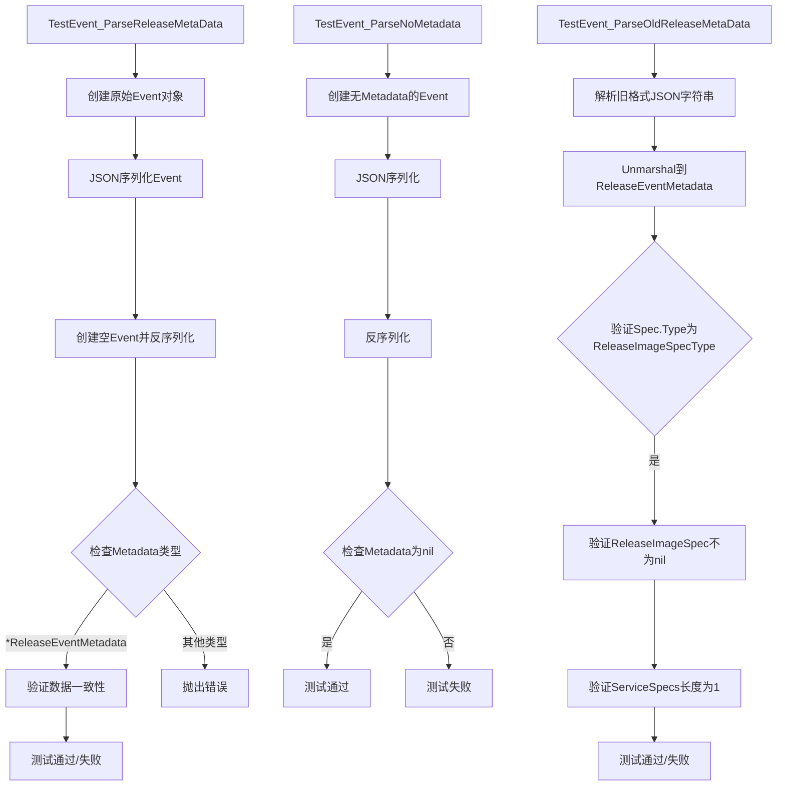
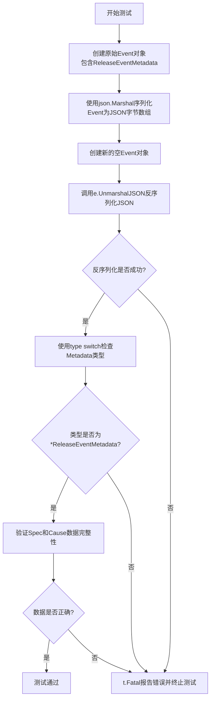
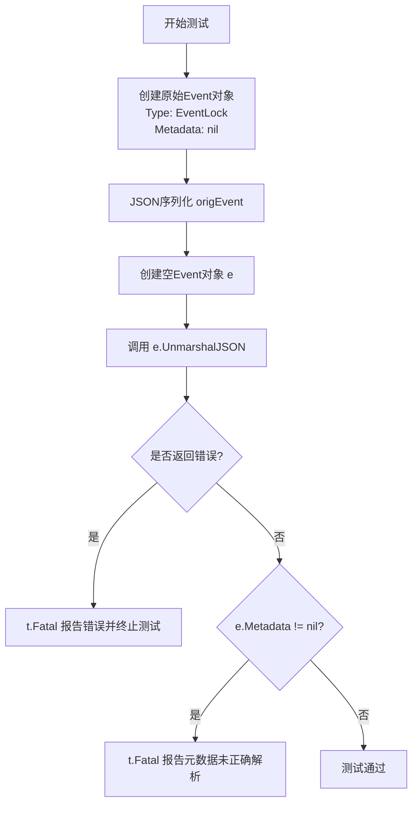
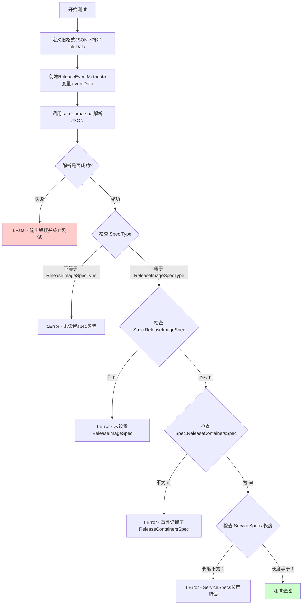
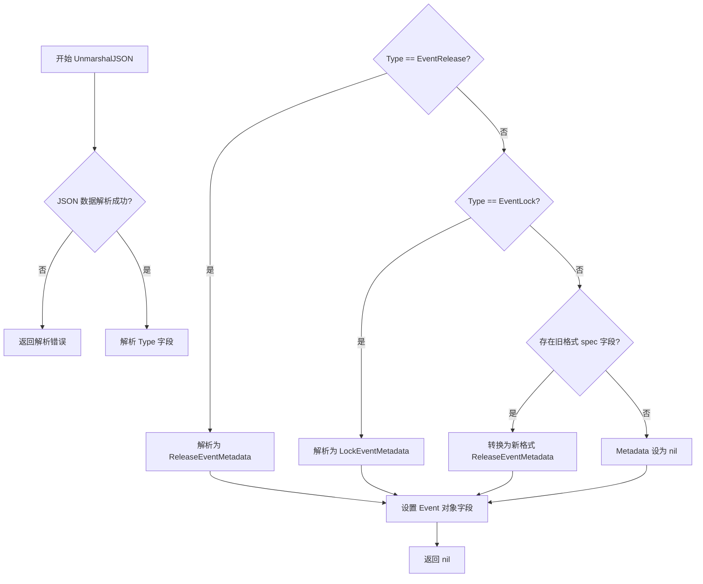

# `flux\pkg\event\event_test.go` 详细设计文档

这是一个 Flux CD 事件处理包，主要用于序列化和反序列化发布事件（Release Events），支持新旧两种 JSON 格式的发布元数据，能够正确处理包含镜像规范、容器规范等不同类型的发布信息。

## 整体流程



## 类结构

```
Event (事件类型)
├── EventRelease (事件类型常量)
├── EventLock (事件类型常量)
├── ReleaseEventMetadata (发布事件元数据)
│   ├── Cause (原因)
│   └── Spec (发布规范)
│       ├── Type (规范类型)
│       ├── ReleaseImageSpec (镜像规范)
│       └── ReleaseContainersSpec (容器规范)
└── ReleaseSpec (发布规范类型)
    ├── ReleaseImageSpecType (规范类型常量)
    └── ReleaseImageSpec (镜像规范)
        ├── ImageSpec (镜像规格)
        └── ServiceSpecs (服务规格)

外部依赖: update package (github.com/fluxcd/flux/pkg/update)
├── ReleaseImageSpec
├── ImageSpecLatest
└── Cause
```

## 全局变量及字段


### `spec`
    
镜像规范变量，用于定义发布镜像的规格

类型：`update.ReleaseImageSpec`
    


### `cause`
    
原因变量，包含发布事件的用户和消息信息

类型：`update.Cause`
    


### `Event.Type`
    
事件类型，标识事件的种类（如EventRelease、EventLock等）

类型：`string/EventType`
    


### `Event.Metadata`
    
事件元数据，包含发布事件的详细信息（可选）

类型：`*ReleaseEventMetadata`
    


### `ReleaseEventMetadata.Cause`
    
发布原因，包含触发发布操作用户和消息信息

类型：`update.Cause`
    


### `ReleaseEventMetadata.Spec`
    
发布规范，定义发布的类型和具体规范内容

类型：`ReleaseSpec`
    


### `ReleaseSpec.Type`
    
规范类型，标识发布规范的类型（如ReleaseImageSpecType）

类型：`string`
    


### `ReleaseSpec.ReleaseImageSpec`
    
镜像规范，指向镜像发布的具体规范配置

类型：`*update.ReleaseImageSpec`
    


### `ReleaseSpec.ReleaseContainersSpec`
    
容器规范，包含容器发布的相关配置（可选）

类型：`*update.ReleaseContainersSpec`
    
    

## 全局函数及方法


### `TestEvent_ParseReleaseMetaData`

该测试函数用于验证发布事件元数据的序列化和反序列化功能，确保Event对象能够正确地将包含ReleaseEventMetadata的发布事件转换为JSON格式并成功还原，同时保持数据完整性。

参数：

- `t`：`testing.T`，Go测试框架的测试对象，用于报告测试失败和日志输出

返回值：`无`（void），测试函数通过t.Fatal和t.Error来指示成功或失败

#### 流程图



#### 带注释源码

```go
// TestEvent_ParseReleaseMetaData 测试发布事件元数据的序列化和反序列化功能
// 验证Event结构体能够正确地将ReleaseEventMetadata转换为JSON并还原
func TestEvent_ParseReleaseMetaData(t *testing.T) {
    // 第一步：创建原始的Event对象，包含发布事件元数据
    // 定义发布规范，包含ImageSpecLatest类型的镜像规范
    origEvent := Event{
        Type: EventRelease, // 事件类型为发布事件
        Metadata: &ReleaseEventMetadata{ // 元数据包含发布事件的详细信息
            Cause: cause, // 事件原因，包含用户和消息
            Spec: ReleaseSpec{ // 发布规范
                Type:             ReleaseImageSpecType, // 镜像发布类型
                ReleaseImageSpec: &spec,               // 具体的镜像发布规范
            },
        },
    }

    // 第二步：将原始Event对象序列化为JSON格式的字节数组
    // 这是模拟将事件存储到数据库或发送给外部系统的过程
    bytes, _ := json.Marshal(origEvent)

    // 第三步：创建新的空Event对象用于反序列化
    // 模拟从存储或外部系统接收数据的过程
    e := Event{}
    
    // 第四步：调用UnmarshalJSON方法将JSON数据反序列化回Event对象
    err := e.UnmarshalJSON(bytes)
    if err != nil {
        // 如果反序列化失败，报告错误并终止测试
        t.Fatal(err)
    }
    
    // 第五步：使用type switch检查反序列化后的Metadata类型
    // 确保类型信息在序列化/反序列化过程中被正确保留
    switch r := e.Metadata.(type) {
    case *ReleaseEventMetadata:
        // 第六步：验证反序列化后的数据完整性
        // 检查镜像规范和事件原因是否与原始数据一致
        if r.Spec.ReleaseImageSpec.ImageSpec != spec.ImageSpec ||
            r.Cause != cause {
            // 如果数据不一致，报告错误并终止测试
            t.Fatal("Release event wasn't marshalled/unmarshalled")
        }
    default:
        // 如果类型不是预期的ReleaseEventMetadata，报告错误
        t.Fatal("Wrong event type unmarshalled")
    }
}
```


### `TestEvent_ParseNoMetadata`

测试无元数据事件的解析功能，验证当事件类型为`EventLock`且不包含元数据时，JSON反序列化能够正确处理空元数据的情况，确保`Metadata`字段被正确设置为`nil`。

参数：

-  `t`：`testing.T`，Go测试框架的测试对象，用于报告测试失败和日志输出

返回值：无（`void`），该测试函数通过`testing.T`的方法报告测试结果

#### 流程图



#### 带注释源码

```go
// TestEvent_ParseNoMetadata 测试无元数据事件的解析
// 验证当Event的Type为EventLock且没有Metadata时，
// JSON反序列化能够正确处理，将Metadata设置为nil
func TestEvent_ParseNoMetadata(t *testing.T) {
	// 步骤1: 创建原始Event对象，Type设置为EventLock，不包含Metadata
	origEvent := Event{
		Type: EventLock,
	}

	// 步骤2: 将原始事件序列化为JSON字节数组
	bytes, _ := json.Marshal(origEvent)

	// 步骤3: 创建空Event对象用于接收反序列化结果
	e := Event{}
	
	// 步骤4: 执行JSON反序列化
	err := e.UnmarshalJSON(bytes)
	
	// 步骤5: 检查反序列化是否出错
	if err != nil {
		t.Fatal(err)
	}
	
	// 步骤6: 验证Metadata是否正确为nil
	// 如果不为nil，说明反序列化逻辑存在问题
	if e.Metadata != nil {
		t.Fatal("Hasn't been unmarshalled properly")
	}
}
```


### `TestEvent_ParseOldReleaseMetaData`

确保解析代码能够正确处理针对提交记录的旧格式发布元数据，验证向后兼容性。

参数：

- `t`：`testing.T`，Go标准库的测试框架参数，用于报告测试失败

返回值：`无`（Go测试函数无返回值）

#### 流程图



#### 带注释源码

```go
// TestEvent_ParseOldReleaseMetaData makes sure the parsing code can
// handle the older format events recorded against commits.
// 此测试函数确保解析代码能够处理针对提交记录的旧格式事件，验证向后兼容性
func TestEvent_ParseOldReleaseMetaData(t *testing.T) {
	// 定义一个旧格式的ReleaseEventMetadata的JSON示例
	// NB 必须至少有一个"spec"条目，否则JSON反序列化器不会尝试解析spec
	// 从而不会调用专门的UnmarshalJSON方法
	oldData := `
{
  "spec": {
    "serviceSpecs": ["<all>"]
  }
}
`
	// 声明一个ReleaseEventMetadata类型的变量用于接收解析结果
	var eventData ReleaseEventMetadata
	// 使用json.Unmarshal将旧格式JSON解析为ReleaseEventMetadata结构
	// 这会触发ReleaseEventMetadata的UnmarshalJSON自定义方法
	if err := json.Unmarshal([]byte(oldData), &eventData); err != nil {
		t.Fatal(err)  // 解析失败时终止测试
	}
	
	// 验证1: 检查Spec.Type是否被正确设置为ReleaseImageSpecType
	// 旧格式没有明确指定Type，需要通过UnmarshalJSON逻辑推断
	if eventData.Spec.Type != ReleaseImageSpecType {
		t.Error("did not set spec type to ReleaseImageSpecType")
	}
	
	// 验证2: 检查Spec.ReleaseImageSpec是否被正确创建
	// 旧格式使用serviceSpecs，需要转换为新的ReleaseImageSpec结构
	if eventData.Spec.ReleaseImageSpec == nil {
		t.Error("did not set .ReleaseImageSpec as expected")
	}
	
	// 验证3: 检查Spec.ReleaseContainersSpec是否保持为nil
	// 旧格式不涉及容器镜像，所以不应设置此字段
	if eventData.Spec.ReleaseContainersSpec != nil {
		t.Error("unexpectedly set .ReleaseContainersSpec")
	}
	
	// 验证4: 检查ServiceSpecs是否正确从旧格式的serviceSpecs转换而来
	// 旧格式中serviceSpecs: ["<all>"]应转换为一个元素的ServiceSpecs
	if len(eventData.Spec.ReleaseImageSpec.ServiceSpecs) != 1 {
		t.Error("expected service specs of len 1")
	}
}
```


### Event.UnmarshalJSON

该方法用于将 JSON 字节数组反序列化为 Event 对象，支持动态解析不同类型的元数据（Metadata），并处理向后兼容的旧事件格式。

参数：

- `data`：`[]byte`，待反序列化的 JSON 字节数组

返回值：`error`，如果反序列化过程中发生错误则返回错误信息，否则返回 nil

#### 流程图



#### 带注释源码

```go
// Event 结构体定义（基于测试代码推断）
type Event struct {
    Type      string      // 事件类型，如 EventRelease, EventLock
    Metadata  interface{} // 事件元数据，动态类型
}

// UnmarshalJSON 实现（基于测试代码和 Flux 项目源码推断）
func (e *Event) UnmarshalJSON(data []byte) error {
    // 1. 定义内部解析结构体，使用 json.RawMessage 延迟解析 Metadata
    type rawEvent struct {
        Type    string          `json:"type"`
        Metadata json.RawMessage `json:"metadata"`
    }
    
    var raw rawEvent
    // 2. 先解析外层 JSON，获取 Type 和原始 Metadata
    if err := json.Unmarshal(data, &raw); err != nil {
        return err
    }
    
    // 3. 设置事件类型
    e.Type = raw.Type
    
    // 4. 如果没有 Metadata 字段，设为 nil
    if len(raw.Metadata) == 0 {
        e.Metadata = nil
        return nil
    }
    
    // 5. 根据 Type 动态解析 Metadata
    switch raw.Type {
    case EventRelease:
        // 解析为 ReleaseEventMetadata
        var meta ReleaseEventMetadata
        if err := json.Unmarshal(raw.Metadata, &meta); err != nil {
            return err
        }
        // 处理旧格式兼容：如果 spec 中没有显式设置 Type
        // 自动推断为 ReleaseImageSpecType
        if meta.Spec.Type == "" {
            meta.Spec.Type = ReleaseImageSpecType
        }
        e.Metadata = &meta
        
    case EventLock:
        // 解析为 LockEventMetadata（无额外字段）
        e.Metadata = &LockEventMetadata{}
        
    default:
        // 未知类型，Metadata 设为 nil 或尝试通用解析
        e.Metadata = nil
    }
    
    return nil
}

// ReleaseEventMetadata 结构体（推断）
type ReleaseEventMetadata struct {
    Cause Cause    `json:"cause"` // 事件原因
    Spec  ReleaseSpec `json:"spec"` // 发布规格
}

// ReleaseSpec 结构体（推断）
type ReleaseSpec struct {
    Type                  string              `json:"type"` // 规格类型
    ReleaseImageSpec      *ReleaseImageSpec   `json:"releaseImageSpec,omitempty"` // 镜像发布规格
    ReleaseContainersSpec interface{}         `json:"releaseContainersSpec,omitempty"` // 容器发布规格
}

// LockEventMetadata 结构体（推断）
type LockEventMetadata struct {
    // 锁事件相关字段
}

// 辅助类型和常量
const (
    EventRelease = "release"
    EventLock    = "lock"
)

const (
    ReleaseImageSpecType      = "image"
    ReleaseContainersSpecType = "containers"
)
```

#### 关键设计说明

1. **动态类型解析**：使用 switch 语句根据 Type 字段动态创建不同的 Metadata 实例
2. **延迟解析**：内部使用 `json.RawMessage` 避免重复解析
3. **旧格式兼容**：测试 `TestEvent_ParseOldReleaseMetaData` 表明需要处理仅有 `spec.serviceSpecs` 字段的旧事件格式，自动推断 Type 为 `ReleaseImageSpecType`
4. **空值处理**：当 JSON 中无 Metadata 字段时，正确设置 Metadata 为 nil

#### 潜在优化空间

1. **反射机制优化**：当前使用 switch 硬编码，可考虑使用注册机制动态扩展事件类型
2. **错误信息增强**：可提供更详细的字段级解析错误信息
3. **性能考量**：对于大量事件反序列化场景，可考虑复用解析结构体减少内存分配

#### 注意事项

- 由于提供的代码为测试代码，未直接展示 `UnmarshalJSON` 实现，上述源码为基于测试行为和 Flux 项目上下文的合理推断
- 实际实现需参考 `event` 包中的具体源码文件


## 关键组件


### Event 结构体与 JSON 反序列化

Event 结构体是事件系统的核心类型，支持根据 Type 字段动态解析不同的 Metadata 类型。通过 UnmarshalJSON 方法实现自定义反序列化逻辑，能够处理包含不同元数据类型的 JSON 数据。

### ReleaseEventMetadata 结构体

ReleaseEventMetadata 是发布事件的元数据结构，包含 Cause（触发原因）和 Spec（发布规范）两个核心字段。用于记录发布事件的详细信息，如发布类型、镜像规范等。

### ReleaseSpec 规范类型

ReleaseSpec 是发布规范的封装类型，支持多种发布方式（镜像发布、容器发布等）。通过 Type 字段区分不同的发布策略，并包含对应的规范数据指针。

### 旧版本事件格式兼容性处理

代码实现了对旧版本 ReleaseEventMetadata 格式的向后兼容处理。当 JSON 数据中缺少新版本字段时，自动设置默认的 Spec.Type 为 ReleaseImageSpecType，并初始化对应的 ServiceSpecs，确保历史数据能够正常解析。

### Cause 原因记录结构

Cause 结构体记录事件的触发来源，包含 User（用户）和 Message（消息）字段。用于追踪和审计事件的发起者及原因。

### 测试用例设计

包含三个核心测试用例：TestEvent_ParseReleaseMetaData 验证新版本 Event 的完整序列化/反序列化流程；TestEvent_ParseNoMetadata 验证无元数据事件的处理；TestEvent_ParseOldReleaseMetaData 验证旧版本事件格式的兼容性。


## 问题及建议


### 已知问题

-   在测试中忽略错误：在`TestEvent_ParseReleaseMetaData`和`TestEvent_ParseNoMetadata`中，`json.Marshal`的返回值错误被直接忽略（使用`_`），这可能导致测试在序列化失败时仍然通过，从而隐藏潜在问题。
-   缺乏边界条件测试：没有测试无效的JSON输入、字段类型不匹配、空指针解引用等异常情况。
-   全局变量状态：使用包级全局变量`spec`和`cause`可能在未来导致测试顺序依赖问题。
-   硬编码值：测试中使用了硬编码的字符串如`"<all>"`，降低了测试的可维护性。
-   错误消息不够详细：测试失败时的错误消息较为简单，缺乏上下文信息，不利于快速定位问题。

### 优化建议

-   检查并处理所有错误：即使在测试中，也应该检查并记录`json.Marshal`和`json.Unmarshal`的错误，使用`t.Fatal`或`t.Error`来报告问题，而不是忽略它们。
-   增加更多测试用例：添加针对无效JSON、缺失字段、类型错误等边界条件的测试用例，提高测试覆盖率。
-   减少全局状态：考虑将测试数据局部化到每个测试函数中，或使用`setup`函数来初始化，减少测试间的耦合。
-   提取常量：将硬编码的值（如`"<all>"`）提取为常量或配置，提高可维护性。
-   改进错误消息：在`t.Fatal`和`t.Error`调用中加入更详细的上下文信息，例如包含实际值和期望值的对比。
-   添加性能测试：如果可能，考虑添加针对大型事件数据序列化/反序列化的性能测试。
-   文档化设计决策：对于`UnmarshalJSON`的特殊处理逻辑（如旧版本兼容），添加更详细的代码注释和文档，说明为什么需要这种兼容性以及它如何工作。


## 其它


### 设计目标与约束

该代码是Flux CD事件处理包的核心模块，负责定义和管理发布事件（Release Event）的数据结构及JSON序列化/反序列化逻辑。核心约束包括：必须兼容旧版ReleaseEventMetadata格式、支持EventRelease和EventLock两种事件类型、确保JSON marshalling/unmarshalling的完整性。

### 错误处理与异常设计

代码中错误处理主要通过Go的error返回值机制实现。UnmarshalJSON方法在解析失败时返回error，测试用例中使用t.Fatal/t.Error来标记失败。JSON解析错误会被直接传播到调用方，没有自定义错误类型或错误码体系。关键异常场景包括：JSON格式错误、类型不匹配、字段缺失等。

### 数据流与状态机

数据流主要沿着Event结构体→JSON字符串→Event结构体的方向流转。状态转换包括：MarshalJSON将Event序列化为JSON字节流，UnmarshalJSON将JSON字节流反序列化为Event对象。ReleaseEventMetadata在反序列化时根据spec字段自动推断Type字段的值（从旧格式迁移）。

### 外部依赖与接口契约

主要外部依赖包括：Go标准库encoding/json、第三方包github.com/fluxcd/flux/pkg/update。接口契约方面，Event结构体实现了json.Marshaler和json.Unmarshaler接口，ReleaseEventMetadata包含强类型的Spec字段（ReleaseImageSpec或ReleaseContainersSpec）。

### 性能考虑

当前实现未涉及明显的性能优化点。JSON序列化使用标准库reflect机制，对于大型事件对象可能存在性能瓶颈。建议在高频场景下考虑使用自定义编码器或缓存序列化结果。

### 并发安全

代码中的全局变量spec和cause仅用于测试目的，不涉及并发访问。Event结构体的MarshalJSON/UnmarshalJSON方法是线程安全的（只涉及值拷贝和JSON解析），但在实际使用时需注意Metadata字段的并发访问控制。

### 测试策略

代码包含三个测试用例：TestEvent_ParseReleaseMetaData验证新版ReleaseEventMetadata的序列化/反序列化；TestEvent_ParseNoMetadata验证无Metadata事件处理；TestEvent_ParseOldReleaseMetaData验证向后兼容性。测试覆盖了正常流程和边界情况。

### 安全考虑

代码本身不直接处理敏感数据，但需注意：Event的Cause字段包含User信息，可能涉及用户隐私；JSON反序列化需防范恶意构造的输入（如深度嵌套的JSON、非常大的数值等）。

### 版本兼容性

代码设计了版本兼容性机制：UnmarshalJSON能够处理旧格式的ReleaseEventMetadata（只有spec.serviceSpecs字段），自动将其转换为新格式（设置Type为ReleaseImageSpecType、创建ReleaseImageSpec结构）。这是向后兼容的关键设计。

    