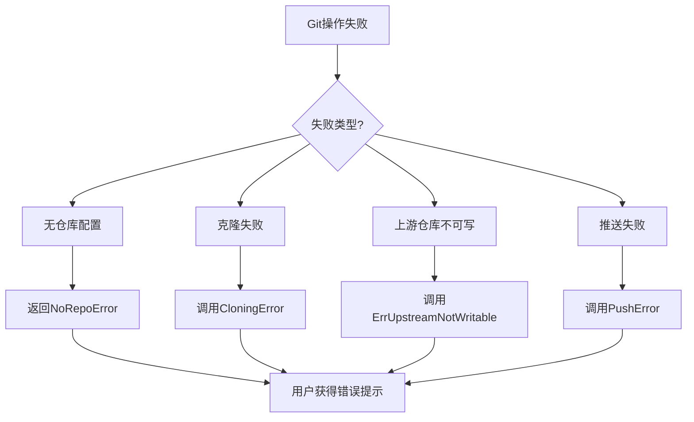
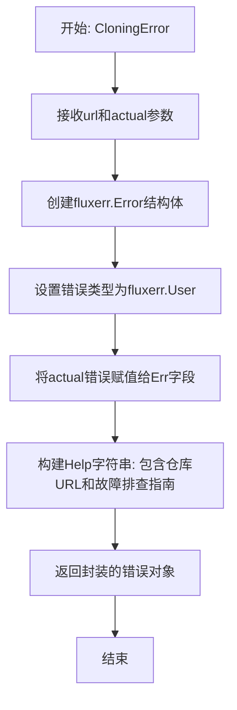
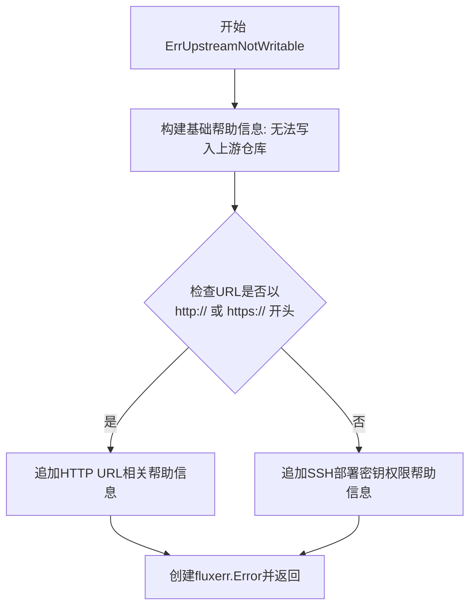
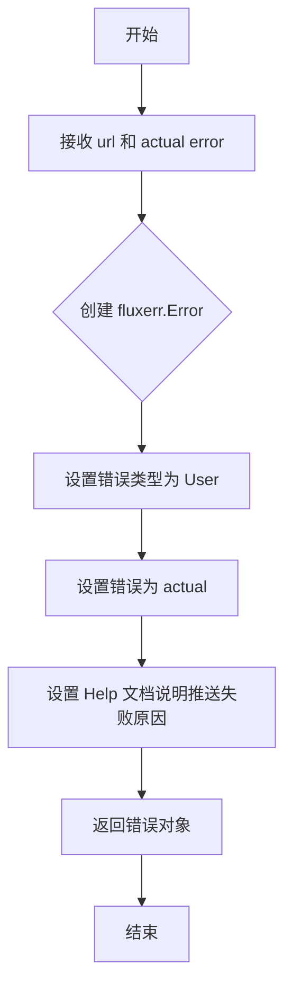

# `flux\pkg\git\errors.go` 详细设计文档

该文件是 Flux CD 项目中的 git 错误处理包，提供了用于生成用户友好的错误消息的函数，涵盖 Git 仓库配置缺失、克隆失败、上游仓库不可写入、提交推送失败等常见场景，帮助用户在 Git 操作失败时获得清晰的错误提示和解决方案指引。

## 整体流程



## 类结构

```
git (package)
├── 全局变量
│   └── NoRepoError
└── 错误生成函数
    ├── CloningError
    ├── ErrUpstreamNotWritable
    └── PushError
```

## 全局变量及字段


### `NoRepoError`
    
用户配置中缺少Git仓库URL时返回的错误对象

类型：`*fluxerr.Error`
    


    

## 全局函数及方法


### `CloningError`

该函数是一个错误工厂函数，用于创建用户友好的Git仓库克隆失败错误信息。它接收一个Git仓库URL和原始错误，将其封装为结构化的用户错误，并提供详细的帮助文档，指导用户排查克隆失败的可能原因（如无效的部署密钥、仓库不存在等）。

参数：

- `url`：`string`，要克隆的Git仓库URL地址
- `actual`：`error`，实际发生的原始错误

返回值：`error`，返回一个封装后的用户级别错误（`*fluxerr.Error`类型）

#### 流程图



#### 带注释源码

```go
// CloningError 创建一个用户友好的Git仓库克隆错误
// 参数:
//   - url: 要克隆的Git仓库URL
//   - actual: 克隆操作期间发生的实际错误
//
// 返回值:
//   - error: 包含用户可读错误信息和帮助文本的结构化错误
func CloningError(url string, actual error) error {
    // 创建一个fluxerr.Error结构体，包含错误类型、原始错误和用户帮助信息
    return &fluxerr.Error{
        // 设置错误类型为用户错误(User)，表示这是终端用户需要处理的错误
        Type: fluxerr.User,
        
        // 保存原始的克隆错误，供调试和日志记录使用
        Err: actual,
        
        // 构建详细的帮助信息，包含：
        // 1. 错误描述：无法克隆上游Git仓库
        // 2. 出错的仓库URL（动态插入）
        // 3. 可能的原因说明（无效部署密钥、仓库被删除/移动/不存在）
        // 4. 故障排查步骤（检查仓库存在性、验证部署密钥权限、使用fluxctl identity查看指纹）
        Help: `Could not clone the upstream git repository

There was a problem cloning your git repository,

    ` + url + `

This may be because you have not supplied a valid deploy key, or
because the repository has been moved, deleted, or never existed.

Please check that there is a repository at the address above, and that
there is a deploy key with write permissions to the repository. In
GitHub, you can do this via the settings for the repository, and
cross-check with the fingerprint given by

    fluxctl identity

`,
    }
}
```


### `ErrUpstreamNotWritable`

该函数用于生成一个用户友好的错误信息，当Flux守护进程无法写入上游Git仓库时调用。它会根据URL的类型（HTTP/HTTPS或SSH）提供针对性的帮助文本，指导用户解决写权限问题。

**参数：**

- `url`：`string`，Git仓库的URL地址
- `actual`：`error`，实际发生的原始错误

**返回值：** `error`，返回包装后的`fluxerr.Error`错误对象，包含用户可读的帮助信息

#### 流程图



#### 带注释源码

```go
// ErrUpstreamNotWritable 创建一个错误,当无法写入上游仓库时使用
// 参数:
//   - url: Git仓库的URL地址
//   - actual: 实际发生的原始错误
//
// 返回值:
//   - error: 包含用户友好帮助信息的fluxerr.Error对象
func ErrUpstreamNotWritable(url string, actual error) error {
	// 基础帮助信息,说明Flux守护进程需要写入权限
	help := `Could not write to upstream repository

To keep track of synchronisation, the Flux daemon must be able to
write to the upstream git repository.
`
	// 检查URL协议类型,以提供针对性的故障排除建议
	if strings.HasPrefix(url, "http://") ||
		strings.HasPrefix(url, "https://") {
		// HTTP/HTTPS URL需要用户交互式提供凭据,通常不适用于Flux
		// 建议使用SSH URL
		help = help + `
Usually, git URLs starting with "http://" or "https://" will not work
well with flux, because they require the user to supply credentials
interactively. If possible, use an SSH URL (starting with "ssh://", or
of the form "user@host:path/to/repo").
`
	} else {
		// SSH URL情况:可能是部署密钥权限问题
		// 提供检查和重新生成密钥的指导
		help = help + `
This failure may be due to the SSH (deploy) key used by the daemon not
having write permission. You can see the key used, with

    fluxctl identity

In GitHub, please check via the repository settings that the deploy
key is "Read/write". You can cross-check the fingerprint with that
given by

    fluxctl identity --fingerprint

If the key is present but read-only, you will need to delete it and
create a new deploy key. To create a new one, use

    fluxctl identity --regenerate
`
	}

	// 返回带有完整帮助信息的用户级别错误
	return &fluxerr.Error{
		Type: fluxerr.User, // 标记为用户错误,非系统错误
		Err:  actual,       // 保留原始错误用于调试
		Help: help,         // 提供用户可理解的帮助文本
	}
}
```


### `PushError`

该函数用于创建一个包含用户友好提示信息的错误对象，当向 Git 仓库推送（push）更改失败时调用，帮助用户诊断权限或推送冲突等问题。

参数：

- `url`：`string`，目标 Git 仓库的 URL 地址
- `actual`：`error`，导致推送失败的实际错误

返回值：`error`，返回封装后的用户错误信息

#### 流程图



#### 带注释源码

```go
// PushError 创建一个用于处理推送到 Git 仓库失败的用户友好错误
// 参数:
//   - url: 目标 Git 仓库的 URL 地址
//   - actual: 导致推送失败的实际错误
//
// 返回值:
//   - error: 封装后的错误对象，包含详细帮助信息
func PushError(url string, actual error) error {
    // 创建一个 fluxerr.Error 错误对象
    // Type: fluxerr.User 表示这是用户操作导致的错误
    // Err: actual 包含原始错误信息
    // Help: 提供详细的故障排查指南
    return &fluxerr.Error{
        Type: fluxerr.User,  // 设置错误类型为用户错误
        Err:   actual,       // 保存原始错误用于日志记录
        Help: `Problem committing and pushing to git repository.

There was a problem with committing changes and pushing to the git
repository.

If this has worked before, it most likely means a fast-forward push
was not possible. It is safe to try again.

If it has not worked before, this probably means that the repository
exists but the SSH (deploy) key provided doesn't have write
permission.

In GitHub, please check via the repository settings that the deploy
key is "Read/write". You can cross-check the fingerprint with that
given by

    fluxctl identity

If the key is present but read-only, you will need to delete it and
create a new deploy key. To create a new one, use

    fluxctl identity --regenerate

The public key this outputs can then be given to GitHub; make sure you
check the box to allow write access unless you're using the
--git-readonly=true option.

`, // 提供详细的故障排查帮助信息
    }
}
```

## 关键组件


### 核心功能概述

该代码是Flux CD项目中Git操作相关的错误处理模块，定义了Git仓库配置、克隆、上游写入和推送等操作失败时的用户友好错误信息，帮助用户诊断和解决Git集成问题。

### 文件整体运行流程

该文件不包含可执行流程，是一个错误定义模块。当Git操作（克隆、推送等）失败时，其他包调用相应的错误创建函数，生成结构化的错误对象，包含错误类型、原始错误和用户友好的帮助文本。

### 全局变量详情

**NoRepoError**
- 类型：`*fluxerr.Error`
- 描述：当用户配置中未提供Git仓库URL时返回的错误

### 全局函数详情

**CloningError**
- 参数：`url string` (要克隆的仓库URL), `actual error` (原始错误)
- 参数类型：`string, error`
- 返回值类型：`error`
- 描述：创建克隆仓库失败时的错误，包含仓库URL和故障排查提示

**ErrUpstreamNotWritable**
- 参数：`url string` (仓库URL), `actual error` (原始错误)
- 参数类型：`string, error`
- 返回值类型：`error`
- 描述：创建上游仓库不可写时的错误，自动检测HTTP/HTTPS和SSH URL并提供相应建议

**PushError**
- 参数：`url string` (仓库URL), `actual error` (原始错误)
- 参数类型：`string, error`
- 返回值类型：`error`
- 描述：创建提交和推送操作失败时的错误，帮助用户排查部署密钥权限问题

### 关键组件信息

1. **fluxerr.Error类型** - Flux的错误类型，包含错误类型(Type)、原始错误(Err)和用户帮助文本(Help)

2. **错误消息模板** - 预定义的错误帮助文本，包含URL、fluxctl命令示例和故障排查步骤

3. **URL前缀检测** - `strings.HasPrefix`用于区分HTTP/HTTPS和SSH协议的Git URL，提供针对性的错误建议

### 潜在技术债务或优化空间

1. **硬编码的帮助文本** - 所有错误帮助文本都硬编码在函数中，可考虑外部化到配置文件或模板
2. **重复的错误类型** - 所有函数都返回相同类型(`*fluxerr.Error`)，可考虑使用更细粒度的错误类型
3. **缺少错误码** - 没有定义具体的错误码，不利于程序化错误处理
4. **Go 1.13错误包装** - 未使用`fmt.Errorf`或`errors.Wrap`进行错误链传递，丢失错误上下文

### 其它项目

**设计目标与约束**
- 目标：为Git操作失败提供用户友好的错误信息和故障排查指导
- 约束：必须使用fluxerr.Error类型以保持与项目其他部分的一致性

**错误处理与异常设计**
- 错误类型：User级别错误（fluxerr.User）
- 错误包含：原始错误 + 帮助文本 + 触发条件说明
- 帮助文本包含：具体URL、相关命令、故障排查步骤

**数据流与状态机**
- 错误创建是单向的：由调用方传入原始错误和上下文，生成结构化错误
- 不涉及状态管理

**外部依赖与接口契约**
- 依赖：`github.com/fluxcd/flux/pkg/errors` 包中的fluxerr.Error类型
- 依赖：`errors` 标准库
- 依赖：`strings` 标准库


## 问题及建议


### 已知问题

-   **硬编码的错误帮助文本**：所有错误消息都直接硬编码在代码中，缺乏国际化（i18n）支持，未来难以适配多语言场景。
-   **代码重复**：错误构造逻辑高度相似，每个函数都重复设置 `Type: fluxerr.User`、`Err: actual`、`Help: ...`，违反 DRY 原则。
-   **字符串拼接方式不优雅**：使用 `+` 运算符拼接多行字符串（如 `CloningError` 和 `ErrUpstreamNotWritable` 中的 URL 拼接），影响可读性。
-   **Magic Strings 重复**：协议前缀 `"http://"`、`"https://"`、`"ssh://"` 在代码中重复出现，未提取为常量。
-   **不一致的错误定义方式**：`NoRepoError` 是预定义的错误变量，而其他错误通过函数动态创建，风格不统一。
-   **缺少输入验证**：函数参数（如 URL）未进行有效性校验，可能导致后续处理异常。
-   **缺乏测试覆盖**：该文件未包含任何单元测试，错误处理逻辑的风险较高。

### 优化建议

-   **引入错误工厂模式**：抽取公共的错误创建逻辑为内部辅助函数，减少重复代码。
-   **提取常量**：将协议前缀、通用错误前缀等 magic strings 定义为包级常量，提高可维护性。
-   **使用模板或结构化数据**：将错误消息模板化或存储在配置/数据文件中，便于国际化支持和未来修改。
-   **添加参数校验**：在函数入口处对 URL 参数进行非空和格式验证，提前返回合理的错误信息。
-   **统一错误定义风格**：考虑将 `NoRepoError` 也改为函数形式，或将其他错误也定义为预定义变量（如果适用）。
-   **补充单元测试**：为每个错误构造函数编写测试用例，验证错误类型、消息内容和参数嵌入是否正确。
-   **使用 strings.Builder 或模板字符串**：对于复杂的多行字符串拼接，考虑使用 `strings.Builder` 或 Go 的原始字符串字面量提升可读性。


## 其它


### 设计目标与约束

该代码包旨在为Flux CD项目提供统一的Git操作错误处理机制，通过用户友好的错误信息帮助用户定位和解决Git相关问题。设计约束包括：依赖fluxerr包提供错误类型支持，仅处理Git仓库配置、克隆、推送等核心操作的错误场景，错误信息需提供可操作的解决建议。

### 错误处理与异常设计

该代码采用错误函数工厂模式，每个函数接收相关参数（如仓库URL、底层错误）并返回封装后的fluxerr.Error对象。错误类型统一为fluxerr.User，表示用户配置或操作导致的问题。错误Help字段包含多行说明文本，提供问题描述、可能原因及解决步骤。所有错误均保留底层actual error以支持错误链追踪。

### 外部依赖与接口契约

主要外部依赖为fluxerr包和Go标准库（errors、strings）。接口契约方面：CloningError函数接收url string和actual error，返回error接口；ErrUpstreamNotWritable函数接收url string和actual error，返回error接口；PushError函数接收url string和actual error，返回error接口；NoRepoError为预定义的错误指针常量。

### 错误码与错误分类

该包定义的错误属于用户配置错误类别，按操作阶段分类：NoRepoError对应配置阶段缺失仓库URL；CloningError对应初始化阶段克隆失败；ErrUpstreamNotWritable对应权限检查阶段无写权限；PushError对应同步阶段提交或推送失败。

### 国际化与本地化考虑

当前所有错误帮助信息均为英文，设计文档应建议将用户可见的Help文本抽取至独立的消息配置文件，以便后续支持多语言本地化。建议使用Go的golang.org/x/text/message包或类似的i18n框架。

### 安全敏感信息处理

错误消息中涉及仓库URL显示，潜在包含敏感路径信息。设计建议：对于HTTP/HTTPS协议的URL，应在错误日志中脱敏处理，仅显示域名部分，避免完整URL暴露在日志中。SSH URL通常不包含认证信息，但建议验证格式有效性。

### 可测试性设计

当前代码可通过单元测试验证：错误消息内容完整性、错误类型正确性、URL参数正确嵌入、错误链底层error保留。建议增加表驱动测试覆盖不同URL格式（http://、https://、ssh://、user@host:path）的错误消息差异。

### 配置与常量定义

Help文本中包含硬编码的参考链接（如fluxctl命令），建议将这些可配置信息抽取为常量或配置文件，便于版本更新时统一维护。

### 性能考量

该代码路径非高频调用，性能影响可忽略。但建议避免在错误处理路径中进行耗时操作（如网络请求、文件IO），当前实现符合此原则。

### 日志与监控集成

建议在调用这些错误函数的业务代码中添加结构化日志记录，记录仓库标识、操作类型、底层错误等字段，便于运维监控和问题排查。错误类型为User级别，可据此设计告警策略。


    