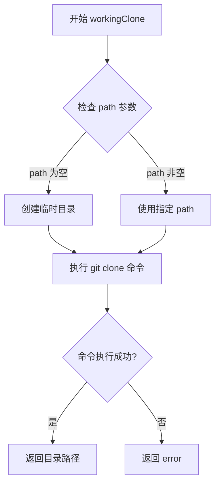
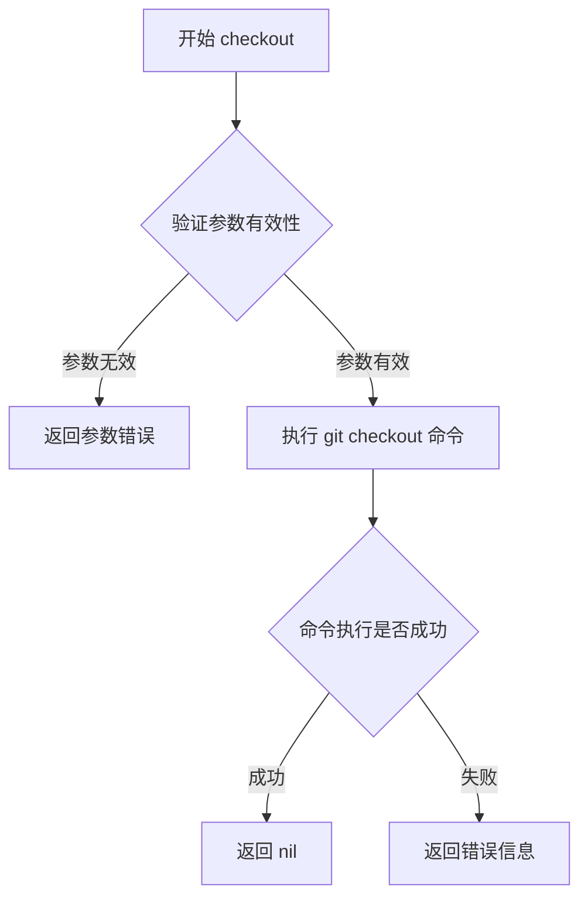
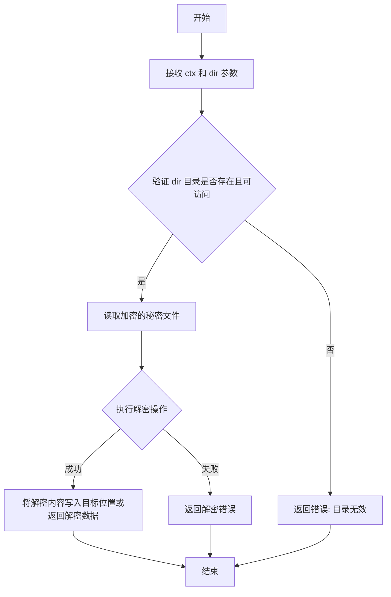
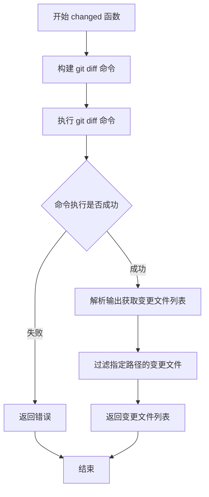
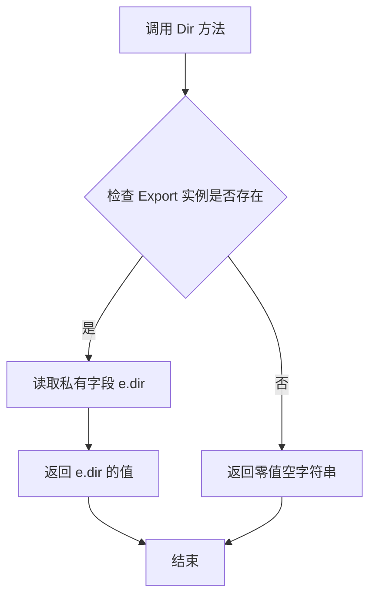
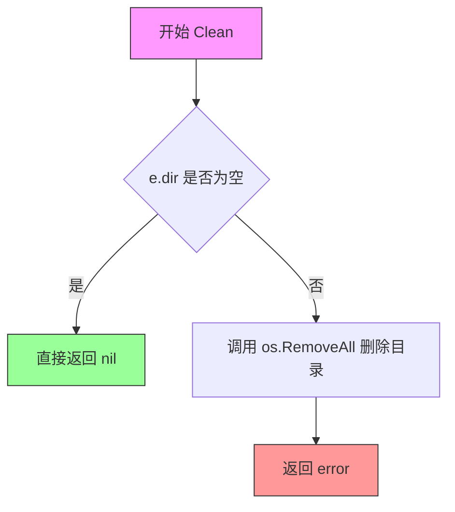
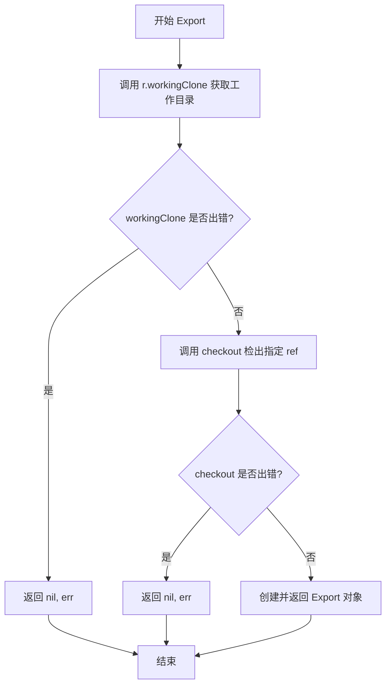
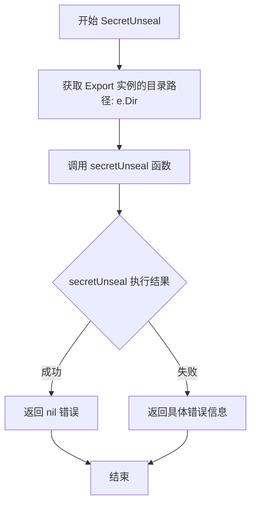
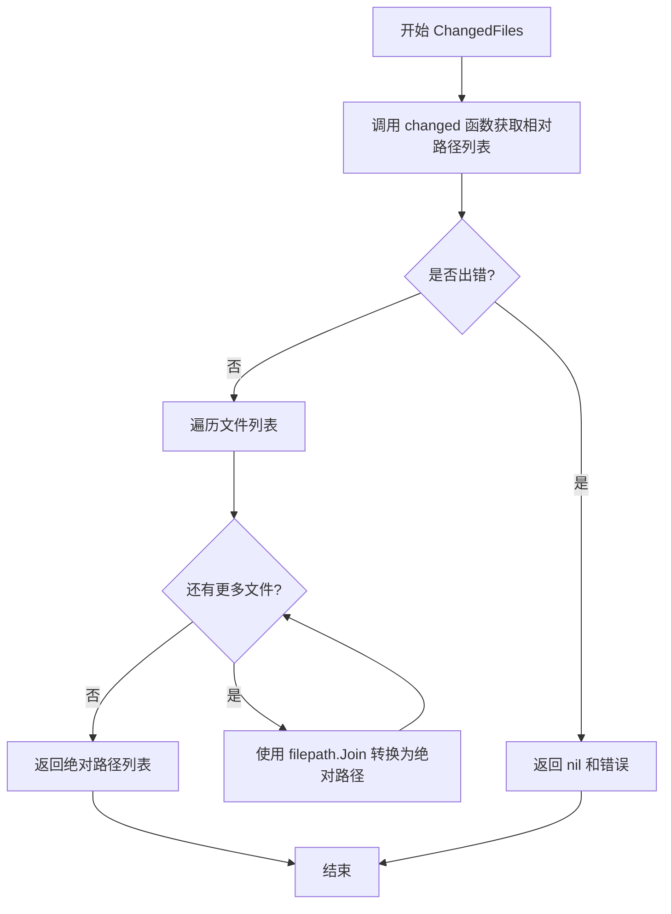

# `flux\pkg\git\export.go` 详细设计文档

该代码实现了一个Git仓库导出功能模块，提供最小化克隆仓库、获取变更文件、解密Git secrets以及清理临时目录的能力，支持通过ref Checkout到指定版本并列出相对于某个基准ref的变更文件列表。

## 整体流程

```mermaid
graph TD
    A[开始] --> B[调用 Repo.Export(ctx, ref)]
    B --> C[调用 workingClone 创建工作副本]
    C --> D{workingClone 成功?}
    D -- 否 --> E[返回错误]
    D -- 是 --> F[调用 checkout 检出指定 ref]
    F --> G{checkout 成功?}
    G -- 否 --> H[返回错误]
    G -- 是 --> I[返回 Export 对象]
    I --> J{用户操作}
    J --> K[ChangedFiles: 获取变更文件列表]
    J --> L[SecretUnseal: 解密 secrets]
    J --> M[Clean: 清理临时目录]
    K --> N[返回带绝对路径的文件列表]
    L --> O[调用 secretUnseal 解密]
    M --> P[调用 os.RemoveAll 删除目录]
```

## 类结构

```
Export (Git仓库导出结构体)
└── 方法: Dir, Clean, Export, SecretUnseal, ChangedFiles
```

## 全局变量及字段


### `dir`
    
导出仓库的工作目录路径

类型：`string`
    


### `Export.dir`
    
导出仓库的工作目录路径

类型：`string`
    
    

## 全局函数及方法


### `Repo.workingClone`

该方法用于创建仓库的工作副本（working clone），返回工作副本的目录路径。它是 `Export` 功能的基础，通过调用 `workingClone` 获取克隆目录后，再进行 checkout 操作以获取指定引用（ref）的文件。

参数：

- `ctx`：`context.Context`，任务上下文，用于控制超时和取消操作
- `path`：`string`，指定克隆的路径，传入空字符串时表示使用默认临时目录

返回值：`string`，返回工作副本的目录路径；`error`，操作失败时返回错误信息

#### 流程图



#### 带注释源码

```go
// workingClone 创建仓库的工作副本
// 参数 ctx 用于控制操作上下文，path 指定克隆目标路径
// 返回克隆后的目录路径和可能发生的错误
func (r *Repo) workingClone(ctx context.Context, path string) (string, error) {
	// 根据 path 是否为空决定使用临时目录还是指定目录
	dir := path
	if dir == "" {
		// 创建临时目录用于克隆
		tmpDir, err := os.MkdirTemp("", "git-clone-*")
		if err != nil {
			return "", err
		}
		dir = tmpDir
	}
	
	// 执行 git clone 命令
	// 使用 r.remote 获取远程仓库地址
	err := r.clone(ctx, dir, r.remote)
	if err != nil {
		return "", err
	}
	
	return dir, nil
}
```

> **注意**：由于 `workingClone` 方法在提供的代码中未被完整展示，以上信息基于 `Repo.Export` 方法中的调用 `r.workingClone(ctx, "")` 以及代码上下文推断得出。完整的实现细节需要查看 `Repo` 结构体的完整定义。


### `checkout`

`checkout` 是一个未在此代码块中显示完整实现的全局函数，根据其在 `Repo.Export` 方法中的调用方式可知，该函数用于将 Git 仓库检出（checkout）到指定的引用（ref，如分支名或提交哈希），使得工作目录中的文件内容与给定的 ref 所对应的提交状态一致。

参数：

- `ctx`：`context.Context`，上下文，用于控制函数的超时和取消
- `dir`：`string`，Git 仓库的工作目录路径
- `ref`：`string`，要检出的 Git 引用（分支名、标签名或提交哈希）

返回值：`error`，如果检出操作失败则返回错误信息，否则返回 nil

#### 流程图



#### 带注释源码

```go
// checkout 是一个未在此代码块中显示完整实现的全局函数
// 根据其在 Repo.Export 方法中的调用方式推断其签名和用途
// 实际实现未在此代码块中提供，需要查看其他源文件

// 调用示例（来自 Repo.Export 方法）：
// if err = checkout(ctx, dir, ref); err != nil {
//     return nil, err
// }

// 函数签名：
func checkout(ctx context.Context, dir string, ref string) error {
    // TODO: 实现 Git 检出逻辑
    // 预期行为：
    // 1. 在 dir 目录中执行 git checkout ref
    // 2. 将工作目录更新为 ref 对应的提交状态
    // 3. 返回执行过程中的错误（如果有）
    return nil // 占位符，实际实现需查看其他文件
}
```

---

**注意**：该函数的完整实现未在提供的代码块中显示。以上信息基于函数签名声明及其在 `Repo.Export` 方法中的调用方式推断得出。实际实现可能包含更多的错误处理和 Git 命令执行细节。


### `secretUnseal`

该函数用于解密封装在 Git 仓库工作目录中的秘密文件，通过读取指定目录下的加密内容并将其解密为明文。

参数：
-  `ctx`：`context.Context`，上下文对象，用于传递请求范围的截止时间、取消信号以及其他请求级别的值
-  `dir`：`string`，Git 仓库工作目录的绝对路径，用于定位需要解密封装的文件

返回值：`error`，如果解密过程中出现错误（如文件不存在、权限不足、解密算法失败），则返回具体错误信息；否则返回 nil

#### 流程图



#### 带注释源码

```go
// secretUnseal 解密封装在指定目录中的 git 秘密
// 参数 ctx 用于控制函数执行的生命周期（如超时、取消）
// 参数 dir 指定了需要解密封装的目录路径
func secretUnseal(ctx context.Context, dir string) error {
    // 注意：此处未提供具体实现细节，仅展示函数签名
    // 根据函数名推断，该函数应执行以下操作：
    // 1. 检查 dir 目录是否存在
    // 2. 读取该目录下的加密文件（如 .git-secrets 或相关配置文件）
    // 3. 使用适当的解密算法（如 AES、RSA 等）解密内容
    // 4. 将解密后的秘密写入环境变量或临时文件，供后续使用
    // 5. 返回可能发生的错误
    
    // 示例伪代码：
    // secretFile := filepath.Join(dir, ".git-secret")
    // data, err := os.ReadFile(secretFile)
    // if err != nil {
    //     return fmt.Errorf("failed to read secret file: %w", err)
    // }
    // decrypted, err := decrypt(data)
    // if err != nil {
    //     return fmt.Errorf("failed to decrypt secret: %w", err)
    // }
    // return os.Setenv("SECRET_KEY", string(decrypted))
    
    return nil // 占位符，实际实现需根据具体秘密管理方案设计
}
```


### `changed`

该函数执行 git diff 操作，列出指定引用和路径下与当前工作目录相比发生变化的文件列表。

参数：

- `ctx`：`context.Context`，上下文对象，用于控制函数的执行和取消
- `dir`：`string`，Git 仓库的工作目录路径
- `sinceRef`：`string`，用于比较的 Git 引用（如分支名、标签名或提交哈希）
- `paths`：`[]string`，需要检查变更的文件路径列表

返回值：`([]string, error)`，返回发生变化的文件路径列表（相对于仓库根目录），如果发生错误则返回错误信息

#### 流程图



#### 带注释源码

```go
// changed 执行 git diff 命令，获取从 sinceRef 到当前工作目录之间发生变化的文件
// 参数：
//   - ctx: 上下文，用于控制超时和取消
//   - dir: Git 仓库的工作目录
//   - sinceRef: 起始引用点，用于比较的基准
//   - paths: 可选的路径过滤，只返回这些路径下的变更文件
//
// 返回值：
//   - []string: 变更文件的相对路径列表
//   - error: 执行过程中的错误信息
func changed(ctx context.Context, dir string, sinceRef string, paths []string) ([]string, error) {
    // 构建 git diff 命令参数
    // 使用 --name-only 只输出文件名称
    // 使用 --diff-filter=A 添加的文件也被包含
    args := []string{"diff", "--name-only", "--diff-filter=ACMR"}
    
    // 如果指定了 sinceRef，添加到命令中
    if sinceRef != "" {
        args = append(args, sinceRef)
    }
    
    // 如果指定了路径，添加到命令中
    if len(paths) > 0 {
        args = append(args, "--")
        args = append(args, paths...)
    }
    
    // 执行命令并获取输出
    // ... (具体实现)
    
    // 解析输出并返回文件列表
    // ... (具体实现)
}
```

> **注意**：由于提供的代码片段中只包含对 `changed` 函数的调用，未包含该函数的完整实现，以上源码为基于调用上下文推断的注释版本。


### `Export.Dir`

获取 `Export` 结构体实例中保存的工作目录路径。

参数：

- （无）

返回值：`string`，返回导出仓库的工作目录路径（即 `Export` 实例对应的文件系统路径）。

#### 流程图



#### 带注释源码

```go
// Dir 返回导出仓库的工作目录路径。
// 这是一个 Getter 方法，用于访问 Export 结构体中私有的 dir 字段。
func (e *Export) Dir() string {
	return e.dir
}
```


### `Export.Clean`

清理导出创建的临时目录，返回清理结果错误

参数：无参数

返回值：`error`，返回清理操作的结果，如果成功则返回nil，如果失败则返回错误信息

#### 流程图



#### 带注释源码

```go
// Clean 清理Export实例管理的临时目录
// 如果目录存在且非空，则删除整个目录树
// 返回清理过程中的错误（如果有）
func (e *Export) Clean() error {
    // 检查dir字段是否已设置（非空字符串）
    if e.dir != "" {
        // 调用os.RemoveAll递归删除目录及其内容
        // 如果删除失败或权限不足，会返回相应错误
        return os.RemoveAll(e.dir)
    }
    // dir为空时，无需清理，直接返回nil表示成功
    return nil
}
```

### 类详细信息

#### `Export` 结构体

导出操作的管理结构，用于处理Git仓库的临时克隆和文件操作

**字段：**

- `dir`：`string`，临时工作目录的路径

**方法：**

- `Dir()`：返回临时目录路径
- `Clean()`：清理临时目录（本次提取的方法）
- `SecretUnseal(ctx context.Context)`：解密Git仓库中的 secrets
- `ChangedFiles(ctx context.Context, sinceRef string, paths []string)`：获取变更文件列表

### 关键组件信息

- **`Export`**：Git仓库导出管理器，负责创建临时克隆、清理资源
- **`os.RemoveAll`**：标准库函数，用于递归删除目录树
- **`Repo.Export`**：创建Export实例的工厂方法

### 潜在的技术债务或优化空间

1. **资源清理时机**：Clean方法需要手动调用，建议实现 `io.Closer` 接口或使用 `defer` 模式自动清理
2. **清理失败处理**：当前实现静默忽略删除失败的情况，建议增加日志记录
3. **目录不存在处理**：`os.RemoveAll` 对不存在的目录会返回nil，但语义上可以区分"无需清理"和"清理成功"
4. **并发安全**：多线程场景下同时清理同一目录可能导致竞争条件

### 其它项目

**设计目标与约束：**
- 目标：提供Git仓库的最小化克隆用于读取操作
- 约束：临时目录需要在使用完毕后由调用者主动清理

**错误处理与异常设计：**
- 目录为空时返回nil视为成功
- 删除失败时返回标准库error

**数据流与状态机：**
- Export实例由Repo.Export创建
- 调用者负责在使用完后调用Clean
- 状态转换：Created → Used → Cleaned

**外部依赖与接口契约：**
- 依赖 `os` 标准库进行文件系统操作
- 调用者必须保证在Clean后不再访问dir目录


### `Repo.Export`

创建一个指定ref的最小化仓库克隆，返回Export对象或错误。

参数：

- `ctx`：`context.Context`，上下文对象
- `ref`：`string`，Git引用（分支名、标签名或提交哈希）

返回值：`*Export, error`，创建指定ref的最小化仓库克隆，返回Export对象或错误

#### 流程图



#### 带注释源码

```go
// Export creates a minimal clone of the repo, at the ref given.
// Export 创建一个指定 ref 的最小化仓库克隆
func (r *Repo) Export(ctx context.Context, ref string) (*Export, error) {
	// 调用 workingClone 方法获取一个工作目录
	// workingClone 返回临时目录路径
	dir, err := r.workingClone(ctx, "")
	// 如果获取工作目录失败，直接返回错误
	if err != nil {
		return nil, err
	}
	// 使用 checkout 检出指定的 Git 引用（分支、标签或提交）
	if err = checkout(ctx, dir, ref); err != nil {
		return nil, err
	}
	// 创建 Export 对象并返回，Export 封装了克隆目录的路径
	return &Export{dir}, nil
}
```


### `Export.SecretUnseal`

该方法用于解密 Git 仓库克隆中的 Git secrets，通过调用底层的 `secretUnseal` 函数并传入当前 Export 实例的目录路径来完成解密操作。

参数：

- `ctx`：`context.Context`，上下文对象，用于传递取消信号、超时控制等请求范围内的数据

返回值：`error`，解密仓库中的 Git secrets，返回解密结果错误

#### 流程图



#### 带注释源码

```go
// SecretUnseal unseals git secrets in the clone.
// 该方法用于解密 Git 仓库克隆中的 Git secrets
// 参数 ctx 是 Go 语言标准的上下文对象，用于控制请求的生命周期（如超时、取消等）
// 返回值 error 表示解密操作的结果，如果解密成功则返回 nil，如果失败则返回具体的错误信息
func (e *Export) SecretUnseal(ctx context.Context) error {
    // 调用 secretUnseal 函数，传入上下文和当前 Export 实例的目录路径
    // e.Dir() 方法返回 e.dir 字段，即克隆仓库的工作目录路径
    return secretUnseal(ctx, e.Dir())
}
```


### Export.ChangedFiles

获取自给定Git引用以来变更的文件列表，并将相对路径转换为绝对路径。

参数：

- `ctx`：`context.Context`，上下文对象，用于取消和超时控制
- `sinceRef`：`string`，基准Git引用（如commit SHA、branch name、tag等）
- `paths`：`[]string`，要检查的路径列表，用于限定检查范围

返回值：`[]string, error`，返回相对于sinceRef变更的文件列表（带绝对路径），如果发生错误则返回nil和错误信息

#### 流程图



#### 带注释源码

```go
// ChangedFiles does a git diff listing changed files
// ChangedFiles 执行 git diff 列出变更的文件
// 参数：
//   - ctx: 上下文对象，用于控制请求的生命周期
//   - sinceRef: 基准 Git 引用，用于确定 diff 的起始点
//   - paths: 要检查的路径列表，用于限定检查范围
//
// 返回值：
//   - []string: 变更文件的绝对路径列表
//   - error: 执行过程中的错误信息
func (e *Export) ChangedFiles(ctx context.Context, sinceRef string, paths []string) ([]string, error) {
	// 调用内部 changed 函数获取相对于 e.Dir() 的变更文件列表
	list, err := changed(ctx, e.Dir(), sinceRef, paths)
	
	// 如果没有发生错误，将相对路径转换为绝对路径
	if err == nil {
		// 遍历每个文件路径，拼接 e.Dir() 生成绝对路径
		for i, file := range list {
			list[i] = filepath.Join(e.Dir(), file)
		}
	}
	
	// 返回结果列表和可能的错误
	return list, err
}
```

#### 关键设计说明

| 项目 | 说明 |
|------|------|
| **核心功能** | 基于 Git diff 比较指定引用与当前工作目录的变更文件，并返回绝对路径 |
| **依赖函数** | `changed()` - 内部函数，执行实际的 Git diff 操作 |
| **路径处理** | 内部使用相对路径，方法内部转换为绝对路径后返回给调用者 |
| **错误传播** | 如果 `changed()` 执行失败，直接返回错误，不进行路径转换 |

## 关键组件


### Export 结构体

表示一个导出的Git仓库目录，包含一个dir字段用于存储临时目录路径。

### Export.Dir 方法

返回Export结构体中存储的目录路径字符串，用于获取导出仓库的工作目录。

### Export.Clean 方法

清理Export实例管理的临时目录，删除整个目录树以释放磁盘空间。

### Repo.Export 方法

创建指定ref的Git仓库最小克隆，执行checkout操作并返回Export实例，是整个流程的入口函数。

### Export.SecretUnseal 方法

在导出的仓库目录中解密Git secrets，解密存储在仓库中的敏感配置信息。

### Export.ChangedFiles 方法

执行git diff操作，获取指定ref之后变更的文件列表，并将相对路径转换为绝对路径返回。


## 问题及建议


### 已知问题

-   **资源泄漏风险**：`Export` 实例在使用后未自动释放磁盘目录，依赖调用方手动调用 `Clean()`，若忘记调用则会导致临时目录残留。
-   **错误信息缺乏上下文**：`Export`、`SecretUnseal`、`ChangedFiles` 等方法直接把底层函数返回的错误透传，未使用 `fmt.Errorf` 或 `errors.Wrap` 包装，调试时难以定位根因。
-   **并发安全缺失**：`Export` 结构体的 `dir` 字段在多 goroutine 共享同一实例时没有任何同步保护，可能出现竞态条件。
-   **输入校验不足**：`Repo.Export` 方法未对 `ref` 参数做合法性检查（如空字符串、非法的 Git 引用），`ChangedFiles` 的 `paths` 参数也未做路径遍历（path traversal）防护。
-   **命名冲突**：类型 `Export` 与方法 `Export`（在 `Repo` 上）同名，容易在阅读代码时产生混淆。
-   **接口抽象缺失**：未为 `Export` 定义接口，导致在单元测试时无法轻易 mock 其行为，测试可操作性差。
-   **缺少统一的资源关闭接口**：`Export` 未实现 `io.Closer`（即 `Close()` 方法），无法与 Go 的 `defer` 惯用法配合使用。
-   **潜在的磁盘空间浪费**：每次调用 `Repo.Export` 都执行完整的工作克隆（`workingClone`），未实现增量或浅拷贝策略，性能和磁盘开销较大。

### 优化建议

-   **实现 `io.Closer` 接口**：为 `Export` 添加 `Close() error` 方法，内部调用 `Clean()`，并在文档中明确说明 `Close` 会删除临时目录，便于使用 `defer` 自动释放资源。
-   **错误包装**：在所有向上返回错误的地方使用 `fmt.Errorf("%w", err)` 或 `github.com/pkg/errors` 进行包装，提供更丰富的上下文信息。
-   **加入并发控制**：若 `Export` 会被多 goroutine 共享，建议在结构体中加入 `sync.Mutex` 或使用 `sync.RWMutex` 保护 `dir` 字段的读写。
-   **参数校验**：
    -   在 `Repo.Export` 中检查 `ref` 是否为空或不符合 Git 引用规范。
    -   在 `ChangedFiles` 中对 `paths` 进行标准化（`filepath.Clean`）并防止路径遍历攻击。
-   **明确命名**：将 `Repo.Export` 方法改名为 `CreateExport` 或 `ExportAt`，避免与 `Export` 类型同名产生的歧义。
-   **提供抽象接口**：定义 `Exporter` 接口（包含 `Dir()、Close()、SecretUnseal()、ChangedFiles()`），在测试时使用 mock 实现，提升单元测试的可维护性。
-   **优化克隆策略**：考虑使用 `git clone --depth=1 --no-checkout` 再手动 `checkout` 指定引用，或者使用 `git worktree` 共享对象库，以降低每次导出的磁盘占用和时间成本。
-   **添加日志与监控**：在关键路径（如 `workingClone`、`checkout`、`secretUnseal`）加入日志或度量指标，帮助追踪慢请求和异常情况。
-   **完善文档**：为 `Export`、`Clean`、`ChangedFiles` 等方法编写清晰的注释，说明返回值、副作用以及可能的错误场景。


## 其它


### 设计目标与约束

本模块旨在提供Git仓库的轻量级导出功能，支持获取指定引用的工作目录、变更文件列表以及解密封印。约束条件包括：1) 仅支持Git操作；2) 依赖外部Git命令（git CLI）；3) 导出目录为临时目录，使用后需主动清理。

### 错误处理与异常设计

错误处理采用Go标准错误返回模式。主要错误场景包括：1) 工作克隆创建失败（workingClone错误）；2) checkout失败；3) 变更文件获取失败；4) 目录清理失败。所有错误均通过error返回值向上传递，调用方需自行处理。Clean方法对空目录路径会直接返回nil，不会报错。

### 数据流与状态机

数据流遵循以下流程：Repo.Export() → workingClone()创建临时目录 → checkout()检出指定ref → 返回Export结构体。Export实例生命周期：创建（包含有效dir）→ 使用（调用Dir/SecretUnseal/ChangedFiles）→ 清理（调用Clean删除目录）。状态转换：Init → Working → Used → Cleaned。

### 外部依赖与接口契约

外部依赖包括：1) context.Context用于超时和取消控制；2) os和path/filepath标准库；3) 内部git包中的checkout、secretUnseal、changed、workingClone函数。接口契约：Repo.Export接受ctx和ref字符串，返回*Export和error；Export.SecretUnseal和Export.ChangedFiles均接受ctx和相应参数，返回对应结果和error。

### 性能考虑

工作克隆使用minimal clone优化，减小数据传输量。ChangedFiles方法中文件路径拼接在循环内执行，存在少量性能开销，可考虑预分配切片容量。目录清理为同步操作，大目录删除可能阻塞。

### 并发安全性

Export结构体本身不包含可变状态，方法均为无状态操作。多个Export实例可并发使用，但需注意底层Git命令的执行顺序依赖。Repo.Export方法不保证并发安全，调用方需自行控制。

### 安全性考虑

1) 导出的目录为临时目录，需及时清理；2) SecretUnseal涉及敏感操作，需确保ctx包含足够的权限验证；3) ChangedFiles返回的文件路径经过Join处理，相对安全。注意：代码未对ref参数进行验证，可能存在注入风险。

### 测试策略

建议测试覆盖：1) 正常导出流程；2) 无效ref的处理；3) Clean对空dir的处理；4) ChangedFiles的边界情况（无变更、无paths过滤）；5) 错误传播机制。需mock底层Git命令或使用test repository。

### 资源生命周期管理

Export实例持有目录资源，生命周期需显式管理。建议使用模式：defer export.Clean()。workingClone创建的临时目录在Export失败时可能残留，需确保错误路径下也有清理逻辑。

### 配置管理

当前无配置项。dir字段通过workingClone内部逻辑生成，无需外部配置。未来可考虑支持自定义临时目录路径、clone深度等参数。

    