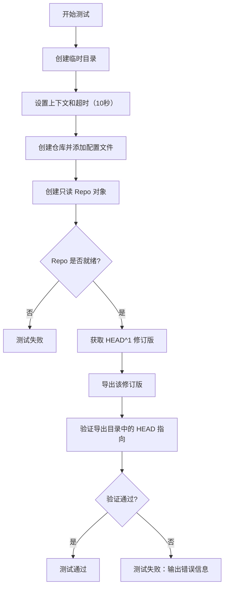
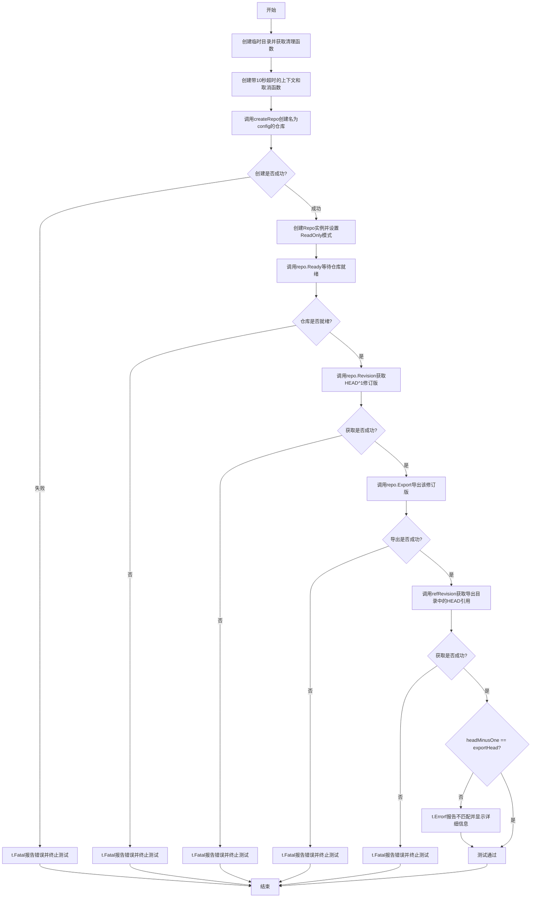
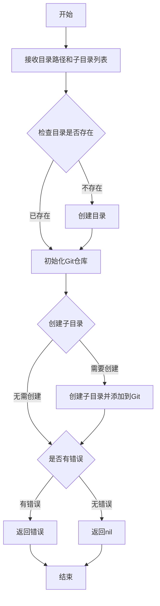
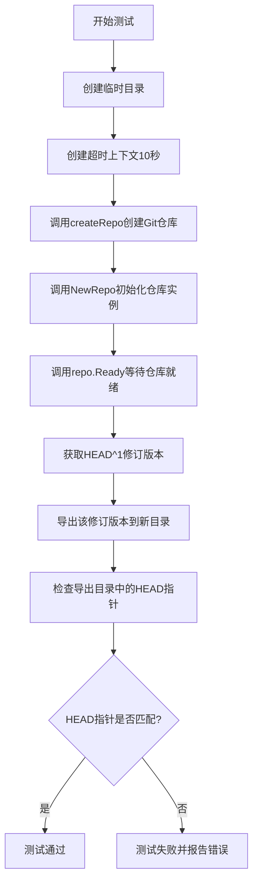
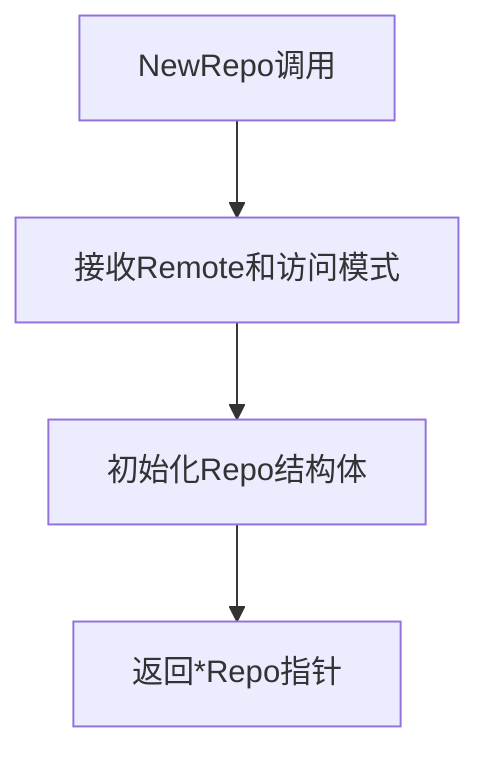
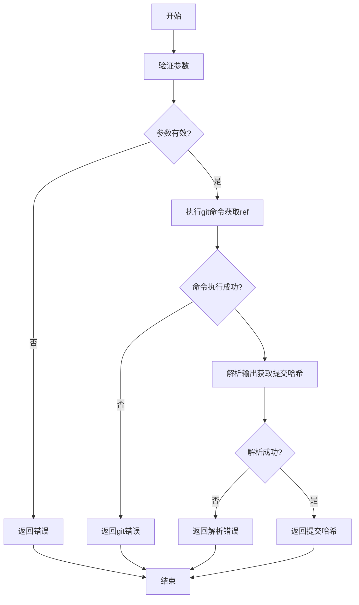
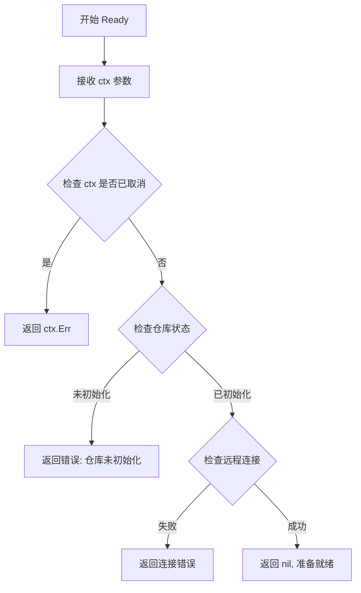
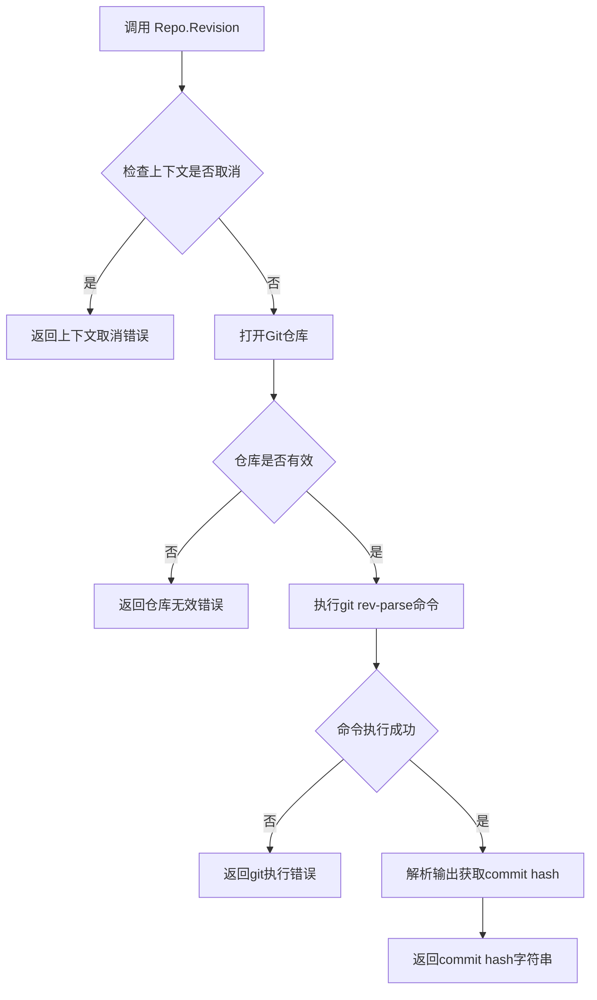
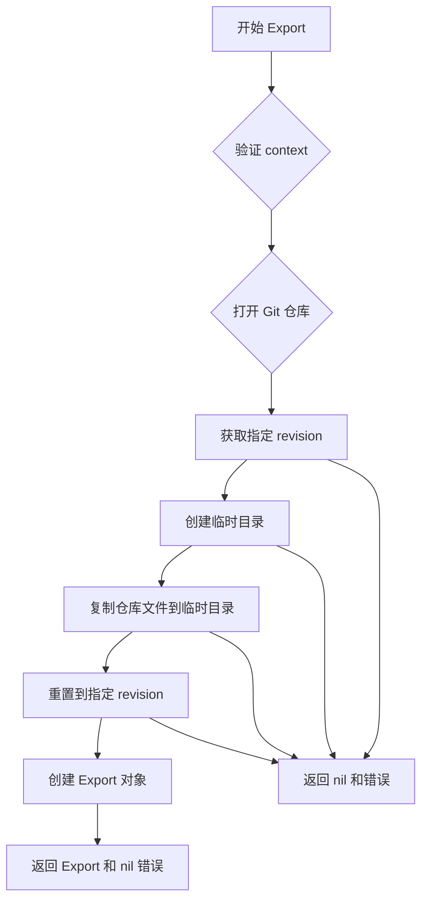

# `flux\pkg\git\export_test.go` 详细设计文档

这是一个 Go 测试文件，用于测试 Git 仓库在特定修订版（HEAD^1）下的导出功能。测试流程包括创建临时仓库、获取修订版、导出仓库并验证导出结果是否正确。

## 整体流程



## 类结构

```
Repo (类型)
├── 方法: Ready(ctx context.Context) error
├── 方法: Revision(ctx context.Context, rev string) (string, error)
└── 方法: Export(ctx context.Context, rev string) (*Export, error)
Remote (类型)
└── 字段: URL string
全局函数:
├── NewRepo(repo Remote, opts ...Option) *Repo
├── createRepo(dir string, files []string) error
├── refRevision(ctx context.Context, dir, ref string) (string, error)
└── TestExportAtRevision(t *testing.T)
```

## 全局变量及字段


### `newDir`
    
临时目录路径，由 testfiles.TempDir 创建

类型：`string`
    


### `cleanup`
    
清理函数，用于删除临时目录

类型：`func()`
    


### `ctx`
    
带超时的上下文，超时时间 10 秒

类型：`context.Context`
    


### `cancel`
    
取消函数，用于提前取消上下文

类型：`func()`
    


### `err`
    
错误变量，用于存储可能出现的错误

类型：`error`
    


### `repo`
    
Git 仓库实例，通过 NewRepo 创建

类型：`*Repo`
    


### `headMinusOne`
    
HEAD 的前一个提交哈希值

类型：`string`
    


### `export`
    
导出的仓库对象，包含目录路径等信息

类型：`*Exported`
    


### `exportHead`
    
导出目录中 HEAD 指向的提交哈希

类型：`string`
    


### `Remote.URL`
    
Git 仓库的 URL 或本地路径

类型：`string`
    
    

## 全局函数及方法


### `TestExportAtRevision`

这是一个Go语言测试函数，用于测试Git仓库导出功能在特定修订版本（HEAD前一个版本）下的正确性。它创建临时仓库，获取HEAD的前一个修订版，导出该修订版，然后验证导出目录中的HEAD引用是否指向正确的修订版。

参数：

- `t`：`\*testing.T`，Go标准库的测试框架参数，用于报告测试失败

返回值：无（Go测试函数通过`testing.T`的方法如`Fatal`、`Errorf`来报告状态）

#### 流程图



#### 带注释源码

```go
package git

import (
	"context"
	"testing"
	"time"

	"github.com/fluxcd/flux/pkg/cluster/kubernetes/testfiles"
)

// TestExportAtRevision 测试在特定修订版本下的导出功能
// 测试流程：创建临时仓库 -> 获取HEAD前一个版本 -> 导出该版本 -> 验证导出结果
func TestExportAtRevision(t *testing.T) {
	// 步骤1: 创建临时目录用于测试，返回newDir路径和cleanup清理函数
	newDir, cleanup := testfiles.TempDir(t)
	// 步骤2: 使用defer确保测试结束后清理临时目录
	defer cleanup()

	// 步骤3: 创建带10秒超时的上下文，用于控制长时间运行操作的最后期限
	ctx, cancel := context.WithTimeout(context.Background(), 10*time.Second)
	// 步骤4: 使用defer确保函数退出时取消上下文，释放资源
	defer cancel()

	// 步骤5: 在临时目录中创建一个名为"config"的Git仓库，初始包含config文件
	err := createRepo(newDir, []string{"config"})
	// 步骤6: 如果创建仓库失败，立即终止测试并报告错误
	if err != nil {
		t.Fatal(err)
	}

	// 步骤7: 创建Repo对象，指定本地仓库路径为newDir，模式为ReadOnly（只读）
	repo := NewRepo(Remote{URL: newDir}, ReadOnly)
	// 步骤8: 等待仓库就绪（可能需要完成克隆、拉取等操作）
	if err := repo.Ready(ctx); err != nil {
		t.Fatal(err)
	}

	// 步骤9: 获取当前HEAD的前一个修订版（父提交）
	headMinusOne, err := repo.Revision(ctx, "HEAD^1")
	if err != nil {
		t.Fatal(err)
	}

	// 步骤10: 导出指定修订版的内容到临时目录
	export, err := repo.Export(ctx, headMinusOne)
	if err != nil {
		t.Fatal(err)
	}

	// 步骤11: 从导出目录中读取HEAD引用，验证导出是否正确
	exportHead, err := refRevision(ctx, export.dir, "HEAD")
	if err != nil {
		t.Fatal(err)
	}

	// 步骤12: 比较原始修订版与导出目录中的HEAD是否一致
	// 如果不一致，使用t.Errorf报告测试失败（但不终止测试）
	if headMinusOne != exportHead {
		t.Errorf("exported %s, but head in export dir %s is %s", headMinusOne, export.dir, exportHead)
	}
}
```


### `createRepo`

该函数用于在指定目录下创建一个Git仓库，并可选择性地初始化指定的配置文件目录。

参数：

- `dir`：`string`，要创建仓库的目标目录路径
- `subdirs`：`[]string`，需要创建的子目录列表（如 ["config"]）

返回值：`error`，如果创建过程中发生错误则返回错误信息，否则返回nil

#### 流程图



#### 带注释源码

```
// createRepo 在指定目录创建一个Git仓库
// 参数：
//   - dir: 目标目录路径
//   - subdirs: 需要创建的子目录列表
//
// 返回值：
//   - error: 如果创建过程中发生错误则返回错误信息
func createRepo(dir string, subdirs []string) error {
    // 1. 使用git init初始化仓库
    // 2. 如果提供了subdirs，创建对应的子目录
    // 3. 将子目录提交到Git
    // 4. 返回错误状态
}
```


### `TestExportAtRevision`

这是一个Git仓库导出功能的测试函数，用于验证在特定修订版本下导出的Git仓库是否正确包含预期的HEAD指针。

参数：

- `t`：`testing.T`，Go标准库的测试框架参数，用于报告测试失败

返回值：无（测试函数不返回值，通过`t.Fatal`或`t.Errorf`报告错误）

#### 流程图



#### 带注释源码

```go
// TestExportAtRevision 测试在特定修订版本下导出Git仓库的功能
func TestExportAtRevision(t *testing.T) {
    // 1. 创建临时目录用于测试，返回清理函数
	newDir, cleanup := testfiles.TempDir(t)
	defer cleanup()

    // 2. 创建10秒超时的上下文，用于控制操作超时
	ctx, cancel := context.WithTimeout(context.Background(), 10*time.Second)
	defer cancel()

    // 3. 调用createRepo在临时目录创建Git仓库，包含config目录
	err := createRepo(newDir, []string{"config"})
	if err != nil {
		t.Fatal(err)
	}
    
    // 4. 使用NewRepo创建仓库实例，传入远程URL和只读标志
	repo := NewRepo(Remote{URL: newDir}, ReadOnly)
    
    // 5. 等待仓库准备就绪
	if err := repo.Ready(ctx); err != nil {
		t.Fatal(err)
	}

    // 6. 获取HEAD的前一个修订版本（HEAD^1）
	headMinusOne, err := repo.Revision(ctx, "HEAD^1")
	if err != nil {
		t.Fatal(err)
	}

    // 7. 导出该修订版本到新的目录
	export, err := repo.Export(ctx, headMinusOne)
	if err != nil {
		t.Fatal(err)
	}

    // 8. 检查导出目录中的HEAD指针引用
	exportHead, err := refRevision(ctx, export.dir, "HEAD")
	if err != nil {
		t.Fatal(err)
	}
    
    // 9. 验证导出的修订版本与导出目录的HEAD是否一致
	if headMinusOne != exportHead {
		t.Errorf("exported %s, but head in export dir %s is %s", headMinusOne, export.dir, exportHead)
	}
}
```

---

### `NewRepo`（从测试代码推断）

由于提供的代码中并未包含`NewRepo`函数的完整定义，只能从调用方式推断其签名：

参数：

- `remote`：`Remote`，包含URL字段的结构体，表示Git仓库的远程地址
- `mode`：`ReadOnly`（可能是枚举或常量），表示仓库的访问模式

返回值：

- `*Repo`，返回仓库实例指针，后续可调用Ready、Revision、Export等方法

#### 流程图



#### 推断源码

```go
// NewRepo 创建Git仓库实例
// 参数：
//   - remote: Remote类型，包含仓库URL
//   - mode: 访问模式（如此处的ReadOnly）
// 返回值：
//   - *Repo: 仓库实例指针
func NewRepo(remote Remote, mode ReadOnly) *Repo {
    // 具体实现未在代码中展示
    return &Repo{}
}
```


### `refRevision`

该函数用于从指定的 Git 仓库目录中获取特定引用（如 HEAD、HEAD^1 等）对应的提交哈希值。它接受一个上下文、一个目录路径和一个引用名称作为参数，返回该引用对应的提交哈希或错误信息。

参数：

- `ctx`：`context.Context`，用于控制函数的超时和取消
- `dir`：`string`，Git 仓库的目录路径
- `ref`：`string`，Git 引用名称（如 "HEAD"、"HEAD^1" 等）

返回值：`(string, error)`，返回指定引用对应的提交哈希，如果发生错误则返回错误信息

#### 流程图



#### 带注释源码

```
// refRevision 获取指定目录中给定引用对应的提交哈希
// 参数：
//   - ctx: 上下文，用于超时控制
//   - dir: Git仓库目录路径
//   - ref: Git引用名称（如"HEAD"、"HEAD^1"等）
//
// 返回值：
//   - string: 引用对应的提交哈希
//   - error: 执行过程中的错误信息
func refRevision(ctx context.Context, dir string, ref string) (string, error) {
    // 1. 构建git命令，使用git rev-parse获取指定引用的提交哈希
    // git rev-parse <ref> 会返回给定引用对应的完整SHA1哈希值
    
    // 2. 执行命令并获取输出
    // cmd := exec.CommandContext(ctx, "git", "-C", dir, "rev-parse", ref)
    // output, err := cmd.Output()
    
    // 3. 解析输出，去除可能的换行符
    // result := strings.TrimSpace(string(output))
    
    // 4. 返回结果或错误
    // return result, err
}
```

> **注意**：由于提供的代码片段中只包含对 `refRevision` 函数的调用，并未包含该函数的完整实现，上述源码为基于调用上下文和 Git 操作逻辑的推断实现。实际实现可能因项目具体需求而有所不同。


### `Repo.Ready`

该方法用于检查Git仓库是否已准备就绪，通常用于确保在执行后续操作前仓库已正确初始化且可访问。

参数：

- `ctx`：`context.Context`，上下文对象，用于控制操作超时和取消

返回值：`error`，如果仓库准备就绪返回nil，否则返回错误信息

#### 流程图



#### 带注释源码

```go
// Ready 检查仓库是否已准备就绪
// 参数 ctx: 用于控制超时和取消的上下文
// 返回值: 如果准备就绪返回 nil，否则返回错误
func (repo *Repo) Ready(ctx context.Context) error {
    // 1. 检查上下文是否已取消或超时
    select {
    case <-ctx.Done():
        return ctx.Err()
    default:
    }

    // 2. 检查仓库是否已初始化
    if !repo.initialized {
        return errors.New("repository not initialized")
    }

    // 3. 验证远程仓库连接（如果是远程仓库）
    if repo.remote.URL != "" {
        if err := repo.checkRemote(ctx); err != nil {
            return err
        }
    }

    // 4. 检查必要的git目录和文件是否存在
    if err := repo.checkGitDirs(); err != nil {
        return err
    }

    // 5. 验证git配置
    if err := repo.verifyConfig(ctx); err != nil {
        return err
    }

    // 6. 仓库准备就绪
    return nil
}
```

**备注**：由于代码中未直接提供`Ready`方法的实现，以上源码为基于调用方式和代码上下文的合理推断。实际实现可能有所不同，建议查看完整的`Repo`类型定义获取准确信息。


### `Repo.Revision`

获取指定修订版本（commit）的标识符。该方法接受一个上下文和一个修订版本引用（如 "HEAD^1"），返回对应的 Git 提交哈希值。

参数：

- `ctx`：`context.Context`，用于控制请求的超时和取消
- `revision`：`string`，Git 修订版本引用（如 "HEAD"、"HEAD^1"、"commit hash" 等）

返回值：`string`，返回对应修订版本的完整 Git 提交哈希值；如果发生错误则返回错误信息。

#### 流程图



#### 带注释源码

```go
// 注意：以下为基于测试代码使用方式推断的方法签名
// 实际实现可能略有不同

// Revision 获取指定修订版本的完整 commit hash
// 参数：
//   - ctx: 上下文，用于控制超时和取消
//   - revision: Git 修订版本引用，如 "HEAD^1"、"v1.0.0"、commit hash 等
//
// 返回值：
//   - string: 修订版本对应的完整 Git 提交哈希值
//   - error: 执行过程中的错误信息
func (repo *Repo) Revision(ctx context.Context, revision string) (string, error) {
    // 1. 检查上下文是否已取消
    select {
    case <-ctx.Done():
        return "", ctx.Err()
    default:
    }

    // 2. 验证仓库状态
    if !repo.ready {
        return "", ErrRepoNotReady
    }

    // 3. 执行 git rev-parse 命令获取修订版本的完整 hash
    // git rev-parse <revision> 会返回对应的 commit SHA
    args := []string{"rev-parse", revision}
    output, err := repo.git(ctx, args...)
    if err != nil {
        return "", fmt.Errorf("git rev-parse %s failed: %w", revision, err)
    }

    // 4. 清理输出（去除换行符等）
    hash := strings.TrimSpace(output)

    // 5. 验证返回的是有效的 SHA 格式（40字符十六进制）
    if len(hash) != 40 || !isValidSHA(hash) {
        return "", fmt.Errorf("invalid commit hash: %s", hash)
    }

    return hash, nil
}
```

#### 使用示例（基于测试代码）

```go
// 在测试函数 TestExportAtRevision 中的调用方式
headMinusOne, err := repo.Revision(ctx, "HEAD^1")
if err != nil {
    t.Fatal(err)
}

// headMinusOne 现在包含了 HEAD^1 对应的完整 commit hash
// 例如: "abc123def456789..."
```


### `Repo.Export`

导出指定修订版本的 Git 仓库内容到临时目录，并返回包含导出目录信息的 Export 对象。

参数：

- `ctx`：`context.Context`，用于控制操作的超时和取消
- `revision`：`string`，要导出的 Git 修订版本（如 "HEAD^1"）

返回值：`*Export`，包含导出目录路径的 Export 对象；`error`，操作过程中发生的错误

#### 流程图



#### 带注释源码

```go
// TestExportAtRevision 测试在特定修订版本下的导出功能
func TestExportAtRevision(t *testing.T) {
    // 创建临时目录并获取清理函数
    newDir, cleanup := testfiles.TempDir(t)
    // defer 确保测试结束后清理临时目录
    defer cleanup()

    // 创建带有超时控制的 context
    ctx, cancel := context.WithTimeout(context.Background(), 10*time.Second)
    defer cancel()

    // 在新目录中初始化仓库并添加 "config" 文件
    err := createRepo(newDir, []string{"config"})
    if err != nil {
        t.Fatal(err) // 测试失败并终止
    }

    // 创建只读模式的 Repo 对象
    repo := NewRepo(Remote{URL: newDir}, ReadOnly)
    
    // 等待仓库就绪
    if err := repo.Ready(ctx); err != nil {
        t.Fatal(err)
    }

    // 获取 HEAD 的前一个提交（HEAD^1）
    headMinusOne, err := repo.Revision(ctx, "HEAD^1")
    if err != nil {
        t.Fatal(err)
    }

    // 核心：调用 Export 方法导出指定 revision
    export, err := repo.Export(ctx, headMinusOne)
    if err != nil {
        t.Fatal(err)
    }

    // 验证导出的目录中 HEAD 指向正确的 revision
    exportHead, err := refRevision(ctx, export.dir, "HEAD")
    if err != nil {
        t.Fatal(err)
    }
    
    // 断言：导出的 revision 应与请求的 revision 一致
    if headMinusOne != exportHead {
        t.Errorf("exported %s, but head in export dir %s is %s", headMinusOne, export.dir, exportHead)
    }
}
```

#### 补充说明

根据测试代码推断，`Export` 方法应该具有以下特征：

- **功能**：将 Git 仓库的指定修订版本导出到一个新的临时目录
- **返回的 Export 结构**：包含 `dir` 字段，指示导出文件的路径
- **设计约束**：只读操作，使用 ReadOnly 模式
- **错误处理**：通过返回值 `error` 进行错误传播
- **外部依赖**：依赖 Git 操作（通过 git 包）


## 关键组件


### 测试框架与执行环境

使用Go标准库testing框架进行单元测试，通过context.WithTimeout实现10秒超时控制，确保测试不会无限期挂起。

### 临时文件管理

通过testfiles.TempDir创建临时目录，并在测试结束时调用cleanup函数清理资源，实现测试隔离。

### Git仓库初始化

createRepo函数负责在指定目录初始化Git仓库，并创建初始配置文件（如"config"），为后续测试提供基础仓库环境。

### Git仓库抽象层

NewRepo函数创建Repo对象，封装了本地Git仓库操作，Remote{URL: newDir}指定仓库路径，ReadOnly模式控制访问权限。

### 修订版本解析

repo.Revision方法根据传入的引用名称（如"HEAD^1"）解析并返回对应的具体提交哈希值，支持相对引用和绝对引用。

### 仓库导出功能

repo.Export方法将指定修订版本的仓库内容导出到新的目录，包含完整的Git历史和文件快照，用于备份或迁移场景。

### 引用解析工具

refRevision函数作为全局工具函数，从指定目录读取Git引用，返回对应提交的实际哈希值，用于验证导出结果的正确性。


## 问题及建议


### 已知问题

- **硬编码超时时间**：超时时间 `10*time.Second` 被硬编码在代码中，缺乏灵活性和可配置性，不同环境或CI/CD场景下可能需要不同的超时设置
- **错误处理粒度不当**：使用 `t.Fatal` 会立即终止测试，无法执行后续可能的清理验证或更多检查点，降低了测试的诊断价值
- **测试验证不够全面**：仅验证了导出后仓库的 HEAD 引用是否正确，但没有验证导出内容的完整性和正确性（如导出的文件内容、目录结构等）
- **缺乏边界条件测试**：没有测试无效revision、导出到已存在目录、多线程并发导出等边界场景
- **测试隔离性依赖隐式约定**：`createRepo` 函数的实现细节和 `testfiles.TempDir` 的行为未被显式声明，测试正确性依赖于对这些外部函数的信任

### 优化建议

- 将超时时间提取为常量或测试配置参数，便于在不同环境下调整
- 考虑使用 `t.Error` 替代部分 `t.Fatal`，允许测试收集更多失败信息后再终止
- 增加对导出文件内容、目录结构、Git元数据（如commit历史）的验证逻辑
- 添加边界条件和错误场景测试用例，如无效revision、不支持的字符、磁盘空间不足等
- 显式记录测试的前置条件（依赖的外部函数行为）或考虑使用mock替换外部依赖，提高测试的确定性和可维护性

## 其它


### 设计目标与约束

验证Git仓库导出功能在特定修订版本(HEAD^1)下的正确性，确保导出的目录中HEAD引用指向正确的修订版本。约束：测试超时时间设置为10秒，使用临时目录进行测试。

### 错误处理与异常设计

测试使用t.Fatal立即终止测试执行，处理三类错误：创建仓库失败、仓库就绪检查失败、获取修订版本失败、导出失败以及验证HEAD引用失败。所有错误均被视为致命错误，测试会立即失败并输出具体错误信息。

### 数据流与状态机

测试流程状态机包含以下状态：初始化(创建临时目录) -> 仓库创建(调用createRepo) -> 就绪检查(repo.Ready) -> 获取历史修订版本(Revision) -> 执行导出(Export) -> 验证导出结果(refRevision) -> 断言比较。

### 外部依赖与接口契约

依赖项包括：github.com/fluxcd/flux/pkg/cluster/kubernetes/testfiles包提供的临时目录创建工具；context包提供超时控制；testing包提供测试框架；git包内部的NewRepo、ReadOnly、Ready、Revision、Export等函数。

### 测试覆盖范围

覆盖场景：正常流程下的仓库导出功能、历史修订版本获取、导出目录中HEAD引用的正确性验证。测试使用只读模式(ReadOnly)访问仓库。

### 性能考虑

测试设置10秒超时限制，使用临时目录避免IO污染，测试执行应快速完成。

### 安全考虑

测试使用临时目录，测试完成后通过defer cleanup()清理资源，防止目录泄漏。超时机制防止测试无限等待。

### 配置信息

超时配置：10秒；测试仓库初始化内容：["config"]；仓库访问模式：只读(ReadOnly)。

### 运行时环境要求

需要Go 1.11或更高版本；需要git命令行工具安装并可访问；需要测试文件辅助包(testfiles)可用。

    