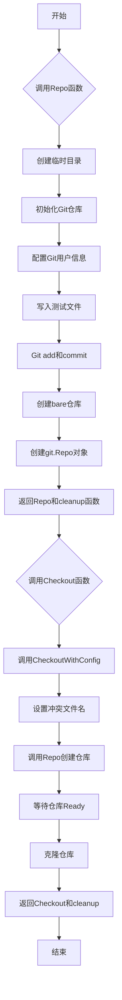
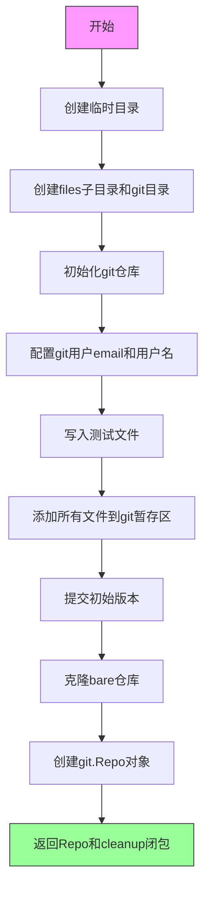
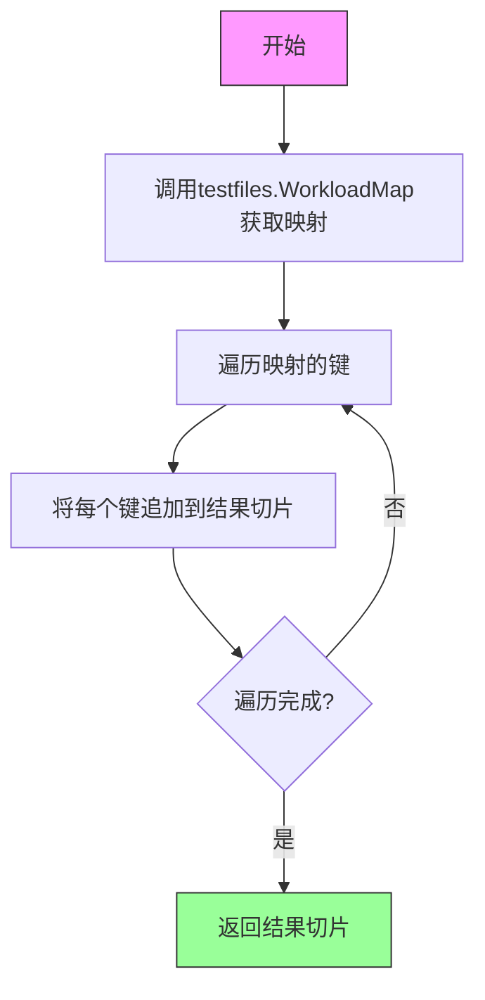
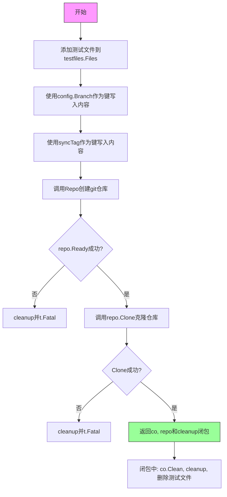
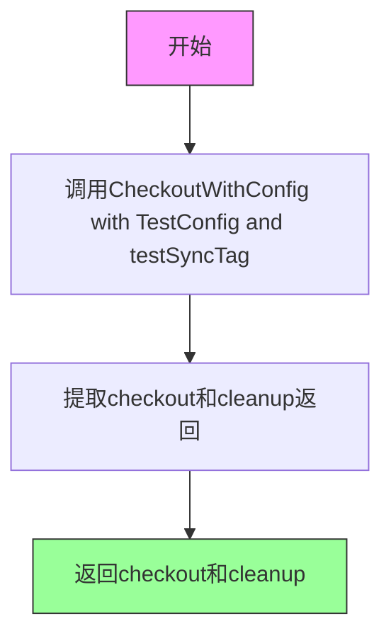
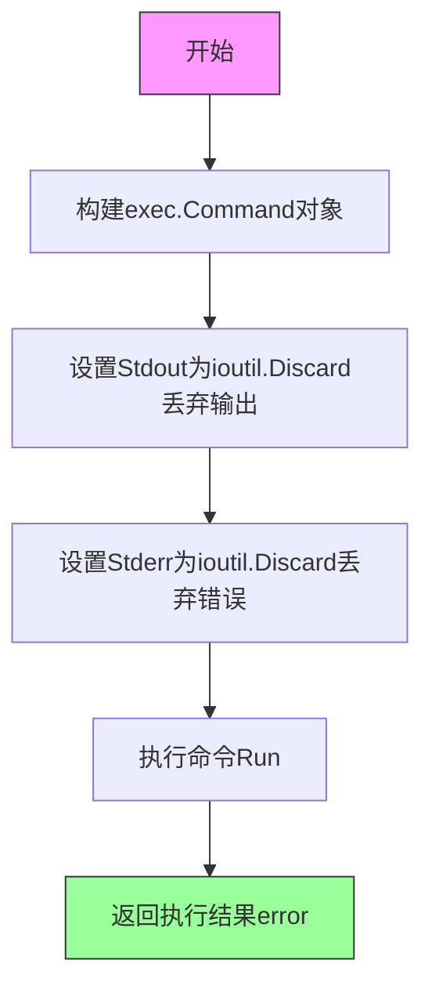
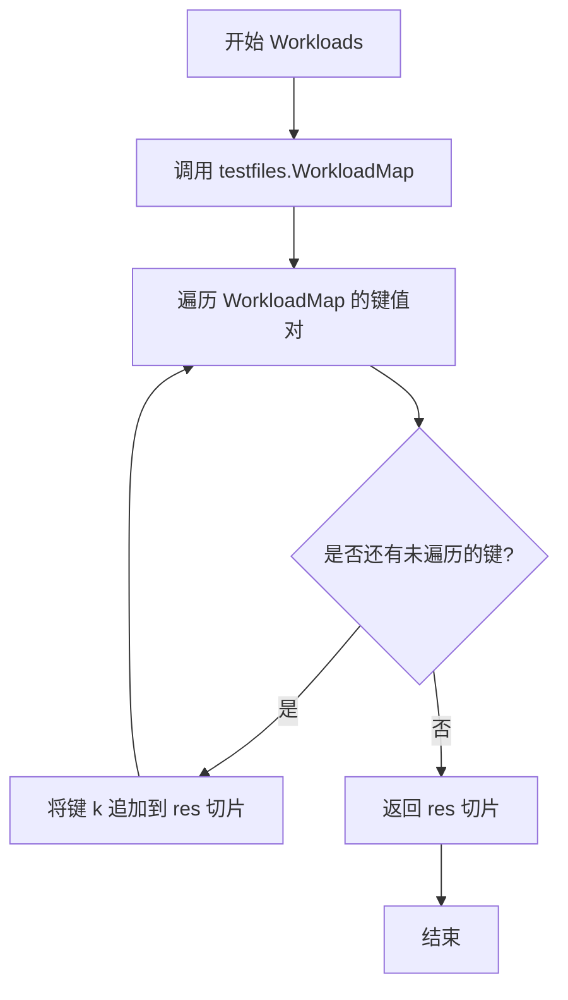
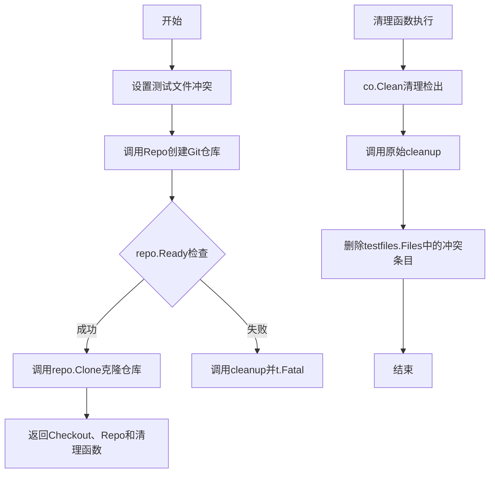
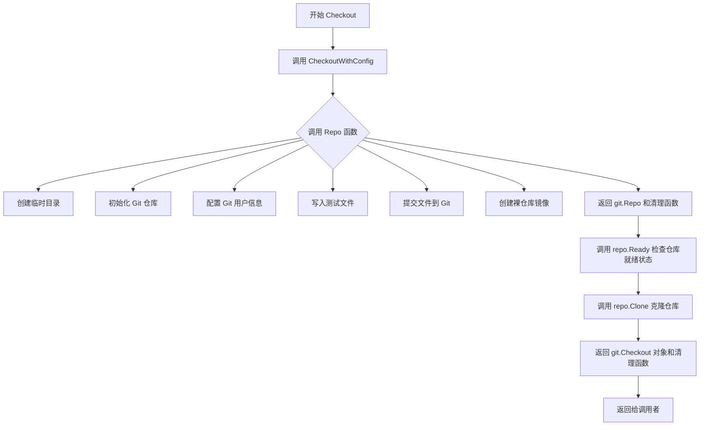
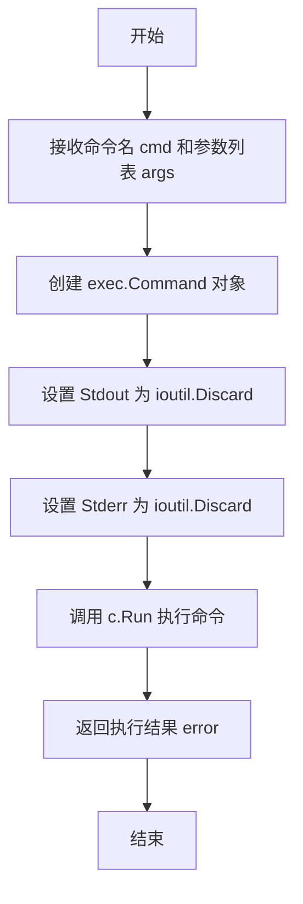

# `flux\pkg\git\gittest\repo.go` 详细设计文档

这是一个Git测试辅助包，用于在Go测试中创建和管理可克隆的Git仓库。它提供了创建预填充Kubernetes文件的Git仓库、克隆仓库、获取测试工作负载信息等功能，主要用于Flux项目内部的集成测试。

## 整体流程



## 类结构

```
gittest (包)
├── 全局变量
│   ├── TestConfig (git.Config)
│   └── testSyncTag (string)
├── 核心函数
│   ├── Repo (创建Git仓库)
│   ├── Workloads (获取工作负载)
│   ├── CheckoutWithConfig (带配置检出)
│   ├── Checkout (标准检出)
│   └── execCommand (执行命令)
```

## 全局变量及字段


### `TestConfig`
    
全局Git配置变量，用于测试环境，指定分支为master、用户名为example、用户邮箱为example@example.com、NotesRef为fluxtest

类型：`git.Config`
    


### `testSyncTag`
    
私有的字符串类型全局变量，用于存储Git同步标签，在测试中用于创建与Git分支名冲突的文件名

类型：`string`
    


    

## 全局函数及方法


### `gittest.Repo`

创建并返回一个预填充了Kubernetes文件和少量提交的Git仓库，同时返回清理函数用于测试后的清理工作。

#### 参数

- `t`：`*testing.T`，Go测试框架的测试对象，用于报告测试失败
- `files`：`map[string]string`，要写入仓库的文件映射，键为文件路径，值为文件内容

#### 返回值

- `*git.Repo`，可克隆的Git仓库对象
- `func()`，清理函数，用于删除临时目录和清理资源

#### 流程图



#### 带注释源码

```go
// Repo creates a new clone-able git repo, pre-populated with some kubernetes
// files and a few commits. Also returns a cleanup func to clean up after.
func Repo(t *testing.T, files map[string]string) (*git.Repo, func()) {
    // 1. 创建临时目录，获取清理函数
	newDir, cleanup := testfiles.TempDir(t)

    // 2. 构建文件目录和git目录的完整路径
	filesDir := filepath.Join(newDir, "files")
	gitDir := filepath.Join(newDir, "git")
    
    // 3. 创建目录结构
	if err := execCommand("mkdir", filesDir); err != nil {
		t.Fatal(err)
	}

	var err error
    // 4. 初始化git仓库
	if err = execCommand("git", "-C", filesDir, "init"); err != nil {
		cleanup()
		t.Fatal(err)
	}
    // 5. 配置git用户信息（本地仓库级别）
	if err = execCommand("git", "-C", filesDir, "config", "--local", "user.email", "example@example.com"); err != nil {
		cleanup()
		t.Fatal(err)
	}
	if err = execCommand("git", "-C", filesDir, "config", "--local", "user.name", "example"); err != nil {
		cleanup()
		t.Fatal(err)
	}

    // 6. 写入测试文件到文件系统
	if err = testfiles.WriteTestFiles(filesDir, files); err != nil {
		cleanup()
		t.Fatal(err)
	}
    // 7. 将所有文件添加到git暂存区
	if err = execCommand("git", "-C", filesDir, "add", "--all"); err != nil {
		cleanup()
		t.Fatal(err)
	}
    // 8. 创建初始提交
	if err = execCommand("git", "-C", filesDir, "commit", "-m", "'Initial revision'"); err != nil {
		cleanup()
		t.Fatal(err)
	}

    // 9. 创建bare仓库（用于克隆的裸仓库）
	if err = execCommand("git", "clone", "--bare", filesDir, gitDir); err != nil {
		t.Fatal(err)
	}

    // 10. 创建git.Repo对象，使用file协议访问bare仓库
	mirror := git.NewRepo(git.Remote{
		URL: "file://" + gitDir,
	}, git.Branch("master"))
    
    // 11. 返回Repo对象和组合清理函数
	return mirror, func() {
		mirror.Clean()
		cleanup()
	}
}
```

---

### `gittest.Workloads`

获取测试文件中表示的工作负载名称列表（仅工作负载，不包含所有资源）。

#### 参数

无

#### 返回值

- `[]resource.ID`，资源ID切片，包含所有工作负载的名称

#### 流程图



#### 带注释源码

```go
// Workloads is a shortcut to getting the names of the workloads (NB
// not all resources, just the workloads) represented in the test
// files.
func Workloads() (res []resource.ID) {
    // 遍历WorkloadMap中的所有键（工作负载名称）
    // 注意：for k, _ := range 中_表示省略了值，这里不需要使用
	for k, _ := range testfiles.WorkloadMap("") {
        // 将每个工作负载ID追加到结果切片
		res = append(res, k)
	}
    // 返回所有工作负载ID
	return res
}
```

---

### `gittest.CheckoutWithConfig`

创建标准git仓库，克隆它，并返回克隆的Checkout对象、原始Repo对象和清理函数。该函数还会添加与git分支名和sync tag同名的文件，以避免git命令在版本和文件之间产生歧义。

#### 参数

- `t`：`*testing.T`，Go测试框架的测试对象
- `config`：`git.Config`，git配置对象，包含分支、用户名、邮箱等信息
- `syncTag`：`string`，同步标签字符串，用于创建测试冲突的文件名

#### 返回值

- `*git.Checkout`，克隆的checkout对象
- `*git.Repo`，原始的git仓库对象
- `func()`，清理函数

#### 流程图



#### 带注释源码

```go
// CheckoutWithConfig makes a standard repo, clones it, and returns
// the clone, the original repo, and a cleanup function.
func CheckoutWithConfig(t *testing.T, config git.Config, syncTag string) (*git.Checkout, *git.Repo, func()) {
	// 1. 添加文件到testfiles.Files，文件名与git分支名相同
    //    这是为了确保git命令在版本和文件之间没有歧义问题
	testfiles.Files[config.Branch] = "Filename doctored to create a conflict with the git branch name"
    
    // 2. 添加文件到testfiles.Files，文件名与sync tag相同
	testfiles.Files[syncTag] = "Filename doctored to create a conflict with the git sync tag"
    
    // 3. 创建git仓库
	repo, cleanup := Repo(t, testfiles.Files)
    
    // 4. 等待仓库准备就绪
	if err := repo.Ready(context.Background()); err != nil {
		cleanup()
		t.Fatal(err)
	}

    // 5. 克隆仓库到本地
	co, err := repo.Clone(context.Background(), config)
	if err != nil {
		cleanup()
		t.Fatal(err)
	}
    
    // 6. 返回checkout、repo和组合清理函数
	return co, repo, func() {
		co.Clean()       // 清理checkout
		cleanup()        // 清理临时目录
        // 删除测试时添加的临时文件
		delete(testfiles.Files, config.Branch)
		delete(testfiles.Files, syncTag)
	}
}
```

---

### `gittest.Checkout`

创建标准git仓库，克隆它，并返回克隆的Checkout对象和清理函数的简化版本。

#### 参数

- `t`：`*testing.T`，Go测试框架的测试对象

#### 返回值

- `*git.Checkout`，克隆的checkout对象
- `func()`，清理函数

#### 流程图



#### 带注释源码

```go
// Checkout makes a standard repo, clones it, and returns the clone
// with a cleanup function.
func Checkout(t *testing.T) (*git.Checkout, func()) {
    // 调用CheckoutWithConfig，使用全局默认配置
	checkout, _, cleanup := CheckoutWithConfig(t, TestConfig, testSyncTag)
    // 返回checkout和cleanup，忽略中间的repo参数
	return checkout, cleanup
}
```

---

### `gittest.execCommand`

辅助函数，用于执行外部命令并丢弃标准输出和标准错误。

#### 参数

- `cmd`：`string`，要执行的命令名称
- `args`：`...string`，可变参数，表示命令的参数列表

#### 返回值

- `error`，命令执行后的错误信息，如果成功则返回nil

#### 流程图



#### 带注释源码

```go
func execCommand(cmd string, args ...string) error {
    // 1. 创建命令对象
	c := exec.Command(cmd, args...)
    
    // 2. 丢弃标准错误输出
	c.Stderr = ioutil.Discard
    
    // 3. 丢弃标准输出
	c.Stdout = ioutil.Discard
    
    // 4. 执行命令并返回错误
	return c.Run()
}
```

---

### 全局变量

| 名称 | 类型 | 描述 |
|------|------|------|
| `TestConfig` | `git.Config` | 全局测试配置，包含默认分支(master)、用户名、用户邮箱和NotesRef |
| `testSyncTag` | `string` | 私有常量，表示测试用的git同步标签，值为"sync" |


### `Workloads`

该函数是一个快捷工具函数，用于从测试文件中获取所有工作负载（Workload）的名称列表。它通过调用`testfiles.WorkloadMap`并遍历其键来构建资源ID切片，注意这里仅返回工作负载类型的资源，而非所有资源。

参数： 无

返回值：`[]resource.ID`，返回工作负载的资源ID切片

#### 流程图



#### 带注释源码

```go
// Workloads is a shortcut to getting the names of the workloads (NB
// not all resources, just the workloads) represented in the test
// files.
func Workloads() (res []resource.ID) {
	// 遍历 testfiles.WorkloadMap("") 返回的映射
	// 其中键为 resource.ID 类型，值为对应的资源对象
	for k, _ := range testfiles.WorkloadMap("") {
		// 将每个工作负载的 ID 追加到结果切片中
		// 注意：此处忽略了映射的值（用 _ 表示），
		// 仅收集键（即资源 ID）
		res = append(res, k)
	}
	// 返回包含所有工作负载 ID 的切片
	return res
}
```


### `CheckoutWithConfig`

该函数用于创建一个标准化的测试Git仓库环境，克隆该仓库，并返回克隆对象、原始仓库对象以及相应的清理函数。主要用于Flux测试场景中，确保Git操作不会因文件名与分支名或同步标签冲突而产生歧义。

参数：

- `t`：`*testing.T`，Go测试框架的测试对象，用于报告测试错误
- `config`：`git.Config`，Git仓库的配置对象，包含分支、用户信息等
- `syncTag`：`string`，Git同步标签字符串，用于标识同步状态

返回值：

- `*git.Checkout`：Git检出对象，代表克隆后的本地仓库工作区
- `*git.Repo`：Git仓库对象，代表远程仓库的本地镜像
- `func()`：清理函数，用于释放资源并恢复测试前的状态

#### 流程图



#### 带注释源码

```go
// CheckoutWithConfig makes a standard repo, clones it, and returns
// the clone, the original repo, and a cleanup func.
func CheckoutWithConfig(t *testing.T, config git.Config, syncTag string) (*git.Checkout, *git.Repo, func()) {
	// 添加测试文件，使用与git分支名和同步标签相同的名称作为文件名
	// 这样做是为了确保git命令在修订版和文件之间不会有歧义问题
	testfiles.Files[config.Branch] = "Filename doctored to create a conflict with the git branch name"
	testfiles.Files[syncTag] = "Filename doctored to create a conflict with the git sync tag"
	
	// 创建包含测试文件的Git仓库
	repo, cleanup := Repo(t, testfiles.Files)
	
	// 检查仓库是否就绪（验证远程连接等）
	if err := repo.Ready(context.Background()); err != nil {
		cleanup()
		t.Fatal(err)
	}

	// 克隆仓库到本地
	co, err := repo.Clone(context.Background(), config)
	if err != nil {
		cleanup()
		t.Fatal(err)
	}
	
	// 返回克隆对象、仓库对象和组合清理函数
	return co, repo, func() {
		// 清理检出目录
		co.Clean()
		// 调用原始仓库的清理函数
		cleanup()
		// 移除测试时添加的冲突文件条目
		delete(testfiles.Files, config.Branch)
		delete(testfiles.Files, syncTag)
	}
}
```


### `Checkout`

此函数用于创建一个标准的Git仓库，克隆该仓库，并返回克隆对象及清理函数，以便在测试中使用。

参数：

-  `t`：`*testing.T`，Go测试框架的测试实例，用于报告测试失败

返回值：`*git.Checkout`，Git检出对象；`func()`，清理函数，用于清理测试过程中创建的临时文件和目录

#### 流程图



#### 带注释源码

```go
// Checkout makes a standard repo, clones it, and returns the clone
// with a cleanup function.
// Checkout 创建一个标准的 Git 仓库，克隆它，并返回克隆对象及清理函数
func Checkout(t *testing.T) (*git.Checkout, func()) {
    // 调用 CheckoutWithConfig，传入默认测试配置和同步标签
    // CheckoutWithConfig 会完成仓库创建、克隆等全部工作
	checkout, _, cleanup := CheckoutWithConfig(t, TestConfig, testSyncTag)
    
    // 返回克隆的 Checkout 对象和清理函数
    // 调用者应在测试结束后执行 cleanup() 以清理临时资源
	return checkout, cleanup
}
```


### `execCommand`

该函数是一个辅助函数，用于执行外部系统命令（如 git、mkdir 等），并丢弃其标准输出和标准错误，仅返回执行结果。

参数：

- `cmd`：`string`，要执行的命令名称（如 "git"、"mkdir"）
- `args`：`...string`，命令的可变参数列表（例如 `["-C", filesDir, "init"]`）

返回值：`error`，执行命令返回的错误，如果成功则返回 nil

#### 流程图



#### 带注释源码

```go
// execCommand 执行外部命令并丢弃其输出
// 参数:
//   - cmd: 要执行的命令名称 (如 "git", "mkdir")
//   - args: 可变参数列表, 命令的具体参数
//
// 返回值:
//   - error: 命令执行过程中的错误, 成功时返回 nil
func execCommand(cmd string, args ...string) error {
	// 创建命令对象, cmd 是命令名称, args 是命令参数
	c := exec.Command(cmd, args...)
	
	// 丢弃标准输出, 不需要输出内容
	c.Stderr = ioutil.Discard
	
	// 丢弃标准错误, 不需要错误信息
	c.Stdout = ioutil.Discard
	
	// 执行命令并返回结果
	return c.Run()
}
```

## 关键组件


### Repo函数

用于创建预填充了Kubernetes文件和少量提交的测试用可克隆Git仓库，同时返回清理函数用于测试后的资源清理

### Workloads函数

快捷方式，用于获取测试文件中表示的工作负载名称（仅限工作负载，而非所有资源）

### CheckoutWithConfig函数

创建标准Git仓库、克隆仓库并返回克隆副本原始仓库及清理函数，同时处理与Git分支名和同步标签冲突的文件名

### Checkout函数

创建标准Git仓库、克隆仓库并返回克隆副本及清理函数的简化接口

### execCommand函数

辅助函数，用于执行外部系统命令并丢弃标准输出和标准错误

### TestConfig全局变量

测试用的Git配置，包含分支名、用户名、用户邮箱和Notes引用

### testSyncTag变量

用于测试同步标签的字符串常量，值为"sync"


## 问题及建议


### 已知问题

-   **全局状态修改导致测试隔离性问题**：`CheckoutWithConfig` 函数直接修改全局变量 `testfiles.Files`，在并发测试或测试顺序不同时可能产生意外的副作用，导致测试之间相互影响。
-   **错误信息丢失**：`execCommand` 函数将 `stderr` 和 `stdout` 全部丢弃（`ioutil.Discard`），当 Git 命令执行失败时无法获取有价值的错误信息，严重影响问题诊断和调试效率。
-   **硬编码配置缺乏灵活性**：分支名（"master"）、同步标签（"sync"）、用户名和邮箱等配置硬编码在代码中，降低了代码的可复用性和可配置性。
-   **资源清理风险**：`Repo` 函数中 `git clone` 之后的错误处理路径未调用 cleanup 函数，可能导致临时目录泄漏。
-   **重复的错误处理模式**：多处重复执行"检查错误 → 调用 cleanup → 调用 t.Fatal"的模式，代码冗余且难以维护。
-   **魔法字符串缺乏文档**：如 `"Filename doctored to create a conflict with the git branch name"` 等字符串的含义和使用场景未在代码中说明，后续维护困难。

### 优化建议

-   **消除全局状态依赖**：将 `testfiles.Files` 作为参数传递给需要它的函数，或在每个测试用例中创建独立的文件映射副本，避免修改共享的全局状态。
-   **改进错误报告**：为 `execCommand` 添加可选的错误输出参数，或在测试失败时保留并输出 stderr/stdout 内容，以便追踪 Git 命令失败的具体原因。
-   **配置参数化**：将硬编码的配置（如分支名、用户信息等）提取为函数参数或测试配置结构体，提高函数的通用性。
-   **统一资源管理模式**：使用 defer 语句确保所有已创建的资源都能被正确清理，或考虑实现更健壮的清理机制。
-   **提取错误处理逻辑**：封装一个辅助函数来统一处理错误、清理和测试失败的场景，减少代码重复。
-   **添加常量定义**：为魔法字符串定义有意义的常量或注释，提高代码可读性和可维护性。

## 其它


### 设计目标与约束

本代码库旨在为Flux CD项目提供Git仓库测试辅助功能，主要目标包括：1）创建可复用的测试Git仓库，支持克隆和检出操作；2）简化测试文件的创建和提交流程；3）提供标准化的测试配置。约束条件包括：依赖外部Git命令、只能在存在Git环境的机器上运行、需要temp目录权限。

### 错误处理与异常设计

采用Go标准的错误返回模式，每个可能失败的函数都返回error。关键错误处理点包括：1）execCommand执行失败时返回错误；2）repo.Ready和repo.Clone失败时调用cleanup并t.Fatal；3）所有Git操作失败时都进行清理并报告致命错误。没有自定义错误类型，使用testing.T的Fatal方法进行测试失败处理。

### 数据流与状态机

数据流主要包含：1）输入：测试文件映射map[string]string；2）处理：创建临时目录→初始化Git仓库→写入测试文件→提交→克隆bare仓库；3）输出：*git.Repo对象和cleanup函数。状态转换：空目录→已初始化→已提交→可克隆。

### 外部依赖与接口契约

主要外部依赖包括：1）github.com/fluxcd/flux/pkg/cluster/kubernetes/testfiles包；2）github.com/fluxcd/flux/pkg/git包；3）github.com/fluxcd/flux/pkg/resource包；4）标准库context、io/ioutil、os/exec、path/filepath。接口契约：Repo函数接收*testing.T和files map，返回*git.Repo和cleanup函数；CheckoutWithConfig需要git.Config和syncTag参数。

### 性能考虑

当前实现使用临时目录，每次调用都创建新的Git仓库，可能产生IO开销。优化方向：可考虑使用内存文件系统或复用已存在的测试仓库。文件操作使用ioutil.Discard丢弃输出，可能影响调试体验。

### 安全性考虑

代码在/tmp目录下创建临时目录，存在竞态条件风险。使用file://协议进行本地Git克隆，安全性较低但不涉及敏感数据传输。Git配置使用硬编码的示例邮箱和用户名，适合测试环境。

### 并发考虑

代码本身不包含并发控制，但创建的临时目录使用t.TempDir()，Go 1.15+版本下是并发安全的。需要注意的是testfiles.Files是包级共享变量，存在潜在的并发访问冲突风险。

### 资源管理

资源管理采用cleanup函数模式，在返回前注册清理回调。临时目录通过testfiles.TempDir(t)创建，由调用方负责清理。Git仓库通过mirror.Clean()清理资源。所有资源在函数退出时确保释放。

### 配置管理

TestConfig作为包级变量定义了标准的Git配置：分支为master、用户名为example、邮箱为example@example.com、NotesRef为fluxtest。syncTag默认为"sync"。这些配置对所有测试用例是统一的。

### 代码组织与模块化

代码位于gittest包中，共148行，包含5个导出函数和2个包级变量。函数职责清晰：Repo负责仓库创建、Workloads负责资源获取、CheckoutWithConfig负责带配置检出、Checkout负责简化检出、execCommand负责命令执行。

### 测试策略

当前代码本身就是测试辅助工具，没有包含自身的单元测试。使用testing.T进行错误报告，符合Go测试惯例。建议：可添加对execCommand返回错误的测试、对cleanup函数的验证测试。

    