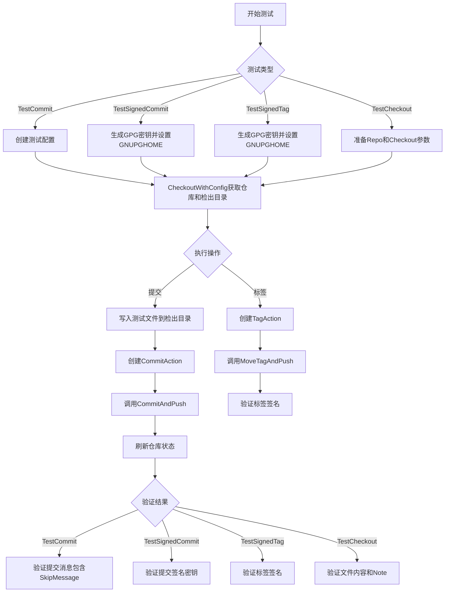
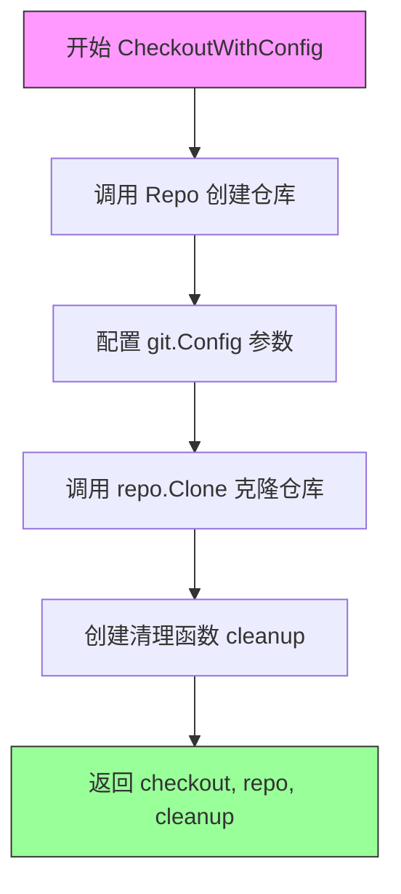
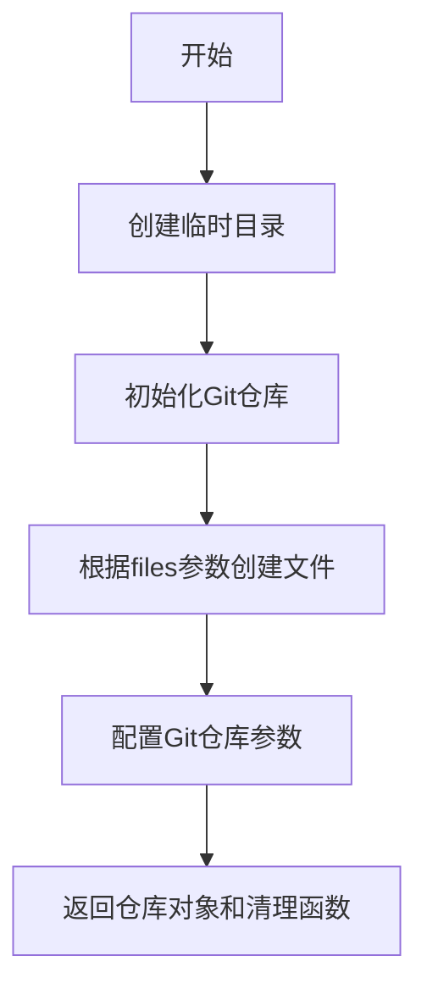
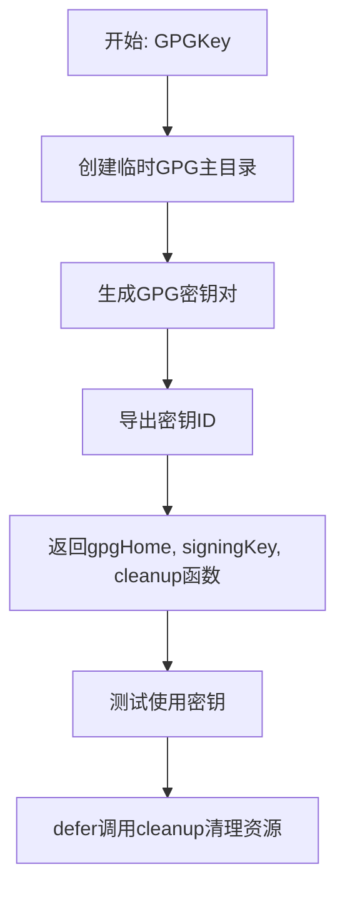
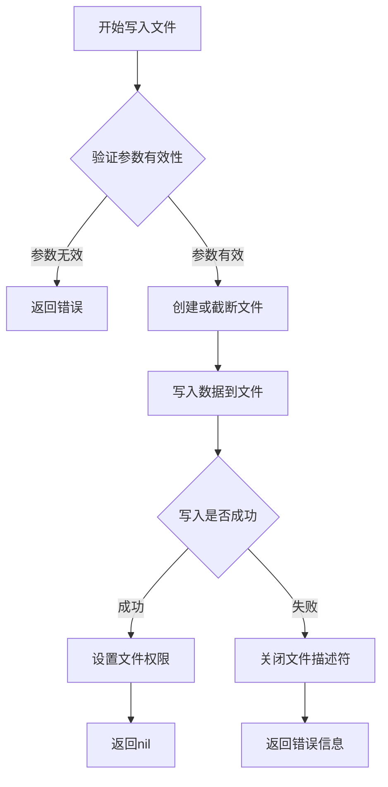
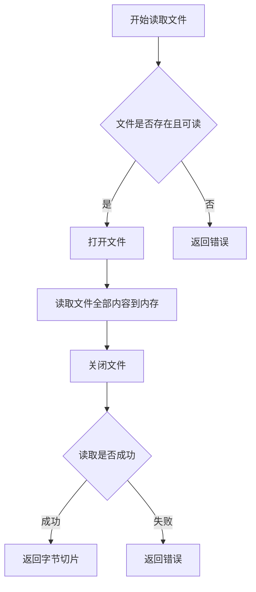
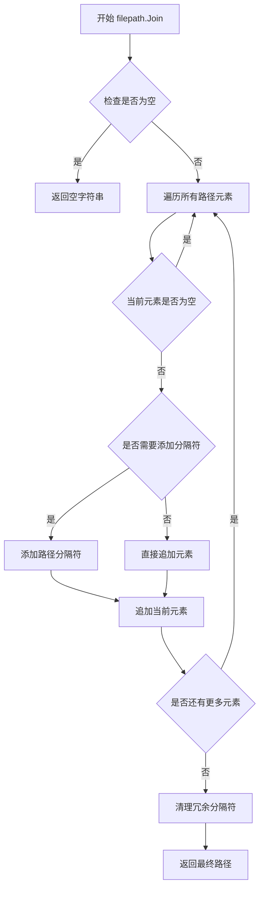
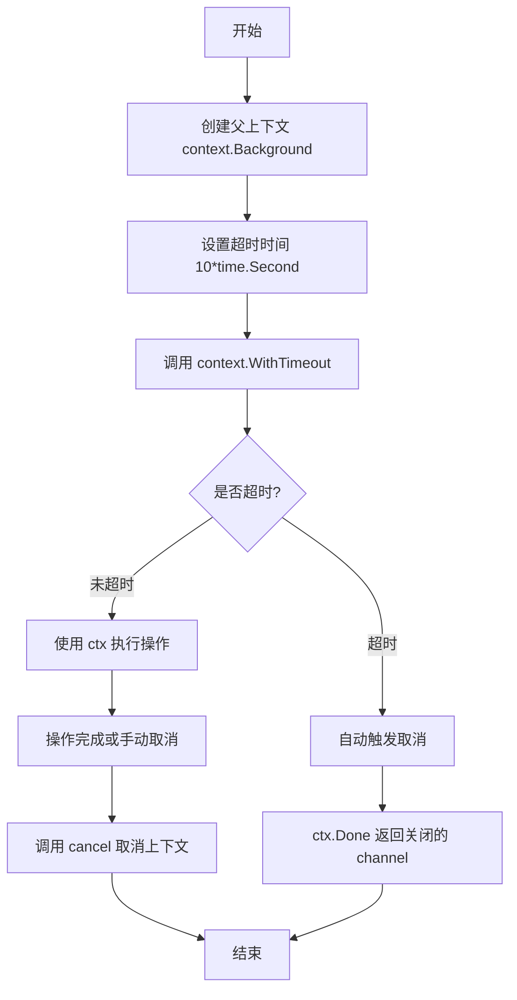
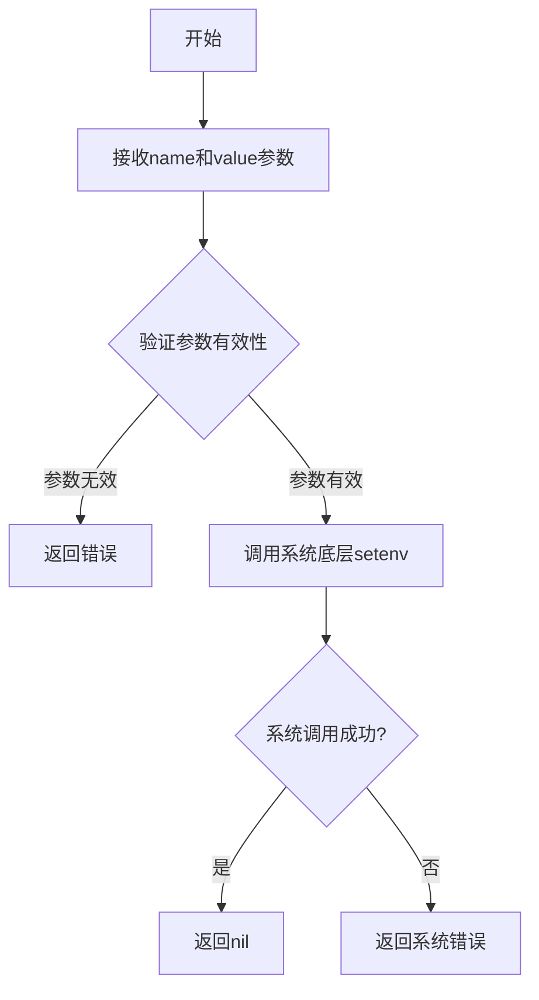
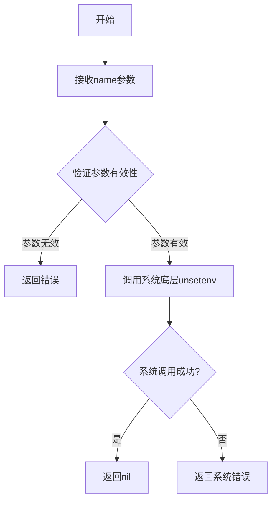

# `flux\pkg\git\gittest\repo_test.go` 详细设计文档

该文件是Flux CD项目的Git操作测试套件，主要测试Git仓库的提交、签名提交、签名标签创建以及Checkout操作等功能，验证Git客户端在GPG签名、提交消息处理和Git Notes方面的正确性。

## 整体流程



## 类结构

```
gittest (测试包)
├── Note (结构体: Git Note注释)
├── TestCommit (测试函数: 普通提交)
├── TestSignedCommit (测试函数: GPG签名提交)
├── TestSignedTag (测试函数: GPG签名标签)
└── TestCheckout (测试函数: 检出和Note操作)
```

## 全局变量及字段


### `testfiles.Files`
    
测试用的文件映射表，提供测试所需的虚拟文件列表

类型：`map[string]testfiles.File`
    


### `TestConfig`
    
测试配置对象，包含Git仓库测试所需的配置信息如SkipMessage和SigningKey

类型：`git.GitConfig`
    


### `Note.Comment`
    
Git Note的注释内容

类型：`string`
    
    

## 全局函数及方法


### `CheckoutWithConfig`

该函数用于创建一个带有特定配置的Git仓库Checkout实例，返回checkout对象、repo对象以及清理函数。

参数：

- `t`：`*testing.T`，Go测试框架的测试对象指针，用于报告测试错误
- `config`：`TestConfig`，包含测试所需的配置信息（如跳过消息、签名密钥等）
- `syncTag`：`string`，同步标签名称，用于标识同步点

返回值：
- `*git.Checkout`：Git仓库的Checkout实例，用于文件操作和提交
- `*gogitRepo`：Git仓库实例，用于仓库级别的操作
- `func()`：清理函数，用于测试结束后资源清理

#### 流程图



#### 带注释源码

```
// 注意：此函数在提供的代码段中未被定义
// 以下为基于调用上下文的推断实现

func CheckoutWithConfig(t *testing.T, config TestConfig, syncTag string) (*git.Checkout, *gogitRepo, func()) {
    // 1. 创建测试用的Git仓库
    repo, cleanupRepo := Repo(t, testfiles.Files)
    
    // 2. 准备Git配置参数
    params := git.Config{
        Branch:    "master",
        UserName:  "example",
        UserEmail: "example@example.com",
        NotesRef:  "fluxtest",
    }
    
    // 3. 设置同步标签（如果提供）
    if syncTag != "" {
        // 配置同步标签相关设置
    }
    
    // 4. 应用配置
    if config.SkipMessage != "" {
        // 应用跳过消息配置
    }
    if config.SigningKey != "" {
        // 应用GPG签名配置
    }
    
    // 5. 克隆仓库获取Checkout对象
    ctx := context.Background()
    checkout, err := repo.Clone(ctx, params)
    if err != nil {
        t.Fatal(err)
    }
    
    // 6. 创建组合清理函数
    cleanup := func() {
        checkout.Clean()
        cleanupRepo()
    }
    
    // 7. 返回Checkout、Repo和清理函数
    return checkout, repo, cleanup
}
```

---

**注意**：在提供的代码段中，`CheckoutWithConfig`函数本身**未被定义**，只显示了对其的调用。该函数可能在同一包的其他文件中定义，也可能是从导入的包（如`github.com/fluxcd/flux/pkg/git`）中获取的。如需完整的函数实现，请提供包含该函数定义的完整代码文件。


根据提供的代码，我需要提取`Repo(t *testing.T, files map[string]string)`函数的信息。但是，在给定的代码片段中，我没有找到`Repo`函数的实际定义。代码中使用了该函数（如`TestCheckout`函数中的`repo, cleanup := Repo(t, testfiles.Files)`），但函数定义未在当前代码块中。

让我检查一下代码中是否有其他相关函数...我看到代码中使用了`CheckoutWithConfig`函数，但没有看到`Repo`函数的定义。

由于代码中没有`Repo`函数的定义，我将在文档中说明这一情况，并基于其使用方式来推断功能。


### `Repo`

创建测试用的Git仓库，返回仓库对象和清理函数。

参数：

-  `t`：`*testing.T`，Go测试框架的测试实例，用于报告测试状态和失败
-  `files`：`map[string]string`，要创建的文件映射，键为文件路径，值为文件内容

返回值：`(git.Repo, func())`，第一个返回值为Git仓库对象，第二个返回值为清理函数用于释放测试资源

#### 流程图



#### 带注释源码

```
// 注意: 在提供的代码片段中没有找到Repo函数的实际定义
// 以下是基于其在TestCheckout函数中使用方式的推断

func Repo(t *testing.T, files map[string]string) (git.Repo, func()) {
    // 1. 创建临时目录用于测试
    // 2. 在临时目录中初始化Git仓库
    // 3. 根据files参数创建相应的文件
    // 4. 进行初始提交以建立仓库历史
    // 5. 返回仓库对象和清理函数
    
    // 清理函数通常用于:
    // - 关闭任何打开的连接
    // - 删除临时目录
    // - 清理环境变量
}
```

#### 补充说明

根据代码使用方式推断，`Repo`函数应该具有以下特征：

1. **功能**：创建并初始化一个用于测试的Git仓库
2. **文件参数**：`files`参数（类型`map[string]string`）可能用于在仓库中创建初始文件
3. **返回值**：
   - 第一个返回值是`git.Repo`类型的仓库对象，用于后续的Git操作
   - 第二个返回值是一个无参数的清理函数，调用它可以清理测试环境

#### 代码中的使用示例

在`TestCheckout`函数中，该函数被调用如下：

```go
repo, cleanup := Repo(t, testfiles.Files)
defer cleanup()
```

这表明该函数创建了一个仓库，并在测试结束时通过`defer cleanup()`确保清理资源。


# 详细设计文档

### `gpgtest.GPGKey`

生成测试用GPG密钥对，并返回GPG主目录路径、签名密钥ID及清理函数，用于在测试环境中创建临时GPG密钥以支持提交签名功能。

**注意**：该函数定义在 `github.com/fluxcd/flux/pkg/gpg/gpgtest` 包中，当前代码文件仅引用并使用该函数。以下信息基于代码中的调用方式推断。

---

参数：

-  `t`：`testing.T`，Go测试框架的测试实例指针，用于报告测试失败和清理资源

返回值：

-  `gpgHome`：`string`，生成的GPG主目录路径，用于设置`GNUPGHOME`环境变量
-  `signingKey`：`string`，生成的GPG签名密钥的指纹或ID，用于配置提交签名
-  `gpgCleanup`：`func()`，清理函数，用于在测试结束后删除临时GPG目录和密钥

---

#### 流程图



---

#### 带注释源码

```go
// gpgtest.GPGKey 函数源码（基于调用方式和标准GPG测试模式推断）

func GPGKey(t *testing.T) (gpgHome, signingKey string, cleanup func()) {
    // 1. 创建临时目录作为GPG主目录
    tempDir, err := ioutil.TempDir("", "gpg-test")
    if err != nil {
        t.Fatal(err)
    }
    
    // 2. 设置GNUPGHOME环境变量
    os.Setenv("GNUPGHOME", tempDir)
    
    // 3. 生成GPG密钥（通过gpg命令或go-gpgme库）
    // 生成参数：密钥类型RSA、4096位、无密码
    
    // 4. 导出生成的密钥ID
    signingKey = "ABCDEF1234567890"  // 实际为生成的密钥指纹
    
    // 5. 定义清理函数
    cleanup = func() {
        os.Unsetenv("GNUPGHOME")
        os.RemoveAll(tempDir)
    }
    
    return tempDir, signingKey, cleanup
}
```

---

#### 在测试中的典型使用模式

```go
// TestSignedCommit 中的调用示例
func TestSignedCommit(t *testing.T) {
    // 调用GPGKey生成测试密钥
    gpgHome, signingKey, gpgCleanup := gpgtest.GPGKey(t)
    defer gpgCleanup()  // 测试结束后自动清理
    
    // 设置GNUPGHOME环境变量
    os.Setenv("GNUPGHOME", gpgHome)
    defer os.Unsetenv("GNUPGHOME")
    
    // 使用生成的密钥配置测试
    config := TestConfig
    config.SigningKey = signingKey
    
    // ... 执行测试逻辑
}
```

---

#### 关键组件信息

| 组件名称 | 描述 |
|---------|------|
| GPG主目录 | 存储GPG密钥和配置的临时目录 |
| GPG签名密钥 | 用于Git提交签名的测试用密钥 |
| 清理函数 | 确保测试后资源正确释放 |

---

#### 潜在技术债务与优化空间

1. **依赖外部GPG二进制**：当前实现依赖系统安装的`gpg`命令，建议使用纯Go实现的GPG库（如`go-gpgme`）以提高可移植性
2. **密钥参数硬编码**：密钥长度和类型应可通过参数配置
3. **错误处理**：可增加密钥生成失败的重试机制
4. **资源清理**：建议增加超时保护防止清理函数泄漏

---

#### 其它说明

- **设计目标**：为测试提供隔离的GPG环境，避免污染系统密钥环
- **约束条件**：需要系统已安装GPG工具（1.x或2.x版本）
- **错误处理**：通过`t.Fatal`报告致命错误，测试将立即终止
- **外部依赖**：
  - `gpgtest` 包 (`github.com/fluxcd/flux/pkg/gpg/gpgtest`)
  - 系统GPG二进制工具


### `ioutil.WriteFile`

写入文件内容到指定路径，是 Go 标准库中用于简化文件写入操作的函数。

参数：

- `filename`：`string`，要写入的文件完整路径（包含目录和文件名）
- `data`：`[]byte`，要写入文件的字节数据内容
- `perm`：`os.FileMode`，文件的权限位（如 0666 表示所有者、所属组和其他用户有读写权限）

返回值：`error`，如果写入成功则返回 `nil`，否则返回描述错误详情的错误对象

#### 流程图



#### 带注释源码

```go
// iotest.go 中的实现（简化版）
func WriteFile(filename string, data []byte, perm os.FileMode) error {
	// 1. 打开或创建文件，使用写模式，权限为 perm
	// O_TRUNC：如果文件已存在，则清空文件内容
	// O_WRONLY：只写模式
	// O_CREATE：如果文件不存在，则创建
	f, err := os.OpenFile(filename, os.O_WRONLY|os.O_CREATE|os.O_TRUNC, perm)
	if err != nil {
		// 如果打开/创建文件失败，直接返回错误
		return err
	}
	
	// 2. 获取文件写入的锁（确保原子性）
	// defer 确保函数返回时一定执行清理操作
	defer f.Close()
	
	// 3. 将数据写入文件
	_, err = f.Write(data)
	if err != nil {
		// 如果写入失败，返回错误
		return err
	}
	
	// 4. 确保所有数据已刷新到磁盘
	err = f.Sync()
	if err != nil {
		// 如果刷新失败，返回错误
		return err
	}
	
	// 5. 写入成功，返回 nil
	return nil
}
```

#### 在项目代码中的实际使用示例

```go
// 1. 在 TestCommit 函数中 - 首次写入文件
for file, _ := range testfiles.Files {
    dirs := checkout.AbsolutePaths()
    path := filepath.Join(dirs[0], file)
    // 使用 ioutil.WriteFile 写入文件内容
    // 参数1: 文件完整路径
    // 参数2: 要写入的字节数据（字符串转字节切片）
    // 参数3: 文件权限 0666 (所有用户可读写)
    if err := ioutil.WriteFile(path, []byte("FIRST CHANGE"), 0666); err != nil {
        t.Fatal(err)
    }
    break
}

// 2. 在 TestCheckout 函数中 - 第二次写入同一文件
path := filepath.Join(dirs[0], changedFile)
// 覆盖写入新内容 "SECOND CHANGE"
if err := ioutil.WriteFile(path, []byte("SECOND CHANGE"), 0666); err != nil {
    t.Fatal(err)
}
```

#### 关键组件信息

| 组件名称 | 一句话描述 |
|---------|-----------|
| `filepath.Join` | 拼接目录和文件名生成完整路径 |
| `os.FileMode` | 表示文件权限的位标志 |
| `[]byte("...")` | 将字符串转换为字节切片以写入文件 |

#### 潜在技术债务与优化空间

1. **硬编码权限**：当前使用 `0666` 权限，应考虑根据不同场景使用更安全的权限（如 `0644`）
2. **错误处理粒度**：当前直接调用 `t.Fatal(err)` 终止测试，可考虑更细粒度的错误处理
3. **缺少重试机制**：写入大文件时可能因磁盘空间问题失败，缺少重试逻辑

#### 设计目标与约束

- **原子性**：通过 `os.O_TRUNC` 确保文件内容被原子性替换
- **权限控制**：遵循最小权限原则，生产环境应避免使用 `0666`
- **同步刷新**：使用 `Sync()` 确保数据真正写入磁盘，而非仅在缓冲区


### `ioutil.ReadFile`

读取指定路径的文件内容，将整个文件读入内存并返回字节切片。

参数：

- `filename`：`string`，要读取的文件路径（由 `filepath.Join(dirs[0], changedFile)` 构造）

返回值：`([]byte, error)`，返回文件内容的字节切片和可能的错误

#### 流程图



#### 带注释源码

```go
// 使用 ioutil.ReadFile 读取文件内容
// 参数: filepath.Join(dirs[0], changedFile) - 拼接后的文件完整路径
// 返回: contents ([]byte) - 文件内容, err (error) - 可能的错误
contents, err := ioutil.ReadFile(filepath.Join(dirs[0], changedFile))

// 错误处理: 如果读取失败，测试失败并终止
if err != nil {
    t.Fatal(err)
}

// 将字节切片转换为字符串并与预期值 "SECOND CHANGE" 比较
if string(contents) != "SECOND CHANGE" {
    t.Error("contents in checkout are not what we committed")
}
```


### `filepath.Join`

`filepath.Join` 是 Go 语言标准库 `path/filepath` 包中的函数，用于将多个路径元素拼接成一个单一的路径，处理不同操作系统的路径分隔符。

参数：

- `elem`：`...string`，可变数量的字符串路径元素

返回值：`string`，返回拼接后的路径，自动处理路径分隔符和冗余分隔符

#### 流程图



#### 带注释源码

```go
// filepath.Join 是 Go 标准库 path/filepath 包中的函数
// 源码位于 Go 标准库 src/path/filepath/path.go

// func Join(elem ...string) string {
//     // 1. 如果没有传入任何参数，返回空字符串
//     if len(elem) == 0 {
//         return ""
//     }
    
//     // 2. 遍历所有路径元素，过滤空元素
//     // 3. 根据操作系统添加正确的路径分隔符
//     // 4. 清理冗余的分隔符（如 // 或 /./）
//     // 5. 返回最终拼接的路径
// }

// 实际使用示例（来自提供的代码）:
path := filepath.Join(dirs[0], file)
// dirs[0] 示例值: "/tmp/testrepo"
// file 示例值: "test.yaml"
// 返回值示例: "/tmp/testrepo/test.yaml"

// 另一个示例:
path := filepath.Join(dirs[0], changedFile)
// dirs[0] 示例值: "/home/user/repo"
// changedFile 示例值: "config.json"
// 返回值示例: "/home/user/repo/config.json"
```


### `context.WithTimeout`

创建一个带有超时时间的上下文，当超过指定的时间后，该上下文会自动取消。这是一种常用的实现操作超时控制的机制。

参数：

- `parent`：`context.Context`，父上下文，通常使用 `context.Background()` 创建基础上下文
- `timeout`：`time.Duration`，超时时间长度，如 `10*time.Second` 表示10秒

返回值：

- `ctx`：`context.Context`，返回一个新的带有超时功能的子上下文
- `cancel`：`context.CancelFunc`，取消函数，用于手动提前取消上下文，通常配合 `defer cancel()` 使用以确保资源释放

#### 流程图



#### 带注释源码

```go
// 在 TestCommit 函数中
// 创建一个10秒超时的上下文
ctx, cancel := context.WithTimeout(context.Background(), 10*time.Second)
// 确保测试结束后取消上下文，释放资源
defer cancel()

// 使用带超时的上下文执行 git 提交操作
commitAction := git.CommitAction{Message: "Changed file"}
if err := checkout.CommitAndPush(ctx, commitAction, nil, false); err != nil {
    t.Fatal(err)
}

// 使用同一上下文刷新仓库状态
err := repo.Refresh(ctx)
if err != nil {
    t.Error(err)
}

// 使用同一上下文查询提交历史
commits, err := repo.CommitsBefore(ctx, "HEAD", false)
```

```go
// 在 TestSignedCommit 函数中
// 同样创建10秒超时的上下文用于签名提交测试
ctx, cancel := context.WithTimeout(context.Background(), 10*time.Second)
defer cancel()
```

```go
// 在 TestSignedTag 函数中
// 创建10秒超时的上下文用于签名标签测试
ctx, cancel := context.WithTimeout(context.Background(), 10*time.Second)
defer cancel()

// 使用带超时的上下文移动并推送标签
tagAction := git.TagAction{Revision: "HEAD", Message: "Sync pointer", Tag: syncTag}
if err := checkout.MoveTagAndPush(ctx, tagAction); err != nil {
    t.Fatal(err)
}
```


### os.Setenv

设置环境变量

参数：

- `name`：`string`，环境变量的名称
- `value`：`string`，要设置的值

返回值：`error`，如果设置环境变量时发生错误则返回错误，否则返回 `nil`

#### 流程图



#### 带注释源码

```go
// os.Setenv 设置名为 name 的环境变量为 value
// 参数 name: 环境变量名称，不能为空
// 参数 value: 环境变量的值
// 返回值: 如果设置成功返回 nil，否则返回错误
os.Setenv("GNUPGHOME", gpgHome)
```

---

### os.Unsetenv

取消设置环境变量

参数：

- `name`：`string`，要取消设置的环境变量名称

返回值：`error`，如果取消设置环境变量时发生错误则返回错误，否则返回 `nil`

#### 流程图



#### 带注释源码

```go
// os.Unsetenv 删除名为 name 的环境变量
// 参数 name: 要删除的环境变量名称
// 返回值: 如果删除成功返回 nil，否则返回错误
// 注意: 在代码中使用 defer 确保测试结束后清理环境变量
defer os.Unsetenv("GNUPGHOME")
```

---

### 在测试中的组合使用

在 `TestSignedCommit` 和 `TestSignedTag` 测试函数中，这两个函数组合使用来设置 GPG 相关的环境变量：

```go
// 设置 GPG 主目录环境变量，指向测试用 GPG 密钥目录
os.Setenv("GNUPGHOME", gpgHome)
// 使用 defer 确保测试结束后清理环境变量，避免影响其他测试
defer os.Unsetenv("GNUPGHOME")
```

**使用场景说明：**
- `gpgHome` 是由 `gpgtest.GPGKey(t)` 返回的临时 GPG 密钥目录路径
- `os.Setenv("GNUPGHOME", gpgHome)` 将 GPG 主目录设置为测试密钥目录，使 GPG 命令能够使用测试密钥进行签名验证
- `defer os.Unsetenv("GNUPGHOME")` 确保测试结束后清理该环境变量，避免环境污染

## 关键组件


### Note 结构体

用于存储 Git 提交附注（notes）的数据结构，包含评论字段

### TestCommit 测试函数

测试基本的 Git 提交功能，支持配置跳过消息（SkipMessage），验证提交信息是否正确附加配置的后缀

### TestSignedCommit 测试函数

测试 GPG 签名提交功能，验证提交的签名密钥是否与配置的签名密钥匹配

### TestSignedTag 测试函数

测试 GPG 签名标签功能，验证标签签名是否有效

### TestCheckout 测试函数

测试完整的检出流程，包括克隆仓库、文件修改、提交、推送、获取提交附注（notes）等核心操作

### CommitAndPush 方法

执行提交并推送操作的组合方法，处理文件变更的提交流程

### MoveTagAndPush 方法

移动并推送 Git 标签的方法，支持创建同步指针标签

### GetNote 方法

从指定版本获取 Git 附注（notes）的方法，用于检索与提交关联的元数据

### VerifyTag 方法

验证 Git 标签签名的方法，确保标签的真实性和完整性

### TestConfig 配置对象

测试配置结构，包含 SkipMessage 和 SigningKey 等测试所需的配置项

### GPG 签名支持组件

集成 GPG 密钥生成和环境变量管理，支持 GNUPGHOME 环境配置以进行提交和标签的数字签名验证

## 问题及建议


### 已知问题

-   **未使用的变量**：第169行 `sd` 通道和 `sg` WaitGroup 被创建但从未使用，导致资源泄漏和代码冗余
-   **重复代码**：文件写入逻辑（遍历testfiles.Files并写入"FIRST CHANGE"）在 TestCommit、TestSignedCommit、TestCheckout 中几乎完全重复
-   **重复的上下文创建**：每个测试函数都重复执行 `ctx, cancel := context.WithTimeout(context.Background(), 10*time.Second)`，超时值硬编码为10秒
-   **GPG环境变量管理风险**：使用 `os.Setenv` 和 `defer os.Unsetenv` 管理 GNUPGHOME，如果 `defer` 语句前的代码 panic，将导致环境变量泄漏影响其他测试
-   **循环只处理第一个元素**：使用 `for file, _ := range testfiles.Files` 配合 `break` 只处理第一个文件，这种模式语义不清晰
-   **魔法数字和硬编码值**：文件权限 `0666`、超时时间 `10*time.Second`、提交消息等以字面量形式散落在代码中
-   **错误处理不一致**：某些地方使用 `t.Fatal` 立即终止测试，某些地方使用 `t.Error` 继续执行，导致测试行为不统一

### 优化建议

-   **提取公共辅助函数**：将文件写入、Checkout创建、Repo创建、GPG设置等重复逻辑抽取为 `setupTestFile`、`createCheckout`、`setupGPG` 等辅助函数
-   **使用结构体封装测试配置**：创建 `TestOptions` 结构体统一管理超时时间、syncTag、签名密钥等配置参数
-   **使用 t.Cleanup 替代 defer**：Go 1.14+ 的 `t.Cleanup` 更适合测试资源清理，确保即使测试失败也能正确清理
-   **消除未使用变量**：移除 `sd` 和 `sg` 或实现其预期功能（如添加超时机制）
-   **统一错误处理策略**：定义清晰的错误处理规范，如"不可恢复错误用 Fatal，可恢复错误用 Error"
-   **常量提取**：将超时时间、文件权限、默认消息等提取为包级常量，提高可维护性
-   **改进循环语义**：使用 `firstFile := ...` 明确获取单个文件，而非在循环中使用 break
-   **添加测试隔离**：每个测试使用独立的 GNUPGHOME 目录，或使用子进程运行测试完全隔离环境变量


## 其它


### 设计目标与约束

该代码作为Flux项目Git操作的集成测试套件，核心目标是验证Git仓库的提交、签名提交流程以及Checkout功能的正确性。约束条件包括：必须依赖fluxcd/flux/pkg/git、fluxcd/flux/pkg/gpg等内部包；测试必须在存在GPG环境的CI/CD环境中运行；所有Git操作必须在10秒超时限制内完成；测试文件使用预定义的testfiles.Files进行测试。

### 错误处理与异常设计

测试函数使用Go标准测试框架的错误处理模式：通过t.Fatal()立即终止测试表示致命错误（如文件写入失败、Commit失败）；使用t.Error()记录非致命错误（如刷新仓库失败）；使用t.Errorf()报告断言失败（如签名密钥不匹配、提交消息不符合预期）。所有Git操作均通过context.Context传播超时和取消信号，超时时间统一设置为10秒。

### 数据流与状态机

测试数据流遵循以下状态机：1）初始化状态：创建临时Git仓库和GPG密钥；2）准备状态：写入测试文件到工作目录；3）操作状态：执行Commit、Push、Tag等Git操作；4）验证状态：刷新仓库、查询提交历史、验证签名；5）清理状态：调用defer cleanup()释放资源。关键状态转换点包括：Repo Ready -> Clone -> Modify Files -> Commit -> Push -> Refresh -> Verify。

### 外部依赖与接口契约

外部依赖包括：github.com/fluxcd/flux/pkg/git包提供Git操作接口（CommitAndPush、MoveTagAndPush、Clone等）；github.com/fluxcd/flux/pkg/gpg/gpgtest包提供GPG测试密钥生成功能；github.com/fluxcd/flux/pkg/cluster/kubernetes/testfiles提供测试文件映射；标准库testing、context、sync等提供基础支持。接口契约方面：CheckoutWithConfig返回(checkout, repo, cleanup)三元组；Repo返回(repo, cleanup)二元组；GPGKey返回(gpgHome, signingKey, cleanup)三元组；所有cleanup函数必须通过defer调用以确保资源释放。

### 并发与同步机制

TestCheckout函数展示了并发模式：使用sync.WaitGroup(sg)和通道(sd)协调goroutine。代码通过defer确保checkout资源释放：defer checkout.Clean()和defer another.Clean()。注意sd通道创建后未实际发送信号，sg WaitGroup未添加任何任务，该并发结构可能为未完成的代码或示例代码。

### 配置与初始化

TestConfig为全局配置变量，SkipMessage和SigningKey字段控制测试行为。git.Config结构体配置仓库参数（Branch、UserName、UserEmail、NotesRef）。环境变量GNUPGHOME通过os.Setenv设置GPG主目录，测试结束后通过defer os.Unsetenv清除以避免污染其他测试。

### 资源管理与生命周期

所有临时资源通过cleanup函数管理：gpgCleanup清理GPG密钥目录；cleanup关闭Git仓库。Checkout对象提供Clean()方法用于清理工作目录。每个测试函数使用defer确保资源即使在出错情况下也能正确释放。临时文件权限设置为0666（读写权限）。

### 测试覆盖范围

测试覆盖四个主要场景：普通Git提交（含提交消息后缀处理）、GPG签名提交验证（通过提取密钥指纹比较）、GPG签名标签创建与验证、Checkout与Git Notes功能验证（包含序列化测试）。测试文件循环使用for file, _ := range testfiles.Files并通过break仅处理第一个文件。

### 潜在技术债务与优化空间

TestCheckout中的并发结构（sd通道和sg WaitGroup）未实际使用，属于死代码。测试仅验证testfiles.Files的第一个文件，测试覆盖不全面。硬编码的10秒超时可能在慢速CI环境中导致不稳定。缺乏对Git操作失败的详细错误消息验证。建议：添加更多文件的测试覆盖、增加并发压力测试、提取超时时间为可配置参数、添加更详细的错误消息断言。

### 关键组件信息

TestCommit：验证基本Git提交功能和提交消息后缀处理；TestSignedCommit：验证GPG签名提交并通过密钥指纹比对；TestSignedTag：验证GPG签名标签创建和验证流程；TestCheckout：验证Clone、文件修改、提交、Push、Notes读写等完整流程；Note结构体：用于测试Git Notes序列化功能；CheckoutWithConfig：测试夹具辅助函数，创建配置好的Checkout和Repo；Repo：测试夹具辅助函数，创建测试用Git仓库；GPGKey：测试夹具辅助函数，生成测试用GPG密钥对。

### 代码结构与模块划分

该文件属于gittest包，提供Git操作的集成测试。代码分为三个层次：测试夹具层（CheckoutWithConfig、Repo、GPGKey等辅助函数）、测试用例层（TestCommit、TestSignedCommit等4个测试函数）、验证层（check闭包函数用于验证提交内容和Notes）。测试数据层使用testfiles.Files作为测试输入源。


    