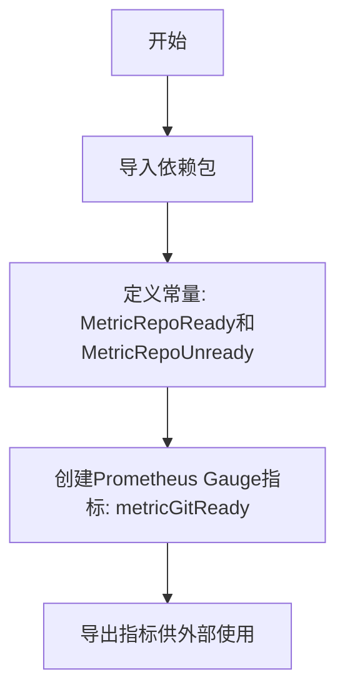

# `flux\pkg\git\metrics.go` 详细设计文档

这是一个Git仓库状态监控模块，通过Prometheus指标追踪Git仓库的准备状态，提供了MetricRepoReady和MetricRepoUnready两个常量用于表示仓库状态，并定义了metricGitReady Gauge指标用于监控。

## 整体流程



## 类结构

```
无
类
层
次
结
构
，
仅
包
含
包
级
常
量
和
变
量
```

## 全局变量及字段


### `metricGitReady`
    
用于记录Git仓库就绪状态的Prometheus Gauge指标，值为1表示就绪，值为0表示未就绪

类型：`prometheus.Gauge`
    


    

## 全局函数及方法


## 关键组件


### Prometheus度量指标系统

该代码模块实现了Git仓库状态的Prometheus监控能力，通过定义就绪/未就绪状态常量并初始化Gauge类型的监控指标，支持对Flux Git仓库状态的实时监控和指标采集。

### 文件运行流程

该代码文件在包初始化时加载Prometheus指标定义，定义了Git仓库的两种状态（就绪/未就绪），并创建了一个名为`flux_git_ready`的Gauge指标用于暴露Git仓库状态到Prometheus监控系统。

### 常量定义

**MetricRepoReady**

- 类型：int
- 描述：表示Git仓库处于就绪状态的值，值为1

**MetricRepoUnready**

- 类型：int
- 描述：表示Git仓库处于未就绪状态的值，值为0

### 全局变量

**metricGitReady**

- 类型：prometheus.Gauge
- 描述：Prometheus Gauge指标，用于记录Git仓库的就绪状态，指标名称为flux_git_ready，包含命名空间flux和子系统git

### 关键组件信息

- **Prometheus集成**：使用go-kit的prometheus封装和官方client_golang库实现监控指标暴露
- **状态编码常量**：通过整型常量编码Git仓库的二元状态（就绪/未就绪）
- **Gauge指标**：使用Gauge类型指标记录当前状态值，适合表示瞬时状态

### 潜在技术债务或优化空间

1. **指标命名规范**：当前指标缺少标签维度，未来如需区分多个Git仓库将无法支持
2. **初始化模式**：直接使用包级变量初始化，在测试场景下难以进行mock或替换
3. **状态语义单一**：当前仅支持二元状态，可考虑增加更细粒度的状态枚举（如同步中、错误等）
4. **缺少文档注释**：包级别和导出符号缺乏Godoc注释，影响可维护性

### 其它项目

**设计目标**：提供轻量级的Git仓库状态监控能力，与Flux生态的监控体系无缝集成

**约束条件**：依赖go-kit/metrics和prometheus client库，需要确保这些依赖的版本兼容性

**错误处理**：当前代码未包含显式的错误处理逻辑，prometheus指标初始化失败将导致包初始化失败

**外部依赖**：
- go-kit/kit/metrics/prometheus：提供Prometheus指标的抽象封装
- prometheus/client_golang：官方Prometheus Go客户端库


## 问题及建议


### 已知问题

-   **未使用的常量定义**: `MetricRepoReady` 和 `MetricRepoUnready` 常量已定义但在当前代码中未被使用，可能导致代码冗余或未来维护问题。
-   **全局变量缺乏可测试性**: `metricGitReady` 作为包级全局变量，无法在单元测试中方便地进行 mock 或替换，影响代码的可测试性。
-   **缺少错误处理**: `prometheus.NewGaugeFrom` 调用没有错误检查，如果指标注册失败（如命名冲突），可能引发 panic。
-   **指标语义不明确**: Help 字符串仅说明"Status of the git repository"，但未说明数值 1 和 0 的具体含义（1=就绪，0=未就绪），缺乏清晰的文档。
-   **空标签数组**: 传入空切片 `[]string{}` 作为标签参数，虽然功能上可行，但代码意图不够明确。
-   **无法动态控制**: 指标在包初始化时创建，缺少运行时启用/禁用的机制，可能在不需要监控的场景下造成资源浪费。

### 优化建议

-   **移除未使用的常量或明确其用途**: 如果这些常量计划在其他地方使用，应添加注释说明；否则应删除以减少代码混淆。
-   **采用依赖注入模式**: 将指标作为参数传递给需要它的函数，或提供 setter 方法，提高可测试性和模块化程度。
-   **添加错误返回机制**: 修改指标初始化逻辑，支持错误返回，使调用者能够处理注册失败的情况。
-   **完善指标文档**: 将 Help 字符串修改为更详细的描述，例如："Status of the git repository. 1 indicates ready, 0 indicates not ready."
-   **考虑使用延迟初始化或控制标志**: 提供一个开关或初始化函数，允许在需要时才创建和注册指标。
-   **添加单元测试**: 为指标创建逻辑添加测试用例，确保指标能够正确创建和使用。


## 其它


### 设计目标与约束

本代码的设计目标是实现Git仓库状态的Prometheus指标监控，通过Gauge类型的指标记录Git仓库的就绪（ready）状态。约束条件包括：仅支持Prometheus指标系统，指标维度单一（无额外标签），命名空间固定为"flux"，子系统固定为"git"。

### 错误处理与异常设计

代码本身无显式错误处理逻辑，作为初始化包，主要风险在于依赖库（prometheus client）的初始化失败。异常情况包括：Prometheus注册失败（指标重复注册会导致panic）、标准库导入失败。包级别变量在init时可能触发早期panic。

### 数据流与状态机

数据流方向为：常量定义（MetricRepoReady/MetricRepoUnready） → 全局变量（metricGitReady） → 外部调用Set()方法。状态机模型简单：0（未就绪） ↔ 1（就绪），状态转换由外部调用方控制，本包仅提供状态存储载体。

### 外部依赖与接口契约

主要外部依赖包括：github.com/go-kit/kit/metrics/prometheus（指标封装库）、github.com/prometheus/client_golang/prometheus（原生Prometheus客户端）。接口契约方面，metricGitReady为包外可访问的全局变量，类型为prometheus.Gauge，调用方通过Set方法设置值（float64类型）。

### 性能考量

Gauge指标操作为原子操作，性能开销极低。包初始化时注册到默认Prometheus Registry，如需自定义Registry需自行处理。指标标签数组为空，避免了标签匹配的性能开销。

### 测试策略

由于代码为纯指标定义，测试重点应包括：常量值验证、指标元数据验证（Namespace/Subsystem/Name/Help）、包初始化成功性测试。建议添加集成测试验证Prometheus抓取结果。

### 配置管理

当前实现无运行时配置能力，所有配置（指标名称、命名空间等）硬编码。如需灵活配置，可考虑通过环境变量或配置文件动态设置命名空间和子系统名称。

### 监控与可观测性

该组件本身即为监控组件，被监控对象为Git仓库状态。监控指标包括：flux_git_ready（当前状态值）。建议配合告警规则：当状态从1变为0时触发告警。

### 版本兼容性

依赖版本约束：Prometheus客户端库需v1.x版本，Go版本需1.13以上以支持模块化依赖管理。

### 部署注意事项

该包通常作为更大系统的依赖库使用，部署时需确保Prometheus服务器配置了对应的指标抓取端点，且网络可达。


    