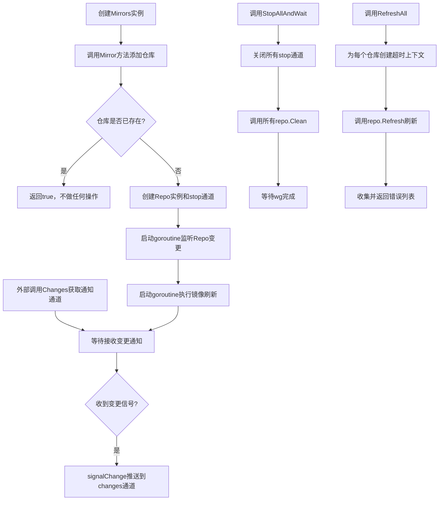
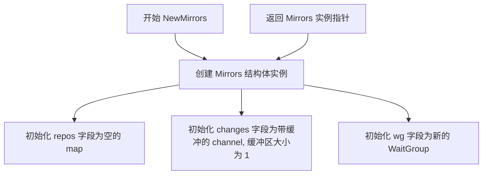
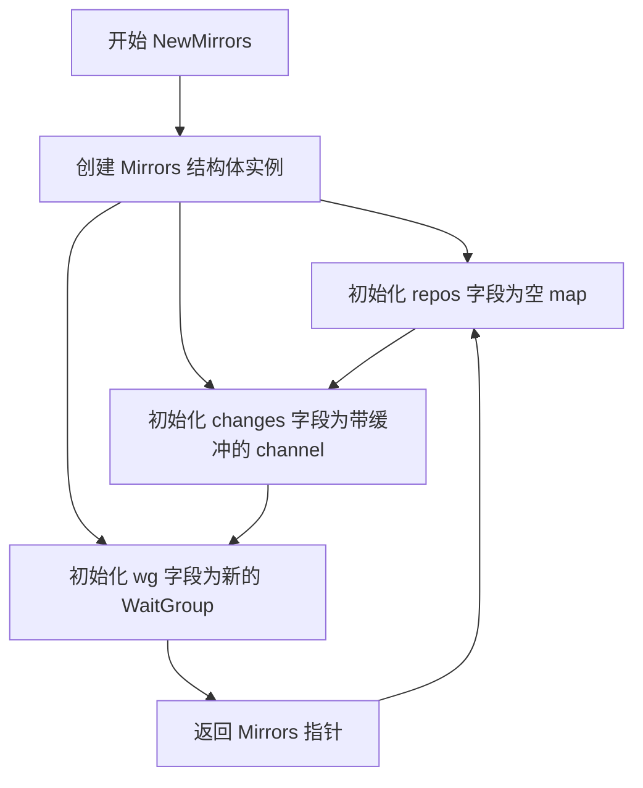
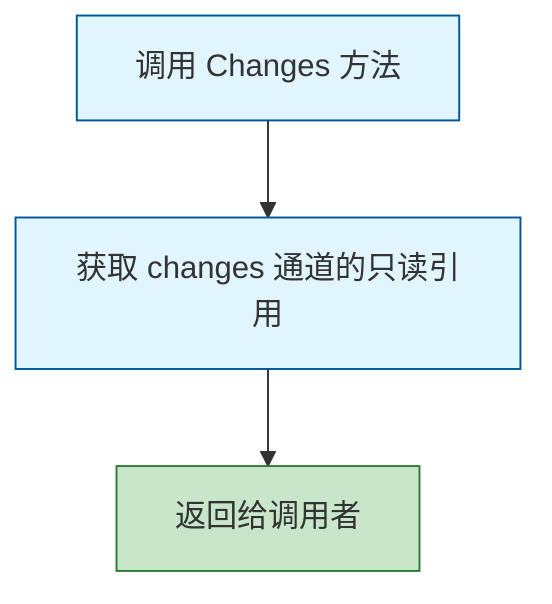
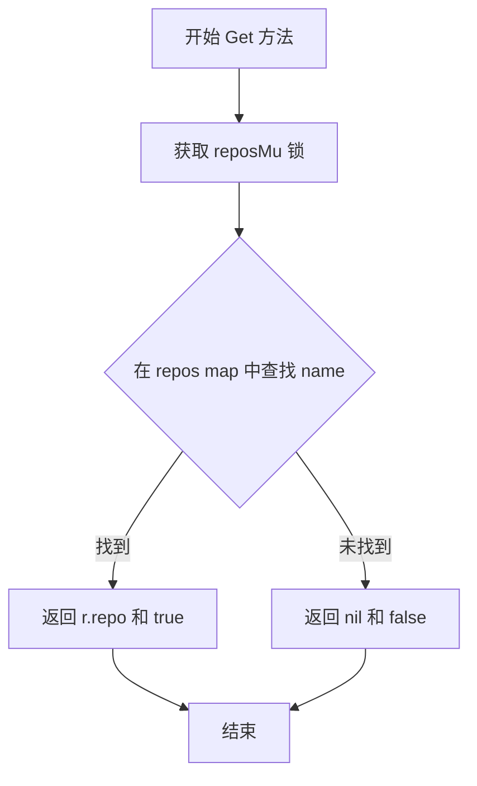
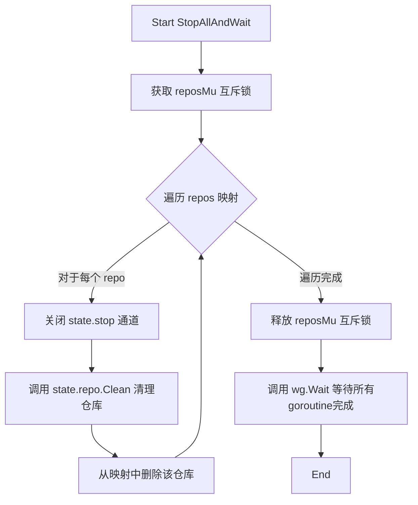
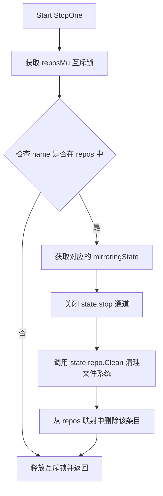

# `flux\pkg\git\mirrors.go` 详细设计文档

这是一个Git仓库镜像管理器，通过维护一个仓库镜像集合，实现增量同步Git仓库，并在仓库发生变更时通过通道向订阅者发送通知，支持添加、查询、停止单个或全部镜像，以及手动触发所有镜像的刷新操作。

## 整体流程



## 类结构

```
mirroringState (内部结构体)
└── Mirrors (主管理类)
    ├── sync.Mutex (reposMu)
    ├── sync.Mutex (changesMu)
    ├── map[string]mirroringState (repos)
    ├── chan map[string]struct{} (changes)
    └── sync.WaitGroup (wg)
```

## 全局变量及字段


### `Mirrors.reposMu`
    
保护repos映射的互斥锁

类型：`sync.Mutex`
    


### `Mirrors.repos`
    
存储镜像仓库状态的映射

类型：`map[string]mirroringState`
    


### `Mirrors.changesMu`
    
保护changes通道的互斥锁

类型：`sync.Mutex`
    


### `Mirrors.changes`
    
变更通知通道，缓冲大小为1

类型：`chan map[string]struct{}`
    


### `Mirrors.wg`
    
用于等待刷新goroutine完成

类型：`*sync.WaitGroup`
    


### `mirroringState.stop`
    
用于停止镜像的信号通道

类型：`chan struct{}`
    


### `mirroringState.repo`
    
指向Repo实例的指针

类型：`*Repo`
    
    

## 全局函数及方法


### `NewMirrors`

构造函数，创建并初始化一个新的 Mirrors 实例，用于管理多个 git 仓库镜像。

参数：

- （无参数）

返回值：`*Mirrors`，返回新创建的 Mirrors 实例指针

#### 流程图



#### 带注释源码

```go
func NewMirrors() *Mirrors {
    // 创建并初始化 Mirrors 结构体实例
    // 各个字段说明：
    // - repos: 存储镜像仓库状态的映射，键为仓库名称
    // - changes: 用于通知哪些仓库发生变化的通道，带缓冲以避免阻塞
    // - wg: 用于等待所有仓库刷新goroutine完成的 WaitGroup
    return &Mirrors{
        repos:   make(map[string]mirroringState), // 初始化空map，用于存储仓库镜像状态
        changes: make(chan map[string]struct{}, 1), // 创建带缓冲的通道，缓冲区大小为1，确保非阻塞发送
        wg:      &sync.WaitGroup{}, // 初始化新的WaitGroup，用于goroutine同步
    }
}
```


### `NewMirrors`

该函数是 `Mirrors` 类型的构造函数，用于创建并初始化一个 `Mirrors` 实例。该实例管理多个 git 仓库的镜像，支持追踪仓库变更并提供通知机制。

参数： 无

返回值：`*Mirrors`，返回一个新创建的、已初始化的 `Mirrors` 实例的指针。

#### 流程图



#### 带注释源码

```go
// NewMirrors 创建并初始化一个新的 Mirrors 实例。
// 该实例用于管理多个 git 仓库镜像，提供变更通知机制。
//
// 返回值：
//   - *Mirrors: 指向新创建的 Mirrors 实例的指针
//
// 初始化内容：
//   - repos: 空的 map，用于存储镜像状态
//   - changes: 带缓冲的 channel，用于发送变更通知
//   - wg: 同步等待组，用于管理并发任务
func NewMirrors() *Mirrors {
	return &Mirrors{
		repos:   make(map[string]mirroringState), // 初始化 repos 为空的 map，键为仓库名称，值为镜像状态
		changes: make(chan map[string]struct{}, 1), // 创建带缓冲的 channel，缓冲大小为 1，用于非阻塞发送变更通知
		wg:      &sync.WaitGroup{}, // 初始化 WaitGroup，用于等待所有镜像任务完成
	}
}
```


### `Mirrors.Changes`

获取一个只读通道，当被跟踪的 Git 仓库发生变化时，该通道会接收到包含变更仓库名称的映射通知。

参数： 无

返回值：`<-chan map[string]struct{}`，返回变更通知通道的只读引用，map 的键为发生变化的仓库名称，值为空结构体（用于表示集合成员关系）

#### 流程图



#### 带注释源码

```go
// Changes gets a channel upon which notifications of which repos have
// changed will be sent.
// Changes 获取一个通道，用于接收哪些仓库已发生变更的通知。
func (m *Mirrors) Changes() <-chan map[string]struct{} {
	return m.changes // 返回内部 changes 通道的只读引用，允许调用者监听变更通知
}
```

#### 附加说明

| 项目 | 描述 |
|------|------|
| **通道行为** | 该通道带有缓冲容量（buffer size 为 1），用于确保变更通知不会丢失 |
| **并发安全** | 该方法本身是线程安全的，因为它仅返回通道引用，不涉及状态修改 |
| **使用场景** | 调用者通过 `range` 或 `select` 语句监听此通道，以响应仓库变更事件 |
| **通道关闭** | 此通道在代码中未显示关闭逻辑，调用者应注意不要持续阻塞读取导致泄漏 |


### Mirrors.Mirror

该方法用于向 Mirrors 集合添加一个仓库镜像。如果指定名称的仓库已存在，则 idempotently（幂等）地忽略添加操作并返回 `true`；否则创建新的镜像状态，启动后台刷新 goroutine，并返回 `false`。该方法通过互斥锁保证线程安全。

参数：

- `name`：`string`，仓库的唯一标识名称
- `remote`：`Remote`，远程仓库的接口，表示需要镜像的 Git 远程端点
- `options`：`...Option`，可变参数选项，用于配置镜像仓库的行为（如存储路径、超时设置等）

返回值：`bool`，如果仓库已存在返回 `true`，否则返回 `false`

#### 流程图

```mermaid
flowchart TD
    A[开始 Mirror] --> B[获取 reposMu 锁]
    B --> C{检查 m.repos[name] 是否存在?}
    C -->|存在| D[解锁 reposMu]
    D --> E[返回 true]
    C -->|不存在| F[创建新的 Repo 实例]
    F --> G[创建 stop chan]
    G --> H[构建 mirroringState 结构体]
    H --> I[存入 m.repos map]
    I --> J[启动 goroutine: 监听 repo.C 并调用 signalChange]
    J --> K[wg.Add 1]
    K --> L[启动 goroutine: repo.Start]
    L --> M[解锁 reposMu]
    M --> N[返回 false]
```

#### 带注释源码

```go
// Mirror instructs the Mirrors to track a particular repo; if there
// is already a repo with the name given, nothing is done. Otherwise,
// the repo given will be mirrored, and changes signalled on the
// channel obtained with `Changes()`.  The return value indicates
// whether the repo was already present (`true` if so, `false` otherwise).
func (m *Mirrors) Mirror(name string, remote Remote, options ...Option) bool {
    // 获取互斥锁，确保对 repos map 的并发访问安全
    m.reposMu.Lock()
    // 使用 defer 确保函数返回前释放锁
    defer m.reposMu.Unlock()

    // 检查指定名称的仓库是否已存在
    _, ok := m.repos[name]
    if !ok {
        // 仓库不存在，创建新的 Repo 实例
        // NewRepo 根据 remote 和 options 初始化本地 Git 仓库
        repo := NewRepo(remote, options...)
        
        // 创建停止信号通道，用于控制后台 goroutine 的生命周期
        stop := make(chan struct{})
        
        // 构建镜像状态结构体，包含停止通道和仓库实例
        mir := mirroringState{stop: stop, repo: repo}
        
        // 将新仓库状态存入 map
        m.repos[name] = mir
        
        // 启动 goroutine：监听仓库变化通知并转发到 Changes 通道
        go func() {
            for {
                select {
                // 当仓库有变化时，发送信号通知订阅者
                case <-mir.repo.C:
                    m.signalChange(name)
                // 当收到停止信号时，退出 goroutine
                case <-stop:
                    return
                }
            }
        }()

        // 将刷新循环加入 WaitGroup
        m.wg.Add(1)
        // 启动 goroutine：执行仓库的定期刷新任务
        // TODO(michael) is it safe to use the wait group dynamically like this?
        go repo.Start(stop, m.wg)
    }
    // 返回仓库是否已存在（ok 为 true 表示已存在）
    return ok
}
```


### Mirrors.Get

获取指定名称的仓库镜像，如果存在则返回对应的 Repo 指针，否则返回 nil。

参数：

- `name`：`string`，要获取的仓库镜像名称

返回值：`(*Repo, bool)`，返回仓库指针和一个布尔值。布尔值表示仓库是否正在被镜像；如果为 true，则 Repo 指针有效；如果为 false，则 Repo 指针为 nil。

#### 流程图



#### 带注释源码

```go
// Get returns the named repo or nil, and a bool indicating whether
// the repo is being mirrored.
func (m *Mirrors) Get(name string) (*Repo, bool) {
    // 获取互斥锁，保证并发安全地访问 repos map
    m.reposMu.Lock()
    // 方法返回前释放锁，确保锁一定会被释放
    defer m.reposMu.Unlock()
    
    // 从 map 中查找指定名称的仓库状态
    r, ok := m.repos[name]
    
    // 如果找到对应的仓库
    if ok {
        // 返回仓库指针和 true，表示仓库存在且正在被镜像
        return r.repo, true
    }
    
    // 未找到对应仓库，返回 nil 和 false
    return nil, false
}
```


### `Mirrors.StopAllAndWait()`

停止所有镜像仓库的刷新操作，并等待所有goroutine确认完成。

参数： 无

返回值： 无（`void`），该方法通过副作用完成操作，不返回任何值。

#### 流程图



#### 带注释源码

```go
// StopAllAndWait stops all the repos refreshing, and waits for them
// to indicate they've done so.
func (m *Mirrors) StopAllAndWait() {
	// 获取互斥锁，确保在遍历和修改 repos 映射时的线程安全
	m.reposMu.Lock()
	
	// 遍历所有已镜像的仓库
	for k, state := range m.repos {
		// 关闭 stop 通道，向该仓库的刷新循环发送停止信号
		close(state.stop)
		
		// 清理该仓库的资源（如文件系统中的临时文件等）
		state.repo.Clean()
		
		// 从映射中删除该仓库条目
		delete(m.repos, k)
	}
	
	// 释放互斥锁，允许其他操作继续
	m.reposMu.Unlock()
	
	// 等待所有通过 wg.Add 添加的 goroutine 完成
	// 这确保了在方法返回前，所有仓库的刷新循环都已停止
	m.wg.Wait()
}
```


### `Mirrors.StopOne`

停止指定名称的镜像，并清理其相关资源（如文件系统痕迹），如果该镜像正在被跟踪。

参数：

- `name`：`string`，要停止的镜像的名称，用于标识需要停止并清理的镜像

返回值：无（`void`），该方法仅执行清理操作，不返回任何值

#### 流程图



#### 带注释源码

```go
// StopOne stops the repo given by `remote`, and cleans up after
// it (i.e., removes filesystem traces), if it is being tracked.
func (m *Mirrors) StopOne(name string) {
	// 获取互斥锁，确保线程安全地访问 repos 映射
	m.reposMu.Lock()
	// 检查指定名称的镜像是否正在被跟踪
	if state, ok := m.repos[name]; ok {
		// 关闭 stop 通道，通知刷新协程停止
		close(state.stop)
		// 清理镜像的文件系统痕迹（如本地仓库文件）
		state.repo.Clean()
		// 从映射中删除该镜像条目
		delete(m.repos, name)
	}
	// 释放互斥锁
	m.reposMu.Unlock()
}
```


### `Mirrors.RefreshAll`

刷新所有已追踪的镜像仓库，获取最新的引用和关联对象。该方法对每个镜像使用单独的超时时间（而非整个操作的总超时），并收集所有遇到的错误返回给调用者。

参数：

- `timeout`：`time.Duration`，每个镜像刷新的超时时间，而非整个操作的总超时时间

返回值：`[]error`，包含在刷新过程中遇到的所有错误的切片，如果没有错误则返回 nil 或空切片

#### 流程图

```mermaid
flowchart TD
    A[开始 RefreshAll] --> B[获取 reposMu 锁]
    B --> C[初始化空错误切片 errs]
    C --> D{遍历 repos 映射}
    D -->|还有更多 repos| E[获取当前 repo 的 mirroringState]
    E --> F[创建带 timeout 的 Context]
    F --> G[调用 state.repo.Refresh(ctx)]
    G --> H{刷新是否出错}
    H -->|是| I[将错误追加到 errs]
    H -->|否| J[跳过]
    I --> K[取消 Context]
    J --> K
    K --> D
    D -->|遍历完成| L[释放 reposMu 锁]
    L --> M[返回 errs 切片]
    M --> N[结束]
```

#### 带注释源码

```go
// RefreshAll instructs all the repos to refresh, this means
// fetching updated refs, and associated objects. The given
// timeout is the timeout per mirror and _not_ the timeout
// for the whole operation. It returns a collection of
// eventual errors it encountered.
func (m *Mirrors) RefreshAll(timeout time.Duration) []error {
    // 获取互斥锁，保护 repos 映射的并发访问
    m.reposMu.Lock()
    // 确保在函数返回前释放锁，即使发生 panic 也会正确释放
    defer m.reposMu.Unlock()

    // 初始化用于收集错误的切片
    var errs []error
    
    // 遍历所有已追踪的镜像仓库状态
    for _, state := range m.repos {
        // 为当前镜像创建带超时限制的上下文
        // 每个镜像独立计时，而非整个操作共享一个超时
        ctx, cancel := context.WithTimeout(context.Background(), timeout)
        
        // 调用仓库的 Refresh 方法获取最新引用和对象
        if err := state.repo.Refresh(ctx); err != nil {
            // 如果刷新失败，将错误追加到错误切片中
            // 继续处理其他仓库，不因单个失败而中断
            errs = append(errs, err)
        }
        
        // 清理上下文资源，必须调用以避免资源泄漏
        cancel()
    }
    
    // 返回收集到的所有错误，如果没有错误则为 nil
    return errs
}
```


### `Mirrors.signalChange`

该内部方法用于向 `changes` 通道发送仓库变更通知，采用非阻塞方式写入通道以确保并发安全，支持批量合并多个变更通知。

参数：

- `name`：`string`，需要通知变更的仓库名称

返回值：无（`void`）

#### 流程图

```mermaid
flowchart TD
    A[signalChange 开始] --> B[获取 changesMu 锁]
    B --> C{尝试从 changes 通道非阻塞读取}
    C -->|成功读取到 c| D[将 name 加入映射 c]
    D --> E[将 c 重新写入 changes 通道]
    C -->|通道为空 default| F[创建新的 map[string]struct{}]
    F --> G[将 name 加入新映射]
    G --> E
    E --> H[释放 changesMu 锁]
    H --> I[signalChange 结束]
```

#### 带注释源码

```go
// signalChange 向 changes 通道发送仓库变更通知
// 采用非阻塞写入机制，允许合并多个变更通知
func (m *Mirrors) signalChange(name string) {
	// 使用锁保护并发写入，防止多个 goroutine 同时写入通道导致冲突
	// 该方法假设所有调用者都会通过此锁来保证线程安全
	m.changesMu.Lock()
	defer m.changesMu.Unlock()
	
	// 使用 select + default 实现非阻塞读取
	// 如果通道中有待处理的变更通知，则取出并合并
	select {
	case c := <-m.changes:
		// 通道中有值，取出当前变更映射
		c[name] = struct{}{} // 将当前仓库名称添加到变更映射中
		m.changes <- c       // 将合并后的映射放回通道
	default:
		// 通道为空（无待处理通知），创建新的变更映射
		c := map[string]struct{}{}
		c[name] = struct{}{} // 将当前仓库名称加入新映射
		m.changes <- c       // 将新映射写入通道
	}
}
```

## 关键组件


### Mirrors 结构体

核心容器类型，管理一组 git 镜像仓库，提供变更通知机制，支持 idempotent 添加仓库操作。

### mirroringState 结构体

内部状态结构，用于存储单个镜像仓库的停止通道和仓库实例的关联关系。

### Changes 方法

返回只读通道，用于接收发生变更的仓库名称映射，是外部订阅变更通知的入口。

### signalChange 方法

内部方法，通过互斥锁保护向变更通道写入数据，支持合并多次变更通知，避免丢失。

### Mirror 方法

向镜像集合添加仓库的方法，若仓库已存在则 idempotent 返回，否则启动后台 goroutine 监听仓库变更并转发通知，同时启动仓库的刷新循环。

### Get 方法

根据名称查找并返回对应的仓库实例及其是否存在的状态，提供只读查询能力。

### StopAllAndWait 方法

停止所有仓库的刷新操作，清理资源，并等待所有后台 goroutine 退出，完成全局关闭流程。

### StopOne 方法

根据名称停止单个仓库的刷新，清理相关资源并从映射中移除，提供细粒度的仓库管理能力。

### RefreshAll 方法

并发触发所有仓库的刷新操作，使用独立超时控制每个仓库，返回执行过程中遇到的错误集合。

### NewMirrors 构造函数

创建并初始化 Mirrors 实例，初始化内部映射、变更通道和 WaitGroup。


## 问题及建议


### 已知问题

-   **WaitGroup动态使用的线程安全隐患**：在`Mirror`方法中，每次调用`wg.Add(1)`动态增加计数，但没有对应的`wg.Done()`调用路径。当调用`StopOne`停止单个仓库时，没有对WaitGroup进行相应的减员，可能导致`StopAllAndWait`中的`wg.Wait()`永久阻塞或提前返回。
-   **goroutine泄漏风险**：`Mirror`方法中启动的通知转发goroutine（在select循环中）在`stop` channel关闭后退出，但启动的`repo.Start`goroutine的退出没有明确的等待机制，可能导致goroutine泄漏。
-   **StopAllAndWait中的竞态条件**：在持有`reposMu`锁的情况下调用`state.repo.Clean()`，而`Clean()`方法可能需要获取其他锁或执行阻塞操作，可能导致死锁或性能问题。
-   **signalChange的通道竞争**：`changes`通道容量为1，使用非阻塞发送（select+default），在高并发场景下可能导致变更通知丢失。
-   **RefreshAll的并发安全问题**：遍历repos时在锁内调用`state.repo.Refresh(ctx)`，如果Refresh操作耗时较长或内部有锁，会导致其他goroutine长时间等待`reposMu`锁。
-   **重复的清理逻辑**：`StopOne`和`StopAllAndWait`中包含重复的关闭stop channel、调用Clean()和删除map条目的代码，违反DRY原则。

### 优化建议

-   **重构WaitGroup管理**：移除动态使用WaitGroup的模式，改为在每个goroutine启动前明确Add，在goroutine内部defer Done，或者考虑使用其他同步机制（如context）来管理goroutine生命周期。
-   **统一资源清理逻辑**：提取通用的清理方法到`mirroringState`或`Mirrors`中，避免代码重复。
-   **改进通道通知机制**：将`changes`通道改为带缓冲的广播模式，或使用多个订阅者模式，确保每个变更通知都被正确处理。
-   **优化并发控制**：将耗时操作（如Refresh）移到锁外执行，使用`sync.RWMutex`提高读并发性能。
-   **增加上下文传播**：在`RefreshAll`等方法中允许调用者传入context，以便支持取消和超时传播。
-   **添加超时和取消支持**：为`Mirror`、`StopOne`等操作添加context支持，避免长时间阻塞。


## 其它


### 设计目标与约束

该代码的设计目标是提供一个线程安全的Git仓库镜像管理系统，支持多个仓库的并行刷新和变更通知。约束包括：使用Go并发原语（sync.Mutex、sync.WaitGroup、channel）确保线程安全；仓库镜像操作是幂等的；变更通知通过带缓冲的channel（缓冲大小为1）实现异步通知。

### 错误处理与异常设计

错误处理主要体现在RefreshAll方法中，它返回一个错误切片收集各个仓库刷新时的错误。异常情况包括：Mirror方法中添加重复仓库时返回true表示已存在；Get方法返回nil和false表示仓库不存在；StopOne方法在仓库不存在时静默处理。潜在的异常场景：signalChange中channel满时的处理使用select/default实现非阻塞写入；StopAllAndWait和StopOne中关闭stop channel后立即删除仓库状态，防止重复关闭channel导致的panic。

### 数据流与状态机

数据流：外部通过Mirror(name, remote, options)添加仓库 → 创建Repo实例和stop channel → 启动goroutine运行repo.Start()进行定期刷新 → 刷新时调用repo.Refresh() → 若有变化通过repo.C触发signalChange() → 写入changes channel → 外部通过Changes()读取通知。状态机：mirroringState包含stop channel作为状态控制信号，关闭stop表示停止该仓库的刷新循环。

### 外部依赖与接口契约

外部依赖：需要导入git包中的Remote、Repo、Option类型，以及标准库的context、sync、time包。接口契约：Remote接口需提供获取仓库信息的能力；Repo类型需实现C属性（变更通知channel）、Start方法、Refresh方法、Clean方法；Option类型用于配置Repo行为。

### 并发安全与同步机制

reposMu保护repos map的并发访问；changesMu保护changes channel的写入；WaitGroup用于等待所有仓库刷新goroutine完成。Mirror方法中获取锁后检查并添加仓库，确保原子性；StopAllAndWait和StopOne在持有reposMu锁的情况下关闭stop channel和删除仓库，防止并发访问已删除的状态。

### 资源管理与生命周期

资源管理：每个仓库有独立的stop channel用于控制生命周期；StopOne和StopAllAndWait中调用repo.Clean()清理文件系统痕迹；WaitGroup等待刷新goroutine结束后才返回。生命周期：创建Mirrors → 添加多个仓库 → 定期刷新/手动RefreshAll → 停止单个或全部仓库。

### 测试与可观测性

代码中包含TODO注释：go repo.Start(stop, m.wg) // TODO(michael) is it safe to use the wait group dynamically like this? 这表明动态使用WaitGroup可能存在风险，建议在测试中验证并发场景下的行为。signalChange方法中非阻塞写入changes channel的设计需要在高频率变更场景下测试是否可能丢失通知。

### 潜在优化空间

signalChange方法在channel满时会丢失之前的变更记录（创建新map只包含最新name），建议使用更可靠的变更聚合机制。WaitGroup的动态使用方式存在风险，建议预先知道goroutine数量或使用其他同步机制。RefreshAll中对每个仓库使用独立context，但未实现并行刷新，可考虑使用errgroup实现并行刷新以提高性能。

### 安全性考虑

代码未对name参数进行校验，恶意或异常的name可能导致问题。未限制repos map的大小，可能导致内存耗尽。未对remote参数进行验证，无法确保远程仓库的有效性。


    