# `flux\pkg\git\operations.go` 详细设计文档

这是一个 Go 语言的 Git 操作封装库，提供了各种 Git 操作的函数封装，包括仓库克隆、checkout、添加文件、提交、推送、拉取、tag 操作、notes 操作、GPG 签名验证等，并使用 context 进行超时控制和取消，同时实现了线程安全的缓冲区用于并发环境下的输出。

## 整体流程

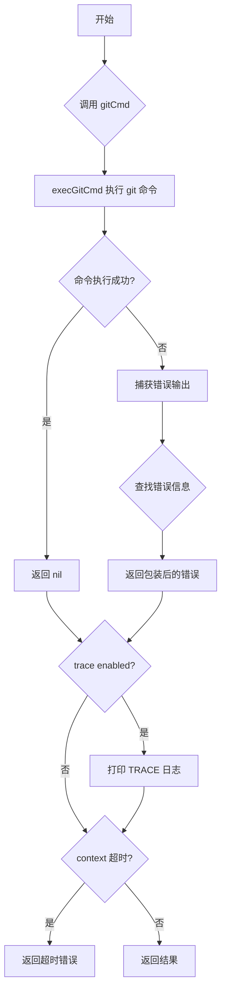

## 类结构

```
gitCmdConfig (git 命令配置结构体)
threadSafeBuffer (线程安全缓冲区结构体)
    ├── Write() 方法
    ├── Read() 方法
    ├── Bytes() 方法
    └── String() 方法
```

## 全局变量及字段


### `trace`
    
是否开启 git 命令跟踪，如果为 true 则每个 git 调用都会回显到 stdout（除了 exemptedTraceCommands 中的命令）

类型：`const bool`
    


### `exemptedTraceCommands`
    
免于跟踪的 git 子命令列表，用于在调试或开发时过滤掉某些不需要记录的 git 命令

类型：`[]string`
    


### `allowedEnvVars`
    
允许从操作系统继承的环境变量列表，包括代理、GPG、云 SDK 等相关配置

类型：`[]string`
    


### `gitCmdConfig.gitCmdConfig.dir`
    
git 命令执行的工作目录

类型：`string`
    


### `gitCmdConfig.gitCmdConfig.env`
    
额外的环境变量列表，会与系统允许的环境变量合并

类型：`[]string`
    


### `gitCmdConfig.gitCmdConfig.out`
    
命令输出目标，用于捕获 git 命令的标准输出

类型：`io.Writer`
    


### `threadSafeBuffer.threadSafeBuffer.buf`
    
线程安全的字节缓冲区，用于存储 git 命令的输出

类型：`bytes.Buffer`
    


### `threadSafeBuffer.threadSafeBuffer.mu`
    
互斥锁，用于保证并发读写缓冲区时的线程安全

类型：`sync.Mutex`
    
    

## 全局函数及方法


### `config`

该函数用于在指定的工作目录中配置Git用户信息，包括用户名和用户邮箱。它通过遍历一个包含`user.name`和`user.email`键值对的map，调用`git config`命令来逐个设置Git配置。

参数：

- `ctx`：`context.Context`，Go语言的上下文对象，用于控制函数的超时和取消
- `workingDir`：`string`，工作目录，Git命令将在此目录执行
- `user`：`string`，Git用户名
- `email`：`string`，Git用户邮箱

返回值：`error`，如果设置Git配置时发生错误，返回错误信息；否则返回nil

#### 流程图

```mermaid
flowchart TD
    A[开始 config 函数] --> B{遍历 map [user.name, user.email]}
    B -->|第一次迭代| C[设置 user.name]
    B -->|第二次迭代| D[设置 user.email]
    C --> E[执行 git config 命令]
    D --> E
    E --> F{执行成功?}
    F -->|是| B
    F -->|否| G[返回错误, 结束]
    B -->|遍历完成| H[返回 nil, 结束]
```

#### 带注释源码

```go
// config 用于设置Git用户配置信息（用户名和邮箱）
// 参数：
//   - ctx: 上下文对象，用于控制命令执行的超时和取消
//   - workingDir: Git仓库的工作目录
//   - user: 要设置的Git用户名
//   - email: 要设置的Git邮箱
// 返回值：
//   - error: 设置过程中发生的错误，如果没有错误则返回nil
func config(ctx context.Context, workingDir, user, email string) error {
	// 遍历包含要设置的Git配置项的map
	for k, v := range map[string]string{
		"user.name":  user,
		"user.email": email,
	} {
		// 构建git config命令参数
		// 例如：git config user.name "John Doe"
		args := []string{"config", k, v}
		
		// 执行git命令，传入上下文、工作目录配置
		// 如果执行失败，包装错误信息并返回
		if err := execGitCmd(ctx, args, gitCmdConfig{dir: workingDir}); err != nil {
			return errors.Wrap(err, "setting git config")
		}
	}
	// 所有配置项设置成功，返回nil
	return nil
}
```


### `git.clone`

该函数是 Git 操作封装的核心功能之一，负责将指定的远程仓库克隆到本地文件系统的工作目录中，并根据需要切换到特定分支。

参数：

- `ctx`：`context.Context`，上下文对象，用于控制命令执行的超时、截止时间以及取消操作。
- `workingDir`：`string`，目标工作目录。Git 仓库将被克隆到此目录下。
- `repoURL`：`string`，要克隆的远程仓库的统一资源定位符（URL）。
- `repoBranch`：`string`，可选参数，指定要克隆的特定分支名称。如果为空字符串，则克隆远程仓库的默认分支（通常是 `main` 或 `master`）。

返回值：`path string, err error`

- `path`：成功执行后，返回克隆后的本地仓库路径（即 `workingDir`）。
- `err`：如果执行过程中发生错误（如网络不通、权限不足、仓库不存在等），返回一个包含错误详情的 `error` 对象；否则返回 `nil`。

#### 流程图

```mermaid
flowchart TD
    A([Start: clone]) --> B[Set repoPath = workingDir]
    B --> C[Init args: ["clone"]]
    C --> D{Is repoBranch not empty?}
    D -->|Yes| E[Append "--branch", repoBranch to args]
    D -->|No| F[Skip branch option]
    E --> G
    F --> G
    G[Append repoURL, repoPath to args]
    G --> H[Call execGitCmd]
    H --> I{Error occurred?}
    I -->|Yes| J[Return "", errors.Wrap(err, 'git clone')]
    I -->|No| K[Return repoPath, nil]
    J --> L([End])
    K --> L
```

#### 带注释源码

```go
// clone 执行 git clone 命令，将远程仓库克隆到本地。
// 它是操作 Git 仓库的基础函数之一。
//
// 参数说明：
//   - ctx: 上下文，控制命令执行的生命周期。
//   - workingDir: 本地工作目录路径。
//   - repoURL: 远程仓库地址。
//   - repoBranch: 可选的分支名。
//
// 返回值：
//   - path: 克隆后的本地路径。
//   - err: 克隆过程中的错误。
func clone(ctx context.Context, workingDir, repoURL, repoBranch string) (path string, err error) {
	// 1. 确定克隆的目标路径，这里直接使用 workingDir
	repoPath := workingDir

	// 2. 构造 git clone 命令的基础参数
	args := []string{"clone"}

	// 3. 如果传入了 repoBranch 参数，则在命令中添加 --branch 选项
	//    这允许用户克隆特定的分支，而不是默认分支
	if repoBranch != "" {
		args = append(args, "--branch", repoBranch)
	}

	// 4. 添加仓库地址和本地目标路径
	//    完整的命令类似: git clone [--branch branchName] url /path/to/dir
	args = append(args, repoURL, repoPath)

	// 5. 调用底层执行函数 execGitCmd 来运行 git 命令
	//    config 指定了命令的工作目录 (dir)
	if err := execGitCmd(ctx, args, gitCmdConfig{dir: workingDir}); err != nil {
		// 6. 错误处理：封装错误信息，便于上层调用者定位问题
		return "", errors.Wrap(err, "git clone")
	}

	// 7. 成功执行，返回克隆后的路径和 nil 错误
	return repoPath, nil
}
```


### `mirror`

该函数用于执行 Git 仓库的镜像克隆操作，通过调用 `git clone --mirror` 命令将远程仓库以镜像方式完整克隆到指定工作目录中。

参数：

- `ctx`：`context.Context`，用于控制命令执行的上下文，支持超时和取消操作
- `workingDir`：`string`，克隆操作的目标工作目录路径
- `repoURL`：`string`，要克隆的远程 Git 仓库的 URL 地址

返回值：`string`，返回克隆后的仓库路径（与 workingDir 相同）；`error`，如果克隆失败则返回错误信息

#### 流程图

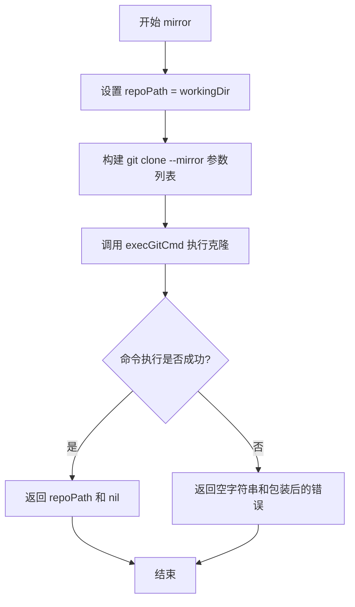

#### 带注释源码

```go
// mirror 执行 Git 仓库的镜像克隆操作
// 参数：
//   - ctx: 上下文，用于控制命令执行
//   - workingDir: 目标工作目录
//   - repoURL: 远程仓库 URL
// 返回值：
//   - path: 克隆后的仓库路径（与 workingDir 相同）
//   - err: 执行过程中的错误信息
func mirror(ctx context.Context, workingDir, repoURL string) (path string, err error) {
	// 将仓库路径设置为工作目录
	repoPath := workingDir
	
	// 构建 git clone --mirror 命令参数
	// 格式: git clone --mirror <repoURL> <repoPath>
	args := []string{"clone", "--mirror"}
	args = append(args, repoURL, repoPath)
	
	// 执行 git 命令
	if err := execGitCmd(ctx, args, gitCmdConfig{dir: workingDir}); err != nil {
		// 克隆失败时返回包装后的错误信息
		return "", errors.Wrap(err, "git clone --mirror")
	}
	
	// 成功时返回仓库路径
	return repoPath, nil
}
```


### `checkout`

该函数用于在指定的Git工作目录中检出特定的引用（如分支、标签或提交）。

参数：

- `ctx`：`context.Context`，上下文对象，用于控制命令执行和取消
- `workingDir`：`string`，Git仓库的工作目录路径
- `ref`：`string`，要检出的引用（分支名、标签名或提交哈希）

返回值：`error`，执行过程中的错误信息，如果成功则返回nil

#### 流程图

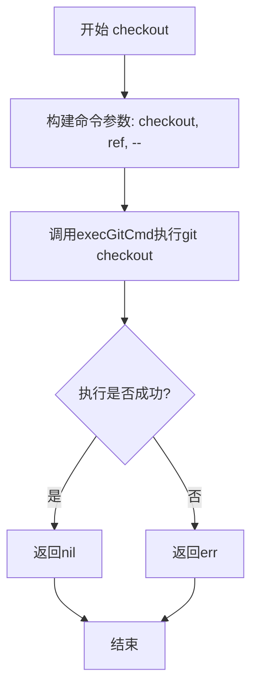

#### 带注释源码

```go
// checkout 在指定的工作目录中检出给定的引用
// 参数：
//   - ctx: 上下文，用于控制命令执行和超时/取消
//   - workingDir: Git仓库的工作目录
//   - ref: 要检出的分支、标签或提交哈希
// 返回值：
//   - error: 如果checkout成功则返回nil，否则返回错误信息
func checkout(ctx context.Context, workingDir, ref string) error {
	// 构建git checkout命令参数
	// 使用 "--" 分隔引用和路径，避免歧义
	args := []string{"checkout", ref, "--"}
	
	// 调用execGitCmd执行git命令，传入工作目录配置
	err := execGitCmd(ctx, args, gitCmdConfig{dir: workingDir})
	
	// 如果执行过程中出现错误，直接返回错误
	if err != nil {
		return err
	}
	
	// 执行成功，返回nil
	return nil
}
```


### `add`

该函数用于将指定路径的文件或目录添加到 Git 暂存区（Stage），通过构造 `git add` 命令并调用底层执行函数完成暂存操作。

参数：

- `ctx`：`context.Context`，用于控制命令执行的上下文，支持取消和超时
- `workingDir`：`string`，Git 仓库的工作目录路径
- `path`：`string`，需要添加到暂存区的文件或目录路径

返回值：`error`，如果执行过程中出现错误则返回错误信息，否则返回 nil

#### 流程图

```mermaid
flowchart TD
    A[开始 add 函数] --> B[构造 git 命令参数: args = ['add', '--', path]]
    B --> C[创建 gitCmdConfig 配置对象]
    C --> D{设置 dir 字段为 workingDir}
    D --> E[调用 execGitCmd 执行 git add 命令]
    E --> F{执行是否成功}
    F -->|成功| G[返回 nil]
    F -->|失败| H[返回 error]
    G --> I[结束]
    H --> I
```

#### 带注释源码

```go
// add 将指定路径的文件或目录添加到 Git 暂存区
// 参数：
//   - ctx: 上下文对象，用于控制命令执行的生命周期
//   - workingDir: Git 仓库的工作目录
//   - path: 需要暂存的文件或目录路径
//
// 返回值：
//   - error: 执行过程中的错误信息，如果成功则返回 nil
func add(ctx context.Context, workingDir, path string) error {
	// 构造 git add 命令参数
	// "--" 用于明确分隔路径参数，防止路径被误解释为分支名
	args := []string{"add", "--", path}
	
	// 创建 git 命令配置，指定工作目录
	config := gitCmdConfig{dir: workingDir}
	
	// 执行 git add 命令并返回结果
	return execGitCmd(ctx, args, config)
}
```


### `checkPush`

该函数用于执行推送前的可行性检查，通过创建并推送一个伪随机的临时标签来验证当前工作目录对应的本地仓库是否具有向上游远程仓库推送内容的写权限。如果推送成功，则清理该临时标签。

参数：

- `ctx`：`context.Context`，用于控制命令执行的上下文，如超时或取消
- `workingDir`：`string`，本地Git仓库的工作目录路径
- `upstream`：`string`，上游远程仓库的名称（如"origin"）
- `branch`：`string`，可选参数，指定要推送的分支名称

返回值：`error`，如果检查过程中出现错误（包括随机数生成失败、标签创建失败、推送失败、标签清理失败），则返回相应的错误信息；检查成功则返回nil

#### 流程图

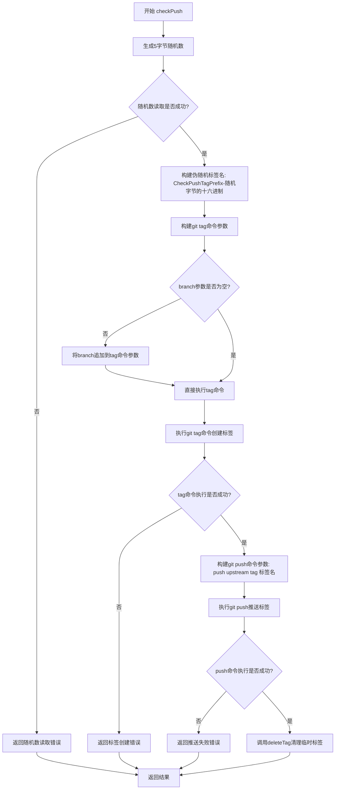

#### 带注释源码

```go
// checkPush sanity-checks that we can write to the upstream repo
// (being able to `clone` is an adequate check that we can read the
// upstream).
func checkPush(ctx context.Context, workingDir, upstream, branch string) error {
	// we need to pseudo randomize the tag we use for the write check
	// as multiple Flux instances can perform the check simultaneously
	// for different branches, causing commit reference conflicts
	// 创建一个5字节的随机切片，用于生成唯一的临时标签名
	b := make([]byte, 5)
	if _, err := rand.Read(b); err != nil {
		return err
	}
	// 使用CheckPushTagPrefix前缀和随机字节生成唯一的标签名
	pseudoRandPushTag := fmt.Sprintf("%s-%x", CheckPushTagPrefix, b)
	// 构建git tag命令参数
	args := []string{"tag", pseudoRandPushTag}
	// 如果指定了branch参数，则将branch追加到tag命令参数
	if branch != "" {
		args = append(args, branch)
	}
	// 在本地仓库创建标签
	if err := execGitCmd(ctx, args, gitCmdConfig{dir: workingDir}); err != nil {
		return errors.Wrap(err, "tag for write check")
	}
	// 尝试将标签推送到上游仓库，验证写权限
	args = []string{"push", upstream, "tag", pseudoRandPushTag}
	if err := execGitCmd(ctx, args, gitCmdConfig{dir: workingDir}); err != nil {
		return errors.Wrap(err, "attempt to push tag")
	}
	// 推送成功后，删除本地和上游的临时标签
	return deleteTag(ctx, workingDir, pseudoRandPushTag, upstream)
}
```


### `deleteTag`

该函数用于从远程仓库中删除指定的Git标签，通过执行`git push --delete`命令实现。

参数：

- `ctx`：`context.Context`，Go语言的上下文，用于控制命令执行的超时和取消
- `workingDir`：`string`，Git仓库的工作目录路径
- `tag`：`string`，要删除的Git标签名称
- `upstream`：`string`，远程仓库地址（别名）

返回值：`error`，如果执行过程中出现错误则返回错误信息，否则返回nil

#### 流程图

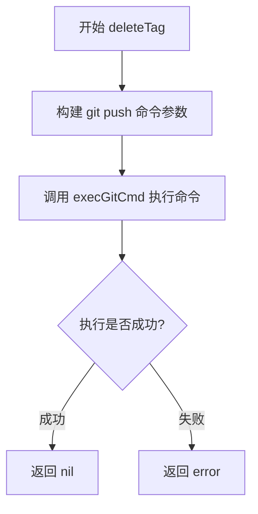

#### 带注释源码

```go
// deleteTag deletes the given git tag
// See https://git-scm.com/docs/git-tag and https://git-scm.com/docs/git-push for more info.
func deleteTag(ctx context.Context, workingDir, tag, upstream string) error {
	// 构建git push命令参数: push --delete <upstream> tag <tag>
	// --delete 参数用于删除远程仓库中的标签
	args := []string{"push", "--delete", upstream, "tag", tag}
	
	// 调用execGitCmd执行git命令，传入工作目录配置
	return execGitCmd(ctx, args, gitCmdConfig{dir: workingDir})
}
```


### `secretUnseal`

该函数用于调用 git secret 工具解密仓库中的加密文件，通过执行 `git secret reveal -f` 命令将所有加密的 secrets 文件解密到工作目录中。

参数：

- `ctx`：`context.Context`，上下文对象，用于控制命令执行的生命周期（如超时、取消等）
- `workingDir`：`string`，工作目录，指定 git 命令执行的根目录路径

返回值：`error`，如果 git secret reveal 命令执行失败则返回错误，否则返回 nil

#### 流程图

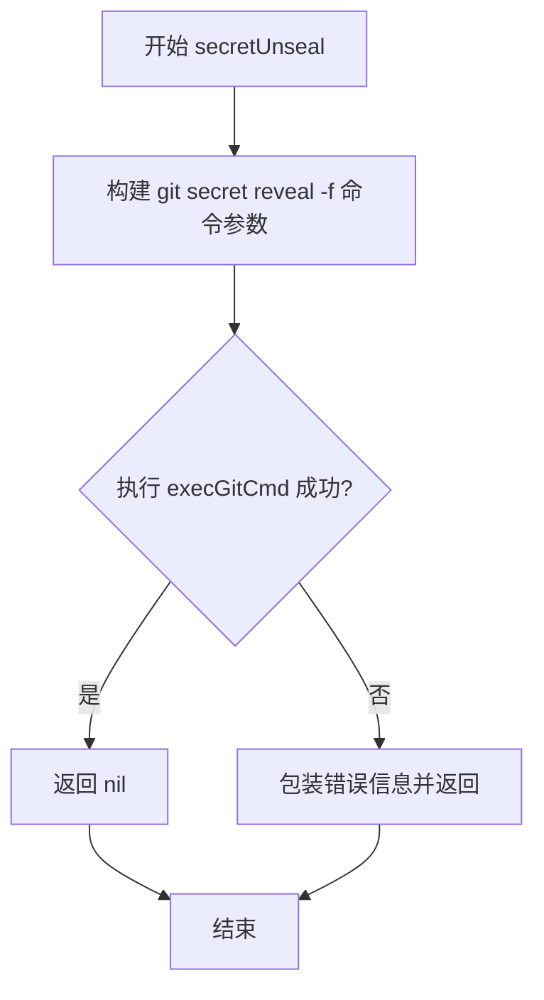

#### 带注释源码

```go
// secretUnseal 解密仓库中所有由 git-secret 加密的文件
// 它通过执行 'git secret reveal -f' 命令将加密的 secrets 解密到工作目录
func secretUnseal(ctx context.Context, workingDir string) error {
	// 构建 git secret reveal 命令参数
	// "secret" - git-secret 工具的主命令
	// "reveal" - 解密所有加密文件的子命令
	// "-f" - 强制覆盖已存在的解密文件
	args := []string{"secret", "reveal", "-f"}
	
	// 使用 execGitCmd 执行 git 命令，传入上下文、工作目录配置
	if err := execGitCmd(ctx, args, gitCmdConfig{dir: workingDir}); err != nil {
		// 如果执行失败，包装错误信息并返回
		return errors.Wrap(err, "git secret reveal -f")
	}
	
	// 执行成功，返回 nil
	return nil
}
```


### `commit`

该函数用于在指定的 Git 工作目录中创建一个新的 Git 提交，支持自定义提交信息、作者和 GPG 签名。

参数：

- `ctx`：`context.Context`，用于控制函数的超时和取消
- `workingDir`：`string`，执行 Git 命令的工作目录路径
- `commitAction`：`CommitAction`，包含提交相关信息的结构体（如提交消息、作者、GPG 签名密钥等）

返回值：`error`，如果执行过程中出现错误则返回错误信息，否则返回 nil

#### 流程图

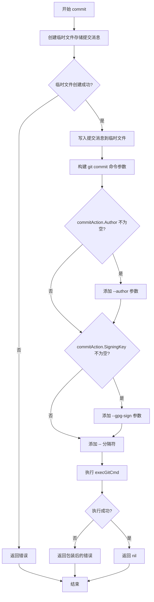

#### 带注释源码

```go
// commit 在指定的工作目录中创建一个 Git 提交
// 参数:
//   - ctx: 上下文，用于控制超时和取消
//   - workingDir: Git 仓库的工作目录
//   - commitAction: 包含提交信息的结构体
//
// 返回值:
//   - error: 如果执行失败返回错误，否则返回 nil
func commit(ctx context.Context, workingDir string, commitAction CommitAction) error {
	// 创建一个临时文件来存储提交消息
	// 使用 ioutil.TempFile 创建临时文件，文件名模式为 "flux-commit-*.txt"
	message, err := ioutil.TempFile("", "flux-commit-*.txt")
	if err != nil {
		return err
	}
	// 确保函数返回前删除临时文件
	defer os.Remove(message.Name())
	
	// 将提交消息写入临时文件
	if _, err := message.WriteString(commitAction.Message); err != nil {
		return err
	}

	// 构建 git commit 命令参数
	// --no-verify: 跳过 pre-commit 和 commit-msg 钩子
	// -a: 自动暂存所有修改的文件
	// --file: 从指定文件读取提交消息
	args := []string{"commit", "--no-verify", "-a", "--file", message.Name()}
	
	// 环境变量切片（当前为空）
	var env []string
	
	// 如果提供了作者信息，添加 --author 参数
	if commitAction.Author != "" {
		args = append(args, "--author", commitAction.Author)
	}
	
	// 如果提供了 GPG 签名密钥，添加 --gpg-sign 参数
	if commitAction.SigningKey != "" {
		args = append(args, fmt.Sprintf("--gpg-sign=%s", commitAction.SigningKey))
	}
	
	// 添加路径分隔符，表示参数结束
	args = append(args, "--")
	
	// 执行 git commit 命令
	if err := execGitCmd(ctx, args, gitCmdConfig{dir: workingDir, env: env}); err != nil {
		return errors.Wrap(err, "git commit")
	}
	return nil
}
```


### `push`

将指定的 Git 引用（refs）推送到上游（upstream）仓库。该函数是 Git 操作的核心功能之一，负责将本地仓库的分支、标签等引用同步到远程仓库。

#### 参数

- `ctx`：`context.Context`，Go 语言的上下文对象，用于控制命令执行的超时、取消等行为
- `workingDir`：`string`，执行 Git 命令的工作目录路径
- `upstream`：`string`，目标远程仓库的名称（如 "origin"）或完整的远程仓库 URL
- `refs`：`[]string`，要推送的 Git 引用列表，可以包含分支名、标签名等

#### 返回值

`error`：如果推送过程中发生任何错误（如网络问题、权限不足、引用不存在等），返回包含错误详情的 error 对象；如果推送成功，返回 nil

#### 流程图

```mermaid
flowchart TD
    A[开始 push] --> B[构造 git push 命令参数]
    B --> C[调用 execGitCmd 执行推送]
    C --> D{执行是否成功?}
    D -->|是| E[返回 nil]
    D -->|否| F[包装错误信息]
    F --> G[返回 error]
    
    B -.-> B1[args = append(['push', upstream], refs...)]
    C -.-> C1[execGitCmd(ctx, args, gitCmdConfig{dir: workingDir})]
    F -.-> F1[errors.Wrap(err, fmt.Sprintf('git push %s %s', upstream, refs))]
```

#### 带注释源码

```go
// push the refs given to the upstream repo
// 将指定的引用推送到上游仓库
func push(ctx context.Context, workingDir, upstream string, refs []string) error {
	// 构造 git push 命令参数：第一个元素是 'push'，第二个是上游仓库名，后续是要推送的引用
	args := append([]string{"push", upstream}, refs...)
	
	// 执行 Git 命令，传入上下文、工作目录配置和参数列表
	// execGitCmd 是核心的 Git 命令执行函数，会实际调用系统的 git 可执行文件
	if err := execGitCmd(ctx, args, gitCmdConfig{dir: workingDir}); err != nil {
		// 如果执行失败，使用 errors.Wrap 包装错误信息，添加上下文说明
		// 包含上游仓库名和具体的引用列表，便于问题排查
		return errors.Wrap(err, fmt.Sprintf("git push %s %s", upstream, refs))
	}
	
	// 推送成功，返回 nil 表示没有错误
	return nil
}
```


### `fetch`

该函数用于从上游（upstream）仓库获取（fetch）指定的引用（refs），支持获取标签，并优雅地处理远程引用不存在的情况。

**参数：**

- `ctx`：`context.Context`，用于控制命令执行的上下文（如取消、超时）
- `workingDir`：`string`，Git 命令执行的工作目录
- `upstream`：`string`，远程仓库的名称或 URL
- `refspec`：`...string`，可选的 refspec 列表，用于指定要获取的具体引用

**返回值：** `error`，如果获取成功或仅遇到"找不到远程引用"则返回 nil，否则返回包含详细错误信息的 error

#### 流程图

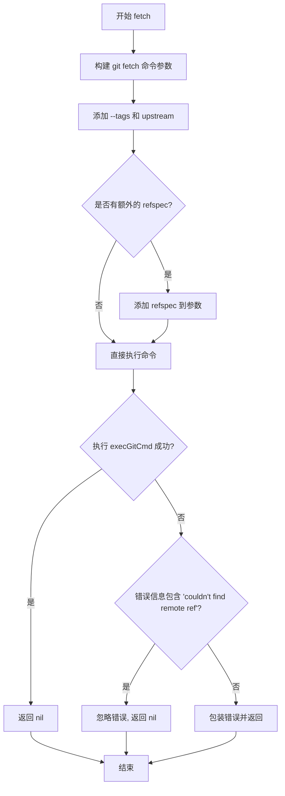

#### 带注释源码

```go
// fetch updates refs from the upstream.
// fetch 函数从上游仓库获取更新，支持获取标签和指定的引用
func fetch(ctx context.Context, workingDir, upstream string, refspec ...string) error {
    // 构建 git fetch 命令参数: ["fetch", "--tags", upstream, refspec...]
    // --tags 表示获取所有标签，upstream 是远程仓库名称
    args := append([]string{"fetch", "--tags", upstream}, refspec...)
    
    // In git <=2.20 the error started with an uppercase, in 2.21 this
    // was changed to be consistent with all other die() and error()
    // messages, cast to lowercase to support both versions.
    // Ref: https://github.com/git/git/commit/0b9c3afdbfb62936337efc52b4007a446939b96b
    // 注意：Git 2.20 及以下版本错误信息首字母大写，2.21+ 改为小写
    // 需要统一转为小写以兼容两个版本
    
    // 执行 git fetch 命令，如果错误是"找不到远程引用"则忽略
    if err := execGitCmd(ctx, args, gitCmdConfig{dir: workingDir}); err != nil &&
        // 检查错误信息中是否包含目标引用不存在的提示（不区分大小写）
        !strings.Contains(strings.ToLower(err.Error()), "couldn't find remote ref") {
        // 如果是其他错误，包装错误信息并返回
        return errors.Wrap(err, fmt.Sprintf("git fetch --tags %s %s", upstream, refspec))
    }
    // 成功或仅是"找不到远程引用"错误都返回 nil
    return nil
}
```


### `refExists`

该函数用于检查指定的Git引用（分支、标签等）在本地仓库中是否存在。它通过执行`git rev-list`命令来判断引用是否有效，如果命令执行失败且错误信息包含"bad revision"，则表示引用不存在。

参数：

- `ctx`：`context.Context`，Go语言的上下文对象，用于控制命令执行的超时和取消
- `workingDir`：`string`，Git仓库的工作目录路径
- `ref`：`string`，要检查的Git引用名称（如分支名、标签名等）

返回值：`(bool, error)`，返回一个布尔值表示引用是否存在，以及可能的错误信息。如果引用存在返回true，不存在返回false；当发生其他非"bad revision"错误时返回error。

#### 流程图

```mermaid
flowchart TD
    A[开始] --> B[构建git命令参数<br/>args = ['rev-list', ref, '--']]
    B --> C[执行execGitCmd函数<br/>调用git rev-list命令]
    C --> D{命令执行是否出错?}
    D -->|是| E{错误信息是否包含<br/>'bad revision'?}
    D -->|否| F[返回 true, nil]
    E -->|是| G[返回 false, nil]
    E -->|否| H[返回 false, err]
    F --> I[结束]
    G --> I
    H --> I
```

#### 带注释源码

```go
// refExists 检查指定的Git引用是否存在于仓库中
// 参数:
//   - ctx: 上下文对象，用于控制命令超时和取消
//   - workingDir: Git仓库的工作目录路径
//   - ref: 要检查的Git引用名称（分支、标签等）
//
// 返回值:
//   - bool: 引用是否存在
//   - error: 如果发生错误返回错误对象，否则返回nil
func refExists(ctx context.Context, workingDir, ref string) (bool, error) {
	// 构建git命令参数
	// rev-list命令用于列出Git对象，如果引用不存在会报错
	// '--' 表示分隔符，之后的路径用于限制在特定目录下操作
	args := []string{"rev-list", ref, "--"}
	
	// 执行git命令，传入上下文、工作目录和命令参数
	if err := execGitCmd(ctx, args, gitCmdConfig{dir: workingDir}); err != nil {
		// 如果命令执行失败，检查是否是"bad revision"错误
		// "bad revision"表示指定的引用在仓库中不存在
		if strings.Contains(err.Error(), "bad revision") {
			// 引用不存在，但这是预期情况，不返回错误
			return false, nil
		}
		// 其他类型的错误（如权限问题、仓库损坏等），返回错误
		return false, err
	}
	
	// 命令执行成功，说明引用存在
	return true, nil
}
```


### `getNotesRef`

获取Git notes引用的完整ref路径。该函数通过执行`git notes --ref <ref> get-ref`命令，将用户提供的简写notes引用名称转换为完整的引用路径（如`refs/notes/commits`），常用于Git操作中定位和管理notes数据。

参数：

- `ctx`：`context.Context`，Go语言上下文，用于控制命令执行的超时、取消等行为
- `workingDir`：`string`，Git仓库的工作目录路径，git命令将在此目录下执行
- `ref`：`string`，notes引用的简写名称（如"commits"表示`refs/notes/commits`）

返回值：`string`，返回完整的ref路径（如`refs/notes/commits`）；`error`，如果git命令执行失败则返回错误信息

#### 流程图

```mermaid
flowchart TD
    A[开始 getNotesRef] --> B[创建 bytes.Buffer 用于存储输出]
    B --> C[构建 git 命令参数: notes --ref {ref} get-ref]
    C --> D{执行 execGitCmd 成功?}
    D -->|是| E[TrimSpace 去除输出两端空白]
    E --> F[返回完整 ref 字符串]
    D -->|否| G[返回空字符串和错误]
    F --> H[结束]
    G --> H
```

#### 带注释源码

```go
// Get the full ref for a shorthand notes ref.
// 获取简写notes引用的完整ref路径
// 参数：
//   - ctx: 上下文对象，用于控制命令执行
//   - workingDir: Git仓库工作目录
//   - ref: notes引用的简写名称
// 返回值：
//   - string: 完整的ref路径
//   - error: 执行过程中的错误
func getNotesRef(ctx context.Context, workingDir, ref string) (string, error) {
	// 创建缓冲区用于捕获git命令的标准输出
	out := &bytes.Buffer{}
	
	// 构建git notes命令参数
	// git notes --ref <ref> get-ref 会返回指定notes引用的完整路径
	args := []string{"notes", "--ref", ref, "get-ref"}
	
	// 执行git命令，传入工作目录和输出缓冲区
	if err := execGitCmd(ctx, args, gitCmdConfig{dir: workingDir, out: out}); err != nil {
		// 如果执行失败，返回空字符串和错误
		return "", err
	}
	
	// 成功执行后，去除输出两端的空白字符并返回
	return strings.TrimSpace(out.String()), nil
}
```


### `addNote`

该函数用于将给定的笔记（note）内容添加为 Git 对象的注释。它首先将笔记对象序列化为 JSON 格式，写入临时文件，然后使用 `git notes add` 命令将笔记附加到指定的修订版本（rev）上。

参数：

- `ctx`：`context.Context`，上下文对象，用于控制函数的超时和取消
- `workingDir`：`string`，Git 仓库的工作目录路径
- `rev`：`string`，目标修订版本（commit hash 或引用），用于指定要为哪个对象添加笔记
- `notesRef`：`string`，Git notes 的引用名称，用于存储笔记的命名空间
- `note`：`interface{}`，要添加的笔记内容，可以是任意可序列化为 JSON 的对象

返回值：`error`，如果操作成功则返回 nil，否则返回具体的错误信息

#### 流程图

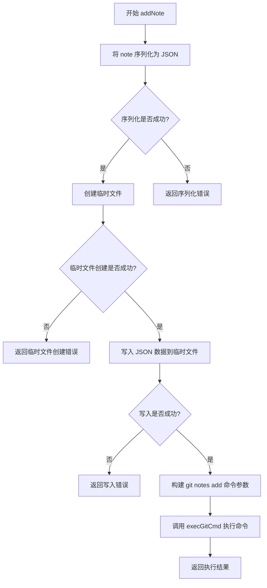

#### 带注释源码

```go
// addNote 向指定的 Git 修订版本添加一个 Git note（笔记）
// 参数：
//   - ctx: 上下文，用于控制超时和取消
//   - workingDir: Git 仓库的工作目录
//   - rev: 要添加笔记的目标修订版本（commit）
//   - notesRef: Git notes 的引用名称（如 "commits"）
//   - note: 要存储的笔记内容（任意可 JSON 序列化的对象）
// 返回值：
//   - error: 操作失败时返回错误，成功时返回 nil
func addNote(ctx context.Context, workingDir, rev, notesRef string, note interface{}) error {
	// 1. 将 note 对象序列化为 JSON 格式的字节数组
	b, err := json.Marshal(note)
	if err != nil {
		return err // 序列化失败，直接返回错误
	}

	// 2. 创建临时文件用于存储 JSON 数据
	//    使用 "flux-note-*.json" 命名模式，便于识别和调试
	message, err := ioutil.TempFile("", "flux-note-*.json")
	if err != nil {
		return err // 临时文件创建失败，返回错误
	}
	// 3. 确保函数返回前删除临时文件，避免磁盘占用
	defer os.Remove(message.Name())
	
	// 4. 将 JSON 数据写入临时文件
	if _, err := message.Write(b); err != nil {
		return err // 写入失败，返回错误
	}

	// 5. 构建 git notes add 命令参数
	//    格式：git notes --ref <notesRef> add --file <file> <rev>
	args := []string{"notes", "--ref", notesRef, "add", "--file", message.Name(), rev}
	
	// 6. 执行 git 命令并返回结果
	return execGitCmd(ctx, args, gitCmdConfig{dir: workingDir})
}
```


### `getNote`

该函数用于从 Git 仓库中获取指定修订版的 Git notes（注释），通过执行 `git notes show` 命令并将结果 JSON 解析到提供的 note 接口中。如果未找到对应的 note，则返回 `ok=false` 且 `err=nil`。

参数：

- `ctx`：`context.Context`，用于控制命令执行的生命周期（超时、取消等）
- `workingDir`：`string`，Git 命令执行的工作目录路径
- `notesRef`：`string`，Git notes 的引用路径（如 "refs/notes/commits"）
- `rev`：`string`，要获取 note 的修订版本（commit hash 或引用）
- `note`：`interface{}`，用于接收 JSON 解析结果的指针对象

返回值：

- `ok`：`bool`，表示是否成功获取到 note（true 表示找到并解析成功，false 表示未找到或解析失败）
- `err`：`error`，如果执行过程中出现错误则返回错误信息，否则返回 nil

#### 流程图

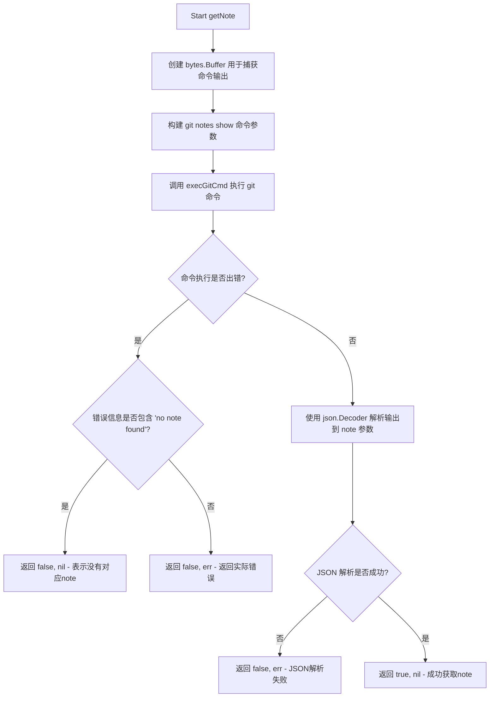

#### 带注释源码

```go
// getNote 获取指定修订版的 Git note
// 参数:
//   - ctx: 上下文对象，用于控制命令超时和取消
//   - workingDir: Git 仓库的工作目录
//   - notesRef: Git notes 的引用路径（如 "refs/notes/commits"）
//   - rev: 要获取 note 的修订版本（commit hash）
//   - note: 用于接收 JSON 解析结果的接口指针
//
// 返回值:
//   - ok: 是否成功获取到 note
//   - err: 执行过程中的错误信息
func getNote(ctx context.Context, workingDir, notesRef, rev string, note interface{}) (ok bool, err error) {
    // 1. 创建缓冲区用于捕获 git 命令的标准输出
    out := &bytes.Buffer{}
    
    // 2. 构建 git notes show 命令参数
    // 格式: git notes --ref <notesRef> show <rev>
    args := []string{"notes", "--ref", notesRef, "show", rev}
    
    // 3. 执行 git 命令，指定工作目录和输出目标
    if err := execGitCmd(ctx, args, gitCmdConfig{dir: workingDir, out: out}); err != nil {
        // 4. 处理错误：检查是否是"未找到 note"的情况
        // Git 在未找到 note 时会返回 "no note found for object" 错误
        if strings.Contains(strings.ToLower(err.Error()), "no note found for object") {
            // 这种情况下视为正常情况，返回 false, nil
            return false, nil
        }
        // 其他错误需要向上层报告
        return false, err
    }
    
    // 5. 成功执行命令后，将输出的 JSON 数据解析到 note 参数中
    // note 需要是一个指针类型，以便 json.Decoder 能够修改其内容
    if err := json.NewDecoder(out).Decode(note); err != nil {
        return false, err
    }
    
    // 6. 成功获取并解析 note，返回 true 表示成功
    return true, nil
}
```


### `noteRevList`

获取指定Git notes引用下所有带有note的修订版本列表，并返回一个以提交哈希为键的映射集合。

参数：

- `ctx`：`context.Context`，上下文对象，用于控制命令执行和传递取消信号
- `workingDir`：`string`，Git仓库的工作目录路径
- `notesRef`：`string`，Git notes的引用名称（如"commits"、"foo"等）

返回值：`map[string]struct{}`，返回包含所有有note的修订版本的映射，键为提交哈希，值为空结构体；`error`，如果执行git命令失败则返回错误信息

#### 流程图

```mermaid
flowchart TD
    A[开始 noteRevList] --> B[创建 bytes.Buffer 用于捕获输出]
    B --> C[构建 git notes --ref {notesRef} list 命令参数]
    C --> D[调用 execGitCmd 执行 git 命令]
    D --> E{命令执行是否成功?}
    E -->|是| F[调用 splitList 解析输出为行列表]
    E -->|否| G[返回 nil 和错误信息]
    F --> H[创建结果 map, 容量为 noteList 长度]
    H --> I{遍历 noteList 中的每一行}
    I -->|行不为空| J[使用 strings.Fields 分割行]
    J --> K{分割结果长度 > 0?}
    K -->|是| L[取 split[1] 作为提交哈希]
    L --> M[将提交哈希存入 result map]
    M --> I
    K -->|否| I
    I -->|遍历完成| N[返回 result map 和 nil]
    I -->|行为空| I
```

#### 带注释源码

```go
// noteRevList 获取所有带有指定notes引用的修订版本列表
// 参数：
//   - ctx: 上下文，用于控制命令执行和超时
//   - workingDir: Git仓库的工作目录
//   - notesRef: Git notes的引用名称
//
// 返回值：
//   - map[string]struct{}: 包含所有有note的提交哈希的映射
//   - error: 执行过程中的错误信息
func noteRevList(ctx context.Context, workingDir, notesRef string) (map[string]struct{}, error) {
	// 创建缓冲区用于捕获git命令的标准输出
	out := &bytes.Buffer{}
	
	// 构建git notes list命令参数
	// 格式: git notes --ref <notesRef> list
	// 该命令会列出所有指定notes引用下的所有note条目
	args := []string{"notes", "--ref", notesRef, "list"}
	
	// 执行git命令，将输出重定向到缓冲区
	if err := execGitCmd(ctx, args, gitCmdConfig{dir: workingDir, out: out}); err != nil {
		// 如果命令执行失败，直接返回错误
		return nil, err
	}
	
	// 解析输出，每行一个条目
	// 输出格式通常为: "<commit-hash>\t<note-message-ref>"
	noteList := splitList(out.String())
	
	// 创建结果映射，预先分配内存以提高性能
	result := make(map[string]struct{}, len(noteList))
	
	// 遍历每一行，提取提交哈希
	for _, l := range noteList {
		// 使用空格分割行，获取各字段
		split := strings.Fields(l)
		
		// 确保分割结果至少有2个字段
		// split[0] 通常是提交哈希，split[1] 是其他信息
		if len(split) > 0 {
			// 取第一个字段作为提交哈希（commit id）
			// 注意：原代码实际取的是 split[1]，这里需要根据输出格式确认
			// 实际上 git notes list 的输出格式是: "<sha1>\t<note ref>"
			// 所以 split[0] 是 sha1，split[1] 是 note ref
			result[split[1]] = struct{}{} // First field contains the object ref (commit id in our case)
		}
	}
	
	// 返回结果映射和空错误
	return result, nil
}
```


### `refRevision`

获取指定 Git 引用（ref）对应的完整提交哈希值（commit hash）。该函数通过执行 `git rev-list --max-count=1 <ref> --` 命令，将给定的短引用（如分支名、标签名）解析为完整的 40 位 SHA-1 提交哈希。

参数：

- `ctx`：`context.Context`，Go 语言上下文，用于控制命令执行的超时和取消
- `workingDir`：`string`，Git 仓库的工作目录路径
- `ref`：`string`，Git 引用，可以是分支名、标签名、HEAD、提交哈希等

返回值：

- `string`：返回引用的完整 40 位 SHA-1 提交哈希值
- `error`：如果 git 命令执行失败，返回错误信息

#### 流程图

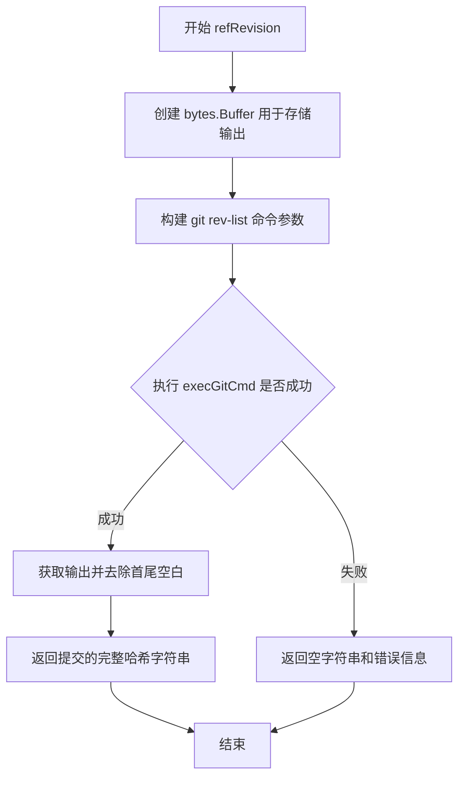

#### 带注释源码

```go
// Get the commit hash for a reference
// 获取指定引用对应的提交哈希
func refRevision(ctx context.Context, workingDir, ref string) (string, error) {
    // 创建缓冲区用于捕获 git 命令的标准输出
    out := &bytes.Buffer{}
    
    // 构建 git rev-list 命令参数
    // --max-count 1: 限制只返回一条结果（即最新的提交）
    // ref: 要查询的 Git 引用（分支名、标签名等）
    // --: 标记路径规范的结束，防止路径参数被误解释
    args := []string{"rev-list", "--max-count", "1", ref, "--"}
    
    // 执行 git 命令并捕获输出到缓冲区
    if err := execGitCmd(ctx, args, gitCmdConfig{dir: workingDir, out: out}); err != nil {
        // 如果命令执行失败，返回空字符串和错误
        return "", err
    }
    
    // 成功执行后，返回去除首尾空白后的提交哈希字符串
    return strings.TrimSpace(out.String()), nil
}
```


### `onelinelog`

该函数用于获取 Git 仓库中指定引用（refspec）的提交日志记录，以特定的简洁格式（包含 GPG 密钥、签名状态、提交哈希和提交信息）返回一系列提交对象。

参数：

- `ctx`：`context.Context`，用于控制函数执行的上下文，如超时和取消
- `workingDir`：`string`，Git 仓库的工作目录路径
- `refspec`：`string`，Git 引用规范，指定要查询的分支、标签或提交范围
- `subdirs`：`[]string`，可选的子目录列表，用于限制只查询特定子目录下的提交
- `firstParent`：`bool`，如果为 true，则只沿第一个父提交链追溯，用于获取合并提交的主线历史

返回值：`([]Commit, error)`，返回解析后的提交对象切片和可能的错误信息

#### 流程图

```mermaid
flowchart TD
    A[开始 onelinelog] --> B[创建 bytes.Buffer 用于输出]
    B --> C[构建 git log 命令基础参数]
    C --> D{firstParent 是否为 true?}
    D -->|是| E[追加 --first-parent 参数]
    D -->|否| F
    E --> F
    F --> G[追加 refspec 和 --]
    G --> H{subdirs 是否有内容?}
    H -->|是| I[追加 subdirs 到命令参数]
    H -->|否| J
    I --> J
    J --> K[执行 execGitCmd 运行 git log]
    K --> L{执行是否出错?}
    L -->|是| M[返回 nil 和错误]
    L -->|否| N[调用 splitLog 解析输出]
    N --> O[返回 []Commit 和 nil]
```

#### 带注释源码

```go
// onelinelog 返回指定引用规范的提交历史，以单行格式呈现
// 参数：
//   - ctx: 上下文，用于控制命令执行超时或取消
//   - workingDir: Git 仓库的工作目录
//   - refspec: Git 引用规范，如分支名、标签名或提交哈希
//   - subdirs: 可选的子目录列表，用于限制查询范围
//   - firstParent: 是否只沿第一个父提交追溯（用于获取主线历史）
//
// 返回值：
//   - []Commit: 提交对象切片，包含签名、版本和消息信息
//   - error: 执行过程中的错误信息
func onelinelog(ctx context.Context, workingDir, refspec string, subdirs []string, firstParent bool) ([]Commit, error) {
	// 创建缓冲区用于捕获 git 命令的标准输出
	out := &bytes.Buffer{}
	
	// 构建 git log 命令的基础参数
	// 格式说明：
	//   %GK - 提交者的 GPG 密钥 ID
	//   %G? - GPG 签名状态（"G" 表示有效签名，"B" 表示坏签名，"U" 表示未验证等）
	//   %H - 提交的完整哈希值
	//   %s - 提交的标题行（Subject）
	args := []string{"log", "--pretty=format:%GK|%G?|%H|%s"}

	// 如果需要只获取第一个父提交的链（即主线历史），添加 --first-parent 参数
	// 这在查看功能分支从主分支分离后的修改时特别有用
	if firstParent {
		args = append(args, "--first-parent")
	}

	// 添加引用规范和路径分隔符
	args = append(args, refspec, "--")

	// 如果指定了子目录，则添加到命令参数中
	// 这允许只获取特定目录/文件的历史记录
	if len(subdirs) > 0 {
		args = append(args, subdirs...)
	}

	// 执行 git 命令，将输出写入缓冲区
	if err := execGitCmd(ctx, args, gitCmdConfig{dir: workingDir, out: out}); err != nil {
		// 如果命令执行失败，返回 nil 和错误信息
		return nil, err
	}

	// 解析命令输出，将其转换为 Commit 对象切片
	return splitLog(out.String())
}
```


### `splitLog`

该函数用于将 Git 日志输出（包含签名、状态、提交哈希和提交信息的字符串）解析为 `Commit` 结构体切片。

参数：

-  `s`：`string`，需要解析的 Git 日志字符串，格式为 `Key|Status|Revision|Message`，每条记录以换行符分隔

返回值：`([]Commit, error)`，返回解析后的提交列表，错误始终为 `nil`（当前实现未做错误处理）

#### 流程图

```mermaid
flowchart TD
    A[开始 splitLog] --> B[调用 splitList 分割字符串]
    B --> C[创建 Commit 切片]
    C --> D{遍历每一行}
    D -->|是| E[用 '|' 分割行, 最多4段]
    E --> F[提取 parts[0] 作为 Signature.Key]
    F --> G[提取 parts[1] 作为 Signature.Status]
    G --> H[提取 parts[2] 作为 Revision]
    H --> I[提取 parts[3] 作为 Message]
    I --> D
    D -->|否| J[返回 commits 切片和 nil]
    J --> K[结束]
```

#### 带注释源码

```go
// splitLog 将 Git 日志输出字符串解析为 Commit 结构体切片
// 输入格式: 每行一条记录，字段以 | 分隔，格式为 Key|Status|Revision|Message
func splitLog(s string) ([]Commit, error) {
	// 使用 splitList 函数将输入字符串按换行符分割成行切片
	lines := splitList(s)
	
	// 创建一个与行数相同长度的 Commit 切片
	commits := make([]Commit, len(lines))
	
	// 遍历每一行日志记录
	for i, m := range lines {
		// 使用 SplitN 分割字符串，限制最多分割为4个部分
		// parts[0]: 签名密钥 Key
		// parts[1]: 签名状态 Status
		// parts[2]: 提交哈希 Revision
		// parts[3]: 提交信息 Message
		parts := strings.SplitN(m, "|", 4)
		
		// 为当前 Commit 结构体的 Signature 字段赋值
		commits[i].Signature = Signature{
			Key:    parts[0],    // 签名密钥
			Status: parts[1],   // 签名状态（如 G 表示有效签名，U 表示未验证等）
		}
		
		// 设置提交哈希
		commits[i].Revision = parts[2]
		
		// 设置提交信息
		commits[i].Message = parts[3]
	}
	
	// 返回解析后的提交切片，错误为 nil
	return commits, nil
}
```


### `splitList`

该函数用于将字符串按换行符分割成字符串切片，同时处理空字符串和末尾换行符的情况。

参数：

-  `s`：`string`，需要分割的字符串

返回值：`[]string`，分割后的字符串切片

#### 流程图

```mermaid
flowchart TD
    A[开始] --> B{字符串s是否为空或仅包含空白字符}
    B -->|是| C[返回空切片]
    B -->|否| D[去除字符串末尾的换行符]
    D --> E[按换行符分割字符串]
    E --> F[返回分割后的切片]
    C --> G[结束]
    F --> G
```

#### 带注释源码

```go
// splitList 将字符串按换行符分割成字符串切片
// 参数 s: 待分割的字符串
// 返回值: 分割后的字符串切片
func splitList(s string) []string {
	// 检查字符串是否为空或仅包含空白字符
	if strings.TrimSpace(s) == "" {
		// 如果为空，返回空切片
		return []string{}
	}
	// 去除字符串末尾的换行符
	outStr := strings.TrimSuffix(s, "\n")
	// 按换行符分割字符串并返回
	return strings.Split(outStr, "\n")
}
```


### moveTagAndPush

该函数用于将 Git 标签移动（或创建）到指定的提交修订版（Revision），并强制推送到上游仓库。如果提供了 GPG 签名密钥，还会对该标签进行签名。

参数：

- `ctx`：`context.Context`，Go 语言标准库的上下文，用于控制命令执行的超时和取消。
- `workingDir`：`string`，本地 Git 仓库的工作目录路径。
- `upstream`：`string`，目标远程仓库的名称（如 `origin`）或 URL，标签将被推送到此地址。
- `action`：`TagAction`，一个包含标签操作详细信息的结构体。其字段包括：
    - `Tag`：要创建或移动到的标签名称。
    - `Revision`：标签所指向的提交哈希或引用（如 `HEAD`、`v1.0.0`）。
    - `Message`：标签的注释信息。
    - `SigningKey`：（可选）用于 GPG 签名的密钥 ID。

返回值：`error`，如果标签的创建（移动）或推送过程中发生任何错误，则返回包含详细错误信息的 `error` 对象；操作成功则返回 `nil`。

#### 流程图

```mermaid
graph TD
    A[开始] --> B[构建 git tag 命令参数]
    B --> C{检查 action.SigningKey 是否存在}
    C -->|是| D[添加 --local-user 参数以支持 GPG 签名]
    C -->|否| E[跳过添加签名步骤]
    D --> F[拼接标签名 action.Tag 和目标修订版 action.Revision]
    E --> F
    F --> G[执行本地 git tag 命令]
    G --> H{命令执行成功?}
    H -->|否| I[返回错误: moving tag]
    H -->|是| J[构建 git push 命令参数]
    J --> K[执行 git push --force 推送到上游]
    K --> L{命令执行成功?}
    L -->|否| M[返回错误: pushing tag to origin]
    L -->|是| N[返回 nil, 操作完成]
```

#### 带注释源码

```go
// moveTagAndPush 将标签移动到指定的 ref 并将其推送到上游。
// 它使用 --force 参数来强制覆盖已存在的标签。
func moveTagAndPush(ctx context.Context, workingDir, upstream string, action TagAction) error {
	// 初始化 git tag 命令的基础参数：
	// --force: 强制更新已存在的标签
	// -a: 创建一个带注解的标签
	// -m: 指定标签的消息
	args := []string{"tag", "--force", "-a", "-m", action.Message}
	
	// 初始化环境变量切片，目前为空，用于后续扩展或传递特定环境变量
	var env []string
	
	// 如果提供了 GPG 签名密钥，则添加 --local-user 参数
	if action.SigningKey != "" {
		args = append(args, fmt.Sprintf("--local-user=%s", action.SigningKey))
	}
	
	// 追加标签名称和目标修订版（commit hash 或 ref）
	args = append(args, action.Tag, action.Revision)
	
	// 执行本地标签创建/移动命令
	if err := execGitCmd(ctx, args, gitCmdConfig{dir: workingDir, env: env}); err != nil {
		// 封装错误信息并返回
		return errors.Wrap(err, "moving tag "+action.Tag)
	}
	
	// 准备推送命令：强制推送该标签到上游仓库
	args = []string{"push", "--force", upstream, "tag", action.Tag}
	
	// 执行推送命令
	if err := execGitCmd(ctx, args, gitCmdConfig{dir: workingDir}); err != nil {
		return errors.Wrap(err, "pushing tag to origin")
	}
	
	// 成功完成，返回 nil
	return nil
}
```


### `verifyTag`

验证 Git 标签签名并返回该标签指向的对象哈希（提交 SHA）。

参数：

- `ctx`：`context.Context`，Context 对象，用于控制函数的超时和取消
- `workingDir`：`string`，Git 仓库的工作目录路径
- `tag`：`string`，要验证的 Git 标签名称

返回值：`string`，返回标签指向的对象哈希；`error`，如果验证失败，返回包含错误详情的 error 对象

#### 流程图

```mermaid
flowchart TD
    A[开始 verifyTag] --> B[创建 bytes.Buffer 用于存储输出]
    B --> C[构建 git verify-tag 命令参数]
    C --> D[调用 execGitCmd 执行 git 命令]
    D --> E{命令执行是否成功?}
    E -->|是| F[获取输出并去除空白字符]
    F --> G[返回标签对象哈希]
    E -->|否| H[返回空字符串和包装后的错误]
    G --> I[结束]
    H --> I
```

#### 带注释源码

```go
// Verify tag signature and return the revision it points to
// 验证 Git 标签签名并返回该标签指向的对象哈希
func verifyTag(ctx context.Context, workingDir, tag string) (string, error) {
	// 创建缓冲区用于捕获 git 命令的输出
	out := &bytes.Buffer{}
	// 构建 git verify-tag 命令参数，使用 %(object) 格式获取标签指向的对象 SHA
	args := []string{"verify-tag", "--format", "%(object)", tag}
	// 执行 git 命令，传入工作目录和输出缓冲区
	if err := execGitCmd(ctx, args, gitCmdConfig{dir: workingDir, out: out}); err != nil {
		// 如果执行失败，返回空字符串和包含标签名的错误信息
		return "", errors.Wrap(err, "verifying tag "+tag)
	}
	// 执行成功，返回去除首尾空白后的对象哈希字符串
	return strings.TrimSpace(out.String()), nil
}
```


### `verifyCommit`

该函数用于验证 Git 提交的数字签名，通过调用 `git verify-commit` 命令检查指定提交的 GPG 签名是否有效。

参数：

- `ctx`：`context.Context`，用于控制命令执行的上下文，支持超时和取消
- `workingDir`：`string`，Git 仓库的工作目录路径
- `commit`：`string`，要验证的提交引用（可以是完整哈希、标签或分支名）

返回值：`error`，如果签名验证失败返回错误信息，否则返回 nil

#### 流程图

```mermaid
flowchart TD
    A[开始 verifyCommit] --> B[构建 git verify-commit 命令参数]
    B --> C[调用 execGitCmd 执行验证]
    C --> D{执行是否成功?}
    D -->|是| E[返回 nil]
    D -->|否| F[返回格式化错误信息]
    E --> G[结束]
    F --> G
```

#### 带注释源码

```go
// Verify commit signature
// 用于验证 Git 提交的 GPG 签名是否有效
func verifyCommit(ctx context.Context, workingDir, commit string) error {
	// 构建 git verify-commit 命令参数，只包含要验证的 commit 引用
	args := []string{"verify-commit", commit}
	
	// 执行 git 命令，传入上下文、工作目录配置
	if err := execGitCmd(ctx, args, gitCmdConfig{dir: workingDir}); err != nil {
		// 如果验证失败，返回格式化的错误信息，包含具体的 commit 标识
		return fmt.Errorf("failed to verify commit %s", commit)
	}
	
	// 验证成功，返回 nil 表示没有错误
	return nil
}
```


### `changed`

该函数用于获取 Git 仓库中指定引用（ref）相对于当前工作目录的变更文件列表，支持通过子路径进行过滤，只返回添加、修改、合并、重命名或类型变更的文件。

参数：

- `ctx`：`context.Context`，用于控制命令执行的超时和取消
- `workingDir`：`string`，Git 仓库的工作目录路径
- `ref`：`string`，Git 引用（如分支名、标签名、提交哈希等），用于比较变更
- `subPaths`：`[]string`，可选的子路径列表，用于限定只检查特定目录或文件的变更

返回值：`([]string, error)`，返回变更文件路径列表（切片），如果执行失败则返回错误

#### 流程图

```mermaid
flowchart TD
    A[开始 changed] --> B[创建 bytes.Buffer 用于存储输出]
    B --> C[构建基础 git diff 命令<br/>--name-only --diff-filter=ACMRT ref]
    C --> D[添加 "--" 分隔符]
    D --> E{检查 subPaths 是否为空?}
    E -->|是| F[跳过添加子路径]
    E -->|否| G[将 subPaths 追加到命令参数]
    F --> H[调用 execGitCmd 执行 git 命令]
    G --> H
    H --> I{执行是否成功?}
    I -->|否| J[返回 nil 和错误]
    I -->|是| K[调用 splitList 解析输出]
    K --> L[返回文件列表]
```

#### 带注释源码

```go
// changed 用于获取指定引用相对于工作目录的变更文件列表
// 参数：
//   - ctx: 上下文，用于控制超时和取消
//   - workingDir: Git 仓库的工作目录
//   - ref: Git 引用（分支名、标签名或提交哈希）
//   - subPaths: 可选的子路径列表，用于限定检查范围
// 返回值：
//   - []string: 变更文件的路径列表
//   - error: 执行过程中的错误信息
func changed(ctx context.Context, workingDir, ref string, subPaths []string) ([]string, error) {
	// 创建缓冲区用于捕获 git 命令的标准输出
	out := &bytes.Buffer{}
	
	// 构建 git diff 命令参数
	// --name-only: 只输出文件名
	// --diff-filter=ACMRT: 只包含以下类型的变更：
	//   A = Added（添加）
	//   C = Copied（复制）
	//   M = Modified（修改）
	//   R = Renamed（重命名）
	//   T = Type-changed（类型变更）
	// 注意：这只会报告当前工作目录中仍然存在的文件变更
	args := []string{"diff", "--name-only", "--diff-filter=ACMRT", ref}
	
	// 添加路径分隔符，用于区分 diff 的引用和后续的路径参数
	args = append(args, "--")
	
	// 如果指定了子路径，则只检查这些路径下的变更
	if len(subPaths) > 0 {
		args = append(args, subPaths...)
	}

	// 执行 git diff 命令
	if err := execGitCmd(ctx, args, gitCmdConfig{dir: workingDir, out: out}); err != nil {
		// 命令执行失败，返回错误
		return nil, err
	}
	
	// 解析命令输出，将换行符分隔的字符串转换为切片返回
	return splitList(out.String()), nil
}
```


### `traceGitCommand`

该函数用于生成调试和开发过程中的 git 活动日志，当 tracing 开启时会被调用。它会检查命令是否在豁免列表中，如果不在则生成格式化的追踪日志字符串。

参数：

- `args`：`[]string`，git 命令的参数列表（如 `["clone", "--branch", "main", "repoURL"]`）
- `config`：`gitCmdConfig`，git 命令的执行配置，包含工作目录（`dir`）和环境变量（`env`）
- `stdOutAndStdErr`：`string`，git 命令执行后的标准输出和标准错误合并后的内容

返回值：`string`，返回格式化的追踪日志字符串，格式为 `"TRACE: command=%q out=%q dir=%q env=%q"`，如果命令在豁免列表中则返回空字符串

#### 流程图

```mermaid
flowchart TD
    A[开始 traceGitCommand] --> B{args[0] 是否在<br>exemptedTraceCommands 中?}
    B -->|是| C[返回空字符串]
    B -->|否| D[定义内部函数 prepare]
    D --> E[调用 prepare 处理 stdOutAndStdErr]
    E --> F[构建 git 命令字符串: 'git ' + join(args, ' ')]
    F --> G[格式化输出日志]
    G --> H[返回日志字符串]
```

#### 带注释源码

```go
// traceGitCommand returns a log line that can be useful when debugging and developing git activity
func traceGitCommand(args []string, config gitCmdConfig, stdOutAndStdErr string) string {
	// 遍历豁免命令列表，如果当前命令在豁免列表中则直接返回空字符串
	// 这样可以在 tracing 开启时过滤掉某些不需要追踪的 git 子命令
	for _, exemptedCommand := range exemptedTraceCommands {
		if exemptedCommand == args[0] {
			return ""
		}
	}

	// 内部函数：清理和格式化输出字符串
	// 1. 去除首尾的空字符(\x00)
	// 2. 去除尾部的换行符
	// 3. 将换行符替换为转义的 \n，便于日志查看
	prepare := func(input string) string {
		output := strings.Trim(input, "\x00")
		output = strings.TrimSuffix(output, "\n")
		output = strings.Replace(output, "\n", "\\n", -1)
		return output
	}

	// 拼接完整的 git 命令字符串，格式为 "git <子命令> <参数1> <参数2> ..."
	command := `git ` + strings.Join(args, " ")
	// 处理标准输出和标准错误内容
	out := prepare(stdOutAndStdErr)

	// 返回格式化的追踪日志，包含：
	// - command: 完整的 git 命令
	// - out: 处理后的输出内容
	// - dir: 执行目录
	// - env: 环境变量列表（逗号分隔）
	return fmt.Sprintf(
		"TRACE: command=%q out=%q dir=%q env=%q",
		command,
		out,
		config.dir,
		strings.Join(config.env, ","),
	)
}
```


### `execGitCmd`

该函数是 Git 操作的核心执行器，通过 `exec.CommandContext` 调用系统 git 命令，支持配置工作目录、环境变量和输出流，并处理错误信息和上下文超时/取消情况。

参数：

- `ctx`：`context.Context`，用于控制命令执行的上下文，如超时和取消
- `args`：`[]string`，要执行的 git 命令参数列表（如 `["clone", "url", "path"]`）
- `config`：`gitCmdConfig`，包含 git 命令的执行配置（工作目录、环境变量、输出流等）

返回值：`error`，执行过程中的错误信息，如果没有错误则返回 nil

#### 流程图

```mermaid
flowchart TD
    A[开始执行 execGitCmd] --> B[创建 exec.CommandContext]
    B --> C{config.dir 是否为空}
    C -->|否| D[设置命令工作目录为 config.dir]
    C -->|是| E[跳过设置工作目录]
    D --> F[合并环境变量 env 和 config.env]
    E --> F
    F --> G[创建 threadSafeBuffer 用于捕获输出]
    G --> H[设置 Stdout 和 Stderr 为 threadSafeBuffer]
    H --> I{config.out 是否为 nil}
    I -->|否| J[添加 MultiWriter 同时输出到 config.out]
    I --> |是| K[跳过添加 MultiWriter]
    J --> K
    K --> L[执行命令 c.Run]
    L --> M{命令执行是否有错误}
    M -->|是| N[检查输出是否有内容]
    M -->|否| O[跳过错误处理]
    N --> P[从输出中查找错误信息]
    P --> Q{找到具体错误信息}
    Q -->|是| R[构建格式化错误消息]
    Q -->|否| S[使用原始输出作为错误]
    R --> T
    S --> T
    O --> T
    T{trace 是否为 true}
    T -->|是| U[调用 traceGitCommand 记录日志]
    T -->|否| V[跳过日志记录]
    U --> V
    V --> W{ctx.Err 是否为 DeadlineExceeded}
    W -->|是| X[返回带超时的错误包装]
    W -->|否| Y{ctx.Err 是否为 Canceled}
    Y -->|是| Z[返回带取消的错误包装]
    Y -->|否| AA[返回原始错误]
    X --> AB[结束]
    Z --> AB
    AA --> AB
```

#### 带注释源码

```go
// execGitCmd runs a `git` command with the supplied arguments.
// 执行一个 git 命令，接收上下文、命令参数和配置
func execGitCmd(ctx context.Context, args []string, config gitCmdConfig) error {
	// 使用 context 创建 git 命令，args 包含 git 子命令和参数
	c := exec.CommandContext(ctx, "git", args...)

	// 如果配置中指定了工作目录，则设置命令的执行目录
	if config.dir != "" {
		c.Dir = config.dir
	}
	
	// 合并默认环境变量（禁止 GIT_TERMINAL_PROMPT）和自定义环境变量
	c.Env = append(env(), config.env...)
	
	// 创建线程安全的缓冲区用于捕获标准输出和标准错误
	stdOutAndStdErr := &threadSafeBuffer{}
	
	// 将标准输出和标准错误都重定向到 threadSafeBuffer
	c.Stdout = stdOutAndStdErr
	c.Stderr = stdOutAndStdErr
	
	// 如果配置中指定了额外的输出流，则使用 MultiWriter 组合输出
	if config.out != nil {
		c.Stdout = io.MultiWriter(c.Stdout, config.out)
	}

	// 执行命令并捕获错误
	err := c.Run()
	
	// 如果命令执行失败，处理错误信息
	if err != nil {
		// 检查是否有捕获的输出内容
		if len(stdOutAndStdErr.Bytes()) > 0 {
			// 将输出转换为错误
			err = errors.New(stdOutAndStdErr.String())
			// 尝试从输出中查找更友好的错误信息
			msg := findErrorMessage(stdOutAndStdErr)
			if msg != "" {
				// 将友好错误信息和完整输出组合
				err = fmt.Errorf("%s, full output:\n %s", msg, err.Error())
			}
		}
	}

	// 如果开启了跟踪模式，记录命令执行信息
	if trace {
		if traceCommand := traceGitCommand(args, config, stdOutAndStdErr.String()); traceCommand != "" {
			println(traceCommand)
		}
	}

	// 检查上下文是否超时或被取消，并返回包装后的错误
	if ctx.Err() == context.DeadlineExceeded {
		return errors.Wrap(ctx.Err(), fmt.Sprintf("running git command: %s %v", "git", args))
	} else if ctx.Err() == context.Canceled {
		return errors.Wrap(ctx.Err(), fmt.Sprintf("context was unexpectedly cancelled when running git command: %s %v", "git", args))
	}
	
	// 返回执行结果（可能是 nil 或错误）
	return err
}
```


### `env`

该函数用于构建 git 命令执行所需的环境变量集合，初始化包含 `GIT_TERMINAL_PROMPT=0` 以禁用交互式提示，并从操作系统环境中继承一组预定义的安全环境变量。

参数：无

返回值：`[]string`，返回构建后的环境变量切片，包含禁用 git 终端提示的配置以及从操作系统继承的允许环境变量（如代理配置、GPG 路径、云 SDK 配置等）

#### 流程图

```mermaid
flowchart TD
    A[开始 env] --> B[创建初始环境变量切片<br/>env = ['GIT_TERMINAL_PROMPT=0']]
    B --> C{遍历 allowedEnvVars}
    C -->|迭代| D[调用 os.LookupEnv 检查环境变量是否存在]
    D --> E{环境变量是否存在?}
    E -->|是| F[将环境变量 k=v 添加到 env 切片]
    F --> C
    E -->|否| C
    C -->|遍历完成| G[返回 env 切片]
    G --> H[结束]

    style A fill:#f9f,stroke:#333
    style G fill:#9f9,stroke:#333
    style H fill:#9f9,stroke:#333
```

#### 带注释源码

```go
// env 构建并返回用于 git 命令执行的环境变量切片
// 该函数确保 git 运行时使用一致的环境配置，并允许继承部分系统环境变量
func env() []string {
	// 初始化环境变量切片，包含禁用 git 交互式终端提示的配置
	// 这可以防止 git 在需要凭据时阻塞等待用户输入
	env := []string{"GIT_TERMINAL_PROMPT=0"}

	// 遍历预定义的允许环境变量列表，从操作系统环境继承这些变量
	// 这些变量包括：代理设置、GPG 配置、云 SDK 路径、AWS 临时凭据等
	for _, k := range allowedEnvVars {
		// 从操作系统环境中查找指定的环境变量
		if v, ok := os.LookupEnv(k); ok {
			// 如果环境变量存在，格式化为 k=v 并添加到环境变量切片
			env = append(env, k+"="+v)
		}
	}

	// 返回包含所有配置的环境变量切片，供 execGitCmd 使用
	return env
}
```


### `check`

该函数用于检查 Git 仓库中是否存在本地修改。它通过执行 `git diff --quiet` 命令来判断工作目录（或指定子目录）相对于 HEAD 或当前状态是否有未提交的更改。

参数：

- `ctx`：`context.Context`，用于控制命令执行的上下文（如超时、取消）。
- `workingDir`：`string`，Git 仓库的工作目录路径。
- `subdirs`：`[]string`，可选的子目录列表。当 `checkFullRepo` 为 false 时，仅检查这些子目录是否有变化。
- `checkFullRepo`：`bool`，是否进行完整仓库检查。如果为 true，则比较 HEAD 与当前工作目录的差异；如果为 false，则仅检查工作目录中未暂存的修改。

返回值：`bool`，如果存在本地更改则返回 `true`，否则返回 `false`。

#### 流程图

```mermaid
graph TD
    A[开始] --> B[构建 git diff --quiet 命令参数]
    B --> C{checkFullRepo?}
    C -- true --> D[添加参数 HEAD --]
    C -- false --> E[添加参数 --]
    E --> F{len(subdirs) > 0?}
    F -- true --> G[添加 subdirs 参数]
    F -- false --> H[执行 execGitCmd]
    D --> H
    G --> H
    H --> I{execGitCmd 返回 error?}
    I -- 是 (有更改) --> J[返回 true]
    I -- 否 (无更改) --> K[返回 false]
```

#### 带注释源码

```go
// check returns true if there are any local changes.
func check(ctx context.Context, workingDir string, subdirs []string, checkFullRepo bool) bool {
	// `--quiet` 参数使 git diff 在没有差异时返回 0，有差异时返回 1。
	args := []string{"diff", "--quiet"}

	if checkFullRepo {
		// 如果需要检查完整仓库，则比较 HEAD 提交与工作目录
		args = append(args, "HEAD", "--")
	} else {
		// 否则仅检查工作目录中的文件
		args = append(args, "--")
		if len(subdirs) > 0 {
			// 如果指定了子目录，则只检查这些子目录
			args = append(args, subdirs...)
		}
	}

	// 执行 git 命令。git diff --quiet 在有变化时返回非 0 退出码，
	// Go 的 exec.Command.Run 会将非 0 退出码视为 error。
	// 因此如果有变化，execGitCmd 会返回 error，导致 check 返回 true。
	return execGitCmd(ctx, args, gitCmdConfig{dir: workingDir}) != nil
}
```


### `findErrorMessage`

该函数用于从 Git 命令输出中解析并提取错误消息，通过扫描输出流查找以 "fatal:" 或 "error:" 开头的行，返回第一个匹配的错误文本，若未找到则返回空字符串。

参数：

- `output`：`io.Reader`，需要解析的 Git 命令输出流

返回值：`string`，提取到的错误消息文本，若无错误则为空字符串

#### 流程图

```mermaid
flowchart TD
    A[开始] --> B[创建 bufio.Scanner]
    B --> C{Scanner 是否有下一行}
    C -->|否| D[返回空字符串]
    C -->|是| E{检查行前缀}
    E -->|fatal: | F[返回原始行文本]
    E -->|ERROR fatal: | G[返回原始行文本]
    E -->|error: | H[返回去除前缀的文本]
    E -->|其他| C
    F --> I[结束]
    G --> I
    H --> I
```

#### 带注释源码

```go
// findErrorMessage 从给定的 io.Reader 中解析错误消息
// 它会扫描每一行，查找以特定前缀开始的错误信息
// 参数:
//   - output: io.Reader类型的输出流，通常是Git命令的标准错误或标准输出
//
// 返回值:
//   - string: 找到的第一个错误消息，如果未找到则返回空字符串
func findErrorMessage(output io.Reader) string {
	// 创建Scanner用于逐行读取输出
	sc := bufio.NewScanner(output)
	
	// 遍历输出中的每一行
	for sc.Scan() {
		switch {
		// 检查是否以 "fatal: " 开头（Git标准错误格式）
		case strings.HasPrefix(sc.Text(), "fatal: "):
			return sc.Text()
			
		// 检查是否以 "ERROR fatal: " 开头（Ubuntu系统上的变体）
		case strings.HasPrefix(sc.Text(), "ERROR fatal: "): // Saw this error on ubuntu systems
			return sc.Text()
			
		// 检查是否以 "error:" 开头，如果是则去除前缀
		case strings.HasPrefix(sc.Text(), "error:"):
			// 去除 "error: " 前缀并返回，更清晰的错误信息
			return strings.TrimPrefix(sc.Text(), "error: ")
		}
	}
	
	// 未找到任何错误消息，返回空字符串
	return ""
}
```


### `threadSafeBuffer.Write`

该方法是一个线程安全的写入操作，通过互斥锁保护内部的 `bytes.Buffer`，将传入的字节切片写入到缓冲区，并返回写入的字节数或错误信息。

#### 参数

- `p`：`[]byte`，要写入缓冲区的字节数据

#### 返回值

- `n`：`int`，成功写入的字节数
- `err`：`error`，写入过程中发生的错误（来自 `bytes.Buffer.Write`）

#### 流程图

```mermaid
flowchart TD
    A[开始 Write 方法] --> B[获取互斥锁 b.mu.Lock]
    B --> C[调用 b.buf.Write(p 写入数据]
    C --> D{是否出错?}
    D -->|是| E[返回写入字节数 n 和错误 err]
    D -->|否| F[返回写入字节数 n 和 nil 错误]
    E --> G[通过 defer 自动释放互斥锁]
    F --> G
    G[结束]
```

#### 带注释源码

```go
// Write 方法实现了 io.Writer 接口，提供线程安全的写入操作
// 参数 p 是要写入的字节切片
// 返回值 n 表示成功写入的字节数，err 表示可能的错误
func (b *threadSafeBuffer) Write(p []byte) (n int, err error) {
    // 获取互斥锁，确保同一时刻只有一个 goroutine 可以访问内部缓冲区
    b.mu.Lock()
    // 使用 defer 确保函数返回前释放互斥锁，即使发生 panic 也会释放
    defer b.mu.Unlock()
    // 委托给内置的 bytes.Buffer 的 Write 方法执行实际的写入操作
    // bytes.Buffer.Write 会返回写入的字节数和可能的错误
    return b.buf.Write(p)
}
```


### `threadSafeBuffer.Read`

该方法实现了线程安全的字节读取功能，通过互斥锁保护底层缓冲区的并发访问，确保在多协程环境下读取数据时的数据一致性。

参数：

- `p`：`[]byte`，用于存储读取数据的字节切片，方法会将缓冲区中的数据写入到此切片中

返回值：`int, error`，返回实际读取的字节数 n 和可能发生的错误 err

#### 流程图

```mermaid
flowchart TD
    A[开始 Read 方法] --> B[获取互斥锁 b.mu.Lock]
    B --> C[调用底层缓冲区 Read 方法 b.buf.Read]
    C --> D{是否发生错误}
    D -->|是| E[返回读取字节数 n 和错误 err]
    D -->|否| F[返回读取字节数 n 和 nil 错误]
    E --> G[释放互斥锁 b.mu.Unlock]
    F --> G
    G --> H[结束 Read 方法]
```

#### 带注释源码

```go
// Read 方法从线程安全缓冲区中读取数据到给定的字节切片中
// 参数 p 是用于存储读取数据的字节切片
// 返回值 n 表示实际读取的字节数，err 表示可能发生的错误
func (b *threadSafeBuffer) Read(p []byte) (n int, err error) {
	// 获取互斥锁，确保并发安全
	// 在多协程环境下，防止同时读写底层缓冲区导致数据竞争
	b.mu.Lock()
	// 使用 defer 确保即使发生 panic 也会释放锁
	defer b.mu.Unlock()
	// 调用底层 bytes.Buffer 的 Read 方法读取数据
	// bytes.Buffer.Read 会读取缓冲区中的所有数据并清空缓冲区
	return b.buf.Read(p)
}
```


### `threadSafeBuffer.Bytes`

该方法是一个线程安全的字节切片获取方法，通过互斥锁保护内部缓冲区的访问，确保在并发环境下安全地返回缓冲区内容的字节切片。

参数：

- （无显式参数）

返回值：`[]byte`，返回当前缓冲区内容的字节切片拷贝。

#### 流程图

```mermaid
flowchart TD
    A[开始] --> B[获取互斥锁 b.mu.Lock]
    B --> C[调用内部缓冲区 b.buf.Bytes]
    C --> D[释放互斥锁 b.mu.Unlock]
    D --> E[返回字节切片]
    E --> F[结束]
```

#### 带注释源码

```go
// Bytes 返回缓冲区内容的字节切片拷贝
// 该方法通过互斥锁保证线程安全，确保在并发读写时不会出现数据竞争
func (b *threadSafeBuffer) Bytes() []byte {
	b.mu.Lock()              // 获取互斥锁，防止并发访问
	defer b.mu.Unlock()     // 方法结束时自动释放互斥锁
	return b.buf.Bytes()    // 调用内部 bytes.Buffer 的 Bytes 方法返回内容
}
```


### `threadSafeBuffer.String`

这是一个线程安全的方法，用于获取缓冲区内容的字符串表示。该方法通过互斥锁（sync.Mutex）保护对内部缓冲区的并发访问，确保在多线程环境下安全地读取缓冲区内容。

参数：

- （无参数，方法接收者 `b *threadSafeBuffer` 为隐式参数）

返回值：`string`，返回缓冲区内部存储的字符串内容

#### 流程图

```mermaid
flowchart TD
    A[开始] --> B[获取互斥锁 b.mu.Lock]
    B --> C[调用 b.buf.String 获取字符串]
    C --> D[释放互斥锁 b.mu.Unlock]
    D --> E[返回字符串结果]
```

#### 带注释源码

```go
// String 返回缓冲区内容的字符串表示
// 该方法线程安全：通过互斥锁保护对内部缓冲区的访问
func (b *threadSafeBuffer) String() string {
	b.mu.Lock()         // 获取互斥锁，确保并发安全
	defer b.mu.Unlock() // 使用 defer 确保锁一定会被释放
	return b.buf.String() // 调用 bytes.Buffer 的 String 方法返回字符串
}
```

## 关键组件


### gitCmdConfig

用于配置 git 命令执行的结构体，包含工作目录、环境变量和输出 writer。

### execGitCmd

执行 git 命令的核心函数，负责构建和运行 git 子进程，处理错误和上下文。

### clone

克隆远程仓库到本地工作目录，支持指定分支。

### mirror

以镜像模式克隆仓库，创建一个裸仓库副本。

### checkout

检出指定的引用（分支或标签）到工作目录。

### commit

创建 git 提交，支持自定义作者和 GPG 签名。

### push

将本地引用推送到远程仓库。

### fetch

从远程仓库获取更新和标签。

### checkPush

检查对远程仓库的写权限，通过创建临时标签并推送来验证。

### deleteTag

删除远程仓库中的指定标签。

### moveTagAndPush

移动（更新）本地标签并强制推送到远程仓库。

### verifyTag

验证 git 标签的 GPG 签名并返回其指向的对象。

### verifyCommit

验证提交的 GPG 签名。

### config

设置 git 用户名和邮箱配置。

### secretUnseal

执行 git secret reveal 命令解密敏感文件。

### refExists

检查指定的引用是否存在于仓库中。

### refRevision

获取给定引用的完整修订版本（commit hash）。

### getNotesRef

获取指定注释引用的完整路径。

### addNote

为指定提交添加 git notes（注释）。

### getNote

获取指定提交的 git notes 内容。

### noteRevList

列出所有带有指定 notes 引用 的提交。

### onelinelog

获取提交的单行日志信息，包括签名状态和提交消息。

### changed

获取指定引用与工作目录之间的变更文件列表。

### threadSafeBuffer

线程安全的字节缓冲区，用于并发环境下的 I/O 操作。

### env

构建 git 命令的环境变量，包含 GIT_TERMINAL_PROMPT=0 和允许继承的系统环境变量。

### check

检查工作目录是否有未提交的更改。

### findErrorMessage

从 git 命令输出中解析并提取错误信息。


## 问题及建议


### 已知问题

- **splitLog函数数组越界风险**: 当git log输出格式不符合预期时，`strings.SplitN(m, "|", 4)`可能返回少于4个元素，导致访问`parts[3]`时数组越界panic
- **fetch错误判断脆弱性**: 使用`strings.Contains(strings.ToLower(err.Error()), "couldn't find remote ref")`进行错误匹配，这种字符串匹配方式脆弱且依赖git版本输出格式
- **noteRevList解析假设**: 假设每行输出都包含至少两个字段(`split[1]`)，但未验证`len(split) > 1`直接访问可能越界
- **未使用的变量**: `commit`函数中声明了`var env []string`但从未使用该变量
- **context取消处理顺序错误**: 在`execGitCmd`中，ctx错误的检查放在命令执行之后，如果命令成功但context已取消，会错误地返回取消错误
- **threadSafeBuffer的Read方法**: 实现的Read方法与标准库io.Reader接口语义不符（标准Read应返回读取的字节数，而非总是读取全部内容）
- **trace常量与变量混合**: `trace`是const但`exemptedTraceCommands`是var，运行时修改exemptedTraceCommands可能导致并发问题（无锁保护）
- **checkPush的rand.Read错误未包装**: `rand.Read`返回错误直接返回，未使用errors.Wrap包装，调试困难
- **env函数重复计算**: 每次调用execGitCmd都重新构建环境变量切片，allowedEnvVars的os.LookupEnv遍历是O(n)操作

### 优化建议

- **添加输入验证**: 在splitLog、noteRevList等解析函数中添加数组长度检查，防止索引越界
- **统一错误处理模式**: 所有git命令错误都应使用errors.Wrap包装，包括rand.Read等标准库调用
- **优化context处理**: 在命令执行前检查context状态，或使用更精确的错误判断逻辑区分命令失败与context取消
- **缓存环境变量**: 将env()结果缓存或使用sync.Once初始化，减少重复计算
- **移除未使用代码**: 删除commit函数中未使用的env变量声明
- **添加重试机制**: checkPush函数在push失败时可考虑重试，而非直接失败
- **增强错误消息提取**: findErrorMessage可扩展支持更多git错误格式
- **考虑使用git2go**: 对于频繁操作场景，可考虑使用libgit2绑定替代子进程调用，提升性能

## 其它


### 设计目标与约束

该库的设计目标是提供一个轻量级、上下文感知的Git操作封装层，支持在Kubernetes等容器化环境中运行。核心约束包括：1) 仅支持Go标准库的exec.CommandContext执行git命令；2) 通过环境变量控制代理、GPG、SSH等外部依赖；3) 必须支持context超时和取消；4) 线程安全的输出缓冲。

### 错误处理与异常设计

错误处理采用三层策略：1) 底层execGitCmd捕获命令执行失败，解析stderr/stdout提取git错误信息（fatal、error前缀）；2) 中层函数使用errors.Wrap添加上下文（如"git clone"、"git commit"）；3) 上层通过返回具体error类型（如context.DeadlineExceeded、context.Canceled）区分超时和取消。未处理的异常情况包括：git命令未安装、磁盘空间不足、权限问题。

### 数据流与状态机

主要数据流：1) clone/mirror创建本地仓库；2) checkout切换分支；3) add标记文件；4) commit创建提交；5) push推送到远程。无复杂状态机，依赖外部调用方保证操作顺序（如先clone再checkout）。

### 外部依赖与接口契约

外部依赖：1) 系统git可执行文件（通过exec.CommandContext查找）；2) OS环境变量（proxy、GPG、AWS、CLOUDSDK等）；3) git-secret工具（secretUnseal函数）。接口契约：所有函数接受context.Context作为第一个参数；工作目录通过workingDir传递；配置通过gitCmdConfig结构体传递。

### 性能考虑

性能优化点：1) threadSafeBuffer使用sync.Mutex保证并发安全；2) trace命令默认关闭以避免IO开销；3) fetch命令忽略"couldn't find remote ref"错误避免不必要的失败；4) 使用ioutil.TempFile而非内存缓存大提交消息。

### 安全性考虑

安全措施：1) GIT_TERMINAL_PROMPT=0禁用交互式密码输入；2) allowedEnvVars白名单机制限制继承的环境变量；3) checkPush使用随机标签避免并发冲突；4) 支持GPG签名（commitAction.SigningKey、action.SigningKey）。潜在风险：临时文件包含敏感信息（commit message、notes）。

### 并发处理

并发安全：1) threadSafeBuffer实现sync.Mutex保护的字节缓冲；2) execGitCmd中stdout/stderr使用线程安全buffer；3) 全局变量trace和exemptedTraceCommands为只读，可安全并发读取。

### 测试策略

代码中未包含测试文件。建议测试策略：1) 单元测试mock exec.CommandContext；2) 集成测试使用临时git仓库；3) 边界测试（超时、取消、网络错误）。

### 配置管理

配置通过两种方式：1) 代码常量（trace、CheckPushTagPrefix）；2) 函数参数（gitCmdConfig的dir、env、out）。allowedEnvVars数组控制可继承的OS环境变量。

### 版本兼容性

版本相关逻辑：1) fetch函数兼容git 2.20前后错误信息大小写；2) 依赖go 1.13+的errors.Wrap；3) 使用context需go 1.7+。

### 关键组件信息

- gitCmdConfig: git命令配置结构体，包含dir、env、out字段
- threadSafeBuffer: 线程安全的字节缓冲，用于存储git命令输出
- execGitCmd: 核心执行函数，负责运行git命令并处理错误
- env: 构建git命令环境变量的函数，包含GIT_TERMINAL_PROMPT和允许继承的OS环境变量

### 潜在的技术债务或优化

1. traceGitCommand使用strings.Replace而非strings.ReplaceAll（go 1.12前无后者）；2. check函数返回bool而非error，丢失具体错误信息；3. noteRevList假设git输出格式稳定；4. 缺少对git config --local vs --global的明确区分；5. commit函数在写入临时文件后才执行commit，中途失败会导致临时文件残留。

### 全局变量

- trace: bool类型，控制是否输出git命令跟踪日志
- exemptedTraceCommands: []string类型，trace开启时被过滤的git子命令列表
- allowedEnvVars: []string类型，允许从OS继承到git命令环境的环境变量名列表

### 全局函数

- config: 设置git用户配置（name、email）
- clone: 克隆仓库到指定目录
- mirror: 镜像克隆仓库
- checkout: 检出指定引用
- add: 添加文件到暂存区
- checkPush: 检查推送到远程仓库的写权限
- deleteTag: 删除git标签
- secretUnseal: 调用git-secret显示敏感文件
- commit: 创建git提交
- push: 推送引用到远程仓库
- fetch: 从远程获取更新
- refExists: 检查引用是否存在
- getNotesRef: 获取notes引用的完整路径
- addNote: 添加note到指定提交
- getNote: 获取指定提交的note
- noteRevList: 列出所有带有note的提交
- refRevision: 获取引用的提交哈希
- onelinelog: 获取单行格式的提交日志
- splitLog: 解析提交日志字符串
- splitList: 按行分割字符串
- moveTagAndPush: 移动标签并推送到远程
- verifyTag: 验证标签签名
- verifyCommit: 验证提交签名
- changed: 获取指定引用相比工作目录的变更文件列表
- traceGitCommand: 生成git命令跟踪日志
- env: 构建git命令的环境变量数组
- check: 检查工作目录是否有未提交的更改
- findErrorMessage: 从输出中解析git错误信息


    