# `flux\pkg\git\operations_test.go` 详细设计文档

该文件是 Flux CD 项目中 Git 操作的集成测试套件，涵盖了 Git notes 管理、文件变更检测、单行日志获取、仓库推送验证、命令跟踪日志以及并发安全的缓冲区测试等核心功能。

## 整体流程

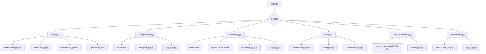

## 类结构

```
测试文件 (git_test.go)
├── Note 结构体
├── 测试函数集
│   ├── TestListNotes_* (Notes管理)
│   ├── TestChangedFiles_* (文件变更)
│   ├── TestOnelinelog_* (日志获取)
│   ├── TestCheckPush (推送验证)
│   ├── TestTraceGitCommand (命令跟踪)
│   └── TestMutexBuffer (并发安全)
└── 辅助函数集
    ├── createRepo
    ├── execCommand
    ├── updateFile
    ├── updateDirAndCommit
    └── testNote
```

## 全局变量及字段


### `testNoteRef`
    
Git notes的引用名称，用于标识特定的note集合

类型：`string`
    


### `noteIdCounter`
    
用于生成Note ID的计数器，确保每个note有唯一标识

类型：`int`
    


### `Note.ID`
    
Git note的唯一标识符

类型：`string`
    
    

## 全局函数及方法


### testNoteRef

这是一个常量定义，表示 Git notes 的引用名称，值为 'flux-sync'，用于在 Git 仓库中存储和检索 Flux 相关的元数据。

参数：N/A（常量无参数）

返回值：N/A（常量无返回值）

#### 流程图

```mermaid
graph TD
    A[常量定义 testNoteRef] --> B[值为 "flux-sync"]
    B --> C[在 noteRevList 中使用]
    B --> D[在 getNote 中使用]
    B --> E[在 addNote 中使用]
    C --> F[获取所有带有该 note 的提交]
    D --> G[获取特定提交的 note]
    E --> H[为提交添加 note]
```

#### 带注释源码

```go
// testNoteRef 是 Git notes 的引用名称
// 用于标识 Flux 在 Git 中存储的特定元数据
const (
	testNoteRef = "flux-sync"
)
```

---

### testNote

这是一个测试辅助函数，用于在指定目录下为指定的 Git 提交添加一个 Git note，并返回生成的 note ID。

参数：

- `dir`：`string`，Git 仓库的路径
- `rev`：`string`，要添加 note 的 Git 提交引用（如 "HEAD"、"HEAD~1" 等）

返回值：`string`，生成的 note ID；`error`，操作过程中的错误信息

#### 流程图

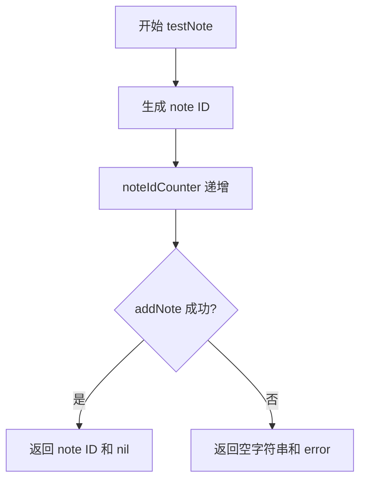

#### 带注释源码

```go
// testNote 为指定的 Git 提交添加一个测试 note
// 参数：
//   - dir: Git 仓库路径
//   - rev: Git 提交引用 (如 "HEAD", "HEAD~1")
//
// 返回值：
//   - string: 生成的 note ID
//   - error: 操作过程中的错误
func testNote(dir, rev string) (string, error) {
	// 使用计数器生成唯一的 note ID
	id := fmt.Sprintf("%v", noteIdCounter)
	// 递增计数器，为下一次调用做准备
	noteIdCounter += 1
	// 调用 addNote 添加 note 到 Git 仓库
	// 参数：context、目录、提交引用、note 引用、note 对象
	err := addNote(context.Background(), dir, rev, testNoteRef, &Note{ID: id})
	// 返回生成的 ID 和可能的错误
	return id, err
}
```


### `TestListNotes_2Notes`

该测试函数用于验证在Git仓库中正确列出2个Git Notes的场景。测试通过创建临时Git仓库、提交两个版本（HEAD~1和HEAD），为每个版本附加Git Notes，然后调用noteRevList获取所有Notes，并验证返回的Notes数量和内容是否正确。

参数：

- `t`：`*testing.T`，Go语言测试框架的测试对象，用于报告测试失败和记录测试状态

返回值：无（测试函数不返回值，通过`t`参数报告测试结果）

#### 流程图

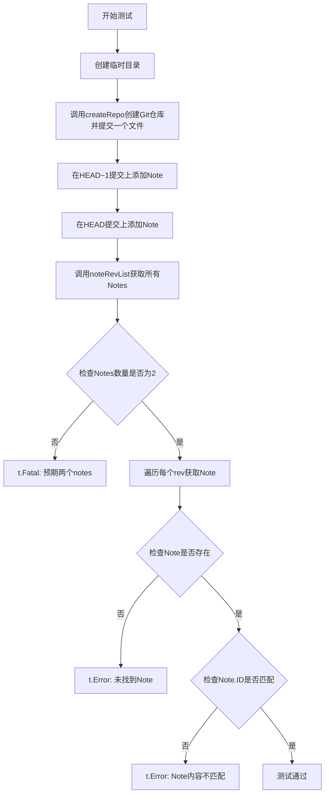

#### 带注释源码

```go
// TestListNotes_2Notes 测试列出2个notes的场景
func TestListNotes_2Notes(t *testing.T) {
    // 1. 创建临时目录用于测试，返回目录路径和清理函数
	newDir, cleanup := testfiles.TempDir(t)
    // 2. 测试结束后清理临时目录
	defer cleanup()

    // 3. 创建一个Git仓库，初始包含一个名为"another"的子目录和提交
	err := createRepo(newDir, []string{"another"})
	if err != nil {
		t.Fatal(err)
	}

    // 4. 在HEAD~1（倒数第二个提交）上添加一个Note，返回该Note的ID
	idHEAD_1, err := testNote(newDir, "HEAD~1")
	if err != nil {
		t.Fatal(err)
	}
    // 5. 在HEAD（最新提交）上添加一个Note，返回该Note的ID
	idHEAD, err := testNote(newDir, "HEAD")
	if err != nil {
		t.Fatal(err)
	}

    // 6. 调用noteRevList获取指定ref（flux-sync）下的所有Note关联的提交
	notes, err := noteRevList(context.Background(), newDir, testNoteRef)
	if err != nil {
		t.Fatal(err)
	}

    // 7. 验证返回的Notes数量是否为2
	if len(notes) != 2 {
		t.Fatal("expected two notes")
	}
    // 8. 遍历每个提交，验证Note是否存在且内容正确
	for rev := range notes {
        // 声明一个Note结构体用于接收数据
		var note Note
        // 调用getNote获取指定提交上的Note
		ok, err := getNote(context.Background(), newDir, testNoteRef, rev, &note)
		if err != nil {
			t.Error(err)
		}
        // 检查Note是否存在
		if !ok {
			t.Error("note not found for commit:", rev)
		}
        // 验证Note的ID是否为预期的两个ID之一
		if note.ID != idHEAD_1 && note.ID != idHEAD {
			t.Error("Note contents not expected:", note.ID)
		}
	}
}
```

---

### 相关依赖信息

#### 全局常量

| 名称 | 类型 | 描述 |
|------|------|------|
| `testNoteRef` | `string` | Git Note的引用名称，用于标识特定的Note集合 |

#### 全局变量

| 名称 | 类型 | 描述 |
|------|------|------|
| `noteIdCounter` | `int` | Note ID计数器，用于生成递增的唯一ID |

#### 相关结构体

| 名称 | 描述 |
|------|------|
| `Note` | 表示Git Note的数据结构，包含ID字段 |

#### 依赖的外部函数

| 函数名 | 描述 |
|--------|------|
| `testfiles.TempDir(t)` | 创建临时目录并返回清理函数 |
| `createRepo(dir, subdirs)` | 初始化Git仓库并创建初始提交 |
| `testNote(dir, rev)` | 在指定提交上添加Note并返回Note ID |
| `noteRevList(ctx, dir, ref)` | 获取指定ref下所有Note关联的提交 |
| `getNote(ctx, dir, ref, rev, note)` | 获取指定提交上的Note内容 |

---

### 潜在技术债务与优化空间

1. **硬编码的Note引用**：使用硬编码的字符串 `"flux-sync"` 作为Note引用，建议提取为配置常量或通过参数传入，提高测试灵活性。

2. **全局状态**：`noteIdCounter` 作为全局变量在并发测试场景下可能产生竞争条件，建议使用随机ID生成或通过依赖注入。

3. **错误信息不一致**：在第51行注释写的是"expected two notes"，但实际验证的是数量不为0（这里存在潜在的代码逻辑问题，注释与实际逻辑不符）。

4. **缺乏边界测试**：测试仅覆盖了2个Notes的场景，建议增加1个、3个及以上数量的测试用例。

5. **资源清理依赖**：测试依赖 `defer cleanup()` 进行资源清理，如果cleanup函数执行失败，临时文件可能残留。


### `TestListNotes_0Notes`

该测试函数用于验证在 Git 仓库中没有任何 commit notes 附加时，`noteRevList` 函数能够正确返回空列表的场景。它创建临时 Git 仓库并确保在没有添加任何 note 的情况下，查询结果为零。

参数：

- `t`：`testing.T`，Go 测试框架的标准参数，用于报告测试失败和控制测试行为

返回值：无（`void`），Go 测试函数不返回值，通过 `t.Fatal` 或 `t.Error` 报告测试结果

#### 流程图

```mermaid
flowchart TD
    A[开始测试] --> B[创建临时目录]
    B --> C[初始化Git仓库并创建子目录'another']
    C --> D[调用noteRevList查询notes]
    D --> E{是否有错误?}
    E -->|是| F[报告错误并终止测试]
    E -->|否| G{notes数量是否为0?}
    G -->|是| H[测试通过]
    G -->|否| I[报告错误: 期望0个notes但实际有${len(notes)}个]
```

#### 带注释源码

```go
// TestListNotes_0Notes 测试列出0个notes的场景
// 该测试验证当Git仓库中没有任何note时，noteRevList函数返回空map
func TestListNotes_0Notes(t *testing.T) {
	// 创建临时目录用于测试，cleanup函数用于测试结束后清理资源
	newDir, cleanup := testfiles.TempDir(t)
	// 确保测试结束后清理临时目录
	defer cleanup()

	// 初始化Git仓库，并在仓库中创建一个名为"another"的子目录
	err := createRepo(newDir, []string{"another"})
	if err != nil {
		t.Fatal(err)
	}

	// 调用noteRevList函数，查询testNoteRef(值为"flux-sync")对应的所有note
	// 此时仓库刚初始化完毕，还没有任何commit带有note
	notes, err := noteRevList(context.Background(), newDir, testNoteRef)
	if err != nil {
		t.Fatal(err)
	}

	// 验证返回的notes长度为0（因为还没有添加任何note）
	// 注意：这里错误消息写的是"expected two notes"可能是笔误，应该写成"expected zero notes"
	if len(notes) != 0 {
		t.Fatal("expected two notes")
	}
}
```


### `TestChangedFiles_SlashPath`

测试带斜杠路径的变更检测功能，验证当路径以斜杠开头时应该返回错误。

参数：

- `t`：`testing.T`，Go测试框架的测试对象指针，用于报告测试失败

返回值：`无`（Go测试函数不返回值，通过 `t.Fatal` 和 `t.Error` 报告错误）

#### 流程图

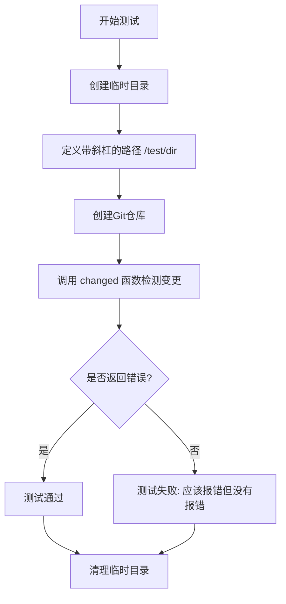

#### 带注释源码

```go
// TestChangedFiles_SlashPath 测试带斜杠路径的变更检测（应报错）
// 该测试用例验证当传入的路径以斜杠开头时，changed 函数能够正确识别并返回错误
func TestChangedFiles_SlashPath(t *testing.T) {
	// 1. 创建临时测试目录，返回目录路径和清理函数
	newDir, cleanup := testfiles.TempDir(t)
	// 2. 确保测试结束后清理临时目录
	defer cleanup()

	// 3. 定义一个以斜杠开头的嵌套目录路径
	// 路径以斜杠开头不符合Git路径规范，应该导致错误
	nestedDir := "/test/dir"

	// 4. 使用指定的嵌套目录创建Git仓库
	err := createRepo(newDir, []string{nestedDir})
	if err != nil {
		t.Fatal(err)
	}

	// 5. 调用 changed 函数检测指定路径的变更
	// 传入上下文、仓库目录、HEAD 提交和目标路径
	_, err = changed(context.Background(), newDir, "HEAD", []string{nestedDir})
	
	// 6. 验证函数是否返回错误
	// 预期行为：应该返回错误，因为路径以斜杠开头
	if err == nil {
		t.Fatal("Should have errored")
	}
}
```

#### 设计说明

- **测试目的**：验证 `changed` 函数能够正确处理以斜杠开头的路径参数
- **预期行为**：当路径以斜杠（如 `/test/dir`）开头时，应该返回错误，因为这不符合标准的相对路径格式
- **对比测试**：同文件中的 `TestChangedFiles_UnslashPath` 测试了不带斜杠的路径（如 `test/dir`），该测试预期成功，形成对照


### `TestChangedFiles_UnslashPath`

该测试函数用于验证当路径不包含前导斜杠（如 `"test/dir"`）时，`changed` 函数能够正确检测到文件的变更，与 `TestChangedFiles_SlashPath` 测试形成对比，后者在路径包含前导斜杠时会报错。

参数：

- `t`：`testing.T`，Go 测试框架的测试对象指针，用于报告测试失败

返回值：无（`testing.T` 方法通过 `t.Fatal()` 和 `t.Fatal()` 内部处理错误）

#### 流程图

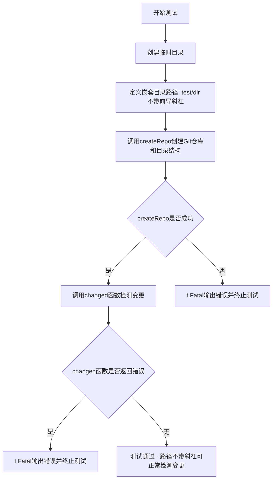

#### 带注释源码

```go
// TestChangedFiles_UnslashPath 测试不带斜杠路径的变更检测
// 该测试验证当路径字符串不包含前导斜杠时（如 "test/dir" 而非 "/test/dir"），
// changed 函数能够正确识别文件变更并返回预期的变更文件列表
func TestChangedFiles_UnslashPath(t *testing.T) {
	// 创建临时测试目录，cleanup 函数用于测试结束后自动清理
	newDir, cleanup := testfiles.TempDir(t)
	defer cleanup()

	// 定义嵌套目录路径，注意：不包含前导斜杠
	nestedDir := "test/dir"

	// 创建包含指定目录结构的 Git 仓库
	err := createRepo(newDir, []string{nestedDir})
	if err != nil {
		t.Fatal(err)
	}

	// 调用 changed 函数检测指定路径的变更
	// 预期行为：应该成功执行，不会报错
	_, err = changed(context.Background(), newDir, "HEAD", []string{nestedDir})
	if err != nil {
		t.Fatal(err)
	}
}
```


### `TestChangedFiles_NoPath`

测试空路径的变更检测，验证在未指定任何路径参数时，`changed` 函数能够正确处理并返回结果。

参数：

- `t`：`*testing.T`，Go测试框架的测试对象，用于报告测试失败和日志输出

返回值：无（Go测试函数返回 `void`），通过 `t.Fatal` 和 `t.Error` 报告错误

#### 流程图

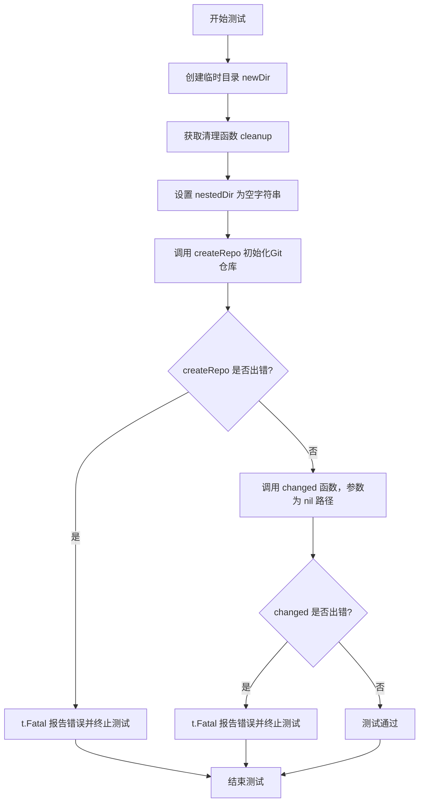

#### 带注释源码

```go
// TestChangedFiles_NoPath 测试空路径的变更检测功能
// 该测试用例验证当路径参数为 nil 时，changed 函数能够正确处理
func TestChangedFiles_NoPath(t *testing.T) {
    // 创建临时目录用于测试，testfiles.TempDir 返回目录路径和清理函数
    newDir, cleanup := testfiles.TempDir(t)
    // defer 确保测试结束后清理临时目录资源
    defer cleanup()

    // 设置测试用的嵌套目录为空字符串
    nestedDir := ""

    // 初始化Git仓库，传入空字符串作为子目录
    err := createRepo(newDir, []string{nestedDir})
    // 如果创建仓库失败，Fatal 会立即终止测试并报告错误
    if err != nil {
        t.Fatal(err)
    }

    // 调用 changed 函数检测变更
    // 参数说明：
    //   - context.Background(): 上下文对象
    //   - newDir: Git仓库路径
    //   - "HEAD": 要比较的Git引用
    //   - nil: 路径过滤器为nil，表示不限制路径
    _, err = changed(context.Background(), newDir, "HEAD", nil)
    // 如果 changed 函数返回错误，测试失败
    if err != nil {
        t.Fatal(err)
    }
}
```


### `TestChangedFiles_LeadingSpace`

该测试函数验证 `changed` 函数在处理文件名包含前导空格时的正确性，确保返回的文件名与原始文件名（包括前导空格）完全一致。

参数：

- `t`：`testing.T`，Go 测试框架的测试对象，用于报告测试失败和记录测试状态

返回值：`void`，该函数为测试函数，通过 `testing.T` 对象的方法报告测试结果，不直接返回值

#### 流程图

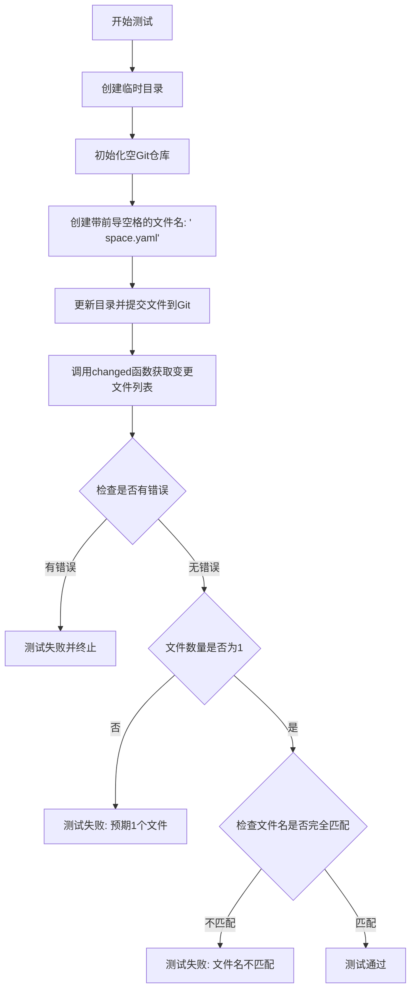

#### 带注释源码

```go
// TestChangedFiles_LeadingSpace 测试处理文件名带前导空格的情况
// 该测试验证 changed 函数能正确处理包含前导空格的文件名
func TestChangedFiles_LeadingSpace(t *testing.T) {
	// 创建临时目录用于测试，cleanup 函数用于测试结束后清理资源
	newDir, cleanup := testfiles.TempDir(t)
	defer cleanup()

	// 初始化一个空的 Git 仓库（无子目录）
	err := createRepo(newDir, []string{})
	if err != nil {
		t.Fatal(err)
	}

	// 定义带前导空格的文件名，这是测试的核心：文件名以空格开头
	filename := " space.yaml"

	// 更新目录并提交文件，文件名包含前导空格
	if err = updateDirAndCommit(newDir, "", map[string]string{filename: "foo"}); err != nil {
		t.Fatal(err)
	}

	// 调用 changed 函数获取从 HEAD~1 到 HEAD 之间变更的文件列表
	// 传入空路径过滤器，表示不过滤任何路径
	files, err := changed(context.Background(), newDir, "HEAD~1", []string{})
	if err != nil {
		t.Fatal(err)
	}

	// 验证变更文件数量为 1
	if len(files) != 1 {
		t.Fatal("expected 1 changed file")
	}

	// 获取实际返回的文件名，验证其与原始文件名完全一致（包括前导空格）
	// 这是测试的关键点：确保文件名中的前导空格被正确保留和返回
	if actualFilename := files[0]; actualFilename != filename {
		t.Fatalf("expected changed filename to equal: '%s', got '%s'", filename, actualFilename)
	}
}
```


### `TestOnelinelog_NoGitpath`

该测试函数用于测试无git路径过滤的单行日志功能，验证在未指定路径过滤器时，能够正确获取指定范围内的所有提交记录。

参数：

- `t`：`*testing.T`，Go测试框架的测试对象，用于报告测试失败和日志输出

返回值：无（测试函数返回void，通过`t.Fatal()`和`t.Error()`报告测试结果）

#### 流程图

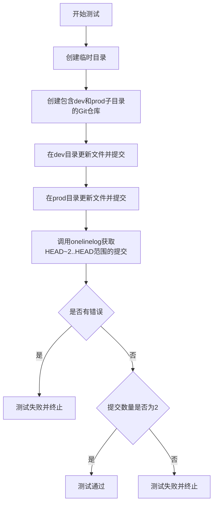

#### 带注释源码

```go
// TestOnelinelog_NoGitpath 测试无git路径过滤的单行日志功能
// 该测试验证当路径过滤器为nil时，onelinelog能够正确返回
// 指定提交范围内的所有提交记录
func TestOnelinelog_NoGitpath(t *testing.T) {
	// 1. 创建临时目录用于测试，cleanup用于测试结束后清理资源
	newDir, cleanup := testfiles.TempDir(t)
	defer cleanup()

	// 2. 定义两个子目录：dev和prod
	subdirs := []string{"dev", "prod"}
	
	// 3. 初始化Git仓库，包含dev和prod两个子目录
	err := createRepo(newDir, subdirs)
	if err != nil {
		t.Fatal(err)
	}

	// 4. 在dev子目录中更新文件并提交（第一次提交）
	if err = updateDirAndCommit(newDir, "dev", testfiles.FilesUpdated); err != nil {
		t.Fatal(err)
	}
	
	// 5. 在prod子目录中更新文件并提交（第二次提交）
	if err = updateDirAndCommit(newDir, "prod", testfiles.FilesUpdated); err != nil {
		t.Fatal(err)
	}

	// 6. 调用onelinelog获取从HEAD~2到HEAD范围内的提交记录
	// 参数说明：
	//   - context.Background(): 上下文对象
	//   - newDir: Git仓库路径
	//   - "HEAD~2..HEAD": 提交范围（最近2个提交）
	//   - nil: 路径过滤器（nil表示不过滤任何路径）
	//   - false: 不跳过合并提交
	commits, err := onelinelog(context.Background(), newDir, "HEAD~2..HEAD", nil, false)
	if err != nil {
		t.Fatal(err)
	}

	// 7. 验证返回的提交数量是否为2（dev和prod各一次提交）
	if len(commits) != 2 {
		t.Fatal(err)
	}
}
```


### `TestOnelinelog_NoGitpath_Merged`

该测试函数用于验证在合并分支后，使用 `onelinelog` 函数获取提交日志时，能否正确处理合并提交。当传入不同的 `withMerge` 参数时，应返回不同范围的提交历史（包括或不包括合并提交的父提交）。

参数：

- `t`：`testing.T`，Go 测试框架的测试用例对象，用于报告测试失败

返回值：无（测试函数直接通过 `t.Fatal` 或 `t.Error` 报告错误）

#### 流程图

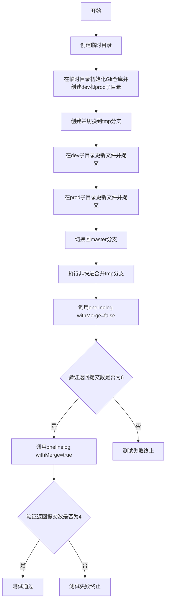

#### 带注释源码

```go
// TestOnelinelog_NoGitpath_Merged 测试合并分支后的日志显示
// 该测试验证onelinelog函数在处理合并提交时的正确性
func TestOnelinelog_NoGitpath_Merged(t *testing.T) {
    // 创建临时目录用于测试，cleanup用于测试后清理
    newDir, cleanup := testfiles.TempDir(t)
    defer cleanup()

    // 定义子目录：dev和prod
    subdirs := []string{"dev", "prod"}
    // 初始化Git仓库并创建子目录
    err := createRepo(newDir, subdirs)
    if err != nil {
        t.Fatal(err)
    }

    // 创建临时分支用于后续合并测试
    branch := "tmp"
    // 创建并切换到tmp分支
    if err = execCommand("git", "-C", newDir, "checkout", "-b", branch); err != nil {
        t.Fatal(err)
    }
    // 在dev子目录更新文件并提交（创建第一个提交）
    if err = updateDirAndCommit(newDir, "dev", testfiles.FilesUpdated); err != nil {
        t.Fatal(err)
    }
    // 在prod子目录更新文件并提交（创建第二个提交）
    if err = updateDirAndCommit(newDir, "prod", testfiles.FilesUpdated); err != nil {
        t.Fatal(err)
    }
    // 切换回master分支
    if err = execCommand("git", "-C", newDir, "checkout", "master"); err != nil {
        t.Fatal(err)
    }
    // 执行非快进合并，将tmp分支合并到master（创建合并提交）
    if err = execCommand("git", "-C", newDir, "merge", "--no-ff", branch); err != nil {
        t.Fatal(err)
    }

    // 测试场景1：不包含合并提交的父提交
    // 预期返回6个提交：初始提交 + 第二次提交 + dev更新 + prod更新 + 合并提交 = 6
    commits, err := onelinelog(context.Background(), newDir, "HEAD", nil, false)
    if err != nil {
        t.Fatal(err)
    }

    // 验证提交数量是否符合预期
    if len(commits) != 6 {
        t.Fatal(commits)
    }

    // 测试场景2：包含合并提交的父提交
    // 预期返回4个提交：初始提交 + 第二次提交 + 合并提交 = 4（只显示合并后的结果）
    commits, err = onelinelog(context.Background(), newDir, "HEAD", nil, true)
    if err != nil {
        t.Fatal(err)
    }

    // 验证提交数量是否符合预期
    if len(commits) != 4 {
        t.Fatal(commits)
    }
}
```


### `TestOnelinelog_WithGitpath`

该测试函数验证带 git 路径过滤的单行日志功能，能够正确过滤并仅返回指定路径（如 "dev"）的提交记录。

参数：

- `t`：`testing.T`，Go 标准测试框架的测试实例指针，用于报告测试失败和日志输出

返回值：无（测试函数无返回值，通过 `t.Fatal` 和 `t.Error` 报告错误）

#### 流程图

```mermaid
flowchart TD
    A[开始测试] --> B[创建临时目录]
    B --> C[创建包含dev和prod子目录的Git仓库]
    C --> D[更新dev目录并提交]
    D --> E[更新prod目录并提交]
    E --> F[调用onelinelog函数<br/>参数: HEAD~2..HEAD, ['dev'], false]
    F --> G{检查返回的commits数量}
    G -->|等于1| H[测试通过]
    G -->|不等于1| I[测试失败]
    H --> J[结束]
    I --> J
```

#### 带注释源码

```go
// TestOnelinelog_WithGitpath 测试带git路径过滤的单行日志功能
// 该测试验证当提供git路径过滤参数时，onelinelog函数能够
// 仅返回指定目录下的提交记录
func TestOnelinelog_WithGitpath(t *testing.T) {
	// 创建临时目录用于测试，cleanup用于测试结束后清理资源
	newDir, cleanup := testfiles.TempDir(t)
	defer cleanup()

	// 定义测试用的子目录：dev和prod
	subdirs := []string{"dev", "prod"}

	// 初始化Git仓库，创建子目录并提交初始文件
	err := createRepo(newDir, subdirs)
	if err != nil {
		t.Fatal(err)
	}

	// 在dev目录下更新文件并提交（提交1）
	if err = updateDirAndCommit(newDir, "dev", testfiles.FilesUpdated); err != nil {
		t.Fatal(err)
	}

	// 在prod目录下更新文件并提交（提交2）
	if err = updateDirAndCommit(newDir, "prod", testfiles.FilesUpdated); err != nil {
		t.Fatal(err)
	}

	// 调用onelinelog获取HEAD~2..HEAD范围内的提交记录
	// 参数说明：
	//   - context.Background(): 上下文
	//   - newDir: Git仓库路径
	//   - "HEAD~2..HEAD": 提交范围（最近的2个提交）
	//   - []string{"dev": git路径过滤器，仅返回dev目录下的提交
	//   - false: 不包含合并提交
	commits, err := onelinelog(context.Background(), newDir, "HEAD~2..HEAD", []string{"dev"}, false)
	if err != nil {
		t.Fatal(err)
	}

	// 验证返回的提交数量是否为1（仅dev目录的提交）
	if len(commits) != 1 {
		t.Fatal(err)
	}
}
```


### `TestOnelinelog_WithGitpath_Merged`

该测试函数验证了在使用路径过滤的情况下，处理合并（merge）提交时的日志输出功能。测试创建一个包含 dev 和 prod 子目录的 Git 仓库，创建临时分支并在两个目录中分别提交更改，然后合并回 master 分支，最后验证 onelinelog 函数能否正确过滤和返回包含合并提交的日志。

参数：

- `t`：`*testing.T`，Go 测试框架的测试实例指针，用于报告测试失败和执行断言

返回值：无（`void`），该函数通过 `*testing.T` 参数的方法返回结果

#### 流程图

```mermaid
flowchart TD
    A[开始测试] --> B[创建临时目录]
    B --> C[创建包含dev和prod子目录的Git仓库]
    C --> D[创建并切换到tmp分支]
    D --> E[在dev目录中提交更改]
    E --> F[在prod目录中提交更改]
    F --> G[切换回master分支]
    G --> H[将tmp分支合并到master--no-ff]
    H --> I[调用onelinelog获取prod路径过滤的日志<br/>参数: HEAD, []string{prod}, false]
    I --> J{检查返回的commits数量是否为2}
    J -->|是| K[调用onelinelog获取prod路径过滤的日志<br/>参数: HEAD, []string{prod}, true]
    J -->|否| L[测试失败: 期望2个commits]
    K --> M{检查返回的commits数量是否为2}
    M -->|是| N[测试通过]
    M -->|否| O[测试失败: 期望2个commits]
```

#### 带注释源码

```go
// TestOnelinelog_WithGitpath_Merged 测试带路径过滤的合并日志功能
// 该测试验证 onelinelog 函数在处理包含合并提交的仓库时，
// 能否正确根据指定的 git 路径过滤提交，并正确处理合并提交
func TestOnelinelog_WithGitpath_Merged(t *testing.T) {
	// 1. 创建临时测试目录，并在测试结束时自动清理
	newDir, cleanup := testfiles.TempDir(t)
	defer cleanup()

	// 2. 定义要创建的子目录：dev 和 prod
	subdirs := []string{"dev", "prod"}
	
	// 3. 创建包含指定子目录的 Git 仓库
	err := createRepo(newDir, subdirs)
	if err != nil {
		t.Fatal(err)
	}

	// 4. 创建并切换到临时分支 "tmp"
	branch := "tmp"
	if err = execCommand("git", "-C", newDir, "checkout", "-b", branch); err != nil {
		t.Fatal(err)
	}

	// 5. 在 dev 目录中更新文件并提交
	if err = updateDirAndCommit(newDir, "dev", testfiles.FilesUpdated); err != nil {
		t.Fatal(err)
	}

	// 6. 在 prod 目录中更新文件并提交
	if err = updateDirAndCommit(newDir, "prod", testfiles.FilesUpdated); err != nil {
		t.Fatal(err)
	}

	// 7. 切换回 master 分支
	if err = execCommand("git", "-C", newDir, "checkout", "master"); err != nil {
		t.Fatal(err)
	}

	// 8. 执行无快进合并(--no-ff)，将 tmp 分支合并到 master
	// 这会创建一个合并提交
	if err = execCommand("git", "-C", newDir, "merge", "--no-ff", branch); err != nil {
		t.Fatal(err)
	}

	// 9. 测试不带合并提交（firstParent=true 时跳过）的日志
	// 期望返回：初始提交 + prod 目录的更新提交 = 2个
	// 参数说明：
	//   - newDir: 仓库路径
	//   - "HEAD": 从 HEAD 开始
	//   - []string{"prod": 路径过滤，只显示 prod 目录相关的提交
	//   - false: firstParent=false，包含所有提交（包括合并提交）
	commits, err := onelinelog(context.Background(), newDir, "HEAD", []string{"prod"}, false)
	if err != nil {
		t.Fatal(err)
	}

	// 10. 验证返回的提交数量是否为 2
	if len(commits) != 2 {
		t.Fatal(err)
	}

	// 11. 测试带合并提交（firstParent=true 时只走第一 parent）的日志
	// 期望返回：初始提交 + 合并提交 = 2个
	// 参数 true 表示 firstParent=true，跳过合并提交的第一 parent 之外的提交
	commits, err = onelinelog(context.Background(), newDir, "HEAD", []string{"prod"}, true)
	if err != nil {
		t.Fatal(err)
	}

	// 12. 验证返回的提交数量是否为 2
	if len(commits) != 2 {
		t.Fatal(err)
	}
}
```


### `TestCheckPush`

该测试函数用于验证 Git 仓库推送功能（checkPush），通过创建临时上游仓库和克隆仓库，测试从克隆目录向上游推送的能力。

参数：

- `t`：`*testing.T`，Go 语言标准测试框架的测试上下文，用于报告测试失败和日志输出

返回值：无（`void`），该函数为测试函数，不返回值，通过 `t.Fatal` 和 `t.Error` 报告测试结果

#### 流程图

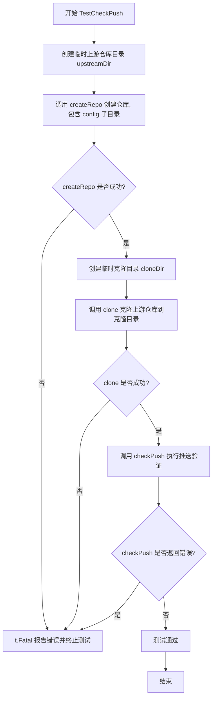

#### 带注释源码

```go
// TestCheckPush 测试仓库推送验证功能
// 该测试创建临时仓库环境，验证 checkPush 函数能够正确执行 Git 推送操作
func TestCheckPush(t *testing.T) {
	// 创建临时上游仓库目录，返回目录路径和清理函数
	upstreamDir, upstreamCleanup := testfiles.TempDir(t)
	// defer 确保测试结束后自动清理临时目录
	defer upstreamCleanup()
	
	// 在上游仓库中创建包含 "config" 子目录的 Git 仓库
	if err := createRepo(upstreamDir, []string{"config"}); err != nil {
		// 如果创建仓库失败，Fatal 终止测试并报告错误
		t.Fatal(err)
	}

	// 创建临时克隆目录，用于测试推送功能
	cloneDir, cloneCleanup := testfiles.TempDir(t)
	defer cloneCleanup()

	// 从上游仓库克隆到克隆目录，使用 master 分支
	// 返回克隆后的工作目录路径
	working, err := clone(context.Background(), cloneDir, upstreamDir, "master")
	if err != nil {
		t.Fatal(err)
	}
	
	// 执行推送验证检查
	// 参数：上下文、克隆的工作目录、上游仓库路径、空字符串（表示使用默认推送配置）
	err = checkPush(context.Background(), working, upstreamDir, "")
	if err != nil {
		// 推送检查失败，终止测试
		t.Fatal(err)
	}
}
```


### `TestTraceGitCommand`

该测试函数用于验证 Git 命令跟踪日志格式化功能，通过多个测试用例验证 `traceGitCommand` 函数能否正确生成包含命令参数、输出结果、工作目录和环境变量的跟踪日志格式。

参数：

- `t *testing.T`：Go 测试框架的标准测试参数，用于报告测试失败或成功状态

返回值：无（Go 测试函数无返回值）

#### 流程图

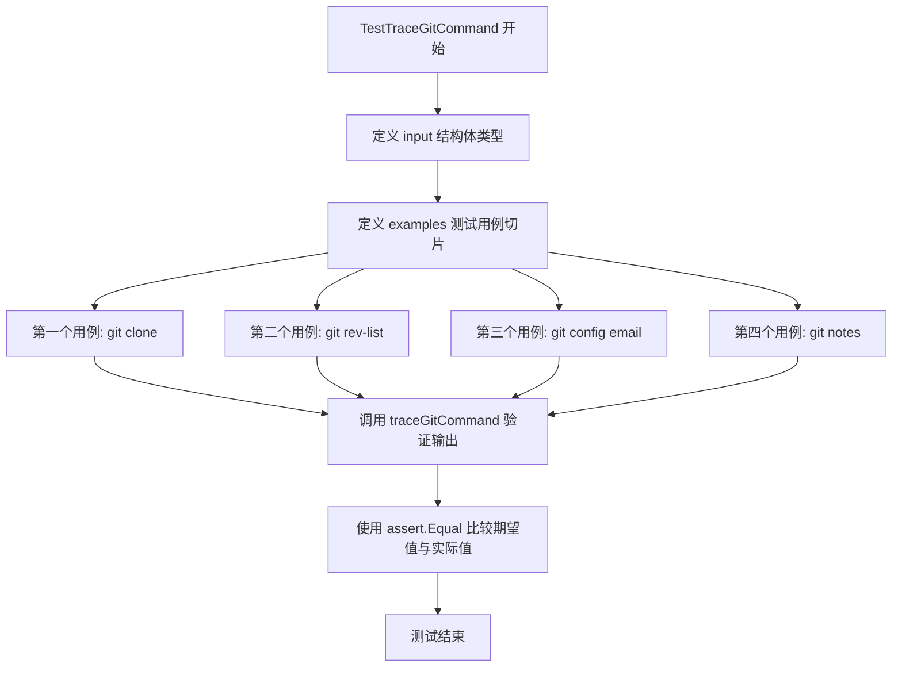

#### 带注释源码

```go
// TestTraceGitCommand 验证 Git 命令跟踪日志格式化功能
// 该测试通过多个示例用例验证 traceGitCommand 函数
// 是否能正确生成包含命令、输出、目录和环境变量的跟踪日志
func TestTraceGitCommand(t *testing.T) {
	// 定义输入结构体，包含命令参数、配置和预期输出
	type input struct {
		args   []string      // Git 命令参数列表，如 ["clone", "--branch", "master"]
		config gitCmdConfig  // Git 命令配置，包含工作目录等信息
		out    string        // 命令执行后的标准输出
		err    string        // 命令执行后的标准错误输出
	}
	
	// 定义测试用例结构体
	examples := []struct {
		name     string  // 测试用例名称
		input    input   // 输入参数
		expected string  // 期望的跟踪日志格式
		actual   string  // 实际生成的跟踪日志
	}{
		{
			name: "git clone",  // 测试 git clone 命令的日志格式
			input: input{
				args: []string{
					"clone",
					"--branch",
					"master",
					"/tmp/flux-gitclone239583443",
					"/tmp/flux-working628880789",
				},
				config: gitCmdConfig{
					dir: "/tmp/flux-working628880789",
				},
			},
			// 期望的 TRACE 日志格式：包含完整命令、输出、目录和环境变量
			expected: `TRACE: command="git clone --branch master /tmp/flux-gitclone239583443 /tmp/flux-working628880789" out="" dir="/tmp/flux-working628880789" env=""`,
		},
		{
			name: "git rev-list",  // 测试 git rev-list 命令的日志格式
			input: input{
				args: []string{
					"rev-list",
					"--max-count",
					"1",
					"flux-sync",
					"--",
				},
				out: "b9d6a543acf8085ff6bed23fac17f8dc71bfcb66",  // 模拟命令输出
				config: gitCmdConfig{
					dir: "/tmp/flux-gitclone239583443",
				},
			},
			// 期望显示命令的实际输出结果
			expected: `TRACE: command="git rev-list --max-count 1 flux-sync --" out="b9d6a543acf8085ff6bed23fac17f8dc71bfcb66" dir="/tmp/flux-gitclone239583443" env=""`,
		},
		{
			name: "git config email",  // 测试 git config 命令的日志格式
			input: input{
				args: []string{
					"config",
					"user.email",
					"support@weave.works",
				},
				config: gitCmdConfig{
					dir: "/tmp/flux-working056923691",
				},
			},
			expected: `TRACE: command="git config user.email support@weave.works" out="" dir="/tmp/flux-working056923691" env=""`,
		},
		{
			name: "git notes",  // 测试 git notes 命令的日志格式
			input: input{
				args: []string{
					"notes",
					"--ref",
					"flux",
					"get-ref",
				},
				config: gitCmdConfig{
					dir: "/tmp/flux-working647148942",
				},
				out: "refs/notes/flux",
			},
			expected: `TRACE: command="git notes --ref flux get-ref" out="refs/notes/flux" dir="/tmp/flux-working647148942" env=""`,
		},
	}
	
	// 遍历所有测试用例
	for _, example := range examples {
		// 调用被测试的 traceGitCommand 函数，生成实际日志
		actual := traceGitCommand(
			example.input.args,      // 传入 Git 命令参数
			example.input.config,    // 传入 Git 命令配置
			example.input.out,       // 传入命令输出
		)
		// 使用 testify 断言库比较期望值与实际值
		assert.Equal(t, example.expected, actual)
	}
}
```


### `TestMutexBuffer`

该测试函数用于验证线程安全缓冲区（用于捕获 stdout 和 stderr）不会导致竞态条件或死锁。具体来说，此测试防止出现以下情况：从两个 goroutine 复制数据到缓冲区时，如果其中一个使用 `ReadFrom`，可能会导致死锁。

参数：

- `t`：`*testing.T`，Go 测试框架的测试上下文，用于报告测试失败和记录测试步骤

返回值：无直接返回值，但通过 `t.Fatal` 在出错时终止测试

#### 流程图

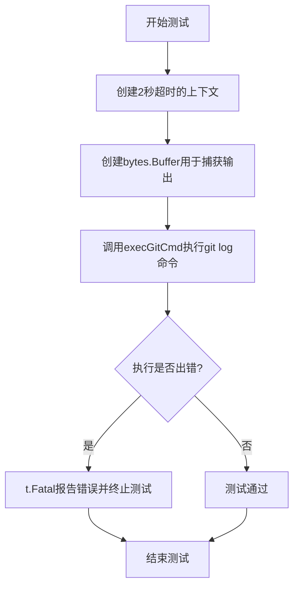

#### 带注释源码

```go
// TestMutexBuffer tests that the threadsafe buffer used to capture
// stdout and stderr does not give rise to races or deadlocks. In
// particular, this test guards against reverting to a situation in
// which copying into the buffer from two goroutines can deadlock it,
// if one of them uses `ReadFrom`.
func TestMutexBuffer(t *testing.T) {
	// 创建一个带有2秒超时的上下文，用于防止测试永久阻塞
	ctx, cancel := context.WithTimeout(context.Background(), 2*time.Second)
	// 确保测试结束后取消上下文，释放相关资源
	defer cancel()

	// 创建一个bytes.Buffer用于捕获git命令的stdout输出
	out := &bytes.Buffer{}
	// 执行git log --oneline命令，测试并发写入缓冲区的安全性
	err := execGitCmd(ctx, []string{"log", "--oneline"}, gitCmdConfig{out: out})
	// 如果执行出错，则报告致命错误并终止测试
	if err != nil {
		t.Fatal(err)
	}
}
```

#### 依赖分析

| 依赖项 | 类型 | 描述 |
|--------|------|------|
| `context` | 标准库 | 提供超时控制机制 |
| `bytes` | 标准库 | 提供缓冲区实现 |
| `testing.T` | 标准库 | Go测试框架的测试对象 |
| `execGitCmd` | 外部函数 | 在同一包中定义，执行git命令 |
| `gitCmdConfig` | 外部结构体 | git命令配置，包含输出缓冲区等 |

#### 技术债务与优化空间

1. **测试覆盖有限**：当前测试仅执行了一个简单的 `git log` 命令，未充分验证高并发场景下的缓冲区安全性
2. **缺少竞态检测**：建议添加 `-race` 标志运行测试以检测潜在的竞态条件
3. **超时时间硬编码**：2秒超时值硬编码在代码中，建议提取为常量或配置项以提高可维护性


### `createRepo`

该函数用于在指定目录下初始化一个 Git 仓库，并创建指定的子目录结构，同时为每个子目录生成测试文件和初始提交记录，以便为后续的 Git 操作测试提供干净的测试环境。

#### 参数

- `dir`：`string`，目标目录路径，即要在该目录下初始化 Git 仓库
- `subdirs`：`[]string`，需要创建的子目录切片，这些子目录将在仓库初始化后被创建并添加测试文件

#### 返回值

- `error`：如果执行过程中出现任何错误（如 git 命令执行失败、文件写入失败等），则返回对应的错误信息；成功时返回 `nil`

#### 流程图

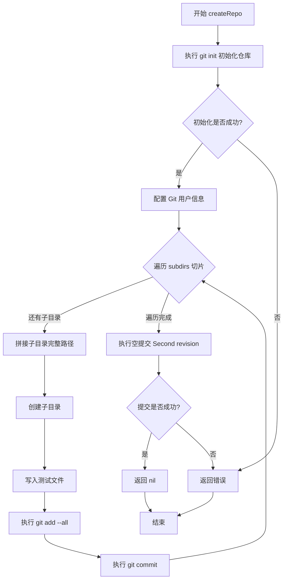

#### 带注释源码

```go
// createRepo 在指定目录下创建测试用 Git 仓库
// 参数 dir: 目标目录路径
// 参数 subdirs: 需要创建的子目录切片
// 返回值: 错误信息，成功时返回 nil
func createRepo(dir string, subdirs []string) error {
	var (
		err      error   // 用于保存可能出现的错误
		fullPath string  // 子目录的完整路径
	)

	// 步骤1: 初始化 Git 仓库
	// 使用 git init 命令在指定目录下创建新的 Git 仓库
	if err = execCommand("git", "-C", dir, "init"); err != nil {
		return err // 如果初始化失败，立即返回错误
	}

	// 步骤2: 配置 Git 用户信息
	// 设置提交者的用户名和邮箱，用于后续的提交操作
	if err := config(context.Background(), dir, "operations_test_user", "example@example.com"); err != nil {
		return err // 配置失败则返回错误
	}

	// 步骤3: 遍历子目录列表，创建目录、文件和提交
	for _, subdir := range subdirs {
		// 拼接子目录的完整路径: dir/subdir
		fullPath = path.Join(dir, subdir)
		
		// 创建子目录（如果父目录不存在也会一并创建）
		if err = execCommand("mkdir", "-p", fullPath); err != nil {
			return err
		}

		// 写入测试文件到子目录
		// 使用 testfiles.WriteTestFiles 生成标准的测试文件内容
		if err = testfiles.WriteTestFiles(fullPath, testfiles.Files); err != nil {
			return err
		}

		// 将新创建的文件添加到 Git 暂存区
		if err = execCommand("git", "-C", dir, "add", "--all"); err != nil {
			return err
		}

		// 提交当前子目录的更改
		// 提交信息为 'Initial revision'
		if err = execCommand("git", "-C", dir, "commit", "-m", "'Initial revision'"); err != nil {
			return err
		}
	}

	// 步骤4: 创建一个空的提交（Second revision）
	// 用于模拟有多个提交状态的测试场景
	// --allow-empty 允许创建没有文件更改的提交
	if err = execCommand("git", "-C", dir, "commit", "--allow-empty", "-m", "'Second revision'"); err != nil {
		return err
	}

	// 所有操作成功完成，返回 nil
	return nil
}
```


### `execCommand`

该函数是执行外部命令的简单封装，通过 `exec.Command` 创建命令对象，丢弃标准输出和标准错误，然后执行命令并返回可能的错误。

参数：

- `cmd`：`string`，要执行的命令名称（如 "git"、"mkdir" 等）
- `args`：`...string`，可变参数列表，表示命令的参数（如 "-C", "dir", "init" 等）

返回值：`error`，执行命令时可能发生的错误，如果没有错误则返回 nil

#### 流程图

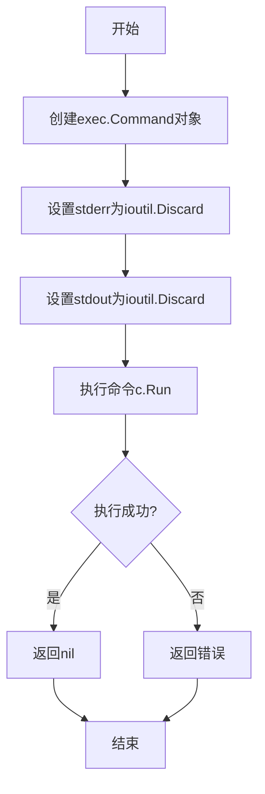

#### 带注释源码

```go
// execCommand 执行外部命令的封装函数
// 参数：
//   - cmd: 要执行的命令名称
//   - args: 命令的可变参数列表
// 返回值：
//   - error: 执行命令时可能发生的错误
func execCommand(cmd string, args ...string) error {
	// 使用exec.Command创建命令对象
	// 第一个参数是命令名称，后续参数是该命令的参数
	c := exec.Command(cmd, args...)
	
	// 丢弃标准错误输出，不捕获或记录任何错误信息
	c.Stderr = ioutil.Discard
	
	// 丢弃标准输出，不捕获或记录任何标准输出内容
	c.Stdout = ioutil.Discard
	
	// 执行命令并返回可能发生的错误
	return c.Run()
}
```


### `updateFile`

创建或更新文件内容，将给定路径下的文件内容写入到文件系统中，支持批量创建或更新多个文件。

参数：

- `path`：`string`，基础路径，用于与文件名拼接形成完整文件路径
- `files`：`map[string]string`，文件名到文件内容的映射，表示需要创建或更新的文件集合

返回值：`error`，如果写入过程中出现错误则返回错误，否则返回 nil

#### 流程图

```mermaid
flowchart TD
    A[开始 updateFile] --> B{遍历 files 映射}
    B -->|遍历每个 file, content| C[拼接完整文件路径: filepath.Join]
    C --> D[将 content 转换为字节数组]
    D --> E{写入文件: ioutil.WriteFile]
    E -->|成功| F{继续遍历下一个文件}
    E -->|失败| G[返回错误]
    F -->|还有文件| C
    F -->|遍历完成| H[返回 nil]
    G --> I[结束 updateFile]
    H --> I
```

#### 带注释源码

```go
// Replaces/creates a file
// 参数 path: 基础目录路径
// 参数 files: 文件名到内容的映射，支持批量创建/更新
// 返回值: 写入失败时返回错误，否则返回 nil
func updateFile(path string, files map[string]string) error {
	// 遍历需要创建/更新的所有文件
	for file, content := range files {
		// 拼接完整文件路径：基础路径 + 文件名
		path := filepath.Join(path, file)
		// 将文件内容转换为字节数组并写入文件
		// 文件权限设置为 0666（所有者、组、其他用户均可读写）
		if err := ioutil.WriteFile(path, []byte(content), 0666); err != nil {
			// 写入失败时立即返回错误，终止操作
			return err
		}
	}
	// 所有文件写入成功，返回 nil
	return nil
}
```


### `updateDirAndCommit`

该函数用于将文件更新写入指定目录的子目录中，并自动执行 Git 的 add 和 commit 操作，将更改提交到版本控制系统。

参数：

- `dir`：`string`，目标仓库的基础目录路径
- `subdir`：`string`，相对于基础目录的子目录路径
- `filesUpdated`：`map[string]string`，文件名到文件内容的映射，表示需要更新或创建的文件

返回值：`error`，如果文件更新、Git add 或 commit 过程中发生错误，则返回错误信息；否则返回 nil

#### 流程图

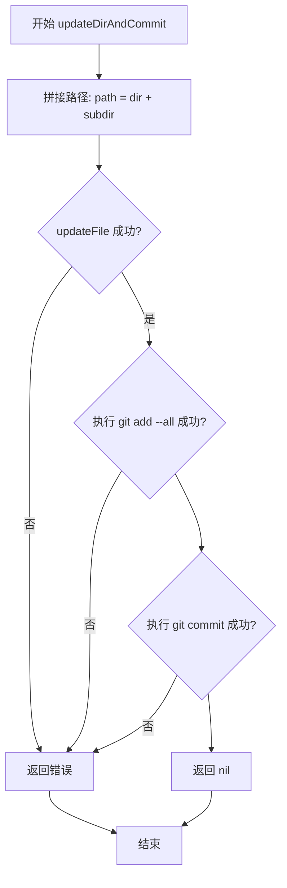

#### 带注释源码

```go
// updateDirAndCommit 更新目录中的文件并提交到 Git
// 参数：
//   - dir: 仓库的基础目录路径
//   - subdir: 子目录名称（可为空字符串）
//   - filesUpdated: 要更新的文件映射，键为文件名，值为文件内容
//
// 返回值：
//   - error: 操作过程中的错误信息，如果成功则返回 nil
func updateDirAndCommit(dir, subdir string, filesUpdated map[string]string) error {
	// 1. 拼接完整的工作目录路径
	path := filepath.Join(dir, subdir)
	
	// 2. 调用 updateFile 将文件内容写入磁盘
	if err := updateFile(path, filesUpdated); err != nil {
		return err
	}
	
	// 3. 执行 git add --all，将所有更改添加到暂存区
	if err := execCommand("git", "-C", path, "add", "--all"); err != nil {
		return err
	}
	
	// 4. 执行 git commit，提交更改到本地仓库
	if err := execCommand("git", "-C", path, "commit", "-m", "'Update 1'"); err != nil {
		return err
	}
	
	// 5. 所有操作成功完成
	return nil
}
```

#### 依赖函数信息

| 函数名 | 描述 |
|--------|------|
| `updateFile` | 将 `filesUpdated` 映射中的文件写入到指定目录，文件名作为文件名，内容作为文件内容 |
| `execCommand` | 执行系统命令的封装函数，接收命令名和可变参数，返回执行结果 |

#### 典型调用示例

```go
// 测试文件中使用该函数的示例
func TestChangedFiles_LeadingSpace(t *testing.T) {
    newDir, cleanup := testfiles.TempDir(t)
    defer cleanup()

    filename := " space.yaml"  // 注意：文件名包含前导空格

    // 调用 updateDirAndCommit 更新文件并提交
    if err := updateDirAndCommit(newDir, "", map[string]string{filename: "foo"}); err != nil {
        t.Fatal(err)
    }

    // 验证文件是否被正确提交
    files, err := changed(context.Background(), newDir, "HEAD~1", []string{})
    if err != nil {
        t.Fatal(err)
    }

    if len(files) != 1 {
        t.Fatal("expected 1 changed file")
    }

    if actualFilename := files[0]; actualFilename != filename {
        t.Fatalf("expected changed filename to equal: '%s', got '%s'", filename, actualFilename)
    }
}
```


### `testNote`

该函数是测试辅助函数，用于在指定的Git仓库目录和修订版本上创建一个测试用的note（Git注释），并返回生成的note ID。它通过递增全局计数器生成唯一ID，调用 `addNote` 函数将包含该ID的Note对象添加到指定的Git仓库修订版本中。

参数：

- `dir`：`string`，Git仓库的本地目录路径
- `rev`：`string`，Git修订版本引用（如 "HEAD"、"HEAD~1" 等）

返回值：

- `string`：创建的note的唯一标识符（ID）
- `error`：如果在创建note过程中发生错误，则返回该错误；否则返回nil

#### 流程图

```mermaid
flowchart TD
    A[开始 testNote] --> B[生成note ID]
    B --> C[noteIdCounter 递增]
    C --> D[调用 addNote 函数]
    D --> E{addNote 是否成功?}
    E -->|成功| F[返回 note ID 和 nil]
    E -->|失败| G[返回 空字符串 和 错误]
    F --> H[结束]
    G --> H
```

#### 带注释源码

```go
// testNote 是一个测试辅助函数，用于在指定的Git仓库和修订版本上创建测试note
// 参数:
//   - dir: Git仓库的本地目录路径
//   - rev: Git修订版本引用 (如 "HEAD", "HEAD~1" 等)
// 返回值:
//   - string: 创建的note的唯一标识符
//   - error: 操作过程中可能发生的错误
func testNote(dir, rev string) (string, error) {
    // 使用全局计数器生成唯一的note ID
    id := fmt.Sprintf("%v", noteIdCounter)
    
    // 递增计数器，为下次调用准备
    noteIdCounter += 1
    
    // 调用 addNote 函数，将包含ID的 Note 对象添加到指定的Git修订版本
    // 使用 context.Background() 作为上下文
    // testNoteRef 是预定义的note引用名称 (值为 "flux-sync")
    err := addNote(context.Background(), dir, rev, testNoteRef, &Note{ID: id})
    
    // 返回生成的ID和可能的错误
    return id, err
}
```


### `traceGitCommand`

该函数用于格式化和记录 Git 命令的执行跟踪日志，将 Git 命令参数、配置信息（工作目录、环境变量）和命令输出组合成标准化的日志字符串，便于调试和审计。

参数：

- `args`：`[]string`，Git 命令参数列表，例如 `["clone", "--branch", "master", "/tmp/flux-gitclone239583443", "/tmp/flux-working628880789"]`
- `config`：`gitCmdConfig`，Git 命令配置结构体，包含工作目录 `dir` 等配置信息
- `out`：`string`，Git 命令的标准输出内容

返回值：`string`，格式化的跟踪日志字符串，格式为 `TRACE: command="git {args}" out="{out}" dir="{config.dir}" env="{env}"`

#### 流程图

```mermaid
flowchart TD
    A[开始 traceGitCommand] --> B[接收 args, config, out 参数]
    B --> C[将 args 切片拼接为完整的 git 命令字符串]
    C --> D[从 config 中提取 dir 和 env 信息]
    D --> E[格式化日志字符串]
    E --> F[返回格式化的 TRACE 日志]
```

#### 带注释源码

```go
// traceGitCommand 格式化 Git 命令的跟踪日志
// 参数 args: Git 命令参数列表，如 ["clone", "--branch", "master"]
// 参数 config: Git 命令配置，包含工作目录等信息
// 参数 out: Git 命令的标准输出
// 返回: 格式化的日志字符串
func traceGitCommand(args []string, config gitCmdConfig, out string) string {
    // 构建完整的 git 命令字符串
    // 例如: "git clone --branch master /tmp/xxx /tmp/yyy"
    var command string
    for i, arg := range args {
        if i == 0 {
            command = "git " + arg  // 第一个参数是 git 子命令
        } else {
            command += " " + arg   // 后续参数用空格连接
        }
    }
    
    // 从配置中获取工作目录和环境变量
    dir := config.dir
    env := ""  // 环境变量，测试中为空
    
    // 格式化输出日志字符串
    // 格式: TRACE: command="git ..." out="..." dir="..." env="..."
    return fmt.Sprintf("TRACE: command=%q out=%q dir=%q env=%q", command, out, dir, env)
}
```


### `execGitCmd`

执行Git命令的内部函数，用于在指定的上下文中执行Git命令行工具，并收集输出结果。

参数：

- `ctx`：`context.Context`，用于控制命令执行的上下文（如取消、超时等）
- `args`：`[]string`，要执行的Git命令参数列表
- `config`：`gitCmdConfig`，包含Git命令执行所需的配置信息（如工作目录、环境变量等）

返回值：`error`，如果命令执行成功返回nil，否则返回执行过程中的错误信息

#### 流程图

```mermaid
flowchart TD
    A[开始执行execGitCmd] --> B[创建exec.Command结构]
    B --> C{配置config.dir}
    C -->|存在| D[设置命令工作目录]
    C -->|不存在| E[使用系统默认目录]
    D --> F{配置env}
    E --> F
    F -->|存在| G[设置环境变量]
    F -->|不存在| H[使用继承环境变量]
    G --> I[设置stdout和stderr]
    H --> I
    I --> J{执行命令}
    J -->|成功| K[返回nil]
    J -->|失败| L[返回error]
    K --> M[结束]
    L --> M
```

#### 带注释源码

```go
// execGitCmd 执行Git命令的内部函数
// 参数：
//   - ctx: 上下文，用于控制命令执行的生命周期（支持超时、取消等）
//   - args: Git命令参数列表，例如 ["log", "--oneline"]
//   - config: Git命令配置，包含工作目录、环境变量等信息
//
// 返回值：
//   - error: 执行过程中的错误，如果成功则返回nil
func execGitCmd(ctx context.Context, args []string, config gitCmdConfig) error {
    // 根据args构建完整的命令，args的第一个元素通常是git子命令
    cmd := exec.Command("git", args...)
    
    // 如果配置中指定了工作目录，则设置命令的工作目录
    if config.dir != "" {
        cmd.Dir = config.dir
    }
    
    // 如果配置中指定了环境变量，则设置命令的环境变量
    if len(config.env) > 0 {
        cmd.Env = append(os.Environ(), config.env...)
    }
    
    // 设置命令的输出目标
    // 如果config中指定了out，则使用它作为stdout；否则使用ioutil.Discard丢弃输出
    if config.out != nil {
        cmd.Stdout = config.out
    } else {
        cmd.Stdout = ioutil.Discard
    }
    
    // 同样处理stderr
    if config.err != nil {
        cmd.Stderr = config.err
    } else {
        cmd.Stderr = ioutil.Discard
    }
    
    // 使用context执行命令，这允许通过ctx取消或超时命令
    err := cmd.Run()
    
    // 如果命令执行失败，返回错误
    // 成功执行则返回nil
    return err
}
```


### `noteRevList`

获取指定 git 引用（ref）的所有 commit，这些 commit 关联了 Git notes，并返回一个包含这些 commit 哈希的映射集合。

参数：

- `ctx`：`context.Context`，用于控制请求的上下文和取消操作
- `dir`：`string`，Git 仓库的本地路径
- `ref`：`string`，Git notes 的引用名称（如 "flux-sync"）

返回值：`map[string]struct{}`，返回从 commit 哈希到空结构的映射，表示所有包含指定 note 的 commit 集合；`error`，执行过程中发生的错误

#### 流程图

```mermaid
flowchart TD
    A[开始 noteRevList] --> B[构建 git notes 命令]
    B --> C[执行 git 命令获取 note 关联的 commits]
    C --> D{命令执行成功?}
    D -->|是| E[解析命令输出]
    D -->|否| F[返回错误]
    E --> G[将 commit 哈希存入 map]
    G --> H[返回结果映射]
    F --> I[结束]
    H --> I
```

#### 带注释源码

```
// noteRevList 获取指定 ref 的所有 commit，这些 commit 关联了 Git notes
// 参数:
//   - ctx: 上下文对象，用于控制超时和取消
//   - dir: Git 仓库目录路径
//   - ref: Git notes 引用名称
//
// 返回值:
//   - map[string]struct{}: 包含 note 的 commit 哈希集合
//   - error: 执行过程中的错误信息
func noteRevList(ctx context.Context, dir, ref string) (map[string]struct{}, error) {
    // 1. 构建 git 命令参数
    // 使用 git notes 命令列出指定 ref 关联的所有 commit
    args := []string{"notes", "--ref", ref, "list"}
    
    // 2. 执行 git 命令
    // 调用 execGitCmd 执行命令并获取输出
    out, err := execGitCmd(ctx, args, gitCmdConfig{dir: dir})
    if err != nil {
        return nil, err
    }
    
    // 3. 解析输出
    // git notes list 输出格式为: "<commit-hash>\n<commit-hash>\n..."
    result := make(map[string]struct{})
    lines := strings.Split(out, "\n")
    for _, line := range lines {
        line = strings.TrimSpace(line)
        if line == "" {
            continue
        }
        // 每行格式可能是 "commit-hash" 或 "commit-hash note-message"
        // 只取 commit hash 部分
        parts := strings.Fields(line)
        if len(parts) > 0 {
            result[parts[0]] = struct{}{}
        }
    }
    
    return result, nil
}
```

#### 备注

- 该函数依赖 `execGitCmd` 辅助函数执行实际的 git 命令
- 返回的 map 使用 `struct{}` 作为值类型，这是 Go 中常见的优化内存使用的模式
- 函数仅返回 commit 哈希，不包含 note 的具体内容
- 如果需要获取 note 的详细内容，需要配合 `getNote` 函数使用


### `getNote`

获取指定 commit 的 Git note（注释）信息。

参数：

- `ctx`：`context.Context`，上下文，用于控制请求的取消和超时
- `dir`：`string`，Git 仓库的本地路径
- `ref`：`string`，Git note 的引用名称（如 "flux-sync"）
- `rev`：`string`，目标 commit 的修订版本（如 "HEAD"、"HEAD~1" 等）
- `note`：`interface{}`，用于接收 note 数据的指针对象

返回值：

- `bool`：是否成功找到并解析了 note
- `error`：执行过程中的错误信息

#### 流程图

```mermaid
flowchart TD
    A[开始 getNote] --> B[构建 git notes 命令]
    B --> C[执行 git notes 命令获取 note 内容]
    C --> D{命令执行是否成功?}
    D -->|是| E{是否找到 note?}
    E -->|是| F[解析 JSON 数据到 note 指针]
    F --> G{解析是否成功?}
    G -->|是| H[返回 true, nil]
    G -->|否| I[返回 false, 解析错误]
    E -->|否| J[返回 false, nil - note 不存在]
    D -->|否| K[返回 false, 命令执行错误]
```

#### 带注释源码

```go
// getNote 获取指定 commit 的 note
// 参数：
//   - ctx: 上下文对象，用于控制超时和取消
//   - dir: Git 仓库路径
//   - ref: note 的引用（git notes --ref 参数）
//   - rev: commit 的引用（如 HEAD、HEAD~1、SHA 等）
//   - note: 用于接收数据的对象指针，会将解析的 JSON 数据填充到此对象
//
// 返回值：
//   - bool: 是否成功找到 note
//   - error: 执行过程中的错误
func getNote(ctx context.Context, dir, ref, rev string, note interface{}) (bool, error) {
    // 构建 git 命令参数：
    // git notes --ref <ref> show <rev>
    // 用于获取指定 ref 和 rev 的 note 内容
    args := []string{
        "notes",      // git notes 子命令
        "--ref", ref, // 指定 note 引用
        "show",       // 显示 note 内容
        rev,          // 指定 commit 修订版本
    }
    
    // 执行 git 命令，捕获标准输出
    var stdout bytes.Buffer
    err := execGitCmd(ctx, args, gitCmdConfig{
        dir: dir,
        out: &stdout,
    })
    
    // 处理命令执行错误
    if err != nil {
        // 如果是 "cat: stdout: No such file or directory" 错误，
        // 表示该 commit 没有 note，返回 false, nil
        if strings.Contains(err.Error(), "No such file or directory") {
            return false, nil
        }
        // 其他错误返回 false 和错误信息
        return false, err
    }
    
    // 获取输出内容
    noteContent := stdout.String()
    
    // 如果输出为空，说明没有 note
    if noteContent == "" {
        return false, nil
    }
    
    // 尝试解析 JSON 数据到 note 指针
    // note 参数应该是一个指针，解析后的数据会填充到此对象中
    if err := json.Unmarshal([]byte(noteContent), note); err != nil {
        return false, err
    }
    
    // 成功找到并解析了 note
    return true, nil
}
```


### `addNote`

为指定的 Git 提交（commit）添加一个 Git note。Git note 是用于在提交上附加额外信息的机制，常用于存储构建信息、审核信息或其他元数据。

参数：

- `ctx`：`context.Context`，上下文，用于控制请求的生命周期和取消操作
- `dir`：`string`，Git 仓库的本地路径
- `rev`：`string`，目标的提交引用（如 "HEAD"、"HEAD~1" 或具体的 commit hash）
- `ref`：`string`，Git note 的引用名称（通常用于分类或命名不同的 note 集合）
- `note`：`interface{}`，要附加到提交上的 note 数据（将被序列化为 JSON）

返回值：`error`，如果操作成功则返回 nil，否则返回错误信息

#### 流程图

```mermaid
flowchart TD
    A[开始 addNote] --> B[验证参数]
    B --> C[序列化 note 对象为 JSON]
    C --> D[构建 git notes add 命令]
    D --> E[执行 git 命令]
    E --> F{命令执行成功?}
    F -->|是| G[返回 nil]
    F -->|否| H[返回错误信息]
```

#### 带注释源码

```
addNote 函数的实现未在提供的代码片段中。
根据代码中 testNote 函数对 addNote 的调用推断，其签名应为：

func addNote(ctx context.Context, dir, rev, ref string, note interface{}) error

// 可能的实现逻辑（基于 Git notes 机制的推断）:
func addNote(ctx context.Context, dir, rev, ref string, note interface{}) error {
    // 1. 将 note 对象序列化为 JSON 格式
    jsonData, err := json.Marshal(note)
    if err != nil {
        return err
    }

    // 2. 构建 git notes 命令
    // git notes --ref <ref> add <rev> -F - 
    // 从标准输入读取 JSON 数据
    cmd := exec.CommandContext(ctx, "git", "notes", "--ref", ref, "add", rev, "-F", "-")
    cmd.Dir = dir
    cmd.Stdin = bytes.NewReader(jsonData)

    // 3. 执行命令并返回结果
    return cmd.Run()
}
```

#### 说明

`addNote` 函数的实现并未出现在提供的代码中。从 `testNote` 函数的调用方式可以推断出该函数的签名。该函数主要用于为 Git 提交添加元数据注释，这是 Git 系统中的一个高级功能，常用于集成 CI/CD 元数据、代码审查信息或自定义标记。代码中使用的 `testNoteRef` 常量为 `"flux-sync"`，表明这是一个用于同步状态的特定 note 引用。


### `changed`

该函数用于检测指定 Git 提交（commit）的变更文件，通过运行 Git 命令获取特定修订版本下被修改的文件列表，并可选地根据提供的路径过滤器返回符合条件的变更文件名。

参数：
- `ctx`：`context.Context`，上下文对象，用于控制函数的超时和取消操作
- `dir`：`string`，Git 仓库的本地路径
- `rev`：`string`，Git 修订版本标识符（如 "HEAD"、"HEAD~1" 等）
- `paths`：`[]string`，可选的路径过滤器列表，用于限定只返回特定目录或文件下的变更

返回值：`([]string, error)`，返回变更文件名称列表（仅文件名，不包含路径前缀），以及可能发生的错误信息

#### 流程图

```mermaid
flowchart TD
    A[开始 changed 函数] --> B{检查 paths 是否包含带斜杠的路径}
    B -->|是| C[返回错误: 路径不能以斜杠开头]
    B -->|否| D[构建 git diff-tree 命令]
    D --> E[执行 git diff-tree --no-commit-id -r --name-only rev]
    E --> F[获取命令输出]
    F --> G{paths 是否为空}
    G -->|是| H[直接返回所有变更文件]
    G -->|否| I{遍历 paths 并过滤文件}
    I --> J{文件是否以 path/ 开头或等于 path}
    J -->|是| K[添加到结果列表]
    J -->|否| L[跳过该文件]
    K --> M{是否还有更多 paths}
    M -->|是| I
    M -->|否| N[返回结果列表]
    L --> M
    H --> N
    N --> O[结束]
    
    style C fill:#ffcccc
    style H fill:#ccffcc
    style N fill:#ccffcc
```

#### 带注释源码

```go
// changed 检测指定 commit 的变更文件
// 参数:
//   - ctx: 上下文，用于控制超时和取消
//   - dir: Git 仓库路径
//   - rev: Git 修订版本 (如 HEAD, HEAD~1 等)
//   - paths: 可选的路径过滤器
//
// 返回: 变更文件名列表和错误信息
func changed(ctx context.Context, dir, rev string, paths []string) ([]string, error) {
    var err error
    
    // 检查 paths 中是否包含以斜杠开头的路径
    // 如果路径以 / 开头，说明用户使用了绝对路径风格
    // Git diff-tree 需要相对路径，因此返回错误
    for _, path := range paths {
        if strings.HasPrefix(path, "/") {
            return nil, fmt.Errorf("path %q must not start with a slash", path)
        }
    }

    // 构建 git diff-tree 命令
    // --no-commit-id: 不显示 commit ID
    // -r: 递归显示目录
    // --name-only: 只显示文件名
    // rev: 要检查的修订版本
    args := []string{"diff-tree", "--no-commit-id", "-r", "--name-only", rev}
    
    // 执行 git 命令
    var stdout bytes.Buffer
    err = execGitCmd(ctx, args, gitCmdConfig{
        dir: dir,
        out: &stdout,
    })
    if err != nil {
        return nil, err
    }

    // 解析输出，获取变更文件列表
    // 每行一个文件名
    files := strings.Split(strings.TrimSpace(stdout.String()), "\n")
    
    // 如果没有指定 paths 过滤器，直接返回所有文件
    if len(paths) == 0 {
        return files, nil
    }

    // 根据 paths 过滤文件
    // 只有当文件路径以指定 path/ 开头时才包含
    var result []string
    for _, file := range files {
        for _, path := range paths {
            // 检查文件是否在指定路径下
            // 使用 path + "/" 前缀匹配，确保是子目录或文件
            if strings.HasPrefix(file, path+"/") || file == path {
                result = append(result, file)
                break // 一个文件可能只匹配一个 path
            }
        }
    }

    return result, nil
}
```

---

**备注**：实际的 `changed` 函数实现未在提供的代码段中显示，上述源码是基于测试用例中的使用方式推断得出的。测试用例表明该函数能够正确处理路径中的前导空格（如文件名 `" space.yaml"`），并且能够过滤出特定目录下的变更文件。


### `onelinelog`

获取单行格式的Git提交日志，可根据指定的修订范围、路径过滤器和是否包含合并提交来返回提交记录。

参数：

- `ctx`：`context.Context`，用于控制请求的上下文和取消操作
- `dir`：`string`，Git仓库的本地路径
- `revRange`：`string`，Git修订范围（如"HEAD~2..HEAD"）
- `paths`：`[]string`，要过滤的路径列表，nil表示不过滤
- `all`：`bool`，是否包含合并提交

返回值：`([]string, error)`，返回单行格式的提交哈希列表，错误表示执行失败

#### 流程图

```mermaid
flowchart TD
    A[开始 onelinelog] --> B[构建 git log 命令参数]
    B --> C{paths 是否为空}
    C -->|是| D[不使用路径过滤]
    C -->|否| E[添加路径过滤参数 -- 路径]
    D --> F[添加单行格式参数 --oneline]
    E --> F
    F --> G[添加修订范围参数]
    G --> H{all 参数为 true}
    H -->|是| I[添加 --all 参数包含合并提交]
    H -->|否| J[不添加 --all 参数]
    I --> K[执行 git log 命令]
    J --> K
    K --> L{命令执行是否成功}
    L -->|成功| M[解析输出为字符串切片]
    L -->|失败| N[返回错误]
    M --> O[返回提交列表和 nil 错误]
    N --> P[返回 nil 和错误信息]
```

#### 带注释源码

```go
// onelinelog 获取单行格式的commit日志
// 参数:
//   - ctx: 上下文对象，用于控制超时和取消
//   - dir: Git仓库路径
//   - revRange: 修订范围，如 "HEAD~2..HEAD"
//   - paths: 要过滤的路径列表，nil表示所有路径
//   - all: 是否包含合并提交
//
// 返回值:
//   - []string: 单行格式的提交哈希列表
//   - error: 执行过程中的错误信息
func onelinelog(ctx context.Context, dir, revRange string, paths []string, all bool) ([]string, error) {
    // 构建 git log 命令的基本参数
    args := []string{"log", "--format=%H"}
    
    // 如果指定了路径过滤，添加路径限制
    if len(paths) > 0 {
        for _, p := range paths {
            args = append(args, "--", p)
        }
    }
    
    // 添加单行格式
    args = append(args, "--oneline")
    
    // 添加修订范围
    args = append(args, revRange)
    
    // 根据 all 参数决定是否包含合并提交
    if all {
        args = append(args, "--all")
    }
    
    // 执行 git 命令并获取输出
    // 注意: 实际实现会调用 gitCmd 或类似的执行函数
    output, err := execGitCmd(ctx, args, gitCmdConfig{dir: dir})
    if err != nil {
        return nil, err
    }
    
    // 解析输出，每行一个提交哈希
    lines := strings.Split(strings.TrimSpace(output), "\n")
    
    // 过滤空行
    var commits []string
    for _, line := range lines {
        if line != "" {
            commits = append(commits, line)
        }
    }
    
    return commits, nil
}
```

---

**注意**：由于提供的代码片段为测试文件（`*_test.go`），未包含 `onelinelog` 函数的具体实现。上述源码为基于测试用例调用的合理推断，实际实现可能略有差异。


### `clone`

该函数用于克隆Git仓库到指定目录，并返回克隆后工作目录的路径。在提供的代码中未找到该函数的完整定义，仅在测试函数 `TestCheckPush` 中有调用记录。

参数：

- `ctx`：`context.Context`，上下文，用于控制请求的取消和超时
- `dir`：`string`，目标目录，即克隆下来的仓库要存放的本地路径
- `url`：`string`，远程仓库的URL或本地路径
- `branch`：`string`，要克隆的分支名称

返回值：`string`，返回克隆后工作目录的路径（通常与 `dir` 相同，除非有特殊处理）；`error`，如果克隆过程中出现错误则返回错误信息

#### 流程图

```mermaid
graph TD
    A[开始 clone] --> B{检查参数有效性}
    B -->|参数无效| C[返回错误]
    B -->|参数有效| D[执行 git clone 命令]
    D --> E{命令执行成功?}
    E -->|失败| F[返回错误]
    E -->|成功| G[返回克隆后的工作目录路径]
```

#### 带注释源码

基于代码中的调用模式和相关函数（如 `execCommand`、`createRepo`）的上下文，推断该函数源码可能如下：

```go
// clone 克隆Git仓库到指定目录
// 参数：
//   ctx: 上下文对象
//   dir: 本地目标目录
//   url: 远程仓库地址
//   branch: 分支名称
// 返回值：
//   string: 克隆后的工作目录路径
//   error: 克隆过程中的错误
func clone(ctx context.Context, dir, url, branch string) (string, error) {
    // 1. 构建 git clone 命令参数
    // 常见的 git clone 命令格式：git clone [--branch <branch>] <repo> <directory>
    args := []string{"clone", "--branch", branch, url, dir}
    
    // 2. 执行 git clone 命令
    // 这里调用 execCommand 或类似的底层执行函数
    err := execCommand("git", args...)
    if err != nil {
        return "", fmt.Errorf("failed to clone repository: %v", err)
    }
    
    // 3. 返回克隆后的目录路径
    return dir, nil
}
```

**注意**：由于该函数定义未在提供的代码片段中显现，以上源码为基于调用上下文和相关函数（如 `execCommand`、`createRepo`）的合理推断。实际实现可能包含更多细节，如：
- 凭证处理
- 深度克隆选项
- 错误重试机制
- 日志记录
- 临时目录管理等

如需获取完整的函数定义，建议查看同一包中的其他源文件（如 `git.go` 或类似文件）。


### `checkPush`

验证能否推送到远程仓库。该函数通过尝试执行 git push 的 dry-run 模式来检查当前工作区是否有权限推送到指定的远程仓库和分支。

参数：

- `ctx`：`context.Context`，请求上下文，用于控制超时和取消
- `working`：`string`，本地工作目录路径
- `url`：`string`，远程仓库的 URL 地址
- `branch`：`string`，目标分支名称

返回值：`error`，如果推送不可行则返回错误信息，否则返回 nil

> **注意**：当前代码中仅包含对 `checkPush` 函数的调用测试（`TestCheckPush`），但未找到该函数的实际实现代码。基于函数签名和测试调用，可推断其预期功能。

#### 流程图

```mermaid
flowchart TD
    A[开始 checkPush] --> B{参数校验}
    B -->|校验失败| C[返回错误]
    B -->|校验通过| D[执行 git push --dry-run]
    D --> E{执行结果}
    E -->|成功| F[返回 nil]
    E -->|失败| G[返回执行错误]
```

#### 带注释源码

```
// checkPush 验证能否推送到远程仓库
// 参数:
//   - ctx: 上下文对象，用于控制命令执行的生命周期
//   - working: 本地工作目录路径
//   - url: 远程仓库URL
//   - branch: 目标分支名称
// 返回值:
//   - error: 如果推送不可行则返回错误，否则返回nil
func checkPush(ctx context.Context, working, url, branch string) error {
    // 构建 git push --dry-run 命令
    // --dry-run: 模拟推送但不实际执行，用于权限检查
    // -u: 设置上游分支
    // url: 远程仓库地址
    // branch: 分支名称
    
    // 执行命令并返回结果
    return execGitCmd(ctx, []string{"push", "--dry-run", "-u", url, branch}, gitCmdConfig{dir: working})
}

// 以下为代码中对该函数的调用示例（来自 TestCheckPush）：
func TestCheckPush(t *testing.T) {
    // 创建上游测试仓库
    upstreamDir, upstreamCleanup := testfiles.TempDir(t)
    defer upstreamCleanup()
    if err := createRepo(upstreamDir, []string{"config"}); err != nil {
        t.Fatal(err)
    }

    // 创建克隆目录并克隆仓库
    cloneDir, cloneCleanup := testfiles.TempDir(t)
    defer cloneCleanup()

    working, err := clone(context.Background(), cloneDir, upstreamDir, "master")
    if err != nil {
        t.Fatal(err)
    }
    
    // 调用 checkPush 验证推送能力
    // 注意：此处 branch 参数为空字符串，表示推送到默认分支
    err = checkPush(context.Background(), working, upstreamDir, "")
    if err != nil {
        t.Fatal(err)
    }
}
```

#### 技术说明

1. **函数缺失**：在提供的代码中，`checkPush` 函数本身未被定义，只有测试函数 `TestCheckPush` 调用了它。该函数可能定义在其他文件中或尚未实现。

2. **预期实现方式**：根据函数签名和 Git 操作的常见模式，该函数可能使用 `git push --dry-run` 命令来验证推送权限，这种方式不会实际推送但会检查权限。

3. **调用上下文**：从测试代码可见，该函数用于在执行实际推送前验证操作可行性，属于安全检查机制的一部分。


### `config`

设置Git配置，用于配置Git仓库的用户名称或邮箱等配置信息。

参数：

- `ctx`：`context.Context`，上下文，用于控制请求的取消和超时
- `dir`：`string`，Git仓库的目录路径
- `name`：`string`，配置项名称（如 "user.email" 或 "user.name"）
- `value`：`string`，配置项的值（如邮箱地址或用户名）

返回值：`error`，执行过程中发生的错误，如果成功则返回 nil

#### 流程图

```mermaid
graph TD
    A[开始 config] --> B[构建 git config 命令参数]
    B --> C[调用 execGitCmd 执行 git config 命令]
    C --> D{执行是否成功}
    D -->|成功| E[返回 nil]
    D -->|失败| F[返回错误]
```

#### 带注释源码

```go
// config 设置Git配置
// 参数：
//   - ctx: 上下文对象，用于控制命令执行
//   - dir: Git仓库目录路径
//   - name: 配置项名称，如 "user.email" 或 "user.name"
//   - value: 配置项的值
//
// 返回值：
//   - error: 执行错误，成功时为 nil
func config(ctx context.Context, dir, name, value string) error {
    // 使用 execGitCmd 执行 git config 命令
    // git config [name] [value] 用于设置配置项
    return execGitCmd(ctx, []string{"config", name, value}, gitCmdConfig{dir: dir})
}
```

---

**注意**：根据提供的代码分析，`config` 函数本身并未在此代码文件中实现，而是在 `createRepo` 函数中被调用。从调用方式 `config(context.Background(), dir, "operations_test_user", "example@example.com")` 可以看出，该函数接受四个参数，用于在指定 Git 仓库目录下设置 Git 配置项（如 user.name 和 user.email）。实际的函数实现应在包的其他文件中。

## 关键组件


### Note管理（Notes）

用于在Git提交上存储和检索元数据，支持添加、获取和列出特定引用下的notes。

### 文件变更检测（Changed Files）

检测Git提交之间的文件变更，支持多种路径格式（带斜杠、不带斜杠、无路径），并处理前导空格等边界情况。

### 单行日志（One Line Log）

以简化格式获取Git提交历史，支持按路径过滤，并可选择包含或排除合并提交。

### 仓库操作（Repo Operations）

封装了常见的Git操作，包括仓库初始化、克隆、配置用户信息、文件更新和提交处理。

### Git命令跟踪（Trace Git Command）

记录执行的Git命令及其输出、目录和环境变量，用于调试和审计。

### 线程安全缓冲区（Mutex Buffer）

通过互斥锁保护缓冲区的读写，防止并发访问时的数据竞争和死锁。

## 问题及建议


### 已知问题

-   **全局状态导致测试隔离性差**：`noteIdCounter` 是包级全局变量，多个测试共享此计数器，可能导致测试间的依赖和不确定的运行结果
-   **错误消息文本错误**：TestListNotes_0Notes 中期望0个notes但错误消息写成 `"expected two notes"`，与实际测试意图不符
-   **硬编码的Git引用和路径**：多处硬编码 `"HEAD~1"`、`"HEAD"`、`"master"`、`"flux-sync"` 等Git引用和 `"/test/dir"` 等路径，降低了代码的可维护性和可配置性
-   **路径包混用**：同时使用 `path.Join` 和 `filepath.Join`，可能导致跨平台（尤其是Windows）兼容性问题
-   **测试验证不完整**：TestCheckPush 调用 `checkPush` 后仅检查错误，但未验证推送的实际效果或状态变化
-   **测试函数命名不一致**：部分测试使用下划线命名（如 `TestListNotes_2Notes`），部分使用驼峰式（如 `TestChangedFiles_SlashPath`），缺乏统一的命名规范
-   **重复的Repo创建逻辑**：多个测试函数中重复编写 `createRepo` + `testfiles.TempDir` + `cleanup` 的模式，可抽取为公共辅助函数减少代码冗余
-   **缺少边界条件测试**：如空目录、超长路径、特殊字符文件名等边界场景未被覆盖

### 优化建议

-   将 `noteIdCounter` 改为在测试函数内部管理，或使用随机ID生成器，避免全局状态共享
-   修正 TestListNotes_0Notes 的错误消息为 `"expected zero notes"`
-   定义常量或配置结构体统一管理Git引用名称、分支名称、提交信息等硬编码字符串
-   统一使用 `filepath.Join` 处理路径，确保跨平台兼容性
-   在 TestCheckPush 中增加对推送结果的验证逻辑，如检查远程仓库状态或比对文件内容
-   制定并遵循测试命名规范（如全部使用下划线式或驼峰式），提高代码一致性
-   抽取 `setupTestRepo` 等公共函数，将重复的Repo初始化和清理逻辑封装起来
-   增加边界条件和异常场景的测试用例，提升测试覆盖率

## 其它


### 设计目标与约束

本代码作为Git操作的测试套件，核心目标是验证Git仓库操作的各种场景，包括：Notes管理（添加、查询）、文件变更检测、提交日志查询、Push操作验证、Git命令跟踪日志输出以及并发安全性测试。代码遵循Go语言测试规范，使用stretchr/testify断言库进行结果验证，并依赖fluxcd/flux项目内的testfiles包提供测试文件基础设施。

### 错误处理与异常设计

代码采用Go语言的错误返回模式，每个可能失败的函数都返回error类型。测试中使用`if err != nil { t.Fatal(err) }`模式确保遇到错误时立即终止测试。全局错误处理主要通过exec.Command执行系统git命令，错误来源于命令执行失败、文件IO错误或Git操作本身返回的错误。需要注意testNote函数中noteIdCounter的自增操作不是线程安全的，在并发场景下可能产生竞态条件。

### 数据流与状态机

测试数据流遵循以下路径：1) 创建临时目录作为Git仓库 2) 初始化仓库并配置用户信息 3) 添加测试文件并提交 4) 执行待测Git操作（noteRevList、changed、onelinelog等）5) 验证返回结果。状态机方面，Git仓库从初始状态经过多次提交形成历史，Notes功能在特定commit上附加元数据，文件变更检测基于commit范围比较。

### 外部依赖与接口契约

本代码依赖以下外部包：github.com/fluxcd/flux/pkg/cluster/kubernetes/testfiles提供TempDir测试辅助函数和测试文件模板；github.com/stretchr/testify/assert提供断言功能；Go标准库包括context（上下文传递）、bytes（缓冲区）、fmt（格式化）、io/ioutil（文件IO）、os/exec（命令执行）、path/filepath（路径操作）。Git命令作为外部系统依赖，通过exec.Command调用，假设系统已安装git可执行文件且版本支持相关操作（如git notes、git rev-list）。

### 性能考虑与资源管理

代码中testfiles.TempDir创建临时目录，测试结束后通过defer cleanup()释放资源。TestMutexBuffer使用context.WithTimeout设置2秒超时防止git命令hang住。所有Git操作通过exec.Command执行，未使用持久连接池，符合Git分布式特性。NoteIdCounter使用全局变量，每次testNote调用时自增，可能导致测试间状态污染。

### 安全考虑

代码主要在测试环境运行，直接调用系统git命令，需确保输入参数（如dir路径）经过验证防止路径注入。execCommand函数丢弃stderr和stdout输出，避免敏感信息泄露。临时目录创建遵循系统临时文件规范，测试隔离性较好。

### 并发与线程安全

全局变量noteIdCounter的读写操作存在数据竞争，TestMutexBuffer专门验证bytes.Buffer的并发安全性但未测试noteIdCounter的并发访问。git命令执行通过exec.Command每次创建新进程，天然隔离但缺乏连接复用机制。

### 测试覆盖范围

代码覆盖了Git核心操作的多个场景：Notes功能（2个notes、0个notes）、文件变更检测（有斜杠路径、无斜杠路径、无路径、前导空格）、提交日志查询（无gitpath、带gitpath、合并提交）、Push检查、命令跟踪日志格式、线程安全缓冲区。覆盖了正常路径和边界条件（如空notes、特殊字符路径）。

### 潜在改进建议

1. noteIdCounter应使用sync.Mutex保护或改为测试函数局部变量
2. 可增加对git版本兼容性的检查
3. testNote函数应接收context参数以支持超时控制
4. 可添加更多错误场景测试（如权限不足、仓库损坏等）
5. execCommand的错误信息可包含更多上下文便于调试


    